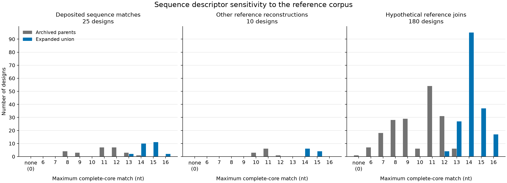

# Reference-corpus sensitivity figure

Reference-corpus sensitivity of the maximum contiguous exact match containing the complete six-nucleotide DNA core of each 16-nucleotide target (positions 6–11, one-based). Gray: 85 archived normal-parent transcript records; blue: their union with 670,670 GENCODE v50 annotated mature transcript records, including haplotypes. All 215 target designs are included: 25 deposited-sequence matches, 10 other reference reconstructions (5 coordinate-based and 5 construct-description-based), and 180 hypothetical joins. The 5 annotation-error control designs are excluded. The none (0) bin denotes no perfect complete-core match; it does not denote absence of complementarity. Horizontal units are nucleotides; vertical units are design counts, with a common scale. Each design contributes once to each corpus histogram; panels do not show paired trajectories. Longer matches occurred in 23/25, 10/10 and 179/180 designs, respectively. Designs overlap within junctions and are not independent patients. No error bars or confidence intervals are intended. These are sequence descriptors, not validated selectivity, cleavage, expression, accessibility, safety or efficacy measurements.

The SVG and PNG were generated by the committed `../build_aso_figure.py` from the hashed result in `../results/aso-transcriptome.json`. The TSV supplies every histogram count. Original generation manifest and subsequent visual inspection receipt are retained separately.
