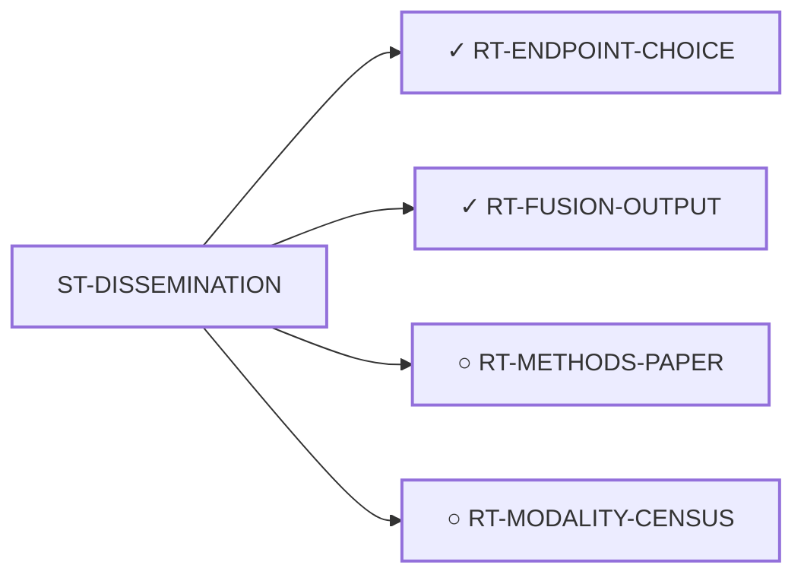

<!-- GENERATED FILE — DO NOT EDIT. Regenerate with:
     python3 systems/systems_check.py --write-views
     Source of truth: systems/graph/*.json -->

# ST-DISSEMINATION — Methods and publication as an outcome in itself

**Thesis.** A computation-only program with no wet lab advances a disease in exactly two ways: by producing a result someone else tests, or by producing methodology and negative results that stop others repeating the same failures. The second is a real contribution and is available now.

**Portfolio role:** `dissemination` · **state:** ○ ready · scoped · confidence high

> The only family with no scientific blocker at all. It is finished when the writing stops, and it is the portfolio's floor: the outcome that holds even if every other family fails.

## What this family may NOT be used to claim

- A methods paper documents what was done and what failed. It makes no claim about whether any route would work.
- The failure record's value depends on it being complete and honest, including the results that went against the program's own thesis.

## Is this family blocked as a unit, or route by route?

**Reading it.** ⭐ **No blocker points at the family node**, and that is the finding: the routes here are *not* held down by one shared thing. They are blocked individually, for different reasons — so retiring any one blocker frees some routes and not others, and there is no single unlock for the family.

*What this family RETIRES for the portfolio is listed below rather than drawn — it is a property of the family, not an edge between these nodes.*

## Routes

| route | state | maturity | readiness today | ends in | next action |
|---|---|---|---|---|---|
| **[RT-ENDPOINT-CHOICE](L2-rt-endpoint-choice.md)** Reframe the endpoint systemic-therapy trials are judged on | ✓ ready | computed | `journal_submission` | [PUB-ENDPOINT](L3-publications.md) ◐ *primary* | Review the manuscript for external posting to medRxiv. Nothing else in the route is unrun. |
| **[RT-FUSION-OUTPUT](L2-rt-fusion-output.md)** The fusion's transcriptional output, read in EMC tissue | ✓ active | validated_in_silico | `journal_submission` | [PUB-FUSION-OUTPUT](L3-publications.md) ◐ *primary* | Submit. The free in-silico work on this route is done: catalogue, null calibration, instrument controls, three |
| **[RT-METHODS-PAPER](L2-rt-methods-paper.md)** The honest methods paper on the degrader program's own failure record | ○ ready | scoped | `journal_submission` | [PUB-METHODS](L3-publications.md) ◐ *primary* | Write it — no scientific blocker. ⚠ But the FRAMING choice (P1 vs P6) is trimcrae's and is not settled here. |
| **[RT-MODALITY-CENSUS](L2-rt-modality-census.md)** The modality census as a publication | ○ ready | concept | `preprint` | [PUB-MODALITY-CENSUS](L3-publications.md) ◐ *primary* | Close the three open publish_bar clauses for PUB-MODALITY-CENSUS, in this order: a hardening round (hardening_ |
## What this family buys the portfolio — blockers it RETIRES

- **BLK-NO-WET-LAB** (`requires_external_collaboration`) — No wet lab and no collaborator — an ask needs a self-interested taker before its size matters

## Best next action

Nothing blocks it. Write it.

*Cost:* $0

[← L0](L0-ecosystem.md)
