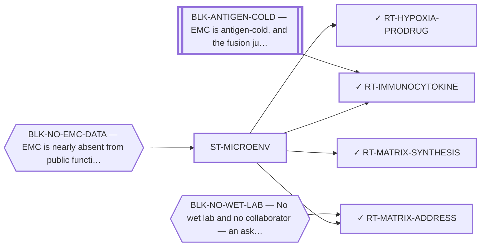

<!-- GENERATED FILE — DO NOT EDIT. Regenerate with:
     python3 systems/systems_check.py --write-views
     Source of truth: systems/graph/*.json -->

# ST-MICROENV — The tumour microenvironment and matrix as the target

**Thesis.** The matrix is this disease's defining phenotype and the portfolio's prose has treated it almost entirely as an obstacle to delivery. It is also a manufactured product with a biosynthetic pathway, an extracellular compartment with its own epitopes, and the cause of a hypoxic niche — three different handles, none of which requires the fusion protein to be druggable at all.

**Portfolio role:** `hedge` · **state:** ○ ready · concept · confidence low

> Minted 2026-08-09 from the modality census. The 2026-08-07 sweep named this as one of four categories structurally invisible to every prior search here -- not rejected, never queried -- and a category nothing could be filed under is a category that stays invisible.

## What this family may NOT be used to claim

- The screen this repository uses to nominate surface addresses ranks tumour-cell monoculture transcripts, so it has no stromal compartment in it and cannot see glycans — its silence about a matrix target is an absent reading rather than a reading of absence.
- Nothing in this family discriminates the tumour from normal tissue by the fusion, so every route here depends entirely on the matrix itself being tumour-restricted enough, and no route here has shown that.
- The matrix has never been measured in this disease as a therapeutic compartment — only described histologically — so every route in this family rests on inference from phenotype rather than on a measurement.
- Nothing in this family asserts efficacy, safety, a therapeutic window or clinical readiness.

## Is this family blocked as a unit, or route by route?

**Reading it.** 1 blocker point at the FAMILY node: every route here inherits it, so the family stands or falls as a unit on that. The rest point at individual routes.

*What this family RETIRES for the portfolio is listed below rather than drawn — it is a property of the family, not an edge between these nodes.*

## Routes

| route | state | maturity | readiness today | ends in | next action |
|---|---|---|---|---|---|
| **[RT-HYPOXIA-PRODRUG](L2-rt-hypoxia-prodrug.md)** Hypoxia-activated prodrugs | ✓ parked | computed | `internal_note` | [PUB-MATRIX-ADDRESS](L3-publications.md) ◔ *contributing* | Leave it to the hypoxia memo, which owns the reading and the ruling. |
| **[RT-IMMUNOCYTOKINE](L2-rt-immunocytokine.md)** Matrix-targeted immunocytokines | ✓ blocked | computed | `internal_note` | [PUB-MATRIX-ADDRESS](L3-publications.md) ◔ *contributing* | Establish whether the fourth public cohort's data type can resolve fibronectin and tenascin isoforms at all. ⛔ |
| **[RT-MATRIX-ADDRESS](L2-rt-matrix-address.md)** Oncofetal chondroitin sulfate as a tumour address | ✓ blocked | computed | `internal_note` | [PUB-MATRIX-ADDRESS](L3-publications.md) ◔ *contributing* | Report it in the matrix paper as a route whose capacity proxy is unfavourable and whose premise is unreachable |
| **[RT-MATRIX-SYNTHESIS](L2-rt-matrix-synthesis.md)** Inhibition of the tumour's glycosaminoglycan biosynthesis | ✓ parked | computed | `internal_note` | [PUB-MATRIX-ADDRESS](L3-publications.md) ◔ *contributing* | Report the contradiction as the result. ⛔ AND THE OTHER HALF OF THIS SENTENCE IS NOT TAKEABLE — checked 2026-0 |

## Family-level bets — blockers EVERY route here inherits

If one of these is never retired, the whole family is dead. That is a different risk from any
single route failing, and it is only visible at this level.

- **BLK-NO-EMC-DATA** (`insufficient_data`) — EMC is nearly absent from public functional-genomics data (one DepMap line, n = 1, no CRISPR data)

## Best next action

Grade the glycosaminoglycan and sulfate-donor expression read that is already committed here and has never been read for this purpose.

*Cost:* $0

[← L0](L0-ecosystem.md)
