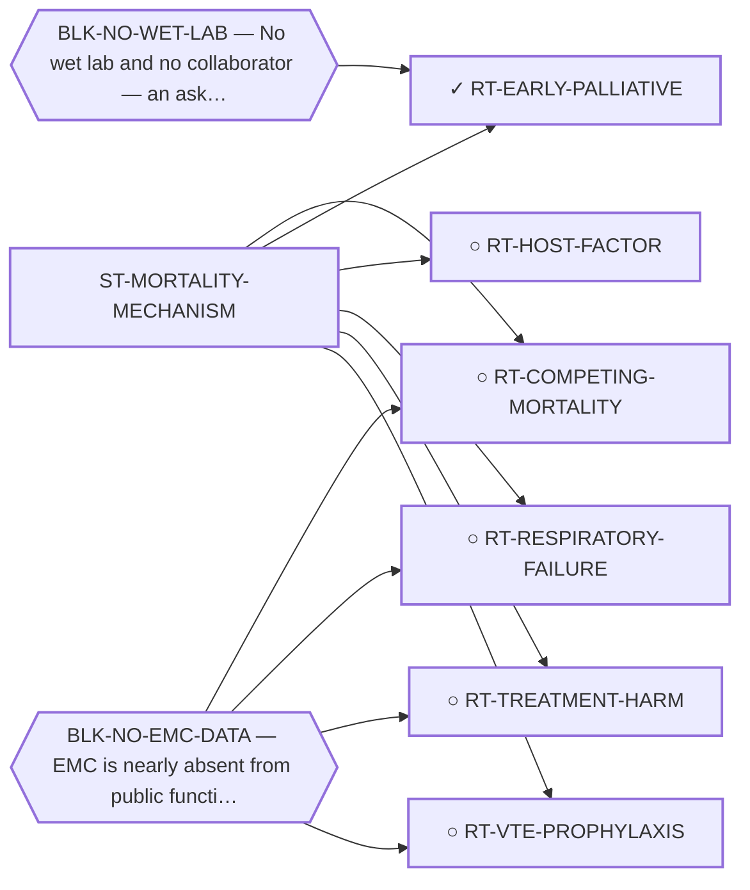

<!-- GENERATED FILE — DO NOT EDIT. Regenerate with:
     python3 systems/systems_check.py --write-views
     Source of truth: systems/graph/*.json -->

# ST-MORTALITY-MECHANISM — Mortality-mechanism-directed and supportive care

**Thesis.** Every other family here tries to stop the tumour from killing the patient. This one starts from the death certificate instead of the driver, and asks which mechanisms actually appear on it. For a disease measured in decades that reordering is not rhetorical: a therapy preventing every EMC death would raise ten-year overall survival by a bounded number of percentage points, and the deaths outside that bound are the ones nothing on this board is pointed at. The bet is that some of them are addressable by medicine that already exists and needs no discovery.

**Portfolio role:** `cheap_option` · **state:** ◐ active · computed · confidence low

> Registered 2026-08-09 on trimcrae's question. ⛔ ITS ABSENCE UNTIL NOW WAS STRUCTURAL, NOT A JUDGEMENT. The modality census grades every class on antitumour activity, so a supportive indication cannot score at all: MOD-ANTICOAGULANT is recorded `not_applicable` because it is "a supportive-care indication addressing thrombotic risk, with no antitumour claim to assess", and MOD-GLUCOCORTICOID is `excluded` as "supportive ... rather than as antitumour therapy". Both readings are correct on the census's own axis and neither is a finding about this disease. That is exactly the considered-and-dismissed versus never-pointed-at distinction the census exists to make, failing on the one question its grading criterion cannot express.

## What this family may NOT be used to claim

- The competing-mortality figure is arithmetic on published summary percentages from heterogeneous studies, not a competing-risks model, and most pairings cross populations.
- Every supportive-care effect size available to this family was measured in some other cancer; no EMC-specific supportive-care outcome data exists at all.
- Nothing in this family asserts efficacy, safety, a therapeutic window or clinical readiness, and a mechanism being common is not evidence that treating it changes survival.

## Is this family blocked as a unit, or route by route?

**Reading it.** ⭐ **No blocker points at the family node**, and that is the finding: the routes here are *not* held down by one shared thing. They are blocked individually, for different reasons — so retiring any one blocker frees some routes and not others, and there is no single unlock for the family.

*What this family RETIRES for the portfolio is listed below rather than drawn — it is a property of the family, not an edge between these nodes.*

## Routes

| route | state | maturity | readiness today | ends in | next action |
|---|---|---|---|---|---|
| **[RT-COMPETING-MORTALITY](L2-rt-competing-mortality.md)** Competing (non-EMC) mortality in a decade-scale cohort | ○ ready | computed | `preprint` | [PUB-MORTALITY-MECHANISM](L3-publications.md) ◐ *contributing* | CORRECTED 2026-09-03: this field was stale, carried over from before the branch that registered this route clo |
| **[RT-EARLY-PALLIATIVE](L2-rt-early-palliative.md)** Early specialist palliative care and structured symptom monitoring | ✓ blocked | scoped | `internal_note` | [PUB-MORTALITY-MECHANISM](L3-publications.md) ◐ *contributing* | WRITTEN 2026-09-04 (AUT-219): PUB-MORTALITY-MECHANISM §4.3 now states the class-level finding (three replicati |
| **[RT-HOST-FACTOR](L2-rt-host-factor.md)** Treating modifiable host conditions as de-facto EMC survival therapy | ○ ready | scoped | `internal_note` | [PUB-MORTALITY-MECHANISM](L3-publications.md) ◐ *contributing* | MODELLED 2026-09-04 (AUT-220): research/manuscripts/emc-host-factor-inputs.json carries four factors (obesity, |
| **[RT-RESPIRATORY-FAILURE](L2-rt-respiratory-failure.md)** Progressive pulmonary metastatic burden and respiratory failure | ○ ready | concept | `internal_note` | [PUB-MORTALITY-MECHANISM](L3-publications.md) ◐ *contributing* | Classify the retrieved death-cue sentences by mechanism and report the unstated fraction honestly. |
| **[RT-TREATMENT-HARM](L2-rt-treatment-harm.md)** De-escalating cytotoxic therapy that has no measured EMC response | ○ ready | concept | `internal_note` | [PUB-MORTALITY-MECHANISM](L3-publications.md) ◐ *contributing* | CORRECTED 2026-09-03: the count against the terminal-event corpus is DONE (see readiness.why_not_higher) and f |
| **[RT-VTE-PROPHYLAXIS](L2-rt-vte-prophylaxis.md)** Venous thromboembolism in a lung-metastatic sarcoma population | ○ ready | concept | `internal_note` | [PUB-MORTALITY-MECHANISM](L3-publications.md) ◐ *contributing* | CORRECTED 2026-09-04: both feasible-today required_validation items are DONE (see supporting_evidence) -- zero |
## Best next action

Read the retrieved terminal-event corpus and classify each quoted sentence, so the mechanism breakdown rests on sources a reader can check rather than on a plausible story about an indolent tumour.

*Cost:* $0

[← L0](L0-ecosystem.md)
