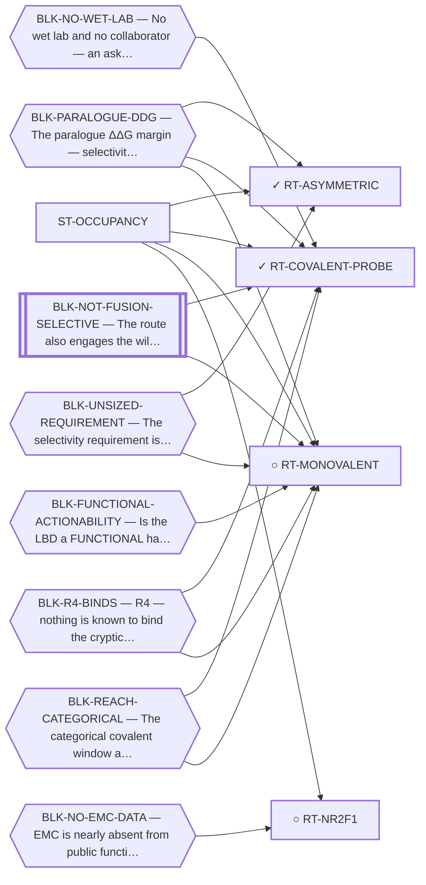

<!-- GENERATED FILE — DO NOT EDIT. Regenerate with:
     python3 systems/systems_check.py --write-views
     Source of truth: systems/graph/*.json -->

# ST-OCCUPANCY — Direct small-molecule engagement of the NR4A3 ligand-binding domain

**Thesis.** If the ligand-binding domain is a functional handle in the chimera, then occupying it is enough, and the entire ternary-assembly problem disappears. The bet is on the pocket being actionable rather than merely bindable.

**Portfolio role:** `hedge` · **state:** ○ blocked · scoped · confidence low

> The hedge against the proximity family: it retires the ternary-geometry blocker outright. What it cannot retire is the requirement that something binds the pocket, and it adds one the proximity family does not have — that occupancy alone does something.

## What this family may NOT be used to claim

- Whether the ligand-binding domain is a functional handle in the fusion — whose other end is a strong independent activator — has never been tested by anyone.
- Nobody has stated how much paralogue selectivity this family would need, so 'the requirement is smaller here' is not a claim this repository can make.
- The covalent sub-form's negative result rests on an exposure criterion that fails its own positive control, so it is a rank and not a verdict.

## Is this family blocked as a unit, or route by route?

**Reading it.** ⭐ **No blocker points at the family node**, and that is the finding: the routes here are *not* held down by one shared thing. They are blocked individually, for different reasons — so retiring any one blocker frees some routes and not others, and there is no single unlock for the family.

*What this family RETIRES for the portfolio is listed below rather than drawn — it is a property of the family, not an edge between these nodes.*

## Routes

| route | state | maturity | readiness today | ends in | next action |
|---|---|---|---|---|---|
| **[RT-ASYMMETRIC](L2-rt-asymmetric.md)** Asymmetric selectivity — NR4A1-sparing mandatory, NR4A2-sparing best-effort | ✓ ready | computed | `reproducible_workflow` | [PUB-DEGRADER](L3-publications.md) ◐ *contributing* | BUILD THE DETECTOR. The corpus-wide sweep was done by hand on 2026-08-07: 1,354 paralogue-pair mentions triage |
| **[RT-COVALENT-PROBE](L2-rt-covalent-probe.md)** Covalent probe at C397 — as a REAGENT, not a drug | ✓ blocked | computed | `internal_note` | [PUB-DEGRADER](L3-publications.md) ◐ *contributing* | DONE 2026-09-02 (S56) and it did not clear the axis. The criterion is built (`nr4a3_monovalent_reach.reactivit |
| **[RT-MONOVALENT](L2-rt-monovalent.md)** Monovalent LBD pocket modulation — a molecule that only OCCUPIES the NR4A3 LBD | ○ blocked | computed | `internal_note` | [PUB-MONOVALENT](L3-publications.md) ◐ *primary* | Trace whether the covalent sub-form's negative actually inherits the defective exposure criterion C7. ⚠ RE-TES |
| **[RT-NR2F1](L2-rt-nr2f1.md)** Orphan nuclear-receptor agonism against dormancy escape | ○ blocked | scoped | `internal_note` | [PUB-NR-OUTSIDE-NR4A3](L3-publications.md) ◔ *primary* | Check whether the fourth public cohort carries the receptor at all. |
## What this family buys the portfolio — blockers it RETIRES

- **BLK-FUNCTIONAL-ACTIONABILITY** (`requires_wet_lab`) — Is the LBD a FUNCTIONAL handle in the chimera, whose other end is a strong independent activator?
- **BLK-INDUCED-COMPLEX** (`requires_better_structure_prediction`) — An induced ternary/bivalent complex is still required (a second protein must be placed)
- **BLK-TERNARY-GEOMETRY** (`requires_better_structure_prediction`) — Ternary geometry — assembly, E3, exit vector, ubiquitin transfer

## Best next action

State the selectivity requirement this family would actually have to meet — it is currently unsized, and an unsized requirement cannot be shown to be met or missed.

*Cost:* $0

[← L0](L0-ecosystem.md)
