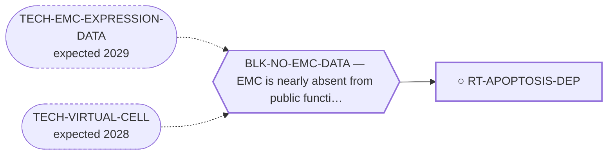

<!-- GENERATED FILE — DO NOT EDIT. Regenerate with:
     python3 systems/systems_check.py --write-views
     Source of truth: systems/graph/*.json -->

# RT-APOPTOSIS-DEP — Anti-apoptotic dependency beyond BCL-2 (MCL-1, BCL-xL)

**Family:** [ST-DEPENDENCY](L1-st-dependency.md) · **state:** ○ ready · computed · confidence moderate · verified 2026-08-09

**Grade** (owned by [`research/modalities/census-route-expression-grading.json`](../../research/modalities/census-route-expression-grading.json)): ◐ SPLIT, AND THE TWO AXES DISAGREE (2026-08-09). Abundance: all five druggable guardians read LOWER in EMC on both platforms. Dependency: across the 91 screened sarcoma lines MCL1 and BCL2L1 are dependencies in 83.5% and 75.8% ⛔ DENOMINATOR CORRECTED 2026-08-27: this grade said 176 sarcoma lines. 176 is the number of sarcoma MODELS in DepMap 24Q4; only 91 of them carry CRISPR gene-effect data, and every fraction here is computed over those 91. The repository caught this identical error in the MTAP/PRMT5 manuscript on 2026-08-09/10 -- the day after this grade was written -- and the correction never reached the graph. while BCL2 is in 2.2%. In this tumour class the guardian is not BCL-2 — which is what the route hypothesised, and what would explain this repository's own EMC result where BCL-2 inhibition was inactive alone and active only in combination.

## What has to land for this route to move

**Reading it.** A solid arrow is what holds this route down today. A dashed arrow is a capability that WOULD retire a blocker — dashed because it has not landed, and the date beside it is a forecast, not a schedule.

## Scientific rationale

This follows directly from a result the repository already holds and never pursued: BCL-2 inhibition was inactive alone and active only in combination in patient-derived models here. That pattern is the signature of dependence on a different member of the same family, and nobody has asked which one.

## Supporting evidence

| ref | supports | strength |
|---|---|---|
| `ART-CENSUS-ROUTE-GRADING` | MCL1 and BCL2L1 are dependencies in most sarcoma lines while BCL2 is in almost none, which is the pattern the route predicted and is the axis abundance cannot measure | `class_inherited` |

## Remaining unknowns

- Which guardian holds the effectors in EMC specifically — no EMC line appears in the dependency panel, so the pattern is a class transfer and not an EMC observation.
- Why guardian ABUNDANCE is lower in EMC than in comparator sarcomas while the class-level DEPENDENCY runs the other way; the two readings are not reconciled here.
- Whether a primed state — low guardians with elevated NOXA — explains the combination-only result better than a co-dependency does.

## Required validation

| what | instrument | feasible today | blocked by |
|---|---|---|---|
| BH3 profiling, or an MCL-1/BCL-xL inhibitor arm, in the two published patient-derived EMC models — the same models that produced the combination-only result | ⛔ none built | **no** | BLK-NO-WET-LAB |

## Blockers

| blocker | kind | what would retire it |
|---|---|---|
| **BLK-NO-EMC-DATA** | `insufficient_data` | `TECH-EMC-EXPRESSION-DATA`, `TECH-VIRTUAL-CELL` |

## Readiness — what this could become today

**`internal_note`**

Two readings that disagree is a reason to run an experiment, not a result.

**Missing:**
- a dependency or BH3-profiling readout in an EMC model — abundance cannot answer this and the class prior contains no EMC line

## Where this route ends — the paper

**[PUB-BIOMARKER-DEP](L3-publications.md)** — [Biomarker-selected therapeutic classes in an ultra-rare sarcoma — what the available expression data excludes](../../research/manuscripts/dependency/emc-biomarker-selected-classes.md)

`contributing` · ◐ `drafted` · aimed at `preprint`

**This route contributes:** One of six biomarker-selected classes whose selecting feature is readable in expression data already public for this disease, and whose most useful output is exclusion.

**The paper would claim:** Five therapeutic classes are selected by a molecular state rather than by a histology, every selecting feature is readable in expression data already public for this disease, and the useful output is which classes the data rules OUT rather than which it nominates. Four selecting features are absent; the fifth class survives because the instrument cannot reach its question rather than because the data was favourable. The four negatives are deliberately NOT reported as equally strong.

## Strategic timing — the wait equation

**Recommendation: `pursue_now`**

The class prior now points the same way as this repository's own unexplained EMC result, and the experiment that would settle it is an arm on a screen that has already been run once on those models.

| horizon | effect |
|---|---|
| Cost trend | flat |

## Claim ceiling — what this route may NOT be used to claim

*Inherited from [ST-DEPENDENCY](L1-st-dependency.md), which is where these are asserted — a family limitation binds every route inside it.*

- The dependency transfer prior came back negative on the available data — a measured premise, revivable only by EMC-specific data.
- One route rests on class inheritance: no NR4A3 fusion has been tested for the phenotype it assumes.
- There is one EMC model in public dependency data, with no CRISPR data, so this family's in-silico half is bounded by a sample size of one.

## Best next action

Put an MCL-1/BCL-xL arm in front of the group holding the two EMC models, alongside the PRMT5 ask.

*Cost:* $0

[← ST-DEPENDENCY](L1-st-dependency.md) · [← L0](L0-ecosystem.md)
