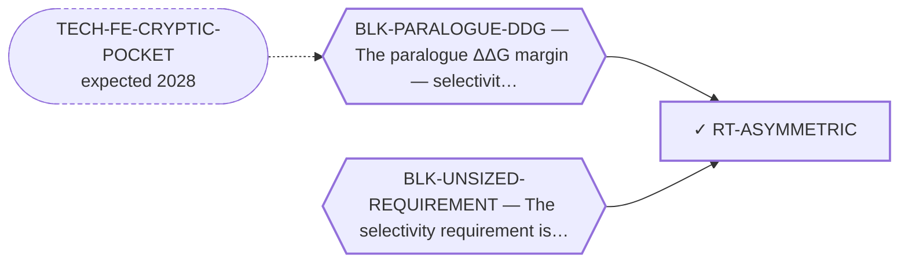

<!-- GENERATED FILE — DO NOT EDIT. Regenerate with:
     python3 systems/systems_check.py --write-views
     Source of truth: systems/graph/*.json -->

# RT-ASYMMETRIC — Asymmetric selectivity — NR4A1-sparing mandatory, NR4A2-sparing best-effort

**Family:** [ST-OCCUPANCY](L1-st-occupancy.md) · **state:** ✓ ready · computed · confidence high · verified 2026-08-06

**Grade** (owned by [`research/manuscripts/program/target-route-options.md`](../../research/manuscripts/program/target-route-options.md#route-1--asymmetric-selectivity-nr4a1-sparing-mandatory-nr4a2-sparing-best-effort--pk)): ★★ adopt now — free, and it changes the design brief

## What has to land for this route to move

**Reading it.** A solid arrow is what holds this route down today. A dashed arrow is a capability that WOULD retire a blocker — dashed because it has not landed, and the date beside it is a forecast, not a schedule.

⚠ **1 blocker here has no technology named at all** (`BLK-UNSIZED-REQUIREMENT`) — not *waiting*, **unaddressed**. A blocker with no named way out is the most expensive kind, because nothing is being watched for it.

## Scientific rationale

Sparing NR4A1 and sparing NR4A2 have been treated as one symmetric requirement, and they are not — but the asymmetry is NOT that one of them is unbounded. Both constraints are MOLECULAR. NR4A1 has a named anti-target genotype; NR4A2 is bounded too (MGI complete-penetrance neonatal lethality, PMID 9092472/9608532), and across 51 HPA tissues it co-expresses with NR4A3 in 47, is dominant in 0 and unbuffered in 0 — so tissue distribution cannot separate target from anti-target and the residual cannot be carried as an exposure question. What survives is a difference in KIND: NR4A1's bound comes from a combination genotype, NR4A2's from complete developmental loss. ⚠ A germline knockout bounds DEVELOPMENTAL, COMPLETE, LIFELONG loss; a degrader is ADULT, TRANSIENT and INCOMPLETE, so a KO phenotype sets the ceiling of concern and never the expected effect of a molecule.

## Remaining unknowns

- How much ADULT, transient, incomplete NR4A2 loss is acceptable — the germline bound does not speak to that regime, and no source read bounds it.
- Whether the exposure half can be reopened at all: it would need single-cell or region-resolved expression, because bulk tissue averages dilute a small nucleus and the dopaminergic liability lives in one.
- Whether NR4A1-sparing is achievable by any mechanism this program has built — the covalent direction cannot invert, and the steric inverse fires at 0.96x its own null against the forward direction's 5.34x.
- Whether the asymmetry has been given a CHECKABLE form rather than only a stated one. ⭐ Partly, 2026-08-07: REQ-ASYM-1/2/3 (selectivity-requirement-sizing.md §4) state that the specification is an ordered pair, that its halves take different KINDS of bound, and that any scalar t errs in one of two named directions unless t1 = t2 — checkable the moment either half acquires a number. ⛔ Neither half has one: both bounds are genotypes, and a genotype bounds developmental, complete, lifelong loss and cannot be inverted into an adult tolerated occupancy (MISSING-2, MISSING-4).

## Required validation

| what | instrument | feasible today | blocked by |
|---|---|---|---|
| The asymmetry carried through every downstream selectivity statement rather than stated once | ⛔ none built | yes | — |

## Blockers

| blocker | kind | what would retire it |
|---|---|---|
| **BLK-PARALOGUE-DDG** | `requires_better_simulation_accuracy` | `TECH-FE-CRYPTIC-POCKET` |
| **BLK-UNSIZED-REQUIREMENT** | `requires_wet_lab` | Obtain the three dose-responses named as MISSING-1, MISSING-2 and MISSING-4 in selectivity-requirement-sizing.md. Until then the thresholds stay as stated forms with an explicit range and no upper bound. ⛔ NOT retired by any computation: a genotype bounds developmental, complete, lifelong loss and cannot be inverted into an adult tolerated occupancy, and no in-silico instrument produces an occupancy-to-output transfer function. |

## Readiness — what this could become today

**`reproducible_workflow`**

It is a reframing rather than a result. Its value is that it changes what the other routes are trying to achieve, and that belongs inside them rather than in a paper of its own.

## Where this route ends — the paper

**[PUB-DEGRADER](L3-publications.md)** — [In silico design of a paralogue-favoured ligand for a cryptic NR4A3 pocket](../../research/manuscripts/degrader/nr4a3-degrader-paper.md)

`contributing` · ◐ `drafted` · aimed at `journal_submission`

**This route contributes:** The reframing that separates the two paralogue-sparing requirements instead of treating them as one. Every selectivity statement in the paper is sized against it, so dropping it lets a symmetric restatement back in.

**The paper would claim:** A cryptic pocket on the NR4A3 ligand-binding domain can be found and a paralogue-favoured ligand designed into it by computation alone — and the selectivity margin that design would need is larger than the instruments used to predict it can currently resolve, which is reported as the result rather than worked around.

## Strategic timing — the wait equation

**Recommendation: `pursue_now`**

Free, already adopted, and it changes the design brief for every route in two families. There is no version of waiting that improves it.

| horizon | effect |
|---|---|
| Six months | None. |
| Two years | None. |
| Cost trend | flat |
| Automation outlook | It is a definitional decision, not computation. |

## Claim ceiling — what this route may NOT be used to claim

*Inherited from [ST-OCCUPANCY](L1-st-occupancy.md), which is where these are asserted — a family limitation binds every route inside it.*

- Whether the ligand-binding domain is a functional handle in the fusion — whose other end is a strong independent activator — has never been tested by anyone.
- Nobody has stated how much paralogue selectivity this family would need, so 'the requirement is smaller here' is not a claim this repository can make.
- The covalent sub-form's negative result rests on an exposure criterion that fails its own positive control, so it is a rank and not a verdict.

## Best next action

BUILD THE DETECTOR. The corpus-wide sweep was done by hand on 2026-08-07: 1,354 paralogue-pair mentions triaged, 16 symmetric statements of the REQUIREMENT / BRIEF / DESIGN TARGET rewritten to carry the asymmetry (requirement R7 and its graph record, RT-DEGRADER purpose, the degrader design spec, the treatment roadmap, the selectivity architecture, the paper heading and SI safety note, three companion fusion papers, the indication stack, the outreach template and two module docstrings), each retaining its superseded text inline. Symmetric MEASUREMENTS were left alone and are correct. ⛔ THE VALIDATION STAYS OPEN BECAUSE A HAND SWEEP DECAYS: nothing mechanical detects the next symmetric restatement, so the next $0 step is a narrow checker for the retired design-target phrasings ('NR4A1/2-sparing', 'spare/sparing NR4A1 and NR4A2', 'selective over NR4A1/NR4A2' used as a bar rather than a measurement) that exempts superseded-retained quotations. Two corrections the sweep also forced, both in the SOFT half and both pointing at §2.4: the NR4A2 bound is no longer 'unbounded in both directions' (MGI, 2026-08-03) and the PK/CNS-exclusion lever is closed (HPA 47/51 co-expression), so three documents that still sourced NR4A2 safety from exposure were corrected. Nothing here raises any selectivity claim: every paralogue-selectivity statement in the repository remains an unvalidated prediction.

*Cost:* $0

## What this route rests on — drill down

*L4 instruments and L5 objects, evidence and artifacts. Every row here is asserted by this route; the [evidence base](L5-evidence-base.md) shows the same edges from the other end.*

**L5 objects:** [OBJ-NR4A1-WT](L5-evidence-base.md#objects--the-biological-and-molecular-entities-the-program-reasons-about), [OBJ-NR4A2-WT](L5-evidence-base.md#objects--the-biological-and-molecular-entities-the-program-reasons-about), [OBJ-NR4A3-WT](L5-evidence-base.md#objects--the-biological-and-molecular-entities-the-program-reasons-about)

**L5 artifacts:** [ART-TARGET-ROUTE-CENSUS](L5-evidence-base.md#artifacts--the-files-a-claim-can-be-checked-against)

[← ST-OCCUPANCY](L1-st-occupancy.md) · [← L0](L0-ecosystem.md)
