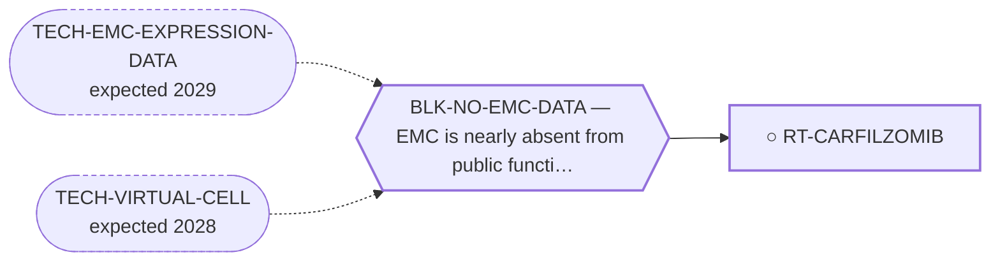

<!-- GENERATED FILE — DO NOT EDIT. Regenerate with:
     python3 systems/systems_check.py --write-views
     Source of truth: systems/graph/*.json -->

# RT-CARFILZOMIB — Carfilzomib ± anthracycline (± venetoclax)

**Family:** [ST-REPURPOSING](L1-st-repurposing.md) · **state:** ○ blocked · concept · confidence low · verified 2026-08-28

**Grade** (owned by [`research/manuscripts/repurposing/repurposing-hypotheses.md`](../../research/manuscripts/repurposing/repurposing-hypotheses.md)): ◐ THE OBSERVATION STANDS AND BOTH IN-SILICO RATIONALES FOR IT FAILED (regraded 2026-08-09, first time this route's axis has ever been read). ⭐ WHAT IS UNCHANGED AND IS STILL THIS PORTFOLIO'S BEST EVIDENCE: carfilzomib, with venetoclax, was active across two PATIENT-DERIVED EMC models. It is the only agent in this programme measured on cells that carry this disease, and nothing below touches that. ⛔ DEPENDENCY SAYS THERE IS NOTHING TO SELECT ON. Across the 91 screened sarcoma lines PSMB1, PSMC1, PSMD1 and VCP are dependencies in 100%, and carfilzomib's own target PSMB5 in 97.8%, with selectivity against the rest of DepMap between -0.10 and +0.17. A target required in every line of the class and equally required outside it cannot be the basis of a selective argument. SQSTM1 at 0% and NFE2L1 at 7.7% are the internal control and behave. ⛔ AND THE PROTEOSTATIC-LOAD EXPLANATION IS NOT SUPPORTED. Read 18 was built to test whether this myxoid, matrix-secreting tumour carries the folding and disposal burden that would make degradative capacity limiting, with the grading rule written and committed BEFORE the fetch returned. On the 35-tumour platform the rule fired on the unfolded-protein response (+2.11) while the secretory/matrix-load proxy - the module carrying the actual argument - was FLAT at -0.20; on the 16-tumour platform everything was null. ⚠ IT STAYS OPEN because the ex-vivo result is a measurement in the right cells and outranks two failed in-silico rationales for it; what has collapsed is the case for SELECTIVITY, not the observation. Confidence drops from moderate to low. Superseded, retained: 'NEAR-TERM LEAD - best ex-vivo EMC evidence', which was graded 2026-08-05 before any of this was measured. ⭐ RE-GRADED 2026-08-28 ON THE LOOKUP THIS ROW SAID WAS UNNECESSARY, AND IT IS THE FIRST HUMAN READ THIS ROUTE HAS EVER CARRIED. A $0 PubMed query returned two clinical records this repository had never held; neither is EMC, and both are about the DRUG CLASS in the PARENT HISTOLOGY, which is the query every EMC-scoped screen here was structurally unable to run (root cause and the discriminating observation: research/literature/carfilzomib-class-clinical-2026-08-28.json). ⛔ (1) THE CLASS HAS ALREADY FAILED A TRIAL IN THIS TUMOUR FAMILY. EV-MAKI-2005 is a multicentre study of the reversible proteasome inhibitor bortezomib in recurrent or metastatic sarcoma; its soft-tissue arm recorded one confirmed partial response among 21 evaluable patients and was closed after the first stage of accrual, and its own stated conclusion is that bortezomib has minimal activity in soft tissue sarcoma AS A SINGLE AGENT and that any further sarcoma study should be in combination with agents showing demonstrated preclinical synergy. ⚠ READ ITS SCOPE BEFORE SPENDING IT: bortezomib is not carfilzomib, and it is not EMC data. ⛔ AND DO NOT SOFTEN IT WITH 'BUT OURS IS A COMBINATION' — that is the friendly reading rather than the accurate one. The Bangerter result carries SINGLE-AGENT carfilzomib sensitivity in BOTH models, in triplicate six-point dose-response, as well as combination additivity and synergy, so the monotherapy framing this trial closed is one half of what this route rests on. Whether any EMC patient was enrolled in that soft-tissue arm is UNREAD — its PubMed record carries no PMCID, so no PubMed Central full text was reachable and only the abstract was retrieved. ◐ (2) A carfilzomib COMBINATION has since been dose-escalated in solid tumours. EV-BOKLAN-2025 reached no maximum tolerated dose in its solid-tumour stratum of 24 patients and carries a recommended phase 2 dose, and its abstract's closing words are "Patients with sarcomas benefited most, warranting further evaluation". ⛔ THAT IS A DOSE-FINDING STUDY QUOTED AS ONE: no response rate, no comparator and no sarcoma denominator is reported, PubMed types the record `Journal Article` and nothing here asserts efficacy for any agent. Its partner drugs are cyclophosphamide and etoposide, not an anthracycline. ⛔ (3) A THIRD READING WAS ALREADY COMMITTED IN THIS REPOSITORY AND THIS ROUTE CITED NEITHER THE NUMBER NOR THE FILE: in the FET-line GDSC2 8.5 contrast in research/manuscripts/program/emc-post-degrader-options.md, bortezomib was carried across 57 FET-rearranged lines as a NULL CONTROL and behaved as one — general-sensitivity-corrected Δ +0.087 (t +0.88) — which is an independent modality, drug response rather than CRISPR dependency, saying what the DepMap read above already said. ★ NET, AND NOTHING MEASURED IS WITHDRAWN: the ex-vivo observation stands exactly as it did, none of this is EMC data, and BLK-NO-EMC-DATA is untouched. What changes is that the route's one remaining unknown — whether ex-vivo sensitivity transfers — now has a partial, class-level, human answer; it is negative for the monotherapy framing, which is one of the two framings the ex-vivo result supports; and the framing left standing is the COMBINATION one, which is also the only sarcoma path that trial's own authors recommended pursuing. Confidence stays low. ⛔ Superseded, retained: the route's next action read 'Treat as landscape context; the ex-vivo result is banked and needs no further lookup' — the lookup was taken and it returned two records older than the grade that dismissed it.

## What has to land for this route to move

**Reading it.** A solid arrow is what holds this route down today. A dashed arrow is a capability that WOULD retire a blocker — dashed because it has not landed, and the date beside it is a forecast, not a schedule.

✓ Already cleared by this route: `BLK-PARALOGUE-DDG`, `BLK-TERNARY-GEOMETRY`.

## Scientific rationale

This carries the best ex-vivo EMC drug-sensitivity evidence in the repository — an actual measurement on actual EMC material, which is rarer than anything else in this family. An approved agent with an ex-vivo signal is a strong near-term lead by the standards available for this disease.

## Supporting evidence

| ref | supports | strength |
|---|---|---|
| `EV-BANGERTER-2023` | ex-vivo drug sensitivity measured on EMC material: carfilzomib high sensitivity VALIDATED IN BOTH USZ20-EMC1 and USZ22-EMC2 (triplicate 6-point dose-response). ⚠ Scope: the 40-drug discovery panel ran on USZ20-EMC1 ALONE, and venetoclax showed NO monotherapy response — it enters only through combination additivity/synergy. | `direct` |

## Remaining unknowns

- Whether ex-vivo sensitivity transfers to clinical benefit, which it frequently does not. ⭐ PARTIALLY ANSWERED AT CLASS LEVEL ON 2026-08-28, AND THE ANSWER IS NEGATIVE FOR MONOTHERAPY: a multicentre study of bortezomib in recurrent or metastatic sarcoma closed after its first stage of accrual for inactivity (EV-MAKI-2005). It bounds this route rather than closing it, because it tested a DIFFERENT proteasome inhibitor. ⛔ It does NOT miss this route by having been monotherapy, and saying so would be the friendly reading: the ex-vivo result carries single-agent carfilzomib sensitivity in both models as well as combination effects, so the framing that trial closed is one this route rests on too.
- Whether any extraskeletal myxoid chondrosarcoma patient was enrolled in the soft-tissue arm of EV-MAKI-2005. UNREAD, not absent: the 2005 paper's PubMed record carries no PMCID, so no PubMed Central full text was reachable and only the abstract was retrieved — which names the histology of the single responder and of no other patient.
- Whether the carfilzomib backbone dosed in EV-BOKLAN-2025 — with cyclophosphamide and etoposide — is the one to pair with the doxorubicin combination the ex-vivo screen reports, or whether the anthracycline combination has never been dosed with carfilzomib in any tumour.

## Required validation

| what | instrument | feasible today | blocked by |
|---|---|---|---|
| A clinical series  ⭐ ADJUDICATED 2026-09-02 (AUT-PD-116, seat s31-emc-data-blocks, applying S41). STILL BLOCKED, WRONG BLOCKER. "A clinical series" is short of a clinical publication reporting EMC patients treated with this class — a property of the reachable literature, not of deposited functional-genomics data. ⛔ The route's ex-vivo evidence (EV-BANGERTER-2023, two patient-derived EMC models) and its ceiling — no in-vivo and no clinical data in EMC — are untouched. Per-entry justification: research/autonomy/sprint-2026-09-01/S41-BLOCKED-ROUTE-AUDIT.md and S41-proposed-routes-patch.json. The rule this applies has one home: research/modalities/emc-fourth-cohort-route-readout.json → "⭐ the_rule_this_adjudication_applies". | ⛔ none built | **no** | BLK-NO-CURATED-CLINICAL-DATA |

## Blockers

| blocker | kind | what would retire it |
|---|---|---|
| **BLK-NO-EMC-DATA** | `insufficient_data` | `TECH-EMC-EXPRESSION-DATA`, `TECH-VIRTUAL-CELL` |

## Blockers this route RETIRES

- **BLK-PARALOGUE-DDG** — The paralogue ΔΔG margin — selectivity that reduces to exp(−ΔΔG/RT)
- **BLK-TERNARY-GEOMETRY** — Ternary geometry — assembly, E3, exit vector, ubiquitin transfer

## Not to be confused with

| route | the axis it turns on | blockers the distinction turns on | why |
|---|---|---|---|
| [RT-TRABECTEDIN](L2-rt-trabectedin.md) | unbiased screen hit vs mechanism-fit argument | `BLK-NO-EMC-DATA` | carfilzomib is an empirical ex-vivo hit with NO fusion rationale; trabectedin is argued from mechanism fit and a clinical series. Same family, same status, same blocker, opposite kinds of support |

## Readiness — what this could become today

**`internal_note`**

The evidence is ex-vivo on n=2 patient-derived models with no in-vivo and no clinical data in EMC. That is the ceiling — not a citation gap; the primary identifier was resolved 2026-08-05 (PMID 36316541 / PMC9813045, integrity.json OC-4). ⭐ AND AS OF 2026-08-28 THE CEILING HAS A SECOND WALL: there is now a class-level clinical read in the parent histology (EV-MAKI-2005) and it is negative for proteasome-inhibitor monotherapy, so an internal note written off the ex-vivo result alone would be quoting the friendliest half of the record.

## Where this route ends — the paper

**[PUB-REPURPOSING](L3-publications.md)** — [Existing drugs not yet reported in extraskeletal myxoid chondrosarcoma: a graded candidate menu from three independent generation methods](../../research/manuscripts/repurposing/repurposing-hypotheses.md)

`primary` · ◐ `drafted` · aimed at `preprint`

**This route contributes:** The proteasome-inhibitor hypothesis and the ex-vivo EMC evidence behind it — the only ex-vivo EMC result in the portfolio, and currently the paper's weakest citation.

**The paper would claim:** Existing agents not yet reported in EMC can be mapped to EMC's molecular and microenvironmental axes by three independent methods, each candidate graded by an explicit evidence tier — a hypothesis-generating menu that asserts no efficacy for any agent it names.

## Strategic timing — the wait equation

**Recommendation: `monitor`**

⛔ CORRECTED 2026-08-28. This row was `ready` / `pursue_now` while its own next action said there was nothing to do, and `ready` means 'nothing blocks it' — which contradicts this route's own `blockers_inherited` and its own `required_validation`, both of which name BLK-NO-EMC-DATA. The status is now `blocked`, which is what the convention's vocabulary calls a route with an open BLK-*, and the recommendation is `monitor`, because everything that could still move this route is external: an EMC clinical series, a second ex-vivo EMC drug-response panel, or access to a patient-derived EMC model in which the combination could be replicated. Nothing in this program generates any of those. Superseded, retained: 'The ex-vivo result is committed and its citation resolved. What is missing is in-vivo or clinical evidence in EMC, which this program cannot generate.' — true, and it was attached to `pursue_now`, which offered the row as the top of the work queue for saying so.

| horizon | effect |
|---|---|
| Six months | ⛔ 'None' WAS THE OLD ANSWER AND THE 2026-08-28 LOOKUP REFUTED IT — not by finding something new, but by finding two records that were already there: one published in 2005 and one eleven months before the grade that dismissed further lookup. So the honest six-month delta is not zero, it is UNKNOWN and cheap to measure: the sarcoma-wide proteasome-inhibitor query costs $0 and had never been run. |
| Two years | A clinical series in EMC would change the route and none is foreseeable. A second ex-vivo EMC drug-response panel from any laboratory would change it more cheaply; as of 2026-08-28 the group that built USZ20-EMC1 and USZ22-EMC2 has published no re-test, and no second laboratory has published on either model. |
| Cost trend | flat |
| Automation outlook | ⚠ SUPERSEDED, RETAINED: 'The literature lookup is automatable and is already wired.' The lookup that was wired was EMC-SCOPED, and that scope is exactly why a 2005 trial of this drug class in this tumour family reached this repository twenty-one years late. What is automatable is the sarcoma-wide class query, and it is now written down in research/literature/carfilzomib-class-clinical-2026-08-28.json so the next session runs the query rather than the memory of it. |

**Revisit when:**
- **TECH-EMC-MODEL-ACCESS** — Access to a patient-derived EMC model through a collaborator, or through a solo-affordable cloud or robotic wet-lab service with E *(expected 2029, basis `speculative`)*

## Claim ceiling — what this route may NOT be used to claim

*Inherited from [ST-REPURPOSING](L1-st-repurposing.md), which is where these are asserted — a family limitation binds every route inside it.*

- EMC is nearly absent from public functional-genomics data, so mechanism fit is argued from class membership rather than measured in this disease.
- Several routes here rest on a direction of effect that has never been read in EMC tissue; an expression readout would settle them cheaply and does not exist.
- A repurposing hypothesis is a hypothesis. Nothing here asserts efficacy in EMC.

## Best next action

Re-run the CLASS-LEVEL query, not the EMC one. The 2026-08-09 prior-art screen was a novelty screen over EMC pairings and could not see either clinical record found on 2026-08-28; the query that found them — a proteasome inhibitor against the parent histology — is recorded verbatim in research/literature/carfilzomib-class-clinical-2026-08-28.json and costs $0 to repeat. Two named $0 items remain open and are listed in `remaining_unknowns`: the full text of EV-MAKI-2005 for its per-histology enrolment (no PMCID, so reaching it means the publisher and a runner fetch rather than a sandbox one), and the full text of PMC12428389 for any sarcoma subgroup denominator. ⛔ Nothing here needs another EMC-specific lookup and nothing here is in-silico work: both in-silico rationales for this route were pre-specified, run, and returned negative on 2026-08-09, and a third null control was already committed elsewhere. Superseded, retained: 'Treat as landscape context; the ex-vivo result is banked and needs no further lookup.'

*Cost:* $0

## What this route rests on — drill down

*L4 instruments and L5 objects, evidence and artifacts. Every row here is asserted by this route; the [evidence base](L5-evidence-base.md) shows the same edges from the other end.*

**L5 evidence:** [EV-BANGERTER-2023](L5-evidence-base.md#evidence--the-literature-this-program-cites), [EV-BOKLAN-2025](L5-evidence-base.md#evidence--the-literature-this-program-cites), [EV-MAKI-2005](L5-evidence-base.md#evidence--the-literature-this-program-cites)

[← ST-REPURPOSING](L1-st-repurposing.md) · [← L0](L0-ecosystem.md)
