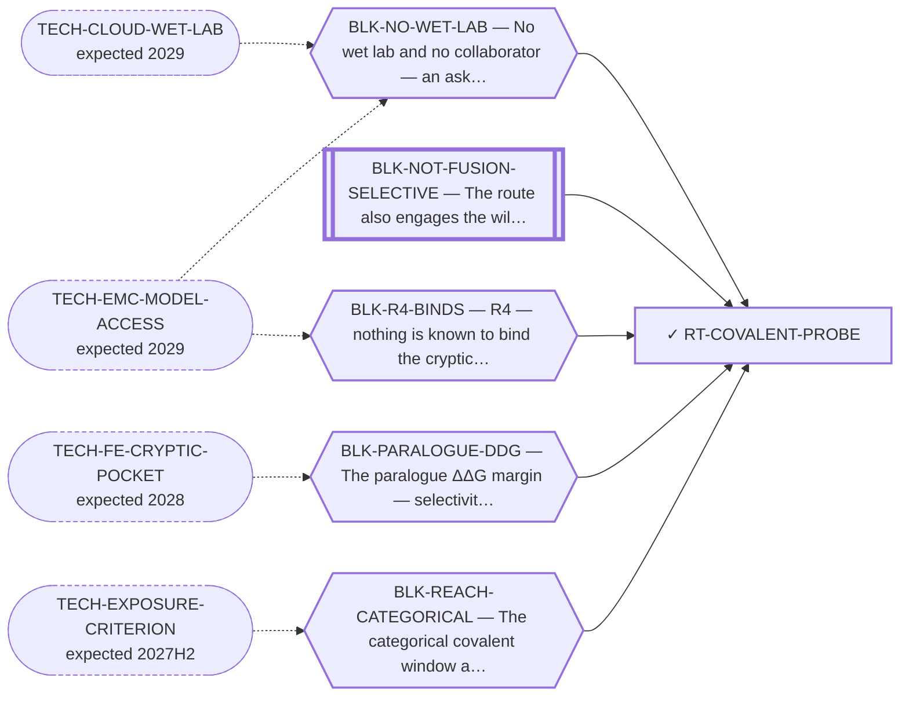

<!-- GENERATED FILE — DO NOT EDIT. Regenerate with:
     python3 systems/systems_check.py --write-views
     Source of truth: systems/graph/*.json -->

# RT-COVALENT-PROBE — Covalent probe at C397 — as a REAGENT, not a drug

**Family:** [ST-OCCUPANCY](L1-st-occupancy.md) · **state:** ✓ blocked · computed · confidence low · verified 2026-08-05

**Grade** (owned by [`research/manuscripts/program/emc-post-degrader-options.md`](../../research/manuscripts/program/emc-post-degrader-options.md#route-5--the-covalent-probe-at-c397-proposed-as-a-reagent---the-largest-single-demotion)): Tier 3 — the largest single demotion; D ≈ 0 and P is negative rather than merely absent

## What has to land for this route to move

**Reading it.** A solid arrow is what holds this route down today. A dashed arrow is a capability that WOULD retire a blocker — dashed because it has not landed, and the date beside it is a forecast, not a schedule.

⛔ **1 of these is permanent** (`BLK-NOT-FUSION-SELECTIVE`) — a fact about the biology, drawn double-walled, with no way out by definition. No technology arrives to fix it.

✓ Already cleared by this route: `BLK-FUNCTIONAL-ACTIONABILITY`, `BLK-TERNARY-GEOMETRY`.

## Scientific rationale

A cysteine present in NR4A3 and absent from both paralogues would give categorical rather than thermodynamic discrimination: the bond either forms or it does not. As a chemical probe rather than a therapeutic, it would let someone test whether ANYTHING BINDS the opened pocket — requirement R4, the program's one un-buyable requirement. It does NOT report function: an intact-mass adduct readout shows engagement, not that engagement does anything.

## Remaining unknowns

- Whether the target cysteine is actually engageable: the exposure criterion that says it is fails on the one family member with literature support.
- Measured 2026-09-02 (S56): it does not survive as a RESULT. Filtering competitors by a reactivity-weighted criterion takes the monovalent corridor board from 0/30 open to 16/30 — but a size-matched decoy null over all 680 three-competitor subsets has median 20 open, and 65.0% of random subsets of the same size open at least as many cells as the criterion's. The reopening is ATTRITION (17 competitors reduced to 3), not selection.

## Required validation

| what | instrument | feasible today | blocked by |
|---|---|---|---|
| An exposure or reactivity criterion that recovers the known covalent site | V17 | yes | BLK-REACH-CATEGORICAL |
| Chemical synthesis and a binding assay | ⛔ none built | **no** | BLK-NO-WET-LAB |

## Blockers

| blocker | kind | what would retire it |
|---|---|---|
| **BLK-NO-WET-LAB** | `requires_external_collaboration` | `TECH-CLOUD-WET-LAB`, `TECH-EMC-MODEL-ACCESS` |
| **BLK-NOT-FUSION-SELECTIVE** | `fundamental_biological_limit` | *permanent* |
| **BLK-PARALOGUE-DDG** | `requires_better_simulation_accuracy` | `TECH-FE-CRYPTIC-POCKET` |
| **BLK-R4-BINDS** | `requires_wet_lab` | `TECH-EMC-MODEL-ACCESS` |
| **BLK-REACH-CATEGORICAL** | `scientific_uncertainty` | `TECH-EXPOSURE-CRITERION` |

## Blockers this route RETIRES

- **BLK-TERNARY-GEOMETRY** — Ternary geometry — assembly, E3, exit vector, ubiquitin transfer
- **BLK-FUNCTIONAL-ACTIONABILITY** — Is the LBD a FUNCTIONAL handle in the chimera, whose other end is a strong independent activator?

## Not to be confused with

| route | the axis it turns on | blockers the distinction turns on | why |
|---|---|---|---|
| [RT-MONOVALENT](L2-rt-monovalent.md) | what the molecule has to DO once bound | `BLK-NO-WET-LAB`, `BLK-R4-BINDS` | ⭐ THE FAILURE-3 PAIR. A probe needs only to BIND, so it inherits neither functional actionability nor a selectivity window; a monovalent DRUG needs the pocket to be a functional handle in the chimera and needs a selectivity requirement nobody has sized. Their in-silico halves fail on OPPOSITE things, so one demotion cannot cover both |

## Readiness — what this could become today

**`internal_note`**

Its in-silico half is not publishable BECAUSE its exposure instrument fails its own positive control. That is a statement about the instrument, not about the cysteine.

**Missing:**
- a criterion that passes its positive control

## Where this route ends — the paper

**[PUB-DEGRADER](L3-publications.md)** — [In silico design of a paralogue-favoured ligand for a cryptic NR4A3 pocket](../../research/manuscripts/degrader/nr4a3-degrader-paper.md)

`contributing` · ◐ `drafted` · aimed at `journal_submission`

**This route contributes:** The NR4A3-unique cysteine and its reagent framing, together with the exposure instrument's failure against its own positive control — which is what stops the cysteine being reported as a selectivity result.

**The paper would claim:** A cryptic pocket on the NR4A3 ligand-binding domain can be found and a paralogue-favoured ligand designed into it by computation alone — and the selectivity margin that design would need is larger than the instruments used to predict it can currently resolve, which is reported as the result rather than worked around.

## Strategic timing — the wait equation

**Recommendation: `pursue_now`**

The blocking criterion is small enough to BUILD rather than wait for — a reactivity-weighted accessibility criterion calibrated against the existing positive control is bounded work. Waiting for the field to publish one defers a repair this program could make itself.

| horizon | effect |
|---|---|
| Six months | None if we wait; potentially decisive if we build. |
| Two years | Chemoproteomics datasets keep growing, so a calibrated criterion becomes easier over time either way. |
| Cost trend | flat |
| Automation outlook | Fully automatable — it is a $0 recalculation once the criterion is defined. |

**Revisit when:**
- **TECH-EXPOSURE-CRITERION** — A solvent-exposure or thiol-reactivity criterion that recovers the one NR4A-family covalent site with literature support as engage *(expected 2027H2, basis `extrapolated`)*

## Claim ceiling — what this route may NOT be used to claim

*Inherited from [ST-OCCUPANCY](L1-st-occupancy.md), which is where these are asserted — a family limitation binds every route inside it.*

- Whether the ligand-binding domain is a functional handle in the fusion — whose other end is a strong independent activator — has never been tested by anyone.
- Nobody has stated how much paralogue selectivity this family would need, so 'the requirement is smaller here' is not a claim this repository can make.
- The covalent sub-form's negative result rests on an exposure criterion that fails its own positive control, so it is a rank and not a verdict.

## Closure

`instrument_limit` — Demoted on FOUR things, not one, and only the first is an instrument limit: the exposure instrument (V17) fails its own positive control; no thiol pKa, intrinsic electrophile reactivity, adduct stability or chemoproteomic selectivity is computed anywhere in this repo — which is $0 in-silico work nobody has done; the site is unassigned; and the source campaign used no purified protein and made no biophysical binding measurement, so there is no published precedent to copy.

## Best next action

DONE 2026-09-02 (S56) and it did not clear the axis. The criterion is built (`nr4a3_monovalent_reach.reactivity_weighted_criterion`, three variants) and the enumeration re-ran under it. Next: fetch an external cysteine-reactivity dataset carrying confirmed unreactive cysteines, so the criterion can be calibrated on something that can refute it. That is a networked read, not a local one.

*Cost:* $0 (CI fetch)

## What this route rests on — drill down

*L4 instruments and L5 objects, evidence and artifacts. Every row here is asserted by this route; the [evidence base](L5-evidence-base.md) shows the same edges from the other end.*

| L4 instrument | cited as | known-answer control |
|---|---|---|
| [V3](registers/instruments.md) — Ligand pose prediction (dock + MM-GBSA) | **disclosed failing** | `inconclusive` |
| [V17](registers/instruments.md) — The exposure criterion EXPOSED_RSA = 0.25 | **disclosed failing** | `fails` |

**L5 objects:** [OBJ-NR4A3-LBD-CATALOGUE](L5-evidence-base.md#objects--the-biological-and-molecular-entities-the-program-reasons-about), [OBJ-NR4A3-LBD-MODELLED](L5-evidence-base.md#objects--the-biological-and-molecular-entities-the-program-reasons-about), [OBJ-NR4A3-WT](L5-evidence-base.md#objects--the-biological-and-molecular-entities-the-program-reasons-about), [OBJ-RES-C397](L5-evidence-base.md#objects--the-biological-and-molecular-entities-the-program-reasons-about), [OBJ-RES-NR4A1-C551](L5-evidence-base.md#objects--the-biological-and-molecular-entities-the-program-reasons-about)

**L5 evidence:** [EV-ZAIENNE-2022](L5-evidence-base.md#evidence--the-literature-this-program-cites)

**L5 artifacts:** [ART-DECOY-NULL-LBD](L5-evidence-base.md#artifacts--the-files-a-claim-can-be-checked-against)

[← ST-OCCUPANCY](L1-st-occupancy.md) · [← L0](L0-ecosystem.md)
