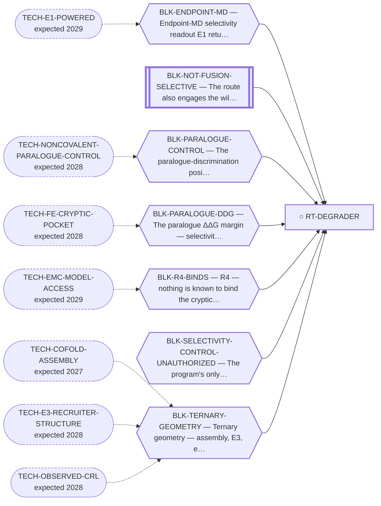

<!-- GENERATED FILE — DO NOT EDIT. Regenerate with:
     python3 systems/systems_check.py --write-views
     Source of truth: systems/graph/*.json -->

# RT-DEGRADER — NR4A3-LBD PROTAC degrader

**Family:** [ST-PROXIMITY](L1-st-proximity.md) · **state:** ○ blocked · computed · confidence low · verified 2026-08-05

**Grade** (owned by [`research/manuscripts/nr4a3-program-map.md`](../../research/manuscripts/nr4a3-program-map.md#-where-we-are--the-scoreboard-in-plain-language)): The most-worked driver-directed route, and the one whose four blocking failures reorganise every other row. ⚠ NO LONGER THE PROGRAM'S NORTH STAR (trimcrae, 2026-08-06) — the path was taken and it hit enough blockers that it holds no privileged position over the rest of the portfolio; superseded, retained: "LEADING driver-directed route; the program's north star". Its evidence is unchanged and its limits are the best-characterised here, which is what the effort bought.

## What has to land for this route to move

**Reading it.** A solid arrow is what holds this route down today. A dashed arrow is a capability that WOULD retire a blocker — dashed because it has not landed, and the date beside it is a forecast, not a schedule.

⛔ **1 of these is permanent** (`BLK-NOT-FUSION-SELECTIVE`) — a fact about the biology, drawn double-walled, with no way out by definition. No technology arrives to fix it.

⚠ **1 blocker here has no technology named at all** (`BLK-SELECTIVITY-CONTROL-UNAUTHORIZED`) — not *waiting*, **unaddressed**. A blocker with no named way out is the most expensive kind, because nothing is being watched for it.

## Scientific rationale

NR4A3 is a transcription factor with no orthosteric ligand, so occupancy-based inhibition has nothing to bind. Degradation only needs the protein to be ENGAGED, not inhibited, and a cryptic pocket that opens under dynamics gives something to engage. Selectivity over the two paralogues is the whole problem: they share the ligand-binding domain fold, so discrimination has to come from a small free-energy difference, from a residue only NR4A3 has, or from the ternary complex's shape.

## Supporting evidence

| ref | supports | strength |
|---|---|---|
| `V13` | a cryptic pocket opens in biased dynamics, though the two-state mechanism gate failed as registered | `direct` |
| `V14` | an independent sequence-only ensemble method detects the same site, unbiased — an instrument with no known-answer control on this system | `direct` |
| `V15` | an independent cryptic-site predictor agrees, on four of five permutation nulls | `direct` |

## Remaining unknowns

- Whether anything binds the cryptic pocket at all — no molecule of any kind is known to.
- Whether the paralogue selectivity margin is real: the engine used to compute it misses a known absolute answer by more than the entire margin.
- Whether a correctly assembled NR4A3 ternary is even geometrically possible — none has been built by anyone.
- Whether the opening penalty differs between paralogues, which could reverse the margin and has never been computed.

## Required validation

| what | instrument | feasible today | blocked by |
|---|---|---|---|
| An engine that recovers a known SELECTIVITY answer before any selectivity number is believed | V4 | yes | BLK-SELECTIVITY-CONTROL-UNAUTHORIZED |
| A correctly assembled ternary for THIS system, not a rebuilt known one | V2 | **no** | BLK-TERNARY-GEOMETRY |
| Experimental evidence that something binds the opened site | ⛔ none built | **no** | BLK-R4-BINDS |

## Blockers

| blocker | kind | what would retire it |
|---|---|---|
| **BLK-ENDPOINT-MD** | `no_known_assay` | `TECH-E1-POWERED` |
| **BLK-NOT-FUSION-SELECTIVE** | `fundamental_biological_limit` | *permanent* |
| **BLK-PARALOGUE-CONTROL** | `no_known_assay` | `TECH-NONCOVALENT-PARALOGUE-CONTROL` |
| **BLK-PARALOGUE-DDG** | `requires_better_simulation_accuracy` | `TECH-FE-CRYPTIC-POCKET` |
| **BLK-R4-BINDS** | `requires_wet_lab` | `TECH-EMC-MODEL-ACCESS` |
| **BLK-SELECTIVITY-CONTROL-UNAUTHORIZED** | `requires_authorization` | NOT 'ask for the decision' -- it was asked and answered. This retires only if trimcrae lifts the standing no-GPU instruction by setting `active: false` in research/autonomy/autonomy-state.json -> gpu_spend_prohibited, which research/autonomy/gpu_ban.py reads and every GPU-billing path in this repository is gated on. Until then the correct next action on this row is NONE: re-deriving the price, re-scoring the rung or re-arguing the leverage all reach the same refusal, and a session that does so has rediscovered the 2026-09-02 mistake rather than found new work. |
| **BLK-TERNARY-GEOMETRY** | `requires_better_structure_prediction` | `TECH-COFOLD-ASSEMBLY`, `TECH-E3-RECRUITER-STRUCTURE`, `TECH-OBSERVED-CRL` |

## Not to be confused with

| route | the axis it turns on | blockers the distinction turns on | why |
|---|---|---|---|
| [RT-ANDGATE](L2-rt-andgate.md) | what the second arm detects | `BLK-TERNARY-GEOMETRY`, `BLK-PARALOGUE-DDG` | the AND-gate adds a fusion-vs-wild-type layer and LEAVES the paralogue layer exactly where it was — two orthogonal requirements, not one replaced |
| [RT-GLUE](L2-rt-glue.md) | how proximity is induced | `BLK-PARALOGUE-DDG` | a glue faces the same discrimination with FEWER independent handles |
| [RT-MONOVALENT](L2-rt-monovalent.md) | whether a degradation geometry is needed at all | `BLK-TERNARY-GEOMETRY` | the monovalent route deletes the ternary layer entirely; the degrader is defined by it |
| [RT-TCIP](L2-rt-tcip.md) | what the recruited partner does | `BLK-TERNARY-GEOMETRY`, `BLK-PARALOGUE-CONTROL` | the degrader's second partner is an E3 and its verdict is a degradation event; TCIP's is a transcriptional effector and its verdict is a rewired output — the ubiquitin-transfer geometry does not apply to it |

## Readiness — what this could become today

**`preprint`**

The computational arc is complete enough to describe honestly, but every selectivity statement is an unvalidated prediction and the paper says so. A journal submission is reachable once the binary selectivity control has run — that is the gating item, and it costs a decision rather than a capability.

**Missing:**
- a passing selectivity known-answer control
- an anti-target panel that recovers its own cognate ligands

**Evidence required:**
- a free-energy engine validated in this regime

**Experiment required:**
- a binding assay against the opened site

## Where this route ends — the paper

**[PUB-DEGRADER](L3-publications.md)** — [In silico design of a paralogue-favoured ligand for a cryptic NR4A3 pocket](../../research/manuscripts/degrader/nr4a3-degrader-paper.md)

`primary` · ◐ `drafted` · aimed at `journal_submission`

**This route contributes:** The cryptic-pocket search, the designed paralogue-favoured ligand, and the margin arithmetic on which the paper's central negative rests.

**The paper would claim:** A cryptic pocket on the NR4A3 ligand-binding domain can be found and a paralogue-favoured ligand designed into it by computation alone — and the selectivity margin that design would need is larger than the instruments used to predict it can currently resolve, which is reported as the result rather than worked around.

## Strategic timing — the wait equation

**Recommendation: `pursue_now`**

The cheapest decisive item is a decision, not a capability, and the paper is publishable now as an honest negative-leaning record. Waiting improves the physics but does not improve the writing, and the writing is what recruits the collaborator every wet-lab-gated row needs.

| horizon | effect |
|---|---|
| Six months | Little on the physics. Materially more on whether a co-folder benchmarked on assembly has appeared. |
| Two years | Substantial — a free-energy method validated on cryptic pockets would move this from unvalidated prediction to a measured claim. |
| Cost trend | falling |
| Automation outlook | Lane orchestration is already automated; the scientific judgement about what a failed control means is not. |

## Claim ceiling — what this route may NOT be used to claim

*Inherited from [ST-PROXIMITY](L1-st-proximity.md), which is where these are asserted — a family limitation binds every route inside it.*

- No molecule in this family has been shown to bind NR4A3 at all — the pocket every route here depends on has no known ligand of any kind.
- No NR4A3 ternary complex has been correctly assembled by anyone, so every geometry claim in this family is a prediction from an instrument that has never been pointed at this system.
- Nothing in this family asserts efficacy, safety, a therapeutic window or clinical readiness.

## Closure

`instrument_limit` — ⭐ NOT closed — and the distinction matters per blocker, not in bulk. Every one of the four METHOD FAILURES on the scoreboard is an INSTRUMENT LIMIT rather than a fact about the target, which is the options memo's organising finding restated as a field. But two of the seven blockers this route inherits are not instrument limits: BLK-NOT-FUSION-SELECTIVE is permanent — the LBD IS wild-type NR4A3 sequence, a fact about the objects — and BLK-R4-BINDS needs a bench. Filing the route beside a definitional impossibility would lose the first point; letting the note read across all seven would lose the second.

## Best next action

Ask for the decision on the binary selectivity control. It is the highest-leverage unrun item in the portfolio and it costs a conversation.

*Cost:* $0 to ask; the run itself points at the pricing home

## What this route rests on — drill down

*L4 instruments and L5 objects, evidence and artifacts. Every row here is asserted by this route; the [evidence base](L5-evidence-base.md) shows the same edges from the other end.*

| L4 instrument | cited as | known-answer control |
|---|---|---|
| [V1](registers/instruments.md) — Structural selectivity descriptor (selcal_interface_signature) | support | `passes` |
| [V2](registers/instruments.md) — Ternary generator given both sites (assembly route) | support | `passes` |
| [V6](registers/instruments.md) — Relative FEP (OpenFE, the congeneric lane) | support | `passes` |
| [V8](registers/instruments.md) — ABFE engine, hydration | support | `passes` |
| [V4](registers/instruments.md) — Selectivity free energy (ABFE) — the selectivity known-answer test | **disclosed failing** | `none` |
| [V5](registers/instruments.md) — Alchemical ternary cooperativity (valB_mini ΔΔG_coop) | **disclosed failing** | `fails` |
| [V7](registers/instruments.md) — ABFE engine, absolute | **disclosed failing** | `fails` |
| [V11](registers/instruments.md) — Interface-stability endpoint (E1) | **disclosed failing** | `fails` |
| [V12](registers/instruments.md) — Sequence-only co-folding (Boltz-2 ternary) | **disclosed failing** | `fails` |
| [V13](registers/instruments.md) — Cryptic-opening free-energy profile (metadynamics F(Rg)) | **disclosed failing** | `fails` |
| [V14](registers/instruments.md) — BioEmu unbiased ensemble cross-check | **disclosed failing** | `none` |
| [V15](registers/instruments.md) — PocketMiner + four permutation nulls | **disclosed failing** | `mixed` |
| [V17](registers/instruments.md) — The exposure criterion EXPOSED_RSA = 0.25 | **disclosed failing** | `fails` |
| [V20](registers/instruments.md) — Single-snapshot MM-GBSA margin > 0 as a selectivity verdict | **disclosed failing** | `fails` |
| [V21](registers/instruments.md) — The anti-target docking panel (antitarget_dock) | **disclosed failing** | `fails` |

**L5 objects:** [OBJ-NR4A1-WT](L5-evidence-base.md#objects--the-biological-and-molecular-entities-the-program-reasons-about), [OBJ-NR4A2-WT](L5-evidence-base.md#objects--the-biological-and-molecular-entities-the-program-reasons-about), [OBJ-NR4A3-LBD-MODELLED](L5-evidence-base.md#objects--the-biological-and-molecular-entities-the-program-reasons-about), [OBJ-NR4A3-WT](L5-evidence-base.md#objects--the-biological-and-molecular-entities-the-program-reasons-about), [OBJ-RES-C397](L5-evidence-base.md#objects--the-biological-and-molecular-entities-the-program-reasons-about)

**L5 evidence:** [EV-ZAIENNE-2022](L5-evidence-base.md#evidence--the-literature-this-program-cites)

**L5 artifacts:** [ART-APO-POSE-SITE](L5-evidence-base.md#artifacts--the-files-a-claim-can-be-checked-against), [ART-DECOY-NULL-LBD](L5-evidence-base.md#artifacts--the-files-a-claim-can-be-checked-against)

[← ST-PROXIMITY](L1-st-proximity.md) · [← L0](L0-ecosystem.md)
