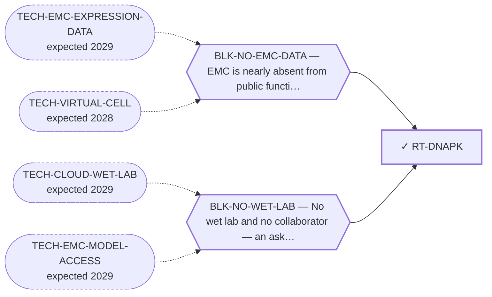

<!-- GENERATED FILE — DO NOT EDIT. Regenerate with:
     python3 systems/systems_check.py --write-views
     Source of truth: systems/graph/*.json -->

# RT-DNAPK — DNA-PK inhibition as an indirect route to the fusion protein

**Family:** [ST-DEPENDENCY](L1-st-dependency.md) · **state:** ✓ blocked · scoped · confidence low · verified 2026-08-09

**Grade** (owned by [`research/manuscripts/program/emc-unexplored-treatment-lanes.md`](../../research/manuscripts/program/emc-unexplored-treatment-lanes.md#39--dna-pk)): ◐ THE INTERACTION IS REAL, WILD-TYPE, AND FROM ONE PAPER IN A NON-SARCOMA TISSUE (graded 2026-08-09 by reading the records the route asked for). The curated evidence is a single UniProt annotation resting on ONE primary source, and it was measured on WILD-TYPE NR4A3 in vascular smooth muscle — not on a fusion protein and not in any sarcoma. ⭐ What survives, and it is the load-bearing half: the modified region is RETAINED in the fusion. The fusion carries NR4A3's full coding region, so nothing the annotation describes is deleted by the breakpoint, and that retention is invariant across all nine DBD-retaining breakpoints. ⛔ The route still cannot deliver selectivity — the same mechanism would lower wild-type NR4A3, and whether the paralogues are regulated the same way is untested. ⛔ AND THE DEPENDENCY PRIOR, RUN 2026-08-09, IS UNFAVOURABLE FOR A WINDOW. The two Ku subunits of the same heterotrimer are dependencies in 100% of the 91 SCREENED sarcoma lines, with mean gene effects around -1.3 and -1.8 — pan-essential. A gene required in essentially every line of a tissue class argues AGAINST there being anything to exploit, not for it — and nothing here claims otherwise for this complex in this disease. ⚠ THE CATALYTIC SUBUNIT ITSELF RETURNED NO READING: it is absent from the dependency artifact entirely, because no matching column was found in the CRISPR gene-effect table. That is an ABSENT READING AND NOT A READING OF ABSENCE — nothing here says the catalytic subunit is or is not a dependency, and the route's own named next step is therefore only partly closed. ⛔ DENOMINATOR CORRECTED 2026-08-27: this grade was written on 2026-08-09 saying 176 sarcoma lines. 176 is the number of sarcoma MODELS in DepMap 24Q4; only 91 of them carry CRISPR gene-effect data, and every per-gene row of research/modalities/depmap-sarcoma-dependency.json reads n_sarcoma: 91 (depmap_sarcoma_dependency.py computes it as len of the non-null sarcoma column, while n_sarcoma_models at the top level is len of the sarcoma model list). The percentages and gene effects are unchanged — they were always computed on the screened subset — but the denominator overstated the evidence base by almost double. The identical error was found and corrected in the MTAP/PRMT5 manuscript's correction register on 2026-08-09/10 (across 176 sarcoma cell lines → across the 91 screened sarcoma cell lines, described there as a real error in the direction that overstated the evidence base), and the fix was never carried back into this graph. ⚠ Other routes' grades and research/modalities/census-route-expression-grading.json still carry the superseded 176; correcting those is a separate item, not this route's.

## What has to land for this route to move

**Reading it.** A solid arrow is what holds this route down today. A dashed arrow is a capability that WOULD retire a blocker — dashed because it has not landed, and the date beside it is a forecast, not a schedule.

## Scientific rationale

A registered lane with no route, and its appeal is structural rather than pharmacological: there is curated experimental evidence of an interaction with the driver protein itself, and acting through the protein's regulation needs neither a ligand for the pocket nor an assembled ternary complex — so it inherits none of the blockers holding the induced-proximity family down.

## Supporting evidence

| ref | supports | strength |
|---|---|---|
| `ART-DEPMAP-SARCOMA-DEP` | both Ku subunits of the DNA-PK heterotrimer are dependencies in every sarcoma line of the public CRISPR panel, which argues against the complex offering anything to exploit | `class_inherited` |

## Remaining unknowns

- ⚠ THE CATALYTIC SUBUNIT'S OWN DEPENDENCY IS STILL UNREAD — it returned no column in the CRISPR gene-effect table on the 2026-08-09 run, so its absence from the artifact is an instrument gap and not a result. Re-running against a different DepMap release, or checking the column naming, would close it and is $0. ⛔ HALF-ANSWERED 2026-08-27, FROM DATA ALREADY ON DISK. The column-naming half is RULED OUT on two counts. (a) depmap_sarcoma_dependency.py normalises every column with the same c.split(' (')[0], and that splitter found XRCC5 and XRCC6 on the same run, so it is not failing on the DepMap SYMBOL (ENTREZ) format. (b) fet_ddr_axis_scan.py records the direct measurement in a source comment: POLR2A and PRKDC are NOT in the 24Q4 CRISPRGeneEffect column set, measured not assumed, on run 30848356798 — which is why that scan's pan-essential control was changed to RPL5. ⭐ So PRKDC is absent from the RELEASE's column set, not lost by this repository's parsing, and the only remaining $0 step is a different DepMap release — a networked fetch, so a CI runner rather than the dev sandbox. ⚠ Still an ABSENT READING: nothing here says PRKDC is or is not a dependency in sarcoma.
- ⛔ CORRECTED 2026-08-27 — SINGLE-SOURCE IS WRONG AND THIS ROUTE'S OWN COMMITTED MEMO ALREADY SAID SO. research/manuscripts/dependency/emc-dnapk-nr4a3-lane-assessment.md (2026-08-07) names FOUR primary papers on this axis, and all four were re-verified against PubMed on 2026-08-27: PMID 25852083 (Cardiovasc Res 2015, human aortic smooth muscle, the paper UniProt cites); PMID 36114572 (Respir Res 2022, an independent group in human pulmonary artery smooth muscle, same direction, DIFFERENT mechanism — protein synthesis rather than blocked ubiquitination); PMID 21979916 (Genes Dev 2011, four years EARLIER, and about the NR4A FAMILY rather than NR4A3); PMID 30784586 (Cell Rep 2019, which reports the PAR-binding pocket in all NR4A members and NR4A1/NR4A2 redundancy for the repair output). What IS single-source is the UniProt ANNOTATION, not the axis. What survives unchanged: the interaction was measured on wild-type NR4A3 in vascular smooth muscle, and in no sarcoma and on no fusion protein.
- ⛔ ANSWERED 2026-08-09 and retained here only so it is not re-asked: the interaction was measured on wild-type NR4A3 in vascular smooth muscle, from a single primary source. The fusion-protein question is therefore OPEN by absence of evidence rather than by ambiguity.
- Whether the phosphorylation is regulatory in the direction that would lower fusion activity in a sarcoma cell, which one non-sarcoma paper cannot establish.
- Whether inhibiting the kinase is survivable in this tissue class at all, which is a dependency question the arrays cannot answer and which is now queued in the sarcoma dependency panel.
- Whether the paralogues NR4A1/NR4A2 are regulated the same way — untested, and the reason this route inherits the non-selectivity blocker rather than escaping it.

## Required validation

| what | instrument | feasible today | blocked by |
|---|---|---|---|
| ⛔ TAKEN 2026-08-09 — read the curated interaction records and their primary source, and establish whether any was measured on a fusion protein. Answer: none was. | ⛔ none built | yes | — |
| A sarcoma-class dependency prior for the kinase and its two partner subunits, which says whether inhibiting it is survivable in this tissue class | ⛔ none built | yes | — |
| A measurement that the phosphorylation stabilises the FUSION protein, in a cell that carries it — the only observation that transfers the mechanism into this disease | ⛔ none built | **no** | BLK-NO-WET-LAB |

## Blockers

| blocker | kind | what would retire it |
|---|---|---|
| **BLK-NO-EMC-DATA** | `insufficient_data` | `TECH-EMC-EXPRESSION-DATA`, `TECH-VIRTUAL-CELL` |
| **BLK-NO-WET-LAB** | `requires_external_collaboration` | `TECH-CLOUD-WET-LAB`, `TECH-EMC-MODEL-ACCESS` |

## Readiness — what this could become today

**`internal_note`**

The mechanism rests on one paper in a tissue that is not a sarcoma. Retention of the modified region is established and is genuinely favourable; everything downstream of it is a transfer.

**Missing:**
- a sarcoma-class dependency prior for the kinase, which is queued and $0
- a measurement in a cell carrying the fusion, which needs a model

## Where this route ends — the paper

**[PUB-KINASE-LEADS](L3-publications.md)** — *Four kinase observations in extraskeletal myxoid chondrosarcoma that nobody followed up* (unwritten)

`contributing` · ◔ `outlined` · aimed at `preprint`

**This route contributes:** One of four kinase observations specific to this disease that exist in the published or curated record and that nobody has followed up.

**The paper would claim:** Four kinase-directed observations specific to this disease exist in the published and curated record — one reported as expressed and activated, one positive across a small series with an internal control, one an interaction curated on the driver protein itself, one an ex-vivo screen hit — and none has been followed up by anyone, in a disease with no targeted agent.

**It is not written because:** ⚠ ITS BLOCKER IS RETIRED — THE CONSOLIDATION IS DONE AND IT INVERTED THE PAPER. All four leads are graded as of 2026-08-09, and reading each one's own primary record demoted THREE of them in ways the leads' prose did not predict: the activation claim behind the strongest lead is a single paywalled abstract sentence with no recoverable denominator, and the approved agents address a molecular state this disease is not reported to be in; the screen hit turns out to sit beside two same-class hits belonging to a class the board already holds, and its named kinases have no probe on either platform so the arrays could never have attributed it; the interaction lead was measured on wild-type protein in a non-sarcoma tissue from one source. The fourth is discordant on the kinase and concordant on its substrate. ⭐ THAT IS THE PAPER NOW, and it is a better one than the consolidation that was planned: four EMC-specific kinase observations that the field has cited or left for one to two decades, each traced to what was actually measured, with the gap between the citation and the measurement stated. ⛔ Superseded, retained: "the consolidation has not been done — three of the four were surfaced two days before this endpoint was registered." ⚠ Two of the four gradings came from records that had been committed since 2026-08-07 and that the routes were registered without reading.

## Strategic timing — the wait equation

**Recommendation: `monitor`**

The cheap half — record reading and retention — is done. What is left needs either the queued dependency prior or a model.

| horizon | effect |
|---|---|
| Cost trend | flat |

**Revisit when:**
- **TECH-EMC-MODEL-ACCESS** — Access to a patient-derived EMC model through a collaborator, or through a solo-affordable cloud or robotic wet-lab service with E *(expected 2029, basis `speculative`)*

## Claim ceiling — what this route may NOT be used to claim

*Inherited from [ST-DEPENDENCY](L1-st-dependency.md), which is where these are asserted — a family limitation binds every route inside it.*

- The dependency transfer prior came back negative on the available data — a measured premise, revivable only by EMC-specific data.
- One route rests on class inheritance: no NR4A3 fusion has been tested for the phenotype it assumes.
- There is one EMC model in public dependency data, with no CRISPR data, so this family's in-silico half is bounded by a sample size of one.

## Best next action

Report the lead with its wild-type, NON-SARCOMA provenance stated plainly, and WITHOUT the word single-source — corrected 2026-08-27, see the grade. The still-open $0 half is the catalytic subunit's own dependency, which returned no column on the 2026-08-09 run; the two Ku subunits have been read.

*Cost:* $0

[← ST-DEPENDENCY](L1-st-dependency.md) · [← L0](L0-ecosystem.md)
