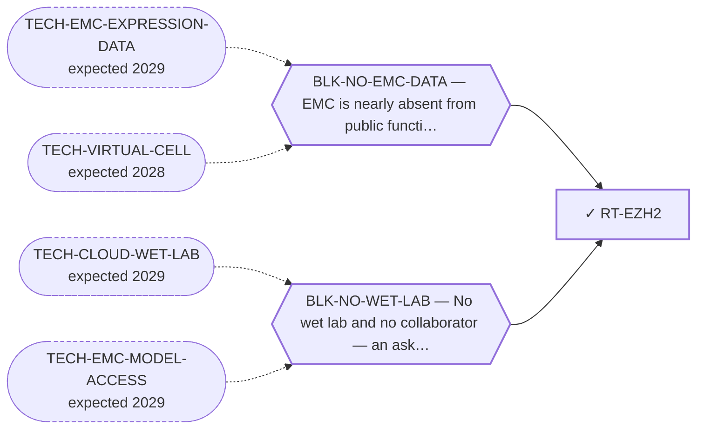

<!-- GENERATED FILE — DO NOT EDIT. Regenerate with:
     python3 systems/systems_check.py --write-views
     Source of truth: systems/graph/*.json -->

# RT-EZH2 — EZH2 / PRC2 inhibition

**Family:** [ST-DEPENDENCY](L1-st-dependency.md) · **state:** ✓ parked · computed · confidence moderate · verified 2026-08-09

**Grade** (owned by [`research/modalities/census-route-expression-grading.json`](../../research/modalities/census-route-expression-grading.json)): ⛔ NOT SUPPORTED (2026-08-09). Neither shape that selects this class is present: EZH2 is only mildly higher, the rest of PRC2 is flat, and no SWI/SNF tumour-suppressor subunit reads anywhere near a floor. The approved agent's indication is selected by subunit LOSS, and there is none to see.

## What has to land for this route to move

**Reading it.** A solid arrow is what holds this route down today. A dashed arrow is a capability that WOULD retire a blocker — dashed because it has not landed, and the date beside it is a forecast, not a schedule.

## Scientific rationale

An agent is approved in a sarcoma selected by a chromatin-remodeller defect, and this portfolio already contains a chromatin-remodelling hypothesis through a non-canonical BAF subunit — but the two had never been connected and no prior sweep named this class. The existing BAF route's own dependency prior came back negative, which any assessment has to lead with.

## Supporting evidence

| ref | supports | strength |
|---|---|---|
| `ART-CENSUS-ROUTE-GRADING` | neither PRC2 elevation nor SWI/SNF subunit loss is present in EMC on either platform | `direct` |

## Remaining unknowns

- Whether subunit loss is present at the PROTEIN level, which is frequently post-transcriptional and which a transcript read cannot exclude.
- Whether the neighbouring ncBAF hypothesis, whose own dependency prior was negative, shares this closure or fails separately.

## Required validation

| what | instrument | feasible today | blocked by |
|---|---|---|---|
| The expression or committed-artifact lookup that selects this class | ⛔ none built | yes | — |
| A measurement in a fusion-positive EMC model | ⛔ none built | **no** | BLK-NO-WET-LAB |
| A PROTEIN-level read of the SWI/SNF subunits in EMC tissue — the only observation that could overturn the negative transcript reading, since subunit loss is frequently post-transcriptional | ⛔ none built | **no** | BLK-NO-WET-LAB |

## Blockers

| blocker | kind | what would retire it |
|---|---|---|
| **BLK-NO-EMC-DATA** | `insufficient_data` | `TECH-EMC-EXPRESSION-DATA`, `TECH-VIRTUAL-CELL` |
| **BLK-NO-WET-LAB** | `requires_external_collaboration` | `TECH-CLOUD-WET-LAB`, `TECH-EMC-MODEL-ACCESS` |

## Readiness — what this could become today

**`internal_note`**

A class whose two selecting shapes are both absent is a paragraph in the negative half of the census paper.

**Missing:**
- nothing — the selection question was asked and answered negatively

## Where this route ends — the paper

**[PUB-BIOMARKER-DEP](L3-publications.md)** — [Biomarker-selected therapeutic classes in an ultra-rare sarcoma — what the available expression data excludes](../../research/manuscripts/dependency/emc-biomarker-selected-classes.md)

`contributing` · ◐ `drafted` · aimed at `preprint`

**This route contributes:** One of six biomarker-selected classes whose selecting feature is readable in expression data already public for this disease, and whose most useful output is exclusion.

**The paper would claim:** Five therapeutic classes are selected by a molecular state rather than by a histology, every selecting feature is readable in expression data already public for this disease, and the useful output is which classes the data rules OUT rather than which it nominates. Four selecting features are absent; the fifth class survives because the instrument cannot reach its question rather than because the data was favourable. The four negatives are deliberately NOT reported as equally strong.

## Strategic timing — the wait equation

**Recommendation: `monitor`**

Only a protein-level subunit read could overturn this, and it needs tissue this programme cannot obtain.

| horizon | effect |
|---|---|
| Cost trend | flat |

**Revisit when:**
- **TECH-EMC-MODEL-ACCESS** — Access to a patient-derived EMC model through a collaborator, or through a solo-affordable cloud or robotic wet-lab service with E *(expected 2029, basis `speculative`)*

## Claim ceiling — what this route may NOT be used to claim

*Inherited from [ST-DEPENDENCY](L1-st-dependency.md), which is where these are asserted — a family limitation binds every route inside it.*

- The dependency transfer prior came back negative on the available data — a measured premise, revivable only by EMC-specific data.
- One route rests on class inheritance: no NR4A3 fusion has been tested for the phenotype it assumes.
- There is one EMC model in public dependency data, with no CRISPR data, so this family's in-silico half is bounded by a sample size of one.

## Best next action

Report it as a closed line alongside the other biomarker-selected exclusions.

*Cost:* $0

[← ST-DEPENDENCY](L1-st-dependency.md) · [← L0](L0-ecosystem.md)
