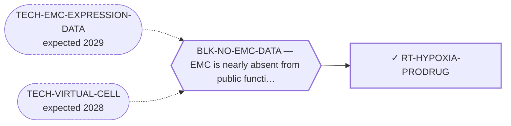

<!-- GENERATED FILE — DO NOT EDIT. Regenerate with:
     python3 systems/systems_check.py --write-views
     Source of truth: systems/graph/*.json -->

# RT-HYPOXIA-PRODRUG — Hypoxia-activated prodrugs

**Family:** [ST-MICROENV](L1-st-microenv.md) · **state:** ✓ parked · computed · confidence low · verified 2026-08-09

**Grade** (owned by [`research/manuscripts/microenv/emc-hypoxia-reading.md`](../../research/manuscripts/microenv/emc-hypoxia-reading.md#5--the-therapeutic-hooks-at-their-true-weight)): ⛔ GRADE WITHDRAWN AND REPLACED, 2026-08-09 (same day). It was first graded SUPPORTED from the raw two-platform contrast. That reading was taken from the panel artifact WITHOUT reading the confound audit that audits it: against a genome-wide size-matched null the signature does not clear on GPL6244, and the owning memo rules the signal is a reason to ask a question rather than to revisit this class.

## What has to land for this route to move

**Reading it.** A solid arrow is what holds this route down today. A dashed arrow is a capability that WOULD retire a blocker — dashed because it has not landed, and the date beside it is a forecast, not a schedule.

## Scientific rationale

This repository has already accepted that a hypovascular matrix-dominated tumour is a good niche fit for hypoxia-directed treatment — it said so when grading engineered bacteria, where the fit was real and the decisive objection was that no in-silico instrument could be brought to bear. That objection does not hold here, because a hypoxia signature is readable in expression data already on disk. The class has a negative randomised soft-tissue-sarcoma record that any assessment must lead with.

## Supporting evidence

| ref | supports | strength |
|---|---|---|
| `ART-CENSUS-ROUTE-GRADING` | the raw hypoxia-metagene contrast is positive in EMC on both platforms — which is the reading, not the grade: it does not survive the genome-wide null on one of the two | `surrogate` |

## Remaining unknowns

- Whether the signal survives on a third series, which is the falsifier the owning memo names and which two series cannot supply.
- Whether the class's negative randomised soft-tissue-sarcoma record was a mechanism failure or a patient-selection failure — unchanged by this pass.
- Nothing here assumes a therapeutic window; the owning memo declines to make this signal a reason to revisit the class at all, and that ruling is not overturned by a route existing.

## Required validation

| what | instrument | feasible today | blocked by |
|---|---|---|---|
| The expression lookup that grades this route's premise | ⛔ none built | yes | — |
| A measurement of the matrix compartment in EMC tissue  ⭐ ADJUDICATED 2026-09-02 (AUT-PD-116, seat s31-emc-data-blocks). ⛔ THIS ENTRY'S TEXT IS A COPY AND DOES NOT DESCRIBE THIS ROUTE. The identical string sits on `RT-MATRIX-SYNTHESIS[1]` and `RT-IMMUNOCYTOKINE[1]`, and this route's premise is HYPOXIA. Its real reading is `reads.read_5_HYPOXIA` (`readability_verdict.state` TAKEN on both platforms), audited by `research/modalities/emc-hypoxia-confounds.json`, with the grade withdrawn by `research/manuscripts/.../emc-hypoxia-reading.md` §5 — which owns the requirement text, so the replacement wording is that memo's to write and this seat leaves the string verbatim and flagged rather than rewriting a requirement it does not own. Of the hypoxia genes only VEGFA has an assigned probe in the fourth cohort; CA9, SLC2A1, LDHA, HIF1A, EGLN3, ADM and P4HA1 do not. ⚠ THE RULE THIS APPLIES, THE FOURTH COHORT'S DESIGN AND LIMITS, AND THE PER-GENE COVERAGE ALL HAVE ONE HOME AND ARE NOT RESTATED HERE: research/modalities/emc-fourth-cohort-route-readout.json — its "⭐ the_rule_this_adjudication_applies" field, its cohort block, and per_route.RT-HYPOXIA-PRODRUG. | ⛔ none built | **no** | BLK-NO-WET-LAB |

## Blockers

| blocker | kind | what would retire it |
|---|---|---|
| **BLK-NO-EMC-DATA** | `insufficient_data` | `TECH-EMC-EXPRESSION-DATA`, `TECH-VIRTUAL-CELL` |

## Readiness — what this could become today

**`internal_note`**

The route rests on a signal whose own audit restricts it to one platform, and the memo that owns that audit declines to license this class from it.

**Missing:**
- a third EMC series — the falsifier the owning memo names

## Where this route ends — the paper

**[PUB-MATRIX-ADDRESS](L3-publications.md)** — *The myxoid matrix as an address rather than an obstacle* (unwritten)

`contributing` · ◔ `outlined` · aimed at `preprint`

**This route contributes:** One of the handles the matrix offers — an epitope, a biosynthetic pathway or a hypoxic niche — none of which requires the fusion protein to be druggable.

**The paper would claim:** The matrix that defines this tumour histologically has been treated in the therapeutic literature almost entirely as a barrier to drug delivery, and it admits at least three distinct handles — an epitope, a biosynthetic pathway and a hypoxic niche — none of which requires the fusion protein to be druggable.

**It is not written because:** ⚠ ITS BLOCKER IS NOW RETIRED AND THE PAPER IS MOSTLY NEGATIVE. All four routes are graded as of 2026-08-09. Three of the three handles the title argues for came back unfavourable or unreachable: the biosynthetic premise is not supported as stated, the hypoxia grade was WITHDRAWN the same day it was issued once the confound audit restricted the signature to one platform, and the epitope route's own nominated read gives no capacity support. The fourth is present-but-not-selective and its address is a splice variant a gene-level probe cannot see. ⭐ What makes it still worth writing is that two of the four are UNREACHABLE rather than refuted — the address is a sulfation pattern and an isoform, and neither has a gene — which is a statement about the instrument the field has for glycan and isoform addresses, not only about this disease. ⛔ Superseded, retained: "the expression read that would ground it is committed but ungraded."

## Strategic timing — the wait equation

**Recommendation: `monitor`**

The owning memo has already ruled on what this signal licenses, and nothing this route can do at $0 changes that ruling; only a third series would.

| horizon | effect |
|---|---|
| Cost trend | flat |

**Revisit when:**
- **TECH-EMC-EXPRESSION-DATA** — A fetchable public EMC RNA-seq or proteomics deposit beyond the single existing model, enabling a target-regulon readout and per-a *(expected 2029, basis `speculative`)*

## Claim ceiling — what this route may NOT be used to claim

*Inherited from [ST-MICROENV](L1-st-microenv.md), which is where these are asserted — a family limitation binds every route inside it.*

- The screen this repository uses to nominate surface addresses ranks tumour-cell monoculture transcripts, so it has no stromal compartment in it and cannot see glycans — its silence about a matrix target is an absent reading rather than a reading of absence.
- Nothing in this family discriminates the tumour from normal tissue by the fusion, so every route here depends entirely on the matrix itself being tumour-restricted enough, and no route here has shown that.
- The matrix has never been measured in this disease as a therapeutic compartment — only described histologically — so every route in this family rests on inference from phenotype rather than on a measurement.
- Nothing in this family asserts efficacy, safety, a therapeutic window or clinical readiness.

## Best next action

Leave it to the hypoxia memo, which owns the reading and the ruling.

*Cost:* $0

[← ST-MICROENV](L1-st-microenv.md) · [← L0](L0-ecosystem.md)
