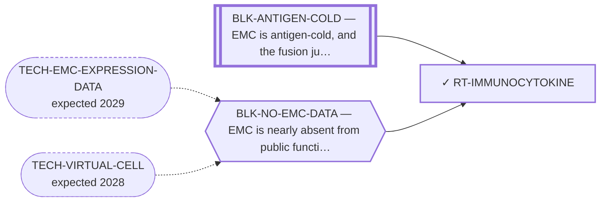

<!-- GENERATED FILE — DO NOT EDIT. Regenerate with:
     python3 systems/systems_check.py --write-views
     Source of truth: systems/graph/*.json -->

# RT-IMMUNOCYTOKINE — Matrix-targeted immunocytokines

**Family:** [ST-MICROENV](L1-st-microenv.md) · **state:** ✓ blocked · computed · confidence low · verified 2026-08-09

**Grade** (owned by [`research/modalities/census-route-expression-grading.json`](../../research/modalities/census-route-expression-grading.json)): ◐ PARTLY READ (2026-08-09). The parent matrix genes are abundant in absolute terms — FN1 at the 94th array percentile — but not enriched against comparator sarcomas, and TNC and FAP are lower on both platforms. ⛔ The address is a SPLICE VARIANT and a gene-level probe cannot see one, so the route's own premise is untested rather than answered.

## What has to land for this route to move

**Reading it.** A solid arrow is what holds this route down today. A dashed arrow is a capability that WOULD retire a blocker — dashed because it has not landed, and the date beside it is a forecast, not a schedule.

⛔ **1 of these is permanent** (`BLK-ANTIGEN-COLD`) — a fact about the biology, drawn double-walled, with no way out by definition. No technology arrives to fix it.

## Scientific rationale

The one antibody format whose address is not a tumour-cell antigen: it targets an extracellular matrix epitope, and the matrix is this disease's defining compartment. That routes around the instrument limitation already flagged here — the surfaceome screen ranks tumour-cell monoculture transcripts and cannot see stroma. The class also has soft-tissue-sarcoma clinical experience specifically. The payload is a cytokine, so a cold infiltrate remains a real objection to the immune arm even if the address holds.

## Supporting evidence

| ref | supports | strength |
|---|---|---|
| `ART-CENSUS-ROUTE-GRADING` | the parent genes of the targeted matrix epitopes are expressed in EMC tumour tissue but are not enriched relative to comparator sarcomas | `surrogate` |

## Remaining unknowns

- The abundance of the oncofetal SPLICE ISOFORM that the clinical agents actually bind, which is not deducible from the parent gene and which these array platforms cannot resolve.
- Whether an address that is abundant but not sarcoma-selective gives any window, which is the same question every antigen route in this portfolio has failed on.
- Whether a cytokine payload can act in a microenvironment recorded here as cold and sparse.

## Required validation

| what | instrument | feasible today | blocked by |
|---|---|---|---|
| The expression lookup that grades this route's premise | ⛔ none built | yes | — |
| A measurement of the matrix compartment in EMC tissue  ⭐ ADJUDICATED 2026-09-02 (AUT-PD-116, seat s31-emc-data-blocks). HALF TAKEN AT GENE LEVEL (this route's own `required_validation[0]`), and the ISOFORM half — which is the whole route — is open. ⭐ THE QUESTION THIS ROUTE'S OWN `next` ASKED IS ANSWERED HERE, AT $0, AND THE ANSWER IS NO: the fourth cohort cannot resolve the oncofetal fibronectin and tenascin domains. TNC has no assigned probe at all; FN1 has exactly one across the 1,645 probes common to every run; gene counts are summed over the probes assigned to a gene (`emc-fourth-cohort-quant.json → "⛔ gene_counts_units"`); and the committed probe table carries `probe_sequence` and `assigned_gene` and no transcript or exon identity, so no domain-inclusion call is derivable from it. An isoform-resolved read still needs transcript-resolved sequencing or the vendor probe manifest, neither of which is on disk. ⚠ THE RULE THIS APPLIES, THE FOURTH COHORT'S DESIGN AND LIMITS, AND THE PER-GENE COVERAGE ALL HAVE ONE HOME AND ARE NOT RESTATED HERE: research/modalities/emc-fourth-cohort-route-readout.json — its "⭐ the_rule_this_adjudication_applies" field, its cohort block, and per_route.RT-IMMUNOCYTOKINE. | ⛔ none built | **no** | BLK-NO-WET-LAB |

## Blockers

| blocker | kind | what would retire it |
|---|---|---|
| **BLK-ANTIGEN-COLD** | `fundamental_biological_limit` | *permanent* |
| **BLK-NO-EMC-DATA** | `insufficient_data` | `TECH-EMC-EXPRESSION-DATA`, `TECH-VIRTUAL-CELL` |

## Readiness — what this could become today

**`internal_note`**

The gene-level read bounds the parent genes and leaves the isoform question, which is the route, entirely open.

**Missing:**
- an isoform-resolved read, which needs RNA-seq rather than an array — the fourth public cohort is the first candidate that could carry it

## Where this route ends — the paper

**[PUB-MATRIX-ADDRESS](L3-publications.md)** — *The myxoid matrix as an address rather than an obstacle* (unwritten)

`contributing` · ◔ `outlined` · aimed at `preprint`

**This route contributes:** One of the handles the matrix offers — an epitope, a biosynthetic pathway or a hypoxic niche — none of which requires the fusion protein to be druggable.

**The paper would claim:** The matrix that defines this tumour histologically has been treated in the therapeutic literature almost entirely as a barrier to drug delivery, and it admits at least three distinct handles — an epitope, a biosynthetic pathway and a hypoxic niche — none of which requires the fusion protein to be druggable.

**It is not written because:** ⚠ ITS BLOCKER IS NOW RETIRED AND THE PAPER IS MOSTLY NEGATIVE. All four routes are graded as of 2026-08-09. Three of the three handles the title argues for came back unfavourable or unreachable: the biosynthetic premise is not supported as stated, the hypoxia grade was WITHDRAWN the same day it was issued once the confound audit restricted the signature to one platform, and the epitope route's own nominated read gives no capacity support. The fourth is present-but-not-selective and its address is a splice variant a gene-level probe cannot see. ⭐ What makes it still worth writing is that two of the four are UNREACHABLE rather than refuted — the address is a sulfation pattern and an isoform, and neither has a gene — which is a statement about the instrument the field has for glycan and isoform addresses, not only about this disease. ⛔ Superseded, retained: "the expression read that would ground it is committed but ungraded."

## Strategic timing — the wait equation

**Recommendation: `wait`**

The decisive observation needs isoform-level data, and the only plausible source is a public RNA-seq cohort this programme has identified but not yet processed.

| horizon | effect |
|---|---|
| Cost trend | falling |

**Revisit when:**
- **TECH-EMC-EXPRESSION-DATA** — A fetchable public EMC RNA-seq or proteomics deposit beyond the single existing model, enabling a target-regulon readout and per-a *(expected 2029, basis `speculative`)*

## Claim ceiling — what this route may NOT be used to claim

*Inherited from [ST-MICROENV](L1-st-microenv.md), which is where these are asserted — a family limitation binds every route inside it.*

- The screen this repository uses to nominate surface addresses ranks tumour-cell monoculture transcripts, so it has no stromal compartment in it and cannot see glycans — its silence about a matrix target is an absent reading rather than a reading of absence.
- Nothing in this family discriminates the tumour from normal tissue by the fusion, so every route here depends entirely on the matrix itself being tumour-restricted enough, and no route here has shown that.
- The matrix has never been measured in this disease as a therapeutic compartment — only described histologically — so every route in this family rests on inference from phenotype rather than on a measurement.
- Nothing in this family asserts efficacy, safety, a therapeutic window or clinical readiness.

## Best next action

Establish whether the fourth public cohort's data type can resolve fibronectin and tenascin isoforms at all. ⛔ ANSWERED 2026-09-02 (AUT-PD-116) AND THE ANSWER IS NO. The fourth cohort cannot resolve fibronectin or tenascin isoforms: TNC has no assigned probe, FN1 has exactly one, gene counts are summed over a gene's probes, and the committed probe table carries no transcript or exon identity. ⚠ Superseded, retained: "Establish whether the fourth public cohort's data type can resolve fibronectin and tenascin isoforms at all." An isoform-resolved read needs transcript-resolved sequencing or the vendor probe manifest.

*Cost:* $0

[← ST-MICROENV](L1-st-microenv.md) · [← L0](L0-ecosystem.md)
