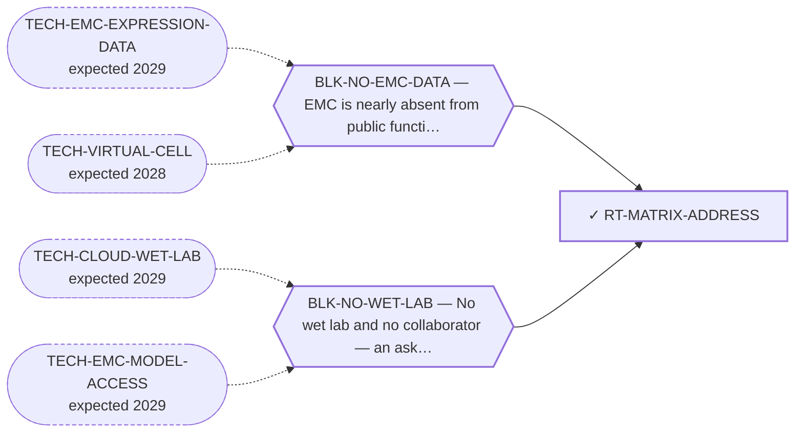

<!-- GENERATED FILE — DO NOT EDIT. Regenerate with:
     python3 systems/systems_check.py --write-views
     Source of truth: systems/graph/*.json -->

# RT-MATRIX-ADDRESS — Oncofetal chondroitin sulfate as a tumour address

**Family:** [ST-MICROENV](L1-st-microenv.md) · **state:** ✓ blocked · computed · confidence low · verified 2026-08-09

**Grade** (owned by [`research/modalities/census-route-expression-grading.json`](../../research/modalities/census-route-expression-grading.json)): ◐ NOT SUPPORTED ON CAPACITY, PREMISE STILL UNREADABLE (2026-08-09). The route's own cheapest next observation was taken. The 4-O-sulfotransferase arm that writes the epitope is DISCORDANT across the two platforms and significant on neither, with all four genes readable on both — a taken reading, not a missing one. The sulfate-DONOR module reads LOWER in EMC on BOTH, the panel's only concordant signal. ⛔ But a sulfation pattern has no gene: this grades the proxy the route nominated and cannot reach the route's premise, so it demotes rather than closes.

## What has to land for this route to move

**Reading it.** A solid arrow is what holds this route down today. A dashed arrow is a capability that WOULD retire a blocker — dashed because it has not landed, and the date beside it is a forecast, not a schedule.

## Scientific rationale

A registered lane with no route, and the best-argued matrix address the 2026-08-07 sweep found: it turns the defining glycan into the target, and it belongs to an antigen class the surfaceome screen structurally could not have found, because a sulfation pattern has no gene to rank.

## Supporting evidence

| ref | supports | strength |
|---|---|---|
| `ART-CENSUS-ROUTE-GRADING` | neither the 4-O-sulfotransferase arm nor the sulfate-donor module supports the capacity argument — the arm is discordant across platforms and the donor module is concordantly lower in EMC | `surrogate` |

## Remaining unknowns

- Whether the oncofetal sulfation PATTERN is present on EMC tissue — the route's actual premise, which no transcript can reach and which this grading therefore leaves open.
- Whether the pattern, if present, is restricted enough relative to normal tissue to give any window — the question every antigen route in this portfolio has failed on.
- Why the 4-O arm disagrees between the two platforms while the donor module agrees, which is unexplained and is why this is graded as a demotion rather than a closure.

## Required validation

| what | instrument | feasible today | blocked by |
|---|---|---|---|
| ⛔ TAKEN 2026-08-09 and returned no support — the chondroitin-sulfate biosynthesis and sulfotransferase read that this route nominated as its own grading observation | ⛔ none built | yes | — |
| A stain or binding assay for the oncofetal chondroitin-sulfate pattern on EMC tissue, which is the only instrument that can reach the route's premise  ⭐ ADJUDICATED 2026-09-02 (AUT-PD-116, seat s31-emc-data-blocks). NOT ANSWERED, AND THE READ REFUSES IT VERBATIM — `reads.read_2_CS_GAG_PAPS.what_it_cannot_settle`: "A SULFATION PATTERN HAS NO GENE. Transcript levels of sulfotransferases are a proxy for the CAPACITY to make an epitope, never a measurement of the epitope." A stain or a binding assay is a bench, so BLK-NO-WET-LAB is the whole residual. ⚠ In the fourth cohort CSPG4 has an assigned probe and CHST11 and CHST3 — the 4-O-sulfotransferase arm the placental-type epitope depends on — do not. ⚠ THE RULE THIS APPLIES, THE FOURTH COHORT'S DESIGN AND LIMITS, AND THE PER-GENE COVERAGE ALL HAVE ONE HOME AND ARE NOT RESTATED HERE: research/modalities/emc-fourth-cohort-route-readout.json — its "⭐ the_rule_this_adjudication_applies" field, its cohort block, and per_route.RT-MATRIX-ADDRESS. | ⛔ none built | **no** | BLK-NO-WET-LAB |

## Blockers

| blocker | kind | what would retire it |
|---|---|---|
| **BLK-NO-EMC-DATA** | `insufficient_data` | `TECH-EMC-EXPRESSION-DATA`, `TECH-VIRTUAL-CELL` |
| **BLK-NO-WET-LAB** | `requires_external_collaboration` | `TECH-CLOUD-WET-LAB`, `TECH-EMC-MODEL-ACCESS` |

## Readiness — what this could become today

**`internal_note`**

The only $0 instrument that could speak to this route has now spoken, and it gave no support without being able to refute the premise.

**Missing:**
- a stain or a binding assay on EMC tissue — the epitope is a modification pattern and there is no further expression observation that could reach it

## Where this route ends — the paper

**[PUB-MATRIX-ADDRESS](L3-publications.md)** — *The myxoid matrix as an address rather than an obstacle* (unwritten)

`contributing` · ◔ `outlined` · aimed at `preprint`

**This route contributes:** One of the handles the matrix offers — an epitope, a biosynthetic pathway or a hypoxic niche — none of which requires the fusion protein to be druggable.

**The paper would claim:** The matrix that defines this tumour histologically has been treated in the therapeutic literature almost entirely as a barrier to drug delivery, and it admits at least three distinct handles — an epitope, a biosynthetic pathway and a hypoxic niche — none of which requires the fusion protein to be druggable.

**It is not written because:** ⚠ ITS BLOCKER IS NOW RETIRED AND THE PAPER IS MOSTLY NEGATIVE. All four routes are graded as of 2026-08-09. Three of the three handles the title argues for came back unfavourable or unreachable: the biosynthetic premise is not supported as stated, the hypoxia grade was WITHDRAWN the same day it was issued once the confound audit restricted the signature to one platform, and the epitope route's own nominated read gives no capacity support. The fourth is present-but-not-selective and its address is a splice variant a gene-level probe cannot see. ⭐ What makes it still worth writing is that two of the four are UNREACHABLE rather than refuted — the address is a sulfation pattern and an isoform, and neither has a gene — which is a statement about the instrument the field has for glycan and isoform addresses, not only about this disease. ⛔ Superseded, retained: "the expression read that would ground it is committed but ungraded."

## Strategic timing — the wait equation

**Recommendation: `monitor`**

The capacity proxy came back unfavourable and the premise needs tissue, so nothing further is buyable here at $0.

| horizon | effect |
|---|---|
| Cost trend | flat |

**Revisit when:**
- **TECH-EMC-MODEL-ACCESS** — Access to a patient-derived EMC model through a collaborator, or through a solo-affordable cloud or robotic wet-lab service with E *(expected 2029, basis `speculative`)*

## Claim ceiling — what this route may NOT be used to claim

*Inherited from [ST-MICROENV](L1-st-microenv.md), which is where these are asserted — a family limitation binds every route inside it.*

- The screen this repository uses to nominate surface addresses ranks tumour-cell monoculture transcripts, so it has no stromal compartment in it and cannot see glycans — its silence about a matrix target is an absent reading rather than a reading of absence.
- Nothing in this family discriminates the tumour from normal tissue by the fusion, so every route here depends entirely on the matrix itself being tumour-restricted enough, and no route here has shown that.
- The matrix has never been measured in this disease as a therapeutic compartment — only described histologically — so every route in this family rests on inference from phenotype rather than on a measurement.
- Nothing in this family asserts efficacy, safety, a therapeutic window or clinical readiness.

## Best next action

Report it in the matrix paper as a route whose capacity proxy is unfavourable and whose premise is unreachable without tissue.

*Cost:* $0

[← ST-MICROENV](L1-st-microenv.md) · [← L0](L0-ecosystem.md)
