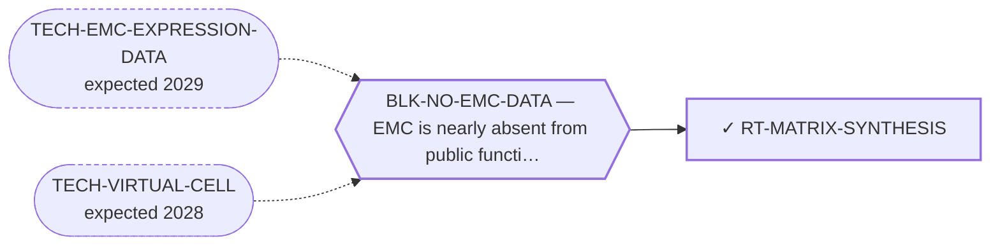

<!-- GENERATED FILE — DO NOT EDIT. Regenerate with:
     python3 systems/systems_check.py --write-views
     Source of truth: systems/graph/*.json -->

# RT-MATRIX-SYNTHESIS — Inhibition of the tumour's glycosaminoglycan biosynthesis

**Family:** [ST-MICROENV](L1-st-microenv.md) · **state:** ✓ parked · computed · confidence low · verified 2026-08-28

**Grade** (owned by [`research/modalities/census-route-expression-grading.json`](../../research/modalities/census-route-expression-grading.json)): ⛔ Premise NOT supported AS STATED (2026-08-09). The sulfate-donor module is LOWER in EMC than in comparator sarcomas on both platforms; the backbone and 4-O-sulfotransferase groups disagree between platforms. A matrix-defining tumour is not running its biosynthetic machinery hotter than its neighbours.

## What has to land for this route to move

**Reading it.** A solid arrow is what holds this route down today. A dashed arrow is a capability that WOULD retire a blocker — dashed because it has not landed, and the date beside it is a forecast, not a schedule.

## Scientific rationale

The matrix has been treated here as a barrier and, once, as an address. This is the third option nobody had considered: stop the tumour building it. The gel is the disease's defining phenotype and it is a manufactured product with a named biosynthetic pathway. The pathway is shared with normal chondrogenesis, so selectivity is the open question rather than an assumption.

## Supporting evidence

| ref | supports | strength |
|---|---|---|
| `ART-CENSUS-ROUTE-GRADING` | the sulfate-donor module is lower in EMC than in comparator sarcomas on both readable platforms, against the route's stated premise | `direct` |

## Remaining unknowns

- Whether the premise survives restatement: the comparator arm is itself matrix-rich sarcoma, so this is a relative reading, and bulk enzyme transcript need not track accumulated matrix mass in a tumour whose product is long-lived.
- Whether matrix production is load-bearing for the tumour at all, which nothing has tested and which this reading does not address.

## Required validation

| what | instrument | feasible today | blocked by |
|---|---|---|---|
| ⛔ TAKEN 2026-08-09 and returned against the premise — the expression lookup that grades this route's premise. It is what produced the grade above, and it is recorded here as taken so the row stops reading as an open feasible-today step (AUT-PD-086). | ⛔ none built | yes | — |
| A measurement of the matrix compartment in EMC tissue  ⭐ ADJUDICATED 2026-09-02 (AUT-PD-116, seat s31-emc-data-blocks). HALF TAKEN, AND THIS SEAT GRADES IT STRICTER THAN S32 DID, DELIBERATELY. The transcript half is already recorded as taken in this route's own `required_validation[0]`, and `reads.read_2_CS_GAG_PAPS.readability_verdict.state` is PARTIALLY TAKEN on both platforms. ⛔ The compartment half is not a transcript question, and the read says so: `what_it_cannot_settle` — "A SULFATION PATTERN HAS NO GENE … only a stain or a binding assay can say that". S32 recorded this entry as UNBLOCKED; on the read's own words the residual is a tissue measurement, so BLK-NO-WET-LAB stays and the entry stays open. The fourth cohort adds CHSY1, CSGALNACT2, VCAN and BGN in twelve more tumours and no CHST11, CHST3 or PAPSS probe. ⚠ THE RULE THIS APPLIES, THE FOURTH COHORT'S DESIGN AND LIMITS, AND THE PER-GENE COVERAGE ALL HAVE ONE HOME AND ARE NOT RESTATED HERE: research/modalities/emc-fourth-cohort-route-readout.json — its "⭐ the_rule_this_adjudication_applies" field, its cohort block, and per_route.RT-MATRIX-SYNTHESIS. | ⛔ none built | **no** | BLK-NO-WET-LAB |

## Blockers

| blocker | kind | what would retire it |
|---|---|---|
| **BLK-NO-EMC-DATA** | `insufficient_data` | `TECH-EMC-EXPRESSION-DATA`, `TECH-VIRTUAL-CELL` |

## Readiness — what this could become today

**`internal_note`**

A contradicted premise with a plausible restatement is not yet a result in either direction.

**Missing:**
- a restatement of the premise in a form this reading does not already contradict

## Where this route ends — the paper

**[PUB-MATRIX-ADDRESS](L3-publications.md)** — *The myxoid matrix as an address rather than an obstacle* (unwritten)

`contributing` · ◔ `outlined` · aimed at `preprint`

**This route contributes:** One of the handles the matrix offers — an epitope, a biosynthetic pathway or a hypoxic niche — none of which requires the fusion protein to be druggable.

**The paper would claim:** The matrix that defines this tumour histologically has been treated in the therapeutic literature almost entirely as a barrier to drug delivery, and it admits at least three distinct handles — an epitope, a biosynthetic pathway and a hypoxic niche — none of which requires the fusion protein to be druggable.

**It is not written because:** ⚠ ITS BLOCKER IS NOW RETIRED AND THE PAPER IS MOSTLY NEGATIVE. All four routes are graded as of 2026-08-09. Three of the three handles the title argues for came back unfavourable or unreachable: the biosynthetic premise is not supported as stated, the hypoxia grade was WITHDRAWN the same day it was issued once the confound audit restricted the signature to one platform, and the epitope route's own nominated read gives no capacity support. The fourth is present-but-not-selective and its address is a splice variant a gene-level probe cannot see. ⭐ What makes it still worth writing is that two of the four are UNREACHABLE rather than refuted — the address is a sulfation pattern and an isoform, and neither has a gene — which is a statement about the instrument the field has for glycan and isoform addresses, not only about this disease. ⛔ Superseded, retained: "the expression read that would ground it is committed but ungraded."

## Strategic timing — the wait equation

**Recommendation: `monitor`**

The naive form of the premise is contradicted and the restatement would need a measurement of matrix turnover rather than of enzyme transcript, which no available dataset supplies.

| horizon | effect |
|---|---|
| Cost trend | flat |

**Revisit when:**
- **TECH-EMC-EXPRESSION-DATA** — A fetchable public EMC RNA-seq or proteomics deposit beyond the single existing model, enabling a target-regulon readout and per-a *(expected 2029, basis `speculative`)*

## Claim ceiling — what this route may NOT be used to claim

*Inherited from [ST-MICROENV](L1-st-microenv.md), which is where these are asserted — a family limitation binds every route inside it.*

- The screen this repository uses to nominate surface addresses ranks tumour-cell monoculture transcripts, so it has no stromal compartment in it and cannot see glycans — its silence about a matrix target is an absent reading rather than a reading of absence.
- Nothing in this family discriminates the tumour from normal tissue by the fusion, so every route here depends entirely on the matrix itself being tumour-restricted enough, and no route here has shown that.
- The matrix has never been measured in this disease as a therapeutic compartment — only described histologically — so every route in this family rests on inference from phenotype rather than on a measurement.
- Nothing in this family asserts efficacy, safety, a therapeutic window or clinical readiness.

## Best next action

Report the contradiction as the result. ⛔ AND THE OTHER HALF OF THIS SENTENCE IS NOT TAKEABLE — checked 2026-08-28. Superseded, retained: "Restate the premise, or report the contradiction as the result." A restatement is what this route's own `readiness.missing` and `timing.rationale` say it lacks, and they also say why it cannot be produced here: the restated premise is about matrix TURNOVER rather than enzyme transcript, and no available dataset supplies that. So the only free step left is writing up a finished negative, which CLAUDE.md §0 ranks behind anything live. `parked` is correct and TECH-EMC-EXPRESSION-DATA is what reopens it.

*Cost:* $0

[← ST-MICROENV](L1-st-microenv.md) · [← L0](L0-ecosystem.md)
