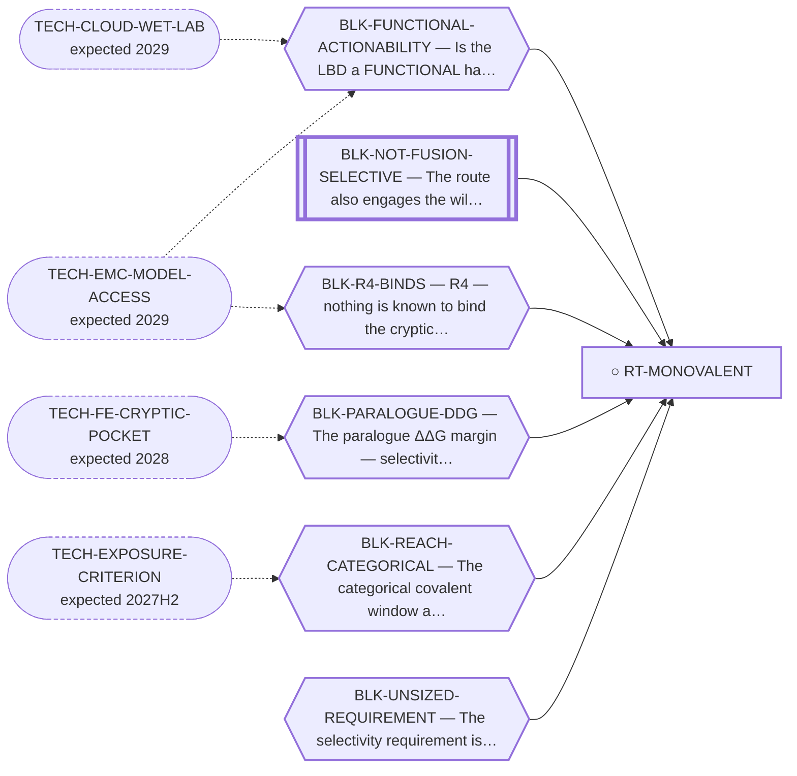

<!-- GENERATED FILE — DO NOT EDIT. Regenerate with:
     python3 systems/systems_check.py --write-views
     Source of truth: systems/graph/*.json -->

# RT-MONOVALENT — Monovalent LBD pocket modulation — a molecule that only OCCUPIES the NR4A3 LBD

**Family:** [ST-OCCUPANCY](L1-st-occupancy.md) · **state:** ○ blocked · computed · confidence low · verified 2026-08-28

**Grade** (owned by [`research/manuscripts/occupancy/nr4a3-monovalent-pocket-route.md`](../../research/manuscripts/occupancy/nr4a3-monovalent-pocket-route.md#7--grade-against-the-failure-record)): REGISTERED, NOT PROMOTED — and specifically a DOWNGRADE of what the probe framing implies about a monovalent drug

## What has to land for this route to move

**Reading it.** A solid arrow is what holds this route down today. A dashed arrow is a capability that WOULD retire a blocker — dashed because it has not landed, and the date beside it is a forecast, not a schedule.

⛔ **1 of these is permanent** (`BLK-NOT-FUSION-SELECTIVE`) — a fact about the biology, drawn double-walled, with no way out by definition. No technology arrives to fix it.

⚠ **1 blocker here has no technology named at all** (`BLK-UNSIZED-REQUIREMENT`) — not *waiting*, **unaddressed**. A blocker with no named way out is the most expensive kind, because nothing is being watched for it.

✓ Already cleared by this route: `BLK-INDUCED-COMPLEX`, `BLK-TERNARY-GEOMETRY`.

## Scientific rationale

If the ligand-binding domain is a functional handle in the chimera, occupancy alone is enough and the entire ternary problem disappears. This is the cheapest possible version of the program, and it is registered explicitly as a DOWNGRADE of what the covalent-probe framing implies about a monovalent drug — the probe is a reagent, not evidence that occupancy is therapeutic.

## Supporting evidence

| ref | supports | strength |
|---|---|---|
| `EV-ZAIENNE-2022` | LBD-borne functional modulation of NOR-1, read out on an AF-1-less Gal4 hinge+LBD construct — on the WILD-TYPE receptor, not the fusion, and at an undefined site rather than the cryptic pocket | `transferred` |

## Remaining unknowns

- Whether the ligand-binding domain is functionally actionable in the fusion, whose other end is a strong independent activator. Nobody has run that assay.
- How much paralogue selectivity this route would need. ⭐ STATED 2026-08-07 (REQ-MONO-1/2/3, selectivity-requirement-sizing.md): a binary LBD ΔΔG against NR4A1 as a HARD gate and against NR4A2 as a disclosed residual, at RT·ln{[A/(1−A)]·[(1−B)/B]} — 0.50–3.49 kcal/mol over the plausible (A,B) rectangle and NOT bounded above, because the anti-target ceiling is unmeasured. ⛔ That range BRACKETS the degrader's figure rather than sitting under it, and the two are not comparable in any case; the covalent sub-form's requirement is a kinetic predicate rather than a ΔΔG at all.
- Whether the covalent sub-form's negative is real: it rests on an exposure criterion that fails its own positive control. ⚠ RE-TESTED 2026-08-28 and NOT settled: the E3-arm-free artifact that carries this negative (research/modalities/nr4a3-monovalent-reach.json) contains no exposure or RSA term — its two conventions are chain-length rules (through_space permissive, corridor conservative) — so the exposure criterion is not applied inside it. Whether the negative nonetheless inherits C7 through an upstream input has not been traced; that trace is $0 and it is what would settle this.

## Required validation

| what | instrument | feasible today | blocked by |
|---|---|---|---|
| A functional cell assay showing the domain is actionable in the chimera | ⛔ none built | **no** | BLK-FUNCTIONAL-ACTIONABILITY |
| A stated selectivity requirement this route would have to meet — ✅ DONE 2026-08-07, $0, research/manuscripts/degrader/selectivity-requirement-sizing.md §2. Stated as a pair (NR4A1 hard / NR4A2 soft) with the derivation and every assumption named. Its thresholds are forms with a range, not numbers, because the transfer functions that set A and B are unmeasured (MISSING-1, MISSING-2). | ⛔ none built | yes | — |

## Blockers

| blocker | kind | what would retire it |
|---|---|---|
| **BLK-FUNCTIONAL-ACTIONABILITY** | `requires_wet_lab` | `TECH-CLOUD-WET-LAB`, `TECH-EMC-MODEL-ACCESS` |
| **BLK-NOT-FUSION-SELECTIVE** | `fundamental_biological_limit` | *permanent* |
| **BLK-PARALOGUE-DDG** | `requires_better_simulation_accuracy` | `TECH-FE-CRYPTIC-POCKET` |
| **BLK-R4-BINDS** | `requires_wet_lab` | `TECH-EMC-MODEL-ACCESS` |
| **BLK-REACH-CATEGORICAL** | `scientific_uncertainty` | `TECH-EXPOSURE-CRITERION` |
| **BLK-UNSIZED-REQUIREMENT** | `requires_wet_lab` | Obtain the three dose-responses named as MISSING-1, MISSING-2 and MISSING-4 in selectivity-requirement-sizing.md. Until then the thresholds stay as stated forms with an explicit range and no upper bound. ⛔ NOT retired by any computation: a genotype bounds developmental, complete, lifelong loss and cannot be inverted into an adult tolerated occupancy, and no in-silico instrument produces an occupancy-to-output transfer function. |

## Blockers this route RETIRES

- **BLK-TERNARY-GEOMETRY** — Ternary geometry — assembly, E3, exit vector, ubiquitin transfer
- **BLK-INDUCED-COMPLEX** — An induced ternary/bivalent complex is still required (a second protein must be placed)

## Not to be confused with

| route | the axis it turns on | blockers the distinction turns on | why |
|---|---|---|---|
| [RT-COVALENT-PROBE](L2-rt-covalent-probe.md) | what the molecule has to DO once bound | `BLK-FUNCTIONAL-ACTIONABILITY`, `BLK-UNSIZED-REQUIREMENT` | ⭐ THE FAILURE-3 PAIR. This route adds a make-or-break no other LBD route carries — functional actionability of the LBD IN THE CHIMERA — which cannot be computed, cannot be bought, and is not covered by the delegated dTAG test. The probe framing is untouched by all of it |
| [RT-TCIP](L2-rt-tcip.md) | how many termini the molecule has | `BLK-FUNCTIONAL-ACTIONABILITY`, `BLK-INDUCED-COMPLEX` | monovalent is strictly cleaner on the ternary axis — no second protein at all — while TCIP still inherits the induced-complex problem. The monovalent reach result therefore does not transfer to TCIP and vice versa |
| [RT-6MP](L2-rt-6mp.md) | which domain the mechanism lives in | `BLK-FUNCTIONAL-ACTIONABILITY` | 6-MP is closed because it acts through the AF-1, the AF-1, which the chimera RETAINS (premise corrected 2026-08-06). That closure does NOT close LBD-directed modulation — the published LBD-borne functional result was read out on a Gal4-NOR-1-LBD construct that is itself AF-1-less |
| [RT-DEGRADER](L2-rt-degrader.md) | whether a degradation geometry is needed at all | `BLK-FUNCTIONAL-ACTIONABILITY`, `BLK-UNSIZED-REQUIREMENT` | the degrader only has to BIND and be degraded; a monovalent modulator has to change what the chimera DOES, which is a make-or-break the degrader does not carry |

## Readiness — what this could become today

**`internal_note`**

Its central premise — that occupancy does something — has never been tested by anyone, and its one computed negative rests on a criterion known to produce false negatives.

**Missing:**
- a functional readout
- the occupancy-to-output transfer functions that would turn the stated requirement into a number (MISSING-1, MISSING-2)

**Experiment required:**
- a reporter assay for the domain's function inside the chimera

## Where this route ends — the paper

**[PUB-MONOVALENT](L3-publications.md)** — [The monovalent pocket-modulation route — a small molecule that only occupies the NR4A3 LBD](../../research/manuscripts/occupancy/nr4a3-monovalent-pocket-route.md)

`primary` · ◐ `drafted` · aimed at `internal_note`

**This route contributes:** The whole memo: that occupancy without recruitment is a separate question nobody has asked, and what a sized selectivity requirement for it would have to look like.

**The paper would claim:** Occupancy of the NR4A3 pocket without recruitment is a distinct route from degradation, and the question of whether occupancy alone changes the fusion's behaviour has never been asked by anyone — so the route is untested rather than refuted.

## Strategic timing — the wait equation

**Recommendation: `pursue_now`**

The free specification work is DONE (2026-08-07, REQ-MONO-1/2/3): the requirement now exists as a pair with its derivation and every assumption named, so a later result can be shown to MEET or MISS it. What remains splits in two — the thresholds need bench dose-responses (MISSING-1, MISSING-2) and no computation produces them, while the covalent sub-form's negative can still be re-tested at $0 by tracing whether it inherits the defective exposure criterion.

| horizon | effect |
|---|---|
| Six months | None on the biology; the specification work is DONE (2026-08-07) and what is left of the requirement needs a bench (MISSING-1, MISSING-2). |
| Two years | Depends entirely on whether a functional readout becomes reachable. |
| Cost trend | flat |
| Automation outlook | The specification is reasoning, not computation. |

## Claim ceiling — what this route may NOT be used to claim

*Inherited from [ST-OCCUPANCY](L1-st-occupancy.md), which is where these are asserted — a family limitation binds every route inside it.*

- Whether the ligand-binding domain is a functional handle in the fusion — whose other end is a strong independent activator — has never been tested by anyone.
- Nobody has stated how much paralogue selectivity this family would need, so 'the requirement is smaller here' is not a claim this repository can make.
- The covalent sub-form's negative result rests on an exposure criterion that fails its own positive control, so it is a rank and not a verdict.

## Closure

`instrument_limit` — ⚠ Its covalent sub-form's negative rests on a geometry computed with an exposure cutoff that fails its own control and a site question left INCONCLUSIVE — so the result can refute the route and cannot make the closure permanent. Its functional-actionability blocker is separate and needs a bench.

## Best next action

Trace whether the covalent sub-form's negative actually inherits the defective exposure criterion C7. ⚠ RE-TESTED 2026-08-28: the free action this row named — write the selectivity requirement — was DONE on 2026-08-07 (REQ-MONO-1/2/3, research/manuscripts/degrader/selectivity-requirement-sizing.md §2), and this row had not been touched since the graph was created on 2026-08-05. The E3-arm-free artifact that carries the negative (research/modalities/nr4a3-monovalent-reach.json) contains no exposure or RSA term at all, so the caveat closure_note states may be inherited from an upstream input rather than applied inside it. The trace is $0 and it decides whether this route's one computed result stands.

*Cost:* $0

## What this route rests on — drill down

*L4 instruments and L5 objects, evidence and artifacts. Every row here is asserted by this route; the [evidence base](L5-evidence-base.md) shows the same edges from the other end.*

| L4 instrument | cited as | known-answer control |
|---|---|---|
| [INS-MONOVALENT-REACH](registers/instruments.md) — Paired monovalent-vs-bivalent covalent reach enumeration (E3 arm remov | **disclosed failing** | `passes` |
| [V3](registers/instruments.md) — Ligand pose prediction (dock + MM-GBSA) | **disclosed failing** | `inconclusive` |
| [V17](registers/instruments.md) — The exposure criterion EXPOSED_RSA = 0.25 | **disclosed failing** | `fails` |

**L5 objects:** [OBJ-NR4A3-AF1](L5-evidence-base.md#objects--the-biological-and-molecular-entities-the-program-reasons-about), [OBJ-NR4A3-LBD-CATALOGUE](L5-evidence-base.md#objects--the-biological-and-molecular-entities-the-program-reasons-about), [OBJ-NR4A3-LBD-MODELLED](L5-evidence-base.md#objects--the-biological-and-molecular-entities-the-program-reasons-about), [OBJ-NR4A3-WT](L5-evidence-base.md#objects--the-biological-and-molecular-entities-the-program-reasons-about), [OBJ-RES-C397](L5-evidence-base.md#objects--the-biological-and-molecular-entities-the-program-reasons-about)

**L5 evidence:** [EV-ZAIENNE-2022](L5-evidence-base.md#evidence--the-literature-this-program-cites)

**L5 artifacts:** [ART-MONOVALENT-REACH](L5-evidence-base.md#artifacts--the-files-a-claim-can-be-checked-against)

[← ST-OCCUPANCY](L1-st-occupancy.md) · [← L0](L0-ecosystem.md)
