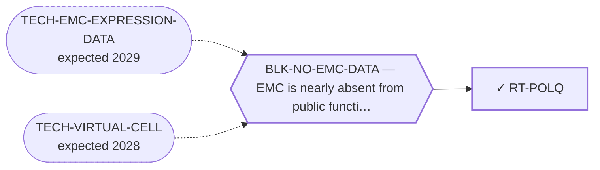

<!-- GENERATED FILE — DO NOT EDIT. Regenerate with:
     python3 systems/systems_check.py --write-views
     Source of truth: systems/graph/*.json -->

# RT-POLQ — POLθ inhibition (microhomology-mediated end joining)

**Family:** [ST-DEPENDENCY](L1-st-dependency.md) · **state:** ✓ parked · computed · confidence moderate · verified 2026-08-09

**Grade** (owned by [`research/modalities/census-route-expression-grading.json`](../../research/modalities/census-route-expression-grading.json)): ⛔ NOT SUPPORTED — THE COMBINATION IS ABSENT (2026-08-09, corrected the same day). The class needs alt-EJ UP together with homologous recombination DOWN. ⚠ CORRECTION: this grade first said neither half was present, and that was wrong. The alt-EJ MODULE is HIGHER in EMC on BOTH platforms, concordantly, with every readable member higher on both, and the NHEJ contrast is flat — so the elevation is specific AGAINST NHEJ. ⚠ It is not shown to be specific more broadly, and on GPL3290 not at all: the homologous-recombination module rises MORE there than the alt-EJ module (+0.2658 against +0.2578 SD), and only GPL6244 separates them (+0.087 against -0.0438). ⚠ Three of the module's four members (LIG3, PARP1, XRCC1) are single-strand-break and base-excision-repair factors, and no contrast against that pathway was read. What is absent is the OTHER half: the homologous-recombination arm is flat to mildly higher rather than down. ⚠ And the absent half is the one this instrument is least able to measure, because an HR defect is usually a mutation and can sit behind normal transcript. That makes this a weaker negative than the group scores alone suggest. ⚠ The route's own primary gene is readable on one platform only and sits in the bottom quarter of that array — the module carries the observation, not the single gene.

## What has to land for this route to move

**Reading it.** A solid arrow is what holds this route down today. A dashed arrow is a capability that WOULD retire a blocker — dashed because it has not landed, and the date beside it is a forecast, not a schedule.

## Scientific rationale

The newest DNA-damage-response class and the one the existing class-inheritance argument was never extended to. If the FET-rearrangement replication-stress premise holds at all it is a premise about a repair state, and this class exploits a different arm of the same state — so it is testable with the instrument already built rather than with a new one.

## Supporting evidence

| ref | supports | strength |
|---|---|---|
| `ART-CENSUS-ROUTE-GRADING` | the alt-EJ module is concordantly higher in EMC on both platforms with a flat NHEJ contrast, while the homologous-recombination arm is not down — so the combination this class requires is absent although one half of it is present | `direct` |

## Remaining unknowns

- Whether a homologous-recombination DEFECT is present behind normal HR transcript, which is the usual situation and which this instrument cannot see — the single largest reason this negative is weak.
- Why the alt-EJ module is elevated at all, which is unexplained and which the general repair-transcription reading does not cover, since the NHEJ contrast is flat.
- Whether the replication-stress premise the neighbouring DDR route rests on survives its own WEAK grade — this route inherits that uncertainty and does not resolve it.

## Required validation

| what | instrument | feasible today | blocked by |
|---|---|---|---|
| The expression or committed-artifact lookup that selects this class | ⛔ none built | yes | — |
| A measurement in a fusion-positive EMC model | ⛔ none built | **no** | BLK-NO-WET-LAB |

## Blockers

| blocker | kind | what would retire it |
|---|---|---|
| **BLK-NO-EMC-DATA** | `insufficient_data` | `TECH-EMC-EXPRESSION-DATA`, `TECH-VIRTUAL-CELL` |

## Readiness — what this could become today

**`internal_note`**

The combination test was run and the combination is absent, but one half of it IS present and the missing half is the half this data cannot properly measure.

**Missing:**
- nothing at the expression level — the class selects on a lesion this data cannot see, and on what it CAN see the answer is negative

## Where this route ends — the paper

**[PUB-BIOMARKER-DEP](L3-publications.md)** — [Biomarker-selected therapeutic classes in an ultra-rare sarcoma — what the available expression data excludes](../../research/manuscripts/dependency/emc-biomarker-selected-classes.md)

`contributing` · ◐ `drafted` · aimed at `preprint`

**This route contributes:** One of six biomarker-selected classes whose selecting feature is readable in expression data already public for this disease, and whose most useful output is exclusion.

**The paper would claim:** Five therapeutic classes are selected by a molecular state rather than by a histology, every selecting feature is readable in expression data already public for this disease, and the useful output is which classes the data rules OUT rather than which it nominates. Four selecting features are absent; the fifth class survives because the instrument cannot reach its question rather than because the data was favourable. The four negatives are deliberately NOT reported as equally strong.

## Strategic timing — the wait equation

**Recommendation: `monitor`**

It would take a mutational read of the repair genes, which no EMC cohort supplies.

| horizon | effect |
|---|---|
| Cost trend | flat |

**Revisit when:**
- **TECH-EMC-EXPRESSION-DATA** — A fetchable public EMC RNA-seq or proteomics deposit beyond the single existing model, enabling a target-regulon readout and per-a *(expected 2029, basis `speculative`)*

## Claim ceiling — what this route may NOT be used to claim

*Inherited from [ST-DEPENDENCY](L1-st-dependency.md), which is where these are asserted — a family limitation binds every route inside it.*

- The dependency transfer prior came back negative on the available data — a measured premise, revivable only by EMC-specific data.
- One route rests on class inheritance: no NR4A3 fusion has been tested for the phenotype it assumes.
- There is one EMC model in public dependency data, with no CRISPR data, so this family's in-silico half is bounded by a sample size of one.

## Best next action

Report the alt-EJ elevation alongside the negative rather than burying it — it is the one half of this class's requirement that this disease does appear to meet, and it is concordant across both platforms.

*Cost:* $0

[← ST-DEPENDENCY](L1-st-dependency.md) · [← L0](L0-ecosystem.md)
