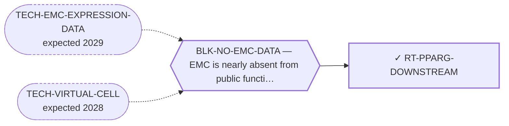

<!-- GENERATED FILE — DO NOT EDIT. Regenerate with:
     python3 systems/systems_check.py --write-views
     Source of truth: systems/graph/*.json -->

# RT-PPARG-DOWNSTREAM — PPARG downstream-effector (repurpose TZDs)

**Family:** [ST-REPURPOSING](L1-st-repurposing.md) · **state:** ✓ blocked · concept · confidence low · verified 2026-08-28

**Grade** (owned by [`research/manuscripts/program/target-route-options.md`](../../research/manuscripts/program/target-route-options.md#route-5--downstream-of-the-fusion-pparg-and-the-transactivated-nodes)): ★ keep, unblock cheaply

## What has to land for this route to move

**Reading it.** A solid arrow is what holds this route down today. A dashed arrow is a capability that WOULD retire a blocker — dashed because it has not landed, and the date beside it is a forecast, not a schedule.

✓ Already cleared by this route: `BLK-PARALOGUE-DDG`, `BLK-R4-BINDS`, `BLK-TERNARY-GEOMETRY`.

## Scientific rationale

If the fusion drives its phenotype partly through PPARγ signalling, then an approved agent acting on that axis reaches the driver's output without touching the driver. Repurposing a well-characterised drug class is far cheaper than any new modality.

## Supporting evidence

| ref | supports | strength |
|---|---|---|
| `ART-EMC-EXPRESSION-PANELS` | The receptor-ACTIVITY readout this route's direction turns on. PPARγ target genes are coordinately higher in EMC tumour tissue than in comparator sarcomas beyond a size-matched random set, on both readable array platforms, with a knockout-UP falsifier arm carried alongside — AND the same data cannot separate that from an adipogenic differentiation programme, whose proxy is set-specific up on both platforms too and overlaps the occupancy-derived arm more than any other pair in the table. Most arms are mouse-derived, an orthology assumption carried into human transcripts. It says nothing about the direction of any pharmacological intervention on this axis. | `direct` |

## Remaining unknowns

- The direction is unresolved rather than refuted, and the reason is NOT absence of study: the two EMC expression studies that report PPARG proposed OPPOSITE directions from the same observation (Subramanian 2005 → PPARG inhibitors; Filion 2009 → PPARG agonists), and the single functional test favouring agonism was run in H-EMC-SS (OBJ-LINE-HEMCSS, identity disputed). ⚠ The redundancy clause is WITHDRAWN — it is not in the source it cited, and Filion et al. argue the opposite in their own discussion. One home: research/manuscripts/repurposing/pparg-direction-emc.md
- The in-vivo evidence for agonism (Higuchi 2023) uses H-EMC-SS (OBJ-LINE-HEMCSS, identity disputed); whether the MOUSE experiment used that line is UNREAD — the paper is not open access and its full text has not been retrieved.

## Required validation

| what | instrument | feasible today | blocked by |
|---|---|---|---|
| A literature read of the PPARγ-axis direction in EMC (agonism vs antagonism) via the Europe PMC CI lane — ✅ DONE 2026-08-06, research/manuscripts/repurposing/pparg-direction-emc.md: UNRESOLVED, leaning agonism, tier T1 with a model-identity caveat | ⛔ none built | yes | — |
| A PPARγ TARGET-GENE (activity) readout in EMC — ✅ TAKEN 2026-08-24, analysed in research/manuscripts/fusion-output/nr4a3-fusion-transcriptional-output-SI.md §S4, from ART-EMC-EXPRESSION-PANELS reads.read_3_PPARG_ACTIVITY — that section owns every figure and none is restated here. It does NOT settle the direction; the residual is an adipogenic ceiling, not missing data. | ⛔ none built | yes | — |
| A readout that separates PPARγ receptor output from lineage/adipogenic composition — bulk archival tissue cannot, which is a study-design limit rather than a data-availability one, so a further bulk expression cohort does not lift it | ⛔ none built | **no** | BLK-NO-WET-LAB |

## Blockers

| blocker | kind | what would retire it |
|---|---|---|
| **BLK-NO-EMC-DATA** | `insufficient_data` | `TECH-EMC-EXPRESSION-DATA`, `TECH-VIRTUAL-CELL` |

## Blockers this route RETIRES

- **BLK-PARALOGUE-DDG** — The paralogue ΔΔG margin — selectivity that reduces to exp(−ΔΔG/RT)
- **BLK-TERNARY-GEOMETRY** — Ternary geometry — assembly, E3, exit vector, ubiquitin transfer
- **BLK-R4-BINDS** — R4 — nothing is known to bind the cryptic pocket at all

## Not to be confused with

| route | the axis it turns on | blockers the distinction turns on | why |
|---|---|---|---|
| [RT-TRABECTEDIN-PPARG](L2-rt-trabectedin-pparg.md) | whether the agonist acts alone | `BLK-NO-EMC-DATA` | this row is the agonist alone and its direction (agonism vs antagonism vs redundancy) is unresolved; the combination row's argument runs through promoter displacement and does not depend on resolving it the same way |
| [RT-RXR](L2-rt-rxr.md) | which receptor's dimer is being modulated | `BLK-NO-EMC-DATA` | RT-RXR closes an NR4A3:RXR dimer that does not form; this route is about PPARγ:RXR biology DOWNSTREAM of the fusion, a different dimer and not closed by it |

## Readiness — what this could become today

**`internal_note`**

Its central premise is directionally unresolved, and both cheap tests that were expected to resolve it have now been run. The literature read closed at T1-with-a-model-caveat; the activity read is coordinately up but cannot be separated from an adipogenic programme in bulk archival tissue. Publishing a repurposing hypothesis whose sign is unknown would be exactly the over-claim the language rules exist to prevent.

**Missing:**
- a readout that separates PPARγ receptor output from adipogenic/lineage composition — the target-gene activity readout itself is DONE (research/manuscripts/fusion-output/nr4a3-fusion-transcriptional-output-SI.md §S4, from ART-EMC-EXPRESSION-PANELS reads.read_3_PPARG_ACTIVITY — that section owns every figure and none is restated here) and hits that ceiling

## Where this route ends — the paper

**[PUB-REPURPOSING](L3-publications.md)** — [Existing drugs not yet reported in extraskeletal myxoid chondrosarcoma: a graded candidate menu from three independent generation methods](../../research/manuscripts/repurposing/repurposing-hypotheses.md)

`contributing` · ◐ `drafted` · aimed at `preprint`

**This route contributes:** The downstream-effector axis, carried with its direction flagged unresolved — scoped as unresolved and NOT refuted, which the paper must not conflate.

**The paper would claim:** Existing agents not yet reported in EMC can be mapped to EMC's molecular and microenvironmental axes by three independent methods, each candidate graded by an explicit evidence tier — a hypothesis-generating menu that asserts no efficacy for any agent it names.

## Strategic timing — the wait equation

**Recommendation: `monitor`**

⚠ SUPERSEDED, RETAINED: 'One cheap measurement settles it'. Both cheap measurements have been made — the literature read (2026-08-06) and the activity read (2026-08-24) — and the direction is still unresolved. What remains is not cheap and not ours to run.

| horizon | effect |
|---|---|
| Six months | None unless data lands. |
| Two years | ⚠ SUPERSEDED, RETAINED: 'Settled either way by an EMC dataset'. An EMC dataset arrived and did not settle it. What would is a readout resolving cell type, not another bulk cohort. |
| Cost trend | flat |
| Automation outlook | Automatic re-grade on new data. |

**Revisit when:**
- **TECH-EMC-EXPRESSION-DATA** — A fetchable public EMC RNA-seq or proteomics deposit beyond the single existing model, enabling a target-regulon readout and per-a *(expected 2029, basis `speculative`)*

## Claim ceiling — what this route may NOT be used to claim

*Inherited from [ST-REPURPOSING](L1-st-repurposing.md), which is where these are asserted — a family limitation binds every route inside it.*

- EMC is nearly absent from public functional-genomics data, so mechanism fit is argued from class membership rather than measured in this disease.
- Several routes here rest on a direction of effect that has never been read in EMC tissue; an expression readout would settle them cheaply and does not exist.
- A repurposing hypothesis is a hypothesis. Nothing here asserts efficacy in EMC.

## Best next action

The literature half is CLOSED (research/manuscripts/repurposing/pparg-direction-emc.md) and so is the ACTIVITY half: the PPARγ target-gene readout was TAKEN 2026-08-24 and is analysed in research/manuscripts/fusion-output/nr4a3-fusion-transcriptional-output-SI.md §S4 (from ART-EMC-EXPRESSION-PANELS reads.read_3_PPARG_ACTIVITY). What remains is a readout that separates PPARγ receptor output from lineage/adipogenic composition, which bulk archival tissue cannot supply — a study-design limit, not a data-availability one, so no further expression cohort lifts it. ⚠ Superseded, retained (rule 1.2): "The literature half is CLOSED (research/manuscripts/repurposing/pparg-direction-emc.md). What remains is a PPARγ activity readout in EMC, which is blocked by BLK-NO-EMC-DATA — not by an unrun literature pull."

*Cost:* $0

## What this route rests on — drill down

*L4 instruments and L5 objects, evidence and artifacts. Every row here is asserted by this route; the [evidence base](L5-evidence-base.md) shows the same edges from the other end.*

**L5 objects:** [OBJ-FUS-T1](L5-evidence-base.md#objects--the-biological-and-molecular-entities-the-program-reasons-about)

**L5 evidence:** [EV-FILION-2009](L5-evidence-base.md#evidence--the-literature-this-program-cites), [EV-HIGUCHI-2023](L5-evidence-base.md#evidence--the-literature-this-program-cites), [EV-SUBRAMANIAN-2005](L5-evidence-base.md#evidence--the-literature-this-program-cites)

**L5 artifacts:** [ART-EMC-EXPRESSION-PANELS](L5-evidence-base.md#artifacts--the-files-a-claim-can-be-checked-against)

[← ST-REPURPOSING](L1-st-repurposing.md) · [← L0](L0-ecosystem.md)
