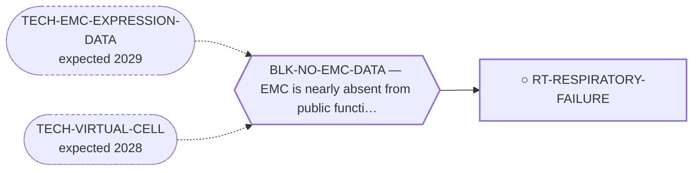

<!-- GENERATED FILE — DO NOT EDIT. Regenerate with:
     python3 systems/systems_check.py --write-views
     Source of truth: systems/graph/*.json -->

# RT-RESPIRATORY-FAILURE — Progressive pulmonary metastatic burden and respiratory failure

**Family:** [ST-MORTALITY-MECHANISM](L1-st-mortality-mechanism.md) · **state:** ○ ready · concept · confidence low · verified 2026-08-09

**Grade** (owned by [`research/manuscripts/emc-mortality-mechanisms.md`](../../research/manuscripts/emc-mortality-mechanisms.md)): ⭑ Registered 2026-08-09 from trimcrae's mechanism-of-death question; the family this route sits in did not exist before that day.

## What has to land for this route to move

**Reading it.** A solid arrow is what holds this route down today. A dashed arrow is a capability that WOULD retire a blocker — dashed because it has not landed, and the date beside it is a forecast, not a schedule.

## Scientific rationale

Distant spread in this disease is mostly to lung, and patients survive years with it, so the terminal event is reached slowly rather than suddenly. That matters for what could help: a mechanism approached over years is the one least amenable to acute rescue and most exposed to cumulative symptom-directed management -- oxygen, effusion control, airway and breathlessness management. The mechanism is asserted everywhere in the clinical prose and tabulated nowhere.

## Remaining unknowns

- Whether respiratory failure is in fact the most common terminal event, which requires reading the published case record rather than assuming it from the metastatic pattern.
- Whether any symptom-directed management of that course changes survival as opposed to changing symptoms, which has never been measured in this disease.
- How much of the terminal course is respiratory at all, given that case reports over-represent dramatic events and under-report ordinary decline.

## Required validation

| what | instrument | feasible today | blocked by |
|---|---|---|---|
| A classified terminal-event corpus drawn from the open-access EMC literature, with each mechanism resolving to a quoted sentence | ⛔ none built | yes | — |
| A prospective symptom-directed intervention in EMC patients, which needs a clinic | ⛔ none built | **no** | BLK-NO-WET-LAB |

## Blockers

| blocker | kind | what would retire it |
|---|---|---|
| **BLK-NO-EMC-DATA** | `insufficient_data` | `TECH-EMC-EXPRESSION-DATA`, `TECH-VIRTUAL-CELL` |

## Readiness — what this could become today

**`internal_note`**

Registered 2026-08-09 at concept maturity; the honest output today is the question and its cheapest next observation.

## Where this route ends — the paper

**[PUB-MORTALITY-MECHANISM](L3-publications.md)** — [What kills patients with extraskeletal myxoid chondrosarcoma, and the survival available to tumour-directed therapy: a cause-of-death and relative-survival analysis of the published record](../../research/manuscripts/emc-mortality-mechanisms-paper.md)

`contributing` · ◐ `drafted` · aimed at `preprint`

**This route contributes:** The mechanism half of the paper: what the terminal event actually is, quoted from the record rather than inferred from the metastatic pattern.

**The paper would claim:** In extraskeletal myxoid chondrosarcoma the published record does not state a mechanism for most recorded deaths; where it does, competing causes and second malignancies are the largest identifiable category and respiratory failure is not dominant. Between a fifth and a third of deaths after diagnosis are not attributed to the tumour -- a figure relative survival and registry cause attribution agree on despite sharing no input -- so the survival available to all antitumour therapy taken together is bounded at 6.7 percentage points in localised disease against 31.0 in metastatic disease.

## Strategic timing — the wait equation

**Recommendation: `pursue_now`**

The retrieval is already running and the classification after it costs only reading, so this is the cheapest unanswered question in the family.

| horizon | effect |
|---|---|
| Cost trend | flat |

## Claim ceiling — what this route may NOT be used to claim

*Inherited from [ST-MORTALITY-MECHANISM](L1-st-mortality-mechanism.md), which is where these are asserted — a family limitation binds every route inside it.*

- The competing-mortality figure is arithmetic on published summary percentages from heterogeneous studies, not a competing-risks model, and most pairings cross populations.
- Every supportive-care effect size available to this family was measured in some other cancer; no EMC-specific supportive-care outcome data exists at all.
- Nothing in this family asserts efficacy, safety, a therapeutic window or clinical readiness, and a mechanism being common is not evidence that treating it changes survival.

## Best next action

Classify the retrieved death-cue sentences by mechanism and report the unstated fraction honestly.

*Cost:* $0

[← ST-MORTALITY-MECHANISM](L1-st-mortality-mechanism.md) · [← L0](L0-ecosystem.md)
