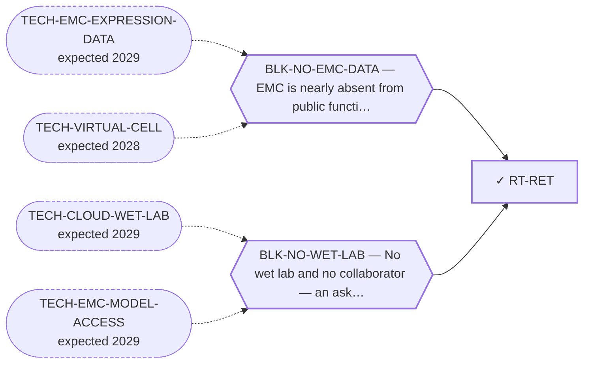

<!-- GENERATED FILE — DO NOT EDIT. Regenerate with:
     python3 systems/systems_check.py --write-views
     Source of truth: systems/graph/*.json -->

# RT-RET — RET-selective inhibitors

**Family:** [ST-REPURPOSING](L1-st-repurposing.md) · **state:** ✓ parked · computed · confidence moderate · verified 2026-08-09

**Grade** (owned by [`research/modalities/emc-ret-activation-bar.json`](../../research/modalities/emc-ret-activation-bar.json)): ⛔ SPLIT ON EXPRESSION, AND THE ELIGIBILITY BAR IS THE REAL CLOSURE (2026-08-09, folding a record read 2026-08-07). ARRAY HALF, unchanged: RET itself is higher in EMC on both platforms, but the co-receptors are strongly LOWER on both and the ligands are LOWER on both — the module that switches the receptor on is depleted relative to comparator sarcomas. ⛔ THE ACTIVATION CLAIM DOES NOT SURVIVE READING. Its single source states activation in one abstract sentence about 'a limited set' of at most ten tumours; the number read, the number positive, the assay that produced the word, and whether cellularity was controlled are ALL unrecoverable, and the paper is paywalled so no $0 route reaches them. A 272-record open-access corpus contains no phospho-RET stain, no immunohistochemistry series with a denominator, and no ligand measurement in this disease at all. ⛔ AND THE APPROVED AGENTS DO NOT ADDRESS THIS STATE: they are approved on RET FUSION- or MUTATION-positive disease and the pan-tumour companion diagnostic detects fusions, while EMC's reported state is over-expression of wild-type receptor with no recurring genomic abnormality beyond the driver. ⚠ The corpus absence is bounded — the one paper that matters most is paywalled and so could never appear in a full-text scan; its absence there is an instrument limit and not evidence. ⭐ AND THE SHARPEST EVIDENCE ON THIS ROUTE WAS FOUND 2026-08-27, IN A PAPER THIS ROUTE HAD NEVER READ: PMID 29937513 (Urbini et al., Int J Mol Sci 2018, PMC6073125, DOI 10.3390/ijms19071855) is by the SAME GROUP as the 2014 activation report — Stacchiotti, Casali, Pantaleo, Dei Tos, Maestro, Dagrada and Pilotti are all authors of both — and its abstract states, verbatim: 'Recently, we reported on the therapeutic activity of sunitinib in a series of EMC cases, however the molecular target of sunitinib in EMC is unknown.' Its introduction restates the RET observation ('EMC tumor specimens showed RET proto-oncogene expression and activation, while no other predictive biological markers of response were identified') in the same paper that calls the target unknown. ⛔ THAT REDIRECTS THIS ROUTE'S FRAMING: the originating authors did NOT treat their own observation as identifying the target of sunitinib in this disease, so the overstatement is not theirs. The drift is downstream and is documented at one identifier: PMID 28423517's introduction, read in full text 2026-08-27, renders it as 'analysis of receptor tyrosine kinase (RTK) activity demonstrated elevated expression and activation of RET, a known target of sunitinib' — dropping the source's own 'a limited set of samples' qualifier — and that same paper's discussion calls RET 'clinically targetable' while its own measurement is transcript abundance. ⚠ HOW MUCH DOWNSTREAM WEIGHT EXISTS IS UNKNOWN: no citation count for PMID 24703573 is reachable at $0 through the instruments this repository has. What IS measured (PubMed, 2026-08-27) is that only FIVE records in all of PubMed pair extraskeletal myxoid chondrosarcoma with RET or sunitinib at title/abstract level — PMIDs 24703573, 23058004, 24555529, 28423517, 29937513 — and the newest is 2018. A co-mention search is not a citation count, so the phrase 'a decade of citation' is NOT supported as a volume claim by anything read here.

## What has to land for this route to move

**Reading it.** A solid arrow is what holds this route down today. A dashed arrow is a capability that WOULD retire a blocker — dashed because it has not landed, and the date beside it is a forecast, not a schedule.

## Scientific rationale

The highest-ranked lane of the 2026-08-07 sweep and still not a route. It is the only kinase reported as both expressed and activated in this disease, the observation comes from independent groups, selective inhibitors are approved in other indications, and the finding has stood without follow-up for over a decade.

## Supporting evidence

| ref | supports | strength |
|---|---|---|
| `ART-CENSUS-ROUTE-GRADING` | RET transcript is higher in EMC than in comparator sarcomas on both readable platforms | `direct` |
| `ART-CENSUS-ROUTE-GRADING` | the GFRα co-receptor and GDNF-family ligand modules are LOWER in EMC on both platforms, which weakens a ligand-dependent activation route for the receptor | `direct` |
| `ART-RET-ACTIVATION-BAR` | the activation claim rests on one paywalled abstract sentence about an unrecoverable number of tumours, no EMC paper in a 272-record open-access corpus reports a phospho-RET or ligand measurement, and the approved selective agents are approved on a molecular state EMC is not reported to be in | `direct` |

## Remaining unknowns

- ⛔ ANSWERED 2026-08-09 and kept so it is not re-asked: the historical report does NOT survive as a measurement — it is one abstract sentence, on 'a limited set' of at most ten tumours, with no recoverable n, no assay attribution and no cellularity control.
- Whether the receptor is phosphorylated in EMC tumour cells at all, and in what fraction — the measurement that has never been made in this disease by anyone.
- Whether a co-receptor supply from stroma or nerve would be visible in bulk tumour transcript, which bounds how much the depleted-module reading can be asked to carry.
- Whether over-expression of the wild-type receptor is an eligible state for any selective agent anywhere, which the read corpus says it currently is not.

## Required validation

| what | instrument | feasible today | blocked by |
|---|---|---|---|
| The $0 corroboration named in this route's next action | ⛔ none built | yes | — |
| A response measurement in a fusion-positive EMC model | ⛔ none built | **no** | BLK-NO-WET-LAB |

## Blockers

| blocker | kind | what would retire it |
|---|---|---|
| **BLK-NO-EMC-DATA** | `insufficient_data` | `TECH-EMC-EXPRESSION-DATA`, `TECH-VIRTUAL-CELL` |
| **BLK-NO-WET-LAB** | `requires_external_collaboration` | `TECH-CLOUD-WET-LAB`, `TECH-EMC-MODEL-ACCESS` |

## Readiness — what this could become today

**`internal_note`**

Every $0 instrument that could speak to this route has now spoken. The expression half is split, the activation half does not survive reading, and the eligibility half is unfavourable.

**Missing:**
- the primary paper's full text, which is paywalled and unreachable at $0
- a phospho-receptor measurement in EMC tissue, which nobody has published

## Where this route ends — the paper

**[PUB-KINASE-LEADS](L3-publications.md)** — *Four kinase observations in extraskeletal myxoid chondrosarcoma that nobody followed up* (unwritten)

`contributing` · ◔ `outlined` · aimed at `preprint`

**This route contributes:** One of four kinase observations specific to this disease that exist in the published or curated record and that nobody has followed up.

**The paper would claim:** Four kinase-directed observations specific to this disease exist in the published and curated record — one reported as expressed and activated, one positive across a small series with an internal control, one an interaction curated on the driver protein itself, one an ex-vivo screen hit — and none has been followed up by anyone, in a disease with no targeted agent.

**It is not written because:** ⚠ ITS BLOCKER IS RETIRED — THE CONSOLIDATION IS DONE AND IT INVERTED THE PAPER. All four leads are graded as of 2026-08-09, and reading each one's own primary record demoted THREE of them in ways the leads' prose did not predict: the activation claim behind the strongest lead is a single paywalled abstract sentence with no recoverable denominator, and the approved agents address a molecular state this disease is not reported to be in; the screen hit turns out to sit beside two same-class hits belonging to a class the board already holds, and its named kinases have no probe on either platform so the arrays could never have attributed it; the interaction lead was measured on wild-type protein in a non-sarcoma tissue from one source. The fourth is discordant on the kinase and concordant on its substrate. ⭐ THAT IS THE PAPER NOW, and it is a better one than the consolidation that was planned: four EMC-specific kinase observations that the field has cited or left for one to two decades, each traced to what was actually measured, with the gap between the citation and the measurement stated. ⛔ Superseded, retained: "the consolidation has not been done — three of the four were surfaced two days before this endpoint was registered." ⚠ Two of the four gradings came from records that had been committed since 2026-08-07 and that the routes were registered without reading.

## Strategic timing — the wait equation

**Recommendation: `monitor`**

Only a phospho-receptor measurement in EMC tissue could reopen it, and none exists.

| horizon | effect |
|---|---|
| Cost trend | flat |

**Revisit when:**
- **TECH-EMC-MODEL-ACCESS** — Access to a patient-derived EMC model through a collaborator, or through a solo-affordable cloud or robotic wet-lab service with E *(expected 2029, basis `speculative`)*

## Claim ceiling — what this route may NOT be used to claim

*Inherited from [ST-REPURPOSING](L1-st-repurposing.md), which is where these are asserted — a family limitation binds every route inside it.*

- EMC is nearly absent from public functional-genomics data, so mechanism fit is argued from class membership rather than measured in this disease.
- Several routes here rest on a direction of effect that has never been read in EMC tissue; an expression readout would settle them cheaply and does not exist.
- A repurposing hypothesis is a hypothesis. Nothing here asserts efficacy in EMC.

## Best next action

Report it as the kinase paper's strongest lead and its clearest cautionary case: the one kinase reported activated in this disease, where reading the source shows the report cannot carry the weight a decade of citation has put on it.

*Cost:* $0

[← ST-REPURPOSING](L1-st-repurposing.md) · [← L0](L0-ecosystem.md)
