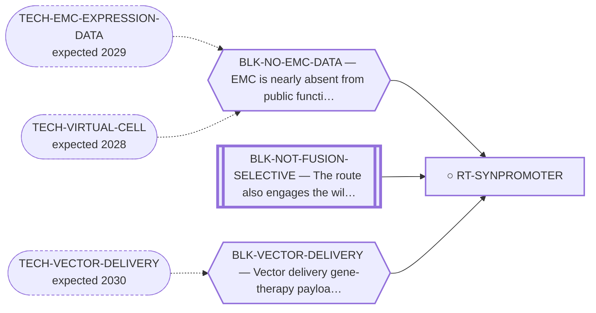

<!-- GENERATED FILE — DO NOT EDIT. Regenerate with:
     python3 systems/systems_check.py --write-views
     Source of truth: systems/graph/*.json -->

# RT-SYNPROMOTER — Fusion-driven synthetic promoter → suicide gene

**Family:** [ST-NUCLEIC-ACID](L1-st-nucleic-acid.md) · **state:** ○ parked · scoped · confidence moderate · verified 2026-08-05

**Grade** (owned by [`research/manuscripts/program/emc-post-degrader-options.md`](../../research/manuscripts/program/emc-post-degrader-options.md#route-14---the-fusion-driven-synthetic-promoter-and-the-precise-reason-emc-is-a-harder-case-than-ewing)): Tier 3 — vector delivery, AND EMC lacks the neomorphic DNA-binding element the technique depends on

## What has to land for this route to move

**Reading it.** A solid arrow is what holds this route down today. A dashed arrow is a capability that WOULD retire a blocker — dashed because it has not landed, and the date beside it is a forecast, not a schedule.

⛔ **1 of these is permanent** (`BLK-NOT-FUSION-SELECTIVE`) — a fact about the biology, drawn double-walled, with no way out by definition. No technology arrives to fix it.

✓ Already cleared by this route: `BLK-PARALOGUE-DDG`, `BLK-TERNARY-GEOMETRY`.

## Scientific rationale

Registered with its refutation attached. The technique depends on the fusion creating a neomorphic DNA-binding element that a synthetic promoter can be built against — and this fusion does not appear to create one, which is a measured statement about this disease rather than about the technique.

## Remaining unknowns

- Whether the absence of a neomorphic binding element is firmly established, or merely unmeasured in EMC — this is what distinguishes a closed route from a data-blocked one.

## Required validation

| what | instrument | feasible today | blocked by |
|---|---|---|---|
| A direct read of the fusion's DNA-binding specificity in EMC  ⭐ ADJUDICATED 2026-09-02 (AUT-PD-116, seat s31-emc-data-blocks). ⛔ BLK-NO-EMC-DATA IS CORRECT ON THIS ENTRY AND STAYS — a second recorded disagreement with S32. A direct read of the fusion's DNA-binding specificity in EMC is a ChIP experiment in a system expressing the fusion; that is functional-genomics data, and a deposited peak set would satisfy the entry without a lab. BLK-NO-WET-LAB is added for the arm where we would have to run it. NR4A3 has no assigned probe in the fourth cohort. ⚠ THE RULE THIS APPLIES, THE FOURTH COHORT'S DESIGN AND LIMITS, AND THE PER-GENE COVERAGE ALL HAVE ONE HOME AND ARE NOT RESTATED HERE: research/modalities/emc-fourth-cohort-route-readout.json — its "⭐ the_rule_this_adjudication_applies" field, its cohort block, and per_route.RT-SYNPROMOTER. | ⛔ none built | **no** | BLK-NO-EMC-DATA, BLK-VECTOR-DELIVERY, BLK-NO-WET-LAB |

## Blockers

| blocker | kind | what would retire it |
|---|---|---|
| **BLK-NO-EMC-DATA** | `insufficient_data` | `TECH-EMC-EXPRESSION-DATA`, `TECH-VIRTUAL-CELL` |
| **BLK-NOT-FUSION-SELECTIVE** | `fundamental_biological_limit` | *permanent* |
| **BLK-VECTOR-DELIVERY** | `requires_future_technology` | `TECH-VECTOR-DELIVERY` |

## Blockers this route RETIRES

- **BLK-PARALOGUE-DDG** — The paralogue ΔΔG margin — selectivity that reduces to exp(−ΔΔG/RT)
- **BLK-TERNARY-GEOMETRY** — Ternary geometry — assembly, E3, exit vector, ubiquitin transfer

## Not to be confused with

| route | the axis it turns on | blockers the distinction turns on | why |
|---|---|---|---|
| [RT-RIBOZYME](L2-rt-ribozyme.md) | what the fusion is sensed BY | `BLK-NOT-FUSION-SELECTIVE` | ⭐ the REASON this route fails is itself a computed-and-cited EMC result and belongs in a paper even though the route does not — EMC's fusion reads a normal NR4A response element, not a neomorphic one |

## Readiness — what this could become today

**`internal_note`**

Closed on a premise about this fusion's biology; the useful output is the reasoning, not a result.

**Missing:**
- a direct binding-specificity read in EMC

## Where this route ends — the paper

**[PUB-CLOSED-ROUTES](L3-publications.md)** — [Seven routes closed on argument rather than on experiment — the negative record of an EWSR1::NR4A3 route search](../../research/manuscripts/methods-record/closed-routes-negative-record.md)

`contributing` · ◐ `drafted` · aimed at `preprint`

**This route contributes:** A closure resting on a premise about this fusion's binding specificity — reopenable on an EMC dataset, and so the paper's example of a closure that is not permanent.

**The paper would claim:** A route can be closed rigorously without an experiment when the closure is definitional or is arithmetic over a fixed measured fact, and separating those permanent closures from the merely instrument-limited ones is what keeps a portfolio from re-litigating settled questions — with wild-type NR4A3 pharmacology failing to transfer to the chimera as the worked example.

## Strategic timing — the wait equation

**Recommendation: `monitor`**

Closed on a premise rather than definitionally, so an EMC dataset that measured the fusion's binding specificity could in principle reopen it — which is exactly why it is `premise_false` and not `definitional`.

| horizon | effect |
|---|---|
| Six months | None. |
| Two years | Only via an EMC dataset. |
| Cost trend | flat |
| Automation outlook | Not applicable. |

**Revisit when:**
- **TECH-VECTOR-DELIVERY** — A gene-therapy vector that reaches a solid tumour at therapeutic coverage *(expected 2030, basis `speculative`)*
- **TECH-EMC-EXPRESSION-DATA** — A fetchable public EMC RNA-seq or proteomics deposit beyond the single existing model, enabling a target-regulon readout and per-a *(expected 2029, basis `speculative`)*

## Claim ceiling — what this route may NOT be used to claim

*Inherited from [ST-NUCLEIC-ACID](L1-st-nucleic-acid.md), which is where these are asserted — a family limitation binds every route inside it.*

- Delivery of an oligonucleotide to a non-hepatic solid tumour has no validated solution, and this is not solvable in silico today.
- Predicted specificity rests in part on a conservative heuristic rather than a calibrated cleavage-activity model.
- The vector-delivered sub-routes carry a second, distinct delivery problem that must not be conflated with the oligonucleotide one.

## Closure

`premise_false` — ⭐ EMC lacks the neomorphic DNA-binding element the technique depends on — a measured premise about EMC's fusion, and the reason it fails is itself a computed EMC result worth publishing.

## Best next action

Keep registered with the premise stated. If an EMC dataset lands, re-read the binding specificity before re-closing.

*Cost:* $0

## What this route rests on — drill down

*L4 instruments and L5 objects, evidence and artifacts. Every row here is asserted by this route; the [evidence base](L5-evidence-base.md) shows the same edges from the other end.*

**L5 objects:** [OBJ-FUS-T1](L5-evidence-base.md#objects--the-biological-and-molecular-entities-the-program-reasons-about), [OBJ-NR4A3-DBD](L5-evidence-base.md#objects--the-biological-and-molecular-entities-the-program-reasons-about)

[← ST-NUCLEIC-ACID](L1-st-nucleic-acid.md) · [← L0](L0-ecosystem.md)
