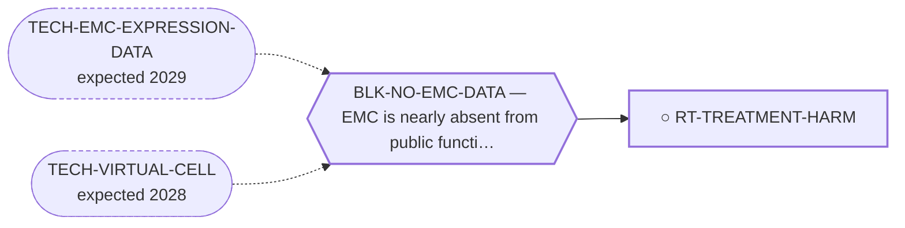

<!-- GENERATED FILE — DO NOT EDIT. Regenerate with:
     python3 systems/systems_check.py --write-views
     Source of truth: systems/graph/*.json -->

# RT-TREATMENT-HARM — De-escalating cytotoxic therapy that has no measured EMC response

**Family:** [ST-MORTALITY-MECHANISM](L1-st-mortality-mechanism.md) · **state:** ○ ready · concept · confidence low · verified 2026-08-09

**Grade** (owned by [`research/manuscripts/emc-mortality-mechanisms.md`](../../research/manuscripts/emc-mortality-mechanisms.md)): ⭑ Registered 2026-08-09 from trimcrae's mechanism-of-death question; the family this route sits in did not exist before that day.

## What has to land for this route to move

**Reading it.** A solid arrow is what holds this route down today. A dashed arrow is a capability that WOULD retire a blocker — dashed because it has not landed, and the date beside it is a forecast, not a schedule.

## Scientific rationale

This is the only route in the portfolio whose intervention is subtraction. The curated record reports that chemotherapy produced no objective responses in one long-term series (Drilon 2008, PMID 18951519, n=21, median progression-free survival 5.2 months), while the toxicities of that same therapy -- anthracycline cardiotoxicity over a decade-scale survivorship, and neutropenic sepsis acutely -- are real and well characterised. A treatment with no measured benefit in this histology and a measurable hazard is a candidate for removal on survival grounds, not merely on quality-of-life grounds.

## Remaining unknowns

- Whether anthracycline exposure in this specific long-surviving population produces the late cardiac mortality the class is known for, which would need cardio-oncology follow-up nobody has published for this histology.
- Whether the absence of objective responses in the curated series generalises, given how small every EMC cohort is and how strongly they are selected.

## Required validation

| what | instrument | feasible today | blocked by |
|---|---|---|---|
| A count of treatment-attributed deaths in the retrieved terminal-event corpus, separated from disease deaths | ⛔ none built | yes | — |
| Late cardiac outcome data in anthracycline-exposed EMC survivors, which requires a clinical cohort | ⛔ none built | **no** | BLK-NO-EMC-DATA, BLK-NO-WET-LAB |

## Blockers

| blocker | kind | what would retire it |
|---|---|---|
| **BLK-NO-EMC-DATA** | `insufficient_data` | `TECH-EMC-EXPRESSION-DATA`, `TECH-VIRTUAL-CELL` |

## Readiness — what this could become today

**`internal_note`**

CORRECTED 2026-09-03: the count is done, and it does not do the corroborating work the rationale hoped for. Of the 52 classified deaths in research/manuscripts/emc-terminal-events.json, 2 are treatment_related, and both are postoperative deaths from skull-base resection of intracranial EMC (PMID 23115670) -- not anthracycline cardiotoxicity or neutropenic sepsis. The corpus therefore neither corroborates nor refutes this route's specific chemotherapy-subtraction argument, which still rests entirely on Drilon 2008's toxicity-without-response finding rather than on any EMC-specific death record; it DOES surface a second, distinct treatment-harm question (surgical mortality in skull-base intracranial EMC) that this route was not scoped to ask. Registered at concept maturity because the remaining validation (late cardiac outcome data) needs a clinical cohort nobody here has.

**Evidence required:**
- Late cardiac outcome data in anthracycline-exposed EMC survivors -- the one thing that would actually test this route's central claim, and it is the same item already listed in required_validation, blocked on BLK-NO-EMC-DATA and BLK-NO-WET-LAB.

## Where this route ends — the paper

**[PUB-MORTALITY-MECHANISM](L3-publications.md)** — [What kills patients with extraskeletal myxoid chondrosarcoma, and the survival available to tumour-directed therapy: a cause-of-death and relative-survival analysis of the published record](../../research/manuscripts/emc-mortality-mechanisms-paper.md)

`contributing` · ◐ `drafted` · aimed at `preprint`

**This route contributes:** The uncomfortable half of the argument: that part of the mortality this portfolio is trying to reduce may be iatrogenic, and that the cheapest intervention is to stop.

**The paper would claim:** In extraskeletal myxoid chondrosarcoma the published record does not state a mechanism for most recorded deaths; where it does, competing causes and second malignancies are the largest identifiable category and respiratory failure is not dominant. Between a fifth and a third of deaths after diagnosis are not attributed to the tumour -- a figure relative survival and registry cause attribution agree on despite sharing no input -- so the survival available to all antitumour therapy taken together is bounded at 6.7 percentage points in localised disease against 31.0 in metastatic disease.

## Strategic timing — the wait equation

**Recommendation: `pursue_now`**

The counting needs only the corpus already being retrieved, and a route whose intervention is subtraction has no cost to model and no supply chain to wait for.

| horizon | effect |
|---|---|
| Cost trend | flat |

## Claim ceiling — what this route may NOT be used to claim

*Inherited from [ST-MORTALITY-MECHANISM](L1-st-mortality-mechanism.md), which is where these are asserted — a family limitation binds every route inside it.*

- The competing-mortality figure is arithmetic on published summary percentages from heterogeneous studies, not a competing-risks model, and most pairings cross populations.
- Every supportive-care effect size available to this family was measured in some other cancer; no EMC-specific supportive-care outcome data exists at all.
- Nothing in this family asserts efficacy, safety, a therapeutic window or clinical readiness, and a mechanism being common is not evidence that treating it changes survival.

## Best next action

CORRECTED 2026-09-03: the count against the terminal-event corpus is DONE (see readiness.why_not_higher) and found no chemotherapy-attributed deaths to set beside Drilon 2008 -- the 2 treatment-related deaths in the corpus are surgical, a different agent than this route's rationale. Nothing more is actionable today: the route's central claim rests on Drilon's toxicity-without-response finding standing on its own, and the one validation that could move it (late cardiac outcome data) is blocked on a clinical cohort this programme does not have.

*Cost:* $0

[← ST-MORTALITY-MECHANISM](L1-st-mortality-mechanism.md) · [← L0](L0-ecosystem.md)
