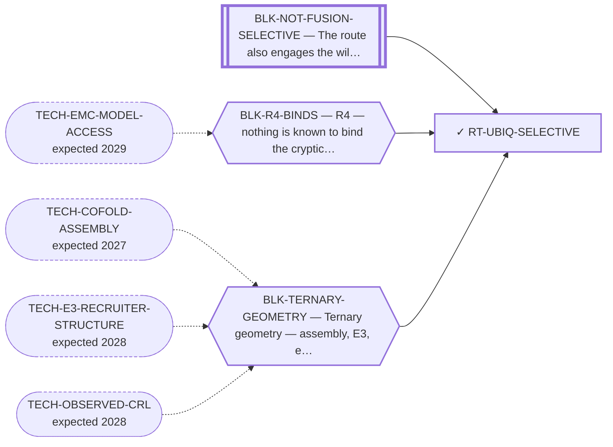

<!-- GENERATED FILE — DO NOT EDIT. Regenerate with:
     python3 systems/systems_check.py --write-views
     Source of truth: systems/graph/*.json -->

# RT-UBIQ-SELECTIVE — Fusion-selective ubiquitination — discriminate at the transfer step

**Family:** [ST-PROXIMITY](L1-st-proximity.md) · **state:** ✓ parked · computed · confidence moderate · verified 2026-08-05

**Grade** (owned by [`research/manuscripts/program/target-route-options.md`](../../research/manuscripts/program/target-route-options.md#route-13--fusion-selective-ubiquitination-closed-by-a-number-the-repo-already-owns)): ✕ closed by a measurement already committed

## What has to land for this route to move

**Reading it.** A solid arrow is what holds this route down today. A dashed arrow is a capability that WOULD retire a blocker — dashed because it has not landed, and the date beside it is a forecast, not a schedule.

⛔ **1 of these is permanent** (`BLK-NOT-FUSION-SELECTIVE`) — a fact about the biology, drawn double-walled, with no way out by definition. No technology arrives to fix it.

## Scientific rationale

Even a non-selective binder could give a selective outcome if only the fusion presents a lysine in a geometry that permits ubiquitin transfer. That would move discrimination from thermodynamics, where the margin is tiny, to geometry, where it might be categorical.

## Supporting evidence

| ref | supports | strength |
|---|---|---|
| `V18` | a categorical lysine inventory, as set membership rather than energy | `direct` |

## Remaining unknowns

- Whether the transfer geometry is real: the ligase assembly it rests on was COMPOSED rather than observed, and carries tens of angstroms of positional uncertainty.
- Whether lysine identity predicts outcome at all — real degraders often ubiquitinate several lysines, and lysine-less substrates can still be degraded.

## Required validation

| what | instrument | feasible today | blocked by |
|---|---|---|---|
| An OBSERVED ligase assembly rather than a composed one | ⛔ none built | **no** | BLK-TERNARY-GEOMETRY |

## Blockers

| blocker | kind | what would retire it |
|---|---|---|
| **BLK-NOT-FUSION-SELECTIVE** | `fundamental_biological_limit` | *permanent* |
| **BLK-R4-BINDS** | `requires_wet_lab` | `TECH-EMC-MODEL-ACCESS` |
| **BLK-TERNARY-GEOMETRY** | `requires_better_structure_prediction` | `TECH-COFOLD-ASSEMBLY`, `TECH-E3-RECRUITER-STRUCTURE`, `TECH-OBSERVED-CRL` |

## Readiness — what this could become today

**`internal_note`**

No degradation-geometry claim may rest on a composed assembly, so the computed result cannot currently be reported as evidence for anything.

**Missing:**
- an observed transfer geometry

## Where this route ends — the paper

**[PUB-DEGRADER](L3-publications.md)** — [In silico design of a paralogue-favoured ligand for a cryptic NR4A3 pocket](../../research/manuscripts/degrader/nr4a3-degrader-paper.md)

`contributing` · ◐ `drafted` · aimed at `journal_submission`

**This route contributes:** The categorical lysine inventory, carried as a disclosed-limitation supplement because no degradation-geometry claim may rest on a composed assembly.

**The paper would claim:** A cryptic pocket on the NR4A3 ligand-binding domain can be found and a paralogue-favoured ligand designed into it by computation alone — and the selectivity margin that design would need is larger than the instruments used to predict it can currently resolve, which is reported as the result rather than worked around.

## Strategic timing — the wait equation

**Recommendation: `monitor`**

The blocking fact is about the geometry's PROVENANCE, not about sampling or effort, so no amount of work here changes it. Only a deposited structure does.

| horizon | effect |
|---|---|
| Six months | None unless a structure is deposited. |
| Two years | Plausible — cryo-EM of large flexible assemblies keeps improving. |
| Cost trend | flat |
| Automation outlook | The analysis is automated already; the input is what is missing. |

**Revisit when:**
- **TECH-OBSERVED-CRL** — An OBSERVED rather than COMPOSED ubiquitin-ligase RING and E2-ubiquitin geometry — a deposited full-assembly structure replacing a *(expected 2028, basis `speculative`)*

## Claim ceiling — what this route may NOT be used to claim

*Inherited from [ST-PROXIMITY](L1-st-proximity.md), which is where these are asserted — a family limitation binds every route inside it.*

- No molecule in this family has been shown to bind NR4A3 at all — the pocket every route here depends on has no known ligand of any kind.
- No NR4A3 ternary complex has been correctly assembled by anyone, so every geometry claim in this family is a prediction from an instrument that has never been pointed at this system.
- Nothing in this family asserts efficacy, safety, a therapeutic window or clinical readiness.

## Closure

`instrument_limit` — ⚠ GRADED ⏸ NOT ✕, on the register's own caveat that this is a route closed by measurements that already exist rather than a proof of impossibility. The geometry does not reach FROM AN E3 ANCHORED AT THE CRYPTIC POCKET; a different anchor re-opens the measurement.

## Best next action

Keep the categorical inventory as a disclosed-limitation supplement. Do not restate it as a degradation-geometry claim.

*Cost:* $0

## What this route rests on — drill down

*L4 instruments and L5 objects, evidence and artifacts. Every row here is asserted by this route; the [evidence base](L5-evidence-base.md) shows the same edges from the other end.*

| L4 instrument | cited as | known-answer control |
|---|---|---|
| [V18](registers/instruments.md) — The transfer-zone lysine-identity term | **disclosed failing** | `none` |

**L5 objects:** [OBJ-FUS-T1](L5-evidence-base.md#objects--the-biological-and-molecular-entities-the-program-reasons-about)

[← ST-PROXIMITY](L1-st-proximity.md) · [← L0](L0-ecosystem.md)
