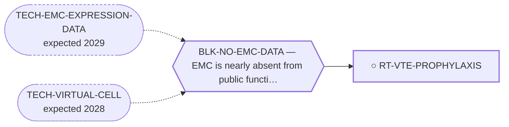

<!-- GENERATED FILE — DO NOT EDIT. Regenerate with:
     python3 systems/systems_check.py --write-views
     Source of truth: systems/graph/*.json -->

# RT-VTE-PROPHYLAXIS — Venous thromboembolism in a lung-metastatic sarcoma population

**Family:** [ST-MORTALITY-MECHANISM](L1-st-mortality-mechanism.md) · **state:** ○ ready · concept · confidence low · verified 2026-09-04

**Grade** (owned by [`research/manuscripts/emc-mortality-mechanisms.md`](../../research/manuscripts/emc-mortality-mechanisms.md)): ⭑ Registered 2026-08-09 from trimcrae's mechanism-of-death question; the family this route sits in did not exist before that day.

## What has to land for this route to move

**Reading it.** A solid arrow is what holds this route down today. A dashed arrow is a capability that WOULD retire a blocker — dashed because it has not landed, and the date beside it is a forecast, not a schedule.

## Scientific rationale

A patient carrying pulmonary metastases for years is exposed to a thrombotic hazard for that whole period, and pulmonary embolism is one of the few mechanisms by which an indolent disease can kill abruptly. The route is registered with its own most likely negative attached: the randomised prophylaxis trials in ambulatory cancer reduced thromboembolic events, and reducing events is not the same as prolonging life. That distinction is the route's central question rather than a caveat on it. ⭑ CORPUS COUNT DONE 2026-09-03: of 162 death-cue sentences in research/literature/emc-mortality-probe.json (34 EMC-titled papers), exactly ONE mentions embolism at all -- PMID 41799218, tumor emboli associated with cardiac metastasis causing an ischaemic stroke, already classified as respiratory_failure in research/manuscripts/emc-terminal-events.json and already discussed in the paper's S3.3. TUMOR embolism (cancer cells) is mechanistically distinct from VENOUS thromboembolism (a blood clot, DVT/PE); thromboprophylaxis targets the latter and would not have prevented the former. Zero true VTE deaths appear in the retrieved corpus. ⭑ TRIAL-LITERATURE HALF DONE 2026-09-04 (AUT-PROP-064, fetch-literature.yml run 33821316750, Europe PMC): the route's registered prediction is CONFIRMED. AVERT (apixaban; EV-CARRIER-2019) reduced VTE events (4.2% vs 10.2%, HR 0.41) with MORE major bleeding (3.5% vs 1.8%, HR 2.00) and, per the published secondary source that states it explicitly (EV-SONG-2019, read in full text), 'no difference in non-major bleeding or mortality.' CASSINI (rivaroxaban; EV-KHORANA-2019) did not significantly reduce its composite VTE-or-VTE-death endpoint over the full 180-day trial period (6.0% vs 8.8%, HR 0.66, 95% CI 0.40-1.09, p=0.10) -- only during the on-treatment intervention window (HR 0.40). Neither trial's own report demonstrates an overall-survival benefit; AVERT's apixaban arm trended toward MORE bleeding-related harm. This is general ambulatory-cancer trial evidence, not sarcoma-specific -- it answers whether prophylaxis-as-a-class moves survival (no) rather than whether an EMC/sarcoma population carries the underlying thrombotic risk (still open, required_validation item 3).

## Supporting evidence

| ref | supports | strength |
|---|---|---|
| `EV-CARRIER-2019` | AVERT: apixaban reduces VTE events (4.2% vs 10.2%, HR 0.41) but increases major bleeding (3.5% vs 1.8%, HR 2.00); the trial's own abstract reports no all-cause mortality figure. | `class_inherited` |
| `EV-KHORANA-2019` | CASSINI: rivaroxaban's composite VTE-or-VTE-death endpoint was not significantly reduced over the full 180-day trial period (HR 0.66, p=0.10) -- only during the on-treatment window (HR 0.40). | `class_inherited` |
| `EV-SONG-2019` | The explicit statement, read in full text, that AVERT showed 'no difference in non-major bleeding or mortality' between apixaban and placebo -- the direct answer to required_validation item 2. | `class_inherited` |

## Remaining unknowns

- Whether a sarcoma population carries the thrombotic risk that would make any of this worth acting on, which is a class-level question this disease has no data for.
- Whether a sarcoma-specific or EMC-specific prophylaxis trial exists at all (unlikely, given disease rarity) -- if none does, this route's ceiling is a transferred/class-inherited argument, never a direct one, however the general trial literature reads.

## Required validation

| what | instrument | feasible today | blocked by |
|---|---|---|---|
| Terminal thromboembolic events counted in the retrieved corpus | ⛔ none built | yes | — |
| A survival endpoint from the ambulatory-prophylaxis trials, read rather than assumed | ⛔ none built | yes | — |
| An EMC-specific thrombotic risk estimate, which requires a clinical cohort | ⛔ none built | **no** | BLK-NO-EMC-DATA |

## Blockers

| blocker | kind | what would retire it |
|---|---|---|
| **BLK-NO-EMC-DATA** | `insufficient_data` | `TECH-EMC-EXPRESSION-DATA`, `TECH-VIRTUAL-CELL` |

## Readiness — what this could become today

**`internal_note`**

Both the corpus half (zero true VTE deaths; the one embolism death is tumour embolism, already counted under respiratory_failure) and the trial-literature half (no survival benefit shown in AVERT or CASSINI) are now answered and both confirm the route's registered negative. What remains -- an EMC-specific thrombotic risk base rate -- is blocked on BLK-NO-EMC-DATA, the same clinical-data gap every EMC-specific claim in this repository is blocked on.

**Missing:**
- an EMC/sarcoma-specific thrombotic risk estimate (required_validation item 3), which needs a clinical cohort this disease does not have

## Where this route ends — the paper

**[PUB-MORTALITY-MECHANISM](L3-publications.md)** — [What kills patients with extraskeletal myxoid chondrosarcoma, and the survival available to tumour-directed therapy: a cause-of-death and relative-survival analysis of the published record](../../research/manuscripts/emc-mortality-mechanisms-paper.md)

`contributing` · ◐ `drafted` · aimed at `preprint`

**This route contributes:** A mechanism that is plausible, acute and probably small -- carried because a portfolio that only registers the mechanisms it expects to find is not a census.

**The paper would claim:** In extraskeletal myxoid chondrosarcoma the published record does not state a mechanism for most recorded deaths; where it does, competing causes and second malignancies are the largest identifiable category and respiratory failure is not dominant. Between a fifth and a third of deaths after diagnosis are not attributed to the tumour -- a figure relative survival and registry cause attribution agree on despite sharing no input -- so the survival available to all antitumour therapy taken together is bounded at 6.7 percentage points in localised disease against 31.0 in metastatic disease.

## Strategic timing — the wait equation

**Recommendation: `pursue_now`**

The two feasible-today validations are both done and both confirm the negative; the remaining item is blocked on clinical data this disease does not have, so this route's next state is closure with its negative written up, not further dispatch.

| horizon | effect |
|---|---|
| Cost trend | flat |

## Claim ceiling — what this route may NOT be used to claim

*Inherited from [ST-MORTALITY-MECHANISM](L1-st-mortality-mechanism.md), which is where these are asserted — a family limitation binds every route inside it.*

- The competing-mortality figure is arithmetic on published summary percentages from heterogeneous studies, not a competing-risks model, and most pairings cross populations.
- Every supportive-care effect size available to this family was measured in some other cancer; no EMC-specific supportive-care outcome data exists at all.
- Nothing in this family asserts efficacy, safety, a therapeutic window or clinical readiness, and a mechanism being common is not evidence that treating it changes survival.

## Best next action

CORRECTED 2026-09-04: both feasible-today required_validation items are DONE (see supporting_evidence) -- zero true VTE deaths in the EMC corpus, and no overall-survival benefit in either the AVERT or CASSINI ambulatory-cancer prophylaxis trial. The route's registered prediction held. What remains is item 3 (an EMC-specific thrombotic risk base rate), blocked on BLK-NO-EMC-DATA -- not dispatchable. Next step is writing this up as PUB-MORTALITY-MECHANISM's negative contribution on thromboembolism, not further retrieval.

*Cost:* $0

## What this route rests on — drill down

*L4 instruments and L5 objects, evidence and artifacts. Every row here is asserted by this route; the [evidence base](L5-evidence-base.md) shows the same edges from the other end.*

**L5 evidence:** [EV-CARRIER-2019](L5-evidence-base.md#evidence--the-literature-this-program-cites), [EV-KHORANA-2019](L5-evidence-base.md#evidence--the-literature-this-program-cites), [EV-SONG-2019](L5-evidence-base.md#evidence--the-literature-this-program-cites)

[← ST-MORTALITY-MECHANISM](L1-st-mortality-mechanism.md) · [← L0](L0-ecosystem.md)
