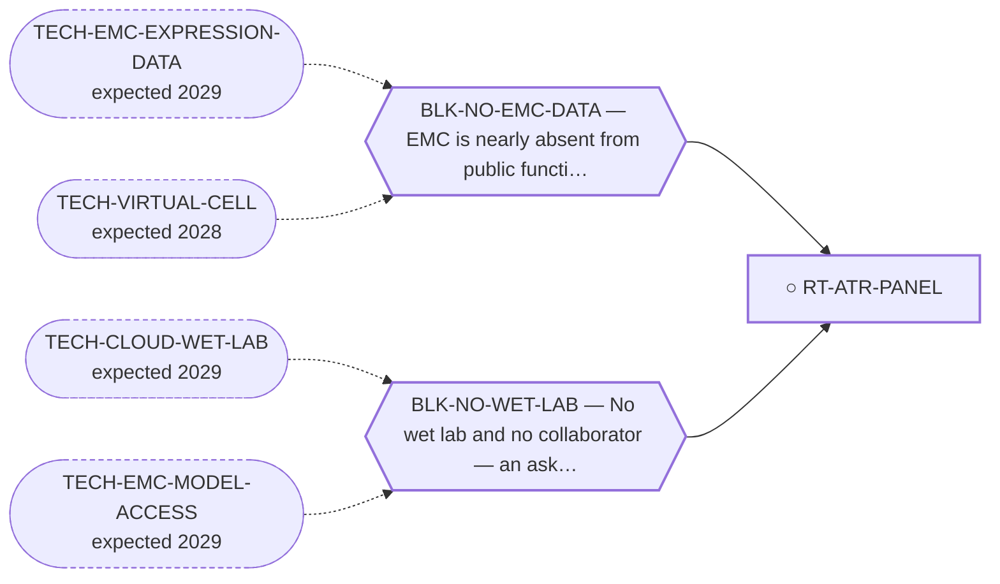

<!-- GENERATED FILE — DO NOT EDIT. Regenerate with:
     python3 systems/systems_check.py --write-views
     Source of truth: systems/graph/*.json -->

# RT-ATR-PANEL — The ATR-inhibitor cell panel in EMC lines (the ask)

**Family:** [ST-DEPENDENCY](L1-st-dependency.md) · **state:** ○ blocked · scoped · confidence moderate · verified 2026-08-05

**Grade** (owned by [`research/manuscripts/program/emc-post-degrader-options.md`](../../research/manuscripts/program/emc-post-degrader-options.md)): Tier 2, rank 4 — ASK, best W1 in the portfolio

## What has to land for this route to move

**Reading it.** A solid arrow is what holds this route down today. A dashed arrow is a capability that WOULD retire a blocker — dashed because it has not landed, and the date beside it is a forecast, not a schedule.

## Scientific rationale

This is the experiment that converts the computed class argument into an EMC result. It is small, uses commercially available compounds, and is the best-matched ask in the portfolio: the taker gets a publishable result from a short experiment.

## Remaining unknowns

- Whether a taker exists — the material gate is an EMC line, which repositories do not supply to unaffiliated individuals.

## Required validation

| what | instrument | feasible today | blocked by |
|---|---|---|---|
| The panel itself  ⭐ ADJUDICATED 2026-09-02 (AUT-PD-116, seat s31-emc-data-blocks, applying S41). TESTED AND CORRECT AS FILED. The route's `display_name` resolves the pronoun — "The ATR-inhibitor cell panel in EMC lines (the ask)" — and an ex-vivo drug-response panel is the second half of the blocker's own `retired_by_action`. BLK-NO-WET-LAB is also correctly carried. Per-entry justification: research/autonomy/sprint-2026-09-01/S41-BLOCKED-ROUTE-AUDIT.md and S41-proposed-routes-patch.json. The rule this applies has one home: research/modalities/emc-fourth-cohort-route-readout.json → "⭐ the_rule_this_adjudication_applies". | ⛔ none built | **no** | BLK-NO-WET-LAB, BLK-NO-EMC-DATA |

## Blockers

| blocker | kind | what would retire it |
|---|---|---|
| **BLK-NO-WET-LAB** | `requires_external_collaboration` | `TECH-CLOUD-WET-LAB`, `TECH-EMC-MODEL-ACCESS` |
| **BLK-NO-EMC-DATA** | `insufficient_data` | `TECH-EMC-EXPRESSION-DATA`, `TECH-VIRTUAL-CELL` |

## Not to be confused with

| route | the axis it turns on | blockers the distinction turns on | why |
|---|---|---|---|
| [RT-ATR-ASSESS](L2-rt-atr-assess.md) | deliverable vs ask | `BLK-NO-WET-LAB` | its value is entirely in an experiment this programme cannot cause; the assessment's value is not |
| [RT-ASO-ASK](L2-rt-aso-ask.md) | which ask spends the one relationship | `BLK-NO-WET-LAB` | ⚠ THIS ASK AND RT-ASO-ASK SPEND THE SAME SCARCE INPUT. Both address the same two model-holding groups (USZ Zurich and NCC Japan), both are `pursue_now` at `$0`, and BLK-NO-WET-LAB is `requires_external_collaboration` — the scarce resource is a RELATIONSHIP, not money. Two $0 asks to one relationship are not independent: a declined first ask prices the second. Eleven routes sit behind TR-EMC-MODEL-ACCESS. The ordering is trimcrae's outward-facing call and is recorded nowhere. |

## Readiness — what this could become today

**`experimental_proposal`**

a complete, specified experimental proposal (emc-atri-prereg.md) — UNCOSTED. What it lacks is a person with cells.

**Missing:**
- a collaborator with an EMC line

**Experiment required:**
- a checkpoint-kinase inhibitor dose-response panel in EMC lines

## Where this route ends — the paper

**[PUB-ATR-PANEL-ASK](L3-publications.md)** — [Transcript-level models of the NR4A3 fusions of extraskeletal myxoid chondrosarcoma, and five pre-specified predictions for a DNA double-strand break recruitment assay](../../research/manuscripts/dependency/emc-atr-collaborator-package.md)

`primary` · ◐ `drafted` · aimed at `experimental_proposal`

**This route contributes:** The costed panel design, its controls and its kill criteria — the half of the ATR question that no computation can supply.

**The paper would claim:** Everything a group already running the FET-fusion DSB-recruitment assay would have to derive in order to add EMC as a fourth partner class is pre-built — constructs, controls, predicted outcomes and kill criteria fixed in advance — so the marginal cost of testing the assessment's prediction is the bench time and nothing else.

## Strategic timing — the wait equation

**Recommendation: `pursue_now`**

The best-matched ask on the board: small, cheap for the taker, publishable for both sides. Asking costs nothing and the proposal is already written. ⚠ THIS ASK AND RT-ASO-ASK SPEND THE SAME SCARCE INPUT. Both address the same two model-holding groups (USZ Zurich and NCC Japan), both are `pursue_now` at `$0`, and BLK-NO-WET-LAB is `requires_external_collaboration` — the scarce resource is a RELATIONSHIP, not money. Two $0 asks to one relationship are not independent: a declined first ask prices the second. Eleven routes sit behind TR-EMC-MODEL-ACCESS. The ordering is trimcrae's outward-facing call and is recorded nowhere.

| horizon | effect |
|---|---|
| Six months | Only through whoever reads the assessment. |
| Two years | A solo-affordable cloud lab would remove the need for a taker — though not for the cell line. |
| Cost trend | falling |
| Automation outlook | Not automatable today; this is exactly what lab automation would change. |

**Revisit when:**
- **TECH-EMC-MODEL-ACCESS** — Access to a patient-derived EMC model through a collaborator, or through a solo-affordable cloud or robotic wet-lab service with E *(expected 2029, basis `speculative`)*
- **TECH-CLOUD-WET-LAB** — A remote robotic or cloud wet lab, rentable per experiment by an unaffiliated researcher, at a price and assay scope that covers E *(expected 2029, basis `extrapolated`)*

## Claim ceiling — what this route may NOT be used to claim

*Inherited from [ST-DEPENDENCY](L1-st-dependency.md), which is where these are asserted — a family limitation binds every route inside it.*

- The dependency transfer prior came back negative on the available data — a measured premise, revivable only by EMC-specific data.
- One route rests on class inheritance: no NR4A3 fusion has been tested for the phenotype it assumes.
- There is one EMC model in public dependency data, with no CRISPR data, so this family's in-silico half is bounded by a sample size of one.

## Closure

`authorization` — Best taker in the portfolio and still not something this programme executes.

## Best next action

Send the ask with the assessment. It is the strongest taker-fit in the portfolio.

*Cost:* $0

## What this route rests on — drill down

*L4 instruments and L5 objects, evidence and artifacts. Every row here is asserted by this route; the [evidence base](L5-evidence-base.md) shows the same edges from the other end.*

**L5 evidence:** [EV-FET-ATR-2023](L5-evidence-base.md#evidence--the-literature-this-program-cites)

[← ST-DEPENDENCY](L1-st-dependency.md) · [← L0](L0-ecosystem.md)
