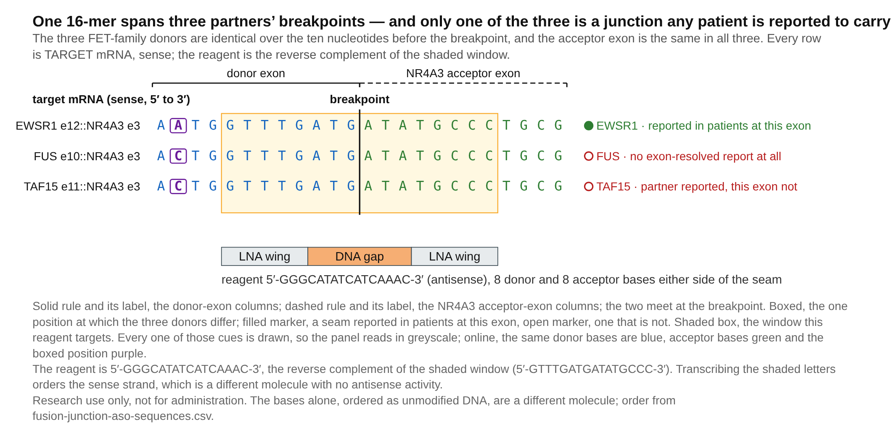

# Computational design and parent transcript liabilities of NR4A3 fusion junction gapmers in extraskeletal myxoid chondrosarcoma

Author. Tristan D. McRae

Independent researcher, unaffiliated. Correspondence: trimcrae@gmail.com ORCID: 0000-0002-1823-1451

Running title. Parent pairing in NR4A3 junction gapmer designs

## Abstract

Fusion-junction antisense gapmers could discriminate oncogenic transcripts from their normal parents, but partial parent pairing may escape conventional near-match screens. We computationally designed and screened 190 junction-spanning 16-mers across 38 in-frame NR4A3 fusion junctions in extraskeletal myxoid chondrosarcoma. Five sequence screens examined mature transcripts, exhaustive transcript substitutions, unspliced parents, contiguous mature-parent pairing through the DNA gap, and the genome. At an adopted ten-base-pair full-gap criterion, 87 of 190 designs (45.8%) paired a mature wild-type parent; the longest duplex involved NR4A3 for 61 designs. Exon-terminus chimeras met the same criterion at 40.6%, leaving a disease-specific excess unresolved. Within-junction selection found a parent-clear design for 35 of 38 junctions at this criterion, with substantial sensitivity to the chosen cutoff. Two designs at reported junctions had longest full-gap parent duplexes of eight and nine base pairs. The ten-base-pair criterion is a convention, not a measured cleavage threshold. Patient-derived cell-model junctions remain unresolved relative to these designs. The released sequence records and screening outputs support reproducible computational prioritization and expose parent-transcript liabilities, but establish no cleavage, potency, delivery, safety or therapeutic window. No laboratory work was performed.

Keywords. antisense oligonucleotide; gapmer; RNase-H1; fusion transcript; NR4A3; extraskeletal myxoid chondrosarcoma; off-target screening

## 1 Introduction

Most EMC carries an in-frame EWSR1::NR4A3 fusion[1]; TAF15 is a substantial minority partner and TCF12 and TFG are rare[2]. FUS, reported in two of five variant cases in a recent series[3], supplies eight modelled junctions here. Conventional cytotoxic chemotherapy has limited activity[4], though responses occur[5]. Disease control exceeded response with a trialled tyrosine-kinase inhibitor: this interpretation uses the review's response categories[4], not a figure stated in the trial report[6].

A fusion-junction gapmer could recruit RNase-H1 to cleave tumour RNA while sparing the normal parents. Junction-directed nucleic-acid agents have been reported against at least six fusion oncogenes: two as antisense oligonucleotides and the remainder as RNA-interference agents, including one expressed from a lentiviral vector[7-12]. None against an NR4A3 fusion was found in the literature retrieved.

Each parent supplies roughly half the junction sequence. Such matches often fall outside a conventional off-target search's mismatch budget but may pair the catalytic gap. We therefore screen that pairing directly. RNase-H1's reported minimum DNA gap is six nucleotides, with seven to ten the working range[13]. Our criterion instead concerns a ten-base-pair contiguous duplex through the whole six-nucleotide gap. Ten is an adopted hybridisation criterion, not a measured cleavage threshold or a gap-length requirement. We also adopt, without establishing, the premises that incomplete overall pairing can permit cleavage and that wing mismatches are less protective than gap mismatches. Of the five steps in a 2025 industry off-target framework[14], this work performs only the in-silico half of step one; transcriptomics is not performed. The Discussion proposes a parent-selectivity measurement related to step three.

## 2 Materials and methods

All analyses use public data; no laboratory work was performed. Complete parameters, per-design tables and claim bounds are archived. Canonical transcripts of five partners and NR4A3 were obtained from Ensembl[15]. We tiled 16-mers in 5-6-5 β-D-oxy-locked-nucleic-acid/DNA/β-D-oxy-locked-nucleic-acid geometry[13], giving five registers per junction with the breakpoint inside the DNA gap. Six is the cited minimum, not the preferred gap length; the genome-wide arm is available only for 16-mers. Gap-level margin counts junction-unique gap bases on the shorter side of the breakpoint.

Five screens examine human RefSeq RNA alignments; an exhaustive transcript substitution search within one mismatch; unspliced parents; the longest contiguous duplex through the gap in six mature wild-type parents; and unambiguous GRCh38, including mitochondrial sequence. This adopted scope covers mature, precursor, exon-exon, non-coding and mitochondrial sequence. A near-match pairs at least 14 of 16 positions. Parent liability requires a contiguous run of at least ten base pairs pairing the whole gap. Ten identically screened null ensembles comprise four shuffles, two base-frequency draws (uniform or composition-matched), and four real-parent chimeras, two joined at exon termini.

Alignments were re-scored by nearest-neighbour stability of the longest contiguous paired run; only energy separations are reported. Melting-temperature calculations assume unmodified DNA:RNA at 250 nM strand[16], not locked phosphorothioate chemistry. Accordingly, we report no absolute melting temperature for the proposed reagents. Table 1 gives the unmodified-hybrid model's fusion-versus-parent difference. LNA and phosphorothioate effects are unmodelled; this difference is not a validated bound for the modified chemistry.

## 3 Results

### 3.1 Designs at reported junctions

We select the highest-margin designs at the two most-prevalent junctions with published exon-resolved breakpoints: 5′-GGGCATATCATCAAAC-3′ for EWSR1 exon 12 and 5′-GGGCATATCTTGTGTG-3′ for TAF15 exon 6, both to NR4A3 exon 3 (Table 1). Exon indices count from the transcript 5′ end, including non-coding exons; coding-exon numbering can select a different reagent. Both have gap-level margin three.

Their longest wild-type duplexes pairing the whole gap are eight and nine base pairs, respectively, both against TFG. Thus both are liable at an eight-base-pair cut, the TAF15 reagent remains liable at nine, and neither is liable at ten. Both also pair part of the gap at the wild-type NR4A3 exon-2/exon-3 seam; these unmeasured partial duplexes are not counted. A one-base register shift can reverse the verdict: 5′-AGGGCATATCTTGTGT-3′, adjacent to the TAF15 reagent, pairs 11 base pairs of wild-type NR4A3 through the whole gap and cannot substitute for it.

At a deeper-than-default search ceiling, the EWSR1 and TAF15 reagents have 123 and eight gap-paired sense-strand transcript near-matches, but six and five gene loci. Most of the 123 are predicted transcript models. The EWSR1 reagent also matches wild-type TAF15 precursor RNA across an intron-exon boundary with two mismatches, one in the gap. Ten shared donor bases let this reagent span EWSR1, TAF15 and FUS breakpoints (Figure 1). The TAF15 reagent has no sense-strand precursor site.

Aggregate genome-wide loads are similar: 156 and 135 hybridisable gap-paired sites. The EWSR1 reagent has one exact 16-base genomic match, intronic in annotated lncRNA ENSG00000304430; the TAF15 reagent has none. These are sequence predictions, not measured activity. Much genomic sequence is untranscribed; transcription and cleavage at these sites are unmeasured.

Both reagents are phosphorothioate throughout, with five contiguous β-D-oxy-locked residues per wing, exceeding the two to four taken here as usual. Their high affinity may permit more mismatches than the near-match screens' two-mismatch ceiling. Both begin with a locked 5′-GGG tract. Increased sequence-dependent hepatotoxicity with high affinity is an adopted, untested premise here, not a retrieved finding. Neither reagent's potency or safety is established.

Combining the breakpoint distribution of an 18-case series[17] with a 58-case cohort[18] assigns 68.4% of molecularly confirmed cases to these two junctions. This is modelled coverage, not patient screening. Its 39.9%–82.8% range is not a confidence interval: two of four inputs are fixed, no nominal level is assigned, and the calculation transfers a breakpoint distribution between cohorts collected 21 years apart. The TAF15 arm uses three of three reported breakpoints, an upper bound. Adding the top-margin EWSR1 exon-13/NR4A3 exon-3 design, 5′-GGGCATATCTCCACGG-3′, would raise modelled coverage to 79.0%; selection names only the first two junctions by reported prevalence.

### 3.2 Selection and parent liabilities across 190 designs

Across 38 in-frame junctions of five partners, 87 of 190 designs let a mature wild-type parent pair the whole gap over at least ten contiguous base pairs. The longest duplex is with NR4A3 for 61; 85 pair one of their own two parents. Only seven of the 87 reach the conventional 14-of-16 near-match threshold, and parent records are excluded by name from that screen. Nineteen designs have sense-strand precursor near-matches pairing the whole gap. The mature-parent and precursor union is 93 designs, not their sum. Gap mismatches score zero, so these counts bound the fully paired class, not all parent liability.

Alignment-screen cleanliness has additional bounds: seven searches never returned and censoring leaves only 47 of 183 returned searches assessable. A clean count is a floor over that subset; most default-clean designs fail a deeper search. Parent, precursor and genome screens cover all 190 without failures or censoring.

Energy re-scoring finds eight designs with fully paired 16-base off-target duplexes and 45 with a duplex within 2 kcal/mol of the intended target. Neither named reagent is in these classes; their nearest separations are 3.2 and 3.0 kcal/mol. These are upper bounds because the longest-run calculation ignores pairing on either side of a mismatch.

Longer gaps retain parent liability: counts are 87, 88 and 87 in panels of 190, 266 and 342, respectively, reducing rates from 45.8% to 33.1% and 25.4% without removing the problem. At 5-10-5, whole-gap pairing itself requires ten base pairs; shorter runs potentially compatible with the reported seven-to-ten working range are missed, making 25.4% a floor.

Three designs clear every screen at the ten-base-pair cut. Two have no full-gap parent duplex at any length; the third pairs wild-type NR4A3 over eight bases. None targets a reported patient junction, so these are mechanism controls. Within-junction selection instead finds a parent-clear design for 35 of 38 junctions and all five with published exon-resolved breakpoints. At cuts of nine, eight, seven and six base pairs, those counts become 31/3, 23/2, 9/0 and 6/0 (all junctions/published junctions). These cuts measure whole duplexes, not DNA gap length; the named TAF15 junction loses its best design at nine.

Exon-terminus chimeras meet the parent-liability criterion at 40.6%, versus 45.8% for the panel. The strongest null falls inside the panel's 95% interval at cuts seven through thirteen except eleven; the excess changes sign four times across cuts six through thirteen. Both panel and chimeras contain mostly junctions unreported in patients. The comparison therefore does not resolve a disease-specific excess over the liability generated by joining these genes' exon termini.

### 3.3 Computationally screened control sequences

Table 2 gives a dinucleotide-preserving scramble of each reagent, screened against mature parents. Among such scrambles, 10.0% pair a parent's whole gap over at least ten bases and 3.9% have the longest duplex with NR4A3. Passing this screen is necessary for these controls; it does not establish inertness.

## 4 Discussion

### 4.1 Candidate models and unresolved junction correspondence

Five test articles offer complementary routes. The panel joins donors to NR4A3 exon 3, its first coding exon, whereas two patient-derived cell models are reported at exon 2. No annotated NR4A3 transcript has exon 2 as its first coding exon, so annotation does not reconcile them. The original protein-fusion filter excluded acceptors upstream of the initiation codon; that filter is inappropriate for RNase-H1 gapmers, which cleave RNA independently of reading frame. An EWSR1 exon-7/NR4A3 exon-2 fusion was sequenced in one of five EWSR1-rearranged tumours in a transcriptome series[19], and a PGR::NR4A3 case joins exon 2 to the NR4A3 5′ untranslated region[20]. All retrieved exon-resolved acceptors are exon 2, exon 3 or a cryptic exon in intron 2[21]; none is downstream of exon 3, where no patient-grounded designs are made.

Three engineered constructs come from a functional study reporting their exon spans[21]. Two, E-N and T-N*, carry exactly the named reagents' junctions. Rebuilding them offers a direct test of junction-selective knockdown, but heterologous complementary-DNA overexpression cannot establish activity at an endogenous locus.

The two patient-derived, identity-clean models are USZ20-EMC1 (RRID:CVCL_C6MX) and USZ22-EMC2 (RRID:CVCL_C6MY), the only fusion-positive EMC cell source identified here[22]. They are available on request, with no repository deposit and reported doubling times of five to six days. Their reported junctions join EWSR1 exon 13 and TAF15 exon 6 to NR4A3 exon 2. The report supplies no sequenced boundary, transcript accession or junction sequence; whether this denotes a non-coding acceptor or unsupported numbering cannot be determined. An earlier version of this work was withdrawn after this class of indexing error.

A first-coding-exon acceptor is more parsimonious for the defining chimeric transcription factor[1,21]. A non-coding exon-2 acceptor would instead retain the NR4A3 initiation codon under the donor promoter. On the former interpretation, USZ22-EMC2 matches the named TAF15 reagent and USZ20-EMC1 matches the third, exon-13 design. This remains inference. The builder emits exon-2 acceptors only for published patient seams or user-supplied sequencing checked against its transcript models.

Alternative exon-2 reagents are 5′-AGTGGGCTCTCCACGG-3′ (EWSR1 exon 13) and 5′-AGTGGGCTCTTGTGTG-3′ (TAF15 exon 6), both at top margin and below the ten-base-pair criterion. Their longest full-gap parent duplexes are eight bases with EWSR1 and nine with NR4A3, respectively. The latter directly involves the acceptor used in the selectivity ratio. Reagents cannot be exchanged between acceptors.

Establish the test article's breakpoint at nucleotide resolution by RNA sequencing before ordering: only nine of 176 distinct panel sequences match multiple junctions. Routine break-apart NR4A3 fluorescence in situ hybridisation detects rearrangement regardless of partner[4], not the nucleotide seam.

### 4.2 Proposed experimental evaluation

We propose isogenic fusion-positive/fusion-negative comparisons, as used for NAB2::STAT6 in solitary fibrous tumour[23], with the screened controls. Knockdown alone cannot distinguish the relevant failure modes.

Selectivity is wild-type NR4A3 knockdown IC50 divided by fusion knockdown IC50, from matched dose responses in the same wells. This ratio and its threshold of 5.0 are adopted conventions, not specified by framework step three[14]. With an assumed replicate standard deviation of 0.35 for the natural-log selectivity ratio, six independent biological replicates give about 80% power to falsify true selectivity of 3; three give about 30%. Variance is unmeasured.

Above a realised standard deviation of approximately 0.65 at three replicates, 1.53 at six or 2.25 at ten, no observed ratio at least one can place a two-sided 95% interval's upper limit below 5. Such a test can fail only with an anti-selective result and is treated as void. A normal-approximation interval would change these figures. Apply the gate to the upper confidence bound on a pilot's standard deviation: at or above the threshold for the proposed replicate count, increase replication or do not test. An acceptor-only ratio cannot exclude other parent liabilities; measure TFG alongside NR4A3, given its eight- and nine-base full-gap duplexes with the named reagents.

### 4.3 Interpretation and limits

Every modelled in-frame junction is designable; discrimination remains unproven. A design's own parents pair at most 13 bases across mature and precursor compartments, whereas eight off-target duplexes pair all 16, five in curated records. This is no liability ranking: the parent screen reads six transcripts and the energy screen excludes parents. Mature-parent liability requires a ten-base full-gap duplex; precursor liability requires a full-gap near-match within two mismatches. These are distinct, overlapping classes.

The archive additionally screens the patient's unrearranged NR4A3 allele. Its two-mismatch ceiling gives a lower bound. No selected design fails, but two other registers at the EWSR1 exon-13/NR4A3 exon-2 seam do, reinforcing the register hazard.

Four cited junction-specificity reports tested synthesised molecules[9-11,24]; we did not survey design pipelines and claim no priority for pre-synthesis screening. Whether sparing wild-type NR4A3 justifies a specificity cost remains unsettled: reported paralogue redundancy and dosage effects point in opposite directions.

All five screens predict hybridisation, not duplex formation or cleavage. Junction-directed oligonucleotides are established; the new application here is the indication. No potency, therapeutic window or safety has been measured, and systemic delivery to solid tumours remains unresolved. All named test articles require cell culture; none establishes clinical readiness.

## Acknowledgments

No person other than the author contributed to this work.

## CRediT authorship contribution statement

Tristan D. McRae: Conceptualization, Project administration. The author conceived and directed the project and is responsible for its content. AI assistance with analysis and manuscript preparation is disclosed below.

## Statements and Declarations

Research use only, and not for administration to any person or animal. Every sequence is an unsynthesised, untested laboratory reagent. Order only from fusion-junction-aso-sequences.csv, which specifies sequence, locked residues and backbone, after RNA sequencing establishes the test article's breakpoint at nucleotide resolution.

Ethical considerations. Not applicable; no human subjects, human material or animals were involved, and no ethics approval was required.

Consent to participate. Not applicable; no participants were enrolled.

Consent for publication. Not applicable; no individual-level data are reported.

Declaration of conflicting interest. No competing financial interests exist. The author holds no patent, patent application, equity or consultancy relating to any sequence or method described here. One non-financial interest is declared: the author is a survivor of extraskeletal myxoid chondrosarcoma, the disease this work addresses.

Funding statement. No external funding; self-funded by the author.

Data availability. Code, per-design tables and screen parameters for the preceding analysis are archived at doi:10.5281/zenodo.22229096. This revision does not claim that the archived files contain its corrected interpretations. The accompanying sequence record (Supplementary File 1) and revision note (Supplementary File 2) correct the melting-temperature interpretation and qualify cell-model correspondence; sequence rows and numerical model outputs are unchanged. An earlier analysis mislocated the acceptor through coding-versus-transcript exon indexing and was withdrawn in full. Rebuilt, verified panels and the correction record are archived.

## Declaration of generative AI and AI assisted technologies

Use of artificial intelligence. Claude (Anthropic) assisted with analysis code, screens, literature retrieval and checking, and manuscript drafting and review. GPT-6-Astra (OpenAI) assisted with this revision and checks against repository artefacts. Bibliographic records were retrieved from PubMed, Europe PMC or Crossref rather than generated, and citations were checked against those records. The author directed the work and is responsible for its content.

## References

1. Labelle Y, J Zucman, G Stenman, LG Kindblom, J Knight, C Turc-Carel, B Dockhorn-Dworniczak, N Mandahl, C Desmaze, et al. (1995). Oncogenic conversion of a novel orphan nuclear receptor by chromosome translocation. Hum Mol Genet 4:2219–2226. doi:10.1093/hmg/4.12.2219 

2. Paioli A, S Stacchiotti, D Campanacci, E Palmerini, AM Frezza, A Longhi, S Radaelli, DM Donati, G Beltrami, et al. (2021). Extraskeletal Myxoid Chondrosarcoma with Molecularly Confirmed Diagnosis: A Multicenter Retrospective Study Within the Italian Sarcoma Group. Ann Surg Oncol 28:1142–1150. doi:10.1245/s10434-020-08737-7 

3. Chen X, X He, R Peng, M Chen and H Zhang. (2026). A series of extraskeletal myxoid chondrosarcomas with rare morphological and molecular variations. Histopathology 89:181–188. doi:10.1111/his.70131 

4. Remiszewski P, S Falkowski, A Szumera-Ciećkiewicz, MJ Spałek, P Rutkowski and AM Czarnecka. (2025). From pathogenesis to the patient's bedside: a comprehensive review of extraskeletal myxoid chondrosarcoma. J Cancer Res Clin Oncol 151:283. doi:10.1007/s00432-025-06316-5 

5. Stacchiotti S, GP Dagrada, R Sanfilippo, T Negri, I Vittimberga, S Ferrari, F Grosso, G Apice, M Tricomi, et al. (2013). Anthracycline-based chemotherapy in extraskeletal myxoid chondrosarcoma: a retrospective study. Clin Sarcoma Res 3:16. doi:10.1186/2045-3329-3-16 

6. Stacchiotti S, S Ferrari, A Redondo, N Hindi, E Palmerini, MA Vaz Salgado, AM Frezza, PG Casali, A Gutierrez, et al. (2019). Pazopanib for treatment of advanced extraskeletal myxoid chondrosarcoma: a multicentre, single-arm, phase 2 trial. Lancet Oncol 20:1252–1262. doi:10.1016/S1470-2045(19)30319-5 

7. Skórski T, C Szczylik, L Malaguarnera and B Calabretta. (1991). Gene-targeted specific inhibition of chronic myeloid leukemia cell growth by BCR-ABL antisense oligodeoxynucleotides. Folia Histochem Cytobiol 29:85–89. 

8. Toretsky JA, Y Connell, L Neckers and NK Bhat. (1997). Inhibition of EWS-FLI-1 fusion protein with antisense oligodeoxynucleotides. J Neurooncol 31:9–16. doi:10.1023/a:1005716926800 

9. Parker Kerrigan BC, D Ledbetter, M Kronowitz, L Phillips, J Gumin, A Hossain, J Yang, M Mendt, S Singh, et al. (2020). RNAi technology targeting the FGFR3-TACC3 fusion breakpoint: an opportunity for precision medicine. Neurooncol Adv 2:vdaa132. doi:10.1093/noajnl/vdaa132 

10. Ward SV, T Sternsdorf and NB Woods. (2011). Targeting expression of the leukemogenic PML-RARα fusion protein by lentiviral vector-mediated small interfering RNA results in leukemic cell differentiation and apoptosis. Hum Gene Ther 22:1593–1598. doi:10.1089/hum.2011.079 

11. Shao L, I Tekedereli, J Wang, E Yuca, S Tsang, A Sood, G Lopez-Berestein, B Ozpolat and M Ittmann. (2012). Highly specific targeting of the TMPRSS2/ERG fusion gene using liposomal nanovectors. Clin Cancer Res 18:6648–6657. doi:10.1158/1078-0432.ccr-12-2715 

12. Neumayer C, D Ng, D Requena, CS Jiang, A Qureshi, R Vaughan, TP Prakash, A Revenko and SM Simon. (2024). GalNAc-conjugated siRNA targeting the DNAJB1-PRKACA fusion junction in fibrolamellar hepatocellular carcinoma. Mol Ther 32:140–151. doi:10.1016/j.ymthe.2023.11.012 

13. Kauppinen S, B Vester and J Wengel. (2005). Locked nucleic acid (LNA): High affinity targeting of RNA for diagnostics and therapeutics. Drug Discov Today Technol 2:287–290. doi:10.1016/j.ddtec.2005.08.012 

14. Andersson P, SA Burel, H Estrella, J Foy, PH Hagedorn, TA Harper Jr, SP Henry, JC Hoflack, EM Holgersen, et al. (2025). Assessing Hybridization-Dependent Off-Target Risk for Therapeutic Oligonucleotides: Updated Industry Recommendations. Nucleic Acid Ther 35:16–33. doi:10.1089/nat.2024.0072 

15. Dyer SC, O Austine-Orimoloye, AG Azov, M Barba, I Barnes, VP Barrera-Enriquez, A Becker, R Bennett, M Beracochea, et al. (2025). Ensembl 2025. Nucleic Acids Res 53:D948–D957. doi:10.1093/nar/gkae1071 

16. Sugimoto N, S Nakano, M Katoh, A Matsumura, H Nakamuta, T Ohmichi, M Yoneyama and M Sasaki. (1995). Thermodynamic parameters to predict stability of RNA/DNA hybrid duplexes. Biochemistry 34:11211–11216. doi:10.1021/bi00035a029 

17. Panagopoulos I, F Mertens, M Isaksson, HA Domanski, O Brosjö, S Heim, B Bjerkehagen, R Sciot, P Dal Cin, et al. (2002). Molecular genetic characterization of the EWS/CHN and RBP56/CHN fusion genes in extraskeletal myxoid chondrosarcoma. Genes Chromosomes Cancer 35:340–352. doi:10.1002/gcc.10127 

18. Huang SC, JC Lee, YC Hsu, JW Tsai, YC Kao, TH Hsieh, YM Chang, KC Chang, PS Wu, et al. (2023). Extraskeletal Myxoid Chondrosarcomas: The Uncommon Clinicopathologic Manifestations and Significance of TAF15::NR4A3 Fusion. Mod Pathol 36:100161. doi:10.1016/j.modpat.2023.100161 

19. Urbini M, V Indio, A Astolfi, G Tarantino, SL Renne, S Pilotti, AP Dei Tos, R Maestro, P Collini, et al. (2018). Identification of an Actionable Mutation of KIT in a Case of Extraskeletal Myxoid Chondrosarcoma. Int J Mol Sci 19:E1855. doi:10.3390/ijms19071855 

20. Wilbur HC, DR Robinson, YM Wu, C Kumar-Sinha, AM Chinnaiyan and R Chugh. (2022). Identification of Novel PGR-NR4A3 Fusion in Extraskeletal Myxoid Chondrosarcoma and Resultant Patient Benefit From Tamoxifen Therapy. JCO Precis Oncol 6:e2200039. doi:10.1200/po.22.00039 

21. Brenca M, S Stacchiotti, K Fassetta, M Sbaraglia, M Janjusevic, D Racanelli, M Polano, S Rossi, S Brich, et al. (2019). NR4A3 fusion proteins trigger an axon guidance switch that marks the difference between EWSR1 and TAF15 translocated extraskeletal myxoid chondrosarcomas. J Pathol 249:90–101. doi:10.1002/path.5284 

22. Bangerter JL, KJ Harnisch, Y Chen, C Hagedorn, L Planas-Paz and C Pauli. (2023). Establishment, characterization and functional testing of two novel ex vivo extraskeletal myxoid chondrosarcoma (EMC) cell models. Hum Cell 36:446–455. doi:10.1007/s13577-022-00818-x 

23. Li Y, JT Nguyen, M Ammanamanchi, Z Zhou, EF Harbut, JL Mondaza-Hernandez, CA Meyer, DS Moura, J Martin-Broto, HN Hayenga and L Bleris. (2023). Reduction of Tumor Growth with RNA-Targeting Treatment of the NAB2-STAT6 Fusion Transcript in Solitary Fibrous Tumor Models. Cancers (Basel) 15:3127. doi:10.3390/cancers15123127 

24. Lee MS, S An, JY Song, M Sung, K Jung, ES Chang, J Choi, DY Oh, YK Jeon, et al. (2023). Cancer-Specific Sequences in the Diagnosis and Treatment of NUT Carcinoma. Cancer Res Treat 55:452–467. doi:10.4143/crt.2022.910 

## Tables

Every value in the tables below is read from a committed artifact and none is typed by hand: the reagents from fusion-junction-aso-sequences.csv, the canonical machine-readable record, and the controls from aso-control-oligos.json, either directly or composed from their fields. The captions carry literature facts, each with its source named there. Every reagent named here is a 5-6-5 phosphorothioate gapmer. An oligonucleotide should be ordered from that file rather than transcribed from this page.

Table 1. The two reagents named for synthesis, with their parent-duplex label. The parent-duplex column is the longest contiguous duplex a mature wild-type parent forms through the catalytic gap; neither reagent reaches the ten-base-pair criterion, so the length is printed rather than a pass mark. The test articles are the engineered constructs of Brenca et al. (PMID: 31020999) — E-N for the EWSR1 reagent and T-N* for the TAF15 reagent; the two patient-derived models of Bangerter et al. (PMID: 36316541) are reported at an NR4A3 exon-2 acceptor; correspondence to these reagents requires nucleotide-junction confirmation. ΔTm separates the fusion duplex from the more stable half of the design's own target window, which is a different parent from the duplex column's searched wild-type TFG. These are differences from the unmodified DNA:RNA model at 250 nM strand concentration. LNA and phosphorothioate effects are unmodelled, so these values are not validated predictions or bounds for the proposed modified reagents. Nothing here has been synthesised or tested, and no sequence may be administered to any person or animal.

**Table 1**

| seam | reagent | margin | WT gap duplex (bp) | Model ΔTm (°C) |
| --- | --- | --- | --- | --- |
| EWSR1 e12::NR4A3 e3 | 5′-GGGCATATCATCAAAC-3′ | 3 | 8 bp, wild-type TFG | 26.6 |
| TAF15 e6::NR4A3 e3 | 5′-GGGCATATCTTGTGTG-3′ | 3 | 9 bp, wild-type TFG | 36.0 |

Table 2. The two control oligonucleotides, each screened as its reagent was. Each is a dinucleotide-preserving scramble of the reagent it controls, matching it in length, first and last base, base composition and dinucleotide counts while spanning no junction, and each cleared the same mature-parent screen the reagent did. The Controls section above explains why that screening step makes a scramble a control.

**Table 2**

| control | sequence | scramble of | WT gap duplex (bp) |
| --- | --- | --- | --- |
| control-1 | 5′-GGGCATCAACATAATC-3′ | the EWSR1 e12 :: NR4A3 e3 reagent | 6 bp, wild-type TAF15 |
| control-2 | 5′-GTATGTCATTGGCTGG-3′ | the TAF15 e6 :: NR4A3 e3 reagent | 7 bp, wild-type EWSR1 |

## Figure legends

 

Figure 1. One 16-mer spans three partners' breakpoints; only one is reported in patients. Breakpoint-aligned windows join EWSR1 exon 12, TAF15 exon 11 and FUS exon 10 to NR4A3 exon 3, with reporting status for each row. The TAF15 exon-11 row differs from Table 1's exon-6 reagent: it is an additional breakpoint spanned by the EWSR1 reagent, not a selected reagent.
