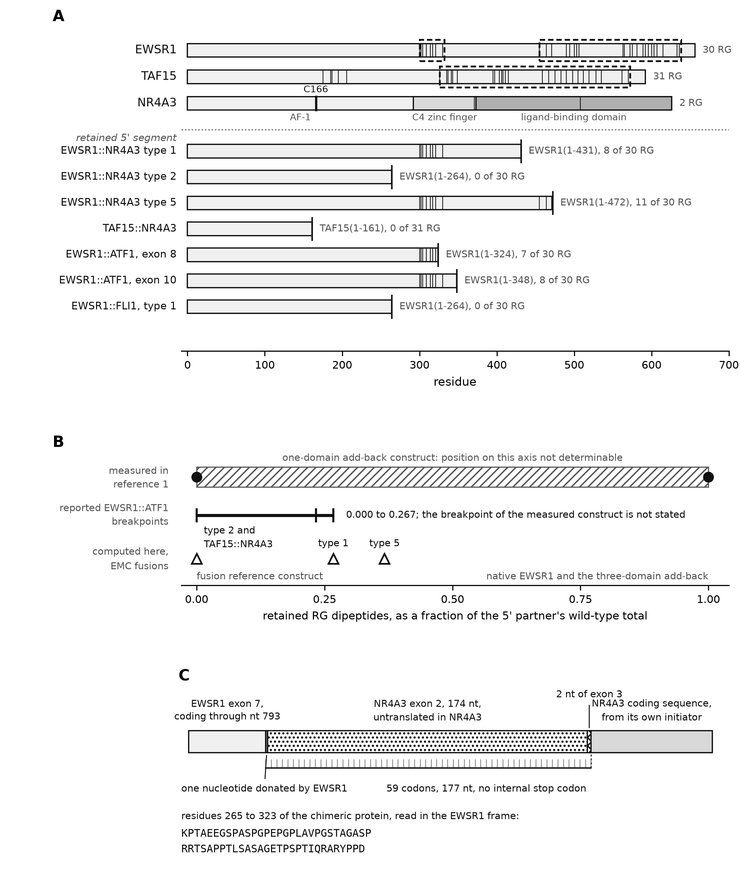

# Reading-frame constraints and retained RG content in NR4A3 fusion models of extraskeletal myxoid chondrosarcoma

**Author:** Tristan D. McRae

*Independent researcher, unaffiliated.* Correspondence: trimcrae@gmail.com
ORCID: [0000-0002-1823-1451](https://orcid.org/0000-0002-1823-1451)

**Running title:** NR4A3 fusion models and DSB predictions

**Keywords:** extraskeletal myxoid chondrosarcoma; NR4A3 fusion; reading frame; EWSR1; TCF12; RG dipeptides

*A sequence-analysis report with a pre-specified prediction set. No experiment was performed and no
reagent was made. Every sequence below is computed from public reference transcripts, and every
breakpoint is quoted from a published source, primary reports and reviews alike. Analyses and
drafting were carried out with AI
assistance (section 2.5).*


## Abstract

**Background:** NR4A3 fusions define extraskeletal myxoid chondrosarcoma (EMC), but their recruitment to DNA double-strand breaks and response to ATR inhibition remain untested. We examined reference-model reading frames and retained FET-partner RG content to delimit sequence-based predictions.

**Methods:** Reported exon junctions from primary studies and reviews were assembled from public reference transcripts and translated at transcript level. Retained RG dipeptides were compared with published recruitment anchors. TCF12 composition was compared with FET proteins on a symmetric prefix grid.

**Results:** Four sourced junctions produced in-frame models retaining the complete NR4A3 moiety. The EWSR1 exon-7/NR4A3 exon-2 model encoded a 59-residue insertion absent from the earlier protein-level model. EWSR1 type-1 and type-2 models retained 8/30 and 0/30 RG dipeptides, respectively, within the 0.000–0.267 span of three reported EWSR1::ATF1 breakpoints. Those breakpoint models are distinct from the measured construct, whose breakpoint is unstated; measured anchors are 0.000 and 1.000. TCF12 remained outside the FET compositional range across the evaluated grid of prefixes from 50 residues in ten-residue steps.

**Conclusions:** Transcript-level assembly resolves model-specific reading-frame constraints and supports bounded, falsifiable predictions. Single-source reference annotation and unverified patient junctions limit interpretation. No experiment, recruitment measurement or ATR-inhibitor-response test was performed.

---

## 1. Introduction

EMC is an ultra-rare sarcoma defined by rearrangement of NR4A3. The commonest 5' partner is EWSR1,
a member of the FET family alongside TAF15 and FUS; a minority of cases carry TAF15, FUS or the
non-FET partner TCF12. A 2025 comprehensive review states that no clinically validated agent
directly targets NR4A3, and reports the systemic options as an anthracycline backbone with a low
objective response rate and pazopanib at an objective response rate of 18 per cent with a median
progression-free survival of 19 months (NCT02066285) [2]. The driver itself is untreated, so a
candidate vulnerability that does not require the driver to be drugged is worth the cost of
establishing.

A peer-reviewed report in *Cancer Research* proposes a shared lesion across FET fusion sarcomas: the chimeric protein retains
the FET N-terminal low-complexity region and loses most of the C-terminal RGG-rich repeats, and
that loss changes its behaviour at DNA double-strand breaks [1]. The readout is accumulation of a
GFP-tagged protein at a laser-induced stripe. The report also builds an internal dose series,
reintroducing one or three RGG-rich domains into EWSR1-FLI1 and into EWSR1-ATF1, and finds earlier
recruitment and higher overall recruitment as the dose rises.

Three transcription-factor-partner classes were examined in that work. EMC is a fourth, and no
NR4A3 fusion has been placed in the assay. The unit of work in that assay is a GFP-tagged open
reading frame, so adding EMC requires new plasmids rather than a new instrument or a new analysis;
what is missing is the sequence, the placement and the criteria.

A prior-art screen supports that reading of the record. A Europe PMC sweep of 322 EMC-linked
records, of which 238 were retrieved as full text, was screened for ATR and replication stress and
returned no hits
([`emc-prior-art-2026-08-09.json`](https://github.com/trimcrae/Rare-cancers/blob/6393cad35d45a2f3965ca911edc902770c9a9bda/research/literature/emc-prior-art-2026-08-09.json)). The screen
matched titles and abstracts rather than full text, so that zero establishes only that nothing is
indexed on the pairing, and not that no such experiment has been done: a result inside a
supplementary table of a larger FET-fusion paper would be invisible to it.

This report supplies those three things. It compiles the reported EMC junctions from published
sources, primary reports and reviews alike, computes the protein each produces, places EMC on the published dose axis, classifies the
one non-FET partner, and fixes five predictions with their falsifiers before any experiment.

---

## 2. Methods

### 2.1 Gene models and junction arithmetic

A reported fusion is an mRNA exon junction rather than a protein junction. Constructs are therefore
assembled at the cDNA level, taking 5' partner cDNA from the transcript start through the end of
the named exon, joining 3' partner cDNA from the start of its named exon, and translating from the
5' partner's own start codon.

The distinction changes an answer here. NR4A3 transcript exons 1 and 2 are entirely non-coding and
exon 3 carries both 5' untranslated sequence and the start codon. A coding-sequence splice discards
that untranslated segment; a transcript-level splice translates it in the 5' partner's frame, which
is the only way to establish whether a reported junction is in frame at all.

Canonical Ensembl transcripts were used throughout. Each gene model carries four assertions:
exon lengths sum to the cDNA, coding nucleotides sum to the coding sequence, the cDNA slice at the
5' untranslated boundary equals the coding sequence, and the coding sequence translates to the
reference protein. Each construct carries three further self-checks: the reading frame opens with
the 5' partner's N-terminus, it ends with the 3' partner's C-terminus, and both hold together. A
construct failing them is reported as failing, and its sequence is withheld.

### 2.2 The retained-RG axis

The axis is retained RG dipeptides of the 5' FET partner as a fraction of that partner's wild-type
total. It is threshold-free: an RG dipeptide either falls inside the retained segment or it does
not. It is not a count of RGG domains, which depend on a box definition: the source names three
RGG-rich domains in EWSR1 while the operational box-finder used here merges them into two on the
same sequence. The underlying RG count requires no such definition, and box counts are reported as
context only.

### 2.3 TCF12 comparison

Three independent tests, plus one sweep that removes a dependency on an unpinned breakpoint. Test
one is the N-terminal [S,Y,G,Q] fraction over a 250-residue window, the FET prion-like signature,
for TCF12 against all three FET proteins. Test two is RG dipeptide content, whole-protein and
N-terminal, with the operational box count. Test three is N-terminal sequence identity by
Needleman-Wunsch alignment, with the three FET-versus-FET pairs computed by the identical call as
the positive control, since a single identity value in isolation carries no scale. The sweep
computes the [S,Y,G,Q] fraction of every N-terminal prefix from 50 residues to full length in
10-residue steps, on that one evaluated grid, for TCF12 and for each of the three FET proteins rather
than for TCF12 alone. The published version of this test swept TCF12 alone and compared its best
value against the FET proteins at a single fixed 250-residue window, which is asymmetric. No sweep
was run for this revision: the symmetric result, its grid, its per-protein prefixes and the resulting
0.039 gap are read from the retained artifact
[`emc-fet-frame-and-composition.json`](https://github.com/trimcrae/Rare-cancers/blob/6393cad35d45a2f3965ca911edc902770c9a9bda/research/modalities/emc-fet-frame-and-composition.json) under
`composition.symmetric_prefix_sweep`. The conclusion therefore rests neither on one assumed junction
nor on one fixed window.

### 2.4 Tag orientation

Tag orientation was left open. The source is internally inconsistent, its methods writing
EWSR1-FLI1-GFP and its Fig. 5 legend writing GFP-EWSR1-FLI1, and a tag can itself perturb an
intrinsically disordered region. The artifact therefore emits the untagged reading frame, and EMC
constructs should be built in whichever orientation the recipient laboratory's existing
EWSR1-FLI1 construct uses.

### 2.5 Reproduction

```
python3 research/modalities/emc_fet_construct_designs.py --check
python3 research/modalities/emc_fet_frame_and_composition.py --check
python3 research/manuscripts/figures/emc_fusion_frame_figure.py --check
```

The first command re-derives the per-construct assembly coordinates, the reading frames and the
recruitment-axis rows offline from the committed input cache
([`emc-construct-inputs.json`](https://github.com/trimcrae/Rare-cancers/blob/6393cad35d45a2f3965ca911edc902770c9a9bda/research/modalities/emc-construct-inputs.json)) and prints `REPRODUCES`;
it does not produce the frame rule, the type-2 seam arithmetic or the composition results. The second
re-derives those into
[`emc-fet-frame-and-composition.json`](https://github.com/trimcrae/Rare-cancers/blob/6393cad35d45a2f3965ca911edc902770c9a9bda/research/modalities/emc-fet-frame-and-composition.json), printing
`REPRODUCES` when a fresh derivation matches the committed artifact and `DRIFT`, with a non-zero
exit, when it does not; its unit tests are
[`test_emc_fet_frame_and_composition.py`](https://github.com/trimcrae/Rare-cancers/blob/6393cad35d45a2f3965ca911edc902770c9a9bda/research/modalities/tests/test_emc_fet_frame_and_composition.py).
The third compares the committed provenance stamp
([`emc-atr-figure-provenance.json`](https://github.com/trimcrae/Rare-cancers/blob/6393cad35d45a2f3965ca911edc902770c9a9bda/research/manuscripts/figures/emc-atr-figure-provenance.json)) against the artifacts
Figure 1 was drawn from, printing `PROVENANCE MATCHES` or `STALE`; run without `--check` it redraws
the figure. These are the declared command signatures, quoted from the three modules; none of them
was run to produce this revision, which recomputes no scientific result.

Retrieval, computation and drafting were carried out with substantial assistance from an AI coding
agent operating on a version-controlled repository under the author's direction. The agent is not an
author and cannot be one, and the author takes responsibility for the content. The agent's output
did influence the substance of this report rather than its wording alone: the transcript-level
reading frames, the recruitment-axis placement and the TCF12 classification are all computed
results, and the pre-specified predictions follow from them. The author verified each by an
independent route. Every breakpoint is quoted from a published source and checked against the cited
record, every sequence figure is re-derivable by the command above, and every prose identifier is
checked against a tracked fetch product by an automated linter. Those controls address the
characteristic failure mode of the method, which is a fluent citation to a paper that does not
exist.

---

### 2.6 Exon numbering and its provenance

Every exon rank in this report is a transcript exon rank: exon *n* is the *n*-th exon of the named
transcript, counted from the transcript's first exon whether or not that exon is translated. The
published sources quoted in section 3.1 state their breakpoints as exon numbers without stating which
numbering they use, so the correspondence is asserted here and not taken from the sources. Two
consequences follow and are stated rather than hidden. First, NR4A3 exons 1 and 2 are non-coding on
ENST00000395097, so a coding-exon rank and a transcript exon rank differ by two for this gene: the
label "NR4A3 exon 3" means the third exon of the transcript, which is NR4A3's first coding exon.
Second, the arithmetic is carried at the nucleotide level throughout, so an exon label never enters
a computation directly; it selects a boundary whose cumulative nucleotide count the artifact holds,
and the four gene-model assertions and three per-construct self-checks are what a reader should
audit.

The provenance of those boundaries is a single offline input cache, itself derived from UniProt and
Ensembl records (section 7). **This correspondence has not been verified against a second,
independent annotation source in this work.** No such verification was attempted here and none is
claimed: the exon-to-nucleotide map, the transcript choices and the coding-exon offsets all rest on
one retrieval into one cache. That is the same class of dependency that produced this programme's
documented off-by-two error (section 6, item 2), which an independent re-derivation caught. A
reader who needs the numbering to be right for their own case should re-derive it from their own
annotation source rather than rely on the correspondence asserted here.

## 3. Results

### 3.1 Reported junctions

**Table 1.** Reported junctions, in transcript exon numbering, with the source of each.

| fusion | junction | counted frequency | sources |
|---|---|---|---|
| EWSR1::NR4A3 type 1 | EWSR1 e12 to NR4A3 e3 | commonest EWSR1::NR4A3 type in both series that typed EWSR1 subtypes: 10 tumours, the most frequent transcript [7]; 11 of the 15 fusion-positive cases [9] | [4,5,6]; expressed as "E-N, corresponding to EWSR1 (exons 1-12)-NR4A3 (exons 3-8)" [3] |
| EWSR1::NR4A3 type 2 | EWSR1 e7 to NR4A3 e2 | 1 of 15 fusion-positive cases in Okamoto [9]; the retrieved Panagopoulos abstract [7] does not state a type-2 count | [4,6] |
| EWSR1::NR4A3 type 5 | EWSR1 e13 to NR4A3 e3 | named the second most common transcript in [7], in two cases | [5,7] |
| TAF15::NR4A3 | TAF15 e6 to NR4A3 e3 | the only reported coding junction; 3 of the 15 fusion-positive cases [9]; 4 of the 10 fusions in [10], which counts partner genes rather than EWSR1 subtypes | [4,5,7]; expressed as "T-N*, corresponding to the commonest TAF15 (exons 1-6)-NR4A3 (exons 3-8) fusion" [3] |

The type 1 and type 2 junctions are defined verbatim in Nishio's review [4]: "The most common fusion
transcript contains exon 12 of EWSR1 fused to exon 3 of NR4A3 (type 1), whereas exon 7 of EWSR1 is
fused to exon 2 of NR4A3 in the type 2 fusion transcript" [4]. That sentence names type 1 as the
most common and defines type 2 without making any frequency claim about it, so it establishes the
two junctions and not a ranking of the two; the counted series in the table above, and not this
definition, carry the frequencies. The junctions are corroborated independently
by RT-PCR primer design, an EWSR1 exon 12 forward primer paired with an NR4A3 exon 3 reverse for
type 1 and an EWSR1 exon 7 forward paired with an NR4A3 exon 2 reverse for type 2 [6]. They are also corroborated by the
counted series in which exon 12 to exon 3 was the most frequent transcript, in 10 tumours, and
exon 13 to exon 3 the second most common, in two [7].
The TAF15 junction is reported as exclusive: "exon 6 of TAF15 is fused exclusively to exon 3 of
NR4A3" [4], and "always" in a second source [5].

Three reported variants are not modelled, and the reasons differ. A rarer TAF15::NR4A3 isoform
splices into a cryptic exon in NR4A3 intron 2, "thus encoding 25 additional amino acids prior to
the NR4A3 ATG" [3]; the cryptic exon's sequence is in no source held here, so building it would
mean inventing 75 nucleotides, and the same source reports the two isoforms as "essentially
indistinguishable" for colony formation. FUS::NR4A3 has no exon-level breakpoint statement in the
sources retrieved. TCF12::NR4A3 is reported only at genomic resolution, "the breakpoint affects the
region of intron 5" [5], and TCF12 has several alternatively spliced isoforms. Absence of a
construct is a statement about the sourcing rather than about the fusion.

### 3.2 Gene models and open reading frames

All four gene-model assertions pass on all five transcripts.

The reference gene models the junction arithmetic runs on, and the four assertions they satisfy,
are given in Supplementary Table S1.
The TCF12 length mismatch is not reconciled here. The two databases select different
canonical isoforms, so a TCF12 residue number taken from the literature requires conversion before
comparison with anything here. It does not reach the classification in section 3.5, whose decisive
tests are compositional and are computed over every prefix on the evaluated grid (section 3.5).

**Table 2.** The four constructs. A slash marks the junction in the seam sequence. Extra junction
residues are those encoded across the seam by neither partner's own reading frame.

| construct | 5' retained | seam | extra residues | ORF | NR4A3 moiety |
|---|---|---|---|---|---|
| type 1, EWSR1 e12 to NR4A3 e3 | EWSR1(1-431) | TAKAAVEWFD / DMPCVQAQYS | 1 | 1058 aa | complete: AF-1, C4 zinc finger, LBD, C166 |
| type 2, EWSR1 e7 to NR4A3 e2 | EWSR1(1-264) | SQQSSSYGQQ / KPTAEEGSPA | 59 | 949 aa | complete: AF-1, C4 zinc finger, LBD, C166 |
| type 5, EWSR1 e13 to NR4A3 e3 | EWSR1(1-472) | GRGMPPPLRG / DMPCVQAQYS | 1 | 1099 aa | complete: AF-1, C4 zinc finger, LBD, C166 |
| TAF15 e6 to NR4A3 e3 | TAF15(1-161) | QRENYSHHTQ / DMPCVQAQYS | 1 | 788 aa | complete: AF-1, C4 zinc finger, LBD, C166 |

All four are in frame. Each splits a codon across the junction, which is why the frame was computed
at the nucleotide level rather than inferred from residue arithmetic.

The four junctions are four instances of one rule rather than four checked examples. A 5' partner
exon joined to NR4A3 exon 2 or exon 3 is in frame if and only if the donor exon ends one nucleotide
into a codon, that is if its cumulative coding nucleotide count is congruent to 1 modulo 3. Both
acceptors give the same register, because NR4A3 exon 2 is 174 nucleotides, a multiple of three. The
rule was evaluated over every donor and acceptor pair rather than over the reported junctions alone,
and across EWSR1's seventeen coding exons the complete phase-1 donor set is exons 1, 4, 7, 9, 10, 12,
13 and 15.

### 3.3 A 59-residue insertion in the type-2 fusion

The named 3' exon of the type-2 junction, NR4A3 exon 2, is entirely non-coding, so the fusion mRNA
carries 176 nucleotides of NR4A3 5' untranslated sequence downstream of the EWSR1 cut. EWSR1 coding
sequence runs through exon 7 to nucleotide 793, which is 264 complete codons and one base over, and
that base completes the first codon of the extension. The 59 residues therefore span 177 nucleotides,
one donated by EWSR1 across the seam and 176 supplied by NR4A3, of which 174 come from exon 2 and 2
from exon 3. Read in the EWSR1 frame the segment contains no stop codon; the first residue is the
hybrid codon AAG, encoding lysine at position 265 of the chimera, and the remaining 58 are NR4A3
sequence read in a non-native frame. The insertion lies between EWSR1(1-264) and NR4A3's own
methionine, and the chimeric open reading frame is 949 aa. Figure 1C draws this seam. The type-2 fusion protein predicted by the canonical transcripts is
therefore not EWSR1(1-264)::NR4A3(1-626), the protein-level model this programme itself used until
this analysis. No source retrieved states what protein-level model the field uses. An N-terminal
addition ahead of NR4A3's initiator is not itself novel: reference 3 describes a cryptic exon in
NR4A3 intron 2 "thus encoding 25 additional amino acids prior to the NR4A3 ATG" in a rarer
TAF15::NR4A3 isoform. What is specific here is the junction and the sequence of its insertion.

The weight of that statement is bounded. It is what the canonical transcripts predict for the
reported exon junction, a computed consequence rather than an observed protein, and it requires
checking against a sequenced junction before any reagent is ordered. A 59-residue difference
nonetheless changes what a construct built from the published model contains.

### 3.4 Placement on the retained-RG axis



**Figure 1.** Reported EMC junctions on the retained-RG axis, and the type-2 seam. Three panels,
drawn by [`emc_fusion_frame_figure.py`](https://github.com/trimcrae/Rare-cancers/blob/6393cad35d45a2f3965ca911edc902770c9a9bda/research/manuscripts/figures/emc_fusion_frame_figure.py) and committed as
[`emc-fusion-frame-fig1.png`](https://github.com/trimcrae/Rare-cancers/blob/6393cad35d45a2f3965ca911edc902770c9a9bda/research/manuscripts/figures/emc-fusion-frame-fig1.png) and
[`emc-fusion-frame-fig1.pdf`](https://github.com/trimcrae/Rare-cancers/blob/6393cad35d45a2f3965ca911edc902770c9a9bda/research/manuscripts/figures/emc-fusion-frame-fig1.pdf).

**Panel A.** Bars are drawn to residue scale on the shared axis. Each thin vertical tick marks one
RG dipeptide, at the 1-based position of its arginine
(`emc-fet-frame-and-composition.json`, `composition.rg_content.<protein>.rg_positions`); the count
printed at the right of each wild-type bar is that protein's total. Dashed rectangles mark
operationally defined RGG boxes — maximal merged runs of 60-residue windows each containing at least
six RG dipeptides, trimmed to start at the first RG the box contains and to end two residues past
its last RG-start (`emc_fet_idr_census.py`, `RGG_WINDOW = 60`, `RGG_MIN_RG_IN_WINDOW = 6`); the
spans drawn are `rgg_boxes_operational` in `emc-fet-construct-designs.json`. This finder returns two
boxes on EWSR1 and one on TAF15; the source paper names three RGG-rich domains in EWSR1, and the box
definition was not tuned to reproduce that count. NR4A3 has no box because the finder
returns none for it. `C166` is a printed text label placed above the NR4A3 bar with a single
vertical marker drawn on that bar at residue 166; it identifies that residue position and nothing
more, and no functional property is asserted for it here. Below the dotted rule, each fusion row
shows the retained 5' segment ending at a heavy end-cap at its breakpoint, carrying only the RG
ticks at or before that breakpoint; the right-hand text gives the retained residue range and the
retained-of-total RG count. Panel A carries four weights of vertical black line — RG tick, dashed
box outline, breakpoint end-cap and the `C166` marker — and the figure prints no key of its own, so
the reader is directed to this caption for all four.

**Panel B.** The retained-RG fraction axis, carrying the fusion positions of Table 3, the hatched
band labelled "position on this axis not determinable" for the construct whose reintroduced
RGG-rich domain the source does not identify, and the 0.000 to 0.267 interval spanned by the three
reported EWSR1::ATF1 breakpoints. That interval describes reported breakpoints; it is not a measured
recruitment range.

**Panel C.** The type-2 seam, drawn as one nucleotide donated by EWSR1 followed by 176 nt of NR4A3
untranslated sequence: 174 nt of NR4A3 exon 2, the block labelled untranslated in NR4A3, and the
first 2 nt of NR4A3 exon 3, annotated separately in the panel. Those 177 nt are the extension of 59
codons carrying no internal stop codon. The earlier caption counted only the exon 2 block and the
donated nucleotide, which does not reach 177.
The panel does not print the words "type 2": it draws the EWSR1 exon 7 to NR4A3 exon 2 junction,
which is the only reported EMC junction using the exon 2 acceptor, and it should be read as that
junction and not as a general statement about the acceptor.

*What the figure shows, and what it does not.* The three panels carry the reported junctions, the
RG content each retains, the retained-RG fraction axis and the type-2 seam. The frame rule as a rule
over all donor and acceptor pairs, the complete phase-1 donor set, the symmetric prefix sweep and its
0.039 margin, and the TAF15 zero-RG margin are results of sections 3.2, 3.4 and 3.5 and appear in no
panel. Two drawing-level observations, on the legibility of the closely spaced NR4A3 ticks and on the
binding between the Panel A box literals and their source data field, are recorded in the integration
QA note cited in the editorial comment above rather than in this caption.

**Table 3.** EMC fusions and their comparators on one axis, with the status column distinguishing a
position measured in reference 1 from a reported breakpoint of a disease in which the mechanism was
measured. Fractions are of the 5' partner's wild-type RG total.

| construct | 5' partner retained | RG kept | fraction | status |
|---|---|---|---|---|
| EWSR1-FLI1 (0 RGG domains), reference 1's reference fusion | EWSR1(1-264) | 0 / 30 | 0.000 | measured in reference 1 |
| EWSR1-RGG(1)-FLI1 | not identified | not placeable | not placeable | measured in reference 1; reference 1 does not identify which RGG-rich domain was reintroduced, so its retained RG count is unknown |
| EWSR1-RGG(3)-FLI1 and native EWSR1 | full length | 30 / 30 | 1.000 | measured in reference 1 |
| EWSR1::FLI1 (Ewing, type 1), EWSR1 e7 | EWSR1(1-264) | 0 / 30 | 0.000 | a reported breakpoint of a disease in which the mechanism was measured |
| EWSR1::ATF1 (clear cell, reported type), EWSR1 e7 | EWSR1(1-264) | 0 / 30 | 0.000 | a reported breakpoint of a disease in which the mechanism was measured |
| EWSR1::ATF1 (clear cell, commonest type), EWSR1 e8 | EWSR1(1-324) | 7 / 30 | 0.233 | a reported breakpoint of a disease in which the mechanism was measured |
| EWSR1::ATF1, EWSR1 e10 | EWSR1(1-348) | 8 / 30 | 0.267 | a reported breakpoint of a disease in which the mechanism was measured |
| EWSR1::NR4A3 type 2 | EWSR1(1-264) | 0 / 30 | 0.000 | computed here; predicted |
| TAF15::NR4A3 | TAF15(1-161) | 0 / 31 | 0.000 | computed here; predicted |
| EWSR1::NR4A3 type 1 | EWSR1(1-431) | 8 / 30 | 0.267 | computed here; predicted |
| EWSR1::NR4A3 type 5 | EWSR1(1-472) | 11 / 30 | 0.367 | computed here; predicted |

Reference 1 built one EWSR1-ATF1 construct and the retrieved text does not state its EWSR1
breakpoint. Three EWSR1::ATF1 breakpoints are reported, retaining 0, 7 and 8 of 30 RG dipeptides, so
the EWSR1::ATF1 comparator is a span from 0.000 to 0.267 rather than a point. The firmly measured
positions on this axis are 0.000 and 1.000.

Figure 1A shows the retained segments and their RG content, and Figure 1B the axis itself.
Type 2 sits where EWSR1-FLI1 sits, at zero, on a retained EWSR1 segment identical in sequence over
the shared prefix. Type 1 sits at 0.267, inside the reported EWSR1::ATF1 span of 0.000 to 0.267.
Neither EMC type falls outside the range of retained-RG fractions the reported breakpoints of the
measured diseases already cover. Placing a fusion on the retained-RG axis does not establish that
recruitment was measured at that position: reference 1 measured recruitment at 0.000 and at 1.000,
and a position between them is a computed placement on the axis and not a measured recruitment
result.

Two readings are excluded. Retaining some RG content does not predict absence of the phenotype: the
commonest clear-cell type retains seven RG dipeptides and the mechanism was measured in that
disease regardless, so the axis is a comparison and not a threshold. The placement of
TAF15::NR4A3 was also open until this computation. TAF15's sourced exon 6 junction retains 161 residues
and TAF15's first complete RG dipeptide occupies residues 175 and 176, so the junction lies inside
the strict zero-RG window with 14 residues of headroom, where the earlier sweep could report only
a range of 100 to 170. The largest prefix of TAF15 carrying no complete RG dipeptide is 175
residues: a prefix of 175 contains none and a prefix of 176 contains one, so the headroom is 175
minus 161.

A stored field disagrees, and the disagreement is a label rather than a measurement. The artifact
carries 174 and 13. 174 is a conservative boundary: it ends one residue before the arginine that
starts the first RG, so a prefix of that length cannot contain even the beginning of one. It is not
the largest zero-complete-RG prefix, and 13 is not the complete-dipeptide headroom, although the
field is labelled as though both were. The stored values and their history are left exactly as they
are, and this paragraph is the current reading; a reader can reproduce the discrepancy by counting
RG dipeptides in prefixes of 174, 175 and 176 residues of the cached TAF15 sequence.

### 3.5 TCF12 outside the FET compositional range

TCF12::NR4A3 was reported in one of 26 cases in one EMC series [6]. TCF12 is not a FET-family gene.
The class argument therefore predicts that these cases do not carry the lesion, which is a
prediction testable inside one disease on one slide.

**Table 4.** TCF12 against the three FET proteins.

| test | the three FET proteins | TCF12 | separation |
|---|---|---|---|
| N-terminal 250-aa [S,Y,G,Q] fraction | EWSR1 0.540, TAF15 0.620, FUS 0.804 | 0.368 | decisive |
| symmetric [S,Y,G,Q] sweep, every prefix from 50 aa upwards in 10-aa steps, all four proteins on the same grid | lowest FET prefix value 0.439 (EWSR1, residues 1-560) | best TCF12 prefix 0.400, at residues 1-160 | separates, by 0.039; no TCF12 prefix on the evaluated grid reaches the lowest value any FET prefix takes on that grid |
| RG dipeptides, whole protein | 30, 31, 24 | 7 | clear |
| RGG boxes, operational definition | 2, 1, 2 | 0 | clear |
| N-terminal identity, Needleman-Wunsch | FET versus FET 26.1 to 35.7 per cent | TCF12 versus FET 16.8 to 20.5 per cent | separates, modestly |

TCF12 is classified as non-FET on the compositional tests. The identity result carries the
qualification: 20.5 per cent against a FET-versus-FET floor of 26.1 per cent is a real gap but a
modest one, which follows from the FET N-termini being low-complexity and only 26 to 36 per cent
identical to each other. TCF12 has no RGG box, roughly a quarter of the RG content, and no
N-terminal prefix on the evaluated grid reaching the lowest value any FET prefix takes on that
grid, which makes the classification robust to the unpinned TCF12 breakpoint across the lengths
evaluated. The grid is every prefix from 50 aa upwards in 10-aa steps, 66 prefixes for TCF12 and
61, 55 and 48 for EWSR1, TAF15 and FUS; lengths between grid points were not evaluated and no
claim is made about them. The margin on that sweep is 0.039 and the
published version of the comparison, which gave TCF12 every prefix and the FET proteins one fixed
250-residue window, overstated it.

---

## 4. Discussion and pre-specified predictions

**Table 5.** Predictions fixed before any experiment, each with the observation that falsifies it.
P1 to P4 are held in `emc-fet-construct-designs.json` under
`rgg_dose_calibration_and_predictions.registered_predictions`; P5 is held in the same file under
`tcf12_negative_control.registered_prediction`.

| id | prediction | falsified by |
|---|---|---|
| P1 | EWSR1::NR4A3 type 2 is recruited to laser-induced breaks with kinetics indistinguishable from EWSR1-FLI1. Basis: 0 of 30 RG retained, on a segment byte-identical to the reference construct's | no accumulation at the stripe, or kinetics matching native EWSR1 rather than the fusion reference |
| P2 | EWSR1::NR4A3 type 1, the commonest EMC fusion, is recruited earlier than type 2 and closest to the commonest clear-cell EWSR1::ATF1 type. Basis: 8 of 30 against 7 of 30 | type 1 recruiting no earlier than type 2, which would place the variable elsewhere; or type 1 not recruited at all |
| P3 | TAF15::NR4A3 is recruited, at the zero end of the axis. Basis: TAF15(1-161) retains 0 of 31, with 14 residues of margin to TAF15's first RG at 175 | kinetics indistinguishable from native TAF15 |
| P4 | The type-1 and type-2 pair reproduces the RGG dose-dependence with no add-back construct, being two naturally occurring points on one axis in one disease with one 3' partner | the pair showing no kinetic difference, which would bound the dose-dependence to engineered constructs |
| P5 | TCF12::NR4A3 is not recruited, behaving like the source's full-length FLI1 control, which "showed no accumulation at laser-induced DSBs" [1] | recruitment of TCF12::NR4A3 |

**The registered text above is reproduced unchanged, including two figures this report corrects.**
P1 to P5 are a preregistration. Their wording, their bases and their falsifiers are reproduced here
exactly as they were registered, and nothing below rewrites them; the corrections and the limitations
are stated separately, as corrections, so that a reader can see both the registered claim and what is
now known about it.

*The margin figure in P3.* P3's registered basis states 14 residues of margin to TAF15's first RG at
residue 175, and that is the correct complete-dipeptide headroom: the largest prefix with no complete
RG is 175 residues, the retained length is 161, and 175 minus 161 is 14. This was previously described
here as one of two conventions differing by one, the other giving 13. That description was wrong. 13
is not a second convention; it is the artifact's conservative 174-residue boundary, which stops before
the arginine that opens the first RG and is labelled as though it were the largest RG-free prefix.
Section 3.4 records the discrepancy and how to reproduce it. P3's registered wording is unchanged, as
is every stored artifact byte.

*Redundancy and equivalence within the registered set.* Two limitations of the set as registered are
identified here and neither is repaired by editing it. P4's falsifier, "the pair showing no kinetic
difference", overlaps P2's first falsifier, "type 1 recruiting no earlier than type 2", without being
identical to it: the first is a two-sided absence of any difference, while the second is directional
and is also satisfied by type 1 recruiting later. One experiment can therefore satisfy both at once,
so the set counts fewer independent tests than its five ids suggest, but the two entries are not
interchangeable. P1 as registered predicts kinetics *indistinguishable* from a comparator. Failure to
detect a difference does not establish equivalence. The registered wording supplies no equivalence
margin or precision criterion, so a nonsignificant comparison alone cannot confirm P1. Whether
to re-register a narrowed set is a scientific decision about a preregistration and is not taken here.

*Two records, and what each holds.* The machine-readable record
`rgg_dose_calibration_and_predictions.registered_predictions` holds four entries, P1 to P4. This
manuscript carries five hypotheses, P1 to P5, with P5 held separately under
`tcf12_negative_control.registered_prediction`. Both records are preserved as they stand. They are
not the same record, their entries are not word-for-word identical, and neither is edited here to
agree with the other; a reader auditing a prediction should read the entry in the record they cite.

P5 tests the specified non-recruitment prediction. What these patterns can carry is narrower than an
earlier version of this section claimed. The predictions specify an ordering and a
non-recruitment, and an ordering alone cannot assign a unique cause. Type 1 and type 2 differ in
retained residues and junction segments other than RG content, so a kinetic difference between them is
not attributable to RG dose by this design; and a partner-alone control shows what the partner does on
its own, not that the other moiety is necessary. Four outcomes are distinguishable, and each is stated
as what it is consistent with rather than what it demonstrates.

TCF12::NR4A3 not recruited while EWSR1::NR4A3 is recruited leaves P5 standing. It is consistent with a
FET-specific requirement and does not establish one, because the two chimeras differ in more than the
presence of a FET N-terminus. Both recruited contradicts P5's exclusive prediction; it does not show
that FET-mediated recruitment is absent in the EWSR1 chimera, since a shared phenotype is not evidence
of a shared cause, and it does not by itself locate the driver in the NR4A3 moiety. GFP-NR4A3 alone is
run in the same experiment because NR4A3's own behaviour is a fact worth having, not because
recruitment of NR4A3 alone would remove the FET attribution. TCF12::NR4A3 recruited while EWSR1::NR4A3
is not is inconsistent with the ordering the structural argument predicts. If neither is recruited,
the tested constructs do not show recruitment under these assay conditions.

P5 is untested until a TCF12::NR4A3 construct exists. No such construct is emitted, for the reason in
section 3.1, and full-length GFP-TCF12 does not substitute for one: it is a partner-alone control and
it cannot test a prediction about a fusion.

Four things are explicitly not predicted. Retained RGG content is one input to recruitment kinetics
rather than the only one; reference 1's own data show a second variable, EWSR1::ATF1 recruiting like
EWSR1-FLI1 but with "differences in departure timing", and recruitment depending "at least in part"
on native EWSR1, which these constructs do not control. No effect size is predicted: the axis is
ordinal, earlier or later and more or less, because reference 1 reports it that way, and no slope is
available to quote. Nothing downstream is predicted; the predictions concern recruitment kinetics
only and say nothing about ATM signalling, ATR dependency, drug sensitivity, efficacy, safety,
dosing or any clinical question. And the 3' partner is a nuclear receptor with its own DNA-binding
domain: Gracilla and colleagues showed that a DNA-binding-domain mutation did not change EWSR1-FLI1's
localisation, but that was measured on an ETS domain rather than a C4 zinc finger, which is why
GFP-NR4A3 alone is included as a control.

---

## 5. Constructs and controls

The assay's unit of work is a GFP-tagged open reading frame. From its methods: "U2OS cells
expressing EWSR1-GFP, EWSR1-FLI1-GFP, EWSR1-ATF1-GFP, EWSR1-WT1-GFP or the various mutant forms of
the fusion oncoproteins were seeded in 8-well Lab Tek II Chamber Slides ... Cells were treated with
1 microgram/ml Hoechst 33342 ... for 30 minutes prior to micro-irradiation ... 5-pixel wide stripes
were drawn in every cell nucleus ... and irradiated with a 405nm diode laser (40mW). Images were
acquired pre-irradiation and at 1-minute intervals post-laser damage for 15 minutes" [1]. Adding
EMC to that panel requires plasmids and nothing else.

Four wild-type controls anchor both ends of the recruitment axis for EMC's own partner genes,
without which a delayed curve cannot be told from a poorly expressed construct.

The four controls, their roles and their predictions are given in Supplementary Table S2.
No TCF12::NR4A3 construct is emitted, for the reason in section 3.1. A laboratory holding a
TCF12::NR4A3 case should sequence the junction. Without one, P5 cannot be run. Full-length GFP-TCF12
answers a different and narrower question, whether full-length TCF12 reaches the damage stripe at all,
and it is a partner-alone control rather than a stand-in for the fusion. A result from
GFP-TCF12 leaves P5 untested.

---

## 6. Limitations

1. **These are computed designs rather than validated reagents.** Nothing here has been synthesised,
   expressed or sequenced. Every junction requires verification against a sequenced breakpoint
   before any order is placed.
2. **This analysis inherits a documented failure mode of its own method.** An earlier committed
   artifact in this programme, built from a stated Ensembl methodology, indexed a coding-exon offset
   table with transcript exon numbers; the label "NR4A3 exon 3" resolved to transcript exon 5, and
   all seven junctions it emitted silently deleted NR4A3's AF-1 domain and the first zinc finger of
   its C4 DNA-binding domain. That error survived review and was caught by re-derivation. Every
   boundary above therefore carries its provenance and every construct carries self-checks.
3. **Canonical Ensembl transcripts only, from a single annotation source.** A tumour may use a
   different transcript or a different breakpoint, in which case the exon-to-residue map changes and
   so does the protein. The exon numbering, the transcript choices and the coding-exon offsets all
   rest on one offline input cache and have not been verified against a second, independent
   annotation source in this work (section 2.6).
4. **The predictions concern recruitment kinetics and nothing else.** They make no claim about ATM
   signalling, ATR dependency or drug sensitivity, and no claim about efficacy, safety,
   tolerability, dosing, patient selection or clinical readiness.
5. **Retained RGG content is one input among several**, and the constructs do not control native
   EWSR1, which reference 1 shows contributes.
6. **FUS::NR4A3 and TCF12::NR4A3 have no sourced transcript-level junction here**, which bounds the
   sourcing rather than the fusions.
7. **The class inheritance is the whole of the transfer argument.** The replication-stress
   vulnerability was measured on other FET fusions in other diseases; no NR4A3 fusion has been
   tested for it, and no computation in this report changes that.
8. **No laboratory work is proposed by the author.** This programme has no laboratory. The
   deliverable is the design, the prediction and the criteria.

> **Scope of the claims.** This is a sequence-analysis report. It asserts no efficacy, potency,
> dose, safety, therapeutic window or clinical readiness for any agent in any disease, and makes no
> treatment recommendation. The replication-stress vulnerability that motivates the assay is
> inherited from the FET fusion class and has never been measured on an NR4A3 fusion; that
> inheritance is the limit of what is claimed here, and no result below is EMC-specific. Every
> construct is a computed design for verification against a sequenced breakpoint before any reagent
> is ordered.

> **Declarations.** This report analyses public reference sequences and published exon-level breakpoint statements.
> It involves no new human participants, identifiable data, patient-level records, animals or laboratory work.
> No claim of ethics approval, exemption or a consent waiver is made. **Funding:** none. **Competing interests:** none. **Author contributions:** Tristan D. McRae
> is the sole author and is responsible, in CRediT terms, for conceptualization, methodology,
> software, formal analysis, investigation, data curation, visualization, writing of the original
> draft, and writing of the review and editing. **Data and code:** section 7.

---

## 7. Data and code availability

| item | location |
|---|---|
| Producer | [`emc_fet_construct_designs.py`](https://github.com/trimcrae/Rare-cancers/blob/6393cad35d45a2f3965ca911edc902770c9a9bda/research/modalities/emc_fet_construct_designs.py) |
| Computed artifact holding the per-construct assembly coordinates, reading frames and axis rows | [`emc-fet-construct-designs.json`](https://github.com/trimcrae/Rare-cancers/blob/6393cad35d45a2f3965ca911edc902770c9a9bda/research/modalities/emc-fet-construct-designs.json) |
| Producer of the frame rule, the type-2 seam arithmetic and the composition results | [`emc_fet_frame_and_composition.py`](https://github.com/trimcrae/Rare-cancers/blob/6393cad35d45a2f3965ca911edc902770c9a9bda/research/modalities/emc_fet_frame_and_composition.py) |
| Its computed artifact | [`emc-fet-frame-and-composition.json`](https://github.com/trimcrae/Rare-cancers/blob/6393cad35d45a2f3965ca911edc902770c9a9bda/research/modalities/emc-fet-frame-and-composition.json) |
| Its unit tests | [`test_emc_fet_frame_and_composition.py`](https://github.com/trimcrae/Rare-cancers/blob/6393cad35d45a2f3965ca911edc902770c9a9bda/research/modalities/tests/test_emc_fet_frame_and_composition.py) |
| Figure 1 generator and the provenance stamp it writes | [`emc_fusion_frame_figure.py`](https://github.com/trimcrae/Rare-cancers/blob/6393cad35d45a2f3965ca911edc902770c9a9bda/research/manuscripts/figures/emc_fusion_frame_figure.py), [`emc-atr-figure-provenance.json`](https://github.com/trimcrae/Rare-cancers/blob/6393cad35d45a2f3965ca911edc902770c9a9bda/research/manuscripts/figures/emc-atr-figure-provenance.json) |
| Offline input cache the artifact re-derives from | [`emc-construct-inputs.json`](https://github.com/trimcrae/Rare-cancers/blob/6393cad35d45a2f3965ca911edc902770c9a9bda/research/modalities/emc-construct-inputs.json) |
| NR4A3 exon audit | [`nr4a3-exon-audit.json`](https://github.com/trimcrae/Rare-cancers/blob/6393cad35d45a2f3965ca911edc902770c9a9bda/research/modalities/nr4a3-exon-audit.json) |
| RG and RGG-box definitions, and the breakpoint sweep | [`emc_fet_idr_census.py`](https://github.com/trimcrae/Rare-cancers/blob/6393cad35d45a2f3965ca911edc902770c9a9bda/research/modalities/emc_fet_idr_census.py), [`emc-fet-idr-census.json`](https://github.com/trimcrae/Rare-cancers/blob/6393cad35d45a2f3965ca911edc902770c9a9bda/research/modalities/emc-fet-idr-census.json) |
| Companion assessment of the class-inheritance argument | [`emc-atr-vulnerability-assessment.md`](https://github.com/trimcrae/Rare-cancers/blob/6393cad35d45a2f3965ca911edc902770c9a9bda/research/manuscripts/dependency/emc-atr-vulnerability-assessment.md) |
| Prior-art screen, with its retrieval record and its stated limits | [`emc-prior-art-2026-08-09.json`](https://github.com/trimcrae/Rare-cancers/blob/6393cad35d45a2f3965ca911edc902770c9a9bda/research/literature/emc-prior-art-2026-08-09.json) |
| Separate pre-registered protocol for the drug-response half of the same question, which this report does not address | [`emc-atri-prereg.md`](https://github.com/trimcrae/Rare-cancers/blob/6393cad35d45a2f3965ca911edc902770c9a9bda/research/modalities/emc-atri-prereg.md) |

`emc-fet-construct-designs.json` was produced by GitHub Actions run 30857647907 on
`depmap-dependency.yml` in the public repository, and its producer's `--check` re-derives it offline.
The frame-and-composition artifact and the figure carry their own producers and checks, listed in
section 2.5. Any figure above that disagrees with the artifact it is drawn from is an error in this
document.

The analysis runs on a standard processor and requires no specialised hardware, licensed software or paid service, so it can be reproduced at no cost.

---

## Author declarations

**Funding:** No funding was received.

**Competing interests:** The author declares no competing interests.

**Author contribution:** Tristan D. McRae directed the work and is responsible for its content, as described in section 2.5.

## Declaration of generative AI and AI assisted technologies

Substantial AI assistance in retrieval, computation and drafting is disclosed in section 2.5. OpenAI Codex additionally assisted with this journal presentation and file verification. The author directed the work and is responsible for its content.

## 8. References

1. Gracilla DE, Menon S, Breese MR, Lin YP, Dela Cruz FS, Feinberg TY, et al. FET Fusion Oncoproteins Disrupt Physiologic DNA Repair and Create a Targetable Opportunity for ATR Inhibitor Therapy. *Cancer Research* 2026;86:2660-2677. PMID 41811428. PMC13223543. doi 10.1158/0008-5472.can-25-2166.
2. Remiszewski P, Falkowski S, Szumera-Ciećkiewicz A, Spałek MJ, Rutkowski P, Czarnecka AM. From pathogenesis to the patient's bedside: a comprehensive review of extraskeletal myxoid chondrosarcoma. *J Cancer Res Clin Oncol* 2025;151(11):283. PMID 41055792. PMC12504171. doi 10.1007/s00432-025-06316-5.
3. Brenca M, Stacchiotti S, Fassetta K, Sbaraglia M, Janjusevic M, Racanelli D, et al. NR4A3 fusion proteins trigger an axon guidance switch that marks the difference between EWSR1 and TAF15 translocated extraskeletal myxoid chondrosarcomas. *J Pathol* 2019;249(1):90-101. PMID 31020999. PMC6766969. doi 10.1002/path.5284.
4. Nishio J, Iwasaki H, Nabeshima K, Naito M. Cytogenetics and molecular genetics of myxoid soft-tissue sarcomas. *Genet Res Int* 2011;2011:497148. PMID 22567356. PMC3335514. doi 10.4061/2011/497148. Source of the verbatim type 1 and type 2 exon-level definitions and of the TAF15 exclusivity statement quoted in section 3.1.
5. Cerrone M, Cantile M, Collina F, Marra L, Liguori G, Franco R, et al. Molecular strategies for detecting chromosomal translocations in soft tissue tumors (review). *Int J Mol Med* 2014;33(6):1379-1391. PMID 24714847. PMC4055444. doi 10.3892/ijmm.2014.1726. Source of the type 5 definition, the second TAF15 exclusivity statement, and the TCF12 genomic-only intron 5 breakpoint quoted in section 3.1.
6. Agaram NP, Zhang L, Sung YS, Singer S, Antonescu CR. Extraskeletal myxoid chondrosarcoma with non-EWSR1-NR4A3 variant fusions correlate with rhabdoid phenotype and high-grade morphology. *Hum Pathol* 2014;45(5):1084-1091. PMID 24746215. PMC4015728. doi 10.1016/j.humpath.2014.01.007.
7. Panagopoulos I, Mertens F, Isaksson M, Domanski HA, Brosjö O, Heim S, et al. Molecular genetic characterization of the EWS/CHN and RBP56/CHN fusion genes in extraskeletal myxoid chondrosarcoma. *Genes Chromosomes Cancer* 2002;35(4):340-352. PMID 12378528. doi 10.1002/gcc.10127. Counted series. The quotation retained in the frame-and-composition artifact gives counts without a denominator: type 1 in 10 tumours, the most frequent transcript, and type 5 in two cases, the second most common. The denominator of 15 EWS/NR4A3 cases is recorded in this repository's editorial note on this reference, not in that quotation.
8. UniProt and Ensembl reference records for EWSR1 (ENST00000397938), NR4A3 (ENST00000395097), TAF15, FUS and TCF12 (UniProt Q99081), as retrieved into the input cache in section 7.
9. Okamoto S, Hisaoka M, Ishida T, Imamura T, Kanda H, Shimajiri S, Hashimoto H. Extraskeletal myxoid chondrosarcoma: a clinicopathologic, immunohistochemical, and molecular analysis of 18 cases. *Hum Pathol* 2001;32(10):1116-1124. PMID 11679947. doi 10.1053/hupa.2001.28226. Counted series: fusion transcripts detected in 15 of 18 cases, EWS-CHN type 1 in 11, type 2 in 1 and TAF2N-CHN in 3.
10. Sjögren H, Meis-Kindblom JM, Orndal C, Bergh P, Ptaszynski K, Aman P, Kindblom LG, Stenman G. Studies on the molecular pathogenesis of extraskeletal myxoid chondrosarcoma - cytogenetic, molecular genetic, and cDNA microarray analyses. *Am J Pathol* 2003;162(3):781-792. PMID 12598313. PMC1868116. Counted series, by partner gene rather than by EWSR1 subtype: EWS-TEC five cases, TAF2N-TEC four, TCF12-TEC one, of ten tumours.

---

