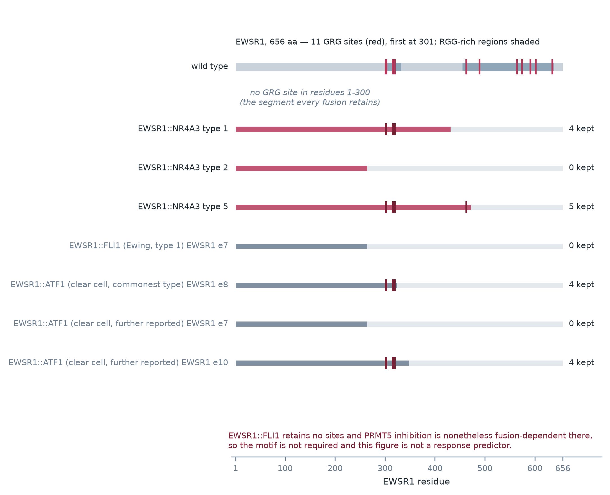

# The PRMT5 methylosome in extraskeletal myxoid chondrosarcoma: a fusion-class rationale that survives and an MTAP-locus rationale that does not

**Tristan D. McRae**

*Independent researcher, unaffiliated.* Correspondence: trimcrae@gmail.com

Running title: PRMT5 in extraskeletal myxoid chondrosarcoma

*Keywords:* extraskeletal myxoid chondrosarcoma; EWSR1::NR4A3; PRMT5; MTAP; arginine methylation; fusion-driven transcription; rare sarcoma

*A hypothesis-generating re-analysis of public data. No experiment in an EMC cell, no drug exposure
and no patient are reported. Nothing here asserts efficacy, safety, a therapeutic window or clinical
readiness for any agent in any disease. Analyses, figures and drafting were carried out with AI
assistance (section 2.6).*

## Abstract

Extraskeletal myxoid chondrosarcoma (EMC) is an ultra-rare sarcoma driven by an *NR4A3* fusion,
usually EWSR1::NR4A3; no clinically validated agent directly targets NR4A3. No indexed study examines
the PRMT5 methylosome in this histology. We tested two independent rationales against the only public
data able to address them: the two archival series containing it (16 EMC tumours, two platforms), a
public sarcoma CRISPR dependency panel, and PRMT5's reported substrate motif in the fusion protein
sequence. The first transfers from EWSR1-fusion sarcomas where PRMT5 supports fusion-driven
transcription. *PRMT5* reads higher in EMC than in the comparator arm on both (*t* = 6.24 and 6.67)
and ranks first of the readable PRMT family, but does not survive correction for the number of genes
examined: family-wise adjusted *p* at least 0.21 and 0.24, against exact permutation *p* of 0.000142
and 0.000125 for one gene's labelling. A twelve-gene proliferation adjustment leaves it nearly intact
on the 35-tumour platform and removes most of it on the 16-tumour one, so the platforms disagree. In
EWSR1 the eleven Gly-Arg-Gly sites all lie beyond residue 300; the commonest EMC fusion and two of
three reported clear cell fusions retain four, and EWSR1::FLI1 none. Selection on *MTAP* loss is not
supported: *MTAP* is flat where the read is powered, reverses sign on the other platform, and has an
adjusted *p* of 1.00. Two inexpensive experiments would settle each: MTAP immunohistochemistry on
archival tissue, and one clinical-stage PRMT5 inhibitor added to a screen already running on
published EMC models.

---

## 1. Introduction

### 1.1 The disease and its treatment options

Extraskeletal myxoid chondrosarcoma is an ultra-rare translocation sarcoma defined by an *NR4A3*
gene fusion, most often EWSR1::NR4A3. The most recent comprehensive review of the disease states that
no clinically validated agent directly targets NR4A3, and reports pazopanib with an objective
response rate of 18% and a median progression-free survival of 19 months (NCT02066285) [1]. The
modality census described in section 1.3 counts eight systemic classes in clinical use for this
disease, of which only that one carries a meaningful response record. A tumour managed over that
horizon is not the profile in which mechanisms scaling with division rate are strongest. A low growth fraction is taken here as an
expectation to be tested rather than as an established fact, and it is the pre-specified basis of the
cellularity control reported in section 3.6. Both rationales examined
here act elsewhere: one on transcription, one on a metabolic state.

### 1.2 Two rationales for the PRMT5 methylosome

The first rationale runs through the fusion. A study of clear cell sarcoma reports that PRMT5
enhances EWSR1-ATF1-driven gene transcription, that silencing PRMT5 impaired both
proliferation and fusion-driven transcription, and that a clinical-stage PRMT5 inhibitor inhibited
growth in vitro and in vivo [2]. Clear cell sarcoma is, like EMC, an ultra-rare translocation
sarcoma whose driver fuses the same 5′ gene, *EWSR1*, to a transcription factor. Both fusions retain
the same N-terminal EWSR1 segment, which is the region the sequence analysis of section 3.7
measures. A second disease reports the same dependence more specifically.
In Ewing sarcoma, PRMT5 and PRMT1 inhibitors cause growth arrest and apoptosis, and the effect of
single-agent GSK591 was "largely supressed [sic] by partial depletion of EWSR1::FLI1" [3], which is a
fusion-dependent PRMT5 requirement measured in a disease that is not EMC. The same report cuts
against the rationale in one respect and is cited here for both directions: PRMT5, PRMT1 and MEP50
read higher across multiple sarcoma types than in breast and lung cancer, and depleting EWSR1::FLI1
did not change PRMT transcript levels, so an elevated PRMT5 transcript is not a read-out of the
fusion.

The second rationale runs through a genetic selection window rather than through the fusion.
Tumours that have lost *MTAP* are comparatively more sensitive to PRMT5 and MAT2A inhibition, an
axis that has reached patients with an MTA-cooperative PRMT5 inhibitor selected on *MTAP* deletion
[4]. That sensitivity is comparative. A differential established in engineered and pan-cancer
settings is not a therapeutic window in a patient, and none is claimed here. The window also has a
known ambiguity. *MTAP* loss implies *CDKN2A* loss, while
*CDKN2A* loss does not imply *MTAP* loss [5], so a three-gene locus score can fall on a *CDKN2A*
event alone.

The methylosome is read as a unit rather than as PRMT5 alone because MEP50 (WDR77) is required for
PRMT5-catalysed activity and binds substrate independently [6].

### 1.3 Absence of the question from the published record

A modality census of this disease completed on 2026-08-09 enumerated 217 categories of cancer
treatment and found that classes selected by a molecular state had been dismissed as a group,
largely because the biomarker had never been read. A corpus of 591 open-access full texts retrieved
for this work contains no *MTAP*, *PRMT5* or *MAT2A* datum for this histology; its four incidental
mentions of the histology are diagnostic-pathology asides.

A separate Europe PMC prior-art screen of 322 records, 238 of them with full text, returned one hit
on the pairing of this histology with either target: a 2007 review of chondrosarcomas that names
methylthioadenosine phosphorylase among therapeutic targets "validated by translational research" in
that disease, while treating EMC as a distinct fusion-defined entity [7]. That review concerns the
parent histology, conventional chondrosarcoma, and predates the *MTAP*-deletion and PRMT5
synthetic-lethality literature entirely, so it speaks to the target's standing in chondrosarcoma
broadly rather than in this histology. The claim made here is accordingly narrow: nothing indexed
pairs the PRMT5 methylosome with extraskeletal myxoid chondrosarcoma. The screen matched titles and
abstracts rather than full text, so an absence in it means that nothing is indexed on a pairing and
not that no such work exists; a result inside a supplementary table of a larger paper would be
invisible to it.

---

## 2. Materials and methods

### 2.1 Expression series, sample classification and per-gene scoring

Two public archival series contain this histology and are the only readable EMC expression data.
Neither GEO record links a publication, so the deposits are identified by accession; the summary
deposited with GSE4303 describes profiling of ten EMC and 26 other sarcomas on 42,000-spot cDNA
microarrays, which corresponds to the published study of that series [12].

| series | platform | measurement | EMC | comparator arm | reference channel |
|---|---|---|---:|---|---|
| GSE24369 | GPL6244 | single-channel intensity | 6 | 17 low-grade fibromyxoid sarcoma, 6 desmoid fibromatosis, 6 myxofibrosarcoma | not applicable |
| GSE4303 | GPL3290 | two-colour log-ratio | 10 | 3 dermatofibrosarcoma protuberans, 3 gastrointestinal stromal tumour | EMC against `CRH-mRNA`, DFSP against `CRH`, GIST against `UHR` |

Samples were assigned to EMC or to a comparator class by pattern-matching the verbatim GEO
annotation, in a step separate from the data fetch so that every assignment is auditable against the
text that produced it. GSE24369 deposits 42 samples and 35 were analysed. Two pooled skeletal-muscle
RNA samples were excluded by design, since a comparator arm of tumours should not contain normal
tissue. Five solitary fibrous tumours were excluded because the classifier carried no pattern for
that histology and they fell through to an unclassified bucket: that exclusion was accidental rather
than designed, it is reported here for that reason, and section 3.4 and the supplement give both its
effect on the figure and its effect on the primary contrasts. GSE4303 deposits 36 samples across two
platforms, of which the 16 on GPL3290 are analysed here.

On the two-colour platform every value is a ratio to a reference channel, and the deposited
annotation records three different references: all ten EMC tumours against `CRH-mRNA`, the three
DFSP comparators against `CRH`, and the three gastrointestinal stromal tumours against `UHR`, a
universal human reference. Whether `CRH` and `CRH-mRNA` name one pool or two is not stated in the
deposit, so the DFSP comparators are described here as matched by label rather than as identical.
Section 3.6 reports what the split does to the readings.

Each gene's value in each sample was converted to a *z*-score against that array's own probe
distribution: the mean and standard deviation are taken per sample over every probe on that array
carrying a value, mapped or not, so a value is a position within one array rather than a quantity
comparable across platforms or across samples' hybridisation intensities. Where more than one probe
maps to a symbol, the probes are averaged on the array's own scale before standardisation. The
probe-to-symbol bridge is built from the GEO platform table's accession column, resolved through a
curated dictionary, a UniGene archive and live NCBI queries in that order; the fraction of distinct
accessions resolved was 0.981 on GPL6244 and 0.582 on GPL3290, and the fraction of probes carrying a
symbol was 0.711 and 0.633.

A group score is the mean of its member genes' *z*, contrasted between EMC and the comparator arm by
Welch's *t*. A curated group emits no score unless at least three genes are readable and coverage is
at least 0.5; a group failing that floor is reported as underpowered rather than as a null result. A
gene with no probe mapping is recorded as unreadable and never as unexpressed, which matters below
because one locus gene has no probe on the second platform. Samples with no value for a gene are
dropped from that gene's contrast rather than imputed, and a gene is scored only with at least three
values in each arm. Missingness is not uniform: on GPL6244 every cached gene has a value in every
sample, while on GPL3290 578 of 1,662 (34.8%) have at least one missing value and 51 (3.1%) have an
arm below three.

### 2.2 Dependency panel

Gene-effect scores come from the DepMap public 24Q4 release (Chronos), distributed as figshare
article 27993248, restricted to sarcoma models. The release lists 176 sarcoma models, of which 91
carry CRISPR gene-effect data; every figure here is computed on those 91. A gene is called a
dependency in a line at a gene effect below −0.5, and selectivity is the difference between the mean
gene effect outside sarcoma and inside it.

### 2.3 Exact permutation, genome-wide placement and multiplicity correction

Both designs are small enough to enumerate completely, so no normal approximation is used. Every
assignment of the observed *z* values to arms of the observed sizes was evaluated and Welch's *t*
recomputed, giving C(35,6) = 1,623,160 labelings on GPL6244 and C(16,10) = 8,008 on GPL3290. The
two-sided *p* is the fraction with |*t*| at least the observed value. No random sampling is used, so
the value is exactly reproducible.

The permutation is exact for the labelling and says nothing about how many genes were examined. That
question is asked separately by computing the same statistic for every symbol the platform's probes
map to and placing each gene of interest in that distribution: 18,688 symbols were scored on GPL6244,
and 14,404 of the 14,932 carrying a probe on GPL3290. The genome-wide computation runs at fetch time,
when the full probe matrix exists, and re-derives from the raw matrix the statistic the panel computes
from reduced per-gene values by a separate code path; the two agree for every gene both paths score
on both platforms. The two paths do not apply the same minimum arm size: the panel requires three
values per arm and the genome-wide path two, so a gene can carry a genome-wide rank and no panel
contrast, which is the case for one instrument control in section 3.5.

Neither of those procedures corrects for the number of genes examined, so a third does. A
max-statistic permutation correction was run: arm labels are permuted exactly as the single-gene
exact test permutes them, Welch's *t* is recomputed for every gene in the family at every labelling,
and the largest |*t*| across the family is recorded per labelling. A gene's family-wise adjusted *p*
is the fraction of labellings whose maximum reaches its observed |*t*|. On GPL3290 all 8,008
labellings were enumerated, so that correction is exact; on GPL6244, where enumerating 1,623,160
labellings against a family of this size is not affordable, 20,000 were drawn under a fixed seed and
the Monte-Carlo standard error is reported with the value.

The family is every symbol two committed input caches hold: the genes the panel requested, and a
seeded uniform random sample of about 4,000 symbols drawn from the platform's whole mapped-symbol
universe for an unrelated null. The two caches were fetched separately and were checked to agree
value for value on every symbol they share, on identical samples and identical per-sample
backgrounds, before they were merged. That family is 5,449 symbols on GPL6244 and 4,848 on GPL3290,
against mapped-symbol universes of 18,724 and 14,932. Because it is a subset of the array, and
because adding symbols can only raise the permuted maximum, every adjusted *p* reported here is a
lower bound on the value the full array would give. How fast that bound rises with the number of
symbols scanned is measured on the random symbols alone and reported in the supplement.

### 2.4 Confound adjustment

A per-sample confound score is the mean *z* of the readable members of a named gene set, provided the
sample carries at least 60% of them. *PRMT5* is then regressed on that score by ordinary least
squares with one covariate and an intercept, and the EMC-versus-comparator contrast recomputed on the
residuals. A contrast is called surviving if it keeps its sign and at least 60% of its magnitude, a
threshold chosen for this work rather than taken from an established convention; raw and adjusted
values are both reported, and the realised fractions are given so a reader can apply a different
threshold. The proliferation score uses twelve genes and scores all 35 and all 16 samples; the
chondroid-lineage score uses eight and scores 35 and 14. Against the proliferation score *PRMT5*
retains 5.23/6.24 = 0.84 of its magnitude on GPL6244 and 2.71/6.67 = 0.41 on GPL3290, so the failure
on the second platform is not marginal.

### 2.5 Substrate-motif map

Occurrences of the motif GRG were counted by exact string scan on committed protein sequences, with
overlaps included, since GRGRG contains two sites and two methylatable arginines and a
non-overlapping scan would halve a poly-RG tract. The motif definition is taken from reference [8],
whose bibliographic record and abstract were retrieved but whose full text is not open access and was
not read, a limit that matters because the motif is the foundation of this section. A fusion's
retained 5′ sites are those at or before the last residue fully encoded by the 5′ partner, excluding
the seam residue, because each of these junctions splits a codon.

Breakpoints are transcript exon boundaries, and this work has no EMC cohort of its own. The
*NR4A3*-fusion junctions are the ones reported in [13], [14], [15] and [16], each recorded in the
source artifact with the verbatim sentence it was taken from: EWSR1 exon 12 to *NR4A3* exon 3 (type
1), exon 7 to exon 2 (type 2), exon 13 to exon 3 (type 5), and TAF15 exon 6 to *NR4A3* exon 3. The
EWSR1::ATF1 and EWSR1::FLI1 junctions used as comparators carry an exon number and a cumulative
coding position in the same artifact but no separate published quotation, and are reported on that
footing. Two double-entry checks are run against artifacts that predate this analysis: each
re-derived RG count against the counts those artifacts already held, and each fusion's own RG count
against the sum of its retained 5′ half and NR4A3's contribution.

### 2.6 Reproduction and AI assistance

Every figure, table and number is regenerable from public data by scripts in the accompanying
repository, and section 8 names the artifact that owns each value. Analysis, figures and drafting
were carried out with substantial assistance from an AI coding agent operating on a version-
controlled repository under the author's direction, using Anthropic Claude. The agent is not an
author and cannot be one, and the author takes responsibility for the content. The analysis is
written in Python 3.11, using only the standard library for the fetch, the scoring, the group
statistics and the exact permutation, and NumPy for the max-statistic permutation of section 2.3;
figures are drawn with Matplotlib. No statistical package supplies the tests: Welch's *t*, its
Satterthwaite degrees of freedom and both permutation procedures are implemented directly, which is
what makes exact enumeration possible at these sample sizes.

Every statistic, percentile, count and dependency figure reported here was checked against the
committed artifact that owns it, and the reads, thresholds and controls were specified before the
corresponding data were retrieved. Where a value could not be reconciled it was corrected and the
superseded value registered in Appendix A, which includes one Methods count that traced to no
artifact at all. Two of the corrections recorded there, the closure of the locus rationale and the
restatement of the fusion rationale on the gene rather than the group, were found during figure
preparation, after the prose had been written the other way. Every bibliographic identifier below was
taken from a retrieval record and is checked against a tracked artifact by an automated linter; that
check establishes that an identifier came from a retrieval rather than from recollection, and it does
not establish that a citation is apt.

---

## 3. Results

### 3.1 Group-level readings

The PRMT5 methylosome group reads higher in EMC than in the comparator arm on both platforms
(*t* = 3.11 and 3.89), and the methionine-salvage context group likewise (*t* = 4.26 and 2.07).
*MAT2A* sits at the 99th percentile of its array on GPL6244 and *PRMT5* at the 91st. The
corresponding GPL3290 figures, the 84th and the 59th, are percentiles of a distribution of
log-ratios against a reference pool and carry no absolute meaning: on that platform only the
between-group contrast is interpretable.

Scored as *MTAP* plus *CDKN2A* plus *CDKN2B*, the locus reads lower in EMC on GPL6244 with all three
genes readable, *t* = −4.06. On GPL3290 only two of three are readable, which falls below the panel's
coverage floor, so no score is emitted; that is an instrument limit rather than a reading of the
biology.

**Figure 1.** Every tumour on both platforms. Per-sample *z* against each array's own probe
distribution; bars are medians. The two platforms are not placed on a shared axis, because one is
single-channel intensity and the other a two-colour log-ratio. A gene with no probe is marked
unreadable, which records a missing measurement and not an absence of expression.

An elevated methylosome is consistent with the fusion rationale without being evidence for it, since
abundance is not dependency and elevated methylosome expression is reported across many malignancies
[3]. The low locus group score is likewise consistent with the *MTAP* rationale without supporting
it, for the reason developed in section 3.2.

### 3.2 The locus gene by gene

Read gene by gene, the locus does not support selection on *MTAP*.

| gene | GPL6244 (powered) | GPL3290 | genome-wide rank of \|*t*\| |
|---|---:|---:|---|
| *MTAP* | +0.053 SD, *t* = +0.69 | −0.607 SD, opposite sign | top 74% / top 26% |
| *CDKN2A* | −0.481 SD, *t* = −5.40 | +0.175 SD, reversed | top 3.5% / top 49% |
| *CDKN2B* | −0.136 SD | unreadable | top 34% / not applicable |

*MTAP*, the only gene of the three that carries the therapeutic argument, is flat on the powered
platform, changes sign on the other, and is unremarkable on both when placed against every gene on
its own array, at the top 74% and top 26% of the |*t*| distribution against *PRMT5*'s top 1.9% and
1.0%. It is also at a multiplicity-adjusted *p* of 1.00 on both platforms, which is the one place in
this paper where correcting for the number of genes examined strengthens the argument rather than
weakening it: the closure of this rationale is exactly what an adjusted *p* of 1.00 states. What
signal the locus score has is carried by *CDKN2A*, which itself changes direction between platforms
and does not survive correction either (adjusted *p* = 0.51). The group statistic of −4.06 is
accurate but is not a reading of *MTAP*, and a group score cannot distinguish the two. Since the
genetic window depends on *MTAP* loss specifically, the locus reading does not support it. Only MTAP
protein can settle the question, and the test proposed in section 4.2 is accordingly a stain.

**Figure 2.** The three genes of the locus do not read alike. *MTAP* is flat on the powered
platform, while *CDKN2A* carries what signal the locus score has and then reverses on the second
platform.

### 3.3 The sarcoma dependency prior

Across the 91 screened sarcoma cell lines, PRMT5 and MAT2A are dependencies in 94.5% and 96.7%
respectively. MTAP is not a dependency in any of them, which is the expected profile for a biomarker
rather than a target. That is consistent with the panel being read correctly, and it is weaker than a
positive control, since a gene can be a non-dependency for reasons that have nothing to do with the
instrument.

This weakens the specificity of the proliferation half of the transferred result, and the same table
weakens it further. PRMT5 is a dependency in 94.1% of the non-sarcoma lines of the release as well,
giving a sarcoma selectivity of 0.013 on a gene-effect scale where MAT2A reads −0.285; on this panel
PRMT5 is not distinguishable from a pan-essential gene, in sarcoma or outside it. Silencing PRMT5
impairs proliferation in nearly every line, so a growth effect in EMC would be close to expected; the
part that could be specific to this disease, and the part any transfer must rest on, is the effect on
fusion-driven transcription rather than on growth.

It does not refute the class. The therapeutic argument for the *MTAP*-selected axis is a
differential between *MTAP*-deleted and *MTAP*-intact cells, and a gene-effect score cannot express a differential of that
kind, since an MTA-cooperative inhibitor exploits a metabolic state rather than the raw dependency
[4]. A near-universal dependency and a genetic window are compatible.

**Figure 3.** The sarcoma dependency prior. PRMT5 and MAT2A are dependencies in almost every sarcoma
line, so a growth effect on silencing them is close to expected; only an effect on fusion-driven
transcription would be specific to this disease. The bars are the sarcoma fractions; PRMT5 is a
dependency in 94.1% of the non-sarcoma lines as well, so the panel supports no statement of tissue
selectivity either. MTAP is not a dependency, and neither rationale gains support from this panel.

The panel contains no EMC line. No EMC cell line carrying the fusion appears in any public dependency
dataset, so this prior is a transfer from other sarcomas, limited by the complete absence of an EMC
observation rather than by sample size.

### 3.4 Comparator classes, pooled group against single gene

**Figure 4.** Pooled group against single gene, for every class GSE24369 deposits. One comparator
class, low-grade fibromyxoid sarcoma, is FUS::CREB3L2 and therefore a FET-fusion control on whether
the reading is simply what a fusion sarcoma looks like. Solitary fibrous tumour is drawn although it
is not in the comparator arm, because it is deposited in the series and was excluded only by the
classifier's want of a pattern for it (section 2.1); the two pooled skeletal-muscle samples are
normal tissue and are marked as not a comparator. Pooled across the four methylosome genes, EMC ranks
third of the five tumour classes, below desmoid fibromatosis and solitary fibrous tumour, so the
group does not separate this disease. *PRMT5* alone does, with a median of +1.30 against +1.05,
+1.05, +1.04 and +0.94. Left-panel points are gene-by-sample values pooled across four genes, so they
are not independent observations and no test is run on them.

For the locus, a group score reported a signal that its decisive gene did not have; for the
methylosome, a group score hid a signal that its decisive gene does have. Neither is visible without
reading the constituent genes, so a curated group score is treated here as a summary and not as a
unit of evidence.

Two features of the figure qualify the single-gene reading rather than supporting it. The class that
sits second on *PRMT5*, solitary fibrous tumour at +1.05, is the class the classifier dropped, so the
gap the figure displays is narrower than the analysed arms alone would suggest; and the two pooled
skeletal-muscle samples, which are normal tissue, read higher than EMC on *PRMT5* at +1.34. A
within-array *z* measures where a transcript sits among that array's probes, and PRMT5 sits high in
tissues that are not tumours at all.

### 3.5 PRMT5's own statistic and its genome-wide placement

*PRMT5* alone, the gene the fusion rationale depends on, reads *t* = 6.24 on GPL6244 and 6.67 on
GPL3290, against +0.263 and +0.816 SD.

| platform | *PRMT5 t* | labelings enumerated | at least as extreme | exact two-sided *p* |
|---|---:|---:|---:|---:|
| GSE24369 / GPL6244 | +6.24 | 1,623,160 | 230 | 0.000142 |
| GSE4303 / GPL3290 | +6.67 | 8,008 | 1 | 0.000125 |

On GPL3290 the exact *p* cannot fall below 1/8,008 whatever the effect size: with 10 versus 6 tumours
the resolution of the test is the sample size rather than the biology.

Placing each gene of interest against every gene on its own array gives the following, with the
multiplicity-adjusted *p* of section 2.3 beside it and two instrument controls: *NR4A3*, the
disease-defining fusion transcript, and *ENO3*, a published direct target of an NR4A3 fusion [17].

| gene | GPL6244: *t*, rank of \|*t*\|, adjusted *p* | GPL3290: *t*, rank of \|*t*\|, adjusted *p* |
|---|---|---|
| *PRMT5* | +6.24, top 1.9%, 0.21 | +6.67, top 1.0%, 0.24 |
| *MAT2A* | +4.13, top 8.5%, 0.98 | +4.10, top 6.3%, 0.97 |
| *WDR77* | +2.82, top 20.5%, 1.00 | unreadable |
| *MTAP* | +0.69, top 74.0%, 1.00 | −2.27, top 26.1%, 1.00 |
| *CDKN2A* | −5.40, top 3.5%, 0.51 | +1.33, top 49.3%, 1.00 |
| *NR4A3* (control) | +4.66, top 5.9%, 0.85 | +1.70, top 38.5%; *n* = 9 versus 2 |
| *ENO3* (control) | +3.61, top 12.0%, 1.00 | +13.22, top 0.05%, 0.010 |

The adjusted values are lower bounds, for the reason section 2.3 gives, and the GPL6244 column
carries a Monte-Carlo standard error of about 0.003. On this correction only *ENO3* on GPL3290 falls
below 0.05, and it does so on a family that is a third of that array; the primary contrast does not
clear conventional thresholds on either platform.

The two controls do not behave alike, and the second of them is not the read it appears to be.
*ENO3* sits at the extreme of GPL3290, as a working instrument should show. *NR4A3* is only mid-table
there, and two explanations are available. The measured one is the sample count: only two of the six
comparator samples and nine of the ten EMC samples carry a value for *NR4A3* on that array, which is
below the three-per-arm floor the panel applies, so the panel emits no contrast for it at all and the
+1.70 comes from the genome-wide path with its floor of two. The pre-specified one, carried in the
source artifact's control block before the data were read, is probe placement: on a 3′-biased array
the probe can sit in the region the fusion replaces. Both may contribute, but only the first is
measured here, and a comparator arm of two is a sufficient explanation on its own. GPL3290's ranking
should not be read as if every row on it were equally trustworthy.

A rank is not a corrected *p*, which is why the adjusted column is reported beside it. It reports
where a gene sits among all genes, controls no error rate, is computed over a distribution containing
real biology rather than a null, and is inflated in effective sample size by correlation between
transcripts. Taken alone it supports only the narrow statement that on these arrays a *t* of
*PRMT5*'s size is uncommon among individual genes and a *t* of *MTAP*'s size is not. It is not
uncommon among the maxima that arise by chance when this many genes are scanned at this sample size:
across labellings of the arms, the largest |*t*| in the family exceeds 5.4 in half of them, and
reaches *PRMT5*'s observed 6.24 in at least a fifth.

### 3.6 Four prespecified controls

Each control was specified against a named weakness before it was run, and each is a control rather
than an additional hypothesis test.

The first asks whether the elevation is *PRMT5* or the PRMT family, which matters because the Ewing
report finds PRMT1 and PRMT5 elevated together across sarcoma types [3]. Eight family members are
readable on GPL6244 and seven on GPL3290, counting *PRMT5* itself, and *PRMT5* ranks first on both.
As a group the family is flat (*t* = 0.33 and 1.34) while *PRMT5* alone reads 6.24 and 6.67. The separation is incomplete on
the second platform, where *CARM1* reads +5.44 and *PRMT3* +3.47, so a family-wide reading is
weakened rather than excluded; only on GPL6244, where the next member is *PRMT3* at +1.62, is
*PRMT5* clearly separated.

The second control adjusts for proliferation, and on one platform it takes most of the contrast.

| axis | platform | score elevated in EMC | *PRMT5 t*, raw to adjusted | reading |
|---|---|---|---:|---|
| proliferation, 12 genes | GPL6244, *n* = 35 | no, *t* = 0.45 | 6.24 to 5.23 | survives |
| proliferation, 12 genes | GPL3290, *n* = 16 | yes, *t* = 3.00 | 6.67 to 2.71 | most of the contrast goes with it |
| chondroid lineage, 8 genes | GPL6244, *n* = 35 | no, *t* = 0.99 | 6.24 to 6.20 | untouched |
| chondroid lineage, 8 genes | GPL3290, *n* = 14 | no, *t* = 0.36 | 6.67 to 6.52 | survives |

The second row weakens the transcript half of the fusion rationale. On GPL3290 the proliferation
score is itself higher in EMC, correlates with *PRMT5* at *r* = 0.60, and adjusting for it takes
*PRMT5* from 6.67 to 2.71; on that platform the reading is consistent with a proliferation effect.
The platforms disagree and neither is clearly preferable. GPL6244 has 35 tumours, a flat
proliferation score and a *PRMT5* contrast that barely moves; GPL3290 has 16, a two-colour
log-ratio measurement, and a proliferation score that moves with everything. The transcript half
therefore survives on the larger platform and not on the smaller one.

Two candidate explanations for that disagreement should be ranked, and the more mundane one is not
biological. The platforms measure different quantities, which is the general statement; the specific
difference their own annotation records is that half the GPL3290 comparator arm was hybridised
against a different reference pool from every EMC tumour on it (section 2.1). In a two-colour design
that changes every ratio systematically, and it applies to the proliferation genes as much as to
*PRMT5*. Splitting the comparator arm by reference is the discriminating comparison: against the
three comparators sharing EMC's reference label, *PRMT5* reads *t* = 5.97 and the fourth control
below reads *t* = 1.09, against 6.67 and 2.30 pooled. The supplement reports the full split. A
three-sample arm supports nothing on its own, so this ranks the two explanations rather than deciding
between them; a difference in the denominator of the measurement is the simpler of them.

The third control tests chondroid lineage and is the weakest of the four even where it passes. No
comparator in either series is cartilage-lineage. It can ask whether *PRMT5* and chondroid markers
move together within these samples, and they do not (*r* = 0.05 and −0.04), but it cannot exclude
that chondroid tumours generally express *PRMT5*.

The fourth control is a single-gene cellularity reference, specified in advance as approximately flat
because a large proliferation difference would say the contrast was being driven by how much tumour
each sample contains. *MKI67* reads *t* = 0.53 on GPL6244, as expected, and *t* = 2.30 at +1.24 SD on
GPL3290, which is not flat. It therefore passes on one platform and moves on the other, in the same
direction and on the same platform as the twelve-gene proliferation score, so the two controls agree
with each other and both disagree with the expectation on GPL3290. It does not survive the multiplicity
correction on either platform (adjusted *p* = 1.00 for both), which for a control that is expected to
be flat is the uninformative direction: an adjusted *p* of 1.00 says the correction cannot resolve
the difference, not that the difference is absent.

None of these adjustments can remove a confound that the proxy measures badly. Regressing out a
transcript score removes the part of the contrast the proxy linearly predicts and nothing more, so a
surviving result is a much weaker statement than a failing one.

### 3.7 The substrate motif in the fusion protein

The readings above are measurements on tumours and on cell lines. This section addresses where
PRMT5's reported substrate motif sits in the fusion protein.

Profiling arginine methylation genome-wide after selective PRMT5 inhibition, and validating hits by
in vitro methylation, identifies a preference for "arginine sandwiched between two neighboring
glycines (a Gly-Arg-Gly, or 'GRG,' sequence)" [8]. That is a preference and not a rule: PRMT5
methylates arginines outside GRG, and a GRG site is not necessarily methylated. A mapping experiment
in a different substrate narrows it the same way, since of three DDX5 fragments only the one carrying
the C-terminal RGG/RG motif was methylated by PRMT5, and mutating five arginines inside that motif
abolished it [9]. The EWSR1 protein is itself extensively arginine-methylated [10], which is what
makes the location of the motif in the fusion a question worth computing.

EWSR1 is 656 residues and carries eleven GRG sites, the first at residue 301 and none before it. The
N-terminal segment that every EWSR1 fusion retains is the SYGQ-rich low-complexity region, and it
contains no site. Every site lies beyond residue 300, in the two RGG-rich regions the fusion
truncates. Residue 301 of 656 falls at 46% of the protein, so the sites are not confined to the
C-terminal half; the retained N-terminal segment contains none of them.

| fusion | 5′ residues retained | GRG sites kept | fraction of EWSR1's 11 |
|---|---:|---:|---:|
| EWSR1::NR4A3 type 1, the commonest EMC fusion | 431 | 4 | 0.364 |
| EWSR1::NR4A3 type 5 | 472 | 5 | 0.455 |
| EWSR1::NR4A3 type 2 | 264 | 0 | 0.000 |
| TAF15::NR4A3 | 161 | 0 | 0.000, of TAF15's 9 |
| EWSR1::ATF1, clear cell sarcoma, commonest type, EWSR1 exon 8 | 324 | 4 | 0.364 |
| EWSR1::ATF1, clear cell sarcoma, EWSR1 exon 10 | 348 | 4 | 0.364 |
| EWSR1::ATF1, clear cell sarcoma, EWSR1 exon 7 | 264 | 0 | 0.000 |
| EWSR1::FLI1, Ewing sarcoma, type 1 | 264 | 0 | 0.000 |

**Figure 5.** The motif, the RGG regions, and where each fusion cuts. EWSR1 is drawn once at full
length with its eleven GRG sites and its two RGG-rich regions; below it, each fusion's retained 5′
segment on the same ruler. All three reported clear cell sarcoma junctions are plotted, including the
one that retains no site. EWSR1::FLI1 is plotted in the same style and keeps no site, and it is the
fusion in which a PRMT5 requirement has actually been shown to be fusion-dependent. TAF15::NR4A3 is
tabulated above but not plotted here, because TAF15 is a different 5′ protein and therefore a
different ruler.

Two of the three reported clear cell sarcoma junctions retain four sites, the same number as the
commonest EMC fusion, at different breakpoints and by coincidence of where the RGG boxes fall; the
third retains none. The transfer between the two diseases, previously stated as an assumption
(Appendix A), therefore has quantitative content, and the content is a match at the commonest
junction of each disease rather than a property of either fusion as such. Clear cell sarcoma also
supplies within its own breakpoints the same contrast the two-construct experiment of section 4.2
proposes to build in EMC.

The table does not license a prediction that retained-site count determines response. EWSR1::FLI1
retains no sites, and it is in EWSR1::FLI1 that a PRMT5 inhibitor's effect was shown to be
fusion-dependent [3]. Whatever PRMT5 does in a FET-fusion sarcoma, it does not require the fusion protein to be the substrate. EMC type 2
and TAF15::NR4A3, which retain none, are therefore not predicted to be unresponsive; the fusion
protein is one candidate substrate among several, and the others, including wild-type FET proteins,
Sm proteins and R-loop-resolution factors [9], carry their motifs regardless of the breakpoint.

A motif marks a site at which an enzyme can act. These counts do not show that any NR4A3 fusion is
methylated, that PRMT5 is the enzyme that would methylate it, or that methylation would be
functionally consequential.

---

## 4. Discussion

### 4.1 Status of the two rationales

The 2025 comprehensive review of this disease reaches the same categorical conclusion about the
absence of a targeted agent, and considers neither of the rationales examined here [1]. Read against
the only public data able to address them, the two rationales separate: one is closed and one
survives with a stated limit.

The *MTAP*-locus rationale is closed at transcript level by the data reported here. The three-gene
locus score does read lower where the read is powered, but the gene that carries the therapeutic
argument does not move, is at an adjusted *p* of 1.00 on both platforms, and what signal the score
has belongs to *CDKN2A*, which reverses between platforms and does not survive correction either.
Since the window selects on *MTAP* loss specifically, a transcript reading of the locus cannot
support it. The rationale survives only as a question that MTAP immunohistochemistry would answer
directly, and protein loss is what the window selects on in any case, so a transcript could not have
seen it.

The fusion rationale survives as a hypothesis and is weaker than the uncorrected statistics make it
look. The methylosome group reads higher in EMC on both platforms, but per class the group does not
separate this disease, while *PRMT5* alone separates it from the other tumour classes; *PRMT5* is the
gene the rationale depends on, and the other three members are flat or lower in EMC and dilute it.
What the correction removes is the claim that this contrast is unlikely to have arisen from the
number of genes examined: at an adjusted *p* of 0.21 and 0.24 it is not, on either platform. What
survives correction is the replication, which no single-platform correction addresses: two
independently collected series, on different technologies with different comparator arms, both put
*PRMT5* first of the readable PRMT family and both put the contrast in the same direction. The
rationale also no longer rests on an assumption alone: a result in a second EWSR1-fusion sarcoma
shows a fusion-dependent PRMT5 requirement [3], and the sequence analysis of section 3.7 shows that
the commonest fusion of each of two diseases retains the same number of motif sites. Both are
arguments about plausibility; neither is an observation in EMC.

Three limits sit on the surviving rationale and are not resolved here. The transcript half survives
its proliferation control on the 35-tumour platform and does not on the 16-tumour one, and nothing
available decides between them. Elevated PRMT5 is also not specific to this disease on the comparison
that has been published, since PRMT5, PRMT1 and MEP50 read higher across multiple sarcoma types than
in breast and lung cancer [3]; the comparator arm used here is other sarcomas, which is the harder
contrast, but "higher than other sarcomas" in 16 tumours and "a sarcoma-wide feature" are not
mutually exclusive statements and nothing here separates them. And on the dependency panel PRMT5 is
required in 94.1% of non-sarcoma lines as well as 94.5% of sarcoma ones, so nothing in the public
data makes it a selective target in this tissue class or any other.

### 4.2 Two decisive experiments

For the fusion rationale, a PRMT5 inhibitor in a patient-derived EMC model. Two such models are
published, and drug sensitivities to carfilzomib, doxorubicin and venetoclax, with two synergistic
pairs among them, were validated in both by the group that established them [18]. Adding one
clinical-stage PRMT5 inhibitor to a screen that already runs is among the smallest asks available in
this disease, and it tests the surviving rationale directly rather than through a biomarker. The
Ewing report suggests one addition: PRMT5 inhibition sensitised Ewing cells to olaparib, and the
combination's cytotoxicity was only partially rescued by fusion depletion [3], so a PRMT5 inhibitor
with and without a PARP inhibitor is two arms rather than one, and the combination arm carries a
mechanism.

For the mechanism behind that rationale, two constructs in one experiment. Section 3.7 leaves a fork
that no expression or dependency data can settle: whether the fusion protein is itself a PRMT5
substrate, or PRMT5 acts on something else the fusion depends on. EMC answers this more cleanly than
any other disease in the family, because its transcript types differ in retained motif count while
sharing a driver, with type 1 retaining four GRG sites and type 2 none. Comparing PRMT5 inhibition
across the two separates the mechanisms. The Ewing result predicts they will behave alike, since a
zero-site fusion already shows fusion-dependent PRMT5 sensitivity; a difference would be the
surprising outcome, and it is the one that would make the fusion protein itself the target.

For the *MTAP* rationale, MTAP immunohistochemistry on archival EMC tissue. The stain is routine,
runs on formalin-fixed archival material, and is an accepted surrogate for homozygous 9p21 deletion:
homozygous deletion was found in 90% to 100% of cases with complete MTAP expression loss, checked
against FISH, across a survey of 13,067 tumours from 149 tumour types in which MTAP loss reached up
to 20% in various sarcomas [11]. That survey does not name this histology, so it supplies a class
prior rather than an answer.

Outcome interpretations are fixed in advance, and the negative branch of each is the falsifier table
of section 4.3, which is where they are stated. The positive branches are quickly said. PRMT5
inhibition active in an EMC model would be a fusion-class-transferred vulnerability in this disease
that has not been reported before; MTAP protein lost in a subset would define a genetically selected
group in it. Every branch is publishable and the negative branches are the more likely ones, which is
what makes a hypothesis of this shape affordable in an ultra-rare disease.

### 4.3 Falsification criteria

| # | claim | the observation that would kill it |
|---|---|---|
| F1 | PRMT5 supports fusion-driven transcription in EWSR1-fusion sarcoma | failure to reproduce the clear cell sarcoma result, or a demonstration that its mechanism is ATF1-specific and does not run through EWSR1 |
| F2 | the transfer from EWSR1-ATF1 to EWSR1::NR4A3 is reasonable | PRMT5 inhibition inactive in an EMC model, the decisive test for the fusion rationale. That negative is worth publishing, because the fusion-class transfer is the interesting claim |
| F3 | the methylosome reads high in EMC | a third EMC series in which the PRMT5 group is null or lower |
| F4 | the MTAP locus reads low in EMC | a third series in which the locus group is null or higher |
| F5 | fired. The low locus read is not a reading of *MTAP*: *MTAP* is flat where the read is powered and at an adjusted *p* of 1.00 on both platforms, while *CDKN2A*, which carries what signal the score has, reverses on the second platform | already fired; only MTAP protein retained or lost can now move it |
| F6 | MTAP protein is lost in some EMC | MTAP immunohistochemistry retained across an EMC series, the decisive test for the *MTAP* rationale and now the only thing that could reopen it. Retained across the series would also confirm that the locus reading was a *CDKN2A* shadow |
| F7 | the readings are not proliferation or cellularity effects | partially fired, on one platform. Section 3.6: adjustment leaves *PRMT5* largely intact on GPL6244 (6.24 to 5.23, *n* = 35) and takes most of the contrast on GPL3290 (6.67 to 2.71, *n* = 16), where the score is itself elevated in EMC and the pre-specified *MKI67* reference moves with it. The platforms disagree, and this is the likeliest way the transcript half is wrong |
| F8 | specificity rests on fusion-driven transcription, not on growth | a demonstration that PRMT5 inhibition slows EMC growth no more than it slows any other line's; the dependency of section 3.3, near-universal inside sarcoma and equally so outside it, makes this the likeliest way the fusion rationale fails |
| F9 | the fusion-class transfer holds because the fusions are matched on PRMT5's motif | a corrected breakpoint that moves EMC type 1 or clear cell's commonest type off 4 retained sites; asserted in a test, so a revision fails the build rather than passing unnoticed. Partially answered already: a third reported clear cell junction retains none, so the match holds at the commonest junction of each disease and not across the class. It would weaken the argument rather than the class, since the Ewing result stands with zero sites |
| F10 | the fusion protein is itself the relevant PRMT5 substrate | contradicted at one point already: EWSR1::FLI1 retains no site and PRMT5 inhibition is still fusion-dependent there [3]. It is listed rather than deleted because the two-construct experiment of section 4.2 would settle it in EMC directly: type 1 and type 2 responding alike would say PRMT5 acts on something other than the fusion protein and that motif count is irrelevant to who would be treated, while type 1 responding and type 2 not would make the fusion protein the substrate and define a transcript-type group |

### 4.4 Limitations

The evidence base is sixteen tumours on two decade-old array platforms. Two series are not a
replication set, and the locus result rests on six tumours from one of them. The genome-wide
placement of section 3.5 provides context for that limit rather than a correction of it; the
correction is separate, and section 3.5 reports it.

What survives that correction and what does not should be stated plainly. Only one reading in this
paper falls below 0.05 once the number of genes examined is accounted for: *ENO3* on GPL3290, an
instrument control, at 0.010. The primary contrast does not, at 0.21 and 0.24. Neither does *CDKN2A*
at 0.51, nor the *NR4A3* control on GPL6244 at 0.85, nor the *ENO3* control on GPL6244 at 1.00. The
one reading the correction strengthens is the negative: *MTAP* is at 1.00 on both platforms, which is
the paper's own conclusion for that rationale. Three things qualify how much weight the corrected
figures should carry, and none of them rescues the primary contrast. The adjusted values are lower
bounds computed on about a third of each array, so they can only rise. A family-wise correction asks
whether a maximum this large arises by chance across the genes scanned, which is the right question
for a gene chosen after a curated panel and a genome-wide scan were examined, and the wrong question
for a gene named in advance by a rationale from another disease; both descriptions apply to *PRMT5*
here. And a correction on one platform does not see the replication across two, which is the part of
the evidence that a single-platform procedure cannot express.

A transcript is not a copy number, which is why the proposed experiments carry more weight here than
the readings do.

The original source of the fusion rationale was posted as a preprint and has since been published in
a peer-reviewed journal [2]; the statements attributed to it here were read from the preprint full
text, and the published version was identified by literature search rather than read, so the
bibliographic record in [2] is to be confirmed at the publisher before it is relied on. It is in any
case no longer the only support, since the Ewing result [3] is the one showing a fusion-dependent
PRMT5 requirement.

The fusion-class transfer is argued rather than assumed, and an argument is not a result. EWSR1::ATF1
and EWSR1::NR4A3 still do not share a DNA-binding domain, a target repertoire or a disease biology,
and no result presented here is an observation in EMC.

Five of GSE24369's forty-two deposited samples were excluded from the comparator arm by a classifier
that carried no pattern for their histology rather than by design (section 2.1). The primary
contrasts are insensitive to that: including them moves *PRMT5* from *t* = 6.24 to 6.31, *MTAP* from
0.69 to 0.70 and *CDKN2A* from −5.40 to −5.66. The per-class comparison of figure 4 is not
insensitive to it, and is reported with the class included.

The motif analysis is a sequence argument, and the fusions it compares are constructs rather than
patients. It cannot show that any fusion is methylated, and it cannot be read as a response
predictor, since the one disease in which the mechanism was measured retains no sites.

The transcript half of the fusion rationale survives its proliferation control on one platform and
not on the other.

No EMC cell line carrying the fusion appears in any public dependency dataset, so no dependency
evidence for this axis in this disease exists or can be generated computationally.

Abundance is not dependency, and the dependency prior that exists bounds both rationales without
supporting either.

The prior-art screen of section 1.3 matched titles and abstracts rather than full text, so its
absences are statements about what is indexed on a pairing rather than about what has been done.

Nothing here has been tested in an EMC cell, and no agent in this class has been given to a patient
with this disease.

---

## 5. Conclusion

Two independent rationales place the PRMT5 methylosome in front of a disease for which no clinically
validated agent directly targets the driver, and the only public data able to address them separates
the two. Selection on *MTAP* loss is not supported at transcript level: the gene that carries the
argument does not move where the read is powered, what signal the locus score has belongs to
*CDKN2A*, and correcting for the number of genes examined puts *MTAP* at an adjusted *p* of 1.00 on
both platforms. The fusion rationale survives as a hypothesis, stated on *PRMT5* rather than on the
methylosome group, supported by a fusion-dependent PRMT5 requirement in a second EWSR1-fusion sarcoma
and by a motif match between the commonest fusion of two diseases, and limited on three sides: a
proliferation control that disagrees between platforms, a family-wise adjusted *p* that clears no
conventional threshold on either, and a target that is required in almost every screened cell line
whether or not it is a sarcoma. Each rationale ends at an inexpensive and decisive experiment, and
neither has been run.

---

## 6. Declarations

**Competing interests.** The author declares no competing interests. He holds no position, equity,
consultancy or patent relating to PRMT5, MAT2A, MTAP or any agent named here, and has no financial
relationship with any entity developing them.

**Funding.** None. The work was funded by no grant, institution or company, and was carried out by
one unaffiliated individual using public data and personal compute. No experiment was possible, and
every claim here is therefore an argument from data generated by others.

**Ethics.** No human subjects, no animal work and no identifiable patient data. Every dataset used is
public and de-identified at source.

**Author contributions.** Sole author: conception, analysis, figures and writing.

**Generative AI.** Section 2.6.

---

## 7. Supplementary information

Full methods, every per-gene reading, the controls, the corrections register and an explicit list of
what would have to be true for this paper to be wrong are in the accompanying supplementary file,
[`emc-mtap-prmt5-hypothesis-SI.md`](./emc-mtap-prmt5-hypothesis-SI.md).

---

## 8. Data and code availability

Both expression series (GSE24369, GSE4303) and the DepMap CRISPR release are public. The DepMap
public 24Q4 release is distributed as figshare article 27993248, from which `CRISPRGeneEffect.csv`
and `Model.csv` are read. No data generated by the author is withheld, because this study creates no
new measurement.

| item | location |
|---|---|
| Expression readings, every *z*, percentile and group score | [`emc-expression-panels.json`](../modalities/emc-expression-panels.json) |
| Per-sample values as fetched, both platforms | [`emc-expression-panels-inputs.json`](../modalities/emc-expression-panels-inputs.json) |
| Multiplicity correction, reference-channel split, exclusion sensitivity, per-class medians | [`emc-prmt5-multiplicity.json`](../modalities/emc-prmt5-multiplicity.json) |
| The seeded random symbol sample the correction's family draws on | [`emc-hypoxia-null-background.json`](../modalities/emc-hypoxia-null-background.json) |
| Grading of this route against its selection criterion | [`census-route-expression-grading.json`](../modalities/census-route-expression-grading.json) |
| Sarcoma-line dependency prior | [`depmap-sarcoma-dependency.json`](../modalities/depmap-sarcoma-dependency.json) |
| Control calculations of section 3.6 | [`emc-prmt5-route-controls.json`](../modalities/emc-prmt5-route-controls.json) |
| Modality census of section 1.1 and section 1.3 | [`cancer-modality-census.md`](./cancer-modality-census.md) |
| Substrate-motif counts and their double-entry checks | [`emc-prmt5-substrate-motif-map.json`](../modalities/emc-prmt5-substrate-motif-map.json) |
| Committed protein sequences and sourced breakpoints | [`emc-fet-construct-designs.json`](../modalities/emc-fet-construct-designs.json), [`emc-fet-idr-census.json`](../modalities/emc-fet-idr-census.json) |
| Citation anchor, every identifier read from a retrieval | [`mtap-prmt5-emc-citations.json`](../literature/mtap-prmt5-emc-citations.json) |
| Prior-art screen of section 1.3, with its retrieval record | [`emc-prior-art-2026-08-09.json`](../literature/emc-prior-art-2026-08-09.json) |
| Figure provenance hashes | [`mtap-prmt5-figure-provenance.json`](./figures/mtap-prmt5-figure-provenance.json) |

---

## 9. References

1. Remiszewski P, Falkowski S, Szumera-Ciećkiewicz A, Spałek MJ, Rutkowski P, Czarnecka AM. From pathogenesis to the patient's bedside: a comprehensive review of extraskeletal myxoid chondrosarcoma. *Journal of Cancer Research and Clinical Oncology* 2025;151(11):283. PMID 41055792. PMC12504171. doi 10.1007/s00432-025-06316-5.
2. Li BX, David LL, Davis LE, Xiao X. Protein arginine methyltransferase 5 is essential for oncogene product EWSR1-ATF1-mediated gene transcription in clear cell sarcoma. *Journal of Biological Chemistry* 2022;298(10):102434. doi 10.1016/j.jbc.2022.102434. PMC9513783. Posted as a bioRxiv preprint, doi 10.1101/2022.03.23.485409, 2022-03-23, under the title "PRMT5 as a Novel Druggable Vulnerability for EWSR1-ATF1-driven Clear Cell Sarcoma"; the statements attributed to this source here were read from that preprint's full text.
3. Ward CM, Brockwell C, McNee GS, Orton E, Prowse ENP, Gatz SA, et al. Arginine methylation regulates Ewing sarcoma cell viability in a EWSR1::FLI1 dependent manner and provides a therapeutic opportunity. *Frontiers in Oncology* 2025;15:1538208. PMID 40823091. PMC12354397. doi 10.3389/fonc.2025.1538208.
4. Engstrom LD, Aranda R, Waters L, Moya K, Bowcut V, Vegar L, et al. MRTX1719 Is an MTA-Cooperative PRMT5 Inhibitor That Exhibits Synthetic Lethality in Preclinical Models and Patients with MTAP-Deleted Cancer. *Cancer Discovery* 2023;13(11):2412-2431. PMID 37552839. PMC10618744. doi 10.1158/2159-8290.CD-23-0669.
5. Bou Zerdan M, Ashok Kumar P, Haroun E, Srivastava N, Ross J, Sivapiragasam A. Genomic landscape of metastatic breast cancer (MBC) patients with methylthioadenosine phosphorylase (MTAP) loss. *Oncotarget* 2023;14:178-187. PMID 36913304. PMC10010627. doi 10.18632/oncotarget.28376.
6. Ho MC, Wilczek C, Bonanno JB, Xing L, Seznec J, Matsui T, et al. Structure of the arginine methyltransferase PRMT5-MEP50 reveals a mechanism for substrate specificity. *PLoS ONE* 2013;8(2):e57008. PMID 23451136. PMC3581573. doi 10.1371/journal.pone.0057008.
7. Chow WA. Update on chondrosarcomas. *Current Opinion in Oncology* 2007. PMID 17545802. doi 10.1097/cco.0b013e32812143d9.
8. Musiani D, Bok J, Massignani E, Wu L, Tabaglio T, Ippolito MR, et al. Proteomics profiling of arginine methylation defines PRMT5 substrate specificity. *Science Signaling* 2019;12(575):eaat8388. PMID 30940768. doi 10.1126/scisignal.aat8388.
9. Mersaoui SY, Yu Z, Coulombe Y, Karam M, Busatto FF, Masson JY, et al. Arginine methylation of the DDX5 helicase RGG/RG motif by PRMT5 regulates resolution of RNA:DNA hybrids. *The EMBO Journal* 2019;38(15):e100986. PMID 31267554. PMC6669924. doi 10.15252/embj.2018100986.
10. Belyanskaya LL, Gehrig PM, Gehring H. Exposure on cell surface and extensive arginine methylation of Ewing sarcoma (EWS) protein. *Journal of Biological Chemistry* 2001;276(22):18681-18687. PMID 11278906. doi 10.1074/jbc.m011446200.
11. Gorbokon N, Wößner N, Lennartz M, Dwertmann Rico S, Kind S, Reiswich V, et al. Prevalence of S-methyl-5'-thioadenosine Phosphorylase (MTAP) Deficiency in Human Cancer: A Tissue Microarray Study on 13,067 Tumors From 149 Different Tumor Types. *American Journal of Surgical Pathology* 2024;48(10):1245-1258. PMID 39132873. PMC11404761. doi 10.1097/PAS.0000000000002297.
12. Subramanian S, West RB, Marinelli RJ, Nielsen TO, Rubin BP, Goldblum JR, et al. The gene expression profile of extraskeletal myxoid chondrosarcoma. *The Journal of Pathology* 2005;206(4):433-444. PMID 15920699. doi 10.1002/path.1792.
13. Nishio J, Iwasaki H, Nabeshima K, Naito M. Cytogenetics and molecular genetics of myxoid soft-tissue sarcomas. *Genetics Research International* 2011;2011:497148. PMID 22567356. PMC3335514. doi 10.4061/2011/497148.
14. Cerrone M, Cantile M, Collina F, Marra L, Liguori G, Franco R, et al. Molecular strategies for detecting chromosomal translocations in soft tissue tumors (review). *International Journal of Molecular Medicine* 2014;33(6):1379-1391. PMID 24714847. PMC4055444. doi 10.3892/ijmm.2014.1726.
15. Agaram NP, Zhang L, Sung YS, Singer S, Antonescu CR. Extraskeletal myxoid chondrosarcoma with non-EWSR1-NR4A3 variant fusions correlate with rhabdoid phenotype and high-grade morphology. *Human Pathology* 2014;45(5):1084-1091. PMID 24746215. PMC4015728. doi 10.1016/j.humpath.2014.01.007.
16. Biology. *Sarcoma* 2001;5(S1):S37-43. PMID 18521326. PMC2395470. doi 10.1080/13577140120097111. A conference abstract collection; the retrieval record carries no author list for it.
17. Kim AY, Lim B, Choi J, Kim J. The TFG-TEC oncoprotein induces transcriptional activation of the human β-enolase gene via chromatin modification of the promoter region. *Molecular Carcinogenesis* 2016;55(10):1411-1423. PMID 26310886. doi 10.1002/mc.22384.
18. Bangerter JL, Harnisch KJ, Chen Y, Hagedorn C, Planas-Paz L, Pauli C. Establishment, characterization and functional testing of two novel ex vivo extraskeletal myxoid chondrosarcoma (EMC) cell models. *Human Cell* 2023;36(1):446-455. PMID 36316541. PMC9813045. doi 10.1007/s13577-022-00818-x.

Author lists, journal titles, volumes and pages are taken from the retrieval records in
[`submission-reference-metadata-2026-08-09.json`](../literature/submission-reference-metadata-2026-08-09.json),
[`remaining-reference-metadata-2026-08-09.json`](../literature/remaining-reference-metadata-2026-08-09.json)
and [`emc-prior-art-2026-08-09.json`](../literature/emc-prior-art-2026-08-09.json). The published
version of reference 2 was identified by literature search on 2026-08-10 and its record is in
[`prmt5-ccs-preprint-publication-status-2026-08-10.json`](../literature/prmt5-ccs-preprint-publication-status-2026-08-10.json);
neither the publisher page nor the PubMed Central record was reachable from the working environment,
so that entry's bibliographic details come from a search index and are to be confirmed at the
publisher before submission. Where a record lists more than six authors the first six are given.

---

## Appendix A. Superseded and corrected values

Per [CLAUDE.md](../../CLAUDE.md) rule 1.2, a corrected value is registered rather than dropped, and
the live text above carries only the current value. The full corrections register, including the
values that only ever appeared in the supplementary file, is in the SI appendix.

| superseded | current | where it lived | why it changed |
|---|---|---|---|
| "18,474 on GPL6244 and 14,402 on GPL3290" symbols scored in the genome-wide placement | 18,688 on GPL6244; 14,404 of the 14,932 carrying a probe on GPL3290 | §2.3, SI §S10 and the pre-posting checklist | ⛔ The superseded pair appears in **no committed artifact at any point in the history of this repository**. Both correct values are carried by two artifacts independently: `per_platform.*.genome_wide_placement.n_symbols_scored` in [`emc-prmt5-route-controls.json`](../modalities/emc-prmt5-route-controls.json) and `platforms.*.genome_wide_null` in [`emc-expression-panels.json`](../modalities/emc-expression-panels.json). This is the same failure class as the *MTAP* row below: a number that entered the prose from a source the repository cannot show. It is the reason §2.6's verification sentence was rewritten to describe what was checked rather than to assert that everything had been |
| "every symbol the platform's probes map to" | 18,688 scored of 18,688 with a probe on GPL6244; 14,404 scored of 14,932 on GPL3290 | §2.3 | On GPL3290, 528 symbols carry a probe and yielded no statistic, so the original phrasing described a computation that was not performed |
| "EMC ranks second of four comparator classes, below desmoid fibromatosis" | third of the five tumour classes, below desmoid fibromatosis and solitary fibrous tumour | §3.4 and figure 4 | The figure drew only the samples in the panel's arms, and GSE24369 deposits two classes that are not in them: five solitary fibrous tumours the classifier had no pattern for, and two pooled skeletal-muscle references excluded by design. Both are now drawn. The primary contrasts are unaffected (§4.4); the ranking claim was not |
| "*PRMT5* alone does, with a median of +1.30 against +1.05, +1.04 and +0.94" | +1.30 against +1.05, +1.05, +1.04 and +0.94 | §3.4 and figure 4 | Same cause. The added class, solitary fibrous tumour, sits at +1.05 and ranks second on *PRMT5*, so EMC remains highest of the tumour classes and the gap is narrower than three comparator classes suggested |
| "four comparator classes" | "the five tumour classes", with EMC named as the index class rather than a comparator | figure 4 caption | EMC is not a comparator, and the count changed with the row above |
| "for which no targeted agent exists" | no clinically validated agent directly targets NR4A3 | the abstract | The stronger form is not what reference [1] supports. The weaker form is what [1] states and is unassailable |
| "The locus signal on the powered platform is *CDKN2A*" | what signal the locus score has is carried by *CDKN2A*, which does not survive multiplicity correction either (adjusted *p* = 0.51) | §3.2 | A positive claim about *CDKN2A* was resting on an uncorrected statistic. The closure of the *MTAP* rationale is unaffected and is strengthened: *MTAP* is at an adjusted *p* of 1.00 on both platforms |
| "The natural history is indolent and the tumour is slow-cycling" | a low growth fraction is treated as a pre-specified expectation and tested by the *MKI67* control of §3.6 | §1.1 | The claim was uncited and load-bearing twice over. It is now either measured here or not asserted |
| "the EWSR1 portion supplies the activation domain" | both fusions retain the same N-terminal EWSR1 segment, which is what §3.7 measures | §1.2 | Uncited, and the sequence statement that replaces it is computed in this work |
| "The systemic classes with any disease-specific evidence number about eight" | the modality census counts eight systemic classes in clinical use for this disease | §1.1 | Same number, now attributed to the source that holds it, which §8 lists |
| The title's third clause, "and two inexpensive tests" | dropped | the title | 22 words and 166 characters is long for the journal, and the clause promised what the other two clauses already imply |
| *"The fusion-class transfer is an assumption."* | The transfer is argued rather than assumed, and an argument is not a result | §7 of the earlier draft, now §4.4 | Two things changed it and neither is an EMC measurement: a fusion-dependent PRMT5 requirement in a second EWSR1-fusion sarcoma [3], and the finding that the commonest EMC fusion and the commonest clear cell fusion retain the same number of PRMT5-motif sites (§3.7). What did not change: EWSR1::ATF1 and EWSR1::NR4A3 still do not share a DNA-binding domain, a target repertoire or a disease biology |
| "the commonest EMC fusion and the commonest clear cell sarcoma fusion retain the same number of sites" as the whole statement | two of the three reported clear cell junctions retain four sites and one retains none | §3.7 and figure 5 | Three reported EWSR1::ATF1 junctions are recorded in the source artifact and one was shown. The match holds at the commonest junction of each disease, which is a narrower claim than the class-level one the single row implied |
| "Its status since 2022 was not established here", of the preprint behind reference [2] | the preprint has been published in a peer-reviewed journal, and the reference is now that version | §4.4 and §9 | A caveat about not having looked is not a caveat. The search was made on 2026-08-10 and its record, including what could not be reached from the working environment, is in [`prmt5-ccs-preprint-publication-status-2026-08-10.json`](../literature/prmt5-ccs-preprint-publication-status-2026-08-10.json) |
| *PRMT5* EMC-minus-comparator of +0.266 and +0.744 SD | +0.263 and +0.816 SD | §3.5 | The values had drifted from [`emc-expression-panels.json`](../modalities/emc-expression-panels.json), which is their one home. Checked 2026-08-09 against the committed artifact; the second differs by 0.07 SD and the reading is unchanged in direction or size class |
| The methylosome **group** *t* (3.11, 3.89) quoted as the statistic the fusion rationale rests on | The gene's own *t* (6.24, 6.67), with the group figures retained in §3.1 as the group figures they are | §3.1 and §3.5 | The group score is not the unit the rationale depends on. The group figures are not withdrawn; they were the wrong ones to lead with |
| Locus gene values of *MTAP* −0.023 / −0.389; *CDKN2A* −0.399 / +0.173; *CDKN2B* −0.096 | +0.053 / −0.607; −0.481 / +0.175; −0.136 | §3.2 | Cause not established, and an earlier explanation was wrong. *Superseded, retained: "a re-fetch ran on a NARROWER probe-to-symbol bridge (0.931 against 0.984), and a narrower bridge changes which probes map."* Checked against every committed version of the artifact, *MTAP* reads +0.053 in all of them, at bridge rates 0.984, 0.931 and 0.981, and always on one mapped probe. Bridge width does not move this gene. The −0.023 appears in no committed artifact, so it entered the prose from a source the repository cannot show |
| "across 176 sarcoma cell lines" | "across the 91 screened sarcoma cell lines" | §3.3 and the abstract | A real error, in the direction that overstated the evidence base, and it was in four places including the abstract. The release lists 176 sarcoma models; only 91 carry CRISPR gene-effect data. The percentages themselves are unchanged, having always been computed on the screened subset, but they were attributed to a denominator almost twice its true size |
| The paper's own framing as a repository memo, with per-section warning banners and a five-figure inventory in the front matter | A journal Research Article in IMRaD form, with the warnings folded into the abstract's scope statement, section 4.4 and this appendix | throughout | The register was correct for a maintainer and wrong for a journal reader. Nothing measured was removed; the honest statements the pre-posting checklist requires to survive are all present in sections 3.2, 3.3, 3.6, 3.7, 4.1 and 4.4 |
