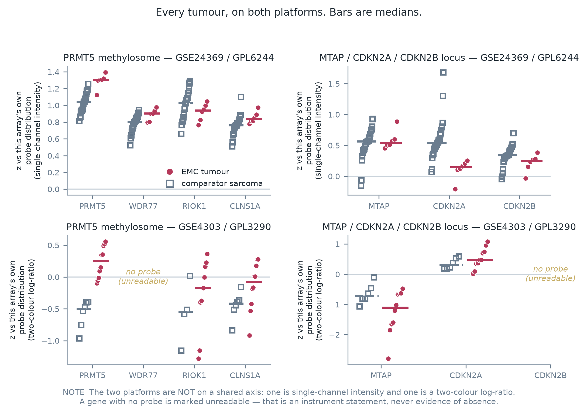
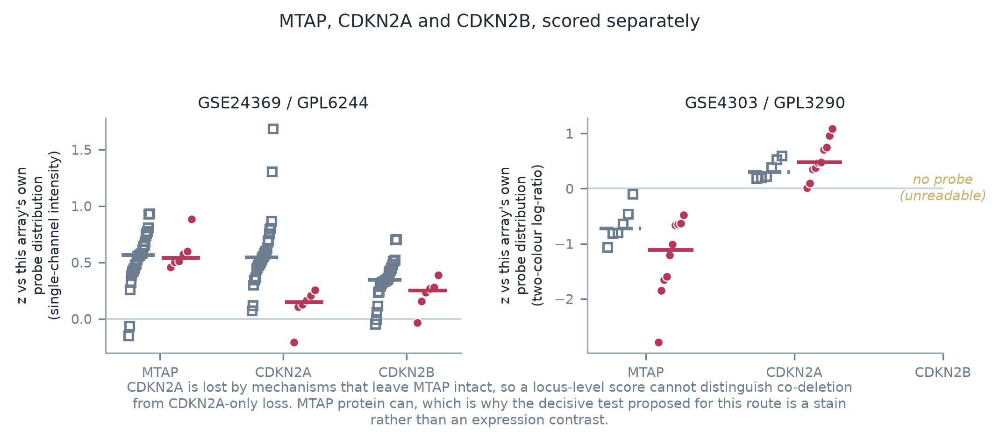
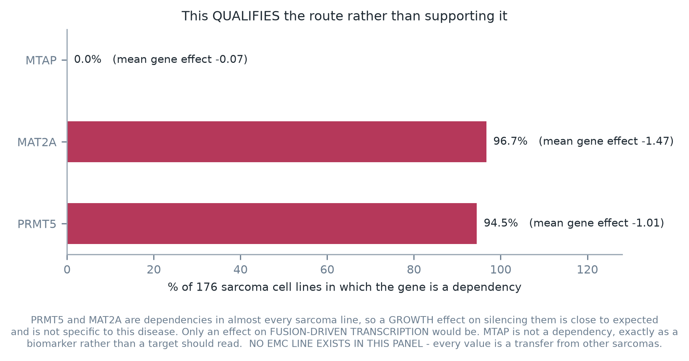
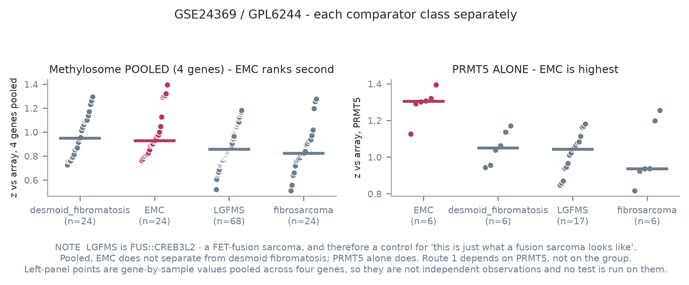

# PRMT5 in extraskeletal myxoid chondrosarcoma

> ⛔ **Nothing here asserts efficacy, safety, a therapeutic window or clinical readiness for any agent
> in any disease.** This is a hypothesis raised from public transcript data in 16 archival tumours and
> from a preclinical result in a different sarcoma. It has never been tested in an EMC cell.

**Supplementary information:** [`emc-mtap-prmt5-hypothesis-SI.md`](./emc-mtap-prmt5-hypothesis-SI.md)
— full methods, every per-gene reading, the controls, and an explicit list of what would have to be
true for this manuscript to be wrong.

---

## Abstract

**Background.** Extraskeletal myxoid chondrosarcoma (EMC) is an ultra-rare sarcoma driven by an
*NR4A3* gene fusion, most often EWSR1::NR4A3. It has no targeted agent, and the systemic classes with
any disease-specific evidence number about eight.

**What we did.** We asked whether the PRMT5 methylosome — a target class with clinical-stage agents
and a known genetic selection window — has ever been considered in this disease, and what the only
readable public data says about it. We read two archival expression series (16 EMC tumours across two
platforms) and a public sarcoma-line CRISPR dependency panel.

**What we found.** *MTAP*, *PRMT5* and *MAT2A* appear in no prose document in this repository's
40-route portfolio and in no published EMC series. Two independent lines nevertheless point at the
class. First, a published preclinical result reports that PRMT5 supports fusion-driven transcription
in a sibling translocation sarcoma sharing the same 5′ partner gene. Second, the PRMT5 methylosome
reads higher in EMC than in comparator sarcomas on **both** platforms (*t* = 3.11 and 3.89), the
methionine-salvage context likewise (*t* = 4.26 and 2.07), and the *MTAP*/*CDKN2A*/*CDKN2B* locus
reads **lower** on the platform where the read is powered (*t* = −4.06).

**⛔ What qualifies it.** Across 176 sarcoma lines PRMT5 and MAT2A are dependencies in 94.5% and 96.7%
respectively, so a growth effect is close to expected and only an effect on fusion-driven
transcription would be specific to this disease. **No EMC line exists in any public dependency
dataset**, so that prior is a transfer. The locus reading is powered on one platform only, and
*CDKN2A* is lost by mechanisms that leave *MTAP* intact.

**Why it matters.** Each route ends at a different inexpensive, decisive experiment — one an addition
to a screen that is already running on published EMC models, the other a routine
immunohistochemistry stain on archival tissue. **Every branch of both is publishable, and the negative
branches are the more likely ones.**

---

## Summary

Extraskeletal myxoid chondrosarcoma (EMC) is an ultra-rare sarcoma driven by an NR4A3 gene fusion,
most often **EWSR1::NR4A3**. It has no targeted agent. The systemic classes with any disease-specific
evidence number about eight, and only one carries a meaningful response record.

**The PRMT5 methylosome has never been considered for this disease.** It is worth considering because
two independent lines point at it, and they do not depend on each other.

**Route 1 — the fusion.** A published preclinical study reports that PRMT5 *enhances EWSR1-ATF1-driven
gene transcription* in clear cell sarcoma, that silencing PRMT5 impaired both proliferation and
fusion-driven transcription, and that a clinical-stage PRMT5 inhibitor inhibited growth in vitro and
in vivo (bioRxiv 10.1101/2022.03.23.485409). Clear cell sarcoma is, like EMC, an ultra-rare
translocation sarcoma whose driver fuses **the same 5′ gene, EWSR1**, to a transcription factor, and
whose fusion is constitutively active because the EWSR1 portion supplies the activation domain. EMC's
driver has that architecture. If PRMT5's contribution runs through the EWSR1 moiety or through
fusion-driven transcription generally, EMC is the next disease in line — and nobody has asked.

**Route 2 — the MTAP locus.** Separately, PRMT5 is targetable through a genetic window: tumours that
have lost *MTAP* are comparatively more sensitive to PRMT5 and MAT2A inhibition, an axis that has
reached patients (PMC10618744). Reading the two public EMC expression series, the three-gene
*MTAP*/*CDKN2A*/*CDKN2B* locus reads **lower** in EMC than in comparator sarcomas on the platform
where the read is powered, and the **PRMT5 methylosome reads higher on both platforms**.

⛔ **Route 2 is the weaker of the two and this document says so up front.** A transcript is not a copy
number; the locus read is underpowered on the second platform; and *CDKN2A* is lost by mechanisms that
leave *MTAP* intact, so the group score is ambiguous by construction (PMC10010627).

**Both routes end at cheap, decisive experiments**, and they are different experiments — §4.

---

## 1 · Why this class, and why nobody has asked

**It is not proliferation-coupled.** Most systemic options that reach a sarcoma scale with division
rate, and EMC is slow-cycling with an indolent natural history — the profile where such mechanisms are
weakest. Route 1 acts on transcription; route 2 on a metabolic state. Neither needs the tumour to
divide quickly.

**Route 2's window is genetic rather than pharmacological.** Cells retaining *MTAP* are comparatively
less sensitive. ⚠ *Comparatively* is load-bearing and is not strengthened here: a differential
sensitivity established in engineered and pan-cancer settings is not a therapeutic window in a
patient, and this document claims none.

**Why it was never asked.** Not oversight — instrument shape. A modality census of this disease
completed on 2026-08-09 enumerated 217 categories of cancer treatment and found that classes selected
by a molecular state had been dismissed as a group, largely because the biomarker had never been read.
*MTAP*, *PRMT5* and *MAT2A* appear in **no prose document in this repository**, and no published EMC
series reports any of them.

⭐ **And the sharpest instance of the same failure is in this document's own evidence.** The clear cell
sarcoma preprint that supplies route 1 was **already in this repository's literature cache**, fetched
for a different sweep, and no document here had ever referenced it. It was retrieved and never read.

## 2 · What was measured

**Two public series — the only readable EMC expression data that exists.**

| series | platform | EMC | comparator arm |
|---|---|---:|---|
| GSE24369 | GPL6244 | 6 | 29 comparator sarcomas, itself including a FET-rearranged histology |
| GSE4303 | GPL3290 | 10 | 6 |

Genes were read as a *z*-score against each array's own probe distribution; groups scored as the mean
EMC-minus-comparator difference in standard-deviation units. Every figure quoted here is owned by
[`emc-expression-panels.json`](../modalities/emc-expression-panels.json); the grading against this
hypothesis is in [`census-route-expression-grading.json`](../modalities/census-route-expression-grading.json);
the citations are anchored in
[`mtap-prmt5-emc-citations.json`](../literature/mtap-prmt5-emc-citations.json).

⚠ **A gene with no probe mapping is recorded as unreadable, never as unexpressed.** That rule is the
source artifact's and it matters below: one locus gene has no probe on the second platform.

## 3 · The reading

**The methylosome.** The PRMT5 methylosome group is **higher in EMC on both platforms**
(*t* = 3.11 and 3.89); the methionine-salvage context group likewise (*t* = 4.26 and 2.07). *MAT2A*
sits at the 99th percentile of its array on GPL6244 and the 84th on GPL3290; *PRMT5* at the 91st and
59th.

**The locus.** Scored as *MTAP* + *CDKN2A* + *CDKN2B*, the locus is **lower in EMC on GPL6244**, all
three genes readable, *t* = −4.06. On GPL3290 only two of three are readable, which falls below the
panel's floor for emitting a score, so **none is emitted** — an instrument limit, not a reading of the
biology.

**Figure 1 — every tumour, on both platforms.** Per-sample *z* against each array's own probe
distribution; bars are medians. ⛔ The two platforms are deliberately not on a shared axis: one is
single-channel intensity and the other a two-colour log-ratio. A gene with no probe is marked
unreadable, which is an instrument statement and never evidence of absence.

**Figure 2 — the locus is three genes, and they are not interchangeable.** ⚠ This figure exists to
make the manuscript's own weakest point visible rather than to support it: because *CDKN2A* is lost by
mechanisms that leave *MTAP* intact, a three-gene locus score cannot separate co-deletion from
*CDKN2A*-only loss. Only MTAP protein can, which is why §4's decisive test for route 2 is a stain.

**What this is and is not.** An elevated methylosome is consistent with route 1 and is not evidence
for it: abundance is not dependency, and elevated methylosome expression is reported across many
malignancies. A low locus group is consistent with route 2 and is not evidence for it either, for the
*CDKN2A* reason above. ⛔ **Neither route is established by this reading. The reading is why the
experiments in §4 are worth running.**

### 3.1 · A dependency prior that qualifies route 1, and it is not comfortable

Across **176 sarcoma cell lines in public CRISPR dependency data, PRMT5 and MAT2A are dependencies in
94.5% and 96.7%** of them. *MTAP* itself is not a dependency, exactly as expected of a biomarker
rather than a target.

⚠ **That weakens the specificity of route 1's proliferation argument.** The clear cell sarcoma result
reports that silencing PRMT5 impaired proliferation *and* fusion-driven transcription. Silencing PRMT5
impairs proliferation in nearly every sarcoma line, so the proliferation half is close to expected;
the part that is specific — and the part any transfer to EMC must rest on — is the effect on
**fusion-driven transcription**, not on growth.

⛔ **It does not refute the class**, and the reason is worth stating precisely because it sounds like
special pleading. The therapeutic argument for this class is a *differential* between MTAP-deleted and
MTAP-intact cells, and a gene-effect score cannot express a differential of that kind: an
MTA-cooperative inhibitor exploits a metabolic state rather than the raw dependency. A near-universal
dependency and a genetic window are compatible — most cells need the enzyme, and deleted cells need it
under conditions that make them easier to reach.

**Figure 3 — the dependency prior, which qualifies this route rather than supporting it.** ⛔ Included
because omitting it would flatter the hypothesis. PRMT5 and MAT2A are dependencies in almost every
sarcoma line, so a growth effect on silencing them is close to expected; only an effect on
fusion-driven transcription would be specific. MTAP is not a dependency, exactly as a biomarker rather
than a target should read — the one internal control this panel provides.

⚠ **This prior contains no EMC line.** No EMC cell line carrying the fusion appears in public
dependency data at all, so this is a transfer from other sarcomas and the honest bound is not a small
sample — it is no EMC observation.

**Figure 4 — the methylosome against each comparator class separately.** ⭐ A pooled comparator arm
hides that one of the comparators, LGFMS, is itself a FET-fusion sarcoma (FUS::CREB3L2) — and
therefore a control for "this is just what a fusion sarcoma looks like". ⚠ Points are gene-by-sample
values pooled across the four methylosome genes, so they are not independent observations and no test
is run on them here.

## 4 · The two tests that would settle it

**For route 1 — a PRMT5 inhibitor in a patient-derived EMC model.** Two such models exist and are
published; their holders have already run a multi-agent functional screen on them. Adding one
clinical-stage PRMT5 inhibitor to a screen that already runs is among the smallest asks in this
disease, and it tests the stronger route directly rather than through a biomarker.

**For route 2 — MTAP immunohistochemistry on archival EMC tissue.** The stain is routine, runs on
formalin-fixed archival material, and is an accepted surrogate for homozygous 9p21 deletion:
homozygous deletion was found in 90–100% of cases with complete MTAP expression loss, checked against FISH,
across a 149-tumour-type survey in which MTAP loss reached up to 20% in various sarcomas
(PMC11404761). ⚠ That survey does not name this histology, so it supplies a class prior and not an
answer.

**What each outcome means, stated in advance:**

| result | what follows |
|---|---|
| PRMT5 inhibition inactive in EMC models | route 1 is dead and the negative is worth publishing, because the fusion-class transfer is the interesting claim |
| PRMT5 inhibition active | the first fusion-class-transferred vulnerability shown in this disease |
| MTAP protein retained across EMC cases | route 2 is dead; the locus reading was a *CDKN2A* shadow, exactly as §3 warns |
| MTAP protein lost in a subset | the first genetically selected treatment group ever defined in this disease |

⚠ **Every branch is publishable and the negative branches are the more likely ones.** That is stated
deliberately: a hypothesis whose refutation is worth as much as its survival is one an ultra-rare
disease can afford to test.

## 5 · Falsifiers

| # | claim | the observation that would kill it |
|---|---|---|
| F1 | PRMT5 supports fusion-driven transcription in EWSR1-fusion sarcoma | failure to reproduce the clear cell sarcoma result, or a demonstration that its mechanism is ATF1-specific and does not run through EWSR1 |
| F2 | the transfer from EWSR1-ATF1 to EWSR1::NR4A3 is reasonable | PRMT5 inhibition inactive in an EMC model — **the decisive test for route 1** |
| F3 | the methylosome reads high in EMC | a third EMC series in which the PRMT5 group is null or lower |
| F4 | the MTAP locus reads low in EMC | a third series in which the locus group is null or higher |
| F5 | the low locus read is not *CDKN2A* alone | gene-level copy-number showing *CDKN2A* loss with *MTAP* intact |
| F6 | MTAP protein is lost in some EMC | MTAP IHC retained across an EMC series — **the decisive test for route 2, and the cheapest** |
| F7 | the readings are not proliferation or cellularity effects | a series matched on proliferation in which both contrasts disappear |
| F8 | route 1's specificity rests on fusion-driven transcription, not on growth | a demonstration that PRMT5 inhibition slows EMC growth no more than it slows any sarcoma line's — the near-universal dependency in §3.1 makes this the likeliest way route 1 fails |

## 6 · Limits

- **Sixteen tumours, two decade-old array platforms, uncorrected for multiple testing.** Two series is
  not a replication set, and the locus result rests on six tumours on one of them.
- **A transcript is not a copy number**, which is the whole reason §4 rather than §3 is the point of
  this document.
- **Route 1's source is a preprint whose own pages state it is not certified by peer review.** Its
  status since 2022 was not established here, and that caveat travels with every use of it.
- **The fusion-class transfer is an assumption.** EWSR1-ATF1 and EWSR1::NR4A3 share a 5′ partner and an
  architecture; they do not share a DNA-binding domain, a target repertoire or a disease biology, and
  no result presented here bridges them.
- **No EMC cell line carrying the fusion appears in any public dependency dataset**, so no dependency
  evidence for this axis in this disease exists or can be generated computationally.
- **Abundance is not dependency**, and where the dependency prior exists it qualifies rather than
  supports: PRMT5 and MAT2A are near-pan-essential across sarcoma lines (§3.1), so a growth effect
  says little and only a transcriptional effect would be specific.
- **Nothing here has been tested in an EMC cell**, and no agent in this class has been given to a
  patient with this disease.
