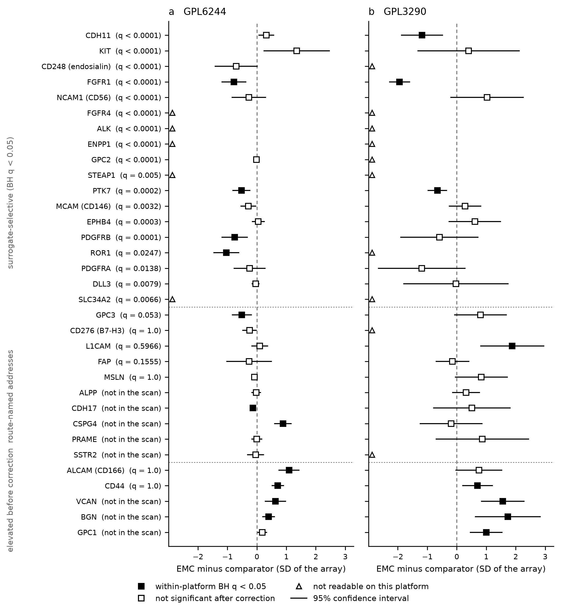

# How far a lineage-surrogate surface-antigen ranking transfers to the tumour it was built for: extraskeletal myxoid chondrosarcoma as a worked case

**Tristan D. McRae**

*Independent researcher, unaffiliated.* Correspondence: trimcrae@gmail.com

Running title: Transfer of a lineage-surrogate surface ranking

<!-- EDITORIAL, NOT FOR SUBMISSION.
VENUE: Genes, Chromosomes and Cancer (Wiley), research article, with a bioRxiv preprint as the free
open copy. CHANGED 2026-08-10 from British Journal of Cancer. Reasons, in order of weight: the
subject is now the transferability of surrogate-built surface rankings in a fusion-driven sarcoma,
which is that readership's core material; a reader there recognises why a GPL3290 accession bridge
matters and why an EMC-versus-DFSP contrast is not an EMC-versus-normal one; and the realistic
alternative was a general-oncology journal that desk-rejects the large majority of what it receives,
where an all-negative in-silico study on decade-old arrays at n = 6, 10 and 4 from an unaffiliated
single author is a likely desk rejection rather than a review.
SUPERSEDED, RETAINED: the British Journal of Cancer framing, its Article type, and the fit statement
built on it.
FEE ROUTE, BOTH VENUES VERIFIED AT PRIMARY SOURCE (2026-08-10), record with verbatim quotations,
URLs and HTTP statuses: research/literature/venue-fee-routes-2026-08-10.json. Wiley states that the
open-access option is selected by the corresponding author after acceptance and that subscription
articles need only a copyright or licence agreement, so declining the option is the $0 route; the
journal is recorded as not open access and not in DOAJ. The Springer Nature route was verified the
same way and is retained in that artifact.
FORMAT ENVELOPE. Wiley's per-journal author-guideline pages return HTTP 403 to CI and to a real
headless browser alike, so this venue's own word, abstract and display-item limits are NOT
retrievable. This manuscript is therefore held to the tightest publisher-page-verified envelope in
the repository - 5,000 main-text words, a 200-word abstract, 8 display items, 80 references, read
from the British Journal of Cancer's own guide to authors at HTTP 200 - so the format is valid at
either venue and no rewrite is needed if the submission is redirected. submission_metrics.py records
this as venue GCC-Research-Article-verified-envelope, whose provenance string says the numbers are a
proxy and not a retrieved Wiley limit.
COLOUR: the figure is greyscale, so no colour charge arises at either venue.
AUTHOR BLOCK matches the author block already committed in nr4a3-degrader-paper.md and
response-endpoint-indolent-tumours.md. The repository carries no ORCID and only the author can
supply one; the ORCID placeholder line was removed 2026-08-10 rather than left in the submission
text, and the cover letter states the absence.
-->

> **Declarations for preprint deposit.** Ethics approval and consent were not required and were not
> sought. This study analyses public gene-expression deposits and public annotation resources only. It
> involves no human participants, no identifiable data, no patient-level record and no laboratory work.
> **Funding:** none. **Competing interests:** none. **Data and code:** see Declarations.

> **Scope of the claims.** Every quantity reported here is transcript abundance. No protein
> measurement, no surface-localisation measurement and no receptor-density measurement appears in this
> paper or in any artifact it cites. Nothing here asserts that any antigen is a validated target in
> extraskeletal myxoid chondrosarcoma, that any agent is safe or effective in it, that any therapeutic
> window exists, or that any route is ready for clinical use.

## Abstract

**Background.** Surface-antigen target lists for rare tumours are routinely built on lineage
surrogates, because the tumour itself has no expression data. How far such a list transfers to the
disease it was built for is rarely measured. Extraskeletal myxoid chondrosarcoma, driven by the
nuclear *EWSR1::NR4A3* fusion, is the case worked here.

**Methods.** A surfaceome of 2,826 candidates, 2,692 of them present in the expression matrix and
scanned, was ranked across a translocation-sarcoma cell-line class of 76 members, 45 carrying
expression data, by a Benjamini-Hochberg-corrected rank test, then filtered by a normal-tissue
prior. The ranking was tested in three tumour-tissue cohorts of this disease at alpha 0.05 with
Benjamini-Hochberg correction within each platform.

**Results.** Eighteen of 47 actionable antigens were selective in the surrogate; 13 had a
tumour-tissue reading, none was concordantly elevated on both arrays, and every significant
movement among them was downward. Three genes were concordantly elevated: two secreted matrix
proteoglycans and CD44, the antigen the surrogate ranked lowest. CSPG4, never scanned, rose on one
array and in the sequencing cohort and is held open.

**Conclusions.** The surrogate ranking predicted tumour-tissue behaviour in neither direction.
Elevations below about 0.7 SD on the limiting platform are not excluded.

## Keywords

Extraskeletal myxoid chondrosarcoma; EWSR1::NR4A3; surfaceome; tumour antigen; surrogate validity;
on-target off-tumour exposure; sarcoma; cross-platform expression analysis.

## Background

Surface-antigen prioritisation for a rare tumour usually begins without the tumour. When a disease
has no public expression data, candidate antigens are ranked in a lineage surrogate, most often cell
lines from related entities, and that ranking becomes the shortlist for reagent development. The
step that would grade the method is almost never taken: measuring the same antigens in the disease's
own tissue. This work takes that step for one disease and reports the size of the disagreement.

Extraskeletal myxoid chondrosarcoma is a rare soft-tissue sarcoma defined by a translocation fusing
the 5' region of *EWSR1*, less often *TAF15* or another FET gene, to the orphan nuclear receptor
*NR4A3*, producing a chimeric transcription factor on a genome with few recurrent secondary
mutations [16,17]. A 2025 comprehensive review states that no clinically validated agent directly
targets NR4A3 [1], and immunohistochemical series support a neuroendocrine phenotype with INSM1 a
diagnostically useful marker [2]. Because the driver is nuclear, driver-directed therapy confronts a
druggability or oligonucleotide-delivery gate, and cell-surface antigens enable modalities that move
the problem elsewhere: antibody-drug conjugates, T-cell engagers, chimeric antigen receptor cell
products and radioligand therapy. That axis gives up the fusion-level specificity a nucleic-acid
route uniquely offers, since every surface antigen considered below is a generic lineage antigen
with no mechanistic link to the fusion.

This programme's own surface prioritisation ran on a surrogate because the disease was taken to be
absent from usable public expression data. The deposits were known; what was missing was a
probe-to-symbol bridge for two of them. A prior-art screen of 322 EMC-linked Europe PMC records
returned three EMC-specific records, none a systematic surface-antigen map [3,4,5], and a full-text
screen of the 237 retrieved texts is in Supplementary Methods S6. Three EMC tumour-tissue cohorts
are readable at no cost, so the surrogate's output can be graded against the disease it was built
for.

## Methods

All analyses are computational, use public data and commit their outputs. No laboratory work was
performed. Full parameters, controls and per-gene tables are in Supplementary Methods S1 to S6 and
Supplementary Tables S1 to S8.

### Surfaceome definition

UniProt-reviewed human proteins carrying a plasma-membrane location (SL-0039) with a transmembrane
(KW-0812) or GPI-anchor (KW-0336) topology were unioned with a curated seed of 47 actionable surface
antigens, so that established targets were always evaluated. An established machine-learning
surfaceome resource exists [13]; it was not used, because the annotation-derived construction is
reproducible from public identifiers alone and its membership rule states in one sentence, and the
two sets are not interchangeable. The run used 2,820 UniProt genes plus the seed, 41 of which were
already in the UniProt set, giving 2,826 unique genes, 2,692 of them present in the DepMap
expression matrix and scanned. The seed is a small and largely redundant minority, so the set is
largely but not strictly unbiased. The scanned gene list itself was not recorded, which is why the
coverage gap described in Results is undecidable rather than resolvable.

### Expression and selectivity in the surrogate class

DepMap OmicsExpression values, log2(TPM+1). A translocation-sarcoma class was defined by matching
OncotreeSubtype against Ewing, synovial, alveolar, desmoplastic small round cell, clear-cell and
extraskeletal myxoid strings, giving 76 members of which 45 carry expression data; every per-gene
row in the artifact reports n = 45. Six subtypes are present: alveolar rhabdomyosarcoma, alveolar
soft part sarcoma, clear cell sarcoma, Ewing sarcoma, extraskeletal myxoid chondrosarcoma and
synovial sarcoma. Desmoplastic small round cell tumour was sought and matched no line. Alveolar
rhabdomyosarcoma, a skeletal-muscle-lineage tumour, entered through the alveolar string. The single
line annotated with the disease subtype, ACH-001519, carries a curated Cellosaurus caution that it
does not harbour an *EWSR1* fusion [15], so its identity is disputed and it is treated as one of the
45 class members rather than as disease evidence.

For each surface gene the scan reports expression, an effect size against non-sarcoma lineages, and
a rank-based one-sided Mann-Whitney *p* that the class exceeds the rest, Benjamini-Hochberg
corrected. **The selective set is defined as every actionable antigen with a corrected *q* below
0.05**, which is 18 of the 47 (Table 1). This is cross-cancer selectivity, a descriptor of
distinguishability from other tumour lineages, and not a tumour-versus-normal contrast; it
mechanically favours mesenchymal antigens because the DepMap panel is epithelial-dominated.

Five limits of this instrument were computed (Supplementary Note N1). The scanned population is
tumour-cell monoculture, so a gene expressed only by stroma has no compartment in which it could be
counted, demonstrated by LRRC15, a sarcoma cancer-associated-fibroblast antigen with a clinical
antibody-drug conjugate programme, at `frac_expressed` 0.0. The limit is narrower than blindness to
stromal antigens: mesenchymal tumour cells transcribe CD248 and PDGFRB, both of which read selective
here, so the instrument cannot see a gene that *only* stroma expresses. A glycan such as oncofetal
chondroitin sulfate is a pathway product rather than a gene product [14] and cannot be ranked; CSPG4
has no per-gene row in any artifact of this instrument; and the scan holds no observation of FAP in
this disease, which bears on the FAP reading below.

### Normal-tissue prior

Each antigen was queried against the Human Protein Atlas [6] for RNA tissue specificity, tissue
distribution, per-tissue nTPM, blood-cell specificity and subcellular location, and given a verdict
with Atlas semantics (Supplementary Methods S3). Only tissue-enriched or group-enriched antigens
with a restricted distribution, no vital-tissue signal and no strong immune or circulating signal
were classed RESTRICTED; tissue-enhanced antigens were classed ENHANCED_BROAD; low tissue
specificity or a detected-in-all distribution gave BROAD_LIABILITY; and expression in a vital tissue
or a confined blood signal overrode all others as VITAL_OR_IMMUNE_LIABILITY. Controls behaved as
specified: DLL3 and GPC3 returned RESTRICTED, B2M returned BROAD, and the hard control CD3E returned
a vital or immune liability. Atlas RNA is bulk normal tissue and a prior, not a safety statement.

### EMC tumour-tissue cohorts

Three deposits were read (Table 2). GSE24369, on GPL6244, carries 42 samples; assignment matches the
verbatim deposit annotation and classifies 35, giving 6 EMC against 29 comparator sarcomas (17
low-grade fibromyxoid sarcoma, 6 desmoid fibromatosis, 6 myxofibrosarcoma). The seven the matcher
leaves unclassified are five solitary fibrous tumour arrays and two pooled normal skeletal-muscle
arrays, listed in Supplementary Table S8 and used in the sensitivity analyses below. GSE4303 on
GPL3290 carries 10 EMC against 6 comparators (3 dermatofibrosarcoma protuberans, 3 gastrointestinal
stromal tumour) and supplies a second lineage axis; the cohort was first published by Subramanian
and colleagues [7]. One EMC sample carries a parenthetical repeat marker in its deposit title, so
those 10 arrays are 10 libraries and cannot be asserted to be 10 patients. GSE28866, a 3'-end
sequencing deposit, carries 4 EMC, 27 normal-organ (bowel, breast, colon, kidney, lung, uterus) and
32 non-EMC sarcoma libraries, and supplies both a lineage axis and the exposure axis; it records
replicate ties among the non-EMC sarcoma libraries, so that arm is 32 libraries rather than 32
tumours, and its gene panel was requested by other reads of the same deposit rather than assembled
as a surface-antigen panel.

**The GPL3290 comparator arm is not internally homogeneous, and the mismatch sits inside the
contrast.** The verbatim deposit annotations record the 10 EMC and 3 dermatofibrosarcoma arrays as
mRNA against a CRH reference and the 3 gastrointestinal stromal tumour arrays as total RNA against a
UHR reference. On a two-colour platform every value is a log-ratio against the reference channel, so
half the comparator arm differs from the EMC arm in both reference pool and RNA input. Every GPL3290
contrast is therefore also reported against the three dermatofibrosarcoma arrays alone, which is
reference-matched on both sides.

The two axes are different questions and are not collapsed. The 27 normal libraries are visceral
organs containing almost no soft tissue, so a gene high in EMC against that panel is not thereby
EMC-specific rather than mesenchymal-lineage-specific, and a gene high against other sarcomas says
nothing about normal-organ exposure. Read densities are never pooled with array intensities. Array
figures are Δ, the EMC mean z minus the comparator mean z in standard deviation units of that
array's own probe distribution, with Welch *t*. Sequencing figures are ratios of medians of per-peak
medians and carry no test; each is also expressed as a percentile of the same ratio computed for
every gene in the deposit, 13,708 with a normal ratio and 13,247 with a sarcoma ratio, whose median
gene sits at 1.05 either way.

### Cross-platform state and readability

GPL3290 probes carry expressed-sequence-tag accessions only, so a gene can be unreadable there
purely because its accession did not resolve through the curated dictionary, UniGene archive and
live-query bridge. Of the 100 genes on the cross-platform board, 95 produced a contrast on GPL6244
and 78 on GPL3290. Among the antigens discussed below, CD248, CD276, SSTR2, GPC2, ROR1 and B4GALNT1
are unreadable on GPL3290 and ALPPL2, CTAG1B, MAGEA3, NECTIN4 and SSX2 on both; no statement treats
unreadability as evidence about expression. A panel is scored only above a floor of 3 readable genes
and 0.5 coverage.

### Controls, alpha and multiple testing

Three genes with known answers were read on the same platforms before any antigen: *NR4A3* must
rise, because its over-expression defines the disease; *ENO3*, a reported direct transactivation
target of an NR4A3 fusion [8], must rise; and *MKI67* must be approximately flat, because EMC is
slow-cycling and a large proliferation difference would indicate a contrast driven by cellularity
(Supplementary Table S4).

**The tissue read uses alpha 0.05 with Benjamini-Hochberg correction within each platform, across
every gene on the 100-gene board that produced a contrast there.** The platforms are corrected
separately because they are different instruments with different comparator arms, and a concordance
call requires both. Every Δ carries its exact two-sided *p*, its 95% confidence interval and its
corrected *q*, and panels are judged by the same rule as genes: a gene is concordantly elevated only
if *q* < 0.05 with a positive Δ on both arrays. A threshold on |*t*| of 2 is not used, because at
these degrees of freedom the two-sided 95% critical value is 2.17 to 2.48, so that threshold is more
permissive than a 95% interval (Appendix A6 of the Supplementary Information). The sequencing cohort
carries no test at n = 4 and none is implied.

## Results

### Stage-1 selectivity and the normal-tissue prior

Eighteen of the 47 actionable antigens are selective in the surrogate at *q* < 0.05 (Table 1), led
by CDH11 at +3.18 log2TPM and including CD248 at +2.29. Thirteen have a reading in EMC tumour
tissue; the five that do not, ALK, ENPP1, FGFR4, SLC34A2 and STEAP1, are absent from both arrays.
Two cautions apply to the whole column: the contrast is cross-cancer, which the
epithelial-dominated DepMap panel biases toward mesenchymal antigens, so CDH11's enrichment is
largely a statement that carcinomas do not express it; and transcript magnitude to two decimal
places conveys false precision about surface-protein density, so the values are coarse tiers.

B7-H3/CD276, the field's default surface target for sarcoma, is not selective in these data at
*q* = 1.0. B7-H3 protein can be tumour-restricted despite broad transcript expression, which is the
basis of its clinical traction, so this is a selectivity-of-transcript caveat rather than a claim
about protein; it removes the transcriptomic rationale for treating it as the obvious first
choice.

The normal-tissue prior is the decisive filter, and among the antigens it evaluated the
selective-and-restricted intersection contains exactly one member: DLL3, at enrichment +0.29 with
*q* = 0.0079 and a RESTRICTED window. Three qualifications belong in the same breath. DLL3 entered
the prior as a positive control for the classifier rather than as a candidate. Its surrogate margin
is +0.29 log2TPM at a class mean of 1.53, below the scan's own expressed threshold of 3.0 with 11%
of class lines above it, so it is a small difference between two low values. And in EMC tumour
tissue DLL3 is flat on both arrays (Δ = −0.041, *q* = 0.53; Δ = −0.026, *q* = 0.99). Nothing here
measures DLL3 protein, its presence on the EMC cell surface, its density, or any property of any
DLL3-directed agent. GPC3 is the same shape one step away, RESTRICTED at *q* = 0.053. Every
other candidate fails for an identifiable reason: NCAM1/CD56 sits on natural killer cells and neural
tissue, and the CD56 antibody-drug conjugate lorvotuzumab mertansine was clinically developed and
discontinued [9,10]; CDH11 is broadly expressed in normal fibroblasts, synovium and bone; B7-H3,
EGFR and FAP are non-selective or broad; FGFR1, MCAM and EPHB4 carry liabilities on this prior.
B4GALNT1, the GD2 synthase, holds a restricted prior but has no selectivity value in the scan
output, so it is not placed on the selectivity axis at all. CSPG4 was not evaluated, so the
intersection is a property of the evaluated set.

### The surrogate's calls in EMC tumour tissue

None of the 13 surrogate-selective antigens with a tumour-tissue reading is concordantly elevated in
EMC relative to comparator sarcomas on both arrays (Figure 1). Two, FGFR1 and PTK7, are concordantly
lower, all four corrected values below 0.02. Three more reach significance on one platform only and
all three are also downward: CDH11 on GPL3290, PDGFRB and ROR1 on GPL6244. The remaining eight are
not significant on either array. **Every significant movement among the 13 runs opposite to the
direction the surrogate predicted.** None of the 11
therapeutic addresses named by candidate surface-directed routes is concordantly elevated either
(Table 3).

The surrogate's rejections fare no better. Neither antigen previously cited as a transferred
negative survives correction: EGFR is lower only on GPL6244 (*q* = 0.044) and not significant on
GPL3290 (*p* = 0.076, *q* = 0.19), and CD276 reads lower on the one platform that resolves it at
*p* = 0.034, *q* = 0.088. Meanwhile CD44, ranked lowest of all 47 at −3.89 log2TPM with *q* = 1.0,
is one of only three genes on the whole board concordantly elevated in EMC tissue, and ALCAM at
−1.45 is elevated on one array. **The surrogate ranking therefore predicted tumour-tissue behaviour
in neither direction.**

Both sensitivity analyses leave that conclusion in place. Restricting the GPL3290 comparator arm to
the three reference-matched dermatofibrosarcoma arrays leaves the concordantly elevated set
unchanged and adds EGFR and PDGFRB to the concordantly lower set, with 15 of 70 readable genes
changing sign, none an antigen carried forward here. Adding the five solitary fibrous tumour arrays
to the GPL6244 comparator arm changes 5 signs of 95 and leaves both sets identical.

### Route-named therapeutic addresses

CD248 and CD276 read lower in EMC than in comparator sarcomas on the one platform that resolves
each, neither surviving correction; FAP, PRAME, SSTR2 and ALPP are flat; MSLN, GPC3, L1CAM and CDH17
move on one platform only or in opposite directions (Table 3). CD248 is the clearest inversion: the
surrogate's third-ranked antigen reads below comparator sarcomas in tissue and at the 26th and 7th
ratio percentiles in the sequencing cohort. It is also where independent human data exist and point
the same way, since a randomised placebo-controlled phase 2 of a CD248-directed antibody in
metastatic soft-tissue sarcoma was negative (PMC6618088, doi 10.1002/cncr.32084), while CD248
protein is detectable in tumour cells across a 514-case soft-tissue sarcoma immunohistochemistry
series (PMC4985356, doi 10.1038/bjc.2016.214). Neither is an EMC observation.

FAP is flat, and the comparator arm is why that matters: GSE24369 compares EMC with desmoid
fibromatosis and myxofibrosarcoma, fibroblastic lesions in which FAP is expected to be high, and EMC
sits at the 88th array percentile and the 91st and 92nd ratio percentiles. A FAP-directed route
therefore cannot claim EMC as a selectively FAP-rich indication among soft-tissue tumours, which is
not a reading that EMC lacks FAP. The 13-gene stromal and matrix panel is not significantly
different on either platform (Δ = −0.328, *p* = 0.095; Δ = −0.467, *p* = 0.097) and is not counted
as a negative. PRAME reads at the floor of every readable cohort: 30th array percentile on GPL6244,
11th percentile of log-ratios on GPL3290, and a sequencing EMC median of 0.102 against an
other-sarcoma median of 0.194 on one peak.

The precondition for the two human-leukocyte-antigen-directed routes points the wrong way, judged by
the same rule. The 12-gene antigen-presentation panel reads lower in EMC on GPL6244 (Δ = −0.216,
*p* = 0.022) and not significantly on GPL3290 (Δ = −0.228, *p* = 0.43). It is a precondition rather
than a target, but a T-cell-receptor-directed route needs class-I presentation. The panel score for
the route-named addresses disagrees between platforms and is reported as such, lower on GPL6244
(Δ = −0.0935, *p* = 0.12) and higher on GPL3290 (Δ = +0.599, *p* = 0.025, 8 of 11 readable); the
three genes missing from the GPL3290 score are CD248, CD276 and SSTR2, three of the four reading
down or flat on GPL6244, so the two scores are not computed over the same set and the disagreement
is partly a coverage artefact. The per-gene table is the interpretable presentation (Table S5).

### ALCAM, SSTR2 and the GD2 proxy

ALCAM, the one antigen elevated on both arrays before correction that no candidate route names, is
where the corrected criterion changes the conclusion. On GPL6244 it is the strongest positive row
among the antigens discussed, Δ = +1.091 [+0.75, +1.43] at *q* = 0.0004 and the 99th array
percentile. On GPL3290 its Δ = +0.754 has an exact two-sided *p* of 0.056, a 95% interval of
[−0.02, +1.53] that includes no difference, and *q* = 0.16. **ALCAM is therefore elevated on one
array and uninformative on the other, not concordantly elevated**, and directional consistency
across cohorts is what the data carry. The exposure axis is unfavourable independently of that: its
sequencing EMC median of 0.578 sits below the normal-organ median of 0.631, at the 33rd ratio
percentile against normal organs and the 90th against other sarcomas. The two normal-tissue
instruments disagree, since the Human Protein Atlas prior classes ALCAM RESTRICTED while the
sequencing normal arm does not, and the Atlas records its subcellular annotation as vesicles with
plasma-membrane localisation unconfirmed. Independent human data bear on exposure rather than on
EMC: the clinical CD166-directed conjugate is a masked, protease-activated format (PMC9365353, doi
10.1158/1078-0432.ccr-21-3656), an engineering choice made because of the antigen's normal-tissue
distribution.

EMC's reported neuroendocrine differentiation motivated two further candidates. On GPL6244, SSTR2
sits at the 60th array percentile with Δ = −0.042 (*p* = 0.71), so on that array it is present,
mid-distribution and indistinguishable from the comparators; it is not readable on GPL3290, where
the somatostatin-receptor family panel could not be scored. In the sequencing cohort, a different
question at n = 4 with no test, SSTR2 is 1.54 times the normal-organ median and 1.37 times the
other-sarcoma median, the 89th and 84th ratio percentiles, which is the top sixth of the
transcriptome against both arms. The gate is unchanged either way, because a peptide-receptor
radioligand route depends on absolute receptor protein density and on the tumour-to-normal uptake
ratio, and no quantity here measures either; a somatostatin-receptor scan or an SSTR2 stain on
archival EMC remains the cheap decisive measurement. The GD2 proxy B4GALNT1 is flat on GPL6244
(Δ = −0.069, *p* = 0.33) and not readable on GPL3290, and the five-gene glycan-synthase panel is
lower on both (Δ = −0.147, *p* < 0.0001; Δ = −1.050, *p* = 0.0047). GD2 is a glycolipid and
B4GALNT1 a synthase, so this is a proxy for a proxy and cannot exclude the antigen.

### CSPG4, a gene outside the stage-1 scan

CSPG4 has no per-gene row in any committed artifact of the surrogate instrument, and whether it was
ever scanned is undecidable because the artifact stores gene counts rather than the gene list. Its
absence from the intersection is a measured coverage gap rather than a rejection, and it matters
because CSPG4 is one of the two carrier proteoglycans named by the founding oncofetal
chondroitin-sulfate work, of which the surfaceome seed held only CD44.

In EMC tissue CSPG4 is the largest absolute row in the sequencing deposit, at an EMC median of
8.730, an order of magnitude above every other row in that panel, 3.31 times the normal-organ median
and 2.51 times the other-sarcoma median, the 99th and 98th ratio percentiles. It rises on GPL6244
(Δ = +0.885, *q* = 0.0017) and is uninformative rather than negative on GPL3290 (Δ = −0.189, 95%
interval [−1.24, +0.86], *q* = 0.76). Three explanations for the disagreement are live and none is
settled. The GPL3290 comparator arm is 6 samples with an unusually high CSPG4 mean, and
dermatofibrosarcoma protuberans is a dermal fibroblastic tumour while CSPG4 is a melanocytic and
pericytic antigen, so a high comparator arm would flatten the contrast for reasons about the
comparator. The reference-pool and RNA-input mismatch within that arm is a third candidate and is
testable: the reference-matched contrast against the three dermatofibrosarcoma arrays alone is
Δ = −0.518 (*p* = 0.096, *q* = 0.18), still negative and still not significant, so that mismatch does
not account for the disagreement. The sequencing row rests on one peak at n = 4, and the
normal-tissue prior places CSPG4 on the broad-liability list. CSPG4 is held open.

### Genes concordantly elevated on both arrays

Across the 100 genes on the cross-platform board, three are concordantly elevated after correction:
VCAN, BGN and CD44 (Table 4). Two are secreted matrix proteoglycans; the third, CD44, is a
cell-surface hyaluronan receptor and is the antigen the surrogate ranked lowest of all 47. Four are
concordantly lower: FGFR1, PTK7, ANTXR1 and B3GALT4.

Three considerations weaken the positive reading and one qualifies its normal-tissue side. The
background is saturated: VCAN's EMC samples sit at the 99.7th and 97.5th array percentiles against
comparators at the 97.8th and 91.2nd, so the separation is small on a signal high everywhere, and a
matrix proteoglycan being abundant in a myxoid tumour is expected rather than discriminating. VCAN
and BGN are secreted, so their transcripts state what the tumour deposits rather than what a binder
would find on a cell, and CD44's ligand is that same matrix. Bulk archival tissue cannot deconvolve
compartments. And the normal-tissue prior, decisive at stage 1 and silent at stage 2 elsewhere, is
unfavourable here too: VCAN carries a vital or immune liability and CD44 a broad liability, while
GPC1, which does not survive correction, is enhanced-broad.

The two instruments invert on the three genes where they can be compared: CD248 is selective in the
surrogate and lower in tissue; ALCAM was scored and rejected and is higher in tissue on GPL6244; CD44
is the surrogate's most strongly negative row and is concordantly higher. Four explanations are live
and nothing in either artifact discriminates them, since the instruments ask different questions,
read different populations, read different compartments and use different measurements
(Supplementary Note N4).

### Instrument controls

The tissue instrument reproduced its known answers (Supplementary Table S4). *NR4A3* rose in EMC on
GPL6244 (Δ = +0.741, *t* = 4.66, 76th array percentile), and in the sequencing cohort its median
across the 32 non-EMC sarcoma libraries was 0.000 against 0.216 in EMC; it emits no contrast on
GPL3290, where only 2 comparator samples carry a value against a floor of 3. *ENO3* rose on both
arrays (Δ = +0.808, *t* = 3.61; Δ = +3.811, *t* = 13.22). *MKI67* was flat (Δ = +0.129, *t* = 0.53).
On the exposure axis, four antigens with no reason to be present in a soft-tissue sarcoma read lower
in EMC than in normal tissue: GPC3 at 0.09 times, MSLN at 0.27 times, L1CAM at 0.33 times and CDH17
at 0.91 times. A working control licenses reading the other rows and is not evidence for any of
them.

The two pooled normal skeletal-muscle arrays excluded from the primary contrast are the only normal
soft tissue anywhere in this study, and they qualify both instruments. ALCAM's EMC mean z of 2.33
sits far above their mean of −0.52, as do CSPG4, CD44, VCAN, BGN and FAP, while GPC1, CD248 and
SSTR2 do not. Read the other way, both positive controls are higher in pooled muscle than in EMC
(*ENO3* 2.76 against 0.46; *NR4A3* 1.37 against 0.72), which is what two muscle-expressed genes
should do and which shows that neither control discriminates this disease from that tissue. These
are two pooled-RNA libraries of one tissue with no test, so they are an anchor rather than an arm.

## Discussion

A lineage-surrogate surface ranking, built the way such rankings are routinely built for rare
tumours, did not anticipate what the disease's own tissue would show. Neither direction transferred:
none of the 13 surrogate-selective antigens with a tissue reading is concordantly elevated, and the
antigen ranked lowest of all 47 is one of the three that are. The mechanism follows from the design
of such rankings rather than from anything peculiar to this disease. A cross-lineage selectivity
test measures mesenchymal rather than epithelial character, a property EMC shares with every
comparator in the tissue cohorts, so it cannot discriminate within them. Any surrogate whose
comparator set differs from the one the disease will actually be measured against inherits the same
failure, which is the general caution this case supports.

The result is a non-transfer rather than an absence. On the limiting platform the median 95%
interval is ±0.96 SD wide and the smallest elevation reaching significance was 0.66 SD, so an
elevation below roughly 0.7 SD there is not excluded no matter how clean the first array is. Within
that resolution the same design did detect effects, concordantly lower for FGFR1 and PTK7 and
concordantly higher for VCAN, BGN and CD44, so the negative is a measurement rather than a failure
to measure.

Three outputs survive as usable. A set of negatives with a named basis: B7-H3 is not a
differentially expressed EMC address on either array platform, though in the sequencing cohort it
sits at 1.42 times the other-sarcoma median and the 86th ratio percentile on three peaks at n = 4;
PRAME reads at the floor of every readable cohort; and CD248 inverts, with independent human data
pointing the same way. A demoted antigen: ALCAM separates EMC from other sarcomas on one array and
in the sequencing cohort in the same direction, which is a directional consistency and not a
diagnostic performance statement, since no sensitivity, specificity or discrimination statistic is
computed here. And a held-open lead with a stated defect, CSPG4.

The modality axis carries its own gates. The abundant myxoid and chondroid matrix is a diffusion and
binding-site barrier to antibodies, adoptive cells and radioligands, and adult sarcoma has a poor
record for cell products and engagers in cold, immune-excluded tumours; a single reported EMC case
describes such a microenvironment [4]. Two of the three genes concordantly elevated in EMC tissue are the
matrix itself, so the compartment that most complicates delivery also carries much of the
differential signal. And an antigen elevated against other sarcomas but not against normal visceral
organs, which is ALCAM's profile, is a poor address for any modality that acts wherever the antigen
is, since radioligand crossfire mitigates heterogeneous tumour uptake rather than broad normal
expression.

### Limitations

The binding limitation is that everything measured here is transcript abundance, while every address
named above is a protein or glycan question. A transcript says nothing about whether the protein
reaches the plasma membrane, at what density, or whether the epitope a binder needs is exposed;
transcript-to-protein correlation for membrane proteins is modest and is not measured here. A high
transcript reading is a reason to stain rather than an antigen call.

The tissue cohorts are small archival bulk deposits on decade-old platforms, at n = 6, n = 10 and
n = 4, with the exposure axis resting on medians of four libraries against six visceral organ types
and no test. Sample classification is string matching on the verbatim deposit annotation; the seven
GSE24369 samples it leaves unclassified are declared above and listed in Supplementary Table S8, and
both sensitivity analyses using them are in Results. The two lineage cohorts have different
comparator arms, one of them internally inhomogeneous in reference pool and RNA input, which is why
every GPL3290 contrast is also reported reference-matched. Several genes rest on one peak or one
probe, and bulk tissue is not deconvolved, so a stromal or pericyte antigen can read high because
the compartment is present. On the surrogate side, no verified EMC observation enters the scan, the
class includes a skeletal-muscle-lineage subtype, the scanned gene list was never recorded, and the
instrument has no compartment for a gene that only stroma expresses. Extended limitations are in
Supplementary Note N5.

### Conclusion

A lineage-surrogate surface-antigen ranking for this disease did not transfer to the disease's own
tissue in either direction, and the check that showed as much required no new data. None of the 13
surrogate-selective antigens with a tumour-tissue reading is concordantly elevated, two are
concordantly lower, and of the three concordantly elevated two are secreted matrix proteoglycans
and the third is the antigen the surrogate ranked lowest. Elevations below about 0.7 SD on the
limiting platform are not excluded. What survives is a set of negatives with a named basis, one
demoted antigen, one held-open lead, and a measured caution about surrogate-based target lists for
rare tumours.

The measurement that would decide the antigen question is EMC surface protein expression with a
normal-tissue comparison, on a cohort large enough to carry a distribution. Two groups hold
patient-derived EMC models, USZ-EMC [11] and NCC-EMC1-C1 [12], which remain the route to EMC data
public deposits cannot supply. Four questions are now sharp enough for a targeted panel: whether
ALCAM protein is on the EMC cell surface and at what density relative to normal tissue; whether
CSPG4 protein is present; whether SSTR2 is detectable by immunohistochemistry or
somatostatin-receptor imaging at all; and whether any protein-level reason remains to keep B7-H3 on
the list. A single-cell or spatial EMC dataset would be worth more than any of these individually,
because it is the one measurement that discriminates the four explanations for the disagreement
between the two instruments.

## Display items

**Table 1.** Surrogate-class selectivity and normal-tissue prior. The selective set is every
actionable antigen with a Benjamini-Hochberg *q* below 0.05, which is 18 of the 47 seeded; the
antigens below the rule that the text discusses are listed beneath them. Enrichment is class mean
minus rest mean, log2(TPM+1); *q* is read from the scan artifact, which stores it rounded, so "~0"
marks a value that rounds to zero there rather than an exact zero. The verdict is the Human Protein
Atlas window classification and "not evaluated" means the antigen was not put to that filter. The
tissue column gives the cross-platform state under the corrected criterion.

| Antigen | Enrichment (log2TPM) | BH *q* | Normal-tissue verdict | Tissue state |
|---|---|---|---|---|
| CDH11 | +3.18 | ~0 | ENHANCED_BROAD | moved on one, flat on the other |
| KIT | +2.46 | ~0 | VITAL_OR_IMMUNE_LIABILITY | flat on both |
| CD248 | +2.29 | ~0 | VITAL_OR_IMMUNE_LIABILITY | readable on one platform only |
| FGFR1 | +1.99 | ~0 | BROAD_LIABILITY | concordant down on both |
| NCAM1/CD56 | +1.74 | ~0 | VITAL_OR_IMMUNE_LIABILITY | flat on both |
| FGFR4 | +1.67 | ~0 | not evaluated | no reading on either array |
| ALK | +1.63 | ~0 | not evaluated | no reading on either array |
| ENPP1 | +1.59 | ~0 | not evaluated | no reading on either array |
| GPC2 | +1.49 | ~0 | ENHANCED_BROAD | readable on one platform only |
| STEAP1 | +1.44 | 0.005 | not evaluated | no reading on either array |
| PTK7 | +1.24 | 0.0002 | VITAL_OR_IMMUNE_LIABILITY | concordant down on both |
| MCAM/CD146 | +1.09 | 0.0032 | BROAD_LIABILITY | flat on both |
| EPHB4 | +1.00 | 0.0003 | BROAD_LIABILITY | flat on both |
| PDGFRB | +0.78 | 0.0001 | BROAD_LIABILITY | moved on one, flat on the other |
| ROR1 | +0.48 | 0.0247 | ENHANCED_BROAD | readable on one platform only |
| PDGFRA | +0.40 | 0.0138 | not evaluated | flat on both |
| DLL3 (classifier control) | +0.29 | 0.0079 | RESTRICTED | flat on both |
| SLC34A2 | +0.24 | 0.0066 | not evaluated | no reading on either array |
| GPC3 (classifier control) | +0.93 | 0.053 | RESTRICTED | moved on one, flat on the other |
| B7-H3/CD276 | +0.14 | 1.0 | BROAD_LIABILITY | readable on one platform only |
| FAP | +0.02 | 0.1555 | ENHANCED_BROAD | flat on both |
| LRRC15 | −0.25 | 1.0 | ENHANCED_BROAD | flat on both |
| ERBB2 | −0.52 | 1.0 | BROAD_LIABILITY | flat on both |
| ALCAM | −1.45 | 1.0 | RESTRICTED | moved on one, flat on the other |
| EGFR | −2.21 | 1.0 | ENHANCED_BROAD | moved on one, flat on the other |
| CD44 | −3.89 | 1.0 | BROAD_LIABILITY | concordant up on both |
| B4GALNT1 (GD2 synthase) | no value in the scan output | no value | RESTRICTED | readable on one platform only |
| SSTR2 | no value in the scan output | no value | ENHANCED_BROAD | readable on one platform only |
| CSPG4 | no per-gene row (coverage gap) | no row | ENHANCED_BROAD | moved on one, flat on the other |

**Table 2.** The three EMC tumour-tissue cohorts.

| Cohort | Platform | EMC | Comparator arm | Axis supplied |
|---|---|---|---|---|
| GSE24369 | GPL6244, single-channel array | 6 | 29 of 42 deposited samples: 17 LGFMS, 6 desmoid fibromatosis, 6 myxofibrosarcoma. 5 solitary fibrous tumour and 2 pooled normal skeletal-muscle arrays are unclassified by the matcher and enter only the sensitivity analyses | lineage |
| GSE4303 | GPL3290, two-colour cDNA, log-ratio | 10 | 6 sarcomas: 3 DFSP (CRH reference, mRNA, matching the EMC arm), 3 GIST (UHR reference, total RNA) | lineage, second comparator set |
| GSE28866 | 3'-end sequencing, read density | 4 | 27 normal-organ libraries and 32 non-EMC sarcoma libraries | exposure and lineage |

**Table 3.** Therapeutic addresses named by candidate surface-directed routes, read in EMC tumour
tissue, with ALCAM added as the one antigen elevated on both arrays before correction that no route
names. Δ is the EMC mean z minus the comparator mean z in standard deviation units of that array's
probe distribution; *q* is Benjamini-Hochberg within platform. Sequencing columns are ratios of
medians with the ratio's percentile among all genes in the deposit, and carry no test; PRAME's
normal median is zero, so its normal ratio is undefined and is not reported.

| Address | GPL6244 Δ [95% CI], *q*; EMC percentile | GPL3290 Δ [95% CI], *q* | vs 27 normal organs | vs 32 other sarcomas |
|---|---|---|---|---|
| CD248 | −0.698 [−1.41, +0.01], 0.128; 59th | not readable | 0.84× (26th) | 0.65× (7th) |
| CD276/B7-H3 | −0.249 [−0.47, −0.02], 0.088; 79th | not readable | 1.30× (77th) | 1.42× (86th) |
| FAP | −0.265 [−1.02, +0.49], 0.53; 88th | −0.144 [−0.70, +0.41], 0.68 | 1.63× (91st) | 1.59× (92nd) |
| SSTR2 | −0.042 [−0.31, +0.23], 0.79; 60th | not readable | 1.54× (89th) | 1.37× (84th) |
| PRAME | −0.004 [−0.17, +0.16], 0.97; 30th | +0.868 [−0.70, +2.44], 0.37; 11th | undefined | 0.53× (5th) |
| CSPG4 | +0.885 [+0.61, +1.16], 0.0017; 81st | −0.189 [−1.24, +0.86], 0.76 | 3.31× (99th) | 2.51× (98th) |
| ALPP | −0.021 [−0.17, +0.12], 0.81; 32nd | +0.315 [−0.14, +0.77], 0.29 | not in panel | not in panel |
| MSLN | −0.086 [−0.16, −0.01], 0.088; 42nd | +0.834 [−0.04, +1.71], 0.17 | 0.27× (5th) | 1.23× (73rd) |
| GPC3 | −0.508 [−0.83, −0.19], 0.016; 28th | +0.804 [−0.07, +1.68], 0.18 | 0.09× (3rd) | 0.48× (4th) |
| L1CAM | +0.096 [−0.17, +0.36], 0.52; 44th | +1.883 [+0.82, +2.95], 0.031 | 0.33× (6th) | 1.62× (92nd) |
| CDH17 | −0.135 [−0.20, −0.07], 0.011; 14th | +0.515 [−0.78, +1.81], 0.48 | 0.91× (33rd) | 0.50× (4th) |
| ALCAM (no route names it) | +1.091 [+0.75, +1.43], 0.0004; 99th | +0.754 [−0.02, +1.53], 0.16 | 0.92× (33rd) | 1.53× (90th) |

**Table 4.** The genes concordantly elevated in EMC on both arrays under the corrected criterion,
with the two that the uncorrected criterion also counted and that do not survive, and the
normal-tissue window verdict the prior holds for each.

| Gene | GPL6244 Δ [95% CI], *q* | GPL3290 Δ [95% CI], *q* | Normal-tissue verdict | vs normal organs | vs other sarcomas |
|---|---|---|---|---|---|
| VCAN | +0.629 [+0.29, +0.97], 0.011 | +1.561 [+0.84, +2.28], 0.010 | VITAL_OR_IMMUNE_LIABILITY | 3.33× (99th) | 2.01× (96th) |
| BGN | +0.400 [+0.20, +0.60], 0.0033 | +1.733 [+0.63, +2.84], 0.046 | not evaluated | 1.91× (95th) | 2.49× (98th) |
| CD44 | +0.711 [+0.52, +0.90], 5e-5 | +0.707 [+0.20, +1.21], 0.046 | BROAD_LIABILITY | 1.69× (92nd) | 1.64× (92nd) |
| GPC1 (does not survive) | +0.187 [+0.04, +0.33], 0.067 | +1.000 [+0.46, +1.54], 0.023 | ENHANCED_BROAD | not in the panel | not in the panel |
| ALCAM (does not survive) | +1.091 [+0.75, +1.43], 0.0004 | +0.754 [−0.02, +1.53], 0.16 | RESTRICTED | 0.92× (33rd) | 1.53× (90th) |

**Figure 1.** The tissue read with its confidence intervals, on both array platforms. Panel a,
GPL6244; panel b, GPL3290. Rows are the 18 surrogate-selective antigens, then the 11 route-named
therapeutic addresses, then the genes elevated on both arrays before correction, each block ordered
by surrogate enrichment or by GPL6244 Δ; the surrogate *q* is printed beside each label, and "not in
the scan" marks a gene the surrogate stage holds no row for. Points are Δ in standard deviation
units of that array's probe distribution with the exact 95% interval; a filled square is
within-platform Benjamini-Hochberg *q* < 0.05, an open square is not, and an open triangle at the
axis marks a gene not readable on that platform, which is a statement about the instrument rather
than a null result. Greyscale. Rendered by `emc_surface_figure.py` to
`figures/emc-surface-fig1-transfer.png`, with source hashes in
`figures/emc-surface-figure-provenance.json`.

## Declarations

**Ethics approval and consent to participate.** Not required and not sought. This study analyses public
gene-expression deposits and public annotation resources, and involves no human participants, no
identifiable data and no patient-level records.

**Consent for publication.** Not applicable.

**Data availability.** All primary data are public. Gene-expression deposits: GSE24369 (GPL6244),
GSE4303 (GPL3290) and GSE28866 (3'-end sequencing, supplementary peak table
`GSE28866_36048_normalized_peaks_cancer_and_normal.txt.gz`). Annotation and reference resources:
UniProt, DepMap, Cellosaurus and the Human Protein Atlas. Derived per-gene values, per-sample values
and verbatim deposit annotations are committed as `emc-expression-panels.json`
(`reads.read_8_SURFACE_ANTIGEN`, `reads.control`, `gene_reads`), `emc-expression-panels-inputs.json`
(per-sample values for every deposited sample, with each sample's whole-array mean and standard
deviation) and `gse28866-tumour-vs-normal.json` (`per_gene.values`, `ratio_calibration`). The exact
*p*, 95% intervals, within-platform Benjamini-Hochberg *q* values, both sensitivity analyses and the
normal skeletal-muscle anchor are committed as `emc-tissue-read-statistics.json`. The surrogate stage
is committed as `emc-surfaceome-scan.json`, `emc-surface-normal-window.json` and
`surfaceome-instrument-limits.json`. The prior-art screens are committed as
`emc-prior-art-2026-08-09.json` and `emc-prior-art-fulltext-screen-2026-08-10.json`. Bibliographic
records for the reference list are committed as `submission-reference-metadata-2026-08-09.json`,
`remaining-reference-metadata-2026-08-09.json`, `alcam-precedent.json` and `cd248-precedent.json`.

**Code availability.** `emc_expression_panels.py`, `emc_tissue_read_statistics.py`,
`emc_surfaceome_scan.py`, `emc_surface_normal_window.py`, `surfaceome_instrument_limits.py`,
`emc_line_data_probe.py`, `emc_gse4303_crosscheck.py`, `emc_prior_art_fulltext_screen.py` and
`emc_surface_figure.py`.

**Use of artificial intelligence.** Analysis code, data processing and manuscript drafting were carried
out with substantial AI assistance under the author's direction. The author designed the study, directed
every analysis, reviewed all outputs and takes responsibility for the content. Every number in this
manuscript is reproducible offline from the artifacts named above, without any language model.

**Author contributions.** T.M. conceived the study, directed the analyses, verified the outputs and
wrote the manuscript.

**Funding.** None.

**Competing interests.** None.

**Acknowledgements.** None.

## References

Author lists, journal titles, volumes and pages are taken from the retrieval records in
[`submission-reference-metadata-2026-08-09.json`](../literature/submission-reference-metadata-2026-08-09.json),
[`emc-prior-art-2026-08-09.json`](../literature/emc-prior-art-2026-08-09.json) and
[`remaining-reference-metadata-2026-08-09.json`](../literature/remaining-reference-metadata-2026-08-09.json),
and where a record lists more than six authors the first six are given. Two clinical precedents cited
in the text by identifier alone are held in
[`alcam-precedent.json`](../modalities/alcam-precedent.json) and
[`cd248-precedent.json`](../modalities/cd248-precedent.json), whose records carry title, journal, year
and identifiers but no author list or pagination; nothing is written for a field no retrieval holds.

1. Remiszewski P, Falkowski S, Szumera-Ciećkiewicz A, Spałek MJ, Rutkowski P, Czarnecka AM. From
   pathogenesis to the patient's bedside: a comprehensive review of extraskeletal myxoid
   chondrosarcoma. *J Cancer Res Clin Oncol* 2025;151(11):283. doi:10.1007/s00432-025-06316-5.
   PMID 41055792. PMC12504171.
2. Lenz J, Klubíčková N, Ptáková N, Hájková V, Grossmann P, Šteiner P, et al. Extraskeletal myxoid
   chondrosarcoma: a study of 17 cases focusing on the diagnostic utility of INSM1 expression and
   presenting rare morphological variants associated with non-EWSR1::NR4A3 fusions. *Hum Pathol*
   2023;134:19-29. doi:10.1016/j.humpath.2022.12.005. PMID 36563884.
3. Timon G, Grassi M, Tominaj C, Turazzi M, Mascherini M, De Cian F, et al. Excellent response and
   persistent local control of metastatic extraskeletal myxoid chondrosarcoma repeatedly treated with
   surgical excision or stereotactic radiotherapy alone: a case report. *Case Rep Oncol*
   2025;18(1):1488-1495. doi:10.1159/000548238. PMID 41323055. PMC12659415.
4. Ogata R, Soda H, Senju H, Fujioka M, Shimada M, Yamashita K, et al. Immunosuppressive tumor
   microenvironment in extraskeletal myxoid chondrosarcoma: a case of pleural metastases. *Thorac
   Cancer* 2022;13(19):2812-2816. doi:10.1111/1759-7714.14613. PMID 35974707. PMC9527174.
5. Martínez-Trufero J, Cruz Jurado J, Hernández-León CN, Correa R, Asencio JM, Bernabeu D, et al.
   Uncommon and peculiar soft tissue sarcomas: multidisciplinary review and practical
   recommendations. Spanish Group for Sarcoma Research (GEIS-GROUP). Part II. *Cancer Treat Rev*
   2021;99:102260. doi:10.1016/j.ctrv.2021.102260. PMID 34340159.
6. Uhlén M, Fagerberg L, Hallström BM, Lindskog C, Oksvold P, Mardinoglu A, et al. Proteomics.
   Tissue-based map of the human proteome. *Science* 2015;347(6220):1260419.
   doi:10.1126/science.1260419. PMID 25613900. The Human Protein Atlas.
7. Subramanian S, West RB, Marinelli RJ, Nielsen TO, Rubin BP, Goldblum JR, et al. The gene
   expression profile of extraskeletal myxoid chondrosarcoma. *J Pathol* 2005;206(4):433-444.
   doi:10.1002/path.1792. PMID 15920699. The originating cohort publication for GSE4303.
8. Kim AY, Lim B, Choi J, Kim J. The TFG-TEC oncoprotein induces transcriptional activation of the
   human β-enolase gene via chromatin modification of the promoter region. *Mol Carcinog*
   2016;55(10):1411-1423. doi:10.1002/mc.22384. PMID 26310886. ENO3 as a direct transactivation
   target of an NR4A3 fusion; the reported fusion in that work is TFG::NR4A3 rather than
   EWSR1::NR4A3.
9. Socinski MA, Kaye FJ, Spigel DR, Kudrik FJ, Ponce S, Ellis PM, et al. Phase 1/2 study of the
   CD56-targeting antibody-drug conjugate lorvotuzumab mertansine (IMGN901) in combination with
   carboplatin/etoposide in small-cell lung cancer patients with extensive-stage disease. *Clin Lung
   Cancer* 2017;18(1):68-76.e2. doi:10.1016/j.cllc.2016.09.002. PMID 28341109.
10. Shah MH, Lorigan P, O'Brien ME, Fossella FV, Moore KN, Bhatia S, et al. Phase I study of IMGN901,
    a CD56-targeting antibody-drug conjugate, in patients with CD56-positive solid tumors. *Invest
    New Drugs* 2016;34(3):290-299. doi:10.1007/s10637-016-0336-9. PMID 26961907. PMC4859861.
11. Bangerter JL, Harnisch KJ, Chen Y, Hagedorn C, Planas-Paz L, Pauli C. Establishment,
    characterization and functional testing of two novel ex vivo extraskeletal myxoid chondrosarcoma
    (EMC) cell models. *Hum Cell* 2023;36(1):446-455. doi:10.1007/s13577-022-00818-x. PMID 36316541.
    PMC9813045. The USZ-EMC patient-derived models.
12. Iwata S, Noguchi R, Osaki J, Adachi Y, Shiota Y, Osaki S, et al. Establishment and
    characterization of NCC-EMC1-C1: a novel patient-derived cell line of extraskeletal myxoid
    chondrosarcoma. *Hum Cell* 2025;38(4):122. doi:10.1007/s13577-025-01250-7. PMID 40580361.
13. Bausch-Fluck D, Goldmann U, Müller S, van Oostrum M, Müller M, Schubert OT, et al. The in silico
    human surfaceome. *Proc Natl Acad Sci U S A* 2018;115(46):E10988-E10997.
    doi:10.1073/pnas.1808790115. PMID 30373828. PMC6243280.
14. Wu ZY, He YQ, Wang TM, Yang DW, Li DH, Deng CM, et al. Glycogenes in oncofetal chondroitin
    sulfate biosynthesis are differently expressed and correlated with immune response in placenta and
    colorectal cancer. *Front Cell Dev Biol* 2021;9:763875. doi:10.3389/fcell.2021.763875.
    PMID 34966741. PMC8710744.
15. Cellosaurus record CVCL_1238, curated caution on the fusion status of the DepMap model annotated
    extraskeletal myxoid chondrosarcoma, citing PMID 34413129. The primary source is Gartrell J,
    Mellado-Largarde M, Clay MR, Bahrami A, Sahr NA, Sykes A, et al. SLFN11 is widely expressed in
    pediatric sarcoma and induces variable sensitization to replicative stress caused by DNA-damaging
    agents. *Mol Cancer Ther* 2021;20(11):2151-2165. doi:10.1158/1535-7163.mct-21-0089.
    PMID 34413129. PMC8571037.
16. Sjögren H, Meis-Kindblom J, Kindblom LG, Aman P, Stenman G. Fusion of the EWS-related gene TAF2N
    to TEC in extraskeletal myxoid chondrosarcoma. *Cancer Res* 1999;59(20):5064-5067. PMID 10537274.
    The primary report of the variant fusion in which the 5' partner is TAF15 (TAF2N) rather than
    EWSR1.
17. Panagopoulos I, Mertens F, Isaksson M, Domanski HA, Brosjö O, Heim S, et al. Molecular genetic
    characterization of the EWS/CHN and RBP56/CHN fusion genes in extraskeletal myxoid
    chondrosarcoma. *Genes Chromosomes Cancer* 2002;35(4):340-352. doi:10.1002/gcc.10127.
    PMID 12378528.
