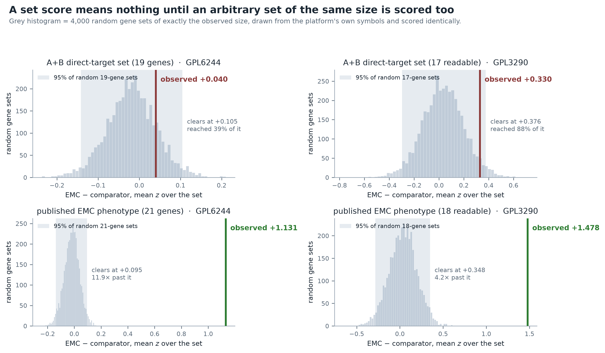
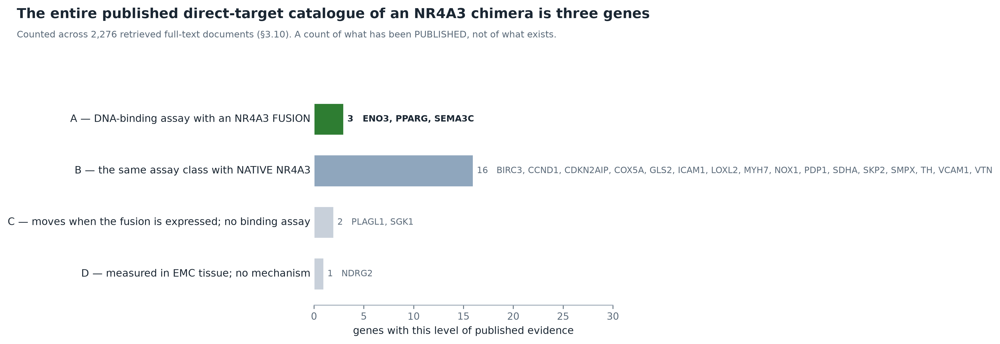
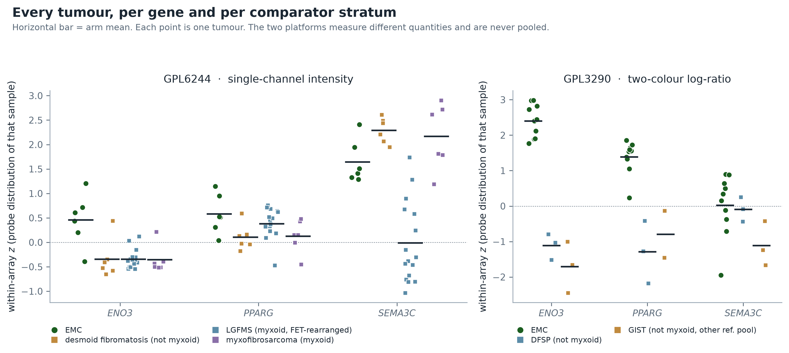
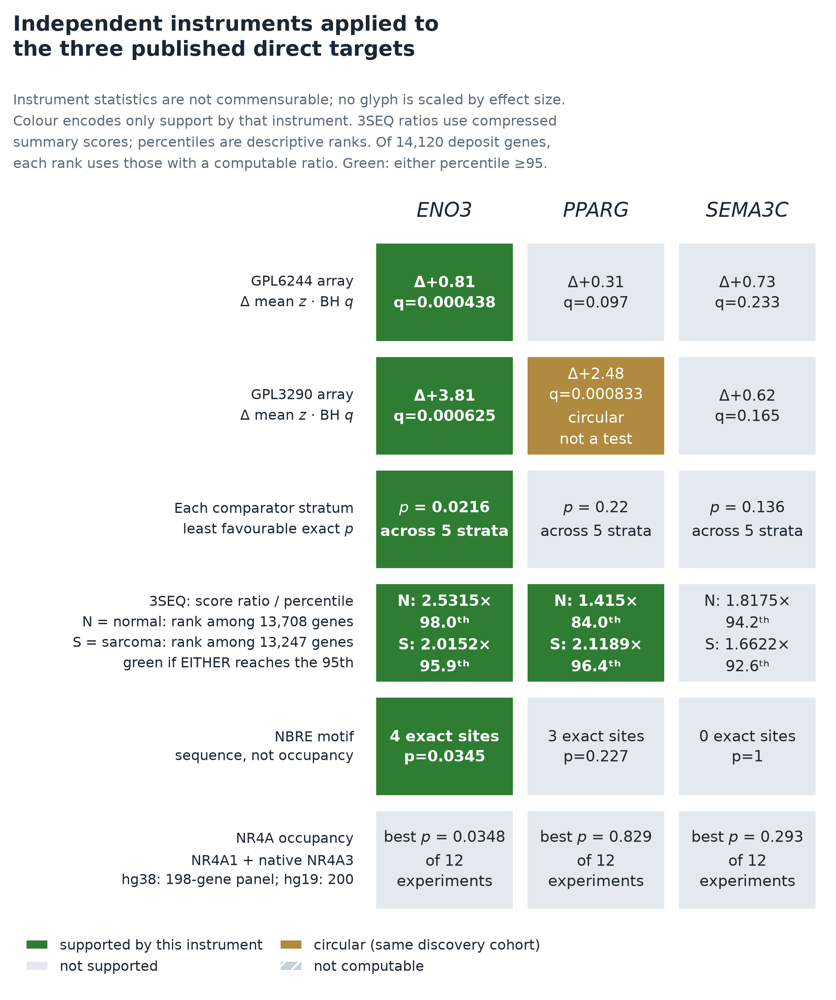
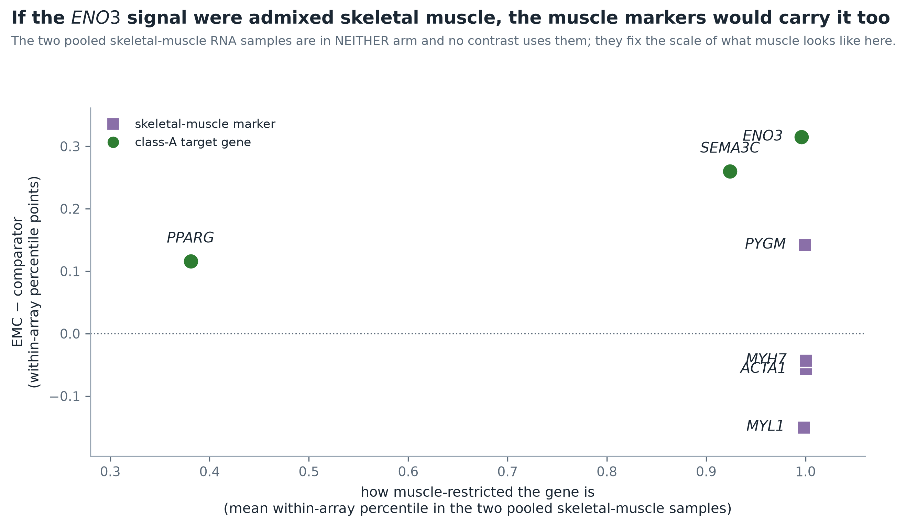

<!--
REPOSITORY NOTE (not part of the manuscript): the YAML block above is repository metadata read by
the systems checks; it is stripped at submission. Everything from the title below is the manuscript
proper, written so an external reader can reproduce it without reading this repository. Purely
operational notes (staged graph records, proposed map-edits, cross-lane coordination) live in
nr4a3-fusion-transcriptional-output-repo-notes.md. Supplementary material — the full 22-row
catalogue, the complete robustness and confound tables, the six PPARγ arms and the method detail —
is in nr4a3-fusion-transcriptional-output-SI.md.

SUBMISSION STATUS: submission-ready draft, not yet submitted.
  Primary target : Genes, Chromosomes & Cancer (Wiley) — Original Research Article (subscription/$0 route)
  Alternatives   : The Journal of Pathology (Wiley); British Journal of Cancer (Springer Nature)
  Preprint       : bioRxiv (Cancer Biology / Genomics), free open copy
  Furniture      : nr4a3-fusion-transcriptional-output-cover-letter.md,
                   nr4a3-fusion-transcriptional-output-submission-checklist.md
-->

# Almost every gene set reads higher in the index arm: a size-matched empirical null for small rare-tumour expression series, and what it leaves of the EWSR1::NR4A3 direct-target catalogue

**Running title:** A size-matched null for rare-tumour gene-set reads

**Author:** Tristan D. McRae¹

¹ Independent Researcher. Correspondence: trimcrae@gmail.com
ORCID: [0000-0002-1823-1451](https://orcid.org/0000-0002-1823-1451)

**Article type:** Original Research Article
**Keywords:** empirical null; gene-set calibration; small-sample expression analysis; rare sarcoma; extraskeletal myxoid chondrosarcoma; EWSR1::NR4A3; transcriptional target

---

## Abstract

On a small rare-tumour expression series, almost every gene set anyone scores comes back higher in
the index arm. In a 10-versus-6 extraskeletal myxoid chondrosarcoma (EMC) series, PPARγ targets,
hypoxia metagenes and adipogenesis all move alike. The reason is size, not biology: a set's
per-sample score is one draw from a distribution whose width depends on the set's **size** and on the
platform, so an arbitrary set can print t = 3.16 and be indistinguishable from a random one of the
same size. **We supply the
calibration that refuses such a read** — a size-matched empirical null drawn from the platform's own
genes — and apply it to this disease's best-warranted set. Across 2,276 retrieved documents, **the
set with a DNA-binding assay against an NR4A3 chimera is three genes: *SEMA3C*, *PPARG*, *ENO3***.
Three is below the four-gene floor for a set score, so the set scored is those three pooled with the
sixteen native-NR4A3 targets. On the two readable array platforms **that pooled set reaches 39% and
88% of its null threshold and does not clear**, while the published EMC phenotype clears it 11.9-fold
and 4.2-fold in the same run — the instrument reads this disease, not this set. Exact label
permutation, every comparator stratum separately, a matrix covariate and a muscle control then
separate the three: *SEMA3C* survives nothing and reverses sign with the comparator; *PPARG*'s
strongest reading is circular, scored on the cohort that first published it; *ENO3* survives
everything, but was the pre-designated positive control and is not an independent finding here.
**The binding constraint is not sample size.** No experiment has measured where an NR4A3 fusion binds,
or what chromatin does, in EMC material — the one genome-wide chromatin readout that exists for these
fusions reads *accessibility* in HEK293T (GSE243553), and the 110 NR4A peak sets that exist are the
wrong protein or the wrong disease, with no class-A gene carrying unusual occupancy against a
background panel. Until a fusion cistrome in EMC chromatin exists, "elevated in EMC" and "driven by
the fusion" are inseparable. The null is not EMC-specific: any series with a small index arm and
heterogeneous comparators fails the same way.

---

## 1 · Introduction

### 1.1 · Almost every gene set reads higher in the index arm

A rare tumour affords a small index arm and a heterogeneous comparator arm, and on such a series
almost every gene set anyone scores comes back higher in the index arm. In the series this paper
works with — 10 extraskeletal myxoid chondrosarcomas (EMC) against 6 comparators, GSE4303 on platform
GPL3290 — PPARγ targets, hypoxia metagenes, adipogenesis, chondroitin-sulfate biosynthesis and
arginine metabolism all come back "higher in EMC". Sets with no biological relationship to one
another move the same way and by similar amounts.

The reason is not biology. A raw Welch contrast on the sample means uses the samples as its unit of
variability and ignores that a set's per-sample score is one draw from a distribution whose width
depends on the set's *size* and on the platform. At n = 10 versus 6 that width is large: the 95% band
for an arbitrary 17-gene set on GPL3290 is [−0.297, +0.376] SD, so a set can print t = 3.16 and remain
indistinguishable from a random set of the same size. Seventeen is the size scored there: the pooled
direct-target set names nineteen genes, and that platform reads two of them, *ICAM1* and *MYH7*, on
no probe.

**No read on such a series is interpretable until it is calibrated against a size-matched random gene
set drawn from the same platform's own genes.** That calibration is the instrument this paper
supplies; it costs one seeded resampling, it is drawn in **Figure 1**, and it is applied to this
work's own headline result rather than only to other people's. **It is not specific to this disease
or this gene set** — any series with a small index arm and a heterogeneous comparator arm has the
same failure mode, and rare tumours are where such series are the only ones that exist.

The rest of the paper is that instrument applied to one worked example, chosen because it is the gene
set in this disease carrying the strongest mechanistic warrant, and because its literature is small
enough to enumerate exhaustively rather than sample. **The example is not the contribution**, and
§4.2 states which parts of it would and would not survive being wrong.

### 1.2 · The disease and the driver

EMC is a rare soft-tissue sarcoma defined by rearrangement of *NR4A3* (NOR-1/TEC). Subramanian *et al.*
describe it as "characterized by a balanced translocation most commonly involving t(9;22) (q22;q12)"
(PMID 15920699), which produces EWSR1::NR4A3; Brenca *et al.* express and assay both that chimera and
TAF15::NR4A3, "the commonest TAF15 (exons 1–6)–NR4A3 (exons 3–8) fusion" (PMID 31020999), with a
rarer *t(3;9)(q11-12;q22)* TFG::NR4A3 variant accounting for part of the remainder. NR4A3 is an orphan
nuclear receptor, and the chimera places its DNA-binding domain under a strong FET-family
transactivation domain. The disease's central molecular hypothesis is therefore straightforward: the
fusion is a transcription factor with an aberrant output, and that output is where the disease lives.

### 1.3 · The gap in the worked example

The hypothesis dates from the fusion's cloning in 1995 (PMID 8634690), and the evidence under it is
thin in a specific, checkable way. Two questions bear on it, and they are different questions:

1. Which genes has anyone shown an NR4A3 chimera to physically bind and drive?
2. Which genes are high in EMC tumours?

**Neither is much discussed.** Measured against Europe PMC on 2026-08-08: of 1,305 records naming the
disease, 261 are reviews, and the three genes with a published fusion DNA-binding assay are named in
**3, 1 and 0 of those 261 reviews** respectively (*PPARG*, *SEMA3C*, *ENO3*; 37, 6 and 2 records in
the corpus as a whole, and both *ENO3* records are about a different disease). The primary sources
are, by contrast, ordinary references of this literature — 42–70% of their citations come from EMC
records, and three of the four are cited by four to six EMC reviews. The fourth, the *ENO3* source,
is cited by none of them. So the gap this addresses is not a
contested claim in need of correction; it is that a disease defined by a transcription-factor fusion
has **no assembled account of what that fusion transcribes**, and the question is asked rarely enough
that the distinction between the two above has had little occasion to be drawn. Query strings,
counts and their limits are in the deposited probe artifact.

The first is a mechanism claim; the second is an association. A gene can satisfy the second for reasons
that have nothing to do with the fusion — EMC's cell of origin, its myxoid and hypocellular
architecture, the anatomical site it arises in, or the gene being a generic matrix or proliferation
gene. This work separates the two by (a) cataloguing the mechanism claims with their evidence type
recorded per gene, (b) reading them back in tumour tissue with an explicit calibration for what an
arbitrary gene set does on the same platform, and (c) putting each gene through the specific
confounds that could have manufactured it.

---

## 2 · Materials and Methods

Full method detail — probe mapping, scoring floors, the circularity grading procedure, the
pre-registered decision rule and the motif-scan parameters — is in Supplementary Information §S1–S6.

### 2.1 · The evidence-typed target catalogue

Every claim in the primary literature that EWSR1::NR4A3, another NR4A3 fusion, or native NR4A3
transcriptionally activates a named gene was recorded with: the gene, the factor actually tested, the
assays, the cell system, the species of those cells, the expected direction in EMC, and the verbatim
sentence the classification rests on. Rows were read from retrieved full text, not from memory. Four
evidence classes were assigned per row (**Table 1**; the complete 22-row catalogue with verbatim
sentences is Supplementary Table S1).

**Table 1. The evidence classes, and how many genes are in each.**

| class | definition | genes |
|---|---|---:|
| **A** — fusion DNA-binding | a DNA-binding or promoter assay performed **with an NR4A3 fusion**. The strongest class. | **3** |
| **B** — native DNA-binding | the same assay class with **native NR4A3**. Transfer to the fusion is an assumption. | 16 |
| **C** — fusion expression only | the gene moves when the fusion is expressed; no binding assay. | 2 |
| **D** — EMC tumour expression only | measured in EMC tissue; no mechanism. | 1 |

### 2.2 · Datasets

Three independent EMC cohorts on three platform families were used. They are never pooled (§5).

**Table 2. The three cohorts.**

| cohort | platform | EMC | comparators | value kind |
|---|---|---|---|---|
| **GSE24369** | GPL6244, Affymetrix Gene ST | 6 | 29 — 17 FET-rearranged LGFMS + 6 myxofibrosarcoma + 6 desmoid fibromatosis | single-channel intensity |
| **GSE4303** | GPL3290, 42,000-spot two-colour cDNA | 10 | 6 (3 DFSP + 3 GIST) | two-colour log-ratio vs a reference pool |
| **GSE28866** | 3SEQ (GPL10999) | 4 | 32 non-EMC sarcoma libraries; 27 normal-organ libraries | 3′-end read density per peak |

Every class label above is the GEO sample title, not an internal grouping name. That distinction
decides §3.4: **23 of the 29 GPL6244 comparators are themselves myxoid tumours** — 17 low-grade
*fibromyxoid* sarcomas and 6 *myxo*fibrosarcomas — against 6 collagen-rich desmoid fibromatoses,
whereas none of the 6 GPL3290 comparators is myxoid. The two array cohorts therefore differ in the
one property the leading confound is built on, which makes the pair a natural control rather than
only a limitation.

- **GSE24369** — its comparator arm is itself FET-rearranged (LGFMS is *FUS::CREB3L2*), so a difference
  here is not merely "has a FET fusion". The array carries 42 samples; 6 EMC + 29 comparators accounts
  for 35, and the remaining 7 — **five solitary fibrous tumours and two pooled skeletal-muscle RNA
  samples** — are excluded from both arms rather than silently absorbed into either, so the
  arithmetic closes. The two muscle samples are named here because they are not merely surplus:
  they are the reference that makes the *ENO3* muscle-admixture objection measurable (§3.5).
  Linked series PubMed identifier 21536545.
- **GSE4303** — Subramanian *et al.*, *J Pathol* 2005;206:433–444 (PMID 15920699). See §3.8 on
  circularity. Two structural facts about this deposit bear on every number read from it. It is a
  **seven-platform series** — seven sibling print runs of one clone library — of which only GPL3290
  carries a usable EMC-versus-comparator contrast, so the 10 versus 6 here is not the whole deposit.
  The **published** Subramanian cohort was 10 EMC against 26 other sarcomas, so a reader opening the
  accession will find comparators this analysis does not use. Separately, the verbatim sample
  annotations record the reference pool each two-colour hybridisation was run against: all 10 EMC
  and all 3 DFSP samples are on the CRH pool, while **the 3 GIST samples are on Universal Human
  Reference — a different pool** (§3.4).
- **GSE28866** — Brunner *et al.*, *Genome Biol* 2012;13(8):R75 (PMID 22929540). The EMC libraries are
  EMC_STT5525/5526/5527/5592; the normal arm is 27 libraries across six organs (bowel, breast, colon,
  kidney, lung, uterus). The 32 non-EMC sarcoma columns include two pairs of technical replicates of
  one specimen each (ESS_STT5520, LMS_STT516), so 32 libraries come from 30 specimens.

Each cohort's EMC arm size in Table 2 was read from its series matrix. All three were separately
recovered from GEO **sample titles** — an independent path to the same numbers, 6, 10 and 4 — during
the cohort search of §2.7, where they serve as its positive control: a search that cannot find the
datasets that exist says nothing about the ones that do not.

⚠ One deposit is not a fourth cohort and is easy to mistake for one. **GSE170983** carries 99
samples, four of them EMC, under its own accession — and it is the same Brunner deposit as GSE28866,
with the same four tumours (GSM715466/715467/715470/715472) and the same linked publication.
Counting the two separately would raise the apparent EMC total to 24 without adding a patient.

### 2.3 · Scoring and the size-matched empirical null

Probes were mapped to symbols per platform (GPL6244: 20,230 of 28,459 probes → 18,694 distinct
symbols; GPL3290: 27,203 of 43,008 probes → 14,932, through an EST-accession bridge). Each sample's
values were z-scored against that array's own probe distribution; a gene or set score for a sample is
the mean z over its readable members; the contrast is a Welch *t* on the EMC versus comparator
per-sample scores. **A gene with no probe is treated as an unread gene, never as an absent one.**
Floors were fixed at three samples per group for any contrast, and four genes / 0.4 coverage for any
set score.

Two quantities a raw Welch contrast does not supply are computed per platform. **The exact global
offset** is the per-sample mean z over every symbol the platform maps, contrasted EMC versus
comparator — the amount by which an arbitrary gene set is expected to differ for no set-specific
reason. **The size-matched empirical null** is 4,000 random gene sets of exactly the observed size,
drawn from a seeded random pool of the platform's own mapped symbols (seed 20260807; pool 4,000;
universe 18,694 for GPL6244, 14,932 for GPL3290), each scored exactly as the real set is. A random set
carries the offset too, so the null absorbs it by construction. The empirical p is the **two-sided**
fraction of draws at least as extreme, with +1/+1 smoothing. A set is reported as SET-SPECIFIC only
if the observed delta falls outside the 95% band of that null; single genes are calibrated the same
way at set size 1.

**The empirical p has a floor, and it is quoted as one.** With 4,000 draws and +1/+1 smoothing the
smallest two-sided value the design can return is 2/4001 = 0.0005, and every such value below is
written **`p_emp ≤ 0.0005`** — the resolution limit of the null, not a measured value. The floor is
not the same on both platforms. A draw is discarded when the gene it picks leaves either arm below
the three-sample contrast floor, so every size-1 null on GPL3290 retains 3,700 of its 4,000 draws and
its floor there is 2/3701 = 0.00054, the value Table 4 prints for *ENO3*.
Three further limits of the pool are stated rather than left implied: it is a **seeded 4,000-symbol
random subsample** of each platform's mapped symbols (21% of GPL6244's 18,694, 27% of GPL3290's
14,932), the same pool is reused at every set size, and the gene under test is not excluded from it.

The null's own limit is stated rather than assumed: it is a **competitive** null, controlling for the
platform-wide offset and for set *size*, but not for gene–gene correlation inside a real pathway. It
is therefore anti-conservative for coherent sets and is a screen, not a test — which is why §2.6
supplies a self-contained null alongside it.

### 2.4 · Instrument controls, graded before the biology

Four known answers were graded before any biological read. The first two are ***ENO3*** (UP on both
platforms — the positive control) and ***NR4A3*** (UP — tumour identity). The other two are
***PLAGL1*** (DOWN, PMID 16112421 — the directional falsifier, the only prediction an arm-wide
offset cannot manufacture) and ***SGK1*** (flat or down at transcript level despite 10/10 protein
positivity, PMID 16756948 — the only row whose published transcript and protein directions oppose).

Grading is on where the delta sits relative to its size-1 null, never on the raw delta. **The rule has
three outcomes, not two, and the third is the one that needs stating.** A reading whose delta falls
*outside* its null band is graded, and agrees or disagrees with the published direction. A reading
whose delta falls *inside* the band is **not a reading at this power** and is not graded either way —
a randomly chosen gene on that platform would land there too. And a control with no computable
contrast at all (for example, *NR4A3* on GPL3290, where four of six comparator spots for that probe
are missing, leaving two values against a floor of three) is likewise not graded.

Two consequences follow, and both are reported rather than left for a reader to find. First, the
denominator of any "n of n agree" statement is the number of **gradeable readings**, not the number
of controls — §3.3 gives both. Second, a control can only fail by landing outside its band in the
*wrong* direction, so a control with a wide band is weakly falsifiable; §3.3 therefore prints each
control's band beside its verdict, because a prediction that could not have been refused is not
evidence that it was tested. An absent reading is not a reading of absence, and the block whose job
is to tell a working instrument from a broken one is the last place that distinction may collapse.

### 2.5 · The 3SEQ arm, and its calibration

3SEQ measures 3′-end read density per peak. A gene's value in a library is the median across that
gene's peaks; an arm's value is the median across that arm's libraries. **No z-score, no test and no
confidence interval are used, because n = 4.** 3SEQ read density is not array intensity, and nothing
from this arm is pooled with the arrays.

A fold-change is not a reading until an arbitrary gene's fold-change is known, so the same two ratios
were computed for **every gene in the deposit** (14,120 genes; 13,708 with a computable EMC/normal
ratio, 13,247 with an EMC/sarcoma ratio) and each target gene is reported as a **percentile of that
distribution**. A gene whose comparator median is zero has no ratio and is excluded from the
distribution rather than ranked at the top. A percentile is a rank, not a p-value, and none is implied.

### 2.6 · Confound audit and sensitivity analyses

Four further readings were computed offline from the same cached inputs, all using the same scoring
primitives so the quantity tested is identical to the quantity reported. Every delta re-derived here
was asserted equal to the primary artifact before anything was written.

1. **Exact sample-label permutation** (a self-contained null). The EMC/comparator label is permuted
   over samples and the *real* gene set rescored, so correlation structure is carried through
   untouched. Arm sizes give 1,623,160 and 8,008 distinct assignments — few enough to **enumerate
   completely**, so every reported p is exact rather than sampled. Two-sided throughout.
2. **Every comparator stratum, separately.** The contrast is recomputed with the comparator arm
   restricted to one class at a time, to the myxoid classes only, to the non-myxoid classes only,
   and — on GPL3290 — to the **reference-pool-matched** comparators only. Nothing about the EMC arm
   or the reduction changes, so any movement is attributable to who is in the comparator arm. Each
   stratified contrast carries its own exact permutation p (C(29,6) = 475,020 down to
   C(13,10) = 286, all enumerated completely).
3. **Covariate-adjusted sensitivity.** Each gene's per-sample z is regressed on a matrix-content
   proxy and the contrast recomputed on the residuals. **The proxy is selected by provenance:** every
   candidate is checked against every gene this manuscript scores anywhere, and any gene drawn from
   an EMC-derived list is refused, because adjusting on a gene selected *because* it is high in EMC
   removes EMC signal by construction. Two panels survive that filter: 11 structural genes
   (*BGN, COL5A1, COL5A2, DCN, FN1, LUM, MMP2, POSTN, SPP1, TNC, VIM*) and 3 vascular genes (*ENG,
   KDR, TEK*). The structural panel is the one §3.6 reports first; the vascular panel's reading is
   reported beside it, because the two do not agree on GPL3290. This is
   a sensitivity analysis, not a correction: a proxy that is itself downstream of the fusion would
   over-adjust, and that possibility is not excluded.
4. **The skeletal-muscle admixture control** (§3.5), plus a **leave-one-out jackknife** over the EMC
   arm, a **rank-based re-read** on within-array percentile, and **Benjamini–Hochberg** q-values
   across the per-gene permutation p-values within each platform.
5. **NR4A occupancy** (§3.11). The scan intersected 110 published NR4A ChIP-seq peak sets —
   ChIP-Atlas, ReMap2022 and the Haller *et al.* acinic cell carcinoma deposit — with the class-A
   genes' regulatory windows, the same window as the motif scan, so the sequence and occupancy axes
   ask about one region. Every count was placed against a background panel of 198 genes assembled
   for an unrelated question. Four rules govern the reading. A **raw count is never reported as a
   finding**, because the deepest catalogue puts a peak in 82.8% of the panel. A peak set that
   recovers (almost) no panel gene is marked **uninformative**: it cannot fail to recover these
   three, so its silence is an absent reading and is never counted as evidence of non-occupancy.
   **Only NR4A antigens are scored** — the Haller deposit also carries CTCF, H3K27ac, H3K27me3,
   H3K4me3 and super-enhancer calls, and a histone peak at a promoter reports that the promoter is
   active, not that an NR4A protein is there. And the nominal-hit count is judged by a **binomial
   tail** against the number of tests rather than by comparing an integer to a fractional
   expectation. Multiplicity is over distinct **experiments**, not genome builds, since the same
   experiment appears once per build.

   The Haller peak files carry no genome build, and a BED intersected on an assumed build does not
   fail — on chr10 it silently reports another locus. The build was therefore **measured**: H3K4me3
   marks active promoters, so on the correct build it must recover most of the same background panel
   and on the wrong one it must not. All four samples independently gave **90.6–93.9% panel recovery
   on hg19 against 32.2–33.6% on hg38**, and the deposit is read as hg19. Both an absolute floor
   (0.80) and a ratio (2.0) are required, because the two builds agree over much of the genome, so
   ~33% is the expected wrong-build floor rather than noise.

### 2.7 · The cohort search

Six deliberately overlapping queries were put to GEO — the disease name in full and abbreviated, the
fusion rather than the disease, the 3′ partner plus lineage, and two over-broad terms chosen to
return pan-sarcoma and general chondrosarcoma deposits in which EMC samples might sit under a generic
title. Every query is recorded with its own stated purpose, including any returning nothing, because
a query that returns nothing is indistinguishable from a dataset that does not exist unless the query
itself is on the record.

Three properties of the procedure matter more than the queries. **Every returned series is read at
sample level**, not screened on its title: GEO titles are depositors' claims, and GSE24369 — titled
after low-grade fibromyxoid sarcoma while carrying six EMC tumours — is the standing demonstration
that a title-level screen would discard the very cohorts this analysis rests on. **Every candidate is
deduplicated at three levels** — accession, linked publication, and sample identity against all 157
GSM records the three cohorts read — because a re-deposit under a new accession is otherwise
indistinguishable from a new cohort. And **the search is graded against a positive control**: the
three cohorts already in use must be recovered by the same queries, with their EMC arm sizes, or the
result is withheld as uninterpretable rather than reported as a negative.

### 2.8 · Reproduction

Every value in §3 derives from a committed artifact and is not re-typed from prose. All analyses are
CPU-only, use open-source tooling, and reproduce offline from cached inputs with no network access;
producers refuse to write if any row disagrees with the artifact that owns it. See Data and code
availability.

---

## 3 · Results

### 3.1 · Three genes are the whole of class A

**Table 3. The complete class-A catalogue — every gene for which an NR4A3 chimera has been shown to bind DNA.**

| gene | chimera assayed | assays | cells | citation |
|---|---|---|---|---|
| **SEMA3C** | EWSR1::NR4A3 (and TAF15::NR4A3, and native) | predicted NBRE-like site (GRCh38 chr7) + ChAP-qPCR, Strep-tagged | tBJ/ER transformed human fibroblasts | Brenca *et al.*, *J Pathol* 2019;249(1):90–101 (PMID 31020999) |
| **PPARG** | EWSR1::NR4A3 (and native, and NR4A3ΔC) | predicted perfect NBRE at −675 bp, band-shift, 2.8 kb human *PPARG* promoter luciferase, single-nucleotide NBRE mutant | CFK2 fetal **rat** chondrogenic cells; human promoter construct | Filion *et al.*, *J Pathol* 2009;217(1):83–93 (PMID 18855877) |
| **ENO3** (β-enolase) | TFG::NR4A3 — *not* EWSR1 | EMSA + ChIP + luciferase, two NBRE motifs upstream of the TSS, plus ChIP for H3 acetylation at the endogenous promoter | cultured lines over-expressing TFG-TEC | Kim *et al.*, *Mol Carcinog* 2016 (PMID 26310886) |

Three genes are the whole of class A, and this is the most consequential number in the report
(**Figure 2**). Across the retrieved corpus, the number of genes anyone has shown an NR4A3 chimera
physically binding and driving is three — and only one of the three (*SEMA3C*) combines the EWSR1
chimera, human cells and a chromatin assay. Three is the count in 2,276 retrieved full-text documents
across five corpora (§3.11), not a claim about all of the literature.

**Class B** — the same assay class with native NR4A3 — holds sixteen genes: *CCND1*, *SKP2*, *VTN*,
*SMPX*, *CDKN2AIP*, *GLS2*, *SDHA*, *COX5A*, *PDP1*, *VCAM1*, *ICAM1*, *BIRC3*, *NOX1*, *TH*, *LOXL2*,
*MYH7*. The strongest are *SMPX* (promoter deletion + site-directed mutagenesis + EMSA + ChIP, human
cells, PMID 27181368), *SKP2* (EMSA + ChIP) and *CDKN2AIP* (ChIP + mutation-reversed reporter, human
cells, PMID 39664575). **Class C** holds *SGK1* and *PLAGL1*; **class D** holds *NDRG2*. A published
negative control is carried alongside them: *CALD1*, whose promoter was searched for NOR-1 response
elements in the same experiment that found the *SMPX* site, and none were found (PMID 27181368). It
controls the inference "this gene moved, therefore NR4A3 bound it", not EMC biology.

### 3.2 · The native→fusion transfer assumption is measured to fail in both directions

Class B is only usable if a native-NR4A3 target is a fusion target. Two published measurements say the
transfer can fail, in opposite directions:

1. **A native target the fusion does not share.** Filion *et al.* put native NR4A3 and NR4A3ΔC on the
   same *PPARG* reporter the fusion activates: "the results show that both the native and truncated
   receptors do not activate PPARG transcription under the same conditions in which it is readily
   activated by the fusion protein."
2. **A fusion target the other fusion does not share.** Brenca *et al.*: "the ability of NR4A3 to
   recognize the SEMA3C target region was retained by the EWSR1-NR4A3 chimera but was impaired by
   TAF15-NR4A3."

So "NR4A3 binds X" does not license "EWSR1::NR4A3 drives X in EMC", and a native-NR4A3 cistrome is not a
fusion cistrome. Both halves of that are demonstrated in the primary literature, not argued here.

### 3.3 · The instrument controls

**Table 4. The four instrument controls, graded before any biological read.**

| control | GPL6244 | GPL3290 |
|---|---|---|
| ***ENO3*** (positive) | AGREES — d +0.8075, outside null, p_emp 0.0195 | AGREES — d +3.8113, outside null, p_emp 0.00054 |
| ***NR4A3*** (tumour identity) | AGREES — d +0.7415, outside null, p_emp 0.0240 | not measurable — 2 comparator values against a floor of 3 |
| ***PLAGL1*** (directional falsifier) | **inside null, not a reading at this power** — d −0.4235, band [−0.606, +0.529] | AGREES — d −2.134, outside null, p_emp 0.013 |
| ***SGK1*** (transcript/protein discordance) | AGREES (flat) — d −0.1807, band [−0.606, +0.529] | AGREES (flat) — d +0.6156, band [−1.314, +1.410] |

**Seven of the eight control × platform cells carried a computable contrast, six of those are
gradeable, and all six agree with the published direction; none disagrees.** The eighth (*NR4A3* on
GPL3290) is not measurable. Stated at the weight it deserves: *PLAGL1* on GPL6244 is **inside its
null band** and is
therefore sign-concordant but not a reading at this power. The two *SGK1* cells agree by way of a
prediction ("flat or down") that an inside-the-band reading satisfies, so those cells could not have
refused the prediction downward, and their bands are printed above for that reason.

The positive control is independently reproduced: *ENO3* matches a separately written module's
committed value to four decimal places on both platforms. The directional falsifier fires in the
right direction where it is gradeable: *PLAGL1*, the one gene in the catalogue with a published *down*
prediction, is −2.13 SD in EMC on GPL3290 and outside its null band, while every other class-A row
points up; no arm-wide artefact produces that pattern. Its published EMC reading is n = 6 by RT-PCR
against chondrocyte controls rather than sarcomas, and its fusion-expression evidence is differential
display in rat cells, so it is a strong argument against the offset explanation rather than a fully
independent falsifier.

### 3.4 · The global offset is not the problem — null-band width is

The measured global offset is tiny: −0.0084 SD on GPL6244 (t −1.592, over 18,694 mapped symbols) and
+0.0258 SD on GPL3290 (t +1.646, over 14,932). So the "most sets come back higher in EMC" pattern is
not an arm-wide shift. What it is instead: at n = 6 versus 29 and n = 10 versus 6, the sampling
variance of a set score is far larger than a Welch *t* on the sample means implies. On GPL3290 the 95%
null band for the 17 readable members of that set is [−0.297, +0.376], so a raw delta of +0.330 with
t = 3.16 sits inside it (p_emp 0.083). **Figure 1** shows this directly.

Two structural properties of the comparator arms qualify every contrast below, and both are exploited
rather than merely conceded. The GPL6244 comparator arm is **23/29 myxoid**, so it largely matches EMC
on the matrix property that confound (b) of §4.1 is built on; the GPL3290 comparator arm is **0/6
myxoid**, so it does not. And the GPL3290 comparator arm is split across two reference pools — 3 DFSP
on CRH with all 10 EMC samples, 3 GIST on Universal Human Reference — which is a per-gene offset that
within-sample standardisation cannot remove, because standardisation removes a sample's mean and SD,
not a per-gene shift. §3.6 recomputes every class-A contrast against the pool-matched comparators
alone for that reason.

### 3.5 · Per gene, and what survives

**Figure 3** shows every tumour. **Figure 4** summarises which instrument supports which gene.

**Table 5. The three class-A genes on both array platforms, under an exact label-permutation test.**

| gene | class | GPL6244 Δ mean z (exact p, BH q) | GPL3290 Δ mean z (exact p, BH q) |
|---|---|---|---|
| **ENO3** | A · fusion | **+0.8075** (7.3 × 10⁻⁵, q 0.00044) | **+3.8113** (1.3 × 10⁻⁴, q 0.00063) |
| **PPARG** | A · fusion | +0.3071 (0.049, q 0.097) | +2.4809 (3.3 × 10⁻⁴, q 0.00083) — **circular, §3.8** |
| **SEMA3C** | A · fusion | +0.7298 (0.194, q 0.233) | +0.6228 (0.165, q 0.165) |

All three genes are positive-signed on both platforms — six of six readings, no reversal **against the
pooled comparator arm**, and each clears its size-matched single-gene null on at least one. That
qualifier is load-bearing: §3.6 shows *SEMA3C* reversing sign once the comparator arm is taken apart,
so "no reversal" is a property of one particular way of pooling the comparators and not of the gene.
Sign concordance across three genes is in any case
what a coordinated programme predicts *and* what three individually EMC-associated genes predict, and
the three are not equally supported once the self-contained null is applied. Under exact sample-label
permutation, ***ENO3* is significant on both platforms after multiple-testing correction**, *PPARG* on
GPL3290 only — which §3.8 shows is the circular platform — and ***SEMA3C* does not reach significance
on either.** Clearing the size-matched null says a gene's delta is extreme relative to *other genes on
the platform*; it is not the same statement as the two arms differing for that gene. No row in the
panel changed sign in any leave-one-out fit, and none changed sign on the rank re-read, so nothing
here rests on one tumour or on the z-scoring convention.

***ENO3* is also this study's positive control, and that has to be said plainly.** §2.4 designates
it the control whose failure would mean "report the instrument, not the biology" — so its elevation
in EMC is not an independent finding of this work. It was chosen as the control *because* Kim *et
al.* published it as fusion-driven and a separately written module had already committed its value
on both platforms. Two things keep the rest of the reading from being circular, and a reader should
weigh them rather than take the word "survives" at face value. First, the control role tested one
proposition only — is it up on both platforms — and **everything that separates *ENO3* from *PPARG*
and *SEMA3C* here was not part of it**. The exact permutation p, invariance across five comparator
strata, the reference-pool-matched contrast, the matrix adjustment, the 3SEQ percentile, the muscle
control and the NBRE enrichment could each have failed and did not. Second, the finding this paper
reports is the **ordering** of the three genes, not *ENO3*'s elevation, and an ordering cannot be
manufactured by having selected one member in advance. What remains true regardless is Limitation
17: a design in which the positive control and the surviving result are the same gene is
structurally weaker than one in which they are not, and only an independent gene reaching the same
bar would remove that.

**The muscle-admixture objection, and its answer (Figure 5).** *ENO3* is muscle-specific β-enolase and
EMC arises in deep soft tissue of the limb, so admixed skeletal muscle is the first alternative
explanation a reader should reach for. GSE24369 contains two pooled skeletal-muscle RNA samples, in
neither arm and used by no contrast, which fix the scale of what muscle looks like on this platform.
*ENO3* does sit near the top of the muscle array (percentile 0.996). **So do four markers that are
more muscle-restricted than it is — *ACTA1* 1.000, *MYH7* 1.000, *PYGM* 0.999, *MYL1* 0.998 — and not
one of them separates the tumour arms as *ENO3* does** (EMC − comparator −0.057, −0.043, +0.142,
−0.150 percentile points, against *ENO3*'s +0.315). *PYGM*'s +0.142 is the largest of the four and is
under half *ENO3*'s. If the EMC arm carried skeletal muscle, the more muscle-restricted
markers would carry it too. This bounds admixture of *differentiated* skeletal muscle; it does not
exclude a myogenic differentiation programme within the tumour, which would move a marker with no
contaminating tissue present.

### 3.6 · The contrast against every comparator stratum separately

The comparator arm is not one thing, and the class-A genes behave very differently when it is taken
apart. Each cell is the same contrast with the same EMC arm, its own exact permutation p in brackets.

**Table 6. The same contrast against each comparator sub-arm separately.**

| gene | vs LGFMS only (17) | vs myxoid only (23) | vs non-myxoid only (6) | GPL3290, pool-matched only (3) |
|---|---|---|---|---|
| **ENO3** | **+0.805** (1.7 × 10⁻⁴) | **+0.808** (8 × 10⁻⁵) | **+0.807** (0.022) | **+3.515** (0.0035, the design floor) |
| **PPARG** | +0.197 (0.220) | +0.264 (0.100) | +0.473 (0.043) | +2.679 (0.0035) — circular |
| **SEMA3C** | **+1.657** (1.2 × 10⁻⁴) | +1.089 (0.046) | **−0.645** (0.015) | +0.113 (0.843) |
| *PLAGL1* | −0.169 (0.431) | −0.343 (0.183) | −0.733 (0.043) | −1.659 (0.042) |

***ENO3* is invariant** — +0.805, +0.808, +0.807 across strata that share almost nothing, and
significant against every one of them, including the myxoid-matched arm that controls confound (b) by
design. ***SEMA3C* reverses sign**: it is strongly up against LGFMS and significantly *down* against
desmoid fibromatosis, and on GPL3290 it is +0.113 (p = 0.84) against the pool-matched comparators. Its
apparent elevation is a property of which sarcomas happen to be in the comparator arm, not of EMC.
*PPARG* is intermediate and comparator-dependent.

**Two readings of this table are worth stating explicitly, because both are easy to miss.** First,
*SEMA3C* is *not* significant against the pooled comparator arm (p = 0.194, Table 5) yet is
significant against two of its strata in **opposite directions**. That is not a contradiction: the
pooled arm averages a stratum where *SEMA3C* is low (LGFMS) with strata where it is high, and EMC
lands between them, so two strong opposite effects cancel into a null. A pooled contrast can
therefore conceal large stratum effects, and a gene that looks flat against a heterogeneous
comparator arm has not been shown to be flat. Second, and conversely, the stratified panel is where a
gene can most easily be flattered: with five contrasts per gene on GPL6244 and no correction across them
(Limitation 8), the least favourable stratum is the honest summary, which is what **Figure 4**
reports. On that measure *ENO3* is significant at its worst stratum (p = 0.022) and *SEMA3C* is not
(p = 0.136 at its worst).

The reference-pool correction matters and does not overturn *ENO3*: restricting GPL3290 to the three
pool-matched DFSP comparators moves it from +3.811 to +3.515, still the smallest p that a
three-comparator design can report (1/286 = 0.0035, quoted as the floor it is).

**Covariate-adjusted sensitivity.** The 11-gene matrix panel separates the arms on GPL6244
(Δ −0.518; EMC scores *lower*) and essentially not at all on GPL3290 (Δ +0.006). That asymmetry is the
method's own control: a covariate that does not differ between the arms cannot move a contrast, and on
GPL3290 nothing moves (*ENO3* retains 100%, *PPARG* 97%, *SEMA3C* 99%). On GPL6244, where the covariate
does differ, *ENO3* retains 75% of its delta (+0.807 → +0.608), *PPARG* 32% (+0.307 → +0.099), and
*SEMA3C* rises to 171% (+0.730 → +1.246) — it is high in EMC *despite* EMC's lower matrix score, which
is consistent with its elevation being comparator-driven rather than matrix-driven.

**The second surviving panel does not agree, and it is reported rather than left out.** The 3-gene
vascular panel (*ENG, KDR, TEK*) passed the same provenance filter, and unlike the matrix panel it
separates the arms on **both** platforms (Δ −0.406 on GPL6244, Δ −0.796 on GPL3290), so on GPL3290 it
can move a contrast where the matrix panel cannot. Adjusted on it, *ENO3* retains **58%** of its
GPL3290 delta (+3.811 → +2.219) and 78% of its GPL6244 delta; *PPARG* retains 42% and 30%; *SEMA3C*
85% and 189%. So *ENO3*'s GPL3290 reading is not invariant to which qualified covariate is used, and
the 100% above is a property of the matrix panel rather than of the gene. The ordering of the three
is unchanged on either panel.

### 3.7 · A third cohort, calibrated against its own deposit

The 3SEQ arm carries both contrasts in one experiment: 32 non-EMC sarcoma libraries on an unrelated
technology, and 27 normal-organ libraries. The median gene in this deposit has an EMC/normal ratio of
1.05 and an EMC/sarcoma ratio of 1.05; the 95th percentiles are 1.89 and 1.89.

**Table 7. The 3SEQ cohort, calibrated against all 14,120 genes in the same deposit.**

| gene | peaks | EMC/normal | percentile | EMC/sarcoma | percentile |
|---|---:|---:|---:|---:|---:|
| **ENO3** | 2 | 2.53× | **98.0th** | 2.02× | **95.9th** |
| **SEMA3C** | 3 | 1.82× | 94.2nd | 1.66× | 92.6th |
| **PPARG** | 5 | 1.42× | 84.0th | 2.12× | **96.4th** |
| *NR4A3 (control)* | 3 | 1.96× | 95.6th | — (sarcoma median 0.000) | — |

All three class-A genes are higher in EMC than in both comparator arms of a cohort and a technology
that share no probe design with either array, and *ENO3* is in the top 2% of 14,120 genes on the
normal axis. **The ceiling is that "top 2%" is not "highest":** *RET* (3.51×, 99.1st), *VCAN* (3.33×,
99.0th) and *CSPG4* (3.31×, 99.0th) all rank above *ENO3* in this deposit, so a high percentile here
places a gene in the upper tail of an EMC-versus-comparator distribution and does nothing more.
*PPARG* at the 84th percentile against normals is the weakest cell in the table and is the honest
reading of its 1.42×.

*NR4A3* is the internal control here and is not a result: its median across the 32 non-EMC sarcoma
libraries is 0.000 and it is detected in the EMC arm — the fusion's own 3′ partner behaving as the
disease definition requires, in a cohort this work did not choose and on an assay it did not design.
It licenses reading the other rows; read as a finding it would be circular, because EMC is *defined*
by an *NR4A3* rearrangement. The normal arm is a tissue panel, not matched adjacent tissue: the 27
normals are visceral organs with almost no soft tissue, so a gene high in EMC against that panel is
not thereby EMC-specific rather than mesenchymal-lineage-specific.

### 3.8 · The circularity flag fired twice

The fetched GEO record for GSE4303 reads "Gene expression profile of extraskeletal myxoid
chondrosarcoma", with linked PubMed identifier 15920699 and contributor "Matt van de Rijn". **GSE4303
is the Subramanian *et al.* (2005) cohort.** Two consequences, and the second was not drawn in the
first version of this analysis:

1. The Filion Table 2 gene set (set E, Supplementary Table S2) is a gene list scored on the data it
   was derived from, and is reported for completeness only.
2. **The *PPARG* gene row on GPL3290 is circular in the same sense.** Subramanian *et al.* reported,
   from these arrays: *"High levels of expression of PPARG and the gene encoding its interacting
   protein, PPARGC1A, in most EMCs."* Measuring *PPARG* high in GSE4303 therefore re-derives a
   published finding from the data it was published from. It is not independent evidence, and a
   circularity grade applied to a gene *set* but not to a gene is not a grade. With that cell set
   aside, *PPARG*'s remaining evidence is GPL6244 (q = 0.097, which does not survive correction) and
   the 3SEQ cohort.

Set D and the whole of GPL6244 are unaffected, which is why the replication in §3.9 stands.

### 3.9 · The aggregate does not clear its null; the published EMC phenotype clears it 12-fold

**Table 8. Gene-set scores against their own size-matched nulls, with the threshold each had to clear.**

| set | GPL6244 | GPL3290 |
|---|---|---|
| **A · fusion DNA-binding targets** (3) | no score — 3 genes, floor is 4 | no score — 3 genes |
| **B · native NR4A3 DNA-binding targets** (16) | d −0.0675, reached 43% of threshold → not distinguishable | d −0.1453, reached 43% → not distinguishable |
| **A+B pooled** (19) | d +0.0403, **reached 39%** → not distinguishable | d +0.3301, **reached 88%** → not distinguishable |
| **D · published EMC phenotype** — EMC vs 137 other translocation sarcomas, independent platform and cohort (21) | d +1.1311, p_emp ≤ 0.0005, **11.9× threshold** → SET-SPECIFIC UP | d +1.4783, p_emp ≤ 0.0005, **4.2× threshold** → SET-SPECIFIC UP |

This is the informative shape, and the "reached X%" column is what makes the negative interpretable
rather than a shrug. The published EMC transcriptional phenotype — a gene list derived on a platform
used nowhere in this work (Affymetrix U133A) from a cohort used nowhere in this work (MSKCC) —
replicates cross-platform and cross-cohort at the null's resolution floor on both readable series,
overshooting its threshold **11.9-fold and 4.2-fold**. On the same instrument, in the same run, the
aggregate direct-target set reaches 39% and 88% of the threshold it would have had to clear. So the
contrast demonstrably *can* see EMC at very large margin and does not see the aggregate target set —
which is a bounded negative, not an underpowered one.

The native-NR4A3 set behaves as Filion's own measurement predicts: class B is flat-to-negative on both
platforms, with *VCAM1* significantly down on both. The vascular/inflammatory native-NOR-1 programme
does not transfer to EMC tissue — concordant with the same paper's finding that native NR4A3 does not
activate the promoter the fusion does (§3.2). Set D is a test of the EMC phenotype, not of the fusion:
a gene can be in it because of EMC's cell of origin, so its replication says the instrument reads EMC,
not that the fusion drives those genes.

**One result becomes more interesting rather than weaker.** The A+B aggregate does *not* beat an
arbitrary set of the same size on either platform — yet on GPL3290 it *does* differ between the arms
more than chance relabelling would give (exact p = 0.011). That is not a contradiction; it is the
cleanest available demonstration of this paper's own thesis. The aggregate target set really is higher
in EMC, **and so is almost any set of that size on that platform**, which is precisely why a
competitive null is the one that decides whether a gene set has told you anything.

### 3.10 · A sequence axis, and its limits

NR4A3's monomer site is the NBRE, 5′-AAAGGTCA-3′ (PMID 1902986); the dimer site is the NurRE
(PMID 9315667). A TSS-centred window of −10 kb/+15 kb — fixed in advance on published regulatory
architecture, before any sequence was read — was scanned on both strands with positional
de-duplication, and calibrated against a dinucleotide-preserving shuffle of the same window (2,000
shuffles, holding GC and CpG content exactly) and a 198-window background panel assembled for an
unrelated question. Full parameters and the one-mismatch analysis are in Supplementary §S6.

***ENO3* carries 4 exact NBREs, more than its own composition predicts** (shuffle-null p = 0.034;
GC-matched background p = 0.018). *PPARG* carries 3, which is what composition predicts (p = 0.227).
***SEMA3C* carries none.** The background panel averages 1.15 exact NBREs per 25 kb window, so a
single hit is what an arbitrary window contains anyway.

Four things this does not establish. **A motif is not occupancy**, and the chromatin experiment that
would test it now exists, was run, and does not support these sites. Frenkel *et al.* expressed
EWSR1-NR4A3, TAF15-NR4A3, TCF12-NR4A3 and TFG-NR4A3 in HEK293T inside a pooled variant library and
resolved each one's effect on chromatin accessibility by single-cell ATAC (GSE243553;
PMID 39048711). Their per-fusion accessibility calls were intersected with the four exact NBRE
coordinates above on the matching genome build — the deposit declares hg38 and these coordinates are
GRCh38, so no lift-over was required. **Three of the four sites fall inside TAF15-NR4A3's called
intervals and none falls inside EWSR1-NR4A3's.** Neither observation supports the motif argument.
The EWSR1-NR4A3 set is too sparse for its zero to be a reading: it recovers 2 of 203 promoters in a
background gene panel assembled for an unrelated question, so a chosen gene could not have been
recovered either. The TAF15-NR4A3 co-location does not clear a null that slides the same four-site
configuration, at its true spacing, to a random offset within the same window (*p* = 0.08, 20,000
seeded draws). That null is the one that matters here because two of the four sites are 153 bp apart
and a single 500 bp interval covers both; nulls treating them as independent return *p* ≤ 0.002 and
overstate the result by a factor of about forty. The TFG-NR4A3 arm — the fusion Kim *et al.* used
for the published *ENO3* result — is likewise too sparse to grade. ⛔ Three conditions bound all of
this: the cells are HEK293T and not EMC chromatin, accessibility is not binding, and *ENO3* is this
study's own pre-designated positive control (§2.4), so a hit there would have been a check on the
instrument rather than a discovery. **The sequence axis and the chromatin axis have now been made to
meet at these coordinates, and they do not corroborate each other.** Method, seeds and the four
nulls: [`gse243553-eno3-overlap-2026-08-08.md`](gse243553-eno3-overlap-2026-08-08.md). **The
*SEMA3C* zero does not contradict Brenca *et al.***, who report a predicted NBRE-*like* site assayed
by ChAP-qPCR; an NBRE-like site is by construction not an exact NBRE. That class was therefore
scanned too, and *SEMA3C*'s 39 one-mismatch sites — the most of any gene scanned — are **exactly
what its own composition predicts** (null mean 33.7, p = 0.203; GC-matched p = 0.118), with only the
composition-naive raw rank suggesting enrichment (p = 0.040) in the most AT-rich window of the set.
**The hit positions do not reproduce the published coordinates** for either *ENO3* or *PPARG*, both
of which numbered from their own promoter constructs. **A distal element outside the window is
untested by construction** — while the elements *inside* the window have now been tested against an
orthogonal instrument, and were not corroborated by it.

### 3.11 · Nothing has been measured in EMC chromatin — a bounded negative about a search

The obvious discriminator between *driving* and *correlation* is a cistrome, so five corpora totalling
**2,276 full-text documents** (3,669 catalogued Europe PMC records) were searched. 153 of those
documents name both a genome-wide chromatin method (ChIP-seq, CUT&RUN, CUT&Tag, ChIP-exo, ChIP-PET,
ATAC-seq, ChAP) and NR4A3/NOR-1/TEC. **None of the 153 applies one to an NR4A3 chimera**, and the only
chromatin experiment performed with a fusion anywhere in that corpus is Brenca *et al.*'s ChAP-qPCR —
target-specific amplification at one locus, not a genome-wide map.

⚠ **That count is a fact about a literature screen, and the absence it was read as does not follow
from it.** A wider search on 2026-08-08 — the primary sequence archives rather than the literature
alone, 179 API endpoints across six rounds with every query string committed — retrieved a
genome-wide chromatin experiment performed with NR4A3 fusions. **GEO GSE243553** (Frenkel *et al.*,
PMID 39048711; public 2024-07-24) is a pooled single-cell ATAC screen of more than 100 oncofusions
expressed in HEK293T, and its 116-member variant library carries **EWSR1-NR4A3, TAF15-NR4A3,
TCF12-NR4A3 and TFG-NR4A3** together with two controls this paper's argument needs: **full-length
wild-type NR4A3**, and the reciprocal **NR4A3-EWSR1**. Quoted from that paper and not re-derived
here: TAF15-NR4A3 increased accessibility at ≈8,600 peaks, within which the NR4A-family motif was
enriched; EWSR1-NR4A3 gave 1,235 differentially accessible peaks across 112 nuclei; full-length
wild-type NR4A3 changed 0 peaks; and the reciprocal NR4A3-EWSR1 gave 0 peaks over 503 nuclei. **Why
a screen of retrieved full text could not reach it is worth recording, because the shape recurs**.
In a pooled screen the perturbation identity is data rather than metadata, so `NR4A3` appears zero
times in that paper's abstract and zero times across all 24 of the series' GEO sample records. This
project's prior chromatin census was also antigen-centric with a ChIP-seq-only method vocabulary,
which no ATAC deposit can satisfy. Search record, per-query counts and the retrieval-failure ledger:
[`nr4a3-cistrome-search-2026-08-08.md`](nr4a3-cistrome-search-2026-08-08.md).

⛔ **It is accessibility and not occupancy, HEK293T and not EMC, ectopic and not endogenous**, so it
is not a fusion cistrome and must never be cited as one. What is missing is therefore narrower than
a blanket absence, and can be stated exactly: **no experiment has measured where an NR4A3 fusion
binds, or what chromatin does, in EMC material.** Across GEO, SRA, BioProject, BioSample,
ArrayExpress/BioStudies, ENA and ChIP-Atlas, searched on 2026-08-08, an EMC disease term returns
zero deposits carrying any chromatin library strategy. The 46 SRA runs an EMC term does return are
every one RNA-Seq, WXS, WGS, Targeted-Capture or CAGE. ChIP-Atlas's complete antigen index carries
NR4A3 in one cell type only (CD1c⁺ dendritic cells) and EWSR1 in seven, none of them EMC. **The
negative is sharpest stated comparatively, because the field runs this experiment routinely for the
sibling fusions and has never run it here** — ChIP-seq for EWSR1::WT1 and for EWSR1::ATF1, ATAC-seq
for EWSR1::FLI1 and FUS::DDIT3 (GSE235218), and ChIP-seq twice for HEY1::NCOA2 mesenchymal
chondrosarcoma (GSE163585, GSE196000). ⚠ It remains a statement about what has been deposited under
a label an archive indexes, not about what exists: GSE243553 was itself invisible to every
gene-keyed query in that sweep and was reached only through a paper's full text. Within that bound,
a fusion cistrome in EMC chromatin is an open, unclaimed experiment rather than a dataset someone
forgot to fetch.

**The available surrogates were then measured rather than dismissed**, because "no fusion cistrome"
invites the reasonable objection that *some* NR4A chromatin data exists and might substitute for
one. All 110 NR4A peak sets — from ChIP-Atlas, ReMap2022, and the Haller *et al.* acinic cell
carcinoma deposit described below — were intersected with the class-A genes' regulatory windows, the
same −10 kb/+15 kb window as the motif scan, so the two axes ask about one region. Each count was
placed against a background panel of 198 genes assembled for an unrelated question (**Table 9**).

**Deep NR4A3 occupancy in human tissue does exist, in another disease.** Acinic cell carcinoma of the
salivary gland activates *native* NR4A3 by enhancer hijacking, and Haller *et al.* mapped it: NR4A3
ChIP-seq in three carcinomas and one normal parotid gland at 8,501–18,666 peaks each (Zenodo
10.5281/zenodo.1483691). That is 55–121× the deepest NR4A3 peak set otherwise available, and it is the
only NR4A3 cistrome in human tissue this analysis could reach. ⚠ **It is not a fusion**: these tumours
carry over-expressed wild-type NR4A3, not EWSR1::NR4A3, and §3.2 records native NR4A3 failing to
activate the *PPARG* promoter the fusion activates. It answers where the NR4A3 DNA-binding domain goes
in a human tumour — a fourth axis of evidence — and it is never a substitute for the missing
experiment.

**Table 9. NR4A occupancy at the class-A genes, calibrated against a 198-gene background panel.**
Peak counts are promoter-window peaks; *p* is empirical against the panel.

| experiment | antigen | peaks | panel genes with a peak | *ENO3* | *PPARG* | *SEMA3C* |
|---|---|---:|---:|---|---|---|
| ReMap2022 (merged) | NR4A1 | 83,773 | **82.8%** | 6, p 0.14 | 1, p 0.83 | 1, p 0.83 |
| SRX1653204 | NR4A1 | 26,660 | 45.5% | 2, p 0.12 | 0, p 1.00 | 1, p 0.46 |
| SRX1653203 | NR4A1 | 22,717 | 31.3% | 2, p 0.050 | 0, p 1.00 | 1, p 0.32 |
| **AciCC-1** (Haller) | **NR4A3** | **18,666** | 67.5% | 4, p 0.070 | **0, p 1.00** | 1, p 0.68 |
| **AciCC-2** (Haller) | **NR4A3** | **9,810** | 56.0% | 3, p 0.094 | **0, p 1.00** | 0, p 1.00 |
| **AciCC-3** (Haller) | **NR4A3** | **9,263** | 49.0% | 2, p 0.16 | **0, p 1.00** | 0, p 1.00 |
| **Normal parotid gland** (Haller) | **NR4A3** | **8,501** | 50.5% | 4, **p 0.035** | **0, p 1.00** | 0, p 1.00 |
| 5 further NR4A1 experiments | NR4A1 | 305–16,023 | 2.5–27.3% | 0–1, p ≥ 0.26 | 0, p 1.00 | 0, p 1.00 |
| 12 ChIP-Atlas NR4A3 peak sets | NR4A3 | 53–154 | **0.0%** | uninformative | uninformative | uninformative |

**The first number to read is the panel column, not the gene columns.** In the deepest catalogue
**82.8% of arbitrary genes carry a promoter-window peak**, so "has an NR4A1 peak" is what almost every
gene does, and a raw count would be the same uncalibrated reading §1.1 exists to refuse. Across the 12
informative experiments, **2 of 36 gene-by-experiment tests reach p < 0.05 against 1.8 expected by
chance — a binomial p of 0.54 for that many or more, which is what chance routinely gives. No class-A
gene carries unusual NR4A occupancy.**

Three readings, in descending order of what they support.

- ***PPARG* carries zero promoter-window peaks in all four deep NR4A3 experiments** (p = 1.00 each).
  This is a **negative, not an absent reading**: those experiments recover 49–68% of the background
  panel, so they can find an arbitrary gene and did not find this one. It stands against Filion
  *et al.*'s perfect NBRE at −675 bp, band shift, and NBRE-mutant luciferase (Table 3). The two are
  reconcilable — a promoter can be bound by an over-expressed factor in a reporter assay and unbound
  in a different lineage's chromatin — but the tension is real and is reported rather than resolved.
- ***SEMA3C* carries at most one peak in one experiment**, consistent with every other axis on which
  it fails.
- ***ENO3* carries 2–4 peaks in every deep NR4A3 experiment and clears its panel in exactly one — the
  NORMAL parotid gland (p = 0.035), not any carcinoma.** A signal present in normal tissue and absent
  from the tumours is the opposite shape from a tumour-driven one, and two nominal hits in 36 tests is
  what chance gives.

Two things this still does **not** say. NR4A3 in acinic cell carcinoma is **not the fusion and not
EMC**: it is wild-type protein in a salivary-gland tumour, and NR4A1 — which supplies 8 of the 12
informative experiments — is a paralogue whose peak sharing with NR4A3 is 0.347 in matched dendritic
cells. And the twelve ChIP-Atlas NR4A3 peak sets still say nothing at all: at 53–154 peaks they
recover **no** panel gene, so their silence remains an absent reading. What the table establishes is
that the surrogates cannot stand in for the missing experiment — now including a genuinely deep NR4A3
cistrome in the wrong disease — which is why §4.3's discriminating experiment remains **occupancy of
an NR4A3 fusion in EMC chromatin** and not a re-analysis.

### 3.12 · What the instruments say together

**Figure 4** puts the ordering on one screen. ***ENO3* is supported by every instrument that
returned a reading**. Both array platforms support it under an exact permutation test and after
multiple-testing correction, as does every comparator stratum separately, including the
myxoid-matched and reference-pool-matched arms. Matrix adjustment retains 75% of its delta on the
platform where that covariate differs and 100% on the platform where it does not. It is in the top
2% of 14,120 genes in an independent cohort on an unrelated technology, the muscle markers are flat
and more muscle-restricted than it is, and it carries more exact NBREs than its own
composition-matched null. **The exception is the occupancy axis, and it is an exception for all
three genes**: no class-A gene exceeds a background panel in any NR4A peak set (§3.11). *ENO3* holds
the only two nominally significant values, and the one from an NR4A3 experiment falls in a **normal
parotid gland** rather than any tumour — 2 hits in 36 tests against 1.8 expected, binomial p 0.54. ***SEMA3C* is the mirror image** — it fails the
permutation test on both platforms, reverses sign with comparator choice, is p = 0.84 against
pool-matched comparators, and carries no exact NBRE. ***PPARG* sits between them, and lower than it
first appeared**, because its strongest cell is circular.

**None of this converts association into causation for any of the three.** Every axis here is
correlative; the discriminating experiment (§4.3) remains unperformed; and ordering three genes by
independent support is not evidence that any of them is bound by the fusion in EMC.

### 3.13 · No fourth EMC expression cohort — a second bounded negative

The most direct way to strengthen an n of 4, 6 and 10 is a fourth cohort. Six queries (§2.7) returned
56 GEO records, of which **22 were series or curated datasets** and the remainder individual sample
and platform records. Every one of the 22 was read at sample level; none is a fourth EMC cohort.

**Table 10. The cohort search, grouped by why each deposit is not a fourth cohort.**

| group | deposits | EMC samples | disposition |
|---|---|---|---|
| **The three cohorts analysed here** | GSE24369 (42 samples), GSE4303 (36), GSE28866 (99) | **6, 10, 4** | already used — and the search's positive control |
| **The same EWS/NOR1 construct experiment** | GSE11185 (4), GDS3481 (its curated view) | 2 sample labels | HEK293 cells carrying a tet-inducible construct — not a tumour cohort |
| **Other sarcoma and chondrosarcoma series** | 17 deposits, 4–51 samples each: GSE12475, GSE12592, GSE14469, GSE29085, GSE43045, GSE43632, GSE44934, GSE52677, GSE52679, GSE62747, GSE80126, GSE150474, GSE168560, GSE196000, GSE196002, GSE289237, GSE315379 | **0 in every one** | read at sample level; no EMC sample in any |

**The first row is the result, not the preamble.** It is the positive control: the same queries
recovered all three cohorts already in use, and recovered their EMC arm sizes — 6, 10 and 4 — from
GEO sample titles alone, an independent path to the three numbers Table 2 takes from the series
matrices. A search that had failed to find them would have made the negative meaningless, so the
negative is reported only because the control passed.

**The seventeen zeros are what makes it a negative rather than an absence.** They span chondrosarcoma
profiling, myxoid liposarcoma, myxoinflammatory fibroblastic sarcoma, synovial-sarcoma-like tumours,
clear cell sarcoma, Ewing sarcoma, rhabdomyosarcoma, translocation-sarcoma panels and two
fusion-detection methods series — the adjacent territory in which an EMC sample could plausibly sit
under a title that never names the disease. Two of them (GSE43632, *Large scale screening for fusion
genes in sarcoma patient samples*; GSE80126) name no EMC token in title or summary yet were returned
by the full-disease-name query, so GEO's `[All Fields]` index reaches text beyond the series prose —
precisely the case in which a title-level screen would have recorded a false absence. Read at sample
level, none of the seventeen carries an EMC sample.

**What this bounds, and what it does not.** The bound is reach, not existence: a deposit that names
the disease nowhere in its GEO record is invisible to any term search, and a term search is not a
systematic review — it does not reach other archives, controlled-access repositories, or supplementary
tables of papers that never deposited at all. Within that reach, **no fourth EMC expression cohort
exists** on GEO, and the three cohorts analysed here are the available public EMC *whole-transcriptome*
record. So n = 4, 6 and 10 is a ceiling imposed by the disease's rarity rather than by the search (§5,
Limitation 1).

⛔ **AND THE BOUND IS LOAD-BEARING, BECAUSE A DEPOSIT OUTSIDE IT EXISTS.** This search asked GEO. It
does not reach a study registered in the Sequence Read Archive that was never given a GEO series,
and **one such study is public**. It is `PRJNA1357027` / `SRP640302`: **12 FFPE EMC tumour
BioSamples**, released 2025-11-11, all 12 runs downloadable, with **per-sample `EWSR1` break-apart
FISH status** (8 positive, 4 negative), site, size and morphology — larger than any cohort read
here, and carrying the per-sample fusion annotation none of the three has. It has no linked
publication and no GEO mirror, which is exactly why a GEO term search cannot see it.
Characterisation, every query, the three transport controls and the raw payloads:
[`emc-fourth-cohort-sra-2026-08-08.md`](emc-fourth-cohort-sra-2026-08-08.md), artifact
[`emc-sra-study.json`](../../modalities/emc-sra-study.json).

⚠ **It is not a drop-in fourth arm, and Limitation 1 is unchanged for the analyses this paper runs.**
The deposit's `library_strategy` field says `RNA-Seq` while its own experiment title says
**Targeted RNA-seq (TempO-Seq)** — a targeted panel, whose gene space is the panel's rather than the
transcriptome's, and **the panel is named nowhere in the metadata**. A gene-set contrast run against it
without naming the panel would return a matrix that is mostly zeros by construction, with nothing to
warn the analyst. Reading `EWSR1`-negative as "not EMC" would be the same error in the other
direction: a break-apart call names no partner, and a `TAF15::NR4A3` or `TCF12::NR4A3` case is
`EWSR1`-negative by construction, so those four samples are **informative and unresolved**. What
changes here is narrow and it is a claim about this paper's own sentence: *"no fourth EMC cohort
exists"* is no longer sayable without the GEO-side qualifier.

⚠ **One instrument fault is recorded rather than smoothed over, because it nearly halved this
search.** Four of the six queries first returned exactly zero, and all four shared a field-restriction
clause the two productive queries lacked — including one asking GEO for human chondrosarcoma
expression series, a question it cannot honestly answer with nothing. Re-asked with the restriction
lifted and the search terms unchanged, three of the four returned records (2, 4 and 32), taking the
search from 7 series to 22; the fourth returned zero again and is the only zero here read as an
absence. The negative above is the repaired search. The unrepaired one would have rested on two
queries while reporting six (SI §S7).

> **Figure 1. A set score means nothing until an arbitrary set of the same size is scored too.** Grey
> histogram: 4,000 random gene sets of exactly the observed size, drawn from the platform's own mapped
> symbols under a fixed seed and scored identically to the real set. Shaded band: the central 95%.
> Vertical line: the observed delta. The annotation gives the value the set had to reach to clear the
> band and how far it got. Top row: the A+B direct-target set reaches 39% and 88% of its threshold.
> Bottom row: the published EMC phenotype overshoots by 11.9× and 4.2×. **This null controls the
> platform offset and set size, not gene–gene correlation**, so it is anti-conservative for coherent
> sets; §3.5 supplies the complementary exact label-permutation test.

> **Figure 2. The entire published direct-target catalogue of an NR4A3 chimera is three genes.**
> Counted across 2,276 retrieved full-text documents in five corpora (§3.11). **This is a count of
> what has been published and retrieved, not of what exists** — a claim about a search. Class B
> requires the transfer assumption that §3.2 shows failing in both directions.

> **Figure 3. Every tumour, per gene and per comparator stratum.** Each point is one tumour; the
> horizontal bar is the arm mean. Values are within-array *z* against that sample's own probe
> distribution. n = 6 EMC vs 29 comparators (GPL6244) and 10 vs 6 (GPL3290). **The two platforms
> measure different quantities — single-channel intensity and two-colour log-ratio against a
> reference pool — and are never pooled**, so no comparison across the two panels is licensed. The
> comparator strata are drawn separately because *SEMA3C*'s contrast changes sign between them
> (§3.6). No panel asserts that the fusion binds or drives any gene.

> **Figure 4. Independent instruments applied to the three published direct targets.** **The columns
> are deliberately not commensurable and no glyph is scaled by effect size**, so no area comparison
> across columns is possible: colour encodes only whether that instrument supported the gene, and each
> cell prints its own statistic in its own units. The amber cell marks the reading that is *circular*
> — *PPARG* on GPL3290, scored on the cohort from which high *PPARG* in EMC was first published
> (§3.8) — which is neither support nor absence. The 3SEQ column carries no test: at n = 4 it is a
> percentile within that deposit's own distribution. **The occupancy column is grey for all three
> genes**, and is the only column on which no gene is supported: it reports the best empirical p any
> of twelve informative NR4A experiments gives against a 198-gene background panel, judged at a
> Bonferroni threshold for those twelve. Eight are **NR4A1, a paralogue**; four are **wild-type NR4A3
> in acinic cell carcinoma**, a different disease. Neither is the fusion (§3.11).
> **No cell asserts that the fusion binds or drives any gene**, and §3.11 records that no NR4A3-fusion
> cistrome has been retrieved and that nothing at all has been deposited on EMC material under any
> chromatin library strategy.

> **Figure 5. The *ENO3* muscle-admixture objection, and its answer.** *ENO3* is muscle-specific
> β-enolase and EMC arises in deep soft tissue of the limb. Horizontal axis: how muscle-restricted a
> gene is, as its mean within-array percentile in the two pooled skeletal-muscle RNA samples GSE24369
> contains. Vertical axis: the EMC − comparator difference in within-array percentile points. **The
> two muscle samples are in neither arm and no contrast in this paper uses them**; they fix the scale
> only. Three markers more muscle-restricted than *ENO3* sit at or below zero. **This bounds admixture
> of differentiated skeletal muscle; it does not exclude a myogenic differentiation programme in the
> tumour itself**, which would move a marker with no contaminating tissue present.

---

## 4 · Discussion

### 4.1 · What these data are consistent with, and what they are equally consistent with

A target gene that is up in EMC is consistent with the fusion driving it, and equally consistent with:
(a) EMC's cell of origin expressing it; (b) EMC's myxoid, hypocellular architecture; (c) a
platform-wide offset; (d) the gene being a generic proliferation or matrix gene; (e) the anatomical
site EMC arises in.

This version narrows more of that list than its predecessor did. The null calibration removes (c)
and part of (d). **(b) is now partly measured rather than conceded**. The GPL6244 comparator arm is
23/29 myxoid, so it is largely matched to EMC on matrix architecture, and *ENO3* is unchanged
against the myxoid-only arm (+0.808, p = 8 × 10⁻⁵). Adjusting for an 11-gene matrix proxy chosen to
contain no EMC-selected gene leaves 75% of its delta where the covariate differs between arms and
100% where it does not. **(e) is bounded for *ENO3*** by the muscle control of §3.5. What remains
genuinely unremoved is **(a)**: nothing in these datasets separates a gene the fusion drives from a
gene EMC's cell of origin expresses, and the 3SEQ normal-organ arm does not help, because six
visceral organs are not the soft tissue EMC arises in.

### 4.2 · What is new here

Four things, in descending order of what survives this paper's own worked example being wrong.
Nothing here is a first-in-field claim.

- **The calibration, which is the contribution.** A size-matched empirical null on the platform's own
  genes converts a pervasive and uninformative "higher in the index arm" into a statement that can be
  refused — and it refuses this work's own aggregate, at a quantified distance (39% and 88% of
  threshold) rather than as a bare negative. It costs one seeded resampling. **It is not specific to
  EMC, to this gene set, or to these three cohorts**: any series with a small index arm and a
  heterogeneous comparator arm has the same failure mode, and in rare tumours such series are the
  only ones that exist. Every biological claim below could be overturned tomorrow by a cistrome
  without touching this.
- **The map of what is missing, and the experiment that closes it.** Class A is three genes wide.
  Nothing has been deposited on EMC material under any chromatin library strategy, so no experiment
  has measured where an NR4A3 fusion binds or what chromatin does in EMC chromatin. The same
  archives, meanwhile, hold chromatin maps for EWSR1::WT1, EWSR1::ATF1, EWSR1::FLI1, FUS::DDIT3 and
  HEY1::NCOA2, and one *accessibility* screen carrying four NR4A3 fusions in HEK293T (GSE243553).
  And the 110 NR4A peak sets that do exist are measured — not assumed — to be unable to substitute
  (§3.11). §4.3 then names the discriminating experiment rather than gesturing at one. For a disease
  with no fusion cistrome, a specified missing experiment is a more useful output than another
  correlative reading, and it is the part of this paper addressed to anyone with a laboratory.
- **The confound audit.** Comparator composition read from the GEO sample titles rather than from a
  grouping label; the contrast recomputed against every stratum, against the reference-pool-matched
  comparators, and against a provenance-filtered matrix covariate; and a skeletal-muscle control for
  the one gene where that objection is obvious.
- **The ordering, which is the worked example and the weakest part.** The three genes are not equally
  supported: *SEMA3C* is supported by nothing that survives its own comparator being varied, and
  *PPARG*'s strongest reading is circular. ⚠ **The surviving gene is the pre-designated positive
  control** (Limitation 17), so *ENO3*'s elevation is not an independent finding of this work, and
  the ordering rests on three cohorts of 4, 6 and 10. Read it as a demonstration that the instrument
  discriminates where a raw contrast does not — not as a settled biology.

A note on what is *not* claimed. No prior source states the class-A count of three, but the reason is
measured rather than asserted (§1.3), and it is not that the field says something different: the
three genes are named in 3, 1 and 0 of 261 EMC review records, so there is no competing account to
correct. ⚠ **That is a claim about a near-absence, the weaker of the two directions a citation index
supports.** Seldom-named is a positive reading; *no source anywhere assembles them* is not
established by it, and a review outside the searched corpus could do so.

### 4.3 · What would discriminate, named rather than hand-waved

1. **A cistrome in the right cell.** An NR4A3 ChIP-seq peak set with the *fusion* expressed,
   intersected with these expression reads: a gene that is up in EMC *and* carries a fusion-bound NBRE
   is driven; a gene that is up with no peak is correlated. The nearest existing dataset is Haller
   *et al.* (2019, *Nat Commun* 10:368, PMID 30664630): NR4A3 ChIP-seq in three human acinic cell
   carcinoma tumours, with a de-novo NBRE motif recovered in all three (processed data on Zenodo, doi
   10.5281/zenodo.1483691; raw data on EGA, EGAS00001002795, controlled access). The caveat is
   load-bearing: acinic cell carcinoma carries *native* NR4A3 up-regulated by enhancer hijacking, not
   a fusion. Given §3.2's measurement that native NR4A3 does not activate the *PPARG* promoter the
   fusion does, that dataset answers "where does the NR4A3 DNA-binding domain go in a human tumour"
   and not "where does EWSR1::NR4A3 go". It must never be cited as the latter. The nearest dataset in
   which an NR4A3 *fusion* is the perturbation is GSE243553 (§3.11), and it is subject to the same
   restriction from the other direction: it reads chromatin **accessibility** in HEK293T, not
   occupancy in EMC chromatin, so it cannot be intersected with these expression reads to call a gene
   driven. The experiment named here is occupancy of an NR4A3 fusion in EMC material, and §3.11 shows
   the field performs exactly that experiment routinely for neighbouring fusions.
2. **Fusion knockdown or degradation in a genuinely fusion-positive EMC model, with RNA-seq.** No such
   experiment was retrieved.
3. **Fusion-type-stratified EMC expression data.** Brenca *et al.* show class-3 versus class-4–6
   semaphorins separating EWSR1- from TAF15-translocated EMC, but no readable series records which
   fusion each EMC sample carries, so every EMC arm here is a mixture and any fusion-specific signal is
   attenuated by an unknown amount.
4. **A within-EMC test against fusion level was attempted and does not discriminate at this n.**
   Holding disease constant and correlating each gene against *NR4A3* level inside the EMC arm is the
   only axis in these data that speaks to fusion *output* rather than EMC membership. It gives
   r = +0.37 (n = 6) and −0.35 (n = 9) for *ENO3* on the two platforms — opposite signs, no
   information. The GPL3290 axis reads 9 of that arm's 10 tumours, because it is anchored on *NR4A3*
   and one sample carries no readable *NR4A3* value. Reported so that the axis is not proposed again as though untried; *NR4A3* array
   signal is in any case the 3′ partner under a foreign promoter, not the fusion transcript.
5. **An NBRE motif scan** — performed (§3.10). It cannot demonstrate binding and did not resolve the
   question. **What remains undone on this axis is not another scan**: sequence cannot settle
   occupancy, and the discriminating experiment is item 1.

---

## 5 · Limitations

These are ceilings, not caveats: each one bounds what any sentence in §3 may be read to mean.

1. **n = 4, 6 and 10 EMC.** Nothing here survives being described as a distribution, and no result
   should be read as a population estimate. This is a ceiling on the disease, not on the search. A
   term search of GEO returned 56 records, of which 22 were series or curated datasets; every one
   was read at sample level, and none was a fourth EMC expression cohort. The seventeen unrelated
   sarcoma and chondrosarcoma deposits among them carry no EMC sample between them (§3.13,
   Table 10). The bound is what a term search can reach: a deposit naming the disease nowhere in
   its GEO record is invisible to it, and no other archive was searched.
2. **The three cohorts are never pooled, and must never be.** 3SEQ 3′-end read density is not array
   intensity; single-channel intensity and two-colour log-ratio are not the same quantity either. The
   concordance in §3.5–3.7 is sign agreement across three independent measurements, which is weaker
   than a combined estimate and is deliberately reported as the weaker thing.
3. **Transcript, not protein.** *SGK1* is the worked example: its published protein and transcript
   directions oppose, and this instrument can only see the second.
4. **No occupancy, and therefore no causality from the fusion.** Nothing here shows any gene being
   bound by EWSR1::NR4A3 *in EMC*. The class-A assays were performed in engineered human fibroblasts,
   in rat chondrogenic cells, and with a chimera (TFG::NR4A3) that is not the common one.
5. **The normal arm is a six-organ tissue panel, not matched adjacent tissue**, so it cannot separate
   EMC-specific from mesenchymal-lineage-specific.
6. **Comparator arms differ between platforms.** §3.6 turns this into a designed contrast rather than
   only a limitation, but the strata are small — 6 desmoids, 3 DFSP, 3 GIST — and a stratified
   contrast at n = 3 comparators can report no p below 0.0035 however large the effect.
7. **Fusion type is unrecorded in every series**, so each EMC arm mixes EWSR1::NR4A3 with whatever
   TAF15::NR4A3 and rarer variants it contains, attenuating any fusion-specific signal by an unknown
   amount.
8. **Multiple testing is corrected for the per-gene permutation results only.** The size-matched
   empirical p-values and the set-level and stratified permutation p-values remain uncorrected; the
   stratified panel in particular reports five contrasts per gene on GPL6244 (three comparator
   classes plus their myxoid and non-myxoid aggregations, which are not independent of the classes),
   which is why §3.6 reads it on the least favourable stratum rather than the best.
9. **The size-matched null is competitive and anti-conservative for coherent sets**; the exact
   permutation null is self-contained but cannot make three genes into more than three genes. The two
   disagree for *SEMA3C*, which is reported rather than reconciled.
10. **GPL3290 is relative**, and its comparator arm spans two reference pools (§3.4). Only the
    between-group contrast is interpretable, never an absolute level, and its probe→symbol mapping
    runs through an EST accession bridge, so a gene unreadable there may be absent from the bridge
    rather than from the array.
11. **The 3SEQ rows are medians over very few peaks** — 2 (*ENO3*), 3 (*SEMA3C*), 5 (*PPARG*) — and
    the percentile calibration is a rank within one deposit, not a test.
12. **The covariate adjustment is a sensitivity analysis, not a correction.** If a panel gene is
    itself driven by the fusion the adjustment removes real signal; that possibility is not excluded,
    only made unlikely by the provenance filter.
13. **The muscle control bounds differentiated-muscle admixture only**, not a myogenic programme
    intrinsic to the tumour.
14. **The motif scan speaks to sequence, never to occupancy**, is restricted to a fixed −10 kb/+15 kb
    window, and does not reproduce the published site coordinates for either *ENO3* or *PPARG*.
15. **Nothing here is an efficacy, selectivity, safety, therapeutic-window or clinical-readiness claim**
    for any agent, target or gene, and expression data cannot become that evidence. No drug, dose,
    schedule or patient population is named or implied.
16. **The occupancy axis is measured on the wrong protein or the wrong disease, in every experiment.**
    §3.11 is not evidence that these genes are unbound by the fusion. Eight of the twelve informative
    experiments are NR4A1, a paralogue sharing 0.347 of its peaks with NR4A3 in matched cells; the
    other four are **wild-type NR4A3 in acinic cell carcinoma**, where the protein is activated by
    enhancer hijacking rather than fused, in a salivary-gland lineage that is not EMC. *PPARG*'s zero
    in all four is a real negative about that setting and says nothing directly about EMC — §3.2
    records native NR4A3 failing to activate the very promoter the fusion activates, so a native
    cistrome is expected to disagree with a fusion one at exactly this gene. The axis bounds what
    surrogates can show and nothing more.
17. **The positive control and the surviving result are the same gene.** *ENO3* was designated the
    instrument's positive control before any biological read (§2.4) *and* is the gene that survives
    every subsequent test (§3.12). Its elevation in EMC is therefore not an independent finding of
    this work — it was selected as the control because it was expected to be elevated. §3.5 sets out
    why the rest of the reading is not thereby circular: the control tested one proposition, and none
    of the tests that separate the three genes was part of it. The structural weakness remains, and
    the observation that would remove it is a gene other than *ENO3* clearing the same bar.

---

## 6 · Conclusion

**A gene-set read on a small rare-tumour series is uninterpretable until an arbitrary set of the same
size has been scored beside it on the same platform.** That is the general claim, it costs one seeded
resampling, and this paper's worked example shows what it buys: the aggregate direct-target set
reaches 39% and 88% of its size-matched threshold and does not clear, while the published EMC
transcriptional phenotype clears the same threshold 11.9-fold and 4.2-fold on the same instrument in
the same run. The instrument demonstrably reads the disease and does not read the set — a
discrimination no raw contrast on these data makes, because on GPL3290 a raw contrast calls almost
everything significant.

Applied to the three genes, it separates what is otherwise treated alike. *ENO3* is elevated on both
readable array platforms under an exact permutation test and after multiple-testing correction,
against every comparator stratum separately including the myxoid-matched and reference-pool-matched
arms, in the top 2% of 14,120 genes in an independent cohort on an unrelated technology, with a
skeletal-muscle admixture control that does not explain it. *PPARG*'s strongest reading is circular
and what remains does not survive correction; *SEMA3C* survives none of these tests and changes sign
with the choice of comparator. ⚠ *ENO3* was also the pre-designated positive control, so its
elevation is not an independent finding of this work (Limitation 17), and the ordering rests on
cohorts of 4, 6 and 10. It is a demonstration of the instrument, not a settled result.

**The binding constraint on the biology is not sample size and not statistics.** It is that class A
is three genes wide, and that **no experiment has measured where an NR4A3 fusion binds, or what
chromatin does, in EMC material** (§3.11 — a bounded statement about what has been deposited under a
label an archive indexes, not a claim that no such data exists anywhere). The one genome-wide
chromatin readout that carries NR4A3 fusions at all reads *accessibility* in HEK293T (GSE243553),
not occupancy in EMC chromatin, and cannot close the gap. Nor can the existing NR4A chromatin data
stand in for it: across 110 peak sets — including four deep NR4A3 cistromes in acinic cell
carcinoma, a disease driven by wild-type NR4A3 — no class-A gene carries occupancy beyond a
background panel. ⭐ **The sharpest form of that negative is comparative: the field performs this
experiment routinely for the sibling fusions — EWSR1::WT1, EWSR1::ATF1, EWSR1::FLI1, FUS::DDIT3 and,
twice, HEY1::NCOA2 — and has never performed it on EMC material.** Until it is, "up in EMC" and
"driven by the fusion" cannot be told apart for any gene named here, *ENO3* included. **That
experiment is specified in §4.3 and is the one thing that would change any of this.** No further
correlative re-analysis of these deposits will.

---

## Data and code availability

All primary data are public and no new data were generated. Every analysis is CPU-only and reproduces
without a login, a rental or a GPU.

**Public datasets.**

| accession | platform | source | primary publication |
|---|---|---|---|
| GSE24369 | GPL6244 | NCBI GEO | linked series PubMed identifier 21536545 |
| GSE4303 | GPL3290 | NCBI GEO | Subramanian *et al.*, *J Pathol* 2005;206:433–444 (PMID 15920699) |
| GSE28866 | 3SEQ / GPL10999 | NCBI GEO series supplementary peak tables | Brunner *et al.*, *Genome Biol* 2012;13(8):R75 (PMID 22929540) |

Gene-set libraries are served through Enrichr (Kuleshov *et al.*, 2016): `ChEA_2022`,
`TRRUST_Transcription_Factors_2019`, `TF_Perturbations_Followed_by_Expression` and
`MSigDB_Hallmark_2020`. Each term used is pinned verbatim in the code. Referenced but not used as data:
Haller *et al.* (2019) NR4A3 ChIP-seq — processed data Zenodo doi 10.5281/zenodo.1483691 (open), raw
data EGA EGAS00001002795 (controlled access); §4.3 states why it does not answer this question. The
NR4A ChIP-seq census of §3.11 reads public ChIP-Atlas and ReMap2022 records, including GSE186199.

**Code and derived artifacts.** All are openly available in the project repository
(https://github.com/trimcrae/rare-cancers), which will be archived to Zenodo with a citable DOI at
submission:

| artifact | producer |
|---|---|
| `nr4a3-fusion-targets.json` — evidence table, global offsets, null calibrations, per-gene and per-set scores, controls, circularity grade | `nr4a3_fusion_targets.py` |
| `emc-expression-panels.json` → `gene_reads` — the independent second implementation of the per-gene array reads | `emc_expression_panels.py` |
| `gse28866-tumour-vs-normal.json` → `per_gene.values` and `ratio_calibration` — the 3SEQ arm and its percentile calibration against all 14,120 genes in the deposit | `gse28866_tumour_vs_normal.py` |
| `nr4a3-fusion-targets-robustness.json` — exact label-permutation p-values, leave-one-out jackknife, rank-based re-read and BH q-values | `nr4a3_fusion_targets_robustness.py` |
| `nr4a3-fusion-targets-confounds.json` — comparator composition, the muscle-admixture control, every stratified and reference-pool-matched contrast with its own exact permutation p, the covariate-adjusted sensitivity analysis, minimum detectable effects, and the within-EMC axis | `nr4a3_fusion_targets_confounds.py` |
| `nr4a3-fusion-targets-occupancy.json` — NR4A ChIP-seq occupancy at the class-A genes across 110 peak sets, each count calibrated against a 198-gene background panel, with the depth rule that marks an undetectable peak set uninformative rather than negative and the antigen rule that scores only NR4A ChIPs | `nr4a3_fusion_targets_occupancy.py` (reads the committed `emc-ret-cistrome.json` and its cached peaks; no network) |
| `figures/fig1`–`fig5` (PNG + PDF) and `figures/figure-provenance.json` | `nr4a3_fusion_targets_figures.py` |
| `emc-ret-target-scan.json` → `part_1_nbre_scan` — NBRE/NurRE counts, the dinucleotide-preserving shuffle null and the background-panel ranks. Ensembl sequences are cached, so the scan re-derives offline | `emc_ret_target_scan.py` |
| offline arithmetic guards | `tests/test_nr4a3_fusion_targets.py`, `tests/test_nr4a3_fusion_targets_confounds.py`, `tests/test_nr4a3_fusion_targets_figures.py` |

The null draw is seeded (20260807) and the pool size, seed and universe are recorded per platform, so
every empirical p is reproducible from the committed code and the public accessions alone. Each
producer re-derives its inputs and refuses to write if any row disagrees with the artifact that owns
it; the figure generator stamps the content hash of every artifact it read.

## Funding

None.

## Conflicts of interest

The author declares no competing interests.

## Ethics approval and consent

Not required. This study analysed only publicly available, de-identified gene-expression deposits and
generated no new human or animal data. No individual is identifiable from anything reported here.

## Author contributions

T.D.M. is the sole author and is responsible for the study design, analysis, interpretation and
manuscript.

## Use of generative AI

This work was carried out with the assistance of a large language model–based research agent (Claude,
Anthropic), used for literature extraction, analysis code, statistical computation and manuscript
drafting. All analyses are executed by committed, deterministic, independently re-implemented and
offline-reproducible code (see Data and code availability), and were reviewed by the author, who takes
full responsibility for the content. No AI tool is listed as an author, in accordance with journal
policy.

## Acknowledgements

None.

---

## Appendix A · Superseded values and corrected claims

Retained so that a superseded number stays quotable as history and not as a current fact.

| claim, as previously written | status | what replaced it |
|---|---|---|
| "That pattern is the shape of a platform-wide offset." | **superseded 2026-08-07** | The global offset is −0.0084 SD (GPL6244) and +0.0258 SD (GPL3290), an order of magnitude below the effects in question. The remedy is unchanged — the null absorbs both — but the mechanism is null-band *width* at these arm sizes, not offset (§3.4). |
| GSE24369's comparator arm described as containing "6 fibrosarcoma", and the comparators as "dense". | **corrected 2026-08-08** | The GEO titles are `Myxofibrosarcoma 1–6`; 23 of 29 comparators are myxoid (§2.2). The earlier wording carried an internal grouping label into a dataset description and inverted the premise of confound (b). |
| "*PPARG* … significant on one platform" reported as independent support. | **corrected 2026-08-08** | *PPARG* on GPL3290 is **circular**: GSE4303 is the cohort from which high *PPARG* in EMC was published (§3.8). |
| Every `p_emp = 0.0005` written as an equality. | **corrected 2026-08-08** | 0.0005 is the resolution floor of a 4,000-draw two-sided null (2/4001) and is written `≤ 0.0005` (§2.3). |
| "Four of four graded controls agree", with *PLAGL1*/GPL6244 marked "not graded". | **corrected 2026-08-08** | Five of six control × platform cells are computable and all five agree; *PLAGL1*/GPL6244 is *inside its null band* and is not a reading at this power. The three-state grading rule is now stated in §2.4. |
| "Deep NR4A1 sets (ReMap2022) do recover both *SEMA3C* and *ENO3*" — offered in §3.11 as a near-miss worth noting. | **corrected 2026-08-08** | True and uninformative: 82.8% of a 198-gene background panel is also recovered by that catalogue. Calibrated, no class-A gene exceeds the panel in any NR4A peak set (§3.11, Table 9). The uncalibrated version was the same error §1.1 exists to refuse, inside the section that reports the paper's central negative. |
| A background citation attributing the cloning of the EMC fusion to a 1995 paper. | **withdrawn, then re-anchored 2026-08-08** | The original PMID traced to no held source and was written from recollection, and the statement was re-anchored on the GEO series record and Brenca *et al.* ⚠ That left §1.3's "the hypothesis is thirty years old" resting on a date with no source in the record — a dated claim escapes an identifier checker because a bare year carries no identifier. The cloning paper is now retrieved rather than recalled (PMID 8634690, 1995, reference 9a). |
| The title "The direct-target catalogue of EWSR1::NR4A3 is three genes wide, and one gene survives calibration", and a §1 that reached the calibration third. | **superseded 2026-08-08** | The paper led with its weakest result. *ENO3* is the pre-designated positive control (Limitation 17), the ordering rests on cohorts of 4, 6 and 10, and no gene here is separable from disease association at all — while the size-matched null is general, reusable beyond this disease, and unaffected by any of that. Retitled around the calibration; §1 now opens on the failure mode, the gene ordering is stated as the worked example in §4.2 and §6, and no number in §3 changed. |
| "Two questions are **routinely conflated**" (§1.3) and "the field's prose **does not usually say** so" (§4.2). | **superseded 2026-08-08** | Both asserted what a literature does, and neither had been measured. Measured: the three class-A genes are named in 3, 1 and 0 of 261 EMC review records. A literature that seldom names these genes cannot routinely conflate claims about them; the true state is a near-absence of any account, not a mistaken one, and §1.3 and §4.2 now say that instead. The scientific results are untouched — nothing in §3 ever depended on what the field believed. |
| "…never assembled and tested against a proper calibration" (cover letter). | **corrected 2026-08-08** | An unrestricted negative about all prior literature, resting on nothing. Narrowed to what was actually done — a search, reported as a search — and the novelty claim now rests on the measured near-absence rather than on an assertion that no prior assembly exists. |
| "All twelve NR4A3-specific peak sets are too shallow to recover any gene at all", and the occupancy axis reported across **86** peak sets, **8** informative experiments and **24** tests. | **superseded 2026-08-08** | True of the twelve ChIP-Atlas sets and still stated of them, but no longer true of the axis: the Haller *et al.* acinic cell carcinoma deposit adds four NR4A3 cistromes at 8,501–18,666 peaks, 55–121× the deepest previously available. The axis is now 110 peak sets, 12 informative experiments and 36 tests (§3.11, Table 9). The conclusion is unchanged and better supported — 2 hits against 1.8 expected, binomial p 0.54 — and *PPARG*'s zero is now a negative rather than an absent reading. |
| The occupancy verdict decided by comparing the observed hit count with its expected value. | **corrected 2026-08-08** | Expected is fractional and observed is an integer, so 2 against 1.8 read as an excess. The count is judged by a binomial tail (p = 0.54 for this many or more); no wording in any version of this paper rested on the earlier comparison. |
| **"No genome-wide chromatin experiment performed with an NR4A3 fusion was retrieved in 2,276 full-text documents across five corpora"** — §3.11, §4.2, §6, the abstract ("no chromatin experiment with an NR4A3 fusion was retrieved") and the cover letter, each reading the corpus count as an absence. | **retracted 2026-08-08** | **The corpus count is unchanged and was never wrong**: 2,276 documents were searched, 153 name both a genome-wide chromatin method and NR4A3/NOR-1/TEC, and none of the 153 applies one to an NR4A3 chimera. What is retracted is the **inference from that screen to an absence**. A wider search the same day — the primary sequence archives rather than the literature alone — retrieved **GEO GSE243553** (PMID 39048711, public 2024-07-24), a pooled single-cell ATAC screen in HEK293T whose library carries EWSR1-NR4A3, TAF15-NR4A3, TCF12-NR4A3 and TFG-NR4A3 with wild-type NR4A3 and the reciprocal NR4A3-EWSR1 as controls. The earlier screen could not reach it for two reasons, both recorded: the paper's title and abstract say only ">100 oncofusions" and name NR4A3 nowhere, and this project's prior chromatin census (`emc-ret-cistrome.json`) filtered on antigen ∈ {NR4A1, NR4A2, NR4A3} with a ChIP-seq-only method vocabulary, which no pooled ATAC deposit can satisfy. **The replacement claim is narrower and is what §3.11, §4.2, §6 and the abstract now carry:** *no experiment has measured where an NR4A3 fusion binds, or what chromatin does, in EMC material* — GSE243553 being accessibility rather than occupancy, and HEK293T rather than EMC — while the same archives hold chromatin maps for EWSR1::WT1, EWSR1::ATF1, EWSR1::FLI1, FUS::DDIT3 and (twice) HEY1::NCOA2. Full search record: [`nr4a3-cistrome-search-2026-08-08.md`](nr4a3-cistrome-search-2026-08-08.md); corpus: [`lit-targets-nr4a3-cistrome.json`](lit-targets-nr4a3-cistrome.json). No number in §3 moved and the occupancy axis of Table 9 is untouched. |
| §3.10's first caveat: "**A motif is not occupancy** — only a chromatin experiment shows binding, and §3.11 records that none exists for any NR4A3 fusion." | **superseded 2026-08-08** | The second clause inherited the retracted absence directly above and was false the moment it was retracted. The experiment exists, and it has now been *run against these exact coordinates* rather than merely cited: the four exact NBREs were intersected with GSE243553's per-fusion accessibility calls on the matching build (deposit hg38, coordinates GRCh38, no lift-over). **Three of four sites fall inside TAF15-NR4A3's intervals and none inside EWSR1-NR4A3's, and neither observation supports the motif argument** — the EWSR1-NR4A3 set recovers only 2 of 203 background promoters, so its zero is not a reading, and the TAF15-NR4A3 co-location does not clear a null that slides the whole four-site configuration at its true spacing (*p* = 0.08, 20,000 seeded draws). ⚠ **The calibration is the finding, not the overlap.** Two of the four sites are 153 bp apart and one 500 bp interval covers both, so nulls treating the sites as independent return *p* ≤ 0.002 and overstate the result ≈40-fold; the geometry-preserving null is the honest one and it does not clear. Bounded three ways in the live text: HEK293T rather than EMC chromatin, accessibility rather than binding, and *ENO3* is this paper's own pre-designated positive control (§2.4), so a hit would have been a check on the instrument rather than a discovery. Method, seeds and all four nulls: [`gse243553-eno3-overlap-2026-08-08.md`](gse243553-eno3-overlap-2026-08-08.md). No number in §3.10's motif counts changed. |
| §3.13: "Within that reach, **no fourth EMC expression cohort exists**", and "the three cohorts analysed here are the available public EMC transcriptional record". | **narrowed 2026-08-08** | The search was **GEO-side** and its reach caveat already said so; what it did not say is that a deposit outside that reach had been found. `PRJNA1357027` / `SRP640302` is public in the Sequence Read Archive — **12 FFPE EMC tumour BioSamples**, released 2025-11-11, all 12 runs downloadable, with **per-sample `EWSR1` break-apart FISH status** (8+/4−) — with no linked publication and no GEO mirror, which is precisely why a GEO term search cannot see it. ⚠ **Limitation 1's n = 4, 6 and 10 is UNCHANGED for the analyses this paper runs**, because the deposit is TempO-Seq targeted-panel data whose panel is named nowhere in its metadata while its `library_strategy` field reads `RNA-Seq` — a whole-transcriptome contrast run against it would return a matrix mostly zeros by construction with nothing warning the analyst. Nor may `EWSR1`-negative be read as "not EMC": a break-apart call names no partner and a `TAF15::NR4A3` case is `EWSR1`-negative by construction, so those four samples are informative and unresolved. What is retracted is only the unqualified sentence. Characterisation, every query and the three transport controls: [`emc-fourth-cohort-sra-2026-08-08.md`](emc-fourth-cohort-sra-2026-08-08.md). |

## Appendix B · What would change this paper's conclusions

| observation | what it would overturn |
|---|---|
| An EWSR1::NR4A3 cistrome showing no peak near *ENO3* | The only remaining reading under which *ENO3* is a direct fusion target; it would move *ENO3* to "up in EMC, not fusion-bound". |
| An EWSR1::NR4A3 cistrome showing a peak near *SEMA3C* | Would restore *SEMA3C* as a direct target despite its failure on every correlative axis here, and would show that comparator-driven expression contrasts can mask a real target. |
| A fusion-positive EMC model with fusion knockdown and RNA-seq | Would replace every association in this paper with a directional test, and could overturn all three orderings at once. |
| An EMC expression series recording fusion type per sample | Would test whether *SEMA3C*'s comparator-dependence is really EWSR1-versus-TAF15 heterogeneity inside the EMC arm. |
| A soft-tissue normal comparator arm | Would remove confound (a), the one this paper cannot narrow. |
| Any deep NR4A3 ChIP-seq in any human tissue | Would make the §3.11 depth argument testable rather than a bounded negative about a search. |
| A per-arm reanalysis of GSE243553's barcode→variant files placing the four NR4A3-fusion arms' accessibility calls against a background panel | Would convert §3.11's quoted figures into measured ones and give the first calibrated chromatin read of an NR4A3 *fusion* — in HEK293T, so it would still not make any gene here fusion-driven in EMC. |
| Any chromatin experiment deposited on EMC material under a label an archive indexes | Would remove the bound §3.11 places on its own negative, which is reach and not existence. |

---

## References

1. Brenca M, Stacchiotti S, Fassetta K, et al. NR4A3 fusion proteins trigger an axon guidance switch
   that marks the difference between EWSR1 and TAF15 translocated extraskeletal myxoid chondrosarcomas.
   *J Pathol* 2019;249(1):90–101. PMID 31020999; PMCID PMC6766969; doi 10.1002/path.5284.
2. Brunner AL, Beck AH, Edris B, et al. Transcriptional profiling of long non-coding RNAs and novel
   transcribed regions across a diverse panel of archived human cancers. *Genome Biol* 2012;13(8):R75.
   PMID 22929540; doi 10.1186/gb-2012-13-8-r75.
3. Ferran B, Marti-Pamies I, Alonso J, et al. The nuclear receptor NOR-1 regulates the small muscle
   protein, X-linked (SMPX) and myotube differentiation. *Sci Rep* 2016;6:25944. PMID 27181368;
   PMCID PMC4867575.
4. Filion C, et al. The PLAGL1 gene is down-regulated in human extraskeletal myxoid chondrosarcoma
   tumors. *Cancer Lett* 2005. PMID 16112421; doi 10.1016/j.canlet.2004.12.007.
5. Filion C, Motoi T, Olshen AB, et al. The EWSR1/NR4A3 fusion protein of extraskeletal myxoid
   chondrosarcoma activates the PPARG nuclear receptor gene. *J Pathol* 2009;217(1):83–93. PMID 18855877;
   PMCID PMC4429309; doi 10.1002/path.2445.
5a. Frenkel M, Corban JE, Hujoel MLA, Morris Z, Raman S. Large-scale discovery of chromatin
   dysregulation induced by oncofusions and other protein-coding variants. *Nat Biotechnol*
   2025;43(6):996–1010. PMID 39048711; PMCID PMC13105821; doi 10.1038/s41587-024-02347-4.
   *(The pooled single-cell ATAC screen behind GEO GSE243553, cited in §3.11 for its four NR4A3-fusion
   arms and their wild-type and reciprocal controls. Identifiers are held in
   `lit-targets-nr4a3-cistrome.json`; author list, title, journal, volume and pages are reproduced
   from the Europe PMC core record retrieved 2026-08-08 by that corpus's `r3_epmc_39048711_core`
   target and recorded in `lit-frenkel-2025-record.json`. Every figure attributed to it in §3.11 is
   quoted from that paper and has not been re-derived here.)*
6. Haller F, et al. Enhancer hijacking activates oncogenic transcription factor NR4A3 in acinic cell
   carcinomas of the salivary glands. *Nat Commun* 2019;10:368. PMID 30664630; PMCID PMC6341107.
7. Kim AY, Lim B, Choi J, Kim J. The TFG-TEC oncoprotein induces transcriptional activation of the human
   beta-enolase gene via chromatin modification of the promoter region. *Mol Carcinog* 2016.
   PMID 26310886; doi 10.1002/mc.22384.
8. Labelle Y, et al. Serum- and glucocorticoid-regulated kinase 1 (SGK1) induction by the EWS/NOR1(NR4A3)
   fusion protein. *Biochem Biophys Res Commun* 2006. PMID 16756948; doi 10.1016/j.bbrc.2006.05.134.
9. Subramanian S, West RB, Marinelli RJ, et al. The gene expression profile of extraskeletal myxoid
   chondrosarcoma. *J Pathol* 2005;206:433–444. PMID 15920699; doi 10.1002/path.1792.
9a. Labelle Y, Zucman J, Stenman G, et al. Oncogenic conversion of a novel orphan nuclear receptor by
   chromosome translocation. 1995. PMID 8634690. *(The cloning of the EMC fusion; the date under
   §1.3. Recovered from Europe PMC 2026-08-08 and recorded in the deposited probe artifact — it
   replaces the unsourced attribution withdrawn in Appendix A.)*
10. Zhao X, Min X, Wang Z, et al. NR4A3 inhibits the tumor progression of hepatocellular carcinoma by
    inducing cell cycle G0/G1 phase arrest and upregulation of CDKN2AIP expression. *Int J Biol Sci*
    2024. PMID 39664575; PMCID PMC11628324; doi 10.7150/ijbs.95174.
11. Wilson TE, Fahrner TJ, Johnston M, Milbrandt J. Identification of the DNA binding site for NGFI-B
    by genetic selection in yeast. *Science* 1991;252:1296–1300. PMID 1902986. *(The NBRE.)*
12. Philips A, Lesage S, Gingras R, et al. Novel dimeric Nur77 signaling mechanism in endocrine and
    lymphoid cells. *Mol Cell Biol* 1997;17:5946–5951. PMID 9315667. *(The NurRE.)*

*Gene-set resources* are cited to the depth their source records supply (author, journal and year only;
full bibliographic identifiers to be completed against the primary sources before submission): Enrichr —
Kuleshov et al., *Nucleic Acids Research* 2016; ChEA — Lachmann et al., *Bioinformatics* 2010; TRRUST v2
— Han et al., *Nucleic Acids Research* 2018; MSigDB Hallmark collection — Liberzon et al., *Cell Systems*
2015. The GSE24369 GEO record links series PubMed identifier 21536545 and is cited throughout by
accession.

*Note on citation provenance.* Every identifier in this reference list is reproduced from a source held
in the project repository (the machine-readable target catalogue, the set-definition blocks, or an
existing curated reference list); author names and titles are given only to the depth the source
supplies them. One background citation found to trace to no held source was removed during preparation
and is recorded in Appendix A.
