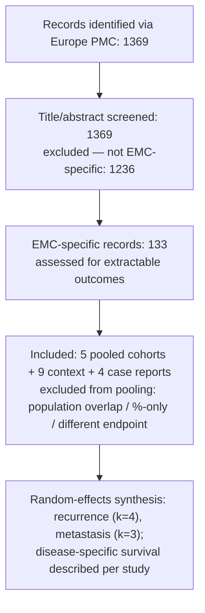

# Pooled outcomes of extraskeletal myxoid chondrosarcoma: a reproducible systematic review and meta-analysis

> **SEPARATE-TRACK MANUSCRIPT (EMC outcomes, not treatment).** A distinct paper on prognosis built on
> the patient registry — independent of the treatment-strategy track. Not the active treatment
> manuscript ([`emc-treatment-roadmap.md`](./emc-treatment-roadmap.md)). Folder map: [`README.md`](./README.md).

**Status: DRAFT v0.2 — full prose, pre-clinician-review, not for submission.**
**Author:** [Name], Independent researcher, [City, Country] — independent, personal-capacity
work, unconnected to the author's employer; prepared with AI assistance (see §7). A sarcoma
clinician/methodologist collaborator is being sought and is recommended before submission.
Results below are auto-generated from the project dataset and require the statistical upgrades in
`PROTOCOL.md` §6 before submission. Numbers current as of the last data build — regenerate from
`data/cancers/emc.json` before any version is circulated.

## Abstract (structured)
- **Background:** EMC is an ultra-rare NR4A3-rearranged sarcoma; its outcome data are
  scattered across small retrospective series with conflicting figures, leaving patients
  and clinicians without a dependable baseline prognosis.
- **Methods:** reproducible Europe PMC search; random-effects (DerSimonian–Laird,
  logit) pooling of proportions with I²/τ² over non-overlapping, explicit-count
  cohorts; pre-specified era-stratified, leave-one-out and registry-vs-all
  sensitivity analyses; population overlap handled by exclusion to context.
- **Results:** random-effects pooled local recurrence **28% (95% CI 14–47%,
  I²=90%)**, distant metastasis **38% (28–50%, I²=69%)**, disease-specific mortality
  **14% (9–23%)**, across 4/3/2 cohorts; with 4 cited individual cases described
  separately. Recurrence heterogeneity was extreme and tracked study era and selection
  (modern 19% vs older 39%; population-registry 12% vs all-series 28%).
- **Conclusions:** EMC carries a high long-term recurrence and metastasis burden with
  relatively preserved disease-specific survival, consistent with its indolent-but-
  metastasising biology. The recurrence estimate is dominated by heterogeneity rather than
  a stable central value: era- and selection-stratified analyses suggest a contemporary,
  population-based patient faces a substantially lower recurrence risk than older
  consultation series imply. All estimates should be read as a conservative floor, and the
  whole pipeline (search → extraction → pooling) is scripted and re-runnable.

## 1. Introduction

Extraskeletal myxoid chondrosarcoma (EMC) is a rare soft-tissue sarcoma defined by
rearrangement of *NR4A3* (most often *EWSR1::NR4A3*). Its natural history is distinctive and
clinically awkward: tumours are typically slow-growing and compatible with prolonged survival,
yet carry a high cumulative risk of local recurrence and of distant — especially pulmonary —
metastasis that can appear many years after primary treatment. Counselling a newly-diagnosed
patient therefore depends on dependable estimates of these long-term risks.

Those estimates are hard to come by. Because EMC is ultra-rare, the evidence base is a
patchwork of small, single-institution retrospective series and a few registries, spanning
several decades of changing imaging, surgery and pathology. Reported recurrence and metastasis
rates vary widely between series, and headline figures are easily distorted by referral/selection
bias (consultation series enrich for difficult cases) and by study era (older cohorts predate
modern management). No randomised or large prospective data exist, nor can they realistically be
generated for a disease this rare.

We therefore set out to pool EMC outcomes **reproducibly and honestly** — making the search,
extraction and statistics fully scripted; handling population overlap explicitly; quantifying
rather than hiding between-study heterogeneity; and pre-specifying era- and selection-stratified
sensitivity analyses so the temporal validity of each estimate is visible. The aim is not a
single authoritative number but a transparent, uncertainty-aware baseline that a clinician can
defensibly use and a patient can trust.

## 2. Methods
This synthesis follows the project's pre-specified protocol (`PROTOCOL.md`), summarised here.

**Eligibility.** We included cohorts, registries and case series reporting ≥1 of local
recurrence, distant metastasis, or disease-specific/overall survival in EMC (diagnosed
molecularly by *NR4A3* rearrangement and/or by accepted histology), with extractable counts.
Excluded *from pooling* but retained as context were: series giving only percentages without
denominators; populations overlapping a larger included dataset (e.g. a single institution
inside a national or SEER registry); and outcomes that are themselves the inclusion criterion
(e.g. the metastasis rate of a metastatic-only cohort). Individual case reports are described
separately and not meta-analysed.

**Search & extraction.** Records were retrieved reproducibly from the Europe PMC REST API
(`scripts/fetch-paper.mjs`) with a fixed query (`"extraskeletal myxoid chondrosarcoma" OR
"extra-skeletal myxoid chondrosarcoma" OR "chordoid sarcoma" OR (NR4A3 AND chondrosarcoma)`),
triaged for outcome content (`triage-literature.mjs`), and extracted into a structured registry
(`data/cancers/emc.json → registry`) in which every cohort carries explicit `{events,
denominator}` counts, a diagnosis-period, provenance, and population-overlap keys. The PRISMA
flow is shown in §3.1; a formal per-study risk-of-bias appraisal (adapted Newcastle–Ottawa) is
planned and **not yet complete** — see Limitations.

**Pooling.** For the manuscript we pool logit-transformed proportions by random effects
(DerSimonian–Laird), reporting I² and τ² heterogeneity with per-study forest **tables**
(`research/meta/meta-analysis.mjs`); a 0.5 continuity correction is applied only to 0%/100%
cells. A crude denominator-weighted proportion with a Wilson 95% CI is reported alongside and
powers the interactive patient-facing filter. A registry's disjoint strata are counted once.
Pre-specified sensitivity analyses are **leave-one-out**, **registry-only vs all-series**, and
**era-stratification** by diagnosis-period midpoint. Time-anchored survival (5/10/15-year) is
summarised per study rather than pooled, given differing follow-up and censoring. Per the
protocol's temporal-validity principle, era is an explicit sensitivity analysis — never a silent
adjustment — and pooled figures are interpreted as a conservative floor. The full pipeline
(search → extraction → pooling → figures) is scripted and re-runnable; the manuscript should cite
the commit hash of the data build it reports.

## 3. Results (auto-generated — regenerate before circulating)
### 3.1 Included studies
Pooled cohorts: Masunaga 2025 (Japan national registry, localized n=134 + metastatic
n=29, dx 2002–2022); Meis-Kindblom 1999 (n=117); US Sarcoma Collaborative (n=60, dx
2000–2016); Chiusole 2020 (Europe, n=49 curative-intent, dx 1980–2018); plus 4 cited
individual case reports. Context (not pooled — overlap / percentage-only /
different-endpoint): SEER 2004–2015 (n=270), Drilon 2008 (n=87), U Michigan (n=44),
Japan 2003 (n=42), China 2016 (n=40), Bishop 2019, Giner 2023.

PRISMA flow (snapshot; counts from the corpus + extraction):

### 3.2 Pooled estimates (random-effects, DerSimonian–Laird, logit scale)
Studies = pooled cohorts grouped by source (a registry's disjoint strata counted
once); individual case reports described separately, not meta-analysed. Generated by
`research/meta/meta-analysis.mjs` (regenerate before circulating).

| Outcome | RE pooled | 95% CI | I² | τ² | k | (crude, Wilson) |
|---|---|---|---|---|---|---|
| Local recurrence | **28%** | 14–47% | **90%** | 0.67 | 4 | 27% (22–32%) |
| Distant metastasis | **38%** | 28–50% | 69% | 0.12 | 3 | 36% (30–42%) |
| Disease-specific mortality | 14% | 9–23% | 62% | 0.10 | 2 | 14% (n=266) |

Per-study forest **table** — local recurrence (random-effects, k=4; study-level data in
`research/meta/results.json`):

| Study (diagnosis period) | events / n | proportion (95% CI) | weight |
|---|---|---|---|
| Masunaga 2025 (2002–2022) | 16 / 134 | 12% (7–19%) | 25% |
| Meis-Kindblom 1999 (undated) | 40 / 83 | 48% (38–59%) | 26% |
| US Sarcoma Collaborative 2022 (2000–2016) | 18 / 60 | 30% (20–43%) | 25% |
| Chiusole 2020 (1980–2018) | 14 / 49 | 29% (18–43%) | 24% |
| **Pooled (RE)** | **88 / 326** | **28% (14–47%)** | I²=90% |

(Distant-metastasis and disease-specific-mortality study-level rows are in `results.json`; final
journal forest plots should be produced with a proper plotting tool — see `AGENTS.md`.)

*Disease-specific mortality has only k=2 studies with extractable death counts;
its random-effects estimate is unstable and is reported descriptively alongside
per-study time-anchored survival.*

### 3.3 Heterogeneity & era sensitivity
Local recurrence shows **very high heterogeneity (I²=90%)**: random-effects pooling
widens the interval to 14–47%, the honest representation that crude pooling masked.
The spread tracks study era and selection — registry-only recurrence was 12%
(7–19%) vs 39% (22–59%) in older/undated consultation-weighted series.

Pre-specified sensitivity analyses (recurrence):
- **Leave-one-out:** pooled estimate ranged 22–36% (no single study dominates the point estimate, though it widens the CI).
- **Era-stratified** (diagnosis midpoint ≥2005 vs older/undated): **19% (7–43%) modern vs 39% (22–59%) older** — consistent with the temporal-validity thesis that older data overstates the recurrence burden faced by a patient diagnosed today.
- **Registry-only vs all-series:** 12% vs 28% — single-institution/consultation series report substantially higher recurrence than the population registry.

### 3.4 Contested questions
Radiotherapy and adjuvant chemotherapy in localized EMC: opposing findings driven by
indication bias (see the project's `evidenceQuestions`). Presented as adjudicated
controversies, not pooled effect estimates.

## 4. Discussion

Across non-overlapping cohorts, EMC shows a high long-term burden of **distant metastasis**
(pooled 38%, 95% CI 28–50%) and **local recurrence** (28%, 14–47%), alongside **relatively
preserved disease-specific survival** (pooled mortality 14%, though only two cohorts contributed
extractable death counts). This combination — frequent late recurrence and metastasis yet
comparatively low disease-specific mortality — is the quantitative signature of EMC's
indolent-but-metastasising biology: many patients survive for years, even with metastatic disease.

The most important result, however, is not any single point estimate but the **extreme
heterogeneity** of the recurrence figure (I²=90%). Crude pooling concealed this; random-effects
pooling widens the interval to 14–47%, the honest representation. The spread is not random — it
tracks **study era and selection**. In the population-based national registry, recurrence was 12%
(7–19%); across all series, 28%; and in older or undated, consultation-weighted series, 39%
(22–59%). Era-stratification told the same story (modern 19% vs older 39%), and leave-one-out
pooling (22–36%) showed that no single study drives the point estimate — only the width. Together
these support a **temporal-validity** reading: figures from older, referral-enriched cohorts
likely **overstate** the recurrence risk a contemporary, population-based patient faces, and
should be quoted with that caveat rather than as a fixed number.

Two clinical implications follow. First, the dominant long-term threat is **metastasis**, often
late and pulmonary, arguing for **prolonged surveillance** beyond the windows used for commoner
sarcomas. Second, because reported outcomes depend so heavily on era and selection, prognostic
counselling should anchor on **era-aware, population-based** estimates (the lower, registry
figures) as the contemporary baseline while acknowledging the wide uncertainty. Prognostic
factors (size, margin, stage at presentation, fusion partner) are treated qualitatively across
studies (see the project's `evidenceQuestions`); the data do not support pooled *adjusted* effect
estimates, and the radiotherapy/adjuvant-chemotherapy questions are presented as adjudicated
controversies (§3.4), not pooled effects, because of indication bias.

## 5. Limitations

The evidence base is small, retrospective and heterogeneous, and these estimates inherit those
weaknesses. (1) **Heterogeneity** is high (recurrence I²=90%), so the pooled recurrence value is
best read as an era/selection-structured range, not a central estimate. (2) The
**disease-specific mortality** pool rests on only k=2 cohorts with extractable death counts; its
random-effects interval is unstable and is reported descriptively alongside per-study
time-anchored survival. (3) Despite excluding overlapping populations to context, **residual
overlap** between multi-institution databases and population registries cannot be fully excluded.
(4) A formal **risk-of-bias** appraisal and a **molecular-confirmed-only** subset are pre-specified
but **not yet implemented**; consultation/referral series are flagged for selection bias but not
yet scored. (5) Pooling uses DerSimonian–Laird on the logit scale; a **GLMM / Freeman–Tukey
cross-check** is planned. (6) As with any literature synthesis, **publication bias** and
incomplete reporting may distort estimates, and **individual patient-level data** were
unavailable for most cohorts, precluding adjusted or time-to-event pooling. These are interim,
descriptive estimates to be refined as the protocol's planned upgrades land; none should be read
as a causal or definitive figure.

## 6. Reproducibility
Search, triage, extraction and pooling are scripted (`scripts/fetch-paper.mjs`,
`triage-literature.mjs`, `validate.mjs`; data in `data/cancers/emc.json`). Commit
hash to be cited in the final manuscript.

## 7. Author, contributions & disclosures

[Name] (independent researcher) designed and ran the reproducible search, extraction and pooling
pipeline and wrote the manuscript, independently and in a personal capacity (unconnected to the
author's employer). **AI tools (Anthropic Claude) were used for literature aggregation, the
pooling/sensitivity-analysis code, reference verification, and drafting; the author takes full
responsibility for all content.** AI is not, and cannot be, an author. A sarcoma
clinician/methodologist has not yet been involved; collaboration is sought and recommended,
particularly for the risk-of-bias appraisal and clinical interpretation, before submission. The
author declares no competing interests; the work received no funding and uses only public data.

## 8. References

Studies cited above, drawn from the registry citation map (`data/cancers/emc.json →
registry.citations`); every entry has a resolvable DOI or PMID/PMCID. **Draft — complete to the
target journal's style (full author lists, volume/issue/pages) before submission; do not infer
co-authors.** Pooled cohorts: refs 1–4; context (overlap / percentage-only / different-endpoint):
5–12; individual case reports: 13–16.

1. Masunaga T, et al. The role of radiotherapy and chemotherapy in extraskeletal myxoid chondrosarcoma. *J Orthop Surg Res.* 2025. doi:10.1186/s13018-025-06245-6; PMID 40885991.
2. Meis-Kindblom JM, et al. Extraskeletal myxoid chondrosarcoma: a reappraisal of its morphologic spectrum and prognostic factors based on 117 cases. *Am J Surg Pathol.* 1999. doi:10.1097/00000478-199906000-00002; PMID 10366145.
3. Gusho CA, et al. Extraskeletal myxoid chondrosarcoma: clinicopathological features and outcomes from the United States Sarcoma Collaborative database. *J Surg Oncol.* 2022. doi:10.1002/jso.27062; PMID 35962783.
4. Chiusole B, et al. Extraskeletal myxoid chondrosarcoma: clinical and molecular characteristics and outcomes of patients treated at two institutions. *Front Oncol.* 2020. doi:10.3389/fonc.2020.00828; PMID 32612944.
5. Brown JM, et al. Extraskeletal myxoid chondrosarcoma: clinical features and overall survival. *Cancer Treat Res Commun.* 2022. doi:10.1016/j.ctarc.2022.100530; PMID 35144048.
6. Drilon AD, et al. Extraskeletal myxoid chondrosarcoma: a retrospective review from 2 referral centers emphasizing long-term outcomes with surgery and chemotherapy. *Cancer.* 2008. doi:10.1002/cncr.23978; PMID 18951519.
7. Brodsky CN, et al. Extraskeletal myxoid chondrosarcoma: retrospective case series examining prognostic factors, treatment approaches, and oncologic outcomes. *Am J Clin Oncol.* 2023. doi:10.1097/COC.0000000000000988; PMID 36825763.
8. Kawaguchi S, et al. Extraskeletal myxoid chondrosarcoma: a multi-institutional study of 42 cases in Japan. *Cancer.* 2003. doi:10.1002/cncr.11162; PMID 12599237.
9. Shao R, et al. Clinicopathologic and radiologic features of extraskeletal myxoid chondrosarcoma: a retrospective study of 40 Chinese cases with literature review. *Ann Diagn Pathol.* 2016. doi:10.1016/j.anndiagpath.2016.04.004; PMID 27402218.
10. Bishop AJ, et al. Extraskeletal myxoid chondrosarcomas: combined modality therapy with both radiation and surgery improves local control. *Am J Clin Oncol.* 2019. doi:10.1097/COC.0000000000000590; PMID 31436747.
11. Huang SC, et al. Extraskeletal myxoid chondrosarcomas: the uncommon clinicopathologic manifestations and significance of TAF15::NR4A3 fusion. *Mod Pathol.* 2023. doi:10.1016/j.modpat.2023.100161; PMID 36948401.
12. Giner F, et al. Extraskeletal myxoid chondrosarcoma: p53 and Ki-67 offer prognostic value for clinical outcome — an immunohistochemical and molecular analysis of 31 cases. *Virchows Arch.* 2023. doi:10.1007/s00428-022-03453-x; PMID 36376703.
13. Gunasekaran K, et al. A case report of a patient presenting with extraskeletal myxoid chondrosarcoma. *Cureus.* 2026. PMC12863220.
14. Andrade Rojas JJ, et al. Extraskeletal myxoid chondrosarcoma with rhabdoid features in a pediatric patient. *Cureus.* 2025. PMC12285907.
15. Wang H, et al. Primary intracranial extraskeletal myxoid chondrosarcoma in a teenager. *Oncol Lett.* 2026. PMC12750061.
16. Jiang B, et al. Extraskeletal myxoid chondrosarcoma mimicking myoepithelial tumor. *Case Rep Pathol.* 2026. PMC13136674.
