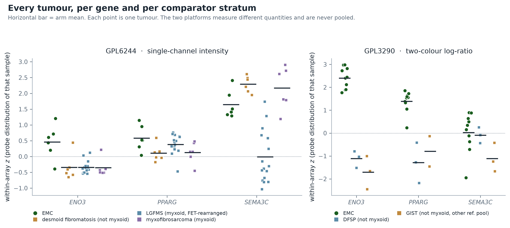

<!--
REPOSITORY NOTE (not part of the manuscript): the YAML block above is repository metadata read by
the systems checks; it is stripped at submission. Everything from the title below is the manuscript
proper, written so an external reader can reproduce it without reading this repository. Purely
operational notes (staged graph records, proposed map-edits, cross-lane coordination) live in
nr4a3-fusion-transcriptional-output-repo-notes.md. Supplementary material — the full 22-row
catalogue, the complete robustness and confound tables, the six PPARγ arms and the method detail —
is in nr4a3-fusion-transcriptional-output-SI.md.

SUBMISSION STATUS: submission-ready draft, not yet submitted.
  Primary target : Genes, Chromosomes & Cancer (Wiley) — Original Research Article (subscription/$0 route)
  Alternatives   : The Journal of Pathology (Wiley); British Journal of Cancer (Springer Nature)
  Preprint       : bioRxiv (Cancer Biology / Genomics), free open copy
  Furniture      : nr4a3-fusion-transcriptional-output-cover-letter.md,
                   nr4a3-fusion-transcriptional-output-submission-checklist.md
-->

# The direct-target catalogue of EWSR1::NR4A3 is three genes wide, and one gene survives calibration: an evidence-typed re-analysis of extraskeletal myxoid chondrosarcoma across three cohorts

**Running title:** The EWSR1::NR4A3 direct-target catalogue, calibrated

**Author:** Tristan D. McRae¹

¹ Independent Researcher. Correspondence: trimcrae@gmail.com

**Article type:** Original Research Article
**Keywords:** extraskeletal myxoid chondrosarcoma; EWSR1::NR4A3; NR4A3; transcriptional target; empirical null; gene-set calibration; rare sarcoma

---

## Abstract

Extraskeletal myxoid chondrosarcoma (EMC) is a rare sarcoma usually driven by the EWSR1::NR4A3
fusion, presumed to act as an aberrant transcription factor. We catalogued every published claim
that an NR4A3 fusion or native NR4A3 activates a named gene, recording evidence type, assay, cell
system and species. **Across 2,276 retrieved full-text documents, the set of genes for which any
NR4A3 chimera has been shown to bind DNA is three: *SEMA3C*, *PPARG* and *ENO3*.** We scored those
genes in three independent EMC cohorts on three platform families (GSE24369/GPL6244;
GSE4303/GPL3290; GSE28866/3SEQ), calibrating every array contrast against a size-matched empirical
null and grading four instrument controls first under a rule fixed in advance. Because a gene merely
higher in EMC is not thereby driven by the fusion, each was then put through four further tests:
exact sample-label permutation; the contrast recomputed against every comparator stratum separately;
adjustment for a matrix-content covariate chosen to exclude any EMC-derived gene; and, for *ENO3*
(muscle-specific β-enolase), a skeletal-muscle admixture control built on two pooled-muscle samples
the cohort contains. ***ENO3* survives all of them**: exact p = 7.3 × 10⁻⁵ and 1.3 × 10⁻⁴,
significant against every comparator stratum including myxoid-matched ones, 98th percentile of
14,120 genes in the 3SEQ deposit, and flat in three markers more muscle-restricted than it is.
***PPARG*'s strongest reading is circular** — GSE4303 is the cohort from which high *PPARG* in EMC
was first published — leaving evidence that does not survive correction. ***SEMA3C* survives
nothing**, reversing sign with the choice of comparator (+1.66 against low-grade fibromyxoid
sarcoma, −0.65 against desmoid fibromatosis). The aggregate target set reaches only 39% and 88% of
its null threshold, while the published EMC phenotype clears the same threshold 11.9-fold and
4.2-fold. No genome-wide chromatin experiment with an NR4A3 fusion was found, so "elevated in EMC"
and "driven by the fusion" remain inseparable for all three genes.

---

## 1 · Introduction

### 1.1 · The disease and the driver

EMC is a rare soft-tissue sarcoma defined by rearrangement of *NR4A3* (NOR-1/TEC). Subramanian *et al.*
describe it as "characterized by a balanced translocation most commonly involving t(9;22) (q22;q12)"
(PMID 15920699), which produces EWSR1::NR4A3; Brenca *et al.* express and assay both that chimera and
TAF15::NR4A3, "the commonest TAF15 (exons 1–6)–NR4A3 (exons 3–8) fusion" (PMID 31020999), with a
rarer *t(3;9)(q11-12;q22)* TFG::NR4A3 variant accounting for part of the remainder. NR4A3 is an orphan
nuclear receptor, and the chimera places its DNA-binding domain under a strong FET-family
transactivation domain. The disease's central molecular hypothesis is therefore straightforward: the
fusion is a transcription factor with an aberrant output, and that output is where the disease lives.

### 1.2 · The gap this addresses

The hypothesis is thirty years old, and the evidence under it is thin in a specific, checkable way.
Two questions are routinely conflated:

1. Which genes has anyone shown an NR4A3 chimera to physically bind and drive?
2. Which genes are high in EMC tumours?

The first is a mechanism claim; the second is an association. A gene can satisfy the second for reasons
that have nothing to do with the fusion — EMC's cell of origin, its myxoid and hypocellular
architecture, the anatomical site it arises in, or the gene being a generic matrix or proliferation
gene. This work separates the two by (a) cataloguing the mechanism claims with their evidence type
recorded per gene, (b) reading them back in tumour tissue with an explicit calibration for what an
arbitrary gene set does on the same platform, and (c) putting each gene through the specific
confounds that could have manufactured it.

### 1.3 · Why the calibration is the load-bearing part

On GSE4303/GPL3290, almost every gene set anyone scores comes back "higher in EMC" — PPARγ targets,
hypoxia metagenes, adipogenesis, chondroitin-sulfate biosynthesis, arginine metabolism. Sets with no
biological relationship to one another move the same way and by similar amounts. A raw Welch contrast
on the sample means uses the samples as its unit of variability and ignores that a set's per-sample
score is one draw from a distribution whose width depends on the set's *size* and on the platform. At
n = 10 versus 6, that width is large: the 95% band for an arbitrary 19-gene set on GPL3290 is
[−0.297, +0.376] SD, so a set can print t = 3.16 and remain indistinguishable from a random set of the
same size. No read on these platforms is interpretable until it is calibrated against a size-matched
random gene set drawn from the same platform's own genes. That calibration is the instrument this work
supplies, it is applied to the work's own headline result, and it is drawn in **Figure 2**.

---

## 2 · Materials and Methods

Full method detail — probe mapping, scoring floors, the circularity grading procedure, the
pre-registered decision rule and the motif-scan parameters — is in Supplementary Information §S1–S6.

### 2.1 · The evidence-typed target catalogue

Every claim in the primary literature that EWSR1::NR4A3, another NR4A3 fusion, or native NR4A3
transcriptionally activates a named gene was recorded with: the gene, the factor actually tested, the
assays, the cell system, the species of those cells, the expected direction in EMC, and the verbatim
sentence the classification rests on. Rows were read from retrieved full text, not from memory. Four
evidence classes were assigned per row (**Table 1**; the complete 22-row catalogue with verbatim
sentences is Supplementary Table S1).

**Table 1. The evidence classes, and how many genes are in each.**

| class | definition | genes |
|---|---|---:|
| **A** — fusion DNA-binding | a DNA-binding or promoter assay performed **with an NR4A3 fusion**. The strongest class. | **3** |
| **B** — native DNA-binding | the same assay class with **native NR4A3**. Transfer to the fusion is an assumption. | 16 |
| **C** — fusion expression only | the gene moves when the fusion is expressed; no binding assay. | 2 |
| **D** — EMC tumour expression only | measured in EMC tissue; no mechanism. | 1 |

### 2.2 · Datasets

Three independent EMC cohorts on three platform families were used. They are never pooled (§5).

**Table 2. The three cohorts.**

| cohort | platform | EMC | comparators | value kind |
|---|---|---|---|---|
| **GSE24369** | GPL6244, Affymetrix Gene ST | 6 | 29 — 17 FET-rearranged LGFMS + 6 myxofibrosarcoma + 6 desmoid fibromatosis | single-channel intensity |
| **GSE4303** | GPL3290, 42,000-spot two-colour cDNA | 10 | 6 (3 DFSP + 3 GIST) | two-colour log-ratio vs a reference pool |
| **GSE28866** | 3SEQ (GPL10999) | 4 | 32 non-EMC sarcoma libraries; 27 normal-organ libraries | 3′-end read density per peak |

Every class label above is the GEO sample title, not an internal grouping name. That distinction
decides §3.4: **23 of the 29 GPL6244 comparators are themselves myxoid tumours** — 17 low-grade
*fibromyxoid* sarcomas and 6 *myxo*fibrosarcomas — against 6 collagen-rich desmoid fibromatoses,
whereas none of the 6 GPL3290 comparators is myxoid. The two array cohorts therefore differ in the
one property the leading confound is built on, which makes the pair a natural control rather than
only a limitation.

- **GSE24369** — its comparator arm is itself FET-rearranged (LGFMS is *FUS::CREB3L2*), so a difference
  here is not merely "has a FET fusion". The array carries 42 samples; 6 EMC + 29 comparators accounts
  for 35, and the remaining 7 — **five solitary fibrous tumours and two pooled skeletal-muscle RNA
  samples** — are excluded from both arms rather than silently absorbed into either, so the
  arithmetic closes. The two muscle samples are named here because they are not merely surplus:
  they are the reference that makes the *ENO3* muscle-admixture objection measurable (§3.5).
  Linked series PubMed identifier 21536545.
- **GSE4303** — Subramanian *et al.*, *J Pathol* 2005;206:433–444 (PMID 15920699). See §3.8 on
  circularity. Two structural facts about this deposit bear on every number read from it. It is a
  **seven-platform series** — seven sibling print runs of one clone library — of which only GPL3290
  carries a usable EMC-versus-comparator contrast, so the 10 versus 6 here is not the whole deposit;
  and the **published** Subramanian cohort was 10 EMC against 26 other sarcomas, so a reader opening
  the accession will find comparators this analysis does not use. Separately, the verbatim sample
  annotations record the reference pool each two-colour hybridisation was run against: all 10 EMC
  and all 3 DFSP samples are on the CRH pool, while **the 3 GIST samples are on Universal Human
  Reference — a different pool** (§3.4).
- **GSE28866** — Brunner *et al.*, *Genome Biol* 2012;13(8):R75 (PMID 22929540). The EMC libraries are
  EMC_STT5525/5526/5527/5592; the normal arm is 27 libraries across six organs (bowel, breast, colon,
  kidney, lung, uterus). The 32 non-EMC sarcoma columns include two pairs of technical replicates of
  one specimen each (ESS_STT5520, LMS_STT516), so 32 libraries come from 30 specimens.

### 2.3 · Scoring and the size-matched empirical null

Probes were mapped to symbols per platform (GPL6244: 20,230 of 28,459 probes → 18,694 distinct
symbols; GPL3290: 27,203 of 43,008 probes → 14,932, through an EST-accession bridge). Each sample's
values were z-scored against that array's own probe distribution; a gene or set score for a sample is
the mean z over its readable members; the contrast is a Welch *t* on the EMC versus comparator
per-sample scores. **A gene with no probe is treated as an unread gene, never as an absent one.**
Floors were fixed at three samples per group for any contrast, and four genes / 0.4 coverage for any
set score.

Two quantities a raw Welch contrast does not supply are computed per platform. **The exact global
offset** is the per-sample mean z over every symbol the platform maps, contrasted EMC versus
comparator — the amount by which an arbitrary gene set is expected to differ for no set-specific
reason. **The size-matched empirical null** is 4,000 random gene sets of exactly the observed size,
drawn from a seeded random pool of the platform's own mapped symbols (seed 20260807; pool 4,000;
universe 18,694 for GPL6244, 14,932 for GPL3290), each scored exactly as the real set is. A random set
carries the offset too, so the null absorbs it by construction. The empirical p is the **two-sided**
fraction of draws at least as extreme, with +1/+1 smoothing. A set is reported as SET-SPECIFIC only
if the observed delta falls outside the 95% band of that null; single genes are calibrated the same
way at set size 1.

**The empirical p has a floor, and it is quoted as one.** With 4,000 draws and +1/+1 smoothing the
smallest two-sided value the design can return is 2/4001 = 0.0005. Every such value below is
therefore written **`p_emp ≤ 0.0005`** — the resolution limit of the null, not a measured value.
Three further limits of the pool are stated rather than left implied: it is a **seeded 4,000-symbol
random subsample** of each platform's mapped symbols (21% of GPL6244's 18,694, 27% of GPL3290's
14,932), the same pool is reused at every set size, and the gene under test is not excluded from it.

The null's own limit is stated rather than assumed: it is a **competitive** null, controlling for the
platform-wide offset and for set *size*, but not for gene–gene correlation inside a real pathway. It
is therefore anti-conservative for coherent sets and is a screen, not a test — which is why §2.6
supplies a self-contained null alongside it.

### 2.4 · Instrument controls, graded before the biology

Four known answers were graded before any biological read: ***ENO3*** (UP on both platforms — the
positive control), ***NR4A3*** (UP — tumour identity), ***PLAGL1*** (DOWN, PMID 16112421 — the
directional falsifier, the only prediction an arm-wide offset cannot manufacture) and ***SGK1***
(flat or down at transcript level despite 10/10 protein positivity, PMID 16756948 — the only row
whose published transcript and protein directions oppose).

Grading is on where the delta sits relative to its size-1 null, never on the raw delta. **The rule has
three outcomes, not two, and the third is the one that needs stating.** A reading whose delta falls
*outside* its null band is graded, and agrees or disagrees with the published direction. A reading
whose delta falls *inside* the band is **not a reading at this power** and is not graded either way —
a randomly chosen gene on that platform would land there too. And a control with no computable
contrast at all (for example, *NR4A3* on GPL3290, where four of six comparator spots for that probe
are missing, leaving two values against a floor of three) is likewise not graded.

Two consequences follow, and both are reported rather than left for a reader to find. First, the
denominator of any "n of n agree" statement is the number of **gradeable readings**, not the number
of controls — §3.3 gives both. Second, a control can only fail by landing outside its band in the
*wrong* direction, so a control with a wide band is weakly falsifiable; §3.3 therefore prints each
control's band beside its verdict, because a prediction that could not have been refused is not
evidence that it was tested. An absent reading is not a reading of absence, and the block whose job
is to tell a working instrument from a broken one is the last place that distinction may collapse.

### 2.5 · The 3SEQ arm, and its calibration

3SEQ measures 3′-end read density per peak. A gene's value in a library is the median across that
gene's peaks; an arm's value is the median across that arm's libraries. **No z-score, no test and no
confidence interval are used, because n = 4.** 3SEQ read density is not array intensity, and nothing
from this arm is pooled with the arrays.

A fold-change is not a reading until an arbitrary gene's fold-change is known, so the same two ratios
were computed for **every gene in the deposit** (14,120 genes; 13,708 with a computable EMC/normal
ratio, 13,247 with an EMC/sarcoma ratio) and each target gene is reported as a **percentile of that
distribution**. A gene whose comparator median is zero has no ratio and is excluded from the
distribution rather than ranked at the top. A percentile is a rank, not a p-value, and none is implied.

### 2.6 · Confound audit and sensitivity analyses

Four further readings were computed offline from the same cached inputs, all using the same scoring
primitives so the quantity tested is identical to the quantity reported. Every delta re-derived here
was asserted equal to the primary artifact before anything was written.

1. **Exact sample-label permutation** (a self-contained null). The EMC/comparator label is permuted
   over samples and the *real* gene set rescored, so correlation structure is carried through
   untouched. Arm sizes give 1,623,160 and 8,008 distinct assignments — few enough to **enumerate
   completely**, so every reported p is exact rather than sampled. Two-sided throughout.
2. **Every comparator stratum, separately.** The contrast is recomputed with the comparator arm
   restricted to one class at a time, to the myxoid classes only, to the non-myxoid classes only,
   and — on GPL3290 — to the **reference-pool-matched** comparators only. Nothing about the EMC arm
   or the reduction changes, so any movement is attributable to who is in the comparator arm. Each
   stratified contrast carries its own exact permutation p (C(29,6) = 475,020 down to
   C(13,10) = 286, all enumerated completely).
3. **Covariate-adjusted sensitivity.** Each gene's per-sample z is regressed on a matrix-content
   proxy and the contrast recomputed on the residuals. **The proxy is selected by provenance:** every
   candidate is checked against every gene this manuscript scores anywhere, and any gene drawn from
   an EMC-derived list is refused, because adjusting on a gene selected *because* it is high in EMC
   removes EMC signal by construction. The surviving panel is 11 structural genes with no published
   relationship to NR4A3 (*BGN, COL5A1, COL5A2, DCN, FN1, LUM, MMP2, POSTN, SPP1, TNC, VIM*). This is
   a sensitivity analysis, not a correction: a proxy that is itself downstream of the fusion would
   over-adjust, and that possibility is not excluded.
4. **The skeletal-muscle admixture control** (§3.5), plus a **leave-one-out jackknife** over the EMC
   arm, a **rank-based re-read** on within-array percentile, and **Benjamini–Hochberg** q-values
   across the per-gene permutation p-values within each platform.

### 2.7 · Reproduction

Every value in §3 derives from a committed artifact and is not re-typed from prose. All analyses are
CPU-only, use open-source tooling, and reproduce offline from cached inputs with no network access;
producers refuse to write if any row disagrees with the artifact that owns it. See Data and code
availability.

---

## 3 · Results

### 3.1 · Three genes are the whole of class A

**Table 3. The complete class-A catalogue — every gene for which an NR4A3 chimera has been shown to bind DNA.**

| gene | chimera assayed | assays | cells | citation |
|---|---|---|---|---|
| **SEMA3C** | EWSR1::NR4A3 (and TAF15::NR4A3, and native) | predicted NBRE-like site (GRCh38 chr7) + ChAP-qPCR, Strep-tagged | tBJ/ER transformed human fibroblasts | Brenca *et al.*, *J Pathol* 2019;249(1):90–101 (PMID 31020999) |
| **PPARG** | EWSR1::NR4A3 (and native, and NR4A3ΔC) | predicted perfect NBRE at −675 bp, band-shift, 2.8 kb human *PPARG* promoter luciferase, single-nucleotide NBRE mutant | CFK2 fetal **rat** chondrogenic cells; human promoter construct | Filion *et al.*, *J Pathol* 2009;217(1):83–93 (PMID 18855877) |
| **ENO3** (β-enolase) | TFG::NR4A3 — *not* EWSR1 | EMSA + ChIP + luciferase, two NBRE motifs upstream of the TSS, plus ChIP for H3 acetylation at the endogenous promoter | cultured lines over-expressing TFG-TEC | Kim *et al.*, *Mol Carcinog* 2016 (PMID 26310886) |

Three genes are the whole of class A, and this is the most consequential number in the report
(**Figure 3**). Across the retrieved corpus, the number of genes anyone has shown an NR4A3 chimera
physically binding and driving is three — and only one of the three (*SEMA3C*) combines the EWSR1
chimera, human cells and a chromatin assay. Three is the count in 2,276 retrieved full-text documents
across five corpora (§3.11), not a claim about all of the literature.

**Class B** — the same assay class with native NR4A3 — holds sixteen genes: *CCND1*, *SKP2*, *VTN*,
*SMPX*, *CDKN2AIP*, *GLS2*, *SDHA*, *COX5A*, *PDP1*, *VCAM1*, *ICAM1*, *BIRC3*, *NOX1*, *TH*, *LOXL2*,
*MYH7*. The strongest are *SMPX* (promoter deletion + site-directed mutagenesis + EMSA + ChIP, human
cells, PMID 27181368), *SKP2* (EMSA + ChIP) and *CDKN2AIP* (ChIP + mutation-reversed reporter, human
cells, PMID 39664575). **Class C** holds *SGK1* and *PLAGL1*; **class D** holds *NDRG2*. A published
negative control is carried alongside them: *CALD1*, whose promoter was searched for NOR-1 response
elements in the same experiment that found the *SMPX* site, and none were found (PMID 27181368). It
controls the inference "this gene moved, therefore NR4A3 bound it", not EMC biology.

### 3.2 · The native→fusion transfer assumption is measured to fail in both directions

Class B is only usable if a native-NR4A3 target is a fusion target. Two published measurements say the
transfer can fail, in opposite directions:

1. **A native target the fusion does not share.** Filion *et al.* put native NR4A3 and NR4A3ΔC on the
   same *PPARG* reporter the fusion activates: "the results show that both the native and truncated
   receptors do not activate PPARG transcription under the same conditions in which it is readily
   activated by the fusion protein."
2. **A fusion target the other fusion does not share.** Brenca *et al.*: "the ability of NR4A3 to
   recognize the SEMA3C target region was retained by the EWSR1-NR4A3 chimera but was impaired by
   TAF15-NR4A3."

So "NR4A3 binds X" does not license "EWSR1::NR4A3 drives X in EMC", and a native-NR4A3 cistrome is not a
fusion cistrome. Both halves of that are demonstrated in the primary literature, not argued here.

### 3.3 · The instrument controls

**Table 4. The four instrument controls, graded before any biological read.**

| control | GPL6244 | GPL3290 |
|---|---|---|
| ***ENO3*** (positive) | AGREES — d +0.8075, outside null, p_emp 0.0195 | AGREES — d +3.8113, outside null, p_emp 0.00054 |
| ***NR4A3*** (tumour identity) | AGREES — d +0.7415, outside null, p_emp 0.0240 | not measurable — 2 comparator values against a floor of 3 |
| ***PLAGL1*** (directional falsifier) | **inside null, not a reading at this power** — d −0.4235, band [−0.606, +0.529] | AGREES — d −2.134, outside null, p_emp 0.013 |
| ***SGK1*** (transcript/protein discordance) | AGREES (flat) — d −0.1807, band [−0.606, +0.529] | AGREES (flat) — d +0.6156, band [−1.314, +1.410] |

**Five of the six control × platform cells carried a computable contrast, and all five agree with the
published direction; none disagrees.** The sixth (*NR4A3* on GPL3290) is not measurable. Stated at the
weight it deserves: one of the five, *PLAGL1* on GPL6244, is **inside its null band** and is therefore
sign-concordant but not a reading at this power, and the two *SGK1* cells agree by way of a
prediction ("flat or down") that an inside-the-band reading satisfies — so those cells could not have
refused the prediction downward, and their bands are printed above for that reason.

The positive control is independently reproduced: *ENO3* matches a separately written module's
committed value to four decimal places on both platforms. The directional falsifier fires in the
right direction where it is gradeable: *PLAGL1*, the one gene in the catalogue with a published *down*
prediction, is −2.13 SD in EMC on GPL3290 and outside its null band, while every other class-A row
points up; no arm-wide artefact produces that pattern. Its published EMC reading is n = 6 by RT-PCR
against chondrocyte controls rather than sarcomas, and its fusion-expression evidence is differential
display in rat cells, so it is a strong argument against the offset explanation rather than a fully
independent falsifier.

### 3.4 · The global offset is not the problem — null-band width is

The measured global offset is tiny: −0.0084 SD on GPL6244 (t −1.592, over 18,694 mapped symbols) and
+0.0258 SD on GPL3290 (t +1.646, over 14,932). So the "most sets come back higher in EMC" pattern is
not an arm-wide shift. What it is instead: at n = 6 versus 29 and n = 10 versus 6, the sampling
variance of a set score is far larger than a Welch *t* on the sample means implies. On GPL3290 the 95%
null band for a 19-gene set is [−0.297, +0.376], so a raw delta of +0.330 with t = 3.16 sits inside it
(p_emp 0.083). **Figure 2** shows this directly.

Two structural properties of the comparator arms qualify every contrast below, and both are exploited
rather than merely conceded. The GPL6244 comparator arm is **23/29 myxoid**, so it largely matches EMC
on the matrix property that confound (b) of §4.1 is built on; the GPL3290 comparator arm is **0/6
myxoid**, so it does not. And the GPL3290 comparator arm is split across two reference pools — 3 DFSP
on CRH with all 10 EMC samples, 3 GIST on Universal Human Reference — which is a per-gene offset that
within-sample standardisation cannot remove, because standardisation removes a sample's mean and SD,
not a per-gene shift. §3.6 recomputes every class-A contrast against the pool-matched comparators
alone for that reason.

### 3.5 · Per gene, and what survives

**Figure 1** shows every tumour. **Figure 4** summarises which instrument supports which gene.

**Table 5. The three class-A genes on both array platforms, under an exact label-permutation test.**

| gene | class | GPL6244 Δ mean z (exact p, BH q) | GPL3290 Δ mean z (exact p, BH q) |
|---|---|---|---|
| **ENO3** | A · fusion | **+0.8075** (7.3 × 10⁻⁵, q 0.00044) | **+3.8113** (1.3 × 10⁻⁴, q 0.00063) |
| **PPARG** | A · fusion | +0.3071 (0.049, q 0.097) | +2.4809 (3.3 × 10⁻⁴, q 0.00083) — **circular, §3.8** |
| **SEMA3C** | A · fusion | +0.7298 (0.194, q 0.233) | +0.6228 (0.165, q 0.165) |

All three genes are positive-signed on both platforms — six of six readings, no reversal — and each
clears its size-matched single-gene null on at least one. But sign concordance across three genes is
what a coordinated programme predicts *and* what three individually EMC-associated genes predict, and
the three are not equally supported once the self-contained null is applied. Under exact sample-label
permutation, ***ENO3* is significant on both platforms after multiple-testing correction**, *PPARG* on
GPL3290 only — which §3.8 shows is the circular platform — and ***SEMA3C* does not reach significance
on either.** Clearing the size-matched null says a gene's delta is extreme relative to *other genes on
the platform*; it is not the same statement as the two arms differing for that gene. No row in the
panel changed sign in any leave-one-out fit, and none changed sign on the rank re-read, so nothing
here rests on one tumour or on the z-scoring convention.

**The muscle-admixture objection, and its answer (Figure 5).** *ENO3* is muscle-specific β-enolase and
EMC arises in deep soft tissue of the limb, so admixed skeletal muscle is the first alternative
explanation a reader should reach for. GSE24369 contains two pooled skeletal-muscle RNA samples, in
neither arm and used by no contrast, which fix the scale of what muscle looks like on this platform.
*ENO3* does sit near the top of the muscle array (percentile 0.996). **So do three markers that are
more muscle-restricted than it is — *ACTA1* 1.000, *MYH7* 1.000, *PYGM* 0.999, *MYL1* 0.998 — and none
of them separates the tumour arms** (EMC − comparator −0.057, −0.043, +0.142, −0.150 percentile
points, against *ENO3*'s +0.315). If the EMC arm carried skeletal muscle, the more muscle-restricted
markers would carry it too. This bounds admixture of *differentiated* skeletal muscle; it does not
exclude a myogenic differentiation programme within the tumour, which would move a marker with no
contaminating tissue present.

### 3.6 · The contrast against every comparator stratum separately

The comparator arm is not one thing, and the class-A genes behave very differently when it is taken
apart. Each cell is the same contrast with the same EMC arm, its own exact permutation p in brackets.

**Table 6. The same contrast against each comparator sub-arm separately.**

| gene | vs LGFMS only (17) | vs myxoid only (23) | vs non-myxoid only (6) | GPL3290, pool-matched only (3) |
|---|---|---|---|---|
| **ENO3** | **+0.805** (1.7 × 10⁻⁴) | **+0.808** (8 × 10⁻⁵) | **+0.807** (0.022) | **+3.515** (0.0035, the design floor) |
| **PPARG** | +0.197 (0.220) | +0.264 (0.100) | +0.473 (0.043) | +2.679 (0.0035) — circular |
| **SEMA3C** | **+1.657** (1.2 × 10⁻⁴) | +1.089 (0.046) | **−0.645** (0.015) | +0.113 (0.843) |
| *PLAGL1* | −0.169 (0.431) | −0.343 (0.183) | −0.733 (0.043) | −1.659 (0.042) |

***ENO3* is invariant** — +0.805, +0.808, +0.807 across strata that share almost nothing, and
significant against every one of them, including the myxoid-matched arm that controls confound (b) by
design. ***SEMA3C* reverses sign**: it is strongly up against LGFMS and significantly *down* against
desmoid fibromatosis, and on GPL3290 it is +0.113 (p = 0.84) against the pool-matched comparators. Its
apparent elevation is a property of which sarcomas happen to be in the comparator arm, not of EMC.
*PPARG* is intermediate and comparator-dependent.

The reference-pool correction matters and does not overturn *ENO3*: restricting GPL3290 to the three
pool-matched DFSP comparators moves it from +3.811 to +3.515, still the smallest p that a
three-comparator design can report (1/286 = 0.0035, quoted as the floor it is).

**Covariate-adjusted sensitivity.** The 11-gene matrix panel separates the arms on GPL6244
(Δ −0.518; EMC scores *lower*) and essentially not at all on GPL3290 (Δ +0.006). That asymmetry is the
method's own control: a covariate that does not differ between the arms cannot move a contrast, and on
GPL3290 nothing moves (*ENO3* retains 100%, *PPARG* 97%, *SEMA3C* 99%). On GPL6244, where the covariate
does differ, *ENO3* retains 75% of its delta (+0.807 → +0.608), *PPARG* 32% (+0.307 → +0.099), and
*SEMA3C* rises to 171% (+0.730 → +1.246) — it is high in EMC *despite* EMC's lower matrix score, which
is consistent with its elevation being comparator-driven rather than matrix-driven.

### 3.7 · A third cohort, calibrated against its own deposit

The 3SEQ arm carries both contrasts in one experiment: 32 non-EMC sarcoma libraries on an unrelated
technology, and 27 normal-organ libraries. The median gene in this deposit has an EMC/normal ratio of
1.05 and an EMC/sarcoma ratio of 1.05; the 95th percentiles are 1.89 and 1.89.

**Table 7. The 3SEQ cohort, calibrated against all 14,120 genes in the same deposit.**

| gene | peaks | EMC/normal | percentile | EMC/sarcoma | percentile |
|---|---:|---:|---:|---:|---:|
| **ENO3** | 2 | 2.53× | **98.0th** | 2.02× | **95.9th** |
| **SEMA3C** | 3 | 1.82× | 94.2nd | 1.66× | 92.6th |
| **PPARG** | 5 | 1.42× | 84.0th | 2.12× | **96.4th** |
| *NR4A3 (control)* | 3 | 1.96× | 95.6th | — (sarcoma median 0.000) | — |

All three class-A genes are higher in EMC than in both comparator arms of a cohort and a technology
that share no probe design with either array, and *ENO3* is in the top 2% of 14,120 genes on the
normal axis. **The ceiling is that "top 2%" is not "highest":** *RET* (3.51×, 99.1st), *VCAN* (3.33×,
99.0th) and *CSPG4* (3.31×, 99.0th) all rank above *ENO3* in this deposit, so a high percentile here
places a gene in the upper tail of an EMC-versus-comparator distribution and does nothing more.
*PPARG* at the 84th percentile against normals is the weakest cell in the table and is the honest
reading of its 1.42×.

*NR4A3* is the internal control here and is not a result: its median across the 32 non-EMC sarcoma
libraries is 0.000 and it is detected in the EMC arm — the fusion's own 3′ partner behaving as the
disease definition requires, in a cohort this work did not choose and on an assay it did not design.
It licenses reading the other rows; read as a finding it would be circular, because EMC is *defined*
by an *NR4A3* rearrangement. The normal arm is a tissue panel, not matched adjacent tissue: the 27
normals are visceral organs with almost no soft tissue, so a gene high in EMC against that panel is
not thereby EMC-specific rather than mesenchymal-lineage-specific.

### 3.8 · The circularity flag fired twice

The fetched GEO record for GSE4303 reads "Gene expression profile of extraskeletal myxoid
chondrosarcoma", with linked PubMed identifier 15920699 and contributor "Matt van de Rijn". **GSE4303
is the Subramanian *et al.* (2005) cohort.** Two consequences, and the second was not drawn in the
first version of this analysis:

1. The Filion Table 2 gene set (set E, Supplementary Table S2) is a gene list scored on the data it
   was derived from, and is reported for completeness only.
2. **The *PPARG* gene row on GPL3290 is circular in the same sense.** Subramanian *et al.* reported,
   from these arrays: *"High levels of expression of PPARG and the gene encoding its interacting
   protein, PPARGC1A, in most EMCs."* Measuring *PPARG* high in GSE4303 therefore re-derives a
   published finding from the data it was published from. It is not independent evidence, and a
   circularity grade applied to a gene *set* but not to a gene is not a grade. With that cell set
   aside, *PPARG*'s remaining evidence is GPL6244 (q = 0.097, which does not survive correction) and
   the 3SEQ cohort.

Set D and the whole of GPL6244 are unaffected, which is why the replication in §3.9 stands.

### 3.9 · The aggregate does not clear its null; the published EMC phenotype clears it 12-fold

**Table 8. Gene-set scores against their own size-matched nulls, with the threshold each had to clear.**

| set | GPL6244 | GPL3290 |
|---|---|---|
| **A · fusion DNA-binding targets** (3) | no score — 3 genes, floor is 4 | no score — 3 genes |
| **B · native NR4A3 DNA-binding targets** (16) | d −0.0675, reached 43% of threshold → not distinguishable | d −0.1453, reached 43% → not distinguishable |
| **A+B pooled** (19) | d +0.0403, **reached 39%** → not distinguishable | d +0.3301, **reached 88%** → not distinguishable |
| **D · published EMC phenotype** — EMC vs 137 other translocation sarcomas, independent platform and cohort (21) | d +1.1311, p_emp ≤ 0.0005, **11.9× threshold** → SET-SPECIFIC UP | d +1.4783, p_emp ≤ 0.0005, **4.2× threshold** → SET-SPECIFIC UP |

This is the informative shape, and the "reached X%" column is what makes the negative interpretable
rather than a shrug. The published EMC transcriptional phenotype — a gene list derived on a platform
used nowhere in this work (Affymetrix U133A) from a cohort used nowhere in this work (MSKCC) —
replicates cross-platform and cross-cohort at the null's resolution floor on both readable series,
overshooting its threshold **11.9-fold and 4.2-fold**. On the same instrument, in the same run, the
aggregate direct-target set reaches 39% and 88% of the threshold it would have had to clear. So the
contrast demonstrably *can* see EMC at very large margin and does not see the aggregate target set —
which is a bounded negative, not an underpowered one.

The native-NR4A3 set behaves as Filion's own measurement predicts: class B is flat-to-negative on both
platforms, with *VCAM1* significantly down on both. The vascular/inflammatory native-NOR-1 programme
does not transfer to EMC tissue — concordant with the same paper's finding that native NR4A3 does not
activate the promoter the fusion does (§3.2). Set D is a test of the EMC phenotype, not of the fusion:
a gene can be in it because of EMC's cell of origin, so its replication says the instrument reads EMC,
not that the fusion drives those genes.

**One result becomes more interesting rather than weaker.** The A+B aggregate does *not* beat an
arbitrary set of the same size on either platform — yet on GPL3290 it *does* differ between the arms
more than chance relabelling would give (exact p = 0.011). That is not a contradiction; it is the
cleanest available demonstration of this paper's own thesis. The aggregate target set really is higher
in EMC, **and so is almost any set of that size on that platform**, which is precisely why a
competitive null is the one that decides whether a gene set has told you anything.

### 3.10 · A sequence axis, and its limits

NR4A3's monomer site is the NBRE, 5′-AAAGGTCA-3′ (PMID 1902986); the dimer site is the NurRE
(PMID 9315667). A TSS-centred window of −10 kb/+15 kb — fixed in advance on published regulatory
architecture, before any sequence was read — was scanned on both strands with positional
de-duplication, and calibrated against a dinucleotide-preserving shuffle of the same window (2,000
shuffles, holding GC and CpG content exactly) and a 198-window background panel assembled for an
unrelated question. Full parameters and the one-mismatch analysis are in Supplementary §S6.

***ENO3* carries 4 exact NBREs, more than its own composition predicts** (shuffle-null p = 0.034;
GC-matched background p = 0.018). *PPARG* carries 3, which is what composition predicts (p = 0.227).
***SEMA3C* carries none.** The background panel averages 1.15 exact NBREs per 25 kb window, so a
single hit is what an arbitrary window contains anyway.

Four things this does not establish. **A motif is not occupancy** — only a chromatin experiment shows
binding, and §3.11 records that none exists for any NR4A3 fusion. **The *SEMA3C* zero does not
contradict Brenca *et al.***, who report a predicted NBRE-*like* site assayed by ChAP-qPCR; an
NBRE-like site is by construction not an exact NBRE. That class was therefore scanned too, and
*SEMA3C*'s 39 one-mismatch sites — the most of any gene scanned — are **exactly what its own
composition predicts** (null mean 33.7, p = 0.203; GC-matched p = 0.118), with only the
composition-naive raw rank suggesting enrichment (p = 0.040) in the most AT-rich window of the set.
**The hit positions do not reproduce the published coordinates** for either *ENO3* or *PPARG*, both of
which numbered from their own promoter constructs. **A distal element outside the window is untested
by construction.**

### 3.11 · No NR4A3-fusion cistrome was retrieved — a bounded negative about a search

The obvious discriminator between *driving* and *correlation* is a cistrome, so five corpora totalling
**2,276 full-text documents** (3,669 catalogued Europe PMC records) were searched. 153 of those
documents name both a genome-wide chromatin method (ChIP-seq, CUT&RUN, CUT&Tag, ChIP-exo, ChIP-PET,
ATAC-seq, ChAP) and NR4A3/NOR-1/TEC. **None applies one to an NR4A3 chimera.** The only chromatin
experiment performed with a fusion anywhere in the corpus is Brenca *et al.*'s ChAP-qPCR —
target-specific amplification at one locus, not a genome-wide map.

The relevant near-misses are named so the negative cannot be read as ignorance of them. **Native**
NR4A3 peak sets do exist: a public census of NR4A ChIP-seq experiments recovers six NR4A3 datasets
(GSE186199, dendritic cells) carrying 53–154 peaks each, which is 147–544× shallower than the NR4A1
sets in the same census and too shallow to recover a locus a published chromatin experiment already
places NR4A3 at — so their silence at *SEMA3C* and *ENO3* is uninterpretable rather than negative.
Deep NR4A1 sets (ReMap2022, 83,773 peaks) do recover both *SEMA3C* and *ENO3*, but NR4A1 is a
paralogue, not the fusion. Stated as what it is: no EWSR1::NR4A3 cistrome has been retrieved in 2,276
documents across five corpora. That is not "no such dataset exists" — this searched retrieved full
text, not all of PubMed, and a dataset can be deposited without a paper. What it does show is that a
fusion cistrome is an open, unclaimed experiment rather than a dataset someone forgot to fetch.

### 3.12 · What the instruments say together

**Figure 4** puts the ordering on one screen. ***ENO3* is supported by every instrument applied
here**: both array platforms under an exact permutation test and after multiple-testing correction;
every comparator stratum separately, including the myxoid-matched and reference-pool-matched arms;
75% of its delta retained under matrix adjustment on the platform where that covariate differs, and
100% on the platform where it does not; the top 2% of 14,120 genes in an independent cohort on an
unrelated technology; flat muscle markers that are more muscle-restricted than it is; and more exact
NBREs than its own composition-matched null. ***SEMA3C* is the mirror image** — it fails the
permutation test on both platforms, reverses sign with comparator choice, is p = 0.84 against
pool-matched comparators, and carries no exact NBRE. ***PPARG* sits between them, and lower than it
first appeared**, because its strongest cell is circular.

**None of this converts association into causation for any of the three.** Every axis here is
correlative; the discriminating experiment (§4.3) remains unperformed; and ordering three genes by
independent support is not evidence that any of them is bound by the fusion in EMC.

> **Figure 1. Every tumour, per gene and per comparator stratum.** Each point is one tumour; the
> horizontal bar is the arm mean. Values are within-array *z* against that sample's own probe
> distribution. n = 6 EMC vs 29 comparators (GPL6244) and 10 vs 6 (GPL3290). **The two platforms
> measure different quantities — single-channel intensity and two-colour log-ratio against a
> reference pool — and are never pooled**, so no comparison across the two panels is licensed. The
> comparator strata are drawn separately because *SEMA3C*'s contrast changes sign between them
> (§3.6). No panel asserts that the fusion binds or drives any gene.

> **Figure 2. A set score means nothing until an arbitrary set of the same size is scored too.** Grey
> histogram: 4,000 random gene sets of exactly the observed size, drawn from the platform's own mapped
> symbols under a fixed seed and scored identically to the real set. Shaded band: the central 95%.
> Vertical line: the observed delta. The annotation gives the value the set had to reach to clear the
> band and how far it got. Top row: the A+B direct-target set reaches 39% and 88% of its threshold.
> Bottom row: the published EMC phenotype overshoots by 11.9× and 4.2×. **This null controls the
> platform offset and set size, not gene–gene correlation**, so it is anti-conservative for coherent
> sets; §3.5 supplies the complementary exact label-permutation test.

> **Figure 3. The entire published direct-target catalogue of an NR4A3 chimera is three genes.**
> Counted across 2,276 retrieved full-text documents in five corpora (§3.11). **This is a count of
> what has been published and retrieved, not of what exists** — a claim about a search. Class B
> requires the transfer assumption that §3.2 shows failing in both directions.

> **Figure 4. Independent instruments applied to the three published direct targets.** **The columns
> are deliberately not commensurable and no glyph is scaled by effect size**, so no area comparison
> across columns is possible: colour encodes only whether that instrument supported the gene, and each
> cell prints its own statistic in its own units. The amber cell marks the reading that is *circular*
> — *PPARG* on GPL3290, scored on the cohort from which high *PPARG* in EMC was first published
> (§3.8) — which is neither support nor absence. The 3SEQ column carries no test: at n = 4 it is a
> percentile within that deposit's own distribution. **No cell asserts that the fusion binds or drives
> any gene**, and §3.11 records that no NR4A3-fusion cistrome has been reported.

> **Figure 5. The *ENO3* muscle-admixture objection, and its answer.** *ENO3* is muscle-specific
> β-enolase and EMC arises in deep soft tissue of the limb. Horizontal axis: how muscle-restricted a
> gene is, as its mean within-array percentile in the two pooled skeletal-muscle RNA samples GSE24369
> contains. Vertical axis: the EMC − comparator difference in within-array percentile points. **The
> two muscle samples are in neither arm and no contrast in this paper uses them**; they fix the scale
> only. Three markers more muscle-restricted than *ENO3* sit at or below zero. **This bounds admixture
> of differentiated skeletal muscle; it does not exclude a myogenic differentiation programme in the
> tumour itself**, which would move a marker with no contaminating tissue present.

---

## 4 · Discussion

### 4.1 · What these data are consistent with, and what they are equally consistent with

A target gene that is up in EMC is consistent with the fusion driving it, and equally consistent with:
(a) EMC's cell of origin expressing it; (b) EMC's myxoid, hypocellular architecture; (c) a
platform-wide offset; (d) the gene being a generic proliferation or matrix gene; (e) the anatomical
site EMC arises in.

This version narrows more of that list than its predecessor did. The null calibration removes (c) and
part of (d). **(b) is now partly measured rather than conceded**: the GPL6244 comparator arm is 23/29
myxoid, so it is largely matched to EMC on matrix architecture, and *ENO3* is unchanged against the
myxoid-only arm (+0.808, p = 8 × 10⁻⁵); adjusting for an 11-gene matrix proxy chosen to contain no
EMC-selected gene leaves 75% of its delta where the covariate differs between arms and 100% where it
does not. **(e) is bounded for *ENO3*** by the muscle control of §3.5. What remains genuinely
unremoved is **(a)**: nothing in these datasets separates a gene the fusion drives from a gene EMC's
cell of origin expresses, and the 3SEQ normal-organ arm does not help, because six visceral organs are
not the soft tissue EMC arises in.

### 4.2 · What is new here

Four things, each incremental; nothing here is a first-in-field claim:

- **The catalogue is evidence-typed and the class-A count is stated.** The number of genes with a
  DNA-binding assay against an NR4A3 chimera is three, and the field's prose does not usually say so.
- **The calibration.** A size-matched empirical null on the platform's own genes converts a pervasive
  and uninformative "higher in EMC" into a statement that can be refused — and it refuses this work's
  own aggregate, at a quantified distance (39% and 88% of threshold) rather than as a bare negative.
  The instrument is not EMC-specific: any rare-tumour series with a small index arm and a
  heterogeneous comparator arm has the same failure mode, and the null costs one seeded resampling.
- **The confound audit.** Comparator composition read from the GEO sample titles rather than from a
  grouping label; the contrast recomputed against every stratum, against the reference-pool-matched
  comparators, and against a provenance-filtered matrix covariate; and a skeletal-muscle control for
  the one gene where that objection is obvious.
- **The ordering.** The three direct-target genes are not equally supported, and one of them
  (*SEMA3C*) is supported by nothing that survives its own comparator being varied.

### 4.3 · What would discriminate, named rather than hand-waved

1. **A cistrome in the right cell.** An NR4A3 ChIP-seq peak set with the *fusion* expressed,
   intersected with these expression reads: a gene that is up in EMC *and* carries a fusion-bound NBRE
   is driven; a gene that is up with no peak is correlated. The nearest existing dataset is Haller
   *et al.* (2019, *Nat Commun* 10:368, PMID 30664630): NR4A3 ChIP-seq in three human acinic cell
   carcinoma tumours, with a de-novo NBRE motif recovered in all three (processed data on Zenodo, doi
   10.5281/zenodo.1483691; raw data on EGA, EGAS00001002795, controlled access). The caveat is
   load-bearing: acinic cell carcinoma carries *native* NR4A3 up-regulated by enhancer hijacking, not
   a fusion. Given §3.2's measurement that native NR4A3 does not activate the *PPARG* promoter the
   fusion does, that dataset answers "where does the NR4A3 DNA-binding domain go in a human tumour"
   and not "where does EWSR1::NR4A3 go". It must never be cited as the latter.
2. **Fusion knockdown or degradation in a genuinely fusion-positive EMC model, with RNA-seq.** No such
   experiment was retrieved.
3. **Fusion-type-stratified EMC expression data.** Brenca *et al.* show class-3 versus class-4–6
   semaphorins separating EWSR1- from TAF15-translocated EMC, but no readable series records which
   fusion each EMC sample carries, so every EMC arm here is a mixture and any fusion-specific signal is
   attenuated by an unknown amount.
4. **A within-EMC test against fusion level was attempted and does not discriminate at this n.**
   Holding disease constant and correlating each gene against *NR4A3* level inside the EMC arm is the
   only axis in these data that speaks to fusion *output* rather than EMC membership. It gives
   r = +0.37 (n = 6) and −0.35 (n = 10) for *ENO3* on the two platforms — opposite signs, no
   information. Reported so that the axis is not proposed again as though untried; *NR4A3* array
   signal is in any case the 3′ partner under a foreign promoter, not the fusion transcript.
5. **An NBRE motif scan** — performed (§3.10). It cannot demonstrate binding and did not resolve the
   question. **What remains undone on this axis is not another scan**: sequence cannot settle
   occupancy, and the discriminating experiment is item 1.

---

## 5 · Limitations

These are ceilings, not caveats: each one bounds what any sentence in §3 may be read to mean.

1. **n = 4, 6 and 10 EMC.** Nothing here survives being described as a distribution, and no result
   should be read as a population estimate.
2. **The three cohorts are never pooled, and must never be.** 3SEQ 3′-end read density is not array
   intensity; single-channel intensity and two-colour log-ratio are not the same quantity either. The
   concordance in §3.5–3.7 is sign agreement across three independent measurements, which is weaker
   than a combined estimate and is deliberately reported as the weaker thing.
3. **Transcript, not protein.** *SGK1* is the worked example: its published protein and transcript
   directions oppose, and this instrument can only see the second.
4. **No occupancy, and therefore no causality from the fusion.** Nothing here shows any gene being
   bound by EWSR1::NR4A3 *in EMC*. The class-A assays were performed in engineered human fibroblasts,
   in rat chondrogenic cells, and with a chimera (TFG::NR4A3) that is not the common one.
5. **The normal arm is a six-organ tissue panel, not matched adjacent tissue**, so it cannot separate
   EMC-specific from mesenchymal-lineage-specific.
6. **Comparator arms differ between platforms.** §3.6 turns this into a designed contrast rather than
   only a limitation, but the strata are small — 6 desmoids, 3 DFSP, 3 GIST — and a stratified
   contrast at n = 3 comparators can report no p below 0.0035 however large the effect.
7. **Fusion type is unrecorded in every series**, so each EMC arm mixes EWSR1::NR4A3 with whatever
   TAF15::NR4A3 and rarer variants it contains, attenuating any fusion-specific signal by an unknown
   amount.
8. **Multiple testing is corrected for the per-gene permutation results only.** The size-matched
   empirical p-values and the set-level and stratified permutation p-values remain uncorrected; the
   stratified panel in particular reports four contrasts per gene.
9. **The size-matched null is competitive and anti-conservative for coherent sets**; the exact
   permutation null is self-contained but cannot make three genes into more than three genes. The two
   disagree for *SEMA3C*, which is reported rather than reconciled.
10. **GPL3290 is relative**, and its comparator arm spans two reference pools (§3.4). Only the
    between-group contrast is interpretable, never an absolute level, and its probe→symbol mapping
    runs through an EST accession bridge, so a gene unreadable there may be absent from the bridge
    rather than from the array.
11. **The 3SEQ rows are medians over very few peaks** — 2 (*ENO3*), 3 (*SEMA3C*), 5 (*PPARG*) — and
    the percentile calibration is a rank within one deposit, not a test.
12. **The covariate adjustment is a sensitivity analysis, not a correction.** If a panel gene is
    itself driven by the fusion the adjustment removes real signal; that possibility is not excluded,
    only made unlikely by the provenance filter.
13. **The muscle control bounds differentiated-muscle admixture only**, not a myogenic programme
    intrinsic to the tumour.
14. **The motif scan speaks to sequence, never to occupancy**, is restricted to a fixed −10 kb/+15 kb
    window, and does not reproduce the published site coordinates for either *ENO3* or *PPARG*.
15. **Nothing here is an efficacy, selectivity, safety, therapeutic-window or clinical-readiness claim**
    for any agent, target or gene, and expression data cannot become that evidence. No drug, dose,
    schedule or patient population is named or implied.

---

## 6 · Conclusion

The published direct-target catalogue of an NR4A3 chimera is three genes wide, and the three are not
equally supported. *ENO3* is elevated in EMC on both readable array platforms under an exact
permutation test and after multiple-testing correction, against every comparator stratum separately
including the myxoid-matched and reference-pool-matched arms, in the top 2% of 14,120 genes in an
independent cohort on an unrelated technology, with a skeletal-muscle admixture control that does not
explain it and more exact NBREs than its own composition-matched null. *PPARG*'s strongest reading is
circular, and what remains does not survive correction. *SEMA3C* survives none of these tests and
changes sign with the choice of comparator. The aggregate target set does not clear its size-matched
null, reaching 39% and 88% of the threshold, while the published EMC transcriptional phenotype clears
it 11.9-fold and 4.2-fold on the same instrument in the same run — so the instrument demonstrably
reads EMC and does not read the aggregate.

The binding constraint is not sample size and not statistics. It is that class A is three genes wide,
and that no genome-wide chromatin experiment performed with an NR4A3 fusion was retrieved in 2,276
full-text documents across five corpora (§3.11 — a bounded statement about a search, not a claim that
none exists anywhere). Until such a dataset is in hand, "up in EMC" and "driven by the fusion" cannot
be told apart for any gene named here, *ENO3* included.

---

## Data and code availability

All primary data are public and no new data were generated. Every analysis is CPU-only and reproduces
without a login, a rental or a GPU.

**Public datasets.**

| accession | platform | source | primary publication |
|---|---|---|---|
| GSE24369 | GPL6244 | NCBI GEO | linked series PubMed identifier 21536545 |
| GSE4303 | GPL3290 | NCBI GEO | Subramanian *et al.*, *J Pathol* 2005;206:433–444 (PMID 15920699) |
| GSE28866 | 3SEQ / GPL10999 | NCBI GEO series supplementary peak tables | Brunner *et al.*, *Genome Biol* 2012;13(8):R75 (PMID 22929540) |

Gene-set libraries are served through Enrichr (Kuleshov *et al.*, 2016): `ChEA_2022`,
`TRRUST_Transcription_Factors_2019`, `TF_Perturbations_Followed_by_Expression` and
`MSigDB_Hallmark_2020`. Each term used is pinned verbatim in the code. Referenced but not used as data:
Haller *et al.* (2019) NR4A3 ChIP-seq — processed data Zenodo doi 10.5281/zenodo.1483691 (open), raw
data EGA EGAS00001002795 (controlled access); §4.3 states why it does not answer this question. The
NR4A ChIP-seq census of §3.11 reads public ChIP-Atlas and ReMap2022 records, including GSE186199.

**Code and derived artifacts.** All are openly available in the project repository
(https://github.com/trimcrae/rare-cancers), which will be archived to Zenodo with a citable DOI at
submission:

| artifact | producer |
|---|---|
| `nr4a3-fusion-targets.json` — evidence table, global offsets, null calibrations, per-gene and per-set scores, controls, circularity grade | `nr4a3_fusion_targets.py` |
| `emc-expression-panels.json` → `gene_reads` — the independent second implementation of the per-gene array reads | `emc_expression_panels.py` |
| `gse28866-tumour-vs-normal.json` → `per_gene.values` and `ratio_calibration` — the 3SEQ arm and its percentile calibration against all 14,120 genes in the deposit | `gse28866_tumour_vs_normal.py` |
| `nr4a3-fusion-targets-robustness.json` — exact label-permutation p-values, leave-one-out jackknife, rank-based re-read and BH q-values | `nr4a3_fusion_targets_robustness.py` |
| `nr4a3-fusion-targets-confounds.json` — comparator composition, the muscle-admixture control, every stratified and reference-pool-matched contrast with its own exact permutation p, the covariate-adjusted sensitivity analysis, minimum detectable effects, and the within-EMC axis | `nr4a3_fusion_targets_confounds.py` |
| `figures/fig1`–`fig5` (PNG + PDF) and `figures/figure-provenance.json` | `nr4a3_fusion_targets_figures.py` |
| `emc-ret-target-scan.json` → `part_1_nbre_scan` — NBRE/NurRE counts, the dinucleotide-preserving shuffle null and the background-panel ranks. Ensembl sequences are cached, so the scan re-derives offline | `emc_ret_target_scan.py` |
| offline arithmetic guards | `tests/test_nr4a3_fusion_targets.py`, `tests/test_nr4a3_fusion_targets_confounds.py`, `tests/test_nr4a3_fusion_targets_figures.py` |

The null draw is seeded (20260807) and the pool size, seed and universe are recorded per platform, so
every empirical p is reproducible from the committed code and the public accessions alone. Each
producer re-derives its inputs and refuses to write if any row disagrees with the artifact that owns
it; the figure generator stamps the content hash of every artifact it read.

## Funding

None.

## Conflicts of interest

The author declares no competing interests.

## Ethics approval and consent

Not required. This study analysed only publicly available, de-identified gene-expression deposits and
generated no new human or animal data. No individual is identifiable from anything reported here.

## Author contributions

T.D.M. is the sole author and is responsible for the study design, analysis, interpretation and
manuscript.

## Use of generative AI

This work was carried out with the assistance of a large language model–based research agent (Claude,
Anthropic), used for literature extraction, analysis code, statistical computation and manuscript
drafting. All analyses are executed by committed, deterministic, independently re-implemented and
offline-reproducible code (see Data and code availability), and were reviewed by the author, who takes
full responsibility for the content. No AI tool is listed as an author, in accordance with journal
policy.

## Acknowledgements

None.

---

## Appendix A · Superseded values and corrected claims

Retained so that a superseded number stays quotable as history and not as a current fact.

| claim, as previously written | status | what replaced it |
|---|---|---|
| "That pattern is the shape of a platform-wide offset." | **superseded 2026-08-07** | The global offset is −0.0084 SD (GPL6244) and +0.0258 SD (GPL3290), an order of magnitude below the effects in question. The remedy is unchanged — the null absorbs both — but the mechanism is null-band *width* at these arm sizes, not offset (§3.4). |
| GSE24369's comparator arm described as containing "6 fibrosarcoma", and the comparators as "dense". | **corrected 2026-08-08** | The GEO titles are `Myxofibrosarcoma 1–6`; 23 of 29 comparators are myxoid (§2.2). The earlier wording carried an internal grouping label into a dataset description and inverted the premise of confound (b). |
| "*PPARG* … significant on one platform" reported as independent support. | **corrected 2026-08-08** | *PPARG* on GPL3290 is **circular**: GSE4303 is the cohort from which high *PPARG* in EMC was published (§3.8). |
| Every `p_emp = 0.0005` written as an equality. | **corrected 2026-08-08** | 0.0005 is the resolution floor of a 4,000-draw two-sided null (2/4001) and is written `≤ 0.0005` (§2.3). |
| "Four of four graded controls agree", with *PLAGL1*/GPL6244 marked "not graded". | **corrected 2026-08-08** | Five of six control × platform cells are computable and all five agree; *PLAGL1*/GPL6244 is *inside its null band* and is not a reading at this power. The three-state grading rule is now stated in §2.4. |
| A background citation attributing the cloning of the EMC fusion to a 1995 paper. | **withdrawn** | The PMID traced to no held source and was written from recollection. The statement is now anchored on the verbatim GEO series record and on Brenca *et al.* |

## Appendix B · What would change this paper's conclusions

| observation | what it would overturn |
|---|---|
| An EWSR1::NR4A3 cistrome showing no peak near *ENO3* | The only remaining reading under which *ENO3* is a direct fusion target; it would move *ENO3* to "up in EMC, not fusion-bound". |
| An EWSR1::NR4A3 cistrome showing a peak near *SEMA3C* | Would restore *SEMA3C* as a direct target despite its failure on every correlative axis here, and would show that comparator-driven expression contrasts can mask a real target. |
| A fusion-positive EMC model with fusion knockdown and RNA-seq | Would replace every association in this paper with a directional test, and could overturn all three orderings at once. |
| An EMC expression series recording fusion type per sample | Would test whether *SEMA3C*'s comparator-dependence is really EWSR1-versus-TAF15 heterogeneity inside the EMC arm. |
| A soft-tissue normal comparator arm | Would remove confound (a), the one this paper cannot narrow. |
| Any deep NR4A3 ChIP-seq in any human tissue | Would make the §3.11 depth argument testable rather than a bounded negative about a search. |

---

## References

1. Brenca M, Stacchiotti S, Fassetta K, et al. NR4A3 fusion proteins trigger an axon guidance switch
   that marks the difference between EWSR1 and TAF15 translocated extraskeletal myxoid chondrosarcomas.
   *J Pathol* 2019;249(1):90–101. PMID 31020999; PMCID PMC6766969; doi 10.1002/path.5284.
2. Brunner AL, Beck AH, Edris B, et al. Transcriptional profiling of long non-coding RNAs and novel
   transcribed regions across a diverse panel of archived human cancers. *Genome Biol* 2012;13(8):R75.
   PMID 22929540; doi 10.1186/gb-2012-13-8-r75.
3. Ferran B, Marti-Pamies I, Alonso J, et al. The nuclear receptor NOR-1 regulates the small muscle
   protein, X-linked (SMPX) and myotube differentiation. *Sci Rep* 2016;6:25944. PMID 27181368;
   PMCID PMC4867575.
4. Filion C, et al. The PLAGL1 gene is down-regulated in human extraskeletal myxoid chondrosarcoma
   tumors. *Cancer Lett* 2005. PMID 16112421; doi 10.1016/j.canlet.2004.12.007.
5. Filion C, Motoi T, Olshen AB, et al. The EWSR1/NR4A3 fusion protein of extraskeletal myxoid
   chondrosarcoma activates the PPARG nuclear receptor gene. *J Pathol* 2009;217(1):83–93. PMID 18855877;
   PMCID PMC4429309; doi 10.1002/path.2445.
6. Haller F, et al. Enhancer hijacking activates oncogenic transcription factor NR4A3 in acinic cell
   carcinomas of the salivary glands. *Nat Commun* 2019;10:368. PMID 30664630; PMCID PMC6341107.
7. Kim AY, Lim B, Choi J, Kim J. The TFG-TEC oncoprotein induces transcriptional activation of the human
   beta-enolase gene via chromatin modification of the promoter region. *Mol Carcinog* 2016.
   PMID 26310886; doi 10.1002/mc.22384.
8. Labelle Y, et al. Serum- and glucocorticoid-regulated kinase 1 (SGK1) induction by the EWS/NOR1(NR4A3)
   fusion protein. *Biochem Biophys Res Commun* 2006. PMID 16756948; doi 10.1016/j.bbrc.2006.05.134.
9. Subramanian S, West RB, Marinelli RJ, et al. The gene expression profile of extraskeletal myxoid
   chondrosarcoma. *J Pathol* 2005;206:433–444. PMID 15920699; doi 10.1002/path.1792.
10. Zhao X, Min X, Wang Z, et al. NR4A3 inhibits the tumor progression of hepatocellular carcinoma by
    inducing cell cycle G0/G1 phase arrest and upregulation of CDKN2AIP expression. *Int J Biol Sci*
    2024. PMID 39664575; PMCID PMC11628324; doi 10.7150/ijbs.95174.
11. Wilson TE, Fahrner TJ, Johnston M, Milbrandt J. Identification of the DNA binding site for NGFI-B
    by genetic selection in yeast. *Science* 1991;252:1296–1300. PMID 1902986. *(The NBRE.)*
12. Philips A, Lesage S, Gingras R, et al. Novel dimeric Nur77 signaling mechanism in endocrine and
    lymphoid cells. *Mol Cell Biol* 1997;17:5946–5951. PMID 9315667. *(The NurRE.)*

*Gene-set resources* are cited to the depth their source records supply (author, journal and year only;
full bibliographic identifiers to be completed against the primary sources before submission): Enrichr —
Kuleshov et al., *Nucleic Acids Research* 2016; ChEA — Lachmann et al., *Bioinformatics* 2010; TRRUST v2
— Han et al., *Nucleic Acids Research* 2018; MSigDB Hallmark collection — Liberzon et al., *Cell Systems*
2015. The GSE24369 GEO record links series PubMed identifier 21536545 and is cited throughout by
accession.

*Note on citation provenance.* Every identifier in this reference list is reproduced from a source held
in the project repository (the machine-readable target catalogue, the set-definition blocks, or an
existing curated reference list); author names and titles are given only to the depth the source
supplies them. One background citation found to trace to no held source was removed during preparation
and is recorded in Appendix A.
