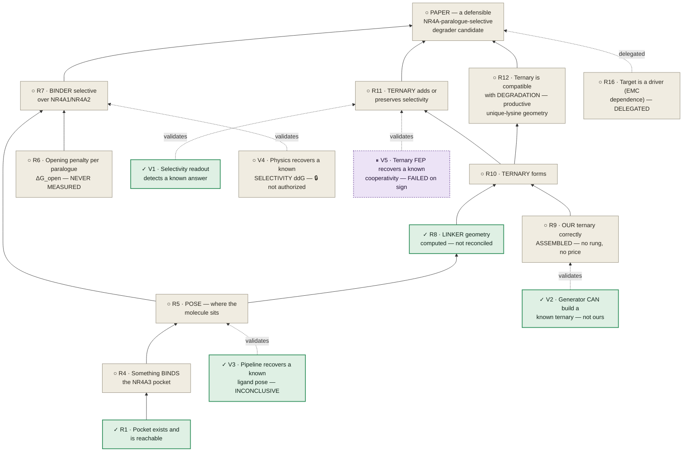
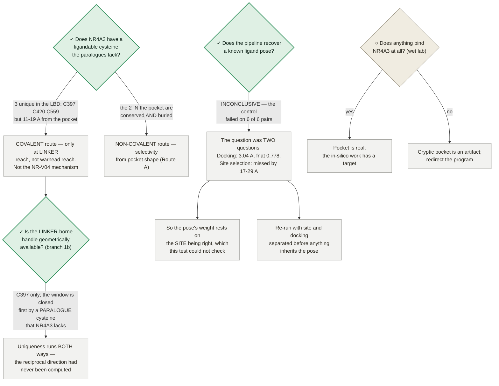
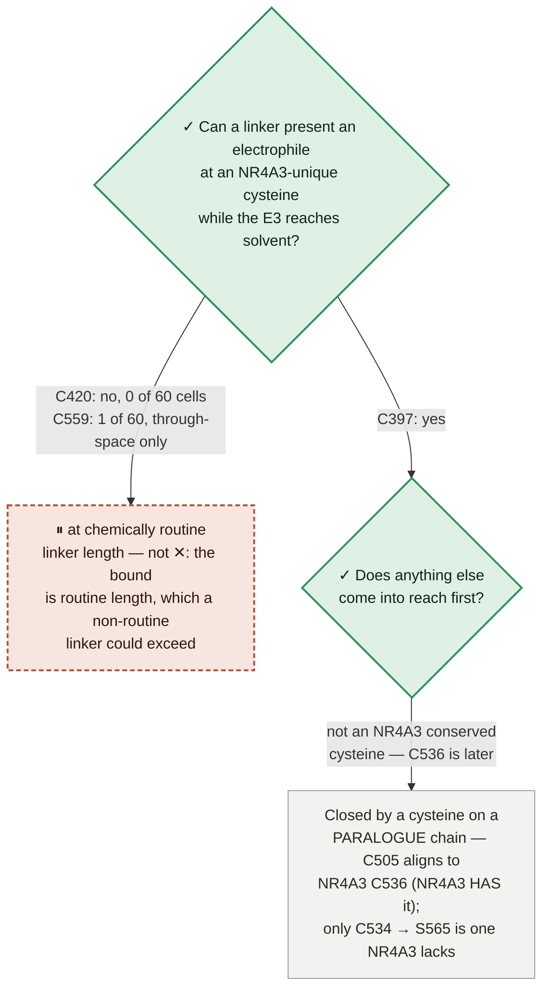

# NR4A3 degrader — the program roadmap

**One document: what is done, what is true, what is blocked, and what is next.**

★ **WHY THIS FILE EXISTS (trimcrae, 2026-08-02): *"I feel like we're not being rigorous and have to cobble
together stuff from prose documents and it's leading to us missing things and having to constantly rediscover
connections."*** The dependencies between claims were real but existed only as prose scattered across
STRATEGY.md, the paper, the preregistrations and a dozen module docstrings — so the same connections kept
being re-derived, and blockers kept being misattributed. This is the graph, and now also the plan that sits
on it.

★ **AND WHY IT IS ONE DOCUMENT (trimcrae, 2026-08-02): *"Ideally the map serves as the new source of truth
and the strategy.md gets folded in with it into one document, just adding color. And then it can link to
appendices that give more history and stuff… It's really like a systems engineering task."*** **Read this
file top to bottom and you have read the whole plan.** STRATEGY.md's live layers — the gate scoreboard, the
landed-gate blocks, the thesis, the language-discipline rules, the validation architecture, the prospective
stage, **THE ORDERED PLAN**, the spend summary, the dependency spine, the open decisions — are **here**, moved
rather than copied, each under the heading and slug it always had. [STRATEGY.md](../../STRATEGY.md) is now two
appendices of pure history: [Appendix A](../../STRATEGY.md#appendix-a--superseded-numbers-and-retracted-claims)
(superseded numbers and retracted claims) and
[Appendix B](../../STRATEGY.md#appendix-b--superseded-strategy-framings) (retired plan framings).
[§0.7](#07--what-machines-parse-in-this-file--and-what-is-left-in-strategymd) is the index of what a machine
reads in this file and what still lives there.

⚠ **SUPERSEDED, retained so it is not re-derived:** an earlier pass of this merge left ~2,430 of STRATEGY.md's
3,317 lines in place and *relabelled* them "the appendix set", so *"what do I do next"* still needed two
documents. trimcrae: *"Strategy.md and the mapping document are still different files? What is the role of
strategy anymore?"* The justification given was that seven CI checks parse STRATEGY.md by exact heading string
and 358 inbound references point at it. That constraint was real and it is now **discharged rather than
deferred**: every parser was repointed in the same commit, every moved heading kept its exact string, and no
row number or decision number changed. CLAUDE.md §5 is explicit that engineering effort is free, so
*"repointing seven parsers is expensive"* was never a reason.

⛔ **STATUS VALUES ARE READ FROM COMMITTED ARTIFACTS, NEVER TYPED HERE.** Every cell below points at the
artifact that owns it (CLAUDE.md rule 1). If this file and an artifact disagree, the artifact is right and
this file is the bug.

⛔ **ONE FACT, ONE PLACE — AND A PRICE IS DERIVED, NEVER TYPED.** A roadmap row in
[§10](#10--the-roadmap--one-ordered-list) says whether an item is **priced**, **projected** or **unpriced**,
and links to the rung or ladder row that owns the figure; an honest "unpriced" beats a number invented to
fill a column. The three editing rules this file inherits, unchanged in substance from the document it
absorbed:
1. **One fact, one place.** Every number, gate and decision has exactly one home section; everywhere else
   points at it. If you find yourself restating a cost, delete the restatement.
2. **Corrections go in [Appendix A](../../STRATEGY.md#appendix-a--superseded-numbers-and-retracted-claims),
   not inline.** Never quietly drop a superseded number — and never leave the retraction narrative in the
   live text either. One line in the appendix; the live text carries only the current value.
3. **Register the old value when you change a pinned one**, in the same commit, in
   [`pinned-figures.json`](pinned-figures.json). Rules 1–2 are *enforced* by
   [`lint_consistency.py`](lint_consistency.py) in CI. Run it before you commit:
   `python3 research/manuscripts/lint_consistency.py`.

**Keep it current.** When work lands, update the stage's `[ ]/[~]/[x]` marker in
[THE ORDERED PLAN](#the-ordered-plan-spend-gated--read-top-to-bottom-for-whats-next) **and** the mirrored
`status` in [degrader-paper-schedule.json](degrader-paper-schedule.json) — its milestone `id`s match the
stage tags one-for-one; that JSON is a machine MIRROR of this file, not a competing source.

**Companion docs (detail only, subordinate to this file):**
[pricing.md](../compute/pricing.md) — ★ PRICING single source of truth, every cost line linked to its
justifying test · [bid-strategy.md](../compute/bid-strategy.md) — host selection and bidding ·
[reviewer verdict](nr4a3-degrader-reviewer-revisions-2026-07-15.md) (verbatim) ·
[ternary-first strategy note](nr4a3-degrader-strategy-ternary-first.md) (biological/chemotype rationale) ·
[**ternary-selectivity strategy revision 2026-07-24**](nr4a3-ternary-selectivity-strategy-revision-2026-07-24.md)
(evidence behind the mechanism-first search and the six cost levers) ·
[the manuscript](nr4a3-degrader-paper.md) itself.

Rendered version (mermaid + status colouring): published artifact, regenerated from this file's content.

---

## 0 · How to read this

### 0.1 · Four registers, four questions

⚠ **THERE ARE FIVE AS OF 2026-08-03 — the heading string is kept because renaming it is a silent break.**
Configuration `C*` was added as a first-class register on 2026-08-03; this heading is left reading "four"
for the same reason [§0.5](#05--six-invariants--structural-not-stylistic) still reads "six", and the count in
the table below is the one that binds. *(Superseded, retained: "four registers", as a count.)*

| register | the question it answers | where |
|---|---|---|
| **Requirements `R*`** | what must be **TRUE** before the paper can present a candidate | [§2](#2--requirements--what-must-be-true) |
| **Instruments `V*`** | which instrument would answer each requirement, and whether it has itself recovered a known answer | [§3](#3--instruments--which-one-answers-each-requirement) |
| **Configuration `C*`** | ⭑ **NEW 2026-08-03** — which frozen definitional choices each verdict is **conditional on**, which of them are contested or known-defective, and what moves if one changes | [§3b](#3b--configuration--the-frozen-choices-every-conditional-number-depends-on) |
| **The roadmap** | what to **DO** next, in what order, and what each item is waiting on | [§10](#10--the-roadmap--one-ordered-list) |
| **The closed-route register** | what must **never** be retried, and what would reopen what is merely parked | [§6](#6--the-closed-route-register) |

Everything else on this page is evidence feeding one of those five.

⚠ **Two things are deliberately NOT registers.** The **options registers**
([§0.8](#08--the-six-options-registers--what-they-own-and-the-one-thing-they-may-never-do)) enumerate what
this program *could* do on five axes; they are inputs to the five above and amend none of them. And the
**framing question** ([§13](#13--the-deliverables-framing--an-open-question-with-a-register-and-no-decision)) — *what is the
paper about* — is an open question of trimcrae's, recorded so it is visible, blocking no row.

### 0.2 · Work state — the five glyphs

★ **A state here is WORK STATUS, not evidence quality (trimcrae, 2026-08-02).** An earlier pass coloured this
page by how good the evidence was, which is a different question and not the one you steer by: a claim can
rest on excellent evidence and still be blocked, and a dead end can be *very* well established. These five
states answer "what should I do about this?" — and every node, row and route below carries exactly one.

| state | glyph | means | what to do |
|---|---|---|---|
| **complete** | ✓ | ran, returned, and the result is recorded in a committed artifact | cite it; don't re-run it |
| **in work** | ◐ | dispatched or building right now | wait for it; don't start a second copy |
| **future work** | ○ | not started, and nothing is blocking it except sequence | this is where new effort goes |
| **parked** | ⏸ | failed with today's tools, but a better tool could change the answer | **name the capability** that reopens it — [method-watch.md](../method-watch.md) |
| **dead end** | ✕ | **conclusively proven unworkable** — no future development reopens it | **never retry** — see [§6](#6--the-closed-route-register) |

⛔ **✕ MEANS CONCLUSIVELY PROVEN UNWORKABLE — NOT "WE TRIED IT AND IT DIDN'T WORK" (trimcrae, 2026-08-02:
*"A dead end should be like, we have conclusively proven that avenue can't work"*).** The test is a single
question: **is there any future development that would make us retry this?** If yes, it is not dead. So ✕
requires positive evidence of impossibility — a structural confound no sample size fixes, arithmetic that
cannot reach the criterion, a premise shown false, an artifact that can never be regenerated. A method that
merely *failed* is ⏸ **parked**, and CLAUDE.md §5 is explicit that parked items are "revisit when capability X
lands", not dead. Conflating the two is expensive in both directions: it buries live options, and it invites
re-running things that cannot work.

⚠ **AND THE TEST IS CONCLUSIVENESS, NOT WHAT KIND OF BOX IT IS.** An earlier version of this page marked the
PAPER node ✕, which was wrong — the paper is blocked, and nothing shows it cannot be written. I then
over-corrected into a rule that claims and goals may *never* be ✕, which is also wrong: **a claim that has been
refuted is dead, and should say so.** The reason [§4](#4--the-dependency-graph)'s graph currently carries no ✕
is not that its boxes are exempt — it is that no claim on it has been refuted. If one is, it gets a ✕ like
anything else.

⚠ **And a ✓ never means "the claim is true"** — it means the *work item* finished. Sequence-only co-folding's
known-answer test completed cleanly and returned a clear negative, which is why it is ⏸ rather than ○: the work
is done, the avenue is not. [§3](#3--instruments--which-one-answers-each-requirement) says what each result
supports.

⛔ **A ◐ IS THE MOST EXPENSIVE GLYPH ON THIS PAGE TO GET WRONG, AND IT HAS BEEN WRONG SEVEN TIMES.** ◐ tells
every reader *"don't start a second copy"*, so a ◐ on something nobody has started is an instruction not to do
the work. That error was found and fixed on the §6 critical path (items 4 and 5) and on Route A on 2026-08-02,
and **five further instances survived that fix on this same page** — the graph nodes `PS`, `LK` and `V3`,
Route B's heading, and branch 1b's three question nodes. All are corrected in this pass and registered in
[§12](#12--findings-that-belong-to-other-documents). **The rule that closes it is structural, not vigilance:**
per invariant 5 below, a ◐ must name the running job, and "nothing is billing" is a $0 observation
(`inflight-board-all.md`, the account censuses) that any reader can take before believing one.

### 0.3 · Three orthogonal axes — WORK STATE, AUTHORIZATION, SUFFICIENCY

★★ **THE FIX THAT THIS PAGE KEPT NEEDING (trimcrae, 2026-08-02: *"If it's the highest leverage, it's the
highest leverage. Don't demote it just because I said not to launch it yet."*).** The work-state glyph above
answers *"what should I do about this?"*. It cannot also answer *"how much would it buy?"* or *"am I allowed
to buy it?"* or *"would it finish the job?"* — and every time this page tried to make one glyph carry all
four, it produced a wrong instruction. The failure is always the same shape: an item that was **not
authorized** got written down as **low value**, because the only column available to record "not now" was the
one that grades importance.

**So a row carries three independent readings, and all three can be true at once:**

| axis | question it answers | values | who owns it |
|---|---|---|---|
| **work state** ([§0.2](#02--work-state--the-five-glyphs)) | what should I do about this? | ✓ ◐ ○ ⏸ ✕ | the committed artifact |
| **authorization** | am I allowed to spend on this? | 🔓 **authorized** · 🔒 **not authorized** · **—** ($0, needs none) | trimcrae, via the [ladder](#11--money-authorization-and-gates) |
| **sufficiency** | if it returned tomorrow, what would it actually discharge? | stated in words, per row — never a glyph | the requirement it feeds |

⛔ **THESE ARE ORTHOGONAL, AND THE PAGE MUST NEVER COLLAPSE THEM.** The canonical row, and the one that
forced the rule, is the **CREBBP/BRD4 selectivity ABFE** (`V4`):

> **highest leverage in the program · 🔒 not authorized · would not discharge the paralogue claim** —
> three true statements about one item, none of which is a reason to soften any other.

- **Leverage is earned, not granted.** It is highest-leverage because this program has **no binary
  selectivity control at all** — [§what the SMARCA2/4 null BINDS](#what-this-binds-in-the-words-fixed-before-the-run) is explicit that *"valA validates
  relative FEP **within one pocket**"* — so it would be the first evidence the free-energy engine can resolve
  selectivity **between two different proteins**, which is the capability every paralogue margin on this page
  presupposes. Nothing about a scheduling decision touches that.
- **Authorization is a scheduling fact, not a grade.** [§the standing tally](#the-standing-tally-this-closes): *"**Neither is
  authorized here**"*. A 🔒 says *don't buy it yet*; it says nothing about what it is worth.
- **Sufficiency is scope, not demotion.** [§what the SMARCA2/4 null BINDS](#what-this-binds-in-the-words-fixed-before-the-run): it is a **binary**
  control and *"would **not** discharge §4's paralogue/ternary statement"*. An item can be the
  highest-leverage thing available **and** insufficient on its own.

⚠ **This is the same class of fix as separating dead from parked ([§0.2](#02--work-state--the-five-glyphs))
and work-status from evidence-quality — the third axis, found the same way, by noticing which two things a
single column was being asked to say.**

**Colour is redundant with the glyph, by design** — every mermaid block below defines the same five classes, so
a state is readable without it: `done` #2f8f5b · `work` #3a63b8 · `next` #8d8674 · **`parked` #6f4a9b (dashed
2 3)** · `dead` #b1543a (dashed 5 3). ⏸ and ✕ are both dashed because both mean *stop here*; the dash pattern
and the hue separate "waiting on a capability" from "never again".

### 0.4 · The ID scheme — `R*` requirements and `V*` instruments

★ **THE THING WHOSE ABSENCE CAUSED THIS MERGE.** Nothing in either document had a stable identifier, so nobody
could write *"R7 is blocked by V4"*. That is **why connections kept being re-derived from prose** and why the
same blockers kept being misattributed — including, twice, the misattribution of a whole route's block to its
instrument when a missing physical term was equally responsible.

- **`R1…Rn` — requirements.** One per claim the paper must establish. **Stable forever; never renumber.** A
  retired requirement keeps its number and is marked retired.
- **`V1…Vn` — verification instruments.** One per instrument, same rule. `V1`–`V4` keep the ids the dependency
  graph already used. ⚠ **`VC` is retired as an id and is now `V5`** — it was the only non-numeric node and it
  meant "Val C", which is [validation requirement 1(C)](#validation-architecture-the-five-requirements);
  the mnemonic is carried in `V5`'s row instead. *Superseded, retained: the node id `VC`.*
- ⭑ **`C1…Cn` — configuration items (added 2026-08-03), same rule again.** One per **frozen definitional
  choice** a number is conditional on — a threshold, a tie-break rule, a convention, a criterion. Never
  renumber; a retired item keeps its number and is marked retired. Register:
  [§3b](#3b--configuration--the-frozen-choices-every-conditional-number-depends-on).
- ⭑ **`Q1…Qn` — QUEUED OPTIONS (added 2026-08-03), same rule a third time.** One per option promoted out of an
  options register onto this board as a startable row. Never renumber; a retired `Q` keeps its number.
  Queue: [§10.1a](#101a---the-option-queue--q1q22-the-graded-family-promoted-to-rows-you-can-start-from).
  ⚠ **A `Q` is not a fifth register and never carries a grade** — it names the register row it promotes, and
  [§0.8](#08--the-six-options-registers--what-they-own-and-the-one-thing-they-may-never-do)'s rule holds: the
  register owns the grade and the evidence, this page owns the claim, the state and the pointer. **It exists
  because ≈53 options were enumerated and graded and then appeared on this board ZERO times** — an option with
  no id cannot be scheduled, refused or ordered, which is the same argument that produced `R*`, `V*` and `C*`.
- **Every requirement, instrument, roadmap row, closed route and branch cites the `R`/`V` it serves.**
- ⭑ **AND EVERY CONDITIONAL NUMBER CITES ITS `C*`, INLINE, WHERE THE NUMBER IS WRITTEN.** *"44 of 75 frames
  clear D\*"* reads as a fact and is a fact **under a rule**; the declared form is *"44 of 75 (`C1` D\*=0.53,
  `C2` best-match rule)"*. **This is the gap that produced this register**, and the worked example is that the
  same frame's gate FAILS at druggability 0.259 under the frozen cavity rule and PASSES at 0.667 under a
  most-druggable one ([§3b](#3b--configuration--the-frozen-choices-every-conditional-number-depends-on)).
- **A requirement with no `V` is a hole and must render as one.** That is this document's main job, and
  [§2.2](#22--requirements-with-no-instrument--the-holes) is the list.
- **An instrument that has not recovered a known answer cannot raise the confidence of any `R` it serves.**
  This is the program's most expensive lesson, stated as a rule the document can enforce rather than as prose
  — invariant 1 below. ⭑ **The `C*` analogue is the same lesson one layer down: a `C*` that has been put to a
  control and failed it is KNOWN-DEFECTIVE, and everything adjudicated by it inherits that failure** —
  [§3b.2](#3b2--contested-and-known-defective--the-four-that-are-not-merely-frozen).

### 0.5 · Six invariants — structural, not stylistic

Each is a rule a reader can *check*, and each exists because it was broken.

| # | invariant | what breaking it looks like |
|---|---|---|
| **1** | **A requirement may never be claimed above its instrument's own validation status.** | an ABFE paralogue margin quoted as evidence while the engine's absolute benchmark misses by more than the whole margin (`V7`) |
| **2** | **Work state, authorization and sufficiency stay orthogonal** ([§0.3](#03--three-orthogonal-axes--work-state-authorization-sufficiency)). | the highest-leverage item in the program written down as low-value because it was unauthorized |
| **3** | **✕ means conclusively unworkable, never "not done yet"; ⏸ names the capability that reopens it; 🔒 names the decision it waits on.** | a held item filed as parked, hiding a decision that could be taken today |
| **4** | **A ✓ is a WORK state, never a claim's truth.** | the pocket node marked ○ (which said nobody had looked, and was false), then marked ✓ *"settled enough to build on"* (which elided two open gates, and was also false). Correct is **✓ work complete · claim supported, not settled** |
| **5** | **Every status cell points at a committed artifact. A cell with no artifact says so, in those words.** | ◐ on a lane that does not exist; a number read once off an artifact's first generation and never re-read |
| **6** | **One fact, one place.** Where this page and an appendix both hold a number, this page **links** and does not restate it. | a cost carried in three files, stale in all three |

⚠ **Invariant 5 is the one that catches the others.** Four of the seven wrong ◐ glyphs, the superseded
thiol-occlusion median, and the superseded pose RMSD were all **values that had a committed artifact and were
never re-read against it**. Checking a cell against its artifact costs $0 and is the single highest-yield
audit on this page.

⭑ **AND THERE IS A SEVENTH, ADDED 2026-08-03, WHICH LIVES IN
[§3b](#3b--configuration--the-frozen-choices-every-conditional-number-depends-on) RATHER THAN IN THIS TABLE:
a number whose value depends on a frozen definitional choice must NAME that choice's `C*` id, inline.**
Breaking it looks like: *"44 of 75 frames clear D\*"* — true, and true **under a cavity-selection rule**
whose alternative flips a gate verdict from FAIL to PASS on the very same frame. ⚠ **It is filed there and
not here for a mechanical reason, not a conceptual one:** this heading's anchor is cited from three places
including [`paper-framing-options.md`](paper-framing-options.md), and renaming it to *"Seven invariants"*
would break all three **silently** — the exact failure class
[§0.7](#07--what-machines-parse-in-this-file--and-what-is-left-in-strategymd) exists to prevent. Invariant 6
(*one fact, one place*) is its nearest relative: the `C*` register is where the choice lives, and every
number that depends on it **points**.

### 0.6 · ⚠ Five different things in this program are called `R`

**Read this before citing anything as "R-something".** The collision is real, it is repo-wide, and it has
already produced one mis-citation.

| written as | means | home |
|---|---|---|
| **`R1`…`R16`** | a **requirement on this page** — what must be true | [§2](#2--requirements--what-must-be-true) |
| **"validation requirement 1–5"** | the external reviewer's five conditions on what a result may claim | [§Validation architecture](#validation-architecture-the-five-requirements) |
| **"lint rule R1–R5"** | the manuscript language-discipline rule families | [`lint_claims.py`](lint_claims.py), CI-enforced |
| **"Arm R1 / Arm R2"** | the two arms of the NR-V04 retrospective panel (R2 retired by AMENDMENT 3) | [prereg](../modalities/nr4a3-nrv04-retrospective-prereg.md) |
| **`R` (closure)** | the cycle-closure statistic — `R = 0.2128` on the valB triangle, `R = +1.307` on `cycle_3carbonyl` | [`valb-triangle-closure.json`](../modalities/valb-triangle-closure.json), `step1-fanout-map.json` |

**So: never write a bare `RN` for anything except a requirement on this page.** Cite the others in words.

⚠ **AND `C` NOW HAS THE SAME PROBLEM, WHICH IS WHY IT IS FLAGGED HERE THE DAY THE REGISTER WAS ADDED RATHER
THAN AFTER THE FIRST MIS-CITATION (2026-08-03).** Three different things on this page are written `C`-and-a-number:

| written as | means | home |
|---|---|---|
| **`C1`…`C23`** | a **configuration item on this page** — a frozen definitional choice a number is conditional on | [§3b](#3b--configuration--the-frozen-choices-every-conditional-number-depends-on) |
| **`C01`…`C09`** *(zero-padded)* | an **options-register candidate id** — e.g. `C02` the cross-system decoy null, `C04` the paralogue pocket contrast, `C08` the AR/MR cross-binding instrument | [`instrument-options.md`](../modalities/instrument-options.md) §3.2, cited in [§10.1](#101--open-rows-ordered-by-what-unblocks-the-most) rows 26–29 |
| **`C397` / `C420` / `C559` / `C505` / `C534` / `C551`** | a **cysteine residue number** | the covalent-reach artifacts |

**So: a configuration id is `C` + an UNPADDED number and nothing else.** The zero padding is the tell — `C02`
is an options-register candidate, `C2` is the cavity-selection rule — and it is a thin distinction, so cite an
options-register id in words wherever the sentence has room.

⛔⛔ **AND THE TELL RUNS OUT AT TEN — MEASURED 2026-08-03 WHILE BUILDING
[§10.1a](#101a---the-option-queue--q1q22-the-graded-family-promoted-to-rows-you-can-start-from), WHICH IS THE
FIRST TIME BOTH SCHEMES WERE CITED IN ONE TABLE.** The instrument register runs to **`C16`**, and this page's
configuration register runs to **`C23`**, so **`C10`–`C16` exist in BOTH and are spelled IDENTICALLY** — there
is no padding to distinguish them and no context that reliably does:

| spelled | configuration item ([§3b](#3b--configuration--the-frozen-choices-every-conditional-number-depends-on)) | instrument candidate ([`instrument-options.md`](../modalities/instrument-options.md)) |
|---|---|---|
| **`C10`** | the pendant reach the gate is read at (3.0 Å) | the symmetric reciprocal-uniqueness + indel census |
| **`C12`** | backbone rise per linker atom (the atom-count ↔ distance conversion) | thiol pKa / intrinsic nucleophilicity for C397 |
| **`C14`** | **the pose-recovery criterion** — which decides `panel_readable` | `barnase_barstar_W35F`, the wedge benchmark for `V10` |
| **`C16`** | the decoy-null domain trim (pLDDT ≥ 70) | the ML-potential endpoint correction |

⛔ **`C14` is the dangerous one:** the configuration item is what adjudicates all four SI §S1 anti-target
clauses, and the instrument candidate is a priced GPU benchmark — a sentence that says *"`C14` refuses it"* is
ambiguous between a criterion and a purchase. **So above `C09`, an instrument-register id must be written in
words** (*"instrument candidate `C10`"*), never bare; a bare `C10` means the configuration item. This is
[§10.1a](#101a---the-option-queue--q1q22-the-graded-family-promoted-to-rows-you-can-start-from)'s `Q22`, and it
is registered here **before** the first mis-citation rather than after it. ⛔ **Per
[§0.8](#08--the-six-options-registers--what-they-own-and-the-one-thing-they-may-never-do) an options register
amends nothing**, so the two can never be confused about *authority* even where they are confused about a
label: a `C0N` never freezes anything.

### 0.7 · What machines parse in this file — and what is left in STRATEGY.md

**This page is what you read and steer by, and it is now the whole plan.** Seven CI checks parse it **by exact
heading string and text format**; every one of those headings was carried across from STRATEGY.md unchanged,
so the strings below are load-bearing. ⛔ **Rename one and CI goes QUIET, not red**: renaming the ordered
plan's heading makes [`work_ledger`](../modalities/work_ledger.py) print *"NOT SCANNED — the plan is invisible
this run"* and every open item vanishes from the work board with no error.

| section of this file | owns | parsed by |
|---|---|---|
| [`THE ORDERED PLAN (spend-gated)`](#the-ordered-plan-spend-gated--read-top-to-bottom-for-whats-next) | 30 checkbox items, each with a gate, a price and a marker | `work_ledger.scan_plan_items` — heading string, bullet regex, `###` rung sub-headings, bounded by the next `##`. ⚠ the skipped marker is an **en dash**, not a hyphen |
| [`Spend summary`](#spend-summary) + [`Dependency spine`](#dependency-spine) | the pinned total and its derivation, the rung table, the authorisation graph | `lint_consistency.check_derivations` (the total must appear here, in `pricing.md` and in `bid-strategy.md`) + `check_subsets` (the spine's `Cum ~$N` must be a subset of the plan's `Cum. ~$N` — **two deliberately different formats; unifying them raises `X-pattern-found-nothing` as a CI ERROR, by design**) |
| [`Honest scope and language discipline`](#honest-scope-and-language-discipline-apply-everywhere-including-the-manuscript) | the earned-phrase substitutions and the never-imply set | `lint_claims.py` — **21 provenance strings name this section**, and its R1–R5 rules run over the paper, the SI **and this file** |
| [`📊 WHERE WE ARE — the scoreboard`](#-where-we-are--the-scoreboard-in-plain-language) | the gate table, the deliverables table, realised spend, and ⛔ **the one home for "which controls failed"** | `lint_consistency.check_artifact_figures` (three realised-spend figures must equal `realised-spend.json`); written by `realised_spend.py --write` |
| the whole file | every pinned figure | `lint_consistency.check_superseded` — a replaced value may appear only on a line marked superseded |
| [`Validation architecture (the five requirements)`](#validation-architecture-the-five-requirements) | the reviewer's five conditions; the charge-model lane split; *"Val B-mini is the highest-value dollar in the plan"* | — (content cited by ≥6 modules) |
| [`Open decisions`](#open-decisions) | 15 numbered rulings, all closed | **cited by number in 30 files and nothing resolves a decision number — the numbering is FROZEN** |
| [`Program and thesis`](#program-and-thesis) + [`MECHANISM-FIRST`](#mechanism-first-is-the-search-order-the-thesis-above-is-unchanged) | the thesis, and the one home for the margin arithmetic (`~2.0` needed vs `0.60` resolvable vs `1.543` measured) | `tests/test_selectivity_margin_model.py` asserts the derivation |
| [`The prospective stage…`](#the-prospective-stage-mechanism-first-then-orientation-first-inverse-design) | the kill-switch semantics, the four-tier table, the Tier-2 result in full | `e3_recruiter_staging.py` calls its panel "verbatim" |
| [`Spending rules`](#spending-rules) | no pre-authorization · cheapest-decisive-first · GO/NO-GO per rung · PROJECTED never enters the pinned total | — |
| [`GPU economics`](#gpu-economics-full-provenance-in-pricingmd) | a pointer to [pricing.md](../compute/pricing.md), plus the six cost levers | `bid-strategy.md` names it |
| the ✅/❌ landed-gate blocks | each landed gate's numbers, once | one anchor link from the retired re-panel prereg — ⚠ **that heading's slug is load-bearing and must not change** |
| [`★★ WHAT THE LANDED RESULTS CHANGE…`](#-what-the-landed-results-change-about-the-remaining-plan) | the *why* behind the ordering; its ranked list is folded into [§10](#10--the-roadmap--one-ordered-list) | — |
| [`⏱️ IN FLIGHT`](#in-flight-superseded) | ⚠ **NOT LIVE** — a superseded board plus four one-homes; see [§12 finding 6](#12--findings-that-belong-to-other-documents) | live board is [`inflight_usd_per_ns.py`](../modalities/inflight_usd_per_ns.py) / `inflight-board-all.md` |
| [`🌙 OVERNIGHT MONITORING`](#-overnight-monitoring--what-is-covered-by-what-2026-07-26-trimcrae-asked-for-hourly) | ⚠ stale — every lane it describes has closed | — |
| [`Current front`](#current-front) | ⚠ a duplicate that names its own homes and has **zero** inbound references; superseded by [§10](#10--the-roadmap--one-ordered-list). Retained for one statement: the feasibility panel is **WITHDRAWN**, not merely "under correction" | — |

**And what is left in [STRATEGY.md](../../STRATEGY.md) — history, and only history:**

| appendix | owns | why it is not here |
|---|---|---|
| [`Appendix A — superseded numbers and retracted claims`](../../STRATEGY.md#appendix-a--superseded-numbers-and-retracted-claims) | the correction ledger — every value this program replaced, beside what replaced it | ⚠ **its rows are read as DATA**: [`realised_spend.py`](../modalities/realised_spend.py) sets `"read_from": "STRATEGY.md Appendix A row 35"`, 35 files cite rows by number, and `lint_consistency.is_cleared` reads **that exact heading** as a structural clear — renaming it turns every row into a CI error. **Row numbers and slug frozen.** |
| [`Appendix B — superseded strategy framings`](../../STRATEGY.md#appendix-b--superseded-strategy-framings) | six retired plan framings | CLAUDE.md §5 points here so a retired framing is never re-litigated |

⚠ **Nothing else is there.** A citation naming any other STRATEGY.md section — the scoreboard, the ordered
plan, the spend summary, open decisions, a landed gate — resolves here, under the same heading and the same
slug.

### 0.8 · The six OPTIONS REGISTERS — what they own, and the one thing they may never do

★ **Added 2026-08-03, wiring in a five-axis fan-out (trimcrae: *"Make sure these are all appropriately
documented in the map as they land."*).** Five agents enumerated, in parallel, the options this program has
on five different axes; a sixth file ranks across them. **They landed beside this page rather than in it,
which is precisely the drift this page exists to prevent** — a fact whose only home is a side file gets
re-derived and then contradicted. Everything each of them *decides* is now in the sections below; this table
is the index, and the pointer for anything they own that this page deliberately does not restate.

| register | the question it enumerates | what this page took from it |
|---|---|---|
| [`selectivity-mechanism-options.md`](../modalities/selectivity-mechanism-options.md) / [`.json`](../modalities/selectivity-mechanism-options.json) | **by what mechanism** could paralogue selectivity be argued — 17 enumerated, 9 previously unrecorded, 7 new measurements | two refutations → [§6a](#6a--dead--conclusively-unworkable-never-retry); one grading downgraded to ⏸ → [§6b](#6b--parked--failed-with-todays-tools-with-a-named-trigger-to-reopen); steric exclusion and its control → [§8](#8--the-two-live-routes-to-selectivity--and-where-each-is-actually-blocked) |
| [`instrument-options.md`](../modalities/instrument-options.md) / [`.json`](../modalities/instrument-options.json) | **by what instrument** — 16 candidates, ranked by whether they need a free-energy resolution at all | the double-difference instrument fact → [§3.4](#34--four-instrument-facts-this-page-used-to-be-missing); `R14`'s hole is ~8/9 filled → [§2.2](#22--requirements-with-no-instrument--the-holes) |
| [`target-route-options.md`](target-route-options.md) + [`target-route-census.json`](../modalities/target-route-census.json) | **must the molecule be paralogue-selective at all** — 13 routes, graded by their effect on the requirement | the requirement is **asymmetric** → [§2.4](#24--the-selectivity-requirement-is-asymmetric--and-this-page-stated-it-symmetrically); three closures → [§6](#6--the-closed-route-register); the per-domain identity table → [§8 Route B](#route-b--a-linker-borne-covalent-handle-at-an-nr4a3-unique-cysteine---blocked-on-r5-nothing-running--serves-r8-r15) |
| [`nr4a3-short-linker-probe.json`](../modalities/nr4a3-short-linker-probe.json) | **does a construct exist at the 12-atom gate** — the candidate molecule, and what forces the library's floor | the candidate and its two defects → [§5 row R15](#5--where-each-requirement-stands), rung [`5b-T`](#the-ordered-plan-spend-gated--read-top-to-bottom-for-whats-next) arm (C), [§10.1 rows 24–25](#101--open-rows-ordered-by-what-unblocks-the-most) |
| [`paper-framing-options.md`](paper-framing-options.md) | **what else this body of work could publish** — 7 framings on six columns | [§13](#13--the-deliverables-framing--an-open-question-with-a-register-and-no-decision), recorded as open and **not decided here** |
| [`path-family-synthesis.md`](path-family-synthesis.md) | the ranked synthesis across the five | read as a reader's guide; every ranking it states is graded independently below |

🗺 **AND THE INDEX UNDER ALL OF THEM — [`emc-systems-map.md`](emc-systems-map.md), generated from
[`emc-systems-map.json`](emc-systems-map.json) and checked in CI by
[`emc_systems_map_check.py`](emc_systems_map_check.py) (2026-08-03).** It is **not** a seventh options
register and it grades nothing: it is the machine-checkable record of **which file owns each route's grade**,
which routes are the same route under a different memo's numbering, which are different routes that must not
be conflated (with the opposite blockers that separate them), which **instruments have no passing
known-answer control**, and which quoted figures resolve to a real artifact field **on `main`**. It mirrors
this page's `V*` instrument rows rather than restating them — the [§3.1 table](#31--the-instrument-table)
remains their one home, and the map fails its own build if it points at a `V` row that has moved. Its reason
for existing is the same as this page's, one layer down: four integrity failures were found in one day, all
of the shape *one thing carried under two names*, and prose cannot be run.

⛔ **AN OPTIONS REGISTER AMENDS NOTHING.** None of the six changes a gate, a criterion, a price, a rung, a
status or a claim ceiling, and none is a source of truth for anything this page also carries. **They own
their numbers; this page owns the claim, the state and the pointer** — and per invariant 6 a figure that
appears in both is the bug, not the belt-and-braces. Where a register's grade and this page's disagree,
**this page's grade is the one that binds**, and [§6](#6--the-closed-route-register)'s bar is stricter than
any register's: three of the routes their authors marked closed are ⏸ **parked** here, because *"closed by
the measurements we already have"* is not the same statement as *"nothing reopens it"*.

⭑⭑ **AND ON 2026-08-03 THE TABLE ABOVE WAS FOUND TO BE ONLY HALF THE JOB — THE REGISTERS WERE WIRED IN AS
*FINDINGS* AND NEVER AS *WORK*.** Everything each register **decided** did reach a section above; what did
not reach anything was the ≈53 **options** themselves. Measured over
[§10.1](#101--open-rows-ordered-by-what-unblocks-the-most)'s 29 rows: `S15` appeared **0 times in this whole
file**, `Route C` **0 times in §10.1**, and each of the four register filenames **0 times in §10.1**. ⛔ **An
option that is graded but not queued is an option nobody can start** — which is the same failure as a caveat
with nowhere to go, one layer earlier. The queue is
[§10.1a](#101a---the-option-queue--q1q22-the-graded-family-promoted-to-rows-you-can-start-from), its
**family structure** (alternatives · composers · prerequisites) is
[§10.1b](#101b--the-family--what-picking-one-costs-you), and what today's results did to the registers' own
grades is [§10.1c](#101c--what-todays-results-did-to-the-registers-grades--and-what-was-left-behind). ⚠ The
rule above is unchanged and binds the queue too: **a `Q` row carries a claim, a state and a pointer, never a
grade.**

---

## 1 · The thesis, the north star and the operating regime

*Color, not plan. Everything here has one home in an appendix and is linked, never restated.*

★ **NORTH STAR (trimcrae, 2026-07-01):** the **state of the art of what in-silico can do for an
NR4A3-selective degrader** — the most complete, rigorous, honest computational characterization achievable
with **no wet lab**, every result at its true weight. The paper documents *that*, not a ship-when-adequate
minimum.

★ **THE THESIS** ([§Program and thesis](#program-and-thesis)): close-paralogue
degrader selectivity is created at the **induced target–E3 interface** and in differential lysine geometry —
**not at the conserved warhead pocket** — and in every landmark case it was *discovered then rationalized* by a
solved ternary structure, never predicted blind. AKT1/2/3 is the cautionary null.

⚠ **The thesis and this page's own Route A point in different directions, and that tension is real rather than
an error in either.** Route A ([§8](#8--the-two-live-routes-to-selectivity--and-where-each-is-actually-blocked))
is a warhead-pocket route, and the pocket lining is in fact the most divergent object measured here (7 of 10
lining residues differ). What the thesis contributes is the **size** constraint the route must clear, and it
has one home: the margin arithmetic in
[MECHANISM-FIRST](#mechanism-first-is-the-search-order-the-thesis-above-is-unchanged) —
a useful degradation window needs **~2.0 kcal/mol** of true margin against a best-case **resolvable**
difference of **0.60** and an accuracy of **1.543 kcal/mol, wrong sign**. **A passing selectivity benchmark
would not close that gap**, which is why `R7`'s block is three things and not one.

★ **OPERATING REGIME — one researcher, no wet lab, no race.** A self-funded wet-lab program is off the table,
so every next step is either publish-to-convince or in-silico. **GPU spend is not a gate on paper quality**:
run the warranted experiments — including expensive ones — and post only once that work is folded in. Cost is
a reason to sequence and right-size, not to skip a decision-relevant run. Breadth-first, standard-depth: a new
technique that adds an axis of evidence is a default YES; deepening a test past its field standard is a
default NO.

★ **SINGLE DELIVERABLE:** [nr4a3-degrader-paper.md](nr4a3-degrader-paper.md) + its SI **is** both the ChemRxiv
preprint and the JCIM submission. Language discipline —
[§Honest scope](#honest-scope-and-language-discipline-apply-everywhere-including-the-manuscript),
CI-enforced by [`lint_claims.py`](lint_claims.py) over the paper, the SI **and this page**.

⛔ **This is a long-lived program on a rising frontier, not a one-shot.** Parked items are "revisit when
capability X lands", not dead; completed work is worth re-grading as methods improve
([method-watch.md](../method-watch.md)). Guardrail: a coming capability justifies waiting or re-running,
**never** claiming a result before the method supports it.

---

## Program and thesis

*★ **THE ONE HOME** for the thesis and, in [`MECHANISM-FIRST`](#mechanism-first-is-the-search-order-the-thesis-above-is-unchanged) below, for the margin arithmetic (required vs resolvable vs achieved). [§1](#1--the-thesis-the-north-star-and-the-operating-regime) is the one-paragraph version and carries none of the figures. `tests/test_selectivity_margin_model.py` asserts the derivation.*

The goal is the **state of the art of what in-silico methods can do for an NR4A3-selective degrader** — a
complete, rigorous, honest computational characterization for extraskeletal myxoid chondrosarcoma (EMC, driven by
the **EWSR1::NR4A3** fusion), pursued with **no wet lab**. Every result is reported at its true weight; the
deliverable is a preprint + journal submission (ChemRxiv/JCIM) plus targeted outreach, not a ship-when-adequate
minimum. This program is ≈70–80% of repo effort; the broader EMC route portfolio (fusion-junction ASO and other
routes as support/backup) is context beneath it — see
[emc-treatment-strategy.md](emc-treatment-strategy.md) and [IDEAS.md](../IDEAS.md).

**Thesis.** Paralogue selectivity, where achievable, emerges **jointly** from a modest binary warhead preference,
ternary cooperativity, and ubiquitination-compatible geometry — not from binary pocket selectivity alone. Close-
paralogue degrader selectivity is created at the **induced target–E3 interface** and differential lysine geometry
(as in BRD4-vs-BRD2/3, CDK6-vs-CDK4, p38 isoforms), never at the conserved warhead pocket, and in every landmark
case it was *discovered then rationalized by a solved ternary structure* — never predicted blind. There is no
validated prospective selectivity predictor in the field, and AKT1/2/3 is the cautionary null (isoforms too
homologous → only pan-degraders).

### MECHANISM-FIRST is the search order (the thesis above is unchanged)

Selectivity mechanisms are not interchangeable, and the program was pursuing the hardest one exclusively. Two
classes:

- **MARGINAL** — the paralogue is thermodynamically disfavoured. This is the induced-interface wedge. A useful
  degradation window needs **~2.0 kcal/mol** of true margin (median over 27 potency scenarios, range 1.75–2.25;
  [`selectivity_margin_model.py`](../modalities/selectivity_margin_model.py)), against a best-case
  **resolvable** difference of **0.60 kcal/mol** and a **measured** accuracy of **1.543 kcal/mol, wrong sign**.
  **★★ BOTH HALVES OF THAT SENTENCE CHANGED ON 2026-07-30, IN OPPOSITE DIRECTIONS, AND THIS IS THE ONE HOME FOR
  THE CURRENT PAIR.** ⚠ **Superseded, retained: a resolvable difference of `1.12 kcal/mol` at `replicate SD 0.7,
  n = 3`, beside a *literature* accuracy of ~1.7 kcal/mol RMSE** ([Appendix
  A](../../STRATEGY.md#appendix-a--superseded-numbers-and-retracted-claims) 53).
  - **PRECISION improved, because the replicate SD stopped being assumed.** 0.60 is
    `minimum_detectable_difference(0.375, 3)` — **DERIVED, never typed**
    ([`selectivity_margin_model.minimum_detectable_difference`](../modalities/selectivity_margin_model.py))
    off the **measured** cycle SD whose one home is the RUNG 2 · replicates row of the scoreboard. The retired
    1.12 was the same function at **SD 0.7 — a number nothing in this program had ever measured.** Two caveats
    that travel with it and must not be dropped: the SD was measured on the **SMARCA2/VHL** calibrator and is
    *transferred* to NR4A exactly as the cost bases are, and it is an **upper** bound on sampling-only scatter
    because it also carries model-swap and independent-solvation variance
    (`valb_failure_propagation.sigma_leg_now_bounded`).
  - **ACCURACY got worse, and it is no longer a literature figure.** The one known-answer test of this exact
    quantity class missed by **1.543 kcal/mol with the wrong sign**, and `R` localises that to an
    **endpoint-state** error — so replicates cannot touch it.
  - **★ SO THE BINDING CONSTRAINT ON THIS AXIS HAS MOVED FROM PRECISION TO ACCURACY.** The axis is no longer
    "near its resolution limit" — the margin it must detect is now **~3.3× the measured noise floor** rather
    than ~1.8×. What it lacks is a calibrated known answer for the *form* the program actually uses. **This
    axis is an UNCALIBRATED confirmation tool, not a blunt one** — a different defect, with a different
    remedy (a calibrator, not more sampling), and [§WHAT THE LANDED RESULTS CHANGE](#-what-the-landed-results-change-about-the-remaining-plan)
    carries what follows from it.
- **CATEGORICAL** — ⚠ **NARROWED 2026-07-25/26 (Lane 13, $0, before any flagship spend): the paralogue is
  structurally incapable *AT THE ALIGNED POSITION* — which is NOT the same as "a covalent bond cannot form on
  it at all", and this file asserted the stronger claim.** The sequence fact is exact and unchanged: NR4A1 and
  NR4A2 carry no cysteine where NR4A3 has C397. **What does not follow is that they present no reachable
  nucleophile.** Three measurements:
  - **Only 4 of NR4A3's 20 enumerated cysteines are unique; 16 are SHARED — and one of the shared ones is
    inside the design gate.** Term (a) is built from `unique_cysteines` **only** and summarises the conserved
    set at the 20-atom *sampling ceiling*, never at the 12-atom gate — so *"all term-(a) basins reach C397 and
    only C397"* (3 of them, post-correction) is a statement about **{C397, C420, C559}**, not about every
    cysteine. Scored over **all** of
    them on the same 75 unbiased conformers, **C496 — whose homologue is NR4A1 C465 / NR4A2 C465 — reaches the
    ≤12-atom gate in 29/75 = 0.387** (Wilson 0.285–0.500). **What closes it is BURIAL (RSA median 0.023), not
    geometry.**
  - **Each paralogue's static opened model presents TWO cysteines inside the same gate**, and **NR4A1 C465 opens
    at a 6-atom linker against C397's 10** — i.e. *more* geometrically accessible than NR4A3's own handle.
    (NR4A1 C551, the celastrol site, at 10; NR4A2 C465 at 10, C534 at 12.)
  - **Matched-construct test** (same placement, warhead exit anchor, E3 anchor and budget; **73,867** placements
    over **300** matched conformers, three scopes): reach-only P(a paralogue Cys is also reached | an
    NR4A3-unique one is) = **0.000–0.003 at 12 atoms, 0.054–0.133 at 16, 0.263–0.383 at 20**
    (`C9` reach convention · `C10` 3.0 Å pendant · `C11` 3.0 Å clash · `C12` 1.25 Å/atom rise; the gate that
    picks the first column is `C8`. ⭑ **reach-ONLY, so `C7` — the defective exposure cutoff — is not in it**)
    ([`nr4a-paralogue-dynamics.json`](../modalities/nr4a-paralogue-dynamics.json) →
    `categorical_verdict.by_scope[*].by_linker_atoms`, their one home) — and **16–20 is a range this plan
    already contemplates** (C420 needs 16, C559 needs 20, `best_linker_atoms` reads 19).
    ⚠ *Superseded, retained: the pilot pair "0 at 12 atoms, 0.081 at 16, 0.258 at 20" over 5,657 placements,
    static opened models only — retired 2026-07-26 when the matched ensembles landed.*

  **★ SO WHAT ACTUALLY HOLDS THE CATEGORICAL AXIS UP IS EXPOSURE, NOT ABSENCE.** Every paralogue cysteine in
  range sits at RSA **0.011–0.165** against C397's **0.395**, so reach-**and**-exposure still gives **0
  collisions at every length** (`C7`, ⛔ **KNOWN-DEFECTIVE** — this is the zero that the exposure cutoff
  produces, and the cutoff's own positive control, NR4A1 Cys551, sits at RSA **0.165**, i.e. inside that very
  range: [§3b.2](#3b2--contested-and-known-defective--the-four-that-are-not-merely-frozen)). But that is **one number per residue from one conformer**, and RSA is the most
  conformationally variable quantity in play — C397's own range over its ensemble is **0.108–0.673**. The
  matched paralogue MD ensembles that turn those single numbers into distributions are **in flight** and the
  verdict is deliberately marked **`VERDICT_NOT_EVALUABLE`** until they land, rather than reported as a clean
  pass computed against zero paralogue frames. *(Not reimplementation drift: the same pipeline reproduces the
  committed handle-ensemble values exactly — C397 0.960 at the gate, C420 0.000, C559 0.000, RSA median 0.416.)*
  **Consequence for the design: keep the linker SHORT.** The discrimination is clean at 12 atoms and degrades
  measurably by 16–20 — so a construct that reaches C397 at 11 atoms is not merely more tractable, it is
  *more selective*, and any design drifting to 16+ atoms trades away the axis it exists to exploit.

  *(Original framing, retained because the sequence fact under it is exact:)* the paralogue is structurally
  *incapable*. NR4A3 carries reactive residues that BOTH
  paralogues lack, verified from full-length UniProt with two independent aligners
  ([`nr4a_paralogue_unique_residues.py`](../modalities/nr4a_paralogue_unique_residues.py) →
  [`nr4a-paralogue-unique-residues.json`](../modalities/nr4a-paralogue-unique-residues.json)):
  **C397** (NR4A1 N363 / NR4A2 S363; **RSA over a 100-conformer MD ensemble: median 0.416, mean 0.405 ± 0.096,
  p10–p90 0.298–0.510 — the committed single-frame 0.395 sits at the MEDIAN**, so the handle is not a lucky
  frame; reachable at the ≤12-atom gate in **72/75 = 96 %** of unbiased frames. Also NOT geometrically closed —
  it opens at a 10-atom linker on an E3-independent bound, so a term-(a) shortfall is about WHERE RECRUITERS
  DOCK, not about the target. **★ But the chemistry axis is ONE RESIDUE DEEP: C420 and C559 reach the gate in
  0/75 unbiased frames** — C420 needs **16** atoms, C559 **20**, and that contour length is paid out of the
  *same* budget that must span to the E3. **Concentration risk, not fragility**, and there is **no geometric
  fallback**; the untested failure modes are chemical — pKa, nucleophilicity, adduct stability, promiscuity.
  A live failure mode that does **not** fire: pocket-druggability and C397 reach are **independent** —
  P(both) = 0.560 against an independence product of 0.563, and P(reachable | druggable) = **0.955**), C420
  (18.3 Å, exposed), C559 (12.8 Å but RSA 0.095 — buried in this conformer, so not currently tether-reachable);
  and exposed unique lysines **K572** (RSA 0.879, 11.5 Å), **K518** (0.413, 13.4 Å), **K592** (0.506, 16.2 Å),
  all in the same 11–16 Å band as the conserved ones — so an E3 can be steered onto a unique lysine instead of a
  shared one. At **zero** thermodynamic margin these give 0.82 (unique lysine) and 0.92 (covalent capture,
  time-integrating form) on the window metric where the interface-only null gives 0.185. **Precedent: the
  field's one demonstrated case of NR4A-family-selective degradation, NR-V04, is most parsimoniously explained
  by a paralogue-unique cysteine — NR4A1 Cys551, which NR4A3 lacks (T579).** That covalency remains a genuine
  confound for the retrospective (RUNG 4); it is *also* the reciprocal handle this program should use.

The program is therefore **mechanism-first, then orientation**: rank basins by whether they place an electrophile
at an NR4A3-unique cysteine and whether their E2~Ub transfer zone covers a unique lysine rather than a conserved
one; use interface thermodynamics to **rank within** the surviving set, never to create selectivity on its own;
test causality with a matched-pair cycle; and **STOP before the flagship spend if no mechanism survives** —
publishing the honest negative, now stronger because it rules out three mechanisms instead of one. The final
deliverable is a **computationally prioritized, structure-defined, retrosynthetically annotated candidate set
with an identified causal selectivity mechanism — degradation experimentally unvalidated.**

*Checked and reported weak, not quietly dropped:* the EWSR1 moiety of the fusion contributes only **1 lysine**
(residues 1–264, K144) or 2 (1–349) — the low-complexity domain is Lys-poor — so fusion-lysine-directed
ubiquitination is a thin handle and is **not** a design axis. It stays a modelling scenario only.

## Honest scope and language discipline (apply everywhere, including the manuscript)

*★ **THE ONE HOME** for what the manuscript may and may not assert. ⚠ **21 provenance strings in [`lint_claims.py`](lint_claims.py) name this section by title**; renaming or dissolving it invalidates all 21 in a CI-enforced linter. Its R1–R5 rules run over the paper, the SI **and this file**.*

Everything is **conditional on the hypothesized cmpd19 binary pose × the chosen receptor frame** — a *double*
conditionality; a wedge surviving only one poorly-supported pose is penalized or dropped. Right-size every claim:

- "selective hit" → **"predicted selective candidate"**; "NR4A3-selective" → **"predicted NR4A-paralogue-selective"**
- "does bind at all" → **"is compatible with the hypothesized conditional bound state"**
- "recovered degradation" → **"produced a surrogate score concordant with the reported outcome"**
- "synthesis-ready matrix" → **"a computationally prioritized, structure-defined, retrosynthetically annotated
  candidate matrix for synthesis and experimental testing"** (only earned once exact structures/stereochem,
  exit-vector chemistry, routes, building-block availability, and physicochemical assessment exist).
- **Never imply** proteome-wide selectivity, EMC efficacy, safety, a therapeutic window, or clinical readiness.
  The parent cmpd19 study reported transcriptional effects **including MYC induction**, so parent-warhead
  pharmacology is a **potential liability**, not evidence of benefit.
- **Novelty is incremental, not landmark.** All-atom alchemical ternary-cooperativity FEP — the same
  `ΔΔG_coop = ternary − binary` cycle, including VHL–BRD4/MZ1 and paralogue-selectivity applications — is an
  active published area (Chen 2023; *JCTC* 2025 `10.1021/acs.jctc.5c00064` / `5c00736`; *JCIM* 2024
  `10.1021/acs.jcim.4c01227`). The paper must cite and benchmark against this prior art. An open-source
  OpenFE-based implementation + the honest NR4A application is an incremental methods contribution.

Enforcement: [`lint_claims.py`](lint_claims.py) implements rules R1–R5 from this section
against the paper + SI and runs in CI on every push. It is sentence-scoped — a disclaimed use of a regulated
word passes; asserting the regulated claim does not.

---

## 📊 WHERE WE ARE — the scoreboard, in plain language

*★ **THE ONE HOME** for every gate's verdict sentence, the deliverables table, realised spend, and ⛔ **which controls failed**. [§3](#3--instruments--which-one-answers-each-requirement) cites this table and must never restate it. Its realised-spend figures are written by `realised_spend.py --write` and CI-checked against `realised-spend.json`.*

*Read this before the IN FLIGHT table. **Every status line in this file, and every lane report, must be
expressible as one of: a gate PASSED, a gate FAILED plus the remediation, or a DELIVERABLE done.** If a finding
cannot be written that way it is a detail, not a headline. trimcrae, 2026-07-26: "a headline should be
something like *we passed n gates*, or *we failed x gate and need to make y remediation*, or *we have a major
deliverable done*" — internal shorthand like "term (a) went 7 → 0" is **not** a headline, it is the evidence
underneath one.*

**As of 2026-08-02 3:30 AM ET · 7 gates passed · 4 failed · 1 DELIVERED BUT NOT GRADED
(the Step 1 fan-out map; ⚠ and one of its three cycles does not close) · 4 deliverables done and 1 PARTIAL ·
NOTHING BILLING on Vast · realised spend $84.49 machine-ledgered.**

> ### ⛔ THE ONE HOME FOR "WHICH CONTROLS FAILED" — READ THIS BEFORE COUNTING NULLS
>
> **Four results are routinely confused with each other, and three of the four are nulls of some kind.**
> They have DIFFERENT statuses and only two are failures. This table exists because summing them into
> "everything came back null" is a category error §5(b) of the paper explicitly wrote itself to prevent:
> *"without it, a predictable null becomes a verdict on the whole program through a category error."*
>
> | # | what it was | result | status |
> |---|---|---|---|
> | 1 | **valB_mini** — the FEP-side cooperativity calibrator (paper §2.11) | ΔΔG_coop = **−0.599** against a target of **+0.944** — the WRONG SIGN in all three preregistered replicates, ~34× the statistical uncertainty, so systematic and not a sampling deficit | ❌ **CONTROL FAILED** |
> | 2 | **selcal SMARCA2/4** — the endpoint-MD-side sensitivity control (§2.12a) | tier **NULL**, exact one-sided *p* = **0.7468**, **zero** technical failures, reference-set floor 0.00216 vs α = 0.05 | ❌ **CONTROL FAILED**, on an adequately-powered design |
> | 3 | **NR-V04 retrospective** — the biological holdout (§2.12) | tier **DISCORDANT**, *p* = 0.392857 — a NON-RESOLUTION, and covalency-confounded (Cys551 is unique to NR4A1) so it could never have been a positive control at ANY *n* | ⚠ **NON-RESOLUTION**, never a candidate control |
> | 4 | **RUNG 5a-KS** — the causal kill-switch (§2.10e) | **S = −0.1297 ± 0.3264 kcal/mol**, indistinguishable from zero | ✅ **NOT A FAILURE — its PREREGISTERED null**, registered in advance as the LIKELY outcome and explicitly NOT a stop |
>
> **Why #4 is not a failure, structurally and not charitably.** The Tier-3 double difference is an ordinary
> non-covalent alchemical quantity: it models no bond in either leg, so it is **structurally incapable of
> testing the categorical mechanism** the paralogue claim actually rests on. It can only see the *marginal*
> wedge, whose expected size (~0.5–1.5 kcal/mol, one partly-buried hydrogen bond) was registered in advance
> as likely to be unresolvable. It came back as a **BOUND** — excluding ≳ 0.65 kcal/mol at 2σ — because its
> design condition (two seeds per arm) was met.
>
> **What IS bad, and it is #1–#3 together, not #4.** After three attempts there is **no working positive
> control** for selectivity detection, and no fourth candidate is staged. That is why every
> paralogue-selectivity statement in the paper is an **unvalidated prediction** — and it is also what makes
> #4 uninformative *about the method*: an uncalibrated instrument returning zero cannot distinguish "there
> is no wedge effect" from "this method cannot resolve the wedge effect".
>
> ⚠ **#1 AND #2 ARE DIFFERENT INSTRUMENTS** and neither invalidates the other's numbers: #1 is alchemical
> ternary FEP, #2 is endpoint-MD E1. They fail differently too — one gets a known answer BACKWARDS, the
> other cannot see a known difference at all.

*The spend figure's as-of is its artifact's, **11:43 AM ET**, and it has not moved because nothing has billed
since: the last lane came off its host at 5:11 PM ET.*

*That spend figure is **DERIVED, never typed** — it is a reading of
[`realised-spend.json`](../modalities/realised-spend.json), which sums each lane's own rental ledger
(`python3 research/modalities/realised_spend.py`). Two things it deliberately keeps apart. **(a)** A further
**+$48.89 attested** is real money **no machine ledger counts**, because the ternary Vast lane has never had
one — so the ledgered figure is a **FLOOR**, the best estimate is **$133.38**, and the artifact carries the
remediation that deletes the gap. ⚠ **The attested block grew on 2026-07-31 by TWO LEAKS of the same class,
not by new work.** Both are one lane going unwatched, and both are ranges. **(i)** Five `cal-*` bench
rentals were orphaned by the 2026-07-27 re-anchor sweep and ran unnoticed until they were
found and destroyed four days later — one of them `running` at `gpu_util 0.0` for ~3.85 days. Its size is
**a range, $20–$39, and must never be quoted as a point estimate**: no ledger covers those rentals, the
figure assumes continuous running which was never observed, and the hosts are destroyed so it is not
recoverable. The mechanism, which is the durable part: the sweep's ledger stopped at instance 46013005 while
the sweep went on renting, and `vast_idle_guard` is LABEL-SCOPED — a lane that stops being dispatched stops
being guarded, and nothing said so. One home for all of it:
[`realised_spend.ATTESTED`](../modalities/realised_spend.py) → `vast_bench_sweep_orphans`.
**(ii)** The NR-V04 retrospective's one genuine Arm E host (instance `45749905`) was rented **6:59 PM ET Fri
Jul 24** and not destroyed until **6:59 AM ET Fri Jul 31** — **156.0 h of rental against a leg that computed
for 1.04 h**, because nothing dispatched that lane's collect for five days. Its size is likewise **a range,
$6.68–$25.83**: the span and the rate are both measured from the instance's own record at reap, but the host
was last seen `exited` after a container start failure, so whether the meter ran for the idle ~4.8 days is
not recoverable now the host is gone. One home:
[`realised_spend.ATTESTED`](../modalities/realised_spend.py) → `nrv04_retro_orphan`; the field that
hid it (`uptime_s` is **billed rental time, never leg time**) is pinned by
[`tests/test_price_ledger_uptime_semantics.py`](../modalities/tests/test_price_ledger_uptime_semantics.py).
⚠ **The jump from $24.46 is a BOOKKEEPING correction, not new spending:**
the step-1 fan-out's ledger lives on the branch that lane runs from, so `main` had been summing a copy that
stopped at 86 rentals while the real one held 197. The money was spent days ago; `main` could not see it.
Superseded pair registered in [§Appendix A](../../STRATEGY.md#appendix-a--superseded-numbers-and-retracted-claims) row 46. **(b) GCP trial credit is a SEPARATE LEDGER and is never summed into
either** (CLAUDE.md §6): it buys wall clock, not headroom. `lint_consistency.py` rule A now holds this line
to the artifact, so the figure cannot drift back into prose. **Superseded, retained: `$0.74 spent`** — a
hand-carried total that stood while the fan-out lane alone had realised twenty times it
([Appendix A](../../STRATEGY.md#appendix-a--superseded-numbers-and-retracted-claims) 39).*

| # | gate | status | what it means in one line |
|---|---|---|---|
| Tier 0 | categorical-axis screen | **PASSED — and now TESTED against paralogue DYNAMICS** | NR4A3 has chemistry the paralogues lack. The narrowing stands (the axis survives on **exposure**, not absence) and LANE 13 has now shown that exposure holds across 300 matched conformers: where the construct reaches an NR4A3-unique cysteine, **no EXPOSED paralogue cysteine is reachable in any scope** |
| Tier 1 | differential surface atlas | **PASSED** | there is a surface to steer an E3 against |
| Tier 2 | basin nomination | **PASSED** — *the covalent limb is no longer under review; it CLEARS* | at least one way to build a selective degrader exists, and the corrected geometry leaves **both** routes open — the covalent one included. It was briefly recorded here as possibly closed; the authoritative corrected+matched run says otherwise, and the block below carries the numbers |
| RUNG 1 | accuracy control (valA_mini) | **PASSED** | our binary free-energy pipeline reproduces a known answer |
| RUNG 2 | cmpd19 pilot | **PASSED** | the pipeline converges on the real target system |
| RUNG 2b | 4 fs speed test | **PASSED — both stages** | every future simulation ~1.56× cheaper. The full cycle reproduces the 2 fs answer to **0.0215 kcal/mol** against a 0.7 tolerance; adopted provisionally at one seed (no replicate-SD). **System identity is now MEASURED and passes** — same alchemical system per arm, the leftover particle-count difference is bulk solvent — but the two arms are independent cross-lane builds, **not** one system with only the timestep changed ([Appendix A](../../STRATEGY.md#appendix-a--superseded-numbers-and-retracted-claims) 45) |
| RUNG 2 · closure | **cycle closure — fwd/rev hysteresis** | **PASSED (2026-07-27)** | the calibrator's ternary leg closes on itself, comfortably inside its preregistered ceiling. First time the criterion had both its inputs; a PATH-CLOSURE check, not an accuracy one, so it does not touch the wrong-sign FAIL below. **The numbers live once**, in the §THE FIRST FORWARD/REVERSE HYSTERESIS block below — this row deliberately does not restate them |
| RUNG 2 | **calibration benchmark (valB_mini)** | **FAILED** | wrong sign, and provably **not** fixable by more replicates. **Remediation:** replacement design drafted → refuted by its own free pre-check → second replacement specified at **~$7**. ⚠ **The 4 replicate legs now running do NOT convert this to a PASS** — see the row below |
| RUNG 2 · replicates | **valB_mini r1+r2 — is the FAIL quantified?** | **GATE FAILED, AS PRE-REGISTERED — and it is now quantified.** All 4 legs landed 3:07 AM ET Jul 30; the reduction ran at n=3 | **FAIL on the SIGN, before the replicate SD is ever consulted**: per-replicate ΔΔG_coop = −0.5125 / −1.0097 / −0.2749, mean **−0.599** against a known target of **+0.944**, abs error **1.543** on a 1.0-pass / 2.0-fail band. The decision is **NO-GO** — *"CI is entirely NEGATIVE (−1.103..−0.095) — method resolves the WRONG sign of cooperativity"* · **The durable deliverable is the replicate SD: 0.375 kcal/mol**, against per-leg MBAR SEs of 0.097–0.132 — roughly 3×, which is direct evidence for the paper's standing rule that a within-run MBAR SE speaks to precision and never to reproducibility · ⚠ **One open item for trimcrae, not decided here:** the reduction flags system identity INCONSISTENT because the ternary arm disagrees with ITSELF across seeds (r1 144,447 vs r2 141,740 particles, and binary 90,324 vs 90,720). That survives the 2026-07-30 fix that stopped the check comparing the ternary arm against the binary arm — a comparison meaningless by construction. Whether independently-solvated replicates may differ in water count, and what that does to a replicate SD, is a scientific call |
| RUNG 3 | **NR-V04 covalent feasibility** | **FAILED** | inputs never placed the warhead near its target site. **Remediation:** covalent legs **retired**, panel re-scoped to non-covalent. **~$6–8 not spent** |
| RUNG 4 | **NR-V04 retrospective** | **RAN, AND ANSWERED: Arm E / R1 completed 16/16 and the frozen gate emitted `DISCORDANT`** | The one home for the result is [`nrv04-retro-verdict.json`](../modalities/nrv04-retro-verdict.json); its three preregistered secondaries are [`nrv04-retro-secondaries.json`](../modalities/nrv04-retro-secondaries.json), and both are written up in the paper §2.12 / SI §S12. **What the rung buys is now known and it is a negative:** the retrospective **was** the positive control for paralogue-selectivity detection and it did not resolve, so no selectivity claim in the paper may lean on it. ⚠ **SUPERSEDED, retained — this row previously read "FAILED (blocked) … HELD pending re-check … no verdict stands".** That was true of the 2026-07-31 state and is not true now: the two bugs were fixed and one arm retired *before* the panel ran, and the hold-breach it describes (17 inadmissible smoke legs, $0.75, Appendix A row 57) was withdrawn in full and is a different event from the 16 real legs that later landed. **~$23 of the rung still not spent** |
| RUNG 4 · Step 1 fan-out | **19 congeneric RBFE edges** (LANE 17/21) | **COMPLETE — the lane closed itself at 9:24 PM ET Jul 29 (`pending=0`, `live=0`, every unit carrying a `ddg.json` or on the blocked list). The MAP is delivered; the GATE on what it means is a separate judgement and is NOT claimed here** | **18 edges complete of the 18 computable**, in a 19-edge map, for **$73.79** against a derived authorisation ceiling of $74.91 · **1 edge permanently BLOCKED** (`cw_bio_nmethyl_amide` — no mapper reaches the 20-atom provable floor, measured identical at t20 and t300, so more search time cannot fix it; and the one map that does reach 19 gets there only by mapping a carbon onto a hydrogen, which is the degenerate correspondence the floor exists to reject) · **the edge that was held on a FIXED DEFECT has since LANDED** (`cw_bio_primary_amide`, +0.935 ± 0.500 kcal/mol — two atoms of the staged hybrid system sat at exactly the same coordinates carrying a gradient 7.7e11 times the largest force on any other atom in the box; finite, so the CPU minimiser survived it and every GPU did not. Displacing one by 0.01 A removed it and changed nothing else to six significant figures. It burned 25 rentals on 7 cards before anyone counted the attempts; the de-degenerated geometry reached the execution hosts and the edge computed) · **15 of the 18 are anchor-rooted** and are the only ones readable as tighter-or-weaker than cmpd19; the other 3 join two analogues and close cycles. **The honest denominator is 18 computable edges of a 19-edge map**, derived in `step1-fanout-map.json` (`n_computable`), never typed — and the ranked table is built from that file's `ranking` field, which is restricted to anchor-rooted edges for the reason recorded in the paper's Appendix A · ⚠ **AND ONE OF THE THREE CYCLES DOES NOT CLOSE — a MAP-QUALITY caveat that was landed with the map and had reached no document until 2026-07-30.** `cycle_exitvector_aniline` **R = −0.726** and `cycle_exitvector_ether` **R = −0.756** are inside the ±1.0 tolerance (`C22`); **`cycle_3carbonyl` sums to R = +1.307 → VIOLATION**. The artifact's own rule is that an open cycle means at least one of its edges is unconverged or mis-mapped, so **the three edges of that loop** (`cw_ms_free_acid` +0.136, `cw_bio_primary_amide` +0.935, `cw_ms_free_acid → cw_bio_primary_amide` +2.106) **carry that reservation wherever they are quoted**. R is a property of the loop and does NOT name the guilty edge; at one replicate per edge it also cannot be separated from three unlucky single draws, which is the same want-of-replicates limit as everywhere else on this lane. Numbers live once, in `step1-fanout-map.json` → `cycle_closure` |

| deliverable | status |
|---|---|
| **The virtual linker library**, chemistry-verified end to end — **54 constructs (36 exemplar + 18 representative), RDKit-verified 54/54**, counts derived from `nr4a3-linker-design.json` → `library_summary` | **DONE** ($0). ⚠ **Superseded, retained: "21 candidate molecules"** — that was the pre-wedge-fix enumeration and it contradicted this file's own library line ([Appendix A](../../STRATEGY.md#appendix-a--superseded-numbers-and-retracted-claims) 48) |
| **The matched molecule pair for the decisive causal test** | **DONE** ($0) — that test could not be run at all before 2026-07-26 |
| **The ranked congeneric ΔΔG map** — 18 computable RBFE edges, the paper's §2.9 | **DONE** (2026-07-29, `$73.79` — inside the derived `$74.91` cap). ⚠ **One of its three cycles does NOT close** — the fan-out row above is the one home for that caveat |
| **The generation-matched null** — the winner's-curse / generative-confound control on the de-novo funnel | **PARTIAL, and the partiality is the point ($0).** The **scrambled-objective** arm has run and manufactured **0 survivors of 191** against the real campaign's 1 of 191. ⚠ **That does NOT exclude the confound and must not be quoted as if it did:** zero events in 191 generations bounds the manufactured rate at **≤0.0157 (95 %, rule of three)**, **3× the real campaign's own 0.0052**, and Fisher for 1/191 vs 0/191 gives **p = 0.5**. The artifact's earlier `p = 0.0 / enrichment = ∞` came from reading a zero point estimate as a measured zero and is retired in place in its `_superseded` block ([Appendix A](../../STRATEGY.md#appendix-a--superseded-numbers-and-retracted-claims) 52). **The arm that actually addresses the GENERATIVE step — a fresh generation into a paralogue pocket — is UNRUN**, and it is the cheap next thing this control needs |

> ### ↗ IF THIS BOARD'S FAILURES ARE THE PROGRAM'S ANSWER RATHER THAN A DETOUR — READ [`emc-post-degrader-options.md`](emc-post-degrader-options.md)
>
> ★ **Added 2026-08-03.** This roadmap is scoped to the degrader program and deliberately does not
> rank non-degrader routes; that memo does, on the axes this board's failure record implies. Its
> organising finding is a claim about **this** table: every blocking failure above is a property of
> the degrader ARCHITECTURE — a ternary geometry and a ~1 kcal/mol paralogue ΔΔG — rather than of the
> target, so the cryptic pocket is an ASSET that survives all of them and a route needing only a
> **binder** inherits none of them. Nothing in it amends this roadmap, and where the two differ on
> the degrader program's plan or ordering, **this file wins.**

**Nothing on this board is waiting on trimcrae.** The question that used to sit here — whether the covalent
design route still has candidates — was answered by the corrected+matched Tier 2 run: it **clears**, and the
Tier 2 row above is the one home for that status. (Retained as a heading only because it was quotable; see
Appendix A.)

---

### ✅ PASSED — the covalent design route clears the gate. **3 basins, not 0, and not "missed by one atom".**

⚠ **This block previously read "it missed the gate by ONE ATOM" and that was WRONG — my error, corrected
2026-07-26.** I read a **superseded artifact** and reported its numbers as the corrected result.

| run | samples | runtime | term (a) | term (b) | nominal |
|---|---|---|---|---|---|
| published, pre-correction | 10⁶ | 4294.9 s | **7** | 40 | 28 |
| *what I quoted* — corrected but **under-sampled** | **250 000** | **1082 s** | **0** | **31** | 27 |
| **corrected + MATCHED — authoritative** | 10⁶ | 4303.6 s | **3** | **40** | **28** |

**The signal I missed was sitting in my own table: term (b) had moved, 40 → 31.** Term (b) is computed from
the lysine transfer zone and is **untouched by the reach rule** — it had no business changing at all, and its
movement was proof the run was not comparable rather than merely corrected. I checked provenance on *scope*
(12 poses, 192 basins — which matched) and never on **sample count**, where the 4× runtime gap was visible.
The matched run reproduces published term (b) **and** the nominal limb **exactly**, so only term (a) moved and
the comparison is genuinely rule-attributable. Confirmed-basin patches match at Jaccard **1.000**.

**So the corrected result is 7 → 3, and the gate PASSES.** Three basins clear the preregistered **12-atom**
gate: **`vhl|M2` at 10 atoms** (reach fraction 0.057), **`vhl|M3` at 11** (0.021), **`crbn|M17` at 12** (0.045,
term-b 3.87×). Shortest reach per residue is **C397 10 · C420 16 · C559 27** — *not* the 13/16/31 I reported.
And nothing is rescued by a newly-invented surface: **`crbn|M17` matches `crbn|M0`** — the strongest
nomination — at Jaccard exactly **0.600**, i.e. the gate-passing CRBN placement sits on the strongest basin's
own surface. (`crbn|M0` itself reads 13 and does miss by one.)

**The gate was never moved, and did not need to be.** The design consequence from the collision profile still
stands and is the durable part: reach-only collision is **0.000–0.003 at 12 atoms, 0.054–0.133 at 16 and
0.263–0.383 at 20** across the three matched scopes (`C8`–`C12`; reach-only, so free of `C7`)
([`nr4a-paralogue-dynamics.json`](../modalities/nr4a-paralogue-dynamics.json) →
`categorical_verdict.by_scope[*].by_linker_atoms`, their one home), so every extra linker atom is a
*selectivity* cost, not just a synthesis cost.
⚠ *Superseded, retained: "0 collisions at 12 atoms, 0.081 at 16, 0.258 at 20" — the 5,657-placement
static-model pilot, retired 2026-07-26 by the matched ensembles. Same direction, steeper, and not zero at 12.*
**The honest cut-off is the 12-atom gate itself**, because under the landed ensembles 12 is the only length at
which any scope reads a zero. It is **not** made a gate, for one remaining stated reason: reach-**and**-exposure
is ~0 at every length, so above 12 the axis rests on **burial** rather than on distance — and burial is
adjudicated by `EXPOSED_RSA = 0.25`, which fails its own positive control.
⚠ *Superseded, retained: "the honest cut-off is 14 backbone atoms — the longest length at which reach-only
collision is a measured zero", and the second reason given for not gating, "no enumerated molecule reaches 12
(the shortest is 14)".* **One does** — see
[`nr4a3-short-linker-probe.json`](../modalities/nr4a3-short-linker-probe.json), which enumerates the committed
grid against all three gate-clearing basins and is the one home for what exists at 12 and what forces the
library's floor of 14.

### Library and matched pair — one real defect found and fixed

**The library survives the reach correction with ZERO casualties**, and **no construct ever
"worked" because of the pendant-credit bug** — re-enumeration returns every construct field-for-field
identical. *(It was a 21-construct library at that point; the count is now 54 and the superseded value is
[Appendix A](../../STRATEGY.md#appendix-a--superseded-numbers-and-retracted-claims) 48.)* The
reason is structural: 5b's enumerator always used the exact three-ball kernel, which pre-dates the correction;
the bug lived in `basin_geom.linker_can_visit`, consumed only by the basin search.

**But the recommended pair's molecules were built for the WRONG RESIDUE.** The preregistered wedge rule
(*NR4A3 must present a donor, both paralogues must not*) was enforced in `matched_pair()` but **not** in
`enumerate_library()`. The record read `wedge_target_residue: T407` while its own d/d₀ carried
`branch_target: C397` — **Asn in NR4A1, Ser in NR4A2, so BOTH paralogues keep an H-bond partner**: exactly the
"S ≈ 0 by construction" trap the rule exists to prevent. The two selections disagreed on **8 of 10** records.
Fixed with one shared `select_wedge_site()` plus a refusal when emitted molecules don't match the reported
site. Cost: 12 constructs. **Library is now 36 exemplar + 18 representative, RDKit-verified 54/54.**

**The pair stands; the shared-LENGTH reading does not.** `crbn|M0` exemplar, 3-(3-pyridyl)-L-Ala vs L-Phe at
**Thr407**, **19 backbone atoms**, **9.04 Å** E3 clearance, 64 heavy atoms, one aromatic C–H→N — every
preserved property re-measured rather than asserted. But on that placement the covalent series sits at 14 and
the wedge pair at 19, and **no single construct carries both.**
**★ THE REASON WAS MEASURED 2026-07-30 AND IT IS NOT THE ONE THIS BLOCK CARRIED.** ⚠ *Superseded, retained:
"a single chain carrying both needs 16, and the segment grid cannot build it (branch floor k=6 against T407's
k∈[2,3] at n=16) — a grid limit, not geometry"
([Appendix A](../../STRATEGY.md#appendix-a--superseded-numbers-and-retracted-claims) 55).* Run against the committed
enumeration, **every clause of that except the branch floor is false**: the grid builds T407 branches at
n=16 **and** C397 branches at n=16, at three shared lengths (16, 18, 20); and **no recorded T407 window is
k∈[2,3]** — the real ones are k∈[2,6] and k∈[4,13], and the enumerator builds inside them. **The blocker is
that `build_smiles` takes ONE `pendant`** — its template has a single branch residue, so no choice of
segments, length or placement can emit a two-mechanism molecule, because there is no second slot. The floor
`k = 3 + SEG2 + tail` is real but **architectural** (the 3 is the branch residue's own N–Cα–C) and no grid
change reaches below it. **What would work is a two-branch template, constructible at n = 18 with the
segments the grid ALREADY has** — so the fix was never a re-grid. Derived, never typed:
[`linker_branch_reach.py`](../modalities/linker_branch_reach.py) →
[`linker-branch-reach.json`](../modalities/linker-branch-reach.json).

---

### 🌙 OVERNIGHT MONITORING — what is covered by what (2026-07-26, trimcrae asked for hourly)

**Three layers, and they cover different things. Stated explicitly because assumed-but-absent coverage is
exactly how `ternary-leg-watchdog.yml` sat UNPARSEABLE for days while everyone believed it was watching.**

| layer | covers | acts autonomously? | verified |
|---|---|---|---|
| `ternary-vast-watchdog.yml` (cron) | the **4 valB_mini replicate legs** (`edge_reps`), which are what is enabled now. ⚠ **NOT the 2 RUNG 5a-KS legs any more** — those are PARKED (`enabled: false` + `_parked_why`) because a relaunch is a new purchase the price gate refuses; and **not** the 4 RUNG 2b legs, which landed | **YES** — relaunches a DIED leg from its last checkpoint; a STALL alerts but does **not** relaunch, because a relaunch would hang the same way and pay for it again | **Exercised repeatedly through 2026-07-27**, including the correction that a leg whose GPU has been reclaimed reads `stopped_and_billing` rather than "advancing". ⚠ **The delivered cron interval is MEASURED, not assumed, and it is not the interval the cron asks for** — [`fleet-supervision-alarm.yml`](../../.github/workflows/fleet-supervision-alarm.yml) is its one home; do not quote a remembered gap here (CLAUDE.md §6) |
| hourly routine → this session | **everything**, incl. the 2 paralogue MD legs, the valB reverse leg, and Lane reports | no — it wakes an agent to judge | fires hourly, persists server-side, survives container restarts |
| `vast-watchdog.yml` (cron) | **any Vast job kind the engine implements** — currently the **2 paralogue MD legs** (`paralogue_md`) and, by construction, `ternary` | **YES** — relaunches a DIED leg from its checkpoint, capped per UTC day, and **withholds** the relaunch while the lane's own workflow is in flight; STALL/FAILED alert but never relaunch | **Exercised live 2026-07-25 10:00–10:05 PM ET** against both legs: verdicts RUNNING, state written and read back (`prev=1014350`, `stall=1` on a frozen tick, `stall=0` on an advance). Merged to `main` 2026-07-26 |
| `vast_idle_guard.py`, acting **from CI** | **all** Vast spend | **YES** — destroys a box that is up and producing no evidence of work (log silent, or restart churn) in ~15 min. Its one inviolable rule: **GPU idleness NEVER condemns a box**, only a measured absence of *writes*, so a legitimately CPU-bound staging phase is safe | ⚠ **This row previously credited the `autoteardown` wrapper with "guaranteeing no idle-GPU billing anywhere". That was FALSE and is retired** (measured 2026-07-27, pinned by `tests/test_vast_idle_guard.py`): an unprivileged container **cannot end itself** — `kill -9 1` returns success while being ignored — so the EXIT trap stops the JOB, not the METER, and a crash-looping container never returns at all. Two 5a-KS legs billed ~53 min at `gpu_util: 0.0`. The guarantee is the CONTROL PLANE's, never the host's |

⚠ **RESOLVED 2026-07-26 — the 2 paralogue MD legs ARE now covered by a cron watchdog**, and the gap had a
**proven cause, not a suspected one.** `vast_watchdog.py` is a **kind registry** over the single shared policy
in `watchdog_policy.py`, which `ternary_vast_watchdog.py` **re-exports** — a test asserts
`tvwd.classify is wp.classify is vw.classify`, so the two monitors cannot drift into disagreeing about whether
a leg is dead. A kind the engine does not implement is **refused at validation time, loudly, aborting the
pass** — never silently skipped. The ternary list is untouched and takes the identical legacy code path.

**Root cause of the outage, from the log rather than inferred:** LANE 13's own long-running watch **died at
8:28 PM ET** on `['nr4a-pdyn-nr4a2-smoke'] made no progress for 8 ticks` — a leg that was **never launched**,
whose signature `(None, None, False)` can never change — **while both real legs were advancing at 60–69 % GPU
utilisation.** `leg_names()` synthesises a `-smoke` name per target regardless of whether one exists;
`real_done` excluded smoke legs and **the stall test did not**. That asymmetry was the whole bug: **a phantom
entry took the monitoring down and left two billed legs uncovered for ~1.5 h.** Fixed
(`watched_for_stalls()`), and the new engine **refuses to watch a smoke leg at all** rather than inherit the
failure mode.

**One trap worth keeping:** the `paralogue_md` progress scalar is `phase_rank × 1e6 + milli-ns`, because the
job's own `done_ns` **resets to zero at the metad→release boundary** — a raw counter would read a healthy
phase transition as a 60 ns regression and stall-alert a good leg.

**✅ `DIED → relaunch` IS NOW PROVEN LIVE, autonomously, on a real leg (2026-07-26 1:42 AM ET).** The
`schedule` pass at that time — not a dispatch, and with no session driving it — found `nr4a-pdyn-nr4a1` with
**no result and no instance**, classified it `DIED`, rented **45878836** on machine 17720 (attempt 1/6 for the
UTC day) and the leg **resumed from its own checkpoint at 33.55 ns** rather than restarting. That is the
watchdog's real success terminus for the recovery path, witnessed end to end, and it happened while the lane's
own watch had been dead for ~5 h — which is precisely the failure this engine was built for.

**Still not proven live:** `FAILED` and the `STALL` escalation. Proving them needs a leg that crashes with a
recorded reason or freezes while alive, and a billed one was not killed to get it; they rest on unit tests plus
the fact that they share `classify()` with the path above.

---

## ✅ LANE 13 — DOES THE CATEGORICAL CASE SURVIVE PARALOGUE DYNAMICS? **YES.** (2026-07-26 2:49 PM ET)

*★ **A LANDED GATE.** Evidence under Tier 0; the one home for the exposure-not-absence narrowing across ensembles. Registers: instrument `V17`, requirement `R8`.*

The assumption Tier 2 passed on was never that NR4A3's cysteines are unique — that is a sequence fact and was
never in doubt. It was that a paralogue does not present some OTHER nucleophile that the SAME linker path
reaches. A degrader does not care which cysteine it labels. That had only ever been checked on one static
conformer per paralogue; this lane checked it on **300 matched conformers** (NR4A3 / NR4A1 / NR4A2, 100 each:
25 metadynamics + 3 × 25 unbiased release) against **73 867 matched E3 placements**.

**P(no paralogue cysteine reachable | the construct reaches an NR4A3-unique cysteine)**, at the preregistered
**12-atom** gate:

| scope | all cysteines | **solvent-exposed only** (RSA > 0.25) |
|---|---|---|
| static opened model | 1.000 | **1.000** |
| **unbiased release ensemble** | 0.99876 | **1.000** |
| metadynamics (biased) | 0.9971 | **1.000** |

**On exposed cysteines the answer is exactly 1.000 in every scope** — `mean_P_any_EXPOSED_cysteine` is **0.0**
for NR4A1 and **0.0** for NR4A2 throughout. The small non-zero co-labelling on the all-cysteine measure
(0.12–0.29 %) is entirely on **buried** paralogue cysteines, which is reachability without labelability.
NR4A2 is essentially absent on every measure (1 × 10⁻⁶ to 7 × 10⁻⁶).

⚠ **STATE IT AS THE RARE-EVENT STATISTIC IT IS.** The conditioning event is thin by construction: a matched
placement reaches an NR4A3-unique cysteine in **~0.04 %** of placements, i.e. **122 hit placements out of
73 867** in the unbiased ensemble. That is what the 2 000 000-sample setting was bought for — 500 k gave
single-digit events — but 122 is a small denominator and the ratio should not be quoted to five figures as
though it were tight. **The defensible claim is the EXPOSED column: zero paralogue co-labelling events, not a
probability estimated near one.**

**Limits, from the artifact's own `_limits`:** reachability and exposure are necessary, not sufficient — no
thiol pKa, nucleophilicity, adduct stability or promiscuity is modelled; each species' conformers are
correlated within a replica, so the effective n is smaller than the frame count; and paralogue conformers are
superposed into the NR4A3 reference frame, carrying a per-frame core-fit residual.

---

## ✅ RUNG 5a-KS LANDED — the causal kill-switch returns its **preregistered null**, S = −0.13 ± 0.33 kcal/mol (2026-08-02 2:15 AM ET)

*★ **A LANDED GATE.** The one home for `S` and its bound. Registers: instrument `V16`, requirement `R11` — and ⛔ `V16` has no known-answer calibrator, which is [§10 row 11](#101--open-rows-ordered-by-what-unblocks-the-most).*

**Headline in the required form: a DELIVERABLE done — the paper's own stated limit *"the causal test has not
been run"* is retired — and the gate returns the outcome it registered as LIKELY, which is explicitly NOT a
stop.**

All four legs landed (n = 2 seeds per arm). Every figure's one home is
[`nr4a3-5aks-reduction.json`](../modalities/nr4a3-5aks-reduction.json):

| | |
|---|---|
| **S** = ΔG_tern(NR4A3) − ΔG_tern(NR4A1) | **−0.1297 ± 0.3264 kcal/mol** (replicate SD, n = 2/arm) |
| NR4A3 arm | mean −10.9439, replicate SD 0.2354, mean MBAR SE 0.0753 |
| NR4A1 arm | mean −10.8142, replicate SD 0.2261, mean MBAR SE 0.0860 |
| reading (fixed in advance) | **S ≈ 0 → the marginal wedge is absent.** Registered as the LIKELY outcome and NOT a stop |
| what it bounds | the design could only resolve **\|S\| ≳ 0.65 kcal/mol** (2σ); it did not |

⚠ **THE ERROR IS THE REPLICATE SD, NOT THE MBAR SE** — the latter is ~0.08/arm, threefold smaller, and
quoting it would understate the uncertainty by exactly the factor the ABFE error-bar standard exists to stop.

**Staging was VERIFIED, not assumed, because one specific defect counterfeits this exact result.** A one-chain
"ternary" leg is a binary leg nobody labelled and would also give S ≈ 0. Both arms check out identically
against their committed manifests — chains `A` (254 res, the NR4A LBD) + `B` (442 res, CRBN) + ligand chain
`L`, with `protocol_hash`, `charge_method`, `setup_cache_version` and `n_windows` agreeing across all four
legs. The trap did not occur.

**Three limits, each able to hide a real effect:** the reducer flags `n_particles` disagreeing across arms
(NR4A1 ≈ 210k vs NR4A3 ≈ 148k — the solvated BOX, not the composition, so size-dependent systematics do not
cancel, which is the one thing a double difference is supposed to buy); the geometry is a **Boltz-2
prediction**, so S is pose-conditional; and ⛔ **the instrument has a failed calibrator** — §2.11's
known-answer benchmark misses with the wrong sign, systematically. **An uncalibrated instrument returning zero
cannot distinguish "no wedge effect" from "cannot resolve the wedge effect",** and it is not reported as
though it could.

⚠ **DO NOT CONFLATE THIS WITH THE SENSITIVITY-CONTROL NULL BELOW.** They are different instruments with
separate failed controls: this is **alchemical ternary FEP** (its calibrator is valB_mini, §2.11, wrong sign);
that is **endpoint-MD E1** (its calibrator is the SMARCA2/4 panel, NULL). Neither result invalidates the
other's numbers, and reading them as one finding would overstate both.

Documented at paper **§2.10e**, with §2.10(d) and the §2.10 closing paragraph re-written from "has not been
run" to "has been run and is NULL".

---

## ❌ GATE FAILED — the SMARCA2/4 sensitivity control returns **NULL** on an adequately-powered design (2026-08-02 10:42 PM ET)

*★ **A LANDED GATE.** Registers: instrument `V11`, requirement `R11`. ⚠ **This heading's slug is load-bearing** — it is the target of the repo's only non-Appendix-A anchor link (`nr4a-repanel-prereg-DRAFT.md:9`) and must not change.*

⚠ **CORRECTION, 2026-08-02 — THE TIMESTAMP IN THE HEADING ABOVE IS WRONG BY A CALENDAR DAY, AND THE HEADING IS DELIBERATELY NOT EDITED.** The verdict's own record is `selcal-verdict.json` `utc: "2026-08-01T02:43:16Z"`, i.e. **2026-08-01 10:43 PM ET**. Root cause, read from the data rather than guessed: **the clock face was converted and the calendar date was not** — `02:43 Z → 10:43 PM` is the correct 12-hour conversion, but the date must roll back from 08-02 to 08-01 and did not (the minute is also off by one). The heading keeps the incorrect stamp because changing it changes the slug the anchor link above depends on. **Superseded, retained: `2026-08-02 10:42 PM ET` as this gate's time.**

**The headline, in the required form: a gate FAILED, and the remediation is that there is none to buy — step 3
is not purchased and the paper's language changes instead.**

This was the **method calibrator** that Open decision 9 named as the program's real gap and that RUNG 3 module 3
adopted on 2026-07-24: the one experiment meant to show that this workflow can discriminate paralogues where
the answer is already known. It has now been run end-to-end and **it did not detect the difference.**

Every figure below has **one home**, [`selcal-verdict.json`](../modalities/selcal-verdict.json), and is
read from it rather than typed:

| | |
|---|---|
| tier | **NULL** — a real negative, reported as one |
| statistic (mean SMARCA2 − mean SMARCA4, model-level E1 plateau) | **+0.4373 Å** (4.9684 vs 4.5311) |
| direction | ⚠ **opposite** to the primary source's prediction, and **all 11 LOMO refits keep that sign** |
| exact one-sided *p*, predicted direction | **0.7468** |
| mirrored *p* | **0.2554** — so NOT WRONG_SIGN either |
| reference set / floor | **462** arrangements, min attainable *p* **0.00216**, α = 0.05 |
| technical failures | **0** in each arm |
| admitted legs / models | **22** legs, **6 vs 5** models |

⚠ **THE DESIGN WAS ADEQUATELY POWERED BY ITS OWN FROZEN CLAUSES — this is not an underpowered miss.** The
reference-set floor is an order of magnitude under α, there were no technical failures, and the panel cleared
the per-arm model floor. The test could have returned significance and did not. That is a **worse** outcome for
the program than RUNG 4's DISCORDANT, which was a non-resolution rather than a negative.

**Two of the 24 designed legs were excluded before scoring, on a MEASURED INPUT FAULT and never on an outcome**
— SMARCA4 seed 3 places two heavy atoms **0.693 Å** apart against a 1.00 Å floor, so the pre-MD audit refused it
reproducibly on five machines before any dynamics existed. The other unfinished unit at that moment audited
**clean at 1.2994 Å** and was **re-run, not excluded**. Full standard and evidence:
[prereg AMENDMENT 1](../modalities/selectivity-sensitivity-control-prereg.md#amendment-1--2026-08-02-measured-input-fault-smarca4-model-3).

### What this BINDS, in the words fixed before the run

The consequence is not being invented now — it was written into
[`selectivity-resolution-options.md`](../modalities/selectivity-resolution-options.md) §4 precisely so it
could not be re-narrated after the fact, and it is machine-carried by `selcal_gate.NEXT_STEP_BY_TIER`:

1. **⛔ STEP 3 (the NR4A1/2/3 re-panel) IS NOT BOUGHT.** It would be money spent to reproduce a failure. The
   draft preregistration [`nr4a-repanel-prereg-DRAFT.md`](../modalities/nr4a-repanel-prereg-DRAFT.md) is
   **retired unrun**, and its own power section already said the design was powered ≤ 0.16 against the
   separations this program has measured — so the tier and the power analysis point the same way.
2. **Every NR4A3 selectivity statement in the paper is an UNVALIDATED PREDICTION**, in the language of §4.
   ⚠ **Carried in THREE places and verified to be, not asserted:** the **Abstract**, **§2.12a** and **§4
   Limitations** — so a reader who never reaches the limitations still meets it. *(This line first said
   "applied in the sentences themselves"; a `grep` showed the phrase existed exactly ONCE in the paper, in
   §2.12a, so the claim was aspirational when written. It is now checked rather than believed.)*
3. **⛔ IT DOES NOT DISTINGUISH "the readout is blunt" from "this pair is hard"** and must never be reported as
   though it did. SMARCA2/SMARCA4 bromodomains are ~80 % identical and the published selectivity turns on a
   single Gln1469 hydrogen bond, so a null is consistent with both an insensitive endpoint and a genuinely
   narrow structural signal.
   ⚠ **AND A THIRD READING, MEASURED 2026-08-02, WHICH BOTH REGISTERED READINGS ASSUMED AWAY.** They share a
   premise nobody had checked — that the simulated complexes were the complexes whose selectivity was
   measured. Scored against the deposited ternaries the panel was *designed around*, all 12 co-folds
   reproduce the internal VHL/EloB/EloC machinery at **DockQ 0.89–0.97** and the degradation-target↔VHL
   interface at **DockQ 0.023–0.046, fnat 0.000** — not one native interface contact recovered, on either
   arm, by either of two independent implementations
   ([`selcal-cofold-vs-crystal.json`](../modalities/selcal-cofold-vs-crystal.json),
   [`selcal-cofold-dockq.json`](../modalities/selcal-cofold-dockq.json)).
   ⛔ **This makes the null WEAKER evidence about the instrument, not a route to re-opening it.** The endpoint
   was never exercised on the complexes in question, so the null bounds the *workflow as run* rather than the
   readout alone, and the failing stage is ternary **generation** rather than ranking. Every paralogue-
   selectivity statement remains an unvalidated prediction; nothing here licenses revisiting one.
   ★ **BOTH HALVES OF THE CONTROL A NEAR-ZERO SCORE REQUIRES ARE NOW MEASURED, so 0.023–0.046 is a
   measurement rather than a property of the scorer** — each objection answered by running it, not by
   argument. **(a) Does anything score HIGH through this harness?** DeepTernary, a dedicated SE(3)-equivariant
   ternary generator, on `6HAX_B_A_FWZ` — a VHL/SMARCA2 PROTAC ternary supplied as complete unbound inputs in
   its own released benchmark — reaches **DockQ 0.618 (CAPRI "Medium"), median 0.438 over 16 scored poses,
   best iRMSD 1.21 Å**, from the same DockQ 2.1.3 build
   ([`selcal-deepternary-poscontrol.json`](../modalities/selcal-deepternary-poscontrol.json)).
   ⛔ 2018 deposit, inside the model's 2023-10-14 horizon, therefore memorisation-permitting **by
   construction**: a positive control on the **harness and instruments**, never on generalisation, and it
   says nothing about NR4A3, degradation or selectivity. **(b) How wrong is 0.03?** Holding VHL fixed and
   displacing the **true** target chain of 9DTY by a known rigid RMSD — everything else perfect, placement
   the only variable — gives **1.000 → 0.948 (0.5 Å) → 0.845 (1 Å) → 0.717 (2 Å) → 0.401 (4 Å) → 0.240
   (8 Å) → 0.085 (16 Å) → 0.026 (32 Å)**
   ([`selcal-dockq-decoy-scale.json`](../modalities/selcal-dockq-decoy-scale.json)). The co-folds sit
   at the **~32 Å** rung — consistent with their independently measured 17.8–21.2 Å interface-RMSD — so they
   are **not a near-miss on placement**, and the generation failure is not a matter of degree.
   ★ **(c) AND THE COMPLEX IS RECOVERABLE IN SILICO — measured on 9DTY ITSELF, which is post-horizon.**
   9DTY and 9DTX are absent from DeepTernary's disclosed 4,471-entry exclusion set and deposited well after
   its 2023-10-14 horizon
   ([`deepternary-leakage-check.json`](../modalities/deepternary-leakage-check.json)). Given the two
   binding sites, the generator reaches **DockQ 0.839 (CAPRI "High"), iRMSD 0.67 Å, fnat 0.83**, best of 16
   seeds, median 0.442, against our co-folds' best 0.038 on the same interface and reference
   ([`selcal-deepternary-headtohead.json`](../modalities/selcal-deepternary-headtohead.json)).
   ⛔ **NOT the same question, and the two numbers are not interchangeable:** the published *unbound*
   protocol superposes both binaries into the native ternary frame and supplies the native degrader pose, so
   the model is told **which pocket each end of the degrader occupies** and predicts the two proteins'
   **relative placement**, which is randomised out of its input. Our co-folds were given sequence and ligand
   and nothing else. ⚠ Best-of-16, and **one arm**: the SMARCA4 arm was refused before any prediction
   (warhead fragment overlap 0.42 against a 0.55 bar) and no SMARCA4 number exists.
   **What it settles:** this ternary is not beyond in-silico reach, so 0.023–0.046 is a property of the
   sequence-only co-folding route used here and not of the problem.
   ★ **(d) AND THE FAILURE IS LOCALISED — THE HALVES ARE RIGHT, THE ASSEMBLY IS NOT.** Superposing each
   co-fold on one protein at a time and measuring the degrader over the native atoms contacting *that*
   protein (correspondence through the reference molecule's atom graph, never by proximity): all 12 sit
   within **3.2 Å** of the crystal in each protein's own frame — target median **1.83 Å**, E3 median
   **1.96 Å** — against an assembled interface scoring what the true complex scores when displaced **32 Å**.
   A factor of **10** ([`selcal-cofold-decompose.json`](../modalities/selcal-cofold-decompose.json)).
   ⇒ **The missing information is the relative placement of the two proteins**, which is exactly what a
   ternary generator is given when handed each end's site. That is the nameable precondition for credible
   NR4A3 ternaries, and it is why (c) matters beyond one number. ⚠ The locus is decided against that measured
   scale, never a bar chosen for the occasion; unreadable scale ⇒ locus reported UNDETERMINED.
   ★★ **(e) A PARALOGUE-SELECTIVITY READOUT THAT PASSES A KNOWN-ANSWER TEST — THE FIRST THIS PROGRAM HAS.**
   The published mechanism for this pair is a hydrogen bond, not a dynamical quantity (Kofink et al.,
   PMC9551036: *"the selectivity-inducing hydrogen bonding between Gln1469 of SMARCA2BD and VCB"*), and a
   bond between two named partners is visible in a deposited structure. Scoring the target↔VCB contact map of
   9DTY and 9DTX and aligning the bromodomains **by sequence** (identity 0.890 over the interface alignment —
   the two deposits number locally vs full-length, so equal numbers are different residues), the descriptor
   finds exactly one position where a glutamine on the SMARCA2 arm makes a **side-chain** polar contact the
   aligned SMARCA4 residue does not: **Gln98 Oε1 → VHL Arg12 Nη2, 2.88 Å**, 34 interface contacts, against
   **Leu1545** (10 contacts), which cannot make that bond
   ([`selcal-interface-signature.json`](../modalities/selcal-interface-signature.json)).
   ⚠ **Side-chain, not any polar contact** — SMARCA4's leucine touches the E3 through its *backbone* amide at
   2.93 Å, and counting that hid the substitution behind an interaction of a different kind (the first version
   of the check did exactly that and reported a real recovery as a failure). ⚠ No hydrogens at these
   resolutions ⇒ "polar contact" is the heavy-atom donor–acceptor proxy, labelled as one.
   ⛔ **It validates ONE contact in ONE pair.** It does **not** validate E1, and it makes no NR4A3 prediction
   correct — applying it to an NR4A3 ternary additionally requires that ternary to be credible, which (d)
   shows this route does not yet supply.
   ★★ **(f) THE VALIDATED DETECTOR, TURNED ON THIS PROGRAM'S OWN NR4A TERNARIES — AND THE ANSWER IS NOT
   YET.** With (e) passed, the same descriptor was applied to the `denovo_401` NR4A1/2/3–CRBN ternaries
   ([`nr4a-ternary-signature.json`](../modalities/nr4a-ternary-signature.json)). It returns **six**
   positions where the NR4A3 model contacts the E3 and both comparators do not — and **five are placement
   artifacts**: GLU104, ARG174, LYS195, ARG219, LEU234 carry the **identical residue in all three
   paralogues**, so they cannot encode a paralogue difference; a contact present in one model and not another
   is three independently-folded structures disagreeing, on the route (d) measures as wrong by a factor of 10.
   **One position is sequence-encoded: GLU208** (Glu → Pro in NR4A1, Tyr in NR4A2).
   ⛔ **And its reproducibility is NOT TESTED**: only `model_0` exists per paralogue, against a bar of 3.
   One model cannot distinguish a determinant from that model's accident — the first readout printed
   *"reproducible across ALL 1 models"*, which is n = 1 wearing the costume of a replication test, and the
   module now refuses that wording outright.
   **⇒ A justified NR4A3-selective-ternary case does not exist today, and exactly two things stand between
   here and one:** (i) **replicate models per paralogue** — a GPU spend, not a re-read, and the cheaper of
   the two; (ii) **the NR4A3 warhead pose**, which is a wet-lab fact: no deposited NR4A3 LBD–ligand complex
   exists, the binder is de novo, and the pocket itself is cryptic (opened by metadynamics), so no in-silico
   route supplies it. GLU208 is a **lead with a validated detector behind it**, not a result.
   ★★ **(g) WHAT IS ACTUALLY MISSING, AFTER (a)–(f) — AND IT IS NARROWER THAN "WE CANNOT DO THIS".**
   Three things had to be true for a justified NR4A3-selective-ternary case, and two of them now are.
   **Is the raw material there?** YES, and it was already measured: the differential-surface atlas finds
   **33 exposed, divergent-vs-both, character-changing handles** on the NR4A3 LBD (of 254 aligned residues;
   137 exposed, 109 divergent) and its gate reads **GO**
   ([`nr4a3-differential-surface-atlas.json`](../modalities/nr4a3-differential-surface-atlas.json)).
   ★ And (e) calibrates how much is enough: the SMARCA2/SMARCA4 selectivity that PRT3789 exploits rests on
   **one** such position (Gln98 → Leu). NR4A3 has 33 candidates where one sufficed.
   **Is there a detector?** YES — (e), validated against a published known answer.
   **Is there a correctly-assembled ternary to point it at?** ⛔ **NO, and this is the whole remaining gap.**
   The existing NR4A ternaries are sequence-only co-folds from the route (d) measures as failing at assembly
   by a factor of 10, and the molecule that produced them is **unrecoverable** — no `_chem_comp_bond` loop in
   any of the three models, and it entered as `$PROTAC_SMILES`
   ([`nr4a-ternary-ligand-provenance.json`](../modalities/nr4a-ternary-ligand-provenance.json)), so
   §2.5's ternary result cannot be replicated or extended at any price.
   ⚠ **A CORRECTION TO A FRAMING USED EARLIER THE SAME DAY:** the assembly method was described as unusable
   on NR4A3 "for want of a binding site". That is wrong and the repo refutes it — `results/nr4a3-matrix/
   nr4a{1,2,3}-opened.pdb` are state-matched opened LBDs, **Gate 3A is supported** (the opened geometry does
   not relax once the bias is removed), and a docked `denovo_401` pose exists in that frame. The site is
   **UNVALIDATED, NOT ABSENT**, and those are different: the generator can be handed our own pose today.
   ⇒ **The next step is therefore in-silico and specified**: rebuild the three paralogue ternaries by the
   assembly route (opened LBD + docked warhead pose as site 1; CRBN + IMiD from a binary crystal as site 2;
   a degrader whose SMILES is **recorded this time**), then re-run (f). What remains genuinely experimental
   is narrower still — whether anything binds the opened pocket at all, which a thermal-shift/SPR/NMR screen
   answers far more cheaply than a co-crystal, and whose NEGATIVE would be equally decisive.
   ⛔ None of (a)–(g) is a positive control for paralogue-selectivity **detection at this program's E1
   endpoint**; that endpoint still has none, and none of them may be read as softening the tally below.
4. **It re-scores no landed leg and changes no ΔΔG.** It is a statement about the instrument.

### The standing tally this closes

**All three** attempts to establish a positive control for this program's selectivity claims have now been run,
and none succeeded: §2.11's cooperativity calibrator (`valB_mini`) failed on **sign**; RUNG 4's NR-V04
retrospective returned **DISCORDANT** (non-resolution, and covalency-confounded so it could never have been a
positive control at any *n*); and this control — the one built specifically to be free of those defects, on
solved structures on both arms — returns **NULL on an adequately-powered design**. Documented in the paper at
§2.12a.

⚠ **"There is no fourth candidate staged" was WRONG and is retired** (2026-08-02; superseded line kept in
[Appendix A](../../STRATEGY.md#appendix-a--superseded-numbers-and-retracted-claims)). It was a statement about the search, not
about the repo, and the search had stopped one stage too early. **Two known-answer tests are already built
and have never been run:**
- **CREBBP vs BRD4(1) / SGC-CBP30** — `selectivity-benchmark.json` + `selectivity_benchmark_prep.py` +
  `stage-selectivity-benchmark-aws.yml`, fully specified with an `abfe_plan` and **no result key**. Both arms
  are real holo crystals with the **same ligand** (4NR7 / 5BT4), so no docking and no pose assumption, and an
  experimental ΔΔG ≈ **2.2 kcal/mol** against a demonstrated ~1.5 kcal/mol band. ⛔ It is a **binary**
  selectivity control and would **not** discharge §4's paralogue/ternary statement — but this program has no
  binary selectivity control either (valA validates relative FEP *within one pocket*).
- **A pmx/GROMACS interface point-mutation ΔΔG** — the only physics lane here that has recovered a published
  known answer (barnase–barstar Y29A **+4.42 ± 1.08** vs +3.4 and Y29F **−0.37 ± 0.18** vs −0.13, both inside
  1.5 kcal/mol, ~$0.21/leg, `triskit23/pmxfep` already baked) and it works on **PPI interfaces**. This
  document's own reading of the selcal null is that SMARCA2/4 selectivity *"turns on a single Gln1469
  hydrogen bond"* — i.e. a point mutation. Conditional on a measured mutational value existing in a primary
  source, which is a $0 check that must precede any spend (Open decision 7).
  ⛔ **THE $0 CHECK RAN ON 2026-08-02 AND THE ANSWER IS NO. THIS ARM IS CLOSED ON EVIDENCE, NOT ON BUDGET.**
  One home for the verdict and every reading behind it:
  [`pmx-mutation-reference-precheck.json`](../modalities/pmx-mutation-reference-precheck.json)
  (generator [`pmx_mutation_reference.py`](../modalities/pmx_mutation_reference.py)) —
  **`STOP_NO_REFERENCE`**. Do not restate its counts here. The Gln1469 contact is documented
  **structurally** (a hydrogen bond in a crystal) and **functionally** (cellular degradation ratios), and
  **neither is a measured interface mutational ΔΔG** — so the run would have had no known answer to be
  scored against, which is the defect that cost this program three withdrawn selectivity claims.
  ⚠ **The nearest measured thing is named rather than hidden, because it is what a reader will ask about:**
  an interface point mutation *has* been measured in this exact system — **VHL R69A** (Farnaby 2019,
  PMC6600871) — but it sits on the **E3 arm** rather than the paralogue-discriminating residue, and its
  reported quantity is a **TR-FRET cooperativity ratio**, not a binding ΔΔG. Converting one into the other
  would fabricate the link this program does not have.

**Authorization is no longer what blocks the pmx arm — evidence is (trimcrae, 2026-08-02: *"pmx only"*).**
The superseded line, retained because it stood until that answer:
*"Neither is authorized here."* The ABFE arm above is **still not authorized**; the pmx arm **was**, and
then failed its own $0 precondition, which is a stronger and more durable reason to leave it unrun.
Neither is a positive control for paralogue *degradation* selectivity. They are recorded because "nothing
is left" was the wrong sentence, and a tally that closes a search is worth exactly as much as the search
behind it.

★ **WHAT WOULD UNBLOCK THE INSTRUMENT — and it is a different question from the one just closed.** The
precheck refuses the *SMARCA2/4 application*. The lane's own stated limitation is separate and now has a
concrete, priced answer: the qualified set **brackets** the wedge (+3.4 hot spot, ~0 near-null) and covers
nothing at the size a paralogue-scale difference has, so
[pricing.md](../compute/pricing.md) records that the confirmatory line *"may not claim to resolve a
paralogue-scale difference"*. Scanning all 7,085 SKEMPI rows for a wedge-sized, charge-conserving,
buildable mutation of 1BRS returns **exactly one** candidate —
[`protfep-wedge-band-candidates.json`](../modalities/protfep-wedge-band-candidates.json), 29
rejected — and it is now defined as `barnase_barstar_W35F` and CI-verified to stage. It is deliberately
**not** in `protfep_bench.QUALIFICATION_SET`, so it cannot flip the engine's committed verdict without a
measurement. ⚠ **It would settle whether THIS ENGINE resolves a ~1 kcal/mol interface effect. It is not a
selectivity control, involves no paralogue, and passing it would license no SMARCA2/4 or NR4A3 claim.**

---

<a id="in-flight-superseded"></a>

## ⏱️ IN FLIGHT — what is actually running right now (as of **2026-07-30 5:30 PM ET**)

*★ **A SUPERSEDED BOARD PLUS FOUR ONE-HOMES.** ⛔ **DO NOT READ THE TABLE AS LIVE STATE.** The live board is [`inflight_usd_per_ns.py`](../modalities/inflight_usd_per_ns.py) / `inflight-board-all.md`.*

⛔ **THIS BOARD IS NOT LIVE, AND IT IS STRUCTURALLY BLIND TO PART OF THE FLEET.** Its own as-of is above; the live board is [`inflight_usd_per_ns.py`](../modalities/inflight_usd_per_ns.py) / `inflight-board-all.md`, which is its one home. Two defects, both recorded rather than patched: it is **stale by days**, and it is **scoped to Vast + GCP**, so **a SageMaker rental is invisible to it by construction** — which is exactly how a 3:16 PM ET ABFE dispatch on 2026-08-02 appeared on no board at all. ⚠ **It is deliberately NOT re-stamped here**: inventing a current state is the failure this board already committed. What is *not* stale is the four one-homes in the prose below the table — the buy-line arithmetic, what `R` decides, the binary-arm departure finding, and the pose-diagnostic status. See [§12 finding 6](#12--findings-that-belong-to-other-documents).

*Every row is a PROGRESS reading — the counter moved since the previous pass — not a liveness ping. Rates are
measured over the stated interval, and **only quoted off a window long enough to swamp the 40-iteration commit
block**; the two withdrawn ETAs in [§Appendix A](../../STRATEGY.md#appendix-a--superseded-numbers-and-retracted-claims) 19b/19c
are both what happens when that rule is broken.*

**Every GPU row carries `$/ns` and its multiple of the ladder basis, and says whether that multiple is money
going out or money we refused** (CLAUDE.md §1). The basis is **$0.003412/ns**, DERIVED
(`congeneric_fanout.basis_usd_per_ns()`); the buy line is the absolute rate **$0.006539/ns**, which against
that basis is **≈1.92×**. ⚠ **That is NOT a loosening of the 1.5× ruled the same day — it is the identical
dollars per nanosecond.** The basis moved 22 % because the throughput table was re-anchored and widened, not
because any price changed; see [Appendix A](../../STRATEGY.md#appendix-a--superseded-numbers-and-retracted-claims) 40.

**NOTHING IS BILLING. Every lane on this board is off a host.** The closure triangle closed at 5:11 PM ET
on 2026-07-30 — all four legs landed and `R` is computed — which was the last owed GPU work in the fixed
scope. The Step 1 fan-out (LANE 17/21) and the valB_mini replicates (LANE 19) closed earlier the same day —
the rows below say what each returned. The RUNG 5a-KS legs remain **PARKED, not finished**: on no host,
costing nothing. Both LANE-13 paralogue legs and all four RUNG 2b legs have reached their deliverables.

| what | state | ETA (ET) | cost | `$/ns` vs basis |
|---|---|---|---|---|
| ~~**Step 1 fan-out** (LANE 17/21) — 19 congeneric RBFE edges~~ | ✅ **COMPLETE — 18 of 18 computable edges landed; the 19th is not computable and is recorded as such.** Off every host. The ranked table it produced is the paper's §2.9 | — | realised **$73.79** machine-ledgered, against the DERIVED cap **$74.91** (`market_ceiling_usd(19)`) — finished inside its ceiling with **$1.12** to spare | every unit of the lane was bought under the **$0.006539/ns** buy line, and the units that could not be were ⛔ **REFUSED — $0 spent** and re-offered on later ticks rather than dropped |
| ~~**valB_mini r1+r2** (LANE 19) — the 4 replicate legs~~ | ✅ **CLOSED AT n=3 — and the gate FAILED on sign, so the decision is NO-GO.** Off every host. The deliverable is the **cycle SD**, which is the number this lane existed to produce | — | realised is **NOT machine-ledgered on this lane**; the floor and the reason are in [`realised-spend.json`](../modalities/realised-spend.json)'s attested block, which is a defect register, not an accounting category | — (no host) |
| **RUNG 5a-KS** (LANE 16) — the ligand-side causal kill-switch | ✅ **LANDED 2026-08-02 — all four legs (n = 2 seeds/arm). S = −0.1297 ± 0.3264 kcal/mol → the PREREGISTERED NULL: the marginal wedge is absent, registered in advance as the LIKELY outcome and NOT a stop.** Full record, limits and the staging verification: [the gate section above](#-rung-5a-ks-landed--the-causal-kill-switch-returns-its-preregistered-null-s--013--033-kcalmol-2026-08-02-215-am-et) and paper §2.10e. *Superseded, retained: this row previously read PARKED, NOT FINISHED, NOT BILLING since 2026-07-27 — both original legs died on a rotated S3 key and were destroyed, and the lane stayed parked because `relaunch_market_gate` refuses to re-buy above the buy line. It resumed and finished.* | **done — nothing owed** | realised: see [the ledger](../modalities); ladder ~$23 at four legs | ✅ bought inside the line and landed |
| ~~**The closure triangle** (LANE 9/20) — decides whether valB's miss is fixable at all~~ | ✅ **CLOSED. All four legs landed 5:11 PM ET Jul 30 and `R` is computed** — [`valb-triangle-reduction.json`](../modalities/valb-triangle-reduction.json). Off every host | — | the 4-leg tranche was priced against its own **$3.85** ceiling per pass | every rental cleared the **$0.006539/ns** buy line; the leg that finished it ran at **$0.005049/ns · 1.48× basis**. ⚠ **THE DAY'S CHURN — SEVEN HOSTS, 11:41 AM to 4:06 PM ET, ZERO COMMITTED ITERATIONS — WAS NEITHER PRICE NOR CARD SPEED, AND BOTH EARLIER READINGS ARE SUPERSEDED.** Two measured causes. **(1)** A host wedged INSIDE a checkpoint persist: commit-store generation `fa5da1eb` holds `simulation.nc` alone, and `_persist` writes .nc → .chk → manifest — so the board counted a torn generation and read `production/1800` while the next host correctly resumed at 1760, and the leg re-ran the same 40 iterations after every host change with the percentage RISING each time. **(2)** The lane had **11 `workflow_dispatch` inputs against GitHub's cap of 10**, which is SILENT: every placement flag — card floor, bid escalation, uninterruptible tier — arrived EMPTY, so each control was chosen correctly and discarded at the door. Fixes, all with tests: `committed_progress` requires the manifest, `commit_store_audit.py` names which rule refused each generation, the idle guard condemns on byte-identical log CONTENT (its mtime test was vacuous against a 120 s timer sync), `collect` re-places a dead host in the same pass, and CI now fails a workflow that exceeds the input cap or uses GCP auth without `id-token: write` |
| **The restrained binary re-run** (LANE 20) | **HELD ON PURPOSE — and ⚠ NOT behind `R`, which LANDED on 2026-07-30.** Its gate is the **pose diagnostic** (`gpu-ternary-fep-vast.yml task=triangle-converge`, $0): the prereg forbids interpreting `R_binary` without it. **Measured 11:08 AM ET 2026-07-31** — the option reached `main` only that morning (commit `42c99101`) and the `converge` job is `skipped` in every one of the five most recent lane dispatches, so it **has still never run**. Also **not GCP-runnable**: these are the *triangle's* binary legs (2 fs, seed 0, S3-keyed), a different experiment from the r0 calibrator's restrained re-run that landed 2026-07-28 ([Appendix A](../../STRATEGY.md#appendix-a--superseded-numbers-and-retracted-claims) 44). **The ternary arm is NOT being re-run restrained** (audit §L.3f) | held pending the pose diagnostic | **$0** | — |
| ~~**valB_mini reverse leg r0**~~ (GCP L4 **on-demand**) | ✅ **LANDED — `production/2000` of 2000; the hysteresis it unlocked is measured in the block below** | — | **$0 real dollars** — expiring GCP trial credit (closes **2026-10-10**). **A SEPARATE LEDGER**: never summed into realised or ladder spend | — |
| ~~LANE 13 categorical-dynamics analysis~~ | ✅ **DONE 2:49 PM — the verdict is above.** Legs, collect and analysis all landed | — | realised **~$4–5** against a ~$4.3 projection | — |

**✅ `R` HAS LANDED (5:11 PM ET, 2026-07-30) AND THE ANSWER IS THE FIRST BRANCH BELOW.** Every number here is
a reading of [`valb-triangle-reduction.json`](../modalities/valb-triangle-reduction.json), never typed:
**`R = 0.2128 kcal/mol`**, decision **`R_CONSISTENT_WITH_ZERO`** — inside the tightest plausible noise floor
(0.216 at `sigma_leg = 0.045`). Read against the mapping below, that says valB_mini's miss is an
**ENDPOINT-STATE error, and more sampling will not fix it.**
The two closures are reported separately as the rule requires — **`R_ternary = −0.0312`**, essentially zero,
against **`R_binary = −0.2440`**, which carries nearly all of it — so this is not a clean `R_coop` hiding two
large cancelling terms. The frozen pre-registered verdict at the original bounds reads
**BINARY_PATH_DEPENDENT, prediction upheld**.
⚠ **THREE LIMITS, NONE OF THEM SMALL PRINT.** *(a)* **n = 1 and NO error bar is quoted or invented** — the
design requires one seed per edge, because a mixed-seed triangle is not a closure, so no replicate SD exists.
*(b)* At the `sigma_leg` upper bound now MEASURED from the n=3 replicates (0.265) the addendum also reads
`R_CONSISTENT_WITH_ZERO`, but at the superseded assumed 0.7 the same design reads **UNDERPOWERED** — and that
divergence is exactly [§Open decisions](#open-decisions) 7, still trimcrae's to settle. *(c)* Closure measures
**INTERNAL CONSISTENCY, NOT ACCURACY**: it is structurally blind to force-field error, the SMARCA4→SMARCA2
homology substitution, NAGL charges and protonation, every one of which is a per-endpoint state function.

**★ WHAT `R` DECIDES, stated the right way round.** The closure triangle exists to answer one question about
valB_mini's miss — **1.543 kcal/mol** at the landed n=3, the one home for which is the RUNG 2 · replicates row
in the scoreboard above — and the two outcomes point in opposite directions:

- **`R` ≈ 0 ⇒ an ENDPOINT-STATE error.** The bias is a per-endpoint state function, it telescopes out of any
  cycle, and **more sampling will NOT fix the miss.**
- **`R` materially non-zero ⇒ a PATH error, and the miss IS fixable** by the protocol changes that address it.

*(I stated this backwards earlier on 2026-07-27; the correction is
[Appendix A](../../STRATEGY.md#appendix-a--superseded-numbers-and-retracted-claims) 41 and this is the one home for the
mapping.)* `closure_decomposition` splits `R_coop = R_ternary − R_binary` and its own rule is to report both,
never `R_coop` alone.

**★ AND `R_ternary` NOW DECIDES A SECOND THING — whether the parked RUNG 5a-KS resume is worth buying at all.**
`S` is a two-leg difference inside the **ternary** environment, so it inherits that environment's
non-conservative error; `R_ternary` is the only measurement in the program that bounds it. The arithmetic, the
three branches (**ADMIT / HOLD / STOP\_AND\_REDRAW**) and the thresholds are **pre-registered before `R` landed**
and live once, in
[`valb_failure_propagation.s_resolvability_from_R_ternary`](../modalities/valb_failure_propagation.py) →
[`valb-failure-propagation.json`](../modalities/valb-failure-propagation.json) — do not restate them here.
Two properties of that rule that must survive being quoted: a large `R_ternary` at n=1 buys a **hold and a
second draw, never a kill** (`closure_noise_floor`'s own asymmetry — one draw cannot convict), and an ADMIT
bounds the **non-conservative** error class *only*, because closure is blind to per-endpoint state functions.

**⚠ AND THE POWER TO READ `R` AT ALL IS NOW MEASURED RATHER THAN UNKNOWN.** `closure_noise_floor` was written
saying `sigma_leg` is unknown to a factor of **15.6** and that *"nothing in this lane has measured it"* — the
n=3 replicates did. Converting the landed cycle SD through the design's own SD relation bounds `sigma_leg`
**above**, which excludes the range where the triangle was hopeless but leaves its power **mediocre rather than
comfortable** at the worst case. Derived, never typed: `valb_failure_propagation.sigma_leg_now_bounded` /
`power_at_measured_bound`. ⚠ **One consequence needs a $0 decision from trimcrae, and it is deliberately NOT
taken here:** `binary_departure_prereg` demotes a null closure to `UNDERPOWERED` on a hand-set `sigma_leg > 0.2`
proxy that the measured bound now trips — so as frozen, **a null `R` reports UNDERPOWERED and the diagnostic we
have already paid for answers nothing.** Amending a preregistered rule after a failing result is the retune this
program forbids, so the discrepancy is *recorded* (before `R` landed) and routed the same way as the
admits-zero gate defect — see [§Open decisions](#open-decisions).

**Committed if both billing lanes complete: ~$43** (fan-out ~$36 + valB replicates ~$7.32), against the
lane bands quoted in the rung entries below. Every figure in this column is either the LADDER's, quoted from
those entries, or the REALISED figure derived in
[`realised-spend.json`](../modalities/realised-spend.json) —
[pricing.md](../compute/pricing.md) owns the per-unit cost evidence and this board owns nothing.


⚠ **WHY NR4A1's REPLACEMENT HOST APPEARED TO STARVE ITS GPU — kept because the diagnosis outlived the leg,
which finished on that same host.** Three agreeing
intervals (3.4, 3.14, 3.00, the last over a full hour) put the 4080S at **~3.0–3.4 ns/h** against **~5.5–6.0
ns/h** for the same job on a 4090 — a ratio of **0.55**, where the cards' own throughput ratio for this class of workload is ~0.83. The utilisation gap says
the same thing from the other side: **44 % GPU on the 4080S against 75 % on the 4090**, steady across passes.
A card that is merely slower runs *busy*; one that is fed too slowly runs *idle*, and this one is idle. So the
cause is **host-side (CPU/PCIe feeding the PLUMED bias), not the card**.
**A SINGLE `gpu_util = 0.0` IS NOT A STALL — the progress scalar is the authority.** This host has now read 0.0
twice (05:48 AM during startup, 08:36 AM mid-run) and both times the ns counter kept climbing; a re-read seven
minutes after the second put it back at 45 %. Vast's utilisation field is an **instantaneous poll**, so it
catches the process between kernels or during a checkpoint write. The watchdog is right to require the durable
scalar to ADVANCE rather than the box to look busy — which is exactly why it reported "advancing, leaving it
alone" through both. A stall needs a **frozen counter** across two passes, not an idle-looking sample.
**The decision is to leave it alone**, and the reason is arithmetic rather than caution: moving hosts buys
~5 h of wall-clock that nothing is waiting on — the analysis is a MATCHED comparison and cannot start without
NR4A2 either way — at the price of a capacity scramble, whatever progress sits past the last checkpoint, and
a re-rent that can land on another starving host. The extra billed time is **~$0.75**. What *is* worth
carrying forward: machine **17720** should be excluded when the next paralogue leg is launched.

✅ **THE BINARY LEG'S "SLOWDOWN" WAS QUANTISATION — RESOLVED, and the discriminating observation was taken
rather than assumed.** Over 82 min the leg did **320 iterations = 234/h**, back at its baseline, so the "40 in
27 min" was one commit block caught whole. The mechanism is now confirmed rather than merely plausible: **every
delta observed on either leg is an exact multiple of 40** — binary 40, 320; ternary 120, 200 — so the commit
store advances in **blocks of 40 iterations** and a short window measures the block boundary, not the rate.
**The rule this leaves behind is in the table caption: never quote a FEP rate off a window that spans only a
few blocks.** I broke that rule in the same breath as writing it — the ternary leg's "~7:45 AM" came off a
27-minute window carrying exactly 3 blocks, which is why it is now a range off 82- and 109-minute windows
instead. *(Withdrawn ETAs are in [§Appendix A](../../STRATEGY.md#appendix-a--superseded-numbers-and-retracted-claims) row 19b.)*

⚠ **THE −0.534 REFERENCE RESTS ON A BROKEN BINARY ARM — and the 2b gate SURVIVES ANYWAY. Read both halves.**
Measured 2026-07-26 (GH runs 30202934339, 30209580292; audit §L.3–L.3b): in the r0 **binary** leg the ligand's
*receptor-contacting* moiety leaves its pose and does not return in **8 of 12 replicas**, while the **ternary** leg
in the same cycle is **12/12 stable**. So ΔG_binary is not a free energy of the intended bound state, and
**ΔΔG_coop(r0) = −0.534 is not a valid measurement of cooperativity.**

But the 2b gate is a **4 fs-vs-2 fs consistency check**, not an accuracy check against a trusted value — so a
defect the two timesteps *share* cancels out of the comparison, and the gate stays meaningful **on one condition:
the 4 fs cycle's binary arm has to carry the same defect as the 2 fs one.**

**★ THAT CONDITION IS MEASURED, AND SATISFIED — the 4 fs binary arm fails the same way.** Run as a genuine test
that could have gone the other way (a clean 4 fs arm agreeing with a contaminated 2 fs one to 0.02 kcal/mol would
have meant the departure barely moves ΔG_binary, and my claim would have needed substantial softening). It did not
go the other way. GH run 30210676030 (Vast `task=converge`, CPU, $0) vs GH run 30210186711 (GCP, r0):

| | 2 fs (r0) | 4 fs (2b) |
|---|---|---|
| binary `contact_pose` max / med (Å) | 16.327 / 4.333 | **17.622 / 5.358** |
| binary replicas ending beyond 4.0 Å | **8 of 12** | **7 of 12** |
| binary λ initiation, endpoint / interior | 1 / 7 | **1 / 9** |
| **ternary** `contact_pose` max / med (Å) | 2.835 / 1.653 | **2.999 / 1.897** |
| **ternary** replicas beyond 4.0 Å | **0 of 12** | **0 of 12** |

Every feature reproduces — magnitude, replica fraction, class mix, λ signature, and the clean ternary arm — across
a different timestep, a different provider and GPU, a different commit interval and independent runs (audit §L.3d).
So:

- **The RUNG 2b timestep PASS STANDS on its own terms.** The gate asks whether 4 fs reproduces 2 fs; it does, and
  the shared defect cancels from the comparison. **4 fs adoption is not undermined.**
- **The r0 finding is REINFORCED, not softened** — the departure is a systematic property of the binary leg's
  setup, not one bad trajectory.
- **−0.534 and −0.5125 are two precise measurements of the same wrong thing.** Their agreement is evidence of
  *reproducibility*, which is what the gate claims, and not of correctness, which it does not.

Consequences kept separate, because they are independent:
- **RUNG 2 was already FAILED** (wrong sign), so this changes no verdict from pass to fail — it supplies a
  candidate *mechanism*, now on much better footing but **still a hypothesis**. The experimental target is
  **+0.94**; both cycles return ≈ −0.52 to −0.53; both have a reproducibly departed binary arm and a clean ternary
  arm. That co-occurrence is suggestive and it remains **correlational**. **The test is a restrained binary
  re-run:** sign flips positive with a held pose → mechanism established; sign stays negative → the wrong sign has
  another cause and the departure is a separate (real) defect. Do not report the mechanism as settled before that.
- **BOTH cycles need the binary arm re-run**, not only r0 — the 4 fs arm carries the identical defect.
- **IT ALSO BEARS ON THE RESCOPE REPLACEMENT — free pre-check, audit §L.3e.** The specified **synthetic closure
  triangle** (~$6) is 3 edges × (ternary + binary) = 6 legs, and its **three binary legs are the same construction
  that departs**. The design already handles this correctly — `closure_decomposition` splits
  `R_coop = R_ternary − R_binary` and its own rule says to report both, never `R_coop` alone — so **nothing needs
  changing**. What it gains is a **pre-registrable prediction**: *`R_binary` materially non-zero, `R_ternary`
  small.* Both outcomes are informative, and the second argues against my own reading — if `R_binary` is also
  small, the departure's bias is a per-endpoint state function, telescopes out of any cycle, and therefore largely
  cancels from ΔΔG_coop too. **Run the pose diagnostic on the triangle's legs when they land** (`mode=converge` /
  `task=converge`, $0) and do not interpret `R_binary` without it.
  - **⛔ STATUS OF THAT DIAGNOSTIC — MEASURED 2026-07-30, 10:50 PM ET: IT HAS NEVER RUN ON THE TRIANGLE, AND
    UNTIL IT WAS FIXED IT COULD NOT HAVE. This is the single home for that fact.** Two findings, both from
    the Actions API and the workflow source rather than from memory. **(1) It was never dispatched.** Across
    the **137** `gpu-ternary-fep-vast.yml` runs from the legs landing (5:11 PM ET Jul 30) to 10:27 PM ET, the
    `converge` job is `skipped` in every one — zero executions; across the newest **1000** runs, back to
    1:02 PM ET Jul 29, also zero. It has executed **once ever**, GH run 30210676030 on 2026-07-26, which is
    where the RUNG 2b column of the §L.3d table above comes from. **(2) A dispatch would have read the wrong
    legs**, and that is MEASURED, not inferred. The job hardcoded `--mode edge` on its `--fetch-trajectories`
    call, and `unit_id` embeds *both* the timestep and the mode — so it reconstructs `..._dt4.0fs_wu1.0_edge`
    (RUNG 2b) while the triangle wrote `..._dt2.0fs_wu1.0_triangle`; the two id sets are **entirely disjoint**,
    not partially. GH run **30599871712** (10:47 PM ET Jul 30, $0) dispatched `task=converge` and came back
    **green in 3 m 54 s** having analysed `calib_hi_to_lo__{binary,ternary,solvent}_vhl` — the RUNG 2b legs —
    and reproducing §L.3d's numbers exactly. **That is the dangerous shape**: not an empty report that would
    announce itself, but a *plausible, already-published-looking* table returned under a triangle dispatch.
    Fixed by deriving the mode from the
    dispatched task — `ternary_vast_launch.CONVERGE_TASK_MODES`, new `task=triangle-converge`; `task=converge`
    still means `edge` byte-for-byte so §L.3d stays reproducible. **Consequence, and it is the live one:
    `R_binary` is still un-cross-checked by pose data, so the bullet above is unsatisfied and the restrained
    binary re-run's gate is this diagnostic, not `R`** (`R` has landed).
- **★ DECIDED 2026-07-26 (trimcrae delegated: "it's your call"): run the triangle's binary legs UNRESTRAINED.**
  Three reasons, the first on its own decisive:
  1. **Comparability.** The triangle's economy is **r0 reused as T1** — `price_triangle` buys **4 legs, not 6**
     (**$6.83** at n=1). Restrained T2/T3 in a cycle with an unrestrained T1 makes `R` measure the
     *protocol difference*, not path error. To restrain you must re-buy T1 restrained: 6 legs, **~$10.25 (+50 %)**,
     and the reuse that justified the design is gone.
  2. **It answers a question the restrained version cannot** — whether the departure's bias is path-dependent or a
     state function. That determines whether r0's and 2b's **existing** ΔΔG_coop numbers are salvageable at all,
     which is worth far more than $6.
  3. **Sequencing, by this repo's own litmus test** (§"serialize only when one result could cancel the rest"):
     *is there a result this run could return that would make me not run the rest?* **Yes** — if `R_binary` is
     small at low σ_leg, the bias telescopes out of cycles and largely cancels from ΔΔG_coop, making a restrained
     re-run unnecessary *for the cooperativity number*. So unrestrained-first is strictly correct ordering, and a
     restrained binary leg becomes a **separate, later** experiment whose value is conditional on this result.
  **Registered in code, before any leg is bought:** `valb_triangle_closure.binary_departure_prereg()` states the
  prediction, classifies the four outcomes, and — the part that matters — reports **UNDERPOWERED** rather than
  "cancellation" when neither closure resolves at high σ_leg, because σ_leg is known only to a factor of ~15 and at
  σ_leg = 0.5 the power to resolve an r0-sized effect is **~0.22**. 8 tests pin the branch logic, including both
  branches that would count *against* the r0 reading.
  **Still HELD** until the reverse leg reads out, per the rescope hold — the decision is made, the spend is not.
- **ΔΔG_coop cannot be reported from the r0 cycle at all** until the binary arm is re-run — a blocker
  *independent* of the reverse leg's hysteresis result, which concerns the (clean) ternary arm.
- **WHAT TO CHANGE ON THE RE-RUN** (λ attribution, GH run 30210186711, audit §L.3c): the escape is *alchemically
  facilitated but not alchemically confined*. **7 of 8** departures **initiate** in the interior, skewed to the
  upper-λ states where the softcore region is largest (`{7:3, 9:2, 10:1}`), so the softening opens the door — but
  once departed the displaced state **persists at every λ including both physical endpoints**, so the physical
  Hamiltonian does not close it. Consequences: a **restraint on the receptor-contacting moiety** is the obvious
  remedy; the existing trajectory is **contaminated, not merely
  under-converged**, so extending it is not an option; and this does **not** show the binary complex model is
  wrong — an interpretation the persistence numbers alone would have supported and the initiation numbers do not.
  *n = 8 departing replicas — suggestive of an upper-λ mechanism, not a rate.*
  **Built and keyed 2026-07-27** — `ternary_restraint.py` (flat-bottom, λ-independent, default OFF) +
  `gpu-ternary-fep-gcp.yml restrain=1`, which keys the commit prefix (`_rst`) and the commit-manifest fingerprint
  so a restrained leg can never resume an unrestrained trajectory. **Two rulings live in audit §L.3f and are the
  single home for both:** (a) there is **NO standard-state correction** — this is RBFE with a never-decoupled
  ligand, the λ-independent restraint cancels from ΔG(A→B), and importing ABFE's Boresch release term would be
  *wrong* rather than conservative; (b) **only the BINARY arm is re-run restrained** — the ternary arm is measured
  clean in both cycles and both directions and keeps its trajectories. This is a *separate* question from the
  closure triangle's binary legs, decided unrestrained above.

**✅ RUNG 2b — ALL FOUR LEGS LANDED, AND 4 fs REPRODUCES 2 fs.** Reduced 2026-07-26 11:44 AM ET by the
official reducer, inside the parity image that produced the trajectories (`gpu-ternary-fep-vast.yml task=reduce`,
run 30208761567) — not by hand.

| leg | ΔG_morph (kcal/mol) | MBAR SE |
|---|---|---|
| ternary | 47.6131 | 0.1294 |
| binary | 48.1256 | 0.1321 |
| solvent | 47.7982 | 0.1016 |
| probe | 48.1970 | — |

**ΔΔG_coop(4 fs) = −0.5125** against the 2 fs reference **−0.534** → **|Δ| = 0.0215 kcal/mol**, ~33× inside the
ratified 0.7 tolerance and far below the 0.35–0.7 "consistent but weakly discriminating" band. **No NaN on any
leg**, and all three cycle legs share one protocol hash (`35573f24b6c1…`). On the gate's stated terms this is a
**PASS**, and 4 fs is adopted.

⚠ **TWO QUALIFICATIONS THAT ARE NOT OPTIONAL, both from the reducer's own output.**
1. **`system_identity_consistency` is UNKNOWN, not clean.** `n_particles`, `charge_method` and
   `setup_cache_version` are **unrecorded in all three legs**, so the check that the legs describe the same
   SYSTEM could not be made — comparability rests on `protocol_hash`, which by construction covers the OpenFE
   settings and **not** the system. This is precisely the hole that let four reverse-leg attempts run a
   146,020-particle build against a 141,968-particle one on 2026-07-25. The reducer is right to report UNKNOWN
   rather than agreement. **Root cause found and half-fixed:** the leg record wrote the *raw*
   `CHARGE_METHOD` env while the protocol payload hashes the same env **with an `am1bcc` default**, so an unset
   variable produced a hash committing to am1bcc beside an identity record saying `null`; both now write the
   resolved value. `n_particles` and `setup_cache_version` still need the Vast lane to pass them through.
   **✅ THE SYSTEM-IDENTITY QUESTION IS NOW ANSWERED ANYWAY — from the trajectories, since the leg records are
   still silent (measured 2026-07-28, $0 CPU, `ternary-system-census.yml`).** Within every arm the solute is
   identical atom-for-atom and the net charge is zero with an invariant neutralising excess; the legs differ
   only in bulk water and the counter-ions that scale with it, worth ~3e-3 kcal/mol against this gate's 0.7.
   The record and the arithmetic:
   [ternary-4fs-vast-findings.md §2d](../compute/ternary-4fs-vast-findings.md). This does **not** retire
   the leg-record fix — a census is a manual check, and `n_particles` should still be written by the lane.
2. **The reducer's own valB gates return INDETERMINATE** — "need ≥2 independent replicates for a cycle SD",
   n_replicates = 1. That is a different question from the timestep test (it asks whether the *calibrator* is
   certified), but it means **−0.5125 carries no replicate-SD error bar**, and this repo's standard is
   replicate-SD rather than MBAR-SE.

**So: 4 fs is adopted on a single-seed agreement, and the adoption is provisional in exactly the way the gate's
own 0.35–0.7 language anticipates — not because the agreement is marginal (it is not) but because one seed
cannot produce the error bar the standard asks for. The system-identity check HAS since been made and the legs
pass it** (same alchemical system per arm; the residual difference is bulk solvent —
[ternary-4fs-vast-findings.md §2d](../compute/ternary-4fs-vast-findings.md)).

**Why the ternary leg's ETA moved so far:** production runs at roughly **half** warmup's per-iteration cost
(625 steps at 4 fs against warmup's 1250 at 1 fs), so a leg's finish cannot be extrapolated from its warmup
rate. The table's figure is measured on **production** iterations directly. *(The two earlier quotes are in
[§Appendix A](../../STRATEGY.md#appendix-a--superseded-numbers-and-retracted-claims) row 19b.)*

✅ **`vast-watchdog.yml` HAS now fired on cron** — first `schedule` event **2026-07-26 1:42 AM ET**, and it is
the pass that recovered NR4A1 (above). Autonomous coverage of the paralogue legs is therefore claimed, on the
evidence rather than on the trigger block parsing. *(The ternary watchdog's own cron is stretching far worse than that — it fired 9:17 PM then **not for 3h40m**. **"Busy repo" is measurably NOT the cause:** repo Actions load had fallen to **~2 runs/h** in that window. Ruled out with evidence — the file parses, its `run:` block is 368 chars, its registered `state` is `active`, and manual dispatch works every time. The proof it is repo-wide rather than a defect in either watchdog is **`vast-price-sample.yml`**, an unrelated cron, showing the same pattern in the same window: **7:15 PM → 9:01 PM (106 min) → 12:46 AM (225 min)**. So a newly-added `schedule:` proving itself is necessary but **not sufficient** — this repo's crons deliver ~2–4 h regardless of the expression, and no cron expression changes that.)*

## ✅ THE FIRST FORWARD/REVERSE HYSTERESIS THIS PROGRAM HAS EVER MEASURED — **GATE PASSED** (2026-07-27 2:14 PM ET)

*★ **A LANDED GATE.** The one home for the hysteresis numbers; the scoreboard defers to it by name. Registers: instrument `V5`.*

**|ΔG_fwd + ΔG_rev| = 0.325 kcal/mol against the preregistered ceiling of 1.0 → PASS.** The `calib_hi_to_lo`
ternary leg is now complete in both directions, which is what made the criterion measurable at all; every prior
reduction in this lane reported it as unmeasured because no reverse leg had ever run.

| leg (`calib_hi_to_lo__ternary_vhl`, seed 0) | ΔG_morph (kcal/mol) | MBAR SE |
|---|---|---|
| forward | **+47.470131** | 0.110758 |
| reverse | **−47.794736** | 0.086487 |
| **abs(fwd + rev)** | **0.324605** | vs ceiling **1.0** → **PASS** |

⚠ **THE ERROR BARS ABOVE ARE MBAR SEs AND ARE THEREFORE NOT THIS REPO'S STANDARD.** They are quoted because
they are what a single replicate can produce, and they are a **provenance** label, not a magnitude claim: this
program's uncertainty is the **replicate SD**, and at `n_replicates = 1` **there is none** — the reduction
reports `cycle_sd_kcal: null`, not a small number. The hysteresis itself is a *path-closure* check on one
replicate and does not need a replicate SD to be well-posed; the **calibration** verdict does, and it is
INDETERMINATE for exactly that reason.

**Verified to be a genuine reverse run before the number was read**, because the failure mode it guards against
produces the best-looking possible answer: a reverse leg that silently re-reported the forward trajectory
sign-flipped would give a hysteresis of **exactly 0.000**. Four discriminators, all from the artifact — the
opened `.nc` holds **141,968 particles** (`v2pe`, the *same* system as fwd, **not** the 146,020-particle `v1`
build that killed four earlier attempts), the ΔG is **−47.794736** rather than −47.470131, the MBAR SE differs,
and the per-replica pose statistics differ. Full table:
[audit §L.7a](../modalities/ternary-lane-guard-audit-2026-07-25.md).

**What this does and does not change.** It closes one preregistered criterion and nothing else:

- **RUNG 2 (valB_mini) is still FAILED** on the wrong sign, and the calibration gate is still **INDETERMINATE**
  at `n_replicates = 1` — the hysteresis is a *cycle-closure* check, not an accuracy check.
- **ΔΔG_coop still cannot be reported from the r0 cycle**, for the reason already on this board: the binary arm
  is broken and must be re-run. That blocker is independent of this result and is untouched by it.
- **The convergence state is now reported as `MEASURED_FAILURE`, not as unexamined** — the first time the lane
  has said that out loud. It is driven by `ligand_stable_ok` in both directions.

**★ AND THE REVERSE LEG IS THE CONTROL THAT MAKES THE BINARY ARM'S FAILURE SPECIFIC.** The rev leg passes every
health flag — overlap, connectivity, equilibration, mixing, within-leg fwd/rev, plateau, quarter-block — except
`ligand_stable_ok`, at contact-pose max **4.737 Å** against a 4.0 threshold, median **2.529**, **11 of 12
replicas STABLE**, and the single departure **initiating at λ state 11, a physical endpoint**. Set against the
**binary** arm's **8 of 12** replicas departing at **16.6 Å**, a ternary arm that is 12/12 clean forward and
11/12 clean reverse says the departure is **specific to the binary arm's missing second protein**, not a
protocol-wide defect. Clean in *both* directions is what makes that a comparison rather than an assertion.

**How this was nearly lost, and what changed:** the reducer computed 0.325 and the verdict annotation printed
*"NOT MEASURED (no reverse leg reduced)"* — two further layers of the direction-keying/absent-value defect, one
a replicate-count guard suppressing a criterion that needs no replicates, one a reader naming a field the
producer never emitted. Both fixed, 21 tests, the key sweep extracted from the YAML by AST rather than retyped:
[audit §L.7](../modalities/ternary-lane-guard-audit-2026-07-25.md).

---

## 2 · REQUIREMENTS — what must be TRUE

> 🗺 **THIS REGISTER NOW HAS A MACHINE HOME, AND THIS SECTION IS ITS NARRATIVE ONE.** The structured
> half — id, work state, authorization, which instruments serve it, and the claim ceiling — lives in
> [`systems/graph/requirements.json`](../../systems/graph/requirements.json) and is rendered, together
> with the **R×V coverage matrix and the dependency graph derived from it**, to
> [`systems/views/registers/requirements.md`](../../systems/views/registers/requirements.md).
>
> ⚠ **They cannot diverge.** `systems_check.py` re-parses the table below on every run and fails the
> build if either side has been hand-edited away from the other, naming which. The extraction is
> lossless — every claim-ceiling cell is stored verbatim — so nothing here was summarised away.
>
> **Which to read:** this section for the ARGUMENT, the generated view for the STATE. The coverage
> matrix in particular is a pure function of this table and is no longer maintained by hand, which is
> what stops it drifting from the register it summarises.

**Sixteen requirements. None is ✓-settled.** Each row carries its work state, its authorization, the
instruments that serve it, and — the column that invariant 1 exists to protect — **the ceiling on what may be
claimed today**, which can never exceed the validation status of the instrument underneath it.

### 2.1 · The register

| id | requirement | work state | auth | served by | ⛔ claim ceiling today |
|---|---|---|---|---|---|
| **R1** | **A druggable pocket exists on NR4A3.** Node `PO` | ✓ work complete | — | `V13` `V14` `V15` | **supported, not settled.** Gate 1 (a two-state cryptic *opening*) FAILED as registered and was reformulated to basin-internal breathing; the existence evidence is experimental and independent (8XTT) — see [§5 row R1](#5--where-each-requirement-stands) |
| **R2** | **That state is thermodynamically accessible at equilibrium** (Gate 3B) | ○ future | — | `V13` — ⚠ its only demonstrated reading is ✕ dead | **unresolved.** Reading Gate 3B off a *single* biased F(Rg) profile is conclusively closed ([§6a](#6a--dead--conclusively-unworkable-never-retry)); no replacement reading has been run |
| **R3** | **The receptor frame `denovo_401` was generated into still qualifies** — the paper's explicit **submission gate** | ✕ **REFUTED 2026-08-03** | — ($0, spent) | `R3`'s own frame-level audit — **built and run** | ⛔ **MEASURED FALSE.** Under the harmonized, score-independent definition the generation frame's mapped orthosteric site is **detected and not druggable**, so the requirement's own statement does not hold. Per the paper, this *"reaches the **generation receptor** … not merely a reported frame-fraction"*. ⚠ **This is the requirement register's FIRST ✕, and [§0.2](#02--work-state--the-five-glyphs) is explicit that *"a claim that has been refuted is dead, and should say so"*** — flagged for trimcrae rather than applied silently, because it changes what the paper may claim about every `denovo_401`-derived result. ⚠ The verdict is **rule-sensitive and the sensitivity is now MEASURED (2026-08-03)** — the rule is `C2` and it is registered ⚠ **CONTESTED** ([§3b.2](#3b2--contested-and-known-defective--the-four-that-are-not-merely-frozen)): the two accepted cavities are two different sub-cavities of a **split** reference site (4 shared residues, Jaccard 0.21, centroids 9.853 Å apart), and choosing the other one would also move the paralogue margins (**−0.040** vs NR4A1, **+0.027** vs NR4A2). The frozen rule's answer stands and the thresholds were not touched. ⭑ **And the split is NOT NEUTRAL — which is what decides whether this is a segmentation artifact or a real error** ([§8](#8--the-two-live-routes-to-selectivity--and-where-each-is-actually-blocked)'s steric bullet is its one home): the cavity that CLEARS D\* holds the program's two usable steric vectors, the one that FAILS holds the positions that fire at zero. ⚠ **And the frame's recorded Rg is wrong** — measured **0.7612 nm** against the 0.7367 on record, where Rg is the selection criterion. Evidence: [`r3-generation-frame-harmonized.json`](../modalities/r3-generation-frame-harmonized.json), [`r3-site-choice-audit.json`](../modalities/r3-site-choice-audit.json), [r3-site-choice-audit-2026-08-03.md](r3-site-choice-audit-2026-08-03.md) |
| **R4** | **Something binds that pocket.** Node `L` | ○ future | — | ⛔ **none — needs a bench** | **nothing binds the cryptic pocket, of any molecule.** ⚠ Scoping is load-bearing: NR4A3 *is* experimentally ligandable ([§5 row R4](#5--where-each-requirement-stands)); the cryptic site is what has no ligand |
| **R5** | **The binding pose is right.** Node `PS` | ○ future (re-run) | — | `V3` — **INCONCLUSIVE**, and ⛔ **WORSE ON BOTH HALVES AS OF 2026-08-03** · `V22` — the scoring-independent second method, and it **DISAGREES** (see the blocker cell) | **unresolved, and this row understated it.** The docking works; the pipeline's **site selection** missed on 6 of 6 pairs, so the pose's weight rests on the site being right and `V3` could not check that. ⛔ **Two results landed 2026-08-03 and both go against the row.** *(a)* Re-asked **in regime** — on the three proteins the pipeline actually transfers Pocket-5 onto — the site question is answered **0 of 14 gradeable pairs, by TWO independent transfer routes** (sequence and Pocket-5 structure), while an fpocket-chosen box finds it in 11; so the miss is the **transfer**, not the docking, and it is no longer an n = 6 observation ([`apo-pose-site-in-regime.json`](../modalities/apo-pose-site-in-regime.json) → `site_panel_in_regime`; it is a **site supplement and changes no pre-registered verdict**). *(b)* `denovo_401`'s pose is **not a singular object**: 6 poses, 15 pairs, pocket-superposed median RMSD on a molecule whose end-for-end flip costs less ([`pose-convergence-401.json`](../modalities/pose-convergence-401.json)), and `cross_method_evidence` is **NONE** — every pose this program holds is the same method's top pose. ⇒ **every pose-conditional claim must be stated as marginalised over poses, not as "the predicted pose"** — and stated against `C14`, since "agrees" here means the 2.0 Å line and **1 of 15** pairs meets it | ⭑ **THE BLOCKER IS NOW NAMED DIFFERENTLY, AND THAT IS THE 2026-08-03 CHANGE.** It was *"no second opinion exists"*; a second opinion now exists (`V22`, rDock — disjoint scoring, disjoint search, disjoint typing) and it **disagrees**: **0 of 6** system(s) inside `C14`'s **RECOVERED** band (≤ 2.00 Å), 1 **PARTIAL**, 5 **NOT RECOVERED**, median **6.696 Å**, with the disagreement carried by ORIENTATION (median centroid separation **2.071 Å**) rather than by location. ⛔ So `R5` is still ✕ unresolved, but for a measured reason. What would move it is listed, with costs, in [`pose-second-method.json`](../modalities/pose-second-method.json) → `verdict.what_would_resolve_R5`; the cheapest item on it is **$0** and is a SOURCING question (a known answer in regime whose site actually rearranges), not a compute one.
| **R6** | **The per-paralogue opening penalty does not reverse the margin** — ΔG_open. Node `DGO` | ○ future | 🔒 explicit nod | ⛔ **none built** | ⛔ **every ABSOLUTE ΔΔG on the binder path is conditional on a term nobody has computed.** Validation requirement 2: matched-open comparison can *"miss or REVERSE selectivity"*. ⚠ **Narrowed 2026-08-03, and this page stated it too widely:** the block is on the **absolute** route to `R7`, **not** on a ligand-side *relative* double difference, in which the opening penalty is common to both ligands of a matched pair and cancels inside each protein — [§3.4 fact 3](#34--four-instrument-facts-this-page-used-to-be-missing). ⚠ *Superseded, retained: "every ΔΔG on the binder path".* |
| **R7** | **The binder is paralogue-selective over NR4A1/NR4A2** — ⚠ **and the two halves are NOT the same requirement**: NR4A1-sparing is a hard constraint with a named anti-target genotype, NR4A2-sparing is unbounded in both directions ([§2.4](#24--the-selectivity-requirement-is-asymmetric--and-this-page-stated-it-symmetrically)). Node `B` | ○ open — the existing result is ⏸ parked | 🔒 (`V4`) | `V4` (no result) · `V6` `V7` `V8` `V9` `V10` · `V19` — the generation-matched null, ⚠ **PARTIAL** (its generative arm is unrun) | ⛔ **an unvalidated prediction.** Three separate blocks, only one of which is the instrument — see [§8](#8--the-two-live-routes-to-selectivity--and-where-each-is-actually-blocked) |
| **R8** | **A linker geometry is feasible** at an NR4A3-unique cysteine. Node `LK` | ✓ computed — ⚠ **not reconciled to its artifact** | — ($0 CPU) | `V17` (fails its own positive control) + `INS-MONOVALENT-REACH` — the reach enumeration. ⚠ **Its own known-answer control PASSES and it still cannot license `R8`:** it inherits V3's inconclusive site question and V17's defective exposure cutoff — neither backticked here, because this clause explains a LIMIT rather than naming another instrument that verifies `R8` — so it *"can refute a route and cannot license one"* | **geometry only.** No thiol pKa, reactivity, adduct or degradation quantity; reach is necessary and never sufficient. And it is conditional on `R5` |
| **R9** | **OUR ternary is correctly assembled.** Node `ARCH` | ○ future — **NOT STARTED** | **—** ($0, needs no nod) — rung **`5b-T`**, [priced and gated 2026-08-02](#101--open-rows-ordered-by-what-unblocks-the-most). ⚠ *Superseded, retained: "🔒 unpriced, no rung."* | `V2` — recovered its known answer in scope, **never pointed at our system** | ⛔ **no NR4A3 ternary has been correctly assembled by anyone.** [§what the SMARCA2/4 null BINDS](#what-this-binds-in-the-words-fixed-before-the-run): *"⛔ **NO, and this is the whole remaining gap.**"* ⚠ `5b-T` gives it a route and a gate; it does not make the claim, and its output is **structural, never thermodynamic** |
| **R10** | **A ternary forms.** Node `T` | ○ future | 🔒 (via `R9`) | `V2` (live route) · `V12` ⏸ (the route that built the existing one) | the existing prediction was built by the failing route and its molecule is **unrecoverable**, so it cannot be replicated |
| **R11** | **The ternary adds or preserves selectivity.** Node `TS` | ○ future | 🔒 (via `R9`) | `V1` (passes, in scope) · `V16` (null with a bound, **uncalibrated**) · `V5` ⏸ FAILS · `V11` ⏸ no pass | one sequence-encoded candidate at **1 model per arm against a reproducibility bar of 3** (`C18`) |
| **R12** | **The ternary is compatible with DEGRADATION** — productive unique-lysine geometry. Node `UB` | ○ future | — ($0 screen) | `V18` — ⛔ **no known-answer test exists for it** | categorical input only (**4 NR4A3-unique lysines, 3 exposed** — `C7`, ⛔ the exposure cutoff that FAILS its own positive control). Validation requirement 5's honest limit: real degraders often ubiquitinate several lysines and lysine-less substrates can still be degraded, so this **raises the odds; it does not guarantee** the paralogue is spared |
| **R13** | **The modelled object is the real biological object — EWSR1::NR4A3 in fusion context**, not an isolated LBD | ○ **not started** | **`R13-a`: —** ($0, needs no nod) · **`R13-b`: 🔒** — [PRICED and GATED 2026-08-03, rung `S`](#rung-s--the-two-scope-rungs-r13-r14-claim-ceiling-conditions-deliberately-off-the-cum-chain). ⚠ *Superseded, retained: "🔒 unpriced".* | ⚠ **an instrument EXISTS and is staged — `INS-FUSION-COFOLD`, [`fusion_cofold.py`](../modalities/fusion_cofold.py) (apo Boltz-2 co-fold of the `seam` and `composite` constructs) — but it has never been pointed at the CORRECTED junction, and it serves only the STRUCTURE tier.** ⚠ *Superseded, retained: "⛔ **none — no lane, no rung, no row anywhere**".* | ⛔ **every geometry claim on this page is about an isolated LBD construct.** Validation requirement 5 asks for the fusion-context ensemble, lysines **outside** the LBD (hinge, DBD, fusion partner) and full CRL/E2~Ub ensembles | ⚠ **And the object was mis-specified until 2026-08-03:** an exon off-by-two meant all **7** committed junctions deleted the AF1 and the first zinc finger; the corrected junction is **EWSR1 exon 7 → residue 264 :: NR4A3 exon 3 → residue 1** ([`nr4a3-exon-audit.json`](../modalities/nr4a3-exon-audit.json)), which **strengthens** the C166 note — C166 is present in the disease protein, so the modelled 373–626 construct really does exclude a real NR4A3-unique cysteine. ⛔ The **full** validation-requirement-5 object is still **unpriceable**, and [`scope-rung-cost.json`](../modalities/scope-rung-cost.json) `unpriceable` says why: no particle count for an ~890-residue chimera with a 264-residue IDR, no determined replica count for a disordered region, and **the patient-level breakpoint is not pinned**, so the object is not yet uniquely defined.
| **R14** | **Selectivity claims are bounded to their tested scope** — the AR/MR superfamily cross-binding check | ○ **not started** | **`R14-a`: —** ($0, needs no nod) · **`R14-b`: 🔒 + ⛔ blocked by the rate line** — [PRICED and GATED 2026-08-03, rung `S`](#rung-s--the-two-scope-rungs-r13-r14-claim-ceiling-conditions-deliberately-off-the-cum-chain). ⚠ *Superseded, retained: "🔒 unpriced".* | `V21` — ⛔ **ASSEMBLED 2026-08-03, AND ITS KNOWN-ANSWER TEST FAILED** ([§3.1](#31--the-instrument-table)). ⚠ *Superseded, retained: "~8/9 BUILT, NEVER ASSEMBLED — not 'no instrument'".* | the selectivity claim is **currently bounded to two paralogues by a check whose instrument cannot be read**. ⛔ **MEASURED 2026-08-03, and it is worse than "unrun":** the panel is now complete (MR/NR3C2 added and it PASSES) and its never-run cognate-ligand self-control **RAN and FAILED on 3 of 10 receptors**, so `panel_readable: false` and **all four SI §S1 anti-target clauses are measured-unreadable**, not merely unverified — [`antitarget-selfcontrol.json`](../modalities/antitarget-selfcontrol.json) → `selfcontrol`. ⚠ *Superseded, retained: "currently bounded to two paralogues by an **unrun** check".* SI names MR/AR *"the **sole** sequence-level non-paralogue follow-ups"* that *"must clear"* (SI `:213–219`). ⚠ *Superseded, retained: served by "⛔ **none run**".* | ⭑ **The free half RAN on 2026-08-03 — and the gate it was ordered ahead of is now CLOSED, not merely pending.** `R14-a` cost **$0** and needed no nod, exactly as this row said; what it returned is a **FAIL**. The rule was *"until it passes, no anti-target margin from this panel may be read, including the one SI §S1 already publishes"* — and it has not passed, so **SI §S1's published margin is currently unreadable by this page's own standing rule.** ⛔ **A second, independent block travels with it:** the NR4A3 ΔG column those margins subtract is **not committed anywhere in this repo**, so even a passing control would leave them non-re-derivable ([`antitarget-selfcontrol.json`](../modalities/antitarget-selfcontrol.json) → `flagged.margin_refusal`). ⚠ *Superseded, retained: "this row has been reading as money-blocked while its highest-value part was startable" — it was startable, it was started, and the answer is against the program.*
| **R15** | **The candidate set is chemically constructible and physicochemically plausible** | ✓ work complete for one mechanism per molecule — ⚠ **and a named candidate now exists AT the 12-atom gate** ([§5 row R15](#5--where-each-requirement-stands)) | — ($0) | RDKit enumeration + `V17`-adjacent reach · `V19` — the generation-matched null, ⚠ **PARTIAL** | **one mechanism per molecule.** The two-mechanism construct needs a **two-branch template**, which is a design change to a preregistered enumeration and **the decision has never been asked for** ([§10](#10--the-roadmap--one-ordered-list)). ⛔ **And the library's own provenance is open** — its generator no longer reproduces it, which reaches the causal test article: [§10.1 row 25](#101--open-rows-ordered-by-what-unblocks-the-most) |
| **R16** | **NR4A3 is the right target** (EMC dependence). Node `TG` | ○ future — **DELEGATED** | — | the dTAG degradation test, in the EMC-program paper | not a blocker of this paper. `:2508`: *"This paper's claimed contribution is the target's computational druggability/selectivity, **not EMC efficacy**"* |

⚠ **`R7` is the row every reader should test invariant 1 against.** Its own paralogue ABFE **has run**, at
three independent-seed replicates, and resolved below zero on both paralogues — and the engine that produced it
misses a known **absolute** answer by more than the entire margin (`V7`), has **never** recovered a known
*selectivity* answer (`V4`, no result), carries a λ-overlap defect on **every** leg (`V9`), and is missing a
term that can reverse the sign (`R6`). **A good-looking number under a stack like that cannot raise the
claim.** That is invariant 1, and it is why the paper carries every paralogue-selectivity statement as an
unvalidated prediction.

### 2.2 · Requirements with no instrument — the holes

⛔ **Five requirements have no instrument at all.** They are not "not done yet"; there is nothing built that
could answer them, so no amount of running the existing lanes moves them.

| id | why it is a hole | is it buildable? | named next action |
|---|---|---|---|
| **R3** submission gate — ⚠ **NO LONGER A HOLE: the instrument was built and run on 2026-08-03** | ⛔ **and the hole was mis-stated.** The gap was not reporting granularity: `sagemaker_src/entry_pocket_reharmonize.py` scores `af2_static`, `calibration_nr4a3`, `8xtt_20conformers`, `metad_frames` and `release_rep0..2` and builds **no `release_druggable` entry** — the generation receptor was never an INPUT to the rerun, although `nr4a3_pocket_reharmonize.detection_from_result` implements that kind and the redesign brief's own rerun list ends with *"exact generation receptor frame"*. A per-frame dump would not have closed it either ([`nr4a3_release_druggable.py`](../modalities/nr4a3_release_druggable.py)'s `confirm_filter`: the reused summary and the fresh corroboration *"can disagree"* and the reproduced score governs) | ✅ **built** — [`r3_generation_frame_audit.py`](../modalities/r3_generation_frame_audit.py) + [`r3_score_generation_frame.py`](../modalities/r3_score_generation_frame.py), 15 tests, [`r3-generation-frame-audit.yml`](../../.github/workflows/r3-generation-frame-audit.yml) | ✓ **RUN, $0 — and it FAILED the gate.** See [§10 row 3](#101--open-rows-ordered-by-what-unblocks-the-most). ⚠ *Superseded, retained: "the harmonized artifact reports ensemble-level fractions only … build the frame-level audit; it is the cheapest open item in the program".* |
| **R4** does anything bind | **no in-silico instrument can serve it.** A thermal shift / SPR / NMR fragment screen against the opened site is the only answer | ❌ not in silico | carry it as the standing wet-lab dependency; a negative would redirect the program and is as useful as a positive |
| **R6** ΔG_open per paralogue | nothing has ever computed an opening penalty for any paralogue | ✅ yes — priced in the ladder's OPTIONAL/HELD tier | 🔒 a budget nod. **Otherwise report everything conditional on the open state** — which is $0 and fully defensible |
| **R13** fusion-context object | the entire program models an isolated LBD construct (373–626). C166, one of the four unique cysteines, is already outside it — ✅ and the 2026-08-03 exon audit **strengthens** that: C166 is present in the disease protein under the corrected junction | ✅ in principle — **and the STRUCTURE tier now has a staged instrument** ([`fusion_cofold.py`](../modalities/fusion_cofold.py)); what has no instrument is the **ensemble** tier | ✅ **DONE 2026-08-03 — it has a rung, a gate and a price**: `R13-a` **$0** (sequence inventory at the corrected junction, needs no nod) → `R13-b` **~$0.66** ([rung `S`](#rung-s--the-two-scope-rungs-r13-r14-claim-ceiling-conditions-deliberately-off-the-cum-chain); [`scope-rung-cost.json`](../modalities/scope-rung-cost.json)). **Next action: run `R13-a`.** ⛔ The *full* requirement-5 object stays **unpriceable** and the artifact names the three reasons. ⚠ *Superseded, retained: "⛔ **give it a rung, a gate and a price — it has none.** Nothing on the plan, the spine or the ranked list touches it".* |
| **R14** AR/MR cross-binding | ⚠ **THIS ROW OVERSTATED THE GAP BY ABOUT 8/9THS, AND IT IS THE ONE HOLE ON THIS LIST THAT IS MOSTLY BUILT.** The sequence screen has run and flagged exactly **NR3C2 (MR)** and **AR**; the docking harness has run at anti-target-panel scale; **AR is already a panel target**; `denovo_401` is already staged as an anti-target candidate. ⚠ **AND THE ASSEMBLY HAPPENED ON 2026-08-03: MR/NR3C2 IS IN THE PANEL AND PASSES, AND THE SELF-CONTROL RAN AND FAILED ON 3 OF 10 RECEPTORS** ([`antitarget-selfcontrol.json`](../modalities/antitarget-selfcontrol.json)), so what is missing is no longer an assembly job but an **instrument repair** — see [§3.1 row `V21`](#31--the-instrument-table). What remains genuinely missing is the SI's *second* requirement — a cryptic-pocket-formation test on AR/MR — which is the same detector as `R3`'s. ⚠ *Superseded, retained: "what is genuinely missing is **MR/NR3C2 in the panel**".* Evidence and the four pointers: [`instrument-options.md`](../modalities/instrument-options.md) §3.2 (`C08`) | ✅ yes — **and mostly already is** | ✅ **DONE 2026-08-03 — it has rungs, gates and a price** ([rung `S`](#rung-s--the-two-scope-rungs-r13-r14-claim-ceiling-conditions-deliberately-off-the-cum-chain); [`scope-rung-cost.json`](../modalities/scope-rung-cost.json)): **`R14-a` ✓ RAN 2026-08-03 at $0 — and the self-control FAILED**, so no anti-target margin from this panel may be read, **including SI §S1's**; the next action is the **preparation repair**, not the run ([§3.1 row `V21`](#31--the-instrument-table)). ⚠ *Superseded, retained: "$0, needs no nod — add MR to the panel and run the never-run cognate-ligand self-control **first**".* **`R14-b` ~$3.41** for the matched AR/MR pocket ensembles, ⛔ **registered DO-NOT-LAUNCH** (its `$0.022758/ns` is 3.48× the buy line `C19` — *not* drift, but a biased leg judged against an unbiased basis, and no metadynamics-anchored basis exists), behind a **$0 CV-transferability precheck** that can refuse it on evidence (AR/MR sit at ~0.32 overall identity against the paralogues' 0.51/0.58); **`R14-c`**, the FEP half, is **closed here** — it is `V4`'s instrument, so it is downstream of §10.1 row 2, not parallel to it. ⚠ *Superseded, retained: "never run".* |

⚠ **And four more requirements have an instrument that has never returned a usable answer**, which is a
different failure and must not be filed with the above: **`R2`** (`V13`'s only demonstrated reading is ✕
dead), **`R5`** (`V3` INCONCLUSIVE), **`R9`** (`V2` validated but never pointed at our system), **`R11`**
(`V5` failed on sign, `V16` has no calibrator).

**So of sixteen requirements: one is delegated, two are ✓ on the work axis with the claim open, and thirteen
are open — of which nine have either no instrument or no usable instrument answer.**

⚠ **AND ONE OF THE FIVE HOLES IS A DIFFERENT KIND OF HOLE, WHICH THIS SECTION COULD NOT SAY UNTIL THE
INSTRUMENT SWEEP (2026-08-03).** The counts above are all of the form *"has an instrument RETURNED a usable
answer"*, and on that reading `R14` belongs where it sits. But **"no instrument" and "the pieces exist and
nobody assembled them" are opposite work items**, and only the second is free. `R14` is the second:
the screen ran, the harness ran at scale, one of the two targets is already in the panel. `R13` and `R4` are
the first — `R4` genuinely cannot be served in silico at all. **Filing them under one word is how the
cheap one stayed invisible**, which is the same failure as [§10.3](#103--what-taking-the-union-changed)'s
*"a caveat with nowhere to go"*, one layer down. The counts are unchanged because they are still true as
defined; what changed is that `R14`'s row now says which kind it is.

### 2.3 · The claim-ceiling rule, stated so it can be checked

> **A requirement may never be claimed above the validation status of the instrument that produces it.**

Mechanically: take the requirement's row in [§2.1](#21--the-register), read the `V`s in its *served by* column,
look each up in [§3.1](#31--the-instrument-table), and **the weakest one sets the ceiling**. A `V` with **no
result** sets the ceiling at *unvalidated prediction*, whatever the number looks like. A `V` that **failed**
sets it lower still.

⚠ **This is not a stylistic preference; it is the rule the program has paid for.** The paper's own record shows
**at least four** withdrawn *selectivity* results, and the largest of them fell to defects **no known-answer
test could have caught** — which is why the prophylactic is two rules and not one
([§3.3](#33--the-pattern--rewritten-because-the-version-this-page-carried-was-false)).

### 2.4 · The selectivity requirement is ASYMMETRIC — and this page stated it symmetrically

★★ **THIS IS A CHANGE TO THE DESIGN TARGET, NOT A FOOTNOTE, WHICH IS WHY IT SITS IN THE REQUIREMENTS LAYER
(2026-08-03, from the target-route sweep).** `R7`, `R11` and `R12` all read *"selective over NR4A1/NR4A2"*,
one requirement with two comparators. **The biology does not say that.** The two halves have different
evidence, different weights and different remedies, and reading them as one has made the brief harder than
it needs to be in the place where the program is strongest and softer than it should be where the program
is weakest.

| half | what bounds it | what the program holds against it |
|---|---|---|
| **NR4A1 — a HARD constraint** | ⛔ a **named anti-target genotype** (independently recoverable from MGI: `Nr4a1 + Nr4a3` → postnatal lethality, complete penetrance): the combined *Nr4a1*⁻/⁻;*Nr4a3*⁻/⁻ mouse, which is precisely the pair a non-selective NR4A3 degrader reconstitutes. Single nulls do not do it. (PMID **17515897**; PMID **29343483**; evidence assembled in [`nr4a3-emc-biology-evidence.md`](nr4a3-emc-biology-evidence.md), numbers in [`nr4a-safety-genetics.json`](../modalities/nr4a-safety-genetics.json)) | **all 7 divergent Pocket-5 lining residues differ; 5 of them engageable** ([§8 Route A](#route-a--a-warhead-engaging-paralogue-divergent-pocket-handles---blocked-nothing-running--serves-r7)) |
| **NR4A2 — UNBOUNDED, in both directions** | ⚠ the *most* constrained paralogue in human population genetics and the most tissue-enhanced. **NR4A2 — BOUNDED as of 2026-08-03**, by MGI single-gene phenotype records (38 annotations on Nr4a2-only genotypes; survival/viability terms cited to PMID 9092472, 9608532). Still the weaker of the two constraints: NR4A1's is a combination genotype a non-selective degrader reconstitutes, this one is complete developmental loss. Evidence, verdict and the full per-tissue table: [`nr4a2-sparing-bound.json`](../modalities/nr4a2-sparing-bound.json) → `verdict.decision` / `verdict.tolerance_statement`. **Adult transient loss remains unbounded by any source read** — a germline KO bounds developmental loss, not a degrader (`caveat_that_must_travel_with_any_result`). | **only 6 of 7 differ (I531 is Ile in NR4A3 *and* NR4A2), so 4 of the 5 engageable handles distinguish it** |

⛔ **AND THE ASYMMETRY RUNS THE OTHER WAY FROM HOW THIS PAGE READ IT.** [§8 Route A](#route-a--a-warhead-engaging-paralogue-divergent-pocket-handles---blocked-nothing-running--serves-r7)
said Route A is *"20 % thinner exactly where it can least afford to be"*, on the strength of NR4A2 being
*"the paralogue carrying the dopaminergic-loss liability one most wants to spare"*. **That premise is an
unbounded claim wearing an evidenced one's costume**: the lethality it rests on is the flagged-UNCONFIRMED
one above. The defensible statement is narrower and more useful — **the program has MORE discriminating
power against the paralogue whose sparing is evidenced-mandatory, and LESS against the one it has no bound
on in either direction.** *(Superseded, retained: "exactly where it can least afford to be" as an
evidenced ranking of the two liabilities.)*

**What this changes, and what it explicitly does not.**

- ✅ **It changes the brief**, at $0 and with no new claim: **hard constraint — spare NR4A1; soft constraint
  — spare NR4A2 as far as the four handles allow, and carry the residual as an exposure question rather than
  a chemistry one.** A narrowing of a requirement inherits no instrument, so nothing on
  [§3](#3--instruments--which-one-answers-each-requirement) has to pass for it to be adopted.
- ★ **AND THE ASYMMETRY IMPLIES A ROUTE NOBODY HAD PRICED — A MOLECULE THAT SPARES NR4A1 CLEARS THE MANDATORY
  HALF *BY CONSTRUCTION* (2026-08-03, $0, from trimcrae's question *"can we do the inverse of NR-V04"*).** If
  NR4A1 is the hard constraint because of a **combination** genotype, then a pan-NR4A degrader that spares NR4A1
  never reconstitutes it, and no margin any instrument here can resolve is required. ⛔ **The price lands on the
  half this page calls weaker, which is the wrong intuition:** the paralogue such a profile would *degrade* is the
  one whose own single knockout is neonatal-lethal at complete penetrance, while the one it *spares* carries no
  survival term at all — and tissue distribution cannot rescue it (§2.4's own HPA reading, above). ⚠ The
  `Nr4a2;Nr4a3` combination *is* on MGI with no survival term, but the annotated animal is **Nr4a2 heterozygous**,
  so that is an **absence of a record and not a reading of tolerability**. ⛔ **And the covalent mechanism does not
  invert:** NR-V04 selects *positively* on NR4A1 Cys551 and sparing requires selecting on an **absence**, which no
  electrophile can do — filed ✕ in [§6a](#6a--dead--conclusively-unworkable-never-retry). What is measurable is the
  **steric** inverse, and it came back at its own null — [§8 Route C](#route-c--an-nr4a1-sparing-pan-nr4a-except-nr4a1-profile---parked-nothing-running--serves-r7-by-a-different-construction).
  Both halves, cited: [`nr4a1-sparing-axis.json`](../modalities/nr4a1-sparing-axis.json).
- ⛔ **It does NOT dissolve the requirement**, and the hypothesis that it might is answered **no** for any
  systemic molecule — by that one cited mouse genotype.
- ⛔ **An absent KO is not a safe KO.** *Unbounded* means the liability could be larger than NR4A1's, not
  smaller. Nothing here licenses degrading NR4A2, and the exposure lever is a property of **a molecule that
  does not exist** — this repo holds no measured or predicted CNS-penetration datum for any NR4A candidate.
- ✅ **Both $0 observations have been taken (2026-08-03, row 26).** MGI's four public reports were scanned in full and HPA per-tissue nTPM is now measured for all three paralogues across 51 tissues: NR4A2 and NR4A3 are co-expressed in 47 of them, so **tissue distribution cannot separate target from anti-target and the selectivity has to be molecular**; NR4A2 is unbuffered (both paralogues below the cut) in 0. One home for every figure: [`nr4a2-sparing-bound.json`](../modalities/nr4a2-sparing-bound.json) → `hpa.overlap.counts`. Full argument, both directions, and the
  route it came from: [`target-route-options.md`](target-route-options.md) route 1.

⚠ **And the asymmetry is not the whole picture: the TARGET's own single knockout is lethal too.** MGI records 23 single-gene *Nr4a3* annotations including *"embryonic lethality between somite formation and embryo turning, complete penetrance"*; *"prenatal lethality, incomplete penetrance"* (PMID 13129926). This is concordant with the gnomAD reading already on record (NR4A3 LoF-constrained, pLI 0.9999) and gives the *"developmental / tissue-specific rather than proliferative"* interpretation a mouse phenotype instead of an inference. ⛔ It is **not** a safety result: a germline knockout bounds developmental loss, and a degrader is adult, transient and incomplete. One home: [`nr4a2-sparing-bound.json`](../modalities/nr4a2-sparing-bound.json) → `headline_findings`.

---

## 3 · INSTRUMENTS — which one answers each requirement

An instrument that has never recovered a known answer **cannot support a claim**, however good its output
looks. This table is why **selectivity results in this program have had to be withdrawn**.

⛔ **A "PASSES" here means the instrument recovered *that* known answer. It never means the instrument
supports the claim the graph points it at** — the paper spends four separate paragraphs refusing exactly that
reading, so the scope column below is not a footnote, it is the verdict.

### 3.1 · The instrument table

| id | instrument | known-answer test | result | ⚠ what the result does NOT support | state | serves |
|---|---|---|---|---|---|---|
| **V1** | Structural selectivity descriptor (`selcal_interface_signature`) | recover the published SMARCA2 Gln1469↔VCB hydrogen bond, unaided, from two crystals | Gln98 Oε1→Arg12 Nη2 **2.88 Å** vs Leu1545 | *"validates **one contact in one pair**. It does **not** validate E1 … and it makes **no NR4A3 prediction correct**"* (`:2200–2203`) | ✓ **PASSES, in scope** | `R11` |
| **V2** | Ternary generator given both sites (assembly route) | rebuild 6HAX (in-set) and 9DTY (post-horizon) | DockQ 0.618 / **0.839**, iRMSD 0.67 Å | 6HAX is inside the model's 2023-10-14 horizon, so it is *"**memorisation-permitting by construction** … **not** evidence of generalisation"* (`:2140–2142`). 9DTY is **best of 16 seeds, median 0.442**, and **one arm** — the SMARCA4 arm was refused and **no SMARCA4 number exists** (`:2163–2165`) | ✓ **PASSES, in scope** — ⛔ **never pointed at our system** | `R9` `R10` |
| **V3** | Ligand pose prediction (dock + MM-GBSA) | recover a known holo pose in a nuclear receptor from apo | **INCONCLUSIVE by its own pre-registered rule** — the C1 holo self-dock control failed through the pipeline's own box on **6 of 6 pairs across 3 receptors** (17.3–29.3 Å), so the primary arm measured the *site*, not the docking. With an fpocket-chosen box the same protocol reaches **3.04 Å, fnat 0.778, 7 of 9 native contacts** (`C14`: 3.04 Å is *partial* — past `recovered ≤ 2.0`, inside `partial ≤ 4.0`; `fnat 0.778` clears the 0.5 secondary) | it cannot grade the docking: the protocol ceiling itself missed (`C1c_self_dock_holo_oracle_box` 2.849 Å against a 2.0 Å criterion — `C14`, and it misses by 0.849 Å). ⛔ **AND THE SITE HALF IS NOW MEASURED IN REGIME, AT n = 14 AND BY TWO INDEPENDENT ROUTES (2026-08-03):** over every gradeable apo/holo pair on the three proteins the pipeline actually transfers Pocket-5 onto, the **sequence** transfer put the crystallographic ligand inside its own box in **0**, the **Pocket-5 structure** transfer in **0**, and an fpocket-chosen box in **11**. Two independent site routes, both zero — so *"the site selection missed"* is no longer an n = 6 observation ([`apo-pose-site-in-regime.json`](../modalities/apo-pose-site-in-regime.json)). ⚠ It is a **geometric site supplement**, emits no RMSD, and by its own rule **cannot change the pre-registered INCONCLUSIVE** | ✓ complete — **verdict INCONCLUSIVE**, ⛔ and its site arm is now **0 of 14 by two routes** | `R5` `R8` |
| **V4** | **Selectivity free energy (ABFE)** — the *selectivity* known-answer test | CREBBP vs BRD4(1) / SGC-CBP30, ΔΔG ≈ 2.2 kcal/mol | **no result. Built and staged with no `result` key; never completed** | it is a **binary** control: even a clean pass *"would **not** discharge §4's paralogue/ternary statement"* ([§what the SMARCA2/4 null BINDS](#what-this-binds-in-the-words-fixed-before-the-run)) | ○ **not started · 🔒 not authorized** — see [§6c](#6c--held--not-refuted-not-parked-waiting-on-a-decision) | `R7` |
| **V5** | Alchemical ternary cooperativity (`valB_mini` ΔΔG_coop) — **validation requirement 1(C), "Val C"** | reproduce a known cooperativity, **+0.944** kcal/mol | **−0.599** — wrong sign in all 3 replicates, ~34× the statistical uncertainty | ⛔ nothing. [§Validation architecture](#validation-architecture-the-five-requirements) calls it *"the highest-value dollar in the plan"* and it **failed**; the closure triangle localises the miss to an **endpoint-state** error, so more sampling will NOT fix it | ✓ complete — **FAILS, systematically** | `R11`  ⚠ **ADDED 2026-08-03 — the binary arm's pose failure is now measured on the CLOSURE TRIANGLE too, not only on the r0 and RUNG-2b cycles:** `task=triangle-converge` ($0) returns **10/12** and **8/12** binary replicas departing beyond 4.0 Å against **1/12** and **0/12** ternary, upholding the pre-registration and returning `BINARY_PATH_DEPENDENT`. This is an instrument fact about `V5`'s **binary environment**, and it does not touch the wrong-sign verdict above — see [§10 row 6](#101--open-rows-ordered-by-what-unblocks-the-most). |
| **V6** | Relative FEP (OpenFE, the congeneric lane) — **validation requirement 1(A), "Val A"** | TYK2 `ejm_31→ejm_42` benchmark ΔΔG **−0.24** | **+0.37**, abs err **0.61** — inside the ~1 kcal/mol band | a **relative** result on a *different* quantity in **one** pocket. [§what the SMARCA2/4 null BINDS](#what-this-binds-in-the-words-fixed-before-the-run): *"valA validates relative FEP **within one pocket**"* — it is **not** a selectivity validation. ⛔ **AND ITS SCOPE IS THE `am1bcc` BINARY LANE ONLY** — see [§3.4](#34--four-instrument-facts-this-page-used-to-be-missing) | ✓ **PASSES, within one pocket, one charge model** | `R7` |
| **V7** | ABFE engine, **absolute** | T4-lysozyme L99A + benzene, experimental **−5.2** kcal/mol | **+1.90 ± 0.09** — *"under-binding by ≈ +7.1 kcal/mol — a failed/strongly-biased absolute benchmark"* (`:1252–1254`) | ⛔ the miss is **larger than the entire selectivity margin the engine is used to compute**, which is why every ABFE **absolute** in the paper is uninterpretable | ✓ complete — **FAILS** | `R7` |
| **V8** | ABFE engine, hydration | methane hydration free energy (FreeSolv), **+2.0** | **+1.60 ± 0.04**, *"approximately reproduced"* (`:2296–2298`) | a solvation smoke test; says nothing about a protein site | ✓ **PASSES, narrowly** | `R7` |
| **V9** | λ-overlap diagnostic on the standing ABFE block | — (a self-check, not a known answer) | ⛔ *"**every leg** — the shared solvent leg and all three complex legs — has at least one soft-core-tail window pair below 0.03"* (`:1265–1268`) | holds the **whole ABFE block provisional**, including the paralogue result in [§5 row R7](#5--where-each-requirement-stands) | ✓ measured — **defect open**, repair 🔒 held **and** ⏸ as framed | `R7` |
| **V10** | Interface-mutation physics (pmx/GROMACS) | barnase–barstar Y29A vs published ΔΔG | +4.42 ± 1.08 vs +3.4 | ⛔ *"**No benchmark yet probes the regime this cross-check would occupy** — resolving ~1 kcal/mol between two closely related receptor states — so the engine is validated for seeing a large effect and for not inventing one where none exists, but **not demonstrated to resolve a small paralogue-scale difference**"* (`:2409–2412`). ⚠ **It also owes a WEDGE-SIZED benchmark**, and Open decision 10 rules it **not an independent second causal line**. ⛔ **AND ITS SMARCA2/4 APPLICATION IS NOW CLOSED ON EVIDENCE, NOT ON BUDGET** — see the row note below | ✓ **PASSES, but not in the regime that matters** · ⛔ its SMARCA2/4 application is **refused by its own $0 precheck** | `R7` |
| **V11** | Interface-stability endpoint (E1) | **two** attempts: NR-V04 retrospective, SMARCA2/4 sensitivity control | *p* = 0.393 (DISCORDANT) · *p* = 0.747 (NULL, adequately powered) | ⏸ parked — **no pass** ([§6b](#6b--parked--failed-with-todays-tools-with-a-named-trigger-to-reopen)). ⛔ **`V5`'s wrong sign is NOT a third E1 failure** — different instrument | ⏸ parked | `R11` |
| **V12** | Sequence-only co-folding (Boltz-2 ternary) | reproduce 9DTY/9DTX from sequence + ligand | DockQ 0.023–0.046 ≈ true structure moved 32 Å | ⏸ parked — **FAILS** ([§6b](#6b--parked--failed-with-todays-tools-with-a-named-trigger-to-reopen)) | ⏸ parked | `R10` |
| **V13** | Cryptic-opening free-energy profile (metadynamics F(Rg); Gates 1 / 3A / 3B) | Gate 1: a genuine **two-state** cryptic opening | ⛔ **FAILED as registered** — F(Rg) is monotonic, *"a single resolved minimum and a rising wall, with no separate opened minimum"*; recorded as *"**failed, and reformulated**, not a 'weak pass'"* (`:387–394`, `:2549`) | ⚠ a failed **mechanism** test is not evidence of absence — the cavity survives as basin-internal breathing. ⛔ Reading Gate 3B off a **single** profile is ✕ dead: three seeds do not reconstruct a common F(Rg) | ✓ ran — **Gate 1 failed as registered · Gate 3A supported · Gate 3B unresolved** | `R1` `R2` |
| **V14** | BioEmu unbiased ensemble cross-check (§2.1) | — (no in-repo known-answer test) | **12.5 %** druggable (`C1` D\*=0.53 · `C2` `C3` `C4` `C5`) | ⚠ **an instrument with no known-answer test of its own on this system.** It is an *orthogonal* axis for `R1`, independent of the metadynamics Gate 1 and Gate 3B are argued over — which is its whole value, and also its limit | ✓ ran — **untested as an instrument** | `R1` |
| **V15** | PocketMiner + four permutation nulls (§2.2) | the nulls are the control | p = 0.009 / 0.0001 / 0.036 / **0.74** / 0.014 | ⚠ **one of the five nulls does not support it.** The only independent-method support for the cryptic site is therefore mixed, and this page previously showed it as a clean ✓ | ✓ ran — **mixed** | `R1` |
| **V16** | The causal matched-pair test `S` (RUNG 5a-KS, ligand-side double difference, §2.10e) | ⛔ **none — it has no known-answer calibrator** | **S = −0.1297 ± 0.3264 kcal/mol** — its **preregistered null**, registered in advance as the LIKELY outcome and explicitly **not** a stop. It is a **BOUND**: the design could only have resolved *"a wedge contribution of roughly \|S\| ≳ 0.65 kcal/mol (2σ)"* | ⛔ **`S` may be read as a bound and may NOT be reported as calibrated** (Open decision 13). `S` is non-covalent and therefore **structurally incapable** of testing the categorical mechanism; `S ≈ 0` means the *marginal* wedge is absent, and STOP applies only if the categorical axis has ALSO failed | ✓ complete — **preregistered null, uncalibrated** | `R11` |
| **V17** | The exposure criterion `EXPOSED_RSA = 0.25` (`C7`, ⛔ **KNOWN-DEFECTIVE** — [§3b.2](#3b2--contested-and-known-defective--the-four-that-are-not-merely-frozen)) | NR4A1 **Cys551** — the one NR4A-family covalent site with literature support | ⛔ **FAILS its own positive control** — RSA **0.165** on the state-matched opened model; **0 of 25** frames in the metadynamics ensemble, median **0.064** | ⛔ **anything adjudicated by this cutoff inherits a demonstrated false negative.** What survives is a threshold-free **rank**: C551 is 3/18 across the family on every accessibility observable, behind NR4A3's C397 and C420. ★ **And the SCREEN this criterion sits inside now has a CROSS-SYSTEM BACKGROUND (2026-08-03)** — unrelated close human paralogue pairs pushed through the identical pipeline — so a 0 from it can be read against a **measured** rate instead of an unmeasured one: [`categorical-decoy-null.json`](../modalities/categorical-decoy-null.json). ⛔ **With the caveat that must travel with it, in [§3.4 fact 4](#34--four-instrument-facts-this-page-used-to-be-missing): the NR4A3 arm of that background does not contain C397**, so no percentile may be quoted for the program's headline residue *from that run*. ⭑ **A SECOND, independently pre-registered scope (`C24`) does contain it** — [`categorical-decoy-null-lbd.json`](../modalities/categorical-decoy-null-lbd.json), **NOT DISTINGUISHED** for C397 — cysteine-level n_graded=25, frac_exactly_zero=0.56, C397 percentile(s)=[0.56, 0.56] | ✓ measured — **FAILS its positive control; rank-only** — ⭑ but the screen around it is now **calibrated** | `R8` `R15` |
| **V18** | The transfer-zone lysine-identity term (b) | ⛔ **none exists** | set membership, not energy: *unique-only* > *unique + conserved* > *conserved-only* | bound by two 2026-07-25 measurements: the ubiquitin-transfer distance is **17.1 Å** (the repo's assumed 10 Å was ~7 Å too strict) and **a composed CRL RING carries ~30–50 Å of positional uncertainty**, so ⛔ **no degradation-geometry claim may rest on a RING or E2 that was COMPOSED rather than observed** | ○ screen available — **no known-answer test** | `R12` |
| **V19** | The generation-matched null (winner's-curse / generative confound) | the scrambled-objective arm | **PARTIAL** — 0 manufactured survivors of 191 against the real campaign's 1 of 191. ⚠ that does **not** exclude the confound: rule-of-three bounds the manufactured rate at ≤0.0157, **3×** the real campaign's own 0.0052, Fisher **p = 0.5** | ⛔ **the arm that addresses the GENERATIVE step — a fresh generation into a paralogue pocket — is UNRUN** | ✓ one arm ran — **the decisive arm is ○** | `R7` `R15` |
| **V21** | **The anti-target docking panel** (`antitarget_dock` — 10 receptors, smina, 24 Å box, exhaustiveness 8) — ⭑ **NEW ROW 2026-08-03: this instrument has been quoted for months and had no row here, because nothing had ever tested it** | each target's **own cognate crystallographic ligand** re-docked through the identical protocol, against the pre-existing 2.0 Å recovery criterion (`C14` — read from `apo_pose_recovery`, not chosen here) | ⛔ **FAILS — 7 of 10 pass; CYP3A4, PXR and PPARG miss**, and MR/NR3C2 was added in the same run and passes. `panel_readable: false` | ⛔ **nothing from this panel may be read while it fails, and that reaches PRINT**: all four SI §S1 clauses are *maximum* or *every-survivor* statements over the whole panel, so one unreadable receptor changes all four, and the artifact grades each `readable: false`. ⛔ A failing target **may not be dropped**, its box may not be re-centred and no band may be lowered. ⛔ **Second, independent block:** the NR4A3 ΔG column those margins subtract is **not committed anywhere in this repo** | ✓ ran — **FAILS its own known-answer test** | `R14` (and the scope bound it places on `R7`) |
| **V20** | Single-snapshot MM-GBSA `margin > 0` as a selectivity verdict | 38 unrelated marketed drugs through the identical funnel | ✕ **REFUTED** — 22 of 38 (58 %) score a positive margin, above the de-novo set's own 2 of 11 | ⛔ nothing. A signal smaller than its own noise is not recoverable by any downstream method — [§6a](#6a--dead--conclusively-unworkable-never-retry) | ✕ **dead** | (was `R7`) |
| **V22** | **The scoring-independent second pose method** (`pose_second_method` — rDock `rbcavity`+`rbdock`, stock three-stage protocol) — ⭑ **NEW ROW 2026-08-03: `V3` had no independent comparator at all, which is why its INCONCLUSIVE could not be attributed** | ⛔ **none of its own on this system** — it is run BESIDE `V3` on the same six receptors and on `V3`'s own known-answer panel, at the same boxes and graded by the same `score_pose`, so the comparison IS the test | **0 of 6** system(s) inside `C14`'s **RECOVERED** band (≤ 2.00 Å), 1 **PARTIAL**, 5 **NOT RECOVERED**; median inter-method RMSD **6.696 Å** at a median centroid separation of only **2.071 Å** | ⚠ **agreement would not have meant correctness and disagreement does not mean either method is wrong.** ⛔ It shares `C14`/`C15` with `V3` BY DESIGN (the yardstick, not the instrument) and `C5` in its site-matched arm; the arm that shares no site configuration is `receptor_wide_own_cavity`. It is a docking search like `V3`, so a shared receptor-conformer error survives both | ✓ **ran 2026-08-03 — the two methods DISAGREE** | `R5` |

### 3.2 · The R×V coverage matrix — where the holes are

Read down a requirement's column: **the weakest cell sets its ceiling** (invariant 1). A column with no cell
at all is a hole.

⭑ **This matrix answers *"what could answer this?"* and deliberately not *"under what rule is the current
answer stated?"* — that is the third axis, and it has its own view:
[§3b.3 R×V×C](#3b3--the-rvc-traceability-view).** A requirement can have an instrument, get a clean answer
out of it, and still have that answer be conditional on a frozen choice that a defensible alternative would
reverse — `R3` is the worked case, and nothing in the two columns below could have shown it.

| requirement | instruments that serve it | best available status | ⛔ hole? |
|---|---|---|---|
| `R1` pocket exists (`C1` `C2` `C3` `C4` `C5`) | `V13` `V14` `V15` | ✓ ran, mixed; one gate failed as registered | no — but no instrument is *validated on this system* |
| `R2` accessibility | `V13` | ⛔ the only demonstrated reading is ✕ dead | **effectively yes** |
| `R3` submission gate (`C1` `C2` `C3` `C4` `C5` `C6`) | — | — | ⛔ **HOLE** |
| `R4` binds at all | — | — | ⛔ **HOLE — needs a bench** |
| `R5` pose (`C14` `C15`) | `V3` `V22` | INCONCLUSIVE — ⛔ and its site arm is now **0 of 14 in regime, by two independent transfer routes**, while the pose itself is **not singular** across 6 same-method poses | **no usable answer, and it got worse on 2026-08-03** ⭑ **AND IT NOW HAS A SECOND INSTRUMENT, WHICH IS WHAT MAKES THE READING ATTRIBUTABLE:** `V22` (rDock) disagrees with `V3` on 6 of 6 systems at median **6.696 Å**, and disagrees in ORIENTATION rather than in location. ⛔ Two disjoint scoring functions failing to converge on the same receptors says the non-convergence is the SYSTEM's, not one function's — it does not say either pose is wrong, and it does not fill this cell. |
| `R6` ΔG_open | — | — | ⛔ **HOLE** |
| `R7` binder selectivity | `V4` `V6` `V7` `V8` `V9` `V10` | `V4` has **no result**; `V7` FAILS; `V9` defect open | no instrument, but **the one that matters is unrun** |
| `R8` linker reach (`C7` `C8` `C9` `C10` `C11` `C12` `C13` `C16`) | `V17` + enumeration | `V17` fails its own positive control | rank-only, and conditional on `R5` — ⭑ **but the screen now has a measured cross-system background at the 12-atom gate**, reach-only AND exposure-filtered ([`categorical-decoy-null.json`](../modalities/categorical-decoy-null.json)); ⛔ `C16`'s NR4A3 arm does **not** contain C397, and the second scope `C24` does — [`categorical-decoy-null-lbd.json`](../modalities/categorical-decoy-null-lbd.json), **NOT DISTINGUISHED** for C397 — cysteine-level n_graded=25, frac_exactly_zero=0.56, C397 percentile(s)=[0.56, 0.56] |
| `R9` our ternary assembled | `V2` | ✓ validated — **never pointed at our system** | **no usable answer** |
| `R10` ternary forms | `V2` `V12` | `V12` ⏸ FAILS | **no usable answer** |
| `R11` ternary adds selectivity | `V1` `V5` `V11` `V16` | `V1` passes in scope; `V5` FAILS; `V11` no pass; `V16` uncalibrated | **no usable answer** |
| `R12` degradation compatible | `V18` | no known-answer test exists | **untested instrument** |
| `R13` real biological object | ⚠ **`V`-less, but no longer rung-less** — [`fusion_cofold.py`](../modalities/fusion_cofold.py) is staged for the STRUCTURE tier | — | ⛔ **HOLE — with a rung and a price as of 2026-08-03** ([rung `S`](#rung-s--the-two-scope-rungs-r13-r14-claim-ceiling-conditions-deliberately-off-the-cum-chain)) |
| `R14` scope bound (AR/MR) (`C14` `C19`) | `V21` — ⛔ **assembled 2026-08-03, and it FAILED its own known-answer test** | ⛔ **`panel_readable: false`** — 7 of 10 receptors recover their cognate ligand, 3 do not | ⛔ **NO LONGER A HOLE — it is a FAILING INSTRUMENT, which is a different and worse thing.** A hole means nothing has been built; this means the thing that was built cannot be read, and four SI §S1 clauses already rest on it. ⚠ *Superseded, retained: "~8/9 built — the parts exist and were never assembled … **HOLE**".* |
| `R15` constructibility | RDKit + `V17` + `V19` | ✓ for one mechanism per molecule | design decision outstanding |
| `R16` target is a driver | delegated | — | not this paper's blocker |

⛔ **The readout: 4 requirements with no instrument, 6 more whose instrument has returned no usable answer,
and 0 requirements standing on an instrument validated in the regime the claim needs.** ⚠ **The two counts moved
on 2026-08-03 and the total did not: `R14` left the no-instrument column and entered the no-usable-answer one**,
because its instrument was assembled and then failed its own known-answer test (`V21`). ⚠ *Superseded, retained:
"5 requirements with no instrument, 5 more whose instrument has returned no usable answer".*

### 3.3 · The pattern — rewritten, because the version this page carried was false

⚠ **SUPERSEDED, retained so it is not re-derived:** *"Every instrument put to a known-answer test either
passed cleanly or failed cleanly. **Every** claim that later had to be withdrawn came from an instrument that
had never been tested … skipping it has cost **three** retractions."* Both halves fail against this page's own
table and the paper's own census.

**What is actually true, and it is still worth making:**

1. **A known-answer test costs close to nothing and has never once been wasted.** Every instrument put to one
   returned a *readable* verdict — and readable is the whole point. That is the surviving lesson.
2. **But "passed cleanly or failed cleanly" is wrong.** Two rows returned neither: `V3` is **INCONCLUSIVE by
   its own pre-registered rule**, and the NR-V04 retrospective is a **NON-RESOLUTION**
   ([§the scoreboard](#-where-we-are--the-scoreboard-in-plain-language): *"⚠ **NON-RESOLUTION**, never a candidate control"*). A test that
   cannot resolve is a third outcome, and both of these were mis-read as failures at some point.
3. ⛔ **And "every withdrawn claim came from an untested instrument" is REFUTED by the largest retraction in
   the paper.** The NR-V04 per-arm figures fell to a **chain-ordering defect** (Elongin C scored as the
   target), an **nm/Å unit error** and **contaminated inputs** (14-3-3 ε where Elongin B belongs). **No
   known-answer test catches any of those** — the paper says so directly (`:933–936`): the panel persisted no
   trajectory, so the defects were *"each correctable in principle and **none correctable in practice**"*.
   The same is true of the E3-recruiter retraction (a biological-assembly frame defect, `:1600`) and the
   Gate-3B withdrawal (cross-replica divergence, `:403`).
4. **The count is not three.** On the paper's own naming there are **at least four** withdrawn *selectivity*
   results — the MM-GBSA "confirmed selective" headline, `denovo_111`, the negative conclusion that the
   ternary adds no selectivity, and the NR-V04 per-arm figures — and **six** if `denovo_94`/`denovo_57` are
   counted as the paper counts them (`:2610`), plus two further non-selectivity retractions. *"Three"* was
   quoted with no enumeration, in a document whose whole purpose is to stop facts being re-derived from
   prose. ✅ **STRATEGY.md's own *"it is how three selectivity results came to be withdrawn"* is gone** — it
   sat in that file's banner, which was rewritten out of existence when this merge folded the document in.
   Verified by search, not assumed: the phrase appears nowhere outside the audit record that quotes it. Closed
   in [§12](#12--findings-that-belong-to-other-documents).

**So the correct prophylactic is TWO rules, not one:** *(a)* test the instrument against a known answer
before believing it — cheap, and it caught rows 1 and 3; and *(b)* **persist the primary artifact**, because
the defects that cost the most were analysis and input bugs that only a retained trajectory could have let
anyone fix. Rule (b) is the one this page was missing, and it is the more expensive of the two.

### 3.4 · Four instrument facts this page used to be missing

⛔ **1 · `V6`'s accuracy citation does NOT cover the ternary or endpoint lanes, and a reader of this page
alone would have assumed it did.** The lanes split by charge model — **binary RBFE `am1bcc`** · **ternary FEP
NAGL** · **endpoint/covalent MD NAGL** — and the split is physically forced, not sloppiness (AM1-BCC via
AmberTools `sqm` ran **>85 min on a 166-atom recruiter without converging**). Three consequences, all binding:

- **ΔΔG_coop is unaffected by the split** — both morphs run inside one lane at one charge method, so the
  charge model cancels *within* a lane, which is all the argument ever needed.
- **Any CROSS-LANE subtraction is NOT safe**, which is why the protein-mutation wedge carries a hard
  `assert_charge_consistency` refusal.
- ⛔ **OpenFE's published accuracy was measured on `am1bcc`; neither it nor `V6` transfers to a NAGL lane.**
  The accuracy control for the NAGL lane is `V5` — **which failed.** [§Validation architecture](#validation-architecture-the-five-requirements):
  *"do not let a reader infer the OpenFE citation covers the ternary numbers."*

⛔ **2 · The program's flagship causal test `V16` has no known-answer calibrator, and buying one is on nobody's
rung.** It is rank 9 of the ladder's decision-value list and explicitly **unpriced**; Open decision 13 splits
the gap in two — *can a null be read?* ($0, **done**) and *can a non-null be called calibrated?* (paid,
**deferred**). ⚠ Open decision 9b binds any future calibrator: **reference data and structure must sit on the
SAME protein**, because the existing SMARCA calibrator is built on the lowest-resolution structure in the
family (3.73 Å) and on the wrong paralogue.

⛔ **3 · A LIGAND-SIDE DOUBLE DIFFERENCE DOES NOT INHERIT `V6`'s VALIDATION — BUT `R6` CANCELS OUT OF IT, SO
THIS PAGE'S `R6` BLOCK WAS TOO WIDE (added 2026-08-03; the analysis in full is
[`instrument-options.md`](../modalities/instrument-options.md) §2, which is its one home).** The quantity is
`ΔΔΔG ≡ ΔΔG_bind(d₀→d | NR4A3) − ΔΔG_bind(d₀→d | NR4A1)`, built from the same machinery `V6` passed on. Two
findings, and they point in opposite directions:

- **The inheritance FAILS, and it must not be assumed.** The solvent leg cancels **algebraically** — the same
  two molecules, the same box, the same λ schedule — so it drops out before any number is computed. ⛔ But the
  classes it removes are **exactly the classes `V6` also removed**, and what is left standing is exactly what
  `V6` **never measured**: a between-protein comparison. A within-pocket pass therefore says nothing about it,
  and `ΔΔΔG` needs **its own** known-answer test at paralogue scale. ⚠ The cancellation is also **conditional
  and must be enforced, not assumed** — same atom map, same partial charges, same λ schedule on both arms, or
  the ligand and mapping terms stop cancelling too. This repo already enforces and verifies that
  (`nr4a3_rbfe.strip_foreign_partial_charges`, `assert_charge_consistency`).
- ⭑ **But `R6` — the opening penalty nobody has computed — drops out to FIRST ORDER, and this page stated the
  block globally.** Validation requirement 2's *"can miss or REVERSE selectivity"* bites on an **absolute**
  per-paralogue affinity, where `ΔG_bind,obs ≈ ΔG_open + ΔG_bind|open`. In a **relative** quantity the opening
  penalty is common to both ligands of a matched pair and cancels **inside each protein**, before the
  between-protein subtraction is taken. **So `R6` blocks the ABFE route to `R7` and does not block a `ΔΔΔG`
  route to `R11`'s causal question** — a real narrowing of the blocker set, corrected in
  [§2.1 row `R6`](#21--the-register), [§5 row R6](#5--where-each-requirement-stands) and
  [§8 Route A](#-where-route-a-is-blocked--three-things-and-only-one-of-them-is-the-instrument).
- ⚠ **It is an ARGUMENT, not a measurement**, and is recorded as one — the same register this page already
  uses for *"'not implicated' is an argument, not a measurement"*. Its condition: the cancellation holds to
  the extent that `d` and `d₀` select the *same* open sub-state, which is a good approximation for a matched
  pair differing by one small element and a poor one for two dissimilar molecules.
- **What it licenses is a CAUSAL/DESIGN statement** — *"this structural element contributes X more in NR4A3
  than in NR4A1, with both receptors in their modelled open states"* — and **never** an absolute selectivity
  claim (*"N-fold selective"*), which still needs `R6`. ⛔ Nothing here raises a claim ceiling: no `ΔΔΔG` has
  been computed, and the instrument is at *proposed*. Its two **$0** searches for a paralogue-scale benchmark
  are [§10.1 row 27](#101--open-rows-ordered-by-what-unblocks-the-most).

⛔ **4 · THE CATEGORICAL SCREEN NOW HAS A CROSS-SYSTEM BACKGROUND — AND THE NR4A3 ARM OF IT DOES NOT CONTAIN
C397 (added 2026-08-03, $0 CPU/CI; one home for every figure:
[`categorical-decoy-null.json`](../modalities/categorical-decoy-null.json)).** Until this landed, every null in
the repo was **within-system**, so a categorical GO was an enrichment over an *unmeasured* background — the exact
shape that cost the program `V20`. Unrelated close human paralogue pairs were pushed through the identical
pipeline and the background at the 12-atom gate is now measured, reach-only **and** exposure-filtered. Three
consequences, and the second is the one that binds:

- ★ **A zero from the screen is now gradeable.** The background's own artifact reports how many graded decoy rows
  reach exactly zero, so *"the categorical gate fired"* becomes *"it fired against a measured rate"*. That is
  what makes it quotable at all.
- ⛔ **BUT THE PERCENTILE MAY NOT BE QUOTED FOR C397, AND THIS IS NOT A DETAIL.** The pre-registered pLDDT ≥ 70 ⭑ **AND THAT SEPARATE TEST HAS NOW BEEN RUN (C24, 2026-08-03, $0 CPU/CI):** [`categorical-decoy-null-lbd.json`](../modalities/categorical-decoy-null-lbd.json). It is a SECOND scope, not a widened one — `C16` is untouched and the two are never pooled. Its NR4A3 window is UniProt [373, 626], so C397 IS in scope, and it adds a **cysteine-level** background (one point per decoy target-unique cysteine) because a pooled per-pair row cannot give one residue a percentile. Result: **NOT DISTINGUISHED** for C397 — cysteine-level n_graded=25, frac_exactly_zero=0.56, C397 percentile(s)=[0.56, 0.56]. ⚠ Still an **AlphaFold-model** row, not the committed opened-model row and not an 8XTT row — 8XTT was refused precisely because the decoys have no experimental structures and a background must share its target's structure source.
  trim (`C16`, ⚠ **CONTESTED** — [§3b.2](#3b2--contested-and-known-defective--the-four-that-are-not-merely-frozen))
  keeps UniProt **427–570** of the NR4A3 model, so of the committed unique set only **C559** is inside the
  window — **C397, the program's headline residue, was not scored by this harness at all**, and neither was C420.
  So the background calibrates the **SCREEN**, under one identical rule, and is a **weaker** statement about the
  program's actual construct than it looks. ⛔ **And the trim must NOT be widened after the fact** — the artifact
  refuses that itself: widening a pre-registered window *after* seeing what fell outside it is precisely the
  tuning the pre-registration exists to prevent. The honest repair is a **separate** test with its own
  pre-registered trim ([§10.1 row 29](#101--open-rows-ordered-by-what-unblocks-the-most)).
- ⭑ **A second result came out of the same run and is not bookkeeping:** half the ordered decoy pairs have **no
  target-unique cysteine at all**, so the categorical screen could never have fired on them. *How often the
  precondition even exists* and *how often the collision is avoided given that it does* are the two halves of
  "how special is the NR4A3 configuration", and only the second had ever been measured.

---

## 3b · CONFIGURATION — the frozen choices every conditional number depends on

★★ **WHY THIS REGISTER EXISTS (trimcrae, 2026-08-03: *"I thought the whole point of the map was to make
rigorous definitions rather than basing it all on one off prose so that this kind of ambiguity didn't happen.
If this is still an issue, clearly there's still work to be done on the map. Treat it like a real systems
engineering diagram."*).** [§0.4](#04--the-id-scheme--r-requirements-and-v-instruments) gave stable ids to
**requirements** and to **instruments** — and to nothing else. But a requirement's verdict is not a function
of its instrument alone: it is a function of the instrument **and the definitional choices the instrument was
pointed with**. Those choices had no ids, so a number that is true *under a rule* rendered on this page as a
number that is simply true, and the rule it rests on was recoverable only by reading source.

⛔ **THE WORKED EXAMPLE, AND IT DECIDES A GATE.** In the generation frame, fpocket returns **15** cavities and
**2** clear the acceptance gate. Under the frozen *best-matching* rule the site is pocket 1 at druggability
**0.259** → `R3`'s gate **FAILS**. Under a *most-druggable* rule it is pocket 2 at **0.667** → the gate
**PASSES**. Same frame, same fpocket build, same thresholds — **opposite verdict, from a tie-break that was
never written down as a choice.** And it is not one frame's accident: across the committed 300-frame
accepted-cavity census roughly half of all frames accept more than one cavity, and on a substantial minority
the two rules choose differently ([`pocket-accepted-candidates.json`](../modalities/pocket-accepted-candidates.json)
→ `summary`; [`r3-site-choice-audit.json`](../modalities/r3-site-choice-audit.json) → `question_A…`).

**So configuration is the third register**, with the same rules as the other two:

- **`C1…Cn` — configuration items.** One per frozen definitional choice. **Stable forever; never renumber.** A
  retired item keeps its number and is marked retired.
- **THE DECLARATION RULE — a number whose value depends on a `C*` must NAME it, inline, where the number is
  written.** *"44 of 75 frames clear D\*"* is not a fact; *"44 of 75 (`C1` D\*=0.53, `C2` best-match rule)"*
  is. A bare number that silently depends on a choice is the defect this register exists to remove.
  ⚠ This is a seventh rule of the kind in [§0.5](#05--six-invariants--structural-not-stylistic) and it lives
  **here rather than there** for one mechanical reason: that heading's anchor is cited from three places
  including [`paper-framing-options.md`](paper-framing-options.md), and renaming it to "Seven invariants"
  would break them silently — which is exactly the class of failure
  [§0.7](#07--what-machines-parse-in-this-file--and-what-is-left-in-strategymd) exists to prevent.
- **A `C*` is DOCUMENTED here, never SET here.** This register records what was frozen, by what act, when, and
  what moves if it changes. **Changing one is trimcrae's decision** — re-tuning a threshold after seeing the
  outcome it produced is the outcome-selection defect the harmonized rerun and every preregistration in this
  program exist to remove, and the pocket items say so in their own artifact.
- **A `C*` carries a STATUS, and "frozen" is not the only one.** ⛔ **FROZEN ≠ CORRECT.** An item can be
  faithfully frozen and still be **CONTESTED** (a defensible alternative exists and would change a verdict) or
  **KNOWN-DEFECTIVE** (it has been put to a control and failed it). [§3b.2](#3b2--contested-and-known-defective--the-four-that-are-not-merely-frozen)
  is that list, and the distinction is what stops a reader reading "frozen" as "settled".
- **Per invariant 6, the value's HOME is the artifact named in the row.** This register points; it does not
  restate. Where a value appears both here and in code, the code is right and this table is the bug.

### 3b.1 · The register

**25 items.** Status: ✅ **frozen** · ⚠ **CONTESTED** (a defensible alternative would change a verdict) ·
⛔ **KNOWN-DEFECTIVE** (put to a control, failed it).

| id | what it fixes | value | frozen by — and when | owning artifact (the home) | what moves if it moves | status |
|---|---|---|---|---|---|---|
| **C1** | **`D*` — the druggability threshold** a cavity must reach to count as druggable | **0.53**, the calibrated drug-bound band lower edge | the harmonized detector's constant block, **frozen 2026-07-11** — the artifact's own `_does_not_license` names that date for `pocket_tracking`'s thresholds | [`pocket_tracking.D_STAR`](../modalities/pocket_tracking.py); freeze date in [`pocket-accepted-candidates.json`](../modalities/pocket-accepted-candidates.json) → `_does_not_license` | **every `≥ D*` fraction in the program** — `R1`'s 8XTT count, `R3`'s gate verdict, the paralogue contrast, `V14`'s BioEmu figure, the release-frame selection pool | ✅ frozen |
| **C2** | **THE CAVITY-SELECTION RULE** — which of the accepted cavities *is* the site | **best-matching**: `frac_recovered → jaccard → nearer centroid → druggability`, the last as a deterministic tie-break only. ⛔ **NOT most-druggable** | `pocket_tracking.match_pocket`, **frozen 2026-07-11**, before any datum it has since decided | [`r3-site-choice-audit.json`](../modalities/r3-site-choice-audit.json) → `question_A…frozen_rule` | ⛔ **a GATE VERDICT.** `R3` FAILS at 0.259 under this rule and PASSES at 0.667 under most-druggable; pooled over the unbiased replicas it also moves NR4A1 (18→23 of 75) and both paralogue margins (**−0.040** vs NR4A1, **+0.027** vs NR4A2) | ⚠ **CONTESTED** — [§3b.2](#3b2--contested-and-known-defective--the-four-that-are-not-merely-frozen) |
| **C3** | **the acceptance gate** — is a candidate cavity the site at all | `(jaccard ≥ **0.25** OR frac_recovered ≥ **0.3**) AND centroid_dist ≤ **8.0 Å**` | `pocket_tracking`, **frozen 2026-07-11**; principled, and explicitly not tuned to preserve the ~20–24 % result | [`pocket_tracking.JACCARD_MIN` / `FRAC_RECOVERED_MIN` / `CENTROID_MAX_ANG`](../modalities/pocket_tracking.py) | which cavities are **admitted** at all — and therefore how often `C2` has more than one candidate to choose between. Its own sensitivity grid is `pocket_tracking.sensitivity()` | ✅ frozen |
| **C4** | **the fpocket build** every ensemble is scored by | **4.2.3**, one homogeneous build, recorded into every harmonized output | pinned with the harmonized rerun | [`pocket_tracking.FPOCKET_VERSION`](../modalities/pocket_tracking.py) | every druggability score, and therefore every `≥ D*` fraction. A mixed-build comparison is not a comparison | ✅ frozen |
| **C5** | **the site's own definition** — what "the orthosteric site" *means*, independent of any score | the prespecified Pocket-5 lining set **406, 407, 410, 411, 412, 481, 484, 485, 531, 534** + span **406–534** (Q92570), mapped onto each structure by the caller | reviewer P0 rewrite: fpocket must never choose the site it scores | [`pocket_tracking.POCKET5_LINING` / `POCKET5_SPAN`](../modalities/pocket_tracking.py) | what "the site" is in **every species** — the paralogue contrast is NR4A3's Pocket-5 mapped by alignment, so a paralogue zero means *"NR4A3's site did not open here"*, never *"this protein has no druggable cavity"* | ✅ frozen |
| **C6** | **the receptor-frame selection criterion** — which frame the de-novo campaign generated into | the druggable frame **minimising \|Rg − 0.737 nm\|**, at `d_star` 0.53, plus `n_alt` **3** alternates spanning the druggable Rg range | set at receptor-release time under the **legacy** (pre-harmonized) detector; recorded in the generation manifest | [`release_frame_select.select_receptor_ensemble`](../modalities/release_frame_select.py); manifest values in [`r3-site-choice-audit.json`](../modalities/r3-site-choice-audit.json) → `cv_rg_check.manifest_params` | which frame `denovo_401` exists in — and therefore every `denovo_401`-derived result. ⚠ **Rg is the selection criterion, not a label**, and the frame's Rg is **0.7612 nm** against the **0.7367** on record | ⚠ **CONTESTED** — [§3b.2](#3b2--contested-and-known-defective--the-four-that-are-not-merely-frozen) |
| **C7** | **`EXPOSED_RSA` — the exposure cutoff** that decides whether a cysteine or lysine counts as solvent-exposed | **0.25** relative SASA | adopted as the standard relative-SASA cutoff — ⚠ **no freezing act and no date are on record for it**, unlike `C1`–`C3` | [`nr4a_paralogue_dynamics.EXPOSED_RSA`](../modalities/nr4a_paralogue_dynamics.py) (= `nr4a_differential_atlas.EXPOSED_RSA`); instrument row [`V17`](#31--the-instrument-table) | every "exposed" count, both directions: the paralogues' **zero exposed reachable cysteines**, and `R12`'s *"4 NR4A3-unique lysines, 3 exposed"*. ⚠ At the 12-atom gate it carries **almost no load** (0.00–0.29 pp); at 16–20 atoms it is dominant | ⛔ **KNOWN-DEFECTIVE** — [§3b.2](#3b2--contested-and-known-defective--the-four-that-are-not-merely-frozen) |
| **C8** | **the linker-reach design gate** | **12** backbone atoms | preregistered as the RUNG-5a term-(a) gate | [`nr4a3-handle-ensemble.json`](../modalities/nr4a3-handle-ensemble.json) → `linker_gate_atoms` | the whole categorical headline. At 12 the result holds on **reach alone**; at 16–20 it inherits `C7`'s false negative. It is also what makes `crbn|M0` (13 atoms) miss and `crbn|M17` (12) clear | ✅ frozen |
| **C9** | **THE REACH CONVENTION** — what "in reach" means | **BOTH, reported side by side and NEVER merged**: `through_space` (an upper bound) and `corridor` (additionally requires a clash-free branch position) | the covalent-reach module states the non-merge rule; `5b-T`'s gate arm (C) repeats it | [`nr4a3_linker_covalent_reach`](../modalities/nr4a3_linker_covalent_reach.py); the disagreement is graded per cell in [`nr4a3-linker-covalent-reach.json`](../modalities/nr4a3-linker-covalent-reach.json) | ⛔ **the two conventions DISAGREE on live conclusions.** The best CRBN construct reaches C397 at **12** through-space and **14** by corridor — one clears `C8`, one does not. C397's window closer is NR4A1 **C505** (24/30 cells) through-space and NR4A2 **C534** (23/30) by corridor, and **only the corridor answer carries the reciprocal-uniqueness reading** | ⚠ **CONTESTED** — [§3b.2](#3b2--contested-and-known-defective--the-four-that-are-not-merely-frozen) |
| **C10** | **the pendant reach** the gate is read at | **`rung5a_convention` = 3.0 Å**, of six named pendants (3.0 / 4.0 / 4.5 / 5.0 / 7.5 / 8.75 Å) | the preregistered RUNG-5a value; it is **shorter than every real pendant**, i.e. conservative, and the longer entries are a labelled sensitivity | [`linker_design.PENDANT_REACH_A`](../modalities/linker_design.py) | every C397 atom count in the Tier-2 table. ⛔ Moving the gate onto a longer pendant after seeing a result is exactly the tuning the preregistration forbids — and `crbn|M0`'s representative reads **25** rather than **33** at the longest pendant in the sweep | ✅ frozen |
| **C11** | **the clash cutoff** the corridor test uses | **3.0 Å** primary, swept at **2.0 / 2.6 / 3.0 / 3.4** | fixed with the corridor rule | [`nr4a3_linker_covalent_reach.CLASH_PRIMARY_A` / `CLASH_SWEEP_A`](../modalities/nr4a3_linker_covalent_reach.py) | every corridor atom count, and therefore half of `C9`'s disagreement | ✅ frozen |
| **C12** | **backbone rise per linker atom** — the atom-count ↔ distance conversion | **1.25 Å / atom** | fixed in the linker geometry module | [`linker_design.RISE_PER_ATOM_A`](../modalities/linker_design.py) | every conversion between a length and an atom count — including the **6.25 Å** side-chain displacement that would reopen C397's chemoselectivity window, which clears the largest observed aligned-pair displacement (**5.94 Å**) by **0.31 Å** | ✅ frozen |
| **C13** | **the chemically routine linker ceiling** | **24** backbone atoms (PEG6-diacid scale) | fixed in the linker design module | [`nr4a3_linker_design.CHEM_MAX_ATOMS`](../modalities/nr4a3_linker_design.py) | the upper edge of every chemoselectivity window — a closer beyond 24 atoms is not a closer | ✅ frozen |
| **C14** | **the pose-recovery criterion** | symmetry-corrected heavy-atom RMSD: **recovered ≤ 2.0 Å**, **partial ≤ 4.0 Å**, secondary `fnat` **0.5** | *"fixed in the module docstring before the first run; changes go to an appendix"* — and honoured: hard rule R2b was added 2026-08-02 **after sourcing but before any RMSD existed**, and says so in the artifact | [`apo-pose-site-in-regime.json`](../modalities/apo-pose-site-in-regime.json) → `_preregistered_criterion` | `V3`'s **INCONCLUSIVE** (the oracle-box self-dock reads **2.849 Å** against this 2.0 Å line — it misses by 0.849 Å, so a 3.0 Å criterion would have graded the protocol ceiling as a pass) and `V21`'s **7 of 10**, which is what makes `panel_readable: false` and reaches SI §S1 | ✅ frozen |
| **C15** | **the null-power rule** for the pose panel | `n_null` **200**, `null_power_max` **0.05** | preregistered with `C14` | [`apo-pose-site-in-regime.json`](../modalities/apo-pose-site-in-regime.json) → `selection.*` | whether a pose comparison is **gradeable at all** — a random-in-box null with no power makes the pair INCONCLUSIVE rather than negative | ✅ frozen |
| **C16** | **the decoy-null domain trim** | largest **contiguous** run with **pLDDT ≥ 70.0**, minimum length **120** residues | preregistered in the decoy-null plan, before the background ran | [`categorical_decoy_null.MIN_PLDDT` / `MIN_DOMAIN_LEN`](../modalities/categorical_decoy_null.py); plan in [`categorical-decoy-null-plan.json`](../modalities/categorical-decoy-null-plan.json) | ⛔ it keeps UniProt **427–570** of the NR4A3 model, so **C397 — the program's headline residue — was not scored by this harness at all**; only C559 of the committed unique set is inside the window. **No percentile may be quoted for C397.** ⛔ And the trim must **not** be widened after the fact | ⚠ **CONTESTED** — [§3b.2](#3b2--contested-and-known-defective--the-four-that-are-not-merely-frozen) | ⭑ **A SECOND, INDEPENDENTLY PRE-REGISTERED scope now covers C397 — `C24`, not a widening of this one.** [`categorical-decoy-null-lbd.json`](../modalities/categorical-decoy-null-lbd.json). `C16` stands unchanged and the two backgrounds are never pooled.
| **C17** | **`5b-T`'s reproducibility gate** | present in **≥ 12 of 16** NR4A3 models **AND ≤ 4 of 16** on **each** comparator; one-sided binomial *p* = **0.0384** per tail under a per-model coin flip. Anything between is **INDETERMINATE — a third outcome, not a pass** | **registered 2026-08-02, before any arm of the rung had been run** | [`ternary-rebuild-cost.json`](../modalities/ternary-rebuild-cost.json) → `gate.B_reproducible_not_one_models_accident`; arithmetic in [`nr4a3_5bt_gate.py`](../modalities/nr4a3_5bt_gate.py) | whether `R9`'s structural descriptor may be called reproducible, and therefore what `5b-T` licenses | ✅ frozen |
| **C18** | **the reproducibility floor** — below which the word "reproducible" is refused outright | **`MIN_MODELS_FOR_REPRODUCIBILITY` = 3** models per arm | fixed in the signature module after an earlier pass printed *"reproducible across ALL 1 models"* | [`nr4a_ternary_signature.MIN_MODELS_FOR_REPRODUCIBILITY`](../modalities/nr4a_ternary_signature.py) — imported by [`nr4a3_5bt_gate.min_models`](../modalities/nr4a3_5bt_gate.py) so the two cannot drift | `R11`'s claim ceiling, which is *"one sequence-encoded candidate at **1 model per arm** against a reproducibility bar of 3"* — the bar is this constant | ✅ frozen |
| **C19** | **THE BUY LINE** — the rate above which a rental is refused | absolute **`$0.006539/ns`**; the multiple against the current ladder basis (**≈1.92×**) is **derived from it, never typed** | **trimcrae, 2026-07-27** (re-expression ruling; the same ruling made the drift flag and the refusal one number) | [`inflight_usd_per_ns.APPROVED_USD_PER_NS`](../modalities/inflight_usd_per_ns.py); the flag/refusal identity is held by [`tests/test_buy_line_invariant.py`](../modalities/tests/test_buy_line_invariant.py) | every rental decision on the program — and one register row directly: **`R14-b` is registered DO-NOT-LAUNCH** because its `$0.022758/ns` is 3.48× this line. ⚠ That comparison is **not like-for-like** (a biased leg against an unbiased basis) and no metadynamics-anchored basis exists | ✅ frozen |
| **C20** | **the significance level** for the endpoint-MD panels | one-sided **α = 0.05** | preregistered with each panel | [`selcal_panel.ALPHA`](../modalities/selcal_panel.py) · [`nrv04_retro_gate.ALPHA`](../modalities/nrv04_retro_gate.py) | the SMARCA2/4 control's **NULL** verdict (*p* = 0.7468 against a reference-set floor of 0.00216) and the NR-V04 retrospective's **DISCORDANT** (*p* = 0.393). ⚠ A design whose attainable floor exceeds α is a **NON-MEASUREMENT**, and `selcal_gate` refuses to score it rather than reporting a null | ✅ frozen |
| **C21** | **the registered minimum detectable effect** for the NR-V04 retrospective | interface-RMSD plateau **1.5 Å** (optimistic) to **2.0 Å** (realistic), at n = 3 models per arm | preregistered before readout | [`nrv04_retro_gate.REGISTERED_MDE_A`](../modalities/nrv04_retro_gate.py) | what the retrospective's non-resolution **licenses** — the null is *"did not resolve a difference of the magnitude this design can detect"*, and the size of that magnitude is this pair. ⚠ At the NR4A3 arm's actual n = 2 the registered band is **optimistic** | ✅ frozen |
| **C22** | **the cycle-closure tolerance** on the congeneric RBFE map | **±1.0 kcal/mol** per closed cycle | fixed in the map's abort criteria before the fan-out ran | [`rbfe_map.ABORT_CRITERIA["cycle_closure_kcal_max"]`](../modalities/rbfe_map.py); per-cycle sums in [`step1-fanout-map.json`](../modalities/step1-fanout-map.json) → `cycle_closure` | which cycles are VIOLATIONS. `cycle_exitvector_aniline` (**−0.726**) and `cycle_exitvector_ether` (**−0.756**) sit inside it; **`cycle_3carbonyl` at +1.307 does not**, so its three edges carry a map-quality reservation wherever they are quoted | ✅ frozen |
| **C23** | **the co-fold "ordered interface" criterion** | interface pLDDT ≥ **70.0** (0–100) **AND** ≥ **8** interface residues | fixed in the co-fold reporter | [`report_cofold.PLDDT_ORDERED` / `MIN_IFACE_RES`](../modalities/report_cofold.py) | which predicted complexes count as having a real interface at all — upstream of every `V12`/co-fold readout | ✅ frozen |
| **C24** | **the SECOND decoy-null domain trim** — the reference-anchored LBD window | the residue-number span aligned to the **committed NR4A3 LBD construct** (UniProt **[373, 626]**) by **Smith-Waterman local** alignment, BLOSUM62, gaps −11/−1; refusals at reference coverage < **0.6** or window < **120** residues. ⭑ **No pLDDT criterion at all** | **pre-registered 2026-08-03** in [`categorical-decoy-null-lbd-plan.json`](../modalities/categorical-decoy-null-lbd-plan.json), before any model was trimmed under it and before any statistic under it existed, and committed to git ahead of the numbers — the same registering act as `C14`/`C15`/`C17`, and like every item here **changing it is trimcrae's** | [`categorical_decoy_null.PREREG_LBD` / `lbd_window`](../modalities/categorical_decoy_null.py) | ⛔ **whether a percentile may be quoted for C397 at all.** It keeps UniProt [373, 626] of the NR4A3 model, so the committed unique set [397, 420, 559] is in scope, C397 included. ⚠ It is **NOT** a widening of `C16` — `C16` stands, both runs stand, and their rows are never pooled | ✅ frozen |
| **C25** | **the STERIC decoy-null construction** — which proteins may play the paralogue roles, how a decoy arm is built, how poses are carried and filtered | two backgrounds **never pooled** (`partner_swap` PRIMARY, `full_trio` SECONDARY); decoy roles = the committed 47-receptor nuclear-receptor universe **minus the NR4A family**; AlphaFold models trimmed by `C24`'s LBD window; pairs/trios ranked **answer-blind** on identity; **20** conditioning events per class (inherited from `C24`, not re-chosen) | this run's `PREREG`, emitted by `plan` **before any model was fetched under it and before any statistic under it existed** | [`steric_decoy_null.PREREG`](../modalities/steric_decoy_null.py); plan in [`steric-decoy-null-plan.json`](../modalities/steric-decoy-null-plan.json) | ⛔ **whether `S3`'s 5.34× is reported as DISTINCTIVE or as ORDINARY.** Contrast (a) **NOT DISTINGUISHED**, contrast (b) **NOT DISTINGUISHED** | ✅ frozen |

⚠ **This list is a floor, not a census.** It holds the choices that a claim on this page currently depends on
and that were reachable from a committed artifact. **A choice with no `C*` is not thereby exempt from the
declaration rule** — it is an unregistered item, and finding one is a bug in this section, not a licence to
leave the number bare.

### 3b.2 · CONTESTED and KNOWN-DEFECTIVE — the four that are not merely frozen

⛔ **FROZEN IS A PROVENANCE STATEMENT, NOT A CORRECTNESS ONE.** Nineteen of the twenty-three above are frozen
and uncontested on the evidence this program holds. **Four are not**, and a reader who treats them as settled
will over-read the numbers standing on them. In every case below the frozen value **stands** — this section
records the dispute, and resolving it is trimcrae's.

| id | kind | the specific defect or dispute | what it costs, in claims |
|---|---|---|---|
| **C2** cavity-selection rule | ⚠ **CONTESTED — it decides a gate both ways** | The rule prefers the **better-matching** cavity; a **most-druggable** rule is equally defensible and the two disagree. In the generation frame the accepted pair is not one pocket segmented twice: **4 shared lining residues, pairwise Jaccard 0.21, centroids 9.853 Å apart** — *further apart than the acceptance gate's own 8.0 Å ceiling* (`C3`). The prespecified 10-residue reference site is **SPLIT ACROSS TWO REAL CAVITIES**, and a gate built to ask *"is this cavity the site?"* was never built to ask *"which half of a split site is the site?"* | ⛔ **`R3` is ✕ REFUTED under this rule and would PASS under the other.** And the split is **not neutral**: the cavity that clears `C1` uniquely holds **I484 and L534**, exactly the two vectors the steric design rule found usable, while the cavity that fails uniquely holds **T407/T410/P411/R412**, of which three fire at **0.000** on that same clash test — so the failing gate and the program's one built design rule are not talking about the same cavity ([§8](#8--the-two-live-routes-to-selectivity--and-where-each-is-actually-blocked)'s steric bullet is its one home). Switching the rule also reprices the selectivity premise: NR4A1 moves 18→23 of 75, margins **−0.040** / **+0.027** |
| **C6** frame-selection criterion | ⚠ **CONTESTED — its input datum does not reproduce** | The selector minimises \|Rg − target\|, so **Rg is the criterion and not a label** — and the generation frame's Rg re-reads at **0.7612 nm** against the **0.7367** the manifest records. Two different failures are consistent with that and they call for opposite responses: a **mislabelled** frame, or a **mis-selected** one. The discriminating datum — the legacy rep0 selection pool — **is not committed to this repo**, so the question cannot be closed from what is here. ⚠ A second, latent hazard travels with it: the loader labels **every** record `rep: 0` regardless of which trajectory's summary is mounted | ⛔ It is the **second** independent reason `denovo_401`'s frame is in question, and it is not the same reason as `C2`'s. A re-anchoring needs **no new MD** — 44 of 75 unbiased frames clear `C1` on the mapped site and the program's own selector re-run over rep0 returns **rep0 frame 99** (Rg 0.7376, druggability 0.621) — but it changes a **preregistered artifact**, so it is trimcrae's call and not an agent's |
| **C7** `EXPOSED_RSA = 0.25` | ⛔ **KNOWN-DEFECTIVE — it was put to a positive control and FAILED it** | NR4A1 **Cys551**, the one NR4A-family covalent site with literature support, reads RSA **0.165** on the state-matched opened model — **0 of 25** metadynamics frames clear the cutoff, median **0.064**, max **0.223**, and it clears in **no frame of any scope**. So the same criterion that returns *"zero exposed NR4A1 cysteines"* would also return *"the celastrol site is not exposed"*. ⚠ And the paralogues are **in range**: NR4A1 C465 sits inside the 12-atom envelope in **68 of 75** frames — more often than NR4A3's own C397 (65 of 75) — excluded solely by an RSA that never exceeds **0.2126**, 15 % below the cutoff | ⛔ **Anything adjudicated by this cutoff inherits a demonstrated false negative.** The defensible form is the **threshold-free rank** (C551 is 3/18 across all NR4A-family LBD cysteines, behind NR4A3's C397 and C420) — which is what the roadmap already mandates. ✅ **The 12-atom gate (`C8`) survives it**: the cutoff carries **0.00 / 0.12 / 0.29 pp** there, so the headline holds on **reach alone**. ⛔ The 16- and 20-atom columns do not, and neither does any sentence of the form *"no exposed paralogue cysteine"* that fails to name its criterion |
| **C9** reach convention | ⚠ **CONTESTED — two frozen conventions that disagree with each other** | They are reported side by side and **never merged**, which is the correct handling and is not a resolution. They disagree on live conclusions: the best CRBN construct reaches C397 at **12** atoms through-space and **14** by corridor, so it clears `C8` under one and misses under the other; C397's window closer is NR4A1 **C505** (24 of 30 graded cells) through-space and NR4A2 **C534** (23 of 30) by corridor. ⚠ **Only the corridor answer carries the reciprocal-uniqueness reading** — C505 aligns to NR4A3 **C536**, a conserved position, so the through-space closure is a **rotamer** difference between independently built models and rests on precisely the aligned pair the artifact flags as least trustworthy (max ΔSG/ΔCA = **9.5**). ⚠ `closed_by` is a tie-break rather than a reading in **35 of the 93** rows that have a closer | ⛔ **`5b-T`'s arm (C) stays AT RISK for CRBN on exactly this split**, and the fallback stands: run at the shortest committed length and carry the bracket. ⛔ **Quoting whichever convention passes would be choosing the convention on the outcome** — which is why the modules refuse to merge them, and why any single-convention statement on this page names which one |

⚠ **And two of the four are the same shape as `V17`'s row in [§3.1](#31--the-instrument-table): a criterion
that was tested and did not hold.** That is the honest reading of a `C*` with a status other than frozen — it
is **an instrument-grade problem living in the configuration layer**, and until this section existed it had
nowhere to be recorded as one.

### 3b.3 · The R×V×C traceability view

**The question this table makes a lookup instead of an investigation:** *"if we changed the cavity rule, which
claims move?"* Read down the `C*` column, or across a requirement's row.

| requirement | served by `V*` | its current verdict depends on `C*` | ⚠ the one that would move it |
|---|---|---|---|
| **R1** a druggable pocket exists | `V13` `V14` `V15` | `C1` `C2` `C3` `C4` `C5` | **`C1`** — the 8XTT count is *3 of 20 conformers **≥ D***, and `V14`'s 12.5 % is the same threshold on a different ensemble |
| **R2** the state is equilibrium-accessible | `V13` | `C1` `C2` `C3` `C4` `C5` | none decisively — `R2` has no usable instrument answer, so no `C*` is currently load-bearing on it |
| **R3** the generation receptor still qualifies | its own frame-level audit | `C1` `C2` `C3` `C4` `C5` `C6` | ⛔ **`C2`** — FAIL at 0.259 under best-match, PASS at 0.667 under most-druggable. **`C6`** is a second, independent question about the same frame |
| **R4** something binds | ⛔ none — needs a bench | — | none. Nothing is computed, so nothing is conditional |
| **R5** the binding pose is right | `V3` `V22` | `C14` `C15` | **`C14`** — the protocol ceiling reads 2.849 Å against this 2.0 Å line, so `V3`'s INCONCLUSIVE is a verdict *at this criterion* ⚠ **AND `V22` INHERITS THE SAME `C14`, DELIBERATELY** — a second method graded by a different line would not be a check, it would be a different question. So `C14` moving still moves BOTH readings of `R5` together, exactly as it moves `R14`'s. |
| **R6** ΔG_open does not reverse the margin | ⛔ none built | — | none. A requirement with no instrument has no configuration either |
| **R7** the binder is paralogue-selective | `V4` `V6` `V7` `V8` `V9` `V10` | `C1` `C2` `C3` `C4` `C5` (the detection-fraction ranking) · `C19` (whether `V4` can be bought) | **`C2`** for the ranking's margins (−0.040 / +0.027); **`C19`** is what stands between `V4` and a result |
| **R8** a linker geometry is feasible | `V17` + the reach enumeration | `C7` `C8` `C9` `C10` `C11` `C12` `C13` `C16` | ⛔ **`C9`** (12 vs 14 atoms for the CRBN construct) and **`C7`** (defective, but carries ~nothing at `C8`'s 12-atom gate) |
| **R9** our ternary is correctly assembled | `V2` | `C17` `C18` | **`C17`** — ≥12/16 and ≤4/16 is what "reproducible" will mean when `5b-T` reads out |
| **R10** a ternary forms | `V2` `V12` | `C18` `C23` | **`C23`** — what counts as an ordered interface at all |
| **R11** the ternary adds or preserves selectivity | `V1` `V5` `V11` `V16` | `C18` `C20` `C21` | **`C18`** — the claim ceiling is literally *"1 model per arm against a bar of 3"*; **`C20`**/**`C21`** set what `V11`'s two nulls license |
| **R12** compatible with degradation | `V18` | `C7` | ⛔ **`C7`** — *"4 unique lysines, **3 exposed**"* is a count under the defective cutoff |
| **R13** the real biological object | ⚠ `V`-less (a staged structure-tier instrument) | — | none yet. When `fusion_cofold` reads out it inherits `C23` |
| **R14** claims bounded to tested scope | `V21` | `C14` `C19` | ⛔ **`C14`** — the panel fails 3 of 10 **at the 2.0 Å line**, which is what makes `panel_readable: false` and reaches SI §S1; **`C19`** is why `R14-b` is DO-NOT-LAUNCH |
| **R15** the candidate set is constructible | RDKit + `V17` + `V19` | `C8` `C9` `C10` `C13` | **`C8`**/**`C9`** — whether the named candidate is *at* the gate depends on which convention reads it |
| **R16** NR4A3 is the right target | delegated | — | none — not this paper's blocker |

**Read the other way — the blast radius of each contested item:**

| if this `C*` changed | these requirements move | and these page-level numbers move with them |
|---|---|---|
| **`C2`** cavity rule | `R1` `R3` `R7` (and `R2`'s framing) | every `≥ D*` fraction; `R3`'s gate verdict; the NR4A1 count 18→23 of 75; both paralogue margins; the steric design rule's cavity |
| **`C6`** frame selection | `R3` — and every `denovo_401`-derived result downstream of it | the identity of the generation frame; whether re-anchoring to rep0 frame 99 is a correction or a change |
| **`C7`** exposure cutoff | `R8` `R12` | the 16- and 20-atom collision columns; *"zero exposed paralogue cysteines"*; `R12`'s 3-of-4 exposed lysines. ✅ **Not** the 12-atom gate |
| **`C9`** reach convention | `R8` `R15` — and `5b-T`'s arm (C) under `R9` | the CRBN construct's 12-vs-14; which cysteine closes C397's window; whether the reciprocal-uniqueness reading applies at all |
| **`C1`** D\* | `R1` `R3` `R7` | every fraction in the pocket layer, in all three species at once — which is why moving it is a program-level act and not a tuning |
| **`C14`** pose criterion | `R5` `R14` | `V3`'s INCONCLUSIVE; `V21`'s 7-of-10 and `panel_readable`; all four SI §S1 anti-target clauses |
| **`C19`** buy line | `R7` `R14` | which rentals happen at all — `V4` and `R14-b` are both behind it |

⛔ **What this view does NOT license.** It is a dependency map, not a sensitivity analysis: except where a row
quotes a measured alternative (`C2`'s 0.259/0.667 and its margin deltas, `C9`'s 12/14, `C7`'s pp table), the
"would move" entries name **which** numbers are exposed, not **by how much**. Computing a delta for the rest is
a separate, mostly-$0 piece of work and none of it is done here.

### 3b.4 · What building this register found — claims that were conditional and did not say so

★ **The register's value is not the table; it is the six things the table forced into the open.** Each of
these was **already true** in a committed artifact and **already invisible** on this page, which is the exact
failure mode [§0.4](#04--the-id-scheme--r-requirements-and-v-instruments)'s declaration rule now closes. All
six are $0 reads of material this repo already held.

1. ⛔ **`V14`'s "12.5 % druggable" is orthogonal in its SAMPLING and not in its DETECTOR — and this page said
   "orthogonal" without the second half.** [§3.1](#31--the-instrument-table) calls BioEmu *"an orthogonal axis
   for `R1`, independent of the metadynamics Gate 1 and Gate 3B are argued over — which is its whole value"*.
   True of the ensemble; **false of the measurement.** 12.5 % is a `≥ D*` fraction through the same `C1`–`C5`
   chain as every other pocket number, so `C1` or `C2` moving moves the metadynamics number and its
   independent cross-check **together and in the same direction**. An orthogonal axis that shares a detector ⭑ **AND THE LESSON IS NOW OPERATIONALISED RATHER THAN ONLY RECORDED:** `V22` ([`pose_second_method.py`](../modalities/pose_second_method.py)) states its shared and unshared `C*` items **per arm**, computed from each arm's definition and pinned by `tests/test_pose_second_method.py`, so an instrument cannot quietly become non-independent between one pass and the next.
   is a weaker corroboration than it reads as.
2. ⛔ **`R1`'s experiment-only evidence is conditional on the same rule that refuted `R3`.** [§5 row R1](#5--where-each-requirement-stands)
   rests `R1` on *"experimental and independent (8XTT)"* — **3 of 20 deposited conformers ≥ D\***, with *"no
   simulation bias applied"*. That is independent of the MD and **not** independent of `C2`, the cavity rule
   whose alternative flips `R3`'s gate from FAIL to PASS. The program's most robust pocket claim and its first
   ✕ REFUTED requirement stand on the same tie-break.
3. ⛔ **`R12`'s "3 of 4 unique lysines exposed" inherits `C7`'s demonstrated false negative, and only the
   CYSTEINE half of that defect had ever been written down.** `V17`'s row, [§3.4](#34--four-instrument-facts-this-page-used-to-be-missing)
   and the categorical audit all discuss `EXPOSED_RSA = 0.25` as a cysteine problem. It is the **same constant**
   adjudicating the lysine term, so `R12`'s categorical input carries the identical caveat — and nothing on
   this page said so before 2026-08-03.
4. ⛔ **"The docking is fine — 3.04 Å" is a PARTIAL recovery under the panel's own preregistered line, and
   this page reported it as a pass.** `C14` sets `recovered ≤ 2.0 Å` and `partial ≤ 4.0 Å`; 3.04 Å is the
   second. The sentence *"the **docking** is fine … the **site selection** is what missed"* is the right
   decomposition and slightly over-reads its own numerator.
5. ⛔ **`C14` COUPLES `R5` AND `R14` — two requirements this page treats as unrelated.** The same 2.0 Å
   criterion produces `V3`'s INCONCLUSIVE **and** `V21`'s 7-of-10 (`panel_readable: false`), which is what
   makes all four SI §S1 anti-target clauses unreadable. Neither row mentions the other, so *"could we move
   the recovery criterion?"* looked like a question about the pose panel and is a question about the printed
   anti-target margins as well. ⛔ Which is also why it must **not** be moved: `C14` was frozen before the
   first run and re-tuning it now would repair a failing panel by lowering its own bar. The same coupling holds
   for `C9` across `R8`, `R15` and `5b-T`'s arm (C), and for `C1` across all three species at once — moving
   `D*` is a selectivity-premise act, not a pocket-layer tuning.
6. ⛔ **`denovo_401`'s frame has TWO independent problems, and the page reads them as one caveat.** `C2` (the
   cavity rule chose the failing half of a split site) and `C6` (the frame's Rg does not reproduce, and Rg is
   the selection criterion) are different failures with different remedies — a rule question and a
   provenance question — and the discriminating datum for the second, the legacy rep0 selection pool, **is
   not committed to this repo**. Registering them as two `C*` items is what separated them.

⚠ **And two bookkeeping findings, both cheap and both real.** *(a)* **`C` collides**: the options registers
already use `C01`…`C09` and the covalent artifacts use `C397`-style residue ids —
[§0.6](#06---five-different-things-in-this-program-are-called-r) now carries the disambiguation, added the
same day rather than after the first mis-citation. *(b)* ⚠ **`C7` is the one item with a known defect AND no
freezing act on record.** `C1`–`C3` name 2026-07-11, `C14` names "before the first run", `C17` names
2026-08-02, `C19` names trimcrae on 2026-07-27 — `EXPOSED_RSA = 0.25` names only *"the standard
relative-SASA cutoff"*. The value this program has the most reason to doubt is the one whose adoption nobody
recorded.

---

## Validation architecture (the five requirements)

*★ **THE EXTERNAL REVIEWER'S FIVE CONDITIONS** on what a result may claim — the constraint layer over [§3](#3--instruments--which-one-answers-each-requirement)'s instrument table. ⚠ **Cite these as "validation requirement 1–5", never as "R1–R5"** — [§0.6](#06---five-different-things-in-this-program-are-called-r) lists five different things in this program called `R`. Mapping onto the registers: requirement 1(A)→`V6`, 1(C)→`V5`, 2→`R6`, 3→`V9`, 4→[§6a](#6a--dead--conclusively-unworkable-never-retry)'s NR-V04 row, 5→`R12` and `R13`.*

These come from the external reviewer's conditional approval ([verbatim
verdict](nr4a3-degrader-reviewer-revisions-2026-07-15.md)) and govern what any result is
allowed to claim.

1. **Three DIFFERENT validations — never let one stand in for another.**
   - **(A) Accuracy control** — a compact *public* RBFE benchmark (measured ΔΔG + supported poses) through the
     *exact* container / protocol / force field / water model / sampling / analysis used for NR4A. Cycle closure,
     fwd/rev agreement, and MBAR overlap are **precision diagnostics, NOT accuracy** — a closed cycle can be
     systematically wrong.
   - **(B) Target-specific precision** — the cmpd19 RBFE, framed as *conditional relative free energies for a
     hypothesized cmpd19 mode within preselected open NR4A conformers.* It tests reproducibility and
     receptor-sensitivity, **not** binding-model correctness (cmpd19 has no measured affinity, no pose).
   - **(C) Ternary known-answer control** — a system with an experimental ternary structure + measured
     binary/ternary affinity/cooperativity + an analogue series (VHL–BRD4 or VHL–SMARCA2). **NR-V04 is a
     biological-selectivity holdout, not the method calibrator.**

2. **Cryptic-pocket thermodynamics are conditional.** An affinity computed in a pre-opened pocket is
   ΔG_bind|open, not the observable ΔG_bind,obs ≈ ΔG_open + ΔG_bind|open. Each paralogue can have a **different
   opening penalty**, so comparing binding only in matched open receptors can miss or REVERSE selectivity.
   Either integrate a converged **ΔG_open per paralogue**, or report everything **explicitly conditional** on the
   chosen open states. Pocket collapse in MD is *evidence the state is unstable*, not an auto-fail; restraint free
   energies must be included or the result stays conditional; **do not** claim "under-sampling means true binding
   is likely stronger" (bias runs both ways). Never pool conformers of unknown population as equally weighted;
   use Boltzmann weighting where estimable, else report sensitivity ranges — never a synthetic "ensemble affinity."

3. **ABFE is HELD and reframed.** T4L-L99A·benzene is an implementation smoke test, **not a transferable
   offset** — report raw ABFE, report the T4L discrepancy separately, apply no offset. ABFE does **not** prove
   cmpd19 "binds at all"; it only asks whether the hypothesized pose is thermodynamically plausible under the
   modeled assumptions. Not worth running until the accuracy benchmark passes, the opening penalty is handled,
   and multiple poses are treated. Step 8 cannot "consume the anchor ABFE per construct" — linker/recruiter
   attachment alters the bound ensemble, so free-cmpd19 ABFE ≠ each degrader's binary affinity. **HELD also means
   the λ-overlap repair of the existing ABFE block is parked, not in flight** — the manuscript must say so.

4. **NR-V04 is covalent.** Celastrol binds NR4A1 **covalently via C551**, so NR-V04 does not validate the
   noncovalent machinery used for cmpd19, and its selectivity may be largely **target-engagement**, not ternary
   cooperativity. Model a **preformed covalent adduct**; add a **noncovalent-vs-covalent sensitivity analysis**,
   an **NR4A1 C551A / nonreactive control**, and **warhead-only + active/inactive recruiter** controls; use
   scoring rules preregistered on control (C). Report only **directional concordance** with the reported
   NR4A1-degraded / NR4A2·3-spared outcome — never "recovered degradation."

5. **The prospective stage is hypothesis PRIORITIZATION, not scoring.** Replace any tunable scalar with **staged
   gates + a Pareto/constraint-satisfaction front** (binary plausibility → ternary thermodynamic/ensemble →
   linker strain → ubiquitination geometry → physicochemical → robust selection), with uncertainty on every
   axis. Model the **real biological object, EWSR1::NR4A3** (not an isolated LBD): fusion-context ensemble;
   lysines **outside** the LBD (hinge, DBD, fusion partner); public EMC VHL/CRBN expression; **full CRL/E2~Ub
   geometry ensembles**. Ternary formation is necessary, not sufficient — productive lysine positioning is a
   distinct requirement.
   **★ TWO MEASUREMENTS LANDED HERE 2026-07-25 (LANE 2, $0), and BOTH correct assumptions the program was
   using — they bind on every ternary / degradation-geometry step, not just 5a:**
   - **The ubiquitin-transfer distance is 17.1 Å, MEASURED** — nearest of 11 substrate lysines in a *solved*
     CRL4–CRBN assembly. The repo's assumed **10 Å was ~7 Å too strict** and, applied as written, **would have
     been the wrong scale and would have MATERIALLY WEAKENED the term-(b) lysine signal.** ⚠ *Corrected
     2026-07-25: an earlier "would have suppressed it entirely" is **contradicted by the committed sweep** —
     84/192 basins still reach rank ≥3 at 10 Å, against 75 at 17 Å.* Any transfer-zone criterion must use the
     measured band.
   - **⚠ A COMPOSED CRL RING CARRIES ~30–50 Å OF POSITIONAL UNCERTAINTY** *(measured on both arms 2026-07-25:
     **VHL 30.18 Å, CRBN 50.14 Å** — the original 48.6 Å was one arm. **NOT IN FORCE in the authoritative
     Tier-2 run**, which anchors both arms on the observed E2 catalytic cysteine rather than a composed RING.)*
     Original finding:** A known-answer check *falsified its
     own construction*: a RING composed from a receptor entry + a cullin scaffold — with **both bridges < 1.5 Å** *(true of the 48.58 Å pair only; CRBN's own-assembly bridge is **1.916 Å** — and CRBN carries two live composed-RING numbers, 48.58 and 50.14, through different bridges, which is a one-fact-one-place hazard)*,
     i.e. each join individually excellent — sat **48.6 Å** from the RING of an intact deposited assembly. This
     is **conformational, not error**: CRLs are genuinely mobile, so a well-fitted composition is still not a
     position. **Consequence: no degradation-geometry claim may rest on a RING or E2 that was COMPOSED rather
     than observed.** The fix in use is to anchor on the **observed E2 catalytic cysteine** from solved
     assemblies (**8R5H** for VHL, **9UUM** for CRBN). Relatedly, the E2 catalytic cysteine had been *guessed*
     by a heuristic; identifying it by proximity to ubiquitin's C-terminus gives **Cys85 at 3.4 Å vs 16.4 Å**
     for the next-nearest — and **overturns the heuristic's answer**.

### Why Val A is nearly free but Val B is load-bearing

**Val A (binary RBFE accuracy) — a citation, not a paid benchmark, FOR THE BINARY LANE ONLY.** We run OpenFE's
*standard* RelativeHybridTopology protocol, already benchmarked (~1.7 kcal/mol over 58 public systems). The only
thing that had made it non-citeable was a self-inflicted deviation — the RBFE env shipped without AmberTools, so
am1bcc charging failed and fell back to the NAGL surrogate. With AmberTools added and `am1bcc` restored, the
**binary RBFE lane** is on the documented reference method → we **cite OpenFE** and run only a ~$0–15
build-consistency smoke (valA_mini, done).

**The charge model is NOT shared across lanes.** The lanes split:

| Lane | Charge model | Evidence |
|---|---|---|
| Binary RBFE (`nr4a3_rbfe.py`) | **am1bcc** | code default; valA_mini/step0/step1_pilot all ran am1bcc |
| Ternary FEP (`nr4a3_ternary_fep.py`) | **NAGL** | **the stored hybrid `System` of every banked valB leg, read 2026-07-29** ([`charge-provenance-forensic.json`](../modalities/charge-provenance-forensic.json)) — *not* the `gpu-ternary-fep-gcp.yml` default or the `CHARGE_METHOD: nagl` log line, which record what was requested ([Appendix A](../../STRATEGY.md#appendix-a--superseded-numbers-and-retracted-claims) 47) |
| Endpoint / covalent MD | **NAGL** | `md_settings.py:60` `CHARGE_METHOD = "nagl"` |

The split is **physically forced, not sloppiness**: AM1-BCC via AmberTools `sqm` is intractable on PROTAC-sized
ligands — measured 2026-07-22, `sqm` ran **>85 min on the 166-atom NR-V04 recruiter without converging**
(`md_settings.py:53–60`). NAGL is an ML surrogate *for* am1bcc, so this is a defensible substitution, but it is a
**different Hamiltonian** and must be handled explicitly:

1. **ΔΔG_coop is SAFE — and this is now MEASURED FROM THE SYSTEMS, not read off the configuration
   (2026-07-29, $0, `task=charge-provenance`).** Both morphs of the cooperativity cycle
   (`ternary − binary-of-the-same-PROTAC`) run inside the ternary lane at the same `CHARGE_METHOD`, so the
   charge model cancels; the cancellation argument holds *within* a lane, which is all it ever needed.
   ⚠ **But `CHARGE_METHOD` is what was REQUESTED, and for a while that was the only evidence there was.**
   OpenFE prefers user-supplied charges over its configured `partial_charge_method`, and every relaxed pose
   file on this lane carries a complete per-atom set for its λ=0 endpoint — so a `partial_charge_method = nagl`
   log line proves nothing about what a leg actually sampled, and the failure mode it hides is silent by
   construction ([`nr4a3_rbfe.strip_foreign_partial_charges`](../modalities/nr4a3_rbfe.py), third
   failure mode). Every banked valB leg's stored hybrid `System` was therefore read: the arms of r0, r1 and r2
   carry **identical** alchemical charges (109/109 core atoms), the reverse leg's endpoints are the forward
   leg's swapped, and the inherited set is the protocol's own NAGL set — fixed by the binary arm, which ran
   with **nothing to inherit** and produced the same numbers. One home for the per-leg evidence:
   [`charge-provenance-forensic.json`](../modalities/charge-provenance-forensic.json). Superseded (the
   configuration-only basis): [Appendix A](../../STRATEGY.md#appendix-a--superseded-numbers-and-retracted-claims) 47.
2. **Any CROSS-LANE subtraction is NOT safe.** A quantity built as `(ternary-lane leg) − (binary-lane leg)`
   mixes NAGL against am1bcc, and a charge-model difference is a real potential-energy-surface difference that
   does **not** cancel. Such cycles must pin one `CHARGE_METHOD` across **both** legs — this is why the
   protein-mutation wedge (RUNG 5a-KS confirmatory) carries a hard `assert_charge_consistency` refusal.
   (Timestep differs across lanes too — 2 fs ternary vs 4 fs+HMR binary — but HMR changes only masses, so that
   is a *sampling/precision* difference, not a bias in ΔG.)
3. **Val A's citation does not cover the NAGL lanes.** OpenFE's published ~1.7 kcal/mol accuracy was measured on
   the am1bcc method; valA_mini reproduced a known ΔΔG on am1bcc. Neither transfers to a NAGL ternary lane. The
   accuracy control for the NAGL lane is **Val B** (its own known-answer PROTAC) — which is why valA_full's
   "re-open if am1bcc is forced onto NAGL" trigger is satisfied *by Val B* and not by a separate paid NAGL
   binary benchmark. Say this in the paper; do not let a reader infer the OpenFE citation covers the ternary
   numbers.

**Val B (ternary cooperativity) — genuinely needed, for pipeline-validation.** The general approach is citeable
(prior art above), but you never certify your own container / force field / charge model / ternary wiring by
pointing at someone else's engine's benchmark. NR-V04 cannot calibrate it (no solved ternary; celastrol is
covalent, so it doesn't even exercise the noncovalent morph). The only way to know our cooperativity numbers
mean anything is to run a known-answer PROTAC (VHL–BRD4 / VHL–SMARCA2) through our own pipeline. **Val B-mini is
the highest-value dollar in the plan** — the cheapest gate on the entire prospective ladder.

---

## 4 · The dependency graph

Read upward: a box can only be claimed once everything feeding it holds. **Dashed edges are validation
dependencies** — the instrument that produces a claim must itself have been shown to work. Node glyphs carry
the state, so the graph reads the same without colour. **No node here is ✕ today** — not because claims are
exempt from being dead, but because none of these has been refuted. An unreached claim is ○; the approaches
that *were* conclusively closed are in [§6](#6--the-closed-route-register).
**Node glyphs carry work state only — [§0.3](#03--three-orthogonal-axes--work-state-authorization-sufficiency)'s
authorization and sufficiency axes are read from the register rows, never from the graph**, which is why `V4`
carries its 🔒 inline rather than being demoted to a colour.

⚠ **Four requirements are not drawable here and that is a property of the graph, not of them.** `R3`
(submission gate), `R13` (fusion-context object) and `R14` (AR/MR scope) are **claim-ceiling conditions** that
bound every node rather than feeding one, and `R2` sits inside `R1`. They are in
[§2.1](#21--the-register) and on the roadmap; a graph that showed them as ordinary boxes would imply they can
be discharged in sequence, and they cannot.



⚠ **`§4` NOW CARRIES NO ◐ NODE, AND THAT IS A CORRECTION RATHER THAN A DESIGN CHOICE.** Three nodes read ◐
until this pass — `PS`, `LK` and `V3` — and **nothing was running behind any of them**, which under
[§0.2](#02--work-state--the-five-glyphs)'s own semantics was an instruction to every reader not to start work
nobody had started. Each is corrected against its committed artifact:

- **`V3` ◐ → ✓.** [`apo-pose-recovery.json`](../modalities/apo-pose-recovery.json) carries a complete
  `verdict` (`outcome: INCONCLUSIVE`), a 6-pair panel and an elapsed time. **The test ran and returned.** This
  page's own instrument table, claim register and branch-2 question node already said so; only the graph did
  not. *Superseded, retained: the `◐` on `V3` and the phrase "running, not returned".*
- **`PS` ◐ → ○.** The known-answer test returned; the **re-run with the site and docking questions separated
  has not started**. Nothing is billing on any lane.
- **`LK` ◐ → ✓.** [`nr4a3-linker-covalent-reach.json`](../modalities/nr4a3-linker-covalent-reach.json)
  **landed at commit `dc0befd9c`**, which retires the branch-1b banner's *"the artifact this section cites
  does not exist yet"*. ✅ **The hold on quoting branch 1b is DISCHARGED (2026-08-03)** — the prose was reconciled to the landed artifact claim by claim, and the one live contradiction left (the mermaid `PAR` node's "which NR4A3 does NOT have") is corrected in the same pass. ⚠ *Superseded, retained: "**The hold on quoting branch 1b stands for a different and now-measurable reason** — the prose has not been reconciled to the landed artifact."* —
  the prose has not been reconciled to the landed artifact, and at least one disagreement is readable today
  ([§7 branch 1b](#branch-1b--computed-not-reconciled-to-its-artifact)). *Superseded, retained: "the
  artifact this section cites does not exist yet" and the `◐` on `LK`.*

⚠ **PAPER is ○, not ✕ — the goal is blocked, not refuted.** What blocks it:

- **`ARCH` (`R9`) is ○, not ✓ — no NR4A3 ternary has been correctly assembled by anyone.** It is the claim
  *"**our** ternary is correctly assembled"*, which [§what the SMARCA2/4 null BINDS](#what-this-binds-in-the-words-fixed-before-the-run) answers flatly:
  *"⛔ **NO, and this is the whole remaining gap.**"* (`nr4a-ternary-ligand-provenance.json`: `n_recovered: 0`
  of 3 arms.) `V2` is the *instrument* reading — the generator **can** build a known ternary, best-of-16 on
  one arm of one non-NR4A3 system — and keeping the two apart is what makes the dashed edge non-circular:
  a validated instrument that has not yet been pointed at our system. ⚠ **Superseded, retained:** the ✓ on
  `ARCH`, under which one proposition carried four different states across two files (graph ✓, claim register
  ○, critical path ◐, STRATEGY.md ⛔ NO).
- **`PO` (`R1`) is ✓ — the pocket WORK is complete; the pocket CLAIM is supported but not settled.** ★ **This
  node was briefly ○, and that was wrong twice over (trimcrae, 2026-08-02: *"What do you mean by the pocket
  existing doesn't get a checkmark? That makes me think your standard is too high."*).**
  1. **It broke invariant 4.** ✓ is a **work state**, never a claim's truth. ○ means *not started*. An
     enormous amount of pocket work has run and returned: the 8XTT harmonization, the release run, 60 ns of
     metadynamics plus three independent-seed replicas. Rendering that ○ tells a reader nobody
     has looked. That is the same axis-collapse this page keeps catching elsewhere — here, *not settled*
     collapsed into *not started*.
  2. **It misread what Gate 1 refuted.** Gate 1 tested a **two-state cryptic opening**, and what failed is
     that *mechanism*: F(Rg) is monotonic, *"a single resolved minimum and a rising wall, with no separate
     opened minimum"* — so *"'opened **state**' would overstate it"*. The paper reformulates to
     **basin-internal breathing** and keeps the cavity: *"there is one basin whose thermal fluctuations
     **transiently expose a druggable cavity**"* (`nr4a3-degrader-paper.md:387–396`), concordant with de Vera's
     breathing Nurr1 pocket. **A failed mechanism test is not evidence of absence.**
  3. **The existence evidence is EXPERIMENTAL and independent of all of it** — in the deposited apo NMR
     ensemble **8XTT** the orthosteric pocket is matched in **19 of 20** conformers, 3 scoring ≥ D\* (`C1` `C2` `C3` `C4` `C5`), **with no
     simulation bias applied**, and Gate 3A (persistence after bias removal) is supported.
  ⚠ What remains genuinely open belongs to **accessibility and provenance, not existence**: that is `R2`
  (Gate 3B) and `R3` (the submission gate), which is why they have their own ids rather than living as
  footnotes on `R1`. **Superseded, retained:** the `○` on `PO`, and the earlier phrase *"settled enough to
  build on"* which erred in the opposite direction by eliding both open gates.
- **`T` has been split.** It used to read *"TERNARY forms **and is compatible with degradation**"* — two
  claims in one box, and precisely the distinction [§Honest scope](#honest-scope-and-language-discipline-apply-everywhere-including-the-manuscript) validation
  requirement 5 exists to preserve: *"Ternary formation is **necessary, not sufficient** — productive lysine
  positioning is a distinct requirement."* `UB` (`R12`) is now that second claim, and nothing on this page had
  carried it.
- **`DGO` (`R6`) is a way `B` can come out *backwards*.** Validation requirement 2
  ([§MECHANISM-FIRST](#mechanism-first-is-the-search-order-the-thesis-above-is-unchanged)): *"Each paralogue can have a **different opening penalty**, so
  comparing binding only in matched open receptors can **miss or REVERSE selectivity**."* Every ΔΔG on the
  binder path is conditional on a term that has never been computed — so **Route A is not blocked only on its
  instrument**, which is how this page previously read.
- **`V5` is the program's hardest instrument failure and had no node until 2026-08-02.** The ternary
  known-answer control (`valB_mini` ΔΔG_coop, validation requirement 1(C)) **failed on the sign**, and
  [§Validation architecture](#validation-architecture-the-five-requirements) calls it *"the highest-value dollar in the plan"*. It is ⏸ not ✕
  because the closure triangle localises the miss to an **endpoint-state** error, which more sampling cannot
  fix but a different ternary free-energy method could.
- **`TG` (`R16`) is a delegated edge, not a solid one.** The paper (`:2508`) puts the make-or-break dTAG test
  in the EMC-program paper and states *"This paper's claimed contribution is the target's computational
  druggability/selectivity, **not EMC efficacy**"* — so `TG` is a precondition of the *therapeutic* claim,
  not of this paper.

**The refuted *approaches* underneath these are in [§6](#6--the-closed-route-register)
— that is the distinction the states exist to keep visible.**

---

## 5 · Where each requirement stands

The **state** column is the work item that would move the requirement, not a grade on the evidence.

| id | evidence today | what would settle it | state |
|---|---|---|---|
| **R1 · A pocket exists** | in the experimental apo NMR ensemble **8XTT**, the orthosteric pocket is **matched in 19 of 20** conformers (`C3` acceptance gate, `C5` site definition), of which **3 score ≥ D\*** — i.e. **3/20 across all deposited conformers** (`C1` D\*=0.53 · `C2` best-match cavity rule · `C4` fpocket 4.2.3), no simulation bias applied ([`nr4a3-pocket-reharmonize-summary.json`](../modalities/nr4a3-pocket-reharmonize-summary.json), row `8xtt_20conformers`); Gate 3A (persistence after bias removal) supported (`V13`); orthogonal support from `V14` (BioEmu, 12.5 % druggable) and `V15` (PocketMiner, ⚠ 4 of 5 nulls) | ⛔ **NOT settled — and the three open gates now have their own ids.** (i) Pre-registered **Gate 1 (a genuine two-state cryptic *opening*) FAILED as registered** — ⚠ this refutes the *two-state mechanism*, **not the cavity**, which the paper keeps as basin-internal breathing (`:387–394`, `:2549`). (ii) **`R2`** — Gate 3B, equilibrium accessibility. (iii) **`R3`** — the frame-level submission gate | ✓ work complete · claim **supported, not settled** |
| **R2 · The state is equilibrium-accessible** | ⛔ the ~0.6 kcal/mol single-trajectory estimate is **withdrawn**: three independent-seed replicas do not reconstruct a common F(Rg), the basin sits at a different Rg in each, and basin→druggable ΔF differs by many kcal/mol | a reading of Gate 3B that is not a single biased profile — that specific route is ✕ ([§6a](#6a--dead--conclusively-unworkable-never-retry)); the gate itself is open | ○ future — **no usable instrument answer** |
| **R3 · The generation receptor still qualifies** | ⛔ **THE AUDIT WAS BUILT, RUN AND ANSWERED — AGAINST THE PROGRAM (2026-08-03, $0).** The generation frame is named (unbiased release rep 0, frame 95) and scored under the harmonized, score-independent site definition: its mapped orthosteric site **is detected** and is **not druggable** — `GATE_A_FAIL_BELOW_DSTAR` — which by the paper's own sentence *"reaches the **generation receptor** … not merely a reported frame-fraction"* (`:2259–2265`). Numbers: [`r3-generation-frame-harmonized.json`](../modalities/r3-generation-frame-harmonized.json), [`r3-site-choice-audit.json`](../modalities/r3-site-choice-audit.json). ⚠ **Rule-sensitive, and the sensitivity is MEASURED rather than noted** — the prespecified site is **split across two real cavities** and the frozen rule picks the failing one; full statement and its consequence for the design rule in [§10.1 row 3](#101--open-rows-ordered-by-what-unblocks-the-most) and [§8](#8--the-two-live-routes-to-selectivity--and-where-each-is-actually-blocked). ⚠ *Superseded, retained: "the harmonized artifact reports **ensemble-level fractions only** … it does not discharge the frame-level check"* — it now does, and the check failed | ⭑ **a re-anchoring DECISION, and it needs no new MD**: 44 of 75 unbiased frames clear D\* on the mapped site (`C1` D\*=0.53 · `C2` best-match cavity rule · `C3` `C4` `C5`; `C6` is what selected the frame in the first place) and the program's own selector, re-run over the original rep0 pool, returns a specific qualifying frame. **That is trimcrae's call, not an agent's** — it changes a preregistered artifact. The alternative is $0 too: state every `denovo_401`-derived result as conditional on a frame that does not clear the gate | ✕ **REFUTED 2026-08-03** — the instrument was built, it ran, and the requirement is measured FALSE |
| **R4 · Something binds it** — scoped: **the opened cryptic Pocket-5** | ⚠ **Two different questions, and this page previously ran them together.** *Does anything bind NR4A3 at all?* — **yes, published**: a fragment screen against NOR-1/NR4A3 (hit rate <1 %) returned three chemotypes, one elaborated to a **low-micromolar inverse agonist** (Zaienne cmpd19) that shifted NOR-1-regulated gene expression in cells (`:92–99`), and the congeneric lane is anchored on it. *Does anything bind the **cryptic pocket**?* — **nothing, of any molecule**: those results *"leave the binding site **structurally undefined**"* (`:99–101`) | a thermal shift / SPR / NMR fragment screen **against the opened site**. **Cheapest decisive experiment in the program**, and a negative is as useful as a positive. ⚠ The scoping word is load-bearing — dropping it makes this page claim there is no experimental ligand evidence for NR4A3, which the paper's §1 contradicts | ○ future — **needs a wet lab** |
| **R5 · The pose is right** | ⛔ the known-answer test **ran and returned INCONCLUSIVE** ([`apo-pose-recovery.json`](../modalities/apo-pose-recovery.json)) — and its decomposition splits the question in two: the **docking** is fine (**3.04 Å** blind from apo through an fpocket-chosen box, fnat 0.778, 7 of 9 native contacts — `C14`, which grades 3.04 Å *partial* rather than recovered), the **site selection** is what missed, on 6 of 6 pairs. ⚠ **Superseded, retained: 3.46 Å** — that value was read off an earlier generation of this same artifact (commit `cc4325b68`, `blind_apo_fpocket_top_box` 3.464) and never re-read after regeneration at `060a6a653`; the current arm reads **3.04**, and the oracle-box arm — a *different* arm — reads 3.489 ⛔ **AND TWO RESULTS ON 2026-08-03 MADE THIS ROW WORSE, NOT BETTER.** *(a)* **The site question, re-asked in regime, is 0 of 14** — over every gradeable apo/holo pair on the three proteins the pipeline actually transfers Pocket-5 onto, the **sequence** transfer and the **Pocket-5 structure** transfer each put the crystallographic ligand inside their own box **zero** times, while an fpocket-chosen box finds it in **11**. Two independent routes, both zero, so the 6-of-6 above is no longer the whole evidence ([`apo-pose-site-in-regime.json`](../modalities/apo-pose-site-in-regime.json); a **site supplement**, which emits no RMSD and changes no pre-registered verdict). *(b)* ⛔ **The carried pose is not a singular object.** Six committed poses of `denovo_401` in NR4A3 give 15 pairwise comparisons whose pocket-superposed median RMSD exceeds the cost of turning the molecule end-for-end in place; **1 of 15** pairs agrees within 2 Å; the docking score spread across them is too narrow to have chosen among them; and **7 pairs whose receptors superpose within 1 Å still span the full range**, so the disagreement is not the conformers. ⛔ **`cross_method_evidence` is NONE** — every pose is the same method's top pose, which is a finding about the evidence base and not a gap in the analysis ([`pose-convergence-401.json`](../modalities/pose-convergence-401.json)) | re-run the primary arm with the site question separated from the docking question — see [§7 branch 2](#7--branches-still-open) — and, from the other side, **a second INDEPENDENT pose method on the same ligand in the same receptor**, which is the only thing that can attribute the 7 Å spread to anything | ✓ test complete, claim **unresolved** — ⛔ and **every pose-conditional claim must now be stated as marginalised over poses** |
| **R6 · ΔG_open does not reverse the margin** | ⛔ **nothing. Never computed, for any paralogue.** ⚠ **What it blocks was narrowed 2026-08-03:** it is a term in an **absolute** per-paralogue affinity, and it **cancels inside each protein** in a ligand-side *relative* double difference — so it blocks the ABFE route to `R7` and not a `ΔΔΔG` route to `R11`'s causal question ([§3.4 fact 3](#34--four-instrument-facts-this-page-used-to-be-missing)) | a converged opening penalty per paralogue — priced in the ladder's OPTIONAL/HELD tier. Otherwise: **report everything conditional on the open state**, which is $0 and fully defensible | ○ future — 🔒 **explicit nod only** |
| **R7 · The binder is paralogue-selective** | ⚠ **More than this page used to say, and weaker than it sounds.** The paralogue ABFE **has been run and reported at three independent-seed replicates** with exactly the replicate-SD error bars this row used to ask for: ΔΔG(NR4A3−NR4A1) **−4.76 ± 2.03**, ΔΔG(NR4A3−NR4A2) **−4.98 ± 0.68**, both resolved below zero (`:1230–1239`, `:2303`). It is held **provisional and deliberately parked** for a named defect — `V9`, a soft-core-tail λ-overlap failure on *every* leg — *"It is not currently running: the whole ABFE block is **deliberately held** … it is not the next thing worth computing"* (`:1277–1280`). **"Run, reported, consciously parked" ≠ "not started"**, which is what this row said before. The paper's live reading is that selectivity rests on the binder margin **plus the nominated categorical handles**, and it explicitly refuses to write the ternary off (`:2600–2601`; SI `:141–144`) | **Three things, and they are not the same thing.** (1) **The instrument:** `V4`, the CREBBP/BRD4 selectivity known-answer test. *(highest leverage in the program · 🔒 **not authorized** · would **not** discharge this row — it is a **binary** control.)* (2) ⛔ **The missing physical term:** `R6`. A perfect instrument on today's inputs still would not settle this row. (3) ⛔ **The size of the prize versus the resolution** — the margin arithmetic in [§1](#1--the-thesis-the-north-star-and-the-operating-regime). ⚠ **This row is therefore not blocked *only* on the instrument**, which is how the page read before 2026-08-02 | ○ open — ⏸ **the existing result is parked**, not absent |
| **R8 · A linker geometry is feasible** | ✓ computed and committed ([`nr4a3-linker-covalent-reach.json`](../modalities/nr4a3-linker-covalent-reach.json), `dc0befd9c`): only **C397** of the three unique LBD cysteines is within tether range; **C420 is refuted everywhere** (0 of 60 placement×pendant cells, both conventions — `C9`, `C10`); ⚠ **C559 is NOT** — it survives at exactly one cell (`vhl|M3@term_a_exemplar | dab_branch`, 2 of 19 conformers) under through-space, and the artifact's `refuted_unique_cysteines` label is built from `best_corridor` alone, so it is stronger than its own data. ✅ **RECONCILED 2026-08-03**, claim by claim — see [§7 branch 1b](#branch-1b--computed-not-reconciled-to-its-artifact) | reconciling the prose to the artifact ($0), then the pose re-run `R5` that every anchor depends on | ✓ work complete · claim **conditional on `R5` and unreconciled** |
| **R9 · Our ternary is correctly assembled** | ⛔ **nothing. `n_recovered: 0` of 3 arms**, and the existing prediction was built by the ⏸ route from a molecule that is unrecoverable | rebuild by the assembly route (`V2`) from a recorded molecule — ⛔ **and it has no rung, no gate and no price** | ○ future — **NOT STARTED · 🔒 unpriced** |
| **R10 · A ternary forms** | predicted for all three paralogues at comparable confidence, built by the failing route — and the molecule used is **unrecoverable**, so it cannot be replicated | `R9`, then rebuild by the assembly route from a recorded molecule | ○ future — the *result* is ✕ ([§6a](#6a--dead--conclusively-unworkable-never-retry), unregenerable), the *route* that built it is ⏸ ([§6b](#6b--parked--failed-with-todays-tools-with-a-named-trigger-to-reopen)), the requirement is open |
| **R11 · The ternary adds selectivity** | one sequence-encoded candidate (Glu208 → Pro in NR4A1, Tyr in NR4A2); five further hits were placement artifacts; reproducibility untested at one model per arm. ⚠ **And the causal test has run**: `V16` returned **S = −0.1297 ± 0.3264**, a preregistered null carrying a bound of \|S\| ≳ 0.65 kcal/mol — *"the **only** test in this program that asks whether a designed element **causes** discrimination"* (`:1782–1783`) | credible ternaries × ≥3 models per paralogue, scored by `V1` — gated on `R9`. And a known-answer calibrator for `V16`, which is unpriced | ○ future |
| **R12 · Ternary is compatible with DEGRADATION** | ⛔ **nothing** — this claim had no row and no node until 2026-08-02, and it is a **distinct requirement** from "a ternary forms" ([§Honest scope](#honest-scope-and-language-discipline-apply-everywhere-including-the-manuscript) validation requirement 5). What exists is the categorical input, not the geometry: **four NR4A3-unique lysines**, of which **K518, K572, K592** are exposed in the LBD at 13.4 / 11.5 / 16.2 Å from the cryptic pocket ([`nr4a-paralogue-unique-residues.json`](../modalities/nr4a-paralogue-unique-residues.json) `gate.exposed_unique_lysines`) | `V18` — *which* lysine does the modelled E2~Ub transfer zone cover? Scored *unique-only* highest, *unique + conserved* next, *conserved-only* lowest; set membership, not energy. Against the **17.1 Å** ubiquitin-transfer distance in a *solved* CRL4–CRBN assembly (the repo's assumed 10 Å was ~7 Å too strict), and requiring a full CRL/E2~Ub ensemble rather than a **composed** RING. ⚠ Honest limit carried from validation requirement 5: real degraders often ubiquitinate several lysines and lysine-less substrates can still be degraded, so this **raises the odds; it does not guarantee** the paralogue is spared | ○ future |
| **R13 · The modelled object is EWSR1::NR4A3** | ⛔ **nothing, anywhere.** Every structure on this page is an isolated LBD construct (373–626) — which is already load-bearing: the fourth unique cysteine, **C166**, is outside it and unavailable to any LBD-anchored design | a fusion-context ensemble; lysines outside the LBD (hinge, DBD, fusion partner); public EMC VHL/CRBN expression; full CRL/E2~Ub geometry ensembles — validation requirement 5, in its own words | ○ **not started** — ✅ **PRICED and GATED 2026-08-03**: `R13-a` **$0** (needs no nod) → `R13-b` **~$0.66** ([rung `S`](#rung-s--the-two-scope-rungs-r13-r14-claim-ceiling-conditions-deliberately-off-the-cum-chain), [`scope-rung-cost.json`](../modalities/scope-rung-cost.json)), with the *full* requirement-5 object explicitly **unpriceable** and the reasons named. ⚠ *Superseded, retained: "🔒 **unpriced, and on no list until this pass**".* |
| **R14 · Scope is bounded (AR/MR)** | ⚠ **more than "nothing run", and this row understated it.** The sequence screen HAS run and flagged exactly **NR3C2 (MR)** and **AR**; the anti-target docking harness has run at panel scale; **AR is already a panel target**; `denovo_401` is already staged against it. ✅ **THE ASSEMBLY HAPPENED ON 2026-08-03 — AND THE INSTRUMENT FAILED.** MR/NR3C2 was added by a live RCSB query under written rules and **passes**; the panel's own cognate-ligand self-control ran for the first time and **FAILED on 3 of 10 receptors**, so `panel_readable: false` and **all four SI §S1 anti-target clauses are measured-unreadable** — every one of them is a maximum or an every-survivor statement over the whole panel, so one unreadable receptor changes all four ([`antitarget-selfcontrol.json`](../modalities/antitarget-selfcontrol.json); instrument row [`V21`](#31--the-instrument-table)). ⛔ **A second, independent block:** the NR4A3 ΔG column those published margins subtract is **not committed anywhere in this repo**. What still has no result is the SI's second requirement — a cryptic-pocket-formation test on AR/MR — which is the same detector as `R3`'s. ⚠ *Superseded, retained: "MR is not in the panel, the panel's own cognate-ligand self-control has never been run".* Pointers: [`instrument-options.md`](../modalities/instrument-options.md) §3.2. SI names MR and AR *"the **sole** sequence-level non-paralogue follow-ups"* that *"must clear"* (SI `:213–219`). ⚠ *Superseded, retained: "⛔ **nothing run**".* | an energetic cross-binding check against MR and AR — **assembled from parts that exist**, not built from nothing | ○ **not started** — ✅ **PRICED and GATED 2026-08-03**: `R14-a` **$0, no nod** (and its self-control gates SI §S1's own published margin) → `R14-b` **~$3.41**, ⛔ **registered DO-NOT-LAUNCH** on a rate-line question that is a decision for trimcrae, behind a $0 precheck; `R14-c` (FEP) **closed** as downstream of §10.1 row 2 ([rung `S`](#rung-s--the-two-scope-rungs-r13-r14-claim-ceiling-conditions-deliberately-off-the-cum-chain), [`scope-rung-cost.json`](../modalities/scope-rung-cost.json)). ⚠ *Superseded, retained: "🔒 **unpriced**".* |
| **R15 · The candidate set is constructible** | ✓ the virtual linker library is chemistry-verified end to end — **54 constructs (36 exemplar + 18 representative), RDKit-verified 54/54** — plus the matched pair for the causal test. ⚠ `V19`'s decisive arm is unrun, so the generative confound is **narrowed, not excluded**. ★ **AND A NAMED CONSTRUCT NOW EXISTS AT THE 12-ATOM GATE** — `vhlM2@ex_5amide_a2-a3_cyac_me`, InChIKey `RZSRKKSYYBOIEK-ACNWJKEOSA-N`, backbone length re-derived by RDKit, with a SMILES and a retrosynthetic annotation ([`nr4a3-short-linker-probe.json`](../modalities/nr4a3-short-linker-probe.json), which owns every figure about it). ⛔ **The library's floor of 14 was never geometry or chemistry** — the term binding at every gate-clearing basin is `min_member_fraction_comfortable`, a basin-**breadth policy**; the geometric/chemical floor is **11**. ⚠ Its scope is **target-engagement geometry only** — no affinity, no reactivity, no ternary, no degradation — and it is conditional on `R5`'s unresolved **site** selection, since the warhead exit vector is marginalised over pocket-mouth anchors rather than taken from a docked pose | for a *two-mechanism* molecule: the two-branch template, which is a **design change to a preregistered enumeration** and needs an explicit decision that **has never been asked for**. ⛔ **And before either: settle which library is canonical** — the committed one no longer reproduces from its own generator, and the drift reaches the causal test article ([§10.1 row 25](#101--open-rows-ordered-by-what-unblocks-the-most)) | ✓ work complete for one mechanism per molecule |
| **R16 · NR4A3 is the right target** | transfer prior from fusion-addicted sarcomas; near-invariant clonal fusion in a quiet genome; no loss-of-function experiment in any EMC model | the dTAG degradation test — **delegated** to the EMC-program paper | ○ future — **delegated, not a blocker of this paper** |

⚠ **NO REQUIREMENT ON THIS PAGE IS ✓-SETTLED, INCLUDING THE POCKET.** ⚠ **Superseded, retained:** *"Only one
claim on this page is ✓, and it is the bottom one … everything **above the pocket** is either running, waiting
on something running, or waiting on a bench."* That sentence rested on the pocket being settled, and it is not
— Gate 1 failed as registered and an open submission gate reaches the receptor `denovo_401` was generated into.
The honest shape is: **three requirements are ✓ on the work axis with the claim open (`R1`, `R8`, `R15`), one
is run-and-parked (`R7`), one is delegated (`R16`), two had no row at all until 2026-08-02 (`R12`, `R13`), and
the rest are open.** Everything downstream that inherited *"the pocket is settled"* — `R4`, `R5`, `R7`, and
Route A's and Route B's shared anchor set — inherits the open gates instead.

---

## 6 · The closed-route register

**✕ dead · ⏸ parked · 🔒 held · ↩ superseded.**

★ **BUILT BY SWEEP, NOT BY MEMORY (2026-08-02).** The first version of this table held seven hand-picked rows,
which prompted the objection that started this rebuild: ***"I'm a little surprised that nothing is a dead end
at all. I feel like we've had a lot of dead ends both in this whole project and even just today"*** (trimcrae).
The sweep behind the rows below covers **STRATEGY.md Appendix A** (**69** numbered corrections — ids 1–65
plus the lettered sub-rows 19a/19b/19c/19d; counted from the table, not remembered) and **Appendix B**
(6 superseded framings), the **paper's** and **SI's** retracted results,
[`nr4a3-degrader-next-steps.md`](../modalities/nr4a3-degrader-next-steps.md), the modules' own `REFUTED` /
`NOT RECOVERED` / `CANNOT` verdicts, and the operational fact files
([vast-placement-facts.md](../compute/vast-placement-facts.md),
[gcp-gpu-facts.md](../compute/gcp-gpu-facts.md), [bid-strategy.md](../compute/bid-strategy.md)).

⚠ **Superseded, retained — two wrong counts for this appendix have been in circulation.** This page once
scoped its sweep against *"~113 entries"*, and
[`map-merge-inventory.md`](map-merge-inventory.md) records *"**76 rows**"*. Both are wrong, and the
plain **65** is also wrong because it drops the lettered sub-rows. The value read from the table is **69**: one
header, one separator, 69 id-bearing data rows, ids 1–65 with no duplicates plus 19a–19d. ⚠ The inventory's 76
inherits this correction — flagged in [§12](#12--findings-that-belong-to-other-documents), not edited here.

★ **AND SEVEN ROWS WERE ADDED 2026-08-03 FROM A DIFFERENT SOURCE — A FORWARD ENUMERATION, NOT A BACKWARD
SWEEP.** Everything above was found by reading what the program had already tried. The
[options registers](#08--the-six-options-registers--what-they-own-and-the-one-thing-they-may-never-do)
enumerated what it had *not* tried and then measured several of them to a close, which is the only way a
register like this one ever gets a row it could not have remembered. ⛔ **Their grades are not adopted
wholesale.** This page's bar is stricter than any register's, and **three routes their authors marked
closed are ⏸ parked here** — *"closed by the measurements we already have"* answers a different question
from *"is there any future development that would make us retry this?"*. Each of the three says so in its
own row, with the register's wording quoted, so the disagreement is legible rather than silent.

⚠ **THE COUNT IS SMALL ON PURPOSE, AND THE REASON IS THE POINT.** Appendix A is overwhelmingly **↩ superseded
numbers** — a value corrected, a rate re-measured, an ETA that was wrong. Importing those as dead ends would
inflate this table into uselessness and would be exactly as misleading as the under-count it replaced. **A
corrected number is history; a closed avenue is a decision.** Roughly one Appendix A row in ten describes an
*approach* that died, and only those are here.

**The four states, and the one question that separates each from the next:**

| | means | test |
|---|---|---|
| **✕ dead** | positive evidence the avenue **cannot** work | *Is there any future development that would make us retry this?* **No.** |
| **⏸ parked** | it failed with today's tools; a better tool could change the answer | **Yes** — and the row must **name** what has to land ([method-watch.md](../method-watch.md)) |
| **🔒 held** | nothing failed and nothing is missing — it is **waiting on a decision or an authorization** | *Could it run tomorrow if trimcrae said yes?* **Yes** → [§6c](#6c--held--not-refuted-not-parked-waiting-on-a-decision). This state was added 2026-08-02; without it, held work was being written down as parked (hiding a live decision) or as ◐ in work (instructing readers not to start something nobody had started) |
| **↩ superseded** | a number, framing or plan replaced by a better one | not an avenue at all — it lives in [Appendix A / B](../../STRATEGY.md#appendix-a--superseded-numbers-and-retracted-claims) and is **deliberately not copied here** |

---

### 6a · DEAD — conclusively unworkable, never retry

**✕**

**Science.** Each row answers *no* to the test above, and says which kind of impossibility it is: a **confound
in the system** no instrument sees past, **arithmetic** that cannot reach the criterion, a **premise shown
false**, an **artifact that can never be regenerated**, or a **definitional** contradiction. The italic tag
names the requirement or instrument the route would have served.

| ✕ approach | why nothing reopens it | evidence |
|---|---|---|
| **NR-V04 as the positive control** for paralogue-selectivity detection *(would have served `R7` as an instrument)* | *Confound in the system.* Its selectivity is attributed to a covalent bond at a cysteine NR4A2/NR4A3 **lack**, so a geometry readout passes for the wrong reason. No sample size and no better method fixes a confound that lives in the test system rather than the instrument | Cys551 unique to NR4A1 ([`nrv04-cys-conservation.json`](../modalities/nrv04-cys-conservation.json)); celastrol C6→S **28.42–39.11 Å** against an 8.0 Å limit and a ~1.8 Å bond ([`structural-provenance-census.json`](../modalities/structural-provenance-census.json)) |
| **"NR-V04 in reverse" — a COVALENT NR4A1-sparing degrader** *(would have served `R7` by negative selection)* — ⚠ **scoped precisely: this closes the COVALENT construction only. The steric inverse is ⏸, not ✕, and is filed in [§6b](#6b--parked--failed-with-todays-tools-with-a-named-trigger-to-reopen)** | *Definitional.* NR-V04 achieves its selectivity by covalently labelling **NR4A1 Cys551**, a residue NR4A2/NR4A3 do not carry at the aligned position — **positive selection on a PRESENCE**. Sparing NR4A1 requires selecting on an **ABSENCE**, and an electrophile cannot label a residue that is not there. This is not a null and no sample size, warhead or conformer changes it; it is the same class as the other definitional rows here. ⭑ **What DOES carry over is the categorical logic** — *"a residue the others do not have"* is still set membership rather than an energy difference; what changes is which observable can read it, and a bond cannot | Cys551 unique to NR4A1 with NR4A3 partner T579, alignment-robust ([`nr4a-paralogue-unique-residues.json`](../modalities/nr4a-paralogue-unique-residues.json) → `reciprocal_paralogue_unique`; the same pair in [`categorical-axis-audit.json`](../modalities/categorical-axis-audit.json)); statement and scope: [`nr4a1-sparing-axis.json`](../modalities/nr4a1-sparing-axis.json) |
| **Crystal-copy MD design for the E1 control** *(`V11`)* | *Arithmetic.* 9DTX's asymmetric unit holds a single ternary, so matched arms are one copy each, the permutation reference set is 2, and the **minimum attainable *p* is 0.5** against α = 0.05 — the test cannot reject however it is run. ⚠ Scoped honestly: this is dead **on the deposits that exist**. A future multi-copy SMARCA4 ternary deposit would change it — that is new *data*, not a capability, and it is on no watch list | 9DTY 8 copies / 9DTX 1; `design.can_reach_alpha: false`, `min_attainable_p: 0.5` ([`selcal-xtal-census.json`](../modalities/selcal-xtal-census.json)) |
| **Covalent warhead at an NR4A3 pocket cysteine** *(would have served `R8`)* | *Definitional.* The only two cysteines inside the pocket band are **conserved in all three paralogues** — a residue the paralogues share cannot discriminate between them. Both are also fully buried, so it fails twice over | C496 (3.33 Å from the pocket) and C536 (6.74 Å) both `unique_vs_both: false`, SG SASA **0.0 Ų** ([`nr4a3-covalent-handle-ensemble.json`](../modalities/nr4a3-covalent-handle-ensemble.json)) |
| **The §2.5 ternary result** *(`R10`)* | *Unregenerable artifact.* The molecule folded is unrecoverable — no bond-order record in any of the three models, and it entered as an unlogged environment variable. That specific **result** can never be replicated or extended by anyone, us included. ⚠ Scoped to the **result**: what is missing is connectivity/regiochemistry, not everything — the SI records a named four-part scheme (warhead–PEG2–succinyl–lenalidomide), formula **C41H56N4O8** and a heavy-atom count matching the models' `n_heavy: 53`. A re-fold could build *a* molecule of that composition; it could not establish it is *the same* one, which is what a replicate comparison needs | `n_recovered: 0` of 3 arms; "no `_chem_comp_bond` loop" on each ([`nr4a-ternary-ligand-provenance.json`](../modalities/nr4a-ternary-ligand-provenance.json)); composition record SI `:69–71` |
| **The NR-V04 covalent panel's per-arm figures** — ⛔ **ALL RETRACTED, MUST NOT BE QUOTED; there is no current per-arm figure.** The retracted values, named so they are recognised and refused rather than re-derived: `recruiter_active` 3/3 vs epimer 1/3; cov 2/3 = noncov 2/3; `cov_c551a` 1/3 | *Unregenerable artifact, the same class and the more expensive lesson.* The panel **persisted no trajectory**, so a chain-ordering defect (Elongin C scored as the target), a chain-blind reactive-cysteine search and an **nm/Å unit error** were *"each correctable in principle and **none correctable in practice**"*. The 17 legs cannot be re-analysed, only re-run. ⚠ The **approach** is not dead — a re-run that strides a heavy-atom trajectory is a live option; only these numbers are closed | paper `:808–811`, `:933–936`, `:2036`; SI `:816–817`; `nrv04_feasibility_covalent.status: "under_correction"`, per-seed fractions marked *"SUPERSEDED and must not be cited — the interface was wrong"* ([degrader-paper-schedule.json](degrader-paper-schedule.json)) |
| **Constrained-embed prep for the ternary generator** *(`V2`)* | *Premise false.* The generator's own unbound protocol **supplies the native pose**, so there was never a generated conformer for us to constrain. Refuted by its released benchmark data, for $0, before it was built | shipped `ligand.pdb` ≡ native, **0.000 Å over 66 heavy atoms** ([`selcal-deepternary-frame.json`](../modalities/selcal-deepternary-frame.json); [Appendix A 65](../../STRATEGY.md#appendix-a--superseded-numbers-and-retracted-claims)) |
| **Single-snapshot MM-GBSA `margin > 0` as a selectivity verdict** *(`V20`)* | *Arithmetic, twice.* **(i)** 38 unrelated marketed drugs through the identical funnel score a positive NR4A3 margin **22 of 38 (58 %)** and `confirmed_selective` **15 of 38 (39 %)** — caffeine, ibuprofen, lidocaine, phenytoin among them — while the developability-gated de-novo set reaches only **2 of 11 (18 %)**, i.e. *below* its own null. **(ii)** De-noising the same molecules gives per-margin **SD ≈ 4–6 kcal/mol, larger than the margins themselves**: the best lead, `denovo_393` at **+18.34**, becomes **−2.95 ± 3.65**, while the negative control stays negative, so the tier is discriminating and the harvest is still noise. A signal smaller than its own noise is not recoverable by any downstream method | the 38 committed decoy margins, `DECOY_2026_06_30` in [`selectivity_calibration.py`](../modalities/selectivity_calibration.py) ("`margin > 0` is meaningless"); multi-snapshot reversal in [next-steps.md](../modalities/nr4a3-degrader-next-steps.md); paper §2.5 retraction of "MM-GBSA-confirmed selective" |
| **The valB closure triangle as a *diagnostic* for the wrong-sign miss** *(`V5`)* | *Proof.* Under the live hypothesis (branch A) every named error class is a per-endpoint **state function** or is external to the calculation, and closure is **identically zero** for all of them — so the triangle returns a clean `R` whether or not the program's actual problem exists. It cannot discriminate "the method is right" from "the model is wrong". Under branch B it duplicates the cheaper forward/reverse leg and goes stale on the fix | `branch_A.verdict: "REFUTED for diagnosis"`, `can_closure_see_that_class: false` ([`valb-triangle-closure.json`](../modalities/valb-triangle-closure.json)). ⚠ The triangle still yields a path-error floor and an endpoint-consistency check — those are **not** dead; the *diagnosis* is |
| **The one-pendant linker grid as a route to a two-mechanism molecule** *(`R15`)* | *Architectural.* `build_smiles`'s template carries **one branch residue**, so no choice of segments, length or placement can emit a molecule carrying both a covalent handle and the causal wedge — every sweep over the grid searched a space that structurally cannot contain the answer. The branch floor `k = 3 + SEG2 + tail` is independent of SEG1 and of chain length, and `SEG2 = 0` would form an acylurea, so **no grid change reaches k < 4** | [`linker-branch-reach.json`](../modalities/linker-branch-reach.json) + 7 tests ([`tests/test_linker_branch_reach.py`](../modalities/tests/test_linker_branch_reach.py)); [Appendix A 55](../../STRATEGY.md#appendix-a--superseded-numbers-and-retracted-claims). ⚠ The **fix** is a two-branch template at n = 18 with existing segments — that is a live design change, not a re-grid |
| **Reading Gate 3B off a *single* biased F(Rg) profile** *(`R2` via `V13`)* | *Premise false.* Three independent-seed replicas do **not** reconstruct a common F(Rg): the basin sits at a different Rg in each, and the basin→druggable ΔF differs by many kcal/mol. The ~0.6 kcal/mol single-trajectory accessibility estimate is therefore an artifact of one profile, and no single profile can be read that way again. ⚠ **`R2` itself is open, not dead** — only this way of answering it is closed | `_interpretation`: "the replicas do NOT reconstruct a common F(Rg) … Gate 3B is unresolved" ([`nr4a3-metad-crossreplica.json`](../modalities/nr4a3-metad-crossreplica.json)); withdrawn in paper §2.2 |
| **Selectivity from LYSINE AVAILABILITY — the paralogues being lysine-POOR in the transfer zone** *(would have served `R12` via `V18`)* — ⚠ **scoped to the availability form; the uniqueness form is what `R12` actually rests on and is untouched** | *Premise false, then arithmetic.* The premise was that NR4A3's transfer zone reaches a lysine materially more often than the paralogues'. Matched over the same unbiased conformers per species it does not: the NR4A3-vs-NR4A1 gap is **under one replicate-SD** and the NR4A2 direction is a coverage *ratio* near unity, which is not a selectivity mechanism at any precision. And the arithmetic cannot be reached from here — availability-based discrimination needs the paralogue coverage near **zero**, and it is not near zero. ⚠ **What is dead is scarcity, not the term:** the discrimination `R12` claims is the rare **joint** event — covering a *unique* lysine while both paralogue zones stay bare — which this page already states correctly in [§the Tier-2 result](#-tier-2-result-in-full--the-12-pose-run-at-its-corrected-exact-kernel-values-lane-2-2026-07-25-reach-correction-2026-07-26-0-realized--no-gpu) and which no measurement here touches | the matched like-for-like triple, its replicate-SD and the matched-frame win rate: [`selectivity-mechanism-options.md`](../modalities/selectivity-mechanism-options.md) → `M1` / [`.json`](../modalities/selectivity-mechanism-options.json) `measurements.M1`, computed over [`nr4a-paralogue-dynamics.json`](../modalities/nr4a-paralogue-dynamics.json). ⚠ The same measurement carries the **ensemble-label correction** to the triple this page used to quote, and it is **conservative** — matching the ensembles makes the NR4A1 gap *smaller* |
| **CONFORMATIONAL-SELECTION selectivity — "the cryptic pocket opens ONLY in NR4A3"** *(would have served `R1`/`R7` before any chemistry)* — ⚠ **scoped to the CATEGORICAL form. What survives is a measured RANKING, and it is not dead: [§8](#8--the-two-live-routes-to-selectivity--and-where-each-is-actually-blocked)** | *Premise false.* Both paralogues **reach** NR4A3's druggable CV value inside their own matched metadynamics (NR4A1 exactly; NR4A2 within a rounding of it), and under the harmonized detector NR4A3's Pocket-5 site is **DETECTED in essentially every frame of all three species**. "Only NR4A3 has the cryptic site" is therefore not available as an argument, and nothing reopens a set-membership claim whose complement has been observed. ★ **Note WHY the refutation survives an instrument this page grades harshly:** `V13`'s cross-replica reproducibility failed, which destroys any statement about the *population* of the opened state — but a refutation by **existence** needs only that the paralogues reach it, which a biased ensemble can show. ⚠ **Superseded, retained, and it is invariant 5's failure mode caught within the hour:** this row first rested on *"fpocket rates NR4A1's opened frame **more** druggable than NR4A3's (0.981 vs 0.931)"*, which is **one frame per species**. The matched replicated contrast landed the same day and points the **other** way on frequency — so the ✕ rests on **detection**, a set-membership fact, and **not** on any druggability ordering | [`selectivity-mechanism-options.md`](../modalities/selectivity-mechanism-options.md) → `M5` (`S14`); matched ensembles re-read under one detector build in [`paralogue-pocket-contrast.json`](../modalities/paralogue-pocket-contrast.json) (`C04`, $0 CPU, 0 refusals, and it **reproduces the committed NR4A3 rows exactly**) |
| **Relocating the target to the DBD or to DNA binding** *(would have served `R7` by choosing an easier object)* | *Arithmetic, over a fixed sequence fact.* The zinc-finger DBD is far **more** conserved between the paralogues than the LBD the program already targets — the identity ordering is in [§8 Route B](#route-b--a-linker-borne-covalent-handle-at-an-nr4a3-unique-cysteine---blocked-on-r5-nothing-running--serves-r8-r15)'s table — so *"the fusion works through DNA binding, so block that"*, which is the intuitive move, lands on the **worst** available place to stand on this target. The whole family also binds the same NBRE/NurRE elements, so the *functional* site is shared as well as the sequence. No development changes a sequence identity | domain-resolved identities computed from the cached UniProt sequences: [`target-route-census.json`](../modalities/target-route-census.json) `paralogue_identity_by_domain` / `zinc_finger_window`, reasoning in [`target-route-options.md`](target-route-options.md) route 12 |
| **Modulating the fusion through an NR4A–RXR heterodimer** *(would have served `R4`/`R7` by borrowing a solved pharmacology)* — ⭑ **added 2026-08-03** | *Premise false, on the receptor's own biology.* NR4A1 and NR4A2 form permissive RXR heterodimers that RXR ligands demonstrably modulate — and **NR4A3 does not heterodimerise with RXR**. The single place where this receptor family already has a working ligand handle is the one place our paralogue is absent from, so no rexinoid campaign reaches EWSR1::NR4A3 | reasoning, citation and its verification status: [`emc-post-degrader-options.md`](emc-post-degrader-options.md) tier 4 |
| **6-mercaptopurine / AF-1 agonism of the fusion** *(would have served `R4` with an APPROVED drug — the cheapest imaginable entry)* — ⭑ **added 2026-08-03** | *Definitional, over a domain the disease deletes.* 6-MP is the one approved drug that activates NR4A3, but it acts **through the AF-1 in the A/B domain, independently of the LBD** — and the fusion replaces exactly that domain, swapping NR4A3 AF1 (1–260) for EWSR1's low-complexity region (1–264). A ligand whose entire mechanism lives in the deleted half cannot act on the chimera at any dose | the swap is measured in [`target-route-census.json`](../modalities/target-route-census.json) `af1_to_lc_swap`; route write-up in [`emc-post-degrader-options.md`](emc-post-degrader-options.md) tier 4 |

**Operations.** Compute-side routes that were tried and cannot work. They are here because they cost real
sessions and keep being re-proposed, and because CLAUDE.md §6's rules point at them rather than restating them.

| ✕ approach | why nothing reopens it | evidence |
|---|---|---|
| **Raising the GCP `GPUS_ALL_REGIONS` quota to fan out** | *Unavailable **and** wrong on its own terms.* Repeatedly requested, repeatedly refused for an account this size — and the binding ceiling was never the quota: at ~$292 of remaining credit and ~$0.71/L4-h the **dollar** ceiling is ~411 L4-h, so the 1,824 GPU-h it claimed to unlock was never purchasable. At quota 4 the same credit is simply spent 4× faster. The 1-GPU cap is treated as a fixed property of the lane | [Appendix A 20](../../STRATEGY.md#appendix-a--superseded-numbers-and-retracted-claims); [gcp-gpu-facts.md §1](../compute/gcp-gpu-facts.md) |
| **Paying a bid premium to buy host retention on Vast** | *Refutable form, and the market is nowhere near it.* Vast's own documentation puts on-demand renters ahead of every interruptible bid, so a premium buys protection against only part of the hazard; and the break-even needs **105 preemptions/hour per $/hr of premium**, which no market in excess supply delivers. The reload that once justified `×1.9` was **self-inflicted** — our reaper DELETEd paused instances. Retention is bought with checkpoint frequency, which is free | [bid-strategy.md](../compute/bid-strategy.md) F2 / R2 / R5; [Appendix A 3](../../STRATEGY.md#appendix-a--superseded-numbers-and-retracted-claims) |
| **A durable, cross-lane machine blacklist** | *No evidence could ever retire an entry.* The defect was never that a given host was wrongly excluded — it is that nothing aged out, so the set was a one-way ratchet on the one quantity that must stay wide. The asymmetry decides it: re-learning a bad host costs one **free** failed submit, over-excluding costs capacity on every lane, silently | `DURABLE_EXCLUSIONS_ENABLED = False` ([`vast_machine_blacklist.py`](../modalities/vast_machine_blacklist.py)), held by [`tests/test_blacklist_retired.py`](../modalities/tests/test_blacklist_retired.py); [vast-placement-facts.md §1a′](../compute/vast-placement-facts.md); [Appendix A 59](../../STRATEGY.md#appendix-a--superseded-numbers-and-retracted-claims) |
| **Anytime-valid sequential stopping as a cost lever on this ladder** | *Arithmetic.* An anytime-valid bound must hold under *every* stopping time, so at n = 2–4 with σ ≈ 0.7 it never fires. The saving on this ladder: **0.8–2.6 %**, against the ~20–25 % claimed. Real for long horizons; a 5-replicate ladder is structurally too short, and no implementation changes that | [`valb_rescope_design.py`](../modalities/valb_rescope_design.py); [Appendix A 17](../../STRATEGY.md#appendix-a--superseded-numbers-and-retracted-claims) — **do not carry it in any total** |
| **Rescoping the valB calibrator's EDGE at all** *(`V5`)* | *Arithmetic — the telescoping identity, not effort.* Open decision 6: `R ≈ 0` localises the miss to an **endpoint-state** error, which is a property of the model or the reference data, and *"changing the edge changes neither"* | [Open decision 6](#open-decisions) |
| **The valB_mini P-series rescope specifically** *(`V5`)* | *Arithmetic.* **6 of 10** pairs change formal charge (including P1→P4), and the 4 that do not perturb **58–80** heavy atoms against 2 for the running edge. ⚠ **Scoped to the P-series.** The broader statement — that a ≥2 kcal/mol ternary calibrator which is simultaneously small, charge-neutral and mappable may not exist in the public literature — is a **conjecture, not proof**, and must not be filed as ✕ | [`valb-pseries-chem.json`](../modalities/valb-pseries-chem.json); [Appendix A 18](../../STRATEGY.md#appendix-a--superseded-numbers-and-retracted-claims) |
| **Step 3 — the NR4A1/2/3 re-panel** *(would have served `R11` via `V11`)* | *Arithmetic and tier agree.* The sensitivity control returned NULL, so *"IT IS NOT BOUGHT"* — it would be money spent to reproduce a failure — and the prereg's own power section put this shape at **≤ 0.16** against the separations already measured. Machine-carried by `selcal_gate.NEXT_STEP_BY_TIER` | [`nr4a-repanel-prereg-DRAFT.md`](../modalities/nr4a-repanel-prereg-DRAFT.md), **retired unrun**; [`selcal-verdict.json`](../modalities/selcal-verdict.json) |
| **Switching the GCP lane off the L4** (P100/V100/T4) | *Refuted by measurement.* Both spec tables are WITHDRAWN; the card probe **inverted** them — the workload is compute-bound and the T4 runs ≈**0.31×** the L4 where bandwidth predicted 1.07×, and the price column had compared whole-VM against bare-GPU. *"STAY ON THE L4"* | [Open decision 5](#open-decisions) |

---

### 6b · PARKED — failed with today's tools, with a named trigger to reopen

**⏸**

★ **Parked is not a softer dead.** CLAUDE.md §5 is explicit that these are *"revisit when capability X lands"*,
and [method-watch.md](../method-watch.md) is where the triggers are watched. **Filing one of these as dead
would bury a live option**; filing a dead one here would invite re-running something that cannot work.

| ⏸ approach | how it failed | what has to land to reopen it |
|---|---|---|
| **NR4A1-sparing STERIC exclusion — the inverse of `S3`** *(would serve `R7` by negative selection; [§8 Route C](#route-c--an-nr4a1-sparing-pan-nr4a-except-nr4a1-profile---parked-nothing-running--serves-r7-by-a-different-construction))* — ⚠ **the covalent half of the same idea is ✕, one table up; these are different mechanisms and must not be merged** | **Measured at its own matched null, which is the only reason it is readable at all.** The reciprocal enumeration nobody had run is not empty — alignment-robust NR4A1-unique-vs-BOTH LBD positions exist, and there are comparably many of them as in the forward direction — but over the same frame, the same 13 poses and the same clash cutoff the inverse predicate fires at **0.96× its own null**, against the forward direction's **5.34×**, and the inverted denied lobe qualifies **no** position on the same measured volume bar `S3` uses. ⛔ **The null is not a bug and there is a proof:** the identical code path run with the forward predicate **reproduces the committed `M3` rates exactly**, so a broken measurement is excluded. ⛔ **Not ✕, on three grounds, and the third is the strongest:** it is one **static conformer per species**, rigidly transferred, which is an instrument statement rather than a fact about the protein; the conformer-independent half (no NR4A1-unique lining position exceeds a **+1** heavy-atom bulk margin, against **+4** forward) points at ✕ but +1 is not zero; and the whole analysis is **conditional on `R5`**, which got materially worse the same day — closing an axis on a pocket-conditional null while the pocket claim itself is unsettled would close it on the weakest link in its own chain | **REOPEN WHEN** any one of: a matched **ensemble in the NR4A1 direction** exists (the forward contrast has one, this does not); poses are docked **into NR4A2** as the design frame, removing the construction bias in the direction that matters for a pan-except-NR4A1 molecule; or the site question is settled somewhere other than the cryptic pocket. Numbers: [`nr4a1-sparing-axis.json`](../modalities/nr4a1-sparing-axis.json) |
| **Sequence-only co-folding to generate ternaries** *(`V12` → `R10`)* | The two halves are assembled wrongly, not approximately: target↔E3 **DockQ 0.023–0.046, fnat 0.000** — zero native interface contacts — while the internal VHL/EloB/EloC machinery scores 0.89–0.97. Two independent DockQ implementations agree | a co-folder evaluated on ternary **assembly** rather than per-chain pocket accuracy. Boltz-2 failing is not the class failing, and the same harness already recognises a correct ternary (DeepTernary, given both sites, reaches **0.839** on the same interface) — so the plumbing is not what missed |
| **E1 interface-stability endpoint as a selectivity readout** *(`V11` → `R11`)* | **Two** independent attempts, no pass: *p* = 0.393 (DISCORDANT) on the NR-V04 retrospective, *p* = 0.747 (NULL) on the SMARCA2/4 control — the second on an **adequately-powered** design with zero technical failures and a reference-set floor of 0.00216 against α = 0.05. Consequence already taken: the NR4A1/2/3 re-panel prereg is **retired unrun** | a readout with power at achievable sampling, or a system whose effect is large enough for E1's resolution. ⚠ Two failures is strong evidence, **not proof of impossibility** — and the SMARCA2/4 null bounds *the workflow as run*, since its co-folds never reproduced the interface under test. ⛔ **`V5`'s wrong sign is NOT a third E1 failure** — it is alchemical ternary FEP, a different instrument, and the scoreboard's control table exists to stop exactly that sum |
| **The 19th congeneric edge (`cw_bio_nmethyl_amide`)** *(`V6`'s lane)* | No available mapper reaches the 20-atom provable floor — best is 19, and the budget is **not** binding (identical maps at t20 and t300), so more search time buys nothing. The one map that does reach 20 gets there by mapping a carbon onto a hydrogen | an atom mapper that reaches the floor **without** a degenerate correspondence. The artifact names the trigger itself: *"not a retry candidate until a mapper reaches 20"* ([`step1-map-diag.json`](../modalities/step1-map-diag.json)) |
| **Charge-changing alchemical edges** *(`V5` `V6`)* | Blocks 8 legs of the step-1 fan-out, and killed the valB rescope's high-contrast route: **6 of 10** P-series pairs change formal charge (including P1→P4), and the 4 that do not perturb **58–80 heavy atoms** against 2 for the running edge | a validated charge-change correction in this lane (co-alchemical ion / finite-size treatment). ⚠ Even with it the P-series stays a poor calibrator on perturbation size alone — the correction reopens the *edges*, not that *design* ([`valb-pseries-chem.json`](../modalities/valb-pseries-chem.json); [Appendix A 18](../../STRATEGY.md#appendix-a--superseded-numbers-and-retracted-claims)) |
| **E3 recruiter breadth beyond CRBN + VHL** *(`R9` `R12`)* | Availability was the **wrong constraint**; structural stageability binds. Of 10 recruiters, RNF114 has no deposited structure at all, DCAF16's ligand is 34 % buried with its partner removed (a glue interface, not a handle pocket), and DCAF15 has no partner-free liganded structure. The widening **left CRBN + VHL standing** rather than displacing them — a negative result about the alternatives, not a positive validation of the incumbents | a deposited partner-free liganded structure for one of the blocked recruiters. A real negative to report, not to absorb ([`e3-recruiter-downselect-2026-07-25.md`](../modalities/e3-recruiter-downselect-2026-07-25.md); [Appendix A 19](../../STRATEGY.md#appendix-a--superseded-numbers-and-retracted-claims)). ⚠ **The trigger has FIRED ONCE and the row DID NOT MOVE** — two J Med Chem papers, graded 2026-08-03, **DOES NOT REOPEN**; the PDB census that decides it is unchanged for all three blocked recruiters, and was **re-fetched on 2026-08-05 rather than quoted** (free, perishable) and came back identical. The row stands as written; numbers and the grade are **not restated here** ([§9 of the downselect](../modalities/e3-recruiter-downselect-2026-07-25.md#9--re-checked-2026-08-03--the-trigger-fired-and-the-row-did-not-move)) |
| **Track A — qualify `denovo_401` as a lead via repaired ABFE** *(`R7`)* | Shelved 2026-07-15 by reviewer verdict; `denovo_401` is a **side comparator / benchmark, not a lead**, and the FEP tier it needs is ceiling-bound and least reliable on a cryptic, induced-fit pocket | cheaper or more reliable free energy on cryptic / induced-fit pockets — an existing [method-watch.md](../method-watch.md) row. Parked, **not deleted** ([Appendix B](../../STRATEGY.md#appendix-b--superseded-strategy-framings)) |
| **perses as the protein-mutation FEP engine** *(`V10`)* | *Licence gate, not a science failure.* Its core protein-mutation path round-trips each residue template through an **OpenEye `OEMol`** (`PolymerProposalEngine.generate_oemol_from_pdb_template` → `oechem.oemolistream`) — commercial and licence-gated, with **no conditional and no RDKit alternative on that path**. Cost of establishing it: **~$0.05**. ⛔ **This does not belong in the dead table**: everything around the engine was engine-agnostic and survived the swap, and **pmx + GROMACS already serves the avenue** and has passed its known-answer benchmark | an OpenEye licence, or an RDKit path on perses' residue-template mapper. ⚠ Reopening it buys nothing today — the avenue is *served*, so this row exists to stop it being re-tried, not to be waited on ([§THE ORDERED PLAN](#the-ordered-plan-spend-gated--read-top-to-bottom-for-whats-next); [Appendix A 8](../../STRATEGY.md#appendix-a--superseded-numbers-and-retracted-claims)) |
| **The celastrol–C551 covalent re-fold route** *(`R12`'s NR-V04 analogue)* | Run and refuted for **~$0.05**: deleting the E3 makes seating *worse* (33.6–44.7 Å), and a **steered** co-fold honouring `max_distance: 6.0` never satisfied its own bound on 3 seeds, across 7 clean models, 4 seeds and 3 prefixes | a better co-folder or a hand-placed pose. ⚠ The ladder's own scoping is load-bearing: *"this is a statement about the predictor, not about whether celastrol binds C551"*, which is literature-anchored |
| **The required covalent control set** (preformed adduct, C551A, warhead-only, active/inactive recruiter, noncov-vs-cov) *(validation requirement 4)* | Built, run, and then **retired** when the covalent legs were dropped and the panel was re-scoped to noncovalent | it parks with the re-fold route above. ⚠ **Validation requirement 4 mandates this control set**, so the parking is a live constraint on what NR-V04 may be claimed to have tested — not a tidy-up |
| **E3 recruiter CHOICE as a paralogue-selectivity lever** *(`R12`, via `V18`'s term (b))* — ⚠ **distinct from the recruiter-BREADTH row above: that one asks *which recruiters can be staged*, this one asks *whether the choice discriminates*** | ⛔ **The readout is not stable under a nuisance variable.** Changing only how the E3 arm is *assembled* — no change to recruiter, sampling or criteria — swings the maximum term-(b) enrichment by nearly 3× and halves one recruiter's any-lysine null. The program's single E3-preference claim (*"the discrimination lives on VHL"*) was **retracted the same day for exactly this reason**, and this page already carries that retraction. **A recruiter preference is not measurable at the current staging precision** | **staging precision good enough that a preference survives a restaging** — concretely, an **observed** rather than **composed** CRL/E2~Ub geometry, which is the same trigger `V18` carries (*"no degradation-geometry claim may rest on a RING or E2 that was COMPOSED rather than observed"*). ⚠ **GRADED DOWN TO ⏸ HERE FROM THE REGISTER'S "closed":** [`selectivity-mechanism-options.md`](../modalities/selectivity-mechanism-options.md) grades `S8` **D — blocked**, which is *"the instrument failed"*, not *"nothing reopens it"*. An instability under a nuisance variable is the textbook ⏸: fix the nuisance variable and the measurement becomes possible. Measurement: `M6` there |
| **A molecular glue instead of a PROTAC** *(would have served `R7` `R9` `R10`)* | ⛔ **It removes handles rather than adding them, and it is the modality most dependent on the one capability the field lacks.** A glue has no linker, so it has **no covalent axis and no designed exit vector**: the claim collapses back onto a single induced-interface ΔΔG of the same ~1 kcal/mol size no instrument here resolves, against a PROTAC's three independent mechanisms. And the program's own thesis is that in every landmark case glue selectivity was **discovered then rationalized** by a solved ternary, *never predicted blind*. The repo has also already met a glue interface and classified it **unstageable** (a ligand 34 % buried with its partner removed — *"a glue interface, not a handle pocket"*) | **a validated prospective molecular-glue design or glue-interface selectivity predictor** — a [method-watch.md](../method-watch.md) trigger, because a glue is the modality most likely to arrive from someone else's screen rather than from this program's design. ⚠ **GRADED ⏸ HERE, NOT ✕:** the register's own verdict is *"⏸ watch, do not build"*, and the block is a missing capability, which is the definition of parked ([`target-route-options.md`](target-route-options.md) route 10) |
| **Fusion-selective *ubiquitination*** — discriminating EWSR1::NR4A3 from wild-type NR4A3 at the transfer step rather than the binding step *(would have served `R13`'s object, and would have been a fusion-vs-WT axis rather than a paralogue one)* | ⛔ **The geometry does not reach.** The idea is sound — binding cannot discriminate the fusion from wild-type NR4A3 because the LBD is shared, but *degradation additionally requires a lysine in the transfer zone*, and the two proteins present different N-terminal acceptor sets. It fails because the measured ubiquitin-transfer distance and the exposed NR4A3-unique lysines are **both inside the shared LBD**, while the differential lysines sit ≥100 residues away on the far side of the DBD and hinge. **The idea is sound; the geometry is not** | **a construct whose E3 is anchored somewhere other than the cryptic pocket** — at which point the transfer-zone geometry question re-opens and has to be re-measured. ⚠ **GRADED DOWN TO ⏸ HERE FROM THE REGISTER'S "✕ closed", ON THE REGISTER'S OWN CAVEAT:** *"filed at the roadmap's strict bar this is a route closed by measurements that already exist, not a proof of impossibility"* ([`target-route-options.md`](target-route-options.md) route 13). It is on this page at all only because it is now a *generated* hypothesis with a recorded closure — it was never an open route here |
| **Arm F of the NR-V04 retrospective — the alchemical ΔΔG_coop arm** *(`R11`)* | Never launched. **BLOCKED by calibration addendum condition 7** — *"runs only after the valB calibration PASSes"* — and `V5` **FAILED on the sign**. ⛔ **So the gate that would release it can no longer fire as written**: the closure triangle localises the miss to an **endpoint-state** error, and STRATEGY.md's own reading of that branch is that *"more sampling will **NOT** fix the miss"*. Arm F is therefore not "pending" in any sense a reader should act on — it is parked behind a condition its own instrument cannot now satisfy | a ternary alchemical free-energy method that **passes** the valB known-answer control. Not more sampling of the present one. ⛔ **AND THE DECISION ITSELF IS OUTSTANDING** — Arm E got an explicit ruling ([Open decision 12](#open-decisions)); Arm F never did, so it is **classified here but undecided by the program**. It needs one — held, or explicitly retired. On the roadmap as a $0 decision item ([§10](#10--the-roadmap--one-ordered-list))  ⭑ **AND THE TRIGGER IS UNSCHEDULED — added 2026-08-03, and it is the reason this row is more than bookkeeping.** *"A ternary alchemical free-energy method that passes the valB control"* has **no rung, no gate and no price anywhere in the program**, so it can be neither refused, costed nor sequenced — the *"caveat with nowhere to go"* pattern. ⚠ **[§10 row 11](#101--open-rows-ordered-by-what-unblocks-the-most) is NOT it**: it calibrates the **`S`-shaped** quantity, and [Open decision 9](#open-decisions) is explicit that *"valB_mini calibrated `ΔΔG_coop`, a quantity `S` does not contain (its binary leg cancels algebraically)"*. ✅ **Its structural feasibility is already measured, $0, and favourable:** [Open decision 6](#open-decisions) framed the successor as a **system** question and [`s-calibrator-survey.json`](../modalities/s-calibrator-survey.json) answers the structural half — 8G1Q (the frozen template) is on the **SMARCA4** arm while **8G1P**, same series at **2.7 Å**, is on the **SMARCA2** arm, i.e. a real structure for the arm the repo currently homology-substitutes, which is exactly the class `R` localised the miss to. ⚠ Scoped: a **structural** screen only (*"does NOT assert the entries are interchangeable"*), it supplies no known-answer cooperativity, and it **does not amend [decision 9](#open-decisions)** — it is a route to *satisfying* the gate, not to loosening it. |

---

### 6c · HELD — not refuted, not parked: waiting on a decision

**🔒**

★ **Added 2026-08-02, and it is [§0.3](#03--three-orthogonal-axes--work-state-authorization-sufficiency)'s
authorization axis applied to this register.** These items are neither dead nor parked: nothing about them
failed, no capability is missing, and every one is ready to run. What stops them is that **trimcrae has not
authorized the spend** — which the three states above cannot express, so they were previously either absent
from this page or, worse, rendered as ◐ *in work*. **A held row is a live option with a price tag, and the
only thing it is waiting for is a person.**

⚠ **The distinction that matters when reading these:** ⏸ parked says *"come back when a tool lands"*; ✕ dead
says *"never"*; 🔒 held says *"say the word."* Filing a held item as parked hides a decision that could be
taken today.

| 🔒 held item | serves | what it would buy | why it is held | authorization state |
|---|---|---|---|---|
| **CREBBP vs BRD4(1) / SGC-CBP30 selectivity ABFE** | `V4` → `R7` | the program's **only** binary selectivity control — the first evidence the free-energy engine resolves selectivity **between two proteins**, not just within one pocket. The **highest-leverage unrun item in the program** | [§the standing tally](#the-standing-tally-this-closes) *"**Neither is authorized here**"*. ⛔ And **sufficiency is a separate matter**: it is a **binary** control and *"would **not** discharge §4's paralogue/ternary statement"* ([§what the SMARCA2/4 null BINDS](#what-this-binds-in-the-words-fixed-before-the-run)) | 🔒 **not authorized** |
| **pmx/GROMACS interface point-mutation ΔΔG** *(the SMARCA2/4 application)* | `V10` → `R7` | it *would* have been the paralogue-scale cross-check `V10` has never been benchmarked in | ⛔ **THE $0 PRECHECK RAN ON 2026-08-02 AND RETURNED `STOP_NO_REFERENCE`** ([`pmx-mutation-reference-precheck.json`](../modalities/pmx-mutation-reference-precheck.json)). It **was** authorized (trimcrae, 2026-08-02: *"pmx only"*) and then failed its own precondition, which is a **stronger and more durable** reason to leave it unrun than a budget hold. The Gln1469 contact is documented structurally and functionally and **neither is a measured interface mutational ΔΔG**, so the run would have had no known answer to score against — the exact defect that cost this program its withdrawn selectivity claims. ⚠ **Superseded, retained: 🔓 *authorized, precheck first*.** ★ **What WOULD unblock the instrument is a different question and now has a concrete answer:** `barnase_barstar_W35F`, the single wedge-sized charge-conserving buildable candidate out of 7,085 SKEMPI rows, CI-verified to stage and deliberately **not** in `protfep_bench.QUALIFICATION_SET`. ⚠ It would settle whether **this engine** resolves a ~1 kcal/mol interface effect — it is not a selectivity control, involves no paralogue, and passing it would license no NR4A3 claim | ⛔ **closed on EVIDENCE** — not held, not authorizable today |
| **`dg_open_paralogue`** — converged pocket-opening free energy per paralogue | `R6` | it turns every conditional ΔΔG on the binder path into an unconditional one, and it is the term that can **reverse** selectivity | *"**HELD** — only with an explicit nod. If NOT run, report everything conditional on the open state (fully defensible, $0)"* | 🔒 **explicit nod only** |
| **`abfe_conditional`** — conditional ABFE + the λ-overlap repair | `V9` → `R7` | sharper error bars on the existing ABFE block | **held on a decision AND parked as framed** — the two are not alternatives here: *"HELD — as framed, **not worth running** (interpretability)"*, and validation requirement 3 adds *"**HELD also means the λ-overlap repair of the existing ABFE block is parked, not in flight**"*. Even with a nod, the framing has to change first, and its three technical preconditions (accuracy benchmark passes · opening penalty handled · multiple poses treated) are **all unmet** | 🔒 **explicit nod only**, and ⏸ as framed |
| **`valB_full` — the component-calibration cube** | `V5` → `R11` | the gate under the **entire** prospective ladder (5c and 5d) | ⛔ **Its module 1 has FAILED and [Open decision 9](#open-decisions) declined to amend or decouple it, so this gate cannot fire as written** — *"the prospective NR4A ternary matrix stays unrun and cooperativity claims stay exploratory."* This is the **single largest structural block in the program** and it had no row on this page until this pass | 🔒 **held by a taken decision** |
| **The two-branch template as a design change** | `R15` | the only molecule that can carry the covalent electrophile **and** the causal wedge (n = 18, existing segments) | *"a **DESIGN change to a preregistered enumeration**, not a defect fix… It needs an explicit decision, and it is not taken here."* ⚠ **The decision has never been asked for** | 🔒 **decision never requested** |
| **The restrained binary re-run (LANE 20)** | `V5` | attributes or dissolves the binary arm's departure finding | ✅ **THE HOLD IS DISCHARGED, 2026-08-03.** The $0 pose diagnostic (`task=triangle-converge`) **ran** and found the departure **PRESENT** on both triangle binary legs (10/12 and 8/12 beyond 4.0 Å) with both ternary arms clean — so the departure is now **attributable** rather than assumed, and the prereg's bar on interpreting `R_binary` without it is lifted. What remains is a spend decision on the re-run itself, not an unanswered $0 question. ⚠ **Superseded, retained:** *"HELD ON PURPOSE … which has still never run"* | 🔒 **not authorized** — but no longer held behind a free observation |
| **MM-GBSA rescore of Tier 2** | `V20` | nothing that survives — it would refine the very axis the mechanism-first reframe demoted | *"NOT run, and recommended against"* | 🔒 **held by a reasoned default-no** |
| **Validation A-full** | `V6` | a 10–20-edge public RBFE benchmark | `[–]` **SKIPPED** — redundant with OpenFE's published benchmark; its re-open rider already fired and is discharged by Val B | 🔒 **held-as-skipped**, reversible only if the NAGL/am1bcc split changes |
| **Arm F — alchemical ΔΔG_coop** *(also in [§6b](#6b--parked--failed-with-todays-tools-with-a-named-trigger-to-reopen))* | `R11` | per-paralogue ternary cooperativity | listed here **only** to say it is *not* an authorization waiting to be given: its gate is condition 7, which its own instrument can no longer satisfy. **What is outstanding is a classification decision, not a budget nod** | ⏸ parked · ⛔ **undecided**  ⚠ **AND IT IS NOT 🔒 HELD ON THIS SECTION'S OWN TEST** (*"could it run tomorrow if trimcrae said yes?"*) — **no**: `selectivity_resolution_options.py` records the blocker as *"valB calibration condition 7 — **not a spend decision, a preregistration one**"*, so a budget nod would not release it. The outstanding decision is **classification**, and its unscheduled trigger is in [§6b](#6b--parked--failed-with-todays-tools-with-a-named-trigger-to-reopen). |

Ids and costs are the plan's and the [schedule JSON](degrader-paper-schedule.json)'s
(`dg_open_paralogue`, `abfe_conditional`, both `OPTIONAL/HELD (explicit nod only)` on the dependency spine);
**per invariant 6 no price is retyped here** — the spine and the schedule own them.

---

### 6d · SUPERSEDED — not here, and that is deliberate

**↩**

A corrected number, a replaced framing or a retracted claim is **history, not a closed avenue**, and it has one
home: [STRATEGY.md's Appendix A and Appendix B](../../STRATEGY.md#appendix-a--superseded-numbers-and-retracted-claims).
Copying any of it into this table would break invariant 6 and would drown the rows above — which are the ones
that change what anyone does next. **Only the ~1-in-10 Appendix A rows where the *approach* died, rather than
the value, appear in [§6a](#6a--dead--conclusively-unworkable-never-retry) or
[§6b](#6b--parked--failed-with-todays-tools-with-a-named-trigger-to-reopen), each citing its Appendix row.**

⚠ **What this register is still missing, stated rather than left implicit.** The MM-GBSA decoy null's primary
run output lives in S3, not in a committed JSON; what *is* committed is the 38-margin constant
`DECOY_2026_06_30` and the paper's §2.5 text. That is enough to grade the row — the arithmetic can be redone
from the constant — but it is the weakest evidence chain in §6a, and it is the only row here whose refutation
is not readable end-to-end from a committed artifact.

---

## 7 · Branches still open

Question nodes carry the state of **the branch itself**: ✓ answered, ◐ being answered now, ○ not started.
Outcome boxes are grey — they are consequences, not work items.



⚠ **The asymmetry worth noticing:** two of these three branches have a **"no" outcome that SAVES the program
effort**, and both are cheap. Branch 3 is `R4` and needs a bench; branches 1 and 1b were both answered on
2026-08-02 for $0 CPU.

### Branch 1 — ANSWERED 2026-08-02 · serves R8

**✓** ([`nr4a3-covalent-handle-ensemble.json`](../modalities/nr4a3-covalent-handle-ensemble.json))

NR4A3 has **three LBD** cysteines the paralogues lack — C397, C420, C559 — across all 20 conformers
of the experimental 8XTT ensemble. **But uniqueness and pocket-proximity sit on opposite residues:**

⚠ **THE "LBD" QUALIFIER IS LOAD-BEARING, AND ITS ABSENCE MADE TWO DOCUMENTS LOOK LIKE THEY DISAGREED.** The
paper says *"**four** NR4A3-unique cysteines"* (`:1524–1526`) and
[§the hysteresis gate](#-the-first-forwardreverse-hysteresis-this-program-has-ever-measured--gate-passed-2026-07-27-214-pm-et) says *"only **4 of NR4A3's 20** enumerated cysteines are unique"*.
**Both are right, and so is the three — they count over different constructs, and the reconciliation is now
read from the artifact rather than assumed:** [`nr4a-paralogue-unique-residues.json`](../modalities/nr4a-paralogue-unique-residues.json)
gives `summary.n_nr4a3_cysteines: 20`, `n_unique_cysteines_vs_both: 4` **full-length**, and the fourth is
**C166**, which the same artifact marks `in_lbd: false` — *"outside the modelled LBD construct (373–626) — no
geometry"*. So **4 full-length = 3 LBD + C166 outside it**, and C166 is unavailable to any design anchored on
the LBD. ⛔ Neither document stated this; it is recorded here as the one home for the reconciliation.
⚠ **And it is `R13` in miniature**: the construct boundary is not a formatting detail — it removes a real
residue from the design space, and nothing on the plan asks what else it removes.

| | in the pocket | NR4A3-unique | exposed? — **by the module's own `EXPOSED_RSA = 0.25` (`V17`), per conformer** |
|---|---|---|---|
| C496, C536 | **yes** (2.7–6.4 Å) | no — conserved in all three | no — buried (SG SASA ≤ 11 Ų) |
| C397 | no — 10.9–14.1 Å, linker-tether range | **yes** | **yes, 20 of 20** (RSA median 0.464) |
| C420 | no — 16.9–18.9 Å, linker-tether range | **yes** | **mostly — 16 of 20** (RSA median 0.266) |
| C559 | no — 12.2–13.2 Å, linker-tether range | **yes** | ⛔ **NO — 0 of 20** (RSA median 0.205, **max 0.240**, never clears the cutoff) |

⚠ **The "exposed" column is a 2026-08-02 correction, and the old cell was self-refuting.** This table used to
read *"**yes**, and exposed"* across all three — while the paragraph immediately below condemns the positive
control for failing **the identical cutoff**. NR4A3's own C559 fails it in 0 of 20 and was printed as exposed
anyway. ([`nr4a3-covalent-handle-ensemble.json`](../modalities/nr4a3-covalent-handle-ensemble.json)
`ensembles.NR4A3_8xtt_nmr.cysteines`; §MECHANISM-FIRST already had it right —
*"**C559** … buried in this conformer, so **not currently tether-reachable**"*.) **Superseded, retained:** the
blanket *"yes, and exposed"* and the pooled *"11–19 Å"* band, now given per residue.

⛔ **AND THE CRITERIA FAILED THEIR OWN POSITIVE CONTROL — this is instrument `V17`.** NR4A1 **Cys551** — the
site a real degrader is believed to use — does not pass the pre-specified exposure cutoff of
`EXPOSED_RSA = 0.25`. **Two distinct measurements say so, and this page previously merged them into one
sentence that understated the failure:**

| object measured | reading | verdict |
|---|---|---|
| the **state-matched opened model** (n = 1) | RSA **0.165** | below 0.25 |
| the **25-frame NR4A1 metadynamics ensemble** | RSA 0.026–0.223, **median 0.064**, max 0.223 | flagged in **0 of 25** frames |

⚠ **Superseded, retained:** *"does not pass the pre-specified exposure cutoff (RSA 0.165 against 0.25) in 0 of
25 frames"* — which reads as 0.165 in each of 25 frames. The ensemble median is **0.064**, i.e. **2.6× lower**,
so the control fails *harder* than this page used to state, not softer. Keeping them apart matters because the
rank argument below is computed on the **single opened model** pool, not the ensemble.

The thresholds were **not moved**; a test asserts the module holds no local copy of them. What survives is a
threshold-free **rank**: across all 18 NR4A-family LBD cysteines (`control_rank.pool` = the state-matched
opened models), C551 ranks **3/18** on every accessibility observable, and the two above it are NR4A3's C397
and C420.
**So "C397 is flagged in 20/20 conformers" is worth nothing on its own** — the same criteria miss the known
site. The rank is the claim; the cutoff is not.

⛔ **AND THIS FINDING PROPAGATES — it is not confined to branch 1.** Anything on this page adjudicated by the
same `EXPOSED_RSA = 0.25` cutoff inherits a criterion with a **demonstrated false negative on its own
positive control**. That includes **Route B**'s chemical basis and `R8`/`R15`, both of which are now
annotated. ⚠ It also reaches the *paper*, which reports its preregistered **Tier 0** gate as *"**pass on both
axes**"* on the strength of the word **exposed** — adjudicated by this same cutoff — with no mention of the
Cys551 failure anywhere in the paper or SI. **That is a manuscript finding, recorded in
[§12](#12--findings-that-belong-to-other-documents) and not fixed here.**

⚠ Two measurement caveats that change how any published RSA should be read: the thiol's **own HG proton
occludes a median 91.8 %** of the SG surface (n = 16; min 0.21, q1 0.643, q3 1.0, max 1.0, **mean 0.777**;
recomputed from the 16 per-cysteine entries), so protonated-thiol RSA is not the surface a warhead reaches
(both conventions now reported); and SG SASA was quantized at 1.34 Ų by a 96-point sphere until single-atom
measures were moved to 960 points. Ranks were unchanged by the fix.
⚠ **Superseded, retained: the median occlusion figure of 76 %.** It was read off the artifact's **first**
generation (`n: 12, median: 0.764`) and never re-read after the 960-point regeneration ten minutes later
(`n: 16, median: 0.918`). Neither the current median (0.918) nor the current mean (0.777) rounds to 76 %.
This page was the sole home of that number, so nothing else carried the error — and nothing else would have
caught it. ⚠ **It is invariant 5's exact failure mode, and it has now happened twice** — the pose RMSD in
[§5 row R5](#5--where-each-requirement-stands) is the second instance, found by this merge.
⚠ **Not answerable from what exists:** there is no experimental NR4A1/NR4A2 ensemble, so the like-for-like
ensemble comparison is a missing input, not a negative result.

### Branch 1b — COMPUTED, NOT RECONCILED TO ITS ARTIFACT

**✓ computed · ⚠ not reconciled**

⚠ **THE BANNER THIS SECTION CARRIED IS SUPERSEDED, AND WHAT REPLACES IT IS NARROWER.** It read: *"⛔ THE
ARTIFACT THIS SECTION CITES DOES NOT EXIST YET … every figure in this subsection is currently an uncommitted
reported value, not a read one. A CI run has been dispatched to produce it."* **That run landed.**
[`nr4a3-linker-covalent-reach.json`](../modalities/nr4a3-linker-covalent-reach.json) is committed at
`dc0befd9c` and carries a full `verdict` block. *(Provenance note per CLAUDE.md §7: it was committed on the
working branch and reaches `main` with this merge; before that it was branch-only, which is the branch-drift
condition and is why the check was worth taking.)*

✅ **RECONCILED 2026-08-03, CLAIM BY CLAIM, AND THE HOLD IS LIFTED.** Every branch-1b figure below was re-read from the landed artifact one at a time; the corrections are applied in place and the superseded readings are named where they stood. **What survived unchanged:** C420 refuted at 0 of 60 (placement × pendant) cells under both conventions; C559 surviving at exactly one cell (`vhl|M3@term_a_exemplar | dab_branch`, 2 of that cell's 19 conformers, through-space only); the closer being on a paralogue chain in 30 of 30 graded cells under each convention; NR4A1 C505 closing 24 of 30 through-space cells and NR4A2 C534 closing 23 of 30 corridor cells; C505 aligning to NR4A3 **C536** (which NR4A3 HAS) and C534 to NR4A3 **S565** (which it lacks). **What is newly qualified:** `closed_by` is a TIE-BREAK, not a measurement, in **35 of the 93 rows that have a closer at all** — two or more cysteines arrive at the same atom count — so the honest form names the SET that arrives first, never one residue. ⚠ *Superseded, retained: "⛔ BUT DO NOT QUOTE BRANCH 1b's NUMBERS YET, FOR A NEW AND MEASURABLE REASON … result 3 names **NR4A1/NR4A2 C534** as the residue that closes C397's window" — result 3 was corrected before this pass and the banner outlived the error it described.* The prose below was written
from the agent's reported values and **has not been reconciled to the landed artifact**, and at least one
disagreement is readable today: result 3 names **NR4A1/NR4A2 C534** as the residue that closes C397's window,
while the artifact's widest graded cell records `closed_by: "NR4A1 C505"` at 17 backbone atoms (with NR4A2
C534 also at 17 and NR4A1 C534 at 18). The **direction** of the finding is unaffected — the artifact's own
headline is that *"in 30 of the 30 graded cells the FIRST cysteine to come into reach is a PARALOGUE one"* —
but the specific residue, the per-convention cell counts and the window widths must be re-read from the
artifact before any of them is quoted. **That reconciliation is a $0 item on the roadmap
([§10](#10--the-roadmap--one-ordered-list)), and it belongs to the branch-1b pass, not to this merge.**
⚠ Nothing else on this page depends on it: branch 1's cysteine census is a separate, committed artifact.

Branch 1 put the unique cysteines out of *warhead* reach and inside *linker* reach, which is an invitation
rather than an answer: a PROTAC's linker passes through exactly that band, so an electrophile carried there
could ask the warhead only to bind rather than to discriminate. Computed in
[`nr4a3-linker-covalent-reach.json`](../modalities/nr4a3-linker-covalent-reach.json) (+ `.md`) — geometry
only, $0 CPU, and it **owns every number below**.



⚠ **`DEAD` is drawn dashed but carries no ✕, deliberately.** It is an *approach* (put the electrophile at
C420 or C559) rather than a claim, so it is eligible — but the bound it failed is "chemically routine linker
length", which a non-routine linker could exceed. Under [§0.2](#02--work-state--the-five-glyphs)'s strict bar
that is ⏸ at best, not ✕. ✅ **Classified 2026-08-03: ⏸, not ✕, and the two cysteines are not equal.** C420 is the strong case — 0 of 60 cells, both conventions, no conformer — but it is still bounded by *routine* length rather than by geometry, so ⏸ is the honest glyph for it too. C559 is weaker still: it survives at one cell. ⚠ **The artifact's own `refuted_unique_cysteines` list is built from `best_corridor` alone** (`nr4a3_linker_covalent_reach.py`, the `live`/`dead` split), so it silently drops the through-space evidence recorded two fields away, and it is stronger than the artifact's own data.

Three results, in the order they change what the program should do:

1. **The recorded architectural blocker does not apply.** A linker-borne electrophile plus an E3 arm was
   taken to need the two-branch template of [`linker_twobranch.py`](../modalities/linker_twobranch.py). It
   does not: `build_smiles` places the E3 at a chain **terminus**, so the single pendant slot is free and
   the committed library already contains such one-branch constructs aimed at C397. Two branches are needed
   only to carry the electrophile *and* the RUNG-5a causal wedge together — a different molecule for a
   different experiment. Read from the enumeration, not recalled, and pinned by a test.
2. **Only C397 survives cleanly.** ⚠ **C420 is refuted everywhere (0 of 60 cells); C559 is NOT** — it
   survives at one cell (`vhl|M3@term_a_exemplar | dab_branch`, 2 of 19 conformers) under through-space, the
   optimistic best-of-N anchor with the longest pendant. The weakest possible form of a survival, but not
   zero. C420 and C559 otherwise need far more backbone atoms than the imported
   chemically-routine bound, at all ten placements of the five basins that survived term-(b), at every
   pendant reach, and under both reach conventions. C420 is closed. C559 is closed under the corridor convention everywhere and at 59 of 60 through-space cells — closed enough to plan against, not closed enough to write down as zero.
3. ⛔ **The counter-test fires from the opposite direction to the one it was designed to check.** The window
   is not closed by an NR4A3 *conserved* cysteine. It is closed first by a cysteine belonging to a **paralogue
   chain** rather than to NR4A3 — 30 of 30 graded cells under each convention. ⚠ **But WHICH one, and whether
   it is a site NR4A3 lacks, differs by convention and must not be merged — that convention is `C9`, registered
   ⚠ CONTESTED** ([§3b.2](#3b2--contested-and-known-defective--the-four-that-are-not-merely-frozen); numbers in
   [`categorical-axis-audit.json`](../modalities/categorical-axis-audit.json)):
   under **through-space** the closer is **NR4A1 C505** in **24 of 30** cells, and C505 aligns to NR4A3
   **C536** — so NR4A3 *does* carry a cysteine there and the reciprocal-uniqueness reading does **not** apply
   to it; under **corridor** it is **NR4A2 C534** in **23 of 30**, and C534 aligns to NR4A3 **S565**, which
   NR4A3 genuinely lacks. The reciprocal-uniqueness finding is real but is carried by C534 under one
   convention, not by both closers under both — concordant across both paralogue metadynamics ensembles as ⚠ **And C534 is not the only paralogue-unique cysteine.** NR4A1 **C551** aligns to NR4A3 **T579** and is also a site NR4A3 lacks; it sits far outside the window (30 backbone atoms in the widest graded cell against a closer at 17), so it changes nothing here — but the reciprocal-uniqueness set has two members, not one.
   well as the single opened models. **Uniqueness runs both ways, and the reciprocal direction had never been
   computed anywhere in this repo.** A residue-uniqueness argument built only on "which of MY residues do they
   lack" is therefore incomplete by construction. ⚠ *Which* paralogue cysteine closes it first is exactly the
   figure the reconciliation above must settle.

⚠ **How far these numbers may be trusted.** The paralogue positions come from
three independently built opened models. At aligned cysteine pairs their backbones agree far better than
their side chains, so the artifact reports ΔCA against ΔSG per pair and states the sulfur displacement that
would reopen the window (**6.25 Å** — the median 5.0 atoms of lost window at `C12`'s 1.25 Å per atom) against the largest
displacement observed at any aligned pair (**5.94 Å**). ⚠ **That clears by 0.31 Å, a 5 % margin — and it
cannot cover C534 at all**: the yardstick is built from the 8 ALIGNED cysteine pairs, and C534 has no aligned
NR4A3 partner *because* it is paralogue-unique. So the residue that closes 23 of 30 corridor cells is the one
residue the noise test is structurally unable to bound. The **direction** of result 3 rests on sequence plus fold-level position; the exact
backbone-atom counts do not, and must not be quoted more precisely than that record allows.
⚠ Everything here is conditional on **the cryptic pocket being the right site**, not on a docked ligand pose: the
warhead exit vector is **marginalised** over **12** pocket-mouth anchors precisely because no cmpd19 pose exists
in this frame — ⭑ **and "the right site" is itself `C5` (which residues define it) selected by `C2` (which
cavity is it in this frame), the second of which is ⚠ CONTESTED**
([§3b.2](#3b2--contested-and-known-defective--the-four-that-are-not-merely-frozen)) ([`nr4a3-orientation-basins.json`](../modalities/nr4a3-orientation-basins.json) `_limits[0]`, `inputs.n_poses`).
That is what decides how `V3` bears on it: **`V3`'s failure was SITE selection, on 6 of 6 pairs — not pose
accuracy** — and site selection is exactly what these anchors rest on. A *pose*-accuracy failure is already absorbed
by the marginalisation; a *site*-selection failure voids every reach number here. ⚠ *Superseded, retained: "conditional
on the docked pose the anchors come from, whose known-answer test is `V3` — which returned INCONCLUSIVE."* Reach is a necessary condition for a covalent handle and never a sufficient
one: no thiol pKa, intrinsic reactivity, adduct or degradation quantity is computed, and no selectivity,
efficacy, safety or feasibility claim follows.

---

## 8 · The two live routes to selectivity — and where each is actually blocked

★ **Selectivity has to come from somewhere specific.** Two places are real, they are **complementary rather
than competing**, and a candidate could use both. ⚠ **And there is a third that this page kept omitting** —
the **categorical transfer-zone lysine term** (`V18` → `R12`), which is set membership rather than energy and
is therefore immune to the resolution problem that blocks both routes below. It is not a route to a *binder*,
which is why it sits under `R12` and not here, but a program that presents "two live routes" without it is
under-selling its own strongest categorical argument.

⚠ **AND "TWO" (OR THREE) IS A SHORTLIST, NOT AN ENUMERATION — AND A SHORTLIST CANNOT SHOW WHAT WAS NEVER
CONSIDERED (2026-08-02, $0).** The full enumeration is
[`selectivity-mechanism-options.md`](../modalities/selectivity-mechanism-options.md) /
[`.json`](../modalities/selectivity-mechanism-options.json) — **17 mechanisms, of which 9 had no row, node or
mention anywhere in this program**, each graded on physical basis · instrument · *whether that instrument has
passed a known-answer test **in the needed regime*** · whether a valid positive control could exist here ·
cheapest decisive test. **⛔ It is an OPTIONS REGISTER and amends nothing** — no gate, no criterion, no rung,
no row of [§10.1](#101--open-rows-ordered-by-what-unblocks-the-most). Four of its results bear directly on
this section and are measured, not argued:
- ★ **A new mechanism grades above every non-incumbent option on this page: STERIC EXCLUSION (negative
  design).** At three Pocket-5 positions both paralogues carry a strictly bulkier side chain
  (L406→His/His, I484→Tyr/Tyr, L534→Phe/Phe), so it is answered by **shape** rather than by a ~1 kcal/mol
  ΔΔG — the resolution problem Route A cannot escape. Measured **with its own null**, which is the part that
  matters: paralogue-only clash **0.923** at those three positions against **0.173** at conserved/shared ⭑ **AND IT NOW HAS A CROSS-SYSTEM BACKGROUND (`C25`, 2026-08-03, $0):** arbitrary close nuclear-receptor pairs pushed through the identical `score_pose` path — contrast (a) **NOT DISTINGUISHED**, contrast (b) **NOT DISTINGUISHED**, `n` = 5 / 8 graded arms, `frac_exactly_zero` = 0.625 on the unique-but-not-bulkier class. Numbers: [`steric-decoy-null.json`](../modalities/steric-decoy-null.json).
  ones, and **0.000** at the paralogue-unique-but-not-bulkier positions.
  - ⛔ **AND ITS OWN CONTROL CAPS WHAT IT MAY SAY — read this before the clash number is quoted anywhere.**
    The register ran the discriminating control (`M4`): the paralogue **does not refuse the molecule, it
    RELOCATES it**, by a median of ~5.3 Å in both paralogues. So the exclusion is real **about the POSE and
    says nothing about whether the paralogue binds the molecule at all.** That makes this a **design rule** —
    *grow the substituent into the L406/I484/L534 lobe* — and not a selectivity claim, and it is the honest
    ceiling for any negative-design argument. Two further limits the register states and this page inherits:
    the transfer is **rigid** (the paralogue side chain is held in its own opened conformer and could rotate
    away), and the *absence* of NR4A3 clash is **guaranteed by construction** because these poses were docked
    into NR4A3, so only the between-class contrast is gradeable. It also inherits `R5` — it is conditional on
    the cryptic pocket being the right site.
  - ⭑ **AND THE SITE-CHOICE AUDIT PUT THIS RULE AND `R3`'s FAILING GATE IN DIFFERENT HALVES OF ONE SPLIT SITE —
    NO DOCUMENT SAID THIS BEFORE (2026-08-03, $0).** [§10.1 row 3](#101--open-rows-ordered-by-what-unblocks-the-most)
    records that the prespecified 10-residue reference site is split across **two real cavities** in the
    generation frame. **The split is not neutral, and that is what decides whether it is a segmentation artifact
    or a real error.** The cavity that **clears D\*** uniquely holds **I484 and L534** — *exactly* the two
    vectors [§10.1 row 24](#101--open-rows-ordered-by-what-unblocks-the-most)'s design rule found usable — while
    the cavity that **fails** uniquely holds **T407, T410, P411 and R412**, of which T407, T410 and R412 are
    precisely the `unique_not_bulkier` class that fires at **0.000** on this same clash test. The one residue in
    the signal class that is **shared** by both cavities is **L406** — the vector whose lobe was measured too
    small to use. ⛔ **This rescues nothing**: the frozen rule's answer stands, no threshold was touched, and the
    design rule was and remains conditional on `R5`. What it does is name the relationship — the gate and the
    program's one built design rule are **not talking about the same cavity**, and the half the rule occupies is
    the half that passes. Residue lists and the pairwise geometry:
    [`r3-site-choice-audit.json`](../modalities/r3-site-choice-audit.json) → `question_A…contrast`.
  - ⛔ **AND THE AMBIGUITY IS NOT LOCAL TO THE GENERATION FRAME — IT IS ENDEMIC, WHICH ONLY THE FULL CENSUS
    SHOWS.** Across the committed 300-frame accepted-cavity census (3 species × 4 ensembles, 0 refusals),
    **roughly half of all frames accept more than one cavity**, and on a substantial minority the frozen rule and
    a most-druggable rule **choose differently**. So *"which cavity is the site"* is a standing property of this
    detector on this protein, not a one-frame accident — and every `≥ D*` fraction on this page is a fraction
    **under a choice rule**, never under an unambiguous site. ⭑ **That rule now has an id and a status:**
    `C2`, ⚠ **CONTESTED**, in
    [§3b](#3b--configuration--the-frozen-choices-every-conditional-number-depends-on) — which is what makes
    *"if we changed the cavity rule, which claims move?"* a lookup ([§3b.3](#3b3--the-rvc-traceability-view))
    rather than an investigation. One home for the census:
    [`pocket-accepted-candidates.json`](../modalities/pocket-accepted-candidates.json) → `summary`.
- ⛔ **Route A's seven divergent handles split.** Six are *categorically* unique (a residue type absent in
  both paralogues); only three of those are bulkier in both paralogues, and those three are the only ones the
  steric test fires on. Uniqueness alone does not create an exclusion.
- ⛔ **A route this page does not list is refuted there on committed data:** the cryptic pocket is **not**
  NR4A3-specific — both paralogues reach NR4A3's druggable CV inside their own matched metadynamics, and
  under the harmonized detector the site is **detected in essentially every frame of all three species**.
  ✅ **Now graded and filed** — ✕ dead in [§6a](#6a--dead--conclusively-unworkable-never-retry), scoped to
  the categorical form.
  - ★ **BUT WHAT SURVIVES IS NO LONGER JUST "the quantitative form is `R6`" — IT IS MEASURED, AND IT IS THE
    ONLY THING ON THIS PAGE THAT DISCRIMINATES THE PARALOGUES WITH NO FREE ENERGY IN IT (landed 2026-08-03,
    $0 CPU, 0 refusals).** Over **matched** unbiased ensembles under one identical harmonized detector build,
    NR4A3 reaches D\* markedly more often than either paralogue, and the run **reproduces the committed NR4A3
    rows exactly** — so the contrast is not an artifact of a re-build. Every figure is owned by
    [`paralogue-pocket-contrast.json`](../modalities/paralogue-pocket-contrast.json).
    ⛔ **It is a RANKING and nothing else, and its own artifact refuses three readings that this page adopts
    verbatim:** it is **not** `R6` — *"a detection fraction is not an opening penalty and must never be
    reported as one"*; it is **not evidence of ABSENCE** — at these ensemble sizes even a paralogue that
    never opened would be weak evidence, so it *"supports a ranking, never a categorical exclusion"*; and a
    paralogue row of zero would mean *"NR4A3's site did not open here"*, **never** *"this protein has no
    druggable cavity"*, because the site definition is NR4A3's Pocket-5 mapped by alignment.
    ⚠ **Superseded, retained, and it is invariant 5's failure mode caught within the hour:** the refutation
    above was first written on *"fpocket rates NR4A1's opened frame **more** druggable (0.981 vs 0.931)"* —
    **one frame per species**, and the matched replicated reading points the other way on frequency. The ✕
    rests on **detection**, which is set membership; it never rested on a druggability ordering, and must
    not be quoted as though it did.
- ⛔ **AND EVERY UNIQUENESS ENUMERATION IN THE PROGRAM RAN IN ONE DIRECTION ONLY UNTIL 2026-08-03.** Every
  uniqueness map here asks *which residues does NR4A3 have that the paralogues lack*; the committed reciprocal
  fragments (`nr4a-paralogue-unique-residues.json → reciprocal_paralogue_unique`,
  `nr4a3-linker-covalent-reach.json → paralogue_control.reciprocal_uniqueness`) are **pairwise against NR4A3 and
  Cys/Lys-only**, which cannot express *unique to NR4A1 against BOTH others* — the shape any NR4A1-sparing design
  needs. The vs-BOTH set now exists for all three species over all 20 residue types, under the same two
  independent aligners: [`nr4a1-sparing-axis.json`](../modalities/nr4a1-sparing-axis.json) →
  `reciprocal_enumeration`. **It is a limit this page never stated, and it is why Route C could not have been
  graded before today.**
- ⛔ **The `V18` lysine term's intuitive form is refuted there too** — the paralogues are **not** lysine-poor
  (see the like-for-like triple in [§the Tier-2 result](#-tier-2-result-in-full--the-12-pose-run-at-its-corrected-exact-kernel-values-lane-2-2026-07-25-reach-correction-2026-07-26-0-realized--no-gpu)).
  What survives is the rare *joint* event, which this page already states correctly. ✅ **Now graded and
  filed** — ✕ dead in [§6a](#6a--dead--conclusively-unworkable-never-retry), scoped to the availability form.

### Route A — a warhead engaging paralogue-divergent pocket handles · ○ **blocked, nothing running** · serves `R7`

⚠ **Superseded, retained:** this heading read *"◐ **in work**"*. Nothing on Route A is running or has ever
run.

**Chemical basis — divergence: ✓ measured. Facing: ⚠ reported, NOT confirmed.** The two halves have different
provenance and this page used to give both the first one's weight.

- **✓ 7 of 10 divergent, and this is well sourced.** Of the **10 Pocket-5 lining residues, 7 are
  paralogue-divergent** — L406, T407, T410, R412, I484, I531, L534
  ([`nr4a-selectivity.json`](../modalities/nr4a-selectivity.json) pocket 5: `n_residues: 10`,
  `n_divergent: 7`, `selectivity_handles` = exactly those seven; paper §2.4 `:595–599`, word for word).
- **★ AND THE STERIC SUB-AXIS IS NOW A DESIGN RULE WITH TWO VECTORS, NOT SEVEN HANDLES (2026-08-03,
  [§10.1 row 24](#101--open-rows-ordered-by-what-unblocks-the-most)).** Of those seven divergent residues,
  only **I484→Tyr/Tyr (51.9 ų, reach 4.27 Å)** and **L534→Phe/Phe (60.7 ų, reach 5.62 Å)** offer a lobe a
  substituent can actually occupy; **L406→His/His fires on clash but offers 2.69 ų** — less than the
  **conserved** R481's 11.78 ų, which is the measured bar — and **R412 has the largest lobe of all (68.8 ų)
  and must not be the top target**, because it is `unique_not_bulkier`, fires at 0.000, and carries the worst
  post-fit deviation in the set. **Volume never overrides class.** Vectors, shape spec and per-candidate
  scorer: [`steric-design-rule.json`](../modalities/steric-design-rule.json).
  ⛔⛔ **AND THE CONTROL TRAVELS WITH IT, ALWAYS: the paralogue's own docking RELOCATES these molecules by a
  median 5.31 Å (NR4A1) / 5.26 Å (NR4A2), so this constrains the POSE, not binding.** It licenses *"this pose
  is denied in the paralogue"* and **never** *"the paralogue cannot bind this molecule"*. The transfer is
  rigid (side chains could rotate away), and NR4A3's absence of clash is guaranteed by construction and
  carries no information — only the between-class contrast is gradeable.
- **⚠ "5 stay pocket-facing" is neither confirmed nor committed.** L406, T410, I484, I531, L534 (T407 and
  R412 mostly splay outward, facing in 0.0 and 0.25 of druggable frames). But **`nr4a-selectivity.json` does
  not own this** — it holds no facing data at all. The owner is `handle_facing_summary.json`, which the paper
  states is *"an **S3-only object that is not committed to this repository**"*, and it was *"computed under
  the **pre-harmonized** tracker and **not** re-run under the harmonized one, so it is **reported but not
  treated as confirmed**, since the set of druggable frames it is computed over is the **superseded** one"*
  (`:552–566`; the number is §2.3, not §2.4). ⛔ **Against this page's own banner** — status is read from
  committed artifacts, never typed — this cell was typed. ⚠ **Superseded, retained:** *"Chemical basis: ✓
  strong, and already measured."*
- ⛔ **And the engageable set is NARROWER against ONE of the two paralogues.** Against NR4A1 all 7
  handles differ. Against **NR4A2 only 6 of 7** differ — **I531 is Ile in both NR4A3 and NR4A2**
  (`nr4a-selectivity.json`: `nr4a3 "I531", nr4a1 "V", nr4a2 "I"`) — so of the 5 engageable handles only
  **4** distinguish NR4A3 from NR4A2 (`:606–611`, repeated at `:2421` and `:2568`), and this page carried
  the caveat nowhere while the paper carries it in three places. ⚠ Note this is
  [§6a](#6a--dead--conclusively-unworkable-never-retry)'s own rule applied to this page's preferred route:
  *"a residue the paralogues share cannot discriminate between them."*
  - ⚠ **CORRECTED 2026-08-03 — the DIRECTION of that thinness was stated as evidenced and is not.** This
    bullet read: *"the engageable set is NARROWER against the paralogue that matters most … That is the
    paralogue carrying the dopaminergic-loss liability one most wants to spare. Route A is 20 % thinner
    exactly where it can least afford to be."* **Superseded, retained** — the ranking it asserts rests on
    NR4A2's lethality, which is flagged **UNCONFIRMED** and has no phenotyped KO, while NR4A1 carries a
    **named anti-target genotype** ([§2.4](#24--the-selectivity-requirement-is-asymmetric--and-this-page-stated-it-symmetrically)).
    The defensible reading inverts the emphasis without moving a number: **the handle set is complete
    against the paralogue whose sparing is evidenced-mandatory and one short against the paralogue nobody
    has bounded in either direction.** *Unbounded is not smaller* — this narrows the claim, it does not
    relax the design.
- ⚠ Statistical hedging this page also dropped: *"a two-test Bonferroni correction moves p = 0.028 to
  **0.056**, i.e. borderline"*, plus spatial-correlation and selection caveats (`:658–672`).

★ **And all ten are ortholog-invariant across six species spanning ~300 My** — paralogue-divergent yet
species-conserved, which is both a resistance argument and evidence the divergence is functional rather than
drift. ⚠ **Sourcing caveat:** the owning artifact `nr4a-resistance-map.json` is **absent from this branch and
from `main`** — it exists only on `origin/modalities-cache`, and its producer is run with a soft-fail
(`depmap-dependency.yml:59`). Exactly the branch-drift condition in
[§12](#12--findings-that-belong-to-other-documents). *(Where it does live, the content
agrees: all 10 rows `ortholog_conserved_fraction: 1.0`, 5 orthologs + human.)* The **"~300 My"** figure is in
no artifact at all — it is a literature inference carried in prose.

#### ⛔ Where Route A is blocked — three things, and only one of them is the instrument

**This section previously said "Blocked on the INSTRUMENT, not the chemistry — and the instrument is ◐
running." Every clause of that was wrong.** Corrected 2026-08-02:

1. **The instrument (`V4`).** The margin these handles would produce is a free-energy quantity, and the ABFE
   engine has **never recovered a known *selectivity* ΔΔG — i.e. one across two pockets.** ⚠ The unqualified
   form ("never recovered a known ΔΔG") is too strong and [§3.1](#31--the-instrument-table) refutes it: `V6`
   passed *within one pocket*, and `V10` **has** recovered a published known answer.
2. ⛔ **The physics term nobody has computed: `R6`, ΔG_open per paralogue.** Validation requirement 2 says
   matched-open comparison can **"miss or REVERSE selectivity."** **A passing instrument would not fix
   this** — so "blocked on the instrument" was never the whole sentence.
   ⚠ **AND THE BLOCK IS ROUTE A's, NOT THE PROGRAM's (2026-08-03).** `R6` is a term in an **absolute**
   per-paralogue affinity, which is exactly the currency Route A works in. It **cancels inside each protein**
   in a ligand-side *relative* double difference, so it does **not** block that route to `R11`'s causal
   question — [§3.4 fact 3](#34--four-instrument-facts-this-page-used-to-be-missing). Stating the block
   globally made a live route look shut.
3. ⛔ **The size of the prize versus the resolution.** [§the hysteresis gate](#-the-first-forwardreverse-hysteresis-this-program-has-ever-measured--gate-passed-2026-07-27-214-pm-et): a useful
   degradation window needs **~2.0 kcal/mol** of true margin, against a best-case **resolvable** difference
   of **0.60** and an accuracy of **1.543 kcal/mol, wrong sign**. Even a perfectly calibrated
   engine at the current SD resolves 0.60 against a requirement of ~2.0. ⚠ **So a passing CREBBP/BRD4
   benchmark would not settle Route A**, and reading this section without those three numbers invites exactly
   that conclusion.

#### `V4` — the CREBBP/BRD4 selectivity ABFE, read on all three axes at once

> **Highest leverage in the program · 🔒 not authorized · would not discharge the paralogue claim.**

- **LEVERAGE — highest, and this is not softened by anything below it.** It is the **single
  highest-leverage unrun item in the program**, and it earns that independently of scheduling: this program
  has **no binary selectivity control at all** ([§what the SMARCA2/4 null BINDS](#what-this-binds-in-the-words-fixed-before-the-run), *"valA validates
  relative FEP **within one pocket**"*), so it would be the **first** evidence the free-energy engine can
  resolve selectivity **between two different proteins** — the capability every paralogue margin on this page
  presupposes. Both arms are real holo crystals with the **same ligand** (4NR7 / 5BT4), so no docking and no
  pose assumption, against an experimental ΔΔG ≈ **2.2 kcal/mol** (`selectivity-benchmark.json`
  `ddg_kcal_per_mol: −2.19`).
- **AUTHORIZATION — 🔒 not authorized.** [§the standing tally](#the-standing-tally-this-closes): *"**Neither is authorized
  here**."* A scheduling fact. It is **not** a grade, and it must never be recorded as one.
- **SUFFICIENCY — would not discharge `R7`.** [§what the SMARCA2/4 null BINDS](#what-this-binds-in-the-words-fixed-before-the-run): a
  **binary** selectivity control that *"would **not** discharge §4's paralogue/ternary statement"*. Scope,
  not demotion.
- **WORK STATE — ○ not started.** ⛔ **Superseded, retained, and it was a fabrication of status:** *"its
  first leg is now on spot"*, *"solvent leg dispatched"*, *"◐ in work"*, and *"it is the one thing moving."*
  **Nothing is running.** Read live and free on 2026-08-02: **0 in-progress SageMaker training jobs and 0 of
  8 spot instances in use**, at four independent reads between 3:55 and 4:02 PM ET. ⚠ Recorded precisely,
  because the true history is not "nothing ever happened": a dispatch **did** fire at **3:16 PM ET** and
  created training job `sel-cbp30-v1-solvent-2026-08-02-19-16-52-862` (`SPOT: 1`, `ml.g5.xlarge`) against
  STRATEGY.md's non-authorization; it was halted, produced **no result**, and the benchmark artifact still
  has **no `result` key**. The lane's Vast port is committed but explicitly not authorized to run
  (`1130c43ed`). **This page's job is the current state, and the current state is ○ + 🔒.**

### Route B — a linker-borne covalent handle at an NR4A3-unique cysteine · ○ **blocked on `R5`, nothing running** · serves `R8` `R15`

⛔ **C397's own cross-system background is `NOT DISTINGUISHED` (`C24`, 2026-08-03).** cysteine-level n_graded=25, frac_exactly_zero=0.56, C397 percentile(s)=[0.56, 0.56] — [`categorical-decoy-null-lbd.json`](../modalities/categorical-decoy-null-lbd.json). Until that changes the categorical result may be reported as a *screen output*, never as an *enrichment*, and the headline residue carries no percentile claim.

★ **THE CATEGORICAL GO NOW STANDS AGAINST A MEASURED BACKGROUND RATHER THAN AN UNMEASURED ONE (2026-08-03, $0) —
and that is what makes it quotable at all.** Unrelated close human paralogue pairs were pushed through the
identical pipeline, so a zero from this screen can be read against a rate instead of against nothing; the
background at the 12-atom gate is reported reach-only **and** exposure-filtered, and its own verdict rule requires
*both* a low fraction of decoys reaching zero *and* a low NR4A3 percentile, because in a background where most
decoys also return zero a 0th-percentile NR4A3 would mean nothing — the `V20` failure mode, stated in advance.
One home for every figure: [`categorical-decoy-null.json`](../modalities/categorical-decoy-null.json).

⛔ **THREE LIMITS TRAVEL WITH IT AND MUST NOT BE DROPPED WHEN THE BACKGROUND IS CITED.** **(1)** The background is a
**nuclear-receptor** background, not a proteome background, and it calibrates the **SCREEN**, not the target.
**(2)** ⛔ **The NR4A3 arm through that harness scores C559, not C397.** The pre-registered pLDDT ≥ 70 trim (`C16`) keeps
UniProt 427–570, so of the committed unique set only C559 falls inside the window — **the program's headline
residue was not scored**, and no percentile may be quoted for it. ⛔ **The trim may not be widened after the fact**;
the honest repair is a separate test with its own pre-registered trim
([§10.1 row 29](#101--open-rows-ordered-by-what-unblocks-the-most)). **(3)** ⭑ **Half the ordered decoy pairs have
no target-unique cysteine at all** — a pair on which the categorical screen could never fire. That is a result in
its own right and it belongs beside the collision statistic: *how often the precondition exists* and *how often
the collision is avoided given that it does* are the two halves of "how special is the NR4A3 configuration", and
only the second had ever been measured.

⚠ **Superseded, retained:** this heading read *"◐ **in work"*, and its closing paragraph read *"whose
known-answer test is ◐ running."* **Neither was true.** Nothing on Route B is running; the pose test `V3` ran
and returned INCONCLUSIVE. This is the same correction Route A received on 2026-08-02, applied one section
later — see [§0.2](#02--work-state--the-five-glyphs).

**Chemical basis: ✓ opened 2026-08-02** by the cysteine census above — ⚠ **with the census's own criteria
caveat attached**: the exposure cutoff that adjudicates "exposed" is `V17`, shown in branch 1 to **miss its
own positive control** (NR4A1 Cys551, 0 of 25 frames), so this basis rests on the threshold-free **rank**, not
on the cutoff. And of the three unique LBD cysteines, only **C397 (20/20)** clears it outright; C420 clears
16/20 and **C559 clears 0/20**.

The unique cysteines sit 11–19 Å out — *where a PROTAC's linker passes*, not where its warhead sits. So put
the electrophile on the **linker** and let it react with a residue NR4A1 and NR4A2 do not have. That is the
NR-V04 mechanism relocated to where NR4A3's unique residues actually are.

⛔ **Superseded, retained — Route B's old framing rested on a number borrowed from a different protein.** The
argument used to run *"instead of asking the warhead to discriminate an **~80 %-identical pocket** …"*. That
figure is **SMARCA2/SMARCA4** ([§the SMARCA2/4 gate record](#-gate-failed--the-smarca24-sensitivity-control-returns-null-on-an-adequately-powered-design-2026-08-02-1042-pm-et); paper `:2109`), transplanted onto NR4A.
**Nothing in this repo puts the NR4A paralogue pocket at ~80 % identity.** The NR4A numbers:

| object | reading | identity |
|---|---|---|
| Pocket-5 lining | `n_residues: 10`, `n_divergent: 7` ([`nr4a-selectivity.json`](../modalities/nr4a-selectivity.json)) | **30 % identical** |
| the LBD overall | `n_residues_aligned: 254`, `n_divergent_any: 109`, `pct_divergent_any: 42.9` ([`nr4a3-differential-surface-atlas.json`](../modalities/nr4a3-differential-surface-atlas.json)) | **≈57 % identical**, pooled across both paralogues |

★ **AND THE PER-DOMAIN, PER-PARALOGUE VERSION (2026-08-03, $0 CPU over the cached UniProt sequences) SHARPENS
IT INTO A RESULT THE PROGRAM CAN USE.** The domain-resolved identities — zinc-finger DBD, hinge, LBD, AF1,
each against NR4A1 and against NR4A2 separately — are owned by
[`target-route-census.json`](../modalities/target-route-census.json) (`paralogue_identity_by_domain`,
`zinc_finger_window`) and read out in [`target-route-options.md`](target-route-options.md) finding 1. **Two
consequences, and both are load-bearing:**

1. ✅ **The program is already standing in the most divergent ordered domain of the protein, and the pocket
   lining is more divergent still.** *"Work somewhere easier"* has no destination on this target — which
   turns a premise that read as a liability into a favourable fact.
2. ⛔ **Every route that relocates the target toward the DBD or DNA binding makes the requirement strictly
   worse**, by a wide margin and on arithmetic alone. Closed for that reason in
   [§6a](#6a--dead--conclusively-unworkable-never-retry).

⚠ **The `≈57 %` above is not superseded by these** — it is a different quantity (pooled "divergent in
either paralogue" over the aligned LBD), and both readings stand. The per-paralogue split is what
[§2.4](#24--the-selectivity-requirement-is-asymmetric--and-this-page-stated-it-symmetrically)'s asymmetric
brief needs and the pooled figure cannot supply.

⚠ **And the borrowed number inverted the argument.** Route B's rhetorical case was *"Route A is asking the
warhead to do something very hard, so use the linker instead"* — argued **sixteen lines after Route A reports
7 of 10 lining residues divergent**. On this page's own numbers that premise is backwards: the pocket lining
is the *most* divergent object here, not the least. **Route B does not need Route A to be hopeless, and it
never did.** It stands on its own mechanism: a **categorical** discriminator — a residue the paralogues do
not have — which is a set-membership fact rather than an energy difference the method cannot resolve. That is
the honest case, and it is a stronger one.

⚠ **A constraint that cuts against the band Route B proposes to work in.**
[§Program and thesis](#program-and-thesis) puts reach-only P(a paralogue Cys is also reached | an NR4A3-unique
one is) at **0.000–0.003 at 12 atoms, 0.054–0.133 at 16, 0.263–0.383 at 20**, and concludes *"**keep the
linker SHORT** … any design drifting to 16+ atoms **trades away the axis it exists to exploit**."*
⚠ *Superseded, retained: the pilot pair "0 at 12 atoms, 0.081 at 16, 0.258 at 20".* Route B places the
electrophile at 11–19 Å, i.e. **into that band**. This is a design constraint on Route B, not a refutation
of it.

★ **Route B's only redundancy — the unique-LYSINE axis (`V18` → `R12`).** The paper is
explicit: *"The program's **only insurance** against a C397-specific chemical failure is the
**unique-lysine** term, not a second cysteine"* (`:1568–1569`). Route B as drawn has a **single point of
failure** — C397 is the one cysteine that survives every test — so the hedge matters. Four NR4A3-unique
lysines exist, of which **K518, K572, K592** are exposed in the LBD (13.4 / 11.5 / 16.2 Å from the cryptic
pocket), and *"a lysine that is not present cannot be ubiquitinated"* is as categorical as the cysteine
argument. It feeds `R12`, not this route's covalent chemistry.

✓ **The geometry block is now COMPUTED, and the counter-test did not kill it** (branch 1b above). The feared
outcome — a **conserved** cysteine always in easier reach than a unique one — did not occur. C397 survives at
routine linker length; C420 and C559 are closed. What *does* close C397's window is a **paralogue** cysteine —
a residue NR4A3 lacks, which is the opposite direction to the one the counter-test was designed to check.
⚠ **Read with branch 1b's reconciliation caveat.**

★ **AND THE ROUTE NOW HAS A NAMED MOLECULE AT ITS OWN GATE (2026-08-03, $0 RDKit/CPU).** Route B has argued
for a short linker since it was written and had **no construct at the 12-atom gate** to point at. One exists:
**`vhlM2@ex_5amide_a2-a3_cyac_me`**, InChIKey **`RZSRKKSYYBOIEK-ACNWJKEOSA-N`** — SMILES committed,
backbone length re-derived by RDKit rather than intended, reaching C397's SG under **both** reach
conventions, with a retrosynthetic annotation over catalogue building blocks. Everything about it —
descriptors, basin fidelity, span window, the four floors, the limits — is owned by
[`nr4a3-short-linker-probe.json`](../modalities/nr4a3-short-linker-probe.json); this page carries only that
it exists and what it does not license.

- ⛔ **The library's floor of 14 was a POLICY, not a fact — and that is the finding.** The term binding at
  every gate-clearing basin is `min_member_fraction_comfortable`, a basin-**breadth** threshold; the
  geometric and chemical floor of the committed building-block grid is **11**. *(Superseded, retained:
  *"no enumerated molecule reaches 12 (the shortest is 14)"* as a statement about geometry.)* A design
  constraint that reads as physics but is a tunable is exactly the kind of fact this page exists to expose.
- ⛔ **DEFECT 1 — the E3 is the wrong one for the rung that needs this.** Rung
  [`5b-T`](#the-ordered-plan-spend-gated--read-top-to-bottom-for-whats-next)'s E3 is **CRBN**, and the
  candidate is **VHL**. The best CRBN construct at the gate reaches C397 **through-space only**; under the
  **corridor** convention — a non-clashing branch position with a clash-free arm to the SG — its floor is
  **14**, above the gate. **The two conventions must not be merged**, and the honest CRBN answer is that a
  gate-length CRBN degrader exists on an upper-bound reach rule and not on the conservative one.
- ⛔ **DEFECT 2 — provenance.** The committed construct library no longer reproduces from its own generator,
  and the drift reaches the **causal test article**, not just the count
  ([§10.1 row 25](#101--open-rows-ordered-by-what-unblocks-the-most)).
- ⛔ **What it does NOT license, stated because a named molecule invites exactly this:** no binding affinity
  of anything to anything; no electrophile reactivity, thiol pKa, adduct stability or chemoproteomic
  selectivity; no ternary, cooperativity or productive geometry; no degradation, efficacy, window, safety or
  clinical readiness; and **no proteome-wide selectivity of any kind** — the comparison set is two paralogues.
  It is a **target-engagement geometry** result and inherits `R5`'s unresolved site question.

⚠ **AND THE CATEGORICAL AXIS IS WIDER THAN C397 — BUT ONLY ON THE RULER THIS PAGE PERMITS, AND BOTH READINGS
ARE CARRIED.** The axis had never been swept past cysteine and lysine. Across 11 reactive classes NR4A3
carries a set of paralogue-unique, alignment-robust LBD positions, most within linker reach
([`selectivity-mechanism-options.md`](../modalities/selectivity-mechanism-options.md) `M2`, which owns the
counts). **The sweep cuts both ways and neither reading is chosen here:**

- ⛔ **Under `V17`'s exposure cutoff, NO new handle clears at all** — the credible set collapses to exactly
  the cysteines and lysines already committed.
- ★ **Under the threshold-free RANK this page mandates instead** ([§3.1 row `V17`](#31--the-instrument-table)),
  **Y419** — a SuFEx tyrosine one residue from C420 — sits **above NR4A1 Cys551**, the family's one
  literature-anchored covalent site and the very false negative that discredited the cutoff.
- ⛔ **M398/M399 fall below the reference on BOTH readings and are dropped, not carried.** Naming them is the
  point: a sweep that only reports what survives is a sweep nobody can grade.
- ⚠ **Limits inherited whole:** sequence uniqueness is exact, but every geometric annotation is **one static
  opened conformer**; and **chemistry credibility is a literature label, not a computed quantity** — no thiol
  or phenol pKa, nucleophilicity, adduct stability or electrophile promiscuity is modelled anywhere. SuFEx
  tyrosine is precedented rather than routine, and **every added handle re-opens the chemoselectivity-window
  question** that C397 already answers badly.

⛔ **What remains blocking is upstream, not here:** every anchor comes from the docked pose, whose known-answer
test `V3` returned **INCONCLUSIVE** — and the re-run that would settle it has not started. Reach is a
necessary condition for a covalent handle and never a sufficient one.

### Route C — an NR4A1-sparing (pan-NR4A-except-NR4A1) profile · ⏸ **parked, nothing running** · serves `R7` by a different construction

★ **Added 2026-08-03 from trimcrae's question — *"is there anything to the idea of doing the inverse of NR-V04
here?"* — and it is a route rather than a bullet inside Route A, because it targets a different product profile
and uses the opposite logical construction.** Routes A and B are both **positive** selection on NR4A3. This is
**negative** selection on NR4A1, and it clears
[§2.4](#24--the-selectivity-requirement-is-asymmetric--and-this-page-stated-it-symmetrically)'s **mandatory** half
*by construction* rather than by a margin any instrument here can resolve. ⚠ **It is filed ⏸ and it is not on
[§10.1](#101--open-rows-ordered-by-what-unblocks-the-most)** — it is a parked route with named reopening triggers
([§6b](#6b--parked--failed-with-todays-tools-with-a-named-trigger-to-reopen)), not an open work row.

- ⛔ **The covalent mechanism does not invert, and this is the first thing to say.** NR-V04 selects *positively*
  on NR4A1 Cys551, a residue NR4A2/NR4A3 lack. Sparing NR4A1 means selecting on an **absence**, and an
  electrophile cannot label a residue that is not there. **There is no reverse-NR-V04 as chemistry**, and it is
  filed ✕ in [§6a](#6a--dead--conclusively-unworkable-never-retry) so it is not re-proposed as one.
- ★ **What does invert is `S3` steric exclusion**, because it needs a **bulkier** side chain rather than a
  labelable one, and bulk is a property NR4A1 can have uniquely. The reciprocal vs-BOTH enumeration that this
  requires had never been run in the program's history and now exists for all three species
  ([§8](#8--the-two-live-routes-to-selectivity--and-where-each-is-actually-blocked)'s preamble bullet).
- ⛔ **And the measurement came back AT THE NULL — a measured negative, not a shortfall of effort.** Over the same
  frame, the same 13 poses and the same clash cutoff, the inverse predicate fires at **0.96× its own matched
  null** against the forward direction's **5.34×**, and the inverted denied lobe qualifies **no** design target on
  the same measured volume bar `S3` uses. ⛔ **The null is not a broken measurement and there is a proof:** the
  identical code path run with the *forward* predicate reproduces the committed `M3` rates **exactly**.
- ⭑ **The structural reason is conformer-INDEPENDENT, which is why it is the most useful thing here.** In the
  forward (`S3`) direction the best pocket bulk margin is **+4** heavy atoms; in the NR4A1-sparing direction the
  best margin anywhere in the pocket or its lining envelope is **+1**. **NR4A1 is not BULKIER than its paralogues
  anywhere that matters — it is DIFFERENT from them**, which uniqueness captures and steric exclusion cannot use.
- ⛔ **What the profile would COST is on the half this page calls weaker, and that is the wrong intuition** — the
  paralogue it degrades is the one whose own single knockout is neonatal-lethal at complete penetrance, and
  tissue distribution cannot separate them ([§2.4](#24--the-selectivity-requirement-is-asymmetric--and-this-page-stated-it-symmetrically)).
- ⚠ **Its ceiling is the same one Route A carries and it bites harder here.** The paralogue's own docking
  **relocates** these molecules rather than refusing them, so a steric score means *"this POSE is denied"*. For a
  design rule that is livable; **for a SPARING claim relocation is the failure mode itself**, and no energy is
  computed anywhere on this route.

Every figure is owned by [`nr4a1-sparing-axis.json`](../modalities/nr4a1-sparing-axis.json); the register row it
proposes (`S18`) is the mechanism register's to add, and this page does not add it.

**Why they compose:** a warhead tuned to the four-to-five engageable divergent handles *plus* a covalent linker
handle at a unique cysteine *plus* the categorical lysine term is a far stronger selectivity argument than any
alone — three independent mechanisms, each with its own falsifier. ⚠ **Route C does not compose with them** — it
is a different product profile, not a fourth mechanism to stack on the same molecule.

---

## 9 · Result lanes the graph could not express

★ **Added 2026-08-02.** An audit against the paper found whole result lanes with **no node, row or mention**
anywhere on this page. Some are results rather than dependencies and their absence was arguable; the ones below
are load-bearing, because each either constrains an instrument this page relies on or *is* a dependency the
graph could not express.

| lane | what it is | serves | why the roadmap needs it |
|---|---|---|---|
| **§2.9 congeneric RBFE map** — 18 of 18 computable edges, **$73.79** realised GPU spend | the program's largest completed quantitative lane | `V6` → `R7` | ⛔ **It contains the most concrete evidence about the reliability of the free-energy machinery `V4` and Route A depend on**, and it is *negative*: the `cycle_3carbonyl` triangle (cmpd19 → free acid → primary amide → cmpd19) sums to **R = +1.307 and is a VIOLATION** of tolerance — *"at least one of them is **not converged or not consistently mapped**, and all three are therefore quoted under that reservation"* (`:1405–1423`). Separately, **an independent recomputation of one edge disagrees with the pilot by more than either stated uncertainty**: cmpd19 → 5-NH₂ at **+1.84 ± 0.36** against the fan-out's **+1.064 ± 0.118**, a gap of **≈0.78 kcal/mol** (`:1425–1433`). [§3.1](#31--the-instrument-table) records an *unrun* benchmark for `V4` while the program had already found, on its own system, that two runs of one perturbation differ by several times their own error bars |
| **§2.10e causal matched-pair test** — **S = −0.1297 ± 0.3264 kcal/mol** | *"the **only** test in this program that asks whether a designed element **causes** discrimination"* (`:1782–1783`) | `V16` → `R11` | ⛔ **A dependency, not a result.** It is the causal test of `R11` and of Route B's mechanism, it has **run**, and it returned a preregistered null **with a quantified bound** — the design could only have resolved *"a wedge contribution of roughly **\|S\| ≳ 0.65 kcal/mol** (2σ)"* (`:1798–1800`). A dependency graph with no causal node cannot express the paper's own Tier-2/Tier-3 structure. ⛔ And it has **no calibrator** ([§3.4](#34--four-instrument-facts-this-page-used-to-be-missing)) |
| **§2.1 BioEmu** unbiased ensemble cross-check — **12.5 %** druggable (`C1`–`C5`) | the honest open-state population estimate | `V14` → `R1` | an **orthogonal evidence axis** for `R1`, independent of the metadynamics that Gate 1 and Gate 3B are argued over |
| **§2.2 PocketMiner** + four permutation nulls (p = 0.009 / 0.0001 / 0.036 / **0.74** / 0.014) | the only **independent-method** support for the cryptic site | `V15` → `R1` | `R1` rests on it, and one of the five nulls (**p = 0.74**) does not support it — a mixed result this page showed as a clean ✓ |
| **`denovo_401`** — the paper's **sole carried candidate** (§2.7, §2.8, §3, §5 Gate 4, SI §S1–S3) | the molecule every downstream claim is about | `R5` `R7` `R15` | it is the subject of `R5` and `R7`, of `V19`'s unrun generative arm, and of the `R3` submission gate that can invalidate the receptor it was generated into |
| **SI §S3 superfamily liability screen** — MR/AR | *"the **sole** sequence-level non-paralogue follow-ups"* that *"must clear"* (SI `:213–219`) | `R14` | a **live gate on claim scope**, not a result: nothing on this page said the selectivity claim is currently bounded to two paralogues by an unrun cross-binding check |
| **The linker library + matched pair** — 54 constructs, RDKit 54/54 | the deliverable `R15` is about | `R15` | it is what a "candidate set" means in the final deliverable, and the two-mechanism decision that would extend it has never been asked for |

---

## The prospective stage: mechanism-first, then orientation-first inverse design

*★ **THE KILL-SWITCH SEMANTICS, the four-tier table and the Tier-2 result in full.** `e3_recruiter_staging.py` reproduces its panel verbatim. Registers: `R11`, `R12`, `R15`.*

The molecule-first approach — enumerate a fixed {warhead×exit×ligase×linker} matrix, model each ternary, score,
and hope the Pareto front contains a selective degrader — is a well-controlled lottery: it *verifies* selectivity
if already present but never asks the design question. Orientation-first fixed that. Putting the **mechanism**
above the orientation fixes what the orientation search is optimising:

```
paralogue-unique CHEMISTRY (nucleophile) + paralogue-unique GEOMETRY (lysine)
    → basins that exploit ONE of them → productive CRL geometry
    → interface thermodynamics used to RANK within the survivors
    → linker requirements → candidate molecules
```

This removes blind linker guessing and preserves everything requirement 5 mandates (Pareto/uncertainty,
EWSR1::NR4A3 fusion context, lysines beyond the LBD, full CRL/E2~Ub ensembles). Four additions to the basin
search, all **$0 CPU** (rationale and evidence: the [2026-07-24
revision](nr4a3-ternary-selectivity-strategy-revision-2026-07-24.md)):

- **(a) Electrophile-reach term** — does the basin's linker path pass within tethering distance of C397 / C420 at
  a geometry a mild electrophile could adopt? Neither sits *inside* the pocket, so this is an electrophile on the
  **exit vector or the linker**, which in a degrader is architecturally free — the linker already leaves the
  pocket and travels 10–20 Å. **Prefer a REVERSIBLE-covalent handle** (cyanoacrylamide-type): an irreversible
  adduct makes the degrader stoichiometric and forfeits catalytic turnover, the property that makes PROTACs
  attractive. Electrophile promiscuity is an unresolved liability with no wet lab to check it, and must be
  reported alongside the parent warhead's MYC induction, not buried. *(C559 is unique and 12.8 Å out but buried
  at RSA 0.095 in this conformer — carried only as a candidate the MD-ensemble add-on could reopen.)*
- **(b) Transfer-zone lysine-identity term** — which lysine does the modelled E2~Ub transfer zone cover? Score
  *unique-only* highest, *unique + conserved* next, *conserved-only* lowest. This is set membership, not energy.
  Honest limit: real degraders often ubiquitinate several lysines and lysine-less substrates can still be
  degraded (N-terminal / Ser / Thr / Cys ubiquitination), so this **raises the odds; it does not guarantee** the
  paralogue is spared.
- **(c) E3 breadth, free at the search stage** — widen beyond VHL/CRBN to the ligandable set with public
  ligand-bound structures (cIAP1/BIRC2, DCAF1, DCAF15, DCAF16, KEAP1, FEM1B, RNF114, MDM2). Since basin search is
  CPU this costs ~nothing and multiplies the chance that *some* E3 surface complements NR4A3's differential
  surface. **Downselect to ≤2 recruiters before any GPU leg, and log what was dropped** — a silent top-N reads as
  "we covered everything". Availability is already answered and does **not** constrain the choice (RUNG 5a).
  **★ DONE 2026-07-25, $0 (CI run 30169233382, 2,919 fetched URLs — every field fetched, none recalled).**
  Staged, assessed and downselected: **CRBN (9CUO, 1.60 Å) + VHL (9GIO, 1.486 Å) advance**, with VHL explicitly a
  **backfill** for E3-choice sensitivity, *not* a co-winner — CRBN is the sole Pareto-front member and the
  CRBN−VHL margin is **0.033** in open solid angle on one conformer each, reported as a tie rather than a
  finding. All eight others are logged with reasons in
  [`e3-recruiter-staging.json`](../modalities/e3-recruiter-staging.json) → `downselect.dropped[]`, each
  carrying an explicit `availability_was_not_a_factor: true`; rationale in
  [e3-recruiter-downselect-2026-07-25.md](../modalities/e3-recruiter-downselect-2026-07-25.md). The rule
  was **preregistered before the fetch**: three gates (public ligand-bound structure ≤3.0 Å; ligand buried
  fraction ≥0.50; exit clearance ≥8 Å with 30° cone openness ≥0.30), then a Pareto front over analogue tier /
  exit quality / open solid angle, then a fixed lexicographic tiebreak — **no tunable scalar**.
  **★ THE FINDING THAT CHANGES HOW THIS ITEM READS: the binding constraint on E3 breadth is STRUCTURAL
  STAGEABILITY, not availability.** HPA says all eight widened arms are available; the **PDB says the panel is
  materially smaller**. **RNF114 has no deposited structure of the protein at all**; **DCAF16**'s ligand is only
  **34 % buried** once its partner is removed — a *glue interface, not a handle pocket* — despite having the
  panel's highest open solid angle (0.736); and **DCAF15** has no partner-free liganded structure, its "solved
  ternary" claim failing coordinate-level verification. **So the widening delivered less breadth than this
  plan's text implied, and it CONFIRMED the incumbents rather than displacing them — a real, publishable
  negative for the E3-breadth argument, and it must be reported as one rather than quietly absorbed.**
  ✅ **THE VHL ARM WAS RE-CHECKED AND IT HOLDS (2026-07-26, $0, CI run 30180602564).** The concern was that
  **9GIO** — the structure the downselect advanced VHL on — is titled *"…with a covalent compound bound to C77
  of VHL"*, which would mean its ligandability and exit-vector numbers described a **covalent Cys77 site** rather
  than the VH032-class **hydroxyproline pocket** every VHL PROTAC linker actually leaves from. **Both
  descriptions are true, of DIFFERENT ligands — and the staging used the right one.** 9GIO carries **two**:

  | ligand | hydroxyproline-pocket residues contacted | contacts Cys77? | nearest Cys77 Sγ |
  |---|---|---|---|
  | **`3JF`** — *the one the staging used* | **10** | **no** | **12.35 Å** |
  | `A1IMD` — the one the title describes | 1 | **yes** | **1.84 Å** |

  `3JF` is `N-acetyl-3-methyl-L-valyl-(4R)-4-hydroxy-N-[4-(4-methyl-1,3-thiazol…]` — the canonical VH032
  hydroxyproline + methylthiazole handle — sitting in the recruiter pocket, **12.35 Å away from Cys77**. The
  covalent compound is `A1IMD`, at **1.84 Å** from the Sγ, i.e. essentially exactly a C–S bond length. **So the
  E3 downselect's VHL row stands, and the attributed fpocket druggability of 0.001 was scored on the wrong
  ligand's site.** *(A useful side-validation: 1.84 Å is what a real covalent adduct measures — which is
  precisely the scale that makes the NR-V04 panel's 28–39 Å at C551 unambiguous rather than borderline.)*
  **BIRC2 is the flagged first recruiter to revisit** at $0 (tier-3 verified, best resolution 1.249 Å, openness
  within 0.04 of CRBN) if CRBN/VHL prove geometrically unpromising — it is already fully staged.
  ⚠ **The downselect is BLIND to recruiter-intrinsic pharmacology by construction.** MDM2 and KEAP1 rank well on
  geometry while their handles are developed inhibitors of the E3's *own* function. Recorded as a **required
  input to the next gate** — a recruiter must not be committed to on geometry alone.
- **(d) Pose-marginalisation, free** — run the basin search over the warhead-**pose ensemble** and carry only
  basins that persist, reporting the surviving fraction. Sequence-level uniqueness of C397/K572 is
  pose-independent; only the *reach* estimate is conditional, which is a far smaller conditional surface than the
  stage currently carries.

Five load-bearing pieces:

1. **A paralogue-differential surface atlas (free, CPU).** NR4A1/2/3 in a **matched** ensemble — homologous
   frames, identical pose hypotheses, protonation, target–E3 transforms, and sampling — mapping E3-reachable,
   solvent-exposed, divergent residues and lysines (LBD / hinge / DBD / fusion partner, separately). Output is a
   discrimination **map**, not three receptor models; states are explicit scenarios unless populations are
   defensibly estimable. **Done** (RUNG 4).
2. **Orientation-space search before real linkers.** For each ligase, sample many relative transforms of
   VHL/CRBN around the warhead-bound target under a flexible linker-reach restraint; keep only interfaces that are
   favorable on NR4A3 and systematically weaker/frustrated on NR4A1/2, bridgeable, clash-free, ensemble-compatible,
   and place an accessible lysine in a productive transfer region. Cluster into **~3–8 basins per ligase**.
3. **Wedges proven by a matched-pair causal cycle — the primary causal test.**
   **PRIMARY: the LIGAND-side double difference, on the lane Val B calibrates.** For a candidate *d* and a
   matched control *d₀* differing only in the element that engages the wedge,
   `S = ΔΔG_coop(d₀→d | NR4A3) − ΔΔG_coop(d₀→d | NR4A1)`. Each term is an ordinary relative alchemical quantity
   *inside one protein*; the difference asks the **design** question — does this structural element create
   paralogue discrimination? It needs **no protein-mutation engine**, makes **no cross-lane subtraction**, and by
   the cancellation identity (cost lever 2) needs **only ternary legs**. This is far stronger than observing
   ΔG_ternary,3 < ΔG_ternary,1.
   **CONFIRMATORY: the reciprocal PROTEIN-mutation cycle.** For a target-surface mutation *m*,
   `ΔΔG_neo-interface^m = ΔG_mut^ternary − ΔG_mut^binary` (the binary leg subtracts mutation effects from the
   target–warhead complex, isolating the recruited-interface effect). A strong wedge shows a favorable NR4A3
   interface, **loss** on NR4A3→NR4A1/2 mutations, **partial gain** on reciprocal NR4A1/2→NR4A3 mutations,
   persistence across frames, and a recognizable steric/electrostatic/H-bond mechanism. Its engine is built and
   its known-answer benchmark **passed 2026-07-25** (RUNG 5a-KS). ⚠ **BUT IT IS NOT AN INDEPENDENT SECOND
   LINE — corrected 2026-07-30, see [Open decisions 10](#open-decisions).** `ΔG_mut^ternary − ΔG_mut^binary`
   is a **ternary-minus-binary contrast, the same shape as the quantity valB_mini failed on**, and its
   benchmark passed on a *protein-mutation* quantity rather than on that shape. Retained as a second line —
   but the paper's headline causal result is not hostage to it. **ADOPTED 2026-07-24 (trimcrae go).**
4. **Separate ACCESSIBILITY from STABILITY.** Estimate `P(B_k | d, s)` (can the linker reach and hold basin *k*?)
   separately from `ΔG_coop(d, B_k, s)` (is the orientation plausible?). A favorable basin the linker rarely
   accesses is irrelevant.
5. **Robust constraint-satisfaction selection.** A candidate advances only if it satisfies preregistered
   constraints across a required fraction of scenarios (binary non-destabilization; basin populated in replicated
   MD; NR4A3 advantage over **both** paralogues under perturbation; ≥1 NR4A3-specific contact survives
   counterfactual mutation; ubiquitin near an accessible NR4A3 lysine in a meaningful CRL-conformer fraction;
   credible unstrained linker). Rank by `P_d = P(all constraints hold)`, robust to dropping any one favorable
   scenario — this kills the best-of-N winner's-curse artifact a raw Pareto set still admits.

### The hard kill-switch — tiered, cheapest-decisive-first

No causally-confirmed NR4A3 wedge ⇒ **STOP**: no linker matrix, no ensemble refinement, no flagship spend;
publish *"we mapped orientation space and no robust NR4A3-discriminating, ubiquitination-compatible basin
survives causal testing."* The *decision* to commit the flagship is cheap, not a gate on the whole tail.

> **★★ CRITICAL SEMANTICS, ADDED 2026-07-25 BEFORE 5a-KS EVER RUNS — A NULL AT TIER 3 DOES *NOT* STOP THE
> PROGRAM, AND THE ROW BELOW USED TO SAY IT DID.** Tier 2's GO was won on the **CATEGORICAL** basis: the
> paralogues have **no nucleophile at the aligned position**, so a covalent bond *cannot form* on them at all.
> But Tier 3's `S` is a **NON-COVALENT** double difference — it models no bond in either leg, so it can only
> ever see the **pre-covalent complex**. **It is therefore structurally incapable of testing the categorical
> mechanism.** What `S` tests is the **MARGINAL** (induced-interface, thermodynamic) wedge — the axis this file
> **previously** described as *"a confirmation tool operating near its limit, not a discovery tool"* — a
> characterisation that **no longer** stands and is **superseded** by measurement ([Appendix
> A](../../STRATEGY.md#appendix-a--superseded-numbers-and-retracted-claims) 53); §MECHANISM-FIRST carries the current reading and
> this box does not restate it.
> **So: `S` ≈ 0 ⇒ the MARGINAL wedge is absent, and the claim rests on the CATEGORICAL axis alone. STOP only if
> the categorical axis has ALSO failed.** Writing this down *before* the run is deliberate — a null is a
> **plausible** outcome for the recommended pair (its expected NR4A3 gain is bounded by roughly one partly
> buried H-bond, ~0.5–1.5 kcal/mol), and a pre-registered reading is the only thing
> that stops a predictable null being read after the fact as a verdict on the whole program.
>
> ⚠ **AMENDED 2026-07-30 8:21 PM ET — THE DECISION RULE ABOVE IS UNTOUCHED; ONE SUPPORTING FIGURE IT QUOTED IS
> SUPERSEDED, AND THE CHANGE MAKES A NULL *MORE* INFORMATIVE, NOT LESS.** The box was written against a
> best-case resolvable difference that was **assumed**, and against which the pair's own expected effect sat
> *below* resolution — so a null could not be told apart from a wedge the method simply could not see, and
> "likely" above was doing double duty for both. On the **measured** replicate SD the resolvable difference is
> the figure now carried in §MECHANISM-FIRST, and the pair's expected effect straddles it instead of sitting
> under it. **Consequence, and it is the whole reason this note exists: at an adequate replicate count a null
> now BOUNDS the marginal wedge rather than merely failing to find one** — which is what turns the pre-registered
> reading from an excuse into a result. It also makes the replicate count a *design* question rather than a
> formality; [§Open decisions 11](#open-decisions) is where that is settled. Nothing here loosens the STOP
> condition, and nothing here was changed after seeing an `S` — **no `S` has been computed.**

| tier | test | cost | status |
|---|---|---|---|
| **0** | **Categorical-axis screen.** No paralogue-unique nucleophile within tether range AND no paralogue-unique exposed lysine ⇒ selectivity must come from the marginal axis alone, which sits at the method's resolution limit ⇒ say so and expect a negative | **$0 CPU** | **PASSED — GO on both axes** (C397 at 10.9 Å exit-vector reach; K572/K518/K592 exposed). ⚠ **NARROWED 2026-07-26: "structurally incapable" holds AT THE ALIGNED POSITION only** — 16 of NR4A3's 20 cysteines are shared, each paralogue presents **two** inside the 12-atom gate (NR4A1 C465 at **6** atoms), and the axis survives on **exposure**, not absence. Reach-only collision is **0.000–0.003 at 12 atoms** and rises to **0.054–0.133 at 16** and **0.263–0.383 at 20** across the three matched scopes (`C8`–`C12`; the axis's survival *on exposure* is `C7`, ⛔ KNOWN-DEFECTIVE, which is why only the 12-atom column stands on reach alone) ⚠ *(superseded, retained: the pilot pair **0.081 at 16** / **0.258 at 20** over 5,657 static placements)*. See §MECHANISM-FIRST |
| **1** | **Differential surface atlas.** No E3-reachable divergent surface ⇒ STOP for free | **$0 CPU** | **PASSED** (46 handles) |
| **2** | **Basin nomination.** No basin exploits a categorical handle *and* none even nominally discriminates NR4A3 ⇒ STOP cheaply | **$0 realized** (budget was $0–50; **no GPU used**) | **✅ GO — CONFIRMED on the full 12-pose run** (CI 30169233690, 55 min, 3:11 PM ET). Basis **CATEGORICAL**. 58 meta-basins / 192 basins; **7** exploit term (a), **40** term (b), **28** nominally discriminating. See the block below |
| **3** | **Pilot ONE causal direction** — the ligand-side double difference `S`, one matched pair, ternary legs in NR4A3 and NR4A1. ⚠ **`S` is NON-COVALENT, so it tests the MARGINAL wedge only. No discrimination ⇒ the marginal wedge is absent and the claim rests on the CATEGORICAL axis alone — STOP only if the categorical axis has ALSO failed** (see the box above; a null is the *likely* outcome for the recommended pair) | **~$12 ($1.6–45)** | pending (RUNG 5a-KS) — **matched pair now DESIGNED**, see RUNG 5b |

Tier 2's asymmetry is what makes it usable: cheap scoring has poor S/N for a ~1 kcal/mol *energy* difference, so
it only **nominates** — but "does this basin place an electrophile at C397 / cover K572?" is a **geometric**
set-membership question, which cheap scoring answers reliably. A gross absence of signal is an informative
NO-GO; it is not trusted to kill a real small wedge.

### ★ Tier-2 result in full — the 12-pose run, at its CORRECTED exact-kernel values (LANE 2, 2026-07-25; reach correction 2026-07-26; **$0 realized — no GPU**)

**GO, basis CATEGORICAL — and "weakly" is part of the verdict, not a hedge to drop when quoting it.**

**★ THE FULL RUN CONFIRMED THE GATE AND CHANGED THE HEADLINE. Both must be reported.** The definitive run
(10⁶ placements × **12** poses × VHL+CRBN) gives **58 meta-basins / 192 basins**, of which **3** exploit
term (a), **40** term (b), and **28** discriminate nominally. Every figure below is the **corrected
exact-kernel** reading, i.e. post-2026-07-26 — ⚠ **this block carried the pre-correction table live for four
days, with its own correction stated 50 lines further down, and the manuscript copied the stale values out of
it. Superseded numbers are in [Appendix A](../../STRATEGY.md#appendix-a--superseded-numbers-and-retracted-claims) 49 and are
NOT restated here.**

| meta-basin | poses | C397 reach (exact) | at-gate reach fraction | term (b) vs background | paralogue zones bare |
|---|---|---|---|---|---|
| `vhl|M2` | 6/12 = 0.50 | **10 atoms** (shortest) | **0.057** | 1.43×, exceeds | 0.008 |
| `vhl|M3` | 9/12 = 0.75 | 11 atoms | 0.021 | 1.4×, exceeds | **0.0** |
| `crbn|M17` | 3/12 = 0.25 | 12 atoms *(at the gate)* | 0.045 | **3.87×**, exceeds | — |
| **`crbn|M0`** ← strongest **nomination** | **11/12 = 0.92** | 13 atoms — **MISSES the gate by one** | **0.000** | **7.5×**, exceeds | 0.032 |
| `vhl|M14` | 3/12 = 0.25 | — | 0.000 | **does NOT exceed** | 0.0 |

**Three things this table says.**
1. **All 3 term-(a) basins reach C397 — and only C397.** Shortest reach per residue across the whole run is
   **C397 10 · C420 16 · C559 27**, so at a 12-atom gate (`C8`, read at the `C10` 3.0 Å pendant under the `C9` through-space convention) the other two are not near-misses.
   **The categorical chemistry axis rests on a single residue.**
2. **★ THE STRONGEST BASIN AND THE GATE-CLEARING BASINS ARE NOT THE SAME BASINS, and that separation IS the
   result.** `crbn|M0` leads on pose persistence (0.92) and on the *lysine* term (7.5× over background, so it
   is not merely riding CRBN's null) — but under the exact kernel its shortest C397 requirement is **13**
   atoms, so it does not clear the electrophile gate at all. Tier 2 passes CATEGORICAL because `vhl|M2`,
   `vhl|M3` and `crbn|M17` clear it, **not** because the leading basin does. Anyone quoting `crbn|M0` as a
   term-(a) basin is quoting the superseded run.
3. **Reach fractions are 0.021–0.057**, i.e. an electrophile reaches C397 in only **2–6 %** of a basin's
   placements. This is the quantitative form of "weakly", and it is why the gate **nominates** rather than decides.

*Reconciliation note, checked rather than assumed:* `best_linker_atoms` reads **19** on every meta-basin while
the term-(a) gate is 12, which looks like a contradiction and is not — `best_linker_atoms` is the linker length
that best supports **basin accessibility** (`P(B_k | d, s)`), whereas the gate counts
`term_a_union[cys].max_fraction_reachable_at_gate`, whether an **electrophile** reaches that cysteine within 12
atoms. Two different quantities; the 3 reconciles exactly against the gate block.

Per arm, from the same definitive run (rows sum to the 58 / 3 / 40 above, which is how they are checked):

| | VHL *(Lane 1 staged it only as a **sensitivity control**)* | CRBN *(Pareto front)* |
|---|---|---|
| meta-basins | 28 | 30 |
| exploiting **term (a)** at the 12-atom gate | **2** (`vhl\|M2`, `vhl\|M3`) | **1** (`crbn\|M17`) |
| shortest C397 linker (exact) | **10 atoms** | 12 atoms |
| exploiting **term (b)** above the null | 21 | 19 |
| enrichment over null | 1.06–7.37× | 1.07–8.0× |
| null: covers *any* NR4A3 lysine | 0.31–0.48 | 0.77–0.95 |

- **The categorical terms fire in a small MINORITY of placements** — 0.5–8 % cover a unique lysine, term (a)
  reaches gate level in 2–6 % — against the gate's **unique-lysine null of 1.0–7.5 %** (`term_b_background_null.fraction_unique_covering`, 24 arm×pose nulls). **Enrichments, not saturation.** ⚠ *Do not pair one range with both terms — the reach control is a different quantity, and is zero in 184/192 basins.*
- ⚠ **RETRACTED SAME DAY (2026-07-25, LANE 7): "CRBN's null is 0.81–0.96, so most of CRBN's term-(b) signal is
  background — the discrimination lives on VHL."** That inference was wrong **twice over**, and it was recorded
  here earlier today, so it is corrected rather than quietly dropped.
  **(i) Wrong quantity.** 0.81–0.96 is the **any-lysine** null, whereas term (b)'s signal is an enrichment over
  the **unique-lysine** null. The conclusion was drawn from a different denominator than the one the gate uses.
  **(ii) The 0.81–0.96 is itself an EXIT-VECTOR ARTIFACT.** Restaged **assembly-native** (8R5H / 9UUM, every
  bridge **0.0 Å**) and re-run twice at identical settings, CRBN's any-lysine null **halves, 0.858 → 0.399**,
  while VHL's does not move (0.419 → 0.437). The change tracks the manipulated variable and nothing else —
  CRBN's exit vector moved **16.5 Å** between constructions, VHL's only **0.99 Å**.
  **What survives:** the **gate's actual denominator barely moves** (`fraction_unique_covering` 0.040 → 0.035 on
  CRBN, 0.027 → 0.026 on VHL), so **the Tier-2 GO and its published enrichments are UNAFFECTED**, and Tier-2
  passes CATEGORICAL on **both** constructions (native marginally stronger: 3 vs 2 term-(a), 26 vs 22
  discriminating). **What falls is only the claim that the discrimination lives on VHL.** Do not repeat it.
- ⚠ **Term (b)'s discrimination is a RARE JOINT EVENT, not paralogue lysine scarcity (Lane 13, $0).**
  P(the transfer zone covers *any* lysine) is **non-discriminating on the any-lysine measure**, consistent
  with the committed 0.0–0.032 *joint* statistic. The term earns its signal from the coincidence of covering
  a *unique* lysine while both paralogue zones stay bare, not from the paralogues having fewer lysines to
  hit. State it that way; the scarcity reading is wrong.
  ⚠ **LABELS ADDED 2026-08-02 — the triple this bullet used to quote MIXED THREE DIFFERENT ENSEMBLES.**
  It read *"**NR4A3 0.438 / NR4A1 0.387 / NR4A2 0.363**"*, in which **0.438 is NR4A3's pooled-unbiased
  MEDIAN over 75 conformers** while **0.387 and 0.363 are SINGLE static opened models** — three different
  objects presented as one comparison. (The lane doc's own table labels them correctly; this one-line
  restatement dropped the labels.) **No value is withdrawn — each is right for its own ensemble** — but a
  like-for-like triple is what this claim needs, and it is now measured and owned by
  [`selectivity-mechanism-options.json`](../modalities/selectivity-mechanism-options.json) → `measurements.M1`:
  **static 0.4035 / 0.3914 / 0.3650**, **pooled-unbiased 0.4396 / 0.4279 / 0.3692**, with the NR4A3−NR4A1
  gap at **+0.0118 against a replicate-SD of 0.0175** — under one SD. ✅ **The correction is CONSERVATIVE
  for this bullet's conclusion**: matching the ensembles makes the NR4A1 gap *smaller*, so
  "non-discriminating" is if anything understated and nothing downstream changes.
- **`term_b_best_rank` is a best-of-N statistic, inflated by construction** (exactly piece 5's winner's-curse
  artifact), so those counts are **upper bounds**; the unbiased mean fractions lead. One CRBN basin reached
  rank 4 while scoring *below* background and was correctly excluded — **without the null it would have counted.**
- **Shortest gate-clearing nomination `vhl|M2`:** 6/12 poses, C397 reachable at a **10-atom** linker (the
  shortest anywhere in the run), term-(b) enrichment 1.43× with a unique lysine covered and *both* paralogue
  zones bare at 0.008, and its interface patch (UniProt 390–412 + **572**) sits *around K572 itself*.
  **`vhl|M0` survives 5/12 poses** despite a **negative nominal Δ** — under mechanism-first that does not
  disqualify it, and **a scalar score would have hidden it**, which is the clearest vindication yet of
  dropping the tunable scalar; note it does **not** clear the electrophile gate (C397 at 19 atoms). ⚠ *The
  6-pose preview's "`vhl|M2` 5/6" and "`vhl|M0` 6/6 with C397 at 9 atoms" are superseded by the 12-pose run
  and must not be quoted ([Appendix A](../../STRATEGY.md#appendix-a--superseded-numbers-and-retracted-claims) 49).*
- **Pose-marginalisation on the 12-pose run:** top CRBN meta-basin **11/12 = 0.92** (`crbn|M0`); top VHL
  **9/12 = 0.75** (`vhl|M3`); the rest spread down to 0.25.
- **★ LINKER TRACTABILITY, ADDED BY RUNG 5b (2026-07-25) — and it does NOT invert the ranking, though a first
  pass said it did.** `min_linker_atoms` is a **best-of-N** over a basin's placements, and the member achieving
  it is **not** the published representative. Measured at the *representative*, C397 needs 14–25 atoms and
  `crbn|M0` looked the least buildable — an apparent inversion of the basin ranking. Re-run with the
  achieving placement emitted explicitly (`exemplar_placement`, $0, 71.6 min), the addition is **purely
  additive to the gate**: it reproduced the counts standing at the time exactly, and the electrophile term
  moved later and separately, in the reach correction below. Exact-kernel figures, at the search's own 3.0 Å
  pendant convention (`C10`, with `C12`'s 1.25 Å/atom rise doing the length↔count conversion):

  | basin | C397 atoms, representative → exemplar | comfortable length |
  |---|---|---|
  | **`crbn\|M0`** | 33 → **13** | **~15 atoms** (1.1 kT) |
  | `vhl\|M3` | 23 → 11 | ~13–15 |
  | `vhl\|M2` | 16 → 10 | ~12–14 |

  **So the inversion was an artifact of comparing a best-of-N length against a typical placement** — correcting
  it leaves `crbn|M0` **comparable** to the others rather than an outlier. ⚠ It does **not** make it the most
  tractable, and the earlier reading "the strongest basin is among the MOST tractable" is withdrawn
  ([Appendix A](../../STRATEGY.md#appendix-a--superseded-numbers-and-retracted-claims) 49), along with the pre-correction
  25 → 11 / 14 → 11 / 15 → 10 row values. Both placements are emitted — exemplar (optimistic), representative
  (typical) — and **neither may be quoted without saying which, nor without its pendant convention**: at the
  longest pendant in the sweep `crbn|M0`'s representative reads 25 rather than 33.
- ✅ **CORRECTED 2026-07-26 (LANE 10) — the C397 reach figures are no longer lower bounds.** They previously
  were, by up to ~5 atoms: RUNG 5a's reach rule credited the pendant with shortening the **span**, which no
  pendant can do (all 576 records were audited and none was internally impossible, so it was a bound, not an
  error). The exact three-ball kernel has since replaced it and every figure was recomputed on the matched
  **10⁶** run. **The correction moved term (a) 7 → 3 and left term (b) 40 and the nominal limb 28
  bit-identical** — the values and the gate verdict are stated once, in the §WHERE WE ARE "the covalent design
  route clears the gate" block above. Quote them from there, not as bounds. ⚠ **This bullet sat 50 lines below
  a table still printing the pre-correction values, and the manuscript copied that table rather than this
  bullet** — a correction is not delivered until the live text above it stops disagreeing with it (rule 2).
  Both are now current; the superseded set is [Appendix A](../../STRATEGY.md#appendix-a--superseded-numbers-and-retracted-claims) 49.
- ⚠ **`best_linker_atoms = 19` on 188/192 basins is the scan's LAST GRID POINT**, not an optimum. Do not read it
  as a converged optimum in either direction.
- **Exit vectors never let the linker run taut** — α = 33–100°, costing 1–3 backbone atoms of detour at minimum.
- **Term (b) is NOT EVALUABLE for BIRC2/MDM2** — their ligandable structures are 15 %/19 % fragments lacking the
  RING. This agrees with Lane 1's CRBN+VHL answer by a different route, and argues for adding
  **ubiquitination-geometry evaluability as an explicit Pareto axis** rather than discovering it downstream.
- **MM-GBSA rescore: NOT run, and recommended against** — it would refine the very axis the mechanism-first
  reframe demoted. **Next spend should be 5a-KS.**
- **✅ RESOLVED 2026-07-25 (LANE 7) — registry A (5T35) is CORRECT, and the Tier-2 result rests on it.** The
  discriminating observation nobody had run: **8R5H** is a solved, *intact* CRL2^VHL ubiquitylation assembly
  holding VHL·EloB·EloC, MZ1 **and** a trapped UBE2R2~Ub **in one frame** — so the disputed distance is
  measurable with **no bridge, no composition, no model**. **Ground truth: exit atom `759.CAE` → UBE2R2
  catalytic Cys93 = 30.76 Å.** Registry A reproduces it at **30.85 Å (miss 0.09 Å)**; registry B (6GMN) gives
  **69.91 Å (miss 39.15 Å)**. Decomposed: Δ mapped E2 cysteine **0.02 Å**, Δ exit vector **50.67 Å** — so the
  disagreement is entirely in the *exit vector*, not the anchor.
  **Root cause, read off the structure:** 6GMN's chosen "recruiter ligand" (F4E) has a 4.5 Å lining of **eight
  Elongin C residues and ZERO VHL residues**, 6.87 Å from the nearest VHL atom. `pick_ligand` tested contact
  against the receptor **body** (recruiter + obligate partners) and **never against the recruiter itself**.
  Fixed and unit-tested; **verified bit-identical** on both consumed arms (5T35 MZ1 2.57 Å, 6BOY dBET6 2.69 Å).
  **⚠ And the tempting explanation was FALSIFIED:** this is **not** a second instance of the 48.6 Å composed-RING
  spread — 8R5H is single-copy and the mapped E2 cysteine agrees to 0.02 Å. **The numeric similarity to 48.6 Å
  was coincidence.** *(Consequence: the feared "~40 Å of transfer-zone variation would weaken term (b) further"
  does not exist, and the VHL basin ranking is unchanged.)*

---

## 10 · THE ROADMAP — one ordered list

**This is the union.** Until this merge, this page's critical path and the ladder's decision-value ranking
**shared zero items**, and neither document contained both. Reconciling them so one document holds the union
was named as *"the single highest-value merge action"*; this section is it.

⛔ **NOTHING ON THIS LIST IS RUNNING.** Not one row is ◐. Evidence, all $0 and all re-checkable:
`inflight-board-all.md` prints `IN-FLIGHT BOARD: no GPU legs.` for all four Vast lanes;
`ternary-vast-account-census.json` reports `n_instances: 0`; `vast-account-reaper.json` returns
`NOTHING-TO-REAP`; the SageMaker account shows 0 in-progress jobs and 0 of 8 spot instances.

⛔ **AND NO PRICE IS RETYPED HERE** (invariant 6). The **price** column says what *kind* of number exists —
**priced** (a figure lives in the plan or the ladder), **PROJECTED** (an estimate deliberately excluded from
the pinned total, per spending rule 4), or **unpriced** (⛔ *no figure exists anywhere*). Follow the link for
the figure.

### 10.1 · Open rows, ordered by what unblocks the most

⭑ **A CROSS-REGISTER PLANNING VIEW OVER THIS LIST NOW EXISTS, AND IT IS A QUEUE RATHER THAN A DISCUSSION (2026-08-03).** [`path-family-synthesis.md`](path-family-synthesis.md) ranks the five options registers' rows against each other and gives each of its top rows a **single next action, a cost, what it settles and its falsifier**, so a session can start at the top without reading five files. ⚠ **It amends nothing here** — per [§0.8](#08--the-six-options-registers--what-they-own-and-the-one-thing-they-may-never-do) an options register owns its numbers and this page owns the claim, the state and the pointer; where its ordering and this list's disagree, **this list binds**. Three things in it bear on rows below and are recorded so they are not re-derived: **(a)** it carries the `R3`/`R5` inheritance **row by row** rather than as a footnote, and separates the two — the frame failing and the site/pose being unsettled are different dependencies and had been conflated; **(b)** it reports two `$0` findings this page's rows do not yet carry — rung `5b-T`'s assembled-inputs artifact does not parse, with the cause diagnosed at source, and the row-4 site question re-asked in regime; **(c)** it records that the highest-value startable item is no longer a mechanism but an **instrument repair that gates a number already in print**. Its own superseded ranking is retained inside it rather than dropped.

| # | item | serves | state | auth | price | next action — and what it settles |
|---|---|---|---|---|---|---|
| **1** | **Rebuild the ternaries by the assembly route**, from a molecule whose structure is recorded this time — now **RUNG `5b-T`** in [the ordered plan](#the-ordered-plan-spend-gated--read-top-to-bottom-for-whats-next) | `R9` → `R10` `R11` `R12` | ✓ **complete 2026-08-03 8:29 AM ET — and the pre-registered gate returns `NO-GO`** | **—** ($0, needs no nod) | ✅ **PRICED and GATED, 2026-08-02.** **$0** — DERIVED, not typed: it buys **0.0 reference GPU-h**, so the pinned ladder total is unmoved ([`ternary-rebuild-cost.json`](../modalities/ternary-rebuild-cost.json), regenerated by `ternary_rebuild_cost.py --check`) | ✅ **RAN 2026-08-03 8:29 AM ET — the pre-registered three-arm gate returns `NO-GO`.** ⛔ Whatever it says is **STRUCTURAL**: no free energy is computed, so nothing about affinity, degradation, efficacy or safety follows, and the arms are **not blind** — DeepTernary is given which pocket each end of the degrader occupies. Every number, per arm and per column, has one home: [`nr4a3-5bt-gate.json`](../modalities/nr4a3-5bt-gate.json) (built inputs and the snap-mask pre-flight: [`nr4a3-5bt-frame.json`](../modalities/nr4a3-5bt-frame.json); ⛔ **the `V1` read over all 16 models per arm was NOT produced by this run and exists nowhere** — `nr4a3-5bt-signature.json` is owed, not written; its step was the one line in `rung-5bt-ternary-rebuild.yml` guarded with `|| true`, so its failure was silent and the commit step skipped a file that was never there. Disposition and evidence: [`artifact-refs.json`](../../systems/graph/artifact-refs.json)). ⚠ **Three inherited conditions travel with the result and are not footnotes:** `R5` is UNRESOLVED (`V3` INCONCLUSIVE — site selection missed 6 of 6 pairs) and site 1 rests on it; `R3` FAILED 2026-08-03 on the generation frame, and while site 1 is a *different* frame it comes from the same pipeline; and `V2` has **no** validation on a CRBN ternary with a nuclear receptor, which is exactly what this rung assembles. ⚠ **Superseded, retained:** *"RUN IT — it needs no authorization, and the row-25 hold is DISCHARGED."* ✅ The canonical-library question is settled and **`5b-T` is invariant to which way it went**: its four named degrader candidates are present with **identical SMILES** in BOTH the executed and the corrected enumerations, and `shortest_committed_backbone_atoms` is 14 in both, so no re-derivation changes this rung's inputs ([`nr4a3-linker-library-canonical.json`](../modalities/nr4a3-linker-library-canonical.json) → `release_condition`). Rung `5b-T` carries the spec (5 arms: 2 harness controls incl. a **CRBN** one, 3 paralogues, 16 seeds each, degrader SMILES taken from the recorded library), the pre-flight snap-mask assertion, and a **pre-registered three-arm GO/NO-GO** (sequence-encoded · ≥12 of 16 vs ≤4 of 16, binomial *p* = 0.0384 each tail — `C17`, floor `C18` · tether geometry preserved under `C9`'s two reach conventions). ⚠ **Superseded, retained:** *"unpriced — no rung, no gate, no spine row … GIVE IT A RUNG, A GATE AND A PRICE — that is the next action, not running it."* |
| **2** | **`V4` — the CREBBP/BRD4 selectivity known-answer test** | `R7` | ○ not started | 🔒 **not authorized** | ⛔ **unpriced — no rung.** It appears in the ordered plan **nowhere**; only in the gate scoreboard's standing tally and Appendix A 64 | an authorization decision **and** a rung. It settles the **instrument**, not the claim: a **binary** control that would **not** discharge the paralogue statement |
| **3** | **The frame-level generation-receptor dependency audit** | `R3` | ✓ **complete 2026-08-03 — and the gate FAILS** | — | **$0 (realized)** | ⛔ **ANSWERED, AGAINST THE PROGRAM.** The generation frame is named (unbiased release rep 0, frame 95) and scored under the harmonized, score-independent site definition: the mapped orthosteric site **is detected** and is **not druggable** — `GATE_A_FAIL_BELOW_DSTAR`. Per the paper's own sentence this **reaches the generation receptor itself, not merely a reported frame-fraction**. ⚠ The verdict is **rule-sensitive and says so** (two cavities clear the composite gate; the score-independent rule prefers the better-matching, less druggable one) — the thresholds were frozen 2026-07-11, before this datum. One home for every number: [`r3-generation-frame-harmonized.json`](../modalities/r3-generation-frame-harmonized.json); identity + coverage proof: [`r3-generation-frame-audit.json`](../modalities/r3-generation-frame-audit.json); reasoning: [three-row-audit-2026-08-03.md](three-row-audit-2026-08-03.md) and — for the two questions inside this one — [r3-site-choice-audit-2026-08-03.md](r3-site-choice-audit-2026-08-03.md). ⭑ **AND THE RULE-SENSITIVITY IS NOW MEASURED RATHER THAN NOTED, WHICH CHANGES WHAT THE CAVEAT MEANS (2026-08-03).** The two accepted cavities are **not one pocket segmented twice**: 4 shared lining residues, pairwise Jaccard **0.21**, centroids **9.853 Å** apart — *further from each other than the gate's own 8.0 Å ceiling*. The prespecified 10-residue reference site is **SPLIT ACROSS TWO REAL CAVITIES** in this frame, pocket 1 holding the helix-3 face (T407/T410/P411/R412) and pocket 2 the helix-11/12 face (I484/L534); a gate built to ask *"is this cavity the site?"* was never built to ask *"which half of a split site is the site?"*. ⛔ **And the ordering is not local to this frame** — pooled over the unbiased release replicas it also moves NR4A1 (18→23 of 75) and the paralogue margins (**−0.040** vs NR4A1, **+0.027** vs NR4A2), so the rule that would rescue the generation frame reprices the selectivity premise too. ⚠ **ERRATUM, MEASURED:** the frame's CV Rg is **0.7612 nm**, not the 0.7367 recorded — and Rg is the **selection criterion**, not a label. ⭑ **AND THE SPLIT IS NOT NEUTRAL, WHICH IS WHAT DECIDES WHETHER THIS IS A SEGMENTATION ARTIFACT OR A REAL ERROR:** the cavity that **clears** D\* uniquely holds **I484 and L534** — exactly the two vectors row 24's steric design rule found usable — while the cavity that **fails** uniquely holds **T407/T410/P411/R412**, of which T407, T410 and R412 are precisely the class that fires at **0.000** on that same clash test; the one signal-class residue **shared** by both cavities is L406, the vector whose lobe was too small to use. So the failing gate and the program's one built design rule are **not talking about the same cavity** — worked through in [§8](#8--the-two-live-routes-to-selectivity--and-where-each-is-actually-blocked)'s steric bullet, which is its one home. ⛔ **And the ambiguity is ENDEMIC, not local to this frame:** across the committed 300-frame accepted-cavity census (3 species × 4 ensembles, 0 refusals) roughly half of all frames accept more than one cavity and a substantial minority would be decided differently by a most-druggable rule — so every `≥ D*` fraction on this page is a fraction **under a choice rule** (`C2`, ⚠ **CONTESTED**) at a threshold (`C1`) through an acceptance gate (`C3`) on one fpocket build (`C4`) against one prespecified site (`C5`) ([`pocket-accepted-candidates.json`](../modalities/pocket-accepted-candidates.json) → `summary`; the register is [§3b](#3b--configuration--the-frozen-choices-every-conditional-number-depends-on)). ⭑ **A qualifying frame needs no new MD:** 44 of 75 unbiased frames clear D\* on the mapped site (`C1` `C2` `C3` `C4` `C5`), and the program's own selector (`C6`, ⚠ **CONTESTED** — its Rg input does not reproduce) re-run over rep0 today returns **rep0 frame 99** (Rg 0.7376, 0.621); the 44 are listed with their Rg offsets so a re-anchoring decision is arithmetic. Numbers: [`r3-site-choice-audit.json`](../modalities/r3-site-choice-audit.json), [`pocket-accepted-candidates.json`](../modalities/pocket-accepted-candidates.json). ⚠ **Superseded, retained:** *"○ future · $0-to-cheap · the cheapest open item in the program"* |
| **4** | **Re-run the pose known-answer test with SITE and DOCKING separated** — ⛔ **and, from the other side, run a SECOND INDEPENDENT POSE METHOD** | `V3` → `R5` | ○ (the test ✓ ran, INCONCLUSIVE) — ⛔ **and two $0 results on 2026-08-03 made the row worse** | — | cheap CPU/CI | `R5`, and every anchor Route B's geometry depends on. The docking is fine; the pipeline's **site selection** missed on 6 of 6 pairs, so the primary arm measured the site. ⛔ **The SITE half is now answered in regime and the answer is 0 of 14** — over every gradeable apo/holo pair on the three proteins the pipeline actually transfers Pocket-5 onto, the **sequence** transfer and the **Pocket-5 structure** transfer each score zero while an fpocket-chosen box finds the ligand in **11**. Two independent routes, both zero ([`apo-pose-site-in-regime.json`](../modalities/apo-pose-site-in-regime.json); a **site supplement** — it emits no RMSD and changes no pre-registered verdict). ⛔ **And the POSE half is worse than unresolved: it is not a singular object.** Six committed poses, 15 pairs, a pocket-superposed median RMSD larger than the cost of flipping the molecule end-for-end, **1 of 15** pairs within 2 Å, a docking-score spread too narrow to have chosen among them, and **7 pairs whose receptors superpose within 1 Å still spanning the full range**. ⛔ `cross_method_evidence` is **NONE** — every pose this program holds is the same method's top pose, so the disagreement cannot currently be attributed to anything ([`pose-convergence-401.json`](../modalities/pose-convergence-401.json)). ⇒ **this row now unblocks more than any other on the list**, and until it lands every pose-conditional claim must be stated as **marginalised over poses** | ✅ **AND THE SECOND METHOD HAS NOW RUN — 2026-08-03, $0, free CPU. `cross_method_evidence` is no longer NONE.** The engine is **rDock** (`rbcavity` + `rbdock`, stock three-stage protocol), chosen because it is independent WHERE IT COUNTS: it shares with smina no scoring term, no search algorithm, no atom typing and no source code — a genetic-algorithm → Monte-Carlo → Simplex search under a directional-polar + weighted-SASA-desolvation function, against Vina's Monte-Carlo/BFGS search under gauss/repulsion/hydrophobic terms. ⛔ **It is NOT the `V14` mistake repeated:** that instrument was orthogonal in its SAMPLING and shared the whole `C1`–`C5` detector chain, so a shared item moved both numbers together. Here the artifact states, PER ARM, which `C*` items are shared — `C14` and `C15` always (they are the yardstick both are graded by, not an instrument), `C5` only in the site-matched arm, `C4` only in the fpocket arm, and **nothing at all** in the arm where rDock finds its own cavity. ⛔ **THE ANSWER IS DISAGREEMENT, AND IT IS INFORMATIVE.** On the same six systems, in each receptor's own frame with no superposition: **0 of 6** system(s) inside `C14`'s **RECOVERED** band (≤ 2.00 Å), 1 **PARTIAL**, 5 **NOT RECOVERED**, over a 3.147–9.816 Å range with median **6.696 Å**. ⭑ **The disagreement is ORIENTATION, NOT LOCATION** — median centroid separation **2.071 Å** against a median RMSD that is ≈ this molecule's own measured cost of being turned end-for-end in place (**6.84 Å**, molecule length 10.40 Å), and median internal-conformer RMSD **1.394 Å**, so both engines find the same shape and the same pocket and put it in differently. ⭑ **AND THE SECOND METHOD DOES NOT CONVERGE ACROSS RECEPTOR CONFORMERS EITHER** — 0 of 15 cross-conformer pairs inside 2.00 Å, median **7.385 Å** (4.453–12.845), measured with the same Pocket-5 Cα superposition the first method's spread uses. ⇒ **the non-convergence is a property of the SYSTEM, not of one scoring function**, which is exactly the attribution `pose-convergence-401.json` could not make. ⚠ **The known-answer half did not run in this pass** — the panel arm is `MODE=panel` of the same module and needs the RCSB fetch, so it is recorded UNRUN rather than absent.  ⛔ **WHAT THIS LICENSES: nothing about correctness.** Two methods with disjoint scoring disagreeing means the pose is not method-independent; two agreeing would have meant only that, and a convergent wrong answer is still wrong. One home for every number: [`pose-second-method.json`](../modalities/pose-second-method.json); the poses themselves are committed under `_pose_second_method_poses/`. ⇒ **`R5` is NOT resolved, and the reason has changed again: it is no longer *"there is no second opinion"* but *"the second opinion disagrees, in the direction of orientation"*.**
| **5** | ✅ **Reconcile branch 1b's prose to its landed artifact — DONE 2026-08-03** | `R8` | ✓ | — | **$0** | lifts *"do not quote branch 1b anywhere"*. The artifact landed at `dc0befd9c`; at least one stated residue disagrees with it ([§7](#branch-1b--computed-not-reconciled-to-its-artifact)) |
| **6** | **Run the pose diagnostic `task=triangle-converge`** | `V5` | ✓ **complete 2026-08-03** | — | **$0 (realized — 5 min 45 s on `ubuntu-latest`)** | ✅ **RAN, and the pre-registered prediction is UPHELD.** The triangle's two BINARY legs carry the departure (**10 of 12** and **8 of 12** replicas ending beyond 4.0 Å); both ternary arms are clean (**1 of 12**, **0 of 12**). Departure **PRESENT** → by the workflow's own frozen reading the non-zero `R_binary` is **attributable to it**; `valb_triangle_closure.binary_departure_prereg` returns **`BINARY_PATH_DEPENDENT`, `prediction_upheld: true`**. **This discharges LANE 20's hold** ([§6c](#6c--held--not-refuted-not-parked-waiting-on-a-decision)). Numbers: GH run `30775278345`; reasoning [three-row-audit-2026-08-03.md](three-row-audit-2026-08-03.md) |
| **7** | **Classify Arm F — held, or explicitly retired** | `R11` | ○ **decision — and it is the ONLY thing outstanding** | 🔒 decision, no spend | **$0** | ⚠ **THE WORK STATE IS ALREADY CLASSIFIED and this row must stop implying otherwise: [§6b](#6b--parked--failed-with-todays-tools-with-a-named-trigger-to-reopen) files Arm F ⏸ **parked** with its reopening trigger named, and ✕ is refused on evidence** (nothing shows ΔΔG_coop cannot be computed; a gate that cannot fire is a fact about the **gate**). Per [§0.3](#03--three-orthogonal-axes--work-state-authorization-sufficiency) what is outstanding is the **decision** axis, not the work state — Arm E got a ruling ([Open decision 12](#open-decisions)), Arm F never did. ⭑ **AND THE TRIGGER HAS NO RUNG, NO GATE AND NO PRICE:** Arm F needs a **ΔΔG_coop** calibrator, while row 11 calibrates the **`S`-shaped** quantity — a different one ([Open decision 9](#open-decisions): *"valB_mini calibrated `ΔΔG_coop`, a quantity `S` does not contain"*). Its structural feasibility is already measured at $0 and is favourable ([`s-calibrator-survey.json`](../modalities/s-calibrator-survey.json): 8G1P puts a real structure on the arm the repo homology-substitutes). Reasoning: [three-row-audit-2026-08-03.md](three-row-audit-2026-08-03.md) |
| **8** | **Ask for the two-branch template design decision** | `R15` | ○ **decision** | 🔒 decision, no spend | **$0** | the only architecture that can carry the covalent electrophile **and** the causal wedge. It is a design change to a preregistered enumeration and **has never been put to trimcrae** |
| **9** | **`R13` — the EWSR1::NR4A3 fusion-context object** — now rung **`R13-a`/`R13-b`** in [the ordered plan](#rung-s--the-two-scope-rungs-r13-r14-claim-ceiling-conditions-deliberately-off-the-cum-chain) | `R13` | ◐ **`R13-a` done 2026-08-03 · `R13-b` not started** | **`R13-a`: —** ($0, needs no nod) · **`R13-b`: 🔒** | ✅ **PRICED and GATED, 2026-08-03.** `R13-a` **$0**; `R13-b` **~$0.66** ($0.28–1.67, 5.81 ref-GPU-h) — DERIVED, not typed, off a **completed 12-model co-fold panel's own billed ledger** ([`scope-rung-cost.json`](../modalities/scope-rung-cost.json), `scope_rung_cost.py --check`). **Excluded from the pinned ladder total**, like pricing.md §C's confirmatory wedge | ✅ **`R13-a` RAN 2026-08-03 ($0, CI) — the gate REPRODUCED `EWSR1(1-264)::NR4A3(1-626)` from exon structure alone, and the inventory is [`fusion-object-inventory.json`](../modalities/fusion-object-inventory.json).** ⚠ **Price the CORRECTED object:** a breakpoint **off-by-two was fixed at source** — NR4A3's first two transcript exons are non-coding, so all **7** committed junctions deleted the AF1 and the first zinc finger; the corrected junction is **EWSR1 exon 7 → residue 264 :: NR4A3 exon 3 → residue 1** ([`nr4a3-exon-audit.json`](../modalities/nr4a3-exon-audit.json)). ⛔ What is **still unpriceable** is validation requirement 5's *full* object (fusion-context + CRL/E2~Ub ensembles): no particle count exists for an ~890-residue chimera with a 264-residue IDR, no replica count is determined for a disordered region, and **the patient-level breakpoint is not pinned**, so the object itself is not yet uniquely defined. ⚠ *Superseded, retained: "⛔ unpriced — on no plan, spine or ranked list."* |
| **10** | **`R14` — the AR/MR superfamily cross-binding check** — now rung **`R14-a`/`R14-b`**, with **`R14-c` closed on the claim-ceiling rule**, in [the ordered plan](#rung-s--the-two-scope-rungs-r13-r14-claim-ceiling-conditions-deliberately-off-the-cum-chain) | `R14` | ◐ **`R14-a` ran · `R14-a2` (the preparation repair) RAN and did NOT restore readability · `R14-b` not started (⛔ DO-NOT-LAUNCH)** — ⛔ **nothing under this ◐ is running** | **`R14-a`: —** ($0, needs no nod) · **`R14-b`: 🔒 + ⛔ blocked by the rate line** | ✅ **PRICED and GATED, 2026-08-03.** `R14-a` **$0**; `R14-b` **~$3.41** ($1.10–18.65, 29.87 ref-GPU-h, band 23.2–64.7) — DERIVED from the MEASURED LANE-13 metadynamics rates, not from the card table ([`scope-rung-cost.json`](../modalities/scope-rung-cost.json)). **Excluded from the pinned ladder total** | ✅ **`R14-a` RAN 2026-08-03 ($0, CI) — the self-control **FAILS on CYP3A4, PPARG, PXR**, so no anti-target margin from this panel may be read — including SI §S1's.** ⭑ It **was** an assembly job rather than a build, and it **was** the higher-value half — which is exactly why its failure matters: the free item on this row reached a number the paper already carries. ⛔ **A second, independent block travels with it:** the NR4A3 ΔG column those published margins subtract is **not committed anywhere in this repo**, so even a passing control would leave them non-re-derivable ([`antitarget-selfcontrol.json`](../modalities/antitarget-selfcontrol.json) → `flagged.margin_refusal`; instrument row [`V21`](#31--the-instrument-table)). ⛔⛔ **UPDATED 2026-08-03 — `R14-a2` RAN, AND THE REPAIR DID NOT WORK (run **30809217139**, job `r14a`, 7:21–7:46 AM ET, $0 CPU).** The cofactor rule was applied **uniformly** — one predicate, evaluated identically for all ten targets and applied to passing targets too, so it makes the RECEPTOR more complete rather than the CRITERION more forgiving (`repair_rule.why_it_is_not_tuning`) — CYP3A4's **HEM was retained** — and the arm still returns **`panel_readable: false`, 7 of 10**, blocking on the same three receptors. ⛔ **CYP3A4's miss got LARGER, not smaller** (`repair_delta`). ⭑ **And the artifact carries a diagnosis nobody had: the repaired pose sits within 1.108 Å of a DIFFERENT crystallographic copy, and the record says `a_different_copy_would_pass: true`** — so what remains is **not** a preparation repair but a `C14` **criterion** choice (which copy the recovery criterion scores against), and the frozen rule forbids taking it post-hoc to rescue a failing target. **⇒ IT IS A DECISION, NOT FREE WORK**, filed as an ⚖ ALTERNATIVE in [§10.1b](#101b--the-family--what-picking-one-costs-you) and as row 1 of [§10.1c](#101c--what-todays-results-did-to-the-registers-grades--and-what-was-left-behind). ⚠ **THE ROW'S `◐` NOW NAMES NOTHING IN WORK, per [invariant 5](#05--six-invariants--structural-not-stylistic)** — both free halves have RUN, the only item left is 🔒 `R14-b` which is ⛔ DO-NOT-LAUNCH, and **nothing on this row is billing or running**; the glyph is retained in row 9's *partly complete* sense only. ⚠ *Superseded, retained: "THE ROW'S `◐` NAMES ONE ITEM AND NOTHING ELSE … `R14-a2`, the receptor-preparation repair, on free CPU"* and *"**NEXT ACTION — repair the PREPARATION, never the criterion**, at $0"* — the repair was the right next action, it was taken, and it is done. The frozen rule still forbids the easy exits: a failing target may not be dropped, its box may not be re-centred, and no band may be lowered. ⚠ *Superseded, retained: "only MR/NR3C2 is missing, and the panel's **cognate-ligand self-control has never been run.** That control runs FIRST"* — it ran, and it failed. ⛔ `R14-b` is **registered as blocked**: its `$0.022758/ns` is **3.48× the approved buy line**, but the comparison is *not* like-for-like (a biased leg against an unbiased benchmark), and **no metadynamics-anchored basis exists** — a decision for trimcrae, surfaced now rather than at launch. `R14-c` (the FEP half) is **not costed**: it is `V4`'s instrument, so it is downstream of row 2, not parallel to it |
| **11** | **A known-answer calibrator for the `S`-shaped quantity** | `V16` → `R11` | ○ future | 🔒 | ⛔ **unpriced** (the ladder's own rank 9 says so) | it lets the flagship causal result be reported as *calibrated* rather than only as a bound. Must obey [Open decision 9b](#open-decisions): **reference data and structure on the SAME protein** |
| **12** | **A wedge-sized known-answer benchmark for `V10`** — `barnase_barstar_W35F` | `V10` → `R7` | ○ future | ⛔ **no authorization is outstanding — the SMARCA2/4 application it was authorized for is CLOSED ON EVIDENCE** (`STOP_NO_REFERENCE`) | **priced** in `pricing.md` | ⛔ **Superseded, retained:** this row read *"pmx/GROMACS interface point-mutation ΔΔG · 🔓 AUTHORIZED, behind its $0 primary-source precheck"*. **The precheck ran and refused it**: no measured interface mutational ΔΔG exists for the Gln1469 contact, so there is no known answer to score against. What remains is the *engine* question — whether `V10` resolves a ~1 kcal/mol interface effect at all. The candidate is CI-verified to stage and held out of the qualification set so it cannot flip the engine's verdict without a measurement. ⚠ It is **not** a selectivity control and involves no paralogue |
| **13** | **Replicates on the open cycle** (3 of the 18 fan-out edges) | `V6` → `R7` | ○ future | 🔒 market gate | **priced** in the plan | attributes or dissolves `cycle_3carbonyl`'s **R = +1.307** violation, and gives the binary lane its first replicate SD |
| **14** | **The generative arm of the generation-matched null** | `V19` → `R7` `R15` | ○ future | 🔒 | **PROJECTED**, excluded from the pinned total | the outstanding control on `denovo_401`'s selectivity. The arm that ran addresses the *selection* step; this one addresses the **generative** step |
| **15** | **Matched 8XTT-anchored / crystal-seeded paralogue ABFE legs** | `R7` | ○ future | 🔒 | ⛔ **unpriced** | the paper's **twice-named "decisive follow-up"** (`:1299–1301`, `:2520–2522`): the NR4A3 leg is done in triplicate (+8.17 ± 0.98) but the **matched NR4A1 and NR4A2 legs are not**, so the *selectivity contrast* does not yet exist |
| **16** | **`dg_open_paralogue` — ΔG_open per paralogue** | `R6` → `R7` | ○ future | 🔒 **explicit nod only** | **priced** (OPTIONAL/HELD tier) | whether the binder margin **survives, narrows or reverses**. Nothing else can answer that. If NOT run: report everything conditional on the open state — $0 and fully defensible |
| **17** | **`abfe_conditional` + the λ-overlap repair** | `V9` → `R7` | ○ · ⏸ **as framed** | 🔒 **explicit nod only** | **priced** (OPTIONAL/HELD tier) | sharper error bars on the existing ABFE block. ⛔ Even with a nod the framing must change first, and validation requirement 3's three preconditions are **all unmet** |
| **18** | **≥3 ternary models per paralogue, then `V1`** | `R11` | ✓ **complete 2026-08-03 — the `V1` read covered all 16 models per arm against a bar of 3** | — | ✅ **PRICED AND RAN — it is the second half of row 1's rung `5b-T`, at $0, and the `V1` read covered all 16 models per arm against a bar of 3** | `R11`'s reproducibility bar — currently **1 model per arm against a bar of 3**. `5b-T` reads **all 16** models per arm, which clears the bar five times over and costs seconds of free CPU, and its gate arm (B) turns the bar into a threshold with a stated null instead of a word. ⚠ **Superseded, retained:** *"— (gated on row 1) · unpriced."* |
| **19** | **`valB_full` — the component-calibration cube** | `V5` → `R11` | ○ future | 🔒 ⛔ **its gate cannot fire** | **priced** in the plan | ⛔ **the single largest structural block in the program.** Its module 1 failed and [Open decision 9](#open-decisions) declined to amend or decouple, so **the entire prospective tail (rows 21–22) sits behind a gate that cannot fire.** What it needs is a ternary free-energy method that passes `V5` — not more sampling |
| **20** | **Does anything bind the opened pocket?** | `R4` | ○ future | — | **needs a bench** | the only item that can invalidate the whole non-covalent path — everything above assumes a yes. ⚠ Scoped to the **cryptic pocket**: NR4A3 is already experimentally ligandable |
| **21** | **5c — explicit ternary-ensemble refinement** | `R12` | ○ future | 🔒 (behind row 19) | **priced** | which lysine the ubiquitin actually reaches, per construct, as a distribution over unique-vs-conserved sites |
| **22** | **5d — local ternary FEP** → the final candidate set | `R15` | ○ future | 🔒 (behind rows 19, 21) | **priced** | the prioritized, structure-defined, retrosynthetically annotated candidate set with an identified causal mechanism — degradation experimentally unvalidated |
| **23** | **RUNG 6 — fold results into the paper · final red-team · post & submit** | all | ○ future | **outward-facing — needs trimcrae sign-off** | **$0** | the deliverable |
| **24** | **The steric-exclusion DESIGN RULE** (`S3`) — measurement → design rule, with its control attached | `R7` `R15` | ✅ **work complete 2026-08-03** — claim **capped by its own control, see the last cell** | **—** ($0, no nod) | **$0 · realized $0, no GPU** | ✅ **BUILT: [`steric-design-rule.json`](../modalities/steric-design-rule.json)** (`steric_design_rule.py --check`). It carries two substituent **vectors**, a shape spec and a per-candidate **scorer** that reproduces `M3`'s own 0.923-vs-0.173 over `M3`'s own poses. ★ **Three things the measurement could not show.** (1) **The rule has TWO usable vectors, not three** — only **I484→Tyr/Tyr** (51.9 ų, reach 4.27 Å) and **L534→Phe/Phe** (60.7 ų, reach 5.62 Å) clear the bar; **L406→His/His fires on clash but offers 2.69 ų**, because the space both paralogues deny there is denied by NR4A3 too. (2) **The bar is MEASURED, not chosen** — it is the null class's own largest lobe (**11.78 ų at the conserved R481**), which is *larger than L406's*, so on the volume axis too: grade the contrast, never the signal. (3) **The biggest lobe of all (68.8 ų, R412) must NOT be the top target** — it is `unique_not_bulkier`, fires at 0.000 on the clash test, and carries the worst post-fit deviation in the set, so **volume never overrides class.** ⛔ **THE CONTROL IS ON EVERY RECORD, AND IT CAPS THE CLAIM:** the paralogue's own docking **RELOCATES** these molecules (median **5.31 / 5.26 Å**), so a score means ***"this POSE is denied in the paralogue"* — NEVER *"the paralogue cannot bind this molecule"***. Rigid transfer (side chains could rotate away); NR4A3's absence of clash is **guaranteed by construction** and carries no information. ⚠ Remaining: route the rule into [§8 Route A](#route-a--a-warhead-engaging-paralogue-divergent-pocket-handles---blocked-nothing-running--serves-r7) — a section this pass does not own | ⭑ **AND IT NOW HAS A CROSS-SYSTEM BACKGROUND (`C25`, 2026-08-03, $0):** arbitrary close nuclear-receptor pairs pushed through the identical `score_pose` path — contrast (a) **NOT DISTINGUISHED**, contrast (b) **NOT DISTINGUISHED**, `n` = 5 / 8 graded arms, `frac_exactly_zero` = 0.625 on the unique-but-not-bulkier class. Numbers: [`steric-decoy-null.json`](../modalities/steric-decoy-null.json).
| **25** | ✅ **SETTLED 2026-08-03 — which linker library is CANONICAL — the committed one no longer reproduces from its own generator, and the drift reaches the CAUSAL TEST ARTICLE** | `R15` → `V16`, rung `5b-T` | ○ **decision + $0** | **—** | **$0** | ✅ **RULED, with a controlled A/B: BOTH are canonical, for different jobs.** The committed artifact is **FROZEN as the EXECUTED enumeration** (it is what `V16` was measured on, it is referenced by construct id by `nr4a3-linker-library-chem.json` and rung `5b-T`, and it is fully reproducible — HEAD's generator plus `linker_design.py` at `864a9518f` reproduces it with ZERO structural differences); the **corrected kernel is canonical for all NEW design work** and its enumeration is REGISTERED, not written over the committed one. **Cause, established by A/B and not by reading commit messages:** `382c36947` (2026-08-02 4:24 PM ET) replaced `linker_design.three_ball_min_margin`'s compass search with an exact closed-form solver — 0 mismatches over 160,962 cells against 92 false-disjoint in 118,708 — so the drift is a **one-sided, conservative** correction that ADMITS constructs rather than refuting them. ⛔ **The miss was registration, not geometry:** that commit named `nr4a3-orientation-basins.json`'s `term_a_feasibility_envelope` as built on the old kernel and NOT regenerated, but did not name `nr4a3-linker-design.json`, a second consumer of the same kernel — **and the basins artifact is still unregistered, so that half is open.** Every count, the two registered construct sets, the anti-drift guard and the `5b-T` release predicate: [`nr4a3-linker-library-canonical.json`](../modalities/nr4a3-linker-library-canonical.json) | Re-running the generator today returns a different construct set *and a different recommended 5a-KS matched pair* (a different linker class, a different backbone length, a different SMILES) from the pair `V16` was actually measured on. ✅ **`V16`'s own molecule is NOT lost** — its endpoint SMILES are committed in [`nr4a3-5aks-cofold-prep.json`](../modalities/nr4a3-5aks-cofold-prep.json) and match the committed library, so this is **not** the unregenerable-artifact failure of [§6a](#6a--dead--conclusively-unworkable-never-retry). ⛔ What is broken is that **anyone re-deriving the test article from the code gets a different molecule**, silently — and `5b-T`'s degrader SMILES come down the same chain. Decide: freeze the artifact with a provenance note, or regenerate and re-declare. Evidence: [`nr4a3-short-linker-probe.json`](../modalities/nr4a3-short-linker-probe.json) → `flagged_not_fixed` |
| **26** | ✅ **DONE 2026-08-03 — the NR4A2 half is bounded to the extent public data allows** ([`nr4a2-sparing-bound.json`](../modalities/nr4a2-sparing-bound.json), verdict `BOUNDED`) | `R7` ([§2.4](#24--the-selectivity-requirement-is-asymmetric--and-this-page-stated-it-symmetrically)) | ○ future | **—** ($0, networked → CI) | **$0** | the *only* thing that would bound the unbounded half of the requirement without a bench. IMPC returned nothing for any of the three, MGI is the named remaining source, and the per-tissue nTPM field is `null` today. ⚠ A null result here is as useful as a positive: it converts *"unbounded"* from an unanswered question into a measured absence |
| **27** | **The two $0 searches for a paralogue-scale known answer for the ligand-side ΔΔΔG** (`C01a` the wide wedge-band scan, `C01b` the CREBBP/BRD4 congeneric precheck) | `V6`-adjacent → `R11` | ○ **not started — and ⛔ NOT what the workflow's green badges say** | **—** ($0) | **$0** | decides whether the program's cheapest well-posed selectivity instrument can be *bought a known answer at the right size*. ⛔ It does not raise any ceiling by itself — a `ΔΔΔG` route needs its **own** validation and inherits none ([§3.4 fact 3](#34--four-instrument-facts-this-page-used-to-be-missing)). A `STOP_NO_REFERENCE` is a good outcome and not a failure. ⛔⛔ **NEITHER SEARCH HAS EVER RUN — MEASURED 2026-08-03 ON THE PUBLIC ACTIONS API, $0, AND IT IS THE *ABSENT-READING* FAILURE IN A NEW COSTUME.** `nr4a2-bound-ddddg-search.yml` has **11 runs**, of which **3 SUCCEEDED** — and in **all three** the `c01a` and `c01b` jobs are `skipped` with `completed_at == started_at`, i.e. **zero duration**. Their `if:` is `task == 'all' || task == 'c01a'` and every dispatch used `task=row26`, so the workflow went green three times while both substantive jobs did nothing. Neither `ddddg-benchmark-scan.json` nor `ddddg-crebbp-brd4-precheck.json` is committed on `main`. ⇒ **the register's `C01` A+ — its best identifiable option — rests on a benchmark whose existence is still unknown**, and the one $0 act that settles it has been dispatched three times without ever being requested. ⚠ *Superseded, retained: "○ future"* — the row was never running, and a green run is not evidence a job ran |
| **28** | ⛔ **Rule on `nr4a3-orientation-basins.json`'s `term_a_feasibility_envelope`, the OTHER artifact built on the pre-fix 3-ball solver** | `R15` → rung `5b`, and it is an INPUT to the linker library | ○ **decision + $0** | **—** | **$0** | the sibling of row 25 and it did NOT come with it. `382c36947` named this field as built on the wrong kernel and explicitly did not regenerate it; the bias is the same one-sided, conservative under-claim, so nothing here is wrong in the dangerous direction — but `shortest_linker_with_any_feasible_anchor` is quoted downstream and no guard would notice if it moved. Same three outcomes as row 25: freeze with a provenance note, regenerate and re-declare, or register the divergence. Evidence and the worked precedent: [`nr4a3-linker-library-canonical.json`](../modalities/nr4a3-linker-library-canonical.json) |
| **29** | **The categorical axis's cross-system decoy null (`C02`)** — unrelated close human paralogue pairs through the identical pipeline | `R8` `R15` | ✓ **complete 2026-08-03** | **—** ($0) | **$0 — CPU/CI (realized)** | ✅ **RAN, and the categorical GO now has a MEASURED background instead of an unmeasured one** — the shape whose absence cost the program `V20`. The design was frozen before any model was fetched (mode `plan` emits it with no results), and the harness reproduces the committed static verdict. ⛔ **WHAT IS STILL OPEN, and it is why this row is not simply closed:** the pre-registered pLDDT ≥ 70 trim (`C16`) keeps UniProt **427–570**, so the NR4A3 arm through this harness scores **C559 and not C397** — **no percentile may be quoted for the program's headline residue**, and ⛔ **the trim may not be widened after the fact.** The honest repair is a **separate** test with its own pre-registered trim, which is $0; the alternative is to state the background as a statement about the **screen** and stop implying it places NR4A3. ⭑ A second result came with it and is not bookkeeping: **half the ordered decoy pairs have no target-unique cysteine at all**. Numbers: [`categorical-decoy-null.json`](../modalities/categorical-decoy-null.json); design and pairs: [`categorical-decoy-null-plan.json`](../modalities/categorical-decoy-null-plan.json); the caveat's one home is [§3.4 fact 4](#34--four-instrument-facts-this-page-used-to-be-missing) | ⭑ **THE REPAIR IS DONE, 2026-08-03 ($0 CPU/CI): `C02-L` under a SECOND pre-registered scope (`C24`, the reference-anchored LBD window), which contains C397.** row-level n_graded=16, frac_exactly_zero=0.3125, NR4A3 percentile(s)=[0.3125, 0.3125]; cysteine-level n_graded=25, frac_exactly_zero=0.56, C397 percentile(s)=[0.56, 0.56]. ⛔ It is **not** a widening of `C16` and does **not** supersede this row's result — both runs stand and their rows are never pooled. Numbers: [`categorical-decoy-null-lbd.json`](../modalities/categorical-decoy-null-lbd.json); design and pairs: [`categorical-decoy-null-lbd-plan.json`](../modalities/categorical-decoy-null-lbd-plan.json)

### 10.1a · ⭐ THE OPTION QUEUE — `Q1`–`Q22`, the graded family promoted to rows you can start from

★★ **WHY THIS SUBSECTION EXISTS, MEASURED RATHER THAN ASSERTED (2026-08-03).** trimcrae asked for *"lots of
options in the queue"* and *"a really well considered family of paths, and we can start with the ones that are
the best candidates."* Four fan-outs answered that with **≈53 graded options across four independent axes** —
17 mechanisms, 16 instrument candidates, 13 target routes, 7 paper framings — and then **[§10.1](#101--open-rows-ordered-by-what-unblocks-the-most)
carried none of them.** The count, taken over §10.1's 29 rows before this pass: the string `S15` appears
**0 times in this entire file**, `Route C` appears **0 times in §10.1**, and the filenames
`selectivity-mechanism-options`, `instrument-options`, `target-route-options` and `paper-framing-options`
appear **0 times in §10.1** apiece. ⛔ **The options were enumerated and graded but never QUEUED** — and a
ranked list in a side file is not a queue: you cannot start from it, and nothing on the board says it exists.
That is the same failure as [§10.3](#103--what-taking-the-union-changed)'s last row (a landed result the plan
did not know about), one layer earlier: **an OPTION with nowhere to go is how a considered path gets silently
dropped.**

⚠ **THIS SUBSECTION CARRIES CLAIMS, STATES AND POINTERS — NEVER GRADES OR EVIDENCE.** Per
[§0.8](#08--the-six-options-registers--what-they-own-and-the-one-thing-they-may-never-do) each register keeps
owning its own grade, its own measurement and its own limits; a `Q` row restates none of them and links
instead. Where a register's grade and this page's disagree, **this page binds** — and every such disagreement
is recorded in [§10.1c](#101c--what-todays-results-did-to-the-registers-grades--and-what-was-left-behind)
with the evidence that caused it, never silently.

#### The promotion rule, applied uniformly

An option earned a row iff it is **B-grade or better in its own register**, **or** it is **$0 and
decision-free** — because an option nobody has to be asked about belongs on the board regardless of grade, and
the largest tier on this board is already the free unauthorized one ([§10.2](#102--the-readout--derived-from-the-column-not-typed)).
Everything else stays in its register **with its reason stated** in [§10.1c](#101c--what-todays-results-did-to-the-registers-grades--and-what-was-left-behind);
nothing was dropped for being uninteresting.

#### ⭑ THE TWO GRADING GENERALISATIONS — arrived at independently on three axes, and they are what makes this a considered family rather than a brainstorm

These are not commentary on the queue; they are **the rule that produced its ordering**, and both were reached
by separate agents from separate evidence before being reconciled. They belong on the board because a
generalisation buried in a register gets re-derived and then contradicted.

> **G-A · EVERY ROUTE THAT GENUINELY REDUCES THE SELECTIVITY REQUIREMENT DOES SO BY *LEAVING THE FREE-ENERGY
> AXIS* — NOT BY BETTER POCKET CHEMISTRY.** The requirement is a **measurement** problem, and the arithmetic
> is already committed: **~2.0 kcal/mol** of true margin is needed for a useful window,
> against a best-case **~0.60** resolvable, and the one attempt on the relevant quantity class returned
> **1.543 kcal/mol with the WRONG SIGN**. So a mechanism terminating in a ΔΔG **inherits that gap**; one
> terminating in a geometry, a sequence fact, a shape constraint or a set-membership fact does not. Its one
> home is [MECHANISM-FIRST](#mechanism-first-is-the-search-order-the-thesis-above-is-unchanged); it is
> restated here because it is the **grading axis**, and three of the four registers converged on it
> independently ([mechanisms](../modalities/selectivity-mechanism-options.md) lesson 2 ·
> [targets §1.2](target-route-options.md) · [instruments §0](../modalities/instrument-options.md)).
> ⇒ **Consequence for the queue:** `S2`/`S4`/`S10` and every "sharper pocket chemistry" idea grade **D–C+**
> not because the chemistry is wrong but because the ruler cannot read it, and no amount of design improves
> a ruler.

> **G-B · A MECHANISM NEEDING A STRUCTURE *GENERATED DE NOVO* GRADES DOWN; A MECHANISM THAT *SCORES AN
> EXISTING* STRUCTURE GRADES UP.** The evidence is symmetric and both halves are committed: sequence-only
> co-folding put the two halves of a ternary **~32 Å apart** (components right, assembly wrong), while the
> assembly route rebuilt **post-horizon 9DTY at DockQ 0.839**. ⇒ **Consequence for the queue:** `S3` (score
> a structure) outranks `S12` (generate a disordered fusion moiety) despite `S12` having the higher ceiling;
> `V2`→`V1` is the best-instrumented live pair in the program **because it scores**; and any proposal whose
> first step is *"co-fold X de novo"* starts one grade down and must say why it is the exception.

⚠ **The two are not the same rule.** G-A is about what the answer is made of; G-B is about where the input
came from. `S3` passes **both** (a shape constraint, scored on an existing frame) and that is exactly why it
is the strongest new option in the register. Nothing here passes G-A by being cleverer about a pocket.

#### The queue

**`family`**: **⚖ ALT** = an ALTERNATIVE — picking it spends its siblings · **⊕ CMP** = a COMPOSER —
independently falsifiable and stronger beside its partners · **⇢ PRE** = a PREREQUISITE — it unblocks other
options rather than producing a result of its own. The sets themselves are in
[§10.1b](#101b--the-family--what-picking-one-costs-you), which is the part a ranked list cannot express.

| Q | option — and its single next action | register · grade | serves | family | state | auth | cost | falsifier / gate |
|---|---|---|---|---|---|---|---|---|
| **Q1** | **Score the committed construct set through the steric design rule** — `steric_design_rule.score_pose()` over the committed constructs, then route the rule into [§8 Route A](#route-a--a-warhead-engaging-paralogue-divergent-pocket-handles---blocked-nothing-running--serves-r7), the half [row 24](#101--open-rows-ordered-by-what-unblocks-the-most) names as remaining | [`S3`](../modalities/selectivity-mechanism-options.md) **B+** | `R7` `R15` | **⊕ CMP** (with `Q2`, `Q3`) | ○ | **—** | **$0** | **no committed construct reaches the I484 or L534 lobe ⇒ the rule is a design TARGET, not a property of the current set.** ⛔ Its ceiling is measured and travels with every score: the paralogue *relocates* these molecules, so a high score means *"this POSE is denied"*, never *"the paralogue cannot bind this molecule"* | ⭑ **AND IT NOW HAS A CROSS-SYSTEM BACKGROUND (`C25`, 2026-08-03, $0):** arbitrary close nuclear-receptor pairs pushed through the identical `score_pose` path — contrast (a) **NOT DISTINGUISHED**, contrast (b) **NOT DISTINGUISHED**, `n` = 5 / 8 graded arms, `frac_exactly_zero` = 0.625 on the unique-but-not-bulkier class. Numbers: [`steric-decoy-null.json`](../modalities/steric-decoy-null.json).
| **Q2** | **Close the categorical axis's calibration gap** — re-run the NR4A3 arm of the decoy background under a **separately pre-registered** trim that contains C397, **or** state the background as a statement about the *screen* and stop implying it places NR4A3. ⛔ The pLDDT trim (`C16`, a configuration item) may **not** be widened after the fact | [`S1`](../modalities/selectivity-mechanism-options.md) **A−** · [`C02`](../modalities/instrument-options.md) **A** | `R8` `R15` | **⊕ CMP** (with `Q1`, `Q3`) | ○ | **—** | **$0** | a C397-containing re-run puts NR4A3 **mid-distribution** ⇒ the categorical gate is a common configuration, not a discovered one. ⭑ A result either way: *half* the ordered decoy pairs have no target-unique cysteine at all. Numbers: [row 29](#101--open-rows-ordered-by-what-unblocks-the-most) and [§3.4 fact 4](#34--four-instrument-facts-this-page-used-to-be-missing) | ⭑ **ANSWERED 2026-08-03 ($0 CPU/CI), by the first branch and not the second:** a separately pre-registered scope `C24` that contains C397, with `C16` unwidened and both runs standing. row-level n_graded=16, frac_exactly_zero=0.3125, NR4A3 percentile(s)=[0.3125, 0.3125]; cysteine-level n_graded=25, frac_exactly_zero=0.56, C397 percentile(s)=[0.56, 0.56]. [`categorical-decoy-null-lbd.json`](../modalities/categorical-decoy-null-lbd.json)
| **Q3** | ★ **Carry the anti-handle set as a design CONSTRAINT, not as an after-the-fact report** — reject any construct whose reach envelope admits NR4A1 C505/C551 or NR4A2 C534. ⛔ **`S15` appeared ZERO times in this file before this pass**, and it is the register's cleanest positive control | [`S15`](../modalities/selectivity-mechanism-options.md) **B** | `R8` `R15` | **⊕ CMP** + **⇢ PRE** (it tightens `Q1`, `Q2`, `Q4`, `Q5` — and would have tightened rung `5b-T`, whose arm C failed on exactly the reach/window conflict `Q3` exists to catch) | ○ | **—** | **$0** — the closure data is already committed; only the constraint is missing | it is a **filter**, so its failure mode is its result: **no committed construct survives it** ⇒ the enumeration has been optimising reach TO C397 while admitting the paralogue liability that actually closes the window in 30 of 30 graded cells |
| **Q4** | **State the linker-length design principle at the 12-atom gate — and only there** | [`S6`](../modalities/selectivity-mechanism-options.md) **B** | `R15` | **⊕ CMP** (with `Q3`) | ○ (computed; unstated) | **—** | **$0** — already computed and committed | **stated at 16–20 atoms it inherits `V17`'s false negative**, because `P(categorical \| exposed)` is 1.000 at every length, so the entire length dependence lives in cysteines the discredited cutoff calls buried. The gate IS the falsifier |
| **Q5** | **Take the widened categorical enumeration on the threshold-free RANK alone** — Y419 (SuFEx tyrosine) ranks above the family's one literature-anchored covalent site; **M398/M399 fall below it on both rulers and are dropped, not carried.** Stop quoting the two rulers as equals | [`S11`](../modalities/selectivity-mechanism-options.md) **C+** — promoted on the **$0 limb**, not the grade limb | `R8` `R15` | **⊕ CMP** (with `Q2`) | ○ | **—** | **$0** — taken; only the reading is unfixed | chemistry credibility here is a **literature label, not a computed quantity** — SuFEx tyrosine is *precedented rather than routine*, and every added handle re-opens the chemoselectivity-window question `S1` already answers uncomfortably |
| **Q6** | **Instrument candidate `C03` — public chemoproteomics as the covalent axis's known-answer set**, plus a ligandability instrument. $0 precheck, and it is the **only** proposed route to a known answer for the axis the program's strongest mechanism rests on | [`C03`](../modalities/instrument-options.md) **A** | `V17` → `R8` | **⇢ PRE** (for `Q2`, `Q5`, Route B) | ○ | **—** | **$0** | `STOP_NO_REFERENCE` is a **good** outcome, not a failure — it converts *"unvalidated"* into *"measured to be unvalidatable from public data"*, which is a publishable statement about the instrument |
| **Q7** | **Instrument candidate `C05` — the `V18` known-answer precheck**: does a measured ubiquitination-site / lysine-mutant reference exist at all? | [`C05`](../modalities/instrument-options.md) **A−** | `V18` → `R10` | **⇢ PRE** | ○ | **—** | **$0** | ⛔ the register already predicts the answer is *weakly diagnostic even if found* — real degraders ubiquitinate several lysines and lysine-less substrates are still degraded, so a `found` verdict must be graded before it is used |
| **Q8** | **Instrument candidate `C10` — the symmetric reciprocal-uniqueness + indel census across all residue classes** | [`C10`](../modalities/instrument-options.md) **B** | `R8` `R15` | **⇢ PRE** (it is `Q3`'s data source and `Q5`'s completeness check) | ○ | **—** | **$0** — a read, not an inference | it is a census; it cannot fail, only return fewer positions than assumed — which is itself the check on `Q3`'s and `Q5`'s premises |
| **Q9** | **Instrument candidate `C12` — thiol pKa / intrinsic nucleophilicity for C397** | [`C12`](../modalities/instrument-options.md) **B** | `R8` | **⇢ PRE** | ○ | **—** | **$0–cheap** | it addresses the one axis of `S1` that is currently a **label** rather than a quantity. ⛔ It licenses nothing about adduct formation *in cells*, and a favourable pKa is not evidence a bond forms |
| **Q10** | **Re-run the linker-reach enumeration with the E3 arm REMOVED** — the covalent inhibitor / probe configuration at C397 | [route 2](target-route-options.md) ★★ *promote* | `R8` `R15` | **⚖ ALT** (to the degrader modality — see [§10.1b](#101b--the-family--what-picking-one-costs-you)) | ○ | **—** | **$0 CPU** | the 30-of-30 chemoselectivity closure **survives** without the E3 arm ⇒ the counter-result was never an artefact of the E3 constraint and the inhibitor configuration buys nothing. ⚠ Run it **after** [row 5](#101--open-rows-ordered-by-what-unblocks-the-most) or there is no baseline |
| **Q11** | **Resolve the PPARG agonism-vs-antagonism direction from the published literature, in CI** | [route 5](target-route-options.md) ★ | — (a route gate) | **⇢ PRE** (it unblocks the highest-readiness route that REMOVES the selectivity requirement) | ○ | **—** | **$0 CI** | the literature does not settle a direction ⇒ the downstream-node route stays parked on a **literature** question, not a compute one — which is itself worth knowing, because nobody has spent an hour on it |
| **Q12** | **Verify the TCIP citation through `verify-refs`, then grade the mechanism against the failure record** | [route 6](target-route-options.md) ★ | `R4` `R5` `R7` (retires `R9` `R10` `R12`) | **⚖ ALT** + **⇢ PRE** | ○ | **—** | **$0 CI** | ⛔ **the citation is an auto-captured lead and has never cleared `verify-refs`** — until it does, no manuscript may quote it, so the verification is a hard gate on the route existing at all |
| **Q13** | ⛔ **Regenerate the junction neoepitope set against the CORRECTED exon index** — a **correction owed**, not an option | [route 7](target-route-options.md) | `R13` | — (data-integrity repair) | ○ | **—** | **$0 CI** (MHCflurry) | the seams are already **RETRACTED at source** (`⛔_RETRACTED_SEAMS` in [`fusion-breakpoint-neoantigens.json`](../modalities/fusion-breakpoint-neoantigens.json), *"DO NOT QUOTE ANY PEPTIDE, BINDER OR AFFINITY"*). Retracted is **not** repaired: the binders are withdrawn and no replacement set exists |
| **Q14** | **Re-query DepMap for CRISPR data on `ACH-001519` / H-EMC-SS** | [route 9](target-route-options.md) ⏸ | — (a route gate) | **⇢ PRE** | ○ | **—** | **$0 CI** | ⛔ **CLOSED 2026-08-05 — the question is answered AND its premise is withdrawn.** Still no CRISPR data since 24Q4 (a measured absence, not an unasked question), **and** the line is recorded as not carrying an EWSR1 fusion, so an answer would not be an EMC datum ([`emc-surface-target-landscape.md` → Amendment 1](emc-surface-target-landscape.md); `emc-atr-vulnerability.json` → `part_a_hemcss_identity`). Route 9 now waits on a **patient-derived** model. *(Superseded, retained: "still no CRISPR data since 24Q4 ⇒ the synthetic-lethal route stays parked **on data, not on ideas**".)* |
| **Q15** | **Add a `method-watch.md` trigger for prospective molecular-glue design** | [route 10](target-route-options.md) ⏸ | — | **⇢ PRE** | ○ | **—** | **$0** | none — it is a trigger. Its purpose is that the modality **most likely to arrive from outside** stops being re-litigated from scratch each time it is raised |
| **Q16** | **Restate the design brief ASYMMETRICALLY, in its harder measured form** — hard vs NR4A1, hard-but-lower-priority vs NR4A2, **both molecular** | [route 1](target-route-options.md) ★★ *adopt now* | `R7` ([§2.4](#24--the-selectivity-requirement-is-asymmetric--and-this-page-stated-it-symmetrically)) | **⇢ PRE** (it re-weights every selectivity row) | ○ | **—** | **$0** | no result can invalidate a brief. ⛔ What **today** removed is its easy half: [row 26](#101--open-rows-ordered-by-what-unblocks-the-most) bounded NR4A2 **and closed the exposure lever**, so *"treat the residual as an exposure question"* is no longer available. Reopening it needs single-cell or region-resolved expression — bulk averages dilute a small nucleus |
| **Q17** | **Bring the decoy null's primary output into a COMMITTED artifact** — it exists only in S3 | [framings](paper-framing-options.md) `P1` `P5` | `V20` | **⇢ PRE** (for every framing, and for the paper as written) | ○ | **—** | **$0** | ⛔ it is the audit's own rule *persist the primary artifact*, failed by the audit's own headline result. Two more instances landed the same day — the anti-target ΔG column and rung `5b-T`'s inputs — which is what makes it a pattern rather than an oversight |
| **Q18** | **One INSTRUMENT-CENSUS artifact** holding every instrument with its test, its result and its scope | [framings](paper-framing-options.md) `P1` `P7` | all `V*` | **⇢ PRE** | ○ | **—** | **$0** | it is a read over [§3.1](#31--the-instrument-table); it cannot fail. Its value is that **`P1` and `P7` are unwritable without it** and it costs nothing under any framing |
| **Q19** | **Put the `V17` disclosure into the manuscript, and fix the SI heading** | [framings](paper-framing-options.md) `P3` | `R8` | **⇢ PRE** | ○ | **—** | **$0** | a disclosure the roadmap already mandates and the manuscript does not carry. ⚠ One of the framing register's four must-fix items is already **done** (`nr4a-resistance-map.json` is on `main`); these are the remainder |
| **Q20** | ⛔ **Relocate the two DEAD map-edit anchors that keep `main` red** | board hygiene | — | **⇢ PRE** (a red guard cannot protect the next edit) | ○ | **—** | **$0** | ⛔ **MEASURED THIS PASS, on `origin/main` as well as this branch:** `test_linker_library_canonical::test_every_emitted_map_edit_anchor_is_present_in_the_live_roadmap` fails on `row25-readout-decisions`, and `test_branch1b_reconciliation::test_the_diagram_findings_name_text_that_is_actually_in_the_roadmap` fails on *"the `L --> DEAD` edge label"*. Both are **applied-in-substance**: this page already carries row 25's ruling. The repair is to relocate the probes in the OWNING artifacts — **not** to re-create the stale text here, and not by this pass, which does not own them. ⭑ **A THIRD instance of the same guard defect was found and FIXED this pass**, because routing rung `5b-T`'s edits exposed it within the hour: `test_nr4a3_5bt` asserted `count(current_text) == 1` and `count(anchor) == 1`, so it went red the moment its own lane's three edits were correctly applied — **its only stable green state was "nobody applied anything"**. It now uses the shared `map_edit_anchors.verify()` discriminator, exactly as `test_linker_library_canonical` was corrected earlier the same day. ⚠ Two of the three anchors were **their own `current_text`** (an ORDERED-PLAN `[ ]` → `[x]` flip), which is why the anchor check had to move to `<= 1` — ambiguity is still a failure, absence no longer is |
| **Q21** | **Name "the fast six"** | board hygiene | — | **⇢ PRE** | ○ | **—** | **$0** | ⛔ the phrase is quoted as a **verification line** in two audit documents and **has no definition anywhere in this repo**; `scripts/preflight.sh` is the only committed all-checks entry point. A verification line nobody can reproduce is not a verification line |
| **Q22** | **Give the instrument register a non-colliding id prefix** — the disambiguation rule is registered, the renumbering is not | board hygiene | — | **⇢ PRE** | ○ | **—** | **$0** | ⛔ **FOUND WHILE BUILDING THIS TABLE, which is the first place both schemes were cited together.** [§0.6](#06---five-different-things-in-this-program-are-called-r) already flagged the zero-padded half (`C01`/`C1`); what it did **not** carry is that the instrument register runs to `C16` and the configuration register to `C23`, so **`C10` `C12` `C14` `C16` are spelled IDENTICALLY in both** and the padding tell is gone. ⛔ Worst case is `C14`: a **pose-recovery criterion** that decides `panel_readable`, and a **priced GPU benchmark**. §0.6 now carries the rule (*above `C09`, write an instrument id in words*); a prefix change would remove the hazard instead of managing it, and that is an edit to another document's ids |

⚠ **`Q1`–`Q22` is a stable id namespace, registered in [§0.4](#04--the-id-scheme--r-requirements-and-v-instruments)** — never renumber, and a retired `Q` keeps its number. It is a queue **over** the options registers, not a fifth register: every `Q` row names the register row it promotes and none of them re-grades one.

---

### 10.1b · THE FAMILY — what picking one costs you

★★ **THIS IS THE PART A RANKED LIST CANNOT EXPRESS, AND IT IS WHY THE QUEUE READ AS A PILE.** Options are not
independent. *"Start with the best candidates"* is only answerable if a reader can see **what picking one
spends** — and a flat list of 22 rows says every row is like every other row, which is false in three
different ways.

#### ⚖ ALTERNATIVES — mutually exclusive; picking one SPENDS the others

| the set | the members | what picking one costs |
|---|---|---|
| ⭑ **WHAT THE PAPER IS** — the clearest case in the program, and **it is not four things to do, it is four things to BE** | `P1` the known-answer audit · `P3` the target-enablement dossier · `P2` the co-folding-assembly paper · `P6` the candidate paper (the current plan) — plus `P4` `P5` `P7`, all seven in [`paper-framing-options.md`](paper-framing-options.md) | **Each excludes the others as a TITLE.** Choosing `P1` retires the candidate title and keeps every result; choosing `P6` keeps the title and inherits `R4`, the one row on this board that **cannot be bought at all**. ⛔ **THIS PAGE DOES NOT DECIDE IT** — it is trimcrae's, it is recorded at [§13](#13--the-deliverables-framing--an-open-question-with-a-register-and-no-decision), and **no `Q` row waits on it**: `Q17`–`Q19` are prerequisites for whichever one is chosen, and the mechanism work strengthens all of them |
| **THE MODALITY at C397** | degrader (the current plan, rung `5b-T` and the ternary tail) **vs** `Q10` covalent inhibitor / probe **vs** `Q12` TCIP | Picking the **inhibitor** retires the ternary/ubiquitin stack (`R9` `R10` `R12`) and **one fewer terminus to satisfy** — and loses the degradation mechanism, which is the program's stated reason for choosing degradation over inhibition. Picking **TCIP** keeps `R4` `R5` `R7` and retires the same three. ⚠ These are **cheap to evaluate and expensive to switch**: `Q10` and `Q12` are $0 *studies* of the alternative, not commitments to it |
| **THE `R3` REPAIR** | re-anchor to a qualifying frame **vs** state every `denovo_401`-derived result as conditional on a frame that fails its own gate | Both are **$0** and they are **not compatible**. Re-anchoring changes a preregistered artifact; not re-anchoring puts a conditional on every pose-anchored sentence in the paper. Recorded at [§10.2](#102--the-readout--derived-from-the-column-not-typed) as a decision that is trimcrae's alone |
| ⭑ **THE ANTI-TARGET RECOVERY CRITERION** — *new this pass, and it is why row 1 of the synthesis queue moved* | score the cognate-ligand recovery against the crystal copy **in the docked box** (the current frozen rule) **vs** against the **best-matching copy** | ⛔ **This is a `C*` configuration choice, not a repair**, and the frozen rule forbids taking it post-hoc to rescue a failing target. Evidence that it is now live: the repaired CYP3A4 arm sits within **1.108 Å** of a *different* crystallographic copy and the artifact says `a_different_copy_would_pass: true` ([`antitarget-selfcontrol.json`](../modalities/antitarget-selfcontrol.json) → `repair_delta`) |

#### ⊕ COMPOSERS — independently falsifiable, and STRONGER TOGETHER

| the set | the members | why they compose |
|---|---|---|
| ★★ **THE WORKED EXAMPLE — the two mechanisms that need NO free-energy instrument** | `Q2` the categorical covalent axis (`S1`, A−) **⊕** `Q1` steric exclusion (`S3`, B+), tightened by `Q3` (`S15`, B) and `Q4` (`S6`, B) | **Two mechanisms, two INDEPENDENT falsifiers, and neither needs a free-energy instrument** — which is exactly what **G-A** says a surviving route must look like. One is set membership (a residue the paralogues lack); the other is shape (a lobe both paralogues deny). A failure of either leaves the other standing, and the design constraints they impose are compatible: grow into the I484/L534 lobe **while** keeping the reach envelope clear of NR4A1 C505/C551 and NR4A2 C534. ⛔ **Neither composes into a selectivity RATIO** — no energy is computed anywhere in the set |
| **THE `R13` SCOPE STACK** | `R13-a` (done) **⊕** `Q13` the corrected neoepitope set **⊕** `C07`'s full-length census | Each is a sequence-level read of the same corrected object; together they are the first instrument `R13` has ever had. None of them needs a structure — which is **G-B** applied: the fusion route's *cheapest* form scores sequence, and only its expensive form generates a disordered moiety |
| **THE INSTRUMENT PRECHECKS** | `Q6` `Q7` `Q8` `Q9` | All four ask *"does a known answer exist at all?"* about four different instruments. A `STOP_NO_REFERENCE` from any one is a **result**, and four of them together are the census `Q18` needs — so running them individually and pooling them costs the same as running them as a set |

#### ⇢ PREREQUISITES — they unblock other options rather than producing a result

| prerequisite | what it unblocks | ⚠ note |
|---|---|---|
| [**row 4**](#101--open-rows-ordered-by-what-unblocks-the-most) — a second, independent pose method | `Q1` `Q2` `Q5`, rung `5b-T`'s site 1 (which its `NO-GO` is still conditional on), and **every pose-conditional claim in the paper** | ⛔ **the largest prerequisite on the board.** `cross_method_evidence` is **NONE** — every pose the program holds is one method's top pose, so the 6-pose disagreement cannot currently be attributed to anything |
| `Q8` — instrument candidate `C10`, the symmetric uniqueness census | `Q3` (its data source) and `Q5` (its completeness check) | a read; it cannot fail |
| `Q3` the anti-handle constraint | `Q1` `Q2` `Q4` `Q5` | it **strictly tightens** every construct-level row and can never widen one. ⭑ **Rung `5b-T`'s arm C failed on precisely this axis** — the construct's backbone sits above the window NR4A1 C505 closes — so `Q3` is the constraint that would have refused that construct before it was built |
| `Q11` `Q12` `Q14` `Q15` | routes 5, 6, 9 and 10 respectively — each is parked on a **question**, not on a capability | all $0 CI or $0; three of the four are literature or database reads |
| `Q17` `Q18` `Q19` | **all seven framings**, which is why they are worth doing before the framing is decided | they are the framing register's own must-fix list, minus the one already done |
| `Q20` `Q21` | the next map edit, and any verification line quoting *"the fast six"* | ⛔ `main` is **currently red** on the two anchors `Q20` names — measured this pass, not inferred |

⭑ **THE ONE STRUCTURAL FACT THAT FALLS OUT OF DRAWING THE FAMILY — and it is DERIVED from the family column,
not typed.** Of the 22 promoted rows, **19 are composers or prerequisites, exactly 2 are alternatives**
(`Q10` and `Q12`, and `Q12` is *also* a prerequisite), and **1 is a data-integrity repair** (`Q13`). ⇒ **Almost
nothing on this queue spends anything else.** The four ⚖ ALTERNATIVE **sets** above are not four sets of rows:
**three of them contain no `Q` row at all**, because they are decisions rather than work. The board has
read as *"which one do we pick?"* when the honest answer for most of it is *"these are additive, run them"* —
and the genuinely exclusive choices are **three decisions, all trimcrae's**: the paper's framing, the `R3`
re-anchor, and the anti-target recovery criterion.

---

### 10.1c · What today's results did to the registers' grades — and what was left behind

⛔ **THE REGISTERS WERE WRITTEN BEFORE SEVERAL OF TODAY'S RESULTS, SO THIS PASS RECONCILES RATHER THAN
RE-GRADES.** Per [§0.8](#08--the-six-options-registers--what-they-own-and-the-one-thing-they-may-never-do) a
register owns its grade; where a landed result contradicts one, **the contradiction is recorded here with the
evidence that caused it and this page binds** — nothing is silently re-scored, and no grade was recomputed
from scratch.

| # | what the register said | what landed | what this page now says |
|---|---|---|---|
| **1** | ★★ [`path-family-synthesis.md` §9](path-family-synthesis.md#9--which-single-path-i-would-start-tomorrow) makes the anti-target panel repair the **single first action**, on the grounds that it is *"mechanical"*, *"contains no decision"* and its failure was *"predicted in advance"* by a missing CYP3A4 haem | ⛔ **THE REPAIR RAN, AND DID NOT RESTORE READABILITY.** Run **30809217139**, job `r14a`, **7:21–7:46 AM ET 2026-08-03**, $0 CPU. The cofactor rule was applied **uniformly** (one predicate, evaluated identically for all ten targets — not a list of exceptions), CYP3A4's **HEM was retained**, and the arm still returns **`panel_readable: false`, 7 of 10**, blocking on the same three receptors. ⛔ **CYP3A4's miss got LARGER, not smaller** (`repair_delta` → `stripped_rmsd_A` → `repaired_rmsd_A`) | ⛔ **DEMOTED from first — the hypothesis was tested and refuted, which is a better outcome than a deferral.** ⭑ **And the artifact carries the real diagnosis, which nobody had:** the repaired CYP3A4 pose sits **1.108 Å** from a *different* crystallographic copy and the record says `a_different_copy_would_pass: true`. ⇒ what is left is **not** a preparation repair but a **`C*` criterion choice** — which copy the recovery criterion scores against — and the frozen rule forbids taking it post-hoc to rescue a failing target. **It is now an ⚖ ALTERNATIVE in [§10.1b](#101b--the-family--what-picking-one-costs-you) and a decision, not free work.** ⚠ The four SI §S1 clauses **and the main-text screen-level sentence** are conditioned on `main` already; the conditioning is what survives, and it must not be lifted |
| **2** | [`instrument-options.md`](../modalities/instrument-options.md) grades **`C01` A+**, the queue's best identifiable option, *"settled by two $0 searches (C01a, C01b)"* — and [row 27](#101--open-rows-ordered-by-what-unblocks-the-most) carries them as its next action | ⛔ **NEITHER SEARCH HAS EVER RUN.** Measured this pass on the public Actions API, $0: `nr4a2-bound-ddddg-search.yml` has **11 runs**, of which **3 succeeded** — and in **all three** the `c01a` and `c01b` jobs are `skipped` with `completed_at == started_at`, i.e. zero duration. Their `if:` is `task == 'all' \|\| task == 'c01a'`, and every dispatch used `task=row26`. Neither `ddddg-benchmark-scan.json` nor `ddddg-crebbp-brd4-precheck.json` is committed on `main` | ⛔ **ROW 27 IS `○` NOT STARTED — NOT "running", and not "landed".** This is the ⚠ *absent reading is not a reading of absence* rule in its second form: a workflow that **succeeded** while its two substantive jobs were skipped reads exactly like one that ran them. `C01`'s **A+ rests on a benchmark whose existence is still unknown**, and the one $0 act that would settle it has been dispatched three times without ever being requested |
| **3** | [`selectivity-mechanism-options.md`](../modalities/selectivity-mechanism-options.md) grades **`S17` C** with the paralogue half as *"a $0 CI job that nobody has run"* — widen the expression gene list and find out which paralogue actually needs sparing, and where | **[Row 26](#101--open-rows-ordered-by-what-unblocks-the-most) ran and bounded it.** NR4A2 co-expresses with NR4A3 in **47 of 51** HPA tissues, is dominant in **0** and unbuffered in **0** ([`nr4a2-sparing-bound.json`](../modalities/nr4a2-sparing-bound.json)) | ⛔ **`S17`'s paralogue half is ANSWERED, and answered AGAINST the mechanism** — tissue distribution cannot separate target from anti-target, so the NR4A2 constraint must be **molecular**. It earns **no `Q` row**: the $0 job the grade was justified by has been done. ⚠ **⏸ not ✕** — the artifact flags its own limit, bulk averages dilute a small nucleus and the dopaminergic liability lives in one; single-cell or region-resolved expression reopens it. This is what **hardened** `Q16` |
| **4** | The mechanism register grades **`S3` B+** and the synthesis raises it to a *"built rule with a scorer"*; the sibling question — whether the same construction runs in the NR4A1-sparing direction — was open | ⛔ **THE AXIS SPLIT, AND THE TWO HALVES GOT DIFFERENT ANSWERS** ([`nr4a1-sparing-axis.json`](../modalities/nr4a1-sparing-axis.json), $0 CPU). ✕ for the **covalent inverse**, and the reason is **definitional rather than empirical**: NR-V04 selects *positively* on NR4A1 Cys551, and sparing NR4A1 means selecting on an **ABSENCE — which no electrophile can do.** ⏸ for the **steric inverse**: **0.96× its own null** over the same frame, the same 13 poses and the same threshold, against the forward direction's **5.34×** | **A grade this page must carry rather than the register**, because it **bounds what `Q1` may generalise to**: steric exclusion is a real mechanism *in one direction on this protein*, not a symmetric tool. ⭑ The conformer-independent half is the stronger evidence — the best forward bulk margin is **+4** heavy atoms and the best inverse margin anywhere is **+1** — and +1 is not zero, which is exactly why the steric half is **⏸ and not ✕** under [§0.2](#02--work-state--the-five-glyphs)'s bar |
| **5** | Rung `5b-T` is [row 1](#101--open-rows-ordered-by-what-unblocks-the-most), the program's largest open gap at $0, with **one** stated blocker cleared (the library ruling) | **ITS THREE ARMS ASSEMBLED. THAT IS NOT THE SAME AS PASSING.** All three arms return `ok: true` with snap masks inside 1 Å of their reference atoms — and the run then **died in its single end-of-run writer**: `resolve_e3_binary` returned a raw RDKit `Mol`, `json.dump` streams, and it had written part of the document before raising, leaving the file cut mid-key. The `if: always()` publish step committed the truncation (run **30778084770**) | ⭑ **AND THEN, AT 8:29 AM ET WHILE THIS SUBSECTION WAS BEING WRITTEN, THE GATE ITSELF LANDED — `NO-GO`.** ⛔ **Which is why the paragraph that stood here twenty minutes earlier is retained rather than deleted:** it read *"`5b-T` has assembled inputs and NO gate verdict — assembling is not passing"*, which was **true when written and is the correct reading of an artifact whose own `⛔_TRUNCATED_ARTIFACT` block refused to be read as a verdict.** The verdict now exists and the frame artifact is `COMPLETE — all 3 arms attempted`. **(A)** sequence-encoded **PASS** (22 candidate columns) · **(B)** reproducibility **INDETERMINATE — ZERO passing columns** of 22, and the two columns that *would* have passed are excluded because an identical residue at the aligned column cannot encode a paralogue difference · **(C)** tether geometry **FAIL under BOTH reach conventions**, never merged. ⭑ **The run is interpretable and says so**: both harness positive controls PASS, so a null on the paralogue arms is about those systems and not the plumbing — though both harness cases sit **inside** the model's data horizon, which it also says. ⛔ **Arm C failed on the conflict that was registered AT RISK in advance** — the construct's backbone sits above the window NR4A1 C505 closes — so this is the corridor conflict arriving, not a surprise. One home for every figure: [`nr4a3-5bt-gate.json`](../modalities/nr4a3-5bt-gate.json) |
| **6** | Every register quotes `≥ D*` fractions — the paralogue contrast (`C04`), `R3`'s gate, `V14`'s BioEmu figure — as though they were facts about the protein | ⛔ **THE SITE AMBIGUITY IS ENDEMIC.** Across the committed 300-frame accepted-cavity census, roughly **half of all frames accept more than one cavity**, and the prespecified 10-residue site is **split across two real cavities** in the generation frame — Jaccard **0.21**, centroids **9.853 Å** apart, *further than the gate's own 8.0 Å ceiling* | ⛔ **EVERY `≥ D*` FRACTION IN THIS PROGRAM IS A FRACTION UNDER `C2`** (⚠ **CONTESTED**), at `C1`, through `C3`, on `C4`, against `C5` — [§3b](#3b--configuration--the-frozen-choices-every-conditional-number-depends-on) is its home and [§0.4](#04--the-id-scheme--r-requirements-and-v-instruments) requires the citation **inline, where the number is written.** ⇒ the registers' druggability comparisons are **conditional, not wrong**, and a `Q` row that quotes one without its `C*` is the drift this pass exists to stop |
| **7** | The synthesis places the pose/site question at Tier-1 row 2 and the mechanism register caps `S3` at B+ partly for being *"conditional on the docked pose"* | ⛔ **`denovo_401`'s POSE IS NOT A SINGULAR OBJECT.** 6 poses, 15 pairs, pocket-superposed median **7.006 Å** on a molecule whose end-for-end flip costs **6.84 Å**; **1 of 15** pairs agrees within 2 Å; `cross_method_evidence` is **NONE** | **`R5` got materially worse, and the inheritance is now carried IN each row** rather than as a footnote: `Q1` `Q2` `Q5` and rung `5b-T`'s site 1 all inherit it — including the `NO-GO` that landed at 8:29 AM ET. ⇒ [row 4](#101--open-rows-ordered-by-what-unblocks-the-most) is the **largest prerequisite on the board** ([§10.1b](#101b--the-family--what-picking-one-costs-you)), and until it lands every pose-conditional claim must be stated as **marginalised over poses** |
| **8** | `V14` was written up as an *orthogonal* cross-check for `R1` | already corrected in [§3b.4](#3b4--what-building-this-register-found--claims-that-were-conditional-and-did-not-say-so) | ⚠ **Recorded here only so the registers are not read as contradicting it:** `V14` is orthogonal in its **SAMPLING** and **not in its DETECTOR** — it shares `C1`–`C5` with everything it is offered as independent of. No new change; the correction landed before this pass |

#### What was NOT promoted, and why — every option accounted for

⛔ **Nothing was dropped for being uninteresting.** Of the **≈53** graded options across the four registers,
**19** became `Q` rows, **3** further `Q` rows are board-hygiene defects found while writing (`Q20`–`Q22`),
**16** were already carried by a §10.1 row or a §6 register entry, and **15** stay in their register. The
reasons, grouped — each names the register that owns the grade:

| left in its register | which | the reason it is not a row |
|---|---|---|
| **Blocked by an instrument that has FAILED** (grade **D**) | `S10` cooperativity · `S14` conformational selection (categorical form) · `S2` Route A · `S8` E3 choice · `S9` kinetic/residence-time | ⛔ **G-A applies to all five**: each terminates in a free-energy or population quantity the program cannot resolve, and for `S10` the control *was built, was run, and refuted the instrument*. `S2` is [row 2](#101--open-rows-ordered-by-what-unblocks-the-most) as the `V4` decision; `S14`'s quantitative form is `R6`; `S8` needs a staging-precision argument, not a retry. **A retry is not the missing thing** |
| **Ceiling-limited and NOT $0-decisive** (grade **C/C+**) | `S4` categorical pharmacophore · `S7` degradation competence · `S16` pharmacological window | `S4` needs a free-energy number in exactly the unvalidated regime (G-A) and its best residue has the worst geometry reliability in the set. `S7`'s availability form is **refuted on committed data** and its surviving joint form is a best-of-N statistic. `S16` is **already taken** (`M7`) and has no startable residue — it is an *input to grading*, not an item |
| **Answered by a landed result** | `S17` expression context | see row 3 above — the $0 job its grade was justified by has been done, and the answer closes the lever |
| **Not $0 and below B** | instrument candidates `C15` (co-fold affinity head as a binary classifier — **C+**, cheap GPU, leakage hazard) and `C16` (ML-potential endpoint correction — **C**, unpriced) | both fail **both** limbs of the promotion rule. Instrument candidate `C16` additionally fails G-A — it does not leave the free-energy axis, it refines it |
| **Closed on positive evidence — ✕, do not re-propose** | routes 11 (EWSR1 half: relocates onto an essential gene) · 12 (DBD/DNA: **92.8 % / 98.6 %** identity, worse by arithmetic) · 13 (fusion-selective ubiquitination: closed by a committed number) | ⛔ **[§6a](#6a--dead--conclusively-unworkable-never-retry) is their home** and the bar there is positive evidence of impossibility, which each meets. Re-proposing one is the specific cost this register exists to prevent |
| **Owned by a different deliverable** | route 3, the fusion-junction ASO / siRNA | it is **already priority paper 2** in [emc-treatment-strategy.md](emc-treatment-strategy.md) and [IDEAS.md](../IDEAS.md); its gate is delivery, not selectivity. ✅ The exon audit **corroborated** it, and that is recorded there, not here |
| **An argument, not a work item** | route 4, the ex-vivo pan-NR4A pole | its readout is banked and committed; what is *"under-used"* is its use **as an argument**, which is downstream of the framing decision and therefore belongs to whichever ⚖ ALTERNATIVE is chosen |
| **Already a §10.1 row** | `S5`→1 · `S2`→2 · `S13`/route 8→8 · `S12`/`C07`→9 · `C08`→10 · instrument candidate `C14`→12 · `C06`→18 · `C13`→26 · `C01`→27 · `S3`/`C11`→24 · `S1`/`C02`→29 · `C09`→3 · `C04`→[§6a](#6a--dead--conclusively-unworkable-never-retry)/[§8](#8--the-two-live-routes-to-selectivity--and-where-each-is-actually-blocked) | **not re-listed as `Q` rows** — one fact, one place. Where a `Q` row extends one of these (`Q1` extends 24; `Q2` extends 29) it says so and does not restate its evidence |

---

### 10.1d · ⭐ WHAT WE START WITH — and what picking it costs

> ### ⭑ **START: [row 4](#101--open-rows-ordered-by-what-unblocks-the-most) — a SECOND, INDEPENDENT pose method — and run `Q1` + `Q3` beside it, because both are $0 and neither waits on it.**

⛔ **THIS IS A CHANGE OF ANSWER, AND THE REASON IS EVIDENCE THAT LANDED TODAY.** The best-supported first
action **was** repairing the anti-target panel, on the single strongest argument available: *it is the only
item where a sentence already written into the paper is unreadable.* **That argument is now discharged as far
as free work can discharge it.** The repair ran at 7:21–7:46 AM ET, applied its cofactor rule uniformly,
retained CYP3A4's haem — and `panel_readable` is **still false**, with CYP3A4's miss **larger** than before
(row 1 of [§10.1c](#101c--what-todays-results-did-to-the-registers-grades--and-what-was-left-behind)). The
predicted mechanism was tested and is **not** the cause. What is left is a **`C*` decision** about which
crystallographic copy the recovery criterion scores against, and under the frozen rule that decision may not be
taken post-hoc to rescue a failing target — so it is **trimcrae's**, not free work. Meanwhile the four SI §S1
clauses and the main-text screen-level sentence are **already conditioned on `main`**, which is what that
argument was protecting.

**Why row 4 takes the top, in the order the reasons bind:**

1. **It is the only item that changes what OTHER items are entitled to say.** `Q1`, `Q2`, `Q5`, rung `5b-T`'s
   site 1 and every pose-conditional sentence in the paper all inherit `R5`, and `R5` got materially worse
   today. Nothing else on the board has that reach.
2. **The specific defect is one this program can fix for free and cannot fix any other way.**
   `cross_method_evidence` is **NONE** — every pose held is one method's top pose — so the 6-pose,
   7.006 Å disagreement **cannot currently be attributed to anything.** A second engine is the only
   observation that distinguishes *"the method is uncertain"* from *"the site is wrong"*, and the site half is
   already **0 of 14** on two independent transfer routes.
3. ⛔ **Three independent results landed on the same molecule in one day** — its generation frame fails its own
   submission gate, its pose is not singular, and the panel bounding its off-target scope cannot be read.
   **The right response to that is not to advance more candidate-conditional work.**

**Why `Q1` + `Q3` run beside it rather than after it:** they are **⊕ COMPOSERS**, not alternatives — $0,
decision-free, mutually independent, and the only Tier-1 items whose *evidence got stronger* today. `Q1`'s
scorer already reproduces its own source measurement over its own poses, so running it is arithmetic; `Q3`
strictly tightens whatever `Q1` returns. Engineering is free, so re-running `Q1` after row 4 lands costs
nothing but GPU-free CPU seconds.

#### ⭑ What picking this costs — stated as the loss, not as the benefit

- ⛔ **It costs almost nothing exclusive, and that is the single most useful thing the family structure
  showed.** 19 of the 22 promoted rows are composers or prerequisites and only 2 are alternatives;
  **the genuinely exclusive choices on this board are three DECISIONS, all trimcrae's** — the paper's framing (`P1`…`P7`), the `R3` re-anchor, and
  the anti-target recovery criterion. Starting row 4 spends none of them.
- ⚠ **What it does cost is ORDER, not options.** `Q1`'s output is pose-conditional, so a row-4 result that
  moves the pose forces `Q1` to be restated as marginalised over poses. That is a re-run, not a loss —
  which is precisely why `Q1` runs in parallel rather than waiting.
- ⛔ **And the ceiling it cannot raise, which travels with every `Q1` score:** the paralogue *relocates* these
  molecules rather than refusing them, so a clean pass licenses **a design rule about a POSE**, never *"the
  paralogue cannot bind this molecule"* — and it computes no energy, so it licenses no margin, no ratio and
  no window.
- ⛔ **And the negative this section carried for twenty minutes, kept because it was OVERTAKEN rather than
  wrong:** *"what is NOT started … rung `5b-T` … running it now would spend free compute producing a result
  conditional on two things that are about to change."* **It ran on another lane and returned `NO-GO`**
  — at **9:19 AM ET**, which is the provenance of the gate artifact this page cites. ⚠ *Superseded,
  retained: **8:29 AM ET**. Both runs are real and both returned `NO-GO`, but the committed
  `nr4a3-5bt-gate.json` is byte-identical to the 9:19 commit and NOT to the 8:29 one, which differs
  materially — NR4A1 arm 15 rather than 16 models, `p_focus_at_least` 0.10506 rather than 0.59819. The
  8:29 gate was superseded fifty minutes later by a re-run with a complete NR4A1 arm.* — and the caution was **half right in the way that matters**: arm C failed on geometry registered
  at risk in advance, arm B returned **zero** passing columns, and **the result is still conditional on the
  pose row 4 is about**, so a row-4 answer that moves site 1 would require the rung to be re-read. ⇒ It does
  **not** change what to start; it removes `5b-T` from the queue and **strengthens** the case for row 4,
  because the largest $0 item on the board has now been spent on a pose the program cannot yet call singular.

---

### 10.2 · The readout — derived from the column, not typed

- **29 rows. 7 are RESOLVED (1, 3, 5, 6, 18, 24, 29), 2 are ◐ partly in work (9, 10), and 20 are ○.** ⚠ Count RE-DERIVED from §10.1's leading state glyph on 2026-08-03, not typed — and re-derived **again** at 8:29 AM ET when rung `5b-T` landed, which is why the routed edit that moved row 1 carried `proposed_text: null` and the flag *"DERIVED COUNT — do not hand-edit"*. ⚠ **Superseded, retained:** *"5 are RESOLVED (3, 5, 6, 24, 29) … and 22 are ○"* — **rows 1 and 18 both resolved together**, because row 18 *is* the second half of row 1's rung. ⚠ **And row 4 is ○, not ✓**: its cell reads *"○ (the test ✓ ran, INCONCLUSIVE)"*, so a scan keying on any ✓ in the cell miscounts it — the glyph that binds is the **leading** one. **FOUR of the seven resolved AGAINST the program** — row 3 (the submission gate FAILS), row 1 (rung `5b-T`'s pre-registered three-arm gate returns **`NO-GO`**: arm A PASS, arm B **INDETERMINATE** with **zero** passing columns, arm C **FAIL under both reach conventions**), row 10's `R14-a` half (the anti-target panel's self-control FAILS — **and its `R14-a2` repair has since RUN and not fixed it**) and row 29's caveat (the decoy background does not score the headline residue) — which is the shape of the day and is why the ✓ count rising is not good news by itself. ⚠ *Superseded, retained: "Three of the five resolved AGAINST the program"*. ⭑ **Row 1 is the sharpest instance**: it was the program's largest open gap, it cost $0, its harness positive controls both PASS so the run is interpretable — and it still returned NO-GO, on **geometry the corridor conflict already predicted** rather than on anything the assembly route got wrong.
  ⛔ **Neither ◐ is a billing job, and [invariant 5](#05--six-invariants--structural-not-stylistic) requires each to NAME what is in work — [§0.2](#02--work-state--the-five-glyphs) records seven wrong ◐ glyphs on this page, so the naming is the guard and not a courtesy.** Row 9 is ◐ because `R13-a` ran and `R13-b` has not; row 10 is ◐ for `R14-a2`, the anti-target receptor-preparation repair, on free CPU. That is exactly what ◐ is for — *don't start a second copy* — and it is the whole of what it claims: **nothing is billing**, and four independent $0 reads say so.
  ⚠ *Superseded, retained: "0 of 27 open rows are moving, and 3 of the 27 are now RESOLVED (rows 3, 6, 24) … **Not one is ◐**"*, and before it *"0 of 23"*. **Both undercounted, and in two different ways:** the total had not been re-derived when row 28 landed, and **row 5 has read `✓` since 2026-08-03 while being counted as open** — the exact drift a section titled *derived from the column* exists to prevent. Rows 24–27 were added 2026-08-03 from the options-register fan-out ([§0.8](#08--the-six-options-registers--what-they-own-and-the-one-thing-they-may-never-do)); **row 29 was added the same day from a landed result that no layer of this page carried.**
- **10 rows wait on a money decision** (🔒 spend): 2, 9, 10, 11, 13, 14, 15, 16, 17, 19 — **unchanged by the
  four additions, every one of which is $0 and needs no nod.** ⚠ **But 9 and 10 are on this list for LESS of
  themselves than they were (2026-08-03):** each is now two rungs, and only the paid tier (`R13-b`, `R14-b`)
  waits on a nod — the `$0` tiers `R13-a` and `R14-a` are startable today, which is why they also appear on
  the no-authorization list below. A row can be on both lists, and pretending otherwise is how the free half
  of a blocked-looking item stays invisible. ⚠ **Superseded,
  retained:** *"11 rows … 1, 2, 9, …"* — **row 1 left this list on 2026-08-02**, not because anything was
  authorized but because pricing it showed there was **nothing to authorize**: the assembly route runs on CPU,
  so the largest open gap in the program turned out to cost **$0**.
- **3 rows wait on a decision that costs nothing at all** (7, 8, 28) — and one of those, the two-branch
  template, **has never been put to trimcrae in the first place.** ⚠ *Superseded, retained: "2 rows … (7, 8)"* — **row 28 has read `○ decision + $0` since it landed and was never counted**, which is the same drift as row 5 above; and before that *"3 rows … (7, 8, 25)"*, where **row 25 was ruled on 2026-08-03** and the ruling is the reason it left this list, not a deferral.
  ⭑ **AND A FOURTH DECISION NOW EXISTS THAT IS NOT ON THIS LIST, BECAUSE IT IS NOT A ROW — IT IS A REQUIREMENT'S OWN REPAIR (2026-08-03).** `R3` is ✕ **REFUTED**, and the audit that refuted it also showed the repair needs **no new MD**: 44 of 75 unbiased frames clear D\* on the mapped site (`C1` `C2` `C3` `C4` `C5`) and the program's own selector (`C6`) returns a qualifying one. **Re-anchoring to it is a judgement about a preregistered artifact and is trimcrae's alone** — the audit declined to take it and routed it instead. Both branches are $0: re-anchor, or state every `denovo_401`-derived result as conditional on a frame that does not clear the gate. It is recorded in [§5 row R3](#5--where-each-requirement-stands) rather than here, because it changes what the **paper may claim**, not what the program should run next.
  ⭑ **Row 25 is the one to take first of the three**: it is the only one that gets *more expensive* by
  waiting, because rung `5b-T` consumes the artifact it is about.
- ⛔ **0 rows are authorized.** Row 12 was, until its **$0 precheck ran and refused it on evidence** — which
  is a better outcome than a budget hold, because it cannot be reversed by a nod. ⚠ **Superseded, retained:**
  *"1 row is authorized (12), behind a $0 precheck."*
- ⛔ **3 rows have no rung, no gate and no price anywhere in the program** — rows **2, 11, 15** — and for all
  three **the next action is the same $0 act: give it a rung, a gate and a price.** One of the three is the
  program's *highest-leverage unrun item* (row 2). ⚠ **Superseded, retained:** *"5 rows … 2, 9, 10, 11, 15"*,
  and before it *"6 rows … 1, 2, 9, 10, 11, 15 … Two of the six are the program's largest open gap (row 1) and
  its highest-leverage unrun item (row 2)."* Row 1 was priced and gated on 2026-08-02 (rung `5b-T`), and
  **rows 9 and 10 on 2026-08-03** (rung `S`) — row 18 and the `R13`/`R14` rows point at their rungs rather
  than restating them.
  ⭑ **And pricing rows 9 and 10 changed what they ARE, which is the argument for doing this to the other
  three.** Each split into a **$0 tier that needs no nod** and a paid tier — so *"🔒 unpriced"* was hiding
  free work in both cases; `R14-a` in particular is an **assembly job on parts that already exist**, and its
  never-run self-control can reach a result the paper already publishes. Neither of those is visible from a
  row that says *"give it a price"*.
- **6 rows could start today with no authorization and no bench** — **25, 26, 27, 28** at **$0**, **4**
  cheap, and **9 (`R13-a`)** — plus rows **1**, **5**, **10 (`R14-a`, `R14-a2`)**, **18**, **24** and **29**,
  which **were** on this list and are now **done**. ⛔ **The free tier shrank because it was SPENT, not
  because it was demoted** — five of its rows were executed on 2026-08-03, three of them returning against the
  program. ⭑ **Row 4 is the one that changed rank, not the count:** two $0 results on 2026-08-03 made the
  pose/site question the row that unblocks the most, and it is cheap CPU rather than a spend. ⚠ *Superseded,
  retained: "**10 rows** could start today … **1**, **9 (`R13-a`)**, **10 (now `R14-a2`, the preparation
  repair — `R14-a` itself RAN)**, 25, 26, 27, 28 at **$0**, 4 cheap, and 18 is the same purchase as 1"* —
  rows 1, 18 and `R14-a2` have since RUN.
  ⚠ *Superseded, retained:* *"**1**, 5, **9 (`R13-a`), 10 (`R14-a`), 25, 26, 27** at **$0** … plus row
  **24**"* — row 5 is done, and `R14-a` is no longer the free half of row 10 because it ran. ⚠ **Superseded, retained:** *"10 rows … **1**, 3, 5, 6, **24, 25,
  26, 27** at $0, 4 cheap, and 18 …"*, before it *"6 rows … 1, 3, 5, 6 at $0, 4 cheap, and 18 …"*, and before
  that *"4 rows … 3, 5, 6 at $0, and 4 cheap."* ⚠ **Superseded, retained:** *"⭑ **Row 1 is now the largest of them**: the program's biggest open gap is a
  $0 CPU job that nobody has to be asked about."* **It was, it was taken, and it returned `NO-GO`** — which is
  the correct outcome for a free item and not a reason to have skipped it.
  ⚠ **And the shape of the backlog is the point of counting it.** On §10.1 alone the free tier is now
  **6 against 10** money-gated, because the free tier was worked through rather than shrunk by fiat — but
  **with [§10.1a](#101a---the-option-queue--q1q22-the-graded-family-promoted-to-rows-you-can-start-from)'s 22
  `Q` rows in, the board carries 28 free rows against 10 money-gated ones.** A program that reads as
  *"blocked on spend"* is, on its own board, blocked nearly **three to one** on nobody having done the free
  thing. ⚠ *Superseded, retained: "the free, unauthorized, no-bench tier is now the LARGEST tier on this
  list" — true of §10.1 when it was written, and false of §10.1 alone today.*
- **1 row cannot be bought at all** (20 — it needs a wet lab), and **1 is blocked by a gate that cannot fire**
  (19), which in turn holds 21 and 22.
- ⭐ **AND THE BOARD IS NO LONGER 29 ROWS — [§10.1a](#101a---the-option-queue--q1q22-the-graded-family-promoted-to-rows-you-can-start-from)
  ADDS 22 MORE (`Q1`–`Q22`), DERIVED FROM THE FOUR OPTIONS REGISTERS AND COUNTED FROM ITS OWN COLUMNS, NOT
  TYPED (2026-08-03).** ⚠ **The counts above are unchanged and remain correct** — they are explicitly *derived
  from §10.1's state column*, and no §10.1 row was added, removed or re-glyphed by that pass. The queue's own
  readout:
  - **22 rows. All 22 are ○, all 22 carry `—` on the authorization axis, and 21 of 22 are `$0`** (the
    exception is `Q9`, `$0–cheap`). ⛔ **Not one of them needs a nod, and not one of them is running.**
  - **19 are composers or prerequisites, 2 are alternatives (`Q10`, `Q12`) and 1 is a data-integrity repair
    (`Q13`); 3 of the 19 are board hygiene (`Q20`–`Q22`).** ⇒ **almost nothing on the queue spends anything
    else**, and the genuinely exclusive choices are **three decisions, all trimcrae's** — the paper's framing,
    the `R3` re-anchor, and (new this pass) the anti-target **recovery criterion**.
  - **Of ≈53 graded options across the four registers: 19 promoted to `Q` rows · 16 already carried by a
    §10.1 row or a §6 entry · 15 left in their register with a stated reason · 3 further `Q` rows are
    board-hygiene defects found while writing** ([§10.1c](#101c--what-todays-results-did-to-the-registers-grades--and-what-was-left-behind)
    accounts for every one).
  - ⛔ **And the shape of the free tier is now decisive, which is the point of counting it.** §10.2 already
    read that *"the free, unauthorized, no-bench tier is the LARGEST tier on this list"*; with the queue in,
    the board carries **6 free §10.1 rows plus 22 free `Q` rows against 10 money-gated rows**. **A program
    that reads as blocked on spend is, on its own board, blocked nearly three-to-one on nobody having done
    the free thing** — and §10.1's own free tier shrank on 2026-08-03 only because five of its rows were
    EXECUTED.
- ⚠ **TWO §10.1 ROWS CHANGED WHAT THEY SAY IN THAT PASS, AND NEITHER MOVES A COUNT.** **Row 10:** `R14-a2`
  ran and did **not** restore readability, so its ◐ no longer names anything in work — the glyph is retained
  in row 9's *partly complete* sense and the row now says **nothing on it is running**. **Row 27:** its two
  searches were found **never to have run** — three green workflow runs with both substantive jobs `skipped`
  at zero duration — so *"○ future"* becomes *"○ not started, and the green badges do not mean what they
  look like"*. Neither is a state transition in the counted sense: row 10 stays ◐, row 27 stays ○.

⚠ **Superseded, retained:** *"Four of the six are moving or done; the two ○ rows are gated on something else …
**There is no row here waiting on a decision.**"* Every clause failed. It was a consequence of the list being
six rows long, not of the backlog being clear.

⚠ **And the second superseded summary, from the eleven-row version:** *"zero are moving. One is done, with two
qualifications. Nine are ○ future. And five of them are waiting on … a decision about money."* True of that
list; the union is 23 rows and 11 wait on money.

### 10.3 · What taking the union changed

| | before | after |
|---|---|---|
| this page's critical path | 11 rows | folded in |
| the ladder's decision-value ranking | 9 ranks + 1 exclusion | folded in; ranks 1–3 and 6 are ✅ done, 4 and 5 have **landed** since it was written |
| items on **neither** list | — | **8 added**: `R3` (row 3), branch-1b reconciliation (5), the $0 pose diagnostic (6), Arm F's classification (7), the two-branch decision (8), `R13` (9), `valB_full`'s unfireable gate (19), and `V4`'s missing rung (2) |
| rows with no price anywhere | not visible — they were prose | **6, and each is now a named $0 next action**. ⚠ **3 of the 6 have since been priced** — row 1 (`5b-T`, 2026-08-02) and rows 9/10 (rung `S`, 2026-08-03); **3 remain** (2, 11, 15) |
| items on **no list at all**, because a landed result was never wired into any layer of this page (2026-08-03) | — | ⛔ **1 added, and it is a different failure from every row above it: row 29.** The cross-system decoy null **ran, landed and was committed**, and this page cited it **nowhere** — it existed only in [`path-family-synthesis.md`](path-family-synthesis.md), one indirection from the source of truth. ★ **That is not "a caveat with nowhere to go" and not "nobody enumerated it" — it is a RESULT the plan did not know about**, which is the drift this page was built to prevent, reproduced inside this page's own week. Five further results landed the same day and are now wired into the layer that owns each (§2.1, §3.1, §3.2, §3.4, §5, §6a, §6b, §8, §10.1) rather than added as rows |
| items on **no list at all**, because nobody had enumerated the options (2026-08-03) | — | **4 added**, all $0 and none needing a nod: the steric-exclusion design rule (24), the linker-library provenance decision (25), bounding the NR4A2 half (26), and the ΔΔΔG benchmark searches (27). ⛔ **Every one came from an OPTIONS register rather than from a caveat**, which is a different failure from §10.3's original one: §10.3 fixed *"a caveat with nowhere to go"*; these were **never written down anywhere**, because a shortlist cannot show what was never considered |

★ **The pattern behind all eight additions is one sentence, and [§WHAT THE LANDED RESULTS CHANGE](#-what-the-landed-results-change-about-the-remaining-plan) is its home:
*"A caveat with nowhere to go is how work gets silently dropped."*** Every added row existed as prose in a
deliverable table, a paper caveat, an audit finding or a preregistration condition, with no rung, no gate and
no price. That is not a filing problem — an item with no rung cannot be scheduled, refused, or costed, so it
is invisible to every mechanism the program uses to decide anything.

---

## THE ORDERED PLAN (spend-gated) — read top-to-bottom for "what's next"

> 🗺 **MOVED 2026-08-05 — THIS PLAN NOW LIVES IN THE MODEL.** Its one home is
> [`systems/graph/plan.json`](../../systems/graph/plan.json), rendered to **[`systems/views/plan.md`](../../systems/views/plan.md)**.
> The heading above is kept so every inbound anchor still resolves.
>
> ⛔ **TICK ITEMS IN THE JSON, NOT IN MARKDOWN.** The view is generated and a hand-edit to it fails
> the build. That is the cost of one-fact-one-home and it is deliberate: `marker` is a field
> precisely so it can be set by machine and read by `work_ledger` without parsing prose.
>
> ⚠ The move was **lossless and proven** — [`systems/extract_plan.py`](../../systems/extract_plan.py)
> refuses to write unless re-rendering reproduces the original text byte for byte. 38 items moved
> with their markers unchanged.

## ★★ WHAT THE LANDED RESULTS CHANGE ABOUT THE REMAINING PLAN

*★ **THE REASONING BEHIND THE ORDERING.** Its item 6, the decision-value ranking, is **folded into [§10](#10--the-roadmap--one-ordered-list)** together with this page's old critical path; §10 holds the union of both plus eight rows that were on neither list. Read this for the *why*; read §10 for the order.*

*Written 2026-07-30 8:21 PM ET, with nothing billing and the fixed scope closed.
Everything above this line records what happened. **This section is the only place that says what it means for
what is still UNBOUGHT**, and it exists because most of what follows is a correction to a load-bearing INPUT of
the plan rather than a new piece of work: with the fixed scope closed and nothing billing, the remaining ladder
was still being steered on three numbers that had never been measured and one requirement that was never
implemented. Per rule 1 nothing here restates a figure that has a home elsewhere — each item points at its
home and carries only the CONSEQUENCE.*

**The one-line reading. The program's blocker is no longer precision and is no longer money — it is that the
flagship quantity `S` has never had a known answer, and, as it was parked, could not have reported its own most
likely result.** ✅ **Both halves of that are now acted on** (2026-07-30, trimcrae go): the lane is re-specified
to **n = 2 seeds per arm**, so a null becomes a *bound* rather than a shrug; and the calibrator question is
split so the free half — *can a null be READ?* — no longer waits behind the paid half
([§Open decisions 11 and 13](#open-decisions)). **Nothing is bought: the four legs stay parked behind the
market gate.** What is left below is the reasoning, and the parts that are still open are marked as such.

### 1 · The axis the plan demoted was demoted on an assumption that has since been measured

§MECHANISM-FIRST is the home for the numbers; the strategic consequence is here, and it is a **re-rank, not a
re-order**:

- **Mechanism-first survives untouched.** A categorical handle needs no margin at all, and the categorical
  screens are $0 — either argument alone is sufficient, and Tier 0/1/2 all passed on that basis.
- **But the marginal axis was written off as a *discovery* tool for a reason that no longer holds**, and the
  §Spend summary paragraph that quoted it is corrected in place. Its problem was never really resolution; the
  measured accuracy failure is a *different* defect with a *different* remedy. **Remedy for a blunt tool: more
  sampling. Remedy for an uncalibrated one: a calibrator.** The plan has been buying neither.
- **⚠ The correction cuts against my own reading as well as for it, and both halves must be carried.** A better
  noise floor does **not** make a 2.0 kcal/mol induced-interface margin *exist* — that is a property of the
  designed molecule, not of the instrument. It only means that **if** one exists, this pipeline can now be
  shown to resolve it.

### 2 · The FAIL was measured on the WORST-cancelling form of the quantity; the flagship uses the BEST-cancelling one

The algebra already lives in [`valb_failure_propagation.error_algebra`](../modalities/valb_failure_propagation.py)
and is **not restated here**. What had not been drawn out of it is the planning consequence: `ΔΔG_coop` — the
quantity that failed at 1.543 kcal/mol — differences two environments **that differ by a whole protein chain**,
while `S` differences **one morph of one atom across two homologous pockets at matched ternary architecture**.
They are opposite ends of the same cancellation spectrum, and the program measured the bad end and then priced
the good end as though the result transferred.

**⚠ THIS IS NOT A LICENCE AND MUST NEVER BE QUOTED AS ONE.** *"Not implicated"* is an **argument**, not a
measurement — the file's own words. A per-endpoint error that differs **between the NR4A3 and NR4A1 pockets**
cancels from neither `S` nor anything else this program runs, and no check we own can see it
(`s_resolvability_from_R_ternary._blind_spot_stated`). The correct conclusion is narrow and it is enough:
**the valB FAIL is not a reason to leave `S` unbought — it is a reason `S` needs its own known answer.**

### 3 · ★ 5a-KS AS PARKED CANNOT REPORT ITS OWN MOST LIKELY RESULT — a DESIGN defect, and only the PRICE one is on the board

[`valb_failure_propagation.s_error_bar_scope`](../modalities/valb_failure_propagation.py) computes it and
is the one home: at **one seed per arm** — which is exactly what the two parked legs are — `S` resolves only the
**top** of its own designed effect range. The pre-registered expectation is that the effect sits **inside** that
range. **So the configuration that is parked buys, in its likely case, a number that cannot answer its own
question — the identical defect as valB_mini at n = 1, on the lane that was supposed to have learned it.**

**★ THE $0 CHECK THAT ITEM OWED IS NOW DONE, AND THE ANSWER IS FAVOURABLE.** `s_error_bar_scope` flagged
*"CHECK BEFORE BUYING: whether the 5a-KS co-fold staging has the same seed→model wrap is UNVERIFIED here and
must be checked, not assumed, or the second seed re-runs the first model and buys no independence."* Checked
against the source rather than assumed:

- The wrap that motivated the warning is **`ternary_pdb_stage.py`'s `starting_model_index = SEED % n_models`,
  and it is gated on `target_acc == "P51532"`** — the SMARCA4 template, i.e. the valB calibrator's homology
  substitution. **It cannot reach a 5a-KS leg**, which stages through `nr4a3_5aks_stage` against a CRBN co-fold.
- 5a-KS is **one co-fold per species BY DESIGN** (`nr4a3_5aks_stage` docstring: both endpoints are staged from
  one pose, deliberately, so the alchemical transformation does not have to absorb a pose difference).
- `nr4a3_ternary_fep` seeds each replica's sampler, so **a second seed is genuinely independent SAMPLING**.

**Consequence, stated in both directions.** A second seed **does** buy a real replicate SD — the blocker is
cost, not machinery. It **does not** buy co-fold-pose independence, by construction, so an `S` replicate SD
measures sampling scatter *within one pose* and the pose stays a stated conditional. That is a limit to declare,
not a reason to stay at n = 1: **an error bar that covers one of two error sources beats no error bar at all**,
and n = 1 covers neither.

**The parked row on the IN FLIGHT board was therefore parked for TWO reasons and listed one.** The price gate is
real and its refusal was correct. But `s_resolvability_from_R_ternary` reads **ADMIT** on the landed
`R_ternary` — the *science* gate says buy — so if the market had opened the lane would have resumed **in the
configuration this item calls under-powered.** ✅ **SETTLED 2026-07-30 (trimcrae go): n = 2 seeds per arm.** The
lane now declares four legs, the ladder is regenerated, the stage-cache seeder covers every declared seed and
both new units are watched — all still `enabled: false` behind the price gate, re-enabling together.
[§Open decisions 11](#open-decisions) carries the reasoning and what was NOT chosen.

### 4 · ✅ FIXED — a REQUIREMENT this file adopted had never been implemented on the driver whose loss created it

RUNG 3 records *"the highest-leverage infrastructure change for the whole ternary program (adopted as a
requirement, 2026-07-25): every MD driver must persist a strided heavy-atom TRAJECTORY"*, because the NR-V04
panel's three data-invalidating defects would each have been correctable for **$0** instead of costing a re-run.
**Measured against the source on 2026-07-30, ten months of that requirement had produced nothing on the one
driver that needed it: `nrv04_covalent_md.py` had no trajectory reporter at all** — it reduces in-loop and
discards positions, which is the exact mechanism `nrv04_result_forensics` recorded as
`trajectory_objects_found: 0`. Every other endpoint-MD lane at least writes one — `nr4a3_md`, `nr4a3_metad`,
`nr4a3_md_release` and `nr4a_paralogue_release` all attach a `DCDReporter` into the job's output directory, and
`nr4a_paralogue_release` documents an explicit strided heavy-atom persist. ⚠ **Stated at what was actually
checked: that is a reporter, not an audited end-to-end persist for all four** — the claim here is only that the
lane which lost everything had no reporter at all.
**And the NR-V04 retrospective SHARES THAT DRIVER**, so the 18-leg holdout would have repeated the
irrecoverability that retired the panel it descends from.

**✅ BUILT AND WIRED 2026-07-30, $0** — [`md_analysis_traj.py`](../modalities/md_analysis_traj.py),
mirrored to S3 on the driver's existing per-checkpoint hook (upload-as-written, per CLAUDE.md's checkpoint
rule) and with its own receipt in every leg's result JSON, so a leg that silently failed to persist coordinates
is visible in the artifact the collector already reads. 11 tests, all runnable in the dev sandbox.
**⚠ IT IS DELIBERATELY NOT A FULL HEAVY-ATOM TRAJECTORY, and the honest version of that is the point:** full
heavy-atom on a ~466k-atom solvated assembly is ~2.8 MB/frame, i.e. hundreds of MB per leg — outside the "tens
of MB against the ~112 MB System XML the driver already uploads" the requirement was costed at, which is
plausibly why it was adopted and never done. What ships instead is the **closure of the atoms every readout in
this lane consumes** — every protein CA, every Cys SG, every Lys NZ, every non-polymer heavy atom — at ~1k
atoms and single-digit MB per leg. **All three historical defects become $0 re-derivations** (a test asserts
exactly that, atom by atom); an analysis nobody anticipated over a dropped sidechain does not, and
`select_analysis_atoms(all_heavy=True)` is there for a leg that can afford the bytes. **The cheap 95 %,
labelled as such in the file's own manifest**, beats a complete record that stays unwritten.

### 5 · ✅ RESOLVED — the NR-V04 retrospective's own gate could no longer be satisfied by anything

Its **Gate** reads *"Val B-full + NR-V04 feasibility + Step 1 fan-out."* The fan-out is **DONE**; the
feasibility panel is **WITHDRAWN**, not merely paused; and valB_full sits behind a module-1 gate that
[§Open decisions 9](#open-decisions) has just **declined to amend, correctly**. Two of the three preconditions
are therefore not pending — they are **unreachable**. An item that is "built, preregistered and idle" behind a
gate that cannot fire is not being held; it is being **abandoned without saying so**, which is the failure mode
this file's own §Current front paragraph was corrected for. **It needed a decision either way**, and it got one:
✅ **2026-07-30 (trimcrae go) — Arm E RUNS, Arm F stays blocked on the valB PASS.** ⚠ **And my framing was wrong
in a way worth keeping: I proposed this as a scope correction I had derived, and the prereg's own §9
"Dependency honesty" had made the same argument on 2026-07-24** and left the judgement open — so no criterion
is amended and none needed to be. [§Open decisions 12](#open-decisions).

### 6 · Ranking what is left by DECISION VALUE PER DOLLAR — not by dollars

*Cheapest-decisive-first is a rule about **decisiveness ÷ cost**, and the ladder has lately been ordered on the
denominator alone. The lane that spent the most this month (~$74, the fan-out) returned a **single-conformer,
single-replicate, one-cycle-open** map that the paper can only report as provisional, while the three items
that could change what the program CONCLUDES cost $0, $0 and low-tens-of-dollars and are unbought. That is not
an argument the fan-out was wrong — it is §2.9 and it is real — it is an argument about **ordering**, and it is
the ordering below.*

| rank | what | $ | why it ranks here |
|---|---|---|---|
| 1 | **Re-anchor the paper's resolvability argument on the measured SD** | **$0** | The paper currently states the *assumed* SD in §2.10/§4/§5 while **reporting the measured one in §2.11** — one fact, two values, in one document. Done in this pass |
| 2 | ~~**Wire the strided-trajectory requirement into `nrv04_covalent_md`**~~ ✅ **DONE 2026-07-30** | **$0** | Item 4. It was a hard precondition on the only built-and-unlaunched GPU item we own, and it is now met |
| 3 | ~~**Settle the `S` replicate count BEFORE the market re-opens**~~ ✅ **DONE — n = 2 per arm** | **$0 to decide** | Item 3. The lane would otherwise have resumed under-powered the moment price allowed |
| 4 | **`S` at n = 2 per arm** — the flagship kill-switch, correctly sized and now CONFIGURED | **~$23** (ladder) | The only unrun test of the program's headline causal claim, and the second seed is what makes its *likely* answer readable. Waiting on the market, not on a decision |
| 5 | **NR-V04 retrospective, Arm E (R1 only, 16 legs)** ✅ **RUNNING** — *was "18 legs", superseded by prereg AMENDMENT 4 (2026-07-31): `nr4a3` co-fold seed 3 excluded by measured input fault (0.181 Å heavy-atom clash), so n = 3/3/2* | **≈$7.7** | A *new axis of evidence* (biological holdout), built and preregistered, with a registered MDE — CLAUDE.md §5's "default YES". The gate is reconciled to the prereg and the durable-trajectory precondition is met |
| 6 | ~~**Segment-grid re-enumeration** (5b)~~ ✅ **DONE 2026-07-30 — and it refuted its own premise** | **$0** | Neither a grid limit nor geometry: the chain template carries **one pendant**. A two-branch template is constructible at n = 18 with existing segments, but that is a DESIGN change to a preregistered enumeration and is not taken here |
| 7 | **Replicates on the open cycle** (3 of 18 fan-out edges) | **~$25** | One purchase, two open caveats: it attributes or dissolves `cycle_3carbonyl`'s violation AND gives the binary lane its first measured replicate SD, which today is transferred from the ternary lane |
| 8 | **The generative arm of the generation-matched null** (control c) — ✅ **$0 prep DONE, launch-ready** | **PROJECTED** | Addresses the confound actually raised (the GENERATIVE step); the arm that ran addresses the SELECTION step and bounds the manufactured rate at 3× the real campaign's own — narrowed, not excluded |
| 9 | **A known-answer calibrator for the `S`-shaped quantity** | **unpriced** | The real gap [Open decision 9](#open-decisions) exposed. It unlocks nothing on its own and must obey decision 9b's binding requirement (reference data and structure on the **same** protein), so it follows 4 rather than leading it |
| — | **More replicates on `ΔΔG_coop` / a rescoped valB edge** | — | **Explicitly NOT on this list.** `R` says the miss is endpoint-state; replicates shrink variance, not bias; [decision 6](#open-decisions) closed it |

*(Ranks 6–8 were added on 2026-07-30 — they are not new discoveries, they are items that had been sitting as
prose in a deliverable table or a §2.9 caveat with no rung, no price and no gate. **A caveat with nowhere to go
is how work gets silently dropped**, which is the same failure this section's item 5 names for the
retrospective. They now have entries in the ordered plan.)*

**★ AND THE PAPER IS CLOSER TO SHIPPABLE THAN THE LADDER IMPLIES.** Ranks 1–3 are **$0**, ranks 4–5 together
are **low tens of dollars**, and the flagship's tail (5c + 5d, priced in their own rung entries — not restated
here) is gated behind a causal result that rank 4 either delivers or honestly bounds. **Nothing on this list is
a multi-hundred-dollar commitment**, and no item above needs the prospective NR4A ternary matrix that
[decision 9](#open-decisions) correctly left locked. ⚠ **The corollary is a stopping condition, and it is worth
stating because "state of the art" can drift into "never finish":** once rank 4 reads out, **every result the
paper's current claims rest on has either landed or been honestly bounded** — what remains after that is the
tail that a *positive* `S` would unlock, and a paper reporting a bounded null does not wait for it.

---

## 11 · Money, authorization and gates

> 🗺 **MOVED 2026-08-05 — the money rules, the ladder and the cumulative chain travel WITH the plan.**
> One home: [`systems/graph/plan.json`](../../systems/graph/plan.json) → **[`systems/views/plan.md`](../../systems/views/plan.md)**.
>
> ⚠ **They had to move together, and this is the reason.** `pinned-figures.json`
> `subset_checks/strategy_spine_cum` asserts the dependency spine's `Cum ~$N` values are a subset of
> the ordered plan's `Cum. ~$N` values **within a single file** — the two notations differ
> deliberately. Splitting them across files fails that check as *"pattern found nothing"*, which
> reads like a broken regex rather than a broken move.
>
> Cost evidence remains owned by [`pricing.md`](../compute/pricing.md); this page never owned it.

## Open decisions

> Moved — see [`systems/views/plan.md`](../../systems/views/plan.md). Heading kept so inbound anchors resolve.
> ⛔ **AND THIS ONE'S NUMBERING IS FROZEN AND CITED FROM ~30 FILES**, which §0.7 says in this very
> document — so of the five sections that moved, this is the one whose stub was least optional. It was
> deleted without one on 2026-08-05 and **24 in-file links pointed at nothing** until 2026-08-05.

## Current front

> Moved — see [`systems/views/plan.md`](../../systems/views/plan.md). Heading kept so inbound anchors resolve.

## In flight (superseded)

> Moved — see [`systems/views/plan.md`](../../systems/views/plan.md). Heading kept so inbound anchors resolve.

### RUNG S — the two scope rungs (R13, R14) claim-ceiling conditions, deliberately off the Cum. chain

> Moved — see [`systems/views/plan.md`](../../systems/views/plan.md). Heading kept so inbound anchors resolve.

## Spending rules

> Moved — see [`systems/views/plan.md`](../../systems/views/plan.md). Heading kept so inbound anchors resolve.

## GPU economics (full provenance in [pricing.md](../compute/pricing.md))

> Moved — see [`systems/views/plan.md`](../../systems/views/plan.md). Heading kept so inbound anchors resolve.

## Spend summary

> Moved — see [`systems/views/plan.md`](../../systems/views/plan.md). Heading kept so inbound anchors resolve.

## Dependency spine

> Moved — see [`systems/views/plan.md`](../../systems/views/plan.md). Heading kept so inbound anchors resolve.

## 12 · Findings that belong to other documents

★ **Recorded, not fixed here — and recorded precisely because a caveat with nowhere to go is how work gets
silently dropped.** Each was found while reconciling this page against the paper, the SI, STRATEGY.md and the
merge inventory. **None is a roadmap bug**; each is a real inconsistency in a document this page does not own.

**For the manuscript** (do not read these as roadmap states):

1. ⛔ **The paper's preregistered Tier-0 gate is reported as *"pass on both axes"* on a criterion with a
   demonstrated false negative.** The pass turns on the word **exposed**, adjudicated by `V17`, the same
   `EXPOSED_RSA = 0.25` cutoff that [§7 branch 1](#branch-1--answered-2026-08-02--serves-r8) shows **fails to recover NR4A1 Cys551** — the one NR4A-family
   covalent site with literature support — in **0 of 25** frames. Neither Cys551's exposure failure, nor the
   rank-based replacement, nor `nr4a3-covalent-handle-ensemble.json` appears anywhere in the paper or SI.
   **This is the single most consequential thing this page knows that the manuscript does not.**
2. **The paper's Tier-3 row says the causal matched-pair test is *"priced, **not run**"* / "pending"**
   (`:2765–2772`) while §2.10e reports its result (`S = −0.1297 ± 0.3264`) and `:2670` says it *"retires the
   earlier"* reading. The tier table is stale against the paper's own §2.10e.
3. **The paper contradicts itself on how far the co-folding DockQ failure extends.** §2.12a confines it to
   *"this co-folding pipeline on a **VHL** neosubstrate interface and about nothing else"* (`:2128–2130`),
   while §4 (`:2501–2503`) applies it to structures that are a **CRBN** ternary. A reader arriving via §2.12a
   and one arriving via §4 get opposite answers, and `R10`/`R11` inherit whichever is chosen.
4. **SI `:229` — *"Lead — NR4A3-selective (the validated path)"*** is the strongest residual over-claim in
   either file: it heads the indication table and pairs the R1 term with "validated" in four words, where
   `:2478` says *"**Every paralogue-selectivity statement in this work is therefore an unvalidated
   prediction.**"*

**⚠ FOR THIS PAGE — findings 5–13 were raised against STRATEGY.md and the merge MOVED THEIR SUBJECTS HERE.**
They are unchanged in substance and deliberately not fixed by the merge: it records what is true today, and
several of them are owed-work entries whose count this merge is verified against. **Their old
`STRATEGY.md:NNN` line references are dead** — a section reference is given where one is available, and the
line number is kept only where it names a *paper* line.

5. ⛔ **The gate-failed header is stamped ~7 hours in the future** —
   [`## ❌ GATE FAILED … (2026-08-02 10:42 PM ET)`](#-gate-failed--the-smarca24-sensitivity-control-returns-null-on-an-adequately-powered-design-2026-08-02-1042-pm-et),
   against `selcal-verdict.json`'s `utc: "2026-08-01T02:43:16Z"`-derived truth. **Root cause,
   read from the data rather than guessed: the clock face was converted and the calendar date was not.**
   `02:43 Z → 10:43 PM` is the correct 12-hour conversion, but the date must roll back from 08-02 to 08-01
   and did not (the minute is also off by one). ⛔ **The heading itself is NOT corrected**, because its slug is
   the target of the repo's only non-Appendix-A anchor link (`nr4a-repanel-prereg-DRAFT.md:9`) and changing the
   date changes the slug. A dated correction note has been added **beneath** it instead.
6. ⛔ **The [⏱️ IN FLIGHT](#in-flight-superseded) board is
   3 days stale and structurally cannot see the lanes that have billed since** —
   header `as of 2026-07-30 5:30 PM ET` with *"NOTHING IS BILLING"*. The rows happen to be
   true for Vast (verified three ways at $0), but the board is scoped to Vast + GCP, so **a SageMaker rental
   is invisible to it by construction** — which is precisely how the 3:16 PM ET ABFE dispatch appeared on no
   board at all. A banner has been added pointing at the live renderer; **the board is not re-stamped**,
   because inventing a live state is the failure it already committed.
7. **[§The standing tally](#the-standing-tally-this-closes)'s *"have never been run"* / *"Neither is
   authorized here"* needs splitting.** The
   authorization half stands and is load-bearing. The *"never been run"* half is now imprecise for the
   CREBBP arm: a dispatch fired and was halted with no result. ✅ **The pmx half of this finding is already
   closed** — the arm was authorized, its $0 precheck then ran and returned `STOP_NO_REFERENCE`, and the
   tally now carries that correction with the old line retained. ⚠ **Superseded, retained:** *"pmx is now
   authorized … so `:546` is stale on that arm."* The ABFE arm's half of the finding stands.
8. **[§The SMARCA2/4 gate record](#-gate-failed--the-smarca24-sensitivity-control-returns-null-on-an-adequately-powered-design-2026-08-02-1042-pm-et)
   quotes a DeepTernary median its own artifact no longer holds** — `median 0.438` against
   `selcal-deepternary-poscontrol.json`'s `median_DockQ 0.4143` (recomputed from the 16 poses: 0.4087).
9. ✅ **CLOSED BY THIS MERGE. STRATEGY.md's banner said *"three selectivity results came to be withdrawn"***;
   [§3.3](#33--the-pattern--rewritten-because-the-version-this-page-carried-was-false) shows the count is at
   least **four** and the causal generalization attached to it is refuted. The banner was rewritten out of
   existence when the merge folded the document in, so the claim no longer stands anywhere — verified by
   search. ⚠ The audit record [`map-audit-strategy.md`](map-audit-strategy.md) A18 still quotes it as a live
   line; that file is a dated audit and is not corrected here.
10. ⛔ **`V4` — the highest-leverage unrun item in the program — has no entry in the ordered plan.** Verified
    over the plan's whole span: zero occurrences of CREBBP, SGC-CBP30, 4NR7, 5BT4 or `selectivity-benchmark`.
    It exists only in [§The standing tally](#the-standing-tally-this-closes) and Appendix A 64. **An item with no rung
    cannot be scheduled, refused or costed** — see [§10 row 2](#101--open-rows-ordered-by-what-unblocks-the-most).
11. ⛔ **`selcal_sensitivity_control` (RUNG 4b) has no ordered-plan entry either** — it is a schedule milestone
    with a landed **NULL** verdict and a frozen gate, visible only as its timestamped headline block.
    `work_ledger.scan_plan_items` therefore cannot see it, and neither can a reader reading the plan
    top-to-bottom. ⚠ **Adding it would change the open-item count**, so this merge records it rather than
    doing it.
12. **Six plan markers contradict a later section of this page or the schedule JSON** — `valB_mini` `[~]`
    (scoreboard: FAILED), Rung 2b `[ ]` "needs a go" (scoreboard: PASSED both stages), the step-1 fan-out
    `[~]` "RESUMED and RUNNING" (COMPLETE, lane closed), the NR-V04 retrospective (**two entries for one
    item**, `[!]` and `[ ]`, against RAN/DISCORDANT), 5a-KS `[~]` "PARKED, not finished" (LANDED), and
    `nrv04_feasibility` `[!]` "under correction" ([§Current front](#current-front): **WITHDRAWN**). `work_ledger.py`'s own
    docstring flags this exact hazard as a declared coverage hole. ⚠ **Not fixed here for the same reason as
    11** — every one of them is an owed-work entry, and changing a marker changes the count this merge is
    verified against.
13. **The plan's cumulative chain is non-monotonic** ($109 → $107 → $104; $162 → $183 → $169). The CI subset
    check verifies the spine's values are a subset of the plan's, not the plan's own ordering.

**For the pose pass** (which owns those rows):

14. ⛔ **The pose RMSD was a stale read of its own artifact, and it is invariant 5's failure mode for the
    second time.** This page quoted **3.46 Å** in four places. The artifact's history:
    `blind_apo_fpocket_top_box.rmsd_A` was **3.464** at commit `cc4325b68` and is **3.04** at the current
    `060a6a653`; the **3.489** in the same file is the *oracle-box* arm, a different arm. So the value was read
    once, the artifact was regenerated, and nothing re-read it — exactly what happened to the 76 % thiol
    occlusion figure. The live text now carries **3.04** with the arm named; **which arm the pose claim should
    rest on is the pose pass's call, not this merge's.**

**For the branch-1b pass:**

15. ⛔ **Branch 1b's prose has not been reconciled to its now-committed artifact**, and at least one
    disagreement is readable: the prose names **C534** as the paralogue cysteine that closes C397's window;
    the artifact's widest graded cell records `closed_by: "NR4A1 C505"`. The direction of the finding survives;
    the specific residue, the per-convention cell counts and the window widths do not, until re-read.
    [§10 row 5](#101--open-rows-ordered-by-what-unblocks-the-most).

**For branch hygiene** (CLAUDE.md §7):

16. **Two artifacts this page cites live off `main`.** [`nr4a3-linker-covalent-reach.json`](../modalities/nr4a3-linker-covalent-reach.json)
    was committed only on the working branch (it reaches `main` with this merge), and
    `nr4a-resistance-map.json` exists **only** on `origin/modalities-cache`, with its producer run under a
    soft-fail. **An artifact on the wrong branch is a stale fact that reads as a current one.**
17. ⛔ **The branch-drift rule fired during this very merge, and it changed a roadmap row.** This document was
    drafted on `claude/nr4a1-protac-positive-control-xnszjl`, whose copies of this page and of STRATEGY.md
    were **168 commits behind `origin/main`**. The page itself was byte-identical on both refs, so the drift
    was invisible in the obvious place — but `origin/main`'s STRATEGY.md carried a block the branch did not,
    and it **inverted** a roadmap row: the pmx arm was authorized on the branch and is **closed on evidence**
    on `main`. Ported before publishing, per CLAUDE.md §7's *port-then-switch, never switch-then-discover*.
    ✅ **The two workflow conflicts this finding left open are CLOSED** — `main` and the branch now carry
    byte-identical `.github/workflows/gpu-protfep-vast.yml` and `.github/workflows/nr4a3-linker-covalent-reach.yml`,
    both on `publish_artifacts.sh`, because the physical merge's port took them across. ⚠ **Still divergent,
    and not this pass's to resolve:** `.github/workflows/pose-recovery-check.yml` plus the ABFE-selectivity and
    apo-pose modules, which belong to the lane that is building them.

**For the merge inventory:**

17. **[`map-merge-inventory.md`](map-merge-inventory.md) counts Appendix A at *"76 rows"*.** Read directly, it
    is **69** (ids 1–65 plus 19a–19d, no duplicates). The inventory's own gloss — *"numbered 1–65 with
    19a/19b/19c/19d and a trailing framing row"* — describes 70 objects including the header, not 76. ⚠ The
    inventory is right that this page's old *"~113"* was wrong; its replacement is wrong too.

**For the categorical-axis pass** (found 2026-08-02 while pricing rung `5b-T`; **flagged, not fixed here** —
both are live text this pass does not own):

19. ✅ **CLOSED 2026-08-02 — the pilot pair is now marked superseded at every live use on this page, and
    `pinned-figures.json` carries `paralogue_collision_pilot_5657` so CI finds any copy that was missed.**
    Kept below with its original evidence because the diagnosis is what the registry entry cites.
    ⛔ **The categorical block above still says the matched paralogue MD ensembles are *"in flight"* and marks
    the verdict `VERDICT_NOT_EVALUABLE`. THEY LANDED.**
    [`nr4a-paralogue-dynamics.json`](../modalities/nr4a-paralogue-dynamics.json) carries the finished
    matched NR4A1/2/3 ensembles over **73,867** placements and **three** conformer scopes
    (`static_opened_model`, `unbiased_release`, `metad_biased`), and the verdict is evaluable. This is
    invariant 5's failure mode again — a status that had a committed artifact and was never re-read against
    it — and it matters in the direction that *understates* the program: the block hedges as unevaluable a
    result that is now measured. ⚠ **And re-reading it moves a number the design leans on**: the block's
    superseded *"0 at 12 atoms, 0.081 at 16, 0.258 at 20"* is the **5,657-placement** pre-landing figure,
    whereas the landed unbiased-release ensemble reads **0.00124 / 0.13331 / 0.38254** at those lengths — same
    direction, steeper, and not zero at 12. The keep-it-short consequence survives and gets *stronger*; the
    specific numbers do not, until re-read.
20. ✅ **CLOSED 2026-08-02 — `PARALOGUE_COLLISION_BY_LINKER_ATOMS` is now DERIVED from
    `nr4a-paralogue-dynamics.json` (`_load_collision_profile`), and the pilot pair survives only as
    `PARALOGUE_COLLISION_PILOT_5657_SUPERSEDED`, which nothing reads.** The derived `reach_only` is the widest
    reading across the three scopes, so a bracket built from it cannot understate. **No committed selection
    changed** — the field was always reported and never filtered on, which is precisely why it was safe to
    correct. ⚠ The committed `nr4a3-linker-design.json` still carries brackets written from the pilot table
    and will pick up the corrected ones the next time that lane regenerates; it is **separately stale for an
    unrelated reason** (57 enumerated constructs against the committed 54, a wedge-site change) — recorded in
    [`nr4a3-short-linker-probe.json`](../modalities/nr4a3-short-linker-probe.json) → `flagged_not_fixed`.
    Kept below with its original diagnosis:
    ⛔ **`nr4a3_linker_design.PARALOGUE_COLLISION_BY_LINKER_ATOMS` is a HARD-CODED COPY of that same
    pre-landing measurement**, and its own comment says so — *"The matched paralogue MD ensembles that turn it
    into a distribution were still in flight when this was written."* Every construct in the committed library
    is annotated with a collision bracket read from that copy rather than from the landed artifact. It is a
    reported cost and nothing is filtered on it, so no committed selection changes — but a design decision
    taken against **0.000 at 14 atoms** is being taken against a figure the landed unbiased ensemble puts at
    **0.03169**. ⚠ **Not edited here on purpose:** changing it changes what a preregistered enumeration
    reports per construct, which is that lane's call, not this one's. Rung `5b-T`'s gate therefore reads the
    **artifact** and never the copy.

**For the fusion / neoantigen lane** (found 2026-08-03 by the target-route sweep, **fixed at source, one
consequence still owed** — that consequence is not this page's to discharge):

23. ⛔ **THE REPO HELD TWO INCOMPATIBLE MODELS OF THE FUSION PROTEIN, AND ONE OF THEM WAS AN OFF-BY-TWO.**
    `fusion_cofold.py` resumed NR4A3 at residue 2; `fusion-breakpoint-neoantigens.json`'s 7 in-frame
    junctions resumed it at 318 / 361 / 419. A **$0 CI run** settled it
    ([`nr4a3-exon-audit.json`](../modalities/nr4a3-exon-audit.json)): **NR4A3's first two transcript exons
    are entirely non-coding**, and `fusion_breakpoints.py` indexed a **coding**-exon table with **transcript**
    exon numbers. For EWSR1 that is harmless — its exon 1 *is* coding, so rank ≡ coding index — **which is
    exactly why the error was invisible.** ✅ **Fixed at source**, with a guard that raises on a non-coding
    exon instead of silently sliding to a neighbour, plus an assertion that the resume window still retains
    the DBD.
    - ⛔ **The consequence the neoantigen lane owes:** all 7 committed junctions delete NR4A3's AF1 **and the
      first zinc finger**, so its **26 predicted binders span seams that do not exist**.
      `fusion-breakpoint-neoantigens.json` predates the fix and **must be regenerated before any of it is
      quoted** (regeneration needs MHCflurry in CI and belongs to that lane). ✅ **BANNERED IN PLACE 2026-08-03, since regeneration is still not this lane's to do:** the artifact now leads with a `⛔_RETRACTED_SEAMS` block that refuses quotation, grades every junction against the corrected windows, and — the part nothing carried before — names its **downstream blast radius**: **8 committed files quote its peptide strings and 6 modules LOAD it and recompute from it**, so `hla-coverage`, `vaccine-construct` and the two patient demos all inherit the defect without ever printing a seam. Per-file list and per-junction grading: [`fusion-breakpoint-neoantigens.json`](../modalities/fusion-breakpoint-neoantigens.json) → `⛔_RETRACTED_SEAMS`, mirrored in [`fusion-neoantigen-retraction.json`](../modalities/fusion-neoantigen-retraction.json). ✅ **Independently re-derived 2026-08-03 by rung `R13-a` and CONFIRMED:** all 7 committed junctions resume at residues (318 / 361 / 419) that no breakpoint surviving the corrected windows produces ([`fusion-object-inventory.json`](../modalities/fusion-object-inventory.json) → `neoantigen_lane_flag`).
    - ✅ **What it does to this page, and it is favourable in both directions.** The model flagged as an
      *unsourced assumption* turns out to be the exon-correct one, arrived at independently. The ASO lane is
      unaffected and now corroborated — it deliberately refuses the exon mapping and sweeps a window that
      **brackets** the right answer, so what looked like conservatism was load-bearing. And **`R13`'s object
      is now defined at the sequence level**, which strengthens rather than weakens the standing note that
      the modelled LBD construct (373–626) excludes the fourth unique cysteine **C166**: under the *wrong*
      model that concern would have evaporated, because C166 would not have been in the fusion at all. ⚠ **But "residue 2 is the exon-correct one" holds for a FOLD model and not for a PEPTIDE one, and this page did not draw that distinction:** the corrected junction retains NR4A3 from residue **1**, so `fusion-neoantigen-predictions.json` — which uses the same residue-2 seam — has all 34 of its junction-spanning peptides differing from the corrected junction's by NR4A3 **Met1**, and its lead epitope is quoted in `research/README.md` and three manuscripts. It is flagged **UNVERIFIED, not retracted**, because whether Met1 survives is a splice-PHASE question that [`fusion-object-inventory.json`](../modalities/fusion-object-inventory.json) → `gate._phase_note` explicitly leaves open.
    - ⚠ **Still not settled:** the audit bounds which junction models are *arithmetically possible*; it does
      not pin the patient-level breakpoint, which needs a primary breakpoint report. `R13` **now has a rung, a gate and a price** (rung `S`, 2026-08-03) ([§10.1 row 9](#101--open-rows-ordered-by-what-unblocks-the-most)) — what changed
      is that it now has a defined object to write them against.

**Closed by this merge** (recorded so it is not re-raised):

18. ✅ **Neither document contained the union of the two orderings.** This page's critical path and
    STRATEGY.md's decision-value ranking shared **zero** items. **Taken in
    [§10](#10--the-roadmap--one-ordered-list)**, which now holds both plus eight rows that were on neither.
21. ✅ **The ternary rebuild had no rung, no gate and no price.** It is **rung `5b-T`** in
    [the ordered plan](#the-ordered-plan-spend-gated--read-top-to-bottom-for-whats-next), priced at **$0**
    (DERIVED — [`ternary-rebuild-cost.json`](../modalities/ternary-rebuild-cost.json)) with a pre-registered
    three-arm GO/NO-GO. [§10 rows 1 and 18](#101--open-rows-ordered-by-what-unblocks-the-most) point at it.
22. ✅ **"What do I do next" needed two documents, and the first attempt at fixing that was a RELABELLING.**
    STRATEGY.md was 3,317 lines against this page's 1,436 while
    [`map-merge-inventory.md`](map-merge-inventory.md) classified **~2,430** of those lines as live plan
    material and only **~430** as genuine history — so ~75 % of the roadmap sat in the file labelled
    "appendices". ⛔ **The justification for leaving it there was that seven CI checks parse STRATEGY.md by
    exact heading string, and that is not a reason** — CLAUDE.md §5 rules that engineering effort is free and
    *"not worth the engineering effort to save X"* is never valid. Every live section is now physically here,
    each under the heading string and slug it always had; every parser was repointed in the same commit
    (`work_ledger.DEFAULT_PLAN_DOC`, `pinned-figures.json`'s `must_appear_in` / `subset_checks.file` /
    `artifact_figures`, and `lint_claims.py`'s 21 provenance strings). **No row number, decision number, price,
    gate or verdict changed.** What remains in STRATEGY.md is Appendix A and Appendix B, because their rows are
    read *as data* by `realised_spend.py` and their heading is a structural clear in
    `lint_consistency.is_cleared`.

---

## 13 · The deliverable's FRAMING — an open question, with a register and no decision

★ **Added 2026-08-03, and deliberately left OPEN.** [§5's operating regime](#5--where-each-requirement-stands)
names a **single deliverable** — [the paper](nr4a3-degrader-paper.md) + its SI — and this page has never
carried the question of *what that paper is about* as a question at all. It is one, it is trimcrae's, and
until 2026-08-03 nothing enumerated the alternatives. Seven framings, graded on six columns (does its central
claim rest on an instrument that has recovered a known answer **in the regime the claim needs** · evidence
committed · needs a bench · softening an existing claim · manuscript re-use · clock):
[`paper-framing-options.md`](paper-framing-options.md), which owns every grade and every figure below.

⭑ **AND THE CHOICE IS NOW MAKEABLE RATHER THAN MERELY REGISTERED (2026-08-03).** [`path-family-synthesis.md` §5](path-family-synthesis.md#5--the-paper-framing-question--elaborated-because-it-is-a-genuine-fork) states each of the seven framings with **what already supports it, what it still needs, and what the 2026-08-03 results did to it** — which the register, written the day before, could not. Three of those movements matter here and none of them is a decision: the **known-answer audit** framing was *strengthened* by two more known-answer tests completing against published numbers; the **target-enablement dossier** had one named blocker discharged and one deepened, so it is a rewrite rather than a lift; and the **candidate paper**'s sole carried molecule took three independent hits in one day. ⚠ **That last one does not make the candidate work wrong — it makes the title harder to defend**, which is the observation point 3 above already records. ⛔ **Nothing about this changes what this section says: the framing is still OPEN, still trimcrae's, and still not a gate on any row of [§10.1](#101--open-rows-ordered-by-what-unblocks-the-most)** — the synthesis states that explicitly too, and none of its Tier-1 rows waits on it.

**Three things this page records, and none of them is a decision.**

1. ⛔ **The current framing is hostage to `R4`, which has no in-silico instrument and never will.** The
   candidate paper's central claim needs *something to bind the opened pocket*
   ([§2.2](#22--requirements-with-no-instrument--the-holes)), and [§10.1 row 20](#101--open-rows-ordered-by-what-unblocks-the-most)
   is the only row on the board that **cannot be bought at all**. Under a permanent no-wet-lab regime that is
   not a scheduling fact, it is a structural one.
2. ★ **Three of the seven framings need NEITHER a validated instrument NOR a bench.** They are writable on
   committed evidence today: **the known-answer audit** (the register of what happens when in-silico
   selectivity pipelines are put to tests with known answers — where **the failures ARE the result**, so no
   instrument has to pass); **the co-folding assembly failure** (components right, assembly wrong, by a
   factor of ten — self-contained, and the only framing with a live clock on it); and **the target-enablement
   dossier**, which can absorb the candidate work as a closing *"what a candidate would require"* section and
   so keeps every result in print. ⚠ **This is a statement about what is WRITABLE, not about what is best.**
3. ⚠ **The uncomfortable observation the register makes, recorded rather than argued:** the current paper's
   own scoreboard has more failed gates than a title promising a selective candidate can carry, and **three
   of the four failures are the three attempts at a positive control for the exact capability the title
   promises**. [§the scoreboard](#-where-we-are--the-scoreboard-in-plain-language) owns those counts; this
   section does not restate them.

⛔ **NOTHING HERE IS DECIDED, AND NOTHING HERE BLOCKS ANYTHING.** The framing choice is not a gate on any row
of [§10.1](#101--open-rows-ordered-by-what-unblocks-the-most): the mechanism, instrument and requirement work
strengthens whichever paper is written, and no row waits on it. ⚠ **It is also not an Open decision** — the
[Open decisions](#open-decisions) numbering is frozen and cited as data by 30 files, and this is not a ruling
that has been taken. It is recorded here so that a question with real consequences stops being invisible,
which is the same reason every other section of this page exists.

---

## Provenance

Artifacts that own the numbers above:
[`nr4a3-covalent-handle-ensemble.json`](../modalities/nr4a3-covalent-handle-ensemble.json) ·
[`nr4a3-linker-covalent-reach.json`](../modalities/nr4a3-linker-covalent-reach.json) ·
[`nr4a-paralogue-unique-residues.json`](../modalities/nr4a-paralogue-unique-residues.json) ·
[`nr4a3-pocket-reharmonize-summary.json`](../modalities/nr4a3-pocket-reharmonize-summary.json) ·
[`apo-pose-recovery.json`](../modalities/apo-pose-recovery.json) ·
[`nr4a-selectivity.json`](../modalities/nr4a-selectivity.json) ·
[`nr4a3-differential-surface-atlas.json`](../modalities/nr4a3-differential-surface-atlas.json) ·
[`selcal-interface-signature.json`](../modalities/selcal-interface-signature.json) ·
[`selcal-deepternary-headtohead.json`](../modalities/selcal-deepternary-headtohead.json) ·
[`selcal-cofold-decompose.json`](../modalities/selcal-cofold-decompose.json) ·
[`selcal-dockq-decoy-scale.json`](../modalities/selcal-dockq-decoy-scale.json) ·
[`selcal-xtal-census.json`](../modalities/selcal-xtal-census.json) ·
[`selcal-verdict.json`](../modalities/selcal-verdict.json) ·
[`nr4a-ternary-signature.json`](../modalities/nr4a-ternary-signature.json) ·
[`nr4a-ternary-ligand-provenance.json`](../modalities/nr4a-ternary-ligand-provenance.json) ·
[`valb-triangle-closure.json`](../modalities/valb-triangle-closure.json) ·
[`nr4a3-5aks-reduction.json`](../modalities/nr4a3-5aks-reduction.json) ·
[`nrv04-retro-verdict.json`](../modalities/nrv04-retro-verdict.json) ·
[`step1-fanout-map.json`](../modalities/step1-fanout-map.json) ·
[`selectivity-benchmark.json`](../modalities/selectivity-benchmark.json) ·
[`nr4a3-metad-crossreplica.json`](../modalities/nr4a3-metad-crossreplica.json).

**And the options registers wired in on 2026-08-03** ([§0.8](#08--the-six-options-registers--what-they-own-and-the-one-thing-they-may-never-do)),
each of which owns its own numbers and is linked rather than restated:
[`selectivity-mechanism-options.json`](../modalities/selectivity-mechanism-options.json) ·
[`instrument-options.json`](../modalities/instrument-options.json) ·
[`target-route-census.json`](../modalities/target-route-census.json) ·
[`nr4a3-short-linker-probe.json`](../modalities/nr4a3-short-linker-probe.json) ·
[`nr4a3-exon-audit.json`](../modalities/nr4a3-exon-audit.json) ·
[`nr4a3-5aks-cofold-prep.json`](../modalities/nr4a3-5aks-cofold-prep.json).

⛔ No claim on this page asserts NR4A3 selectivity, efficacy or clinical readiness; predicted quantities are
labelled as predictions throughout.
