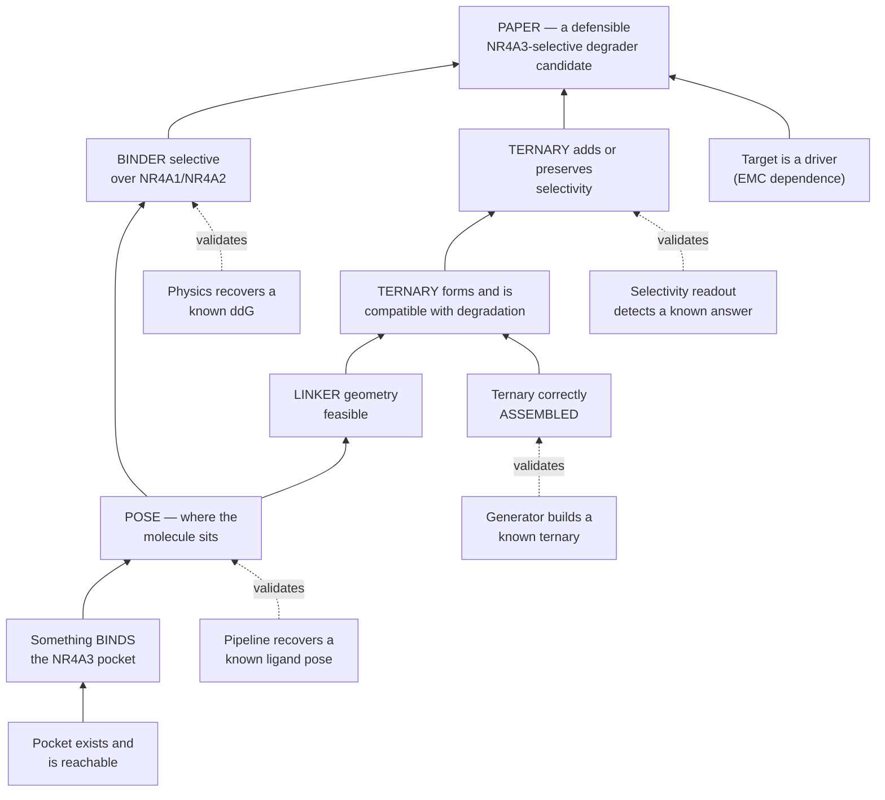
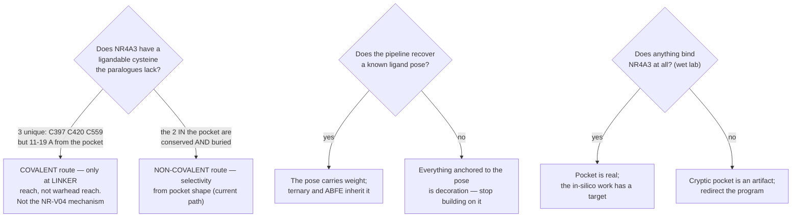

# NR4A3 degrader — the program dependency map

**What has to be true before the paper can present an NR4A3-selective degrader candidate.**

★ **WHY THIS FILE EXISTS (trimcrae, 2026-08-02): *"I feel like we're not being rigorous and have to cobble
together stuff from prose documents and it's leading to us missing things and having to constantly rediscover
connections."*** The dependencies between claims were real but existed only as prose scattered across
STRATEGY.md, the paper, the preregistrations and a dozen module docstrings — so the same connections kept
being re-derived, and blockers kept being misattributed. This is the graph.

⛔ **STATUS VALUES ARE READ FROM COMMITTED ARTIFACTS, NEVER TYPED HERE.** Every cell below points at the
artifact that owns it (rule 1). If this file and an artifact disagree, the artifact is right and this file is
the bug.

Rendered version (mermaid + status colouring): published artifact, regenerated from this file's content.

---

## 1 · The dependency graph

Read upward: a box can only be claimed once everything feeding it holds. **Dashed edges are validation
dependencies** — the instrument that produces a claim must itself have been shown to work.

---

## 2 · The instrument layer — the thing that keeps getting rediscovered

An instrument that has never recovered a known answer **cannot support a claim**, however good its output
looks. This table is why three separate selectivity results had to be withdrawn.

| instrument | known-answer test | result | status |
|---|---|---|---|
| Structural selectivity descriptor (`selcal_interface_signature`) | recover the published SMARCA2 Gln1469↔VCB hydrogen bond, unaided, from two crystals | Gln98 Oε1→Arg12 Nη2 **2.88 Å** vs Leu1545 | **PASSES** |
| Ternary generator given both sites (assembly route) | rebuild 6HAX (in-set) and 9DTY (post-horizon) | DockQ 0.618 / **0.839**, iRMSD 0.67 Å | **PASSES** |
| Interface-mutation physics (pmx/GROMACS) | barnase–barstar Y29A vs published ΔΔG | +4.42 ± 1.08 vs +3.4 | **PASSES** |
| Sequence-only co-folding (Boltz-2 ternary) | reproduce 9DTY/9DTX from sequence + ligand | DockQ 0.023–0.046 ≈ true structure moved 32 Å | **FAILS** |
| Interface-stability endpoint (E1) | three attempts: cooperativity calibrator, NR-V04 retrospective, SMARCA2/4 control | wrong sign · p = 0.393 · p = 0.747 | **no pass** |
| Ligand pose prediction (dock + MM-GBSA) | recover a known holo pose in a nuclear receptor from apo | — | **running** |
| Selectivity free energy (ABFE) | CREBBP vs BRD4(1) / SGC-CBP30, ΔΔG ≈ 2.2 kcal/mol | — | **built, never run** |

★ **The pattern.** Every instrument put to a known-answer test either passed cleanly or failed cleanly. Every
claim that later had to be withdrawn came from an instrument that had never been tested. The test costs
close to nothing; skipping it has cost three retractions.

---

## 3 · Where each claim stands

| claim | evidence today | what would settle it | status |
|---|---|---|---|
| **A pocket exists** | 4 of 20 conformers of the experimental apo NMR ensemble **8XTT** are cavity-bearing, no simulation bias applied; Gate 3A (persistence after bias removal) supported | settled enough to build on; Gate 3B (equilibrium accessibility) still open | established |
| **Something binds it** | none — no ligand-bound NR4A3 structure exists, of any molecule | a thermal shift / SPR / NMR fragment screen. **Cheapest decisive experiment in the program**, and a negative is as useful as a positive | **blocked** |
| **The pose is right** | docked into the opened frame + MM-GBSA re-dock across the four cavity-bearing conformers; never validated | known-answer test on a nuclear receptor with apo *and* holo deposited, plus convergence between independent methods | running |
| **The binder is paralogue-selective** | predicted margin only; the paper's own reading is that selectivity, if any, rests here rather than on the ternary | paralogue ABFE with replicate-SD error bars — *after* CREBBP/BRD4 shows the method recovers a known ΔΔG | predicted |
| **A ternary forms** | predicted for all three paralogues at comparable confidence, built by the failing route — and the molecule used is **unrecoverable**, so it cannot be replicated | rebuild by the assembly route from a recorded molecule | predicted |
| **The ternary adds selectivity** | one sequence-encoded candidate (Glu208 → Pro in NR4A1, Tyr in NR4A2); five further hits were placement artifacts; reproducibility untested at one model per arm | credible ternaries × ≥3 models per paralogue, scored by the validated descriptor | **not yet** |
| **NR4A3 is the right target** | transfer prior from fusion-addicted sarcomas; near-invariant clonal fusion in a quiet genome; no loss-of-function experiment in any EMC model | the dTAG degradation test — delegated to the EMC-program paper | outside scope |

---

## 4 · Branches still open

⚠ **The asymmetry worth noticing:** two of these three branches have a **"no" outcome that SAVES the program
effort**, and both are cheap. Neither had been run before 2026-08-02.

### Branch 1 — ANSWERED 2026-08-02 ([`nr4a3-covalent-handle-ensemble.json`](../modalities/nr4a3-covalent-handle-ensemble.json))

NR4A3 has **three** cysteines the paralogues lack — C397, C420, C559 — measured across all 20 conformers of
the experimental 8XTT ensemble. **But uniqueness and pocket-proximity sit on opposite residues:**

| | in the pocket | NR4A3-unique |
|---|---|---|
| C496, C536 | **yes** (2.7–6.4 Å) | no — conserved in all three, and buried (SG SASA ≤ 11 Ų) |
| C397, C420, C559 | no — **11–19 Å**, linker-tether range | **yes**, and exposed |

⛔ **AND THE CRITERIA FAILED THEIR OWN POSITIVE CONTROL.** NR4A1 **Cys551** — the site a real degrader is
believed to use — does not pass the pre-specified exposure cutoff (RSA 0.165 against 0.25) in **0 of 25**
frames. The thresholds were **not moved**; a test asserts the module holds no local copy of them. What
survives is a threshold-free **rank**: across all 18 NR4A-family LBD cysteines, C551 ranks **3/18** on every
accessibility observable, and the two above it are NR4A3's C397 and C420.
**So "C397 is flagged in 20/20 conformers" is worth nothing on its own** — the same criteria miss the known
site. The rank is the claim; the cutoff is not.

⚠ Two measurement caveats that change how any published RSA should be read: the thiol's **own HG proton
occludes a median 76 %** of the SG surface, so protonated-thiol RSA is not the surface a warhead reaches
(both conventions now reported); and SG SASA was quantized at 1.34 Ų by a 96-point sphere until single-atom
measures were moved to 960 points. Ranks were unchanged by the fix.
⚠ **Not answerable from what exists:** there is no experimental NR4A1/NR4A2 ensemble, so the like-for-like
ensemble comparison is a missing input, not a negative result.

---

## 5 · Critical path

Ordered by what unblocks the most, not by what is easiest.

1. **Does anything bind the pocket?** — wet lab, cheap, and the only item that can invalidate the whole
   non-covalent path. Everything below assumes a yes.
2. **Known-answer test for pose prediction.** Decides whether the pose that the ternary and the ABFE both
   inherit is worth inheriting.
3. **Is there a ligandable NR4A3 cysteine?** A yes opens a route needing no cryptic pocket at all.
4. **Rebuild the ternaries by the assembly route**, from a molecule whose structure is recorded this time.
5. **Run the CREBBP/BRD4 benchmark** before quoting any selectivity free energy. Built, never run — the
   missing known-answer test for the instrument the *binder* claim depends on.
6. **≥3 ternary models per paralogue**, then the validated descriptor. Until then no contact can be told from
   one model's accident.

---

## Provenance

Artifacts that own the numbers above:
[`selcal-interface-signature.json`](../modalities/selcal-interface-signature.json) ·
[`selcal-deepternary-headtohead.json`](../modalities/selcal-deepternary-headtohead.json) ·
[`selcal-cofold-decompose.json`](../modalities/selcal-cofold-decompose.json) ·
[`selcal-dockq-decoy-scale.json`](../modalities/selcal-dockq-decoy-scale.json) ·
[`nr4a-ternary-signature.json`](../modalities/nr4a-ternary-signature.json) ·
[`selcal-xtal-census.json`](../modalities/selcal-xtal-census.json).

⛔ No claim on this page asserts NR4A3 selectivity, efficacy or clinical readiness; predicted quantities are
labelled as predictions throughout.
