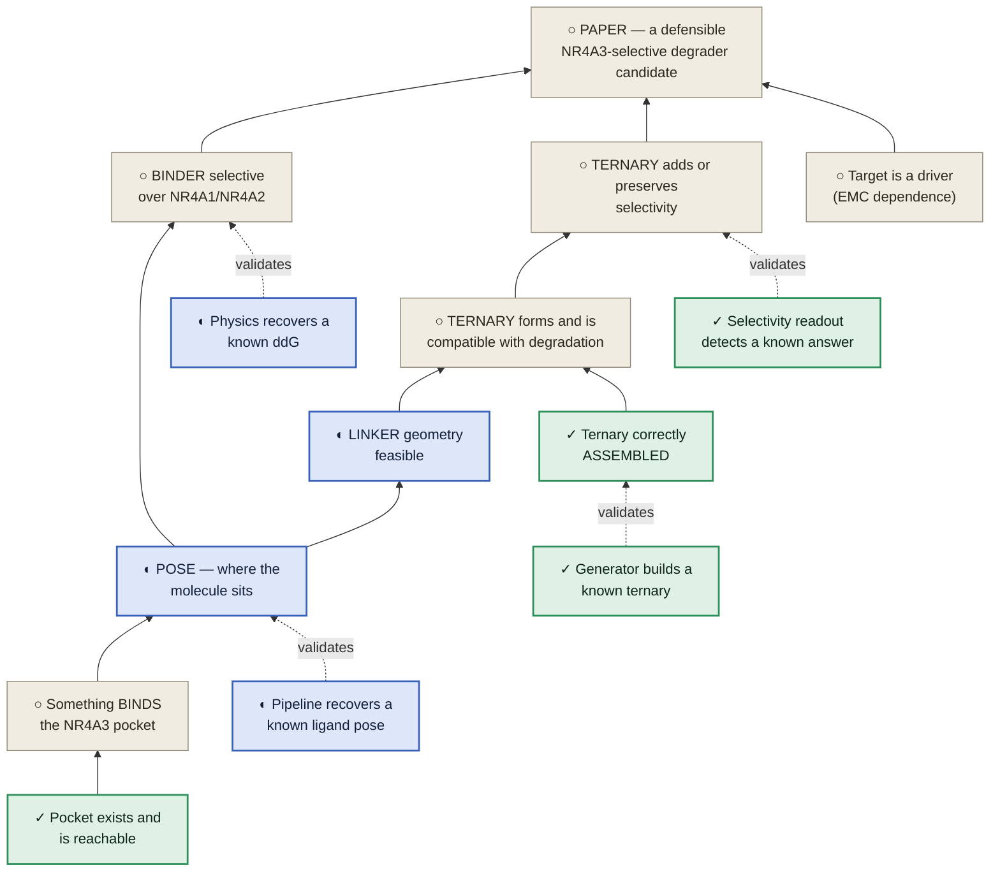
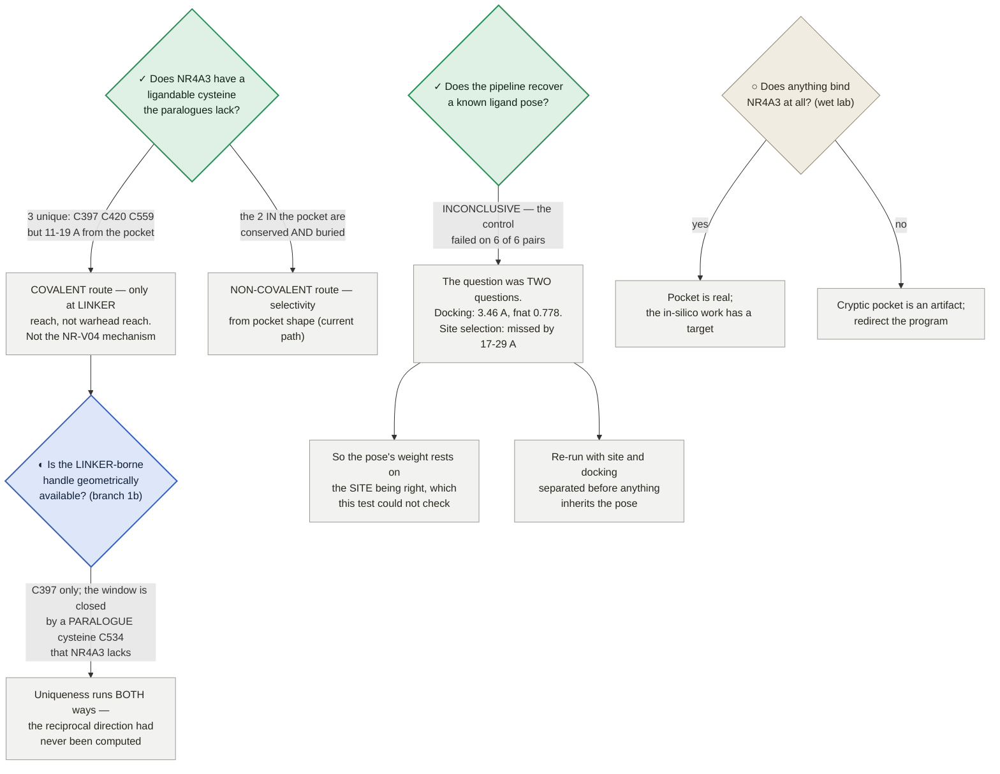
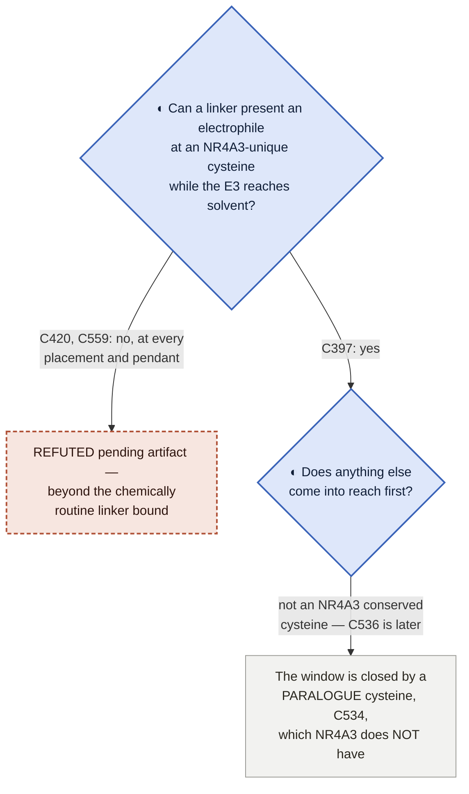

# NR4A3 degrader — the program dependency map

**What has to be true before the paper can present an NR4A3-selective degrader candidate.**

★ **WHY THIS FILE EXISTS (trimcrae, 2026-08-02): *"I feel like we're not being rigorous and have to cobble
together stuff from prose documents and it's leading to us missing things and having to constantly rediscover
connections."*** The dependencies between claims were real but existed only as prose scattered across
STRATEGY.md, the paper, the preregistrations and a dozen module docstrings — so the same connections kept
being re-derived, and blockers kept being misattributed. This is the graph.

⛔ **STATUS VALUES ARE READ FROM COMMITTED ARTIFACTS, NEVER TYPED HERE.** Every cell below points at the
artifact that owns it (rule 1). If this file and an artifact disagree, the artifact is right and this file is
the bug.

Rendered version (mermaid + status colouring): published artifact, regenerated from this file's content.

---

## 0 · Reading the states

★ **A state here is WORK STATUS, not evidence quality (trimcrae, 2026-08-02).** An earlier pass coloured this
page by how good the evidence was, which is a different question and not the one you steer by: a claim can
rest on excellent evidence and still be blocked, and a dead end can be *very* well established. These five
states answer "what should I do about this?" — and every node, row and route below carries exactly one.

| state | glyph | means | what to do |
|---|---|---|---|
| **complete** | ✓ | ran, returned, and the result is recorded in a committed artifact | cite it; don't re-run it |
| **in work** | ◐ | dispatched or building right now | wait for it; don't start a second copy |
| **future work** | ○ | not started, and nothing is blocking it except sequence | this is where new effort goes |
| **parked** | ⏸ | failed with today's tools, but a better tool could change the answer | **name the capability** that reopens it — [method-watch.md](../method-watch.md) |
| **dead end** | ✕ | **conclusively proven unworkable** — no future development reopens it | **never retry** — see §2 |

⛔ **✕ MEANS CONCLUSIVELY PROVEN UNWORKABLE — NOT "WE TRIED IT AND IT DIDN'T WORK" (trimcrae, 2026-08-02:
*"A dead end should be like, we have conclusively proven that avenue can't work"*).** The test is a single
question: **is there any future development that would make us retry this?** If yes, it is not dead. So ✕
requires positive evidence of impossibility — a structural confound no sample size fixes, arithmetic that
cannot reach the criterion, a premise shown false, an artifact that can never be regenerated. A method that
merely *failed* is ⏸ **parked**, and CLAUDE.md §5 is explicit that parked items are "revisit when capability X
lands", not dead. Conflating the two is expensive in both directions: it buries live options, and it invites
re-running things that cannot work.

⚠ **AND THE TEST IS CONCLUSIVENESS, NOT WHAT KIND OF BOX IT IS.** An earlier version of this page marked the
PAPER node ✕, which was wrong — the paper is blocked, and nothing shows it cannot be written. I then
over-corrected into a rule that claims and goals may *never* be ✕, which is also wrong: **a claim that has been
refuted is dead, and should say so.** The reason §1's graph currently carries no ✕ is not that its boxes are
exempt — it is that no claim on it has been refuted. If one is, it gets a ✕ like anything else.

⚠ **And a ✓ never means "the claim is true"** — it means the *work item* finished. Sequence-only co-folding's
known-answer test completed cleanly and returned a clear negative, which is why it is ⏸ rather than ○: the work
is done, the avenue is not. §3 says what each result supports.

**Colour is redundant with the glyph, by design** — every mermaid block below defines the same five classes, so
a state is readable without it: `done` #2f8f5b · `work` #3a63b8 · `next` #8d8674 · **`parked` #6f4a9b (dashed
2 3)** · `dead` #b1543a (dashed 5 3). ⏸ and ✕ are both dashed because both mean *stop here*; the dash pattern
and the hue separate "waiting on a capability" from "never again". **No node in §1 or §5 currently carries ⏸ or
✕** — every parked and dead item is an *approach*, and approaches live in §2 while those graphs carry claims and
questions. The classes are defined anyway so a future refuted claim or parked branch renders correctly the day
it is added, rather than being coloured ad hoc.

---

## 1 · The dependency graph

Read upward: a box can only be claimed once everything feeding it holds. **Dashed edges are validation
dependencies** — the instrument that produces a claim must itself have been shown to work. Node glyphs carry
the state, so the graph reads the same without colour. **No node here is ✕ today** — not because claims are
exempt from being dead, but because none of these has been refuted. An unreached claim is ○; the approaches
that *were* conclusively closed are in §2.

⚠ **PAPER is ○, not ✕ — the goal is blocked, not refuted.** Its two feeders are what block it: the ternary
claim rests on a molecule that cannot be recovered, so it needs the §6 step-4 rebuild, and the binder claim
rests on a free-energy engine that has never recovered a known ΔΔG, so it needs the §6 step-5 benchmark. Both
of those are ◐ or queued, and neither is a dead end. **The refuted *approaches* underneath them are in §2 —
that is the distinction the states exist to keep visible.**

---

## 2 · The closed-route register — ✕ dead, ⏸ parked, ↩ superseded

★ **BUILT BY SWEEP, NOT BY MEMORY (2026-08-02).** The first version of this table held seven hand-picked rows,
which prompted the objection that started this rebuild: ***"I'm a little surprised that nothing is a dead end
at all. I feel like we've had a lot of dead ends both in this whole project and even just today"*** (trimcrae).
The sweep behind the rows below covers **STRATEGY.md Appendix A** (65 numbered corrections) and **Appendix B**
(6 superseded framings), the **paper's** and **SI's** retracted results,
[`nr4a3-degrader-next-steps.md`](../modalities/nr4a3-degrader-next-steps.md), the modules' own `REFUTED` /
`NOT RECOVERED` / `CANNOT` verdicts, and the operational fact files
([vast-placement-facts.md](../compute/vast-placement-facts.md),
[gcp-gpu-facts.md](../compute/gcp-gpu-facts.md), [bid-strategy.md](../compute/bid-strategy.md)).

⚠ **THE COUNT IS SMALL ON PURPOSE, AND THE REASON IS THE POINT.** Appendix A is overwhelmingly **↩ superseded
numbers** — a value corrected, a rate re-measured, an ETA that was wrong. Importing those as dead ends would
inflate this table into uselessness and would be exactly as misleading as the under-count it replaced. **A
corrected number is history; a closed avenue is a decision.** Roughly one Appendix A row in ten describes an
*approach* that died, and only those are here.

**The three states, and the one question that separates them:**

| | means | test |
|---|---|---|
| **✕ dead** | positive evidence the avenue **cannot** work | *Is there any future development that would make us retry this?* **No.** |
| **⏸ parked** | it failed with today's tools; a better tool could change the answer | **Yes** — and the row must **name** what has to land ([method-watch.md](../method-watch.md)) |
| **↩ superseded** | a number, framing or plan replaced by a better one | not an avenue at all — it lives in [Appendix A / B](../../STRATEGY.md#appendix-a--superseded-numbers-and-retracted-claims) and is **deliberately not copied here** |

---

### 2a · ✕ DEAD — conclusively unworkable, never retry

**Science.** Each row answers *no* to the test above, and says which kind of impossibility it is: a **confound
in the system** no instrument sees past, **arithmetic** that cannot reach the criterion, a **premise shown
false**, an **artifact that can never be regenerated**, or a **definitional** contradiction.

| ✕ approach | why nothing reopens it | evidence |
|---|---|---|
| **NR-V04 as the positive control** for paralogue-selectivity detection | *Confound in the system.* Its selectivity is attributed to a covalent bond at a cysteine NR4A2/NR4A3 **lack**, so a geometry readout passes for the wrong reason. No sample size and no better method fixes a confound that lives in the test system rather than the instrument | Cys551 unique to NR4A1 ([`nrv04-cys-conservation.json`](../modalities/nrv04-cys-conservation.json)); celastrol C6→S **28.42–39.11 Å** against an 8.0 Å limit and a ~1.8 Å bond ([`structural-provenance-census.json`](../modalities/structural-provenance-census.json)) |
| **Crystal-copy MD design for the E1 control** | *Arithmetic.* 9DTX's asymmetric unit holds a single ternary, so matched arms are one copy each, the permutation reference set is 2, and the **minimum attainable *p* is 0.5** against α = 0.05 — the test cannot reject however it is run. ⚠ Scoped honestly: this is dead **on the deposits that exist**. A future multi-copy SMARCA4 ternary deposit would change it — that is new *data*, not a capability, and it is on no watch list | 9DTY 8 copies / 9DTX 1; `design.can_reach_alpha: false`, `min_attainable_p: 0.5` ([`selcal-xtal-census.json`](../modalities/selcal-xtal-census.json)) |
| **Covalent warhead at an NR4A3 pocket cysteine** | *Definitional.* The only two cysteines inside the pocket band are **conserved in all three paralogues** — a residue the paralogues share cannot discriminate between them. Both are also fully buried, so it fails twice over | C496 (3.33 Å from the pocket) and C536 (6.74 Å) both `unique_vs_both: false`, SG SASA **0.0 Ų** ([`nr4a3-covalent-handle-ensemble.json`](../modalities/nr4a3-covalent-handle-ensemble.json)) |
| **The §2.5 ternary result** | *Unregenerable artifact.* The molecule folded is unrecoverable — no bond-order record in any of the three models, and it entered as an unlogged environment variable. That specific **result** can never be replicated or extended by anyone, us included | `n_recovered: 0` of 3 arms; "no `_chem_comp_bond` loop" on each ([`nr4a-ternary-ligand-provenance.json`](../modalities/nr4a-ternary-ligand-provenance.json)) |
| **Constrained-embed prep for the ternary generator** | *Premise false.* The generator's own unbound protocol **supplies the native pose**, so there was never a generated conformer for us to constrain. Refuted by its released benchmark data, for $0, before it was built | shipped `ligand.pdb` ≡ native, **0.000 Å over 66 heavy atoms** ([`selcal-deepternary-frame.json`](../modalities/selcal-deepternary-frame.json); [Appendix A 65](../../STRATEGY.md#appendix-a--superseded-numbers-and-retracted-claims)) |
| **Single-snapshot MM-GBSA `margin > 0` as a selectivity verdict** | *Arithmetic, twice.* **(i)** 38 unrelated marketed drugs through the identical funnel score a positive NR4A3 margin **22 of 38 (58 %)** and `confirmed_selective` **15 of 38 (39 %)** — caffeine, ibuprofen, lidocaine, phenytoin among them — while the developability-gated de-novo set reaches only **2 of 11 (18 %)**, i.e. *below* its own null. **(ii)** De-noising the same molecules gives per-margin **SD ≈ 4–6 kcal/mol, larger than the margins themselves**: the best lead, `denovo_393` at **+18.34**, becomes **−2.95 ± 3.65**, while the negative control stays negative, so the tier is discriminating and the harvest is still noise. A signal smaller than its own noise is not recoverable by any downstream method | the 38 committed decoy margins, `DECOY_2026_06_30` in [`selectivity_calibration.py`](../modalities/selectivity_calibration.py) ("`margin > 0` is meaningless"); multi-snapshot reversal in [next-steps.md](../modalities/nr4a3-degrader-next-steps.md); paper §2.5 retraction of "MM-GBSA-confirmed selective" |
| **The valB closure triangle as a *diagnostic* for the wrong-sign miss** | *Proof.* Under the live hypothesis (branch A) every named error class is a per-endpoint **state function** or is external to the calculation, and closure is **identically zero** for all of them — so the triangle returns a clean `R` whether or not the program's actual problem exists. It cannot discriminate "the method is right" from "the model is wrong". Under branch B it duplicates the cheaper forward/reverse leg and goes stale on the fix | `branch_A.verdict: "REFUTED for diagnosis"`, `can_closure_see_that_class: false` ([`valb-triangle-closure.json`](../modalities/valb-triangle-closure.json)). ⚠ The triangle still yields a path-error floor and an endpoint-consistency check — those are **not** dead; the *diagnosis* is |
| **The one-pendant linker grid as a route to a two-mechanism molecule** | *Architectural.* `build_smiles`'s template carries **one branch residue**, so no choice of segments, length or placement can emit a molecule carrying both a covalent handle and the causal wedge — every sweep over the grid searched a space that structurally cannot contain the answer. The branch floor `k = 3 + SEG2 + tail` is independent of SEG1 and of chain length, and `SEG2 = 0` would form an acylurea, so **no grid change reaches k < 4** | [`linker-branch-reach.json`](../modalities/linker-branch-reach.json) + 7 tests ([`tests/test_linker_branch_reach.py`](../modalities/tests/test_linker_branch_reach.py)); [Appendix A 55](../../STRATEGY.md#appendix-a--superseded-numbers-and-retracted-claims). ⚠ The **fix** is a two-branch template at n = 18 with existing segments — that is a live design change, not a re-grid |
| **Reading Gate 3B off a *single* biased F(Rg) profile** | *Premise false.* Three independent-seed replicas do **not** reconstruct a common F(Rg): the basin sits at a different Rg in each, and the basin→druggable ΔF differs by many kcal/mol. The ~0.6 kcal/mol single-trajectory accessibility estimate is therefore an artifact of one profile, and no single profile can be read that way again. ⚠ **Gate 3B itself is open, not dead** — only this way of answering it is closed | `_interpretation`: "the replicas do NOT reconstruct a common F(Rg) … Gate 3B is unresolved" ([`nr4a3-metad-crossreplica.json`](../modalities/nr4a3-metad-crossreplica.json)); withdrawn in paper §2.2 |

**Operations.** Compute-side routes that were tried and cannot work. They are here because they cost real
sessions and keep being re-proposed, and because §6's rules point at them rather than restating them.

| ✕ approach | why nothing reopens it | evidence |
|---|---|---|
| **Raising the GCP `GPUS_ALL_REGIONS` quota to fan out** | *Unavailable **and** wrong on its own terms.* Repeatedly requested, repeatedly refused for an account this size — and the binding ceiling was never the quota: at ~$292 of remaining credit and ~$0.71/L4-h the **dollar** ceiling is ~411 L4-h, so the 1,824 GPU-h it claimed to unlock was never purchasable. At quota 4 the same credit is simply spent 4× faster. The 1-GPU cap is treated as a fixed property of the lane | [Appendix A 20](../../STRATEGY.md#appendix-a--superseded-numbers-and-retracted-claims); [gcp-gpu-facts.md §1](../compute/gcp-gpu-facts.md) |
| **Paying a bid premium to buy host retention on Vast** | *Refutable form, and the market is nowhere near it.* Vast's own documentation puts on-demand renters ahead of every interruptible bid, so a premium buys protection against only part of the hazard; and the break-even needs **105 preemptions/hour per $/hr of premium**, which no market in excess supply delivers. The reload that once justified `×1.9` was **self-inflicted** — our reaper DELETEd paused instances. Retention is bought with checkpoint frequency, which is free | [bid-strategy.md](../compute/bid-strategy.md) F2 / R2 / R5; [Appendix A 3](../../STRATEGY.md#appendix-a--superseded-numbers-and-retracted-claims) |
| **A durable, cross-lane machine blacklist** | *No evidence could ever retire an entry.* The defect was never that a given host was wrongly excluded — it is that nothing aged out, so the set was a one-way ratchet on the one quantity that must stay wide. The asymmetry decides it: re-learning a bad host costs one **free** failed submit, over-excluding costs capacity on every lane, silently | `DURABLE_EXCLUSIONS_ENABLED = False` ([`vast_machine_blacklist.py`](../modalities/vast_machine_blacklist.py)), held by [`tests/test_blacklist_retired.py`](../modalities/tests/test_blacklist_retired.py); [vast-placement-facts.md §1a′](../compute/vast-placement-facts.md); [Appendix A 59](../../STRATEGY.md#appendix-a--superseded-numbers-and-retracted-claims) |
| **Anytime-valid sequential stopping as a cost lever on this ladder** | *Arithmetic.* An anytime-valid bound must hold under *every* stopping time, so at n = 2–4 with σ ≈ 0.7 it never fires. Measured saving on this ladder: **0.8–2.6 %**, against the ~20–25 % claimed. Real for long horizons; a 5-replicate ladder is structurally too short, and no implementation changes that | [`valb_rescope_design.py`](../modalities/valb_rescope_design.py); [Appendix A 17](../../STRATEGY.md#appendix-a--superseded-numbers-and-retracted-claims) — **do not carry it in any total** |

---

### 2b · ⏸ PARKED — failed with today's tools, with a named trigger to reopen

★ **Parked is not a softer dead.** CLAUDE.md §5 is explicit that these are *"revisit when capability X lands"*,
and [method-watch.md](../method-watch.md) is where the triggers are watched. **Filing one of these as dead
would bury a live option**; filing a dead one here would invite re-running something that cannot work.

| ⏸ approach | how it failed | what has to land to reopen it |
|---|---|---|
| **Sequence-only co-folding to generate ternaries** | The two halves are assembled wrongly, not approximately: target↔E3 **DockQ 0.023–0.046, fnat 0.000** — zero native interface contacts — while the internal VHL/EloB/EloC machinery scores 0.89–0.97. Two independent DockQ implementations agree | a co-folder evaluated on ternary **assembly** rather than per-chain pocket accuracy. Boltz-2 failing is not the class failing, and the same harness already recognises a correct ternary (DeepTernary, given both sites, reaches **0.839** on the same interface) — so the plumbing is not what missed |
| **E1 interface-stability endpoint as a selectivity readout** | **Two** independent attempts, no pass: *p* = 0.393 (DISCORDANT) on the NR-V04 retrospective, *p* = 0.747 (NULL) on the SMARCA2/4 control — the second on an **adequately-powered** design with zero technical failures and a reference-set floor of 0.00216 against α = 0.05. Consequence already taken: the NR4A1/2/3 re-panel prereg is **retired unrun** | a readout with power at achievable sampling, or a system whose effect is large enough for E1's resolution. ⚠ Two failures is strong evidence, **not proof of impossibility** — and the SMARCA2/4 null bounds *the workflow as run*, since its co-folds never reproduced the interface under test. ⛔ **The valB_mini wrong sign is NOT a third E1 failure** — it is alchemical ternary FEP, a different instrument, and STRATEGY's control table exists to stop exactly that sum |
| **The 19th congeneric edge (`cw_bio_nmethyl_amide`)** | No available mapper reaches the 20-atom provable floor — best is 19, and the budget is **not** binding (identical maps at t20 and t300), so more search time buys nothing. The one map that does reach 20 gets there by mapping a carbon onto a hydrogen | an atom mapper that reaches the floor **without** a degenerate correspondence. The artifact names the trigger itself: *"not a retry candidate until a mapper reaches 20"* ([`step1-map-diag.json`](../modalities/step1-map-diag.json)) |
| **Charge-changing alchemical edges** | Blocks 8 legs of the step-1 fan-out, and killed the valB rescope's high-contrast route: **6 of 10** P-series pairs change formal charge (including P1→P4), and the 4 that do not perturb **58–80 heavy atoms** against 2 for the running edge | a validated charge-change correction in this lane (co-alchemical ion / finite-size treatment). ⚠ Even with it the P-series stays a poor calibrator on perturbation size alone — the correction reopens the *edges*, not that *design* ([`valb-pseries-chem.json`](../modalities/valb-pseries-chem.json); [Appendix A 18](../../STRATEGY.md#appendix-a--superseded-numbers-and-retracted-claims)) |
| **E3 recruiter breadth beyond CRBN + VHL** | Availability was the **wrong constraint**; structural stageability binds. Of 10 recruiters, RNF114 has no deposited structure at all, DCAF16's ligand is 34 % buried with its partner removed (a glue interface, not a handle pocket), and DCAF15 has no partner-free liganded structure. The widening **confirmed** CRBN + VHL rather than displacing them | a deposited partner-free liganded structure for one of the blocked recruiters. A real negative to report, not to absorb ([`e3-recruiter-downselect-2026-07-25.md`](../modalities/e3-recruiter-downselect-2026-07-25.md); [Appendix A 19](../../STRATEGY.md#appendix-a--superseded-numbers-and-retracted-claims)) |
| **Track A — qualify `denovo_401` as a lead via repaired ABFE** | Shelved 2026-07-15 by reviewer verdict; `denovo_401` is a **side comparator / benchmark, not a lead**, and the FEP tier it needs is ceiling-bound and least reliable on a cryptic, induced-fit pocket | cheaper or more reliable free energy on cryptic / induced-fit pockets — an existing [method-watch.md](../method-watch.md) row. Parked, **not deleted** ([Appendix B](../../STRATEGY.md#appendix-b--superseded-strategy-framings)) |

---

### 2c · ↩ SUPERSEDED — not here, and that is deliberate

A corrected number, a replaced framing or a retracted claim is **history, not a closed avenue**, and it has one
home: [STRATEGY.md Appendix A and B](../../STRATEGY.md#appendix-a--superseded-numbers-and-retracted-claims).
Copying any of it into this table would break rule 1 and would drown the rows above — which are the ones that
change what anyone does next. **Only the ~1-in-10 Appendix A rows where the *approach* died, rather than the
value, appear in §2a or §2b, each citing its Appendix row.**

⚠ **What this register is still missing, stated rather than left implicit.** The MM-GBSA decoy null's primary
run output lives in S3, not in a committed JSON; what *is* committed is the 38-margin constant
`DECOY_2026_06_30` and the paper's §2.5 text. That is enough to grade the row — the arithmetic can be redone
from the constant — but it is the weakest evidence chain in §2a, and it is the only row here whose refutation
is not readable end-to-end from a committed artifact.

---

## 3 · The instrument layer — the thing that keeps getting rediscovered

An instrument that has never recovered a known answer **cannot support a claim**, however good its output
looks. This table is why three separate selectivity results had to be withdrawn.

| instrument | known-answer test | result | state |
|---|---|---|---|
| Structural selectivity descriptor (`selcal_interface_signature`) | recover the published SMARCA2 Gln1469↔VCB hydrogen bond, unaided, from two crystals | Gln98 Oε1→Arg12 Nη2 **2.88 Å** vs Leu1545 | ✓ complete — **PASSES** |
| Ternary generator given both sites (assembly route) | rebuild 6HAX (in-set) and 9DTY (post-horizon) | DockQ 0.618 / **0.839**, iRMSD 0.67 Å | ✓ complete — **PASSES** |
| Interface-mutation physics (pmx/GROMACS) | barnase–barstar Y29A vs published ΔΔG | +4.42 ± 1.08 vs +3.4 | ✓ complete — **PASSES** |
| Selectivity free energy (ABFE) | CREBBP vs BRD4(1) / SGC-CBP30, ΔΔG ≈ 2.2 kcal/mol | solvent leg dispatched; full pass priced | ◐ in work |
| Ligand pose prediction (dock + MM-GBSA) | recover a known holo pose in a nuclear receptor from apo | **INCONCLUSIVE by its own pre-registered rule** — the C1 holo self-dock control failed through the pipeline's own box on **6 of 6 pairs across 3 receptors** (17.3–29.3 Å), so the primary arm measured the *site*, not the docking. With an fpocket-chosen box the same protocol recovers **3.46 Å, fnat 0.778, 7 of 9 native contacts** | ✓ complete — verdict INCONCLUSIVE |
| Sequence-only co-folding (Boltz-2 ternary) | reproduce 9DTY/9DTX from sequence + ligand | DockQ 0.023–0.046 ≈ true structure moved 32 Å | ⏸ parked — **FAILS** (§2b) |
| Interface-stability endpoint (E1) | **two** attempts: NR-V04 retrospective, SMARCA2/4 sensitivity control | *p* = 0.393 (DISCORDANT) · *p* = 0.747 (NULL, adequately powered) | ⏸ parked — **no pass** (§2b) |
| Alchemical ternary cooperativity (valB_mini ΔΔG_coop) | reproduce a known cooperativity, +0.944 kcal/mol | **−0.599** — wrong sign in all 3 replicates, ~34× the statistical uncertainty | ✓ complete — **FAILS**, systematically |

★ **The pattern.** Every instrument put to a known-answer test either passed cleanly or failed cleanly. Every
claim that later had to be withdrawn came from an instrument that had never been tested. The test costs
close to nothing; skipping it has cost three retractions.

---

## 4 · Where each claim stands

The **state** column is the work item that would move the claim, not a grade on the evidence.

| claim | evidence today | what would settle it | state |
|---|---|---|---|
| **A pocket exists** | 4 of 20 conformers of the experimental apo NMR ensemble **8XTT** are cavity-bearing, no simulation bias applied; Gate 3A (persistence after bias removal) supported | settled enough to build on; Gate 3B (equilibrium accessibility) still open | ✓ complete |
| **Something binds it** | none — no ligand-bound NR4A3 structure exists, of any molecule | a thermal shift / SPR / NMR fragment screen. **Cheapest decisive experiment in the program**, and a negative is as useful as a positive | ○ future — **needs a wet lab** |
| **The pose is right** | ⛔ the known-answer test **ran and returned INCONCLUSIVE** ([`apo-pose-recovery.json`](../modalities/apo-pose-recovery.json)) — and its decomposition splits the question in two: the **docking** is fine (3.46 Å blind from apo, fnat 0.778), the **site selection** is what missed, on 6 of 6 pairs | re-run the primary arm with the site question separated from the docking question — see §5 branch 2 | ✓ test complete, claim **unresolved** |
| **The binder is paralogue-selective** | predicted margin only; the paper's own reading is that selectivity, if any, rests here rather than on the ternary | paralogue ABFE with replicate-SD error bars — *after* CREBBP/BRD4 shows the method recovers a known ΔΔG | ○ future — gated on ◐ |
| **A ternary forms** | predicted for all three paralogues at comparable confidence, built by the failing route — and the molecule used is **unrecoverable**, so it cannot be replicated | rebuild by the assembly route from a recorded molecule | ○ future — the *result* is ✕ (§2a, unregenerable), the *route* that built it is ⏸ (§2b), the claim is open |
| **The ternary adds selectivity** | one sequence-encoded candidate (Glu208 → Pro in NR4A1, Tyr in NR4A2); five further hits were placement artifacts; reproducibility untested at one model per arm | credible ternaries × ≥3 models per paralogue, scored by the validated descriptor | ○ future |
| **NR4A3 is the right target** | transfer prior from fusion-addicted sarcomas; near-invariant clonal fusion in a quiet genome; no loss-of-function experiment in any EMC model | the dTAG degradation test — delegated to the EMC-program paper | ○ future — outside scope |

⚠ **Only one claim on this page is ✓, and it is the bottom one.** That is the honest shape of the program:
everything above the pocket is either running, waiting on something running, or waiting on a bench.

---

## 5 · Branches still open

Question nodes carry the state of **the branch itself**: ✓ answered, ◐ being answered now, ○ not started.
Outcome boxes are grey — they are consequences, not work items.

⚠ **The asymmetry worth noticing:** two of these three branches have a **"no" outcome that SAVES the program
effort**, and both are cheap. Neither had been run before 2026-08-02 — and the two that were run then are the
two now marked ✓.

### Branch 1 — ANSWERED 2026-08-02 ([`nr4a3-covalent-handle-ensemble.json`](../modalities/nr4a3-covalent-handle-ensemble.json))

NR4A3 has **three** cysteines the paralogues lack — C397, C420, C559 — measured across all 20 conformers of
the experimental 8XTT ensemble. **But uniqueness and pocket-proximity sit on opposite residues:**

| | in the pocket | NR4A3-unique |
|---|---|---|
| C496, C536 | **yes** (2.7–6.4 Å) | no — conserved in all three, and buried (SG SASA ≤ 11 Ų) |
| C397, C420, C559 | no — **11–19 Å**, linker-tether range | **yes**, and exposed |

⛔ **AND THE CRITERIA FAILED THEIR OWN POSITIVE CONTROL.** NR4A1 **Cys551** — the site a real degrader is
believed to use — does not pass the pre-specified exposure cutoff (RSA 0.165 against 0.25) in **0 of 25**
frames. The thresholds were **not moved**; a test asserts the module holds no local copy of them. What
survives is a threshold-free **rank**: across all 18 NR4A-family LBD cysteines, C551 ranks **3/18** on every
accessibility observable, and the two above it are NR4A3's C397 and C420.
**So "C397 is flagged in 20/20 conformers" is worth nothing on its own** — the same criteria miss the known
site. The rank is the claim; the cutoff is not.

⚠ Two measurement caveats that change how any published RSA should be read: the thiol's **own HG proton
occludes a median 76 %** of the SG surface, so protonated-thiol RSA is not the surface a warhead reaches
(both conventions now reported); and SG SASA was quantized at 1.34 Ų by a 96-point sphere until single-atom
measures were moved to 960 points. Ranks were unchanged by the fix.
⚠ **Not answerable from what exists:** there is no experimental NR4A1/NR4A2 ensemble, so the like-for-like
ensemble comparison is a missing input, not a negative result.

### Branch 1b — ◐ COMPUTED BUT NOT YET VERIFIED: is the LINKER-borne handle geometrically available?

⛔ **THE ARTIFACT THIS SECTION CITES DOES NOT EXIST YET, AND THAT IS EXACTLY THE FAILURE §4 OF CLAUDE.md
DESCRIBES (caught 2026-08-02, 3:45 PM ET).** The module, workflow and tests
([`nr4a3_linker_covalent_reach.py`](../modalities/nr4a3_linker_covalent_reach.py), commit `295a08ff`) are
committed and the numbers below were reported by the agent that wrote them — but the agent was interrupted
before its run committed `nr4a3-linker-covalent-reach.json`, so **every figure in this subsection is currently
an uncommitted reported value, not a read one.** A CI run has been dispatched to produce it. Until that lands
and this banner is removed, **do not quote branch 1b anywhere**, and read every number below as provisional.
⚠ Nothing else on this page depends on it: branch 1's cysteine census is a separate, committed artifact.

Branch 1 put the unique cysteines out of *warhead* reach and inside *linker* reach, which is an invitation
rather than an answer: a PROTAC's linker passes through exactly that band, so an electrophile carried there
could ask the warhead only to bind rather than to discriminate. Measured in
[`nr4a3-linker-covalent-reach.json`](../modalities/nr4a3-linker-covalent-reach.json) (+ `.md`) — geometry
only, $0 CPU, and it **owns every number below**.

⚠ **`DEAD` is drawn dashed but carries no ✕, deliberately.** It is an *approach* (put the electrophile at
C420 or C559) rather than a claim, so it is eligible — but two things are unsettled: the artifact behind it
does not exist yet, and the bound it failed is "chemically routine linker length", which a non-routine linker
could exceed. Under §0's strict bar that is ⏸ at best, not ✕. It gets classified once the artifact lands.

Three results, in the order they change what the program should do:

1. **The recorded architectural blocker does not apply.** A linker-borne electrophile plus an E3 arm was
   taken to need the two-branch template of [`linker_twobranch.py`](../modalities/linker_twobranch.py). It
   does not: `build_smiles` places the E3 at a chain **terminus**, so the single pendant slot is free and
   the committed library already contains such one-branch constructs aimed at C397. Two branches are needed
   only to carry the electrophile *and* the RUNG-5a causal wedge together — a different molecule for a
   different experiment. Read from the enumeration, not recalled, and pinned by a test.
2. **Only C397 survives the reach test.** C420 and C559 need far more backbone atoms than the imported
   chemically-routine bound, at all ten placements of the five basins that survived term-(b), at every
   pendant reach, and under both reach conventions. Those two are closed.
3. ⛔ **The counter-test fires from the opposite direction to the one it was designed to check.** The window
   is not closed by an NR4A3 *conserved* cysteine. It is closed first by a **paralogue** cysteine —
   **NR4A1/NR4A2 C534, which aligns to NR4A3 S565**, i.e. a cysteine the paralogues have and NR4A3 lacks —
   concordant across both paralogue metadynamics ensembles as well as the single opened models. **Uniqueness runs both ways, and
   the reciprocal direction had never been computed anywhere in this repo.** A residue-uniqueness argument
   built only on "which of MY residues do they lack" is therefore incomplete by construction.

⚠ **How far these numbers may be trusted, measured rather than asserted.** The paralogue positions come from
three independently built opened models. At aligned cysteine pairs their backbones agree far better than
their side chains, so the artifact reports ΔCA against ΔSG per pair and states the sulfur displacement that
would reopen the window. The **direction** of result 3 rests on sequence plus fold-level position; the exact
backbone-atom counts do not, and must not be quoted more precisely than that record allows.
⚠ Everything here is conditional on the docked pose the anchors come from, whose known-answer test is the
`Ligand pose prediction (dock + MM-GBSA)` row above — **running, not returned**. Reach is a necessary
condition for a covalent handle and never a sufficient one: no thiol pKa, intrinsic reactivity, adduct or
degradation quantity is computed, and no selectivity, efficacy, safety or feasibility claim follows.

---

## 5b · The two live routes to selectivity — and where each is actually blocked

★ **Added 2026-08-02 after the map's first pass exposed that both routes' chemical basis was sitting in
prose while the reasoning above treated selectivity as speculative.** Selectivity has to come from somewhere
specific. Two places are real, they are **complementary rather than competing**, and a candidate could use
both.

### Route A — a warhead engaging paralogue-divergent pocket handles · ◐ **in work**

**Chemical basis: ✓ strong, and already measured** ([`nr4a-selectivity.json`](../modalities/nr4a-selectivity.json),
paper §2.4). Of the **10 Pocket-5 lining residues, 7 are paralogue-divergent** — L406, T407, T410, R412,
I484, I531, L534 — and in the opened druggable ensemble **5 stay pocket-facing** (L406, T410, I484, I531,
L534), so those five are the realistically engageable handles. T407 and R412 mostly splay outward.
★ **And all ten are ortholog-invariant across six species spanning ~300 My** (`nr4a3_resistance_map.py`) —
paralogue-divergent yet species-conserved, which is both a resistance argument and evidence the divergence is
functional rather than drift.

⛔ **Blocked on the INSTRUMENT, not the chemistry — and the instrument is ◐ running.** The margin these
handles would produce is a free-energy quantity, and the ABFE engine has **never recovered a known ΔΔG**; its
selectivity benchmark (CREBBP vs BRD4(1), SGC-CBP30) was built and staged with no `result` key, and its first
leg is now on spot. Until that returns, a computed margin is unfalsifiable. **This is the single
highest-leverage item in the program, and it is the one thing moving.**

### Route B — a linker-borne covalent handle at an NR4A3-unique cysteine · ◐ **in work**

**Chemical basis: ✓ opened 2026-08-02** by the cysteine census above. The unique cysteines C397/C420/C559 sit
11–19 Å out — *where a PROTAC's linker passes*, not where its warhead sits. So instead of asking the warhead
to discriminate an ~80 %-identical pocket, put the electrophile on the **linker** and let it react with a
residue NR4A1 and NR4A2 do not have. That is the NR-V04 mechanism relocated to where NR4A3's unique residues
actually are.

✓ **The geometry block is now ANSWERED, and the counter-test did not kill it** (branch 1b above). The feared
outcome — a **conserved** cysteine always in easier reach than a unique one — did not occur. C397 survives at
routine linker length; C420 and C559 are closed. What *does* close C397's window is a **paralogue** cysteine,
NR4A1/NR4A2 C534, aligning to NR4A3 S565 — a residue NR4A3 lacks, which is the opposite direction to the one
the counter-test was designed to check.

⛔ **What remains blocking is upstream, not here:** every anchor comes from the docked pose, whose known-answer
test is ◐ running. Reach is a necessary condition for a covalent handle and never a sufficient one.

**Why they compose:** a warhead tuned to the five engageable divergent handles *plus* a covalent linker
handle at a unique cysteine is a far stronger selectivity argument than either alone — two independent
mechanisms, each with its own falsifier.

---

## 6 · Critical path

Ordered by what unblocks the most, not by what is easiest. **The state is the item's, not the claim's.**

| # | item | state |
|---|---|---|
| 1 | **Does anything bind the pocket?** — wet lab, cheap, and the only item that can invalidate the whole non-covalent path. Everything below assumes a yes | ○ future — **the one item no computation can supply** |
| 2 | **Known-answer test for pose prediction.** Ran, returned **INCONCLUSIVE**, and split the question: the docking recovers a blind apo pose at 3.46 Å / fnat 0.778, but the pipeline's **site selection** missed the crystallographic ligand on 6 of 6 pairs. **Re-run with the two separated** — this is now the top unrun item | ✓ ran → ○ re-run needed |
| 3 | **Is there a ligandable NR4A3 cysteine?** A yes opens a route needing no cryptic pocket at all | ✓ complete — §5 branch 1 + 1b |
| 4 | **Rebuild the ternaries by the assembly route**, from a molecule whose structure is recorded this time | ◐ in work |
| 5 | **Run the CREBBP/BRD4 benchmark** before quoting any selectivity free energy — the missing known-answer test for the instrument the *binder* claim depends on | ◐ in work |
| 6 | **≥3 ternary models per paralogue**, then the validated descriptor. Until then no contact can be told from one model's accident | ○ future — gated on 4 |

★ **Read the column, not the list.** Four of the six are moving or done; the two ○ rows are gated on something
else, and item 1 is gated on a bench. There is no row here waiting on a decision.

---

## Provenance

Artifacts that own the numbers above:
[`selcal-interface-signature.json`](../modalities/selcal-interface-signature.json) ·
[`selcal-deepternary-headtohead.json`](../modalities/selcal-deepternary-headtohead.json) ·
[`selcal-cofold-decompose.json`](../modalities/selcal-cofold-decompose.json) ·
[`selcal-dockq-decoy-scale.json`](../modalities/selcal-dockq-decoy-scale.json) ·
[`nr4a-ternary-signature.json`](../modalities/nr4a-ternary-signature.json) ·
[`selcal-xtal-census.json`](../modalities/selcal-xtal-census.json).

⛔ No claim on this page asserts NR4A3 selectivity, efficacy or clinical readiness; predicted quantities are
labelled as predictions throughout.
