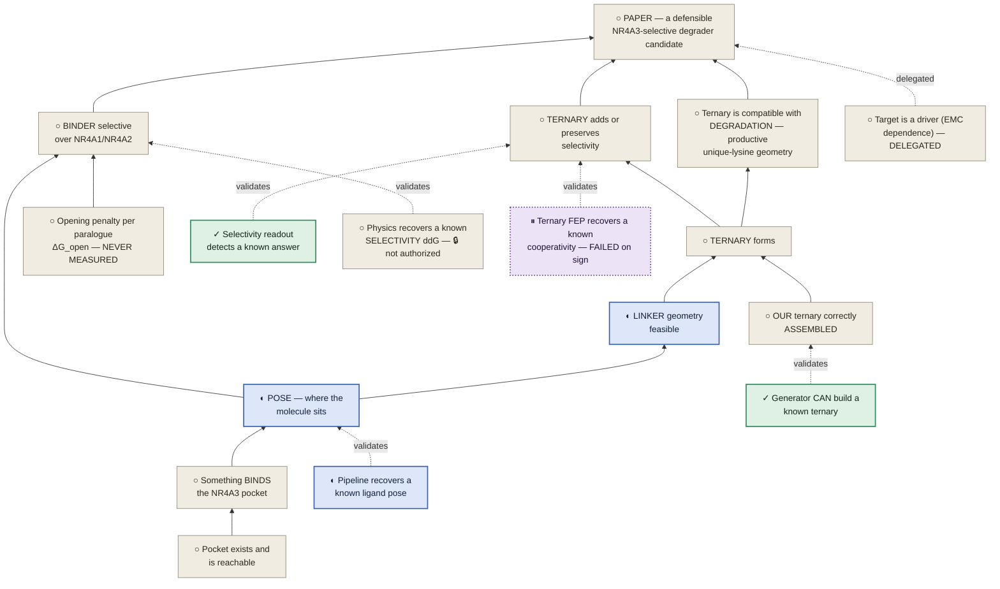
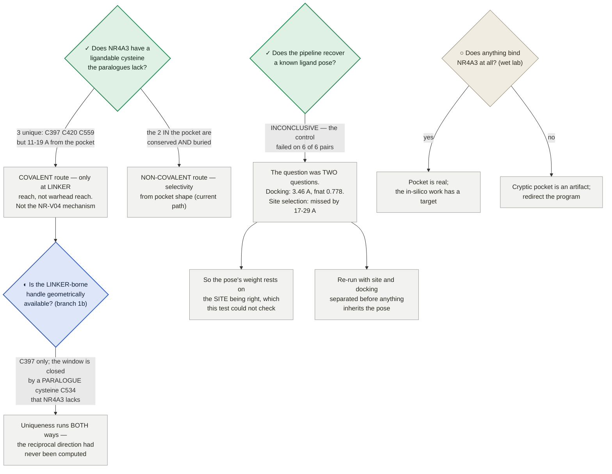
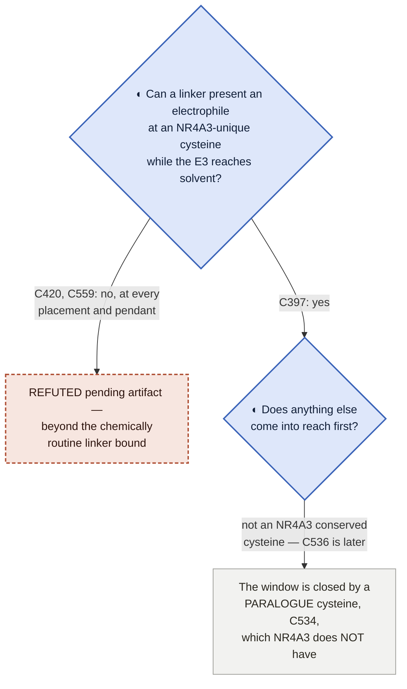

# NR4A3 degrader — the program dependency map

**What has to be true before the paper can present an NR4A3-selective degrader candidate.**

★ **WHY THIS FILE EXISTS (trimcrae, 2026-08-02): *"I feel like we're not being rigorous and have to cobble
together stuff from prose documents and it's leading to us missing things and having to constantly rediscover
connections."*** The dependencies between claims were real but existed only as prose scattered across
STRATEGY.md, the paper, the preregistrations and a dozen module docstrings — so the same connections kept
being re-derived, and blockers kept being misattributed. This is the graph.

⛔ **STATUS VALUES ARE READ FROM COMMITTED ARTIFACTS, NEVER TYPED HERE.** Every cell below points at the
artifact that owns it (rule 1). If this file and an artifact disagree, the artifact is right and this file is
the bug.

Rendered version (mermaid + status colouring): published artifact, regenerated from this file's content.

---

## 0 · Reading the states

★ **A state here is WORK STATUS, not evidence quality (trimcrae, 2026-08-02).** An earlier pass coloured this
page by how good the evidence was, which is a different question and not the one you steer by: a claim can
rest on excellent evidence and still be blocked, and a dead end can be *very* well established. These five
states answer "what should I do about this?" — and every node, row and route below carries exactly one.

| state | glyph | means | what to do |
|---|---|---|---|
| **complete** | ✓ | ran, returned, and the result is recorded in a committed artifact | cite it; don't re-run it |
| **in work** | ◐ | dispatched or building right now | wait for it; don't start a second copy |
| **future work** | ○ | not started, and nothing is blocking it except sequence | this is where new effort goes |
| **parked** | ⏸ | failed with today's tools, but a better tool could change the answer | **name the capability** that reopens it — [method-watch.md](../method-watch.md) |
| **dead end** | ✕ | **conclusively proven unworkable** — no future development reopens it | **never retry** — see §2 |

⛔ **✕ MEANS CONCLUSIVELY PROVEN UNWORKABLE — NOT "WE TRIED IT AND IT DIDN'T WORK" (trimcrae, 2026-08-02:
*"A dead end should be like, we have conclusively proven that avenue can't work"*).** The test is a single
question: **is there any future development that would make us retry this?** If yes, it is not dead. So ✕
requires positive evidence of impossibility — a structural confound no sample size fixes, arithmetic that
cannot reach the criterion, a premise shown false, an artifact that can never be regenerated. A method that
merely *failed* is ⏸ **parked**, and CLAUDE.md §5 is explicit that parked items are "revisit when capability X
lands", not dead. Conflating the two is expensive in both directions: it buries live options, and it invites
re-running things that cannot work.

⚠ **AND THE TEST IS CONCLUSIVENESS, NOT WHAT KIND OF BOX IT IS.** An earlier version of this page marked the
PAPER node ✕, which was wrong — the paper is blocked, and nothing shows it cannot be written. I then
over-corrected into a rule that claims and goals may *never* be ✕, which is also wrong: **a claim that has been
refuted is dead, and should say so.** The reason §1's graph currently carries no ✕ is not that its boxes are
exempt — it is that no claim on it has been refuted. If one is, it gets a ✕ like anything else.

⚠ **And a ✓ never means "the claim is true"** — it means the *work item* finished. Sequence-only co-folding's
known-answer test completed cleanly and returned a clear negative, which is why it is ⏸ rather than ○: the work
is done, the avenue is not. §3 says what each result supports.

### 0b · Three orthogonal axes — LEVERAGE, AUTHORIZATION, SUFFICIENCY

★★ **THE FIX THAT THIS PAGE KEPT NEEDING (trimcrae, 2026-08-02: *"If it's the highest leverage, it's the
highest leverage. Don't demote it just because I said not to launch it yet."*).** The work-state glyph above
answers *"what should I do about this?"*. It cannot also answer *"how much would it buy?"* or *"am I allowed
to buy it?"* or *"would it finish the job?"* — and every time this page tried to make one glyph carry all
four, it produced a wrong instruction. The failure is always the same shape: an item that was **not
authorized** got written down as **low value**, because the only column available to record "not now" was the
one that grades importance.

**So a row carries three independent readings, and all three can be true at once:**

| axis | question it answers | values | who owns it |
|---|---|---|---|
| **work state** (§0 above) | what should I do about this? | ✓ ◐ ○ ⏸ ✕ | the committed artifact |
| **authorization** | am I allowed to spend on this? | 🔓 **authorized** · 🔒 **not authorized** · **—** ($0, needs none) | trimcrae, via [STRATEGY.md](../../STRATEGY.md) |
| **sufficiency** | if it returned tomorrow, what would it actually discharge? | stated in words, per row — never a glyph | the claim it feeds |

⛔ **THESE ARE ORTHOGONAL, AND THE PAGE MUST NEVER COLLAPSE THEM.** The canonical row, and the one that
forced the rule, is the **CREBBP/BRD4 selectivity ABFE**:

> **highest leverage in the program · 🔒 not authorized · would not discharge the paralogue claim** —
> three true statements about one item, none of which is a reason to soften any other.

- **Leverage is earned, not granted.** It is highest-leverage because this program has **no binary
  selectivity control at all** — [STRATEGY.md:538](../../STRATEGY.md) is explicit that *"valA validates
  relative FEP **within one pocket**"* — so it would be the first evidence the free-energy engine can resolve
  selectivity **between two different proteins**, which is the capability every paralogue margin on this page
  presupposes. Nothing about a scheduling decision touches that.
- **Authorization is a scheduling fact, not a grade.** [STRATEGY.md:546](../../STRATEGY.md): *"**Neither is
  authorized here**"*. A 🔒 says *don't buy it yet*; it says nothing about what it is worth.
- **Sufficiency is scope, not demotion.** [STRATEGY.md:533–538](../../STRATEGY.md): it is a **binary**
  control and *"would **not** discharge §4's paralogue/ternary statement"*. An item can be the
  highest-leverage thing available **and** insufficient on its own.

⚠ **This is the same class of fix as separating dead from parked (§0) and work-status from evidence-quality
(§0 opening) — the third axis, found the same way, by noticing which two things a single column was being
asked to say.**

**Colour is redundant with the glyph, by design** — every mermaid block below defines the same five classes, so
a state is readable without it: `done` #2f8f5b · `work` #3a63b8 · `next` #8d8674 · **`parked` #6f4a9b (dashed
2 3)** · `dead` #b1543a (dashed 5 3). ⏸ and ✕ are both dashed because both mean *stop here*; the dash pattern
and the hue separate "waiting on a capability" from "never again". **§1 now carries exactly one ⏸ node —
`VC`, the ternary known-answer control that failed on sign — and no ✕ node.** That is the design working as
intended rather than an exception: `VC` is an *instrument*, the instrument failed, and a different ternary
free-energy method could still pass it, so ⏸ is the honest state. Everything else parked or dead on this page
is an *approach*, and approaches live in §2. **No claim node is ✕**, not because claims are exempt, but
because none has been refuted.

---

## 1 · The dependency graph

Read upward: a box can only be claimed once everything feeding it holds. **Dashed edges are validation
dependencies** — the instrument that produces a claim must itself have been shown to work. Node glyphs carry
the state, so the graph reads the same without colour. **No node here is ✕ today** — not because claims are
exempt from being dead, but because none of these has been refuted. An unreached claim is ○; the approaches
that *were* conclusively closed are in §2. **Node glyphs carry work state only — §0b's authorization and
sufficiency axes are read from the rows below, never from the graph**, which is why `V4` carries its 🔒
inline rather than being demoted to a colour.

⚠ **PAPER is ○, not ✕ — the goal is blocked, not refuted.** What blocks it, corrected 2026-08-02 after an
audit found three of these mis-stated:

- **`ARCH` is ○, not ✓ — no NR4A3 ternary has been correctly assembled by anyone.** It is the claim *"**our**
  ternary is correctly assembled"*, which [STRATEGY.md:500](../../STRATEGY.md) answers flatly:
  *"⛔ **NO, and this is the whole remaining gap.**"* (`nr4a-ternary-ligand-provenance.json`: `n_recovered: 0`
  of 3 arms.) `V2` is the *instrument* reading — the generator **can** build a known ternary, best-of-16 on
  one arm of one non-NR4A3 system — and keeping the two apart is what makes the dashed edge non-circular:
  a validated instrument that has not yet been pointed at our system. ⚠ **Superseded, retained:** the ✓ on
  `ARCH`, under which one proposition carried four different states across two files (map §1 ✓, map §4 ○,
  map §6 ◐, STRATEGY.md ⛔ NO).
- **`PO` is ○, not ✓ — the pocket is NOT settled.** See §4 row 1: preregistered **Gate 1 FAILED as
  registered**, Gate 3B is unresolved, and an open **submission gate** can invalidate the very receptor frame
  `denovo_401` was generated into. ⚠ **Superseded, retained:** `✓ Pocket exists and is reachable` and the
  phrase *"settled enough to build on"*.
- **`T` has been split.** It used to read *"TERNARY forms **and is compatible with degradation**"* — two
  claims in one box, and precisely the distinction [STRATEGY.md:1078](../../STRATEGY.md) requirement 5 exists
  to preserve: *"Ternary formation is **necessary, not sufficient** — productive lysine positioning is a
  distinct requirement."* `UB` is now that second claim, and nothing on this page had carried it.
- **`DGO` is new, and it is a way `B` can come out *backwards*.** Requirement 2
  ([STRATEGY.md:1049–1056](../../STRATEGY.md)): *"Each paralogue can have a **different opening penalty**, so
  comparing binding only in matched open receptors can **miss or REVERSE selectivity**."* Every ΔΔG on the
  binder path is conditional on a term that has never been computed — so **Route A is not blocked only on its
  instrument**, which is how this page previously read.
- **`VC` is new — the program's hardest instrument failure had no node.** The ternary known-answer control
  (`valB_mini` ΔΔG_coop, requirement 1(C)) **failed on the sign**, and
  [STRATEGY.md:1156](../../STRATEGY.md) calls it *"the highest-value dollar in the plan"*. It is ⏸ not ✕
  because the closure triangle localises the miss to an **endpoint-state** error, which more sampling cannot
  fix but a different ternary free-energy method could.
- **`TG` is a delegated edge, not a solid one.** The paper (`:2508`) puts the make-or-break dTAG test in the
  EMC-program paper and states *"This paper's claimed contribution is the target's computational
  druggability/selectivity, **not EMC efficacy**"* — so `TG` is a precondition of the *therapeutic* claim,
  not of this paper.

**The refuted *approaches* underneath these are in §2 — that is the distinction the states exist to keep
visible.**

---

## 2 · The closed-route register — ✕ dead, ⏸ parked, ↩ superseded

★ **BUILT BY SWEEP, NOT BY MEMORY (2026-08-02).** The first version of this table held seven hand-picked rows,
which prompted the objection that started this rebuild: ***"I'm a little surprised that nothing is a dead end
at all. I feel like we've had a lot of dead ends both in this whole project and even just today"*** (trimcrae).
The sweep behind the rows below covers **STRATEGY.md Appendix A** (**69** numbered corrections — ids 1–65
plus the lettered sub-rows 19a/19b/19c/19d; counted from the table, not remembered) and **Appendix B**
(6 superseded framings), the **paper's** and **SI's** retracted results,
[`nr4a3-degrader-next-steps.md`](../modalities/nr4a3-degrader-next-steps.md), the modules' own `REFUTED` /
`NOT RECOVERED` / `CANNOT` verdicts, and the operational fact files
([vast-placement-facts.md](../compute/vast-placement-facts.md),
[gcp-gpu-facts.md](../compute/gcp-gpu-facts.md), [bid-strategy.md](../compute/bid-strategy.md)).

⚠ **Superseded, retained — two wrong counts for this appendix have been in circulation.** This page once
scoped its sweep against *"~113 entries"*, and
[`map-merge-inventory.md`](map-merge-inventory.md) records *"**76 rows**"*. Both are wrong, and the
plain **65** is also wrong because it drops the lettered sub-rows. The measured value is **69**: one header,
one separator, 69 id-bearing data rows, ids 1–65 with no duplicates plus 19a–19d. ⚠ The inventory's 76
inherits this correction — flagged in §7, not edited here.

⚠ **THE COUNT IS SMALL ON PURPOSE, AND THE REASON IS THE POINT.** Appendix A is overwhelmingly **↩ superseded
numbers** — a value corrected, a rate re-measured, an ETA that was wrong. Importing those as dead ends would
inflate this table into uselessness and would be exactly as misleading as the under-count it replaced. **A
corrected number is history; a closed avenue is a decision.** Roughly one Appendix A row in ten describes an
*approach* that died, and only those are here.

**The four states, and the one question that separates each from the next:**

| | means | test |
|---|---|---|
| **✕ dead** | positive evidence the avenue **cannot** work | *Is there any future development that would make us retry this?* **No.** |
| **⏸ parked** | it failed with today's tools; a better tool could change the answer | **Yes** — and the row must **name** what has to land ([method-watch.md](../method-watch.md)) |
| **🔒 held** | nothing failed and nothing is missing — it is **waiting on a decision or an authorization** | *Could it run tomorrow if trimcrae said yes?* **Yes** → §2bb. This state was added 2026-08-02; without it, held work was being written down as parked (hiding a live decision) or as ◐ in work (instructing readers not to start something nobody had started) |
| **↩ superseded** | a number, framing or plan replaced by a better one | not an avenue at all — it lives in [Appendix A / B](../../STRATEGY.md#appendix-a--superseded-numbers-and-retracted-claims) and is **deliberately not copied here** |

---

### 2a · ✕ DEAD — conclusively unworkable, never retry

**Science.** Each row answers *no* to the test above, and says which kind of impossibility it is: a **confound
in the system** no instrument sees past, **arithmetic** that cannot reach the criterion, a **premise shown
false**, an **artifact that can never be regenerated**, or a **definitional** contradiction.

| ✕ approach | why nothing reopens it | evidence |
|---|---|---|
| **NR-V04 as the positive control** for paralogue-selectivity detection | *Confound in the system.* Its selectivity is attributed to a covalent bond at a cysteine NR4A2/NR4A3 **lack**, so a geometry readout passes for the wrong reason. No sample size and no better method fixes a confound that lives in the test system rather than the instrument | Cys551 unique to NR4A1 ([`nrv04-cys-conservation.json`](../modalities/nrv04-cys-conservation.json)); celastrol C6→S **28.42–39.11 Å** against an 8.0 Å limit and a ~1.8 Å bond ([`structural-provenance-census.json`](../modalities/structural-provenance-census.json)) |
| **Crystal-copy MD design for the E1 control** | *Arithmetic.* 9DTX's asymmetric unit holds a single ternary, so matched arms are one copy each, the permutation reference set is 2, and the **minimum attainable *p* is 0.5** against α = 0.05 — the test cannot reject however it is run. ⚠ Scoped honestly: this is dead **on the deposits that exist**. A future multi-copy SMARCA4 ternary deposit would change it — that is new *data*, not a capability, and it is on no watch list | 9DTY 8 copies / 9DTX 1; `design.can_reach_alpha: false`, `min_attainable_p: 0.5` ([`selcal-xtal-census.json`](../modalities/selcal-xtal-census.json)) |
| **Covalent warhead at an NR4A3 pocket cysteine** | *Definitional.* The only two cysteines inside the pocket band are **conserved in all three paralogues** — a residue the paralogues share cannot discriminate between them. Both are also fully buried, so it fails twice over | C496 (3.33 Å from the pocket) and C536 (6.74 Å) both `unique_vs_both: false`, SG SASA **0.0 Ų** ([`nr4a3-covalent-handle-ensemble.json`](../modalities/nr4a3-covalent-handle-ensemble.json)) |
| **The §2.5 ternary result** | *Unregenerable artifact.* The molecule folded is unrecoverable — no bond-order record in any of the three models, and it entered as an unlogged environment variable. That specific **result** can never be replicated or extended by anyone, us included. ⚠ Scoped to the **result**: what is missing is connectivity/regiochemistry, not everything — the SI records a named four-part scheme (warhead–PEG2–succinyl–lenalidomide), formula **C41H56N4O8** and a heavy-atom count matching the models' `n_heavy: 53`. A re-fold could build *a* molecule of that composition; it could not establish it is *the same* one, which is what a replicate comparison needs | `n_recovered: 0` of 3 arms; "no `_chem_comp_bond` loop" on each ([`nr4a-ternary-ligand-provenance.json`](../modalities/nr4a-ternary-ligand-provenance.json)); composition record SI `:69–71` |
| **The NR-V04 covalent panel's per-arm figures** — ⛔ **ALL RETRACTED, MUST NOT BE QUOTED; there is no current per-arm figure.** The retracted values, named so they are recognised and refused rather than re-derived: `recruiter_active` 3/3 vs epimer 1/3; cov 2/3 = noncov 2/3; `cov_c551a` 1/3 | *Unregenerable artifact, the same class and the more expensive lesson.* The panel **persisted no trajectory**, so a chain-ordering defect (Elongin C scored as the target), a chain-blind reactive-cysteine search and an **nm/Å unit error** were *"each correctable in principle and **none correctable in practice**"*. The 17 legs cannot be re-analysed, only re-run. ⚠ The **approach** is not dead — a re-run that strides a heavy-atom trajectory is a live option; only these numbers are closed | paper `:808–811`, `:933–936`, `:2036`; SI `:816–817`; `nrv04_feasibility_covalent.status: "under_correction"`, per-seed fractions marked *"SUPERSEDED and must not be cited — the interface was wrong"* ([degrader-paper-schedule.json](degrader-paper-schedule.json)) |
| **Constrained-embed prep for the ternary generator** | *Premise false.* The generator's own unbound protocol **supplies the native pose**, so there was never a generated conformer for us to constrain. Refuted by its released benchmark data, for $0, before it was built | shipped `ligand.pdb` ≡ native, **0.000 Å over 66 heavy atoms** ([`selcal-deepternary-frame.json`](../modalities/selcal-deepternary-frame.json); [Appendix A 65](../../STRATEGY.md#appendix-a--superseded-numbers-and-retracted-claims)) |
| **Single-snapshot MM-GBSA `margin > 0` as a selectivity verdict** | *Arithmetic, twice.* **(i)** 38 unrelated marketed drugs through the identical funnel score a positive NR4A3 margin **22 of 38 (58 %)** and `confirmed_selective` **15 of 38 (39 %)** — caffeine, ibuprofen, lidocaine, phenytoin among them — while the developability-gated de-novo set reaches only **2 of 11 (18 %)**, i.e. *below* its own null. **(ii)** De-noising the same molecules gives per-margin **SD ≈ 4–6 kcal/mol, larger than the margins themselves**: the best lead, `denovo_393` at **+18.34**, becomes **−2.95 ± 3.65**, while the negative control stays negative, so the tier is discriminating and the harvest is still noise. A signal smaller than its own noise is not recoverable by any downstream method | the 38 committed decoy margins, `DECOY_2026_06_30` in [`selectivity_calibration.py`](../modalities/selectivity_calibration.py) ("`margin > 0` is meaningless"); multi-snapshot reversal in [next-steps.md](../modalities/nr4a3-degrader-next-steps.md); paper §2.5 retraction of "MM-GBSA-confirmed selective" |
| **The valB closure triangle as a *diagnostic* for the wrong-sign miss** | *Proof.* Under the live hypothesis (branch A) every named error class is a per-endpoint **state function** or is external to the calculation, and closure is **identically zero** for all of them — so the triangle returns a clean `R` whether or not the program's actual problem exists. It cannot discriminate "the method is right" from "the model is wrong". Under branch B it duplicates the cheaper forward/reverse leg and goes stale on the fix | `branch_A.verdict: "REFUTED for diagnosis"`, `can_closure_see_that_class: false` ([`valb-triangle-closure.json`](../modalities/valb-triangle-closure.json)). ⚠ The triangle still yields a path-error floor and an endpoint-consistency check — those are **not** dead; the *diagnosis* is |
| **The one-pendant linker grid as a route to a two-mechanism molecule** | *Architectural.* `build_smiles`'s template carries **one branch residue**, so no choice of segments, length or placement can emit a molecule carrying both a covalent handle and the causal wedge — every sweep over the grid searched a space that structurally cannot contain the answer. The branch floor `k = 3 + SEG2 + tail` is independent of SEG1 and of chain length, and `SEG2 = 0` would form an acylurea, so **no grid change reaches k < 4** | [`linker-branch-reach.json`](../modalities/linker-branch-reach.json) + 7 tests ([`tests/test_linker_branch_reach.py`](../modalities/tests/test_linker_branch_reach.py)); [Appendix A 55](../../STRATEGY.md#appendix-a--superseded-numbers-and-retracted-claims). ⚠ The **fix** is a two-branch template at n = 18 with existing segments — that is a live design change, not a re-grid |
| **Reading Gate 3B off a *single* biased F(Rg) profile** | *Premise false.* Three independent-seed replicas do **not** reconstruct a common F(Rg): the basin sits at a different Rg in each, and the basin→druggable ΔF differs by many kcal/mol. The ~0.6 kcal/mol single-trajectory accessibility estimate is therefore an artifact of one profile, and no single profile can be read that way again. ⚠ **Gate 3B itself is open, not dead** — only this way of answering it is closed | `_interpretation`: "the replicas do NOT reconstruct a common F(Rg) … Gate 3B is unresolved" ([`nr4a3-metad-crossreplica.json`](../modalities/nr4a3-metad-crossreplica.json)); withdrawn in paper §2.2 |

**Operations.** Compute-side routes that were tried and cannot work. They are here because they cost real
sessions and keep being re-proposed, and because §6's rules point at them rather than restating them.

| ✕ approach | why nothing reopens it | evidence |
|---|---|---|
| **Raising the GCP `GPUS_ALL_REGIONS` quota to fan out** | *Unavailable **and** wrong on its own terms.* Repeatedly requested, repeatedly refused for an account this size — and the binding ceiling was never the quota: at ~$292 of remaining credit and ~$0.71/L4-h the **dollar** ceiling is ~411 L4-h, so the 1,824 GPU-h it claimed to unlock was never purchasable. At quota 4 the same credit is simply spent 4× faster. The 1-GPU cap is treated as a fixed property of the lane | [Appendix A 20](../../STRATEGY.md#appendix-a--superseded-numbers-and-retracted-claims); [gcp-gpu-facts.md §1](../compute/gcp-gpu-facts.md) |
| **Paying a bid premium to buy host retention on Vast** | *Refutable form, and the market is nowhere near it.* Vast's own documentation puts on-demand renters ahead of every interruptible bid, so a premium buys protection against only part of the hazard; and the break-even needs **105 preemptions/hour per $/hr of premium**, which no market in excess supply delivers. The reload that once justified `×1.9` was **self-inflicted** — our reaper DELETEd paused instances. Retention is bought with checkpoint frequency, which is free | [bid-strategy.md](../compute/bid-strategy.md) F2 / R2 / R5; [Appendix A 3](../../STRATEGY.md#appendix-a--superseded-numbers-and-retracted-claims) |
| **A durable, cross-lane machine blacklist** | *No evidence could ever retire an entry.* The defect was never that a given host was wrongly excluded — it is that nothing aged out, so the set was a one-way ratchet on the one quantity that must stay wide. The asymmetry decides it: re-learning a bad host costs one **free** failed submit, over-excluding costs capacity on every lane, silently | `DURABLE_EXCLUSIONS_ENABLED = False` ([`vast_machine_blacklist.py`](../modalities/vast_machine_blacklist.py)), held by [`tests/test_blacklist_retired.py`](../modalities/tests/test_blacklist_retired.py); [vast-placement-facts.md §1a′](../compute/vast-placement-facts.md); [Appendix A 59](../../STRATEGY.md#appendix-a--superseded-numbers-and-retracted-claims) |
| **Anytime-valid sequential stopping as a cost lever on this ladder** | *Arithmetic.* An anytime-valid bound must hold under *every* stopping time, so at n = 2–4 with σ ≈ 0.7 it never fires. Measured saving on this ladder: **0.8–2.6 %**, against the ~20–25 % claimed. Real for long horizons; a 5-replicate ladder is structurally too short, and no implementation changes that | [`valb_rescope_design.py`](../modalities/valb_rescope_design.py); [Appendix A 17](../../STRATEGY.md#appendix-a--superseded-numbers-and-retracted-claims) — **do not carry it in any total** |

---

### 2b · ⏸ PARKED — failed with today's tools, with a named trigger to reopen

★ **Parked is not a softer dead.** CLAUDE.md §5 is explicit that these are *"revisit when capability X lands"*,
and [method-watch.md](../method-watch.md) is where the triggers are watched. **Filing one of these as dead
would bury a live option**; filing a dead one here would invite re-running something that cannot work.

| ⏸ approach | how it failed | what has to land to reopen it |
|---|---|---|
| **Sequence-only co-folding to generate ternaries** | The two halves are assembled wrongly, not approximately: target↔E3 **DockQ 0.023–0.046, fnat 0.000** — zero native interface contacts — while the internal VHL/EloB/EloC machinery scores 0.89–0.97. Two independent DockQ implementations agree | a co-folder evaluated on ternary **assembly** rather than per-chain pocket accuracy. Boltz-2 failing is not the class failing, and the same harness already recognises a correct ternary (DeepTernary, given both sites, reaches **0.839** on the same interface) — so the plumbing is not what missed |
| **E1 interface-stability endpoint as a selectivity readout** | **Two** independent attempts, no pass: *p* = 0.393 (DISCORDANT) on the NR-V04 retrospective, *p* = 0.747 (NULL) on the SMARCA2/4 control — the second on an **adequately-powered** design with zero technical failures and a reference-set floor of 0.00216 against α = 0.05. Consequence already taken: the NR4A1/2/3 re-panel prereg is **retired unrun** | a readout with power at achievable sampling, or a system whose effect is large enough for E1's resolution. ⚠ Two failures is strong evidence, **not proof of impossibility** — and the SMARCA2/4 null bounds *the workflow as run*, since its co-folds never reproduced the interface under test. ⛔ **The valB_mini wrong sign is NOT a third E1 failure** — it is alchemical ternary FEP, a different instrument, and STRATEGY's control table exists to stop exactly that sum |
| **The 19th congeneric edge (`cw_bio_nmethyl_amide`)** | No available mapper reaches the 20-atom provable floor — best is 19, and the budget is **not** binding (identical maps at t20 and t300), so more search time buys nothing. The one map that does reach 20 gets there by mapping a carbon onto a hydrogen | an atom mapper that reaches the floor **without** a degenerate correspondence. The artifact names the trigger itself: *"not a retry candidate until a mapper reaches 20"* ([`step1-map-diag.json`](../modalities/step1-map-diag.json)) |
| **Charge-changing alchemical edges** | Blocks 8 legs of the step-1 fan-out, and killed the valB rescope's high-contrast route: **6 of 10** P-series pairs change formal charge (including P1→P4), and the 4 that do not perturb **58–80 heavy atoms** against 2 for the running edge | a validated charge-change correction in this lane (co-alchemical ion / finite-size treatment). ⚠ Even with it the P-series stays a poor calibrator on perturbation size alone — the correction reopens the *edges*, not that *design* ([`valb-pseries-chem.json`](../modalities/valb-pseries-chem.json); [Appendix A 18](../../STRATEGY.md#appendix-a--superseded-numbers-and-retracted-claims)) |
| **E3 recruiter breadth beyond CRBN + VHL** | Availability was the **wrong constraint**; structural stageability binds. Of 10 recruiters, RNF114 has no deposited structure at all, DCAF16's ligand is 34 % buried with its partner removed (a glue interface, not a handle pocket), and DCAF15 has no partner-free liganded structure. The widening **left CRBN + VHL standing** rather than displacing them — a negative result about the alternatives, not a positive validation of the incumbents | a deposited partner-free liganded structure for one of the blocked recruiters. A real negative to report, not to absorb ([`e3-recruiter-downselect-2026-07-25.md`](../modalities/e3-recruiter-downselect-2026-07-25.md); [Appendix A 19](../../STRATEGY.md#appendix-a--superseded-numbers-and-retracted-claims)) |
| **Track A — qualify `denovo_401` as a lead via repaired ABFE** | Shelved 2026-07-15 by reviewer verdict; `denovo_401` is a **side comparator / benchmark, not a lead**, and the FEP tier it needs is ceiling-bound and least reliable on a cryptic, induced-fit pocket | cheaper or more reliable free energy on cryptic / induced-fit pockets — an existing [method-watch.md](../method-watch.md) row. Parked, **not deleted** ([Appendix B](../../STRATEGY.md#appendix-b--superseded-strategy-framings)) |
| **perses as the protein-mutation FEP engine** | *Licence gate, not a science failure.* Its core protein-mutation path round-trips each residue template through an **OpenEye `OEMol`** (`PolymerProposalEngine.generate_oemol_from_pdb_template` → `oechem.oemolistream`) — commercial and licence-gated, with **no conditional and no RDKit alternative on that path**. Cost of establishing it: **~$0.05**. ⛔ **This does not belong in the dead table**: everything around the engine was engine-agnostic and survived the swap, and **pmx + GROMACS already serves the avenue** and has passed its known-answer benchmark | an OpenEye licence, or an RDKit path on perses' residue-template mapper. ⚠ Reopening it buys nothing today — the avenue is *served*, so this row exists to stop it being re-tried, not to be waited on ([STRATEGY.md:2344](../../STRATEGY.md); [Appendix A 8](../../STRATEGY.md#appendix-a--superseded-numbers-and-retracted-claims)) |
| **Arm F of the NR-V04 retrospective — the alchemical ΔΔG_coop arm** | Never launched. **BLOCKED by calibration addendum condition 7** — *"runs only after the valB calibration PASSes"* — and **valB_mini FAILED on the sign**. ⛔ **So the gate that would release it can no longer fire as written**: the closure triangle localises the miss to an **endpoint-state** error, and STRATEGY.md's own reading of that branch is that *"more sampling will **NOT** fix the miss"*. Arm F is therefore not "pending" in any sense a reader should act on — it is parked behind a condition its own instrument cannot now satisfy | a ternary alchemical free-energy method that **passes** the valB known-answer control. Not more sampling of the present one. ⚠ Classified here rather than left unstated, per §0: a row behind an unfireable gate reads as scheduled work and is not ([prereg §1, condition 7](../modalities/nr4a3-nrv04-retrospective-prereg.md); [STRATEGY.md:598–604](../../STRATEGY.md)) |

---

### 2bb · 🔒 HELD — not refuted, not parked: waiting on a DECISION

★ **Added 2026-08-02, and it is §0b's authorization axis applied to this register.** These items are neither
dead nor parked: nothing about them failed, no capability is missing, and every one is ready to run. What
stops them is that **trimcrae has not authorized the spend** — which the three states above cannot express,
so they were previously either absent from this page or, worse, rendered as ◐ *in work*. **A held row is a
live option with a price tag, and the only thing it is waiting for is a person.**

⚠ **The distinction that matters when reading these:** ⏸ parked says *"come back when a tool lands"*; ✕ dead
says *"never"*; 🔒 held says *"say the word."* Filing a held item as parked hides a decision that could be
taken today.

| 🔒 held item | what it would buy | why it is held | authorization state |
|---|---|---|---|
| **CREBBP vs BRD4(1) / SGC-CBP30 selectivity ABFE** | the program's **only** binary selectivity control — the first evidence the free-energy engine resolves selectivity **between two proteins**, not just within one pocket. See §0b: this is the **highest-leverage unrun item in the program** | [STRATEGY.md:546](../../STRATEGY.md) *"**Neither is authorized here**"*. ⛔ And **sufficiency is a separate matter**: it is a **binary** control and *"would **not** discharge §4's paralogue/ternary statement"* ([STRATEGY.md:533–538](../../STRATEGY.md)) | 🔒 **not authorized** |
| **pmx/GROMACS interface point-mutation ΔΔG** | the paralogue-scale cross-check the pmx engine has **not** been benchmarked in (§3 row 3) | **🔓 AUTHORIZED 2026-08-02 (trimcrae)** — behind its **$0 primary-source precheck** (Open decision 7: a measured mutational value must exist in a primary source before any spend) | 🔓 **authorized, precheck first** |
| **`dg_open_paralogue`** — converged pocket-opening free energy per paralogue | it turns every conditional ΔΔG on the binder path into an unconditional one, and it is the term that can **reverse** selectivity (§1 node `DGO`) | *"**HELD** — only with an explicit nod. If NOT run, report everything conditional on the open state (fully defensible, $0)"* | 🔒 **explicit nod only** |
| **`abfe_conditional`** — conditional ABFE + the λ-overlap repair | sharper error bars on the existing ABFE block | **held on a decision AND parked as framed** — the two are not alternatives here: *"HELD — as framed, **not worth running** (interpretability)"*, and requirement 3 adds *"**HELD also means the λ-overlap repair of the existing ABFE block is parked, not in flight**"*. Even with a nod, the framing has to change first | 🔒 **explicit nod only**, and ⏸ as framed |
| **Arm F — alchemical ΔΔG_coop** *(also in §2b)* | per-paralogue ternary cooperativity | listed here **only** to say it is *not* a decision waiting to be taken: its gate is condition 7, which its own instrument can no longer satisfy. **Do not read it as authorizable today** | ⏸ parked — see §2b |

Ids and costs are STRATEGY.md's and the [schedule JSON](degrader-paper-schedule.json)'s
(`dg_open_paralogue`, `abfe_conditional`, both `OPTIONAL/HELD (explicit nod only)` on the dependency spine);
**per rule 1 no price is retyped here** — the spine and the schedule own them.

---

### 2c · ↩ SUPERSEDED — not here, and that is deliberate

A corrected number, a replaced framing or a retracted claim is **history, not a closed avenue**, and it has one
home: [STRATEGY.md Appendix A and B](../../STRATEGY.md#appendix-a--superseded-numbers-and-retracted-claims).
Copying any of it into this table would break rule 1 and would drown the rows above — which are the ones that
change what anyone does next. **Only the ~1-in-10 Appendix A rows where the *approach* died, rather than the
value, appear in §2a or §2b, each citing its Appendix row.**

⚠ **What this register is still missing, stated rather than left implicit.** The MM-GBSA decoy null's primary
run output lives in S3, not in a committed JSON; what *is* committed is the 38-margin constant
`DECOY_2026_06_30` and the paper's §2.5 text. That is enough to grade the row — the arithmetic can be redone
from the constant — but it is the weakest evidence chain in §2a, and it is the only row here whose refutation
is not readable end-to-end from a committed artifact.

---

## 3 · The instrument layer — the thing that keeps getting rediscovered

An instrument that has never recovered a known answer **cannot support a claim**, however good its output
looks. This table is why **selectivity results in this program have had to be withdrawn** — see the pattern
note below, which is narrower than the one this section used to carry.

⛔ **A "PASSES" here means the instrument recovered *that* known answer. It never means the instrument
supports the claim the map points it at** — the paper spends four separate paragraphs refusing exactly that
reading, so the scope column below is not a footnote, it is the verdict.

| instrument | known-answer test | result | ⚠ what the result does NOT support | state |
|---|---|---|---|---|
| Structural selectivity descriptor (`selcal_interface_signature`) | recover the published SMARCA2 Gln1469↔VCB hydrogen bond, unaided, from two crystals | Gln98 Oε1→Arg12 Nη2 **2.88 Å** vs Leu1545 | *"validates **one contact in one pair**. It does **not** validate E1 … and it makes **no NR4A3 prediction correct**"* (`:2200–2203`) | ✓ complete — **PASSES, in scope** |
| Ternary generator given both sites (assembly route) | rebuild 6HAX (in-set) and 9DTY (post-horizon) | DockQ 0.618 / **0.839**, iRMSD 0.67 Å | 6HAX is inside the model's 2023-10-14 horizon, so it is *"**memorisation-permitting by construction** … **not** evidence of generalisation"* (`:2140–2142`). 9DTY is **best of 16 seeds, median 0.442**, and **one arm** — the SMARCA4 arm was refused and **no SMARCA4 number exists** (`:2163–2165`) | ✓ complete — **PASSES, in scope** |
| Interface-mutation physics (pmx/GROMACS) | barnase–barstar Y29A vs published ΔΔG | +4.42 ± 1.08 vs +3.4 | ⛔ *"**No benchmark yet probes the regime this cross-check would occupy** — resolving ~1 kcal/mol between two closely related receptor states — so the engine is validated for seeing a large effect and for not inventing one where none exists, but **not demonstrated to resolve a small paralogue-scale difference**"* (`:2409–2412`). **That is the regime Route A needs it for** | ✓ complete — **PASSES, but not in the regime that matters** |
| **Selectivity free energy (ABFE)** — the *selectivity* known-answer test | CREBBP vs BRD4(1) / SGC-CBP30, ΔΔG ≈ 2.2 kcal/mol | **no result. Built and staged with no `result` key; never completed** | it is a **binary** control: even a clean pass *"would **not** discharge §4's paralogue/ternary statement"* ([STRATEGY.md:536–538](../../STRATEGY.md)) | ○ **not started · 🔒 not authorized** ([STRATEGY.md:546](../../STRATEGY.md)) — see §2bb |
| ABFE engine, **absolute** (same engine as above) | T4-lysozyme L99A + benzene, experimental **−5.2** kcal/mol | **+1.90 ± 0.09** — *"under-binding by ≈ +7.1 kcal/mol — a failed/strongly-biased absolute benchmark"* (`:1252–1254`) | ⛔ the miss is **larger than the entire selectivity margin the engine is used to compute**, which is why every ABFE **absolute** in the paper is uninterpretable | ✓ complete — **FAILS** |
| ABFE engine, hydration (same engine) | methane hydration free energy (FreeSolv), **+2.0** | **+1.60 ± 0.04**, *"approximately reproduced"* (`:2296–2298`) | a solvation smoke test; says nothing about a protein site | ✓ complete — **PASSES, narrowly** |
| Relative FEP (OpenFE, the congeneric lane) | TYK2 `ejm_31→ejm_42` benchmark ΔΔG **−0.24** | **+0.37**, abs err **0.61** — inside the ~1 kcal/mol band | a **relative** result on a *different* quantity in **one** pocket. [STRATEGY.md:538](../../STRATEGY.md): *"valA validates relative FEP **within one pocket**"* — it is not a selectivity validation | ✓ complete — **PASSES, within one pocket** |
| **λ-overlap diagnostic on the standing ABFE block** | — (a self-check, not a known answer) | ⛔ *"**every leg** — the shared solvent leg and all three complex legs — has at least one soft-core-tail window pair below 0.03"* (`:1265–1268`) | holds the **whole ABFE block provisional**, including the paralogue result in §4 row 4 | ✓ measured — **defect open**, repair 🔒 held (§2bb) |
| Ligand pose prediction (dock + MM-GBSA) | recover a known holo pose in a nuclear receptor from apo | **INCONCLUSIVE by its own pre-registered rule** — the C1 holo self-dock control failed through the pipeline's own box on **6 of 6 pairs across 3 receptors** (17.3–29.3 Å), so the primary arm measured the *site*, not the docking. With an fpocket-chosen box the same protocol recovers **3.46 Å, fnat 0.778, 7 of 9 native contacts** | ✓ complete — verdict INCONCLUSIVE |
| Sequence-only co-folding (Boltz-2 ternary) | reproduce 9DTY/9DTX from sequence + ligand | DockQ 0.023–0.046 ≈ true structure moved 32 Å | ⏸ parked — **FAILS** (§2b) |
| Interface-stability endpoint (E1) | **two** attempts: NR-V04 retrospective, SMARCA2/4 sensitivity control | *p* = 0.393 (DISCORDANT) · *p* = 0.747 (NULL, adequately powered) | ⏸ parked — **no pass** (§2b) |
| Alchemical ternary cooperativity (valB_mini ΔΔG_coop) | reproduce a known cooperativity, +0.944 kcal/mol | **−0.599** — wrong sign in all 3 replicates, ~34× the statistical uncertainty | ✓ complete — **FAILS**, systematically |

★ **The pattern — rewritten 2026-08-02, because the version this page carried was false and pointed at the
wrong prophylactic.**

⚠ **SUPERSEDED, retained so it is not re-derived:** *"Every instrument put to a known-answer test either
passed cleanly or failed cleanly. **Every** claim that later had to be withdrawn came from an instrument that
had never been tested … skipping it has cost **three** retractions."* Both halves fail against this page's own
table and the paper's own census.

**What is actually true, and it is still worth making:**

1. **A known-answer test costs close to nothing and has never once been wasted.** Every instrument put to one
   returned a *readable* verdict — and readable is the whole point. That is the surviving lesson.
2. **But "passed cleanly or failed cleanly" is wrong.** Two rows returned neither: the pose pipeline is
   **INCONCLUSIVE by its own pre-registered rule**, and the NR-V04 retrospective is a **NON-RESOLUTION**
   ([STRATEGY.md:71](../../STRATEGY.md): *"⚠ **NON-RESOLUTION**, never a candidate control"*). A test that
   cannot resolve is a third outcome, and both of these were mis-read as failures at some point.
3. ⛔ **And "every withdrawn claim came from an untested instrument" is REFUTED by the largest retraction in
   the paper.** The NR-V04 per-arm figures fell to a **chain-ordering defect** (Elongin C scored as the
   target), an **nm/Å unit error** and **contaminated inputs** (14-3-3 ε where Elongin B belongs). **No
   known-answer test catches any of those** — the paper says so directly (`:933–936`): the panel persisted no
   trajectory, so the defects were *"each correctable in principle and **none correctable in practice**"*.
   The same is true of the E3-recruiter retraction (a biological-assembly frame defect, `:1600`) and the
   Gate-3B withdrawal (cross-replica divergence, `:403`).
4. **The count is not three.** On the paper's own naming there are **at least four** withdrawn *selectivity*
   results — the MM-GBSA "confirmed selective" headline, `denovo_111`, the negative conclusion that the
   ternary adds no selectivity, and the NR-V04 per-arm figures — and **six** if `denovo_94`/`denovo_57` are
   counted as the paper counts them (`:2610`), plus two further non-selectivity retractions. *"Three"* was
   quoted with no enumeration, in a document whose whole purpose is to stop facts being re-derived from
   prose. ⚠ [STRATEGY.md:13](../../STRATEGY.md) also says "three" and inherits this correction — flagged in
   §7, not edited here.

**So the correct prophylactic is TWO rules, not one:** *(a)* test the instrument against a known answer
before believing it — cheap, and it caught rows 1 and 3; and *(b)* **persist the primary artifact**, because
the defects that cost the most were analysis and input bugs that only a retained trajectory could have let
anyone fix. Rule (b) is the one this page was missing, and it is the more expensive of the two.

---

## 3b · Result lanes that had no row on this page

★ **Added 2026-08-02.** An audit against the paper found whole result lanes with **no node, row or mention**
anywhere on the map. Some are results rather than dependencies and their absence was arguable; the ones below
are load-bearing, because each either constrains an instrument this page relies on or *is* a dependency the
graph could not express.

| lane | what it is | why the map needs it |
|---|---|---|
| **§2.9 congeneric RBFE map** — 18 of 18 computable edges, **$73.79** realised GPU spend | the program's largest completed quantitative lane | ⛔ **It contains the most concrete evidence about the reliability of the free-energy machinery `V4` and Route A depend on**, and it is *negative*: the `cycle_3carbonyl` triangle (cmpd19 → free acid → primary amide → cmpd19) sums to **R = +1.307 and is a VIOLATION** of tolerance — *"at least one of them is **not converged or not consistently mapped**, and all three are therefore quoted under that reservation"* (`:1405–1423`). Separately, **an independent recomputation of one edge disagrees with the §2.9 pilot by more than either stated uncertainty**: cmpd19 → 5-NH₂ at **+1.84 ± 0.36** against the fan-out's **+1.064 ± 0.118**, a gap of **≈0.78 kcal/mol** (`:1425–1433`). §3 recorded an *unrun* benchmark for this engine while the program had already measured, on its own system, that two runs of one perturbation differ by several times their own error bars |
| **§2.10e causal matched-pair test** — **S = −0.1297 ± 0.3264 kcal/mol** | *"the **only** test in this program that asks whether a designed element **causes** discrimination"* (`:1782–1783`) | ⛔ **A dependency, not a result.** It is the causal test of node `TS` and of Route B's mechanism, it has **run**, and it returned a preregistered null **with a quantified bound** — the design could only have resolved *"a wedge contribution of roughly **\|S\| ≳ 0.65 kcal/mol** (2σ)"* (`:1798–1800`). A dependency graph with no causal node cannot express the paper's own Tier-2/Tier-3 structure |
| **§2.1 BioEmu** unbiased ensemble cross-check — **12.5 %** druggable | the honest open-state population estimate | an **orthogonal evidence axis** for node `PO`, independent of the metadynamics that Gate 1 and Gate 3B are argued over |
| **§2.2 PocketMiner** + four permutation nulls (p = 0.009 / 0.0001 / 0.036 / **0.74** / 0.014) | the only **independent-method** support for the cryptic site | node `PO` rests on it, and one of the five nulls (**p = 0.74**) does not support it — a mixed result the map showed as a clean ✓ |
| **`denovo_401`** — the paper's **sole carried candidate** (§2.7, §2.8, §3, §5 Gate 4, SI §S1–S3) | the molecule every downstream claim is about | it is the subject of nodes `B` and `PS`, of item 8's unrun generative control, and of the §4 submission gate that can invalidate the receptor it was generated into. It appeared **once** on this page, in a parked §2b row |
| **SI §S3 superfamily liability screen** — MR/AR | *"the **sole** sequence-level non-paralogue follow-ups"* that *"must clear"* (SI `:213–219`) | a **live gate on claim scope**, not a result: nothing on this page said the selectivity claim is currently bounded to two paralogues by an unrun cross-binding check. Now §6 item 11 |

---

## 4 · Where each claim stands

The **state** column is the work item that would move the claim, not a grade on the evidence.

| claim | evidence today | what would settle it | state |
|---|---|---|---|
| **A pocket exists** | in the experimental apo NMR ensemble **8XTT**, the orthosteric pocket is **matched in 19 of 20** conformers, of which **3 score ≥ D\*** — i.e. **3/20 across all deposited conformers**, no simulation bias applied ([`nr4a3-pocket-reharmonize-summary.json`](../modalities/nr4a3-pocket-reharmonize-summary.json), row `8xtt_20conformers`); Gate 3A (persistence after bias removal) supported | ⛔ **NOT settled — three separate open gates, one of which is upstream of everything.** (i) Pre-registered **Gate 1 (a genuine two-state cryptic *opening*) FAILED as registered** — F(Rg) is monotonic, *"a single resolved minimum and a rising wall, with no separate opened minimum"*, and the paper records it as *"**failed, and reformulated**, not a 'weak pass'"* (`:387–394`, `:2549`). (ii) **Gate 3B** (equilibrium accessibility) is unresolved. (iii) ⛔ An open **submission gate**: the harmonized artifact reports ensemble-level fractions only and does **not** identify which individual frames cleared D\*, so it does not discharge the frame-level check that the **exact release-derived frame `denovo_401` was generated into still qualifies** — and *"if the generation frame does not qualify, the **generation receptor** … is affected"* (`:2259–2265`) | ○ **open** — the claim is *supported*, not settled |
| **Something binds it** — scoped: **the opened cryptic Pocket-5** | ⚠ **Two different questions, and this page previously ran them together.** *Does anything bind NR4A3 at all?* — **yes, published**: a fragment screen against NOR-1/NR4A3 (hit rate <1 %) returned three chemotypes, one elaborated to a **low-micromolar inverse agonist** (Zaienne cmpd19) that shifted NOR-1-regulated gene expression in cells (`:92–99`), and §2.9's whole congeneric lane is anchored on it. *Does anything bind the **cryptic pocket**?* — **nothing, of any molecule**: those results *"leave the binding site **structurally undefined**"* (`:99–101`) | a thermal shift / SPR / NMR fragment screen **against the opened site**. **Cheapest decisive experiment in the program**, and a negative is as useful as a positive. ⚠ The scoping word is load-bearing — dropping it makes the map claim there is no experimental ligand evidence for NR4A3, which the paper's §1 contradicts | ○ future — **needs a wet lab** |
| **The pose is right** | ⛔ the known-answer test **ran and returned INCONCLUSIVE** ([`apo-pose-recovery.json`](../modalities/apo-pose-recovery.json)) — and its decomposition splits the question in two: the **docking** is fine (3.46 Å blind from apo, fnat 0.778), the **site selection** is what missed, on 6 of 6 pairs | re-run the primary arm with the site question separated from the docking question — see §5 branch 2 | ✓ test complete, claim **unresolved** |
| **The binder is paralogue-selective** | ⚠ **More than the map used to say, and weaker than it sounds.** The paralogue ABFE **has been run and reported at three independent-seed replicates** with exactly the replicate-SD error bars this row used to ask for: ΔΔG(NR4A3−NR4A1) **−4.76 ± 2.03**, ΔΔG(NR4A3−NR4A2) **−4.98 ± 0.68**, both resolved below zero (`:1230–1239`, `:2303`). It is held **provisional and deliberately parked** for a named defect — a soft-core-tail λ-overlap failure on *every* leg — *"It is not currently running: the whole ABFE block is **deliberately held** … it is not the next thing worth computing"* (`:1277–1280`). **"Run, reported, consciously parked" ≠ "not started"**, which is what this row said before. The paper's live reading is that selectivity rests on the binder margin **plus the nominated categorical handles**, and it explicitly refuses to write the ternary off (`:2600–2601`; SI `:141–144`) | **Two things, and they are not the same thing.** (1) **The instrument:** a selectivity known-answer test — the CREBBP/BRD4 ABFE. *(highest leverage in the program · 🔒 **not authorized** · would **not** discharge this row — it is a **binary** control; §0b, §2bb.)* (2) ⛔ **The missing physical term:** **ΔG_open per paralogue**, never computed. Requirement 2 is explicit that matched-open comparison can **"miss or REVERSE selectivity"** — so a perfect instrument on today's inputs still would not settle this row. ⚠ **This row is therefore not blocked *only* on the instrument**, which is how the map read before 2026-08-02 | ○ open — ⏸ **the existing result is parked**, not absent |
| **A ternary forms** | predicted for all three paralogues at comparable confidence, built by the failing route — and the molecule used is **unrecoverable**, so it cannot be replicated | rebuild by the assembly route from a recorded molecule | ○ future — the *result* is ✕ (§2a, unregenerable), the *route* that built it is ⏸ (§2b), the claim is open |
| **The ternary adds selectivity** | one sequence-encoded candidate (Glu208 → Pro in NR4A1, Tyr in NR4A2); five further hits were placement artifacts; reproducibility untested at one model per arm | credible ternaries × ≥3 models per paralogue, scored by the validated descriptor | ○ future |
| **Ternary is compatible with DEGRADATION** *(node `UB`, new)* | ⛔ **nothing** — this claim had no row and no node until 2026-08-02, and it is a **distinct requirement** from "a ternary forms" ([STRATEGY.md:1078](../../STRATEGY.md) requirement 5). What exists is the categorical input, not the geometry: **four NR4A3-unique lysines**, of which **K518, K572, K592** are exposed in the LBD at 13.4 / 11.5 / 16.2 Å from the cryptic pocket ([`nr4a-paralogue-unique-residues.json`](../modalities/nr4a-paralogue-unique-residues.json) `gate.exposed_unique_lysines`) | the **transfer-zone lysine-identity term (b)** — *which* lysine does the modelled E2~Ub transfer zone cover? Scored *unique-only* highest, *unique + conserved* next, *conserved-only* lowest; set membership, not energy. Against the **measured 17.1 Å** ubiquitin-transfer distance (nearest of 11 substrate lysines in a *solved* CRL4–CRBN assembly — the repo's assumed 10 Å was ~7 Å too strict), and requiring a full CRL/E2~Ub ensemble rather than a **composed** RING. ⚠ Honest limit carried from requirement 5: real degraders often ubiquitinate several lysines and lysine-less substrates can still be degraded, so this **raises the odds; it does not guarantee** the paralogue is spared | ○ future |
| **NR4A3 is the right target** | transfer prior from fusion-addicted sarcomas; near-invariant clonal fusion in a quiet genome; no loss-of-function experiment in any EMC model | the dTAG degradation test — **delegated** to the EMC-program paper | ○ future — **delegated, not a blocker of this paper.** The paper (`:2508`) states *"This paper's claimed contribution is the target's computational druggability/selectivity, **not EMC efficacy**"*, so `TG`'s edge into `P` is drawn dashed/delegated in §1 |

⚠ **NO CLAIM ON THIS PAGE IS ✓, INCLUDING THE POCKET.** ⚠ **Superseded, retained:** *"Only one claim on this
page is ✓, and it is the bottom one … everything **above the pocket** is either running, waiting on something
running, or waiting on a bench."* That sentence rested on the pocket being settled, and it is not — Gate 1
failed as registered and an open submission gate reaches the receptor `denovo_401` was generated into. The
honest shape is: **one claim is supported-but-open (the pocket), one is run-and-parked (the binder margin),
one is delegated (the target), one has never had a row until today (degradation compatibility), and the rest
are open.** Everything downstream that inherited *"the pocket is settled"* — nodes `L`, `PS`, `B`, and Route
A's and Route B's shared anchor set — inherits the open gates instead.

---

## 5 · Branches still open

Question nodes carry the state of **the branch itself**: ✓ answered, ◐ being answered now, ○ not started.
Outcome boxes are grey — they are consequences, not work items.

⚠ **The asymmetry worth noticing:** two of these three branches have a **"no" outcome that SAVES the program
effort**, and both are cheap. Neither had been run before 2026-08-02 — and the two that were run then are the
two now marked ✓.

### Branch 1 — ANSWERED 2026-08-02 ([`nr4a3-covalent-handle-ensemble.json`](../modalities/nr4a3-covalent-handle-ensemble.json))

NR4A3 has **three LBD** cysteines the paralogues lack — C397, C420, C559 — measured across all 20 conformers
of the experimental 8XTT ensemble. **But uniqueness and pocket-proximity sit on opposite residues:**

⚠ **THE "LBD" QUALIFIER IS LOAD-BEARING, AND ITS ABSENCE MADE TWO DOCUMENTS LOOK LIKE THEY DISAGREED.** The
paper says *"**four** NR4A3-unique cysteines"* (`:1524–1526`) and
[STRATEGY.md:941](../../STRATEGY.md) says *"only **4 of NR4A3's 20** enumerated cysteines are unique"*.
**Both are right, and so is the three — they count over different constructs, and the reconciliation is now
read from the artifact rather than assumed:** [`nr4a-paralogue-unique-residues.json`](../modalities/nr4a-paralogue-unique-residues.json)
gives `summary.n_nr4a3_cysteines: 20`, `n_unique_cysteines_vs_both: 4` **full-length**, and the fourth is
**C166**, which the same artifact marks `in_lbd: false` — *"outside the modelled LBD construct (373–626) — no
geometry"*. So **4 full-length = 3 LBD + C166 outside it**, and C166 is unavailable to any design anchored on
the LBD. ⛔ Neither document stated this; it is recorded here as the one home for the reconciliation.

| | in the pocket | NR4A3-unique | exposed? — **by the module's own `EXPOSED_RSA = 0.25`, per conformer** |
|---|---|---|---|
| C496, C536 | **yes** (2.7–6.4 Å) | no — conserved in all three | no — buried (SG SASA ≤ 11 Ų) |
| C397 | no — 10.9–14.1 Å, linker-tether range | **yes** | **yes, 20 of 20** (RSA median 0.464) |
| C420 | no — 16.9–18.9 Å, linker-tether range | **yes** | **mostly — 16 of 20** (RSA median 0.266) |
| C559 | no — 12.2–13.2 Å, linker-tether range | **yes** | ⛔ **NO — 0 of 20** (RSA median 0.205, **max 0.240**, never clears the cutoff) |

⚠ **The "exposed" column is a 2026-08-02 correction, and the old cell was self-refuting.** This table used to
read *"**yes**, and exposed"* across all three — while the paragraph immediately below condemns the positive
control for failing **the identical cutoff**. NR4A3's own C559 fails it in 0 of 20 and was printed as exposed
anyway. ([`nr4a3-covalent-handle-ensemble.json`](../modalities/nr4a3-covalent-handle-ensemble.json)
`ensembles.NR4A3_8xtt_nmr.cysteines`; STRATEGY.md:984 already had it right —
*"**C559** … buried in this conformer, so **not currently tether-reachable**"*.) **Superseded, retained:** the
blanket *"yes, and exposed"* and the pooled *"11–19 Å"* band, now given per residue.

⛔ **AND THE CRITERIA FAILED THEIR OWN POSITIVE CONTROL.** NR4A1 **Cys551** — the site a real degrader is
believed to use — does not pass the pre-specified exposure cutoff of `EXPOSED_RSA = 0.25`. **Two distinct
measurements say so, and this page previously merged them into one sentence that understated the failure:**

| object measured | reading | verdict |
|---|---|---|
| the **state-matched opened model** (n = 1) | RSA **0.165** | below 0.25 |
| the **25-frame NR4A1 metadynamics ensemble** | RSA 0.026–0.223, **median 0.064**, max 0.223 | flagged in **0 of 25** frames |

⚠ **Superseded, retained:** *"does not pass the pre-specified exposure cutoff (RSA 0.165 against 0.25) in 0 of
25 frames"* — which reads as 0.165 in each of 25 frames. The ensemble median is **0.064**, i.e. **2.6× lower**,
so the control fails *harder* than the map used to state, not softer. Keeping them apart matters because the
rank argument below is computed on the **single opened model** pool, not the ensemble.

The thresholds were **not moved**; a test asserts the module holds no local copy of them. What survives is a
threshold-free **rank**: across all 18 NR4A-family LBD cysteines (`control_rank.pool` = the state-matched
opened models), C551 ranks **3/18** on every accessibility observable, and the two above it are NR4A3's C397
and C420.
**So "C397 is flagged in 20/20 conformers" is worth nothing on its own** — the same criteria miss the known
site. The rank is the claim; the cutoff is not.

⛔ **AND THIS FINDING PROPAGATES — it is not confined to branch 1.** Anything on this page adjudicated by the
same `EXPOSED_RSA = 0.25` cutoff inherits a criterion with a **demonstrated false negative on its own
positive control**. That includes §5b **Route B**'s chemical basis and §6 item 3, both of which are now
annotated. ⚠ It also reaches the *paper*, which reports its preregistered **Tier 0** gate as *"**pass on both
axes**"* on the strength of the word **exposed** — adjudicated by this same cutoff — with no mention of the
Cys551 failure anywhere in the paper or SI. **That is a manuscript finding, recorded in §7 and not fixed
here.**

⚠ Two measurement caveats that change how any published RSA should be read: the thiol's **own HG proton
occludes a median 91.8 %** of the SG surface (n = 16; min 0.21, q1 0.643, q3 1.0, max 1.0, **mean 0.777**;
recomputed from the 16 per-cysteine entries), so protonated-thiol RSA is not the surface a warhead reaches
(both conventions now reported); and SG SASA was quantized at 1.34 Ų by a 96-point sphere until single-atom
measures were moved to 960 points. Ranks were unchanged by the fix.
⚠ **Superseded, retained: the median occlusion figure of 76 %.** It was read off the artifact's **first**
generation (`n: 12, median: 0.764`) and never re-read after the 960-point regeneration ten minutes later
(`n: 16, median: 0.918`). Neither the current median (0.918) nor the current mean (0.777) rounds to 76 %.
This page was the sole home of that number, so nothing else carried the error — and nothing else would have
caught it.
⚠ **Not answerable from what exists:** there is no experimental NR4A1/NR4A2 ensemble, so the like-for-like
ensemble comparison is a missing input, not a negative result.

### Branch 1b — ◐ COMPUTED BUT NOT YET VERIFIED: is the LINKER-borne handle geometrically available?

⛔ **THE ARTIFACT THIS SECTION CITES DOES NOT EXIST YET, AND THAT IS EXACTLY THE FAILURE §4 OF CLAUDE.md
DESCRIBES (caught 2026-08-02, 3:45 PM ET).** The module, workflow and tests
([`nr4a3_linker_covalent_reach.py`](../modalities/nr4a3_linker_covalent_reach.py), commit `295a08ff`) are
committed and the numbers below were reported by the agent that wrote them — but the agent was interrupted
before its run committed `nr4a3-linker-covalent-reach.json`, so **every figure in this subsection is currently
an uncommitted reported value, not a read one.** A CI run has been dispatched to produce it. Until that lands
and this banner is removed, **do not quote branch 1b anywhere**, and read every number below as provisional.
⚠ Nothing else on this page depends on it: branch 1's cysteine census is a separate, committed artifact.

Branch 1 put the unique cysteines out of *warhead* reach and inside *linker* reach, which is an invitation
rather than an answer: a PROTAC's linker passes through exactly that band, so an electrophile carried there
could ask the warhead only to bind rather than to discriminate. Measured in
[`nr4a3-linker-covalent-reach.json`](../modalities/nr4a3-linker-covalent-reach.json) (+ `.md`) — geometry
only, $0 CPU, and it **owns every number below**.

⚠ **`DEAD` is drawn dashed but carries no ✕, deliberately.** It is an *approach* (put the electrophile at
C420 or C559) rather than a claim, so it is eligible — but two things are unsettled: the artifact behind it
does not exist yet, and the bound it failed is "chemically routine linker length", which a non-routine linker
could exceed. Under §0's strict bar that is ⏸ at best, not ✕. It gets classified once the artifact lands.

Three results, in the order they change what the program should do:

1. **The recorded architectural blocker does not apply.** A linker-borne electrophile plus an E3 arm was
   taken to need the two-branch template of [`linker_twobranch.py`](../modalities/linker_twobranch.py). It
   does not: `build_smiles` places the E3 at a chain **terminus**, so the single pendant slot is free and
   the committed library already contains such one-branch constructs aimed at C397. Two branches are needed
   only to carry the electrophile *and* the RUNG-5a causal wedge together — a different molecule for a
   different experiment. Read from the enumeration, not recalled, and pinned by a test.
2. **Only C397 survives the reach test.** C420 and C559 need far more backbone atoms than the imported
   chemically-routine bound, at all ten placements of the five basins that survived term-(b), at every
   pendant reach, and under both reach conventions. Those two are closed.
3. ⛔ **The counter-test fires from the opposite direction to the one it was designed to check.** The window
   is not closed by an NR4A3 *conserved* cysteine. It is closed first by a **paralogue** cysteine —
   **NR4A1/NR4A2 C534, which aligns to NR4A3 S565**, i.e. a cysteine the paralogues have and NR4A3 lacks —
   concordant across both paralogue metadynamics ensembles as well as the single opened models. **Uniqueness runs both ways, and
   the reciprocal direction had never been computed anywhere in this repo.** A residue-uniqueness argument
   built only on "which of MY residues do they lack" is therefore incomplete by construction.

⚠ **How far these numbers may be trusted, measured rather than asserted.** The paralogue positions come from
three independently built opened models. At aligned cysteine pairs their backbones agree far better than
their side chains, so the artifact reports ΔCA against ΔSG per pair and states the sulfur displacement that
would reopen the window. The **direction** of result 3 rests on sequence plus fold-level position; the exact
backbone-atom counts do not, and must not be quoted more precisely than that record allows.
⚠ Everything here is conditional on the docked pose the anchors come from, whose known-answer test is the
`Ligand pose prediction (dock + MM-GBSA)` row above — **running, not returned**. Reach is a necessary
condition for a covalent handle and never a sufficient one: no thiol pKa, intrinsic reactivity, adduct or
degradation quantity is computed, and no selectivity, efficacy, safety or feasibility claim follows.

---

## 5b · The two live routes to selectivity — and where each is actually blocked

★ **Added 2026-08-02 after the map's first pass exposed that both routes' chemical basis was sitting in
prose while the reasoning above treated selectivity as speculative.** Selectivity has to come from somewhere
specific. Two places are real, they are **complementary rather than competing**, and a candidate could use
both.

### Route A — a warhead engaging paralogue-divergent pocket handles · ○ **blocked, nothing running**

⚠ **Superseded, retained:** this heading read *"◐ **in work**"*. Nothing on Route A is running or has ever
run — see the work-state entry at the end of this subsection.

**Chemical basis — divergence: ✓ measured. Facing: ⚠ reported, NOT confirmed.** The two halves have different
provenance and this page used to give both the first one's weight.

- **✓ 7 of 10 divergent, and this is well sourced.** Of the **10 Pocket-5 lining residues, 7 are
  paralogue-divergent** — L406, T407, T410, R412, I484, I531, L534
  ([`nr4a-selectivity.json`](../modalities/nr4a-selectivity.json) pocket 5: `n_residues: 10`,
  `n_divergent: 7`, `selectivity_handles` = exactly those seven; paper §2.4 `:595–599`, word for word).
- **⚠ "5 stay pocket-facing" is neither confirmed nor committed.** L406, T410, I484, I531, L534 (T407 and
  R412 mostly splay outward, facing in 0.0 and 0.25 of druggable frames). But **`nr4a-selectivity.json` does
  not own this** — it holds no facing data at all. The owner is `handle_facing_summary.json`, which the paper
  states is *"an **S3-only object that is not committed to this repository**"*, and it was *"computed under
  the **pre-harmonized** tracker and **not** re-run under the harmonized one, so it is **reported but not
  treated as confirmed**, since the set of druggable frames it is computed over is the **superseded** one"*
  (`:552–566`; the number is §2.3, not §2.4). ⛔ **Against this page's own banner** — status is read from
  committed artifacts, never typed — this cell was typed. ⚠ **Superseded, retained:** *"Chemical basis: ✓
  strong, and already measured."*
- ⛔ **And the engageable set is NARROWER against the paralogue that matters most.** Against NR4A1 all 7
  handles differ. Against **NR4A2 only 6 of 7** differ — **I531 is Ile in both NR4A3 and NR4A2**
  (`nr4a-selectivity.json`: `nr4a3 "I531", nr4a1 "V", nr4a2 "I"`) — so of the 5 engageable handles only
  **4** distinguish NR4A3 from NR4A2 (`:606–611`, repeated at `:2421` and `:2568`). That is the paralogue
  *"carrying the dopaminergic-loss liability one most wants to spare"*. Route A is **20 % thinner** exactly
  where it can least afford to be, and this page carried the caveat nowhere while the paper carries it in
  three places. ⚠ Note this is the map's own §2a rule applied to its own preferred route: *"a residue the
  paralogues share cannot discriminate between them."*
- ⚠ Statistical hedging the map also dropped: *"a two-test Bonferroni correction moves p = 0.028 to
  **0.056**, i.e. borderline"*, plus spatial-correlation and selection caveats (`:658–672`).

★ **And all ten are ortholog-invariant across six species spanning ~300 My** — paralogue-divergent yet
species-conserved, which is both a resistance argument and evidence the divergence is functional rather than
drift. ⚠ **Sourcing caveat:** the owning artifact `nr4a-resistance-map.json` is **absent from this branch and
from `main`** — it exists only on `origin/modalities-cache`, and its producer is run with a soft-fail
(`depmap-dependency.yml:59`). Exactly the §7 branch-drift condition. *(Where it does live, the content
agrees: all 10 rows `ortholog_conserved_fraction: 1.0`, 5 orthologs + human.)* The **"~300 My"** figure is in
no artifact at all — it is a literature inference carried in prose.

### ⛔ Where Route A is blocked — three things, and only one of them is the instrument

**This section previously said "Blocked on the INSTRUMENT, not the chemistry — and the instrument is ◐
running." Every clause of that was wrong.** Corrected 2026-08-02:

1. **The instrument.** The margin these handles would produce is a free-energy quantity, and the ABFE engine
   has **never recovered a known *selectivity* ΔΔG — i.e. one across two pockets.** ⚠ The unqualified form
   ("never recovered a known ΔΔG") is too strong and this page's own §3 refutes it: valA passed *within one
   pocket*, TYK2 passed on a relative ΔΔG, and pmx/GROMACS **has** recovered a published known answer.
2. ⛔ **The physics term nobody has computed: ΔG_open per paralogue** (§1 node `DGO`). Requirement 2 says
   matched-open comparison can **"miss or REVERSE selectivity."** **A passing instrument would not fix
   this** — so "blocked on the instrument" was never the whole sentence.
3. ⛔ **The size of the prize versus the resolution.** [STRATEGY.md:910–913](../../STRATEGY.md): a useful
   degradation window needs **~2.0 kcal/mol** of true margin, against a best-case **resolvable** difference
   of **0.60** and a **measured** accuracy of **1.543 kcal/mol, wrong sign**. Even a perfectly calibrated
   engine at the measured SD resolves 0.60 against a requirement of ~2.0. ⚠ **So a passing CREBBP/BRD4
   benchmark would not settle Route A**, and reading this section without those three numbers invites exactly
   that conclusion.

### The CREBBP/BRD4 selectivity ABFE — read on all three axes at once (§0b)

> **Highest leverage in the program · 🔒 not authorized · would not discharge the paralogue claim.**

- **LEVERAGE — highest, and this is not softened by anything below it.** It is the **single
  highest-leverage unrun item in the program**, and it earns that independently of scheduling: this program
  has **no binary selectivity control at all** ([STRATEGY.md:538](../../STRATEGY.md), *"valA validates
  relative FEP **within one pocket**"*), so it would be the **first** evidence the free-energy engine can
  resolve selectivity **between two different proteins** — the capability every paralogue margin on this page
  presupposes. Both arms are real holo crystals with the **same ligand** (4NR7 / 5BT4), so no docking and no
  pose assumption, against an experimental ΔΔG ≈ **2.2 kcal/mol** (`selectivity-benchmark.json`
  `ddg_kcal_per_mol: −2.19`).
- **AUTHORIZATION — 🔒 not authorized.** [STRATEGY.md:546](../../STRATEGY.md): *"**Neither is authorized
  here**."* A scheduling fact. It is **not** a grade, and it must never be recorded as one.
- **SUFFICIENCY — would not discharge this route's claim.** [STRATEGY.md:533–538](../../STRATEGY.md): a
  **binary** selectivity control that *"would **not** discharge §4's paralogue/ternary statement"*. Scope,
  not demotion.
- **WORK STATE — ○ not started.** ⛔ **Superseded, retained, and it was a fabrication of status:** *"its
  first leg is now on spot"*, *"solvent leg dispatched"*, *"◐ in work"*, and *"it is the one thing moving."*
  **Nothing is running.** Read live and free on 2026-08-02: **0 in-progress SageMaker training jobs and 0 of
  8 spot instances in use**, at four independent reads between 3:55 and 4:02 PM ET. ⚠ Recorded precisely,
  because the true history is not "nothing ever happened": a dispatch **did** fire at **3:16 PM ET** and
  created training job `sel-cbp30-v1-solvent-2026-08-02-19-16-52-862` (`SPOT: 1`, `ml.g5.xlarge`) against
  STRATEGY.md's non-authorization; it was halted, produced **no result**, and the benchmark artifact still
  has **no `result` key**. The lane's Vast port is committed but explicitly not authorized to run
  (`1130c43ed`). **The map's job is the current state, and the current state is ○ + 🔒.**

### Route B — a linker-borne covalent handle at an NR4A3-unique cysteine · ◐ **in work**

**Chemical basis: ✓ opened 2026-08-02** by the cysteine census above — ⚠ **with the census's own criteria
caveat attached**: the exposure cutoff that adjudicates "exposed" is the one shown in branch 1 to **miss its
own positive control** (NR4A1 Cys551, 0 of 25 frames), so this basis rests on the threshold-free **rank**, not
on the cutoff. And of the three unique LBD cysteines, only **C397 (20/20)** clears it outright; C420 clears
16/20 and **C559 clears 0/20**.

The unique cysteines sit 11–19 Å out — *where a PROTAC's linker passes*, not where its warhead sits. So put
the electrophile on the **linker** and let it react with a residue NR4A1 and NR4A2 do not have. That is the
NR-V04 mechanism relocated to where NR4A3's unique residues actually are.

⛔ **Superseded, retained — Route B's old framing rested on a number borrowed from a different protein.** The
argument used to run *"instead of asking the warhead to discriminate an **~80 %-identical pocket** …"*. That
figure is **SMARCA2/SMARCA4** ([STRATEGY.md:402](../../STRATEGY.md); paper `:2109`), transplanted onto NR4A.
**Nothing in this repo puts the NR4A paralogue pocket at ~80 % identity.** The measured NR4A numbers:

| object | measurement | identity |
|---|---|---|
| Pocket-5 lining | `n_residues: 10`, `n_divergent: 7` ([`nr4a-selectivity.json`](../modalities/nr4a-selectivity.json)) | **30 % identical** |
| the LBD overall | `n_residues_aligned: 254`, `n_divergent_any: 109`, `pct_divergent_any: 42.9` ([`nr4a3-differential-surface-atlas.json`](../modalities/nr4a3-differential-surface-atlas.json)) | **≈57 % identical** |

⚠ **And the borrowed number inverted the argument.** Route B's rhetorical case was *"Route A is asking the
warhead to do something very hard, so use the linker instead"* — argued **sixteen lines after Route A reports
7 of 10 lining residues divergent**. On this page's own numbers that premise is backwards: the pocket lining
is the *most* divergent object here, not the least. **Route B does not need Route A to be hopeless, and it
never did.** It stands on its own mechanism: a **categorical** discriminator — a residue the paralogues do
not have — which is a set-membership fact rather than an energy difference the method cannot resolve. That is
the honest case, and it is a stronger one.

⚠ **A constraint the map was missing, and it cuts against the band Route B proposes to work in.**
[STRATEGY.md:952–967](../../STRATEGY.md) measures P(a paralogue Cys is also reached | an NR4A3-unique one is)
at **0 at 12 atoms, 0.081 at 16, 0.258 at 20**, and concludes *"**keep the linker SHORT** … any design
drifting to 16+ atoms **trades away the axis it exists to exploit**."* Route B places the electrophile at
11–19 Å, i.e. **into that band**. This is a design constraint on Route B, not a refutation of it.

★ **Route B's only redundancy — the unique-LYSINE axis — and it had no place on this page.** The paper is
explicit: *"The program's **only insurance** against a C397-specific chemical failure is the
**unique-lysine** term, not a second cysteine"* (`:1568–1569`). Route B as drawn has a **single point of
failure** — C397 is the one cysteine that survives every test — so the hedge matters. Four NR4A3-unique
lysines exist, of which **K518, K572, K592** are exposed in the LBD (13.4 / 11.5 / 16.2 Å from the cryptic
pocket), and *"a lysine that is not present cannot be ubiquitinated"* is as categorical as the cysteine
argument. It feeds node `UB`, not this route's covalent chemistry — see §4's degradation-compatibility row.

✓ **The geometry block is now ANSWERED, and the counter-test did not kill it** (branch 1b above). The feared
outcome — a **conserved** cysteine always in easier reach than a unique one — did not occur. C397 survives at
routine linker length; C420 and C559 are closed. What *does* close C397's window is a **paralogue** cysteine,
NR4A1/NR4A2 C534, aligning to NR4A3 S565 — a residue NR4A3 lacks, which is the opposite direction to the one
the counter-test was designed to check.

⛔ **What remains blocking is upstream, not here:** every anchor comes from the docked pose, whose known-answer
test is ◐ running. Reach is a necessary condition for a covalent handle and never a sufficient one.

**Why they compose:** a warhead tuned to the five engageable divergent handles *plus* a covalent linker
handle at a unique cysteine is a far stronger selectivity argument than either alone — two independent
mechanisms, each with its own falsifier.

---

## 6 · Critical path

Ordered by what unblocks the most, not by what is easiest. **The state is the item's, not the claim's.**

⛔ **NOTHING IN THIS SECTION IS RUNNING. Two rows read ◐ *in work* until 2026-08-02 and neither had ever been
started** — see the correction note below the table, which is the most consequential fix in this pass.

| # | item | work state | auth | what it would actually settle |
|---|---|---|---|---|
| 1 | **Does anything bind the opened pocket?** — wet lab, cheap, and the only item that can invalidate the whole non-covalent path. Everything below assumes a yes | ○ future | — | the `L` node outright. ⚠ Scoped to the **cryptic pocket**: NR4A3 is already experimentally ligandable (§4 row 2) |
| 2 | **Known-answer test for pose prediction.** Ran, returned **INCONCLUSIVE**, and split the question: the docking recovers a blind apo pose at 3.46 Å / fnat 0.778, but the pipeline's **site selection** missed the crystallographic ligand on 6 of 6 pairs. **Re-run with the two separated** — this is now the top unrun item | ✓ ran → ○ re-run needed | — | node `PS`, and every anchor Route B's geometry depends on. *(Pose rows are owned by another pass — text unchanged here beyond the two new columns.)* |
| 3 | **Is there a ligandable NR4A3 cysteine?** | ✓ complete **on branch 1 only** | — | ⚠ **Two qualifications the old ✓ hid.** (a) Branch 1's criteria are **known to be mis-calibrated** — they miss NR4A1 Cys551 in 0 of 25 frames — so the answer rests on a rank, not the cutoff. (b) This row used to cite *"branch 1 **+ 1b**"* while branch 1b's own banner says ***"do not quote branch 1b anywhere"***; the ✓ is branch 1's alone until 1b settles. ⚠ *"A route needing no cryptic pocket at all"* is also wrong — Route B's own closing line is that every anchor comes from the docked pose, and the anchors **are** the pocket |
| 4 | **Rebuild the ternaries by the assembly route**, from a molecule whose structure is recorded this time | ⛔ **○ future — NOT STARTED** | 🔒 **unpriced, no rung** | node `ARCH`, the program's **largest open gap** |
| 5 | **Run the CREBBP/BRD4 selectivity benchmark** — the missing known-answer test for the instrument the *binder* claim depends on | ⛔ **○ not started** | 🔒 **not authorized** | the **instrument**, not the claim: a **binary** control that would **not** discharge the paralogue statement (§0b, §5b) |
| 6 | **≥3 ternary models per paralogue**, then the validated descriptor | ○ future — gated on 4 | — | node `TS`'s reproducibility bar (currently 1 model per arm against a bar of 3) |
| 7 | ⛔ **Matched 8XTT-anchored / crystal-seeded paralogue ABFE legs** — the paper's **twice-named "decisive follow-up"** (`:1299–1301`, `:2520–2522`), and it had no row here | ○ future | 🔒 unpriced | the *selectivity* contrast that **does not yet exist**: the NR4A3 leg is done in triplicate (+8.17 ± 0.98) but the **matched NR4A1 and NR4A2 legs are not** |
| 8 | **The generation-matched null's paralogue-pocket arm** — *"the arm that speaks most directly to the generative confound … **has not been run**"* (`:1196–1199`) | ○ future | 🔒 unpriced | the outstanding control on `denovo_401`'s selectivity, i.e. directly on node `B` |
| 9 | **The frame-level generation-receptor dependency audit** — an explicit **submission gate** (`:2259–2265`) | ○ future | — ($0-to-cheap) | whether the receptor `denovo_401` was generated into still qualifies. **A negative reaches the generation receptor itself** |
| 10 | **ΔG_open per paralogue** (node `DGO`) | ○ future | 🔒 explicit nod only (§2bb) | whether the binder margin **survives, narrows or reverses**. Nothing else can answer that |
| 11 | **AR/MR energetic cross-binding check** — SI names them *"the **sole** sequence-level non-paralogue follow-ups"* that *"must clear"* (SI `:213–219`) | ○ future | 🔒 unpriced | the **scope** of every selectivity claim, which is currently bounded to two paralogues by an unrun check |

⛔ **CORRECTION, 2026-08-02 — item 4 was the worst error on this page, and item 5 was the same error.**
Both read **◐ in work**. Under §0's own semantics ◐ means *"dispatched or building right now — wait for it;
**don't start a second copy**"* — so **the map was instructing every reader not to start the one item it
simultaneously identified as blocking the paper.** Nobody had started it. Evidence, all $0:

- **Item 4 does not exist as a lane.** `grep -rl "assembly route\|assembly_route\|rebuild the ternar"` over
  `research/` and `.github/`, re-run 2026-08-02, returns **four files: this map and the three audit /
  inventory documents written *about* this map** — and **no `.py`, no `.yml`, no `.json`** anywhere. It
  appears in **no rung** of STRATEGY.md's ordered plan, **no row** of the dependency spine and **no rank** of
  its decision-value list; it is prose at [STRATEGY.md:511–513](../../STRATEGY.md), with **no price and no
  gate**. Meanwhile [STRATEGY.md:500](../../STRATEGY.md) calls it the program's largest open gap:
  *"**Is there a correctly-assembled ternary to point it at?** ⛔ **NO, and this is the whole remaining
  gap.**"* **The largest open gap in the program was sitting unpriced and rendering as in-progress.**
- **Nothing is billing.** `inflight-board-all.md` prints `IN-FLIGHT BOARD: no GPU legs.` for all four Vast
  lanes; `ternary-vast-account-census.json` reports `n_instances: 0`; `vast-account-reaper.json` returns
  `NOTHING-TO-REAP`; and the SageMaker account shows **0 in-progress jobs, 0 of 8 spot instances**.
- **Item 5 is covered in §5b** — one dispatch fired at 3:16 PM ET against a standing non-authorization, was
  halted, and produced no result.

**The next action on item 4 is not to run it — it is to give it a rung, a gate and a price in STRATEGY.md**,
which that document's own §6 note anticipates: *"**A caveat with nowhere to go is how work gets silently
dropped**"* (`:2767–2769`).

★ **Read the column, not the list — recounted, because the old summary was typed rather than derived.**
⚠ **Superseded, retained:** *"Four of the six are moving or done; the two ○ rows are gated on something else
… **There is no row here waiting on a decision.**"* Every clause fails. **Actual state of the eleven rows:
zero are moving. One is done, with two qualifications (item 3). Nine are ○ future. And five of them —
items 4, 5, 7, 8, 10 — are waiting on exactly the thing the old line said no row was waiting on: a decision
about money.** That reassurance was a consequence of the list being six rows long, not of the backlog being
clear; the list is now eleven rows and still is not the union of this page and STRATEGY.md's ranked list
(§7).

---

## 7 · Findings this page raised that belong to OTHER documents

★ **Recorded, not fixed here — and recorded precisely because a caveat with nowhere to go is how work gets
silently dropped.** Each of these was found while reconciling the map against the paper, the SI and
STRATEGY.md. **None is a map bug**; each is a real inconsistency in a document this page does not own.

**For the manuscript** (do not read these as map states):

1. ⛔ **The paper's preregistered Tier-0 gate is reported as *"pass on both axes"* on a criterion with a
   demonstrated false negative.** The pass turns on the word **exposed**, adjudicated by the same
   `EXPOSED_RSA = 0.25` cutoff that §5 branch 1 shows **fails to recover NR4A1 Cys551** — the one NR4A-family
   covalent site with literature support — in **0 of 25** frames. Neither Cys551's exposure failure, nor the
   rank-based replacement, nor `nr4a3-covalent-handle-ensemble.json` appears anywhere in the paper or SI.
   **This is the single most consequential thing this page knows that the manuscript does not.**
2. **The paper's Tier-3 row says the causal matched-pair test is *"priced, **not run**"* / "pending"**
   (`:2765–2772`) while §2.10e reports its result (`S = −0.1297 ± 0.3264`) and `:2670` says it *"retires the
   earlier"* reading. The tier table is stale against the paper's own §2.10e.
3. **The paper contradicts itself on how far the co-folding DockQ failure extends.** §2.12a confines it to
   *"this co-folding pipeline on a **VHL** neosubstrate interface and about nothing else"* (`:2128–2130`),
   while §4 (`:2501–2503`) applies it to structures that are a **CRBN** ternary. A reader arriving via §2.12a
   and one arriving via §4 get opposite answers, and this page's `T`/`TS` nodes inherit whichever is chosen.
4. **SI `:229` — *"Lead — NR4A3-selective (the validated path)"*** is the strongest residual over-claim in
   either file: it heads the indication table and pairs the R1 term with "validated" in four words, where
   `:2478` says *"**Every paralogue-selectivity statement in this work is therefore an unvalidated
   prediction.**"*

**For STRATEGY.md** (⚠ **the merge target — another pass owns it; these must survive into the merge**):

5. ⛔ **Its gate-failed header is stamped ~7 hours in the future** — `## ❌ GATE FAILED … (2026-08-02 10:42 PM
   ET)` at `:351`, against `selcal-verdict.json`'s `utc: "2026-08-01T02:43:16Z"`-derived truth. **Root cause,
   read from the data rather than guessed: the clock face was converted and the calendar date was not.**
   `02:43 Z → 10:43 PM` is the correct 12-hour conversion, but the date must roll back from 08-02 to 08-01
   and did not (the minute is also off by one). Exactly the recurring slip CLAUDE.md §1 ⏰ flags.
6. ⛔ **Its IN FLIGHT board is 3 days stale and structurally cannot see the lanes that have billed since** —
   header `as of 2026-07-30 5:30 PM ET` (`:552`) with *"NOTHING IS BILLING"* (`:566`). The rows happen to be
   true for Vast (verified three ways at $0), but the board is scoped to Vast + GCP, so **a SageMaker rental
   is invisible to it by construction** — which is precisely how the 3:16 PM ET ABFE dispatch appeared on no
   board at all.
7. **`:531`/`:546` — *"have never been run"* / *"Neither is authorized here"* needs splitting.** The
   authorization half stands and is load-bearing (§0b). The *"never been run"* half is now imprecise for the
   CREBBP arm: a dispatch fired and was halted with no result. And **pmx is now authorized** (trimcrae,
   2026-08-02) behind its $0 primary-source precheck, Open decision 7 — so `:546` is stale on that arm.
8. **`:421` quotes a DeepTernary median its own artifact no longer holds** — `median 0.438` against
   `selcal-deepternary-poscontrol.json`'s `median_DockQ 0.4143` (recomputed from the 16 poses: 0.4087).
9. **`:13` says *"three selectivity results came to be withdrawn."*** §3 above shows the count is at least
   **four**, and the causal generalization attached to it is refuted. STRATEGY.md inherits that correction.
10. **[`map-merge-inventory.md`](map-merge-inventory.md) counts Appendix A at *"76 rows"*.** Measured
    directly, it is **69** (ids 1–65 plus 19a–19d, no duplicates). The inventory's own gloss — *"numbered
    1–65 with 19a/19b/19c/19d and a trailing framing row"* — describes 70 objects including the header, not
    76. ⚠ The inventory is right that this page's old *"~113"* was wrong; its replacement is wrong too, and
    the map now carries the counted value.
11. ⛔ **Neither document contains the union of the two orderings.** This page's §6 critical path and
    STRATEGY.md's §6 decision-value ranking **share zero items**. STRATEGY's open ranks 7–9 appear nowhere
    here; this page's items 4 and 6 exist there only as prose with no rung, gate or price. **Reconciling
    them so one document holds the union is the reconcilable half of what this map was created to fix**, and
    it is the single highest-value merge action.

---

## Provenance

Artifacts that own the numbers above:
[`selcal-interface-signature.json`](../modalities/selcal-interface-signature.json) ·
[`selcal-deepternary-headtohead.json`](../modalities/selcal-deepternary-headtohead.json) ·
[`selcal-cofold-decompose.json`](../modalities/selcal-cofold-decompose.json) ·
[`selcal-dockq-decoy-scale.json`](../modalities/selcal-dockq-decoy-scale.json) ·
[`nr4a-ternary-signature.json`](../modalities/nr4a-ternary-signature.json) ·
[`selcal-xtal-census.json`](../modalities/selcal-xtal-census.json).

⛔ No claim on this page asserts NR4A3 selectivity, efficacy or clinical readiness; predicted quantities are
labelled as predictions throughout.
