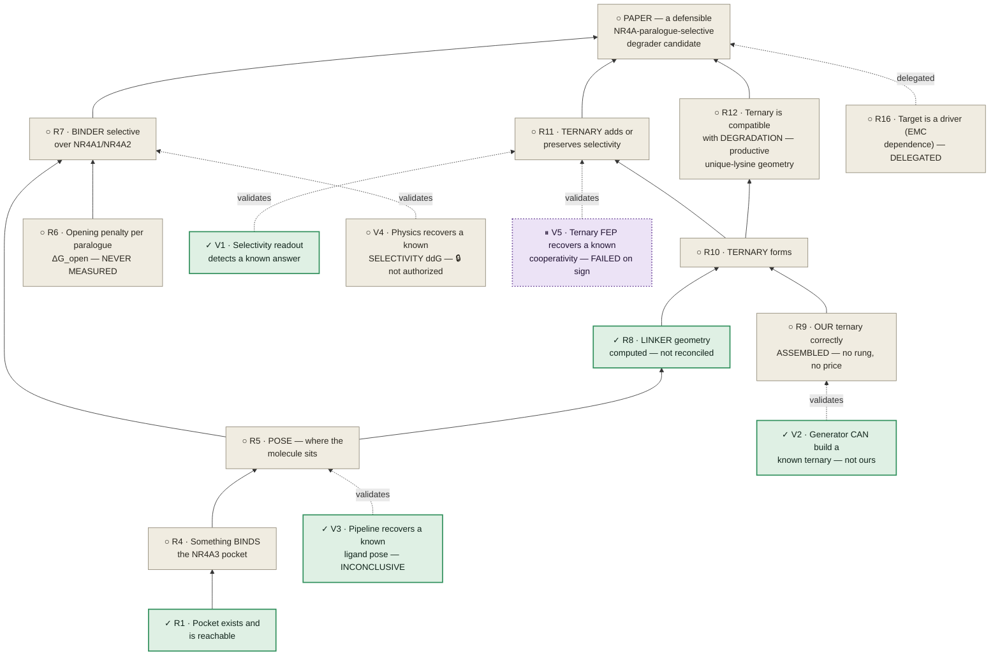
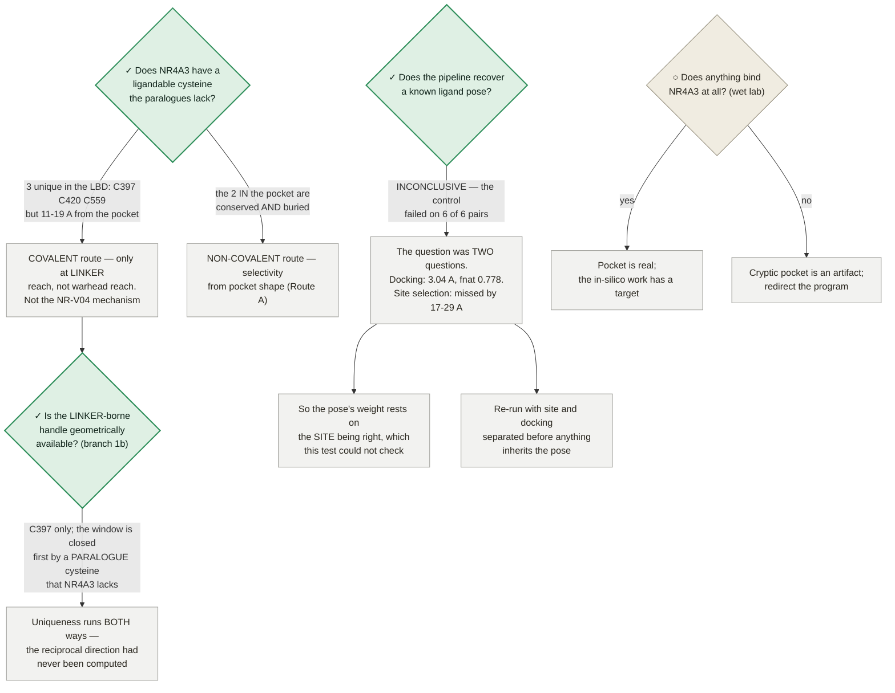
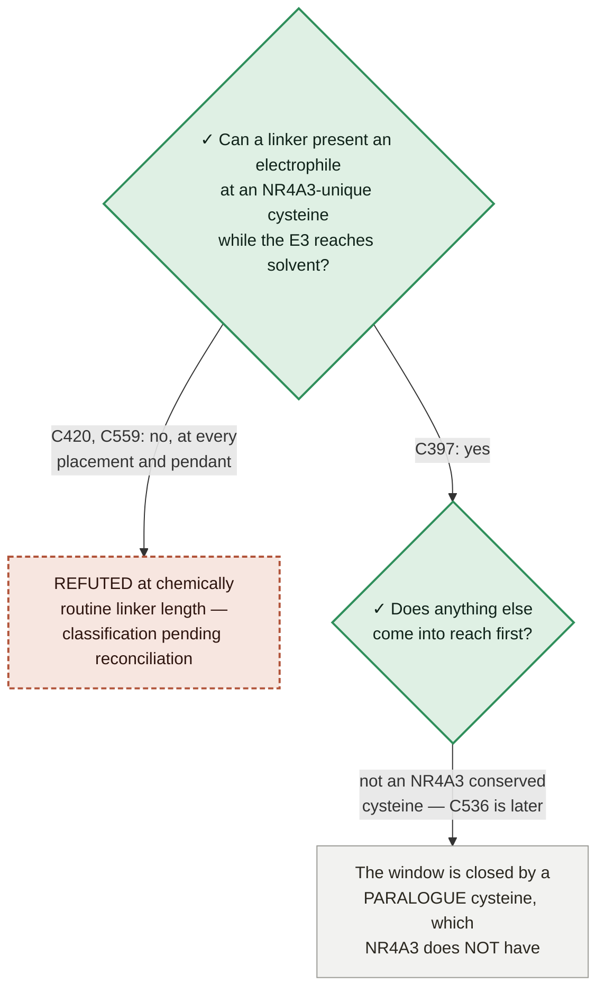

# NR4A3 degrader — the program roadmap

**One document: what is done, what is true, what is blocked, and what is next.**

★ **WHY THIS FILE EXISTS (trimcrae, 2026-08-02): *"I feel like we're not being rigorous and have to cobble
together stuff from prose documents and it's leading to us missing things and having to constantly rediscover
connections."*** The dependencies between claims were real but existed only as prose scattered across
STRATEGY.md, the paper, the preregistrations and a dozen module docstrings — so the same connections kept
being re-derived, and blockers kept being misattributed. This is the graph, and now also the plan that sits
on it.

★ **AND WHY IT IS ONE DOCUMENT (trimcrae, 2026-08-02): *"Ideally the map serves as the new source of truth
and the strategy.md gets folded in with it into one document, just adding color. And then it can link to
appendices that give more history and stuff… It's really like a systems engineering task."*** Read this file
top to bottom. [STRATEGY.md](../../STRATEGY.md) is now its **appendix set** — see [§0.7](#07--the-appendices--strategymd-and-what-ci-parses-in-it)
for why the machine-parsed layers physically stay there and what each one owns.

⛔ **STATUS VALUES ARE READ FROM COMMITTED ARTIFACTS, NEVER TYPED HERE.** Every cell below points at the
artifact that owns it (CLAUDE.md rule 1). If this file and an artifact disagree, the artifact is right and
this file is the bug.

⛔ **NO PRICE IS RETYPED HERE.** A roadmap row says whether an item is **priced**, **projected** or
**unpriced**, and links to the ladder that owns the figure. One fact, one place — and an honest "unpriced"
beats a number invented to fill a column.

Rendered version (mermaid + status colouring): published artifact, regenerated from this file's content.

---

## 0 · How to read this

### 0.1 · Four registers, four questions

| register | the question it answers | where |
|---|---|---|
| **Requirements `R*`** | what must be **TRUE** before the paper can present a candidate | [§2](#2--requirements--what-must-be-true) |
| **Instruments `V*`** | which instrument would answer each requirement, and whether it has itself recovered a known answer | [§3](#3--instruments--which-one-answers-each-requirement) |
| **The roadmap** | what to **DO** next, in what order, and what each item is waiting on | [§10](#10--the-roadmap--one-ordered-list) |
| **The closed-route register** | what must **never** be retried, and what would reopen what is merely parked | [§6](#6--the-closed-route-register) |

Everything else on this page is evidence feeding one of those four.

### 0.2 · Work state — the five glyphs

★ **A state here is WORK STATUS, not evidence quality (trimcrae, 2026-08-02).** An earlier pass coloured this
page by how good the evidence was, which is a different question and not the one you steer by: a claim can
rest on excellent evidence and still be blocked, and a dead end can be *very* well established. These five
states answer "what should I do about this?" — and every node, row and route below carries exactly one.

| state | glyph | means | what to do |
|---|---|---|---|
| **complete** | ✓ | ran, returned, and the result is recorded in a committed artifact | cite it; don't re-run it |
| **in work** | ◐ | dispatched or building right now | wait for it; don't start a second copy |
| **future work** | ○ | not started, and nothing is blocking it except sequence | this is where new effort goes |
| **parked** | ⏸ | failed with today's tools, but a better tool could change the answer | **name the capability** that reopens it — [method-watch.md](../method-watch.md) |
| **dead end** | ✕ | **conclusively proven unworkable** — no future development reopens it | **never retry** — see [§6](#6--the-closed-route-register) |

⛔ **✕ MEANS CONCLUSIVELY PROVEN UNWORKABLE — NOT "WE TRIED IT AND IT DIDN'T WORK" (trimcrae, 2026-08-02:
*"A dead end should be like, we have conclusively proven that avenue can't work"*).** The test is a single
question: **is there any future development that would make us retry this?** If yes, it is not dead. So ✕
requires positive evidence of impossibility — a structural confound no sample size fixes, arithmetic that
cannot reach the criterion, a premise shown false, an artifact that can never be regenerated. A method that
merely *failed* is ⏸ **parked**, and CLAUDE.md §5 is explicit that parked items are "revisit when capability X
lands", not dead. Conflating the two is expensive in both directions: it buries live options, and it invites
re-running things that cannot work.

⚠ **AND THE TEST IS CONCLUSIVENESS, NOT WHAT KIND OF BOX IT IS.** An earlier version of this page marked the
PAPER node ✕, which was wrong — the paper is blocked, and nothing shows it cannot be written. I then
over-corrected into a rule that claims and goals may *never* be ✕, which is also wrong: **a claim that has been
refuted is dead, and should say so.** The reason [§4](#4--the-dependency-graph)'s graph currently carries no ✕
is not that its boxes are exempt — it is that no claim on it has been refuted. If one is, it gets a ✕ like
anything else.

⚠ **And a ✓ never means "the claim is true"** — it means the *work item* finished. Sequence-only co-folding's
known-answer test completed cleanly and returned a clear negative, which is why it is ⏸ rather than ○: the work
is done, the avenue is not. [§3](#3--instruments--which-one-answers-each-requirement) says what each result
supports.

⛔ **A ◐ IS THE MOST EXPENSIVE GLYPH ON THIS PAGE TO GET WRONG, AND IT HAS BEEN WRONG SEVEN TIMES.** ◐ tells
every reader *"don't start a second copy"*, so a ◐ on something nobody has started is an instruction not to do
the work. That error was found and fixed on the §6 critical path (items 4 and 5) and on Route A on 2026-08-02,
and **five further instances survived that fix on this same page** — the graph nodes `PS`, `LK` and `V3`,
Route B's heading, and branch 1b's three question nodes. All are corrected in this pass and registered in
[§12](#12--findings-that-belong-to-other-documents). **The rule that closes it is structural, not vigilance:**
per invariant 5 below, a ◐ must name the running job, and "nothing is billing" is a $0 observation
(`inflight-board-all.md`, the account censuses) that any reader can take before believing one.

### 0.3 · Three orthogonal axes — WORK STATE, AUTHORIZATION, SUFFICIENCY

★★ **THE FIX THAT THIS PAGE KEPT NEEDING (trimcrae, 2026-08-02: *"If it's the highest leverage, it's the
highest leverage. Don't demote it just because I said not to launch it yet."*).** The work-state glyph above
answers *"what should I do about this?"*. It cannot also answer *"how much would it buy?"* or *"am I allowed
to buy it?"* or *"would it finish the job?"* — and every time this page tried to make one glyph carry all
four, it produced a wrong instruction. The failure is always the same shape: an item that was **not
authorized** got written down as **low value**, because the only column available to record "not now" was the
one that grades importance.

**So a row carries three independent readings, and all three can be true at once:**

| axis | question it answers | values | who owns it |
|---|---|---|---|
| **work state** ([§0.2](#02--work-state--the-five-glyphs)) | what should I do about this? | ✓ ◐ ○ ⏸ ✕ | the committed artifact |
| **authorization** | am I allowed to spend on this? | 🔓 **authorized** · 🔒 **not authorized** · **—** ($0, needs none) | trimcrae, via the [ladder](#11--money-authorization-and-gates) |
| **sufficiency** | if it returned tomorrow, what would it actually discharge? | stated in words, per row — never a glyph | the requirement it feeds |

⛔ **THESE ARE ORTHOGONAL, AND THE PAGE MUST NEVER COLLAPSE THEM.** The canonical row, and the one that
forced the rule, is the **CREBBP/BRD4 selectivity ABFE** (`V4`):

> **highest leverage in the program · 🔒 not authorized · would not discharge the paralogue claim** —
> three true statements about one item, none of which is a reason to soften any other.

- **Leverage is earned, not granted.** It is highest-leverage because this program has **no binary
  selectivity control at all** — [STRATEGY.md:538](../../STRATEGY.md) is explicit that *"valA validates
  relative FEP **within one pocket**"* — so it would be the first evidence the free-energy engine can resolve
  selectivity **between two different proteins**, which is the capability every paralogue margin on this page
  presupposes. Nothing about a scheduling decision touches that.
- **Authorization is a scheduling fact, not a grade.** [STRATEGY.md:546](../../STRATEGY.md): *"**Neither is
  authorized here**"*. A 🔒 says *don't buy it yet*; it says nothing about what it is worth.
- **Sufficiency is scope, not demotion.** [STRATEGY.md:533–538](../../STRATEGY.md): it is a **binary**
  control and *"would **not** discharge §4's paralogue/ternary statement"*. An item can be the
  highest-leverage thing available **and** insufficient on its own.

⚠ **This is the same class of fix as separating dead from parked ([§0.2](#02--work-state--the-five-glyphs))
and work-status from evidence-quality — the third axis, found the same way, by noticing which two things a
single column was being asked to say.**

**Colour is redundant with the glyph, by design** — every mermaid block below defines the same five classes, so
a state is readable without it: `done` #2f8f5b · `work` #3a63b8 · `next` #8d8674 · **`parked` #6f4a9b (dashed
2 3)** · `dead` #b1543a (dashed 5 3). ⏸ and ✕ are both dashed because both mean *stop here*; the dash pattern
and the hue separate "waiting on a capability" from "never again".

### 0.4 · The ID scheme — `R*` requirements and `V*` instruments

★ **THE THING WHOSE ABSENCE CAUSED THIS MERGE.** Nothing in either document had a stable identifier, so nobody
could write *"R7 is blocked by V4"*. That is **why connections kept being re-derived from prose** and why the
same blockers kept being misattributed — including, twice, the misattribution of a whole route's block to its
instrument when a missing physical term was equally responsible.

- **`R1…Rn` — requirements.** One per claim the paper must establish. **Stable forever; never renumber.** A
  retired requirement keeps its number and is marked retired.
- **`V1…Vn` — verification instruments.** One per instrument, same rule. `V1`–`V4` keep the ids the dependency
  graph already used. ⚠ **`VC` is retired as an id and is now `V5`** — it was the only non-numeric node and it
  meant "Val C", which is [validation requirement 1(C)](../../STRATEGY.md#validation-architecture-the-five-requirements);
  the mnemonic is carried in `V5`'s row instead. *Superseded, retained: the node id `VC`.*
- **Every requirement, instrument, roadmap row, closed route and branch cites the `R`/`V` it serves.**
- **A requirement with no `V` is a hole and must render as one.** That is this document's main job, and
  [§2.2](#22--requirements-with-no-instrument--the-holes) is the list.
- **An instrument that has not recovered a known answer cannot raise the confidence of any `R` it serves.**
  This is the program's most expensive lesson, stated as a rule the document can enforce rather than as prose
  — invariant 1 below.

### 0.5 · Six invariants — structural, not stylistic

Each is a rule a reader can *check*, and each exists because it was broken.

| # | invariant | what breaking it looks like |
|---|---|---|
| **1** | **A requirement may never be claimed above its instrument's own validation status.** | an ABFE paralogue margin quoted as evidence while the engine's absolute benchmark misses by more than the whole margin (`V7`) |
| **2** | **Work state, authorization and sufficiency stay orthogonal** ([§0.3](#03--three-orthogonal-axes--work-state-authorization-sufficiency)). | the highest-leverage item in the program written down as low-value because it was unauthorized |
| **3** | **✕ means conclusively unworkable, never "not done yet"; ⏸ names the capability that reopens it; 🔒 names the decision it waits on.** | a held item filed as parked, hiding a decision that could be taken today |
| **4** | **A ✓ is a WORK state, never a claim's truth.** | the pocket node marked ○ (which said nobody had looked, and was false), then marked ✓ *"settled enough to build on"* (which elided two open gates, and was also false). Correct is **✓ work complete · claim supported, not settled** |
| **5** | **Every status cell points at a committed artifact. A cell with no artifact says so, in those words.** | ◐ on a lane that does not exist; a number read once off an artifact's first generation and never re-read |
| **6** | **One fact, one place.** Where this page and an appendix both hold a number, this page **links** and does not restate it. | a cost carried in three files, stale in all three |

⚠ **Invariant 5 is the one that catches the others.** Four of the seven wrong ◐ glyphs, the superseded
thiol-occlusion median, and the superseded pose RMSD were all **values that had a committed artifact and were
never re-read against it**. Checking a cell against its artifact costs $0 and is the single highest-yield
audit on this page.

### 0.6 · ⚠ Five different things in this program are called `R`

**Read this before citing anything as "R-something".** The collision is real, it is repo-wide, and it has
already produced one mis-citation.

| written as | means | home |
|---|---|---|
| **`R1`…`R16`** | a **requirement on this page** — what must be true | [§2](#2--requirements--what-must-be-true) |
| **"validation requirement 1–5"** | the external reviewer's five conditions on what a result may claim | [STRATEGY.md → Validation architecture](../../STRATEGY.md#validation-architecture-the-five-requirements) |
| **"lint rule R1–R5"** | the manuscript language-discipline rule families | [`lint_claims.py`](lint_claims.py), CI-enforced |
| **"Arm R1 / Arm R2"** | the two arms of the NR-V04 retrospective panel (R2 retired by AMENDMENT 3) | [prereg](../modalities/nr4a3-nrv04-retrospective-prereg.md) |
| **`R` (closure)** | the cycle-closure statistic — `R = 0.2128` on the valB triangle, `R = +1.307` on `cycle_3carbonyl` | [`valb-triangle-closure.json`](../modalities/valb-triangle-closure.json), `step1-fanout-map.json` |

**So: never write a bare `RN` for anything except a requirement on this page.** Cite the others in words.

### 0.7 · The appendices — STRATEGY.md, and what CI parses in it

**This page is what you read and steer by. [STRATEGY.md](../../STRATEGY.md) is its appendix set.** The split is
**structural, not physical**, and the reason is measured rather than cautious: seven CI checks parse
STRATEGY.md **by exact heading string and text format**, 100 files carry 358 inbound references to it, and two
of its numbering schemes are read *as data* — [`realised_spend.py`](../modalities/realised_spend.py) literally
sets `"read_from": "STRATEGY.md Appendix A row 35"`, and Open decision numbers are cited by 30 files with
nothing resolving either. **Moving any of it would break CI quietly rather than loudly**: renaming the ordered
plan's heading makes [`work_ledger`](../modalities/work_ledger.py) print *"NOT SCANNED — the plan is invisible
this run"* and every open item vanishes from the work board with no error.

| appendix | STRATEGY.md section | owns | parsed by |
|---|---|---|---|
| **the ordered plan** | `THE ORDERED PLAN (spend-gated)` | 30 checkbox items, each with a gate, a price and a marker | `work_ledger.scan_plan_items` — heading string, bullet regex, `###` rung sub-headings. ⚠ the skipped marker is an **en dash** |
| **the spend ladder** | `Spend summary` + `Dependency spine` | the pinned total and its derivation, the rung table, the authorisation graph | `lint_consistency.check_derivations` (the total must appear) + `check_subsets` (the spine's `Cum ~$N` must be a subset of the plan's `Cum. ~$N` — **two deliberately different formats; unifying them is a CI ERROR by design**) |
| **the validation architecture** | `Validation architecture (the five requirements)` | the reviewer's five conditions; the charge-model lane split; *"Val B-mini is the highest-value dollar in the plan"* | — (content cited by ≥6 modules) |
| **language discipline** | `Honest scope and language discipline` | the earned-phrase substitutions and the never-imply set | `lint_claims.py` — **21 provenance strings name this section**; renaming it invalidates all 21 |
| **the gate scoreboard** | `📊 WHERE WE ARE — the scoreboard` | the gate table, the deliverables table, realised spend, and ⛔ **the one home for "which controls failed"** | `realised_spend.py` (11 refs) |
| **open decisions** | `Open decisions` | 15 numbered rulings, all closed | **cited by number in 30 files; nothing resolves them — numbering frozen** |
| **superseded numbers** | `Appendix A — superseded numbers and retracted claims` | 69 numbered corrections | **rows cited as data by 35 files; `lint_consistency.is_cleared` uses the exact heading as a structural clear — numbering and slug frozen** |
| **superseded framings** | `Appendix B — superseded strategy framings` | 6 retired plan framings | CLAUDE.md §5 points here |
| **spending rules** | `Spending rules` | no pre-authorization · cheapest-decisive-first · GO/NO-GO per rung · PROJECTED never enters the pinned total | — |
| **the thesis** | `Program and thesis` + `MECHANISM-FIRST` | the thesis, and the one home for the margin arithmetic (`~2.0` needed vs `0.60` resolvable vs `1.543` measured) | `tests/test_selectivity_margin_model.py` asserts the derivation |
| **the prospective stage** | `The prospective stage…` | the kill-switch semantics, the four-tier table, the Tier-2 result in full | `e3_recruiter_staging.py` calls its panel "verbatim" |
| **what the landed results change** | `★★ WHAT THE LANDED RESULTS CHANGE…` | the ranked decision-value list, folded into [§10](#10--the-roadmap--one-ordered-list) | — |
| **the landed-gate blocks** | the ✅/❌ headline sections | each landed gate's numbers, once | one anchor link from the retired re-panel prereg — **that heading's slug is load-bearing** |
| **GPU economics** | `GPU economics` | a pointer to [pricing.md](../compute/pricing.md), plus the six cost levers | `bid-strategy.md` names it |
| **the superseded in-flight board** | `⏱️ IN FLIGHT` | ⚠ **not live** — see [§12 finding 6](#12--findings-that-belong-to-other-documents) | live board is [`inflight_usd_per_ns.py`](../modalities/inflight_usd_per_ns.py) |
| **monitoring** | `🌙 OVERNIGHT MONITORING` | ⚠ stale — every lane it describes has closed | — |

⚠ **`Current front` is a duplicate** of the in-flight board and the ranked list, names its own homes, and has
**zero** inbound references. It is superseded by [§10](#10--the-roadmap--one-ordered-list) and survives only
because it holds the sharpest statement of one status (the feasibility panel is **WITHDRAWN**, not merely
"under correction").

---

## 1 · The thesis, the north star and the operating regime

*Color, not plan. Everything here has one home in an appendix and is linked, never restated.*

★ **NORTH STAR (trimcrae, 2026-07-01):** the **state of the art of what in-silico can do for an
NR4A3-selective degrader** — the most complete, rigorous, honest computational characterization achievable
with **no wet lab**, every result at its true weight. The paper documents *that*, not a ship-when-adequate
minimum.

★ **THE THESIS** ([STRATEGY.md → Program and thesis](../../STRATEGY.md#program-and-thesis)): close-paralogue
degrader selectivity is created at the **induced target–E3 interface** and in differential lysine geometry —
**not at the conserved warhead pocket** — and in every landmark case it was *discovered then rationalized* by a
solved ternary structure, never predicted blind. AKT1/2/3 is the cautionary null.

⚠ **The thesis and this page's own Route A point in different directions, and that tension is real rather than
an error in either.** Route A ([§8](#8--the-two-live-routes-to-selectivity--and-where-each-is-actually-blocked))
is a warhead-pocket route, and the pocket lining is in fact the most divergent object measured here (7 of 10
lining residues differ). What the thesis contributes is the **size** constraint the route must clear, and it
has one home: the margin arithmetic in
[MECHANISM-FIRST](../../STRATEGY.md#mechanism-first-is-the-search-order-the-thesis-above-is-unchanged) —
a useful degradation window needs **~2.0 kcal/mol** of true margin against a best-case **resolvable**
difference of **0.60** and an accuracy of **1.543 kcal/mol, wrong sign**. **A passing selectivity benchmark
would not close that gap**, which is why `R7`'s block is three things and not one.

★ **OPERATING REGIME — one researcher, no wet lab, no race.** A self-funded wet-lab program is off the table,
so every next step is either publish-to-convince or in-silico. **GPU spend is not a gate on paper quality**:
run the warranted experiments — including expensive ones — and post only once that work is folded in. Cost is
a reason to sequence and right-size, not to skip a decision-relevant run. Breadth-first, standard-depth: a new
technique that adds an axis of evidence is a default YES; deepening a test past its field standard is a
default NO.

★ **SINGLE DELIVERABLE:** [nr4a3-degrader-paper.md](nr4a3-degrader-paper.md) + its SI **is** both the ChemRxiv
preprint and the JCIM submission. Language discipline —
[STRATEGY.md → Honest scope](../../STRATEGY.md#honest-scope-and-language-discipline-apply-everywhere-including-the-manuscript),
CI-enforced by [`lint_claims.py`](lint_claims.py) over the paper, the SI **and this page**.

⛔ **This is a long-lived program on a rising frontier, not a one-shot.** Parked items are "revisit when
capability X lands", not dead; completed work is worth re-grading as methods improve
([method-watch.md](../method-watch.md)). Guardrail: a coming capability justifies waiting or re-running,
**never** claiming a result before the method supports it.

---

## 2 · REQUIREMENTS — what must be TRUE

**Sixteen requirements. None is ✓-settled.** Each row carries its work state, its authorization, the
instruments that serve it, and — the column that invariant 1 exists to protect — **the ceiling on what may be
claimed today**, which can never exceed the validation status of the instrument underneath it.

### 2.1 · The register

| id | requirement | work state | auth | served by | ⛔ claim ceiling today |
|---|---|---|---|---|---|
| **R1** | **A druggable pocket exists on NR4A3.** Node `PO` | ✓ work complete | — | `V13` `V14` `V15` | **supported, not settled.** Gate 1 (a two-state cryptic *opening*) FAILED as registered and was reformulated to basin-internal breathing; the existence evidence is experimental and independent (8XTT) — see [§5 row R1](#5--where-each-requirement-stands) |
| **R2** | **That state is thermodynamically accessible at equilibrium** (Gate 3B) | ○ future | — | `V13` — ⚠ its only demonstrated reading is ✕ dead | **unresolved.** Reading Gate 3B off a *single* biased F(Rg) profile is conclusively closed ([§6a](#6a--dead--conclusively-unworkable-never-retry)); no replacement reading has been run |
| **R3** | **The receptor frame `denovo_401` was generated into still qualifies** — the paper's explicit **submission gate** | ○ future | — (**$0-to-cheap**) | ⛔ **none run** | **open, and it reaches upstream**: *"if the generation frame does not qualify, the **generation receptor** … is affected"* (`:2259–2265`) |
| **R4** | **Something binds that pocket.** Node `L` | ○ future | — | ⛔ **none — needs a bench** | **nothing binds the cryptic pocket, of any molecule.** ⚠ Scoping is load-bearing: NR4A3 *is* experimentally ligandable ([§5 row R4](#5--where-each-requirement-stands)); the cryptic site is what has no ligand |
| **R5** | **The binding pose is right.** Node `PS` | ○ future (re-run) | — | `V3` — **INCONCLUSIVE** | **unresolved.** The docking works; the pipeline's **site selection** missed on 6 of 6 pairs, so the pose's weight rests on the site being right and `V3` could not check that |
| **R6** | **The per-paralogue opening penalty does not reverse the margin** — ΔG_open. Node `DGO` | ○ future | 🔒 explicit nod | ⛔ **none built** | ⛔ **every ΔΔG on the binder path is conditional on a term nobody has computed.** Validation requirement 2: matched-open comparison can *"miss or REVERSE selectivity"* |
| **R7** | **The binder is paralogue-selective over NR4A1/NR4A2.** Node `B` | ○ open — the existing result is ⏸ parked | 🔒 (`V4`) | `V4` (no result) · `V6` `V7` `V8` `V9` `V10` | ⛔ **an unvalidated prediction.** Three separate blocks, only one of which is the instrument — see [§8](#8--the-two-live-routes-to-selectivity--and-where-each-is-actually-blocked) |
| **R8** | **A linker geometry is feasible** at an NR4A3-unique cysteine. Node `LK` | ✓ computed — ⚠ **not reconciled to its artifact** | — ($0 CPU) | `V17` (fails its own positive control) + the reach enumeration | **geometry only.** No thiol pKa, reactivity, adduct or degradation quantity; reach is necessary and never sufficient. And it is conditional on `R5` |
| **R9** | **OUR ternary is correctly assembled.** Node `ARCH` | ○ future — **NOT STARTED** | 🔒 **unpriced, no rung** | `V2` — validated, **never pointed at our system** | ⛔ **no NR4A3 ternary has been correctly assembled by anyone.** [STRATEGY.md:500](../../STRATEGY.md): *"⛔ **NO, and this is the whole remaining gap.**"* |
| **R10** | **A ternary forms.** Node `T` | ○ future | 🔒 (via `R9`) | `V2` (live route) · `V12` ⏸ (the route that built the existing one) | the existing prediction was built by the failing route and its molecule is **unrecoverable**, so it cannot be replicated |
| **R11** | **The ternary adds or preserves selectivity.** Node `TS` | ○ future | 🔒 (via `R9`) | `V1` (passes, in scope) · `V16` (null with a bound, **uncalibrated**) · `V5` ⏸ FAILS · `V11` ⏸ no pass | one sequence-encoded candidate at **1 model per arm against a reproducibility bar of 3** |
| **R12** | **The ternary is compatible with DEGRADATION** — productive unique-lysine geometry. Node `UB` | ○ future | — ($0 screen) | `V18` — ⛔ **no known-answer test exists for it** | categorical input only (**4 NR4A3-unique lysines, 3 exposed**). Validation requirement 5's honest limit: real degraders often ubiquitinate several lysines and lysine-less substrates can still be degraded, so this **raises the odds; it does not guarantee** the paralogue is spared |
| **R13** | **The modelled object is the real biological object — EWSR1::NR4A3 in fusion context**, not an isolated LBD | ○ future | 🔒 unpriced | ⛔ **none — no lane, no rung, no row anywhere** | ⛔ **every geometry claim on this page is about an isolated LBD construct.** Validation requirement 5 asks for the fusion-context ensemble, lysines **outside** the LBD (hinge, DBD, fusion partner) and full CRL/E2~Ub ensembles |
| **R14** | **Selectivity claims are bounded to their tested scope** — the AR/MR superfamily cross-binding check | ○ future | 🔒 unpriced | ⛔ **none run** | the selectivity claim is **currently bounded to two paralogues by an unrun check**. SI names MR/AR *"the **sole** sequence-level non-paralogue follow-ups"* that *"must clear"* (SI `:213–219`) |
| **R15** | **The candidate set is chemically constructible and physicochemically plausible** | ✓ work complete for one mechanism per molecule | — ($0) | RDKit enumeration + `V17`-adjacent reach | **one mechanism per molecule.** The two-mechanism construct needs a **two-branch template**, which is a design change to a preregistered enumeration and **the decision has never been asked for** ([§10](#10--the-roadmap--one-ordered-list)) |
| **R16** | **NR4A3 is the right target** (EMC dependence). Node `TG` | ○ future — **DELEGATED** | — | the dTAG degradation test, in the EMC-program paper | not a blocker of this paper. `:2508`: *"This paper's claimed contribution is the target's computational druggability/selectivity, **not EMC efficacy**"* |

⚠ **`R7` is the row every reader should test invariant 1 against.** Its own paralogue ABFE **has run**, at
three independent-seed replicates, and resolved below zero on both paralogues — and the engine that produced it
misses a known **absolute** answer by more than the entire margin (`V7`), has **never** recovered a known
*selectivity* answer (`V4`, no result), carries a λ-overlap defect on **every** leg (`V9`), and is missing a
term that can reverse the sign (`R6`). **A good-looking number under a stack like that cannot raise the
claim.** That is invariant 1, and it is why the paper carries every paralogue-selectivity statement as an
unvalidated prediction.

### 2.2 · Requirements with no instrument — the holes

⛔ **Five requirements have no instrument at all.** They are not "not done yet"; there is nothing built that
could answer them, so no amount of running the existing lanes moves them.

| id | why it is a hole | is it buildable? | named next action |
|---|---|---|---|
| **R3** submission gate | the harmonized artifact reports **ensemble-level fractions only** and does not identify which individual frames cleared D\*, so it cannot discharge a **frame-level** check | ✅ yes — **$0-to-cheap**, a re-read of an artifact we own | build the frame-level audit; it is the cheapest open item in the program |
| **R4** does anything bind | **no in-silico instrument can serve it.** A thermal shift / SPR / NMR fragment screen against the opened site is the only answer | ❌ not in silico | carry it as the standing wet-lab dependency; a negative would redirect the program and is as useful as a positive |
| **R6** ΔG_open per paralogue | nothing has ever computed an opening penalty for any paralogue | ✅ yes — priced in the ladder's OPTIONAL/HELD tier | 🔒 a budget nod. **Otherwise report everything conditional on the open state** — which is $0 and fully defensible |
| **R13** fusion-context object | the entire program models an isolated LBD construct (373–626). C166, one of the four unique cysteines, is already outside it | ✅ in principle | ⛔ **give it a rung, a gate and a price — it has none.** Nothing on the plan, the spine or the ranked list touches it |
| **R14** AR/MR cross-binding | never run | ✅ yes | 🔒 unpriced — needs a rung |

⚠ **And four more requirements have an instrument that has never returned a usable answer**, which is a
different failure and must not be filed with the above: **`R2`** (`V13`'s only demonstrated reading is ✕
dead), **`R5`** (`V3` INCONCLUSIVE), **`R9`** (`V2` validated but never pointed at our system), **`R11`**
(`V5` failed on sign, `V16` has no calibrator).

**So of sixteen requirements: one is delegated, two are ✓ on the work axis with the claim open, and thirteen
are open — of which nine have either no instrument or no usable instrument answer.**

### 2.3 · The claim-ceiling rule, stated so it can be checked

> **A requirement may never be claimed above the validation status of the instrument that produces it.**

Mechanically: take the requirement's row in [§2.1](#21--the-register), read the `V`s in its *served by* column,
look each up in [§3.1](#31--the-instrument-table), and **the weakest one sets the ceiling**. A `V` with **no
result** sets the ceiling at *unvalidated prediction*, whatever the number looks like. A `V` that **failed**
sets it lower still.

⚠ **This is not a stylistic preference; it is the rule the program has paid for.** The paper's own record shows
**at least four** withdrawn *selectivity* results, and the largest of them fell to defects **no known-answer
test could have caught** — which is why the prophylactic is two rules and not one
([§3.3](#33--the-pattern--rewritten-because-the-version-this-page-carried-was-false)).

---

## 3 · INSTRUMENTS — which one answers each requirement

An instrument that has never recovered a known answer **cannot support a claim**, however good its output
looks. This table is why **selectivity results in this program have had to be withdrawn**.

⛔ **A "PASSES" here means the instrument recovered *that* known answer. It never means the instrument
supports the claim the graph points it at** — the paper spends four separate paragraphs refusing exactly that
reading, so the scope column below is not a footnote, it is the verdict.

### 3.1 · The instrument table

| id | instrument | known-answer test | result | ⚠ what the result does NOT support | state | serves |
|---|---|---|---|---|---|---|
| **V1** | Structural selectivity descriptor (`selcal_interface_signature`) | recover the published SMARCA2 Gln1469↔VCB hydrogen bond, unaided, from two crystals | Gln98 Oε1→Arg12 Nη2 **2.88 Å** vs Leu1545 | *"validates **one contact in one pair**. It does **not** validate E1 … and it makes **no NR4A3 prediction correct**"* (`:2200–2203`) | ✓ **PASSES, in scope** | `R11` |
| **V2** | Ternary generator given both sites (assembly route) | rebuild 6HAX (in-set) and 9DTY (post-horizon) | DockQ 0.618 / **0.839**, iRMSD 0.67 Å | 6HAX is inside the model's 2023-10-14 horizon, so it is *"**memorisation-permitting by construction** … **not** evidence of generalisation"* (`:2140–2142`). 9DTY is **best of 16 seeds, median 0.442**, and **one arm** — the SMARCA4 arm was refused and **no SMARCA4 number exists** (`:2163–2165`) | ✓ **PASSES, in scope** — ⛔ **never pointed at our system** | `R9` `R10` |
| **V3** | Ligand pose prediction (dock + MM-GBSA) | recover a known holo pose in a nuclear receptor from apo | **INCONCLUSIVE by its own pre-registered rule** — the C1 holo self-dock control failed through the pipeline's own box on **6 of 6 pairs across 3 receptors** (17.3–29.3 Å), so the primary arm measured the *site*, not the docking. With an fpocket-chosen box the same protocol reaches **3.04 Å, fnat 0.778, 7 of 9 native contacts** | it cannot grade the docking: the protocol ceiling itself missed (`C1c_self_dock_holo_oracle_box` 2.849 Å against a 2.0 Å criterion) | ✓ complete — **verdict INCONCLUSIVE** | `R5` `R8` |
| **V4** | **Selectivity free energy (ABFE)** — the *selectivity* known-answer test | CREBBP vs BRD4(1) / SGC-CBP30, ΔΔG ≈ 2.2 kcal/mol | **no result. Built and staged with no `result` key; never completed** | it is a **binary** control: even a clean pass *"would **not** discharge §4's paralogue/ternary statement"* ([STRATEGY.md:536–538](../../STRATEGY.md)) | ○ **not started · 🔒 not authorized** — see [§6c](#6c--held--not-refuted-not-parked-waiting-on-a-decision) | `R7` |
| **V5** | Alchemical ternary cooperativity (`valB_mini` ΔΔG_coop) — **validation requirement 1(C), "Val C"** | reproduce a known cooperativity, **+0.944** kcal/mol | **−0.599** — wrong sign in all 3 replicates, ~34× the statistical uncertainty | ⛔ nothing. [STRATEGY.md:1156](../../STRATEGY.md) calls it *"the highest-value dollar in the plan"* and it **failed**; the closure triangle localises the miss to an **endpoint-state** error, so more sampling will NOT fix it | ✓ complete — **FAILS, systematically** | `R11` |
| **V6** | Relative FEP (OpenFE, the congeneric lane) — **validation requirement 1(A), "Val A"** | TYK2 `ejm_31→ejm_42` benchmark ΔΔG **−0.24** | **+0.37**, abs err **0.61** — inside the ~1 kcal/mol band | a **relative** result on a *different* quantity in **one** pocket. [STRATEGY.md:538](../../STRATEGY.md): *"valA validates relative FEP **within one pocket**"* — it is **not** a selectivity validation. ⛔ **AND ITS SCOPE IS THE `am1bcc` BINARY LANE ONLY** — see [§3.4](#34--two-instrument-facts-this-page-used-to-be-missing) | ✓ **PASSES, within one pocket, one charge model** | `R7` |
| **V7** | ABFE engine, **absolute** | T4-lysozyme L99A + benzene, experimental **−5.2** kcal/mol | **+1.90 ± 0.09** — *"under-binding by ≈ +7.1 kcal/mol — a failed/strongly-biased absolute benchmark"* (`:1252–1254`) | ⛔ the miss is **larger than the entire selectivity margin the engine is used to compute**, which is why every ABFE **absolute** in the paper is uninterpretable | ✓ complete — **FAILS** | `R7` |
| **V8** | ABFE engine, hydration | methane hydration free energy (FreeSolv), **+2.0** | **+1.60 ± 0.04**, *"approximately reproduced"* (`:2296–2298`) | a solvation smoke test; says nothing about a protein site | ✓ **PASSES, narrowly** | `R7` |
| **V9** | λ-overlap diagnostic on the standing ABFE block | — (a self-check, not a known answer) | ⛔ *"**every leg** — the shared solvent leg and all three complex legs — has at least one soft-core-tail window pair below 0.03"* (`:1265–1268`) | holds the **whole ABFE block provisional**, including the paralogue result in [§5 row R7](#5--where-each-requirement-stands) | ✓ measured — **defect open**, repair 🔒 held **and** ⏸ as framed | `R7` |
| **V10** | Interface-mutation physics (pmx/GROMACS) | barnase–barstar Y29A vs published ΔΔG | +4.42 ± 1.08 vs +3.4 | ⛔ *"**No benchmark yet probes the regime this cross-check would occupy** — resolving ~1 kcal/mol between two closely related receptor states — so the engine is validated for seeing a large effect and for not inventing one where none exists, but **not demonstrated to resolve a small paralogue-scale difference**"* (`:2409–2412`). ⚠ **It also owes a WEDGE-SIZED benchmark**, and Open decision 10 rules it **not an independent second causal line**. ⛔ **AND ITS SMARCA2/4 APPLICATION IS NOW CLOSED ON EVIDENCE, NOT ON BUDGET** — see the row note below | ✓ **PASSES, but not in the regime that matters** · ⛔ its SMARCA2/4 application is **refused by its own $0 precheck** | `R7` |
| **V11** | Interface-stability endpoint (E1) | **two** attempts: NR-V04 retrospective, SMARCA2/4 sensitivity control | *p* = 0.393 (DISCORDANT) · *p* = 0.747 (NULL, adequately powered) | ⏸ parked — **no pass** ([§6b](#6b--parked--failed-with-todays-tools-with-a-named-trigger-to-reopen)). ⛔ **`V5`'s wrong sign is NOT a third E1 failure** — different instrument | ⏸ parked | `R11` |
| **V12** | Sequence-only co-folding (Boltz-2 ternary) | reproduce 9DTY/9DTX from sequence + ligand | DockQ 0.023–0.046 ≈ true structure moved 32 Å | ⏸ parked — **FAILS** ([§6b](#6b--parked--failed-with-todays-tools-with-a-named-trigger-to-reopen)) | ⏸ parked | `R10` |
| **V13** | Cryptic-opening free-energy profile (metadynamics F(Rg); Gates 1 / 3A / 3B) | Gate 1: a genuine **two-state** cryptic opening | ⛔ **FAILED as registered** — F(Rg) is monotonic, *"a single resolved minimum and a rising wall, with no separate opened minimum"*; recorded as *"**failed, and reformulated**, not a 'weak pass'"* (`:387–394`, `:2549`) | ⚠ a failed **mechanism** test is not evidence of absence — the cavity survives as basin-internal breathing. ⛔ Reading Gate 3B off a **single** profile is ✕ dead: three seeds do not reconstruct a common F(Rg) | ✓ ran — **Gate 1 failed as registered · Gate 3A supported · Gate 3B unresolved** | `R1` `R2` |
| **V14** | BioEmu unbiased ensemble cross-check (§2.1) | — (no in-repo known-answer test) | **12.5 %** druggable | ⚠ **an instrument with no known-answer test of its own on this system.** It is an *orthogonal* axis for `R1`, independent of the metadynamics Gate 1 and Gate 3B are argued over — which is its whole value, and also its limit | ✓ ran — **untested as an instrument** | `R1` |
| **V15** | PocketMiner + four permutation nulls (§2.2) | the nulls are the control | p = 0.009 / 0.0001 / 0.036 / **0.74** / 0.014 | ⚠ **one of the five nulls does not support it.** The only independent-method support for the cryptic site is therefore mixed, and this page previously showed it as a clean ✓ | ✓ ran — **mixed** | `R1` |
| **V16** | The causal matched-pair test `S` (RUNG 5a-KS, ligand-side double difference, §2.10e) | ⛔ **none — it has no known-answer calibrator** | **S = −0.1297 ± 0.3264 kcal/mol** — its **preregistered null**, registered in advance as the LIKELY outcome and explicitly **not** a stop. It is a **BOUND**: the design could only have resolved *"a wedge contribution of roughly \|S\| ≳ 0.65 kcal/mol (2σ)"* | ⛔ **`S` may be read as a bound and may NOT be reported as calibrated** (Open decision 13). `S` is non-covalent and therefore **structurally incapable** of testing the categorical mechanism; `S ≈ 0` means the *marginal* wedge is absent, and STOP applies only if the categorical axis has ALSO failed | ✓ complete — **preregistered null, uncalibrated** | `R11` |
| **V17** | The exposure criterion `EXPOSED_RSA = 0.25` | NR4A1 **Cys551** — the one NR4A-family covalent site with literature support | ⛔ **FAILS its own positive control** — RSA **0.165** on the state-matched opened model; **0 of 25** frames in the metadynamics ensemble, median **0.064** | ⛔ **anything adjudicated by this cutoff inherits a demonstrated false negative.** What survives is a threshold-free **rank**: C551 is 3/18 across the family on every accessibility observable, behind NR4A3's C397 and C420 | ✓ measured — **FAILS its positive control; rank-only** | `R8` `R15` |
| **V18** | The transfer-zone lysine-identity term (b) | ⛔ **none exists** | set membership, not energy: *unique-only* > *unique + conserved* > *conserved-only* | bound by two 2026-07-25 measurements: the ubiquitin-transfer distance is **17.1 Å** (the repo's assumed 10 Å was ~7 Å too strict) and **a composed CRL RING carries ~30–50 Å of positional uncertainty**, so ⛔ **no degradation-geometry claim may rest on a RING or E2 that was COMPOSED rather than observed** | ○ screen available — **no known-answer test** | `R12` |
| **V19** | The generation-matched null (winner's-curse / generative confound) | the scrambled-objective arm | **PARTIAL** — 0 manufactured survivors of 191 against the real campaign's 1 of 191. ⚠ that does **not** exclude the confound: rule-of-three bounds the manufactured rate at ≤0.0157, **3×** the real campaign's own 0.0052, Fisher **p = 0.5** | ⛔ **the arm that addresses the GENERATIVE step — a fresh generation into a paralogue pocket — is UNRUN** | ✓ one arm ran — **the decisive arm is ○** | `R7` `R15` |
| **V20** | Single-snapshot MM-GBSA `margin > 0` as a selectivity verdict | 38 unrelated marketed drugs through the identical funnel | ✕ **REFUTED** — 22 of 38 (58 %) score a positive margin, above the de-novo set's own 2 of 11 | ⛔ nothing. A signal smaller than its own noise is not recoverable by any downstream method — [§6a](#6a--dead--conclusively-unworkable-never-retry) | ✕ **dead** | (was `R7`) |

### 3.2 · The R×V coverage matrix — where the holes are

Read down a requirement's column: **the weakest cell sets its ceiling** (invariant 1). A column with no cell
at all is a hole.

| requirement | instruments that serve it | best available status | ⛔ hole? |
|---|---|---|---|
| `R1` pocket exists | `V13` `V14` `V15` | ✓ ran, mixed; one gate failed as registered | no — but no instrument is *validated on this system* |
| `R2` accessibility | `V13` | ⛔ the only demonstrated reading is ✕ dead | **effectively yes** |
| `R3` submission gate | — | — | ⛔ **HOLE** |
| `R4` binds at all | — | — | ⛔ **HOLE — needs a bench** |
| `R5` pose | `V3` | INCONCLUSIVE | **no usable answer** |
| `R6` ΔG_open | — | — | ⛔ **HOLE** |
| `R7` binder selectivity | `V4` `V6` `V7` `V8` `V9` `V10` | `V4` has **no result**; `V7` FAILS; `V9` defect open | no instrument, but **the one that matters is unrun** |
| `R8` linker reach | `V17` + enumeration | `V17` fails its own positive control | rank-only, and conditional on `R5` |
| `R9` our ternary assembled | `V2` | ✓ validated — **never pointed at our system** | **no usable answer** |
| `R10` ternary forms | `V2` `V12` | `V12` ⏸ FAILS | **no usable answer** |
| `R11` ternary adds selectivity | `V1` `V5` `V11` `V16` | `V1` passes in scope; `V5` FAILS; `V11` no pass; `V16` uncalibrated | **no usable answer** |
| `R12` degradation compatible | `V18` | no known-answer test exists | **untested instrument** |
| `R13` real biological object | — | — | ⛔ **HOLE** |
| `R14` scope bound (AR/MR) | — | — | ⛔ **HOLE** |
| `R15` constructibility | RDKit + `V17` + `V19` | ✓ for one mechanism per molecule | design decision outstanding |
| `R16` target is a driver | delegated | — | not this paper's blocker |

⛔ **The readout: 5 requirements with no instrument, 5 more whose instrument has returned no usable answer,
and 0 requirements standing on an instrument validated in the regime the claim needs.**

### 3.3 · The pattern — rewritten, because the version this page carried was false

⚠ **SUPERSEDED, retained so it is not re-derived:** *"Every instrument put to a known-answer test either
passed cleanly or failed cleanly. **Every** claim that later had to be withdrawn came from an instrument that
had never been tested … skipping it has cost **three** retractions."* Both halves fail against this page's own
table and the paper's own census.

**What is actually true, and it is still worth making:**

1. **A known-answer test costs close to nothing and has never once been wasted.** Every instrument put to one
   returned a *readable* verdict — and readable is the whole point. That is the surviving lesson.
2. **But "passed cleanly or failed cleanly" is wrong.** Two rows returned neither: `V3` is **INCONCLUSIVE by
   its own pre-registered rule**, and the NR-V04 retrospective is a **NON-RESOLUTION**
   ([STRATEGY.md:71](../../STRATEGY.md): *"⚠ **NON-RESOLUTION**, never a candidate control"*). A test that
   cannot resolve is a third outcome, and both of these were mis-read as failures at some point.
3. ⛔ **And "every withdrawn claim came from an untested instrument" is REFUTED by the largest retraction in
   the paper.** The NR-V04 per-arm figures fell to a **chain-ordering defect** (Elongin C scored as the
   target), an **nm/Å unit error** and **contaminated inputs** (14-3-3 ε where Elongin B belongs). **No
   known-answer test catches any of those** — the paper says so directly (`:933–936`): the panel persisted no
   trajectory, so the defects were *"each correctable in principle and **none correctable in practice**"*.
   The same is true of the E3-recruiter retraction (a biological-assembly frame defect, `:1600`) and the
   Gate-3B withdrawal (cross-replica divergence, `:403`).
4. **The count is not three.** On the paper's own naming there are **at least four** withdrawn *selectivity*
   results — the MM-GBSA "confirmed selective" headline, `denovo_111`, the negative conclusion that the
   ternary adds no selectivity, and the NR-V04 per-arm figures — and **six** if `denovo_94`/`denovo_57` are
   counted as the paper counts them (`:2610`), plus two further non-selectivity retractions. *"Three"* was
   quoted with no enumeration, in a document whose whole purpose is to stop facts being re-derived from
   prose. ⚠ [STRATEGY.md:13](../../STRATEGY.md) also says "three" and inherits this correction — flagged in
   [§12](#12--findings-that-belong-to-other-documents), not edited here.

**So the correct prophylactic is TWO rules, not one:** *(a)* test the instrument against a known answer
before believing it — cheap, and it caught rows 1 and 3; and *(b)* **persist the primary artifact**, because
the defects that cost the most were analysis and input bugs that only a retained trajectory could have let
anyone fix. Rule (b) is the one this page was missing, and it is the more expensive of the two.

### 3.4 · Two instrument facts this page used to be missing

⛔ **1 · `V6`'s accuracy citation does NOT cover the ternary or endpoint lanes, and a reader of this page
alone would have assumed it did.** The lanes split by charge model — **binary RBFE `am1bcc`** · **ternary FEP
NAGL** · **endpoint/covalent MD NAGL** — and the split is physically forced, not sloppiness (AM1-BCC via
AmberTools `sqm` ran **>85 min on a 166-atom recruiter without converging**). Three consequences, all binding:

- **ΔΔG_coop is unaffected by the split** — both morphs run inside one lane at one charge method, so the
  charge model cancels *within* a lane, which is all the argument ever needed.
- **Any CROSS-LANE subtraction is NOT safe**, which is why the protein-mutation wedge carries a hard
  `assert_charge_consistency` refusal.
- ⛔ **OpenFE's published accuracy was measured on `am1bcc`; neither it nor `V6` transfers to a NAGL lane.**
  The accuracy control for the NAGL lane is `V5` — **which failed.** [STRATEGY.md:1144–1149](../../STRATEGY.md):
  *"do not let a reader infer the OpenFE citation covers the ternary numbers."*

⛔ **2 · The program's flagship causal test `V16` has no known-answer calibrator, and buying one is on nobody's
rung.** It is rank 9 of the ladder's decision-value list and explicitly **unpriced**; Open decision 13 splits
the gap in two — *can a null be read?* ($0, **done**) and *can a non-null be called calibrated?* (paid,
**deferred**). ⚠ Open decision 9b binds any future calibrator: **reference data and structure must sit on the
SAME protein**, because the existing SMARCA calibrator is built on the lowest-resolution structure in the
family (3.73 Å) and on the wrong paralogue.

---

## 4 · The dependency graph

Read upward: a box can only be claimed once everything feeding it holds. **Dashed edges are validation
dependencies** — the instrument that produces a claim must itself have been shown to work. Node glyphs carry
the state, so the graph reads the same without colour. **No node here is ✕ today** — not because claims are
exempt from being dead, but because none of these has been refuted. An unreached claim is ○; the approaches
that *were* conclusively closed are in [§6](#6--the-closed-route-register).
**Node glyphs carry work state only — [§0.3](#03--three-orthogonal-axes--work-state-authorization-sufficiency)'s
authorization and sufficiency axes are read from the register rows, never from the graph**, which is why `V4`
carries its 🔒 inline rather than being demoted to a colour.

⚠ **Four requirements are not drawable here and that is a property of the graph, not of them.** `R3`
(submission gate), `R13` (fusion-context object) and `R14` (AR/MR scope) are **claim-ceiling conditions** that
bound every node rather than feeding one, and `R2` sits inside `R1`. They are in
[§2.1](#21--the-register) and on the roadmap; a graph that showed them as ordinary boxes would imply they can
be discharged in sequence, and they cannot.

⚠ **`§4` NOW CARRIES NO ◐ NODE, AND THAT IS A CORRECTION RATHER THAN A DESIGN CHOICE.** Three nodes read ◐
until this pass — `PS`, `LK` and `V3` — and **nothing was running behind any of them**, which under
[§0.2](#02--work-state--the-five-glyphs)'s own semantics was an instruction to every reader not to start work
nobody had started. Each is corrected against its committed artifact:

- **`V3` ◐ → ✓.** [`apo-pose-recovery.json`](../modalities/apo-pose-recovery.json) carries a complete
  `verdict` (`outcome: INCONCLUSIVE`), a 6-pair panel and an elapsed time. **The test ran and returned.** This
  page's own instrument table, claim register and branch-2 question node already said so; only the graph did
  not. *Superseded, retained: the `◐` on `V3` and the phrase "running, not returned".*
- **`PS` ◐ → ○.** The known-answer test returned; the **re-run with the site and docking questions separated
  has not started**. Nothing is billing on any lane.
- **`LK` ◐ → ✓.** [`nr4a3-linker-covalent-reach.json`](../modalities/nr4a3-linker-covalent-reach.json)
  **landed at commit `dc0befd9c`**, which retires the branch-1b banner's *"the artifact this section cites
  does not exist yet"*. ⚠ **The hold on quoting branch 1b stands for a different and now-measurable reason** —
  the prose has not been reconciled to the landed artifact, and at least one disagreement is readable today
  ([§7 branch 1b](#branch-1b--computed-not-reconciled-to-its-artifact)). *Superseded, retained: "the
  artifact this section cites does not exist yet" and the `◐` on `LK`.*

⚠ **PAPER is ○, not ✕ — the goal is blocked, not refuted.** What blocks it:

- **`ARCH` (`R9`) is ○, not ✓ — no NR4A3 ternary has been correctly assembled by anyone.** It is the claim
  *"**our** ternary is correctly assembled"*, which [STRATEGY.md:500](../../STRATEGY.md) answers flatly:
  *"⛔ **NO, and this is the whole remaining gap.**"* (`nr4a-ternary-ligand-provenance.json`: `n_recovered: 0`
  of 3 arms.) `V2` is the *instrument* reading — the generator **can** build a known ternary, best-of-16 on
  one arm of one non-NR4A3 system — and keeping the two apart is what makes the dashed edge non-circular:
  a validated instrument that has not yet been pointed at our system. ⚠ **Superseded, retained:** the ✓ on
  `ARCH`, under which one proposition carried four different states across two files (graph ✓, claim register
  ○, critical path ◐, STRATEGY.md ⛔ NO).
- **`PO` (`R1`) is ✓ — the pocket WORK is complete; the pocket CLAIM is supported but not settled.** ★ **This
  node was briefly ○, and that was wrong twice over (trimcrae, 2026-08-02: *"What do you mean by the pocket
  existing doesn't get a checkmark? That makes me think your standard is too high."*).**
  1. **It broke invariant 4.** ✓ is a **work state**, never a claim's truth. ○ means *not started*. An
     enormous amount of pocket work has run and returned: the 8XTT harmonization, the release run, 60 ns of
     metadynamics plus three independent-seed replicas. Rendering that ○ tells a reader nobody
     has looked. That is the same axis-collapse this page keeps catching elsewhere — here, *not settled*
     collapsed into *not started*.
  2. **It misread what Gate 1 refuted.** Gate 1 tested a **two-state cryptic opening**, and what failed is
     that *mechanism*: F(Rg) is monotonic, *"a single resolved minimum and a rising wall, with no separate
     opened minimum"* — so *"'opened **state**' would overstate it"*. The paper reformulates to
     **basin-internal breathing** and keeps the cavity: *"there is one basin whose thermal fluctuations
     **transiently expose a druggable cavity**"* (`nr4a3-degrader-paper.md:387–396`), concordant with de Vera's
     breathing Nurr1 pocket. **A failed mechanism test is not evidence of absence.**
  3. **The existence evidence is EXPERIMENTAL and independent of all of it** — in the deposited apo NMR
     ensemble **8XTT** the orthosteric pocket is matched in **19 of 20** conformers, 3 scoring ≥ D\*, **with no
     simulation bias applied**, and Gate 3A (persistence after bias removal) is supported.
  ⚠ What remains genuinely open belongs to **accessibility and provenance, not existence**: that is `R2`
  (Gate 3B) and `R3` (the submission gate), which is why they have their own ids rather than living as
  footnotes on `R1`. **Superseded, retained:** the `○` on `PO`, and the earlier phrase *"settled enough to
  build on"* which erred in the opposite direction by eliding both open gates.
- **`T` has been split.** It used to read *"TERNARY forms **and is compatible with degradation**"* — two
  claims in one box, and precisely the distinction [STRATEGY.md:1078](../../STRATEGY.md) validation
  requirement 5 exists to preserve: *"Ternary formation is **necessary, not sufficient** — productive lysine
  positioning is a distinct requirement."* `UB` (`R12`) is now that second claim, and nothing on this page had
  carried it.
- **`DGO` (`R6`) is a way `B` can come out *backwards*.** Validation requirement 2
  ([STRATEGY.md:1049–1056](../../STRATEGY.md)): *"Each paralogue can have a **different opening penalty**, so
  comparing binding only in matched open receptors can **miss or REVERSE selectivity**."* Every ΔΔG on the
  binder path is conditional on a term that has never been computed — so **Route A is not blocked only on its
  instrument**, which is how this page previously read.
- **`V5` is the program's hardest instrument failure and had no node until 2026-08-02.** The ternary
  known-answer control (`valB_mini` ΔΔG_coop, validation requirement 1(C)) **failed on the sign**, and
  [STRATEGY.md:1156](../../STRATEGY.md) calls it *"the highest-value dollar in the plan"*. It is ⏸ not ✕
  because the closure triangle localises the miss to an **endpoint-state** error, which more sampling cannot
  fix but a different ternary free-energy method could.
- **`TG` (`R16`) is a delegated edge, not a solid one.** The paper (`:2508`) puts the make-or-break dTAG test
  in the EMC-program paper and states *"This paper's claimed contribution is the target's computational
  druggability/selectivity, **not EMC efficacy**"* — so `TG` is a precondition of the *therapeutic* claim,
  not of this paper.

**The refuted *approaches* underneath these are in [§6](#6--the-closed-route-register)
— that is the distinction the states exist to keep visible.**

---

## 5 · Where each requirement stands

The **state** column is the work item that would move the requirement, not a grade on the evidence.

| id | evidence today | what would settle it | state |
|---|---|---|---|
| **R1 · A pocket exists** | in the experimental apo NMR ensemble **8XTT**, the orthosteric pocket is **matched in 19 of 20** conformers, of which **3 score ≥ D\*** — i.e. **3/20 across all deposited conformers**, no simulation bias applied ([`nr4a3-pocket-reharmonize-summary.json`](../modalities/nr4a3-pocket-reharmonize-summary.json), row `8xtt_20conformers`); Gate 3A (persistence after bias removal) supported (`V13`); orthogonal support from `V14` (BioEmu, 12.5 % druggable) and `V15` (PocketMiner, ⚠ 4 of 5 nulls) | ⛔ **NOT settled — and the three open gates now have their own ids.** (i) Pre-registered **Gate 1 (a genuine two-state cryptic *opening*) FAILED as registered** — ⚠ this refutes the *two-state mechanism*, **not the cavity**, which the paper keeps as basin-internal breathing (`:387–394`, `:2549`). (ii) **`R2`** — Gate 3B, equilibrium accessibility. (iii) **`R3`** — the frame-level submission gate | ✓ work complete · claim **supported, not settled** |
| **R2 · The state is equilibrium-accessible** | ⛔ the ~0.6 kcal/mol single-trajectory estimate is **withdrawn**: three independent-seed replicas do not reconstruct a common F(Rg), the basin sits at a different Rg in each, and basin→druggable ΔF differs by many kcal/mol | a reading of Gate 3B that is not a single biased profile — that specific route is ✕ ([§6a](#6a--dead--conclusively-unworkable-never-retry)); the gate itself is open | ○ future — **no usable instrument answer** |
| **R3 · The generation receptor still qualifies** | ⛔ the harmonized artifact reports **ensemble-level fractions only** and does **not** identify which individual frames cleared D\*, so it does not discharge the frame-level check that the **exact release-derived frame `denovo_401` was generated into still qualifies** — and *"if the generation frame does not qualify, the **generation receptor** … is affected"* (`:2259–2265`) | the frame-level dependency audit — **$0-to-cheap, and the cheapest open item in the program** | ○ future — **nothing built** |
| **R4 · Something binds it** — scoped: **the opened cryptic Pocket-5** | ⚠ **Two different questions, and this page previously ran them together.** *Does anything bind NR4A3 at all?* — **yes, published**: a fragment screen against NOR-1/NR4A3 (hit rate <1 %) returned three chemotypes, one elaborated to a **low-micromolar inverse agonist** (Zaienne cmpd19) that shifted NOR-1-regulated gene expression in cells (`:92–99`), and the congeneric lane is anchored on it. *Does anything bind the **cryptic pocket**?* — **nothing, of any molecule**: those results *"leave the binding site **structurally undefined**"* (`:99–101`) | a thermal shift / SPR / NMR fragment screen **against the opened site**. **Cheapest decisive experiment in the program**, and a negative is as useful as a positive. ⚠ The scoping word is load-bearing — dropping it makes this page claim there is no experimental ligand evidence for NR4A3, which the paper's §1 contradicts | ○ future — **needs a wet lab** |
| **R5 · The pose is right** | ⛔ the known-answer test **ran and returned INCONCLUSIVE** ([`apo-pose-recovery.json`](../modalities/apo-pose-recovery.json)) — and its decomposition splits the question in two: the **docking** is fine (**3.04 Å** blind from apo through an fpocket-chosen box, fnat 0.778, 7 of 9 native contacts), the **site selection** is what missed, on 6 of 6 pairs. ⚠ **Superseded, retained: 3.46 Å** — that value was read off an earlier generation of this same artifact (commit `cc4325b68`, `blind_apo_fpocket_top_box` 3.464) and never re-read after regeneration at `060a6a653`; the current arm reads **3.04**, and the oracle-box arm — a *different* arm — reads 3.489 | re-run the primary arm with the site question separated from the docking question — see [§7 branch 2](#7--branches-still-open) | ✓ test complete, claim **unresolved** |
| **R6 · ΔG_open does not reverse the margin** | ⛔ **nothing. Never computed, for any paralogue.** | a converged opening penalty per paralogue — priced in the ladder's OPTIONAL/HELD tier. Otherwise: **report everything conditional on the open state**, which is $0 and fully defensible | ○ future — 🔒 **explicit nod only** |
| **R7 · The binder is paralogue-selective** | ⚠ **More than this page used to say, and weaker than it sounds.** The paralogue ABFE **has been run and reported at three independent-seed replicates** with exactly the replicate-SD error bars this row used to ask for: ΔΔG(NR4A3−NR4A1) **−4.76 ± 2.03**, ΔΔG(NR4A3−NR4A2) **−4.98 ± 0.68**, both resolved below zero (`:1230–1239`, `:2303`). It is held **provisional and deliberately parked** for a named defect — `V9`, a soft-core-tail λ-overlap failure on *every* leg — *"It is not currently running: the whole ABFE block is **deliberately held** … it is not the next thing worth computing"* (`:1277–1280`). **"Run, reported, consciously parked" ≠ "not started"**, which is what this row said before. The paper's live reading is that selectivity rests on the binder margin **plus the nominated categorical handles**, and it explicitly refuses to write the ternary off (`:2600–2601`; SI `:141–144`) | **Three things, and they are not the same thing.** (1) **The instrument:** `V4`, the CREBBP/BRD4 selectivity known-answer test. *(highest leverage in the program · 🔒 **not authorized** · would **not** discharge this row — it is a **binary** control.)* (2) ⛔ **The missing physical term:** `R6`. A perfect instrument on today's inputs still would not settle this row. (3) ⛔ **The size of the prize versus the resolution** — the margin arithmetic in [§1](#1--the-thesis-the-north-star-and-the-operating-regime). ⚠ **This row is therefore not blocked *only* on the instrument**, which is how the page read before 2026-08-02 | ○ open — ⏸ **the existing result is parked**, not absent |
| **R8 · A linker geometry is feasible** | ✓ computed and committed ([`nr4a3-linker-covalent-reach.json`](../modalities/nr4a3-linker-covalent-reach.json), `dc0befd9c`): only **C397** of the three unique LBD cysteines is within tether range; **C420 and C559 are refuted** at every placement, pendant and convention. ⚠ **NOT reconciled to this page's prose** — see [§7 branch 1b](#branch-1b--computed-not-reconciled-to-its-artifact) | reconciling the prose to the artifact ($0), then the pose re-run `R5` that every anchor depends on | ✓ work complete · claim **conditional on `R5` and unreconciled** |
| **R9 · Our ternary is correctly assembled** | ⛔ **nothing. `n_recovered: 0` of 3 arms**, and the existing prediction was built by the ⏸ route from a molecule that is unrecoverable | rebuild by the assembly route (`V2`) from a recorded molecule — ⛔ **and it has no rung, no gate and no price** | ○ future — **NOT STARTED · 🔒 unpriced** |
| **R10 · A ternary forms** | predicted for all three paralogues at comparable confidence, built by the failing route — and the molecule used is **unrecoverable**, so it cannot be replicated | `R9`, then rebuild by the assembly route from a recorded molecule | ○ future — the *result* is ✕ ([§6a](#6a--dead--conclusively-unworkable-never-retry), unregenerable), the *route* that built it is ⏸ ([§6b](#6b--parked--failed-with-todays-tools-with-a-named-trigger-to-reopen)), the requirement is open |
| **R11 · The ternary adds selectivity** | one sequence-encoded candidate (Glu208 → Pro in NR4A1, Tyr in NR4A2); five further hits were placement artifacts; reproducibility untested at one model per arm. ⚠ **And the causal test has run**: `V16` returned **S = −0.1297 ± 0.3264**, a preregistered null carrying a bound of \|S\| ≳ 0.65 kcal/mol — *"the **only** test in this program that asks whether a designed element **causes** discrimination"* (`:1782–1783`) | credible ternaries × ≥3 models per paralogue, scored by `V1` — gated on `R9`. And a known-answer calibrator for `V16`, which is unpriced | ○ future |
| **R12 · Ternary is compatible with DEGRADATION** | ⛔ **nothing** — this claim had no row and no node until 2026-08-02, and it is a **distinct requirement** from "a ternary forms" ([STRATEGY.md:1078](../../STRATEGY.md) validation requirement 5). What exists is the categorical input, not the geometry: **four NR4A3-unique lysines**, of which **K518, K572, K592** are exposed in the LBD at 13.4 / 11.5 / 16.2 Å from the cryptic pocket ([`nr4a-paralogue-unique-residues.json`](../modalities/nr4a-paralogue-unique-residues.json) `gate.exposed_unique_lysines`) | `V18` — *which* lysine does the modelled E2~Ub transfer zone cover? Scored *unique-only* highest, *unique + conserved* next, *conserved-only* lowest; set membership, not energy. Against the **17.1 Å** ubiquitin-transfer distance in a *solved* CRL4–CRBN assembly (the repo's assumed 10 Å was ~7 Å too strict), and requiring a full CRL/E2~Ub ensemble rather than a **composed** RING. ⚠ Honest limit carried from validation requirement 5: real degraders often ubiquitinate several lysines and lysine-less substrates can still be degraded, so this **raises the odds; it does not guarantee** the paralogue is spared | ○ future |
| **R13 · The modelled object is EWSR1::NR4A3** | ⛔ **nothing, anywhere.** Every structure on this page is an isolated LBD construct (373–626) — which is already load-bearing: the fourth unique cysteine, **C166**, is outside it and unavailable to any LBD-anchored design | a fusion-context ensemble; lysines outside the LBD (hinge, DBD, fusion partner); public EMC VHL/CRBN expression; full CRL/E2~Ub geometry ensembles — validation requirement 5, in its own words | ○ future — 🔒 **unpriced, and on no list until this pass** |
| **R14 · Scope is bounded (AR/MR)** | ⛔ **nothing run.** SI names MR and AR *"the **sole** sequence-level non-paralogue follow-ups"* that *"must clear"* (SI `:213–219`) | an energetic cross-binding check against MR and AR | ○ future — 🔒 **unpriced** |
| **R15 · The candidate set is constructible** | ✓ the virtual linker library is chemistry-verified end to end — **54 constructs (36 exemplar + 18 representative), RDKit-verified 54/54** — plus the matched pair for the causal test. ⚠ `V19`'s decisive arm is unrun, so the generative confound is **narrowed, not excluded** | for a *two-mechanism* molecule: the two-branch template, which is a **design change to a preregistered enumeration** and needs an explicit decision that **has never been asked for** | ✓ work complete for one mechanism per molecule |
| **R16 · NR4A3 is the right target** | transfer prior from fusion-addicted sarcomas; near-invariant clonal fusion in a quiet genome; no loss-of-function experiment in any EMC model | the dTAG degradation test — **delegated** to the EMC-program paper | ○ future — **delegated, not a blocker of this paper** |

⚠ **NO REQUIREMENT ON THIS PAGE IS ✓-SETTLED, INCLUDING THE POCKET.** ⚠ **Superseded, retained:** *"Only one
claim on this page is ✓, and it is the bottom one … everything **above the pocket** is either running, waiting
on something running, or waiting on a bench."* That sentence rested on the pocket being settled, and it is not
— Gate 1 failed as registered and an open submission gate reaches the receptor `denovo_401` was generated into.
The honest shape is: **three requirements are ✓ on the work axis with the claim open (`R1`, `R8`, `R15`), one
is run-and-parked (`R7`), one is delegated (`R16`), two had no row at all until 2026-08-02 (`R12`, `R13`), and
the rest are open.** Everything downstream that inherited *"the pocket is settled"* — `R4`, `R5`, `R7`, and
Route A's and Route B's shared anchor set — inherits the open gates instead.

---

## 6 · The closed-route register

**✕ dead · ⏸ parked · 🔒 held · ↩ superseded.**

★ **BUILT BY SWEEP, NOT BY MEMORY (2026-08-02).** The first version of this table held seven hand-picked rows,
which prompted the objection that started this rebuild: ***"I'm a little surprised that nothing is a dead end
at all. I feel like we've had a lot of dead ends both in this whole project and even just today"*** (trimcrae).
The sweep behind the rows below covers **STRATEGY.md Appendix A** (**69** numbered corrections — ids 1–65
plus the lettered sub-rows 19a/19b/19c/19d; counted from the table, not remembered) and **Appendix B**
(6 superseded framings), the **paper's** and **SI's** retracted results,
[`nr4a3-degrader-next-steps.md`](../modalities/nr4a3-degrader-next-steps.md), the modules' own `REFUTED` /
`NOT RECOVERED` / `CANNOT` verdicts, and the operational fact files
([vast-placement-facts.md](../compute/vast-placement-facts.md),
[gcp-gpu-facts.md](../compute/gcp-gpu-facts.md), [bid-strategy.md](../compute/bid-strategy.md)).

⚠ **Superseded, retained — two wrong counts for this appendix have been in circulation.** This page once
scoped its sweep against *"~113 entries"*, and
[`map-merge-inventory.md`](map-merge-inventory.md) records *"**76 rows**"*. Both are wrong, and the
plain **65** is also wrong because it drops the lettered sub-rows. The value read from the table is **69**: one
header, one separator, 69 id-bearing data rows, ids 1–65 with no duplicates plus 19a–19d. ⚠ The inventory's 76
inherits this correction — flagged in [§12](#12--findings-that-belong-to-other-documents), not edited here.

⚠ **THE COUNT IS SMALL ON PURPOSE, AND THE REASON IS THE POINT.** Appendix A is overwhelmingly **↩ superseded
numbers** — a value corrected, a rate re-measured, an ETA that was wrong. Importing those as dead ends would
inflate this table into uselessness and would be exactly as misleading as the under-count it replaced. **A
corrected number is history; a closed avenue is a decision.** Roughly one Appendix A row in ten describes an
*approach* that died, and only those are here.

**The four states, and the one question that separates each from the next:**

| | means | test |
|---|---|---|
| **✕ dead** | positive evidence the avenue **cannot** work | *Is there any future development that would make us retry this?* **No.** |
| **⏸ parked** | it failed with today's tools; a better tool could change the answer | **Yes** — and the row must **name** what has to land ([method-watch.md](../method-watch.md)) |
| **🔒 held** | nothing failed and nothing is missing — it is **waiting on a decision or an authorization** | *Could it run tomorrow if trimcrae said yes?* **Yes** → [§6c](#6c--held--not-refuted-not-parked-waiting-on-a-decision). This state was added 2026-08-02; without it, held work was being written down as parked (hiding a live decision) or as ◐ in work (instructing readers not to start something nobody had started) |
| **↩ superseded** | a number, framing or plan replaced by a better one | not an avenue at all — it lives in [Appendix A / B](../../STRATEGY.md#appendix-a--superseded-numbers-and-retracted-claims) and is **deliberately not copied here** |

---

### 6a · DEAD — conclusively unworkable, never retry

**✕**

**Science.** Each row answers *no* to the test above, and says which kind of impossibility it is: a **confound
in the system** no instrument sees past, **arithmetic** that cannot reach the criterion, a **premise shown
false**, an **artifact that can never be regenerated**, or a **definitional** contradiction. The italic tag
names the requirement or instrument the route would have served.

| ✕ approach | why nothing reopens it | evidence |
|---|---|---|
| **NR-V04 as the positive control** for paralogue-selectivity detection *(would have served `R7` as an instrument)* | *Confound in the system.* Its selectivity is attributed to a covalent bond at a cysteine NR4A2/NR4A3 **lack**, so a geometry readout passes for the wrong reason. No sample size and no better method fixes a confound that lives in the test system rather than the instrument | Cys551 unique to NR4A1 ([`nrv04-cys-conservation.json`](../modalities/nrv04-cys-conservation.json)); celastrol C6→S **28.42–39.11 Å** against an 8.0 Å limit and a ~1.8 Å bond ([`structural-provenance-census.json`](../modalities/structural-provenance-census.json)) |
| **Crystal-copy MD design for the E1 control** *(`V11`)* | *Arithmetic.* 9DTX's asymmetric unit holds a single ternary, so matched arms are one copy each, the permutation reference set is 2, and the **minimum attainable *p* is 0.5** against α = 0.05 — the test cannot reject however it is run. ⚠ Scoped honestly: this is dead **on the deposits that exist**. A future multi-copy SMARCA4 ternary deposit would change it — that is new *data*, not a capability, and it is on no watch list | 9DTY 8 copies / 9DTX 1; `design.can_reach_alpha: false`, `min_attainable_p: 0.5` ([`selcal-xtal-census.json`](../modalities/selcal-xtal-census.json)) |
| **Covalent warhead at an NR4A3 pocket cysteine** *(would have served `R8`)* | *Definitional.* The only two cysteines inside the pocket band are **conserved in all three paralogues** — a residue the paralogues share cannot discriminate between them. Both are also fully buried, so it fails twice over | C496 (3.33 Å from the pocket) and C536 (6.74 Å) both `unique_vs_both: false`, SG SASA **0.0 Ų** ([`nr4a3-covalent-handle-ensemble.json`](../modalities/nr4a3-covalent-handle-ensemble.json)) |
| **The §2.5 ternary result** *(`R10`)* | *Unregenerable artifact.* The molecule folded is unrecoverable — no bond-order record in any of the three models, and it entered as an unlogged environment variable. That specific **result** can never be replicated or extended by anyone, us included. ⚠ Scoped to the **result**: what is missing is connectivity/regiochemistry, not everything — the SI records a named four-part scheme (warhead–PEG2–succinyl–lenalidomide), formula **C41H56N4O8** and a heavy-atom count matching the models' `n_heavy: 53`. A re-fold could build *a* molecule of that composition; it could not establish it is *the same* one, which is what a replicate comparison needs | `n_recovered: 0` of 3 arms; "no `_chem_comp_bond` loop" on each ([`nr4a-ternary-ligand-provenance.json`](../modalities/nr4a-ternary-ligand-provenance.json)); composition record SI `:69–71` |
| **The NR-V04 covalent panel's per-arm figures** — ⛔ **ALL RETRACTED, MUST NOT BE QUOTED; there is no current per-arm figure.** The retracted values, named so they are recognised and refused rather than re-derived: `recruiter_active` 3/3 vs epimer 1/3; cov 2/3 = noncov 2/3; `cov_c551a` 1/3 | *Unregenerable artifact, the same class and the more expensive lesson.* The panel **persisted no trajectory**, so a chain-ordering defect (Elongin C scored as the target), a chain-blind reactive-cysteine search and an **nm/Å unit error** were *"each correctable in principle and **none correctable in practice**"*. The 17 legs cannot be re-analysed, only re-run. ⚠ The **approach** is not dead — a re-run that strides a heavy-atom trajectory is a live option; only these numbers are closed | paper `:808–811`, `:933–936`, `:2036`; SI `:816–817`; `nrv04_feasibility_covalent.status: "under_correction"`, per-seed fractions marked *"SUPERSEDED and must not be cited — the interface was wrong"* ([degrader-paper-schedule.json](degrader-paper-schedule.json)) |
| **Constrained-embed prep for the ternary generator** *(`V2`)* | *Premise false.* The generator's own unbound protocol **supplies the native pose**, so there was never a generated conformer for us to constrain. Refuted by its released benchmark data, for $0, before it was built | shipped `ligand.pdb` ≡ native, **0.000 Å over 66 heavy atoms** ([`selcal-deepternary-frame.json`](../modalities/selcal-deepternary-frame.json); [Appendix A 65](../../STRATEGY.md#appendix-a--superseded-numbers-and-retracted-claims)) |
| **Single-snapshot MM-GBSA `margin > 0` as a selectivity verdict** *(`V20`)* | *Arithmetic, twice.* **(i)** 38 unrelated marketed drugs through the identical funnel score a positive NR4A3 margin **22 of 38 (58 %)** and `confirmed_selective` **15 of 38 (39 %)** — caffeine, ibuprofen, lidocaine, phenytoin among them — while the developability-gated de-novo set reaches only **2 of 11 (18 %)**, i.e. *below* its own null. **(ii)** De-noising the same molecules gives per-margin **SD ≈ 4–6 kcal/mol, larger than the margins themselves**: the best lead, `denovo_393` at **+18.34**, becomes **−2.95 ± 3.65**, while the negative control stays negative, so the tier is discriminating and the harvest is still noise. A signal smaller than its own noise is not recoverable by any downstream method | the 38 committed decoy margins, `DECOY_2026_06_30` in [`selectivity_calibration.py`](../modalities/selectivity_calibration.py) ("`margin > 0` is meaningless"); multi-snapshot reversal in [next-steps.md](../modalities/nr4a3-degrader-next-steps.md); paper §2.5 retraction of "MM-GBSA-confirmed selective" |
| **The valB closure triangle as a *diagnostic* for the wrong-sign miss** *(`V5`)* | *Proof.* Under the live hypothesis (branch A) every named error class is a per-endpoint **state function** or is external to the calculation, and closure is **identically zero** for all of them — so the triangle returns a clean `R` whether or not the program's actual problem exists. It cannot discriminate "the method is right" from "the model is wrong". Under branch B it duplicates the cheaper forward/reverse leg and goes stale on the fix | `branch_A.verdict: "REFUTED for diagnosis"`, `can_closure_see_that_class: false` ([`valb-triangle-closure.json`](../modalities/valb-triangle-closure.json)). ⚠ The triangle still yields a path-error floor and an endpoint-consistency check — those are **not** dead; the *diagnosis* is |
| **The one-pendant linker grid as a route to a two-mechanism molecule** *(`R15`)* | *Architectural.* `build_smiles`'s template carries **one branch residue**, so no choice of segments, length or placement can emit a molecule carrying both a covalent handle and the causal wedge — every sweep over the grid searched a space that structurally cannot contain the answer. The branch floor `k = 3 + SEG2 + tail` is independent of SEG1 and of chain length, and `SEG2 = 0` would form an acylurea, so **no grid change reaches k < 4** | [`linker-branch-reach.json`](../modalities/linker-branch-reach.json) + 7 tests ([`tests/test_linker_branch_reach.py`](../modalities/tests/test_linker_branch_reach.py)); [Appendix A 55](../../STRATEGY.md#appendix-a--superseded-numbers-and-retracted-claims). ⚠ The **fix** is a two-branch template at n = 18 with existing segments — that is a live design change, not a re-grid |
| **Reading Gate 3B off a *single* biased F(Rg) profile** *(`R2` via `V13`)* | *Premise false.* Three independent-seed replicas do **not** reconstruct a common F(Rg): the basin sits at a different Rg in each, and the basin→druggable ΔF differs by many kcal/mol. The ~0.6 kcal/mol single-trajectory accessibility estimate is therefore an artifact of one profile, and no single profile can be read that way again. ⚠ **`R2` itself is open, not dead** — only this way of answering it is closed | `_interpretation`: "the replicas do NOT reconstruct a common F(Rg) … Gate 3B is unresolved" ([`nr4a3-metad-crossreplica.json`](../modalities/nr4a3-metad-crossreplica.json)); withdrawn in paper §2.2 |

**Operations.** Compute-side routes that were tried and cannot work. They are here because they cost real
sessions and keep being re-proposed, and because CLAUDE.md §6's rules point at them rather than restating them.

| ✕ approach | why nothing reopens it | evidence |
|---|---|---|
| **Raising the GCP `GPUS_ALL_REGIONS` quota to fan out** | *Unavailable **and** wrong on its own terms.* Repeatedly requested, repeatedly refused for an account this size — and the binding ceiling was never the quota: at ~$292 of remaining credit and ~$0.71/L4-h the **dollar** ceiling is ~411 L4-h, so the 1,824 GPU-h it claimed to unlock was never purchasable. At quota 4 the same credit is simply spent 4× faster. The 1-GPU cap is treated as a fixed property of the lane | [Appendix A 20](../../STRATEGY.md#appendix-a--superseded-numbers-and-retracted-claims); [gcp-gpu-facts.md §1](../compute/gcp-gpu-facts.md) |
| **Paying a bid premium to buy host retention on Vast** | *Refutable form, and the market is nowhere near it.* Vast's own documentation puts on-demand renters ahead of every interruptible bid, so a premium buys protection against only part of the hazard; and the break-even needs **105 preemptions/hour per $/hr of premium**, which no market in excess supply delivers. The reload that once justified `×1.9` was **self-inflicted** — our reaper DELETEd paused instances. Retention is bought with checkpoint frequency, which is free | [bid-strategy.md](../compute/bid-strategy.md) F2 / R2 / R5; [Appendix A 3](../../STRATEGY.md#appendix-a--superseded-numbers-and-retracted-claims) |
| **A durable, cross-lane machine blacklist** | *No evidence could ever retire an entry.* The defect was never that a given host was wrongly excluded — it is that nothing aged out, so the set was a one-way ratchet on the one quantity that must stay wide. The asymmetry decides it: re-learning a bad host costs one **free** failed submit, over-excluding costs capacity on every lane, silently | `DURABLE_EXCLUSIONS_ENABLED = False` ([`vast_machine_blacklist.py`](../modalities/vast_machine_blacklist.py)), held by [`tests/test_blacklist_retired.py`](../modalities/tests/test_blacklist_retired.py); [vast-placement-facts.md §1a′](../compute/vast-placement-facts.md); [Appendix A 59](../../STRATEGY.md#appendix-a--superseded-numbers-and-retracted-claims) |
| **Anytime-valid sequential stopping as a cost lever on this ladder** | *Arithmetic.* An anytime-valid bound must hold under *every* stopping time, so at n = 2–4 with σ ≈ 0.7 it never fires. The saving on this ladder: **0.8–2.6 %**, against the ~20–25 % claimed. Real for long horizons; a 5-replicate ladder is structurally too short, and no implementation changes that | [`valb_rescope_design.py`](../modalities/valb_rescope_design.py); [Appendix A 17](../../STRATEGY.md#appendix-a--superseded-numbers-and-retracted-claims) — **do not carry it in any total** |
| **Rescoping the valB calibrator's EDGE at all** *(`V5`)* | *Arithmetic — the telescoping identity, not effort.* Open decision 6: `R ≈ 0` localises the miss to an **endpoint-state** error, which is a property of the model or the reference data, and *"changing the edge changes neither"* | [Open decision 6](../../STRATEGY.md#open-decisions) |
| **The valB_mini P-series rescope specifically** *(`V5`)* | *Arithmetic.* **6 of 10** pairs change formal charge (including P1→P4), and the 4 that do not perturb **58–80** heavy atoms against 2 for the running edge. ⚠ **Scoped to the P-series.** The broader statement — that a ≥2 kcal/mol ternary calibrator which is simultaneously small, charge-neutral and mappable may not exist in the public literature — is a **conjecture, not proof**, and must not be filed as ✕ | [`valb-pseries-chem.json`](../modalities/valb-pseries-chem.json); [Appendix A 18](../../STRATEGY.md#appendix-a--superseded-numbers-and-retracted-claims) |
| **Step 3 — the NR4A1/2/3 re-panel** *(would have served `R11` via `V11`)* | *Arithmetic and tier agree.* The sensitivity control returned NULL, so *"IT IS NOT BOUGHT"* — it would be money spent to reproduce a failure — and the prereg's own power section put this shape at **≤ 0.16** against the separations already measured. Machine-carried by `selcal_gate.NEXT_STEP_BY_TIER` | [`nr4a-repanel-prereg-DRAFT.md`](../modalities/nr4a-repanel-prereg-DRAFT.md), **retired unrun**; [`selcal-verdict.json`](../modalities/selcal-verdict.json) |
| **Switching the GCP lane off the L4** (P100/V100/T4) | *Refuted by measurement.* Both spec tables are WITHDRAWN; the card probe **inverted** them — the workload is compute-bound and the T4 runs ≈**0.31×** the L4 where bandwidth predicted 1.07×, and the price column had compared whole-VM against bare-GPU. *"STAY ON THE L4"* | [Open decision 5](../../STRATEGY.md#open-decisions) |

---

### 6b · PARKED — failed with today's tools, with a named trigger to reopen

**⏸**

★ **Parked is not a softer dead.** CLAUDE.md §5 is explicit that these are *"revisit when capability X lands"*,
and [method-watch.md](../method-watch.md) is where the triggers are watched. **Filing one of these as dead
would bury a live option**; filing a dead one here would invite re-running something that cannot work.

| ⏸ approach | how it failed | what has to land to reopen it |
|---|---|---|
| **Sequence-only co-folding to generate ternaries** *(`V12` → `R10`)* | The two halves are assembled wrongly, not approximately: target↔E3 **DockQ 0.023–0.046, fnat 0.000** — zero native interface contacts — while the internal VHL/EloB/EloC machinery scores 0.89–0.97. Two independent DockQ implementations agree | a co-folder evaluated on ternary **assembly** rather than per-chain pocket accuracy. Boltz-2 failing is not the class failing, and the same harness already recognises a correct ternary (DeepTernary, given both sites, reaches **0.839** on the same interface) — so the plumbing is not what missed |
| **E1 interface-stability endpoint as a selectivity readout** *(`V11` → `R11`)* | **Two** independent attempts, no pass: *p* = 0.393 (DISCORDANT) on the NR-V04 retrospective, *p* = 0.747 (NULL) on the SMARCA2/4 control — the second on an **adequately-powered** design with zero technical failures and a reference-set floor of 0.00216 against α = 0.05. Consequence already taken: the NR4A1/2/3 re-panel prereg is **retired unrun** | a readout with power at achievable sampling, or a system whose effect is large enough for E1's resolution. ⚠ Two failures is strong evidence, **not proof of impossibility** — and the SMARCA2/4 null bounds *the workflow as run*, since its co-folds never reproduced the interface under test. ⛔ **`V5`'s wrong sign is NOT a third E1 failure** — it is alchemical ternary FEP, a different instrument, and the scoreboard's control table exists to stop exactly that sum |
| **The 19th congeneric edge (`cw_bio_nmethyl_amide`)** *(`V6`'s lane)* | No available mapper reaches the 20-atom provable floor — best is 19, and the budget is **not** binding (identical maps at t20 and t300), so more search time buys nothing. The one map that does reach 20 gets there by mapping a carbon onto a hydrogen | an atom mapper that reaches the floor **without** a degenerate correspondence. The artifact names the trigger itself: *"not a retry candidate until a mapper reaches 20"* ([`step1-map-diag.json`](../modalities/step1-map-diag.json)) |
| **Charge-changing alchemical edges** *(`V5` `V6`)* | Blocks 8 legs of the step-1 fan-out, and killed the valB rescope's high-contrast route: **6 of 10** P-series pairs change formal charge (including P1→P4), and the 4 that do not perturb **58–80 heavy atoms** against 2 for the running edge | a validated charge-change correction in this lane (co-alchemical ion / finite-size treatment). ⚠ Even with it the P-series stays a poor calibrator on perturbation size alone — the correction reopens the *edges*, not that *design* ([`valb-pseries-chem.json`](../modalities/valb-pseries-chem.json); [Appendix A 18](../../STRATEGY.md#appendix-a--superseded-numbers-and-retracted-claims)) |
| **E3 recruiter breadth beyond CRBN + VHL** *(`R9` `R12`)* | Availability was the **wrong constraint**; structural stageability binds. Of 10 recruiters, RNF114 has no deposited structure at all, DCAF16's ligand is 34 % buried with its partner removed (a glue interface, not a handle pocket), and DCAF15 has no partner-free liganded structure. The widening **left CRBN + VHL standing** rather than displacing them — a negative result about the alternatives, not a positive validation of the incumbents | a deposited partner-free liganded structure for one of the blocked recruiters. A real negative to report, not to absorb ([`e3-recruiter-downselect-2026-07-25.md`](../modalities/e3-recruiter-downselect-2026-07-25.md); [Appendix A 19](../../STRATEGY.md#appendix-a--superseded-numbers-and-retracted-claims)) |
| **Track A — qualify `denovo_401` as a lead via repaired ABFE** *(`R7`)* | Shelved 2026-07-15 by reviewer verdict; `denovo_401` is a **side comparator / benchmark, not a lead**, and the FEP tier it needs is ceiling-bound and least reliable on a cryptic, induced-fit pocket | cheaper or more reliable free energy on cryptic / induced-fit pockets — an existing [method-watch.md](../method-watch.md) row. Parked, **not deleted** ([Appendix B](../../STRATEGY.md#appendix-b--superseded-strategy-framings)) |
| **perses as the protein-mutation FEP engine** *(`V10`)* | *Licence gate, not a science failure.* Its core protein-mutation path round-trips each residue template through an **OpenEye `OEMol`** (`PolymerProposalEngine.generate_oemol_from_pdb_template` → `oechem.oemolistream`) — commercial and licence-gated, with **no conditional and no RDKit alternative on that path**. Cost of establishing it: **~$0.05**. ⛔ **This does not belong in the dead table**: everything around the engine was engine-agnostic and survived the swap, and **pmx + GROMACS already serves the avenue** and has passed its known-answer benchmark | an OpenEye licence, or an RDKit path on perses' residue-template mapper. ⚠ Reopening it buys nothing today — the avenue is *served*, so this row exists to stop it being re-tried, not to be waited on ([STRATEGY.md:2344](../../STRATEGY.md); [Appendix A 8](../../STRATEGY.md#appendix-a--superseded-numbers-and-retracted-claims)) |
| **The celastrol–C551 covalent re-fold route** *(`R12`'s NR-V04 analogue)* | Run and refuted for **~$0.05**: deleting the E3 makes seating *worse* (33.6–44.7 Å), and a **steered** co-fold honouring `max_distance: 6.0` never satisfied its own bound on 3 seeds, across 7 clean models, 4 seeds and 3 prefixes | a better co-folder or a hand-placed pose. ⚠ The ladder's own scoping is load-bearing: *"this is a statement about the predictor, not about whether celastrol binds C551"*, which is literature-anchored |
| **The required covalent control set** (preformed adduct, C551A, warhead-only, active/inactive recruiter, noncov-vs-cov) *(validation requirement 4)* | Built, run, and then **retired** when the covalent legs were dropped and the panel was re-scoped to noncovalent | it parks with the re-fold route above. ⚠ **Validation requirement 4 mandates this control set**, so the parking is a live constraint on what NR-V04 may be claimed to have tested — not a tidy-up |
| **Arm F of the NR-V04 retrospective — the alchemical ΔΔG_coop arm** *(`R11`)* | Never launched. **BLOCKED by calibration addendum condition 7** — *"runs only after the valB calibration PASSes"* — and `V5` **FAILED on the sign**. ⛔ **So the gate that would release it can no longer fire as written**: the closure triangle localises the miss to an **endpoint-state** error, and STRATEGY.md's own reading of that branch is that *"more sampling will **NOT** fix the miss"*. Arm F is therefore not "pending" in any sense a reader should act on — it is parked behind a condition its own instrument cannot now satisfy | a ternary alchemical free-energy method that **passes** the valB known-answer control. Not more sampling of the present one. ⛔ **AND THE DECISION ITSELF IS OUTSTANDING** — Arm E got an explicit ruling ([Open decision 12](../../STRATEGY.md#open-decisions)); Arm F never did, so it is **classified here but undecided by the program**. It needs one — held, or explicitly retired. On the roadmap as a $0 decision item ([§10](#10--the-roadmap--one-ordered-list)) |

---

### 6c · HELD — not refuted, not parked: waiting on a decision

**🔒**

★ **Added 2026-08-02, and it is [§0.3](#03--three-orthogonal-axes--work-state-authorization-sufficiency)'s
authorization axis applied to this register.** These items are neither dead nor parked: nothing about them
failed, no capability is missing, and every one is ready to run. What stops them is that **trimcrae has not
authorized the spend** — which the three states above cannot express, so they were previously either absent
from this page or, worse, rendered as ◐ *in work*. **A held row is a live option with a price tag, and the
only thing it is waiting for is a person.**

⚠ **The distinction that matters when reading these:** ⏸ parked says *"come back when a tool lands"*; ✕ dead
says *"never"*; 🔒 held says *"say the word."* Filing a held item as parked hides a decision that could be
taken today.

| 🔒 held item | serves | what it would buy | why it is held | authorization state |
|---|---|---|---|---|
| **CREBBP vs BRD4(1) / SGC-CBP30 selectivity ABFE** | `V4` → `R7` | the program's **only** binary selectivity control — the first evidence the free-energy engine resolves selectivity **between two proteins**, not just within one pocket. The **highest-leverage unrun item in the program** | [STRATEGY.md:546](../../STRATEGY.md) *"**Neither is authorized here**"*. ⛔ And **sufficiency is a separate matter**: it is a **binary** control and *"would **not** discharge §4's paralogue/ternary statement"* ([STRATEGY.md:533–538](../../STRATEGY.md)) | 🔒 **not authorized** |
| **pmx/GROMACS interface point-mutation ΔΔG** *(the SMARCA2/4 application)* | `V10` → `R7` | it *would* have been the paralogue-scale cross-check `V10` has never been benchmarked in | ⛔ **THE $0 PRECHECK RAN ON 2026-08-02 AND RETURNED `STOP_NO_REFERENCE`** ([`pmx-mutation-reference-precheck.json`](../modalities/pmx-mutation-reference-precheck.json)). It **was** authorized (trimcrae, 2026-08-02: *"pmx only"*) and then failed its own precondition, which is a **stronger and more durable** reason to leave it unrun than a budget hold. The Gln1469 contact is documented structurally and functionally and **neither is a measured interface mutational ΔΔG**, so the run would have had no known answer to score against — the exact defect that cost this program its withdrawn selectivity claims. ⚠ **Superseded, retained: 🔓 *authorized, precheck first*.** ★ **What WOULD unblock the instrument is a different question and now has a concrete answer:** `barnase_barstar_W35F`, the single wedge-sized charge-conserving buildable candidate out of 7,085 SKEMPI rows, CI-verified to stage and deliberately **not** in `protfep_bench.QUALIFICATION_SET`. ⚠ It would settle whether **this engine** resolves a ~1 kcal/mol interface effect — it is not a selectivity control, involves no paralogue, and passing it would license no NR4A3 claim | ⛔ **closed on EVIDENCE** — not held, not authorizable today |
| **`dg_open_paralogue`** — converged pocket-opening free energy per paralogue | `R6` | it turns every conditional ΔΔG on the binder path into an unconditional one, and it is the term that can **reverse** selectivity | *"**HELD** — only with an explicit nod. If NOT run, report everything conditional on the open state (fully defensible, $0)"* | 🔒 **explicit nod only** |
| **`abfe_conditional`** — conditional ABFE + the λ-overlap repair | `V9` → `R7` | sharper error bars on the existing ABFE block | **held on a decision AND parked as framed** — the two are not alternatives here: *"HELD — as framed, **not worth running** (interpretability)"*, and validation requirement 3 adds *"**HELD also means the λ-overlap repair of the existing ABFE block is parked, not in flight**"*. Even with a nod, the framing has to change first, and its three technical preconditions (accuracy benchmark passes · opening penalty handled · multiple poses treated) are **all unmet** | 🔒 **explicit nod only**, and ⏸ as framed |
| **`valB_full` — the component-calibration cube** | `V5` → `R11` | the gate under the **entire** prospective ladder (5c and 5d) | ⛔ **Its module 1 has FAILED and [Open decision 9](../../STRATEGY.md#open-decisions) declined to amend or decouple it, so this gate cannot fire as written** — *"the prospective NR4A ternary matrix stays unrun and cooperativity claims stay exploratory."* This is the **single largest structural block in the program** and it had no row on this page until this pass | 🔒 **held by a taken decision** |
| **The two-branch template as a design change** | `R15` | the only molecule that can carry the covalent electrophile **and** the causal wedge (n = 18, existing segments) | *"a **DESIGN change to a preregistered enumeration**, not a defect fix… It needs an explicit decision, and it is not taken here."* ⚠ **The decision has never been asked for** | 🔒 **decision never requested** |
| **The restrained binary re-run (LANE 20)** | `V5` | attributes or dissolves the binary arm's departure finding | *"HELD ON PURPOSE"* behind the **$0** pose diagnostic (`task=triangle-converge`) — which *"has still never run"*. ⚠ **CLAUDE.md §4 is explicit that a $0 check is never "watching"**: this is a hold on an answer that costs nothing | 🔒 **held behind a $0 observation nobody has taken** |
| **MM-GBSA rescore of Tier 2** | `V20` | nothing that survives — it would refine the very axis the mechanism-first reframe demoted | *"NOT run, and recommended against"* | 🔒 **held by a reasoned default-no** |
| **Validation A-full** | `V6` | a 10–20-edge public RBFE benchmark | `[–]` **SKIPPED** — redundant with OpenFE's published benchmark; its re-open rider already fired and is discharged by Val B | 🔒 **held-as-skipped**, reversible only if the NAGL/am1bcc split changes |
| **Arm F — alchemical ΔΔG_coop** *(also in [§6b](#6b--parked--failed-with-todays-tools-with-a-named-trigger-to-reopen))* | `R11` | per-paralogue ternary cooperativity | listed here **only** to say it is *not* an authorization waiting to be given: its gate is condition 7, which its own instrument can no longer satisfy. **What is outstanding is a classification decision, not a budget nod** | ⏸ parked · ⛔ **undecided** |

Ids and costs are the plan's and the [schedule JSON](degrader-paper-schedule.json)'s
(`dg_open_paralogue`, `abfe_conditional`, both `OPTIONAL/HELD (explicit nod only)` on the dependency spine);
**per invariant 6 no price is retyped here** — the spine and the schedule own them.

---

### 6d · SUPERSEDED — not here, and that is deliberate

**↩**

A corrected number, a replaced framing or a retracted claim is **history, not a closed avenue**, and it has one
home: [STRATEGY.md Appendix A and B](../../STRATEGY.md#appendix-a--superseded-numbers-and-retracted-claims).
Copying any of it into this table would break invariant 6 and would drown the rows above — which are the ones
that change what anyone does next. **Only the ~1-in-10 Appendix A rows where the *approach* died, rather than
the value, appear in [§6a](#6a--dead--conclusively-unworkable-never-retry) or
[§6b](#6b--parked--failed-with-todays-tools-with-a-named-trigger-to-reopen), each citing its Appendix row.**

⚠ **What this register is still missing, stated rather than left implicit.** The MM-GBSA decoy null's primary
run output lives in S3, not in a committed JSON; what *is* committed is the 38-margin constant
`DECOY_2026_06_30` and the paper's §2.5 text. That is enough to grade the row — the arithmetic can be redone
from the constant — but it is the weakest evidence chain in §6a, and it is the only row here whose refutation
is not readable end-to-end from a committed artifact.

---

## 7 · Branches still open

Question nodes carry the state of **the branch itself**: ✓ answered, ◐ being answered now, ○ not started.
Outcome boxes are grey — they are consequences, not work items.

⚠ **The asymmetry worth noticing:** two of these three branches have a **"no" outcome that SAVES the program
effort**, and both are cheap. Branch 3 is `R4` and needs a bench; branches 1 and 1b were both answered on
2026-08-02 for $0 CPU.

### Branch 1 — ANSWERED 2026-08-02 · serves R8

**✓** ([`nr4a3-covalent-handle-ensemble.json`](../modalities/nr4a3-covalent-handle-ensemble.json))

NR4A3 has **three LBD** cysteines the paralogues lack — C397, C420, C559 — across all 20 conformers
of the experimental 8XTT ensemble. **But uniqueness and pocket-proximity sit on opposite residues:**

⚠ **THE "LBD" QUALIFIER IS LOAD-BEARING, AND ITS ABSENCE MADE TWO DOCUMENTS LOOK LIKE THEY DISAGREED.** The
paper says *"**four** NR4A3-unique cysteines"* (`:1524–1526`) and
[STRATEGY.md:941](../../STRATEGY.md) says *"only **4 of NR4A3's 20** enumerated cysteines are unique"*.
**Both are right, and so is the three — they count over different constructs, and the reconciliation is now
read from the artifact rather than assumed:** [`nr4a-paralogue-unique-residues.json`](../modalities/nr4a-paralogue-unique-residues.json)
gives `summary.n_nr4a3_cysteines: 20`, `n_unique_cysteines_vs_both: 4` **full-length**, and the fourth is
**C166**, which the same artifact marks `in_lbd: false` — *"outside the modelled LBD construct (373–626) — no
geometry"*. So **4 full-length = 3 LBD + C166 outside it**, and C166 is unavailable to any design anchored on
the LBD. ⛔ Neither document stated this; it is recorded here as the one home for the reconciliation.
⚠ **And it is `R13` in miniature**: the construct boundary is not a formatting detail — it removes a real
residue from the design space, and nothing on the plan asks what else it removes.

| | in the pocket | NR4A3-unique | exposed? — **by the module's own `EXPOSED_RSA = 0.25` (`V17`), per conformer** |
|---|---|---|---|
| C496, C536 | **yes** (2.7–6.4 Å) | no — conserved in all three | no — buried (SG SASA ≤ 11 Ų) |
| C397 | no — 10.9–14.1 Å, linker-tether range | **yes** | **yes, 20 of 20** (RSA median 0.464) |
| C420 | no — 16.9–18.9 Å, linker-tether range | **yes** | **mostly — 16 of 20** (RSA median 0.266) |
| C559 | no — 12.2–13.2 Å, linker-tether range | **yes** | ⛔ **NO — 0 of 20** (RSA median 0.205, **max 0.240**, never clears the cutoff) |

⚠ **The "exposed" column is a 2026-08-02 correction, and the old cell was self-refuting.** This table used to
read *"**yes**, and exposed"* across all three — while the paragraph immediately below condemns the positive
control for failing **the identical cutoff**. NR4A3's own C559 fails it in 0 of 20 and was printed as exposed
anyway. ([`nr4a3-covalent-handle-ensemble.json`](../modalities/nr4a3-covalent-handle-ensemble.json)
`ensembles.NR4A3_8xtt_nmr.cysteines`; STRATEGY.md:984 already had it right —
*"**C559** … buried in this conformer, so **not currently tether-reachable**"*.) **Superseded, retained:** the
blanket *"yes, and exposed"* and the pooled *"11–19 Å"* band, now given per residue.

⛔ **AND THE CRITERIA FAILED THEIR OWN POSITIVE CONTROL — this is instrument `V17`.** NR4A1 **Cys551** — the
site a real degrader is believed to use — does not pass the pre-specified exposure cutoff of
`EXPOSED_RSA = 0.25`. **Two distinct measurements say so, and this page previously merged them into one
sentence that understated the failure:**

| object measured | reading | verdict |
|---|---|---|
| the **state-matched opened model** (n = 1) | RSA **0.165** | below 0.25 |
| the **25-frame NR4A1 metadynamics ensemble** | RSA 0.026–0.223, **median 0.064**, max 0.223 | flagged in **0 of 25** frames |

⚠ **Superseded, retained:** *"does not pass the pre-specified exposure cutoff (RSA 0.165 against 0.25) in 0 of
25 frames"* — which reads as 0.165 in each of 25 frames. The ensemble median is **0.064**, i.e. **2.6× lower**,
so the control fails *harder* than this page used to state, not softer. Keeping them apart matters because the
rank argument below is computed on the **single opened model** pool, not the ensemble.

The thresholds were **not moved**; a test asserts the module holds no local copy of them. What survives is a
threshold-free **rank**: across all 18 NR4A-family LBD cysteines (`control_rank.pool` = the state-matched
opened models), C551 ranks **3/18** on every accessibility observable, and the two above it are NR4A3's C397
and C420.
**So "C397 is flagged in 20/20 conformers" is worth nothing on its own** — the same criteria miss the known
site. The rank is the claim; the cutoff is not.

⛔ **AND THIS FINDING PROPAGATES — it is not confined to branch 1.** Anything on this page adjudicated by the
same `EXPOSED_RSA = 0.25` cutoff inherits a criterion with a **demonstrated false negative on its own
positive control**. That includes **Route B**'s chemical basis and `R8`/`R15`, both of which are now
annotated. ⚠ It also reaches the *paper*, which reports its preregistered **Tier 0** gate as *"**pass on both
axes**"* on the strength of the word **exposed** — adjudicated by this same cutoff — with no mention of the
Cys551 failure anywhere in the paper or SI. **That is a manuscript finding, recorded in
[§12](#12--findings-that-belong-to-other-documents) and not fixed here.**

⚠ Two measurement caveats that change how any published RSA should be read: the thiol's **own HG proton
occludes a median 91.8 %** of the SG surface (n = 16; min 0.21, q1 0.643, q3 1.0, max 1.0, **mean 0.777**;
recomputed from the 16 per-cysteine entries), so protonated-thiol RSA is not the surface a warhead reaches
(both conventions now reported); and SG SASA was quantized at 1.34 Ų by a 96-point sphere until single-atom
measures were moved to 960 points. Ranks were unchanged by the fix.
⚠ **Superseded, retained: the median occlusion figure of 76 %.** It was read off the artifact's **first**
generation (`n: 12, median: 0.764`) and never re-read after the 960-point regeneration ten minutes later
(`n: 16, median: 0.918`). Neither the current median (0.918) nor the current mean (0.777) rounds to 76 %.
This page was the sole home of that number, so nothing else carried the error — and nothing else would have
caught it. ⚠ **It is invariant 5's exact failure mode, and it has now happened twice** — the pose RMSD in
[§5 row R5](#5--where-each-requirement-stands) is the second instance, found by this merge.
⚠ **Not answerable from what exists:** there is no experimental NR4A1/NR4A2 ensemble, so the like-for-like
ensemble comparison is a missing input, not a negative result.

### Branch 1b — COMPUTED, NOT RECONCILED TO ITS ARTIFACT

**✓ computed · ⚠ not reconciled**

⚠ **THE BANNER THIS SECTION CARRIED IS SUPERSEDED, AND WHAT REPLACES IT IS NARROWER.** It read: *"⛔ THE
ARTIFACT THIS SECTION CITES DOES NOT EXIST YET … every figure in this subsection is currently an uncommitted
reported value, not a read one. A CI run has been dispatched to produce it."* **That run landed.**
[`nr4a3-linker-covalent-reach.json`](../modalities/nr4a3-linker-covalent-reach.json) is committed at
`dc0befd9c` and carries a full `verdict` block. *(Provenance note per CLAUDE.md §7: it was committed on the
working branch and reaches `main` with this merge; before that it was branch-only, which is the branch-drift
condition and is why the check was worth taking.)*

⛔ **BUT DO NOT QUOTE BRANCH 1b's NUMBERS YET, FOR A NEW AND MEASURABLE REASON.** The prose below was written
from the agent's reported values and **has not been reconciled to the landed artifact**, and at least one
disagreement is readable today: result 3 names **NR4A1/NR4A2 C534** as the residue that closes C397's window,
while the artifact's widest graded cell records `closed_by: "NR4A1 C505"` at 17 backbone atoms (with NR4A2
C534 also at 17 and NR4A1 C534 at 18). The **direction** of the finding is unaffected — the artifact's own
headline is that *"in 30 of the 30 graded cells the FIRST cysteine to come into reach is a PARALOGUE one"* —
but the specific residue, the per-convention cell counts and the window widths must be re-read from the
artifact before any of them is quoted. **That reconciliation is a $0 item on the roadmap
([§10](#10--the-roadmap--one-ordered-list)), and it belongs to the branch-1b pass, not to this merge.**
⚠ Nothing else on this page depends on it: branch 1's cysteine census is a separate, committed artifact.

Branch 1 put the unique cysteines out of *warhead* reach and inside *linker* reach, which is an invitation
rather than an answer: a PROTAC's linker passes through exactly that band, so an electrophile carried there
could ask the warhead only to bind rather than to discriminate. Computed in
[`nr4a3-linker-covalent-reach.json`](../modalities/nr4a3-linker-covalent-reach.json) (+ `.md`) — geometry
only, $0 CPU, and it **owns every number below**.

⚠ **`DEAD` is drawn dashed but carries no ✕, deliberately.** It is an *approach* (put the electrophile at
C420 or C559) rather than a claim, so it is eligible — but the bound it failed is "chemically routine linker
length", which a non-routine linker could exceed. Under [§0.2](#02--work-state--the-five-glyphs)'s strict bar
that is ⏸ at best, not ✕. It gets classified once the prose is reconciled to the artifact.

Three results, in the order they change what the program should do:

1. **The recorded architectural blocker does not apply.** A linker-borne electrophile plus an E3 arm was
   taken to need the two-branch template of [`linker_twobranch.py`](../modalities/linker_twobranch.py). It
   does not: `build_smiles` places the E3 at a chain **terminus**, so the single pendant slot is free and
   the committed library already contains such one-branch constructs aimed at C397. Two branches are needed
   only to carry the electrophile *and* the RUNG-5a causal wedge together — a different molecule for a
   different experiment. Read from the enumeration, not recalled, and pinned by a test.
2. **Only C397 survives the reach test.** C420 and C559 need far more backbone atoms than the imported
   chemically-routine bound, at all ten placements of the five basins that survived term-(b), at every
   pendant reach, and under both reach conventions. Those two are closed.
3. ⛔ **The counter-test fires from the opposite direction to the one it was designed to check.** The window
   is not closed by an NR4A3 *conserved* cysteine. It is closed first by a **paralogue** cysteine — i.e. a
   cysteine the paralogues have and NR4A3 lacks — concordant across both paralogue metadynamics ensembles as
   well as the single opened models. **Uniqueness runs both ways, and the reciprocal direction had never been
   computed anywhere in this repo.** A residue-uniqueness argument built only on "which of MY residues do they
   lack" is therefore incomplete by construction. ⚠ *Which* paralogue cysteine closes it first is exactly the
   figure the reconciliation above must settle.

⚠ **How far these numbers may be trusted.** The paralogue positions come from
three independently built opened models. At aligned cysteine pairs their backbones agree far better than
their side chains, so the artifact reports ΔCA against ΔSG per pair and states the sulfur displacement that
would reopen the window. The **direction** of result 3 rests on sequence plus fold-level position; the exact
backbone-atom counts do not, and must not be quoted more precisely than that record allows.
⚠ Everything here is conditional on the docked pose the anchors come from, whose known-answer test is `V3` —
**which returned INCONCLUSIVE**. Reach is a necessary condition for a covalent handle and never a sufficient
one: no thiol pKa, intrinsic reactivity, adduct or degradation quantity is computed, and no selectivity,
efficacy, safety or feasibility claim follows.

---

## 8 · The two live routes to selectivity — and where each is actually blocked

★ **Selectivity has to come from somewhere specific.** Two places are real, they are **complementary rather
than competing**, and a candidate could use both. ⚠ **And there is a third that this page kept omitting** —
the **categorical transfer-zone lysine term** (`V18` → `R12`), which is set membership rather than energy and
is therefore immune to the resolution problem that blocks both routes below. It is not a route to a *binder*,
which is why it sits under `R12` and not here, but a program that presents "two live routes" without it is
under-selling its own strongest categorical argument.

### Route A — a warhead engaging paralogue-divergent pocket handles · ○ **blocked, nothing running** · serves `R7`

⚠ **Superseded, retained:** this heading read *"◐ **in work**"*. Nothing on Route A is running or has ever
run.

**Chemical basis — divergence: ✓ measured. Facing: ⚠ reported, NOT confirmed.** The two halves have different
provenance and this page used to give both the first one's weight.

- **✓ 7 of 10 divergent, and this is well sourced.** Of the **10 Pocket-5 lining residues, 7 are
  paralogue-divergent** — L406, T407, T410, R412, I484, I531, L534
  ([`nr4a-selectivity.json`](../modalities/nr4a-selectivity.json) pocket 5: `n_residues: 10`,
  `n_divergent: 7`, `selectivity_handles` = exactly those seven; paper §2.4 `:595–599`, word for word).
- **⚠ "5 stay pocket-facing" is neither confirmed nor committed.** L406, T410, I484, I531, L534 (T407 and
  R412 mostly splay outward, facing in 0.0 and 0.25 of druggable frames). But **`nr4a-selectivity.json` does
  not own this** — it holds no facing data at all. The owner is `handle_facing_summary.json`, which the paper
  states is *"an **S3-only object that is not committed to this repository**"*, and it was *"computed under
  the **pre-harmonized** tracker and **not** re-run under the harmonized one, so it is **reported but not
  treated as confirmed**, since the set of druggable frames it is computed over is the **superseded** one"*
  (`:552–566`; the number is §2.3, not §2.4). ⛔ **Against this page's own banner** — status is read from
  committed artifacts, never typed — this cell was typed. ⚠ **Superseded, retained:** *"Chemical basis: ✓
  strong, and already measured."*
- ⛔ **And the engageable set is NARROWER against the paralogue that matters most.** Against NR4A1 all 7
  handles differ. Against **NR4A2 only 6 of 7** differ — **I531 is Ile in both NR4A3 and NR4A2**
  (`nr4a-selectivity.json`: `nr4a3 "I531", nr4a1 "V", nr4a2 "I"`) — so of the 5 engageable handles only
  **4** distinguish NR4A3 from NR4A2 (`:606–611`, repeated at `:2421` and `:2568`). That is the paralogue
  *"carrying the dopaminergic-loss liability one most wants to spare"*. Route A is **20 % thinner** exactly
  where it can least afford to be, and this page carried the caveat nowhere while the paper carries it in
  three places. ⚠ Note this is [§6a](#6a--dead--conclusively-unworkable-never-retry)'s own rule applied to
  this page's preferred route: *"a residue the paralogues share cannot discriminate between them."*
- ⚠ Statistical hedging this page also dropped: *"a two-test Bonferroni correction moves p = 0.028 to
  **0.056**, i.e. borderline"*, plus spatial-correlation and selection caveats (`:658–672`).

★ **And all ten are ortholog-invariant across six species spanning ~300 My** — paralogue-divergent yet
species-conserved, which is both a resistance argument and evidence the divergence is functional rather than
drift. ⚠ **Sourcing caveat:** the owning artifact `nr4a-resistance-map.json` is **absent from this branch and
from `main`** — it exists only on `origin/modalities-cache`, and its producer is run with a soft-fail
(`depmap-dependency.yml:59`). Exactly the branch-drift condition in
[§12](#12--findings-that-belong-to-other-documents). *(Where it does live, the content
agrees: all 10 rows `ortholog_conserved_fraction: 1.0`, 5 orthologs + human.)* The **"~300 My"** figure is in
no artifact at all — it is a literature inference carried in prose.

#### ⛔ Where Route A is blocked — three things, and only one of them is the instrument

**This section previously said "Blocked on the INSTRUMENT, not the chemistry — and the instrument is ◐
running." Every clause of that was wrong.** Corrected 2026-08-02:

1. **The instrument (`V4`).** The margin these handles would produce is a free-energy quantity, and the ABFE
   engine has **never recovered a known *selectivity* ΔΔG — i.e. one across two pockets.** ⚠ The unqualified
   form ("never recovered a known ΔΔG") is too strong and [§3.1](#31--the-instrument-table) refutes it: `V6`
   passed *within one pocket*, and `V10` **has** recovered a published known answer.
2. ⛔ **The physics term nobody has computed: `R6`, ΔG_open per paralogue.** Validation requirement 2 says
   matched-open comparison can **"miss or REVERSE selectivity."** **A passing instrument would not fix
   this** — so "blocked on the instrument" was never the whole sentence.
3. ⛔ **The size of the prize versus the resolution.** [STRATEGY.md:910–913](../../STRATEGY.md): a useful
   degradation window needs **~2.0 kcal/mol** of true margin, against a best-case **resolvable** difference
   of **0.60** and an accuracy of **1.543 kcal/mol, wrong sign**. Even a perfectly calibrated
   engine at the current SD resolves 0.60 against a requirement of ~2.0. ⚠ **So a passing CREBBP/BRD4
   benchmark would not settle Route A**, and reading this section without those three numbers invites exactly
   that conclusion.

#### `V4` — the CREBBP/BRD4 selectivity ABFE, read on all three axes at once

> **Highest leverage in the program · 🔒 not authorized · would not discharge the paralogue claim.**

- **LEVERAGE — highest, and this is not softened by anything below it.** It is the **single
  highest-leverage unrun item in the program**, and it earns that independently of scheduling: this program
  has **no binary selectivity control at all** ([STRATEGY.md:538](../../STRATEGY.md), *"valA validates
  relative FEP **within one pocket**"*), so it would be the **first** evidence the free-energy engine can
  resolve selectivity **between two different proteins** — the capability every paralogue margin on this page
  presupposes. Both arms are real holo crystals with the **same ligand** (4NR7 / 5BT4), so no docking and no
  pose assumption, against an experimental ΔΔG ≈ **2.2 kcal/mol** (`selectivity-benchmark.json`
  `ddg_kcal_per_mol: −2.19`).
- **AUTHORIZATION — 🔒 not authorized.** [STRATEGY.md:546](../../STRATEGY.md): *"**Neither is authorized
  here**."* A scheduling fact. It is **not** a grade, and it must never be recorded as one.
- **SUFFICIENCY — would not discharge `R7`.** [STRATEGY.md:533–538](../../STRATEGY.md): a
  **binary** selectivity control that *"would **not** discharge §4's paralogue/ternary statement"*. Scope,
  not demotion.
- **WORK STATE — ○ not started.** ⛔ **Superseded, retained, and it was a fabrication of status:** *"its
  first leg is now on spot"*, *"solvent leg dispatched"*, *"◐ in work"*, and *"it is the one thing moving."*
  **Nothing is running.** Read live and free on 2026-08-02: **0 in-progress SageMaker training jobs and 0 of
  8 spot instances in use**, at four independent reads between 3:55 and 4:02 PM ET. ⚠ Recorded precisely,
  because the true history is not "nothing ever happened": a dispatch **did** fire at **3:16 PM ET** and
  created training job `sel-cbp30-v1-solvent-2026-08-02-19-16-52-862` (`SPOT: 1`, `ml.g5.xlarge`) against
  STRATEGY.md's non-authorization; it was halted, produced **no result**, and the benchmark artifact still
  has **no `result` key**. The lane's Vast port is committed but explicitly not authorized to run
  (`1130c43ed`). **This page's job is the current state, and the current state is ○ + 🔒.**

### Route B — a linker-borne covalent handle at an NR4A3-unique cysteine · ○ **blocked on `R5`, nothing running** · serves `R8` `R15`

⚠ **Superseded, retained:** this heading read *"◐ **in work"*, and its closing paragraph read *"whose
known-answer test is ◐ running."* **Neither was true.** Nothing on Route B is running; the pose test `V3` ran
and returned INCONCLUSIVE. This is the same correction Route A received on 2026-08-02, applied one section
later — see [§0.2](#02--work-state--the-five-glyphs).

**Chemical basis: ✓ opened 2026-08-02** by the cysteine census above — ⚠ **with the census's own criteria
caveat attached**: the exposure cutoff that adjudicates "exposed" is `V17`, shown in branch 1 to **miss its
own positive control** (NR4A1 Cys551, 0 of 25 frames), so this basis rests on the threshold-free **rank**, not
on the cutoff. And of the three unique LBD cysteines, only **C397 (20/20)** clears it outright; C420 clears
16/20 and **C559 clears 0/20**.

The unique cysteines sit 11–19 Å out — *where a PROTAC's linker passes*, not where its warhead sits. So put
the electrophile on the **linker** and let it react with a residue NR4A1 and NR4A2 do not have. That is the
NR-V04 mechanism relocated to where NR4A3's unique residues actually are.

⛔ **Superseded, retained — Route B's old framing rested on a number borrowed from a different protein.** The
argument used to run *"instead of asking the warhead to discriminate an **~80 %-identical pocket** …"*. That
figure is **SMARCA2/SMARCA4** ([STRATEGY.md:402](../../STRATEGY.md); paper `:2109`), transplanted onto NR4A.
**Nothing in this repo puts the NR4A paralogue pocket at ~80 % identity.** The NR4A numbers:

| object | reading | identity |
|---|---|---|
| Pocket-5 lining | `n_residues: 10`, `n_divergent: 7` ([`nr4a-selectivity.json`](../modalities/nr4a-selectivity.json)) | **30 % identical** |
| the LBD overall | `n_residues_aligned: 254`, `n_divergent_any: 109`, `pct_divergent_any: 42.9` ([`nr4a3-differential-surface-atlas.json`](../modalities/nr4a3-differential-surface-atlas.json)) | **≈57 % identical** |

⚠ **And the borrowed number inverted the argument.** Route B's rhetorical case was *"Route A is asking the
warhead to do something very hard, so use the linker instead"* — argued **sixteen lines after Route A reports
7 of 10 lining residues divergent**. On this page's own numbers that premise is backwards: the pocket lining
is the *most* divergent object here, not the least. **Route B does not need Route A to be hopeless, and it
never did.** It stands on its own mechanism: a **categorical** discriminator — a residue the paralogues do
not have — which is a set-membership fact rather than an energy difference the method cannot resolve. That is
the honest case, and it is a stronger one.

⚠ **A constraint that cuts against the band Route B proposes to work in.**
[STRATEGY.md:952–967](../../STRATEGY.md) puts P(a paralogue Cys is also reached | an NR4A3-unique one is)
at **0 at 12 atoms, 0.081 at 16, 0.258 at 20**, and concludes *"**keep the linker SHORT** … any design
drifting to 16+ atoms **trades away the axis it exists to exploit**."* Route B places the electrophile at
11–19 Å, i.e. **into that band**. This is a design constraint on Route B, not a refutation of it.

★ **Route B's only redundancy — the unique-LYSINE axis (`V18` → `R12`).** The paper is
explicit: *"The program's **only insurance** against a C397-specific chemical failure is the
**unique-lysine** term, not a second cysteine"* (`:1568–1569`). Route B as drawn has a **single point of
failure** — C397 is the one cysteine that survives every test — so the hedge matters. Four NR4A3-unique
lysines exist, of which **K518, K572, K592** are exposed in the LBD (13.4 / 11.5 / 16.2 Å from the cryptic
pocket), and *"a lysine that is not present cannot be ubiquitinated"* is as categorical as the cysteine
argument. It feeds `R12`, not this route's covalent chemistry.

✓ **The geometry block is now COMPUTED, and the counter-test did not kill it** (branch 1b above). The feared
outcome — a **conserved** cysteine always in easier reach than a unique one — did not occur. C397 survives at
routine linker length; C420 and C559 are closed. What *does* close C397's window is a **paralogue** cysteine —
a residue NR4A3 lacks, which is the opposite direction to the one the counter-test was designed to check.
⚠ **Read with branch 1b's reconciliation caveat.**

⛔ **What remains blocking is upstream, not here:** every anchor comes from the docked pose, whose known-answer
test `V3` returned **INCONCLUSIVE** — and the re-run that would settle it has not started. Reach is a
necessary condition for a covalent handle and never a sufficient one.

**Why they compose:** a warhead tuned to the four-to-five engageable divergent handles *plus* a covalent linker
handle at a unique cysteine *plus* the categorical lysine term is a far stronger selectivity argument than any
alone — three independent mechanisms, each with its own falsifier.

---

## 9 · Result lanes the graph could not express

★ **Added 2026-08-02.** An audit against the paper found whole result lanes with **no node, row or mention**
anywhere on this page. Some are results rather than dependencies and their absence was arguable; the ones below
are load-bearing, because each either constrains an instrument this page relies on or *is* a dependency the
graph could not express.

| lane | what it is | serves | why the roadmap needs it |
|---|---|---|---|
| **§2.9 congeneric RBFE map** — 18 of 18 computable edges, **$73.79** realised GPU spend | the program's largest completed quantitative lane | `V6` → `R7` | ⛔ **It contains the most concrete evidence about the reliability of the free-energy machinery `V4` and Route A depend on**, and it is *negative*: the `cycle_3carbonyl` triangle (cmpd19 → free acid → primary amide → cmpd19) sums to **R = +1.307 and is a VIOLATION** of tolerance — *"at least one of them is **not converged or not consistently mapped**, and all three are therefore quoted under that reservation"* (`:1405–1423`). Separately, **an independent recomputation of one edge disagrees with the pilot by more than either stated uncertainty**: cmpd19 → 5-NH₂ at **+1.84 ± 0.36** against the fan-out's **+1.064 ± 0.118**, a gap of **≈0.78 kcal/mol** (`:1425–1433`). [§3.1](#31--the-instrument-table) records an *unrun* benchmark for `V4` while the program had already found, on its own system, that two runs of one perturbation differ by several times their own error bars |
| **§2.10e causal matched-pair test** — **S = −0.1297 ± 0.3264 kcal/mol** | *"the **only** test in this program that asks whether a designed element **causes** discrimination"* (`:1782–1783`) | `V16` → `R11` | ⛔ **A dependency, not a result.** It is the causal test of `R11` and of Route B's mechanism, it has **run**, and it returned a preregistered null **with a quantified bound** — the design could only have resolved *"a wedge contribution of roughly **\|S\| ≳ 0.65 kcal/mol** (2σ)"* (`:1798–1800`). A dependency graph with no causal node cannot express the paper's own Tier-2/Tier-3 structure. ⛔ And it has **no calibrator** ([§3.4](#34--two-instrument-facts-this-page-used-to-be-missing)) |
| **§2.1 BioEmu** unbiased ensemble cross-check — **12.5 %** druggable | the honest open-state population estimate | `V14` → `R1` | an **orthogonal evidence axis** for `R1`, independent of the metadynamics that Gate 1 and Gate 3B are argued over |
| **§2.2 PocketMiner** + four permutation nulls (p = 0.009 / 0.0001 / 0.036 / **0.74** / 0.014) | the only **independent-method** support for the cryptic site | `V15` → `R1` | `R1` rests on it, and one of the five nulls (**p = 0.74**) does not support it — a mixed result this page showed as a clean ✓ |
| **`denovo_401`** — the paper's **sole carried candidate** (§2.7, §2.8, §3, §5 Gate 4, SI §S1–S3) | the molecule every downstream claim is about | `R5` `R7` `R15` | it is the subject of `R5` and `R7`, of `V19`'s unrun generative arm, and of the `R3` submission gate that can invalidate the receptor it was generated into |
| **SI §S3 superfamily liability screen** — MR/AR | *"the **sole** sequence-level non-paralogue follow-ups"* that *"must clear"* (SI `:213–219`) | `R14` | a **live gate on claim scope**, not a result: nothing on this page said the selectivity claim is currently bounded to two paralogues by an unrun cross-binding check |
| **The linker library + matched pair** — 54 constructs, RDKit 54/54 | the deliverable `R15` is about | `R15` | it is what a "candidate set" means in the final deliverable, and the two-mechanism decision that would extend it has never been asked for |

---

## 10 · THE ROADMAP — one ordered list

**This is the union.** Until this merge, this page's critical path and the ladder's decision-value ranking
**shared zero items**, and neither document contained both. Reconciling them so one document holds the union
was named as *"the single highest-value merge action"*; this section is it.

⛔ **NOTHING ON THIS LIST IS RUNNING.** Not one row is ◐. Evidence, all $0 and all re-checkable:
`inflight-board-all.md` prints `IN-FLIGHT BOARD: no GPU legs.` for all four Vast lanes;
`ternary-vast-account-census.json` reports `n_instances: 0`; `vast-account-reaper.json` returns
`NOTHING-TO-REAP`; the SageMaker account shows 0 in-progress jobs and 0 of 8 spot instances.

⛔ **AND NO PRICE IS RETYPED HERE** (invariant 6). The **price** column says what *kind* of number exists —
**priced** (a figure lives in the plan or the ladder), **PROJECTED** (an estimate deliberately excluded from
the pinned total, per spending rule 4), or **unpriced** (⛔ *no figure exists anywhere*). Follow the link for
the figure.

### 10.1 · Open rows, ordered by what unblocks the most

| # | item | serves | state | auth | price | next action — and what it settles |
|---|---|---|---|---|---|---|
| **1** | **Rebuild the ternaries by the assembly route**, from a molecule whose structure is recorded this time | `R9` → `R10` `R11` `R12` | ⛔ ○ **NOT STARTED** | 🔒 | ⛔ **unpriced — no rung, no gate, no spine row** | ⛔ **GIVE IT A RUNG, A GATE AND A PRICE — that is the next action, not running it.** [STRATEGY.md:500](../../STRATEGY.md) calls it *"the whole remaining gap"* and it appears in **no rung** of the ordered plan, **no row** of the dependency spine and **no rank** of the decision-value list; it is prose at `:511–513`. **The largest open gap in the program has been sitting unpriced** |
| **2** | **`V4` — the CREBBP/BRD4 selectivity known-answer test** | `R7` | ○ not started | 🔒 **not authorized** | ⛔ **unpriced — no rung.** It appears in the ordered plan **nowhere**; only in the gate scoreboard's standing tally and Appendix A 64 | an authorization decision **and** a rung. It settles the **instrument**, not the claim: a **binary** control that would **not** discharge the paralogue statement |
| **3** | **The frame-level generation-receptor dependency audit** | `R3` | ○ future | — | **$0-to-cheap** | ⭑ **the cheapest open item in the program.** Whether the receptor `denovo_401` was generated into still qualifies. A negative reaches the **generation receptor itself**, so it is upstream of `R5`, `R7` and `R15` |
| **4** | **Re-run the pose known-answer test with SITE and DOCKING separated** | `V3` → `R5` | ○ (the test ✓ ran, INCONCLUSIVE) | — | cheap CPU/CI | `R5`, and every anchor Route B's geometry depends on. The docking is fine; the pipeline's **site selection** missed on 6 of 6 pairs, so the primary arm measured the site |
| **5** | **Reconcile branch 1b's prose to its landed artifact** | `R8` | ○ | — | **$0** | lifts *"do not quote branch 1b anywhere"*. The artifact landed at `dc0befd9c`; at least one stated residue disagrees with it ([§7](#branch-1b--computed-not-reconciled-to-its-artifact)) |
| **6** | **Run the pose diagnostic `task=triangle-converge`** | `V5` | ○ | — | **$0** | releases the restrained binary re-run (LANE 20) from a hold on an answer that costs nothing. ⚠ CLAUDE.md §4: a $0 check is never "watching" |
| **7** | **Classify Arm F — held, or explicitly retired** | `R11` | ○ **decision** | 🔒 decision, no spend | **$0** | Arm E got an explicit ruling; **Arm F never did**, and it sits behind a gate its own instrument can no longer satisfy. *"An item that is built, preregistered and idle behind a gate that cannot fire is not being held; it is being **abandoned without saying so**"* |
| **8** | **Ask for the two-branch template design decision** | `R15` | ○ **decision** | 🔒 decision, no spend | **$0** | the only architecture that can carry the covalent electrophile **and** the causal wedge. It is a design change to a preregistered enumeration and **has never been put to trimcrae** |
| **9** | **Give `R13` — the EWSR1::NR4A3 fusion-context object — a rung, a gate and a price** | `R13` | ○ future | 🔒 | ⛔ **unpriced — on no plan, spine or ranked list** | ⛔ validation requirement 5 asks the program to model *"the **real biological object**"*; every structure here is an isolated LBD construct. Until it has a rung it cannot be scheduled, refused or costed |
| **10** | **Give `R14` — the AR/MR superfamily cross-binding check — a rung and a price** | `R14` | ○ future | 🔒 | ⛔ **unpriced** | the **scope** of every selectivity claim, currently bounded to two paralogues by an unrun check the SI says *"must clear"* |
| **11** | **A known-answer calibrator for the `S`-shaped quantity** | `V16` → `R11` | ○ future | 🔒 | ⛔ **unpriced** (the ladder's own rank 9 says so) | it lets the flagship causal result be reported as *calibrated* rather than only as a bound. Must obey [Open decision 9b](../../STRATEGY.md#open-decisions): **reference data and structure on the SAME protein** |
| **12** | **A wedge-sized known-answer benchmark for `V10`** — `barnase_barstar_W35F` | `V10` → `R7` | ○ future | ⛔ **no authorization is outstanding — the SMARCA2/4 application it was authorized for is CLOSED ON EVIDENCE** (`STOP_NO_REFERENCE`) | **priced** in `pricing.md` | ⛔ **Superseded, retained:** this row read *"pmx/GROMACS interface point-mutation ΔΔG · 🔓 AUTHORIZED, behind its $0 primary-source precheck"*. **The precheck ran and refused it**: no measured interface mutational ΔΔG exists for the Gln1469 contact, so there is no known answer to score against. What remains is the *engine* question — whether `V10` resolves a ~1 kcal/mol interface effect at all. The candidate is CI-verified to stage and held out of the qualification set so it cannot flip the engine's verdict without a measurement. ⚠ It is **not** a selectivity control and involves no paralogue |
| **13** | **Replicates on the open cycle** (3 of the 18 fan-out edges) | `V6` → `R7` | ○ future | 🔒 market gate | **priced** in the plan | attributes or dissolves `cycle_3carbonyl`'s **R = +1.307** violation, and gives the binary lane its first replicate SD |
| **14** | **The generative arm of the generation-matched null** | `V19` → `R7` `R15` | ○ future | 🔒 | **PROJECTED**, excluded from the pinned total | the outstanding control on `denovo_401`'s selectivity. The arm that ran addresses the *selection* step; this one addresses the **generative** step |
| **15** | **Matched 8XTT-anchored / crystal-seeded paralogue ABFE legs** | `R7` | ○ future | 🔒 | ⛔ **unpriced** | the paper's **twice-named "decisive follow-up"** (`:1299–1301`, `:2520–2522`): the NR4A3 leg is done in triplicate (+8.17 ± 0.98) but the **matched NR4A1 and NR4A2 legs are not**, so the *selectivity contrast* does not yet exist |
| **16** | **`dg_open_paralogue` — ΔG_open per paralogue** | `R6` → `R7` | ○ future | 🔒 **explicit nod only** | **priced** (OPTIONAL/HELD tier) | whether the binder margin **survives, narrows or reverses**. Nothing else can answer that. If NOT run: report everything conditional on the open state — $0 and fully defensible |
| **17** | **`abfe_conditional` + the λ-overlap repair** | `V9` → `R7` | ○ · ⏸ **as framed** | 🔒 **explicit nod only** | **priced** (OPTIONAL/HELD tier) | sharper error bars on the existing ABFE block. ⛔ Even with a nod the framing must change first, and validation requirement 3's three preconditions are **all unmet** |
| **18** | **≥3 ternary models per paralogue, then `V1`** | `R11` | ○ future | — (gated on row 1) | unpriced | `R11`'s reproducibility bar — currently **1 model per arm against a bar of 3** |
| **19** | **`valB_full` — the component-calibration cube** | `V5` → `R11` | ○ future | 🔒 ⛔ **its gate cannot fire** | **priced** in the plan | ⛔ **the single largest structural block in the program.** Its module 1 failed and [Open decision 9](../../STRATEGY.md#open-decisions) declined to amend or decouple, so **the entire prospective tail (rows 21–22) sits behind a gate that cannot fire.** What it needs is a ternary free-energy method that passes `V5` — not more sampling |
| **20** | **Does anything bind the opened pocket?** | `R4` | ○ future | — | **needs a bench** | the only item that can invalidate the whole non-covalent path — everything above assumes a yes. ⚠ Scoped to the **cryptic pocket**: NR4A3 is already experimentally ligandable |
| **21** | **5c — explicit ternary-ensemble refinement** | `R12` | ○ future | 🔒 (behind row 19) | **priced** | which lysine the ubiquitin actually reaches, per construct, as a distribution over unique-vs-conserved sites |
| **22** | **5d — local ternary FEP** → the final candidate set | `R15` | ○ future | 🔒 (behind rows 19, 21) | **priced** | the prioritized, structure-defined, retrosynthetically annotated candidate set with an identified causal mechanism — degradation experimentally unvalidated |
| **23** | **RUNG 6 — fold results into the paper · final red-team · post & submit** | all | ○ future | **outward-facing — needs trimcrae sign-off** | **$0** | the deliverable |

### 10.2 · The readout — derived from the column, not typed

- **0 of 23 open rows are moving.** Not one is ◐, and four independent $0 reads say nothing is billing.
- **11 rows wait on a money decision** (🔒 spend): 1, 2, 9, 10, 11, 13, 14, 15, 16, 17, 19.
- **2 rows wait on a decision that costs nothing at all** (7, 8) — and one of those, the two-branch template,
  **has never been put to trimcrae in the first place.**
- ⛔ **0 rows are authorized.** Row 12 was, until its **$0 precheck ran and refused it on evidence** — which
  is a better outcome than a budget hold, because it cannot be reversed by a nod. ⚠ **Superseded, retained:**
  *"1 row is authorized (12), behind a $0 precheck."*
- ⛔ **6 rows have no rung, no gate and no price anywhere in the program** — rows **1, 2, 9, 10, 11, 15** —
  and for all six **the next action is the same $0 act: give it a rung, a gate and a price.** Two of the six
  are the program's *largest open gap* (row 1) and its *highest-leverage unrun item* (row 2).
- **4 rows could start today with no authorization and no bench** — 3, 5, 6 at **$0**, and 4 cheap. Rows 3, 5
  and 6 are all answers that already cost nothing and are simply not taken.
- **1 row cannot be bought at all** (20 — it needs a wet lab), and **1 is blocked by a gate that cannot fire**
  (19), which in turn holds 21 and 22.

⚠ **Superseded, retained:** *"Four of the six are moving or done; the two ○ rows are gated on something else …
**There is no row here waiting on a decision.**"* Every clause failed. It was a consequence of the list being
six rows long, not of the backlog being clear.

⚠ **And the second superseded summary, from the eleven-row version:** *"zero are moving. One is done, with two
qualifications. Nine are ○ future. And five of them are waiting on … a decision about money."* True of that
list; the union is 23 rows and 11 wait on money.

### 10.3 · What taking the union changed

| | before | after |
|---|---|---|
| this page's critical path | 11 rows | folded in |
| the ladder's decision-value ranking | 9 ranks + 1 exclusion | folded in; ranks 1–3 and 6 are ✅ done, 4 and 5 have **landed** since it was written |
| items on **neither** list | — | **8 added**: `R3` (row 3), branch-1b reconciliation (5), the $0 pose diagnostic (6), Arm F's classification (7), the two-branch decision (8), `R13` (9), `valB_full`'s unfireable gate (19), and `V4`'s missing rung (2) |
| rows with no price anywhere | not visible — they were prose | **6, and each is now a named $0 next action** |

★ **The pattern behind all eight additions is one sentence, and it is [STRATEGY.md's own](../../STRATEGY.md#-what-the-landed-results-change-about-the-remaining-plan):
*"A caveat with nowhere to go is how work gets silently dropped."*** Every added row existed as prose in a
deliverable table, a paper caveat, an audit finding or a preregistration condition, with no rung, no gate and
no price. That is not a filing problem — an item with no rung cannot be scheduled, refused, or costed, so it
is invisible to every mechanism the program uses to decide anything.

---

## 11 · Money, authorization and gates

*Color and pointers. Every figure has one home in an appendix.*

**The four spending rules** ([STRATEGY.md → Spending rules](../../STRATEGY.md#spending-rules)), unchanged and
binding:

1. **No pre-authorization, no pre-staging.** Nothing is ever queued to auto-fire. Only $0 CPU/CI work runs
   without a nod.
2. **Spend-gated ladder, cheapest-decisive-first.** Never pay for an expensive stage on a hypothesis a cheap
   stage could have falsified.
3. **GO/NO-GO after every priced rung.** NO-GO = stop or pivot.
4. **A step whose engine has no completed benchmark leg is carried as PROJECTED and excluded from the pinned
   total** — never at a fake number. ⭑ This is why [§10](#10--the-roadmap--one-ordered-list)'s price column
   distinguishes *priced* from *PROJECTED* from *unpriced*, and why an honest **unpriced** is preferable to a
   plausible figure.

**Where the numbers live** — and per invariant 6 this page holds none of them:

| | one home |
|---|---|
| the pinned ladder total and its derivation | [STRATEGY.md → Spend summary](../../STRATEGY.md#spend-summary), regenerated by `vast_cost_model.py` and CI-checked against [`vast-ladder-repricing.json`](../modalities/vast-ladder-repricing.json) |
| per-rung authorisation and cumulative cost | [STRATEGY.md → Dependency spine](../../STRATEGY.md#dependency-spine) |
| per-item price and gate | [STRATEGY.md → THE ORDERED PLAN](../../STRATEGY.md#the-ordered-plan-spend-gated--read-top-to-bottom-for-whats-next) |
| the cost evidence behind every rate | [pricing.md](../compute/pricing.md) · [bid-strategy.md](../compute/bid-strategy.md) |
| realised spend | [`realised-spend.json`](../modalities/realised-spend.json), summed from each lane's own rental ledger — a **floor**, with an attested block the machine ledgers cannot see |
| the buy line (`$/ns`) | [`inflight_usd_per_ns.APPROVED_USD_PER_NS`](../modalities/inflight_usd_per_ns.py) — **the drift line IS the buy line**; a row that prints `⚠ DRIFT` is a row we do not buy |
| live in-flight state | [`inflight_usd_per_ns.py`](../modalities/inflight_usd_per_ns.py) / `inflight-board-all.md` — ⚠ **not** the board in STRATEGY.md, which is superseded ([§12](#12--findings-that-belong-to-other-documents) finding 6) |

⚠ **Two ledgers, never summed.** GCP trial credit buys wall clock, not headroom; it is tracked separately from
realised and ladder spend.

⚠ **The dependency spine is a SPEND graph, not this page's claim graph.** Its edges are authorisations; the
edges in [§4](#4--the-dependency-graph) are entailments. They must never be merged — collapsing them loses
either the money or the epistemics.

⚠ **The plan's cumulative chain is non-monotonic and this page does not repair it**: it steps
$109 → $107 → $104 across the three RUNG-4 entries and $162 → $183 → $169 across 5b → 5c → 5d. The CI subset
check verifies that the spine's cumulative values are a *subset* of the plan's; it does **not** check the
plan's own ordering. Recorded in [§12](#12--findings-that-belong-to-other-documents).

---

## 12 · Findings that belong to other documents

★ **Recorded, not fixed here — and recorded precisely because a caveat with nowhere to go is how work gets
silently dropped.** Each was found while reconciling this page against the paper, the SI, STRATEGY.md and the
merge inventory. **None is a roadmap bug**; each is a real inconsistency in a document this page does not own.

**For the manuscript** (do not read these as roadmap states):

1. ⛔ **The paper's preregistered Tier-0 gate is reported as *"pass on both axes"* on a criterion with a
   demonstrated false negative.** The pass turns on the word **exposed**, adjudicated by `V17`, the same
   `EXPOSED_RSA = 0.25` cutoff that [§7 branch 1](#branch-1--answered-2026-08-02--serves-r8) shows **fails to recover NR4A1 Cys551** — the one NR4A-family
   covalent site with literature support — in **0 of 25** frames. Neither Cys551's exposure failure, nor the
   rank-based replacement, nor `nr4a3-covalent-handle-ensemble.json` appears anywhere in the paper or SI.
   **This is the single most consequential thing this page knows that the manuscript does not.**
2. **The paper's Tier-3 row says the causal matched-pair test is *"priced, **not run**"* / "pending"**
   (`:2765–2772`) while §2.10e reports its result (`S = −0.1297 ± 0.3264`) and `:2670` says it *"retires the
   earlier"* reading. The tier table is stale against the paper's own §2.10e.
3. **The paper contradicts itself on how far the co-folding DockQ failure extends.** §2.12a confines it to
   *"this co-folding pipeline on a **VHL** neosubstrate interface and about nothing else"* (`:2128–2130`),
   while §4 (`:2501–2503`) applies it to structures that are a **CRBN** ternary. A reader arriving via §2.12a
   and one arriving via §4 get opposite answers, and `R10`/`R11` inherit whichever is chosen.
4. **SI `:229` — *"Lead — NR4A3-selective (the validated path)"*** is the strongest residual over-claim in
   either file: it heads the indication table and pairs the R1 term with "validated" in four words, where
   `:2478` says *"**Every paralogue-selectivity statement in this work is therefore an unvalidated
   prediction.**"*

**For STRATEGY.md** (the appendix set — these survive the merge and are not edited by it, except where noted):

5. ⛔ **Its gate-failed header is stamped ~7 hours in the future** — `## ❌ GATE FAILED … (2026-08-02 10:42 PM
   ET)` at `:351`, against `selcal-verdict.json`'s `utc: "2026-08-01T02:43:16Z"`-derived truth. **Root cause,
   read from the data rather than guessed: the clock face was converted and the calendar date was not.**
   `02:43 Z → 10:43 PM` is the correct 12-hour conversion, but the date must roll back from 08-02 to 08-01
   and did not (the minute is also off by one). ⛔ **The heading itself is NOT corrected**, because its slug is
   the target of the repo's only non-Appendix-A anchor link (`nr4a-repanel-prereg-DRAFT.md:9`) and changing the
   date changes the slug. A dated correction note has been added **beneath** it instead.
6. ⛔ **Its IN FLIGHT board is 3 days stale and structurally cannot see the lanes that have billed since** —
   header `as of 2026-07-30 5:30 PM ET` (`:552`) with *"NOTHING IS BILLING"* (`:566`). The rows happen to be
   true for Vast (verified three ways at $0), but the board is scoped to Vast + GCP, so **a SageMaker rental
   is invisible to it by construction** — which is precisely how the 3:16 PM ET ABFE dispatch appeared on no
   board at all. A banner has been added pointing at the live renderer; **the board is not re-stamped**,
   because inventing a live state is the failure it already committed.
7. **`:531`/`:546` — *"have never been run"* / *"Neither is authorized here"* needs splitting.** The
   authorization half stands and is load-bearing. The *"never been run"* half is now imprecise for the
   CREBBP arm: a dispatch fired and was halted with no result. ✅ **The pmx half of this finding is already
   closed on `main`** — the arm was authorized, its $0 precheck then ran and returned `STOP_NO_REFERENCE`, and
   `:546` now carries that correction with the old line retained. ⚠ **Superseded, retained:** *"pmx is now
   authorized … so `:546` is stale on that arm."* The ABFE arm's half of the finding stands.
8. **`:421` quotes a DeepTernary median its own artifact no longer holds** — `median 0.438` against
   `selcal-deepternary-poscontrol.json`'s `median_DockQ 0.4143` (recomputed from the 16 poses: 0.4087).
9. **`:13` says *"three selectivity results came to be withdrawn."*** [§3.3](#33--the-pattern--rewritten-because-the-version-this-page-carried-was-false)
   shows the count is at least **four**, and the causal generalization attached to it is refuted.
10. ⛔ **`V4` — the highest-leverage unrun item in the program — has no entry in the ordered plan.** Verified
    over lines 1601–2499: zero occurrences of CREBBP, SGC-CBP30, 4NR7, 5BT4 or `selectivity-benchmark`. It
    exists only in the gate scoreboard's standing tally (`:533`) and Appendix A 64. **An item with no rung
    cannot be scheduled, refused or costed** — see [§10 row 2](#101--open-rows-ordered-by-what-unblocks-the-most).
11. ⛔ **`selcal_sensitivity_control` (RUNG 4b) has no ordered-plan entry either** — it is a schedule milestone
    with a landed **NULL** verdict and a frozen gate, visible only as the timestamped headline at `:351`.
    `work_ledger.scan_plan_items` therefore cannot see it, and neither can a reader reading the plan
    top-to-bottom. ⚠ **Adding it would change the open-item count**, so this merge records it rather than
    doing it.
12. **Six plan markers contradict a later section of STRATEGY.md or the schedule JSON** — `valB_mini` `[~]`
    (scoreboard: FAILED), Rung 2b `[ ]` "needs a go" (scoreboard: PASSED both stages), the step-1 fan-out
    `[~]` "RESUMED and RUNNING" (COMPLETE, lane closed), the NR-V04 retrospective (**two entries for one
    item**, `[!]` and `[ ]`, against RAN/DISCORDANT), 5a-KS `[~]` "PARKED, not finished" (LANDED), and
    `nrv04_feasibility` `[!]` "under correction" (Current front: **WITHDRAWN**). `work_ledger.py`'s own
    docstring flags this exact hazard as a declared coverage hole. ⚠ **Not fixed here for the same reason as
    11** — every one of them is an owed-work entry, and changing a marker changes the count this merge is
    verified against.
13. **The plan's cumulative chain is non-monotonic** ($109 → $107 → $104; $162 → $183 → $169). The CI subset
    check verifies the spine's values are a subset of the plan's, not the plan's own ordering.

**For the pose pass** (which owns those rows):

14. ⛔ **The pose RMSD was a stale read of its own artifact, and it is invariant 5's failure mode for the
    second time.** This page quoted **3.46 Å** in four places. The artifact's history:
    `blind_apo_fpocket_top_box.rmsd_A` was **3.464** at commit `cc4325b68` and is **3.04** at the current
    `060a6a653`; the **3.489** in the same file is the *oracle-box* arm, a different arm. So the value was read
    once, the artifact was regenerated, and nothing re-read it — exactly what happened to the 76 % thiol
    occlusion figure. The live text now carries **3.04** with the arm named; **which arm the pose claim should
    rest on is the pose pass's call, not this merge's.**

**For the branch-1b pass:**

15. ⛔ **Branch 1b's prose has not been reconciled to its now-committed artifact**, and at least one
    disagreement is readable: the prose names **C534** as the paralogue cysteine that closes C397's window;
    the artifact's widest graded cell records `closed_by: "NR4A1 C505"`. The direction of the finding survives;
    the specific residue, the per-convention cell counts and the window widths do not, until re-read.
    [§10 row 5](#101--open-rows-ordered-by-what-unblocks-the-most).

**For branch hygiene** (CLAUDE.md §7):

16. **Two artifacts this page cites live off `main`.** [`nr4a3-linker-covalent-reach.json`](../modalities/nr4a3-linker-covalent-reach.json)
    was committed only on the working branch (it reaches `main` with this merge), and
    `nr4a-resistance-map.json` exists **only** on `origin/modalities-cache`, with its producer run under a
    soft-fail. **An artifact on the wrong branch is a stale fact that reads as a current one.**
17. ⛔ **The branch-drift rule fired during this very merge, and it changed a roadmap row.** This document was
    drafted on `claude/nr4a1-protac-positive-control-xnszjl`, whose copies of this page and of STRATEGY.md
    were **168 commits behind `origin/main`**. The page itself was byte-identical on both refs, so the drift
    was invisible in the obvious place — but `origin/main`'s STRATEGY.md carried a block the branch did not,
    and it **inverted** a roadmap row: the pmx arm was authorized on the branch and is **closed on evidence**
    on `main`. Ported before publishing, per CLAUDE.md §7's *port-then-switch, never switch-then-discover*.
    ⚠ **Still outstanding, and not this pass's to resolve:** merging that branch into `main` conflicts in
    `.github/workflows/gpu-protfep-vast.yml` and `.github/workflows/nr4a3-linker-covalent-reach.yml` — the
    branch uses `publish_artifacts.sh` where `main` still hand-rolls the commit-and-push. Those belong to
    whoever owns those lanes.

**For the merge inventory:**

17. **[`map-merge-inventory.md`](map-merge-inventory.md) counts Appendix A at *"76 rows"*.** Read directly, it
    is **69** (ids 1–65 plus 19a–19d, no duplicates). The inventory's own gloss — *"numbered 1–65 with
    19a/19b/19c/19d and a trailing framing row"* — describes 70 objects including the header, not 76. ⚠ The
    inventory is right that this page's old *"~113"* was wrong; its replacement is wrong too.

**Closed by this merge** (recorded so it is not re-raised):

18. ✅ **Neither document contained the union of the two orderings.** This page's critical path and
    STRATEGY.md's decision-value ranking shared **zero** items. **Taken in
    [§10](#10--the-roadmap--one-ordered-list)**, which now holds both plus eight rows that were on neither.

---

## Provenance

Artifacts that own the numbers above:
[`nr4a3-covalent-handle-ensemble.json`](../modalities/nr4a3-covalent-handle-ensemble.json) ·
[`nr4a3-linker-covalent-reach.json`](../modalities/nr4a3-linker-covalent-reach.json) ·
[`nr4a-paralogue-unique-residues.json`](../modalities/nr4a-paralogue-unique-residues.json) ·
[`nr4a3-pocket-reharmonize-summary.json`](../modalities/nr4a3-pocket-reharmonize-summary.json) ·
[`apo-pose-recovery.json`](../modalities/apo-pose-recovery.json) ·
[`nr4a-selectivity.json`](../modalities/nr4a-selectivity.json) ·
[`nr4a3-differential-surface-atlas.json`](../modalities/nr4a3-differential-surface-atlas.json) ·
[`selcal-interface-signature.json`](../modalities/selcal-interface-signature.json) ·
[`selcal-deepternary-headtohead.json`](../modalities/selcal-deepternary-headtohead.json) ·
[`selcal-cofold-decompose.json`](../modalities/selcal-cofold-decompose.json) ·
[`selcal-dockq-decoy-scale.json`](../modalities/selcal-dockq-decoy-scale.json) ·
[`selcal-xtal-census.json`](../modalities/selcal-xtal-census.json) ·
[`selcal-verdict.json`](../modalities/selcal-verdict.json) ·
[`nr4a-ternary-signature.json`](../modalities/nr4a-ternary-signature.json) ·
[`nr4a-ternary-ligand-provenance.json`](../modalities/nr4a-ternary-ligand-provenance.json) ·
[`valb-triangle-closure.json`](../modalities/valb-triangle-closure.json) ·
[`nr4a3-5aks-reduction.json`](../modalities/nr4a3-5aks-reduction.json) ·
[`nrv04-retro-verdict.json`](../modalities/nrv04-retro-verdict.json) ·
[`step1-fanout-map.json`](../modalities/step1-fanout-map.json) ·
[`selectivity-benchmark.json`](../modalities/selectivity-benchmark.json) ·
[`nr4a3-metad-crossreplica.json`](../modalities/nr4a3-metad-crossreplica.json).

⛔ No claim on this page asserts NR4A3 selectivity, efficacy or clinical readiness; predicted quantities are
labelled as predictions throughout.
