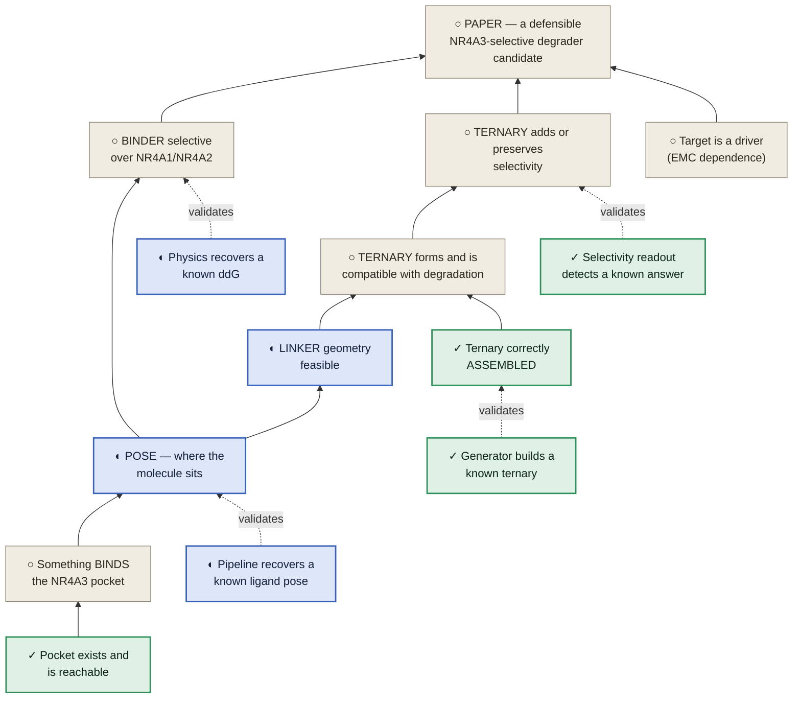
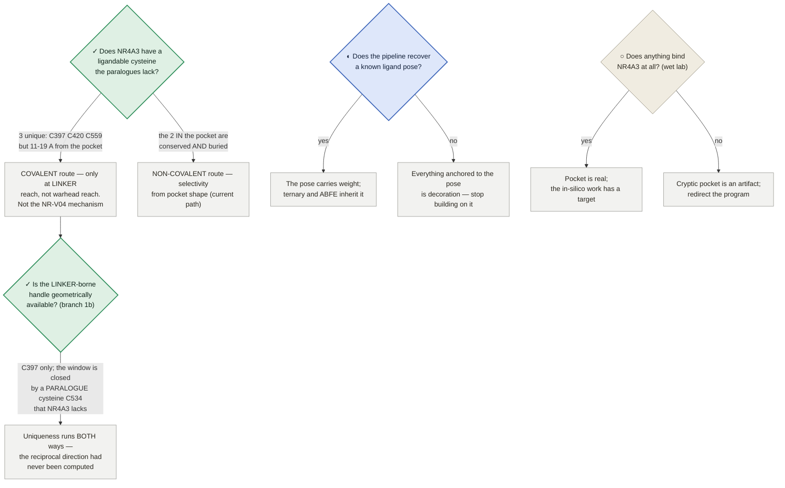
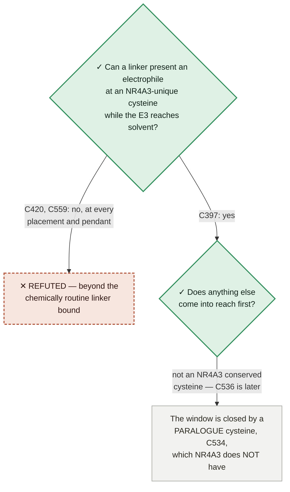

# NR4A3 degrader — the program dependency map

**What has to be true before the paper can present an NR4A3-selective degrader candidate.**

★ **WHY THIS FILE EXISTS (trimcrae, 2026-08-02): *"I feel like we're not being rigorous and have to cobble
together stuff from prose documents and it's leading to us missing things and having to constantly rediscover
connections."*** The dependencies between claims were real but existed only as prose scattered across
STRATEGY.md, the paper, the preregistrations and a dozen module docstrings — so the same connections kept
being re-derived, and blockers kept being misattributed. This is the graph.

⛔ **STATUS VALUES ARE READ FROM COMMITTED ARTIFACTS, NEVER TYPED HERE.** Every cell below points at the
artifact that owns it (rule 1). If this file and an artifact disagree, the artifact is right and this file is
the bug.

Rendered version (mermaid + status colouring): published artifact, regenerated from this file's content.

---

## 0 · Reading the states

★ **A state here is WORK STATUS, not evidence quality (trimcrae, 2026-08-02).** An earlier pass coloured this
page by how good the evidence was, which is a different question and not the one you steer by: a claim can
rest on excellent evidence and still be blocked, and a dead end can be *very* well established. These four
states answer "what should I do about this?" — and every node, row and route below carries exactly one.

| state | glyph | means | what to do |
|---|---|---|---|
| **complete** | ✓ | ran, returned, and the result is recorded in a committed artifact | cite it; don't re-run it |
| **in work** | ◐ | dispatched or building right now | wait for it; don't start a second copy |
| **future work** | ○ | not started, and nothing is blocking it except sequence | this is where new effort goes |
| **dead end** | ✕ | an **approach** that was tried and refuted, recorded so it stops being re-proposed | **do not retry** — see §2 |

⛔ **✕ APPLIES TO APPROACHES, NEVER TO CLAIMS OR GOALS (trimcrae, 2026-08-02, catching the first version of
this page marking the PAPER node as a dead end).** A goal you have not reached is **blocked**, not refuted —
the two look similar on a status board and mean opposite things, because one says *find another route* and
the other says *stop*. So the split is structural, not a matter of care: **§1's dependency graph is claims and
carries only ✓ / ◐ / ○; §2's table is approaches and is the only place ✕ appears.** Nothing in the program is
"a dead end" as a whole — specific methods are.

⚠ **And a ✓ never means "the claim is true"** — it means the *work item* finished. Sequence-only co-folding is
✕ precisely because its work completed cleanly and returned a clear negative. §3 says what each result supports.

---

## 1 · The dependency graph

Read upward: a box can only be claimed once everything feeding it holds. **Dashed edges are validation
dependencies** — the instrument that produces a claim must itself have been shown to work. Node glyphs carry
the state, so the graph reads the same without colour. **Every node here is a claim, so none of them is ✕** —
an unreached claim is ○, and the approaches that were refuted are in §2.

⚠ **PAPER is ○, not ✕ — the goal is blocked, not refuted.** Its two feeders are what block it: the ternary
claim rests on a molecule that cannot be recovered, so it needs the §6 step-4 rebuild, and the binder claim
rests on a free-energy engine that has never recovered a known ΔΔG, so it needs the §6 step-5 benchmark. Both
of those are ◐ or queued, and neither is a dead end. **The refuted *approaches* underneath them are in §2 —
that is the distinction the states exist to keep visible.**

---

## 2 · Dead ends — ruled out, do not retry

★ **Each of these cost real time to establish.** They are recorded so the next person to have the idea can
see that it was already had. Every row's evidence lives in a committed artifact (§Provenance); this table is
an index, not the record.

| ✕ approach | why it is dead | evidence |
|---|---|---|
| **Sequence-only co-folding to generate ternaries** | Each protein's own ligand pocket comes out roughly right, but the two halves are assembled wrongly — the failure is not a matter of degree | DockQ 0.023–0.046 ≈ true structure moved 32 Å |
| **E1 interface-stability endpoint as a selectivity readout** | Three independent attempts, none passed. It is a ranking tool being asked a generation question | wrong sign · p = 0.393 · p = 0.747 |
| **NR-V04 as the positive control** | Its selectivity is attributed to a covalent bond at a cysteine NR4A2/NR4A3 lack, so a geometry readout could pass for the wrong reason. Confounded *by construction* — no sample size fixes it | Cys551 unique to NR4A1; C6→S 28.42–39.11 Å vs a ~1.8 Å bond |
| **Crystal-copy MD design for the E1 control** | 9DTX's asymmetric unit holds a single ternary, so the arms match at one copy each and the test cannot reach α however it is run | 9DTY 8 copies / 9DTX 1; min attainable p = 0.5 |
| **Covalent warhead at an NR4A3 pocket cysteine** | The two cysteines inside the pocket are conserved in all three paralogues *and* buried. Uniqueness and pocket-proximity sit on opposite residues (§5, branch 1) | C496, C536 — SG SASA ≤ 11 Ų |
| **The §2.5 ternary result** | The molecule folded is unrecoverable — no bond-order record, and it entered as an unlogged environment variable. Cannot be replicated or extended | no `_chem_comp_bond` in any of 3 models |
| **Constrained-embed prep for the ternary generator** | Refuted before it was built, by the generator's own released benchmark data — its unbound protocol supplies the native pose, not a generated conformer | shipped ligand ≡ native, 0.000 Å over 66 atoms |

⚠ **A dead end is not a failure of the program** — five of these seven closed off a path that would have
consumed GPU spend, and two of them (the last two rows) were killed by a $0 read before anything ran.

---

## 3 · The instrument layer — the thing that keeps getting rediscovered

An instrument that has never recovered a known answer **cannot support a claim**, however good its output
looks. This table is why three separate selectivity results had to be withdrawn.

| instrument | known-answer test | result | state |
|---|---|---|---|
| Structural selectivity descriptor (`selcal_interface_signature`) | recover the published SMARCA2 Gln1469↔VCB hydrogen bond, unaided, from two crystals | Gln98 Oε1→Arg12 Nη2 **2.88 Å** vs Leu1545 | ✓ complete — **PASSES** |
| Ternary generator given both sites (assembly route) | rebuild 6HAX (in-set) and 9DTY (post-horizon) | DockQ 0.618 / **0.839**, iRMSD 0.67 Å | ✓ complete — **PASSES** |
| Interface-mutation physics (pmx/GROMACS) | barnase–barstar Y29A vs published ΔΔG | +4.42 ± 1.08 vs +3.4 | ✓ complete — **PASSES** |
| Selectivity free energy (ABFE) | CREBBP vs BRD4(1) / SGC-CBP30, ΔΔG ≈ 2.2 kcal/mol | solvent leg dispatched; full pass priced | ◐ in work |
| Ligand pose prediction (dock + MM-GBSA) | recover a known holo pose in a nuclear receptor from apo | — | ◐ in work |
| Sequence-only co-folding (Boltz-2 ternary) | reproduce 9DTY/9DTX from sequence + ligand | DockQ 0.023–0.046 ≈ true structure moved 32 Å | ✕ dead end — **FAILS** |
| Interface-stability endpoint (E1) | three attempts: cooperativity calibrator, NR-V04 retrospective, SMARCA2/4 control | wrong sign · p = 0.393 · p = 0.747 | ✕ dead end — **no pass** |

★ **The pattern.** Every instrument put to a known-answer test either passed cleanly or failed cleanly. Every
claim that later had to be withdrawn came from an instrument that had never been tested. The test costs
close to nothing; skipping it has cost three retractions.

---

## 4 · Where each claim stands

The **state** column is the work item that would move the claim, not a grade on the evidence.

| claim | evidence today | what would settle it | state |
|---|---|---|---|
| **A pocket exists** | 4 of 20 conformers of the experimental apo NMR ensemble **8XTT** are cavity-bearing, no simulation bias applied; Gate 3A (persistence after bias removal) supported | settled enough to build on; Gate 3B (equilibrium accessibility) still open | ✓ complete |
| **Something binds it** | none — no ligand-bound NR4A3 structure exists, of any molecule | a thermal shift / SPR / NMR fragment screen. **Cheapest decisive experiment in the program**, and a negative is as useful as a positive | ○ future — **needs a wet lab** |
| **The pose is right** | docked into the opened frame + MM-GBSA re-dock across the four cavity-bearing conformers; never validated | known-answer test on a nuclear receptor with apo *and* holo deposited, plus convergence between independent methods | ◐ in work |
| **The binder is paralogue-selective** | predicted margin only; the paper's own reading is that selectivity, if any, rests here rather than on the ternary | paralogue ABFE with replicate-SD error bars — *after* CREBBP/BRD4 shows the method recovers a known ΔΔG | ○ future — gated on ◐ |
| **A ternary forms** | predicted for all three paralogues at comparable confidence, built by the failing route — and the molecule used is **unrecoverable**, so it cannot be replicated | rebuild by the assembly route from a recorded molecule | ○ future — the *route* is ✕ (§2), the claim is open |
| **The ternary adds selectivity** | one sequence-encoded candidate (Glu208 → Pro in NR4A1, Tyr in NR4A2); five further hits were placement artifacts; reproducibility untested at one model per arm | credible ternaries × ≥3 models per paralogue, scored by the validated descriptor | ○ future |
| **NR4A3 is the right target** | transfer prior from fusion-addicted sarcomas; near-invariant clonal fusion in a quiet genome; no loss-of-function experiment in any EMC model | the dTAG degradation test — delegated to the EMC-program paper | ○ future — outside scope |

⚠ **Only one claim on this page is ✓, and it is the bottom one.** That is the honest shape of the program:
everything above the pocket is either running, waiting on something running, or waiting on a bench.

---

## 5 · Branches still open

Question nodes carry the state of **the branch itself**: ✓ answered, ◐ being answered now, ○ not started.
Outcome boxes are grey — they are consequences, not work items.

⚠ **The asymmetry worth noticing:** two of these three branches have a **"no" outcome that SAVES the program
effort**, and both are cheap. Neither had been run before 2026-08-02 — and the two that were run then are the
two now marked ✓.

### Branch 1 — ANSWERED 2026-08-02 ([`nr4a3-covalent-handle-ensemble.json`](../modalities/nr4a3-covalent-handle-ensemble.json))

NR4A3 has **three** cysteines the paralogues lack — C397, C420, C559 — measured across all 20 conformers of
the experimental 8XTT ensemble. **But uniqueness and pocket-proximity sit on opposite residues:**

| | in the pocket | NR4A3-unique |
|---|---|---|
| C496, C536 | **yes** (2.7–6.4 Å) | no — conserved in all three, and buried (SG SASA ≤ 11 Ų) |
| C397, C420, C559 | no — **11–19 Å**, linker-tether range | **yes**, and exposed |

⛔ **AND THE CRITERIA FAILED THEIR OWN POSITIVE CONTROL.** NR4A1 **Cys551** — the site a real degrader is
believed to use — does not pass the pre-specified exposure cutoff (RSA 0.165 against 0.25) in **0 of 25**
frames. The thresholds were **not moved**; a test asserts the module holds no local copy of them. What
survives is a threshold-free **rank**: across all 18 NR4A-family LBD cysteines, C551 ranks **3/18** on every
accessibility observable, and the two above it are NR4A3's C397 and C420.
**So "C397 is flagged in 20/20 conformers" is worth nothing on its own** — the same criteria miss the known
site. The rank is the claim; the cutoff is not.

⚠ Two measurement caveats that change how any published RSA should be read: the thiol's **own HG proton
occludes a median 76 %** of the SG surface, so protonated-thiol RSA is not the surface a warhead reaches
(both conventions now reported); and SG SASA was quantized at 1.34 Ų by a 96-point sphere until single-atom
measures were moved to 960 points. Ranks were unchanged by the fix.
⚠ **Not answerable from what exists:** there is no experimental NR4A1/NR4A2 ensemble, so the like-for-like
ensemble comparison is a missing input, not a negative result.

### Branch 1b — the follow-on that branch 1 opened: is the LINKER-borne handle geometrically available?

Branch 1 put the unique cysteines out of *warhead* reach and inside *linker* reach, which is an invitation
rather than an answer: a PROTAC's linker passes through exactly that band, so an electrophile carried there
could ask the warhead only to bind rather than to discriminate. Measured in
[`nr4a3-linker-covalent-reach.json`](../modalities/nr4a3-linker-covalent-reach.json) (+ `.md`) — geometry
only, $0 CPU, and it **owns every number below**.

⚠ **This is the one graph on the page carrying a ✕, and it is carrying it correctly** — `DEAD` is an
*approach* (put the electrophile at C420 or C559), not a claim. It is the fifth row of §2 in miniature.

Three results, in the order they change what the program should do:

1. **The recorded architectural blocker does not apply.** A linker-borne electrophile plus an E3 arm was
   taken to need the two-branch template of [`linker_twobranch.py`](../modalities/linker_twobranch.py). It
   does not: `build_smiles` places the E3 at a chain **terminus**, so the single pendant slot is free and
   the committed library already contains such one-branch constructs aimed at C397. Two branches are needed
   only to carry the electrophile *and* the RUNG-5a causal wedge together — a different molecule for a
   different experiment. Read from the enumeration, not recalled, and pinned by a test.
2. **Only C397 survives the reach test.** C420 and C559 need far more backbone atoms than the imported
   chemically-routine bound, at all ten placements of the five basins that survived term-(b), at every
   pendant reach, and under both reach conventions. Those two are closed.
3. ⛔ **The counter-test fires from the opposite direction to the one it was designed to check.** The window
   is not closed by an NR4A3 *conserved* cysteine. It is closed first by a **paralogue** cysteine —
   **NR4A1/NR4A2 C534, which aligns to NR4A3 S565**, i.e. a cysteine the paralogues have and NR4A3 lacks —
   concordant across both paralogue metadynamics ensembles as well as the single opened models. **Uniqueness runs both ways, and
   the reciprocal direction had never been computed anywhere in this repo.** A residue-uniqueness argument
   built only on "which of MY residues do they lack" is therefore incomplete by construction.

⚠ **How far these numbers may be trusted, measured rather than asserted.** The paralogue positions come from
three independently built opened models. At aligned cysteine pairs their backbones agree far better than
their side chains, so the artifact reports ΔCA against ΔSG per pair and states the sulfur displacement that
would reopen the window. The **direction** of result 3 rests on sequence plus fold-level position; the exact
backbone-atom counts do not, and must not be quoted more precisely than that record allows.
⚠ Everything here is conditional on the docked pose the anchors come from, whose known-answer test is the
`Ligand pose prediction (dock + MM-GBSA)` row above — **running, not returned**. Reach is a necessary
condition for a covalent handle and never a sufficient one: no thiol pKa, intrinsic reactivity, adduct or
degradation quantity is computed, and no selectivity, efficacy, safety or feasibility claim follows.

---

## 5b · The two live routes to selectivity — and where each is actually blocked

★ **Added 2026-08-02 after the map's first pass exposed that both routes' chemical basis was sitting in
prose while the reasoning above treated selectivity as speculative.** Selectivity has to come from somewhere
specific. Two places are real, they are **complementary rather than competing**, and a candidate could use
both.

### Route A — a warhead engaging paralogue-divergent pocket handles · ◐ **in work**

**Chemical basis: ✓ strong, and already measured** ([`nr4a-selectivity.json`](../modalities/nr4a-selectivity.json),
paper §2.4). Of the **10 Pocket-5 lining residues, 7 are paralogue-divergent** — L406, T407, T410, R412,
I484, I531, L534 — and in the opened druggable ensemble **5 stay pocket-facing** (L406, T410, I484, I531,
L534), so those five are the realistically engageable handles. T407 and R412 mostly splay outward.
★ **And all ten are ortholog-invariant across six species spanning ~300 My** (`nr4a3_resistance_map.py`) —
paralogue-divergent yet species-conserved, which is both a resistance argument and evidence the divergence is
functional rather than drift.

⛔ **Blocked on the INSTRUMENT, not the chemistry — and the instrument is ◐ running.** The margin these
handles would produce is a free-energy quantity, and the ABFE engine has **never recovered a known ΔΔG**; its
selectivity benchmark (CREBBP vs BRD4(1), SGC-CBP30) was built and staged with no `result` key, and its first
leg is now on spot. Until that returns, a computed margin is unfalsifiable. **This is the single
highest-leverage item in the program, and it is the one thing moving.**

### Route B — a linker-borne covalent handle at an NR4A3-unique cysteine · ◐ **in work**

**Chemical basis: ✓ opened 2026-08-02** by the cysteine census above. The unique cysteines C397/C420/C559 sit
11–19 Å out — *where a PROTAC's linker passes*, not where its warhead sits. So instead of asking the warhead
to discriminate an ~80 %-identical pocket, put the electrophile on the **linker** and let it react with a
residue NR4A1 and NR4A2 do not have. That is the NR-V04 mechanism relocated to where NR4A3's unique residues
actually are.

✓ **The geometry block is now ANSWERED, and the counter-test did not kill it** (branch 1b above). The feared
outcome — a **conserved** cysteine always in easier reach than a unique one — did not occur. C397 survives at
routine linker length; C420 and C559 are closed. What *does* close C397's window is a **paralogue** cysteine,
NR4A1/NR4A2 C534, aligning to NR4A3 S565 — a residue NR4A3 lacks, which is the opposite direction to the one
the counter-test was designed to check.

⛔ **What remains blocking is upstream, not here:** every anchor comes from the docked pose, whose known-answer
test is ◐ running. Reach is a necessary condition for a covalent handle and never a sufficient one.

**Why they compose:** a warhead tuned to the five engageable divergent handles *plus* a covalent linker
handle at a unique cysteine is a far stronger selectivity argument than either alone — two independent
mechanisms, each with its own falsifier.

---

## 6 · Critical path

Ordered by what unblocks the most, not by what is easiest. **The state is the item's, not the claim's.**

| # | item | state |
|---|---|---|
| 1 | **Does anything bind the pocket?** — wet lab, cheap, and the only item that can invalidate the whole non-covalent path. Everything below assumes a yes | ○ future — **the one item no computation can supply** |
| 2 | **Known-answer test for pose prediction.** Decides whether the pose that the ternary and the ABFE both inherit is worth inheriting | ◐ in work |
| 3 | **Is there a ligandable NR4A3 cysteine?** A yes opens a route needing no cryptic pocket at all | ✓ complete — §5 branch 1 + 1b |
| 4 | **Rebuild the ternaries by the assembly route**, from a molecule whose structure is recorded this time | ◐ in work |
| 5 | **Run the CREBBP/BRD4 benchmark** before quoting any selectivity free energy — the missing known-answer test for the instrument the *binder* claim depends on | ◐ in work |
| 6 | **≥3 ternary models per paralogue**, then the validated descriptor. Until then no contact can be told from one model's accident | ○ future — gated on 4 |

★ **Read the column, not the list.** Four of the six are moving or done; the two ○ rows are gated on something
else, and item 1 is gated on a bench. There is no row here waiting on a decision.

---

## Provenance

Artifacts that own the numbers above:
[`selcal-interface-signature.json`](../modalities/selcal-interface-signature.json) ·
[`selcal-deepternary-headtohead.json`](../modalities/selcal-deepternary-headtohead.json) ·
[`selcal-cofold-decompose.json`](../modalities/selcal-cofold-decompose.json) ·
[`selcal-dockq-decoy-scale.json`](../modalities/selcal-dockq-decoy-scale.json) ·
[`nr4a-ternary-signature.json`](../modalities/nr4a-ternary-signature.json) ·
[`selcal-xtal-census.json`](../modalities/selcal-xtal-census.json).

⛔ No claim on this page asserts NR4A3 selectivity, efficacy or clinical readiness; predicted quantities are
labelled as predictions throughout.
