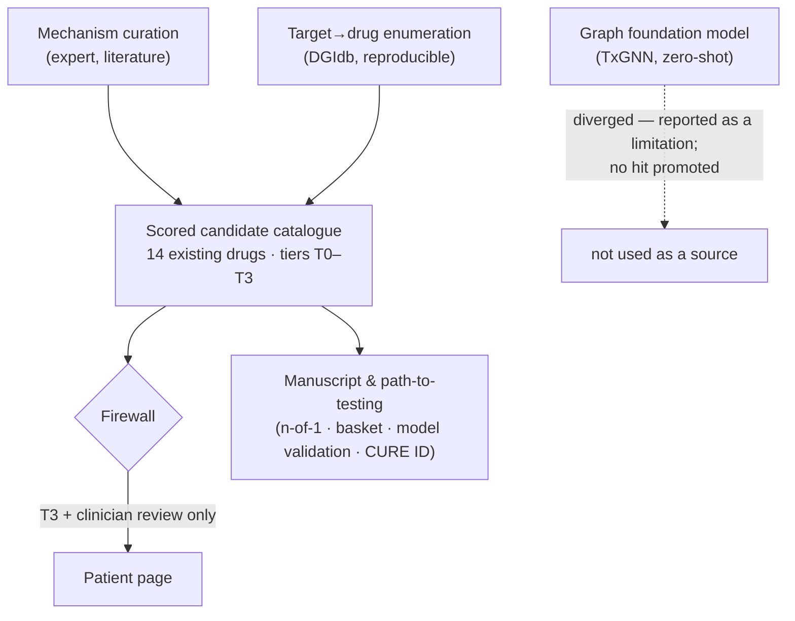

# Mechanism-based drug-repurposing hypotheses for extraskeletal myxoid chondrosarcoma

> **EARLIER TREATMENT-TRACK DRAFT — subsumed by the active manuscript**
> [`emc-treatment-roadmap.md`](./emc-treatment-roadmap.md), which sits on top of this work. Kept for
> reference / a possible follow-on; not the active push. Folder map: [`README.md`](./README.md).

**Status: DRAFT v0.2 — full prose, pre-clinician-review, not for submission.**
This is a *hypothesis-generating* paper (the genre of e.g. a "hypothesis" or
"perspective" article). It proposes existing drugs whose mechanisms fit EMC biology
but that have not been tested in EMC. **It asserts no efficacy.**
**Author:** [Name], Independent researcher, [City, Country] — this work was carried out
independently, in a personal capacity, and is unconnected to the author's employer. Prepared
with AI assistance (see §8). A sarcoma clinician/researcher collaborator is being sought and is
recommended before clinical-facing submission. Source of candidates:
`research/hypotheses/candidates.json`; method: `research/hypotheses/METHODOLOGY.md`.

## Abstract
Extraskeletal myxoid chondrosarcoma (EMC) is an ultra-rare, *NR4A3* fusion-driven soft-tissue
sarcoma with an indolent-but-relentlessly-metastasising course and no established effective
systemic therapy; anti-angiogenic tyrosine-kinase inhibitors (TKIs) are its most consistently
active class, yet responses are partial and temporary. Because the disease is too rare for
large de-novo trials and its genome is recurrently "quiet" (no recurrent actionable mutations
on clinical sequencing), drug *repurposing* — deploying agents that already exist and carry
human safety data — is a rational strategy. We systematically map EMC's molecular and
microenvironmental vulnerabilities to existing drugs **not yet reported in EMC** using three
independent methods: (i) expert, literature-driven mechanism curation; (ii) a reproducible
target→drug enumeration against a public interaction database (DGIdb); and (iii) zero-shot
prediction from a graph foundation model (TxGNN). Each hypothesis is graded by an explicit
evidence tier (T0–T3) and a transparent six-criterion priority score, and is held behind a
strict firewall from patient-facing material. Curation and enumeration converge on a
prioritised menu of **14 candidates** spanning the angiogenic, *NR4A3*-transcriptional,
PPARγ/lineage, cell-cycle, epigenetic, apoptotic and immune axes. We deliberately separate the
**best-evidenced** option — imatinib, which has direct EMC clinical evidence but is **not novel**
and applies only to the ~4% *KIT*-mutant minority — from the **most promising genuinely novel
leads**, which are preclinical: PPARγ agonism (in-vivo EMC-model data) and the proteasome/BCL-2
inhibitors carfilzomib and venetoclax (validated across two patient-derived EMC models). In EMC
the evidence and novelty of a candidate are essentially anti-correlated, and naming that gap — not
proposing a cure — is part of the contribution. The graph foundation model, by contrast, diverged
sharply — and a pre-specified stress-test on commoner sarcomas showed the divergence is **not**
explained by EMC's rarity — illustrating a concrete limitation of deploying an off-the-shelf
knowledge-graph model for this problem. We present this as a feasibility-ranked set of testable
hypotheses to focus preclinical and n-of-1 investigation — explicitly **not** as evidence of
efficacy.

## 1. Introduction

**The disease.** EMC is a rare soft-tissue sarcoma defined molecularly by rearrangement of
*NR4A3* (also called *NOR1*/*CHN*/*TEC*), most often as the *EWSR1::NR4A3* fusion and less
commonly *TAF15::NR4A3* and other variants. The fusion produces a chimeric transcription
factor that drives the tumour's transcriptional programme — including activation of target
genes via chromatin modification (Kim et al. 2016) — making EMC a prototypical
fusion-addicted, "transcription-factor" cancer. Clinically it is paradoxical: typically
slow-growing and associated with prolonged survival, yet with a high cumulative rate of
local recurrence and distant (especially pulmonary) metastasis over years to decades
(Remiszewski et al. 2025). Even once metastatic the course can be protracted, and outcomes
vary widely by era and by completeness of surgery (Masunaga et al. 2025).

**The unmet need.** Surgery (± radiotherapy) controls localised disease, but there is **no
established effective systemic therapy** for advanced EMC. The most consistently active class
is the anti-angiogenic multikinase TKIs — pazopanib and sunitinib in particular — but
responses are usually partial and finite, and conventional cytotoxic chemotherapy has limited
activity (Remiszewski et al. 2025). Compounding this, clinical next-generation sequencing of
advanced EMC characteristically reveals **no recurrent, directly actionable driver mutations**
beyond the defining fusion (Davis et al. 2017). An imatinib-sensitive activating *KIT* mutation
is rare — reported in ~1 of 20 EMCs in one series (Urbini et al. 2018) and ~2 of 48 (≈4%) in
another (Huang SC et al. 2023), in addition to the index treated case (Jennings et al. 2021).
CD117/KIT *protein*, by contrast, is detectable by immunohistochemistry in a substantial but
variable proportion of cases (≈53% in one series and ≈84% of 31 in another; Huang SC et
al. 2023; Giner et al. 2023) — a distinction that matters clinically, because imatinib acts on
the activating mutation, not on mere protein expression. EMC therefore sits in a difficult
space: too rare for adequately-powered de-novo trials, and without an obvious single druggable
mutation to anchor a targeted-therapy programme.

**The case for repurposing.** Re-deploying drugs that are already approved (or have human
safety data) is especially suited to this setting: it removes the largest cost and time
barriers of de-novo development, lets a candidate move quickly to a biomarker-matched n-of-1
or basket study, and is well-aligned with the economics of neglected diseases, where off-patent
agents lack a commercial sponsor to fund confirmatory trials. The challenge is to choose
*which* existing drugs to test, rationally and transparently, without overstating the
evidence. Here we address that choice for EMC by mapping its documented vulnerabilities to
existing drugs through three independent and complementary methods, grading every resulting
hypothesis by how speculative it is, and reporting where the methods agree and where they
do not.

## 2. Methods

**Scope and inclusion.** We considered only agents that (i) already exist as approved drugs
or carry substantial human safety data, (ii) have a mechanistic rationale against a documented
EMC vulnerability, and (iii) have not, to our knowledge, been reported as tried in EMC.
Candidates were organised across seven vulnerability axes: angiogenesis; the *NR4A3* fusion and
its transcriptional programme; PPARγ / nuclear-receptor signalling; epigenetic dependencies;
the cell cycle; apoptosis / proteostasis; and the immune microenvironment. "Not yet reported in
EMC" was assessed by structured review of the EMC literature corpus underlying this project and
by the enumeration's gap analysis against agents with documented EMC activity; this status is
time-sensitive and should be re-confirmed with a dated, documented database search at the point
of submission.

**Evidence tiers.** Each candidate is graded by the strength and proximity of its supporting
evidence: **T3**, prospective or substantial clinical evidence in EMC; **T2**, case-level
signal in EMC or a very close relative; **T1**, preclinical/in-vitro signal or a strong analogy
in a related fusion-driven sarcoma; **T0**, mechanistic rationale only. The tier states *how
speculative* a hypothesis is, not the expected effect size.

**Priority score.** Independently of tier, each candidate is scored 0–3 on six criteria —
EMC-specific evidence, mechanistic fit, availability, safety/tolerability, presence of a
selection biomarker, and novelty (whether it is genuinely unconsidered) — for a composite of
0–18. This is a transparent, equally-weighted triage heuristic to *order* the menu, not a
calibrated probability of success (see Limitations). Per-criterion scores, rationale, risks and
citations for every candidate are in `research/hypotheses/candidates.json`; the full method,
including the firewall and pooling rules, is in `research/hypotheses/METHODOLOGY.md`.

**Citation integrity.** Every clinical and biological claim in the underlying catalogue is tied
to a primary source; any claim that could not be so grounded was tagged `needs-verification`
and resolved to a primary reference (or removed) before this draft, and an automated check
(`validate-research.mjs`) enforces zero unresolved claims. A strict firewall separates these
hypotheses from any patient-facing material (see Limitations).

**Candidate generation.** Candidate generation combined expert, literature-driven curation with
a **systematic target→drug enumeration** (`hypotheses/enumerate-drugs.mjs`): the EMC drug
targets in `targets.json` were queried against the DGIdb interaction database, approved drugs
with an inhibitor interaction were retained, and a gap analysis against the catalog and the
known-active EMC agents isolated genuinely unconsidered drugs (`target-drug-matrix.json`).
This independently reproduced the anti-angiogenic-TKI cluster and broadened it (e.g.
nintedanib, axitinib, vandetanib, tivozanib), mitigating single-rater coverage bias;
implausible hits (e.g. a PPI, a thrombopoietin agonist) were triaged out on mechanism.

As a third, independent line we ran the pretrained **TxGNN** graph foundation model
(Huang et al., Nat Med 2024) zero-shot on the EMC knowledge-graph node and ranked all
7,957 drugs (`hypotheses/txgnn-emc-findings.md`). Unlike curation and enumeration —
which converge on oncology leads — TxGNN diverged: its top predictions were
metabolic/lysosomal-storage-disease drugs, while EMC's most clinically-active agents
(pazopanib, sunitinib) and our biomarker-supported lead (imatinib) ranked at roughly the
19th–25th percentile of 7,957. We pre-specified a stress-test to ask whether this simply
reflects EMC's rarity: re-running the model on two commoner relatives (chondrosarcoma,
soft-tissue sarcoma) did **not** rescue the leads — they ranked similarly low (median ≈17–18th
percentile, slightly *worse* than EMC's ≈21st) and the model reproduced the same implausible
top hits (table below). The divergence is therefore **not attributable to EMC's sparsity specifically**; it
is a general property of this released checkpoint's indication ranking (which — being the
held-out `complex_disease` split — also prevents any of the three diseases from serving as a
clean data-rich control). We report this as a limitation rather than acting on it; no TxGNN
prediction was promoted to a candidate. The three-method design and the patient firewall:

TxGNN sparsity stress-test — our mechanism/enumeration drugs rank low for EMC *and* its commoner
relatives, so the divergence is not an EMC-rarity effect (median percentile of our drugs in the
model's 7,957-drug indication ranking; higher = better):

| Disease | our drugs' median percentile | best-ranked of our drugs |
|---|---|---|
| EMC | 21.0 | doxorubicin (75th pct) |
| chondrosarcoma | 17.7 | doxorubicin (80th pct) |
| soft-tissue sarcoma | 17.4 | doxorubicin (72nd pct) |

## 3. Candidates

We surveyed EMC's documented vulnerabilities across seven axes (angiogenesis; the *NR4A3* fusion
/ transcription; PPARγ / nuclear-receptor; epigenetic; cell-cycle; apoptosis/proteostasis;
immune) and assembled **14 existing-drug candidates**. We deliberately present them by the **two
axes that actually matter to a reader — how strong the EMC-specific evidence is, and whether the
hypothesis is genuinely novel — rather than by a single rank.** (Each candidate also carries a
transparent 0–18 composite triage score in the dataset and `METHODOLOGY.md`; we do *not* use it
to order the presentation, because summing evidence with novelty, safety and availability floats
the *known* drug to the top and is easily misread as a discovery ranking.) Full per-criterion
data: `research/hypotheses/candidates.json`.

**The evidence × novelty map** (rows = EMC-specific evidence strength, strongest first; columns =
how novel the hypothesis is) shows the structure at a glance:

| EMC evidence ↓ / Novelty → | Known (tried) | Partly novel | Novel (untried) |
|---|---|---|---|
| **Clinical (EMC patient)** | Imatinib (KIT-mut) | — | — |
| **Clinical (class)** | — | VEGFR-TKIs (rego/cabo/lenva…) | — |
| **In-vivo (animal EMC)** | — | — | Zaltoprofen (PPARγ) |
| **Ex-vivo (EMC models)** | — | Anthracycline + carfilzomib/venetoclax | Carfilzomib · Venetoclax · HDAC (romidepsin/panobinostat) · Brigatinib |
| **Genomic / IHC** | — | — | CDK4/6 (palbociclib) |
| **Mechanistic only** | — | — | Pioglitazone (PPARγ) · NTRK · NR4A3/NOR1 · BET/CDK7–9 · mRNA-vaccine + checkpoint |

The empty **Novel × Clinical** cells are the headline: no new drug has EMC clinical evidence. The
full detail, strongest evidence first:

| Candidate (axis) | Evidence *in EMC* | Novel? |
|---|---|---|
| **Imatinib** — *KIT*-mutant subset (KIT) | **Clinical** — 1 patient, 3-yr stable disease | **No** — already reported |
| **VEGFR-TKIs**: regorafenib, cabozantinib, lenvatinib, nintedanib, sorafenib, axitinib, vandetanib, tivozanib (angiogenesis) | **Clinical, class-level** — pazopanib/sunitinib are active in EMC; these specific agents are untested extensions | Partly |
| **Zaltoprofen → pioglitazone** (PPARγ / lineage) | **In-vivo** — tumour-growth inhibition in a mouse EMC model via PPARγ | **Yes** |
| **Carfilzomib** ± doxorubicin / venetoclax (proteostasis) | **Ex-vivo** — only 1 of 17 drugs with high sensitivity across **2** patient-derived EMC models; carfilzomib+doxorubicin & +venetoclax synergy | **Yes** |
| **Venetoclax** (BCL-2 / apoptosis) | **Ex-vivo** — sensitivity validated in the 2 EMC models | **Yes** |
| **HDAC inhibitors**: romidepsin / panobinostat (epigenetic) | **Ex-vivo** — top hits of a 221-drug screen in a patient-derived EMC line | **Yes** |
| **Brigatinib** (kinome screen hit) | **Ex-vivo** — same EMC-line screen; mechanism unknown | **Yes** |
| **CDK4/6 inhibitors**: palbociclib (cell cycle) | **Genomic/IHC** — CDK4 IHC 100% + CDKN2A/2B loss (not yet functional) | **Yes** |
| **Pioglitazone** (PPARγ agonist) | **Mechanistic** — direct agonism; rides the PPARγ axis above | **Yes** |
| **NTRK inhibitors**: larotrectinib / entrectinib | **Mechanistic** — pan-Trk *expression*, not a fusion (weak) | **Yes** |
| **NR4A3/NOR1-directed modulation** (fusion TF) | **Mechanistic** — drug the driver; no clinical-grade agent yet | **Yes** |
| **BET (BRD4) / CDK7–9 inhibitors** (fusion transcription) | **Mechanistic** — analogy to other fusion sarcomas | **Yes** |
| **mRNA-vaccine + checkpoint inhibitor** (immune) | **Mechanistic** — cold-microenvironment hypothesis; no EMC data | **Yes** |

The structure is the point: **evidence strength and novelty pull in opposite directions.** The
*only* clinically-evidenced option (imatinib) is the *only* non-novel one and treats a ~4%
minority; every genuinely novel hypothesis is preclinical, and the "novel + clinical" cell is
**empty** — there is no new drug with EMC clinical evidence (see the map). The actionable leads are
therefore the *novel* candidates with the strongest *functional* EMC evidence (in-vivo, then
ex-vivo), distilled next.

### Leads for investigators (novel × EMC-specific functional evidence × testability)

Candidates that are (i) **not yet tried in EMC**, (ii) backed by **EMC-specific functional data**
(not mechanism alone), and (iii) **testable now**, ranked for actionability:

| Lead | Why it is a genuine new lead | EMC-specific functional evidence | Realistic test |
|---|---|---|---|
| **PPARγ agonism — pioglitazone** (motivated by zaltoprofen) | novel; targets EMC lineage/differentiation biology; safe, oral, globally available | **in-vivo**: zaltoprofen inhibited tumour growth in a mouse EMC model via PPARγ (Higuchi et al. 2023) | investigator-initiated window / n-of-1 with pioglitazone; no biomarker needed |
| **Carfilzomib ± doxorubicin (± venetoclax)** | novel; an *unbiased screen* hit, not a hypothesis | **ex-vivo**: the only 1 of 17 drugs with high sensitivity across **two** patient-derived EMC models, with carfilzomib+doxorubicin and carfilzomib+venetoclax synergy (Bangerter et al. 2023) | preclinical confirmation, then a combination arm on the existing anthracycline backbone |
| **HDAC inhibitors (panobinostat/romidepsin); brigatinib** | novel; hits from a **second, independent** EMC screen | **ex-vivo**: top hits of a 221-drug screen in a patient-derived EMC line (Iwata et al. 2025) | confirm across further EMC models; brigatinib's hit is mechanistically unexplained and worth dissecting |
| **CDK4/6 inhibitors (palbociclib)** | novel; biomarker-rational | CDK4 IHC 100% + CDKN2A/2B loss (Giner et al. 2023; Davis et al. 2017) — *expression/genomic*, not yet functional | establish functional dependence in an EMC model, then a biomarker-selected window study |
| **BET/CDK7–9; direct NR4A3 modulation** *(biology bet)* | most *on-target* — the fusion's transcriptional addiction | mechanistic/analogy only — **no EMC functional data yet** | a research programme, not a near-term trial |

The actionable signal is **convergence on EMC-specific functional data**: PPARγ (mechanism +
in-vivo), the proteasome/BCL-2 axis (two-model screen), and the HDAC/brigatinib hits (a separate
screen) are each supported by EMC functional data and none has been tried clinically. **That short
list — not the score rank — is what a clinician-researcher should leave with.**

**Framing — the quiet genome.** Clinical NGS of metastatic EMC found *no recurrent
actionable mutations* (the *KIT*-mutant case is a rare, few-percent exception), so the strategy is to
target the fusion / lineage biology and to mine unbiased patient-derived-model
screens (Bangerter et al. 2023; Iwata et al. 2025) — which is why approved drugs hitting
PPARγ, cell-cycle, epigenetic and apoptotic nodes, plus the validated VEGFR-TKI class,
dominate the top of the list. The two lowest-ranked (T0) candidates are listed only for
completeness: NTRK inhibition rests on expression rather than a fusion, and an
mRNA-neoantigen-vaccine plus checkpoint-inhibitor combination is included by analogy to
adjuvant melanoma (KEYNOTE-942; Weber et al. 2024), tempered by the lipid-nanoparticle
immunogenicity that complicates mRNA therapeutics (lipid-nanoparticle immunogenicity
review, 2023).

## 4. Prioritization & a path to testing

We prioritise by **evidence tier × feasibility**, where feasibility combines drug
availability (approved > investigational-with-safety-data), tolerability, and whether a
**selection biomarker** exists. This yields three practical tranches:

**Tranche 1 — biomarker-matched, near-term n-of-1.** *Imatinib* in the *KIT*-mutant subset
is the only candidate at T3 (direct EMC clinical evidence: a *KIT* exon-11–mutant patient with
3 years of disease stabilisation; Jennings et al. 2021). It is approved, well-characterised,
and biomarker-defined. The realistic route is **molecular pre-screening** (NGS for *KIT*
mutations) followed by an **expanded-access / n-of-1** trial in the small, mutation-defined
minority who qualify — not general use. This is the single most actionable lead and is flagged as eligible for the
patient-facing page pending clinician review.

**Tranche 2 — shelf-ready class extension.** The VEGFR-TKI extension (regorafenib,
cabozantinib, lenvatinib, and the enumeration-surfaced nintedanib, sorafenib, axitinib,
vandetanib, tivozanib) builds on EMC's *most validated* active class and needs no new
biomarker; the class's activity in unselected soft-tissue sarcoma is exemplified by
cabozantinib (O'Sullivan Coyne et al. 2022). These are candidates for **histology-inclusive
basket trials** of anti-angiogenic agents in sarcoma, or for prospective registry-embedded
cohorts, with the caveat that they likely share pazopanib's eventual resistance.

**Tranche 3 — preclinical-validation-first.** The PPARγ/lineage (zaltoprofen — which inhibits
EMC-lineage growth *in vivo* via PPARγ induction, Higuchi et al. 2023 — and pioglitazone),
cell-cycle (CDK4/6), epigenetic (HDAC, BET/CDK7-9), and apoptotic/proteostatic (venetoclax,
carfilzomib) candidates rest on *in-vivo* or patient-derived-model screen signals rather than
clinical data. Their natural next step is **confirmatory testing in the existing
patient-derived EMC models** (the two independent EMC model drug screens that anchor much of
this evidence), prioritising hits that recur across models and that pair logically with the
current anthracycline backbone, before any clinical consideration.

Across all tranches, the disease's rarity argues for **shared infrastructure**: centralised
molecular profiling, multi-institution basket/registry designs, and contributing real-world
off-label experiences to public registries such as **CURE ID** (FDA/NCATS) so that isolated
n-of-1 outcomes become collective evidence.

## 5. Limitations & ethics

These are **hypotheses, not recommendations, and no efficacy is claimed.** Several specific
limitations bound their strength. First, most candidates are supported by preclinical,
in-vitro, or model-screen data rather than EMC clinical evidence (only imatinib reaches T3),
and the dominant rationale is *lineage/fusion* biology because EMC's genome is recurrently
quiet — so target-level plausibility does not guarantee clinical activity. Second, candidate
*generation* began as single-rater curation; we mitigated the resulting coverage bias with a
reproducible target→drug enumeration, but the priority score remains an expert-elicited,
equally-weighted heuristic, not a calibrated probability. Third, the graph foundation model
(TxGNN) we used as an independent check **diverged** from the mechanism- and
enumeration-derived leads, ranking EMC's most clinically-active agents (pazopanib, sunitinib) in
the bottom quartile of 7,957 drugs; a pre-specified stress-test on commoner sarcomas reproduced
the same pattern, so we interpret this as a limitation of the off-the-shelf model's indication
ranking — not as evidence against those agents, and not, as we had initially supposed, a simple
consequence of EMC's rarity. Either way it is a reminder that no single method is authoritative
here. Fourth, biomarker-restricted candidates (notably imatinib) apply only to a
molecularly-defined minority and must not be generalised.

Ethically, the chief risk is **false hope**: a plausible-sounding mechanism can be mistaken by
a frightened patient for an available treatment. We address this structurally — a strict
firewall keeps T0–T2 hypotheses out of all patient-facing material, and only a candidate that
reaches real EMC clinical evidence (T3) may migrate, and then only after clinician review. Any
clinical step (expanded access, n-of-1, trial) requires sarcoma-specialist judgement and,
where applicable, formal ethics oversight and informed consent. Every clinical and biological
claim in the underlying catalogue is cited to a primary source; remaining textbook/analogy
claims were resolved to primary references prior to drafting.

## 6. Conclusion

For a cancer too rare to support large de-novo trials, a transparent, honestly-graded menu of
*existing-drug* hypotheses is a pragmatic way to focus scarce investigative effort. Triangulating
three independent methods, mechanism curation and reproducible target enumeration converge on a
prioritised set in which the only clinically-evidenced targeted option (imatinib, *KIT*-mutant
disease) is **non-novel and serves a small minority**, while the genuinely novel, testable leads
— PPARγ agonism and screen-validated proteasome/BCL-2 inhibition — are supported only by EMC
*preclinical* models. Naming that evidence–novelty gap honestly, and surfacing the short list of
leads that are both new and EMC-supported (see "Leads for investigators"), is the practical
contribution; a graph foundation model's divergence marks the current limits of automated
repurposing for ultra-rare cancers. We offer this catalogue not as a claim of efficacy but as an
invitation: a feasibility-ranked starting point for the preclinical validation, biomarker-matched
n-of-1 studies, and shared registry infrastructure that could realistically move EMC care forward.

## 7. Data and code availability

All underlying data and the methods that generated them are open and reproducible. The scored
candidate catalogue (`research/hypotheses/candidates.json`), the methodology
(`research/hypotheses/METHODOLOGY.md`), the target→drug enumeration code and output
(`enumerate-drugs.mjs`, `target-drug-matrix.json`), and the TxGNN run, outputs and write-up
(`txgnn_predict.py`, `txgnn-emc-predictions.json`, `txgnn-relatives-comparison.json`,
`txgnn-emc-findings.md`) are in the project repository. No new patient data were generated; all clinical/biological inputs are from the
cited published literature.

## 8. Author contributions

[Name] (independent researcher) conceived the project, built the data pipeline and analyses,
performed the literature curation and verification, and wrote the manuscript — independently and
in a personal capacity. **AI tools (Anthropic Claude) were used for literature aggregation, the
systematic target→drug enumeration, the graph-model (TxGNN) run, reference verification, and
drafting; the author takes full responsibility for all content and conclusions.** AI is not, and
cannot be, an author. A sarcoma clinician/researcher has not yet been involved: clinical
collaboration is actively sought and is recommended to review candidate plausibility and the
imatinib patient-page decision before any clinical-facing submission. No clinical recommendation
is made in the absence of such review (see the firewall, §5).

## 9. Competing interests

The author declares no competing interests. The work has no commercial sponsor and uses only
public databases and already-approved or off-patent agents.

## 10. Funding

This work received no funding; it was conducted independently, in the author's own time.

## 11. Acknowledgements

The public resources this work builds on, with thanks: DGIdb; the TxGNN / PrimeKG project
(Zitnik laboratory); the FDA/NCATS CURE ID registry; and the authors of the primary EMC
literature cited below.

## References

References for works cited above. EMC clinical/biological references are drawn from the
catalogue's citation map (`hypotheses/candidates.json`) and the patient registry
(`data/cancers/emc.json` → `registry.citations`); author lists are abbreviated ("et al.")
where the full list is not carried in those sources. Every entry has a resolvable DOI or
PMID/PMCID.

1. Davis EJ, et al. Next generation sequencing of extraskeletal myxoid chondrosarcoma. *Oncotarget.* 2017. doi:10.18632/oncotarget.15568. PMC5400622.
2. Urbini M, et al. Identification of an actionable mutation of KIT in a case of extraskeletal myxoid chondrosarcoma. *Int J Mol Sci.* 2018. doi:10.3390/ijms19071855. PMC6073125.
3. Jennings B, et al. Sustained response to imatinib in patient with extraskeletal myxoid chondrosarcoma and novel KIT mutation. *BMJ Case Rep.* 2021. doi:10.1136/bcr-2021-242039. PMC8395296.
4. Huang SC, et al. Extraskeletal myxoid chondrosarcomas: the uncommon clinicopathologic manifestations and significance of TAF15::NR4A3 fusion. *Mod Pathol.* 2023. doi:10.1016/j.modpat.2023.100161. PMID 36948401.
5. Kim AY, Lim B, Choi J, Kim J. The TFG-TEC oncoprotein induces transcriptional activation of the human β-enolase gene via chromatin modification of the promoter region. *Mol Carcinog.* 2016. doi:10.1002/mc.22384. PMID 26310886.
6. Higuchi T, et al. A nonsteroidal anti-inflammatory drug, zaltoprofen, inhibits the growth of extraskeletal chondrosarcoma cells by inducing PPARγ, p21, p27 and p53. *Cell Cycle.* 2023. doi:10.1080/15384101.2023.2166195. PMID 36636023.
7. Bangerter JL, et al. Establishment, characterization and functional testing of two novel ex vivo extraskeletal myxoid chondrosarcoma (EMC) cell models. *Human Cell.* 2023. doi:10.1007/s13577-022-00818-x. PMC9813045.
8. Iwata S, et al. Establishment and characterization of NCC-EMC1-C1: a novel patient-derived cell line of extraskeletal myxoid chondrosarcoma. *Human Cell.* 2025. doi:10.1007/s13577-025-01250-7. PMID 40580361.
9. O'Sullivan Coyne G, et al. Clinical activity of single-agent cabozantinib (XL184), a multi-receptor tyrosine kinase inhibitor, in patients with refractory soft-tissue sarcomas. *Clin Cancer Res.* 2022. doi:10.1158/1078-0432.CCR-21-2480. PMC8776602.
10. Masunaga T, Tsukamoto S, Nagano A, et al. The role of radiotherapy and chemotherapy in extraskeletal myxoid chondrosarcoma. *J Orthop Surg Res.* 2025. doi:10.1186/s13018-025-06245-6. PMC12398172.
11. Remiszewski P, Falkowski S, Szumera-Cieckiewicz A, et al. From pathogenesis to the patient's bedside: a comprehensive review of extraskeletal myxoid chondrosarcoma. *J Cancer Res Clin Oncol.* 2025. doi:10.1007/s00432-025-06316-5. PMC12504171.
12. Huang K, Chandak P, Wang Q, et al. A foundation model for clinician-centered drug repurposing (TxGNN). *Nat Med.* 2024. doi:10.1038/s41591-024-03233-x. PMID 39148855.
13. Weber JS, et al. Individualised neoantigen therapy mRNA-4157 (V940) plus pembrolizumab versus pembrolizumab monotherapy in resected melanoma (KEYNOTE-942): a randomised, phase 2b study. *Lancet.* 2024. doi:10.1016/S0140-6736(23)02268-7. PMID 38246194.
14. Immunogenicity of lipid nanoparticles and its impact on the efficacy of mRNA vaccines and therapeutics. *Exp Mol Med.* 2023. doi:10.1038/s12276-023-01086-x. PMC10618257.
15. The Drug–Gene Interaction Database (DGIdb). https://dgidb.org (Freshour SL, et al. *Nucleic Acids Res.* 2021; doi:10.1093/nar/gkaa1084).
16. CURE ID — FDA / NCATS treatment registry. https://cure.ncats.io.
17. Giner F, et al. Extraskeletal myxoid chondrosarcoma: p53 and Ki-67 offer prognostic value for clinical outcome — an immunohistochemical and molecular analysis of 31 cases. *Virchows Arch.* 2023. doi:10.1007/s00428-022-03453-x. PMID 36376703.

*Author lists marked "et al." and any reference lacking volume/page detail must be completed to full journal style before submission; do not infer co-authors. The Kim et al. 2016 author list above is from the corpus record for PMID 26310886.*
