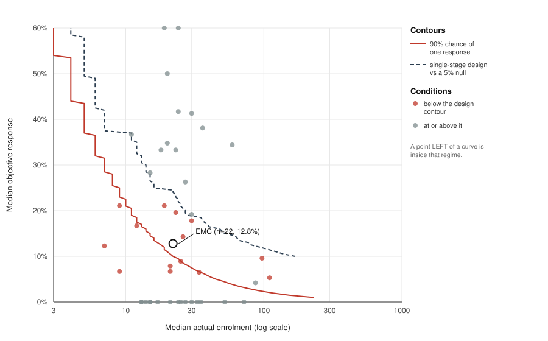

# Objective response as a trial summary: the regime in which it carries no information, and the diseases inside it

> **Scope of the claims.** This is a paper about measurement. It asserts no efficacy, potency, dose,
> safety, therapeutic window or clinical readiness for any agent in any disease, and it makes no
> treatment recommendation, including a negative one. A difference between two endpoints is a fact
> about how outcomes were summarised, never evidence that a treatment did something.

## Abstract

**Background.** The objective-response rate is the reflex summary of a single-arm oncology trial. It
keeps only tumour shrinkage, and it is applied without regard to whether the disease under study can
produce shrinkage often enough, or accrue patients in numbers large enough, for the resulting figure
to carry information.

**Methods.** We assembled trial arms from ClinicalTrials.gov posted results under a protocol frozen
before retrieval. The unit is one arm. Inclusion depends on a property of the report, not of the
disease: all four best-response categories reported as integer participant counts with an evaluable
denominator. No tumour type, grade, rarity or indolence descriptor was used as an inclusion
criterion at any stage. For each arm we computed objective response and disease control on the
identical denominator. We placed diseases on two measured axes, median objective response and median
actual registry enrolment, and derived two boundaries as level sets of the binomial: the sample size
giving a 90% chance of at least one response, and the size an exact single-stage design requires
against a null of 5%. Summaries use order statistics only, with no pooled cross-disease estimate.

**Results.** 552 arms from 138 trials carried a complete four-cell table. The gap between disease
control and objective response had a median of 39.4 percentage points (interquartile range
20.0 to 54.3, range 0 to 100), with 194 arms at or above 50 points and 71 arms combining an
objective response of 10% or less with disease control of 70% or more. The gap is identically the
stable-disease proportion, so each value carries its own exact interval. The finding survived every
pre-stated stratum: 41.5 points among arms of at least 20 patients, 40.0 in phase 2, 43.6 in
phase 3. Of 44 conditions placed on the map, 14 (31.8%) had a median trial smaller than an exact
single-stage design would require, and 7 sat below the zero-event boundary. Reporting was the
binding constraint: 4,276 of 4,414 screened studies (96.9%) posted results without a four-cell
block, and among 1,277 abstracts screened separately, all four categories appeared in 5 and only 1
carried a denominator they summed to. Of 19 control arms recovered, 16 carry an active agent once
registered interventions are read rather than arm titles, and none can carry a
natural-history reading. 25 conditions lay in the low-response regime; 4 had any control arm at all. A structured audit of 18 retrieved criteria and
methodology documents found four distinct remedy families already in use across 12 disease domains,
7 of them carried by consensus guidelines.

**Conclusions.** The failure of an objective-response summary is a property of a coordinate, not of a
tumour type, and diseases enter the affected regime by their own measured numbers. Remedies exist and
are long established; the gap is diffusion rather than invention, and the remedy family that
addresses the underlying confound directly has the least formal endorsement. The most tractable
finding is the reporting one: a four-cell best-response table with its denominator would let any
reader compute either endpoint, and it is absent from the large majority of the record.

---

## 1. Background

### 1.1 The response-rate summary

An objective-response rate is a categorical reading of a continuous observation. It keeps complete
and partial responses and discards everything else, so a patient whose disease neither shrank nor
grew is scored identically to a patient whose disease grew through treatment. Where untreated
progression is rapid, that collapse loses little. Where it is not, the discarded category can contain
most of what a trial observed.

This is not an argument against RECIST, which names two endpoints in its opening sentence and
supplies categories for both (Eisenhauer et al., PMID 19097774). The subject here is a field-level
habit of summarising by the first category and discarding the rest, and what that habit costs at the
sample sizes real trials achieve.

### 1.2 Two coordinates

Two numbers determine whether a response summary can carry information: the response rate the agent
and disease can plausibly produce, and the number of patients the disease can accrue. Both are
measurable in advance of any trial. Neither is a property of a tumour type as such, which is why the
analysis below places diseases on axes rather than sorting them into categories.

The word indolent appears in this paper only as a description of where diseases landed. It was not
used to select anything, and no analysis reads it.

---

## 2. Methods

### 2.1 Corpus and pre-specification

The retrieval protocol, including every query string, the date window, the screening rules and the
extraction rule, was committed before any fetch ran
([`lit-targets-cross-disease-endpoints.json`](./lit-targets-cross-disease-endpoints.json)). Once
disease-level selection is forbidden, query choice is the only remaining discretion, so freezing the
queries in advance is what prevents a corpus assembled to fit a conclusion.

The unit is one arm of one interventional trial. An arm enters the analysis if its report carries all
four best-response categories as integer participant counts alongside an evaluable denominator. A
non-integer measurement is a percentage or a rate and was dropped rather than rounded, because
reconstructing a count from a percentage invents data. Every screened record carries a disposition,
included or not, and the excluded set is reported in section 5.

Counts come from ClinicalTrials.gov posted results rather than from publications. That choice was
made after measurement, not before: among 1,277 unique abstracts screened in an earlier round, all
four category labels appeared in 5 and only 1 carried a denominator they summed to. A four-cell
best-response table is not an abstract-level object.

### 2.2 Endpoint definitions

Objective response is complete or partial response as best response. Disease control adds stable
disease. Both are computed on the identical denominator for each arm.

### 2.3 Statistical treatment

On one denominator, disease control minus objective response equals the stable-disease proportion
exactly. The gap is therefore a single proportion carrying its own Wilson interval, rather than a
difference of two estimates requiring a covariance. Both this identity and the requirement that the
four categories sum to the denominator are asserted for every row, so an arm whose categories came
from different denominators fails the build rather than entering the distribution.

No pooled cross-disease estimate is computed. There is no common parameter across diseases, so a
denominator-weighted proportion would average unlike quantities and its interval would misstate its
own precision. Summaries are counts, medians, interquartile ranges, ranges, and counts crossing
thresholds fixed before the distribution was examined. Inverse-variance and random-effects weighting,
I², meta-regression and significance testing across rows are all excluded by the governing contract
([`POLICY-evidence.md`](../../systems/POLICY-evidence.md) §2.6).

Arms are unweighted by denominator. The quantity of interest is how a trial reads, not how patients
fare. The patient-weighted view answers a different question and is reported once so that the choice
is visible.

Accrual comes from actual registry enrolment. Anticipated enrolment records what a trial hoped to
accrue, which is the quantity under test.

### 2.4 Reproduction

```
python3 research/manuscripts/endpoint_corpus.py --check
python3 research/manuscripts/orr_dcr_reread.py --check
python3 research/manuscripts/endpoint_regime_map.py --check
python3 research/manuscripts/placebo_arm_calibration.py --check
python3 research/manuscripts/endpoint_prior_art_audit.py --check
```

Each producer re-derives its artifact and refuses to write on drift. All five run in continuous
integration.

---

## 3. The uninformative regime

### 3.1 Contours

Two boundaries, both level sets of the binomial over the two axes, so neither was drawn around any
disease.

The zero-event boundary is the smallest sample size at which a true response rate gives at least a
90% chance of observing one response. Below it, a trial that observes nothing has not shown an agent
inactive; it has produced a result that cannot be interpreted, and that is nonetheless read as
negative.

The design boundary is the sample size an exact single-stage single-arm design requires to
distinguish a given rate from a null of 5% at α = 0.05 and 80% power. The 5% null is taken from
registered practice rather than chosen here.

Where a response rate sits close to the null, no design of realistic size exists at all. That case is
reported as such rather than as a number, because it is a statement about the disease.



**Figure 1.** Each point is a condition placed by its own measured numbers: median actual trial
enrolment against median objective response. The solid curve is the zero-event contour, the dashed
curve the single-stage design contour. A point to the left of a curve lies inside that regime.
Extraskeletal myxoid chondrosarcoma is circled. Produced by
[`endpoint_regime_figure.py`](./endpoint_regime_figure.py).

### 3.2 Disease coordinates

44 conditions had enough of both axes to be placed. 14 of them (31.8%) had a median trial smaller
than the design boundary requires, meaning the typical trial in that condition cannot separate the
condition's own observed response rate from a rate not worth pursuing. 7 sat below the zero-event
boundary, where a typical trial has better than a one-in-ten chance of observing no responses even
when the agent performs at the rate the corpus records.

---

## 4. Both endpoints on identical patients

### 4.1 Distribution of the gap

552 arms across 138 trials.

| quantity | value |
|---|---|
| median gap, disease control minus objective response | 39.4 percentage points |
| interquartile range | 20.0 to 54.3 |
| full range | 0 to 100 |
| arms at or above 50 points | 194 of 552 |
| arms with objective response ≤ 10% and disease control ≥ 70% | 71 |

The last row is the regime of interest, reached without naming a disease. Which tumour types occupy
it is a description to be read afterwards, never an input.

### 4.2 Pre-stated sensitivities

| stratum | arms | median gap |
|---|---|---|
| all arms | 552 | 39.4 |
| arms of at least 20 patients | 138 | 41.5 |
| phase 2 only | 355 | 40.0 |
| phase 3 only | 58 | 43.6 |

The gap survives every stratum specified in advance, and moves upward rather than downward in the
larger and later-phase strata. Response criterion version, central review status and whether
documented progression was required at entry are not fields in posted results, so those strata could
not be constructed here.

### 4.3 Zero-response readouts

The distribution above measures how much a response summary discards. A separate question is how
often it returns nothing at all, which is the reading that becomes "the agent showed no activity".

| arms of at least | arms | with zero responses | share | of those, disease control ≥ 50% |
|---|---|---|---|---|
| 1 patient | 552 | 251 | 45.5% | 105 |
| 10 patients | 231 | 32 | 13.9% | 11 |
| 20 patients | 138 | 4 | 2.9% | 2 |

The unweighted figure is the misleading one, since arms of three patients from dose-escalation
cohorts dominate it. The stratified figures are reported beside it rather than instead of it, and
they carry the substantive point: zero-response readouts concentrate in small arms, exactly as the
binomial predicts at a fixed underlying rate. The frequency of an uninformative readout is largely a
property of arm size rather than of the agent under test.

An arm with no responses that nonetheless records stable disease is not thereby an active agent
misread as inactive. Stable disease may be natural history, and section 6 shows that this corpus
cannot size that. The narrower claim stands: at these arm sizes a zero is frequently uninterpretable,
and it is nonetheless reported as a result.

---

## 5. Reporting completeness

The census shares its denominator with the analysis above by construction. Arms that report four
categories may differ systematically from arms that do not, and the size of the non-reporting set is
the only available bound on that difference.

| quantity | value |
|---|---|
| studies screened | 4,414 |
| posted results without a four-cell block | 4,276 (96.9%) |
| arms recovered | 552 |
| distinct trials | 138 |
| abstracts screened separately | 1,277 |
| abstracts with all four category labels | 5 |
| abstracts with four labels and a denominator they sum to | 1 |

The direction of the resulting bias is unknown. A trial that reports a full breakdown may be more
likely to have something to break down, in which case the recovered arms understate the gap; the
opposite argument is equally available, and neither is tested here. The recovered arms describe
trials that can be re-read. They are not a random sample of oncology trials and must not be described
as one.

---

## 6. Control arms and the natural-history question

A disease-control rate counts stable disease as an event, and stable disease indicates activity only
if the disease would otherwise have progressed. Sizing that requires an arm receiving no active
treatment.

Of 19 control arms recovered, 16 carry an active agent once the registry's own list of registered
interventions is read rather than the arm title. Two cannot be matched to a registered arm group and
are therefore not counted as untreated. One is a genuine no-intervention arm.

Neither signal is trusted alone, because each failed in a different direction. A name-based reading
of the arm title passed an arm as untreated when its companion agent was a somatostatin analogue, an
active antitumour agent in the disease concerned. Substituting the registry's intervention list made
matters worse: outcome-measure group titles do not match protocol arm labels, so the lookup matched
a sibling arm and passed an arm named for placebo plus chemotherapy as untreated. An arm is
classified as untreated only when the title names no active agent and its matched registered
interventions are all inert, with any disagreement resolving to backboned. A false backboned call
costs one arm of calibration; a false untreated call places a treated arm inside a natural-history
estimate.

The direction of the bound was read from the eligibility criteria of all 12 contributing trials. An
arm enrolled on documented progression bounds natural-history stability from below; an unselected
cohort bounds it from above, being selected for expected indolence. Summarising the two together
would produce a number that bounds nothing. One trial of the 12 states a progression requirement,
five mention progression without requiring it, and six do not mention it. A trial that does not
state a requirement has not thereby enrolled unselected patients, so only a stated requirement
assigns a direction.

The single no-intervention arm illustrates a trap that no field records. It reports a 48.4%
objective response, which an arm receiving nothing cannot produce. Randomisation in that trial
follows chemoradiotherapy, so the best response tabulated is the response to the preceding
treatment, carried into the observation period. A reading of natural history has to begin when the
observation does.

No arm in this corpus can therefore carry a natural-history reading. That is a measured conclusion
drawn from complete protocol records rather than a gap in the data.

The distribution of what is missing is the substantive result. 25 conditions occupy the low-response
regime. 4 of them have any control arm in this corpus. The confound is largest exactly where it has
never been measured.

One retrieved randomised placebo-controlled trial in an indolent soft-tissue tumour supplies a
worked instance and is reported in the companion note rather than restated here
([`emc-endpoint-alternatives-2026-08-08.md`](./emc-endpoint-alternatives-2026-08-08.md) §6). Its
relevance is that both prolonged stability and objective responses occurred without an active agent
in that disease, which converts a theoretical worry into a measured quantity for one tumour and for
no other.

---

## 7. Existing remedies

18 retrieved documents, each traced to a fetch, fall into four families.

| family | approach | documents |
|---|---|---|
| A | switch to a time-to-event or fixed-timepoint progression endpoint | 4 |
| B | redefine response to detect non-shrinkage change | 4 |
| C | add categories between response and progression | 3 |
| D | make each patient their own control | 7 |

12 disease domains are covered, and 7 documents are consensus guidelines from named working groups.
Examples span gastrointestinal stromal tumour (Benjamin et al., PMID 17470866; Choi et al.,
PMID 17470865), high-grade and low-grade glioma (PMID 20231676; PMID 21474379), hepatocellular
carcinoma (PMID 20175033), lymphoma (PMID 25113753; PMID 28379322), chronic lymphocytic leukaemia
(PMID 29540348), and castration-resistant prostate cancer (PMID 26903579). The growth modulation
index and the randomised discontinuation design carry the fourth family (PMID 9607564;
PMID 20920605; PMID 30458583; PMID 33672857; PMID 40156702; PMID 30528315; PMID 27714541).

Two readings follow. First, the earliest retrieved document dates from 1998, so the problem has been
recognised for decades and the gap is diffusion rather than invention: a remedy endorsed in glioma or
gastrointestinal stromal tumour does not reach a rare tumour with a worse coordinate. Second, the
disease-specific remedies are largely consensus guidelines, while family D consists mostly of
methodology papers and single-trial precedents. Family D is the only one that attacks the
natural-history confound rather than relocating it, and it has the least formal endorsement behind
it.

Family A transfers immediately and costs no patients, but inherits the confound whole; it changes
which number is uncalibrated. Family B transfers only where an agent produces a specific
non-shrinkage change that imaging detects. Family C improves reporting cheaply without addressing
small samples.

---

## 8. Extraskeletal myxoid chondrosarcoma, a worked extreme

Extraskeletal myxoid chondrosarcoma is a translocation sarcoma with an incidence well under one per
million. Over the 47 patients ever evaluated for response inside a prospective trial with
protocol-defined assessment, objective response was 12.8% (6 of 47, Wilson 95% CI 6.0 to 25.2) and
disease control 89.4% (42 of 47, 77.4 to 95.4), a gap of 76.6 percentage points composed entirely of
36 patients with stable disease. Those figures and their sources are owned by the companion analysis
([`emc-endpoint-discordance.json`](./emc-endpoint-discordance.json)) and are not re-derived here.

Placed against the 552 arms above, 76.6 points falls at the 88.9th percentile. The disease sits in
the upper tail of a distribution rather than outside it, and that is a weaker claim about this
tumour than a single-disease reading would support, together with a stronger claim about endpoints.

On the map, a 12.8% response rate requires 17 patients for a 90% chance of observing one response,
and 79 for an exact single-stage design against a 5% null. The two modern prospective cohorts
accrued 22 and 23 response-evaluable patients, over three and four years respectively. The disease
cannot accrue the trial its own response rate requires, which is the condition section 3.2 counts
across 14 of 44 conditions.

---

## 9. Limitations

**The corpus is not a random sample.** Only arms posting a complete four-cell table appear, 552 among
the arms of 4,414 screened studies. Section 5 bounds the size of what is missing and states the bias
argument in both directions without settling it.

**Condition strings are registry strings.** One disease may appear under several spellings and a
broad string may absorb several diseases. This coarsens the map rather than biasing it toward any
coordinate.

**A coordinate is two medians.** Trials within a condition vary widely, and a median coordinate
summarises a heterogeneous set rather than describing any particular trial.

**Accrual records achievement, not capacity.** Actual enrolment reflects eligibility, funding and
competing trials, not what a disease could accrue under a better design.

**Response criterion and review status are absent.** Posted results do not carry the criterion
version, the imaging interval, or whether assessment was by investigator or blinded central review.
Disease-control rates from different imaging schedules are not the same measurement, and this
analysis cannot separate them.

**The remedy audit is not a systematic review.** It reports what a frozen query set returned. A
disease absent from section 7 may have an endorsed alternative these queries did not reach. Fix
family, domain and endorsement grade are judgements read from retrieved records, and a reader may
dispute a classification without disturbing a citation.

**No causal claim.** Nothing here shows that a different endpoint would have produced a better
treatment decision in any trial.

---

## 10. Implications for trial reporting

Three consequences follow, none requiring agreement about which endpoint is correct.

1. **Publication of the four-cell table.** Complete response, partial response, stable disease and
   progression, with the denominator that produced them. This costs one table, is compatible with
   every endpoint a later reader might want, and is absent from 96.9% of the studies screened here.
   It is the single change with the largest effect on what the published record can answer.
2. **A stated response-evaluable denominator.** Intention-to-treat, response-evaluable and
   at-least-one-post-baseline-scan are three different denominators, and a rate attached to the wrong
   one misstates both the estimate and the evidence base.
3. **A sourced null.** A single-arm trial reporting a threshold without stating where the threshold
   came from cannot be argued with. A null attributed to a published figure can be.

For a disease whose coordinate places it below the design boundary, section 7 supplies the menu of
remedies already endorsed elsewhere, and section 6 identifies what would be needed to calibrate the
alternative: a control arm, in a regime where almost none exists.

---

## 11. Data and code availability

| item | location |
|---|---|
| Corpus of arm-level counts | [`endpoint-corpus.json`](./endpoint-corpus.json) |
| Both endpoints, distribution and reporting census | [`orr-dcr-reread.json`](./orr-dcr-reread.json) |
| Regime map | [`endpoint-regime-map.json`](./endpoint-regime-map.json) |
| Figure 1, and its producer | [`endpoint-regime-map.svg`](./endpoint-regime-map.svg), [`endpoint_regime_figure.py`](./endpoint_regime_figure.py) |
| Control-arm classification | [`placebo-arm-calibration.json`](./placebo-arm-calibration.json) |
| Remedy audit and its retrieved records | [`endpoint-prior-art-audit.json`](./endpoint-prior-art-audit.json) |
| Frozen retrieval protocol | [`lit-targets-cross-disease-endpoints.json`](./lit-targets-cross-disease-endpoints.json) |
| Governing evidence contract | [`POLICY-evidence.md`](../../systems/POLICY-evidence.md) §2.6 |
| Worked-case counts and sources | [`emc-endpoint-discordance.json`](./emc-endpoint-discordance.json) |

Raw retrieved payloads are held on the `literature-cache` branch and are approximately 156 MB.

**Cost of this analysis: $0.** Central processing only, with no rental and no external service.

**Conflicts of interest:** none. **Funding:** none. **Patient data:** none. Every figure derives from
aggregate counts already published in trial reports or posted to a public registry, and no individual
patient is identifiable from anything here.

---

## 12. References

1. Eisenhauer EA, Therasse P, Bogaerts J, et al. New response evaluation criteria in solid tumours:
   revised RECIST guideline (version 1.1). *Eur J Cancer* 2009. PMID 19097774.
2. Choi H, Charnsangavej C, Faria SC, et al. Correlation of computed tomography and positron
   emission tomography in patients with metastatic gastrointestinal stromal tumor treated at a
   single institution with imatinib mesylate. PMID 17470865.
3. Benjamin RS, Choi H, Macapinlac HA, et al. We should desist using RECIST, at least in GIST.
   PMID 17470866.
4. Updated response assessment criteria for high-grade gliomas: response assessment in
   neuro-oncology working group. PMID 20231676.
5. Response assessment in neuro-oncology (a report of the RANO group): assessment of outcome in
   trials of diffuse low-grade gliomas. PMID 21474379.
6. Modified RECIST (mRECIST) assessment for hepatocellular carcinoma. PMID 20175033.
7. Recommendations for initial evaluation, staging, and response assessment of Hodgkin and
   non-Hodgkin lymphoma: the Lugano classification. PMID 25113753.
8. International Working Group consensus response evaluation criteria in lymphoma (RECIL 2017).
   PMID 28379322.
9. iwCLL guidelines for diagnosis, indications for treatment, response assessment, and supportive
   management of CLL. PMID 29540348.
10. Trial Design and Objectives for Castration-Resistant Prostate Cancer: Updated Recommendations
    From the Prostate Cancer Clinical Trials Working Group 3. PMID 26903579.
11. There are no bad anticancer agents, only bad clinical trial designs. PMID 9607564.
12. Statistical methods for a phase II oncology trial with a growth modulation index endpoint.
    PMID 20920605.
13. Phase II trial design with growth modulation index as the primary endpoint. PMID 30458583.
14. A Growth Modulation Index-Based GEISTRA Score as a New Prognostic Tool for Trabectedin
    Efficacy. PMID 33672857.
15. The Growth Modulation Index (GMI) as an Efficacy Outcome in Cancer Clinical Trials. PMID 40156702.
16. Results of a Phase II Placebo-controlled Randomized Discontinuation Trial of Cabozantinib.
    PMID 30528315.
17. Cabozantinib for metastatic breast carcinoma: results of a phase II placebo-controlled
    randomized discontinuation study. PMID 27714541.
18. Placebo-Controlled, Double-Blind, Prospective, Randomized Study on the Effect of Octreotide LAR
    in the Control of Tumor Growth in Patients With Metastatic Neuroendocrine Midgut Tumors.
    PMID 26731483.
19. Lanreotide in metastatic enteropancreatic neuroendocrine tumors. PMID 25317882.

---

## Appendix A. Superseded and corrected values

Per [CLAUDE.md](../../CLAUDE.md) rule 1.2, a corrected value is registered rather than dropped, and
the live text above carries only the current value.

| superseded | current | where it lived | why it changed |
|---|---|---|---|
| The paper's scope as a single-disease report, *"Objective response is the wrong endpoint for extraskeletal myxoid chondrosarcoma: the same 47 patients, read two ways"* | The regime is defined by two coordinates and measured across 552 arms in 138 trials; extraskeletal myxoid chondrosarcoma is the worked extreme at the 88.9th percentile | `emc-response-endpoint-paper.md`, retired to this file | The argument was never disease-specific. Stated as a claim about one ultra-rare sarcoma, it could not be checked against anything, and it overstated how unusual that disease is |
| *"which is why both modern trials chose 6-month PFS rather than response rate as their primary endpoint"* | The two modern prospective trials chose different primary endpoints six years apart | [`emc-systemic-therapy-pooling.json`](./emc-systemic-therapy-pooling.json) → `findings_no_source_states` | Contradicted by that file's own verbatim quote of the 2019 trial. Detected rather than remembered by `emc_endpoint_discordance.D5_primary_endpoint_correction` |
| An implied claim that objective responses are generally hard to explain by natural history | The claim holds per disease and requires argument in each; at least one indolent tumour records objective responses on placebo | `emc-response-endpoint-paper.md` §7.2 | Qualified by the retrieved randomised placebo-controlled measurement recorded in [`emc-endpoint-alternatives.json`](./emc-endpoint-alternatives.json) → `E10` |
