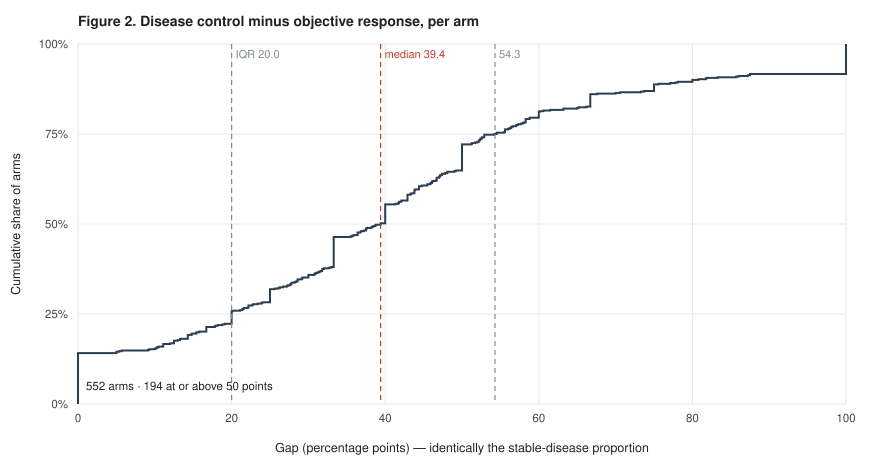
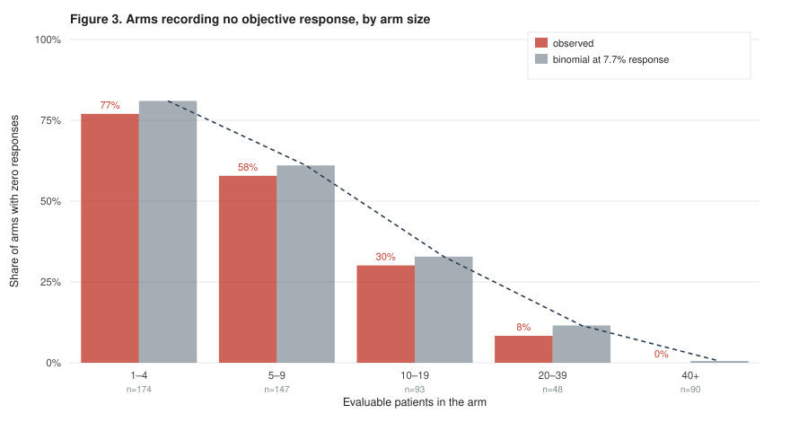

# Objective response as a trial summary: the regime in which it carries no information, and the diseases inside it

**Tristan D. McRae**

*Independent researcher.* Correspondence: trimcrae@gmail.com

*A study of measurement and reporting. No new patient was recruited, no patient-level record was
re-analysed, and no claim is made that any agent works. Every figure below is computed from counts
already published in trial reports or posted to a public registry. Analyses were carried out with AI
assistance (see section 2.4).*

<!-- EDITORIAL, NOT FOR SUBMISSION. Authorship, affiliation and correspondence are taken from the
block the author wrote in nr4a3-degrader-paper.md. No ORCID is given because the repository does not
carry one, and an invented identifier on a person is the failure lint_citations.py exists to prevent
applied to a human.
VENUE: medRxiv as preprint, then JNCI. JNCI takes measurement, methodology and reporting-standards
work as primary research, which is what this is; JCO and Lancet Oncology are oriented to trial
results and would receive it as a Comments piece with less room for the methods. The abstract is cut
to JNCI's 305-word limit; medRxiv imposes none. The count is asserted by
test_endpoint_manuscript_figures.py, not recounted by hand -- it drifted over the limit twice.
FILENAME: this file is named for an earlier, narrower framing. The analysis reads no indolence
descriptor and places mostly common cancers in the affected regime, so the name is a repository
artifact rather than a scope statement. Section 1.2 makes the scope point on its own evidence; it
formerly did so by referring to this filename, which a reviewer cannot see and should not have to. -->

> **Declarations for preprint deposit.** Ethics approval and consent were not required and were not
> sought: this study analyses only aggregate counts already published in trial reports or posted to
> a public registry, and involves no human participants, no identifiable data and no patient-level
> records. **Funding:** none. **Competing interests:** none. **Data and code:** section 11.

> **Scope of the claims.** This is a paper about measurement. It asserts no efficacy, potency, dose,
> safety, therapeutic window or clinical readiness for any agent in any disease, and it makes no
> treatment recommendation, including a negative one. A difference between two endpoints is a fact
> about how outcomes were summarised, never evidence that a treatment did something.

## Abstract

**Background.** The objective-response rate is the reflex summary of a single-arm oncology trial. It
keeps only tumour shrinkage, and is applied without regard to whether a disease shrinks often enough,
or accrues enough patients, for the figure to carry information.

**Methods.** Under a protocol frozen before retrieval, we assembled trial arms from
ClinicalTrials.gov posted results. The unit is one arm; inclusion depends on the report rather than
the disease, requiring all four best-response categories as integer counts with an evaluable
denominator. No tumour type, grade, rarity or indolence descriptor was a criterion. Both endpoints were
computed on the identical denominator. Diseases were placed on two measured axes, median objective
response and median actual enrolment, with boundaries drawn as level sets of the binomial. Summaries
use order statistics.

**Results.** 552 arms from 138 trials carried a complete table. The gap between disease control and
objective response had a median of 39.4 percentage points (IQR 20.0 to 54.3), and is identically the
stable-disease proportion, so each value carries an exact interval. It was present in every
constructible stratum. Of 44 conditions placed, 16 had a median response at or below the 5% null, leaving no design
defined; of the 28 where it is defined, 14 (50.0%) had a median trial smaller than an exact
single-stage design requires. Reporting was the binding constraint: of 2,851 trials naming best
overall response, 2,715 (95.2%) posted results without the four categories. Of 19 arms carrying a
control token, 16 carry an active agent once registered interventions are read. Four remedy families
are endorsed across 12 domains.

**Conclusions.** The failure of a response summary is a property of a coordinate rather than a tumour
type, and remedies are long established but undiffused. A four-cell table with its denominator lets
any reader compute either endpoint, and is absent from most of the record.

---

## 1. Background

### 1.1 The response-rate summary

An objective-response rate is a categorical reading of a continuous observation. It keeps complete
and partial responses and discards everything else, so a patient whose disease neither shrank nor
grew is scored identically to a patient whose disease grew through treatment. Where untreated
progression is rapid, that collapse loses little. Where it is not, the discarded category can contain
most of what a trial observed.

This is not an argument against RECIST, which names two endpoints in its opening sentence and
supplies categories for both [1]. The subject here is a field-level
habit of summarising by the first category and discarding the rest, and what that habit costs at the
sample sizes real trials achieve.

### 1.2 Two coordinates

Two numbers determine whether a response summary can carry information: the response rate the agent
and disease can plausibly produce, and the number of patients the disease can accrue. Both are
measurable in advance of any trial. Neither is a property of a tumour type as such, which is why the
analysis below places diseases on axes rather than sorting them into categories.

No indolence descriptor was used to select anything, and no analysis reads one. That matters more
than it may appear: the diseases this analysis places in the affected regime are largely common
cancers rather than the rare slow-growing tumours the question is usually asked about, and section
3.2 names them.

---

## 2. Methods

### 2.1 Corpus and pre-specification

The retrieval protocol, including every query string, the date window, the screening rules and the
extraction rule, was committed before any fetch ran
([`lit-targets-cross-disease-endpoints.json`](./lit-targets-cross-disease-endpoints.json)). Once
disease-level selection is forbidden, query choice is the only remaining discretion, so freezing the
queries in advance is what prevents a corpus assembled to fit a conclusion.

Two query families were frozen, in five date windows each. The first retrieves oncology trials with
posted results whose registry text names best overall response; the second retrieves oncology trials
with posted results carrying a registered placebo comparator, and exists to find control arms for
section 6. Both contribute arms to the corpus on identical terms, and section 5.1 reports the
reporting census separately for each, because only the first is a set of trials that said they
measured the quantity.

The unit is one arm of one interventional trial. An arm enters the analysis if its report carries all
four best-response categories as integer participant counts alongside an evaluable denominator. A
non-integer measurement is a percentage or a rate and was dropped rather than rounded, because
reconstructing a count from a percentage invents data. Every screened record carries a disposition,
included or not, and the excluded set is reported in section 5.

Counts come from ClinicalTrials.gov posted results rather than from publications. That choice was
made after measurement, not before: among 1,277 unique abstracts screened in an earlier round, all
four category labels appeared in 5 and only 1 carried a denominator they summed to. A four-cell
best-response table is not an abstract-level object.

### 2.2 Endpoint definitions

Objective response is complete or partial response as best response. Disease control adds stable
disease. Both are computed on the identical denominator for each arm.

### 2.3 Statistical treatment

On one denominator, disease control minus objective response equals the stable-disease proportion
exactly. The gap is therefore a single proportion carrying its own Wilson interval, rather than a
difference of two estimates requiring a covariance. Both this identity and the requirement that the
four categories sum to the denominator are asserted for every row, so an arm whose categories came
from different denominators fails the build rather than entering the distribution.

No pooled cross-disease estimate is computed. There is no common parameter across diseases, so a
denominator-weighted proportion would average unlike quantities and its interval would misstate its
own precision. Summaries are counts, medians, interquartile ranges, ranges, and counts crossing
thresholds fixed before the distribution was examined. Inverse-variance and random-effects weighting,
I², meta-regression and significance testing across rows are all excluded by the governing contract
([`POLICY-evidence.md`](../../systems/POLICY-evidence.md) §2.6).

Arms are unweighted by denominator. The quantity of interest is how a trial reads, not how patients
fare. The patient-weighted view answers a different question and is reported once so that the choice
is visible.

Accrual comes from actual registry enrolment. Anticipated enrolment records what a trial hoped to
accrue, which is the quantity under test.

### 2.4 Reproduction

```
python3 research/manuscripts/endpoint_corpus.py --check
python3 research/manuscripts/orr_dcr_reread.py --check
python3 research/manuscripts/endpoint_regime_map.py --check
python3 research/manuscripts/placebo_arm_calibration.py --check
python3 research/manuscripts/endpoint_prior_art_audit.py --check
python3 research/manuscripts/endpoint_regime_figure.py --check
python3 research/manuscripts/endpoint_result_figures.py --check
```

Each producer re-derives its artifact and refuses to write on drift. All seven run in continuous
integration, and `scripts/regenerate_endpoint_chain.sh` runs them in dependency order, because three
of them read another's output and regenerating out of order leaves a stale artifact that only the
check detects.

Those commands re-derive every artifact from the extraction cache
([`endpoint-corpus-inputs.json`](./endpoint-corpus-inputs.json)), which is committed. Rebuilding that
cache from the raw payloads is a separate step, `endpoint_corpus.py --extract`, and requires the
`literature-cache` branch.

Retrieval, extraction, analysis and drafting were carried out with AI assistance. The retrieval
protocol was committed before any fetch ran, every producer re-derives its artifact from its inputs
on demand, and the identifiers in this paper come from the payloads the fetches returned rather than
from recollection, which is checked by a linter that fails on any prose identifier absent from a
tracked artifact. Those controls exist because the failure mode of the method is a fluent citation
to a paper that does not exist.

---

## 3. The uninformative regime

### 3.1 Contours

Two boundaries, both level sets of the binomial over the two axes, so neither was drawn around any
disease.

The zero-event boundary is the smallest sample size at which a true response rate gives at least a
90% chance of observing one response. Below it, a trial that observes nothing has not shown an agent
inactive; it has produced a result that cannot be interpreted, and that is nonetheless read as
negative.

The design boundary is the sample size an exact single-stage single-arm design requires to
distinguish a given rate from a null of 5% at α = 0.05 and 80% power. The 5% null is taken from
registered practice rather than chosen here.

Where a response rate sits close to the null, no design of realistic size exists at all. That case is
reported as such rather than as a number, because it is a statement about the disease.


**Figure 1.** Each point is a condition placed by its own measured numbers: median actual trial
enrolment against median objective response. The solid curve is the zero-event contour, the dashed
curve the single-stage design contour. A point to the left of a curve lies inside that regime.
Extraskeletal myxoid chondrosarcoma is circled; its coordinates come from published trial reports
rather than from registry postings, unlike every other point, and the two sources are plotted on
shared axes for comparison and are never combined. Fifteen conditions share the 0% response axis and
overlap there. Produced by
[`endpoint_regime_figure.py`](./endpoint_regime_figure.py).

### 3.2 Disease coordinates

44 conditions had enough of both axes to be placed, and they fall into three groups rather than two.

Sixteen have a median objective response at or below the 5% null the design boundary tests against.
For these the boundary is undefined, because no single-stage trial can separate the observed rate
from a rate not worth pursuing. Every one of them has a median objective response of 0.0% except one
at 4.2%. These are the strongest instances of the argument, not exceptions to it, and an earlier
version of this analysis placed them in the denominator of the share below the boundary, where they
could never enter the numerator.

Of the 28 conditions where the comparison is defined, 14 (50.0%) had a median trial smaller than the
design boundary requires. Seven of the 29 conditions where the zero-event comparison is defined
(24.1%) sat below that boundary, where a typical trial has better than a one-in-ten chance of
observing no responses even when the agent performs at the rate the corpus records. Taken together,
30 of the 44 placed conditions cannot support a response-rate summary by one route or the other.

The seven below the zero-event boundary are epithelial ovarian cancer, head and neck cancer,
melanoma, metastatic melanoma, non-small-cell lung cancer, recurrent breast cancer and urothelial
carcinoma. None is rare, and none is conventionally called indolent. The regime is defined by
coordinates rather than by tumour biology, and this is what that looks like when the diseases are
named.

### 3.3 Phase composition

The conditions at the bottom of the response axis include broad registry strings such as advanced
solid tumours and metastatic cancer, which collect dose-escalation arms where a response rate of
zero follows from the trial phase rather than from the disease. That objection is correct about
composition: arms contributing to conditions at or below the null are phase-1 heavy, 197 phase 1
against 147 phase 2 and 9 phase 3, where the remaining placed conditions run 133 phase 2, 96 phase 1
and 37 phase 3.

Recomputing the response axis on phase 2 and phase 3 arms only leaves the median at 0.0% for twelve
of the fourteen such conditions that have any phase 2 or phase 3 arm. Two have none. One rises to
21.4%. The low corner is therefore not an artefact of dose escalation.

---

## 4. Both endpoints on identical patients

### 4.1 Distribution of the gap

552 arms across 138 trials.

| quantity | value |
|---|---|
| median gap, disease control minus objective response | 39.4 percentage points |
| interquartile range | 20.0 to 54.3 |
| full range | 0 to 100 |
| arms at or above 50 points | 194 of 552 |
| arms with objective response ≤ 10% and disease control ≥ 70% | 71 |

The last row is the regime of interest, reached without naming a disease. Which tumour types occupy
it is a description to be read afterwards, never an input.



**Figure 2.** The gap for each of the 552 arms, as a cumulative distribution. Because the gap is
identically the stable-disease proportion, each arm's value carries its own exact interval. Median
and interquartile range are marked. Produced by
[`endpoint_result_figures.py`](./endpoint_result_figures.py).

### 4.2 Sensitivity to stratification

| stratum | arms | median gap |
|---|---|---|
| all arms | 552 | 39.4 |
| arms of at least 20 patients | 138 | 41.5 |
| phase 1, alone or combined | 370 | 36.4 |
| phase 2, alone or combined | 355 | 40.0 |
| phase 3, alone or combined | 58 | 43.6 |
| phase 1 only | 133 | 35.9 |
| phase 2 only | 114 | 39.4 |
| phase 3 only | 54 | 41.8 |
| no phase recorded | 7 | 27.2 |
| control-arm candidates | 19 | 37.5 |

The corpus was specified in advance; these strata were not, and the table is therefore exhaustive
rather than selected. Every stratum the recorded fields can construct appears, including the ones
that lower the gap. A trial registered as phase 1 and phase 2 together belongs to both "alone or
combined" rows, which is why those do not sum to the total, and the "only" rows are the disjoint
partition.

The gap is present in all of them, from 27.2 to 43.6 percentage points. It is lowest in phase 1 and
rises with phase. That direction is expected rather than awkward: a phase 1 arm is a dose-escalation
cohort of a few patients, and both endpoints there are estimated from almost nothing. Response
criterion version, central review status and whether documented progression was required at entry
are not fields in posted results, so those strata could not be constructed.

### 4.3 Zero-response readouts

The distribution above measures how much a response summary discards. A separate question is how
often it returns nothing at all, which is the reading that becomes "the agent showed no activity".

| arms of at least | arms | with zero responses | share | of those, disease control ≥ 50% |
|---|---|---|---|---|
| 1 patient | 552 | 251 | 45.5% | 105 |
| 10 patients | 231 | 32 | 13.9% | 11 |
| 20 patients | 138 | 4 | 2.9% | 2 |



**Figure 3.** Observed share of arms recording no objective response, by arm size, against the
binomial expectation at the corpus median response rate of 7.7%. The expectation is the mean of
(1 − *p*)^*n* over the arms in each band rather than a value at a band midpoint, because the top band
is open-ended and its arms have a median of 128.5 patients. The two track each other across a range
from 77.0% to 0.0%, which is the substantive point: how often a trial returns an uninformative
readout is largely a property of arm size rather than of the agent under test. Observed sits a little
below expected in every band, so a single fixed rate slightly over-predicts uninformative readouts;
the agreement is close rather than exact, and its direction is consistent. Produced by
[`endpoint_result_figures.py`](./endpoint_result_figures.py), with the band values under
`R8_zero_response_readouts` in [`orr-dcr-reread.json`](./orr-dcr-reread.json).

The unweighted figure is the misleading one, since arms of three patients from dose-escalation
cohorts dominate it. The stratified figures are reported beside it rather than instead of it, and
they carry the substantive point: zero-response readouts concentrate in small arms, exactly as the
binomial predicts at a fixed underlying rate. The frequency of an uninformative readout is largely a
property of arm size rather than of the agent under test.

An arm with no responses that nonetheless records stable disease is not thereby an active agent
misread as inactive. Stable disease may be natural history, and section 6 shows that this corpus
cannot size that. The narrower claim stands: at these arm sizes a zero is frequently uninterpretable,
and it is nonetheless reported as a result.

---

## 5. Reporting completeness

The census shares its denominator with the analysis above by construction. Arms that report four
categories may differ systematically from arms that do not, and the size of the non-reporting set is
the only available bound on that difference.

| quantity | value |
|---|---|
| studies screened | 4,414 |
| posted results without a four-cell block | 4,276 (96.9%) |
| arms recovered | 552 |
| distinct trials | 138 |
| abstracts screened separately | 1,277 |
| abstracts with all four category labels | 5 |
| abstracts with four labels and a denominator they sum to | 1 |

### 5.1 Composition of the denominator

That denominator pools two frozen queries with unequal claims on the argument, so it is decomposed
rather than quoted alone. The first selects trials whose registry text contains the phrase "best
overall response": those trials state that they measured the quantity, and posting results without
the four categories is a reporting choice. The second selects oncology trials carrying a registered
placebo comparator, which is a property of design rather than of measurement, and admits prevention,
supportive-care and survival-endpoint trials that never claimed to tabulate best response. An absent
table in the second family is not evidence of anything.

| denominator | screened | no four-cell block | share |
|---|---|---|---|
| trials naming best overall response | 2,851 | 2,715 | 95.2% |
| trials with a registered placebo comparator | 1,563 | 1,561 | 99.9% |
| pooled, as records | 4,414 | 4,276 | 96.9% |
| pooled, as distinct trials | 4,235 | 4,097 | 96.7% |

The strictest denominator available gives the lowest share, and the difference from the pooled figure
is 1.7 percentage points. The pooled figure is therefore not carried by trials that had no reason to
report. The last row also corrects an arithmetic point: 179 trials match both queries, so the record
count exceeds the number of distinct trials, and the share computed per trial rather than per record
is 96.7%.

The direction of the resulting bias is unknown. A trial that reports a full breakdown may be more
likely to have something to break down, in which case the recovered arms understate the gap; the
opposite argument is equally available, and neither is tested here. The recovered arms describe
trials that can be re-read. They are not a random sample of oncology trials and must not be described
as one.

---

## 6. Control arms and the natural-history question

A disease-control rate counts stable disease as an event, and stable disease indicates activity only
if the disease would otherwise have progressed. Sizing that requires an arm receiving no active
treatment.

Nineteen arms carry a control token in their title or registered type. That is a screening net
rather than a count of control arms: eight are registered by the trial as a placebo comparator or a
no-intervention arm, eight as experimental or active comparator, and three are unresolved. The eight
experimental and active-comparator arms match because their titles contain "BSC" — in a trial
comparing an agent against chemotherapy plus best supportive care, both arms carry the token.

Of those 19, 16 carry an active agent once the registry's own list of registered interventions is
read rather than the arm title. Two cannot be matched to a registered arm group and are therefore
not counted as untreated. One is a genuine no-intervention arm.

Neither signal is trusted alone, because each failed in a different direction. A name-based reading
of the arm title passed an arm as untreated when its companion agent was a somatostatin analogue, an
active antitumour agent in the disease concerned. Substituting the registry's intervention list made
matters worse: outcome-measure group titles do not match protocol arm labels, so the lookup matched
a sibling arm and passed an arm named for placebo plus chemotherapy as untreated. An arm is
classified as untreated only when the title names no active agent and its matched registered
interventions are all inert, with any disagreement resolving to backboned. A false backboned call
costs one arm of calibration; a false untreated call places a treated arm inside a natural-history
estimate.

The direction of the bound was read from the eligibility criteria of all 12 contributing trials. An
arm enrolled on documented progression bounds natural-history stability from below; an unselected
cohort bounds it from above, being selected for expected indolence. Summarising the two together
would produce a number that bounds nothing. One trial of the 12 states a progression requirement,
five mention progression without requiring it, and six do not mention it. A trial that does not
state a requirement has not thereby enrolled unselected patients, so only a stated requirement
assigns a direction.

The single no-intervention arm illustrates a trap that no field records. It reports a 48.4%
objective response, which an arm receiving nothing cannot produce. Randomisation in that trial
follows chemoradiotherapy, so the best response tabulated is the response to the preceding
treatment, carried into the observation period. A reading of natural history has to begin when the
observation does.

No arm in this corpus can therefore carry a natural-history reading. That is a measured conclusion
drawn from complete protocol records rather than a gap in the data.

### 6.1 Evidence outside the corpus rule

That conclusion is a statement about this corpus, not about the literature, and the difference
matters. The corpus rule requires a four-cell best-response table from an interventional arm, so a
prospective observational cohort of untreated patients was never eligible for it. That is precisely
the design in which the confound has been measured.

Two records, both in desmoid fibromatosis. A prospective multicentre phase II observational trial
placed 100 patients on active surveillance alone with central radiology review, and reported 3-year
progression-free survival of 53.4% (95% CI 43.5 to 63.1), spontaneous regression in 58%, and partial
responses by RECIST in 26% [2]. A pooled analysis of three prospective observational
active-surveillance studies in Italy, the Netherlands and France followed 282 patients and reported
3- and 5-year treatment-free survival of 67% and 66%, with crude cumulative incidences of 33% and
34% for RECIST progression and 26% and 34% for spontaneous RECIST regression [3].

An objective response rate measured on untreated patients is the quantity a single-arm response
readout assumes to be zero. These cohorts put it at roughly a quarter, and they agree with the
randomised evidence in the same disease, where the placebo arm of a controlled trial recorded a 20%
objective response rate before crossover. Two independent designs, a placebo arm and an untreated
observational cohort, give the same order of magnitude.

Every figure in this section is a desmoid figure and none transfers. Desmoid fibromatosis does not
metastasise, most tumours in this corpus do, and spontaneous regression is a documented feature of
desmoid biology that is not documented in most of them. What these cohorts establish is that the
natural-history component of a response readout is measurable and has been measured, not what its
size is elsewhere. Where it has not been measured, that is a gap in the record rather than evidence
that it is small.

The distribution of what is missing is the substantive result. 25 conditions occupy the low-response
regime. 4 of them have any control arm in this corpus. The confound is largest exactly where it has
never been measured.

A randomised placebo-controlled trial in the same tumour supplies the third line of evidence and is
reported in the companion note rather than restated here
([`emc-endpoint-alternatives-2026-08-08.md`](./emc-endpoint-alternatives-2026-08-08.md) §6). Its
relevance is that both prolonged stability and objective responses occurred without an active agent
in that disease, which converts a theoretical worry into a measured quantity for one tumour and for
no other.

---

## 7. Existing remedies

18 retrieved documents, each traced to a fetch, fall into four families.

| family | approach | documents |
|---|---|---|
| A | switch to a time-to-event or fixed-timepoint progression endpoint | 4 |
| B | redefine response to detect non-shrinkage change | 4 |
| C | add categories between response and progression | 3 |
| D | make each patient their own control | 7 |

12 disease domains are covered, and 7 documents are consensus guidelines from named working groups.
Examples span gastrointestinal stromal tumour (Benjamin et al., [4]; Choi et al.,
[5]), high-grade and low-grade glioma [6,7], hepatocellular
carcinoma [8], lymphoma [9,10], chronic lymphocytic leukaemia
[11], and castration-resistant prostate cancer [12]. Two placebo-controlled
neuroendocrine-tumour trials reading out on tumour growth control rather than on response supply the
single-trial precedents for family A [13,14]. The growth modulation
index and the randomised discontinuation design carry the fourth family ([15];
[16]; [17]; [18]; [19]; [20]; [21]).

Two readings follow. First, the earliest retrieved document dates from 1998, so the problem has been
recognised for decades and the gap is diffusion rather than invention: a remedy endorsed in glioma or
gastrointestinal stromal tumour does not reach a rare tumour with a worse coordinate. Second, the
disease-specific remedies are largely consensus guidelines, while family D consists mostly of
methodology papers and single-trial precedents. Family D is the only one that attacks the
natural-history confound rather than relocating it, and it has the least formal endorsement behind
it.

Family A transfers immediately and costs no patients, but inherits the confound whole; it changes
which number is uncalibrated. Family B transfers only where an agent produces a specific
non-shrinkage change that imaging detects. Family C improves reporting cheaply without addressing
small samples.

---

## 8. Extraskeletal myxoid chondrosarcoma, a worked extreme

Extraskeletal myxoid chondrosarcoma is a translocation sarcoma, and one of the rarest diseases for
which any prospective trial record exists. Over the 47 patients ever evaluated for response inside a prospective trial with
protocol-defined assessment, objective response was 12.8% (6 of 47, Wilson 95% CI 6.0 to 25.2) and
disease control 89.4% (42 of 47, 77.4 to 95.4), a gap of 76.6 percentage points composed entirely of
36 patients with stable disease. Those figures and their sources are owned by the companion analysis
([`emc-endpoint-discordance.json`](./emc-endpoint-discordance.json)) and are not re-derived here.

Placed against the 552 arms above, 76.6 points falls at the 88.9th percentile. The disease sits in
the upper tail of a distribution rather than outside it, and that is a weaker claim about this
tumour than a single-disease reading would support, together with a stronger claim about endpoints.

On the map, a 12.8% response rate requires 17 patients for a 90% chance of observing one response,
and 79 for an exact single-stage design against a 5% null. The two modern prospective cohorts
accrued 22 and 23 response-evaluable patients, over three and four years respectively. The disease
cannot accrue the trial its own response rate requires, which is the condition section 3.2 counts
across 14 of 44 conditions.

---

## 9. Limitations

**The corpus is not a random sample.** Only arms posting a complete four-cell table appear, 552 among
the arms of 4,414 screened studies. Section 5 bounds the size of what is missing and states the bias
argument in both directions without settling it.

**Condition strings are registry strings, and they bias the map.** One disease may appear under
several spellings and a broad string may absorb several diseases. The broad strings collect
dose-escalation arms and sit disproportionately at the bottom of the response axis, so the
coarsening is directional and points toward this paper's own conclusion. Section 3.3 measures that
difference and shows the finding survives a restriction to phase 2 and phase 3 arms, which is the
reason the sensitivity is reported rather than the reason it was run.

**A coordinate is two medians.** Trials within a condition vary widely, and a median coordinate
summarises a heterogeneous set rather than describing any particular trial.

**Accrual records achievement, not capacity.** Actual enrolment reflects eligibility, funding and
competing trials, not what a disease could accrue under a better design.

**Response criterion and review status are absent.** Posted results do not carry the criterion
version, the imaging interval, or whether assessment was by investigator or blinded central review.
Disease-control rates from different imaging schedules are not the same measurement, and this
analysis cannot separate them.

**The remedy audit is not a systematic review.** It reports what a frozen query set returned. A
disease absent from section 7 may have an endorsed alternative these queries did not reach. Fix
family, domain and endorsement grade are judgements read from retrieved records, and a reader may
dispute a classification without disturbing a citation.

**No causal claim.** Nothing here shows that a different endpoint would have produced a better
treatment decision in any trial.

---

## 10. Implications for trial reporting

Three consequences follow, none requiring agreement about which endpoint is correct.

1. **Publication of the four-cell table.** Complete response, partial response, stable disease and
   progression, with the denominator that produced them. This costs one table, is compatible with
   every endpoint a later reader might want, and is absent from 95.2% of the trials that name best
   overall response in their own registry text. It is the single change with the largest effect on
   what the published record can answer.
2. **A stated response-evaluable denominator.** Intention-to-treat, response-evaluable and
   at-least-one-post-baseline-scan are three different denominators, and a rate attached to the wrong
   one misstates both the estimate and the evidence base.
3. **A sourced null.** A single-arm trial reporting a threshold without stating where the threshold
   came from cannot be argued with. A null attributed to a published figure can be.

For a disease whose coordinate places it below the design boundary, section 7 supplies the menu of
remedies already endorsed elsewhere, and section 6 identifies what would be needed to calibrate the
alternative: a control arm, in a regime where almost none exists.

---

## 11. Data and code availability

| item | location |
|---|---|
| Corpus of arm-level counts | [`endpoint-corpus.json`](./endpoint-corpus.json) |
| Extraction cache the corpus is built from | [`endpoint-corpus-inputs.json`](./endpoint-corpus-inputs.json) |
| Dependency-ordered regeneration | [`regenerate_endpoint_chain.sh`](../../scripts/regenerate_endpoint_chain.sh) |
| Both endpoints, distribution and reporting census | [`orr-dcr-reread.json`](./orr-dcr-reread.json) |
| Regime map | [`endpoint-regime-map.json`](./endpoint-regime-map.json) |
| Figure 1, and its producer | [`endpoint-regime-map.svg`](./endpoint-regime-map.svg), [`endpoint_regime_figure.py`](./endpoint_regime_figure.py) |
| Figures 2 and 3, and their producer | [`endpoint-gap-distribution.svg`](./endpoint-gap-distribution.svg), [`endpoint-zero-response.svg`](./endpoint-zero-response.svg), [`endpoint_result_figures.py`](./endpoint_result_figures.py) |
| Control-arm classification | [`placebo-arm-calibration.json`](./placebo-arm-calibration.json) |
| Remedy audit and its retrieved records | [`endpoint-prior-art-audit.json`](./endpoint-prior-art-audit.json) |
| Frozen retrieval protocol | [`lit-targets-cross-disease-endpoints.json`](./lit-targets-cross-disease-endpoints.json) |
| Governing evidence contract | [`POLICY-evidence.md`](../../systems/POLICY-evidence.md) §2.6 |
| Worked-case counts and sources | [`emc-endpoint-discordance.json`](./emc-endpoint-discordance.json) |

Raw retrieved payloads are held on the `literature-cache` branch and are approximately 156 MB.

**Cost of this analysis: $0.** Central processing only, with no rental and no external service.

**Conflicts of interest:** none. **Funding:** none. **Patient data:** none. Every figure derives from
aggregate counts already published in trial reports or posted to a public registry, and no individual
patient is identifiable from anything here.

---

## 12. References

1. New response evaluation criteria in solid tumours: revised RECIST guideline (version 1.1). *European Journal of Cancer* 2009. PMID 19097774. doi 10.1016/j.ejca.2008.10.026.
2. Bonvalot S, Cozic N, Le Cesne A, Blay JY, Penel N, Fau M, et al. Initial Active Surveillance Strategy for Patients with Peripheral Sporadic Primary Desmoid-Type Fibromatosis: A Multicentric Phase II Observational Trial. 2023. PMID 37777684. doi 10.1245/s10434-023-14341-2.
3. Colombo C, Hakkesteegt S, Le Cesne A, Barretta F, Blay JY, et al. Active Surveillance in Patients with Extra-abdominal Desmoid-Type Fibromatosis: A Pooled Analysis of Three Prospective Observational Studies. 2025. PMID 39620931. doi 10.1158/1078-0432.ccr-24-2340.
4. Benjamin RS, Choi H, Macapinlac HA, Burgess MA, Patel SR, et al. We should desist using RECIST, at least in GIST. 2007. PMID 17470866. doi 10.1200/jco.2006.07.3411.
5. Choi H, Charnsangavej C, Faria SC, Macapinlac HA, et al. Correlation of computed tomography and positron emission tomography in patients with metastatic gastrointestinal stromal tumor treated at a single institution with imatinib mesylate: proposal of new computed tomography response criteria. 2007. PMID 17470865. doi 10.1200/jco.2006.07.3049.
6. Wen PY, Macdonald DR, Reardon DA, Cloughesy TF, Sorensen AG, et al. Updated response assessment criteria for high-grade gliomas: response assessment in neuro-oncology working group. 2010. PMID 20231676. doi 10.1200/jco.2009.26.3541.
7. van den Bent MJ, Wefel JS, Schiff D, Taphoorn MJ, Jaeckle K, et al. Response assessment in neuro-oncology (a report of the RANO group): assessment of outcome in trials of diffuse low-grade gliomas. 2011. PMID 21474379. doi 10.1016/s1470-2045(11)70057-2.
8. Lencioni R, Llovet JM. Modified RECIST (mRECIST) assessment for hepatocellular carcinoma. 2010. PMID 20175033. doi 10.1055/s-0030-1247132.
9. Cheson BD, Fisher RI, Barrington SF, Cavalli F, Schwartz LH, et al. Recommendations for initial evaluation, staging, and response assessment of Hodgkin and non-Hodgkin lymphoma: the Lugano classification. 2014. PMID 25113753. doi 10.1200/jco.2013.54.8800.
10. Younes A, Hilden P, Coiffier B, Hagenbeek A, Salles G, et al. International Working Group consensus response evaluation criteria in lymphoma (RECIL 2017). 2017. PMID 28379322. doi 10.1093/annonc/mdx097.
11. Hallek M, Cheson BD, Catovsky D, Caligaris-Cappio F, et al. iwCLL guidelines for diagnosis, indications for treatment, response assessment, and supportive management of CLL. 2018. PMID 29540348. doi 10.1182/blood-2017-09-806398.
12. Scher HI, Morris MJ, Stadler WM, Higano C, Basch E, et al. Trial Design and Objectives for Castration-Resistant Prostate Cancer: Updated Recommendations From the Prostate Cancer Clinical Trials Working Group 3. 2016. PMID 26903579. doi 10.1200/jco.2015.64.2702.
13. Rinke A, Wittenberg M, Schade-Brittinger C, Aminossadati B, et al. Placebo-Controlled, Double-Blind, Prospective, Randomized Study on the Effect of Octreotide LAR in the Control of Tumor Growth in Patients with Metastatic Neuroendocrine Midgut Tumors (PROMID): Results of Long-Term Survival. 2017. PMID 26731483. doi 10.1159/000443612.
14. Ozdemir N, Yazici O, Zengin N. Lanreotide in metastatic enteropancreatic neuroendocrine tumors. 2014. PMID 25317882. doi 10.1056/nejmc1409757.
15. Von Hoff DD. There are no bad anticancer agents, only bad clinical trial designs--twenty-first Richard and Hinda Rosenthal Foundation Award Lecture. 1998. PMID 9607564.
16. Kovalchik S, Mietlowski W. Statistical methods for a phase II oncology trial with a growth modulation index (GMI) endpoint. 2011. PMID 20920605. doi 10.1016/j.cct.2010.09.010.
17. Wu J, Chen L, Wei J, Weiss H, Miller RW, Villano JL. Phase II trial design with growth modulation index as the primary endpoint. 2019. PMID 30458583. doi 10.1002/pst.1916.
18. Martínez-Trufero J, De Sande-González LM, Luna P, et al. A Growth Modulation Index-Based GEISTRA Score as a New Prognostic Tool for Trabectedin Efficacy in Patients with Advanced Soft Tissue Sarcomas: A Spanish Group for Sarcoma Research (GEIS) Retrospective Study. 2021. PMID 33672857. doi 10.3390/cancers13040792.
19. Trin K, Dalleau C, Mathoulin-Pelissier S, Le Tourneau C, et al. The Growth Modulation Index (GMI) as an Efficacy Outcome in Cancer Clinical Trials: A Scoping Review with Suggested Reporting Guidelines. 2025. PMID 40156702. doi 10.1007/s11912-025-01667-1.
20. Hellerstedt BA, Vogelzang NJ, Kluger HM, Yasenchak CA, et al. Results of a Phase II Placebo-controlled Randomized Discontinuation Trial of Cabozantinib in Patients with Non-small-cell Lung Carcinoma. 2019. PMID 30528315. doi 10.1016/j.cllc.2018.10.006.
21. Tolaney SM, Nechushtan H, Ron IG, Schöffski P, Awada A, et al. Cabozantinib for metastatic breast carcinoma: results of a phase II placebo-controlled randomized discontinuation study. 2016. PMID 27714541. doi 10.1007/s10549-016-4001-y.

---

## Appendix A. Superseded and corrected values

Per [CLAUDE.md](../../CLAUDE.md) rule 1.2, a corrected value is registered rather than dropped, and
the live text above carries only the current value.

| superseded | current | where it lived | why it changed |
|---|---|---|---|
| The paper's scope as a single-disease report, *"Objective response is the wrong endpoint for extraskeletal myxoid chondrosarcoma: the same 47 patients, read two ways"* | The regime is defined by two coordinates and measured across 552 arms in 138 trials; extraskeletal myxoid chondrosarcoma is the worked extreme at the 88.9th percentile | `emc-response-endpoint-paper.md`, retired to this file | The argument was never disease-specific. Stated as a claim about one ultra-rare sarcoma, it could not be checked against anything, and it overstated how unusual that disease is |
| *"which is why both modern trials chose 6-month PFS rather than response rate as their primary endpoint"* | The two modern prospective trials chose different primary endpoints six years apart | [`emc-systemic-therapy-pooling.json`](./emc-systemic-therapy-pooling.json) → `findings_no_source_states` | Contradicted by that file's own verbatim quote of the 2019 trial. Detected rather than remembered by `emc_endpoint_discordance.D5_primary_endpoint_correction` |
| An implied claim that objective responses are generally hard to explain by natural history | The claim holds per disease and requires argument in each; at least one indolent tumour records objective responses on placebo | `emc-response-endpoint-paper.md` §7.2 | Qualified by the retrieved randomised placebo-controlled measurement recorded in [`emc-endpoint-alternatives.json`](./emc-endpoint-alternatives.json) → `E10` |
| 96.9% of screened studies posted no four-cell table, quoted as the abstract's headline over the pooled denominator | 95.2% over the trials whose registry text names best overall response; the pooled figure is retained in §5 and is unchanged | §5 and the abstract | The pooled denominator mixes two frozen queries, and only one selects trials that said they measured the quantity. The narrow figure is lower, so the abstract now leads with the stricter test rather than the larger number ([`endpoint-corpus.json`](./endpoint-corpus.json) → `C3b_census_denominator_decomposed`) |
| 4,414 screened studies read as a count of trials | 4,414 records, 4,235 distinct trials, 179 matching both queries | §5 | `studies_screened` counts records, and a trial matching both frozen queries appears in both payloads. The per-trial share is 96.7% |
| An unmeasured claim that 19 arms are control arms | 19 arms pass a control-token screen; 8 are registered as a placebo comparator or no-intervention arm and 8 as experimental or active comparator | §6 and [`placebo-arm-calibration.json`](./placebo-arm-calibration.json) → `P3_classification` | The screen matches any arm whose title contains "BSC", and in a trial comparing an agent against chemotherapy plus best supportive care both arms carry the token |
