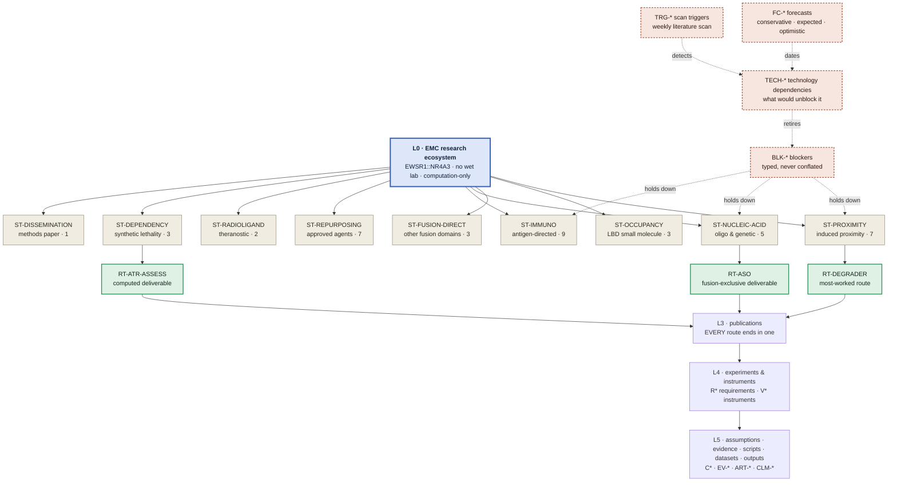

# The EMC research platform — systems architecture

> **Role:** the single description of how this repository is built. If any other document describes
> repository structure and disagrees with this one, this one wins and the other is a defect.

**Scope of the program.** One researcher, no wet lab, no funding for one. Every advance is either
in-silico or publish-to-convince. The disease is extraskeletal myxoid chondrosarcoma (EMC), driven by the
EWSR1::NR4A3 fusion. Nothing in this document — or anything generated from the model it describes — asserts
efficacy, safety, a therapeutic window, or clinical readiness for any route or molecule.

---

## 1 · Why this architecture exists

The repository already had unusual rigour: a requirement register, an instrument register in which nothing
may support a claim until it has recovered a known answer, a configuration register of frozen choices, a
closure taxonomy that distinguishes *"this is impossible"* from *"today's method cannot resolve it"*, and
five CI-enforced provenance linters. **None of that is being replaced.** This architecture generalises it.

What was missing was structure at three specific points, each measured rather than asserted:

**(a) One document was doing five jobs.** `nr4a3-program-map.md` grew to 5,961 lines carrying reading rules,
three registers, a live status board, a spend-gated plan, and narrative history — with fourteen unnumbered
sections interleaved into its numbered spine because they were moved verbatim out of `STRATEGY.md` and their
heading strings are parsed by CI. Its own §0.7 marked three of its own sections stale. Registers are
structured data; they were prose.

**(b) There was no level above the degrader program.** Forty therapeutic routes existed in a flat list.
Nothing answered *"what is the complete landscape?"* — so the landscape was re-derived from prose each
session, which is the specific failure that caused the program map to be written in the first place.

**(c) Redundancy the repository's own first rule forbids.** Compute economics had roughly nine homes; the
route portfolio had six; eight audit documents were each pinned to a line count or commit that had since
moved. Roughly seventy of 189 markdown files were one-off session reports, indistinguishable from durable
references by their path.

And one problem that constrains every solution: **filesystem dates carry no information here.** The history
is a squashed import; every file reports the same date. Freshness cannot be computed — it has to be
*declared*, and therefore enforced.

---

## 2 · The three-layer split

```
systems/     THE MODEL     machine source of truth + generated views. Answers "what is true, what is
                           blocked, what is next, and what would unblock it".
research/    THE WORK      papers, preregistrations, memos, pipelines, artifacts. Registered by the
                           model; never duplicating it.
archive/     HISTORY       superseded documents, retired programs. Read-only, kept for provenance.
```

The boundary is sharp and is the architecture's main invariant:

> **The model holds STATE. The work holds REASONING. A number, status or grade has exactly one home, and
> anything else that shows it is generated from that home.**

So `systems/` contains almost no hand-written prose — four policy/convention files and this one. Everything
else under `systems/views/` is regenerated by `systems_check.py` and fails CI if the committed copy has
drifted. That pattern is not new here: `emc-systems-map.md` has always been generated from
`emc-systems-map.json`, and its checker re-renders the view in memory and fails when the committed file
differs. This architecture extends that discipline to the whole navigational surface rather than inventing a
second mechanism.

---

## 3 · The hierarchy

Six zoom levels. Every level links cleanly up and down; every object at every level carries the same
standard fields (§5).

| level | question it answers | object | how it is modelled | where to look |
|---|---|---|---|---|
| **L0** | What is the complete EMC research landscape? | ecosystem | one generated view | [views/L0-ecosystem.md](./views/L0-ecosystem.md) |
| **L1** | What families of therapeutic strategy exist, and how is each doing? | strategy family — `ST-*` | graph object | `views/L1-<family>.md` |
| **L2** | What individual approaches sit inside a family? | route / approach — `RT-*` | graph object | `views/L2-<route>.md` |
| **L3** | What are we actually writing and publishing — and what is every route FOR? | publication — `PUB-*` | **graph object, pointing at a document when one exists** (§3.3) | [views/L3-publications.md](./views/L3-publications.md) |
| **L4** | What experiments produce the evidence, and with what? | experiment — a document declaring `level: L4`; instrument — `V*` / `INS-*` | document + graph object | [views/registers/instruments.md](./views/registers/instruments.md) |
| **L5** | What does any of it actually rest on? | assumption · evidence · artifact · claim — `OBJ-*` `EV-*` `ART-*` `CLM-*` | graph object | [views/L5-evidence-base.md](./views/L5-evidence-base.md) |

⛔ **NO COUNTS ARE TYPED IN THIS TABLE, AND THE OMISSION IS THE POINT.** *Superseded, retained: an `~n`
column reading **`PUB-*` ~15**, **`EXP-*`, `V*` ~60** and **`C*` … ~400**. Measured 2026-08-06: **`PUB-*`
and `EXP-*` existed in no collection at all** — both appeared only as example strings inside
`research-object.schema.json` — and the three counts were wrong by factors of five, two and six against
what the repository actually held. It was the exact defect rule 1 exists to stop, sitting in the document
that defines the architecture, and it survived because a hand-typed number in prose is checked by nothing.*
The live census is emitted by `systems_check --check` as `[D11]` on every run, and the graph counts are
printed in the header of each generated view.

⭐ **L4 IS DOCUMENTS, NOT GRAPH ROWS — a deliberate asymmetry.** An experiment write-up IS prose; copying
its title into JSON would create a second home for a fact whose first home is the file itself, and it would
go stale the moment a memo is renamed. So it declares its level in its own frontmatter, that frontmatter is
schema-validated (`[D11]`, §7), and the count is reported rather than pinned — pinning it would make writing
a new memo a red build.

⚠ *Superseded, retained: **"L3 AND L4 ARE DOCUMENTS, NOT GRAPH ROWS"**, which covered publications too. The
reasoning above is intact and still governs — a `PUB-*` row with a document carries **no title at all**, the
schema forbids one, and the generated view reads it back out of the file's frontmatter. What the reasoning
did not cover is a paper that **does not exist yet**. See §3.3.*

### 3.0 · ⭐ The downward half of the hierarchy, and why it was missing

**Added 2026-08-06.** "Every level links cleanly up and down" was half true for nine months. Every `L2`
page linked UP — `← family`, `← L0` — and **nothing linked DOWN.** All 40 routes carried `instruments`,
`objects`, `evidence` and `artifacts` in the graph the whole time; `render_l2` rendered none of them, so
32 of 40 route pages named no L5 item at all, `CLM-*` — the register that pins one sentence in one file
to one JSON pointer, which is what *"no orphaned knowledge"* actually cashes out as — appeared in **zero**
generated views, and `OBJ-*` appeared only inside the instruments register.

A reader following the hierarchy from L0 therefore ran out of pages one level early and had to open the
JSON by hand — which is precisely the re-derivation this model exists to end. Two additions close it, and
neither asserts anything new: [`views/L5-evidence-base.md`](./views/L5-evidence-base.md) inverts the edges
the routes already assert so every L5 row shows what rests on it, and every L2 page gains a *"what this
route rests on"* section linking into it. `[L5]` then reports the rows nothing cites — an orphan is not
automatically a defect, but an *invisible* orphan is.

**Cross-cutting registers — deliberately not levels**, because each one is referenced from several levels at
once and duplicating it per family would be the same one-fact-many-places bug in a new costume:

| register | id | what it is |
|---|---|---|
| Requirements | `R*` | what must be TRUE for a claim to stand |
| **Lanes** | **`LANE-*`** | **executed work and how it ended** — see [views/registers/lanes.md](./views/registers/lanes.md) |
| Blockers | `BLK-*` | why something is stalled — typed, see [taxonomy/blockers.md](taxonomy/blockers.md) |
| Technology dependencies | `TECH-*` | what would unblock it — see [taxonomy/technology.md](taxonomy/technology.md) |
| Forecasts | `FC-*` | when that is expected, in three scenario bands |
| Roadmap milestones | `MS-*` | the multi-year plan |
| Scan triggers | `TRG-*` | how to search the literature for a `TECH-*` landing |

### 3.0 · ⭐ Why LANES were added, and what their absence cost

**Added 2026-08-05, after the gap it left did real damage.** A `RT-*` answers *could we do X?* and an `R*`
answers *what must be TRUE*. **Neither answers *did we run X, and how did it end?*** — so executed work had
no object, and its state lived only as a **struck-through row in roadmap prose**.

Prose is not queryable. On 2026-08-05 an artifact belonging to a lane that had **closed on 2026-07-30** was
therefore read as a gap to fill; **88.5 minutes of CI went at it**, and the write-up afterwards told the next
reader to spend hours more. The roadmap had said so all along, in a row struck through with `~~`.

⚠ **A lane is not a route and must not be folded into one.** A route can be `parked` for years and still be
a live option; a lane either ran or did not, and once it ends it produces nothing further. The state answers
exactly one question — ***will this lane still produce what it owes?*** — which is why a **null result is
`complete`**, with the verdict in `terminus`. Collapsing "it failed" into a distinct state would make a
settled negative look like an outstanding task, and that is how dead work gets re-run.

⭐ **The payoff is that an absence became derivable.** Each lane lists in `produces[]` every artifact it was
responsible for *and whether it was produced*, so `check_artifacts` resolves a missing artifact by lookup —
`complete` lane ⇒ **withdrawn citation**, `running`/`held`/`parked` ⇒ **expected**. No human assertion, no
second register to keep in step, and `[K2]` errors if anyone writes one anyway.

### 3.1 · Why L1 is *modality*, not *method*

The brief's L1 examples mix therapeutic modality (repurposing, protein targeting, synthetic lethality) with
research method (molecular docking, transcriptomics, network biology). Both are real axes, but only one can
be the containment hierarchy, and choosing wrongly is expensive.

**Modality wins, for a structural reason.** A method serves many routes at once — the pose-prediction
instrument `V3` is cited by the degrader route, the monovalent route and the covalent-probe route
simultaneously. If method were the level, every such instrument would have to be duplicated into each
family, and its status would then have several homes. Modality partitions the forty routes cleanly with no
route in two families.

Method is therefore a **cross-cutting index** (`views/methods-index.md`): instrument → the routes it serves →
its known-answer control and whether that control passed. That preserves the "what techniques exist and how
good are they" view without paying the duplication cost.

### 3.2 · The nine strategy families

| id | family | routes |
|---|---|---|
| `ST-PROXIMITY` | Induced-proximity therapeutics | 7 — degrader, AND-gate, glue, TCIP, RIPTAC, ubiquitination-selective, interface prediction |
| `ST-OCCUPANCY` | Direct small-molecule engagement of the NR4A3 LBD | 3 — monovalent, covalent probe, asymmetric-selectivity design |
| `ST-FUSION-DIRECT` | Targeting the fusion's other domains | 3 — EWSR1 half, shared FET low-complexity half, DBD |
| `ST-NUCLEIC-ACID` | Nucleic-acid and genetic therapeutics | 5 — junction ASO/siRNA, the ASO ask, CRISPR/Cas13, ribozyme, synthetic promoter |
| `ST-IMMUNO` | Immunotherapy and antigen-directed | 9 — junction neoantigen, vaccine, TCR/ImmTAC, PRAME, CTA TCR-T, CAR-T, B7-H3, ICI+TKI, ex-vivo pan-NR4A |
| `ST-REPURPOSING` | Repurposing approved and late-stage agents | 7 — trabectedin, trabectedin+PPARγ, PPARγ downstream, carfilzomib, HDAC/BET, RXR, 6-MP |
| `ST-RADIOLIGAND` | Radioligand and theranostic | 2 — SSTR2, FAP-RLT |
| `ST-DEPENDENCY` | Synthetic lethality and dependency | 3 — BRD9/ncBAF, ATR assessment, ATR cell panel |
| `ST-DISSEMINATION` | Methods and publication as an outcome in itself | 1 — the honest methods paper on the program's own failure record |

Every one of the forty routes lands in exactly one family, and the checker enforces both directions.

⚠ **NO FAMILY CARRIES `portfolio_role: lead`, AND THAT IS A FINDING (2026-08-06).** `ST-PROXIMITY` held it
until the degrader path was worked far enough to hit its blockers; it is now `hedge` like most of the board,
and nothing was promoted in its place because nothing has earned it. The enum keeps `lead` so a future
promotion is expressible. A portfolio with no lead is an honest state; inventing one to fill the slot would
be the over-claim the vocabulary exists to prevent.

### 3.3 · ⭐ Why publications became graph rows, when L4 did not

**Added 2026-08-06, on a ruling that is about the program rather than about the model:** *the end goal of
every one of these routes is a paper.* With no wet lab and no clinic, the published record is the **only**
channel by which any of this work reaches a patient — so a route's terminus is a publication, and a route
that cannot name the paper it is for is an **activity**, not an option.

The model could not express that. It recorded what each route WAS, what BLOCKED it and what it RESTED on,
and nothing recorded what it was **for**. `readiness.attainable_today` came closest and answers a different
question: it says what FORM a route could reach today, never which paper it lands in or what that paper
would assert.

⛔ **The blocking objection was the §3 asymmetry above, and the resolution is that the asymmetry was never
about publications — it was about TITLES.** "Do not copy a file's title into JSON" is a rule about
duplication, and it is obeyed exactly: a `PUB-*` row with a `document` carries no title, the schema
**forbids** one, and [`views/L3-publications.md`](./views/L3-publications.md) reads it back out of the
file's frontmatter at render time. What the rule could not cover is a paper that **does not exist yet**: it
has no file, so there is nothing for the row to duplicate and nowhere else for its name to live. Under the
old reading those papers were simply absent — which made *"this route has no endpoint"* and *"this route's
endpoint is not written yet"* render identically, across a portfolio where the second is the common case
and the first should be impossible.

So the collection carries what only it can carry, and nothing else:

| field | why it is here and not in the document |
|---|---|
| `state` | How much of the paper exists — `unwritten` through `posted`. ⚠ **Not a quality grade:** `drafted` says a file exists and nothing about whether the science in it holds. |
| `what_it_would_claim` | ⭐ **The field that makes an unwritten paper real.** If the one sentence the paper would put into the field's record cannot be written, there is no endpoint. Linted by `lint_claims.py` like the manuscript — these sentences are authored in JSON, where no reviewer reads them as prose. |
| `why_not_written` | What is actually missing: a result, a decision, a person, or **only the writing**. That last one is a legitimate answer and the most actionable state on the board. |
| `blocked_by` | Blockers on the **paper**, deliberately not inherited from its routes — a route can be blocked on a capability while its paper is publishable today as an honest negative, and that gap is the portfolio's main source of publishable work. |

A route's own `publication` field is the edge: `endpoint`, `role` (`primary` / `contributing` / `context`)
and what it contributes. `check_publications` fails the build on a route with no endpoint, an endpoint no
route claims, or a `document` whose frontmatter does not declare `level: L3` — because every memo, plan and
red-team in `research/manuscripts/` would pass a mere file-exists check, and pointing an endpoint at a note
*about* a deliverable is the confusion the register was added to stop.

⚠ **A CLOSED ROUTE IS NOT EXEMPT**, and that is the point rather than a formality. A definitional closure is
a publishable negative and the field publishes almost none of them, so the routes with the least remaining
science can carry the most transferable writing.

---

## 4 · The L0 view

> ⚠ **This one is HAND-DRAWN and shows the SHAPE OF THE MODEL — the levels and how they nest.** It is not
> the portfolio's live state and must never be read as such: it names route counts that were true when it
> was drawn and that nothing regenerates.
>
> **The live diagrams are GENERATED**, from the same graph as every table, and drift-checked by
> `check_views` like every other view — so they cannot say something the model does not:
>
> | diagram | where | what only it can show |
> |---|---|---|
> | the landscape | [`views/L0-ecosystem.md`](./views/L0-ecosystem.md) | which blockers cut across **families** — two of them hold down six of the nine |
> | per family | `views/L1-<family>.md` | whether the family is blocked **as a unit** or route by route |
> | per route | `views/L2-<route>.md` | the **unblock path**: blocker → the technology that would retire it → its forecast band |
>
> Each states what it deliberately left out. An omission a reader cannot see is a lie by composition.



The generated version — with live status glyphs, per-family counts and drill-down links — is
[`views/L0-ecosystem.md`](views/L0-ecosystem.md). The diagram above is the *shape*; the generated one is the
*state*, and only the generated one is current.

**Reading rule, which is the whole point of favouring clarity over detail:** L0 shows nine boxes and four
cross-cutting registers. It does not show forty routes, sixty instruments or four hundred evidence items.
Detail appears on drill-down, never on the front page.

---

## 5 · The standard research object

Every object at every level exposes the same fields. This is what makes the repository navigable by an
autonomous agent operating over a long horizon: the answer to *"what is this, what does it need, what does it
produce, and what should happen next"* is in the same place and the same shape for a strategy family, a
route, an experiment and a dataset.

```
identity      id · title · level · kind · aliases
purpose       what question this object answers
inputs        depends_on[] · consumes[] (artifacts, datasets, evidence)
outputs       produces[] (artifacts, claims, publications)
state         status · maturity · confidence · last_verified
assumptions   assumptions[] → C* configurations, each with what breaks if it is wrong
limitations   what this object may NOT be used to claim  ← the claim ceiling
blockers      blockers[] → BLK-*, each typed
unblocked_by  technologies[] → TECH-*, each with a forecast
related       parent · children · siblings · distinct_from
provenance    owner (the file that owns this fact) · evidence[] · produced_by
next          next_milestone · best_next_action
```

Full JSON Schema: [`schema/research-object.schema.json`](schema/research-object.schema.json).

Three of those fields carry most of the weight and each exists because of a specific past failure:

- **`limitations` (the claim ceiling)** — an object may state what it may *not* be used to claim. This is the
  existing invariant that a result can never be stronger than the instrument underneath it, raised from
  the requirement register to the object model.
- **`assumptions` → `C*`** — a result that is correct given a frozen choice, where a defensible alternative
  choice would reverse it, is a different thing from a robust result. The configuration register records
  this for the degrader program; the schema reserves the field so any object can carry it.
- **`provenance.owner`** — the file that owns the fact. Anything else showing it is generated or is a defect.

### 5.0 · ⚠ Where the claim ceiling actually is, measured

*Superseded, retained: the two sentences above previously read **"promoted from the requirement register
to every object"** and **"the schema makes it universal."*** Measured 2026-08-06, the first was false and
the second described a reservation as an accomplishment:

| level | claim ceiling | coverage |
|---|---|---|
| L1 strategy family | `limitations[]` | **9 of 9** — asserted, rich, and the source of the inheritance below |
| L2 route | `limitations[]` | **0 of 40** authored · **40 of 40 inherited** from their family since 2026-08-06 |
| L4 requirement | `claim_ceiling` | **16 of 16** |
| L4 instrument | `scope_note` / `inherits_limits_from` | 7 with a scope note; usability computed transitively (§6.5) |
| any | `assumptions[] → C*` | **0** — the field is reserved and nothing populates it |

⛔ **The inheritance is DERIVED, and deliberately not authored.** Writing forty fresh route-level
ceilings would mean inventing scientific limits nobody stated, which is the one thing this repository
must never do. A family limitation binds every route inside it by construction — that is what makes it a
family limitation — so the existing sentence is surfaced on each route page, attributed to the family
that asserts it. A route needing a ceiling its family does not have must still write one, and the
`limitations[]` field is there for exactly that.

⚠ **`assumptions[] → C*` is an open gap, recorded rather than quietly dropped.** The configuration
register (`C166`, `C397`, `C551`) exists and is referenced from `objects.json`, but no object carries the
structured *"here is the frozen choice, and here is what breaks if it is wrong"* field this section
describes. Filling it is real work on real content, not a rename, so it is named here as outstanding.

### 5.1 · Route lifecycle — no vague states

Every `RT-*` additionally carries the lifecycle the brief requires, with closed enums rather than prose:

`status` · `rationale` · `supporting_evidence[]` · `confidence` · `remaining_unknowns[]` ·
`required_validation[]` · `dependencies[]` · `blockers[]` · `maturity` · `next_milestone` ·
`best_next_action` · `readiness` · `timing` · **`publication`** (§3.3 — the endpoint, required on every
route including the closed ones).

A route missing any of these fails the checker. Free-text status is not accepted — the audit found roughly
nineteen distinct status strings in use, including three in one file, which is why the vocabulary is now
closed and lives in [`CONVENTIONS.md`](CONVENTIONS.md).

### 5.2 · Readiness — what could this become today?

```
readiness: {
  attainable_today: internal_note | reproducible_workflow | preprint | chemrxiv
                  | journal_submission | experimental_proposal,
  missing: [],  evidence_required: [],  experiment_required: []
}
```

If a route cannot reach a given output, the fields say what is missing, what evidence would be required and
what experiment would be required — so *"not publishable yet"* is never a dead end, it is a work item.

### 5.3 · Strategic timing — the wait equation

```
timing: {
  recommendation: pursue_now | wait | monitor | closed,
  rationale, six_month_delta, two_year_delta,
  cost_trend, automation_outlook, revisit_trigger → TECH-*
}
```

Not every project should start now. A route whose dominant cost is expected to fall sharply, or whose manual
work is expected to be automated, may be worth more later than now — and the delay is only defensible if the
reasoning is written down and attached to a named technology whose arrival is being scanned for. That is what
`revisit_trigger` does: it converts *"let's wait"* from a feeling into a monitored condition.

### 5.4 · Compute justification — reasoning before spending

A route may only carry `recommends_compute: true` together with:

```
{ why, expected_value, resources, uncertainty, decision_criteria, reasoning_exhausted[] }
```

where `reasoning_exhausted[]` names which of literature review, mechanistic reasoning, synthesis, analogy,
planning, protocol design, dependency analysis and failure analysis have actually been done. The checker
refuses a compute recommendation with an empty `reasoning_exhausted`. This makes *"push reasoning as far as
it goes before spending GPU"* a structural constraint rather than a piece of advice — which matters because
the constraint is real: this program is self-funded.

---

## 6 · Blockers and technology dependencies

These are the two registers the repository did not have, and they are two halves of one mechanism.

**A blocker says why something is stalled.** It carries a closed `blocker_kind` and the taxonomy's governing
rule is that the kinds are **never conflated** — *"the biology forbids it"*, *"today's method cannot resolve
it"*, *"nobody has run the assay"* and *"we have not been given the budget"* are four different situations
with four different remedies, and filing them under one word destroys exactly the information needed to know
what to do. Full enum and per-kind remedy: [`taxonomy/blockers.md`](taxonomy/blockers.md).

**A technology dependency says what would unblock it.** Every non-permanent blocker maps to at least one
`TECH-*`; the checker fails if one does not. Each `TECH-*` carries a forecast in three scenario bands with a
mandatory `basis` field — `evidence_based`, `extrapolated` or `speculative` — because the brief asks to
account for rapid AI progress *while separating expectation from speculation*, and an unlabelled forecast is
precisely the failure mode. Full taxonomy: [`taxonomy/technology.md`](taxonomy/technology.md).

**A permanently-closed route may carry no technology dependency.** The existing closure model already
distinguishes a fact about what the objects *are* — a residue the paralogues share cannot discriminate
between them — from a limitation of today's tools. The first is not waiting on anything and must never appear
on a watch list; the second is the most revivable category and is where most of this program's failures
actually sit. That distinction is inherited unchanged.

---

## 6.5 · ⭐ Edges: what SysML gave us, and what it could not

**Asked in August 2026 whether the whole model should be re-expressed in SysML, the honest answer was
"part of it".** [`graph/relations.json`](graph/relations.json) records that answer as data — every edge in
the model with its stereotype, its ends, and whether it is asserted or derived — because a conclusion left
in a session transcript gets re-litigated, and `[X1]` fails the build on any edge the register does not
name.

**Four stereotypes are earned, and one of them changed the model.**

| stereotype | edge | what it buys |
|---|---|---|
| `verify` | `requirement.verified_by` → `instrument.verifies` | **one asserted direction, one derived inverse** |
| `allocate` | `route.instruments` → `instrument.allocated_to` | the same shape, with an outcome (`support` / `disclosed_failing`) |
| `refine` | `instrument.characterises` → an object | an instrument that makes an OBJECT precise rather than answering a requirement about it |
| `derive` | `instrument.inherits_limits_from` | one instrument's limits following from another's |

⛔ **`satisfy` and `trace` are refused, and the refusal is recorded.** Nothing here is an implementation —
routes are *options*, not built things, and calling a route a satisfier of a requirement would assert the
readiness §7's language discipline forbids. `trace` is worse: it is the catch-all that would have absorbed
`blockers_inherited`, `objects`, `artifacts` and `unblocks` into one meaningless name. Nine domain relations
that say what they mean beat nine `trace` edges that do not.

### ⚠ What the rename actually fixed — the reason it was not cosmetic

The model carried **three fields for one relation**: `requirement.served_by` (asserted),
`instrument.serves` (asserted, the same edge from the other end) and `instrument.serves_derived` (computed,
and read by nothing). Measured before the change:

- **11 of 30 instruments disagreed with the requirement register.**
- **6 of those held free prose** — `"the ATR route's structural precondition"` — in a field the other rows
  used for identifiers, because `instruments` and `requirements` were the only two collections with **no
  schema**.
- Every one of the six turned out to be a **paraphrase of an edge the model already carried** in
  `route.instruments`, written in a second file where nothing read it, and where five of the six lost the
  support-versus-disclosed-failing distinction that the typed edge keeps.

⭐ **The visible symptom was a warning the model itself contradicted.** `[Q3]` reported *"R13 has NO
instrument at all — there is nothing built that could answer it"* while two instruments claimed to serve
R13 and R13's own note read *"an instrument EXISTS and is staged"*. Three places in one model; the check
read one.

**Two findings fell out of reconciling it, and neither was planned.** An instrument can pass its own
known-answer control and still be unable to license a claim — `INS-MONOVALENT-REACH` replicates the
committed bivalent artifact cell-for-cell and its own note says it *"can refute a route and cannot license
one"* — so `usable` is computed through `inherits_limits_from` rather than read off the control state, and
`[V3]` immediately caught a route citing it as SUPPORT. And `known_answer_control.state` had a fifth value,
`mixed`, enumerated in no schema and silently counting as a pass; closing that enum **added** a warning.

---

## 7 · How the model stays true

Five mechanisms, all in CI, all failing **red**:

| mechanism | what it prevents |
|---|---|
| **View regeneration check** | A generated document that has been hand-edited or has drifted from the graph. The checker re-renders every view in memory and fails on any difference. |
| **Anchor resolution** | A pointer to a document section that no longer exists. Every `owner{file,anchor}` in the graph must resolve. |
| **Frontmatter enforcement** | A document with no declared purpose, scope, audience, status or date. Required because filesystem dates are meaningless in this repository. |
| **Taxonomy completeness** | A blocker with no kind; a non-permanent blocker with no technology that would retire it; a technology with no forecast; a forecast with no `basis` or no `last_verified`. |
| **Existing linters, unchanged** | Numeric consistency across documents, claim-language discipline, registry integrity, CI-shape guards. |

**One behaviour is changed as a precondition rather than an improvement.** Several parsers currently print a
message such as *"NOT SCANNED — the plan is invisible this run"* and exit successfully when they cannot find
what they parse. A guard that fails open leaves no trace, and during a restructure it is the most dangerous
behaviour in the repository: the plan would silently stop being read and every build would stay green. Those
parsers are made to exit non-zero **before** any document moves.

---

## 8 · Design decisions, and why

| decision | why |
|---|---|
| Extend the existing registry rather than fork it | It already has typed nodes and edges, aliases, closure kinds, revival triggers with scanner interop, a schema version, a checker and its tests. A second parallel model would immediately become a second source of truth — the exact bug being fixed. |
| JSON is the source, Markdown is generated | Proven here already. Prose drifts and cannot be checked; a generated view cannot drift without failing the build. |
| L1 is modality, method is an index | §3.1. Method-as-level duplicates every shared instrument. |
| Preregistrations are immutable | A preregistration's entire value is that it was written before the result. They are registered as evidence and never rewritten, consolidated or "cleaned up". |
| `STRATEGY.md` is not touched | Its Appendix A row numbers are cited *as data* by dozens of files and its heading is used as a structural clear by a linter. It is a database table wearing a document's clothes. Left exactly as it is. |
| `CLAUDE.md` §6 is not moved | Roughly half of it is infrastructure reference rather than standing rules, and moving it would make the file honest to its own "short by construction" claim. But it is load-bearing *because* it loads into every session, each rule exists because it was violated, and no deadline forces the change. Recorded in [`MIGRATION.md`](MIGRATION.md) as an open decision. |
| The patient-facing site is removed, its clinical data is kept | The site is retired. But its EMC registry — cited cohorts, pooled outcomes, a structured citation map — is research evidence that two research programs read, and one of those reads it by a path that no text search for the directory name would find. Data is promoted; UI is deleted. |

---

## 9 · What this supersedes

This document, together with [`CONVENTIONS.md`](CONVENTIONS.md), [`MIGRATION.md`](MIGRATION.md) and the two
taxonomies, is the canonical description of the repository. Every earlier description of repository
structure, documentation hierarchy or navigation is superseded. [`MIGRATION.md`](MIGRATION.md) records what
each superseded document was, what replaced it, and where its information now lives — nothing is dropped
without a forwarding address.
