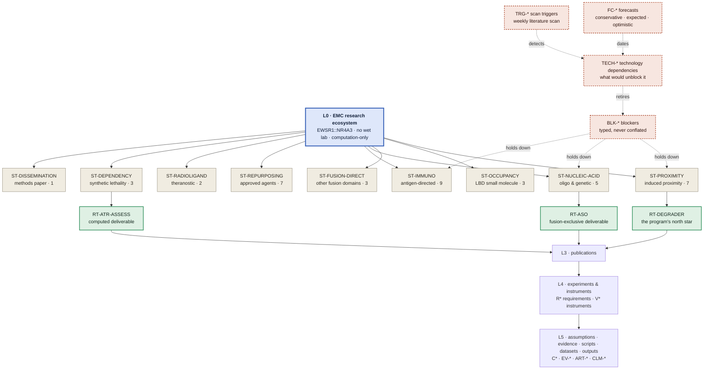

# The EMC research platform — systems architecture

> **Role:** the single description of how this repository is built. If any other document describes
> repository structure and disagrees with this one, this one wins and the other is a defect.

**Scope of the program.** One researcher, no wet lab, no funding for one. Every advance is either
in-silico or publish-to-convince. The disease is extraskeletal myxoid chondrosarcoma (EMC), driven by the
EWSR1::NR4A3 fusion. Nothing in this document — or anything generated from the model it describes — asserts
efficacy, safety, a therapeutic window, or clinical readiness for any route or molecule.

---

## 1 · Why this architecture exists

The repository already had unusual rigour: a requirement register, an instrument register in which nothing
may support a claim until it has recovered a known answer, a configuration register of frozen choices, a
closure taxonomy that distinguishes *"this is impossible"* from *"today's method cannot resolve it"*, and
five CI-enforced provenance linters. **None of that is being replaced.** This architecture generalises it.

What was missing was structure at three specific points, each measured rather than asserted:

**(a) One document was doing five jobs.** `nr4a3-program-map.md` grew to 5,961 lines carrying reading rules,
three registers, a live status board, a spend-gated plan, and narrative history — with fourteen unnumbered
sections interleaved into its numbered spine because they were moved verbatim out of `STRATEGY.md` and their
heading strings are parsed by CI. Its own §0.7 marked three of its own sections stale. Registers are
structured data; they were prose.

**(b) There was no level above the degrader program.** Forty therapeutic routes existed in a flat list.
Nothing answered *"what is the complete landscape?"* — so the landscape was re-derived from prose each
session, which is the specific failure that caused the program map to be written in the first place.

**(c) Redundancy the repository's own first rule forbids.** Compute economics had roughly nine homes; the
route portfolio had six; eight audit documents were each pinned to a line count or commit that had since
moved. Roughly seventy of 189 markdown files were one-off session reports, indistinguishable from durable
references by their path.

And one problem that constrains every solution: **filesystem dates carry no information here.** The history
is a squashed import; every file reports the same date. Freshness cannot be computed — it has to be
*declared*, and therefore enforced.

---

## 2 · The three-layer split

```
systems/     THE MODEL     machine source of truth + generated views. Answers "what is true, what is
                           blocked, what is next, and what would unblock it".
research/    THE WORK      papers, preregistrations, memos, pipelines, artifacts. Registered by the
                           model; never duplicating it.
archive/     HISTORY       superseded documents, retired programs. Read-only, kept for provenance.
```

The boundary is sharp and is the architecture's main invariant:

> **The model holds STATE. The work holds REASONING. A number, status or grade has exactly one home, and
> anything else that shows it is generated from that home.**

So `systems/` contains almost no hand-written prose — four policy/convention files and this one. Everything
else under `systems/views/` is regenerated by `systems_check.py` and fails CI if the committed copy has
drifted. That pattern is not new here: `emc-systems-map.md` has always been generated from
`emc-systems-map.json`, and its checker re-renders the view in memory and fails when the committed file
differs. This architecture extends that discipline to the whole navigational surface rather than inventing a
second mechanism.

---

## 3 · The hierarchy

Six zoom levels. Every level links cleanly up and down; every object at every level carries the same
standard fields (§5).

| level | question it answers | object | id | ~n |
|---|---|---|---|---|
| **L0** | What is the complete EMC research landscape? | ecosystem | — | 1 |
| **L1** | What families of therapeutic strategy exist, and how is each doing? | strategy family | `ST-*` | 9 |
| **L2** | What individual approaches sit inside a family? | route / approach | `RT-*` | 40 |
| **L3** | What are we actually writing and publishing? | publication | `PUB-*` | ~15 |
| **L4** | What experiments and instruments produce the evidence? | experiment / instrument | `EXP-*`, `V*` | ~60 |
| **L5** | What does any of it actually rest on? | assumption · evidence · script · dataset · output | `C*` `EV-*` `ART-*` `CLM-*` `OBJ-*` | ~400 |

**Cross-cutting registers — deliberately not levels**, because each one is referenced from several levels at
once and duplicating it per family would be the same one-fact-many-places bug in a new costume:

| register | id | what it is |
|---|---|---|
| Requirements | `R*` | what must be TRUE for a claim to stand |
| Blockers | `BLK-*` | why something is stalled — typed, see [taxonomy/blockers.md](taxonomy/blockers.md) |
| Technology dependencies | `TECH-*` | what would unblock it — see [taxonomy/technology.md](taxonomy/technology.md) |
| Forecasts | `FC-*` | when that is expected, in three scenario bands |
| Roadmap milestones | `MS-*` | the multi-year plan |
| Scan triggers | `TRG-*` | how to search the literature for a `TECH-*` landing |

### 3.1 · Why L1 is *modality*, not *method*

The brief's L1 examples mix therapeutic modality (repurposing, protein targeting, synthetic lethality) with
research method (molecular docking, transcriptomics, network biology). Both are real axes, but only one can
be the containment hierarchy, and choosing wrongly is expensive.

**Modality wins, for a structural reason.** A method serves many routes at once — the pose-prediction
instrument `V3` is cited by the degrader route, the monovalent route and the covalent-probe route
simultaneously. If method were the level, every such instrument would have to be duplicated into each
family, and its status would then have several homes. Modality partitions the forty routes cleanly with no
route in two families.

Method is therefore a **cross-cutting index** (`views/methods-index.md`): instrument → the routes it serves →
its known-answer control and whether that control passed. That preserves the "what techniques exist and how
good are they" view without paying the duplication cost.

### 3.2 · The nine strategy families

| id | family | routes |
|---|---|---|
| `ST-PROXIMITY` | Induced-proximity therapeutics | 7 — degrader, AND-gate, glue, TCIP, RIPTAC, ubiquitination-selective, interface prediction |
| `ST-OCCUPANCY` | Direct small-molecule engagement of the NR4A3 LBD | 3 — monovalent, covalent probe, asymmetric-selectivity design |
| `ST-FUSION-DIRECT` | Targeting the fusion's other domains | 3 — EWSR1 half, shared FET low-complexity half, DBD |
| `ST-NUCLEIC-ACID` | Nucleic-acid and genetic therapeutics | 5 — junction ASO/siRNA, the ASO ask, CRISPR/Cas13, ribozyme, synthetic promoter |
| `ST-IMMUNO` | Immunotherapy and antigen-directed | 9 — junction neoantigen, vaccine, TCR/ImmTAC, PRAME, CTA TCR-T, CAR-T, B7-H3, ICI+TKI, ex-vivo pan-NR4A |
| `ST-REPURPOSING` | Repurposing approved and late-stage agents | 7 — trabectedin, trabectedin+PPARγ, PPARγ downstream, carfilzomib, HDAC/BET, RXR, 6-MP |
| `ST-RADIOLIGAND` | Radioligand and theranostic | 2 — SSTR2, FAP-RLT |
| `ST-DEPENDENCY` | Synthetic lethality and dependency | 3 — BRD9/ncBAF, ATR assessment, ATR cell panel |
| `ST-DISSEMINATION` | Methods and publication as an outcome in itself | 1 — the honest methods paper on the program's own failure record |

Every one of the forty routes lands in exactly one family, and the checker enforces both directions.

---

## 4 · The L0 view

> ⚠ **This one is HAND-DRAWN and shows the SHAPE OF THE MODEL — the levels and how they nest.** It is not
> the portfolio's live state and must never be read as such: it names route counts that were true when it
> was drawn and that nothing regenerates.
>
> **The live diagrams are GENERATED**, from the same graph as every table, and drift-checked by
> `check_views` like every other view — so they cannot say something the model does not:
>
> | diagram | where | what only it can show |
> |---|---|---|
> | the landscape | [`views/L0-ecosystem.md`](./views/L0-ecosystem.md) | which blockers cut across **families** — two of them hold down six of the nine |
> | per family | `views/L1-<family>.md` | whether the family is blocked **as a unit** or route by route |
> | per route | `views/L2-<route>.md` | the **unblock path**: blocker → the technology that would retire it → its forecast band |
>
> Each states what it deliberately left out. An omission a reader cannot see is a lie by composition.



The generated version — with live status glyphs, per-family counts and drill-down links — is
[`views/L0-ecosystem.md`](views/L0-ecosystem.md). The diagram above is the *shape*; the generated one is the
*state*, and only the generated one is current.

**Reading rule, which is the whole point of favouring clarity over detail:** L0 shows nine boxes and four
cross-cutting registers. It does not show forty routes, sixty instruments or four hundred evidence items.
Detail appears on drill-down, never on the front page.

---

## 5 · The standard research object

Every object at every level exposes the same fields. This is what makes the repository navigable by an
autonomous agent operating over a long horizon: the answer to *"what is this, what does it need, what does it
produce, and what should happen next"* is in the same place and the same shape for a strategy family, a
route, an experiment and a dataset.

```
identity      id · title · level · kind · aliases
purpose       what question this object answers
inputs        depends_on[] · consumes[] (artifacts, datasets, evidence)
outputs       produces[] (artifacts, claims, publications)
state         status · maturity · confidence · last_verified
assumptions   assumptions[] → C* configurations, each with what breaks if it is wrong
limitations   what this object may NOT be used to claim  ← the claim ceiling
blockers      blockers[] → BLK-*, each typed
unblocked_by  technologies[] → TECH-*, each with a forecast
related       parent · children · siblings · distinct_from
provenance    owner (the file that owns this fact) · evidence[] · produced_by
next          next_milestone · best_next_action
```

Full JSON Schema: [`schema/research-object.schema.json`](schema/research-object.schema.json).

Three of those fields carry most of the weight and each exists because of a specific past failure:

- **`limitations` (the claim ceiling)** — an object may state what it may *not* be used to claim. This is the
  existing invariant that a result can never be stronger than the instrument underneath it, promoted from
  the requirement register to every object.
- **`assumptions` → `C*`** — a result that is correct given a frozen choice, where a defensible alternative
  choice would reverse it, is a different thing from a robust result. The configuration register already
  records this for the degrader program; the schema makes it universal.
- **`provenance.owner`** — the file that owns the fact. Anything else showing it is generated or is a defect.

### 5.1 · Route lifecycle — no vague states

Every `RT-*` additionally carries the lifecycle the brief requires, with closed enums rather than prose:

`status` · `rationale` · `supporting_evidence[]` · `confidence` · `remaining_unknowns[]` ·
`required_validation[]` · `dependencies[]` · `blockers[]` · `maturity` · `next_milestone` ·
`best_next_action` · `readiness` · `timing`.

A route missing any of these fails the checker. Free-text status is not accepted — the audit found roughly
nineteen distinct status strings in use, including three in one file, which is why the vocabulary is now
closed and lives in [`CONVENTIONS.md`](CONVENTIONS.md).

### 5.2 · Readiness — what could this become today?

```
readiness: {
  attainable_today: internal_note | reproducible_workflow | preprint | chemrxiv
                  | journal_submission | experimental_proposal,
  missing: [],  evidence_required: [],  experiment_required: []
}
```

If a route cannot reach a given output, the fields say what is missing, what evidence would be required and
what experiment would be required — so *"not publishable yet"* is never a dead end, it is a work item.

### 5.3 · Strategic timing — the wait equation

```
timing: {
  recommendation: pursue_now | wait | monitor | closed,
  rationale, six_month_delta, two_year_delta,
  cost_trend, automation_outlook, revisit_trigger → TECH-*
}
```

Not every project should start now. A route whose dominant cost is expected to fall sharply, or whose manual
work is expected to be automated, may be worth more later than now — and the delay is only defensible if the
reasoning is written down and attached to a named technology whose arrival is being scanned for. That is what
`revisit_trigger` does: it converts *"let's wait"* from a feeling into a monitored condition.

### 5.4 · Compute justification — reasoning before spending

A route may only carry `recommends_compute: true` together with:

```
{ why, expected_value, resources, uncertainty, decision_criteria, reasoning_exhausted[] }
```

where `reasoning_exhausted[]` names which of literature review, mechanistic reasoning, synthesis, analogy,
planning, protocol design, dependency analysis and failure analysis have actually been done. The checker
refuses a compute recommendation with an empty `reasoning_exhausted`. This makes *"push reasoning as far as
it goes before spending GPU"* a structural constraint rather than a piece of advice — which matters because
the constraint is real: this program is self-funded.

---

## 6 · Blockers and technology dependencies

These are the two registers the repository did not have, and they are two halves of one mechanism.

**A blocker says why something is stalled.** It carries a closed `blocker_kind` and the taxonomy's governing
rule is that the kinds are **never conflated** — *"the biology forbids it"*, *"today's method cannot resolve
it"*, *"nobody has run the assay"* and *"we have not been given the budget"* are four different situations
with four different remedies, and filing them under one word destroys exactly the information needed to know
what to do. Full enum and per-kind remedy: [`taxonomy/blockers.md`](taxonomy/blockers.md).

**A technology dependency says what would unblock it.** Every non-permanent blocker maps to at least one
`TECH-*`; the checker fails if one does not. Each `TECH-*` carries a forecast in three scenario bands with a
mandatory `basis` field — `evidence_based`, `extrapolated` or `speculative` — because the brief asks to
account for rapid AI progress *while separating expectation from speculation*, and an unlabelled forecast is
precisely the failure mode. Full taxonomy: [`taxonomy/technology.md`](taxonomy/technology.md).

**A permanently-closed route may carry no technology dependency.** The existing closure model already
distinguishes a fact about what the objects *are* — a residue the paralogues share cannot discriminate
between them — from a limitation of today's tools. The first is not waiting on anything and must never appear
on a watch list; the second is the most revivable category and is where most of this program's failures
actually sit. That distinction is inherited unchanged.

---

## 7 · How the model stays true

Five mechanisms, all in CI, all failing **red**:

| mechanism | what it prevents |
|---|---|
| **View regeneration check** | A generated document that has been hand-edited or has drifted from the graph. The checker re-renders every view in memory and fails on any difference. |
| **Anchor resolution** | A pointer to a document section that no longer exists. Every `owner{file,anchor}` in the graph must resolve. |
| **Frontmatter enforcement** | A document with no declared purpose, scope, audience, status or date. Required because filesystem dates are meaningless in this repository. |
| **Taxonomy completeness** | A blocker with no kind; a non-permanent blocker with no technology that would retire it; a technology with no forecast; a forecast with no `basis` or no `last_verified`. |
| **Existing linters, unchanged** | Numeric consistency across documents, claim-language discipline, registry integrity, CI-shape guards. |

**One behaviour is changed as a precondition rather than an improvement.** Several parsers currently print a
message such as *"NOT SCANNED — the plan is invisible this run"* and exit successfully when they cannot find
what they parse. A guard that fails open leaves no trace, and during a restructure it is the most dangerous
behaviour in the repository: the plan would silently stop being read and every build would stay green. Those
parsers are made to exit non-zero **before** any document moves.

---

## 8 · Design decisions, and why

| decision | why |
|---|---|
| Extend the existing registry rather than fork it | It already has typed nodes and edges, aliases, closure kinds, revival triggers with scanner interop, a schema version, a checker and its tests. A second parallel model would immediately become a second source of truth — the exact bug being fixed. |
| JSON is the source, Markdown is generated | Proven here already. Prose drifts and cannot be checked; a generated view cannot drift without failing the build. |
| L1 is modality, method is an index | §3.1. Method-as-level duplicates every shared instrument. |
| Preregistrations are immutable | A preregistration's entire value is that it was written before the result. They are registered as evidence and never rewritten, consolidated or "cleaned up". |
| `STRATEGY.md` is not touched | Its Appendix A row numbers are cited *as data* by dozens of files and its heading is used as a structural clear by a linter. It is a database table wearing a document's clothes. Left exactly as it is. |
| `CLAUDE.md` §6 is not moved | Roughly half of it is infrastructure reference rather than standing rules, and moving it would make the file honest to its own "short by construction" claim. But it is load-bearing *because* it loads into every session, each rule exists because it was violated, and no deadline forces the change. Recorded in [`MIGRATION.md`](MIGRATION.md) as an open decision. |
| The patient-facing site is removed, its clinical data is kept | The site is retired. But its EMC registry — cited cohorts, pooled outcomes, a structured citation map — is research evidence that two research programs read, and one of those reads it by a path that no text search for the directory name would find. Data is promoted; UI is deleted. |

---

## 9 · What this supersedes

This document, together with [`CONVENTIONS.md`](CONVENTIONS.md), [`MIGRATION.md`](MIGRATION.md) and the two
taxonomies, is the canonical description of the repository. Every earlier description of repository
structure, documentation hierarchy or navigation is superseded. [`MIGRATION.md`](MIGRATION.md) records what
each superseded document was, what replaced it, and where its information now lives — nothing is dropped
without a forwarding address.
