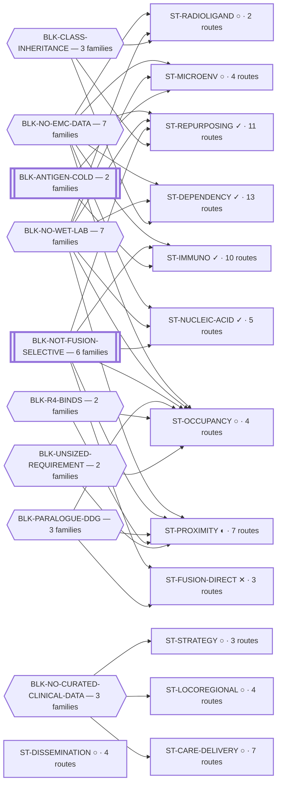

<!-- GENERATED FILE — DO NOT EDIT. Regenerate with:
     python3 systems/systems_check.py --write-views
     Source of truth: systems/graph/*.json -->

# L0 — the EMC research ecosystem

> Extraskeletal myxoid chondrosarcoma, driven by the EWSR1::NR4A3 fusion. One researcher, no wet
> lab, no funding for one — so every advance is either in-silico or publish-to-convince.
> **Nothing here asserts efficacy, safety, a therapeutic window or clinical readiness.**

**13 strategy families · 77 routes · 21 blockers · 28 technology dependencies.**

## The shape of the portfolio

What one screen has to carry is not the list — it is the **convergence**. Each family page states its own blockers correctly; only this shows how many families they span.

⚠ **This ranks by FAMILIES spanned. [What holds the portfolio down](#what-holds-the-portfolio-down) below ranks by ROUTES held, and the two orders differ** — a blocker can sit on many routes inside one family, or on one route in each of many. Both are real and they answer different questions: *how much work is stuck* versus *how much of the strategy is stuck*.

**Reading it.** A hexagon is a blocker with a named way out; a double-walled box is a **permanent** one — a fact about the biology that no technology retires. An arrow means *holds down*.

⚠ **11 further blocker(s) are NOT drawn here**, because each holds down exactly one family and belongs on that family's page. Drawing all 20 would render the portfolio as a hairball and bury the 9 that shape it. Every one of them is in [registers/blockers.md](registers/blockers.md).

## The landscape

| family | thesis | routes | state | role |
|---|---|---:|---|---|
| **[ST-PROXIMITY](L1-st-proximity.md)** Induced-proximity therapeutics | The NR4A3 ligand-binding domain does not need to be inhibited, only ENGAGED, because the therapeutic effect comes from what the molecule recruits rath… | 7 | ◐ blocked · computed | hedge |
| **[ST-OCCUPANCY](L1-st-occupancy.md)** Direct small-molecule engagement of the NR4A3 ligand-binding domain | If the ligand-binding domain is a functional handle in the chimera, then occupying it is enough, and the entire ternary-assembly problem disappears. T… | 4 | ○ blocked · scoped | hedge |
| **[ST-FUSION-DIRECT](L1-st-fusion-direct.md)** Targeting the fusion protein's other domains | The fusion has more than one surface. If a different domain is more tractable or more selective, the paralogue problem might be sidestepped rather tha… | 3 | ✕ closed · scoped | closed_but_informative |
| **[ST-NUCLEIC-ACID](L1-st-nucleic-acid.md)** Nucleic-acid and genetic therapeutics | The junction is the only truly tumour-exclusive feature of this disease. A molecule that reads sequence rather than shape can discriminate perfectly, … | 5 | ✓ blocked · computed | hedge |
| **[ST-IMMUNO](L1-st-immuno.md)** Immunotherapy and antigen-directed approaches | If a tumour-restricted antigen exists, the discrimination problem is solved by the immune system rather than by chemistry, and potency comes free. The… | 10 | ✓ blocked · computed | hedge |
| **[ST-REPURPOSING](L1-st-repurposing.md)** Repurposing approved and late-stage agents | An approved drug skips discovery, synthesis, toxicology and most of the cost of being right. For an ultra-rare disease with no targeted agent, a mecha… | 11 | ✓ blocked · computed | cheap_option |
| **[ST-RADIOLIGAND](L1-st-radioligand.md)** Radioligand and theranostic approaches | A radioligand does not need the target to be a driver, only to be present and accessible. That decouples the therapy entirely from the fusion biology … | 2 | ○ blocked · concept | cheap_option |
| **[ST-DEPENDENCY](L1-st-dependency.md)** Synthetic lethality and dependency | You do not have to drug the driver if the driver has made something else indispensable. A synthetic-lethal partner can be an ordinary, already-druggab… | 13 | ✓ blocked · computed | hedge |
| **[ST-DISSEMINATION](L1-st-dissemination.md)** Methods and publication as an outcome in itself | A computation-only program with no wet lab advances a disease in exactly two ways: by producing a result someone else tests, or by producing methodolo… | 4 | ○ ready · scoped | dissemination |
| **[ST-MICROENV](L1-st-microenv.md)** The tumour microenvironment and matrix as the target | The matrix is this disease's defining phenotype and the portfolio's prose has treated it almost entirely as an obstacle to delivery. It is also a manu… | 4 | ○ ready · concept | hedge |
| **[ST-LOCOREGIONAL](L1-st-locoregional.md)** Locoregional, physical and radiation-based treatment | Every other family here tries to buy selectivity with chemistry. A beam, a perfusion circuit or a needle buys it with geometry, which is a discriminat… | 4 | ○ ready · concept | hedge |
| **[ST-STRATEGY](L1-st-strategy.md)** Treatment strategy, scheduling and reachability | For a disease measured in years, when and in what order the existing agents are given may matter as much as which they are — and none of that has been… | 3 | ○ ready · concept | cheap_option |
| **[ST-CARE-DELIVERY](L1-st-care-delivery.md)** Care delivery, diagnosis and the determinants of survival | Every other family here asks what to GIVE an EMC patient. None asks what determines how long an EMC patient lives now — and in a disease where no syst… | 7 | ○ ready · concept | cheap_option |

## Where the portfolio ends

Every route above ends in a paper. With no wet lab and no clinic, the published record is the only channel by which any of this reaches a patient — so an endpoint is a property of a route rather than an afterthought, and one that cannot be named is an activity rather than an option. Full register, with what each paper would claim: [L3-publications.md](L3-publications.md).

⚠ **This counts DELIVERABLES, not progress.** `drafted` means a file exists and says nothing about whether the science in it holds — that is the route pages and their instruments.

| state | endpoints | routes feeding them |
|---|---:|---:|
| ○ `unwritten` | 3 | 10 |
| ◔ `outlined` | 4 | 14 |
| ◐ `drafted` | 24 | 51 |
| ◉ `posted_preprint` | 1 | 2 |

## What holds the portfolio down

A blocker on one route is a risk. A blocker on fifteen is the portfolio's shape.

⚠ **Ranked by ROUTES held — a different axis from the diagram above**, which ranks by families spanned. The top of this list and the top of that one are not the same blocker, and neither is wrong: `BLK-NO-EMC-DATA` holds the most ROUTES while sitting in fewer FAMILIES than `BLK-NO-WET-LAB`. Read the diagram for *how much of the strategy is stuck* and this table for *how much work is stuck*.

| blocker | kind | routes held | families | retired by |
|---|---|---:|---:|---|
| **BLK-NO-EMC-DATA** | `insufficient_data` | 38 | 7 | `TECH-EMC-EXPRESSION-DATA`, `TECH-VIRTUAL-CELL` |
| **BLK-NO-WET-LAB** | `requires_external_collaboration` | 16 | 7 | `TECH-CLOUD-WET-LAB`, `TECH-EMC-MODEL-ACCESS` |
| **BLK-NOT-FUSION-SELECTIVE** | `fundamental_biological_limit` | 14 | 6 | *permanent — nothing* |
| **BLK-ANTIGEN-COLD** | `fundamental_biological_limit` | 10 | 2 | *permanent — nothing* |
| **BLK-NO-CURATED-CLINICAL-DATA** | `insufficient_data` | 9 | 3 | `TECH-RECONSTRUCTED-IPD` |
| **BLK-PARALOGUE-DDG** | `requires_better_simulation_accuracy` | 9 | 3 | `TECH-FE-CRYPTIC-POCKET` |
| **BLK-R4-BINDS** | `requires_wet_lab` | 8 | 2 | `TECH-EMC-MODEL-ACCESS` |
| **BLK-CLASS-INHERITANCE** | `insufficient_data` | 5 | 3 | `TECH-VIRTUAL-CELL` |
| **BLK-TERNARY-GEOMETRY** | `requires_better_structure_prediction` | 5 | 1 | `TECH-COFOLD-ASSEMBLY`, `TECH-E3-RECRUITER-STRUCTURE`, `TECH-OBSERVED-CRL` |
| **BLK-INDUCED-COMPLEX** | `requires_better_structure_prediction` | 3 | 1 | `TECH-COFOLD-ASSEMBLY` |
| **BLK-UNSIZED-REQUIREMENT** | `requires_wet_lab` | 3 | 2 | *an action we can take* |
| **BLK-VECTOR-DELIVERY** | `requires_future_technology` | 3 | 1 | `TECH-VECTOR-DELIVERY` |
| **BLK-REACH-CATEGORICAL** | `scientific_uncertainty` | 2 | 1 | `TECH-EXPOSURE-CRITERION` |
| **BLK-DELIVERY** | `requires_future_technology` | 1 | 1 | `TECH-OLIGO-DELIVERY` |
| **BLK-ENDPOINT-MD** | `no_known_assay` | 1 | 1 | `TECH-E1-POWERED` |
| **BLK-FUNCTIONAL-ACTIONABILITY** | `requires_wet_lab` | 1 | 1 | `TECH-CLOUD-WET-LAB`, `TECH-EMC-MODEL-ACCESS` |
| **BLK-PARALOGUE-CONTROL** | `no_known_assay` | 1 | 1 | `TECH-NONCOVALENT-PARALOGUE-CONTROL` |
| **BLK-REGISTRY-DUA** | `requires_authorization` | 1 | 1 | *an action we can take* |
| **BLK-SELECTIVITY-CONTROL-UNAUTHORIZED** | `requires_authorization` | 1 | 1 | *an action we can take* |
| **BLK-TCIP-INTERFACE-FLOOR** | `insufficient_data` | 1 | 1 | *an action we can take* |

## Highest-leverage things to wait for

Ordered by how much comes back if they land. Full register: [registers/technologies.md](registers/technologies.md).

| fan-out | technology | state | expected | basis |
|---:|---|---|---|---|
| 14 | **TECH-EMC-MODEL-ACCESS** | `absent` | 2029 | `speculative` |
| 11 | **TECH-FE-CRYPTIC-POCKET** | `absent` | 2028 | `extrapolated` |
| 10 | **TECH-EMC-EXPRESSION-DATA** | `early_signals` | 2029 | `speculative` |
| 10 | **TECH-RECONSTRUCTED-IPD** | `partially_landed` | 2026H2 | `evidence_based` |
| 9 | **TECH-COFOLD-ASSEMBLY** | `partially_landed` | 2027 | `evidence_based` |
| 7 | **TECH-CHEAP-ENSEMBLE** | `partially_landed` | 2027 | `evidence_based` |
| 7 | **TECH-POSE-CONVERGENCE** | `absent` | 2028 | `extrapolated` |
| 7 | **TECH-CLOUD-WET-LAB** | `early_signals` | 2029 | `extrapolated` |
| 6 | **TECH-EXPOSURE-CRITERION** | `absent` | 2027H2 | `extrapolated` |
| 6 | **TECH-VIRTUAL-CELL** | `early_signals` | 2028 | `extrapolated` |

## Drill down

- **L1** — a strategy family: `L1-<family>.md`
- **L2** — a single route: `L2-<route>.md`
- **L3** — [publications](L3-publications.md): the endpoint every route is FOR, written or not. ⚠ *Superseded, retained: “**L3 · L4** — publications and the experiments that feed them are DOCUMENTS”, on the grounds that copying a file's title into the graph makes a second home for it. That reasoning holds and is why a written endpoint still carries no title here — but it covered only papers that EXIST, and an unwritten one has no file to be a document in. Under it, a route with no endpoint and a route whose paper is not written yet rendered identically, across a portfolio where the second is the common case.*
- **L4** — the experiments that feed them are still DOCUMENTS, declaring their level in their own frontmatter, so their count is reported by `systems_check --check` (`[D11]`) and is deliberately NOT pinned in any committed file — pinning it would turn every new memo into a red build. The instruments that produce their evidence ARE modelled: [registers/instruments.md](registers/instruments.md).
- **L5** — [the evidence base](L5-evidence-base.md): every object, citation, artifact and pinned claim, each showing what rests on it
- **Registers** — [lanes](registers/lanes.md) *(executed work and how it ended)* · [blockers](registers/blockers.md) · [technologies](registers/technologies.md) · [instruments](registers/instruments.md)
- **Cross-cutting** — [methods index](methods-index.md) · [readiness](readiness.md) · [requirements](registers/requirements.md) · [**paper strength**](paper-strength.md) *(which endpoint is strongest, ranked — read this before asking)*
- **Multi-year** — [the roadmap](roadmap-5yr.md): scientific, technology, AI-capability and lab-capability milestones, and when blocked work becomes revisitable
- **Architecture** — [../ARCHITECTURE.md](../ARCHITECTURE.md) · [../CONVENTIONS.md](../CONVENTIONS.md) · [../MAINTENANCE.md](../MAINTENANCE.md) · [../MIGRATION.md](../MIGRATION.md)
