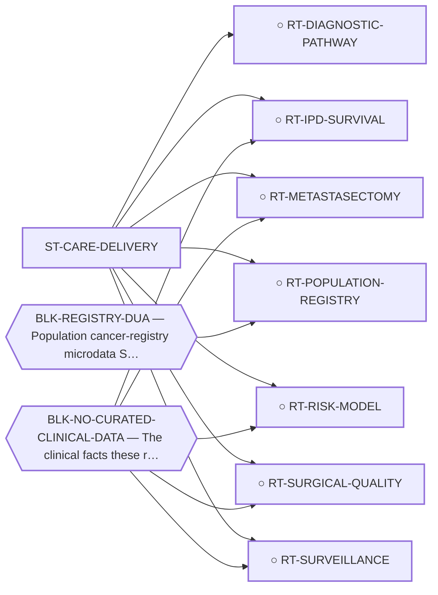

<!-- GENERATED FILE — DO NOT EDIT. Regenerate with:
     python3 systems/systems_check.py --write-views
     Source of truth: systems/graph/*.json -->

# ST-CARE-DELIVERY — Care delivery, diagnosis and the determinants of survival

**Thesis.** Every other family here asks what to GIVE an EMC patient. None asks what determines how long an EMC patient lives now — and in a disease where no systemic agent has a demonstrated survival benefit, that is decided by whether the diagnosis was right before the operation, whether the operation cleared the tumour, whether the recurrence was found while it was still resectable, and how long anyone kept looking. The largest published survival association in EMC is an operation, and until this family existed no route on the board covered it.

**Portfolio role:** `cheap_option` · **state:** ○ ready · concept · confidence low

> Minted 2026-08-09. ⭐ THE OMISSION WAS STRUCTURAL AND THE CENSUS PROVES IT RATHER THAN MERELY FAILING TO CATCH IT: the 217-class modality census sorts into four bands — drug_mechanism, delivery_and_conjugate, physical_locoregional, strategy_and_architecture — every one of which is a taxonomy of INTERVENTIONS, and it grades MOD-SURGERY ('Wide local excision and metastasectomy') and MOD-WATCHFUL-WAITING as `in_clinical_use`, i.e. incumbent arsenal, excluded from grading. A census built to enumerate NEW modalities cannot see variance inside the existing one. This is the same instrument-shape failure the 2026-08-07 sweep diagnosed in itself, one level up: that sweep widened the MODALITY space and never looked past modality — all ten of its sweeps name an agent, a target or a schedule.

## What this family may NOT be used to claim

- Nothing in this family produces a new agent, so its ceiling is bounded by what the existing arsenal can do — and its floor is that the arsenal is already being used, so the gain is variance-reduction rather than a new option.
- Every route here ends in an observational or modelled argument. No randomised trial will ever settle a surgical-margin or surveillance-interval question in a disease this rare, so the limits of the design must travel with every claim.
- Reconstructed and registry data are re-expressions of published records, never new patients — they inherit every selection and publication bias of the series they came from and can correct none of it.
- Treatment associations in observational sarcoma data are dominated by confounding by indication, which runs in the direction that makes therapy look harmful; a route here that reports an unadjusted hazard has produced an artefact, not a result.
- Nothing in this family asserts efficacy, safety, a therapeutic window or clinical readiness.

## Is this family blocked as a unit, or route by route?

**Reading it.** ⭐ **No blocker points at the family node**, and that is the finding: the routes here are *not* held down by one shared thing. They are blocked individually, for different reasons — so retiring any one blocker frees some routes and not others, and there is no single unlock for the family.

*What this family RETIRES for the portfolio is listed below rather than drawn — it is a property of the family, not an edge between these nodes.*

## Routes

| route | state | maturity | readiness today | ends in | next action |
|---|---|---|---|---|---|
| **[RT-DIAGNOSTIC-PATHWAY](L2-rt-diagnostic-pathway.md)** The diagnosis itself — code contamination and a name that misleads | ○ ready | computed | `internal_note` | [PUB-EMC-CLASSIFICATION](L3-publications.md) ◐ *contributing* | Write the classification note around the CODING half, which needs nobody's cooperation: three published readin |
| **[RT-IPD-SURVIVAL](L2-rt-ipd-survival.md)** Patient-level survival reconstructed from published Kaplan-Meier curves | ○ ready | computed | `internal_note` | [PUB-IPD-SURVIVAL](L3-publications.md) ○ *contributing* | Digitize the Kaplan-Meier curve and numbers-at-risk table of the largest open-access EMC series and admit or r |
| **[RT-METASTASECTOMY](L2-rt-metastasectomy.md)** Pulmonary metastasectomy as a decision rather than a modality | ○ ready | concept | `internal_note` | [PUB-CARE-DELIVERY](L3-publications.md) ○ *contributing* | Curate metastatic site and lesion burden from the open-access EMC series and size the metastasectomy-eligible  |
| **[RT-POPULATION-REGISTRY](L2-rt-population-registry.md)** Population cancer-registry microdata (SEER, NCDB) | ○ blocked | concept | `internal_note` | [PUB-EMC-CLASSIFICATION](L3-publications.md) ◐ *contributing* | Do NOT seek access for THIS route yet — a contaminated denominator is worse than no denominator. ⚠ But note wh |
| **[RT-RISK-MODEL](L2-rt-risk-model.md)** A prognostic risk model for EMC | ○ ready | concept | `internal_note` | [PUB-CARE-DELIVERY](L3-publications.md) ○ *contributing* | Wait on RT-IPD-SURVIVAL, and while waiting record which published EMC series print stratified curves at all —  |
| **[RT-SURGICAL-QUALITY](L2-rt-surgical-quality.md)** The first operation — margin status, unplanned excision and treatment setting | ○ ready | concept | `internal_note` | [PUB-CARE-DELIVERY](L3-publications.md) ○ *contributing* | Extract margin status, primary site and treatment setting from the open-access EMC series already cited in the |
| **[RT-SURVEILLANCE](L2-rt-surveillance.md)** Surveillance duration and interval as the intervention | ○ ready | concept | `internal_note` | [PUB-CARE-DELIVERY](L3-publications.md) ○ *contributing* | Wait on RT-IPD-SURVIVAL for the recurrence hazard, then build the state-transition model — the summary figures |
## Best next action

Digitize the Kaplan-Meier curves and numbers-at-risk tables of the open-access EMC series already cited here and run them through research/modalities/emc_ipd_survival.py — the instrument is built and its known-answer control passes; only the curves are missing.

*Cost:* $0

[← L0](L0-ecosystem.md)
