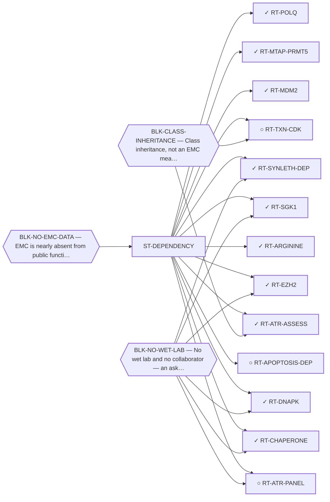

<!-- GENERATED FILE — DO NOT EDIT. Regenerate with:
     python3 systems/systems_check.py --write-views
     Source of truth: systems/graph/*.json -->

# ST-DEPENDENCY — Synthetic lethality and dependency

**Thesis.** You do not have to drug the driver if the driver has made something else indispensable. A synthetic-lethal partner can be an ordinary, already-druggable protein, which removes both the selectivity problem and the undruggability problem at once.

**Portfolio role:** `hedge` · **state:** ✓ blocked · computed · confidence low

> The family that would most cleanly bypass everything blocking the lead family, and the one most starved by the data blocker: it is the family that most needs functional-genomics data EMC does not have.

## What this family may NOT be used to claim

- The dependency transfer prior came back negative on the available data — a measured premise, revivable only by EMC-specific data.
- One route rests on class inheritance: no NR4A3 fusion has been tested for the phenotype it assumes.
- There is one EMC model in public dependency data, with no CRISPR data, so this family's in-silico half is bounded by a sample size of one.

## Is this family blocked as a unit, or route by route?

**Reading it.** 1 blocker point at the FAMILY node: every route here inherits it, so the family stands or falls as a unit on that. The rest point at individual routes.

*What this family RETIRES for the portfolio is listed below rather than drawn — it is a property of the family, not an edge between these nodes.*

## Routes

| route | state | maturity | readiness today | ends in | next action |
|---|---|---|---|---|---|
| **[RT-APOPTOSIS-DEP](L2-rt-apoptosis-dep.md)** Anti-apoptotic dependency beyond BCL-2 (MCL-1, BCL-xL) | ○ ready | computed | `internal_note` | [PUB-BIOMARKER-DEP](L3-publications.md) ◐ *contributing* | Put an MCL-1/BCL-xL arm in front of the group holding the two EMC models, alongside the PRMT5 ask. |
| **[RT-ARGININE](L2-rt-arginine.md)** Arginine deprivation (ASS1-silenced tumours) | ✓ parked | computed | `internal_note` | [PUB-BIOMARKER-DEP](L3-publications.md) ◐ *contributing* | Report it as a closed line in the census paper's negative half. |
| **[RT-ATR-ASSESS](L2-rt-atr-assess.md)** The in-silico ATR vulnerability assessment (the computed half) | ✓ ready | computed | `preprint` | [PUB-ATR](L3-publications.md) ◐ *primary* | Publish the assessment with the class-inheritance limit stated inside it, and pair it with the cell-panel ask. |
| **[RT-ATR-PANEL](L2-rt-atr-panel.md)** The ATR-inhibitor cell panel in EMC lines (the ask) | ○ blocked | scoped | `experimental_proposal` | [PUB-ATR-PANEL-ASK](L3-publications.md) ◐ *primary* | Send the ask with the assessment. It is the strongest taker-fit in the portfolio. |
| **[RT-CHAPERONE](L2-rt-chaperone.md)** Chaperone dependency of the chimera (HSP90 and co-chaperones) | ✓ blocked | computed | `internal_note` | [PUB-TXN-DEPENDENCY](L3-publications.md) ◐ *primary* | Fetch IntAct/BioGRID dataset IM-22301, the deposited interaction set of the published human chaperone-interact |
| **[RT-DNAPK](L2-rt-dnapk.md)** DNA-PK inhibition as an indirect route to the fusion protein | ✓ blocked | scoped | `internal_note` | [PUB-KINASE-LEADS](L3-publications.md) ◔ *contributing* | Read the queued sarcoma dependency prior for the kinase and its two partner subunits, then report the lead wit |
| **[RT-EZH2](L2-rt-ezh2.md)** EZH2 / PRC2 inhibition | ✓ parked | computed | `internal_note` | [PUB-BIOMARKER-DEP](L3-publications.md) ◐ *contributing* | Report it as a closed line alongside the other biomarker-selected exclusions. |
| **[RT-MDM2](L2-rt-mdm2.md)** MDM2 antagonism (p53 reactivation in a quiet genome) | ✓ parked | computed | `internal_note` | [PUB-BIOMARKER-DEP](L3-publications.md) ◐ *contributing* | Report the negative; the quiet-genome inference did not survive its own test. |
| **[RT-MTAP-PRMT5](L2-rt-mtap-prmt5.md)** PRMT5 / MAT2A synthetic lethality (MTAP co-deletion) | ✓ ready | computed | `preprint` | [PUB-MTAP-PRMT5](L3-publications.md) ◐ *primary* | Post the preprint and put the MTAP stain in front of a group holding EMC archival material. |
| **[RT-POLQ](L2-rt-polq.md)** POLθ inhibition (microhomology-mediated end joining) | ✓ parked | computed | `internal_note` | [PUB-BIOMARKER-DEP](L3-publications.md) ◐ *contributing* | Report the alt-EJ elevation alongside the negative rather than burying it — it is the one half of this class's |
| **[RT-SGK1](L2-rt-sgk1.md)** SGK1 inhibition | ✓ blocked | computed | `internal_note` | [PUB-KINASE-LEADS](L3-publications.md) ◔ *contributing* | Read which other kinases phosphorylate the substrate, to size how much of the signal SGK1 could account for. |
| **[RT-SYNLETH-DEP](L2-rt-synleth-dep.md)** Synthetic-lethal / dependency partner (BRD9 / ncBAF via EWSR1-prion→BAF) | ✓ parked | computed | `internal_note` | [PUB-SYNLETH](L3-publications.md) ◐ *primary* | Keep parked on data with the transfer-prior negative stated as data-bounded, not as a biological finding. |
| **[RT-TXN-CDK](L2-rt-txn-cdk.md)** Transcriptional CDK dependency (CDK7, CDK9, CDK12/13) | ○ parked | computed | `internal_note` | [PUB-TXN-DEPENDENCY](L3-publications.md) ◐ *primary* | Report it as a closed line: elevated and pan-essential is not an opportunity. |

## Family-level bets — blockers EVERY route here inherits

If one of these is never retired, the whole family is dead. That is a different risk from any
single route failing, and it is only visible at this level.

- **BLK-NO-EMC-DATA** (`insufficient_data`) — EMC is nearly absent from public functional-genomics data (one DepMap line, n = 1, no CRISPR data)

## What this family buys the portfolio — blockers it RETIRES

- **BLK-PARALOGUE-DDG** (`requires_better_simulation_accuracy`) — The paralogue ΔΔG margin — selectivity that reduces to exp(−ΔΔG/RT)
- **BLK-R4-BINDS** (`requires_wet_lab`) — R4 — nothing is known to bind the cryptic pocket at all
- **BLK-TERNARY-GEOMETRY** (`requires_better_structure_prediction`) — Ternary geometry — assembly, E3, exit vector, ubiquitin transfer

## Best next action

Keep the computed vulnerability assessment as a standalone deliverable with its limit stated inside it; it does not need the cell panel to be publishable.

*Cost:* $0

[← L0](L0-ecosystem.md)
