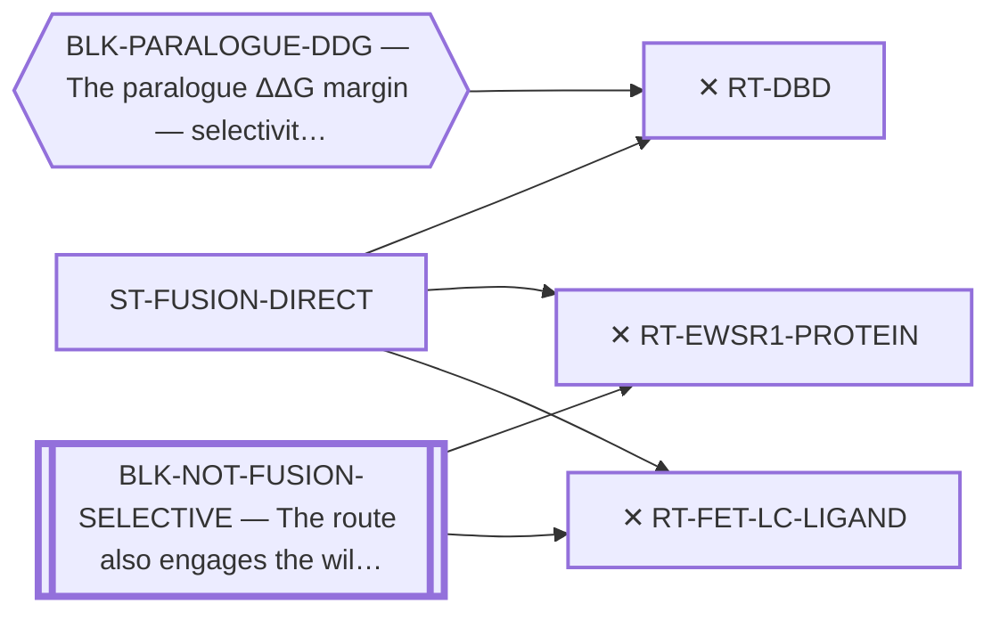

<!-- GENERATED FILE — DO NOT EDIT. Regenerate with:
     python3 systems/systems_check.py --write-views
     Source of truth: systems/graph/*.json -->

# ST-FUSION-DIRECT — Targeting the fusion protein's other domains

**Thesis.** The fusion has more than one surface. If a different domain is more tractable or more selective, the paralogue problem might be sidestepped rather than solved.

**Portfolio role:** `closed_but_informative` · **state:** ✕ closed · scoped · confidence high

> Every route in this family is PERMANENTLY closed, and the family is kept because knowing why is load-bearing: each one relocates the selectivity problem onto something worse, and the reasons are facts about the objects rather than limits of today's methods. A future capability does not reopen any of them.

## What this family may NOT be used to claim

- The closures here are definitional or arithmetic over a fixed fact. They may carry no revival trigger and must never appear on a watch list.
- That a route is closed says nothing about whether the disease can be treated — only that this surface is not the way.

## Is this family blocked as a unit, or route by route?

**Reading it.** ⭐ **No blocker points at the family node**, and that is the finding: the routes here are *not* held down by one shared thing. They are blocked individually, for different reasons — so retiring any one blocker frees some routes and not others, and there is no single unlock for the family.

*What this family RETIRES for the portfolio is listed below rather than drawn — it is a property of the family, not an edge between these nodes.*

## Routes

| route | state | maturity | readiness today | next action |
|---|---|---|---|---|
| **[RT-DBD](L2-rt-dbd.md)** Target the DBD / DNA binding | ✕ closed | computed | `internal_note` | Nothing. Cite the closure. |
| **[RT-EWSR1-PROTEIN](L2-rt-ewsr1-protein.md)** Target the EWSR1 half at the protein level | ✕ closed | scoped | `internal_note` | Nothing. Cite the closure when the idea resurfaces. |
| **[RT-FET-LC-LIGAND](L2-rt-fet-lc-ligand.md)** A ligand for the shared FET low-complexity half | ✕ closed | scoped | `internal_note` | Nothing. Cite the closure. |
## What this family buys the portfolio — blockers it RETIRES

- **BLK-PARALOGUE-DDG** (`requires_better_simulation_accuracy`) — The paralogue ΔΔG margin — selectivity that reduces to exp(−ΔΔG/RT)

## Best next action

Nothing. This family is closed on facts about the objects; the correct action is to cite the reasoning when the ideas resurface, which they do.

*Cost:* $0

[← L0](L0-ecosystem.md)
