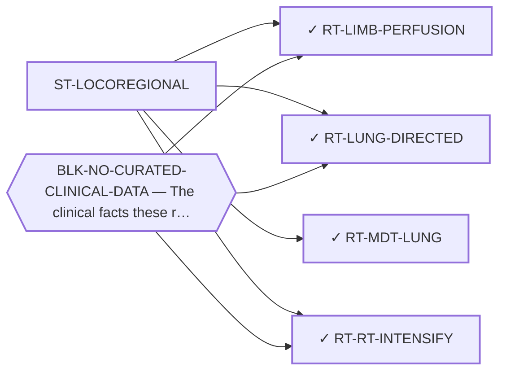

<!-- GENERATED FILE — DO NOT EDIT. Regenerate with:
     python3 systems/systems_check.py --write-views
     Source of truth: systems/graph/*.json -->

# ST-LOCOREGIONAL — Locoregional, physical and radiation-based treatment

**Thesis.** Every other family here tries to buy selectivity with chemistry. A beam, a perfusion circuit or a needle buys it with geometry, which is a discrimination this disease's own natural history makes unusually available: it is extremity-primary, lung-metastasis-dominant, and slow enough that local control has time to matter.

**Portfolio role:** `hedge` · **state:** ○ ready · concept · confidence low

> Minted 2026-08-09 from the modality census. The 2026-08-07 sweep named this as one of four categories structurally invisible to every prior search here -- not rejected, never queried -- and a category nothing could be filed under is a category that stays invisible.

## What this family may NOT be used to claim

- Anatomical selectivity works only for anatomically confined disease, so every route here is limited to a subset of patients whose size has not been established in this disease.
- The portfolio contains no physical intervention of any kind, so it holds no instrument, no prior result and no reviewer competence in this family — the in-silico half of every route here is literature synthesis rather than computation.
- A modality dosed per unit volume but delivered per cell is penalised in a matrix-dominated tumour with few cells per unit volume, and that correction has already closed one route in this area.
- Nothing in this family asserts efficacy, safety, a therapeutic window or clinical readiness.

## Is this family blocked as a unit, or route by route?

**Reading it.** ⭐ **No blocker points at the family node**, and that is the finding: the routes here are *not* held down by one shared thing. They are blocked individually, for different reasons — so retiring any one blocker frees some routes and not others, and there is no single unlock for the family.

*What this family RETIRES for the portfolio is listed below rather than drawn — it is a property of the family, not an edge between these nodes.*

## Routes

| route | state | maturity | readiness today | ends in | next action |
|---|---|---|---|---|---|
| **[RT-LIMB-PERFUSION](L2-rt-limb-perfusion.md)** Isolated limb perfusion for extremity disease | ✓ blocked | computed | `internal_note` | [PUB-LOCOREGIONAL](L3-publications.md) ◔ *contributing* | Curate primary anatomical site from the open-access pooled series, then search the perfusion literature for my |
| **[RT-LUNG-DIRECTED](L2-rt-lung-directed.md)** Lung-directed local therapy (regional perfusion, inhaled delivery, ablation) | ✓ blocked | computed | `internal_note` | [PUB-LOCOREGIONAL](L3-publications.md) ◔ *contributing* | Re-curate metastatic site from the open-access primary reports of the pooled series — the one $0 step that con |
| **[RT-MDT-LUNG](L2-rt-mdt-lung.md)** Metastasis-directed ablative radiotherapy to lung metastases (SABR/SBRT) | ✓ ready | computed | `internal_note` | [PUB-LOCOREGIONAL](L3-publications.md) ◔ *contributing* | Do NOT write the concept paper as framed. Extract dose, fractionation, BED and local-control duration for ever |
| **[RT-RT-INTENSIFY](L2-rt-rt-intensify.md)** Radiotherapy intensification (particle therapy, brachytherapy, radiosensitisation, hyperthermia) | ✓ blocked | computed | `internal_note` | [PUB-LOCOREGIONAL](L3-publications.md) ◔ *contributing* | ⛔ Do NOT re-run the particle search or re-litigate the contradiction — both are done and recorded in ART-RT-CO |
## Best next action

Extract primary site, metastatic site and metastatic burden from the cohorts already curated in the clinical registry, and size the eligible fraction for each route here.

*Cost:* $0

[← L0](L0-ecosystem.md)
